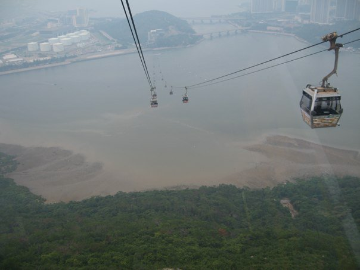
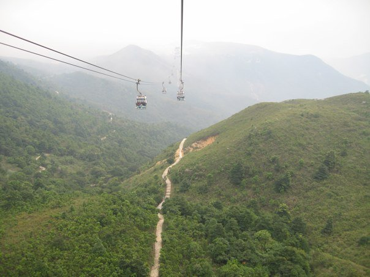
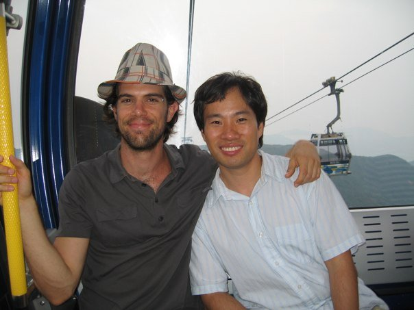
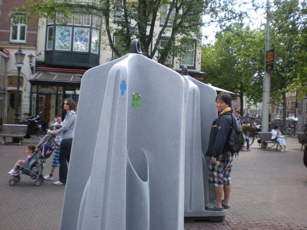

# 2009년 8월

[← 2009년](README.md)

### 8월 3일 (월) 08:01 · 📷 앨범: Yoav in HK (3장)

**이미지 캡션:** 이 사진은 케이블카에서 내려다본 풍경으로, 여러 대의 케이블카가 공중에 매달려 이동하고 있으며, 그 아래로는 넓은 바다와 해안선, 그리고 울창한 숲이 펼쳐져 있습니다. 케이블카 안에는 사람들이 타고 있는 것으로 보이지만, 자세한 모습은 보이지 않습니다. 배경에는 다리가 놓여 있고, 멀리 도시의 건물들이 희미하게 보이며, 해안가에는 하얀색의 큰 탱크들이 늘어서 있어 산업 단지임을 짐작하게 합니다. 바다는 옅은 회색빛을 띠고 있으며, 해안선 근처에는 갯벌로 보이는 넓은 지역이 드러나 있습니다. 숲은 짙은 녹색으로 우거져 있으며, 전체적으로 약간 흐릿한 날씨 속에서 차분하고 광활한 분위기를 자아냅니다.
 
**이미지 캡션:** 이 사진은 숲이 우거진 산악 지형을 가로지르는 케이블카의 시점에서 촬영되었습니다. 여러 대의 케이블카가 케이블을 따라 이동하고 있으며, 그중 일부는 산비탈을 따라 구불구불 이어지는 흙길 위를 지나고 있습니다. 산은 울창한 녹색 식물로 덮여 있으며, 일부 지역은 잔디로 덮여 있고 다른 지역은 나무로 덮여 있습니다. 하늘은 흐릿하고 희미하며, 멀리 있는 산들은 희미하게 보입니다. 전반적으로 사진은 평화롭고 고요한 분위기를 자아내며, 자연의 아름다움과 인간의 공학 기술이 조화를 이루고 있습니다. 사진 속에는 사람이 보이지 않으며, 보이는 텍스트도 없습니다.
 
**이미지 캡션:** 사진에는 두 명의 성인 남성이 케이블카 안에서 찍은 모습이 담겨 있습니다. 왼쪽 남성은 30대 초중반으로 보이며, 체크무늬 모자를 쓰고 있습니다. 짧은 갈색 머리에 수염이 있고, 옅은 미소를 띠고 있습니다. 회색 반팔 폴로 셔츠를 입고 있으며, 오른팔로 케이블카의 노란색 손잡이를 잡고 있습니다. 오른쪽 남성은 30대 초중반으로 보이며, 짧은 검은 머리에 옅은 미소를 띠고 있습니다. 하늘색과 흰색 줄무늬가 있는 반팔 셔츠를 입고 있으며, 왼쪽 남성의 어깨에 오른팔을 올리고 있습니다. 두 사람 모두 편안하고 즐거운 표정입니다. 배경에는 산과 케이블카가 보이며, 흐릿한 하늘이 펼쳐져 있습니다. 케이블카 내부에는 좌석과 손잡이, 환풍구로 보이는 격자무늬 패널이 보입니다. 전반적으로 여행 중인 두 친구의 즐거운 순간을 포착한 사진입니다.

> IMG_4129
> IMG_4144
> IMG_4198

### 8월 23일 (일) 15:08 · 📷 앨범: 21 Aug 2009 (1장)

**이미지 캡션:** 이 사진은 야외에 설치된 회색 소변기 부스 앞에 서 있는 두 명의 성인 남성을 보여줍니다. 왼쪽의 성인 남성은 긴 갈색 머리에 선글라스를 끼고 회색 후드티와 검은색 바지를 입고 있으며, 유모차를 밀고 있는 것으로 보입니다. 유모차 안에는 어린 여자아이가 앉아 있고, 그 뒤에는 줄무늬 티셔츠를 입은 어린 남자아이가 서 있습니다. 오른쪽의 성인 남성은 짧은 검은 머리에 노란색 목도리를 하고 파란색 재킷과 체크무늬 반바지를 입고 있으며, 배낭을 메고 카메라를 향해 미소를 짓고 있습니다. 배경에는 건물, 나무, 벤치, 자전거가 보이며, 거리에는 다른 사람들이 지나다니고 있습니다. 전반적으로 도시 거리의 일상적인 모습을 담고 있으며, 야외 소변기라는 다소 특이한 요소가 눈길을 끕니다.

> DSCN5960

### 8월 23일 (일) 15:14 · Saw most open public ...

Saw most open public ...

**이미지 캡션:** 이 사진은 야외에 설치된 회색 소변기 부스를 배경으로 하고 있으며, 한 성인 남성이 소변기 옆에 서서 카메라를 향해 미소 짓고 있다. 남성은 20대 후반에서 30대 초반으로 보이며, 검은색 재킷에 체크무늬 반바지를 입고 배낭을 메고 있다. 그의 표정은 밝고 여유로워 보인다. 사진 왼쪽에는 한 성인 여성이 유모차를 밀고 있으며, 유모차 안에는 어린 아이가 앉아 있다. 여성은 회색 후드티와 검은색 바지를 입고 선글라스를 착용하고 있다. 배경에는 나무가 우거진 거리와 건물들이 보이며, 몇몇 사람들이 벤치에 앉아 있거나 자전거를 타고 지나가는 모습도 보인다. 전체적으로 도시의 거리 풍경을 담고 있으며, 일상적인 순간을 포착한 듯한 분위기이다.

### 8월 23일 (일) 15:17 · found most open public ...

found most open public ...

**이미지 캡션:** 이 사진은 야외에 설치된 회색 소변기 부스 앞에 서 있는 성인 남성을 보여줍니다. 남성은 20대 후반에서 30대 초반으로 보이며, 검은색 재킷에 체크무늬 반바지를 입고 있으며, 등에는 배낭을 메고 있습니다. 그는 카메라를 향해 미소를 짓고 있으며, 발은 소변기 부스 아래 받침대에 올려져 있습니다. 배경에는 나무가 우거진 거리와 건물들이 보이며, 몇몇 사람들이 유모차를 끌고 지나가거나 벤치에 앉아 있습니다. 소변기 부스에는 파란색 남성 기호와 녹색 스티커가 붙어 있습니다. 전체적으로 평화롭고 일상적인 도시 풍경을 담고 있습니다.
