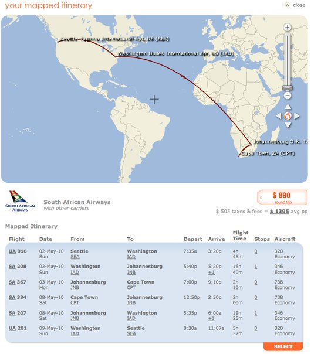

# 2009년 10월

[← 2009년](README.md)

### 10월 16일 (금) 21:08 · ordered Kindle (international version) a…

ordered Kindle (international version) and LED Cinema display!

### 10월 21일 (수) 00:12 · likes CardSnapLite on his new iPhone to …

likes CardSnapLite on his new iPhone to manage all business cards.

### 10월 25일 (일) 16:17 · How are you? I miss you and the mission …

How are you? I miss you and the mission team so much. Any plan to come to HK? God bless you.

### 10월 25일 (일) 16:17 · ↪ How are you? I miss you and the mission …

*다른 프로필에 남긴 글*

How are you? I miss you and the mission team so much. Any plan to come to HK? God bless you.

### 10월 30일 (금) 00:10 · has 100 friends!

has 100 friends!

**이미지 캡션:** 이 사진은 페이스북 프로필의 친구 목록 일부를 보여준다. 상단에는 'Friends'라는 제목과 함께 '100 friends'라는 문구, 그리고 'See All' 버튼이 있다. 그 아래에는 6명의 친구 프로필 사진과 이름이 나열되어 있다. 왼쪽 상단부터 시계 방향으로, 첫 번째는 검은색 안경을 쓴 동양인 남성으로, 검은색 상의를 입고 있으며 차분한 표정이다. 두 번째는 검은색 셔츠를 입고 미소를 짓고 있는 동양인 남성이다. 세 번째는 안경을 쓰고 밝게 웃고 있는 동양인 남성이다. 네 번째는 갈색 재킷을 입고 미소를 짓고 있는 백인 남성이다. 다섯 번째는 회색 실루엣으로 처리된 프로필 사진으로, 이름만 'Yusung Kim'이라고 표시되어 있어 성별이나 외모를 알 수 없다. 여섯 번째는 모자를 쓰고 실내에서 찍은 듯한 사진으로, 백인 남성으로 보이며 약간의 미소를 띠고 있다. 전반적으로 밝고 캐주얼한 분위기이며, 친구들과의 관계를 보여주는 온라인 프로필의 일부이다.

### 10월 30일 (금) 00:48 · is looking for tickets from Seattle to S…

is looking for tickets from Seattle to South Africa in May 2010.

**이미지 캡션:** 이 사진은 남아프리카 항공의 항공편 일정으로, 세계 지도를 배경으로 시애틀에서 출발하여 워싱턴을 거쳐 요하네스버그와 케이프타운을 오가는 여정을 보여줍니다. 지도에는 각 도시의 위치와 항공편 경로가 붉은 선으로 표시되어 있으며, 확대/축소 및 이동을 위한 컨트롤도 함께 나타납니다. 화면 하단에는 항공편 번호, 날짜, 출발지 및 도착지, 출발 및 도착 시간, 비행 시간, 경유 횟수, 항공기 종류 등의 상세 정보가 표로 정리되어 있습니다. 총 요금은 890달러이며, 세금 및 수수료를 포함하면 1인당 평균 1395달러입니다. 전반적으로 여행 계획을 확인하고 예약하는 데 사용되는 웹페이지의 일부로 보입니다.

### 10월 30일 (금) 02:41 · It is still 24C (75F) in Hong Kong.

It is still 24C (75F) in Hong Kong.
