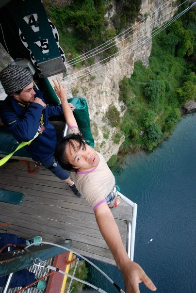
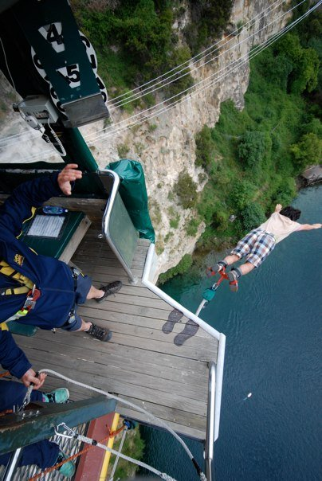

# 2009년 11월

[← 2009년](README.md)

### 11월 5일 (목) 08:26 · Brendan Murphy is giving us a talk today…

Brendan Murphy is giving us a talk today in HK!

### 11월 21일 (토) 18:59 · 📷 앨범: BungyJump@New Zealand (2장)

**이미지 캡션:** 두 명의 성인 남성이 절벽 가장자리에 서서 번지 점프를 준비하고 있다. 한 남성은 회색과 검은색 줄무늬 비니를 쓰고 파란색 재킷을 입고 있으며, 다른 남성은 베이지색 티셔츠와 체크무늬 반바지를 입고 있다. 두 사람 모두 긴장되면서도 흥분된 표정을 짓고 있으며, 번지 점프를 앞두고 있는 상황이다. 배경에는 푸른 강과 울창한 녹음이 우거진 절벽이 펼쳐져 있어 아찔한 높이를 실감하게 한다. 나무로 된 발판과 번지 점프 장비들이 보이며, 절벽 위에는 '4'와 '5' 숫자가 적힌 녹색 표지판이 있다. 전체적으로 스릴 넘치고 모험적인 분위기를 자아낸다.
 
**이미지 캡션:** 이 사진은 절벽 가장자리에 있는 나무 플랫폼에서 촬영되었으며, 한 성인 남성이 번지 점프를 하고 있다. 남성은 옅은 베이지색 반팔 셔츠와 체크무늬 반바지를 입고 있으며, 발목에는 번지 점프용 로프가 연결되어 있다. 그의 팔은 양옆으로 뻗어 있고, 몸은 물 위로 기울어져 있다. 배경에는 푸른 물이 흐르는 강과 울창한 녹색 식물로 뒤덮인 가파른 절벽이 보인다. 플랫폼에는 두 명의 다른 사람이 서 있는데, 한 명은 파란색 재킷과 바지를 입고 안전 장비를 착용하고 있으며, 다른 한 명은 그의 발만 보인다. 플랫폼에는 '4'와 '5' 숫자가 적힌 녹색 표지판과 함께 번지 점프 장비들이 보인다. 사진은 역동적이고 스릴 넘치는 순간을 포착하고 있으며, 번지 점프의 짜릿함과 자연의 웅장함을 동시에 보여준다.

> TBNZ_TBNZ_2009_11_21_C1045_2331
> TBNZ_TBNZ_2009_11_21_C1045_2338

### 11월 24일 (화) 19:26 · Very glad to see u here. I miss you and …

Very glad to see u here. I miss you and yunmi a lot.

### 11월 24일 (화) 19:26 · ↪ Very glad to see u here. I miss you and …

*다른 프로필에 남긴 글*

Very glad to see u here. I miss you and yunmi a lot.

### 11월 27일 (금) 08:32 · is happy to have Andreas Zeller and Andr…

is happy to have Andreas Zeller and Andrzej Wasylkowski at HKUST today.
