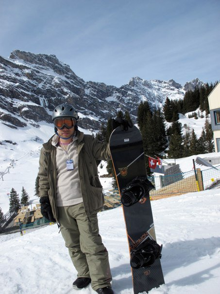
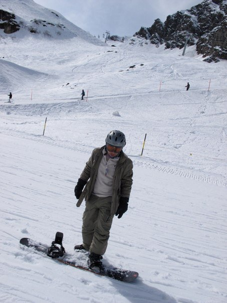
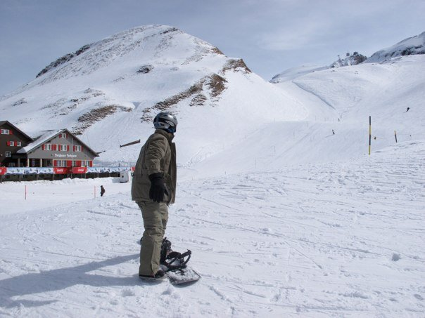
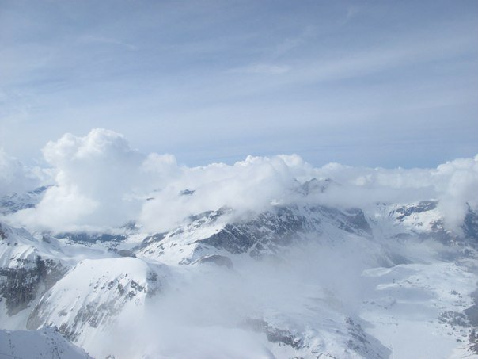

# 2010년 3월

[← 2010년](README.md)

### 3월 27일 (토) 17:59 · 📷 앨범: Snowboarding in Swiss Alps (4장)

**이미지 캡션:** 눈 덮인 산을 배경으로 스노보드를 들고 서 있는 성인 남성이 보인다. 남성은 30대 후반에서 40대 초반으로 추정되며, 회색 헬멧과 주황색 고글을 착용하고 있다. 옅은 베이지색 상의 위에 카키색 점퍼를 입고 있으며, 카키색 바지와 검은색 신발을 신고 있다. 얼굴은 약간 굳어 있지만, 전반적으로 편안한 표정이다. 그는 스노보드를 오른손으로 잡고 있으며, 왼손은 장갑을 끼고 있다. 배경에는 눈 덮인 험준한 산봉우리와 소나무 숲이 펼쳐져 있고, 스키 리프트와 건물도 보인다. 날씨는 맑고 화창하며, 눈이 많이 쌓여 있어 겨울 스포츠를 즐기기에 좋은 환경이다. 스노보드에는 '151'이라는 숫자가 새겨져 있다. 전반적으로 겨울 산에서 스노보드를 타기 전의 설렘과 여유로운 분위기를 느낄 수 있다.있어 겨울 스포츠를 즐기기에 좋은 환경이다. 스노보드에는 '151'이라는 숫자가 새겨져 있다. 전반적으로 겨울 산에서 스노보드를 타기 전의 설렘과 여유로운 분위기를 느낄 수 있다.
 
**이미지 캡션:** 눈 덮인 산비탈에서 스노보드를 타고 있는 성인 남성이 보인다. 그는 30대 후반에서 40대 초반으로 추정되며, 회색 헬멧과 선글라스를 착용하고 있다. 옅은 회색 상의 위에 카키색 재킷을 입고 있으며, 카키색 바지와 검은색 장갑을 끼고 있다. 그의 표정은 약간 긴장된 듯 보이지만, 스노보드를 타기 위해 준비된 모습이다. 스노보드는 검은색이며, 발이 고정되어 있다. 배경에는 눈 덮인 산과 스키 리프트가 보이며, 몇몇 스키어들이 멀리서 슬로프를 내려오고 있다. 슬로프에는 스키 자국과 함께 노란색 표지 기둥들이 세워져 있다. 전체적으로 맑은 날씨에 스키장에서 스노보드를 즐기는 활동적인 분위기이다.져 있다. 전체적으로 맑은 날씨에 스키장에서 스노보드를 즐기는 활동적인 분위기이다.
 
**이미지 캡션:** 눈 덮인 산악 리조트에서 스노보드를 타고 있는 성인 남성이 보인다. 그는 30대 후반에서 40대 초반으로 보이며, 회색 헬멧과 고글, 카키색 재킷, 베이지색 스키 바지를 착용하고 있다. 그의 표정은 보이지 않지만, 스노보드를 타기 위해 준비하는 듯한 자세를 취하고 있다. 배경에는 눈 덮인 산과 스키 슬로프가 펼쳐져 있으며, 스키장 건물과 몇몇 스키어들이 보인다. 건물에는 "Berghaus Schilthorn"이라는 글자가 쓰여 있으며, 빨간색 코카콜라 광고판이 보인다. 전반적으로 맑고 추운 날씨에 스키를 즐기는 활기찬 분위기이다.는 활기찬 분위기이다.
 
**이미지 캡션:** 이 사진은 눈 덮인 산봉우리와 구름이 어우러진 겨울 풍경을 담고 있습니다. 사진에는 사람이 보이지 않으며, 광활하고 웅장한 산맥이 눈으로 뒤덮여 있습니다. 일부 봉우리들은 구름에 가려져 신비로운 분위기를 자아내며, 맑고 푸른 하늘에는 옅은 구름이 드리워져 있습니다. 전반적으로 고요하고 평화로운 겨울 산의 모습을 보여줍니다.

> IMG_1188
> IMG_1211
> IMG_1220
> IMG_1239
