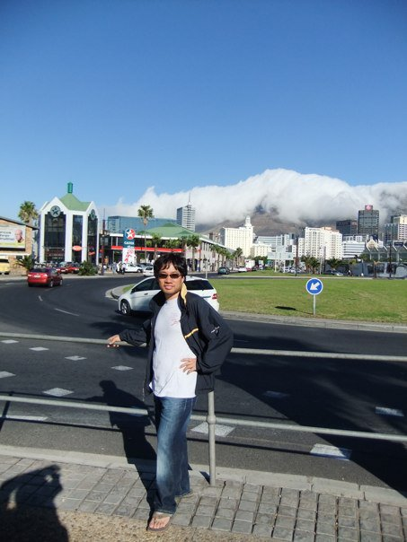
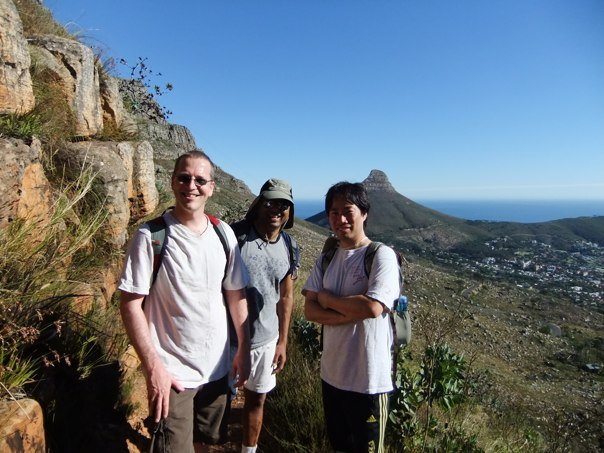
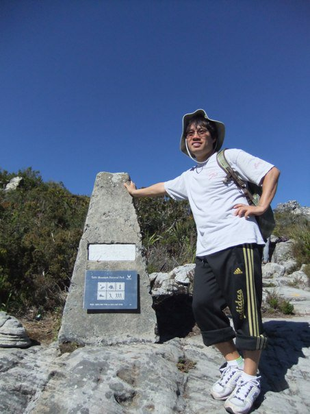
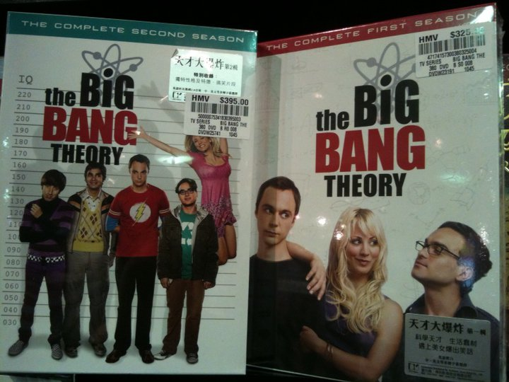
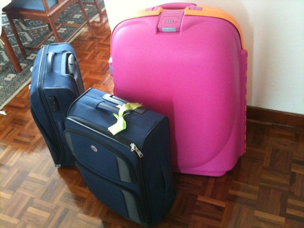

# 2010년 5월

[← 2010년](README.md)

### 5월 2일 (일) 00:29 · 📷 앨범: Cape Town Table Mountain (3장)

**이미지 캡션:** 푸른 하늘 아래, 한 성인 남성이 도로 옆 난간에 기대어 서 있다. 그는 30대 후반에서 40대 초반으로 보이며, 검은색 재킷과 흰색 티셔츠, 청바지, 그리고 샌들을 착용하고 있다. 그의 표정은 편안하고 여유로워 보이며, 한 손은 허리에 얹고 다른 한 손은 난간을 잡고 있다. 배경에는 현대적인 건물들이 늘어서 있고, 멀리 구름에 덮인 산이 보인다. 도로에는 차량들이 지나다니고 있으며, 잔디밭과 파란색 화살표 표지판도 보인다. 전체적으로 맑고 화창한 날씨 속에서 도시 풍경을 즐기는 듯한 분위기이다.
 
**이미지 캡션:** 사진에는 세 명의 성인 남성이 산길을 따라 하이킹하는 모습이 담겨 있습니다. 왼쪽 남성은 흰색 반팔 티셔츠와 갈색 반바지를 입고 있으며, 회색 배낭을 메고 있습니다. 그는 선글라스를 끼고 환하게 웃고 있습니다. 가운데 남성은 회색 반팔 티셔츠와 흰색 반바지를 입고 있으며, 카키색 모자를 쓰고 있습니다. 그는 배낭을 메고 있으며, 얼굴에는 미소가 번져 있습니다. 오른쪽 남성은 흰색 반팔 티셔츠와 검은색 스포츠 반바지를 입고 있으며, 회색 배낭을 메고 있습니다. 그는 팔짱을 끼고 카메라를 바라보고 있습니다. 배경으로는 푸른 하늘과 바다가 보이며, 멀리 도시와 산이 펼쳐져 있습니다. 산길은 바위와 풀로 이루어져 있으며, 햇살이 비추어 밝고 화창한 날씨임을 알 수 있습니다. 전반적으로 즐겁고 활동적인 분위기를 나타냅니다.
 
**이미지 캡션:** 푸른 하늘 아래, 한 성인 남성이 돌기둥 옆에 서서 포즈를 취하고 있다. 남성은 30대 후반에서 40대 초반으로 보이며, 챙이 넓은 모자를 쓰고 동그란 안경을 착용하고 있다. 흰색 반팔 티셔츠와 검은색 삼선 줄무늬가 있는 7부 바지를 입고 있으며, 발에는 흰색 운동화를 신고 있다. 등에는 녹색 배낭을 메고 있으며, 한 손은 돌기둥에 짚고 다른 한 손은 허리에 얹고 있다. 표정은 밝고 여유로워 보이며, 등반을 성공적으로 마친 듯한 만족감이 느껴진다. 배경에는 바위와 낮은 산림이 펼쳐져 있으며, 맑고 푸른 하늘이 시원하게 보인다. 돌기둥에는 "Table Mountain National Park"라고 적힌 표지판이 붙어 있고, 몇 가지 아이콘과 함께 숫자가 새겨져 있다. 전반적으로 야외 활동을 즐기는 건강하고 활동적인 분위기를 나타내는 사진이다.

> DSCF1548
> DSCF2030
> DSCF2038

### 5월 16일 (일) 14:21 · Congrats, Dr. Kim!

Congrats, Dr. Kim!

### 5월 16일 (일) 14:21 · ↪ Congrats, Dr. Kim!

*다른 프로필에 남긴 글*

Congrats, Dr. Kim!

### 5월 16일 (일) 16:49 · got "the BIG Bang theory" for summer bre…

got "the BIG Bang theory" for summer break!

**이미지 캡션:** 이 사진은 인기 TV 시리즈 "빅뱅 이론"의 DVD 박스 세트 두 개를 보여줍니다. 왼쪽에는 시즌 2 DVD가 있고, 오른쪽에는 시즌 1 DVD가 있습니다. 두 박스 모두 시리즈의 주요 캐릭터들이 등장하는 이미지를 특징으로 합니다. 시즌 2 박스에는 네 명의 남성 캐릭터(왼쪽부터 보라색 줄무늬 스웨터와 체크무늬 벨트를 착용한 젊은 남성, 노란색과 갈색 체크무늬 조끼를 입은 젊은 남성, 빨간색 플래시 로고 티셔츠를 입은 젊은 남성, 녹색 후드티와 갈색 바지를 입은 젊은 남성)와 분홍색 드레스를 입고 팔을 뻗고 있는 금발 여성 캐릭터가 서 있습니다. 이 캐릭터들은 키 측정선 앞에 서 있으며, 이는 시리즈의 과학적이고 괴짜적인 주제를 암시합니다. 시즌 1 박스에는 세 명의 주요 캐릭터(왼쪽부터 짙은 색 옷을 입은 젊은 남성, 금발 여성 캐릭터, 안경을 쓴 젊은 남성)가 클로즈업되어 있습니다. 두 박스 모두 "the BIG BANG THEORY"라는 제목이 크고 굵은 글씨로 표시되어 있으며, 원자 모형 그래픽이 포함되어 있습니다. 박스에는 HMV 스티커가 붙어 있으며, 가격 정보와 함께 "天才大爆炸" (천재 대폭발)이라는 중국어 문구가 보입니다. 전반적으로 사진은 제품의 진열을 보여주며, 쇼핑 환경이나 컬렉션의 일부로 보입니다.

### 5월 28일 (금) 11:07 · Done packing for three month living/work…

Done packing for three month living/working in Seattle.

**이미지 캡션:** 이 사진은 집 안의 나무 바닥에 놓인 세 개의 여행 가방을 보여줍니다. 가장 큰 가방은 밝은 분홍색이며 주황색 테두리가 있습니다. 그 옆에는 두 개의 남색 여행 가방이 있습니다. 하나는 더 크고 다른 하나는 더 작으며, 작은 가방에는 밝은 녹색 리본이 묶여 있습니다. 배경에는 나무 의자와 카펫이 보이며, 벽은 흰색입니다. 사진에는 사람이 보이지 않으며, 가방들은 여행을 준비하거나 여행에서 돌아온 듯한 분위기를 연출합니다.
