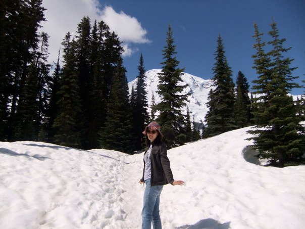
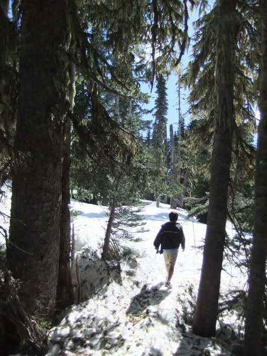
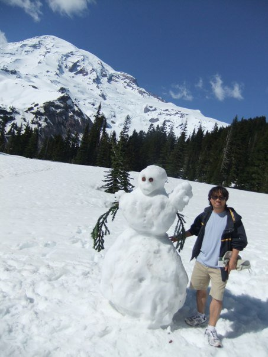

# 2010년 6월

[← 2010년](README.md)

### 6월 13일 (일) 13:41 · 📷 앨범: First snow trail hiking ever in summer (@Mt. Rainier, 1.2 mile Ni (3장)

**이미지 캡션:** 한 명의 성인 여성이 눈 덮인 산길에 서서 카메라를 향해 미소를 짓고 있다. 그녀는 20대 후반에서 30대 초반으로 보이며, 갈색 머리에 선글라스를 착용하고 있다. 붉은색과 흰색 패턴의 모자를 쓰고 있으며, 어두운 색상의 재킷과 청바지를 입고 있다. 그녀의 표정은 밝고 활기차며, 오른손을 살짝 들어 올린 채 포즈를 취하고 있다. 배경에는 울창한 침엽수림이 펼쳐져 있고, 그 뒤로는 눈 덮인 산봉우리가 푸른 하늘과 구름을 배경으로 웅장하게 서 있다. 눈은 햇빛에 반짝이며 하얗게 빛나고 있으며, 산길에는 사람의 발자국이 나 있다. 전체적으로 맑고 화창한 날씨 속에서 자연을 만끽하는 즐거운 분위기를 연출하고 있다.자국이 나 있다. 전체적으로 맑고 화창한 날씨 속에서 자연을 만끽하는 즐거운 분위기를 연출하고 있다.
 
**이미지 캡션:** 한 명의 성인 남성이 눈이 쌓인 숲길을 걷고 있다. 남성은 20대 후반에서 30대 초반으로 보이며, 검은색 재킷에 베이지색 반바지를 입고 운동화를 신고 있다. 그의 표정은 보이지 않지만, 뒷모습에서 여유로운 발걸음이 느껴진다. 배경은 울창한 침엽수림으로, 나무들은 앙상한 가지에 이끼가 드리워져 있고, 땅에는 눈이 두껍게 쌓여 있다. 햇빛이 나뭇가지 사이로 비쳐 들어와 눈 위로 그림자를 드리우고 있으며, 맑고 푸른 하늘이 보인다. 숲길 한쪽에는 주황색 표지판이 희미하게 보인다. 전반적으로 평화롭고 고요한 겨울 숲의 풍경이다.숲의 풍경이다.
 
**이미지 캡션:** 눈 덮인 산을 배경으로, 성인 남성이 눈사람 옆에 서서 사진을 찍고 있다. 남성은 20대 후반에서 30대 초반으로 보이며, 짧은 머리에 선글라스를 착용하고 있다. 하늘색 티셔츠 위에 어두운 색상의 재킷을 입고, 베이지색 반바지와 운동화를 신고 있다. 그의 표정은 밝고 편안해 보이며, 한 손으로는 눈사람의 팔을 잡고 있다. 눈사람은 두 개의 눈과 코, 그리고 나뭇가지를 팔로 하고 있으며, 꽤 큰 크기이다. 주변은 눈으로 뒤덮여 있으며, 울창한 침엽수림이 눈 쌓인 산비탈을 따라 펼쳐져 있다. 하늘은 맑고 푸르며, 구름이 약간 떠 있다. 전체적으로 화창한 날씨 속에서 즐거운 시간을 보내고 있는 듯한 분위기이다. 구름이 약간 떠 있다. 전체적으로 화창한 날씨 속에서 즐거운 시간을 보내고 있는 듯한 분위기이다.

> DSCF2541
> DSCF2562
> DSCF2565

### 6월 13일 (일) 13:43 · First snow trail hiking ever in summer (…

First snow trail hiking ever in summer (@Mt. Rainier, 1.2 mile Nisqually Vista trail)
