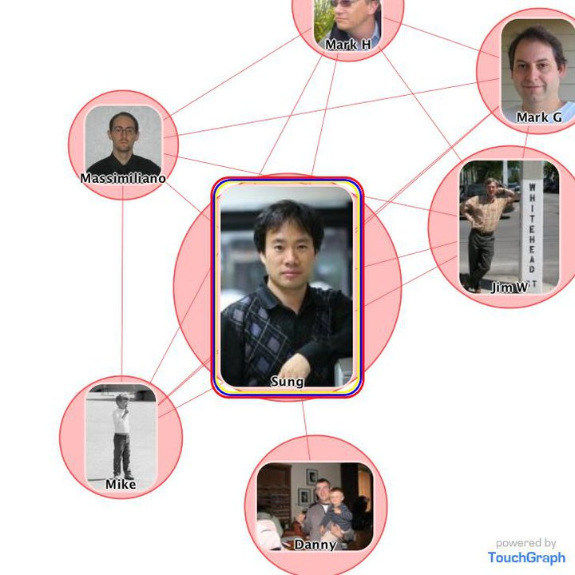
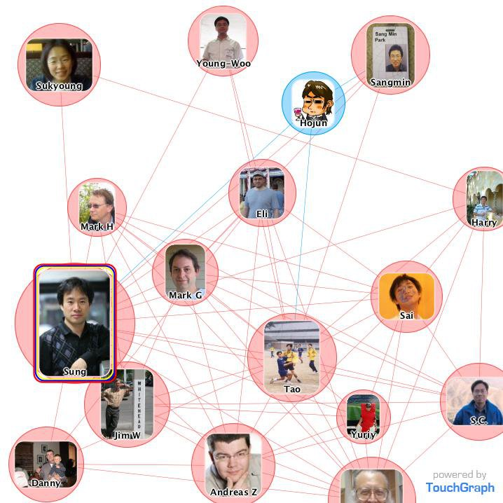

# 2010년 8월

[← 2010년](README.md)

### 8월 1일 (일) 09:17 · Check out the 26.10 mi bike ride I did w…

Check out the 26.10 mi bike ride I did with RunKeeper - Long, but Cool!

### 8월 4일 (수) 01:13 · 📷 사진 (2장)

**이미지 캡션:** 이 이미지는 여러 사람들의 사진과 그들 간의 관계를 나타내는 연결선으로 구성된 그래프입니다. 중앙에는 "Sung"이라는 이름의 성인 남성이 검은색 체크무늬 셔츠를 입고 있으며, 그의 주변에는 "Massimiliano"라는 이름의 안경을 쓴 성인 남성, "Mike"라는 이름의 어린 소년이 골프채를 들고 서 있는 모습, "Danny"라는 이름의 성인 남성이 어린 아이를 안고 있는 모습이 있습니다. 또한, "Mark H"라는 이름의 성인 남성, "Mark G"라는 이름의 성인 남성, 그리고 "Jim W"라는 이름의 성인 남성이 흰색 기둥에 기대어 서 있는 모습도 보입니다. 각 사진은 붉은색 원으로 둘러싸여 있으며, 이 원들은 얇은 붉은색 선으로 연결되어 관계를 표현하고 있습니다. 배경은 주로 흰색이며, 오른쪽 하단에는 "powered by TouchGraph"라는 문구가 있습니다. 전반적으로 인물 간의 관계를 시각적으로 보여주는 다이어그램의 일부로 보입니다.
 
**이미지 캡션:** 이 이미지는 여러 사람들의 사진과 그들 간의 관계를 나타내는 네트워크 다이어그램입니다. 중앙에는 "Sung"이라고 표시된 성인 남성의 사진이 있으며, 그는 검은색 체크무늬 셔츠를 입고 있습니다. "Sung"의 사진은 다른 사진들보다 더 두드러지게 테두리가 강조되어 있습니다. 주변에는 "Sukyoung", "Young-Woo", "Hojun", "Sangmin", "Eli", "Mark H", "Mark G", "Harry", "Sai", "Tao", "Yuriy", "S.C.", "Jim W", "Danny", "Andreas Z"라고 표시된 다양한 사람들의 사진이 원형으로 배치되어 있습니다. 각 사진에는 해당 인물의 이름이 적혀 있습니다. 사람들의 사진은 실제 사진, 만화 캐릭터, 또는 단체 사진 등 다양합니다. 사진 속 인물들은 대부분 성인 남성 또는 여성으로 보이며, 다양한 연령대의 사람들이 포함되어 있습니다. 복장 또한 캐주얼한 복장부터 정장까지 다양합니다. 표정은 대부분 무표정하거나 미소를 짓고 있으며, 행동은 사진에 따라 다르지만 대부분 정적인 모습입니다. 배경은 특정 장소를 나타내기보다는 인물 사진 자체에 초점이 맞춰져 있습니다. 일부 사진에는 "Sang Min Park"와 같이 이름과 성이 함께 표시되어 있습니다. "Tao"의 사진은 여러 사람이 축구를 하는 단체 사진입니다. "Yuriy"의 사진은 축구 선수로 보이는 남성이 붉은색 유니폼을 입고 있는 모습입니다. "Danny"의 사진은 두 명의 성인 남성과 어린 아이가 함께 찍은 사진입니다. "Jim W"의 사진은 흰색 배경에 근육질의 남성이 서 있는 모습입니다. "Hojun"의 사진은 만화 캐릭터로, 칵테일을 들고 있습니다. "Sangmin"의 사진에는 "Sang Min Park"라는 글자가 보입니다. 전체적으로 이 다이어그램은 인물 간의 연결 관계를 시각적으로 보여주며, 각 인물에 대한 정보를 제공합니다. 다이어그램의 오른쪽 하단에는 "powered by TouchGraph"라는 문구가 있어 이 시각화 도구가 TouchGraph에 의해 만들어졌음을 알 수 있습니다.

> Created with TouchGraph Photos http://www.facebook.com/apps/application.php?id=3267890192

### 8월 12일 (목) 13:50 · Interesting theory!

Interesting theory!

🔗 <http://www.youtube.com/watch?v=2JgpARGvBnc>

### 8월 15일 (일) 12:17 · Check out the 34.65 mi bike ride I did t…

Check out the 34.65 mi bike ride I did today - Long, really long ride!

### 8월 15일 (일) 12:19 · will be in Santa Cruz next week!

will be in Santa Cruz next week!

### 8월 19일 (목) 16:16 · Sleepless in Seattle, tonight, tomorrow,…

Sleepless in Seattle, tonight, tomorrow, and perhaps Friday night. :-)

### 8월 21일 (토) 18:11 · is not going to bring his laptop to tomo…

is not going to bring his laptop to tomorrow's Santa Cruz trip.

### 8월 24일 (화) 00:06 · Sung Kim was at San José Mineta International Airport.

📍 San José Mineta International Airport

### 8월 27일 (금) 12:23 · got blister on both big toes after playi…

got blister on both big toes after playing racquetball with Chris. Today’s lesson: wear socks when you play racquetball.
