# 2010년 12월

[← 2010년](README.md)

### 12월 2일 (목) 22:18 · 📷 앨범: HKUST Best Lecturer Election 2010 (11장)

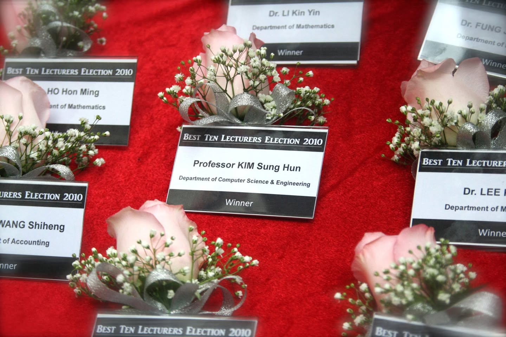
**이미지 캡션:** 이 사진은 2010년 베스트 텐 강사 선발 시상식의 일부를 보여주며, 붉은색 천 위에 여러 개의 상패와 꽃 장식이 놓여 있습니다. 상패들은 검은색 테두리에 흰색 바탕으로 되어 있으며, "BEST TEN LECTURERS ELECTION 2010"이라는 문구와 함께 수상자의 이름, 소속 학과, 그리고 "Winner"라는 글자가 적혀 있습니다. 수상자로는 HO Hon Ming (수학과), Dr. LI Kin Yin (수학과), Professor KIM Sung Hun (컴퓨터 과학 및 공학부), WANG Shiheng (회계학과), Dr. LEE (소속 불명) 등이 보입니다. 각 상패 옆에는 연한 분홍색 장미와 작은 흰색 꽃들로 이루어진 꽃다발이 은색 리본으로 장식되어 있습니다. 사진에는 사람이 직접적으로 보이지는 않지만, 상패에 적힌 이름들을 통해 수상자들이 있음을 알 수 있습니다. 배경은 붉은색 천으로 통일되어 있으며, 전체적으로 축하와 격려의 분위기를 나타냅니다.eng (회계학과), Dr. LEE (소속 불명) 등이 보입니다. 각 상패 옆에는 연한 분홍색 장미와 작은 흰색 꽃들로 이루어진 꽃다발이 은색 리본으로 장식되어 있습니다. 사진에는 사람이 직접적으로 보이지는 않지만, 상패에 적힌 이름들을 통해 수상자들이 있음을 알 수 있습니다. 배경은 붉은색 천으로 통일되어 있으며, 전체적으로 축하와 격려의 분위기를 나타냅니다.
 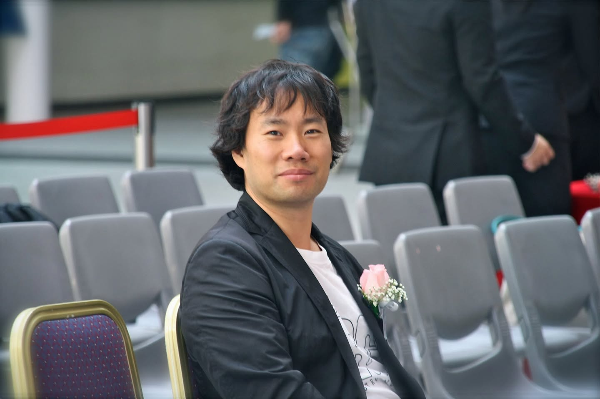
**이미지 캡션:** 사진에는 30대 후반에서 40대 초반으로 보이는 동양인 성인 남성이 정면을 바라보며 앉아 있다. 그는 검은색 재킷 안에 흰색 티셔츠를 입고 있으며, 티셔츠에는 검은색 그림이 그려져 있다. 재킷 왼쪽 가슴에는 연분홍색 장미와 작은 흰색 꽃으로 장식된 부토니에르가 달려 있다. 남성은 부드러운 미소를 띠고 있으며, 그의 머리카락은 짙은 갈색으로 약간 곱슬거린다. 배경에는 회색 좌석이 여러 줄로 놓여 있고, 좌석 뒤쪽으로는 흐릿하게 보이는 사람들이 검은색 정장을 입고 서 있다. 좌석 앞쪽으로는 빨간색 띠가 쳐져 있어 공간을 구분하고 있다. 전체적으로 차분하고 격식 있는 분위기이며, 행사장이나 공식적인 모임의 일부로 보인다. 공간을 구분하고 있다. 전체적으로 차분하고 격식 있는 분위기이며, 행사장이나 공식적인 모임의 일부로 보인다.
 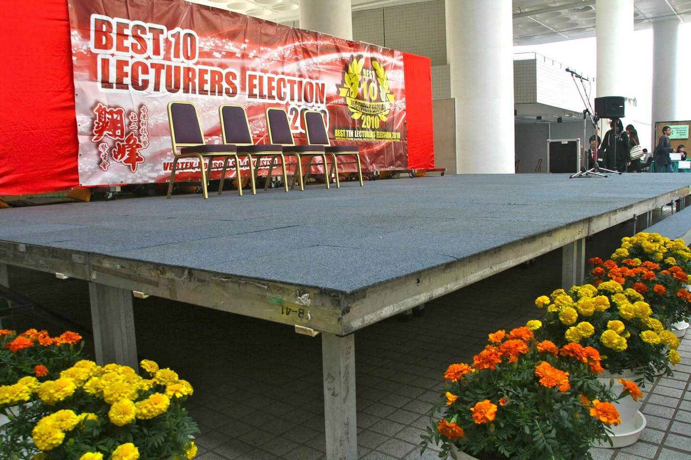
**이미지 캡션:** 이 사진은 야외 행사 무대를 보여주며, 무대 뒤에는 "BEST 10 LECTURERS ELECTION 2010"이라고 적힌 큰 현수막이 걸려 있습니다. 현수막에는 붉은색과 흰색이 주로 사용되었고, 금색 월계관과 함께 "BEST 10 LECTURERS ELECTION 2010"이라는 문구가 강조되어 있습니다. 현수막 앞에는 보라색 좌석이 네 개 놓여 있으며, 이 좌석들은 금색 프레임으로 되어 있습니다. 무대 바닥은 회색 카펫으로 덮여 있고, 무대 앞쪽에는 주황색과 노란색의 메리골드 화분이 줄지어 놓여 있어 행사를 축하하는 분위기를 더합니다. 무대 오른쪽에는 마이크와 스피커가 설치되어 있으며, 몇몇 사람들이 무대 뒤편에서 행사를 준비하거나 관람하는 모습이 희미하게 보입니다. 전반적으로 행사의 시작을 알리는 듯한 활기찬 분위기입니다.를 축하하는 분위기를 더합니다. 무대 오른쪽에는 마이크와 스피커가 설치되어 있으며, 몇몇 사람들이 무대 뒤편에서 행사를 준비하거나 관람하는 모습이 희미하게 보입니다. 전반적으로 행사의 시작을 알리는 듯한 활기찬 분위기입니다.
 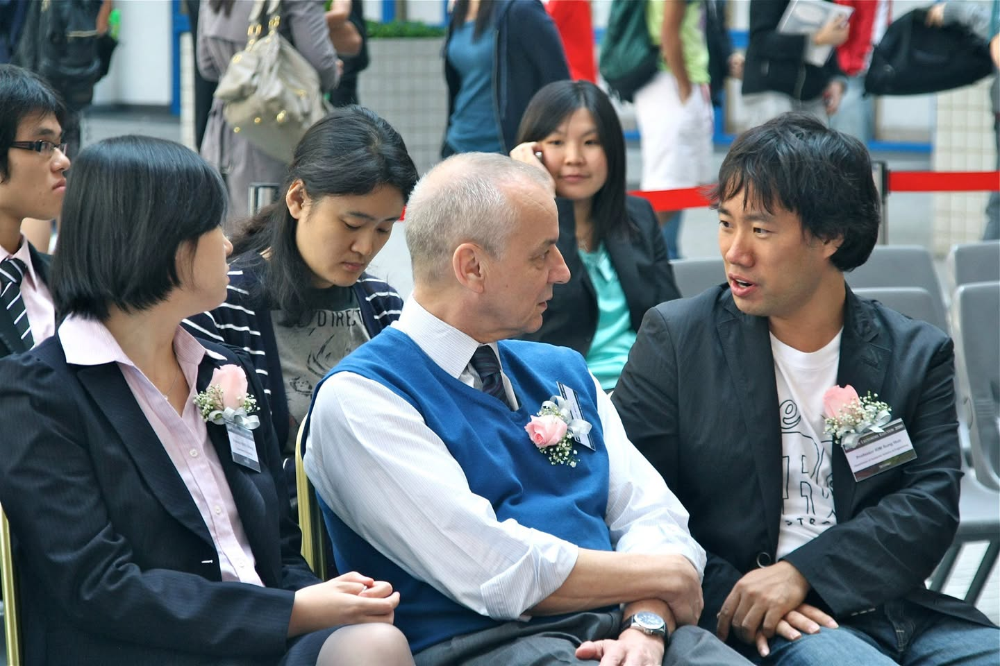
**이미지 캡션:** 이 사진은 실내 행사 또는 회의에 참석한 여러 사람들을 보여줍니다. 왼쪽에는 검은색 재킷과 분홍색 셔츠를 입은 젊은 여성과 검은색 재킷과 줄무늬 카디건을 입은 또 다른 여성이 앉아 있습니다. 그들 앞에는 흰색 셔츠와 파란색 조끼를 입은 백인 남성이 앉아 있으며, 그의 왼쪽에는 검은색 재킷과 흰색 티셔츠를 입은 아시아 남성이 앉아 있습니다. 모든 사람들은 행사 참석자임을 나타내는 꽃 장식과 명찰을 달고 있습니다. 배경에는 다른 참석자들이 흐릿하게 보이며, 이는 행사가 많은 사람들이 모인 자리임을 시사합니다. 전반적으로 사진은 진지하고 격식 있는 분위기를 전달합니다.반적으로 사진은 진지하고 격식 있는 분위기를 전달합니다.
 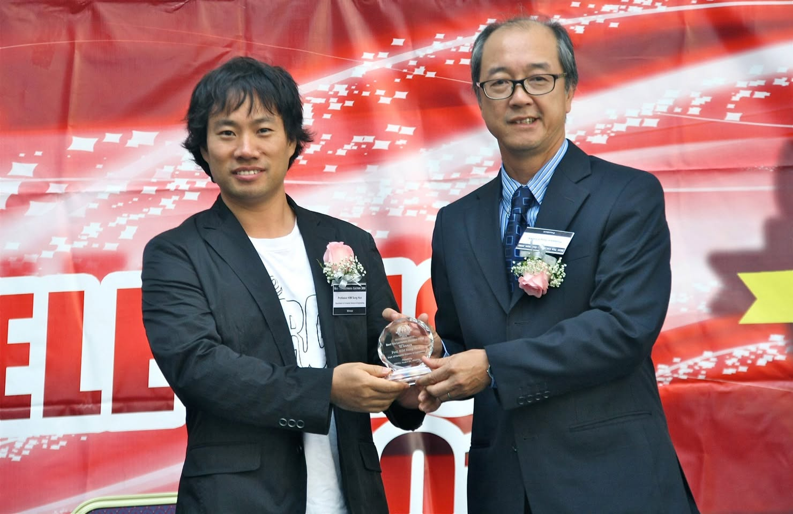
**이미지 캡션:** 두 명의 성인 남성이 행사장으로 보이는 곳에서 상을 주고받고 있다. 왼쪽 남성은 30대 후반에서 40대 초반으로 보이며, 검은색 재킷 안에 흰색 티셔츠를 입고 있다. 그의 머리는 검은색이고 약간 곱슬거린다. 그는 부드러운 미소를 짓고 있으며, 왼쪽 가슴에는 분홍색 꽃 장식이 달려 있다. 오른쪽 남성은 50대 후반에서 60대 초반으로 보이며, 짙은 남색 정장에 파란색 줄무늬 셔츠와 넥타이를 착용하고 있다. 그는 안경을 쓰고 있으며, 왼쪽 가슴에는 분홍색 꽃 장식이 달려 있다. 두 사람 모두 명찰을 달고 있으며, 오른쪽 남성이 왼쪽 남성에게 투명한 원형 상패를 건네고 있다. 배경에는 붉은색 천이 걸려 있고, 흰색과 붉은색의 기하학적인 패턴이 그려져 있다. 왼쪽에는 "ELL"이라는 글자가 붉은색으로 크게 쓰여 있다. 전반적으로 시상식이나 공식 행사 분위기를 띤다. 오른쪽 남성이 왼쪽 남성에게 투명한 원형 상패를 건네고 있다. 배경에는 붉은색 천이 걸려 있고, 흰색과 붉은색의 기하학적인 패턴이 그려져 있다. 왼쪽에는 "ELL"이라는 글자가 붉은색으로 크게 쓰여 있다. 전반적으로 시상식이나 공식 행사 분위기를 띤다.
 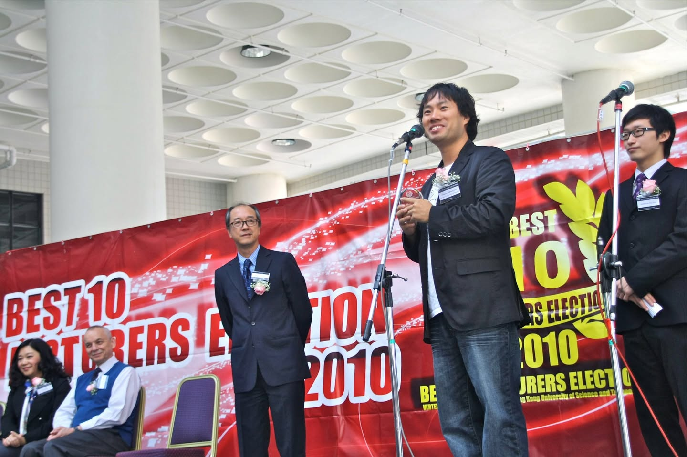
**이미지 캡션:** 행사장에서 연설 중인 성인 남성이 마이크를 잡고 있으며, 그의 옆에는 또 다른 성인 남성이 서 있다. 무대 앞쪽에는 세 명의 사람들이 앉아 있는데, 왼쪽부터 성인 여성, 성인 남성, 그리고 보라색 의자에 앉은 성인 남성이다. 이들은 모두 정장을 입고 있으며, 행사 참석자임을 나타내는 명찰을 달고 있다. 배경에는 "BEST 10"이라는 문구와 함께 2010년이라는 숫자가 적힌 빨간색 현수막이 걸려 있다. 천장은 둥근 모양의 조명과 함께 독특한 디자인으로 되어 있으며, 전체적으로 시상식이나 공식 행사의 분위기를 띤다.띤다.
 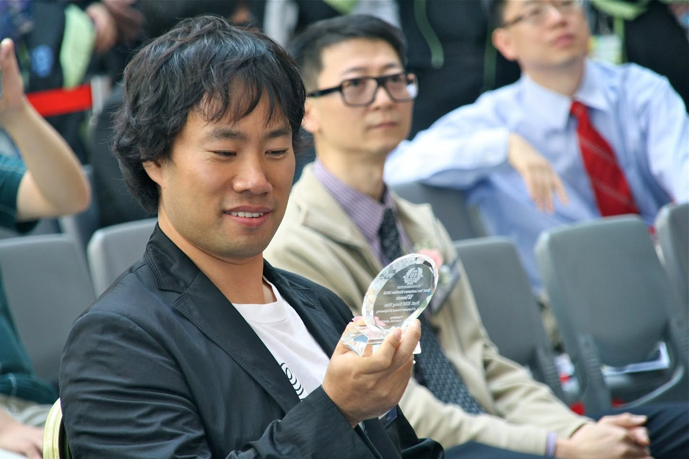
**이미지 캡션:** 이 사진은 실내 행사장에서 상을 받은 듯한 한 성인 남성을 클로즈업하여 보여준다. 그는 30대 후반에서 40대 초반으로 보이며, 검은색 곱슬머리에 부드러운 미소를 띠고 있다. 검은색 재킷 안에 흰색 티셔츠를 입고 있으며, 손에는 투명한 상패를 들고 있다. 상패에는 글씨와 로고가 새겨져 있으며, 행사장에서 받은 것으로 보인다. 배경에는 다른 사람들이 앉아 있으며, 그들 역시 행사에 참여하고 있는 것으로 추정된다. 전체적으로 축하와 성취감을 나타내는 긍정적인 분위기이다.
 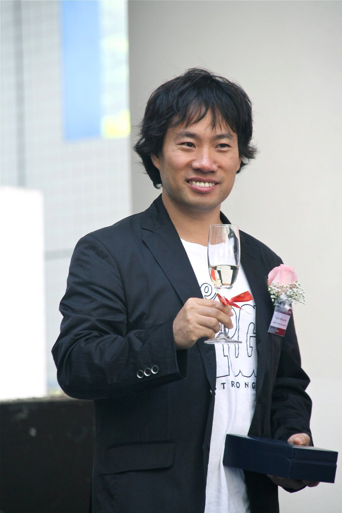
**이미지 캡션:** 한 명의 성인 남성이 검은색 재킷 안에 흰색 티셔츠를 입고 샴페인 잔을 들고 있다. 남성은 30대 후반에서 40대 초반으로 보이며, 검은색 머리카락에 부드러운 미소를 짓고 있다. 재킷 왼쪽 가슴에는 분홍색 장미와 작은 흰색 꽃으로 장식된 배지가 달려 있으며, 배지에는 "TRONG"이라는 글자가 보인다. 남성은 오른손으로 샴페인 잔을 들고 있고, 왼손으로는 파란색 상자를 들고 있다. 배경은 흐릿하게 처리되어 있으며, 왼쪽에는 파란색과 노란색이 섞인 추상적인 이미지가 보인다. 전체적으로 축하 행사나 시상식과 같은 행사의 분위기를 풍긴다. 행사의 분위기를 풍긴다.
 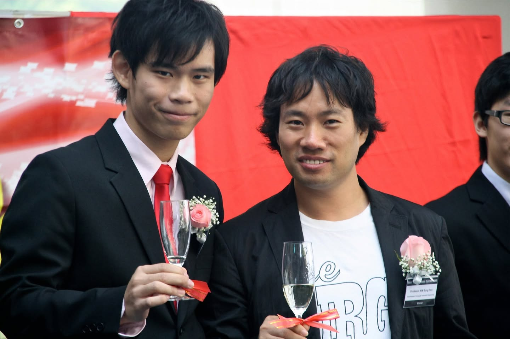
**이미지 캡션:** 두 명의 성인 남성이 샴페인 잔을 들고 빨간색 배경 앞에서 포즈를 취하고 있습니다. 왼쪽 남성은 20대 초중반으로 보이며, 검은색 정장 재킷, 분홍색 셔츠, 빨간색 넥타이를 착용하고 있습니다. 그의 재킷에는 분홍색 장미와 흰색 작은 꽃으로 장식된 부토니에르가 달려 있습니다. 그는 샴페인 잔을 들고 있으며, 입가에 희미한 미소를 띠고 있습니다. 오른쪽 남성은 30대 초중반으로 보이며, 검은색 재킷 안에 흰색 티셔츠를 입고 있습니다. 그의 티셔츠에는 흰색 글씨로 "We"와 일부가 가려진 다른 글자들이 쓰여 있습니다. 그의 재킷에도 분홍색 장미와 흰색 작은 꽃으로 장식된 부토니에르가 달려 있으며, 그 아래에는 이름표가 부착되어 있습니다. 이름표에는 "Professor Kim Jung Hun"이라고 쓰여 있으며, 그 아래에는 "Seoul National University"라는 글자가 희미하게 보입니다. 그는 샴페인 잔을 들고 카메라를 향해 웃고 있습니다. 배경은 밝은 빨간색 천으로, 행사나 시상식 같은 분위기를 연출합니다. 전체적으로 축하하거나 기념하는 듯한 밝고 긍정적인 분위기입니다.다. 그의 재킷에도 분홍색 장미와 흰색 작은 꽃으로 장식된 부토니에르가 달려 있으며, 그 아래에는 이름표가 부착되어 있습니다. 이름표에는 "Professor Kim Jung Hun"이라고 쓰여 있으며, 그 아래에는 "Seoul National University"라는 글자가 희미하게 보입니다. 그는 샴페인 잔을 들고 카메라를 향해 웃고 있습니다. 배경은 밝은 빨간색 천으로, 행사나 시상식 같은 분위기를 연출합니다. 전체적으로 축하하거나 기념하는 듯한 밝고 긍정적인 분위기입니다.
 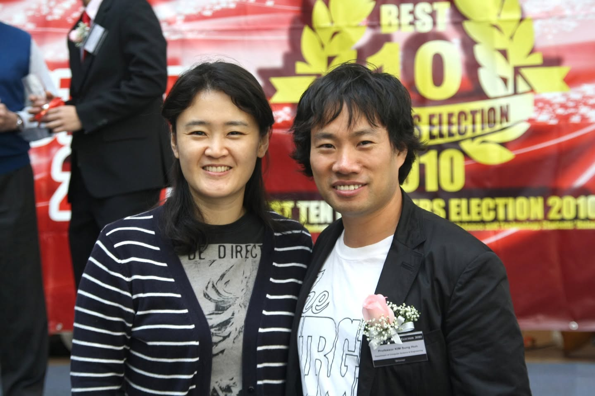
**이미지 캡션:** 사진에는 성인 여성과 성인 남성이 나란히 서서 카메라를 향해 웃고 있다. 여성은 30대 후반에서 40대 초반으로 보이며, 검은색 줄무늬 가디건 안에 회색 티셔츠를 입고 있다. 남성은 30대 후반에서 40대 초반으로 보이며, 검은색 재킷 안에 흰색 티셔츠를 입고 있으며, 재킷에는 분홍색 꽃과 이름표가 달려 있다. 이름표에는 "Professor KIM Sung Hon"이라고 적혀 있다. 배경에는 "BEST 10 ELECTION 2010"이라고 쓰인 현수막이 걸려 있으며, 행사의 분위기를 나타낸다. 전반적으로 축하하거나 기념하는 듯한 밝고 긍정적인 분위기이다.하거나 기념하는 듯한 밝고 긍정적인 분위기이다.
 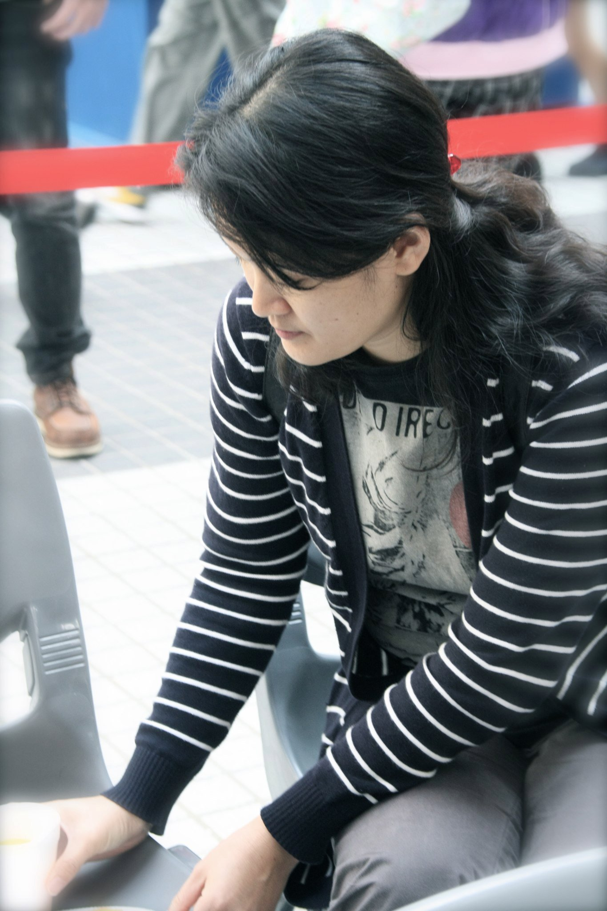
**이미지 캡션:** 한 젊은 성인 여성이 회색 의자에 앉아 고개를 숙이고 있습니다. 그녀는 검은색과 흰색 줄무늬 가디건 안에 그래픽 티셔츠를 입고 있으며, 티셔츠에는 "DIREC"라는 글자가 희미하게 보입니다. 그녀의 검은색 머리카락은 길고 약간 곱슬거리며, 얼굴은 측면에서 보입니다. 그녀의 표정은 차분해 보이며, 손은 무릎 위에 놓여 있습니다. 배경에는 붉은색 테이프와 흐릿한 사람들이 보이며, 이는 야외 행사나 대기 장소일 가능성을 시사합니다. 바닥은 타일로 되어 있습니다. 전반적으로 차분하고 일상적인 분위기입니다.

### 12월 7일 (화) 10:41 · It seems Apple does not like ICSE. :-)

It seems Apple does not like ICSE. :-)

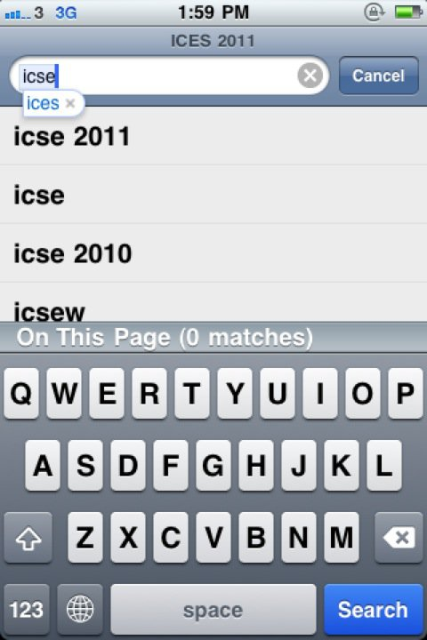
**이미지 캡션:** 이것은 아이폰 화면을 캡처한 것으로, 검색창에 "icse"가 입력되어 있고 "ices"라는 검색어가 제안으로 표시되어 있습니다. 검색창 아래에는 "icse 2011", "icse", "icse 2010", "icsew"와 같은 검색어 제안 목록이 나타나며, "On This Page (0 matches)"라는 문구가 표시되어 현재 페이지에서 검색 결과가 없음을 알립니다. 화면 하단에는 아이폰의 가상 키보드가 보이며, "QWERTYUIOP", "ASDFGHJKL", "ZXCVBNM"과 같은 키들이 배열되어 있고, "123", 지구본 모양 아이콘, "space", "Search" 버튼이 있습니다. 전반적으로 사용자가 특정 정보를 검색하려는 상황을 보여줍니다. "123", 지구본 모양 아이콘, "space", "Search" 버튼이 있습니다. 전반적으로 사용자가 특정 정보를 검색하려는 상황을 보여줍니다.

### 12월 8일 (수) 16:13 · Sung Kim was with Mizuno Osamu at ヤマハ音楽教室東生駒教室.

📍 ヤマハ音楽教室東生駒教室

### 12월 9일 (목) 08:34 · was @NAIST with Tom and found interestin…

was @NAIST with Tom and found interesting labs.

### 12월 9일 (목) 22:30 · ate jumbo roll @ Ginza, Tokyo.

ate jumbo roll @ Ginza, Tokyo.

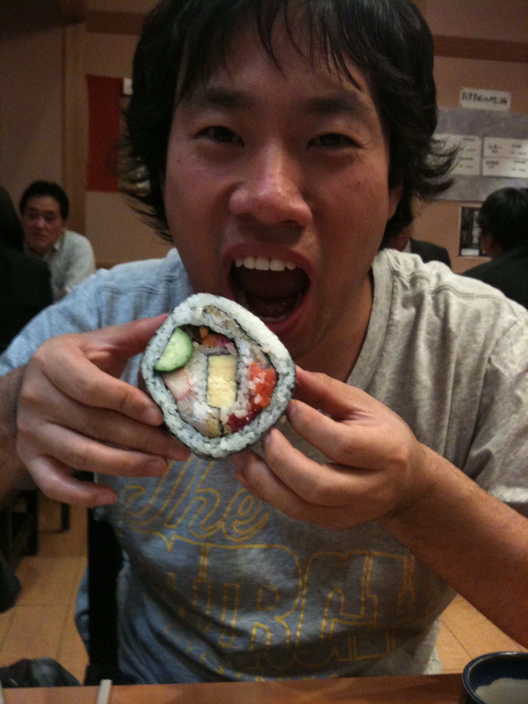
**이미지 캡션:** 한 명의 성인 남성이 얼굴을 클로즈업하며 입을 크게 벌리고 김초밥을 들고 있다. 남성은 20대 후반에서 30대 초반으로 보이며, 검은색 머리카락에 옅은 갈색 눈을 가지고 있다. 그는 회색 티셔츠를 입고 있으며, 티셔츠에는 노란색 글씨로 무언가 쓰여 있다. 남성은 김초밥을 먹으려는 듯한 표정으로, 눈은 카메라를 향하고 있다. 김초밥은 참치, 오이, 계란 등으로 속이 채워져 있으며, 겉은 김으로 말려 있다. 배경에는 나무 벽과 테이블이 보이며, 다른 사람들이 희미하게 보인다. 전반적으로 식당에서 즐거운 시간을 보내고 있는 듯한 분위기이다.내고 있는 듯한 분위기이다.

### 12월 11일 (토) 11:32 · Congrats.

Congrats.

### 12월 11일 (토) 11:32 · ↪ Congrats.

*다른 프로필에 남긴 글*

Congrats.

### 12월 11일 (토) 20:38 · played kinnect at Akihabara, Tokyo. It w…

played kinnect at Akihabara, Tokyo. It was really fun.

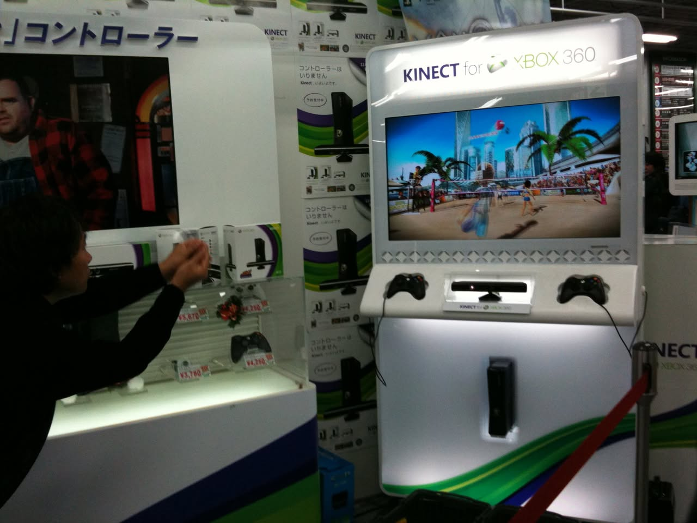
**이미지 캡션:** 매장 안에서 한 성인 남성이 Kinect for Xbox 360 게임 시연대 앞에 서서 게임을 체험하고 있다. 남성은 검은색 긴팔 상의를 입고 있으며, 두 손을 앞으로 뻗어 게임 화면 속 캐릭터를 조작하려는 듯한 자세를 취하고 있다. 그의 표정은 게임에 집중하고 있는 듯 보인다. 시연대에는 Xbox 360 본체와 Kinect 센서, 그리고 두 개의 컨트롤러가 전시되어 있으며, 화면에는 해변에서 배구 게임을 하는 듯한 모습이 나타나 있다. 배경에는 여러 게임 관련 상품들이 진열되어 있고, 일본어로 된 광고 문구들이 보인다. 전반적으로 게임 매장의 활기찬 분위기를 느낄 수 있다.들이 보인다. 전반적으로 게임 매장의 활기찬 분위기를 느낄 수 있다.

### 12월 12일 (일) 22:25 · Live plant juice cheers with Ahmed.

Live plant juice cheers with Ahmed.

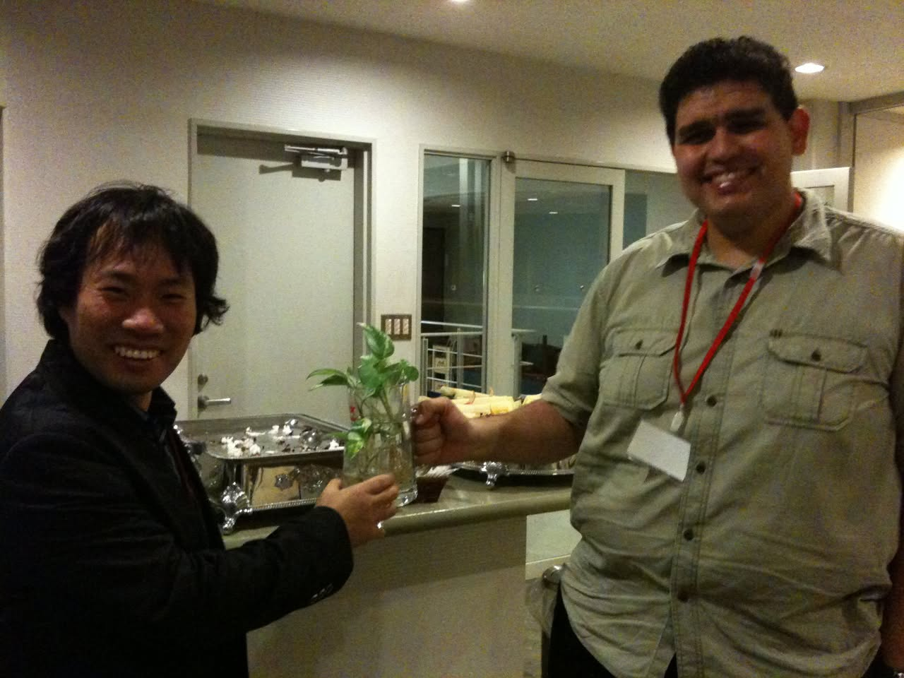
**이미지 캡션:** 사진에는 두 명의 성인 남성이 등장하며, 한 명은 검은색 재킷을 입고 환하게 웃고 있고, 다른 한 명은 베이지색 셔츠를 입고 빨간색 목걸이와 명찰을 착용한 채 카메라를 향해 웃고 있다. 두 사람 모두 즐거운 표정으로, 아마도 행사나 모임에 참석한 것으로 보인다. 배경에는 흰색 벽과 문, 그리고 유리문이 보이며, 테이블 위에는 음식과 음료가 준비되어 있는 것으로 추정된다. 한 남성은 투명한 유리병에 담긴 식물을 들고 있으며, 이는 행사의 장식이나 기념품일 수 있다. 전반적으로 따뜻하고 긍정적인 분위기를 자아내는 사진이다. 사진이다.

### 12월 21일 (화) 21:43 · is visiting MSR Beijing this winter.

is visiting MSR Beijing this winter.

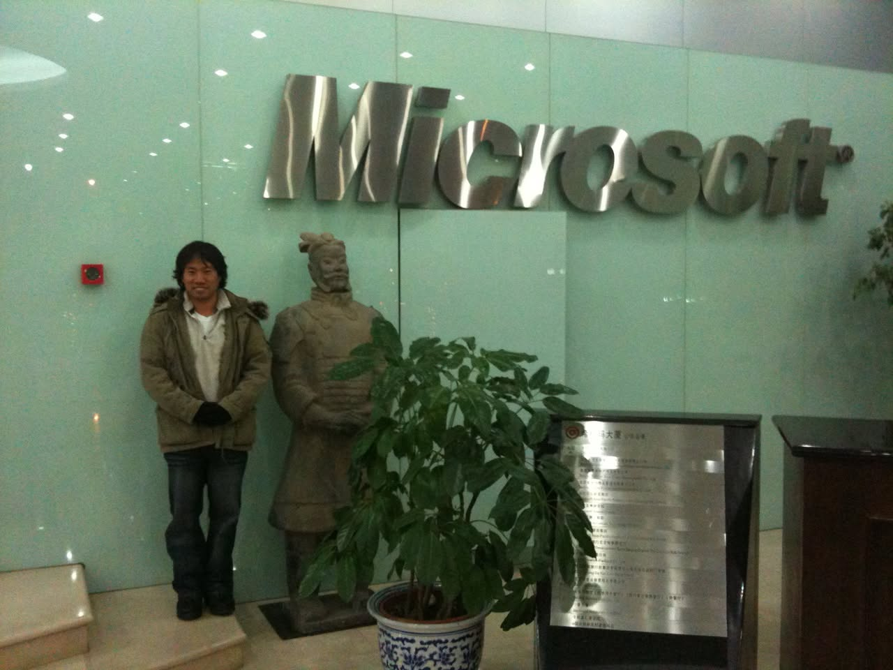
**이미지 캡션:** 한 성인 남성이 마이크로소프트 로고가 새겨진 녹색 유리 벽 앞에 서 있다. 남성은 30대 초중반으로 보이며, 갈색 퍼가 달린 카키색 재킷과 흰색 셔츠, 검은색 장갑, 청바지를 입고 있다. 그는 약간 미소를 지으며 카메라를 응시하고 있으며, 두 손을 앞에 모으고 서 있다. 그의 왼쪽에는 테라코타 전사상 조각상이 서 있고, 오른쪽에는 화분에 담긴 녹색 식물이 놓여 있다. 배경에는 마이크로소프트의 은색 로고가 벽에 걸려 있으며, 로고 아래에는 중국어로 된 정보가 담긴 금속판이 세워져 있다. 전반적으로 사무실 로비와 같은 분위기이며, 방문객이 기념 사진을 찍는 듯한 모습이다. 같은 분위기이며, 방문객이 기념 사진을 찍는 듯한 모습이다.
