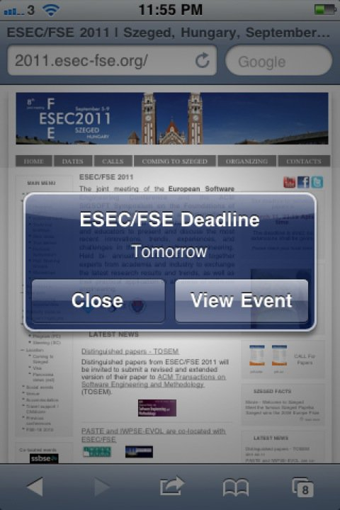

# 2011년 3월

[← 2011년](README.md)

### 3월 1일 (화) 10:47 · The most interesting book I've read this…

The most interesting book I've read this year so far.

🔗 <http://www.amazon.com/dp/0849946158/ref=tsm_1_fb_lk>

### 3월 10일 (목) 10:54 · Sung's schedule -- morning: pingpong, af…

Sung's schedule -- morning: pingpong, after lunch: beach volleyball, after dinner: soccer, before sleep: pingpong again thanks to Kinect.

### 3월 11일 (금) 03:43 · THE DAY!

THE DAY!

### 3월 26일 (토) 11:22 · I like the color!! I want to get one.

I like the color!! I want to get one.

### 3월 27일 (일) 10:58 · Yeon is very strong!

Yeon is very strong!

🔗 <http://www.youtube.com/watch?v=LSDs4qpq-0E>

### 3월 28일 (월) 00:41 · was kicked by Bird!

was kicked by Bird!

🔗 <http://www.youtube.com/watch?v=JpKMz6WG05c>

### 3월 29일 (화) 16:32 · is looking forward to his vacation in Is…

is looking forward to his vacation in Israel with yeon and yoav from April 16-23. Hello Israel!!
