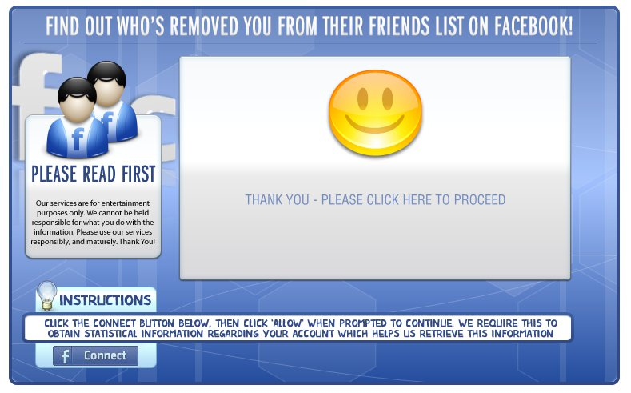
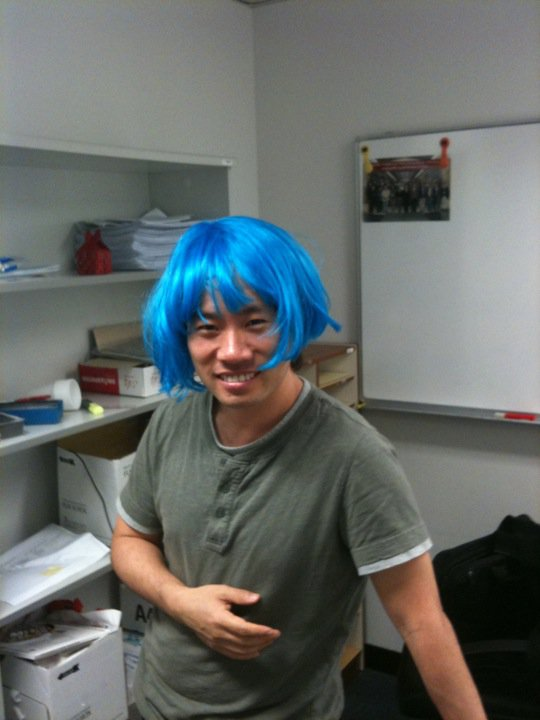
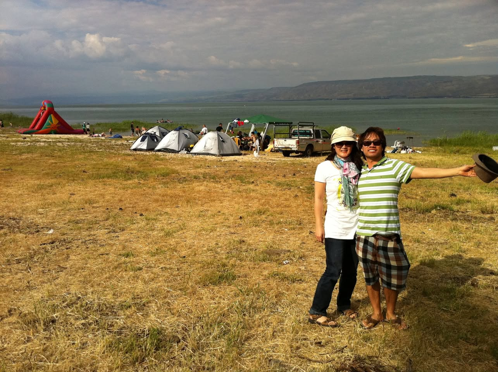

# 2011년 4월

[← 2011년](README.md)

### 4월 7일 (목) 22:37 · is waiting for a big day. ICSE/MSR early…

is waiting for a big day. ICSE/MSR early registration, ISSTA/AAAI notification, DSN camera ready, HKUST Annual Activities Report deadline, and my flight to Israel. All is happening on April 15.

### 4월 8일 (금) 19:57 · See who removed you from their friends l…

See who removed you from their friends list on Facebook. i saw mine, Check yours @: http://whohremoveu.appspot.com/

**이미지 캡션:** 이 이미지는 페이스북 친구 목록에서 누가 자신을 삭제했는지 알려준다는 제목의 웹사이트 또는 애플리케이션의 인터페이스를 보여줍니다. 화면 상단에는 "FIND OUT WHO'S REMOVED YOU FROM THEIR FRIENDS LIST ON FACEBOOK!"이라는 파란색 배경의 흰색 글씨로 된 제목이 있습니다. 그 아래에는 페이스북 로고를 형상화한 두 개의 사람 아이콘이 있고, 그 옆에는 "PLEASE READ FIRST"라는 문구와 함께 서비스 이용 약관이 흰색 글씨로 쓰여 있습니다. 중앙에는 노란색 스마일리 얼굴 이모티콘이 있고, 그 아래에는 "THANK YOU - PLEASE CLICK HERE TO PROCEED"라는 문구가 회색 글씨로 쓰여 있습니다. 화면 하단에는 "INSTRUCTIONS"라는 제목과 함께 "CLICK THE CONNECT BUTTON BELOW, THEN CLICK 'ALLOW' WHEN PROMPTED TO CONTINUE. WE REQUIRE THIS TO OBTAIN STATISTICAL INFORMATION REGARDING YOUR ACCOUNT WHICH HELPS US RETRIEVE THIS INFORMATION"이라는 지침이 파란색 배경에 흰색 글씨로 적혀 있으며, 그 아래에는 페이스북 로고와 함께 "Connect" 버튼이 있습니다. 전체적으로 파란색과 흰색이 주를 이루는 밝고 경쾌한 분위기이며, 사용자의 주의를 끌고 클릭을 유도하는 디자인입니다.

### 4월 12일 (화) 16:09 · is ready to go to Israel and have fun!

is ready to go to Israel and have fun!

**이미지 캡션:** 사진에는 밝은 파란색 가발을 쓰고 회색 티셔츠를 입은 성인 남성이 사무실 배경에서 포즈를 취하고 있습니다. 남성은 20대 후반에서 30대 초반으로 보이며, 옅은 미소를 띠고 있습니다. 그의 오른쪽 손은 가슴 앞에 놓여 있고, 왼쪽 팔은 몸 옆에 편안하게 늘어져 있습니다. 배경에는 흰색 벽, 선반, 서류함, 그리고 벽에 걸린 작은 그림이 보입니다. 선반에는 서류 더미와 상자들이 놓여 있으며, 벽에는 흰색 칠판이 걸려 있습니다. 전체적인 분위기는 캐주얼하고 즐거운 느낌을 줍니다.

### 4월 13일 (수) 18:02 · has registered for MSR2011 and ICSE 2011…

has registered for MSR2011 and ICSE 2011 to be held in Honolulu, HI on May 21-28, 2011, and excited!

### 4월 23일 (토) 05:47 · had a great time in ים כנרת (Sea of Gali…

had a great time in ים כנרת (Sea of Galilee).

**이미지 캡션:** 한 쌍의 성인 남녀가 캠핑장에서 사진을 찍고 있다. 여성은 흰색 티셔츠에 청바지를 입고 있으며, 남성은 녹색 줄무늬 티셔츠에 체크무늬 반바지를 입고 있다. 여성은 모자를 쓰고 있으며, 남성은 모자를 들고 있다. 두 사람 모두 웃고 있으며, 즐거운 표정이다. 배경에는 텐트, 차량, 그리고 호수가 보인다. 호수에는 몇몇 사람들이 물놀이를 즐기고 있으며, 멀리 산이 보인다. 하늘은 구름이 껴 있지만 밝은 편이다. 전체적으로 화창한 날씨에 캠핑을 즐기는 여유로운 분위기이다.

### 4월 23일 (토) 05:50 · is sad because it is the last night in h…

is sad because it is the last night in his Israel 2011 trip. But he will be back next year.

### 4월 26일 (화) 13:16 · Congrats, Yeon!

Congrats, Yeon!

🔗 <http://www.arts-of-fashion.org/AoFCompetition/2011/pages/selected/Yeon%20Gyoung%20Gwack.htm>

### 4월 26일 (화) 16:38 · likes the ESEC/FSE rebuttal with overall…

likes the ESEC/FSE rebuttal with overall ratings. It's much clearer to understand reviews with the information.
