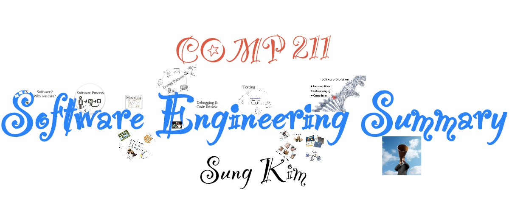
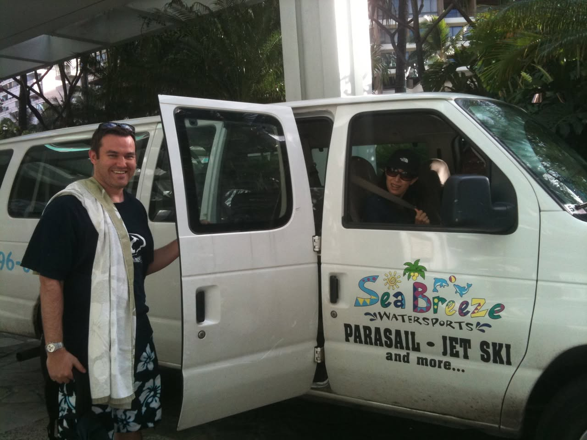
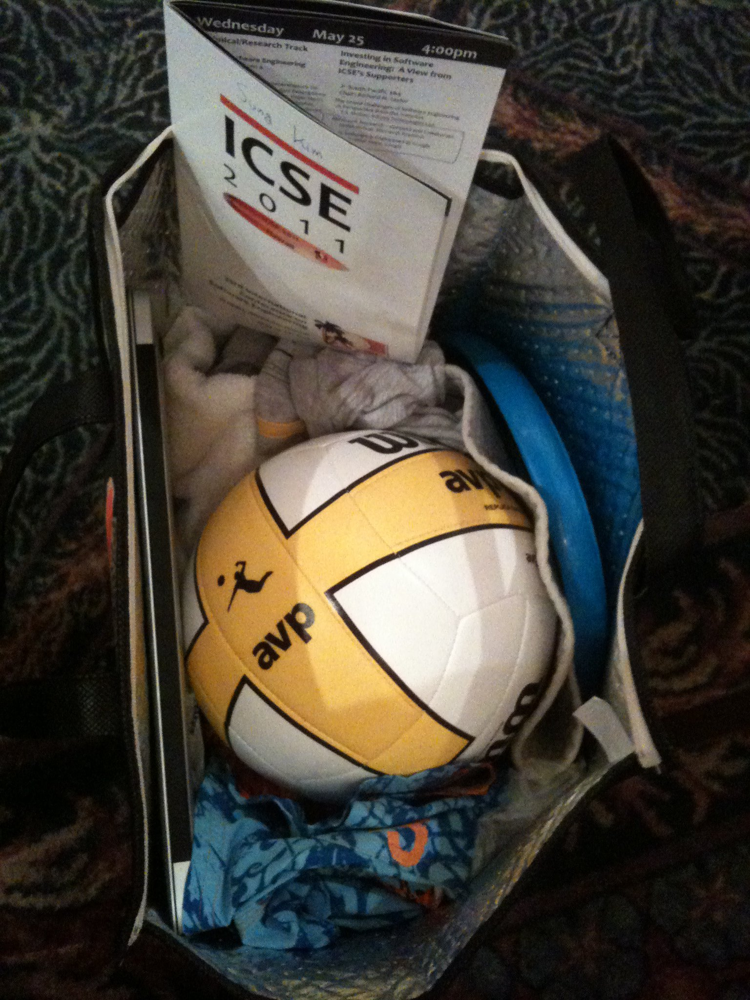
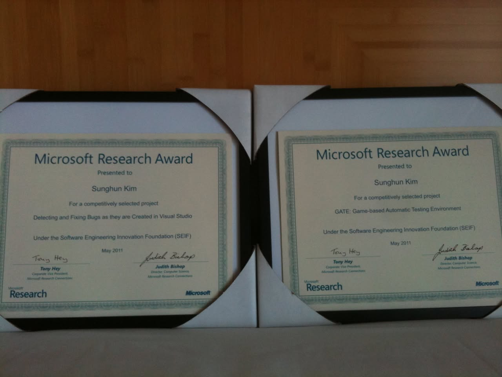
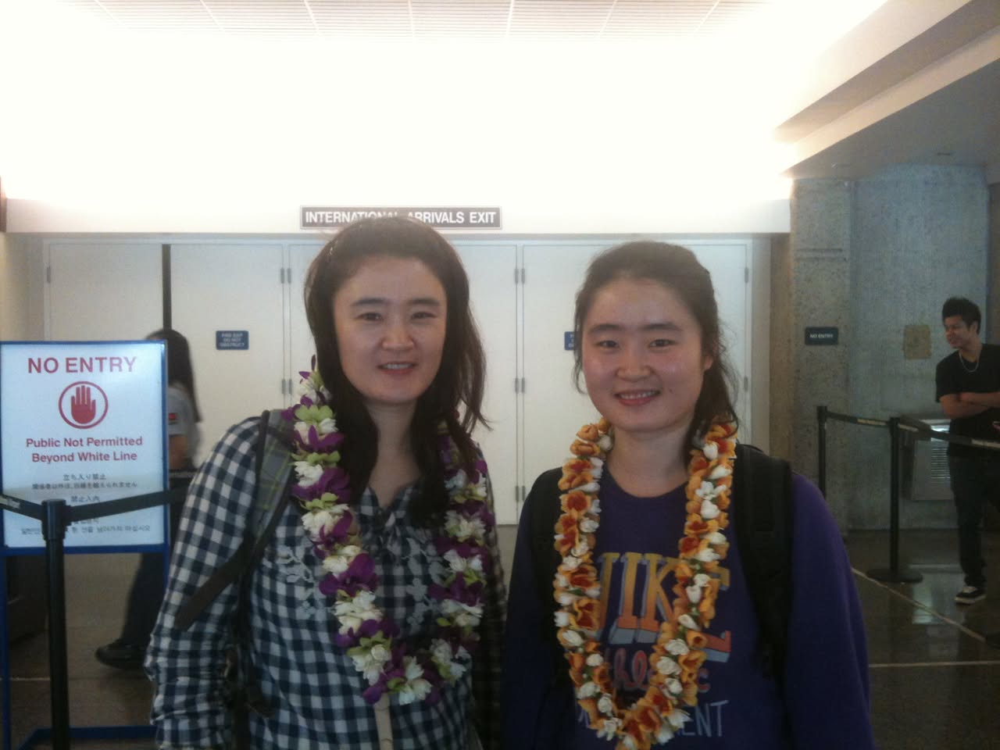
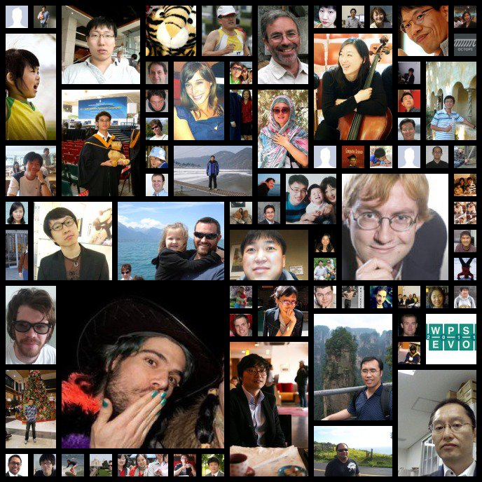

# 2011년 5월

[← 2011년](README.md)

### 5월 4일 (수) 10:08 · Sung Kim shared a link.

🔗 <http://it.tmcnet.com/topics/it/articles/168895-software-engineer-ranked-best-job-2011.htm>

### 5월 13일 (금) 15:45 · is happy for his last lecture (SP 2011).…

is happy for his last lecture (SP 2011). This is the last slide!

**이미지 캡션:** 이 이미지는 "COMP 211 Software Engineering Summary"라는 제목의 프레젠테이션 또는 보고서의 표지 또는 요약 페이지로 보입니다. 중앙에는 파란색 필기체로 "Software Engineering Summary"라는 큰 글자가 쓰여 있으며, 그 아래에는 검은색 필기체로 "Sung Kim"이라는 이름이 있습니다. 이미지의 왼쪽 상단에는 빨간색으로 "COMP 211"이라는 글자가 있으며, 'O' 안에는 별 모양이 있습니다. "Software"라는 단어 주변에는 "Software? Why we care?", "Software Process", "Modeling", "Design Patterns", "Debugging & Code Review", "Testing", "Software Evolution"과 같은 다양한 소프트웨어 엔지니어링 관련 용어들이 작은 아이콘이나 그림과 함께 흩어져 있습니다. 예를 들어, "Software Process" 옆에는 사람 모양과 화살표로 구성된 프로세스 다이어그램이 있고, "Software Evolution" 옆에는 DNA 나선형 구조와 함께 몇 가지 항목이 나열되어 있습니다. 이미지의 오른쪽 하단에는 파란 하늘을 배경으로 메가폰을 들고 있는 사람의 사진이 있습니다. 이 사람은 성인 남성으로 보이며, 정장을 입고 메가폰을 입에 대고 소리치고 있는 듯한 모습입니다. 전체적으로 흰색 배경에 다양한 색상과 폰트의 텍스트, 아이콘, 사진이 조화롭게 배치되어 있어 정보 전달과 시각적 흥미를 동시에 유발하는 디자인입니다. 분위기는 학술적이면서도 창의적이고 활기찬 느낌을 줍니다.

### 5월 13일 (금) 17:42 · Sung Kim shared a link.

🔗 <http://www.ust.hk/eng/news/press_20110510-876.html>

### 5월 15일 (일) 01:05 · registered an Introductory Flying Traini…

registered an Introductory Flying Training Program, including a 45-minute Theory Lesson and a 25-minute Simulator Practice at Aviation Centre.

http://www.aviationcentre.com.hk/home.html

### 5월 16일 (월) 12:40 · finally finished all FSE reviews. Happy …

finally finished all FSE reviews. Happy that almost all of his reviews concur with others. Good luck on your FSE papers! 

http://2011.esec-fse.org/

### 5월 20일 (금) 09:57 · is on the way to Hawaii for MSR/ICSE wit…

is on the way to Hawaii for MSR/ICSE with 4 PHD students and 1 postdoc in his research group. See you all there!

### 5월 20일 (금) 20:05 · When are we meeting again and where? :-)

When are we meeting again and where? :-)

### 5월 20일 (금) 20:05 · ↪ When are we meeting again and where? :-)

*다른 프로필에 남긴 글*

When are we meeting again and where? :-)

### 5월 23일 (월) 14:43 · Happy b day

Happy b day

### 5월 23일 (월) 14:43 · ↪ Happy b day

*다른 프로필에 남긴 글*

Happy b day

### 5월 25일 (수) 11:33 · totally enjoyed his first scuba diving i…

totally enjoyed his first scuba diving in Hawaii with chris bird. I highly recommend it.

**이미지 캡션:** 한 명의 성인 남성이 흰색 밴 앞에 서서 활짝 웃고 있으며, 그의 어깨에는 수건이 걸쳐져 있습니다. 그는 검은색 반팔 티셔츠와 꽃무늬 반바지를 입고 있으며, 손목에는 시계를 차고 있습니다. 밴의 운전석에는 선글라스와 검은색 모자를 쓴 또 다른 사람이 앉아 있으며, 안전벨트를 하고 있습니다. 밴의 옆면에는 "Sea Breeze WATERSPORTS PARASAIL - JET SKI and more..."라는 문구와 함께 야자수, 태양, 돌고래 그림이 그려져 있습니다. 배경에는 열대 식물과 건물 일부가 보이며, 전체적으로 휴양지에서의 즐거운 활동을 앞둔 듯한 분위기입니다.

### 5월 26일 (목) 06:02 · is happy for the Spotlight Paper for the…

is happy for the Spotlight Paper for the May/June 2011 issue of the IEEE Transactions on Software Engineering. http://www.computer.org/portal/web/tse

### 5월 27일 (금) 04:25 · packed his icse bag today with volley ba…

packed his icse bag today with volley ball, frisbee, hat, swimsuit, laptop, and icse program. Aloha!

**이미지 캡션:** 검은색 천으로 된 가방 안에 여러 물건이 담겨 있으며, 가방 안에는 흰색과 노란색이 섞인 배구공이 놓여 있고, 배구공 옆에는 파란색 테두리가 있는 물건이 보인다. 가방 안쪽에는 흰색 천과 파란색 천이 겹쳐져 있으며, 흰색 천 위에는 'ICSE 2011'이라고 적힌 흰색 종이가 놓여 있다. 종이에는 'Wednesday May 25 4:00pm'이라는 글자와 함께 'Investing in Software Engineering: A View from ICSE's Supporters'라는 제목이 보인다. 종이에는 'Jung kim'이라는 이름도 적혀 있다. 가방은 어두운 갈색의 무늬가 있는 천 위에 놓여 있다.

### 5월 29일 (일) 03:43 · is so ready for his first ESEC/FSE PC me…

is so ready for his first ESEC/FSE PC meeting. Good luck to all ESEC/FSE submitters!

### 5월 29일 (일) 04:09 · is happy for his two Microsoft SEIF awar…

is happy for his two Microsoft SEIF awards.

**이미지 캡션:** 두 개의 마이크로소프트 리서치 어워드 상장이 나란히 놓여 있으며, 각각은 액자에 담겨 있다. 상장에는 "Microsoft Research Award"라는 제목이 크게 쓰여 있고, "Presented to" 아래에는 "Sunghun Kim"이라는 이름이 적혀 있다. 두 상장 모두 "For a competitively selected project"라는 문구와 함께 프로젝트 내용이 명시되어 있는데, 왼쪽 상장에는 "Detecting and Fixing Bugs as they are Created in Visual Studio"라고 되어 있고, 오른쪽 상장에는 "GATE: Game-based Automatic Testing Environment"라고 되어 있다. 두 상장 모두 "Under the Software Engineering Innovation Foundation (SEIF)"라는 문구와 함께 2011년 5월 날짜가 기재되어 있다. 또한, "Tony Hey"와 "Judith Bishop"의 서명과 직책이 포함되어 있으며, 하단에는 "Microsoft Research" 로고와 "Microsoft" 로고가 보인다. 배경은 나무 재질의 바닥으로 보이며, 상장들은 흰색 테두리의 검은색 액자에 담겨 있다. 전체적으로 진지하고 성취를 축하하는 분위기이다.

### 5월 29일 (일) 08:48 · Where are you going today?

Where are you going today?

### 5월 29일 (일) 08:48 · ↪ Where are you going today?

*다른 프로필에 남긴 글*

Where are you going today?

### 5월 29일 (일) 10:41 · Good to see you here.

Good to see you here.

### 5월 29일 (일) 10:41 · ↪ Good to see you here.

*다른 프로필에 남긴 글*

Good to see you here.

### 5월 29일 (일) 10:42 · I really like your smile. :-)

I really like your smile. :-)

### 5월 29일 (일) 10:42 · ↪ I really like your smile. :-)

*다른 프로필에 남긴 글*

I really like your smile. :-)

### 5월 30일 (월) 06:04 · is thrilled to have two papers accepted …

is thrilled to have two papers accepted at ESEC/FSE 2011. He also found the rebuttal really works. A reviewer said, "... so I increased my score." I love ESEC/FSE PC members. See you @Szeged, Hungary. http://2011.esec-fse.org/

### 5월 31일 (화) 03:16 · Running Waikiki beach.

Running Waikiki beach.

### 5월 31일 (화) 03:17 · is waiting for his wife arrival today an…

is waiting for his wife arrival today and looking forward to a week vacation with his wife @Hawaii

### 5월 31일 (화) 12:38 · Aloha! My wife and sister have been arri…

Aloha! My wife and sister have been arrived at Hawaii!

**이미지 캡션:** 두 명의 젊은 아시아 여성들이 공항으로 보이는 실내 공간에서 꽃 목걸이를 하고 카메라를 향해 미소 짓고 있다. 왼쪽 여성은 검은색과 흰색 체크무늬 셔츠를 입고 보라색과 흰색 꽃으로 된 목걸이를 하고 있으며, 오른쪽 여성은 보라색 티셔츠 위에 주황색, 흰색, 노란색 꽃으로 된 목걸이를 하고 있다. 배경에는 "INTERNATIONAL ARRIVALS EXIT"라는 표지판과 "NO ENTRY"라고 쓰인 파란색 표지판이 보인다. 또한, 다른 사람들과 출입 통제 바가 보인다. 전반적으로 밝고 긍정적인 분위기이다.

### 5월 31일 (화) 16:59 · Friend Matrix analyzes your profile and …

Friend Matrix analyzes your profile and creates a unique collage of your best friends.
http://friendmatrix.co

**이미지 캡션:** 이 사진은 다양한 사람들의 얼굴 사진을 콜라주 형식으로 모아놓은 것으로, 대부분은 상반신 또는 얼굴 위주로 촬영되었다. 왼쪽 상단에는 어린 여자아이가 노란색과 초록색 옷을 입고 환하게 웃고 있으며, 그 옆에는 안경을 쓴 젊은 남성이 흰색 셔츠를 입고 있다. 중앙에는 졸업 가운을 입고 곰 인형을 안고 있는 남학생이 있고, 그 위에는 호랑이 얼굴 그림이 있다. 오른쪽 상단에는 안경을 쓴 중년 남성이 환하게 웃고 있으며, 그 옆에는 첼로를 켜고 있는 젊은 여성이 있다. 여러 장의 사진에는 다양한 인종과 연령대의 사람들이 각기 다른 표정과 복장으로 등장하며, 일부 사진에서는 야외 풍경이나 실내 배경이 보인다. 콜라주 하단에는 카우보이 모자를 쓴 남성이 손가락에 녹색 매니큐어를 칠하고 있는 모습이 클로즈업되어 있고, 그 옆에는 정장을 입은 남성이 서 있으며, 멀리 산과 하늘이 보이는 풍경 사진도 있다. 일부 사진에는 "OCTOPI"와 "WPS 1-0-1-1 EVO"라는 텍스트가 보인다. 전반적으로 다양한 사람들의 일상적인 모습과 특별한 순간들을 담은 사진들로 구성되어 있다.
