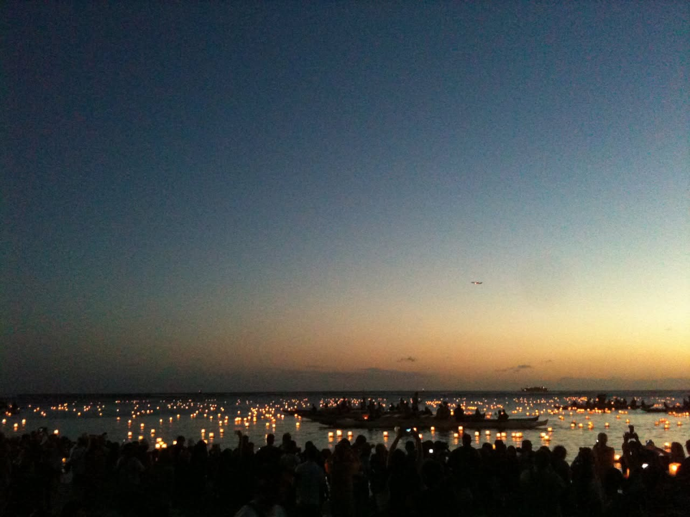
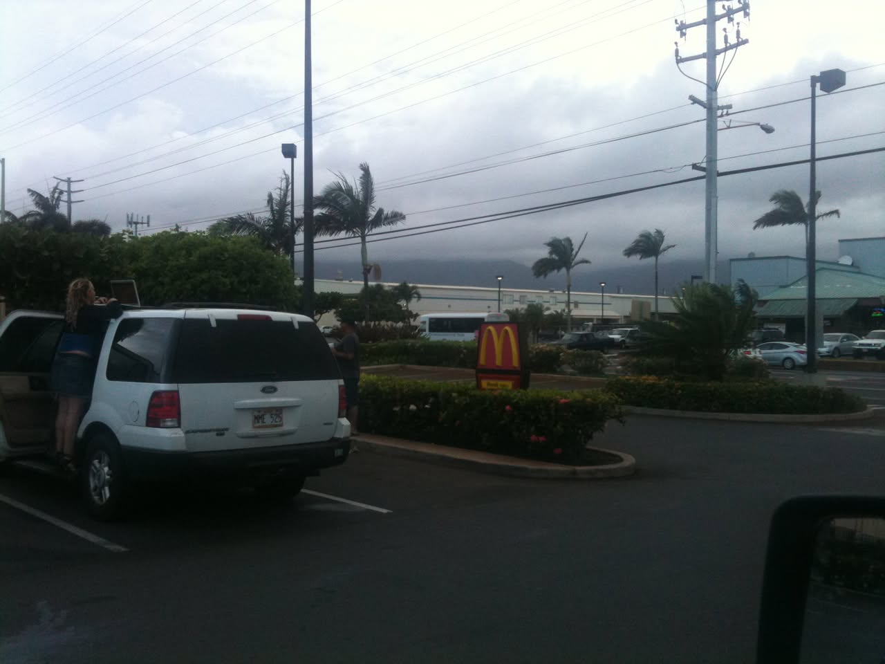
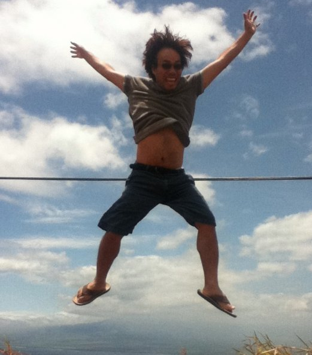
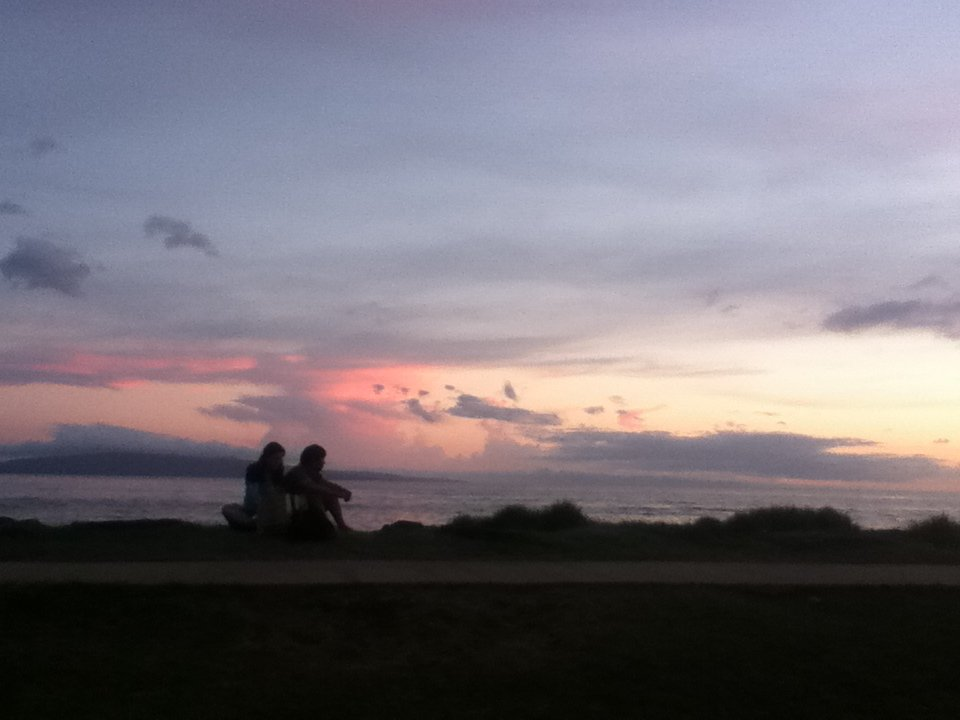
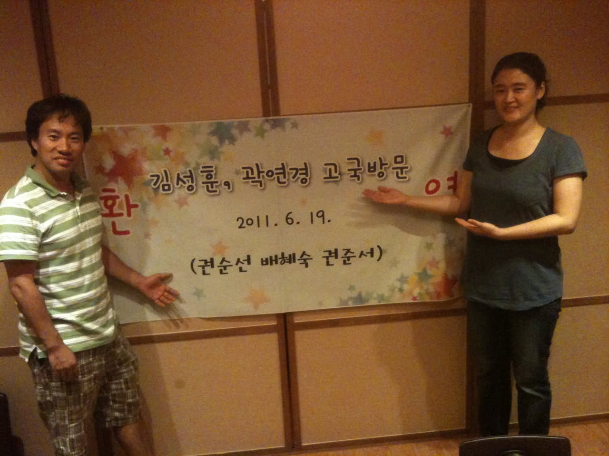
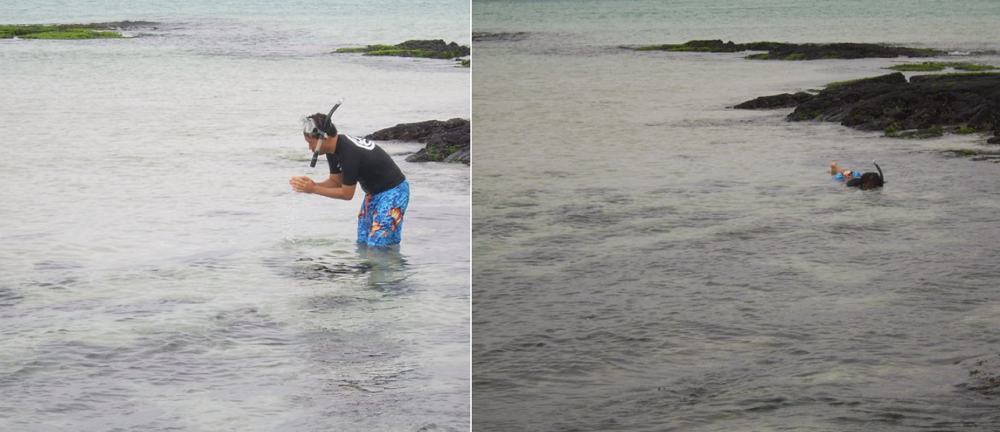
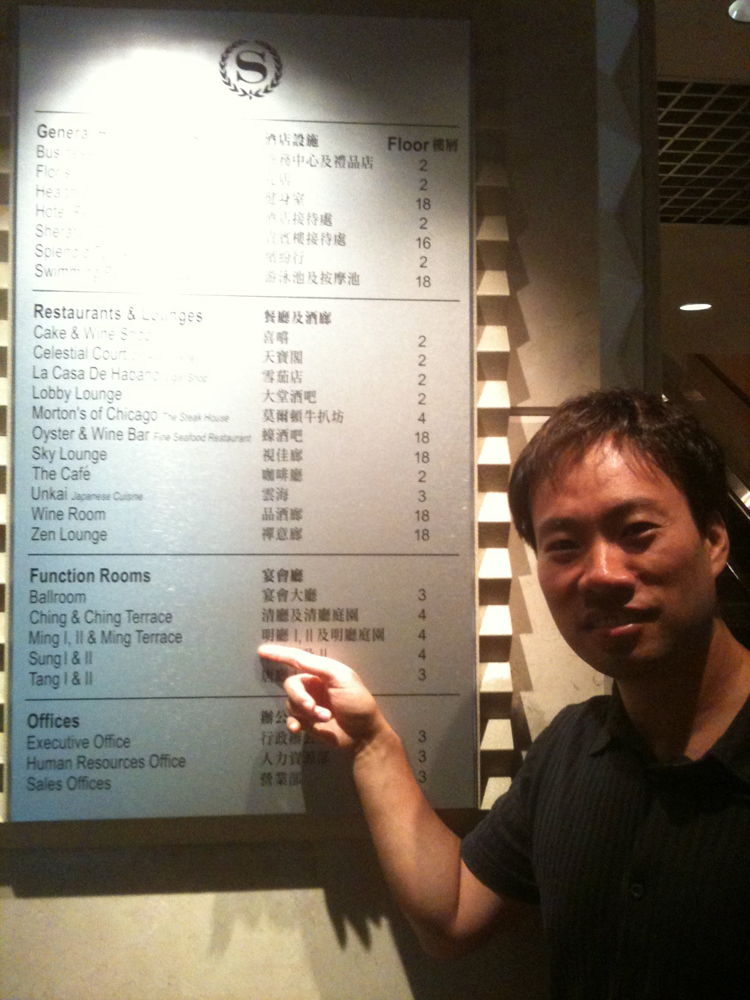

# 2011년 6월

[← 2011년](README.md)

### 6월 2일 (목) 14:40 · Congrats!

Congrats!

🔗 <http://www.csc.ncsu.edu/news/1181>

### 6월 2일 (목) 15:09 · Hawaii 2011 lantern floating festival fo…

Hawaii 2011 lantern floating festival for world peace.

**이미지 캡션:** 해 질 녘의 바닷가에 수많은 사람들이 모여 있으며, 바다 위에는 수백 개의 작은 등불이 떠 있어 마치 별이 뜬 것처럼 아름다운 광경을 연출하고 있습니다. 사람들은 대부분 어두운 실루엣으로 보이지만, 일부는 손에 등불을 들고 있거나 휴대폰으로 사진을 찍는 등 행사에 참여하고 있습니다. 바다에는 여러 척의 작은 배들이 떠 있고, 멀리 수평선에는 희미하게 선박의 모습도 보입니다. 하늘은 짙은 남색에서 주황색으로 이어지는 그라데이션을 이루고 있으며, 멀리 작은 비행기 한 대가 날고 있습니다. 전반적으로 평화롭고 경건한 분위기 속에서 특별한 의식이나 축제가 진행되고 있는 것으로 보입니다.한 분위기 속에서 특별한 의식이나 축제가 진행되고 있는 것으로 보입니다.

### 6월 2일 (목) 23:23 · good bye Honolulu and Aloah Maui!

good bye Honolulu and Aloah Maui!

### 6월 6일 (월) 00:41 · loves free wifi @mcdonalds.

loves free wifi @mcdonalds.

**이미지 캡션:** 흐린 날씨에 맥도날드 드라이브 스루 앞에서 흰색 SUV 차량의 뒷문이 열려 있고, 금발 머리의 젊은 여성이 차량에 기대어 노트북을 사용하고 있으며, 옆에는 성인 남성이 서 있다. 배경에는 맥도날드 간판과 함께 야자수, 건물, 전신주, 그리고 흐린 하늘이 보인다. 차량 번호판에는 "MME 525"라고 적혀 있다. 전반적으로 평범한 일상적인 풍경이다.

### 6월 6일 (월) 04:46 · likes the best jump shot @Maui.

likes the best jump shot @Maui.

**이미지 캡션:** 푸른 하늘과 뭉게구름을 배경으로 한 성인 남성이 점프하고 있다. 남성은 20대 후반에서 30대 초반으로 보이며, 헝클어진 머리에 선글라스를 착용하고 있다. 회색 반팔 티셔츠를 입고 있으며, 티셔츠가 말려 올라가 복근이 드러나 있다. 허리에는 검은색 벨트를 착용한 것으로 보이며, 무릎 위까지 오는 짧은 청바지를 입고 있다. 발에는 갈색 슬리퍼를 신고 있다. 남성은 두 팔을 활짝 벌리고 다리를 넓게 벌린 채 점프하고 있으며, 입을 살짝 벌리고 즐거운 표정을 짓고 있다. 배경에는 희미하게 산과 바다가 보이며, 사진 중앙에는 얇은 검은색 선이 가로로 지나가고 있다. 전체적으로 활동적이고 자유로운 분위기를 연출하고 있다. 중앙에는 얇은 검은색 선이 가로로 지나가고 있다. 전체적으로 활동적이고 자유로운 분위기를 연출하고 있다.

### 6월 6일 (월) 04:50 · last night @Maui!

last night @Maui!

**이미지 캡션:** 해 질 녘 바닷가에서 두 명의 성인이 나란히 앉아 바다를 바라보고 있다. 왼쪽의 성인은 여성으로 추정되며, 연한 색상의 옷을 입고 있으며, 오른쪽의 성인은 남성으로 추정되며, 어두운 색상의 옷을 입고 있다. 두 사람 모두 옆모습을 보이고 있으며, 표정은 명확하게 보이지 않지만 차분하고 사색적인 분위기를 풍긴다. 배경으로는 잔잔한 바다와 멀리 보이는 섬, 그리고 분홍색과 보라색이 섞인 아름다운 노을이 펼쳐져 있다. 앞쪽에는 어두운 잔디밭이 있어 인물들과 바다를 구분하는 역할을 한다. 전체적으로 평화롭고 로맨틱한 분위기를 자아내는 풍경 사진이다. 분위기를 자아내는 풍경 사진이다.

### 6월 14일 (화) 07:23 · Sung Kim shared a link.

🔗 <http://www.zdnet.com/blog/microsoft/microsoft-poised-to-launch-new-visual-studio-debugging-tool/9676>

### 6월 18일 (토) 22:42 · rode a bicycle with Prof. Wu and Dr. Jun…

rode a bicycle with Prof. Wu and Dr. Jung. It was really beautiful.

### 6월 20일 (월) 00:05 · is a year older now, but happy for all b…

is a year older now, but happy for all birthday wishes. Thank you!

### 6월 20일 (월) 00:25 · is amazed by Kwon family's warm welcome.…

is amazed by Kwon family's warm welcome. They are so sweet.

**이미지 캡션:** 한 명의 성인 남성과 한 명의 성인 여성이 실내에서 환영 현수막 앞에서 포즈를 취하고 있다. 남성은 30대 후반에서 40대 초반으로 보이며, 녹색과 흰색 줄무늬가 있는 폴로 셔츠와 체크무늬 반바지를 입고 있다. 그는 카메라를 향해 미소를 짓고 있으며, 그의 오른손은 현수막을 향해 뻗어 있다. 여성은 20대 후반에서 30대 초반으로 보이며, 회색 티셔츠와 검은색 바지를 입고 있다. 그녀는 카메라를 향해 미소를 짓고 있으며, 양손을 현수막을 향해 뻗고 있다. 현수막에는 한국어로 "김성훈, 곽연경 고국방문"이라고 쓰여 있으며, 그 아래에는 "2011. 6. 19."라는 날짜와 "(권순선 배혜숙 권준서)"라는 이름이 적혀 있다. 현수막에는 별 모양의 장식도 있다. 배경은 나무 패널로 된 벽으로, 따뜻하고 아늑한 분위기를 자아낸다. 전반적으로 사진은 환영 행사 또는 축하 행사의 모습을 담고 있는 것으로 보인다.쓰여 있으며, 그 아래에는 "2011. 6. 19."라는 날짜와 "(권순선 배혜숙 권준서)"라는 이름이 적혀 있다. 현수막에는 별 모양의 장식도 있다. 배경은 나무 패널로 된 벽으로, 따뜻하고 아늑한 분위기를 자아낸다. 전반적으로 사진은 환영 행사 또는 축하 행사의 모습을 담고 있는 것으로 보인다.

### 6월 26일 (일) 10:14 · did Snorkeling again in the Jeju island …

did Snorkeling again in the Jeju island in Korea. (before & after) :-)

**이미지 캡션:** 왼쪽 사진에는 성인 남성이 검은색 반팔 상의와 파란색 꽃무늬 반바지를 입고 스노클링 장비를 착용한 채 얕은 바닷물에 서서 손으로 물을 떠 올리고 있다. 남성은 20대 후반에서 30대 초반으로 보이며, 얼굴 표정은 명확하게 보이지 않지만 무언가에 집중하는 듯한 모습이다. 배경에는 옅은 녹색의 해초가 붙어 있는 검은색 바위들이 보이며, 잔잔한 바닷물은 맑고 투명하다. 오른쪽 사진에는 같은 남성이 스노클링 장비를 착용한 채 물 위에 누워 헤엄치고 있다. 남성은 물속에서 얼굴을 내밀고 있으며, 주변에는 검은색 바위들이 보인다. 두 사진 모두 자연스러운 해변의 풍경을 담고 있으며, 평화롭고 여유로운 분위기를 자아낸다.이 보인다. 두 사진 모두 자연스러운 해변의 풍경을 담고 있으며, 평화롭고 여유로운 분위기를 자아낸다.

### 6월 30일 (목) 09:54 · found his rooms (Sung I, II) in Sheraton…

found his rooms (Sung I, II) in Sheraton hotel in Hong Kong!

**이미지 캡션:** 한 남성이 검은색 셔츠를 입고 카메라를 향해 미소를 지으며 오른손으로 안내판을 가리키고 있다. 안내판에는 'General', 'Restaurants & Lounges', 'Function Rooms', 'Offices'와 같은 다양한 카테고리와 함께 각 시설의 이름과 층수가 한국어와 영어로 적혀 있다. 남성은 30대에서 40대로 보이며, 배경에는 격자무늬 벽과 조명이 보인다. 전체적으로 호텔이나 건물 내부의 안내 데스크 앞에서 정보를 확인하는 듯한 분위기이다.heir corresponding floor numbers. The board has English and Chinese text, and a Sheraton logo is visible at the top. The background is a textured wall with geometric patterns. The overall atmosphere is casual and informative, suggesting the man is either a guest or an employee providing directions.

### 6월 30일 (목) 23:22 · I like your new picture. How are you doi…

I like your new picture. How are you doing?

### 6월 30일 (목) 23:22 · ↪ I like your new picture. How are you doi…

*다른 프로필에 남긴 글*

I like your new picture. How are you doing?
