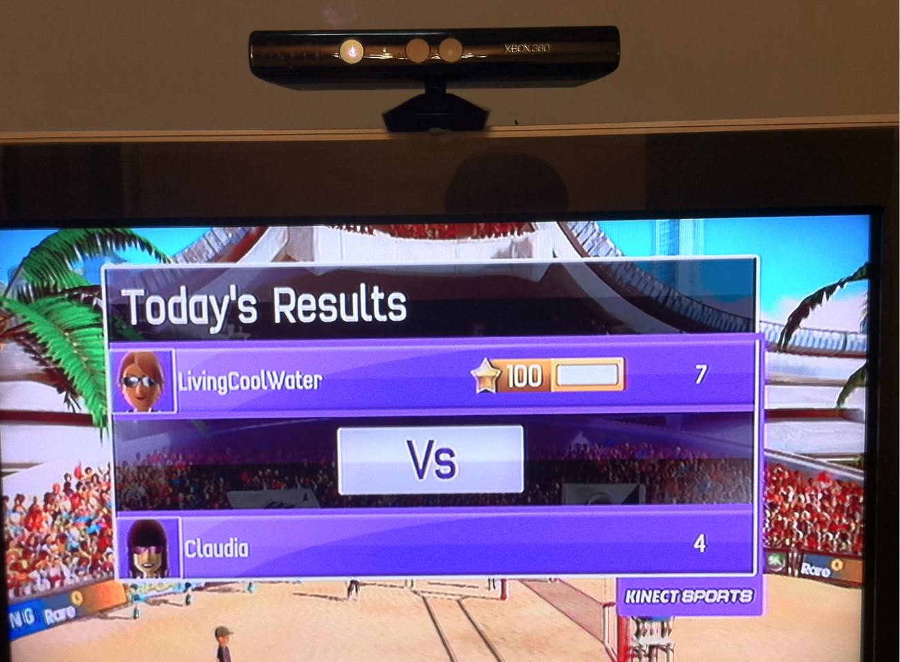
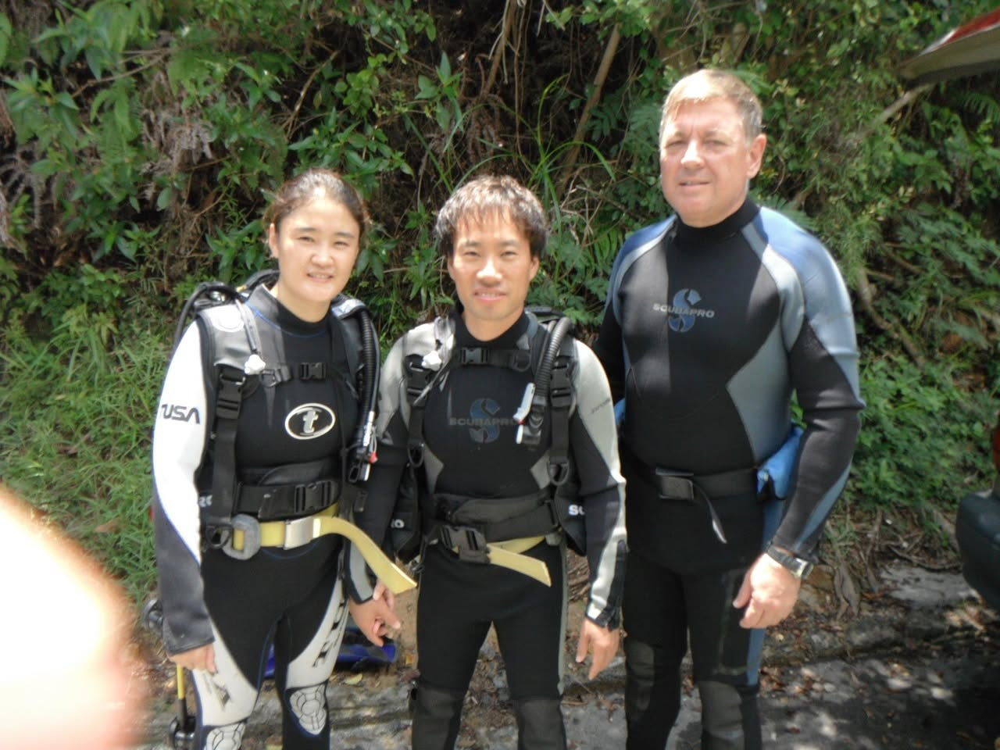
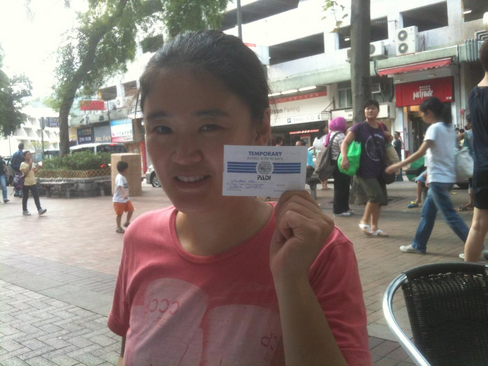
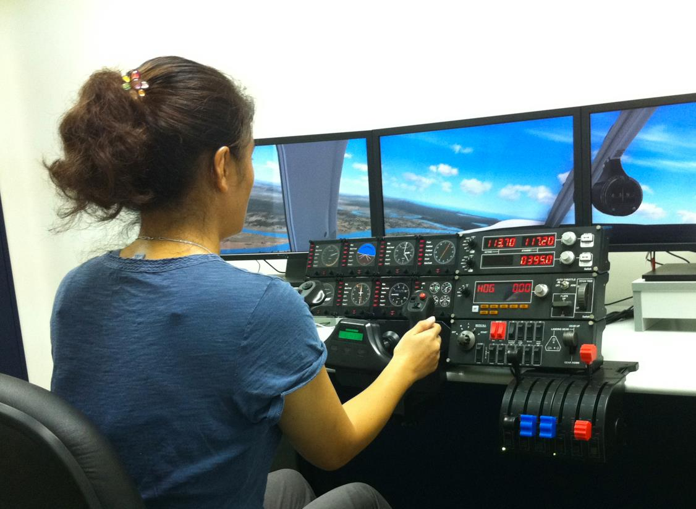
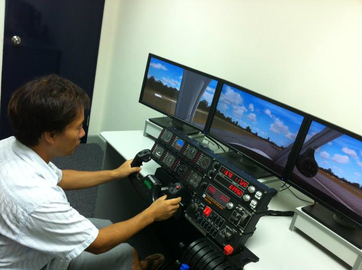

# 2011년 8월

[← 2011년](README.md)

### 8월 1일 (월) 23:55 · look forward to

look forward to

🔗 <https://www.surveymonkey.com/s/XHS2ZNJ>

### 8월 12일 (금) 08:35 · got *100* for Kinect Sports. Now he is l…

got *100* for Kinect Sports. Now he is looking forward to the Kinect Sports: Season 2.

**이미지 캡션:** 화면에는 Xbox 360 키넥트 센서가 TV 상단에 설치되어 있고, TV 화면에는 "Today's Results"라는 제목과 함께 게임 결과가 표시되고 있습니다. 게임은 "LivingCoolWater"라는 이름의 플레이어가 100점, 7개의 별을 획득했고, "Claudia"라는 이름의 플레이어는 4개의 별을 획득한 것으로 나타납니다. 두 플레이어의 아바타가 보이며, "LivingCoolWater"는 선글라스를 낀 여성 아바타이고, "Claudia"는 보라색 머리를 한 여성 아바타입니다. 배경에는 야외 스포츠 경기장이 보이며, 관중석에는 많은 사람들이 앉아 있습니다. 야자수와 푸른 하늘도 보입니다. 화면 하단에는 "KINECT SPORTS"라는 로고가 보입니다. 전체적으로 게임의 승패를 보여주는 결과 화면으로, 밝고 활기찬 분위기입니다.경기장이 보이며, 관중석에는 많은 사람들이 앉아 있습니다. 야자수와 푸른 하늘도 보입니다. 화면 하단에는 "KINECT SPORTS"라는 로고가 보입니다. 전체적으로 게임의 승패를 보여주는 결과 화면으로, 밝고 활기찬 분위기입니다.

### 8월 12일 (금) 09:09 · 📷 앨범: New PADI Open Water Divers! (3장)

**이미지 캡션:** 세 명의 다이버가 숲이 우거진 야외에서 포즈를 취하고 있다. 왼쪽에는 젊은 성인 여성이 검은색과 흰색 잠수복을 입고 있으며, 왼쪽 팔에는 "USA"라고 적혀 있다. 그녀는 검은색 잠수 장비를 착용하고 있으며, 노란색 벨트를 두르고 있다. 가운데에는 젊은 성인 남성이 검은색 잠수복과 잠수 장비를 착용하고 있다. 오른쪽에는 중년의 성인 남성이 검은색과 파란색 잠수복을 입고 있으며, 왼쪽 가슴에는 "SCUBAPRO"라고 적혀 있다. 세 사람 모두 카메라를 향해 미소를 짓고 있으며, 배경에는 울창한 녹색 식물이 보인다. 전반적으로 사진은 다이빙 활동을 준비하거나 마친 후의 즐거운 분위기를 나타낸다.다. 전반적으로 사진은 다이빙 활동을 준비하거나 마친 후의 즐거운 분위기를 나타낸다.
 
**이미지 캡션:** 한 성인 여성이 분홍색 티셔츠를 입고 카메라를 향해 미소를 지으며 PADI 임시 자격증을 들고 있다. 그녀는 20대 후반에서 30대 초반으로 보이며, 검은색 머리카락을 뒤로 묶었다. 그녀가 들고 있는 임시 자격증에는 "TEMPORARY EXPIRES AFTER 90 DAYS"와 "PADI"라는 글자가 쓰여 있다. 배경에는 상점들이 늘어선 거리와 사람들이 보인다. 거리에는 나무와 보도블록이 있으며, 건물에는 간판과 에어컨 실외기가 보인다. 몇몇 사람들은 걸어가고 있고, 한 어린 남자아이는 주황색 반바지를 입고 서 있다. 전체적으로 밝고 활기찬 분위기이다.서 있다. 전체적으로 밝고 활기찬 분위기이다.
 
**이미지 캡션:** 한 명의 성인 남성은 녹색과 흰색 줄무늬 폴로 셔츠를 입고 있으며, 다른 성인 남성은 붉은색 티셔츠를 입고 안경을 쓰고 있다. 두 사람은 테이블에 앉아 악수하고 있으며, 녹색 줄무늬 셔츠를 입은 남성은 작은 카드 한 장을 들고 있다. 붉은색 티셔츠를 입은 남성은 커피잔을 들고 있다. 배경에는 창문이 보이며, 창문에는 와이파이 및 기타 스티커가 붙어 있다. 전반적으로 두 사람이 야외에서 만나 거래를 하거나 인사를 나누는 듯한 분위기이다.

### 8월 16일 (화) 16:03 · Happy birthday.

Happy birthday.

### 8월 16일 (화) 16:03 · ↪ Happy birthday.

*다른 프로필에 남긴 글*

Happy birthday.

### 8월 16일 (화) 22:07 · 📷 앨범: Yeon and Sung can fly now. :-) (2장)

**이미지 캡션:** 한 성인 여성이 비행 시뮬레이터 앞에 앉아 조종간을 잡고 있다. 그녀는 30대 후반에서 40대 초반으로 보이며, 갈색 머리를 높이 묶고 머리핀으로 장식했다. 파란색 반팔 티셔츠를 입고 있으며, 목에는 얇은 은색 목걸이를 하고 있다. 표정은 화면에 집중하고 있어 보이지 않지만, 조종간을 잡은 손의 움직임으로 보아 조종에 몰두하고 있는 듯하다. 배경에는 세 개의 모니터가 설치되어 있으며, 모니터에는 푸른 하늘과 구름, 그리고 지평선이 보이는 비행 중인 항공기의 조종석 시뮬레이션 화면이 나타난다. 모니터 아래에는 다양한 계기판과 스위치, 그리고 스로틀 레버가 있는 비행 시뮬레이터 장치가 놓여 있다. 계기판에는 숫자와 그래프가 표시되어 있으며, 일부 숫자에는 "113.70", "117.20", "03950", "HOG", "000"과 같은 텍스트가 보인다. 전체적으로 학습 또는 훈련을 위한 비행 시뮬레이션 환경으로 보이며, 진지하고 집중된 분위기이다.다양한 계기판과 스위치, 그리고 스로틀 레버가 있는 비행 시뮬레이터 장치가 놓여 있다. 계기판에는 숫자와 그래프가 표시되어 있으며, 일부 숫자에는 "113.70", "117.20", "03950", "HOG", "000"과 같은 텍스트가 보인다. 전체적으로 학습 또는 훈련을 위한 비행 시뮬레이션 환경으로 보이며, 진지하고 집중된 분위기이다.
 
**이미지 캡션:** 한 명의 성인 남성이 비행 시뮬레이터 앞에 앉아 조종간을 잡고 있다. 남성은 30대 후반에서 40대 초반으로 보이며, 짧은 검은색 머리에 흰색 반팔 셔츠와 회색 반바지를 입고 슬리퍼를 신고 있다. 그는 화면에 집중하며 진지한 표정을 짓고 있으며, 오른손으로는 조종간을, 왼손으로는 스로틀을 조작하고 있다. 배경에는 흰색 벽과 짙은 파란색 문이 보이며, 책상 위에는 세 개의 모니터가 나란히 놓여 있다. 모니터 화면에는 비행기 조종석에서 보이는 활주로와 푸른 하늘, 구름 풍경이 펼쳐져 있다. 모니터 앞에는 다양한 계기판과 버튼, 스위치가 달린 비행 시뮬레이터 조종 장치가 놓여 있다. 전반적으로 학습 또는 훈련 상황으로 보이는 진지하고 집중된 분위기이다.계기판과 버튼, 스위치가 달린 비행 시뮬레이터 조종 장치가 놓여 있다. 전반적으로 학습 또는 훈련 상황으로 보이는 진지하고 집중된 분위기이다.

> Yeon Gyoung Gwack is taking off.
> Sung Kim landed successfully.
