# 2011년 9월

[← 2011년](README.md)

### 9월 5일 (월) 17:38 · Yea!

Yea!

🔗 <http://www2.seng.ust.hk/WebNews/Sites/SENGNews/ShowNews.aspx?AdminId=9&NewsId=768>

### 9월 6일 (화) 21:44 · 📷 앨범: Diving Intermission (3장)

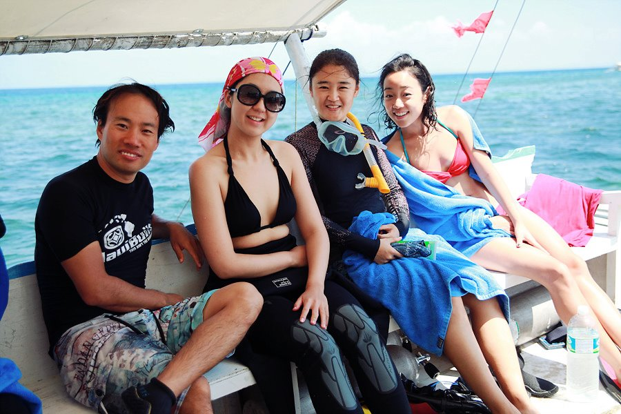
**이미지 캡션:** 네 명의 사람이 보트 위에서 바다를 배경으로 앉아 있다. 왼쪽부터 성인 남성은 검은색 티셔츠와 화려한 무늬의 반바지를 입고 있으며, 미소를 띠고 있다. 그 옆에는 성인 여성이 검은색 비키니 상의와 래시가드를 입고 있으며, 머리에는 분홍색과 노란색이 섞인 스카프를 두르고 선글라스를 착용하고 있다. 세 번째 사람은 성인 여성으로, 검은색 래시가드와 잠수복 하의를 입고 있으며 스노클링 장비를 목에 걸고 있다. 마지막으로 가장 오른쪽에 있는 성인 여성은 분홍색 비키니 상의를 입고 파란색 수건으로 몸을 감싸고 있다. 모두 즐거운 표정으로 카메라를 바라보고 있으며, 배경에는 푸른 바다와 하늘이 펼쳐져 있다. 보트 위에는 파란색과 분홍색 수건, 물병 등 여러 물건들이 놓여 있다. 전반적으로 화창한 날씨에 즐거운 해양 활동을 앞둔 듯한 분위기이다.
 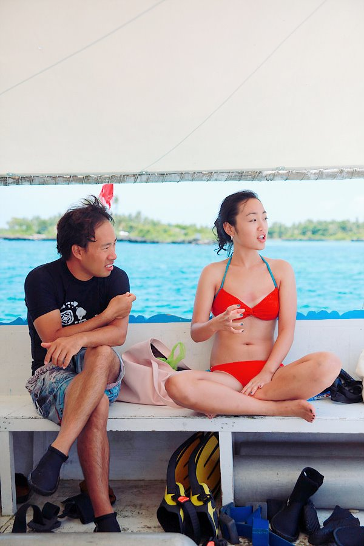
**이미지 캡션:** 푸른 바다를 배경으로 보트 위에서 쉬고 있는 성인 남성과 성인 여성의 모습이다. 남성은 30대 후반에서 40대 초반으로 보이며, 검은색 반팔 티셔츠와 무늬가 있는 반바지를 입고 검은색 양말을 신고 있다. 그는 편안하게 앉아 오른팔을 무릎 위에 올리고 왼팔은 앞으로 뻗고 있으며, 입가에 미소를 띠고 무언가에 집중하는 듯한 표정이다. 여성은 20대 초반에서 중반으로 보이며, 빨간색 비키니를 입고 다리를 꼬고 앉아 있다. 그녀는 머리를 뒤로 묶었고, 손가락을 움직이며 무언가를 설명하는 듯한 표정으로 오른쪽을 바라보고 있다. 두 사람 사이에는 분홍색과 녹색 가방이 놓여 있고, 보트 아래에는 스노클링 장비로 보이는 오리발과 마스크 등이 보인다. 배경에는 푸른 바다와 섬의 풍경이 펼쳐져 있어 휴양지에서의 여유로운 시간을 보내고 있는 것으로 보인다.
 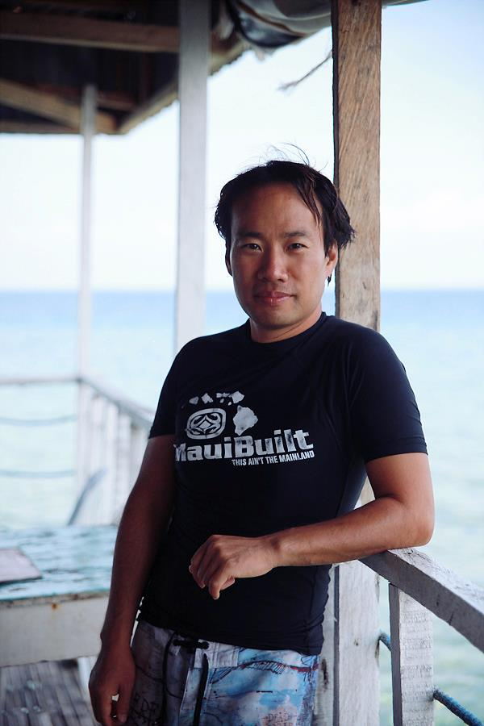
**이미지 캡션:** 한 명의 성인 남성이 야외에서 난간에 기대어 서 있다. 그는 30대 후반에서 40대 초반으로 보이며, 짧은 검은 머리에 약간의 이마 주름이 있다. 그는 검은색 반팔 티셔츠를 입고 있으며, 티셔츠에는 "MauiBuilt"라는 글자와 하와이 지도가 그려져 있고, 그 아래에는 "THIS AIN'T THE MAINLAND"라는 문구가 적혀 있다. 하의로는 파란색과 흰색이 섞인 무늬의 수영복 반바지를 입고 있다. 그의 표정은 약간의 미소를 띠고 있으며, 편안하고 여유로운 분위기를 풍긴다. 배경에는 푸른 바다와 하늘이 보이며, 나무로 된 난간과 지붕이 있는 구조물이 있어 휴양지나 해변가의 건물임을 짐작할 수 있다. 전반적으로 따뜻하고 평화로운 분위기의 사진이다.

### 9월 6일 (화) 21:50 · 📷 앨범: Profile pictures (1장)

**이미지 캡션:** 한 명의 성인 남성이 야외 테라스 난간에 기대어 서 있으며, 그는 30대 후반에서 40대 초반으로 보입니다. 짧은 검은 머리에 약간 젖어 있으며, 갸름한 얼굴형에 부드러운 미소를 띠고 있습니다. 검은색 반팔 티셔츠에는 "MauiBuilt THIS AIN'T THE MAINLAND"라는 문구와 함께 하와이 지도가 그려져 있습니다. 하의로는 파란색과 흰색 패턴의 수영복 반바지를 입고 있습니다. 배경에는 옅은 푸른색 바다와 하늘이 보이며, 나무로 된 기둥과 난간이 있는 야외 공간임을 알 수 있습니다. 전체적으로 편안하고 여유로운 분위기입니다.

### 9월 9일 (금) 21:59 · I miss it so much!

I miss it so much!

🔗 <http://en.wikipedia.org/wiki/Chuseok>

### 9월 11일 (일) 20:36 · found a very cute umbrella-vending machi…

found a very cute umbrella-vending machine in Hong Kong!

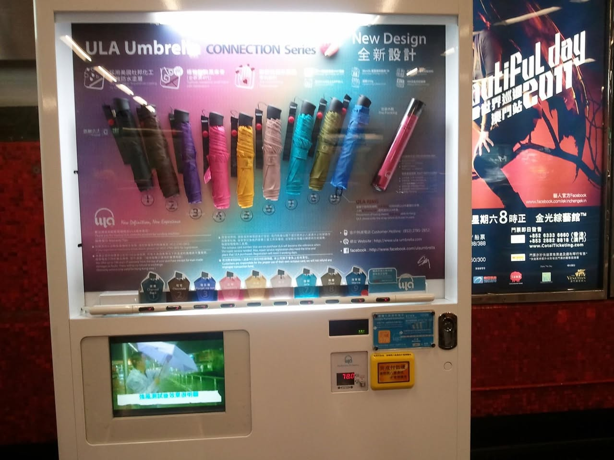
**이미지 캡션:** 이 사진은 자동 판매기에서 판매되는 다양한 색상의 우산을 보여줍니다. 자동 판매기 상단에는 "ULA Umbrella CONNECTION Series New Design 全新設計"라는 문구가 적혀 있으며, 여러 개의 우산이 진열되어 있습니다. 우산은 검정색, 보라색, 분홍색, 노란색, 파란색 등 다양한 색상으로 구성되어 있습니다. 자동 판매기 하단에는 작은 화면이 있는데, 화면에는 한 사람이 우산을 쓰고 빗속을 걷는 모습이 담겨 있습니다. 화면 아래에는 "完成付款"이라고 적힌 노란색 버튼과 숫자 "78.0"이 표시된 작은 화면이 있습니다. 자동 판매기 오른쪽에는 "Beautiful day 2011 澳門站"이라는 문구가 적힌 포스터가 붙어 있습니다. 포스터에는 한 사람이 나무에 매달려 있는 듯한 모습이 그려져 있으며, 행사 정보와 웹사이트 주소가 포함되어 있습니다. 전반적으로 자동 판매기가 설치된 실내 공간의 모습이며, 우산 판매를 홍보하는 광고와 함께 행사 정보가 함께 노출되고 있습니다.

### 9월 12일 (월) 22:23 · got a big gift for 2011  mid-autumn fest…

got a big gift for 2011  mid-autumn festival!

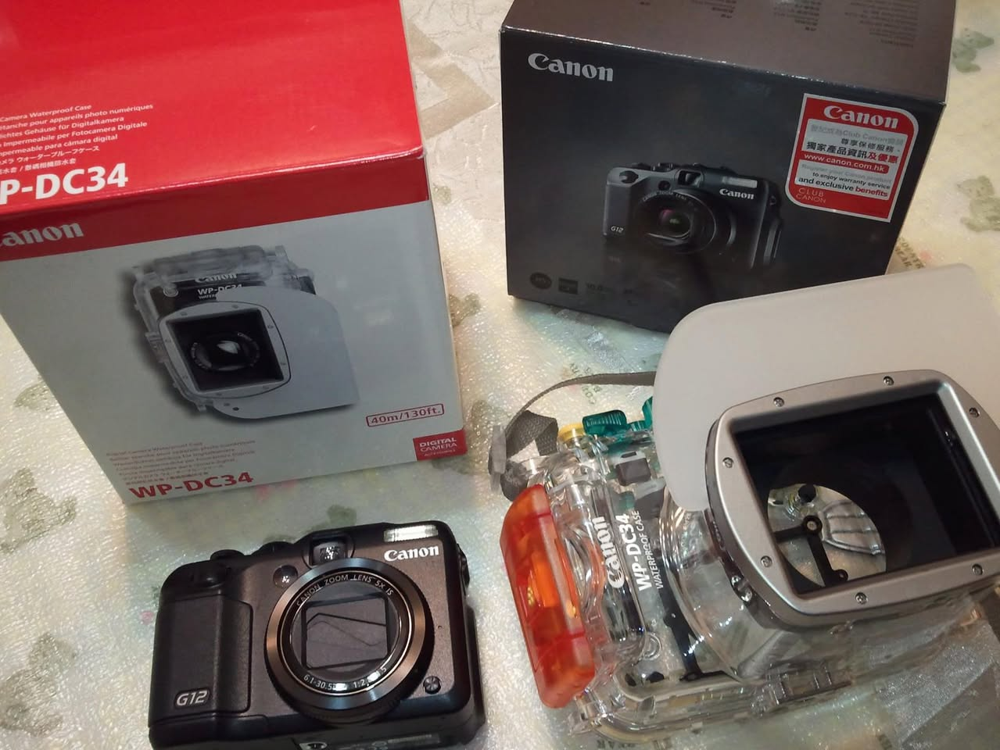
**이미지 캡션:** 사진에는 캐논 G12 디지털 카메라와 캐논 WP-DC34 방수 케이스가 담긴 상자 두 개가 놓여 있습니다. 왼쪽에는 빨간색 상자에 담긴 방수 케이스가 있고, 오른쪽에는 검은색 상자에 담긴 카메라가 있습니다. 상자들 앞에는 카메라 본체와 방수 케이스가 각각 놓여 있습니다. 상자에는 캐논 로고와 제품명, 그리고 방수 깊이 정보 등이 한국어, 영어, 일본어, 중국어 등 여러 언어로 표기되어 있습니다. 배경은 흰색 바탕에 옅은 무늬가 있는 천으로 보입니다. 전체적으로 제품 홍보 사진처럼 깔끔하게 정리된 모습입니다.

### 9월 13일 (화) 12:24 · 📷 앨범: Crocodile Needlefish (3장)

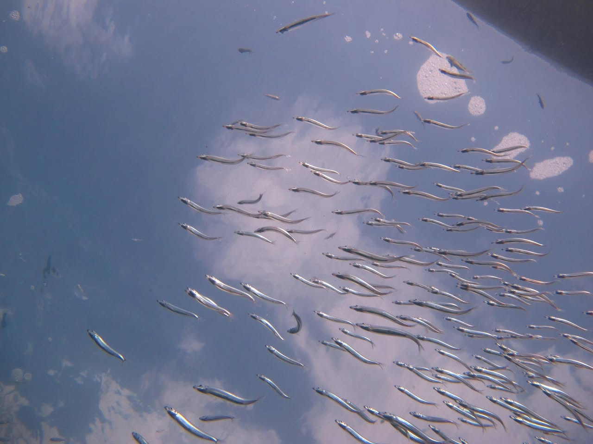
**이미지 캡션:** 수면 아래에서 촬영된 사진으로, 수십 마리의 작은 은빛 물고기 떼가 왼쪽에서 오른쪽으로 헤엄치고 있다. 물고기들은 길쭉하고 날씬한 몸매를 가지고 있으며, 햇빛을 반사하여 은색으로 빛나고 있다. 물고기 떼는 마치 하나의 유기체처럼 일사불란하게 움직이며, 일부는 서로 가까이 붙어 있고 일부는 약간 떨어져 있다. 배경은 맑고 푸른 하늘과 구름이 비치는 수면으로, 물속의 빛깔은 푸른색과 흰색이 섞여 신비로운 느낌을 준다. 사진의 오른쪽 상단에는 물방울과 함께 보트의 일부로 추정되는 어두운 물체가 희미하게 보인다. 전반적으로 평화롭고 생동감 넘치는 바닷속 풍경을 담고 있다.
 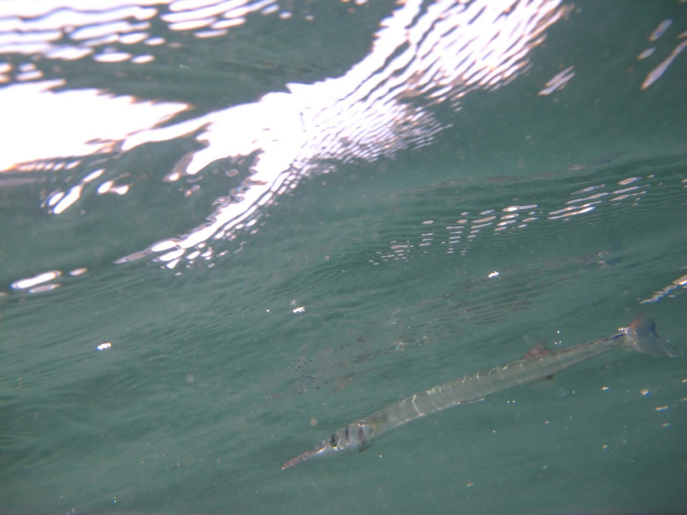
**이미지 캡션:** 수면 아래에서 촬영된 사진으로, 맑은 녹색 바닷물 속에서 길쭉한 주둥이를 가진 물고기 한 마리가 헤엄치고 있습니다. 물고기는 투명하고 은빛 비늘을 가지고 있으며, 꼬리 지느러미는 짙은 색을 띠고 있습니다. 수면 위로는 햇빛이 반사되어 하얗게 빛나는 물결 무늬가 보이며, 물속에는 작은 기포들이 떠다니고 있습니다. 전체적으로 평화롭고 자연적인 수중 환경의 모습을 담고 있습니다.
 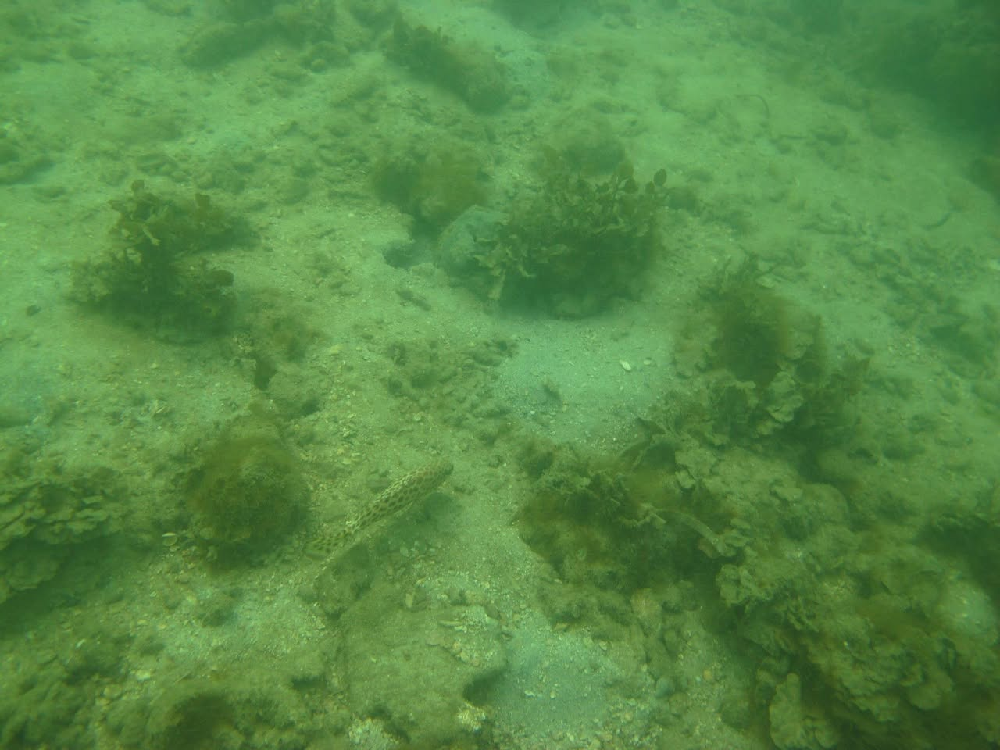
**이미지 캡션:** 수중 환경으로, 탁한 녹색 물속에서 모래와 바위, 해초가 보인다. 사진 왼쪽 하단에는 점박이 무늬를 가진 물고기가 헤엄치고 있으며, 주변에는 여러 개의 작은 바위와 해초 덩어리들이 흩어져 있다. 전반적으로 자연스러운 수중 생태계의 모습을 담고 있으며, 특별한 인물이나 텍스트는 보이지 않는다.

### 9월 13일 (화) 21:26 · gymnastics for Korean. I did it everyday…

gymnastics for Korean. I did it everyday when I was a child.

🔗 <http://www.youtube.com/watch?v=tUSBM4gPedU>

### 9월 15일 (목) 19:43 · 📷 앨범: Fish of today! (2장)

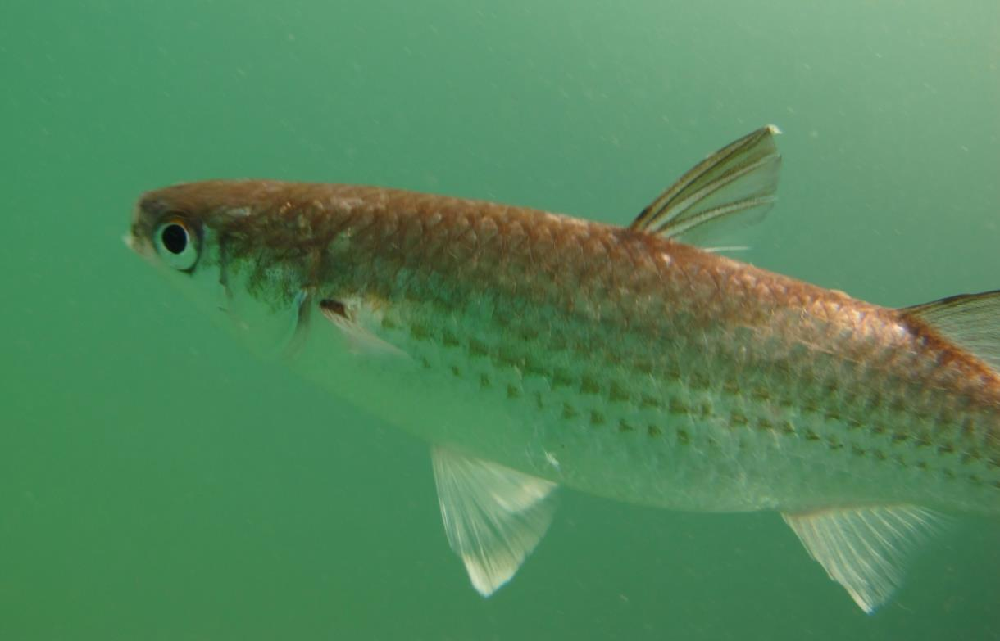
**이미지 캡션:** 수중에서 촬영된 숭어 한 마리의 모습으로, 물고기는 왼쪽을 향해 헤엄치고 있으며 몸통은 갈색 비늘로 덮여 있고 옆구리에는 희미한 줄무늬가 있습니다. 등지느러미와 배지느러미는 투명하고 얇으며, 꼬리지느러미는 보이지 않습니다. 물고기의 눈은 크고 검은색이며, 입은 작고 앞으로 튀어나와 있습니다. 배경은 옅은 녹색의 탁한 물이며, 물속에는 작은 기포들이 떠다니고 있습니다. 전체적으로 자연스러운 수중 환경의 모습을 담고 있습니다.
 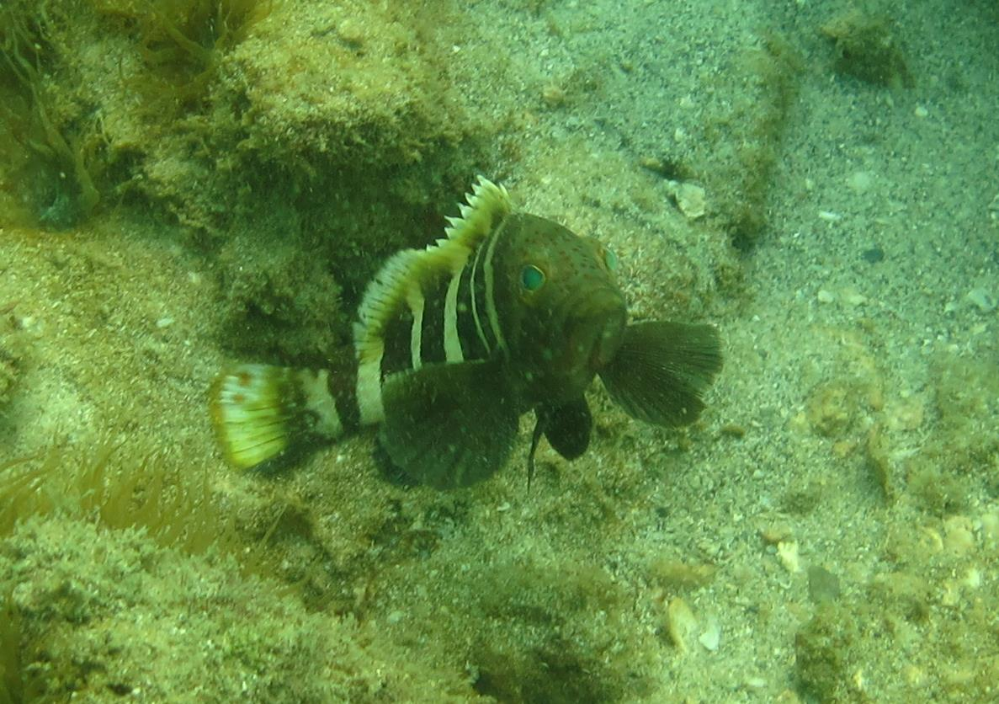
**이미지 캡션:** 수중 환경에서 촬영된 사진으로, 모래 바닥과 해초가 보이는 배경에 줄무늬가 있는 물고기 한 마리가 헤엄치고 있다. 물고기는 녹색 눈을 가지고 있으며, 몸통에는 검은색과 흰색의 줄무늬가 선명하게 나 있다. 지느러미는 짙은 색을 띠고 있으며, 꼬리 부분은 노란색과 흰색이 섞여 있다. 물고기는 카메라를 향해 약간 비스듬히 헤엄치고 있으며, 표정은 알 수 없다. 전반적으로 자연스러운 수중 생태를 보여주는 차분하고 평화로운 분위기이다.

> 10 cm long
> green-eye fish!

### 9월 17일 (토) 21:13 · 📷 앨범: jellyfish-they are beautiful but stinging (2장)

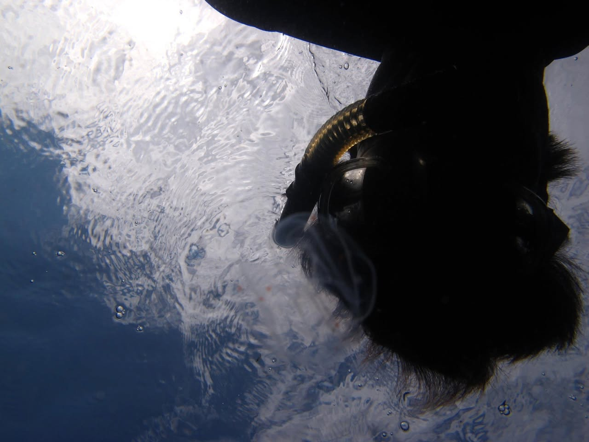
**이미지 캡션:** 이 사진은 수면 아래에서 촬영된 것으로, 성인 남성으로 추정되는 사람이 스노클링 장비를 착용하고 물속을 바라보고 있는 모습이다. 남성은 검은색 스노클링 마스크를 쓰고 있으며, 마스크 위로는 금색의 주름진 스노클 튜브가 보인다. 머리카락은 검은색으로 보이며, 물에 젖어 얼굴 주변으로 흩날리고 있다. 표정은 마스크 때문에 명확하게 보이지 않지만, 물속을 탐험하는 듯한 호기심이나 편안함이 느껴진다. 배경은 맑고 푸른 물과 수면 위로 비치는 햇빛으로 인해 반짝이는 물결로 이루어져 있다. 햇빛이 물 표면에 반사되어 밝은 빛과 그림자가 교차하며 역동적인 느낌을 준다. 물속에는 작은 기포들이 떠다니고 있으며, 이는 물의 움직임이나 숨을 내쉬는 모습과 관련이 있을 수 있다. 전체적으로 시원하고 평화로운 분위기를 자아내며, 수중 탐험이나 해양 활동을 연상시킨다.
 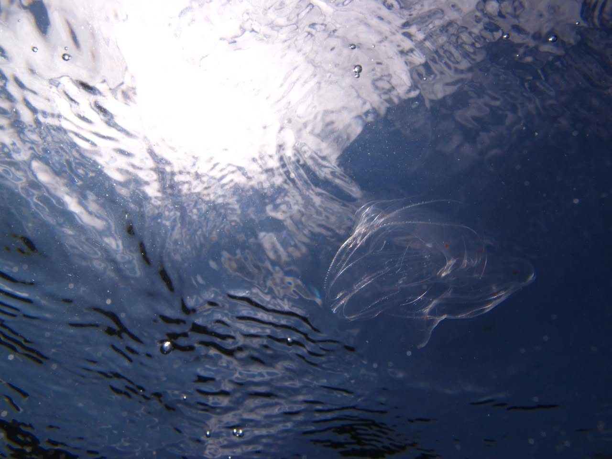
**이미지 캡션:** 수면 아래에서 촬영된 사진으로, 밝은 햇빛이 수면을 통해 물속으로 쏟아져 들어오고 있습니다. 물결치는 수면의 모습과 햇빛이 반사되어 만들어내는 빛줄기가 보입니다. 사진의 오른쪽에는 투명하고 길쭉한 형태의 해양 생물, 아마도 빗살벌레가 떠 있습니다. 이 생물은 여러 개의 빗살 모양 구조를 가지고 있으며, 붉은색 점들이 군데군데 보입니다. 주변에는 작은 기포들이 떠다니고 있으며, 물속은 푸른색을 띠고 있습니다. 전체적으로 평화롭고 신비로운 바닷속 풍경을 담고 있습니다.

### 9월 17일 (토) 21:17 · 📷 앨범: Crabs in Labster Bay in HK (6장)

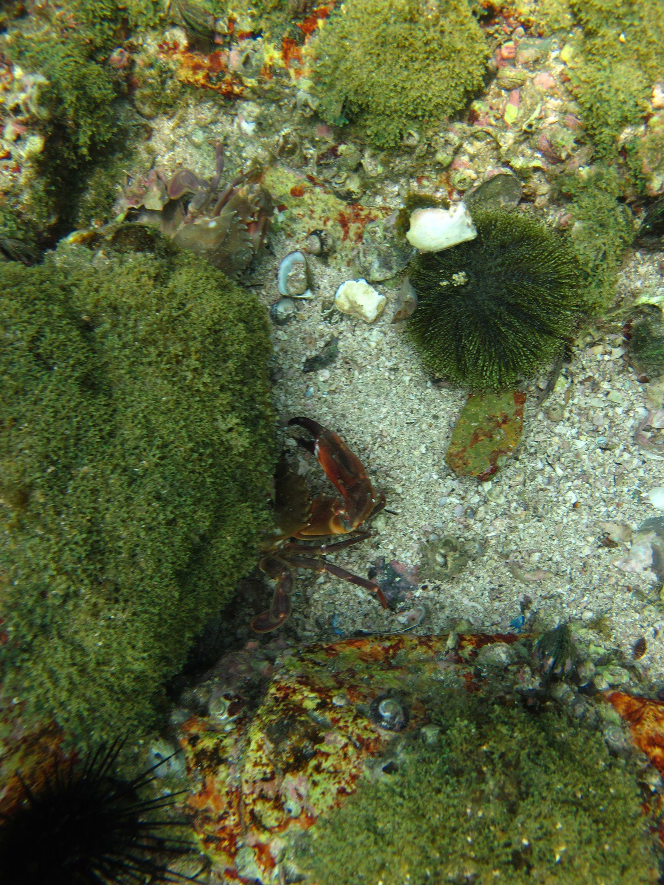
**이미지 캡션:** 이 사진은 수중 환경을 보여주며, 얕은 바다 밑바닥의 모래와 암석, 그리고 다양한 해양 생물들로 이루어져 있습니다. 중앙에는 붉은색 집게발을 가진 게 한 마리가 모래 위에 앉아 있으며, 게의 몸통은 갈색을 띠고 있습니다. 게의 왼쪽에는 짙은 녹색의 해조류가 무성하게 자라 있어 게의 은신처 역할을 하는 것으로 보입니다. 게의 오른쪽 위에는 둥글고 짙은 녹색의 성게가 있으며, 그 주변에는 흰색 조각과 작은 조개껍데기들이 흩어져 있습니다. 배경에는 다양한 색깔의 암석과 해조류가 어우러져 있으며, 일부 암석 표면에는 붉은색과 주황색의 산호 또는 해면이 붙어 있습니다. 사진의 왼쪽 하단에는 검은색 가시가 돋보이는 또 다른 성게의 일부가 보입니다. 전반적으로 자연 그대로의 수중 생태계를 담고 있으며, 생동감 넘치는 바닷속 풍경을 보여줍니다.
 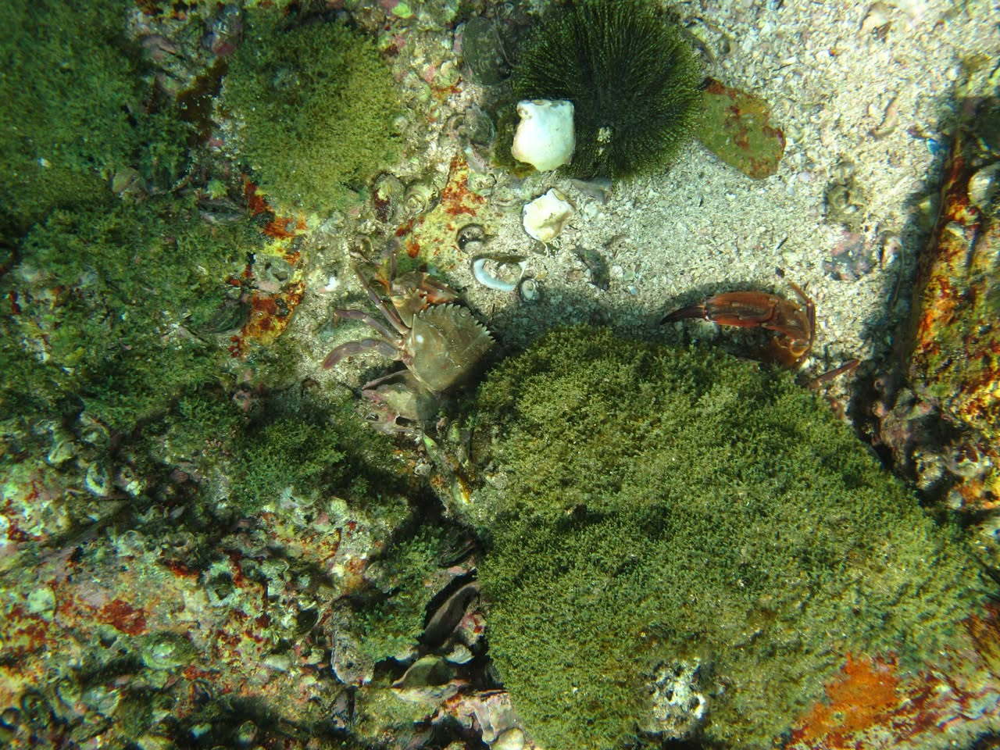
**이미지 캡션:** 이 수중 사진은 다양한 해양 생물과 식물로 뒤덮인 바닷속 풍경을 보여줍니다. 사진 중앙에는 짙은 녹색의 빽빽한 해조류 덩어리가 있으며, 그 위에는 갈색 갑각류가 자리 잡고 있습니다. 이 갑각류는 붉은색 집게발을 뻗고 있으며, 주변의 모래와 조개껍데기, 그리고 다른 해조류와 어우러져 있습니다. 사진의 왼쪽 상단에는 둥글고 짙은 녹색의 성게가 보이고, 그 옆에는 하얀색 조개껍데기와 붉은색의 해조류가 섞여 있습니다. 전반적으로 사진은 자연 그대로의 바닷속 생태계를 생생하게 담고 있으며, 다양한 색감과 질감이 조화를 이루고 있습니다.
 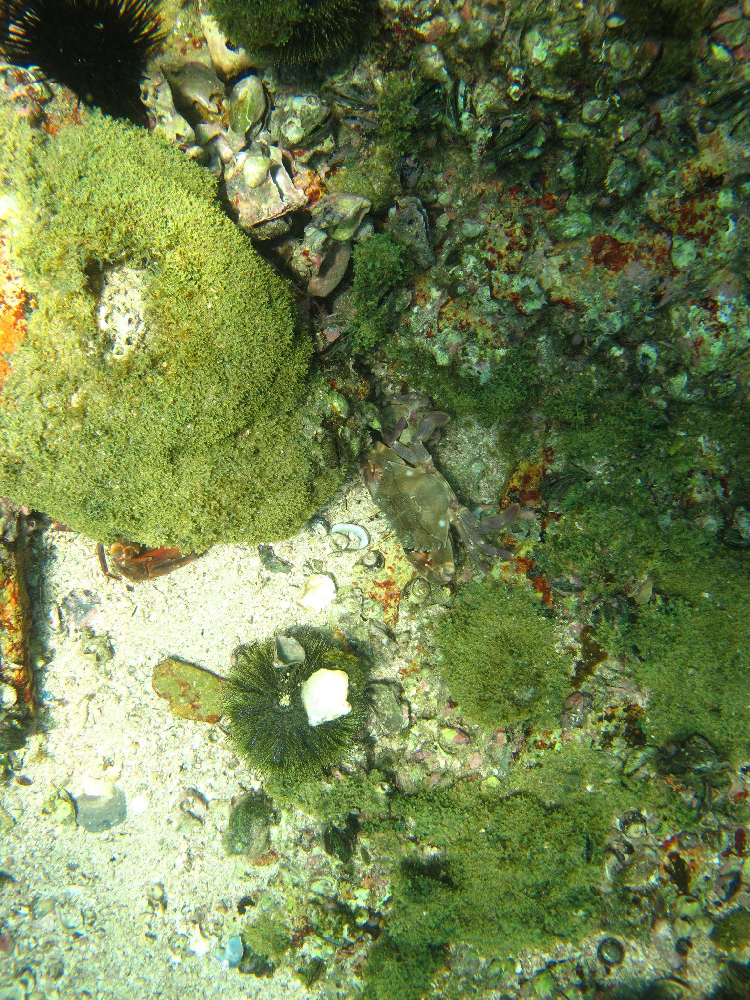
**이미지 캡션:** 이 사진은 수중 환경을 보여주며, 여러 해양 생물과 식물이 서식하는 바위와 모래 바닥을 담고 있습니다. 사진 중앙에는 갈색 갑각류가 보이며, 그 주변으로는 짙은 녹색의 해초들이 빽빽하게 자라 있습니다. 또한, 검은색 가시가 돋친 성게와 조개껍데기, 그리고 다양한 크기의 돌들이 바닥을 이루고 있습니다. 일부 바위 표면에는 굴이나 홍합 같은 패류가 붙어 있으며, 붉은색과 녹색을 띤 해조류도 관찰됩니다. 전반적으로 자연 그대로의 해저 생태계를 보여주는 모습이며, 생명력이 넘치는 수중 환경을 엿볼 수 있습니다.
 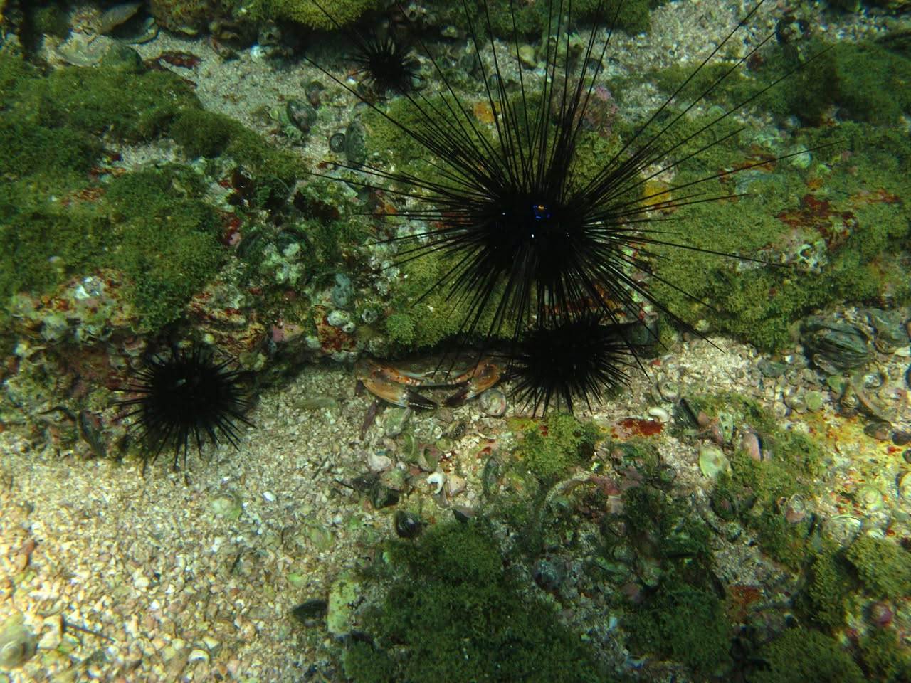
**이미지 캡션:** 이 사진은 수중 환경을 보여주며, 여러 개의 검은색 성게와 게 한 마리가 바위와 모래 바닥에 서식하고 있습니다. 사진 중앙에는 커다란 검은색 성게가 뾰족한 가시를 사방으로 뻗고 있으며, 그 옆에는 더 작은 성게가 있습니다. 성게들 주변으로는 녹색 해조류가 바위에 덮여 있고, 바닥에는 조개껍데기와 작은 돌멩이들이 흩어져 있습니다. 사진 오른쪽에는 갈색 갑각을 가진 게 한 마리가 바위틈에 숨어 있는 듯한 모습으로 보입니다. 전반적으로 자연 그대로의 해저 생태계를 담고 있으며, 평화롭고 고요한 분위기를 자아냅니다.
 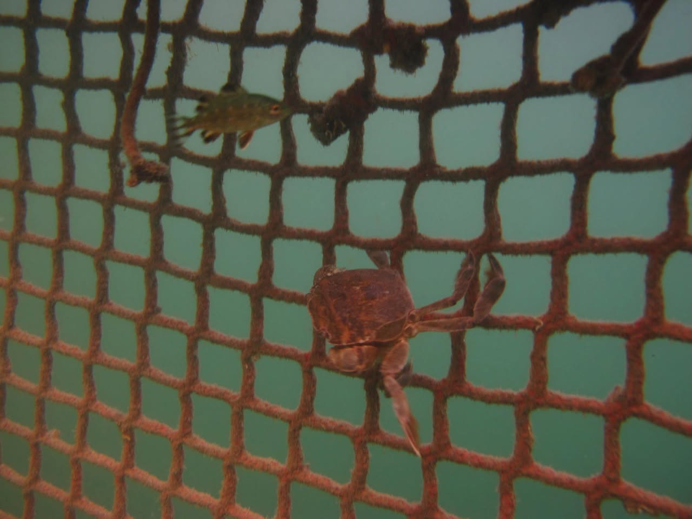
**이미지 캡션:** 이 수중 사진에는 붉은색 그물망이 화면을 가로지르고 있으며, 그물망의 격자 사이로 녹색의 탁한 물이 보인다. 그물망 앞쪽에는 갈색의 작은 게 한 마리가 오른쪽을 향해 기어가고 있으며, 게의 다리 여러 개가 그물망에 걸쳐 있다. 게의 등껍질은 붉은 갈색을 띠고 있으며, 전체적으로 거친 질감을 가지고 있다. 그물망 뒤쪽, 왼쪽 상단에는 작은 물고기 한 마리가 헤엄치고 있다. 물고기는 은색과 녹색이 섞인 색이며, 지느러미를 움직여 앞으로 나아가고 있다. 그물망은 낡고 이끼가 낀 듯한 모습이며, 일부에는 해조류나 작은 생물들이 붙어 있는 것으로 보인다. 전반적으로 어두운 수중 환경에서 자연적인 생태계의 한 단면을 포착한 사진으로, 약간은 흐릿하고 거친 질감이 느껴진다.
 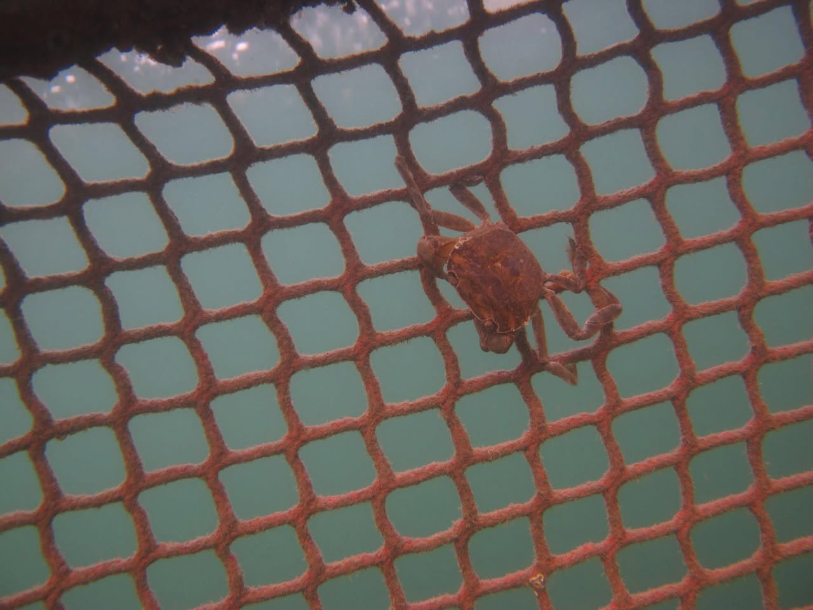
**이미지 캡션:** 이 사진은 수중 환경을 보여주며, 붉은색의 촘촘한 그물망이 화면을 가로지르고 있습니다. 그물망의 한 칸에 작은 갈색 게 한 마리가 붙어 있는 모습이 보입니다. 게는 집게발을 이용해 그물망을 잡고 있으며, 몸통은 그물망에 거의 밀착되어 있습니다. 게의 크기는 작고, 껍질은 약간 거친 질감으로 보입니다. 그물망 너머로는 흐릿한 녹색의 물이 보이며, 수면 위에서 비치는 빛으로 인해 희미한 밝은 부분이 관찰됩니다. 사진의 전체적인 분위기는 고요하고 자연스러운 수중 생태의 한 단면을 포착한 듯합니다. 특별히 보이는 텍스트는 없습니다.

### 9월 17일 (토) 21:22 · 📷 앨범: Spotted Boxfish - So cute! (4장)

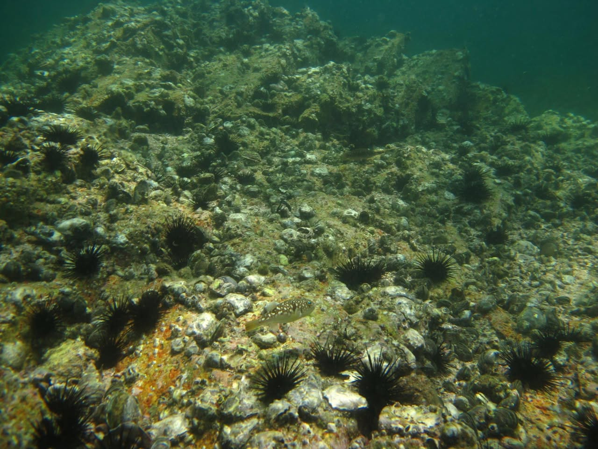
**이미지 캡션:** 수중 암반 지형으로, 바닥에는 검은색 성게가 빽빽하게 자라고 있으며, 군데군데 조개껍데기와 작은 돌멩이들이 흩어져 있습니다. 암반은 녹색과 갈색의 해조류로 뒤덮여 있으며, 일부 지역은 붉은색을 띠고 있습니다. 사진 중앙 오른쪽에는 점박이 무늬를 가진 작은 물고기 한 마리가 헤엄치고 있습니다. 수면은 옅은 녹색으로 보이며, 전반적으로 자연 그대로의 해저 풍경을 담고 있습니다.
 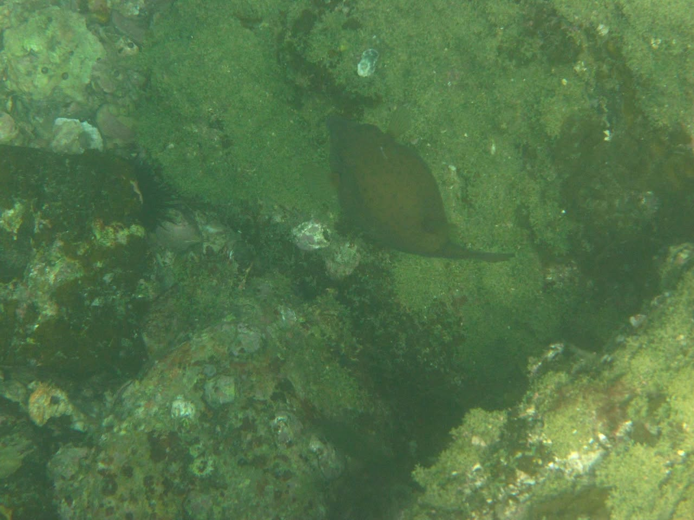
**이미지 캡션:** 수중 환경에서 촬영된 사진으로, 녹색 해초와 바위가 뒤덮인 바닥 위에 갈색 물고기 한 마리가 헤엄치고 있습니다. 물고기는 몸통이 길쭉하고 꼬리가 넓으며, 몸 전체에 어두운 점들이 불규칙하게 분포되어 있습니다. 주변에는 다양한 크기의 바위들이 있으며, 일부 바위는 녹색 해초로 덮여 있습니다. 사진의 전반적인 색감은 녹색과 갈색이 주를 이루며, 탁한 물 때문에 시야가 다소 제한적입니다.
 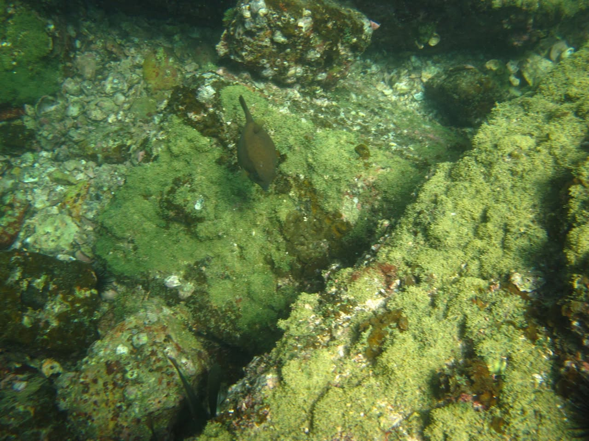
**이미지 캡션:** 수중 환경으로, 바위와 해초로 뒤덮인 바닥이 보인다. 중앙에는 어두운 갈색의 물고기 한 마리가 헤엄치고 있으며, 주변에는 녹색의 해초와 바위들이 빽빽하게 자리 잡고 있다. 바위 표면에는 조개껍데기나 작은 생물들이 붙어 있는 모습도 관찰된다. 전반적으로 자연 그대로의 바닷속 풍경을 담고 있으며, 물의 탁함으로 인해 약간 흐릿한 느낌을 준다.
 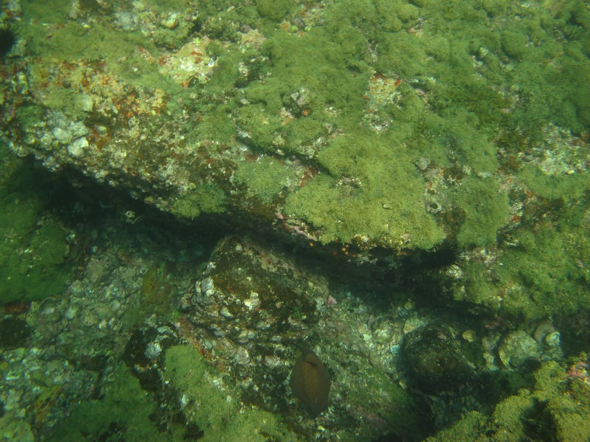
**이미지 캡션:** 이 사진은 수중 환경을 보여주며, 바위와 해초가 풍부하게 자라고 있습니다. 사진 중앙에는 짙은 녹색의 해초가 두껍게 덮인 바위가 있으며, 그 아래에는 어두운 틈이 보입니다. 바위 표면에는 다양한 크기와 색깔의 조개껍데기와 작은 돌멩이들이 붙어 있습니다. 사진의 왼쪽 하단에는 갈색 빛을 띠는 물고기 한 마리가 헤엄치고 있으며, 오른쪽 상단에는 검은색의 성게가 바위에 붙어 있는 모습도 관찰됩니다. 전반적으로 녹색과 갈색 톤이 주를 이루며, 자연 그대로의 해저 풍경을 담고 있습니다.

### 9월 17일 (토) 21:25 · 📷 앨범: Cute Butterflyfish in HK (3장)

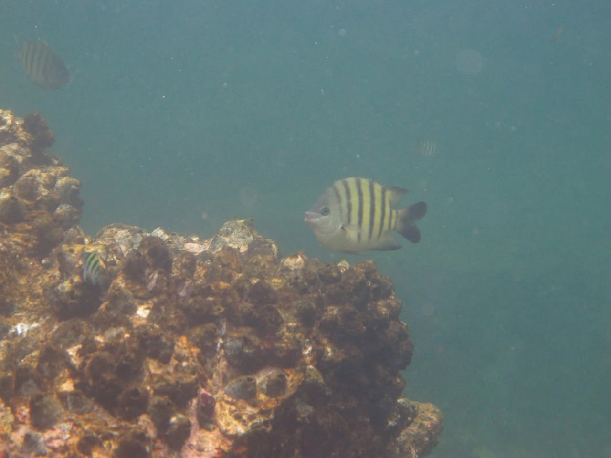
**이미지 캡션:** 수중 환경으로, 짙은 녹색의 물속에서 바위와 물고기들이 보인다. 화면 오른쪽에는 줄무늬가 있는 물고기 한 마리가 헤엄치고 있으며, 이 물고기는 노란색과 검은색 세로 줄무늬를 가지고 있다. 물고기는 둥근 몸통과 꼬리지느러미를 가지고 있으며, 눈은 작고 검은색이다. 물고기의 표정은 알 수 없다. 화면 왼쪽에는 거친 표면을 가진 바위가 보이며, 바위 위에는 작은 물고기 한 마리가 헤엄치고 있다. 이 물고기는 녹색과 검은색 줄무늬를 가지고 있으며, 더 작고 흐릿하게 보인다. 바위는 갈색과 회색을 띠고 있으며, 표면에는 작은 구멍들이 많이 나 있다. 배경은 옅은 녹색으로, 물속의 탁함과 빛의 산란으로 인해 흐릿하게 보인다. 전반적으로 평화롭고 자연적인 수중 풍경을 담고 있다.
 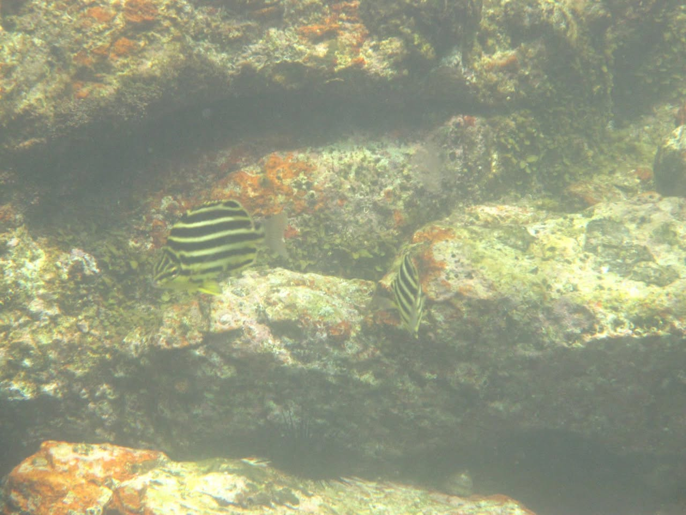
**이미지 캡션:** 수중 환경에서 두 마리의 줄무늬 물고기가 바위와 산호로 이루어진 배경 속에서 헤엄치고 있습니다. 왼쪽의 물고기는 노란색 바탕에 검은색 줄무늬가 뚜렷하며, 오른쪽의 물고기는 비슷한 무늬를 가지고 있지만 더 작고 흐릿하게 보입니다. 배경은 다양한 색상의 바위와 산호로 뒤덮여 있으며, 일부는 붉은색과 녹색을 띠고 있습니다. 물은 약간 탁한 편이며, 전체적으로 자연스러운 수중 생태계의 모습을 보여줍니다.
 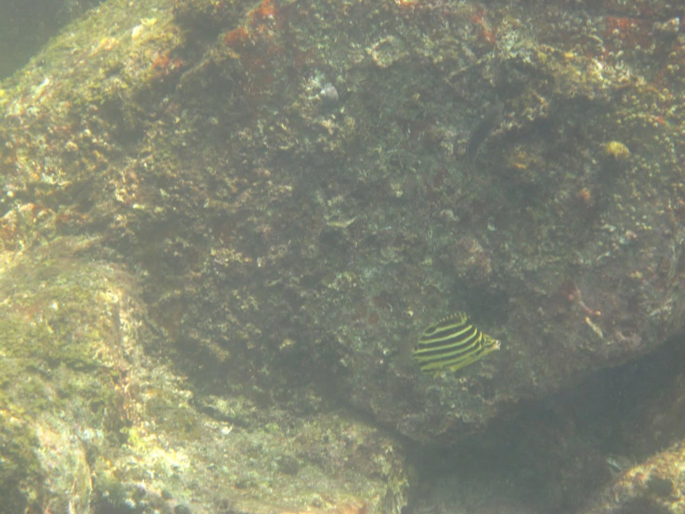
**이미지 캡션:** 수중 환경에서 찍은 사진으로, 짙은 녹색과 갈색을 띤 바위와 산호초가 배경을 이루고 있으며, 그 사이로 맑은 물이 보인다. 사진의 오른쪽 하단에는 노란색 바탕에 검은색 줄무늬가 선명한 작은 열대어 한 마리가 헤엄치고 있다. 물고기는 측면에서 보이며, 지느러미를 펼치고 유영하는 모습이다. 전반적으로 자연 그대로의 수중 생태계를 보여주는 평화로운 분위기이다.

### 9월 17일 (토) 21:56 · It's really sad.

It's really sad.

🔗 <http://www.youtube.com/watch?v=zAcwHZraZGs>

### 9월 18일 (일) 11:35 · 📷 앨범: Today's fish (3장)

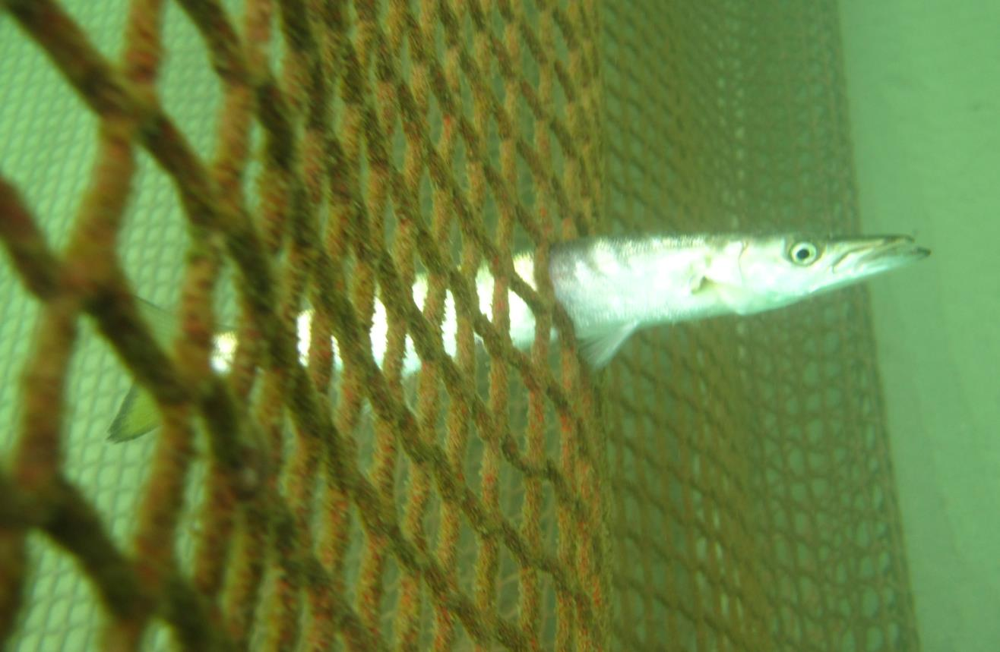
**이미지 캡션:** 수중 환경에서 낚시 그물에 걸린 듯한 모습의 긴 몸통을 가진 은색 물고기가 보인다. 물고기는 뾰족한 주둥이와 큰 눈을 가지고 있으며, 몸통에는 어두운 색의 줄무늬가 희미하게 보인다. 물고기는 그물 사이로 헤엄치고 있으며, 배경은 녹색 빛을 띤 흐릿한 수중 환경이다. 낚시 그물은 굵은 밧줄로 짜여 있으며, 일부는 녹조나 해조류로 뒤덮여 있는 것으로 보인다. 전체적으로 물속에서 포착된 자연스러운 순간을 담고 있으며, 물고기의 생존을 위한 움직임이나 낚시의 상황을 짐작하게 한다.
 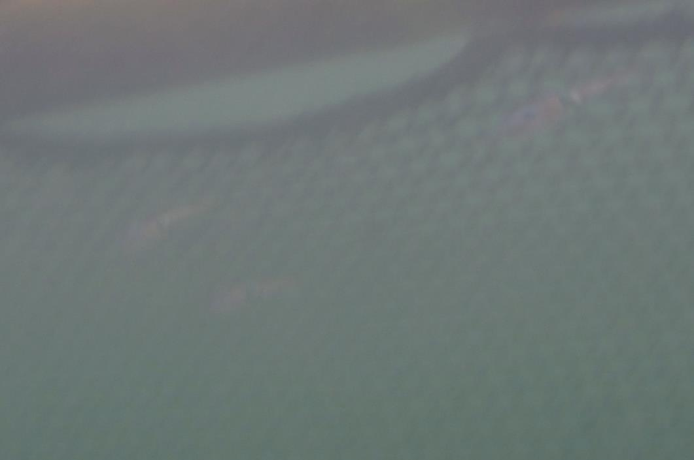
**이미지 캡션:** 이 사진은 흐릿하고 초점이 맞지 않아 사람이나 사물을 명확하게 식별하기 어렵습니다. 전반적으로 녹색 톤이 지배적이며, 배경에는 격자무늬 패턴이 희미하게 보입니다. 사진 상단에는 어두운 색상의 곡선 형태가 있어 무언가의 일부일 가능성이 있습니다. 사진 중앙 부분에는 희미하게 사람의 형상으로 보이는 두 개의 얼룩이 있으며, 성인 남성으로 추정되지만 자세한 외모나 복장, 표정, 행동은 파악하기 어렵습니다. 이 사진은 실내 또는 실외의 어두운 환경에서 촬영된 것으로 보이며, 특별한 텍스트는 보이지 않습니다. 전체적으로 흐릿하고 불분명한 분위기를 자아냅니다.
 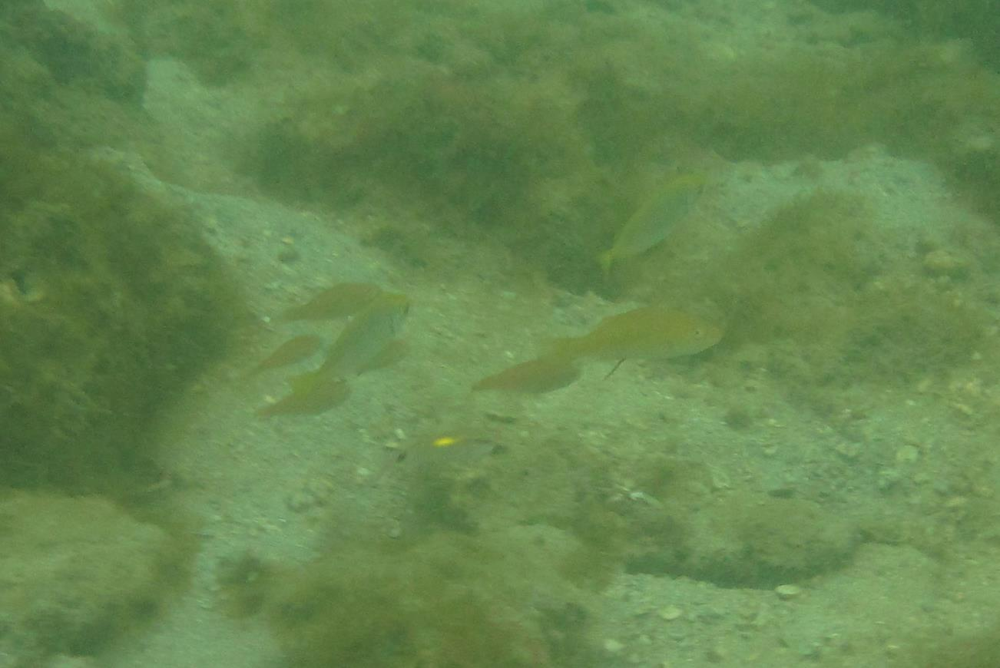
**이미지 캡션:** 수중에서 촬영된 사진으로, 모래와 해초가 뒤섞인 바닥 위로 여러 마리의 작은 물고기들이 헤엄치고 있다. 물고기들은 주로 황갈색 또는 옅은 노란색을 띠고 있으며, 일부는 붉은색 기운을 띤다. 사진 중앙 왼쪽에는 세 마리의 물고기가 무리를 지어 있고, 그 옆으로 더 많은 물고기들이 흩어져 있다. 사진 오른쪽 상단에는 한 마리의 물고기가 더 멀리 보인다. 배경은 탁한 녹색빛을 띠며, 수중 환경의 흐릿함을 나타낸다. 특별한 텍스트나 인물은 보이지 않으며, 전체적으로 자연스러운 수중 생태계의 한 장면을 담고 있다.

> too late to save him.
> 3 baby squids - they are too fast to catch.

### 9월 29일 (목) 12:34 · In HK, the No. 8 Southeast Gale or Storm…

In HK, the No. 8 Southeast Gale or Storm Signal is in force. Classes are canceled, and I stopped ICSE paper writing for a while as well. :-)

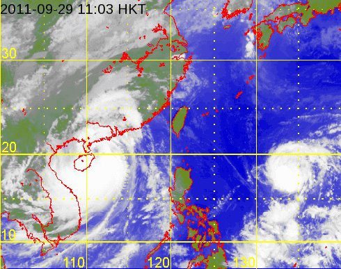
**이미지 캡션:** 이 위성 사진은 2011년 9월 29일 오전 11시 3분 홍콩 시간 기준으로 동아시아 지역의 기상 상황을 보여준다. 사진 상단에는 "2011-09-29 11:03 HKT"라는 텍스트가 표시되어 있다. 사진에는 격자선이 그려져 있으며, 위도 10, 20, 30과 경도 110, 120, 130이 표시되어 있다. 사진의 왼쪽에는 중국 대륙과 대만이 보이며, 대만 남쪽으로 거대한 태풍이 위치해 있다. 태풍은 소용돌이치는 구름으로 둘러싸여 있으며, 뚜렷한 눈이 관찰된다. 중국 남부 해안 지역도 구름으로 덮여 있다. 사진의 오른쪽에는 필리핀 제도와 일본 열도가 보이며, 필리핀 동쪽 해상에도 또 다른 태풍이 위치해 있다. 이 태풍 역시 소용돌이치는 구름을 형성하고 있지만, 왼쪽의 태풍보다 작고 덜 발달한 것으로 보인다. 전반적으로 사진은 두 개의 강력한 태풍이 동아시아 해상에서 활동하고 있음을 보여주며, 이는 매우 불안정한 기상 상황을 나타낸다.

### 9월 30일 (금) 07:44 · 12 hours to go. Good luck to all!

https://precisionconference.com/~icse/

12 hours to go. Good luck to all!

🔗 <https://www.precisionconference.com/~icse/>
