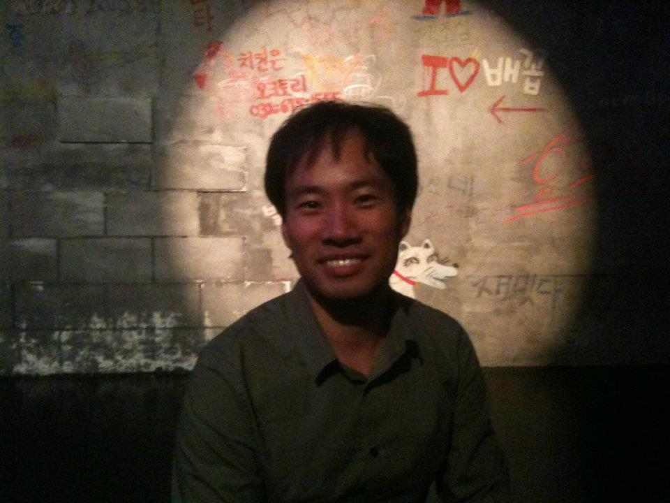
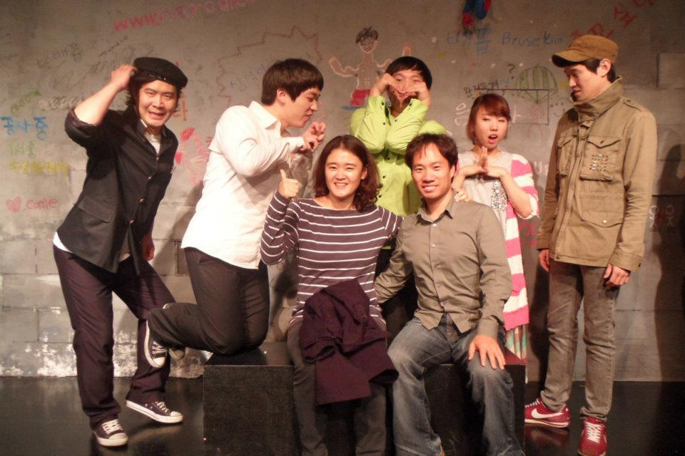
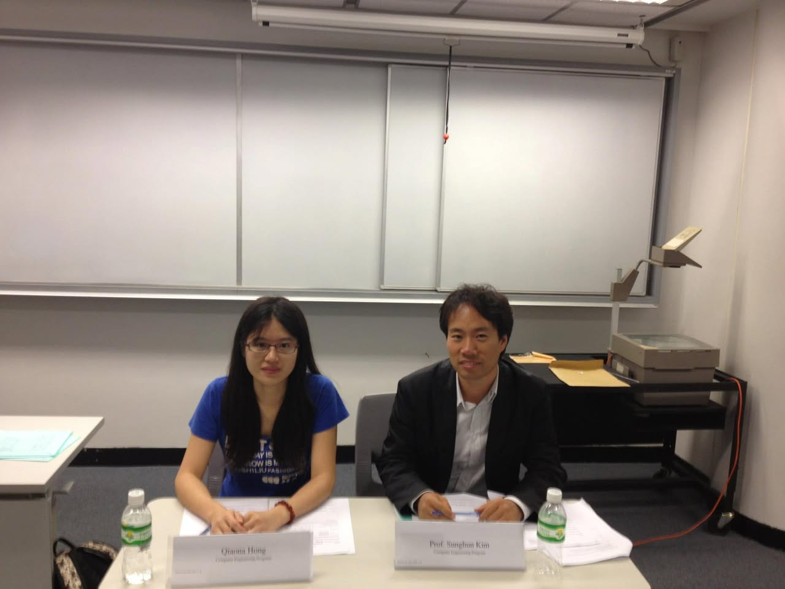
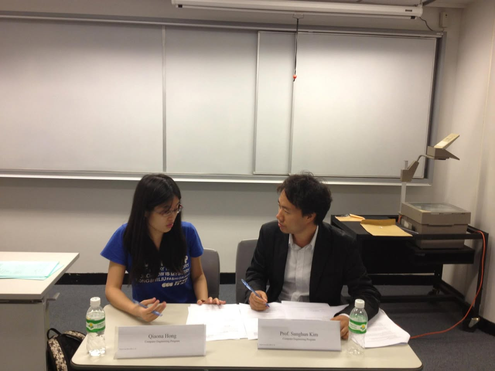
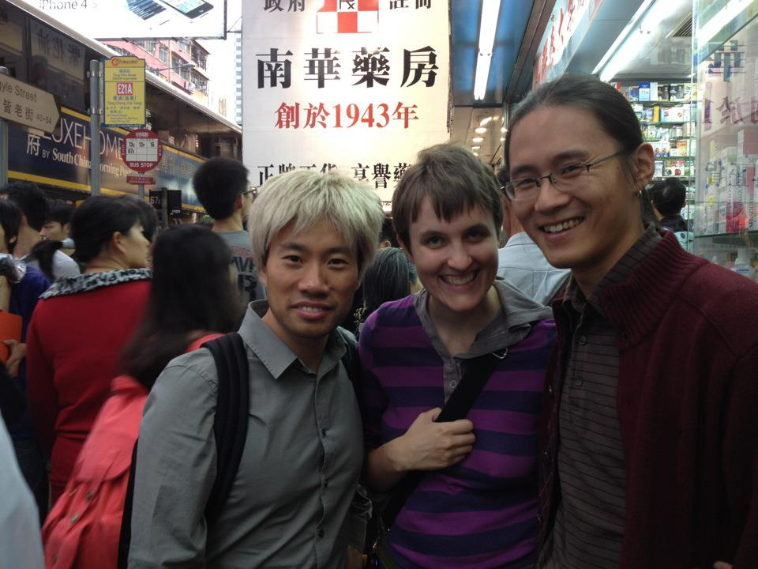

# 2011년 11월

[← 2011년](README.md)

### 11월 11일 (금) 12:14 · 📷 앨범: A Hilarious Play (2장)

**이미지 캡션:** 어두운 조명 아래, 30대 후반에서 40대 초반으로 보이는 성인 남성이 정면을 응시하며 미소를 짓고 있다. 그는 짧은 검은 머리에 검은색 셔츠를 입고 있으며, 배경에는 콘크리트 블록 벽이 보인다. 벽에는 여러 낙서가 있는데, 빨간색으로 "치킨은"이라고 쓰여 있고, 그 아래에는 "오토토리"와 전화번호로 추정되는 숫자 "030-675"가 보인다. 또한 "I♡배꼽"이라는 문구와 화살표, 그리고 하얀색 강아지 그림이 그려져 있다. 전체적으로 어둡고 캐주얼한 분위기이며, 술집이나 노래방 같은 장소로 추정된다.
 
**이미지 캡션:** 이 사진은 무대 위에서 포즈를 취하고 있는 7명의 젊은 성인들로 구성된 그룹을 보여줍니다. 왼쪽에서부터 시작하여, 검은색 베레모를 쓴 한 성인 남성이 검은색 재킷과 보라색 바지를 입고 있으며, 그의 얼굴에는 장난스러운 표정이 있습니다. 그의 옆에는 흰색 셔츠를 입은 또 다른 성인 남성이 서 있고, 그의 표정은 약간 놀란 듯합니다. 그 옆에는 녹색 셔츠를 입은 성인 남성이 두 손으로 하트 모양을 만들고 있습니다. 중앙에는 줄무늬 티셔츠를 입은 한 성인 여성이 엄지손가락을 치켜세우고 환하게 웃고 있으며, 그녀의 옆에는 회색 셔츠와 청바지를 입은 성인 남성이 앉아 있습니다. 그 뒤에는 분홍색과 흰색 줄무늬 스웨터를 입은 한 성인 여성이 손을 모으고 있습니다. 가장 오른쪽에는 카키색 재킷과 청바지를 입은 성인 남성이 모자를 쓰고 있으며, 그의 표정은 약간 무표정합니다. 배경은 콘크리트 벽으로, 다양한 낙서와 그림이 그려져 있으며, "come", "www.n.", "Bruse kin", "?"와 같은 텍스트가 보입니다. 전반적으로 사진은 활기차고 즐거운 분위기를 전달하며, 그룹이 공연이나 행사를 마친 후 기념 사진을 찍는 것으로 보입니다.옆에는 회색 셔츠와 청바지를 입은 성인 남성이 앉아 있습니다. 그 뒤에는 분홍색과 흰색 줄무늬 스웨터를 입은 한 성인 여성이 손을 모으고 있습니다. 가장 오른쪽에는 카키색 재킷과 청바지를 입은 성인 남성이 모자를 쓰고 있으며, 그의 표정은 약간 무표정합니다. 배경은 콘크리트 벽으로, 다양한 낙서와 그림이 그려져 있으며, "come", "www.n.", "Bruse kin", "?"와 같은 텍스트가 보입니다. 전반적으로 사진은 활기차고 즐거운 분위기를 전달하며, 그룹이 공연이나 행사를 마친 후 기념 사진을 찍는 것으로 보입니다.

### 11월 18일 (금) 15:19 · is done with ICSE (the first round) revi…

is done with ICSE (the first round) reviews. I did my best to find strong points in each paper and give good ratings. Finally, I recommended eight for acceptance out of eighteen. Good luck to you all, ICSE submitters!

### 11월 19일 (토) 19:11 · 📷 앨범: Interviewers for HKUST Engineering Exploration Day (2장)

**이미지 캡션:** 사진에는 두 명의 성인이 강의실로 보이는 장소에 앉아 있다. 왼쪽에는 안경을 쓴 젊은 아시아 여성으로, 파란색 티셔츠를 입고 있으며, 테이블에 놓인 명패에는 'Qianna Hong, Computer Engineering Program'이라고 적혀 있다. 그녀는 차분한 표정으로 카메라를 응시하고 있으며, 손은 테이블 위에 놓여 있다. 오른쪽에는 검은색 재킷과 흰색 셔츠를 입은 아시아 남성이 앉아 있으며, 그의 명패에는 'Prof. Sunghun Kim, Computer Engineering Program'이라고 적혀 있다. 그는 미소를 지으며 카메라를 바라보고 있으며, 손은 서류 위에 놓여 있다. 두 사람 앞에는 물병과 서류가 놓여 있고, 배경에는 칠판과 프로젝터가 보인다. 전체적으로 학술적인 분위기를 풍기는 장면이다. 적혀 있다. 그는 미소를 지으며 카메라를 바라보고 있으며, 손은 서류 위에 놓여 있다. 두 사람 앞에는 물병과 서류가 놓여 있고, 배경에는 칠판과 프로젝터가 보인다. 전체적으로 학술적인 분위기를 풍기는 장면이다.
 
**이미지 캡션:** 한 명의 젊은 성인 여성은 검은색 긴 머리에 안경을 쓰고 파란색 티셔츠를 입고 있으며, 테이블에 앉아 서류를 보고 있다. 그녀는 펜을 들고 있으며, 진지한 표정으로 서류를 읽고 있다. 그녀 앞에는 "Qiaona Hong, Computer Engineering Program"이라고 적힌 이름표와 물병이 놓여 있다. 그녀의 옆에는 한 명의 성인 남성이 검은색 정장을 입고 흰색 셔츠를 받쳐 입고 있으며, 테이블에 앉아 서류를 보고 있다. 그는 펜을 들고 있으며, 진지한 표정으로 서류를 읽고 있다. 그의 앞에는 "Prof. Sunghun Kim, Computer Engineering Program"이라고 적힌 이름표와 물병이 놓여 있다. 두 사람 모두 테이블에 앉아 있으며, 테이블 위에는 서류와 펜, 물병 등이 놓여 있다. 배경에는 흰색 칠판과 프로젝터가 보인다. 전체적으로 강의실이나 회의실 같은 분위기이며, 두 사람이 학술적인 논의를 하고 있는 것으로 보인다.rof. Sunghun Kim, Computer Engineering Program"이라고 적힌 이름표와 물병이 놓여 있다. 두 사람 모두 테이블에 앉아 있으며, 테이블 위에는 서류와 펜, 물병 등이 놓여 있다. 배경에는 흰색 칠판과 프로젝터가 보인다. 전체적으로 강의실이나 회의실 같은 분위기이며, 두 사람이 학술적인 논의를 하고 있는 것으로 보인다.

### 11월 26일 (토) 18:15 · had good time with Jaehyun in Hong Kong.…

had good time with Jaehyun in Hong Kong. See you soon in CA.

**이미지 캡션:** 세 명의 사람이 전경에 서 있고, 그 뒤로는 번화한 도시 거리의 풍경이 펼쳐져 있습니다. 왼쪽에는 금발 머리를 한 성인 남성이 회색 셔츠와 검은색 백팩을 메고 카메라를 향해 미소를 짓고 있습니다. 그의 옆에는 보라색 줄무늬 셔츠를 입은 성인 여성이 밝게 웃고 있으며, 어깨에는 검은색 크로스백을 메고 있습니다. 오른쪽에는 안경을 쓰고 머리를 길게 묶은 성인 남성이 짙은 버건디색 카디건을 입고 환하게 웃고 있습니다. 배경에는 "南華藥房 創於1943年"이라고 쓰인 큰 간판이 보이며, 이는 "남화약방 1943년 창업"을 의미합니다. 또한 버스 정류장 표지판과 상점들이 늘어선 거리의 모습이 보입니다. 전반적으로 활기차고 즐거운 분위기이며, 사람들이 거리에서 즐거운 시간을 보내고 있는 것으로 보입니다."을 의미합니다. 또한 버스 정류장 표지판과 상점들이 늘어선 거리의 모습이 보입니다. 전반적으로 활기차고 즐거운 분위기이며, 사람들이 거리에서 즐거운 시간을 보내고 있는 것으로 보입니다.
