# 2012년 1월

[← 2012년](README.md)

### 1월 4일 (수) 13:07 · finally finished ALL his ICSE 2012 Revie…

finally finished ALL his ICSE 2012 Reviews. Good luck to all!

### 1월 18일 (수) 22:33 · is on his way to Zurich, Switzerland. Go…

is on his way to Zurich, Switzerland. Good luck to ALL ICSE 2012 submitters.

### 1월 21일 (토) 01:04 · In ICSE PC meeting. :-)

In ICSE PC meeting. :-)

**이미지 캡션:** 이 사진은 흰색 테이블 위에 놓인 여러 개의 검은색 머그잔과 투명한 유리잔, 그리고 작은 초콜릿 두 개를 보여줍니다. 테이블 중앙에는 "Sunghun Kim, Hong Kong Univ. of Science & Technology"라고 적힌 흰색 명패가 있습니다. 명패 왼쪽에는 둥근 갈색 초콜릿이, 오른쪽에는 하트 모양의 갈색 초콜릿이 놓여 있습니다. 머그잔 중 하나에는 티백이 담긴 차가 들어 있고, 다른 머그잔에는 커피가 담겨 있습니다. 테이블 오른쪽에는 검은색 휴대폰 케이스가 놓여 있으며, 그 옆에는 흰색 천 조각이 보입니다. 배경에는 어두운 색상의 의자와 장비들이 흐릿하게 보이며, 전체적으로 차분하고 학술적인 분위기를 풍깁니다.

### 1월 25일 (수) 11:46 · 📷 앨범: Paragliding in Interlaken (17장)

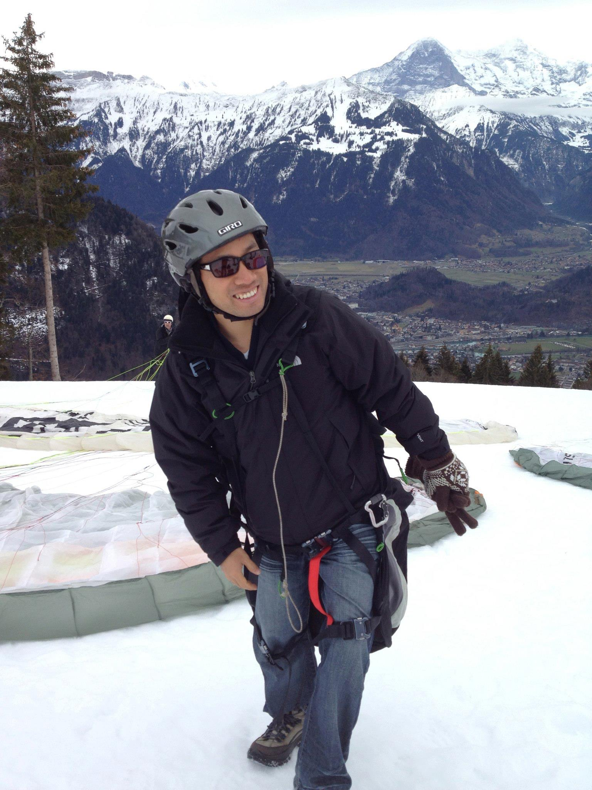
**이미지 캡션:** 눈 덮인 산을 배경으로 패러글라이딩 장비를 착용한 성인 남성이 서 있다. 남성은 회색 헬멧과 선글라스를 착용하고 있으며, 검은색 패딩 점퍼와 청바지, 방한 장갑을 끼고 있다. 얼굴에는 미소가 번지고 있으며, 오른손으로는 브이(V)자를 그리고 있다. 그의 뒤로는 패러글라이딩 낙하산이 펼쳐져 있고, 멀리 눈 덮인 산봉우리와 마을이 보인다. 전반적으로 겨울 스포츠를 즐기기 위한 준비를 마친 듯한 활기찬 분위기이다.
 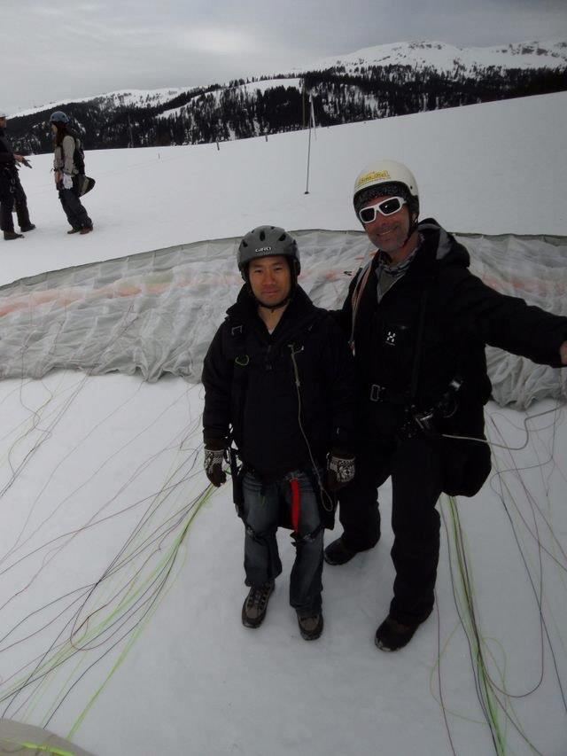
**이미지 캡션:** 두 명의 성인 남성이 눈 덮인 산비탈에서 패러글라이딩 장비 앞에서 포즈를 취하고 있으며, 한 남성은 회색 헬멧과 검은색 재킷, 청바지를 입고 있고 다른 남성은 흰색 헬멧, 선글라스, 검은색 재킷, 검은색 바지를 입고 있습니다. 배경에는 눈 덮인 산과 나무가 보이며, 하늘은 흐립니다. 패러글라이딩 낙하산이 펼쳐져 있고, 낙하산을 조종하는 데 사용되는 여러 개의 색깔 있는 줄이 눈 위에 흩어져 있습니다. 전반적인 분위기는 활동적이고 모험적인 느낌을 줍니다.
 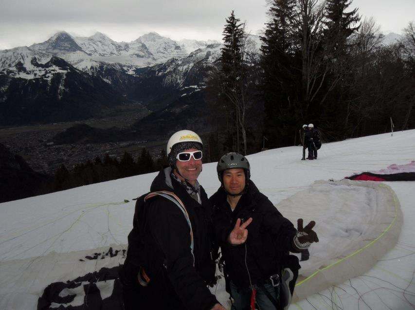
**이미지 캡션:** 두 명의 성인 남성이 눈 덮인 산비탈에서 패러글라이딩 장비를 배경으로 포즈를 취하고 있으며, 한 남성은 흰색 헬멧과 선글라스를 착용하고 미소를 짓고 있고, 다른 남성은 회색 헬멧을 쓰고 평화의 제스처를 하고 있습니다. 뒤로는 눈 덮인 산봉우리와 나무가 있는 계곡이 보이며, 하늘은 흐립니다.
 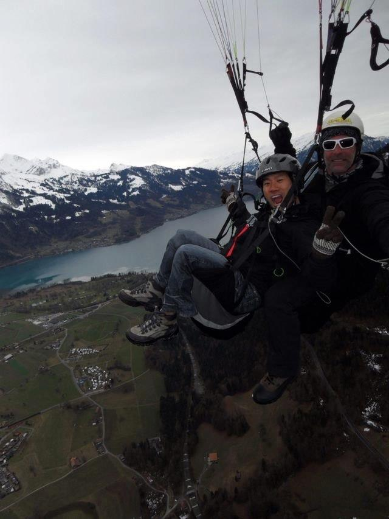
**이미지 캡션:** 두 명의 성인이 패러글라이딩을 즐기고 있으며, 앞쪽에는 20대 후반에서 30대 초반으로 보이는 아시아계 남성이 헬멧을 쓰고 환하게 웃으며 엄지손가락을 치켜들고 있고, 뒤쪽에는 50대 후반에서 60대 초반으로 보이는 백인 남성이 선글라스를 끼고 헬멧을 쓴 채 브이(V)자를 그리고 있다. 두 사람 모두 검은색 재킷과 청바지, 등산화 스타일의 신발을 착용하고 있으며, 장갑을 끼고 있다. 배경으로는 눈 덮인 산봉우리와 푸른 호수, 그리고 그 아래로 펼쳐진 마을과 숲이 보인다. 하늘은 흐린 날씨를 나타내고 있으며, 패러글라이딩 장비인 낙하산과 하네스가 보인다. 전반적으로 즐겁고 모험적인 분위기를 나타내는 사진이다.
 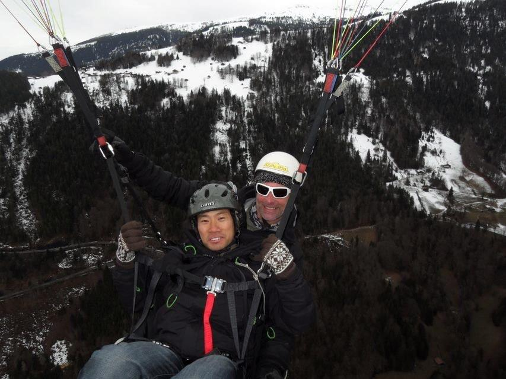
**이미지 캡션:** 두 명의 성인 남성이 패러글라이딩을 즐기고 있으며, 앞쪽의 남성은 아시아계로 30대 후반에서 40대 초반으로 보이며 회색 헬멧을 쓰고 검은색 패러글라이딩 복장을 착용하고 있습니다. 그의 얼굴에는 미소가 번지고 있으며, 뒤쪽의 남성은 백인으로 40대 후반에서 50대 초반으로 추정되며 흰색 헬멧과 선글라스를 착용하고 있습니다. 그는 앞쪽 남성보다 약간 더 높은 위치에 있으며, 두 사람 모두 패러글라이딩 장비를 착용하고 있습니다. 배경으로는 눈 덮인 산과 울창한 침엽수림이 펼쳐져 있으며, 멀리 작은 건물들이 보입니다. 전체적으로 겨울철 산악 지역에서 패러글라이딩을 하며 즐거워하는 분위기입니다.
 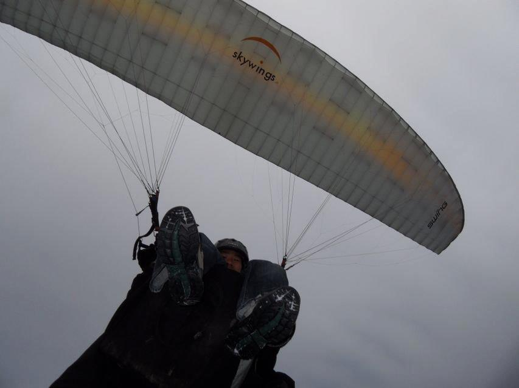
**이미지 캡션:** 하늘을 나는 패러글라이더 아래에 앉아 있는 성인 남성이 발을 앞으로 뻗고 카메라를 바라보고 있다. 남성은 회색 헬멧과 검은색 재킷을 입고 있으며, 그의 발에는 짙은 색의 등산화가 신겨져 있다. 패러글라이더는 흰색이며, 'skywings'와 'SWING'이라는 글자가 보인다. 배경은 흐린 하늘로, 전반적으로 활동적인 분위기보다는 차분하고 약간은 긴장된 느낌을 준다.
 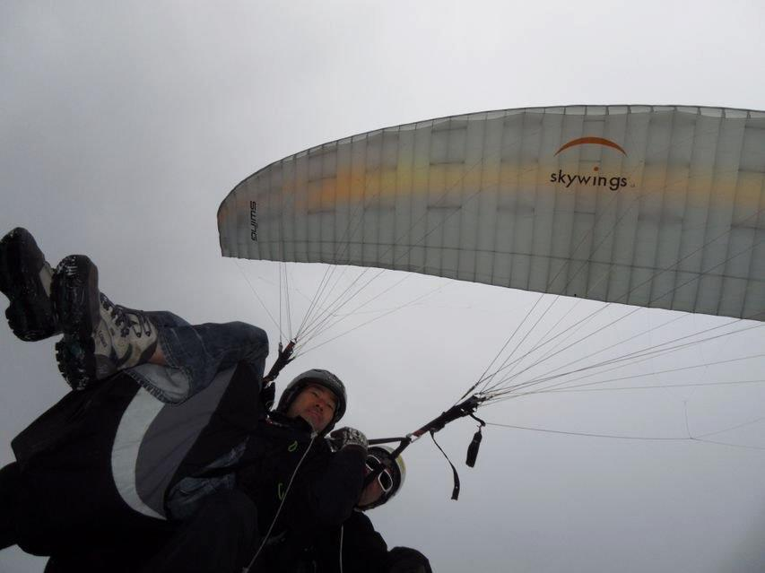
**이미지 캡션:** 이 사진은 패러글라이딩을 하는 두 사람을 보여줍니다. 앞쪽에는 성인 남성이 헬멧을 쓰고 검은색 재킷과 청바지를 입고 있으며, 얼굴에는 약간의 미소를 띠고 있습니다. 그의 발은 튼튼한 등산화와 청바지 차림으로 카메라를 향해 뻗어 있습니다. 뒤쪽에는 다른 성인 남성이 헬멧과 고글을 착용하고 있으며, 그의 얼굴은 잘 보이지 않습니다. 두 사람 모두 패러글라이딩 장비인 하네스와 낙하산을 착용하고 있으며, 낙하산에는 "skywings"라는 로고와 "Swing"이라는 글자가 보입니다. 배경은 흐린 하늘로, 특별한 지형이나 사물은 보이지 않아 패러글라이딩 중임을 알 수 있습니다. 전반적으로 활동적이고 약간은 긴장감 있는 분위기이며, 하늘을 나는 경험을 담고 있습니다.
 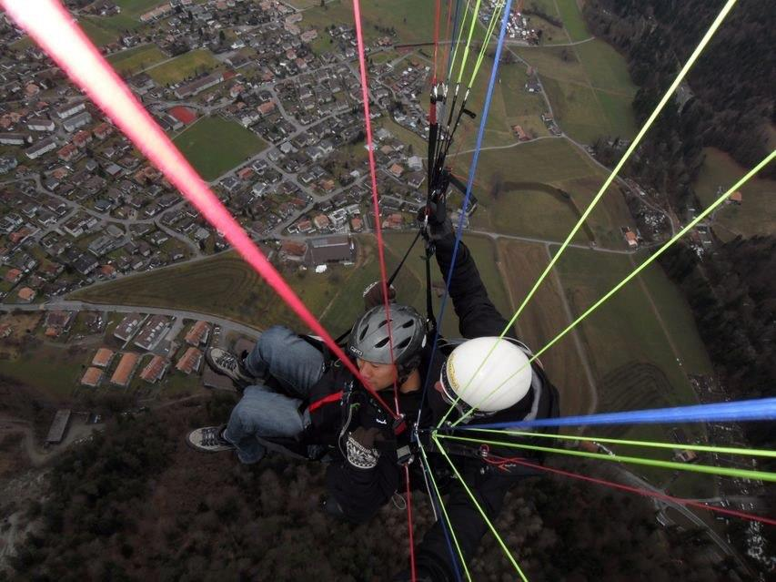
**이미지 캡션:** 이 사진은 패러글라이딩을 하는 두 사람을 위에서 내려다보는 시점으로 촬영되었습니다. 앞쪽에 앉아 있는 사람은 성인 남성으로, 회색 헬멧을 쓰고 검은색 재킷과 청바지를 입고 있으며, 표정은 편안해 보입니다. 뒤쪽에 서 있는 사람은 성인 남성으로, 흰색 헬멧을 쓰고 검은색 재킷을 입고 있으며, 조종 장치를 잡고 있습니다. 두 사람 모두 패러글라이딩 장비를 착용하고 있으며, 여러 색깔의 줄들이 복잡하게 얽혀 있습니다. 배경으로는 산비탈에 자리 잡은 작은 마을과 푸른 들판, 그리고 숲이 보입니다. 마을에는 붉은 지붕의 주택들이 빽빽하게 들어서 있고, 넓은 녹색 운동장도 보입니다. 전반적으로 맑은 날씨에 패러글라이딩을 즐기는 역동적이고 흥미로운 분위기를 나타냅니다.
 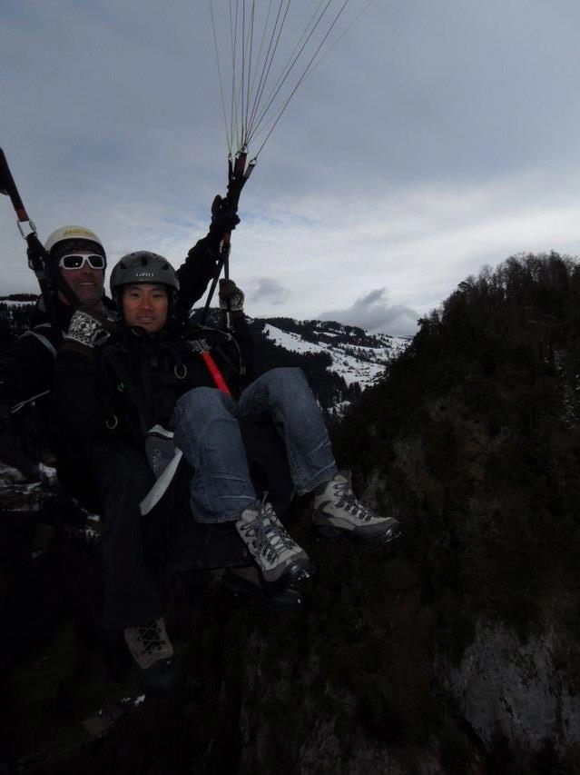
**이미지 캡션:** 하늘을 나는 패러글라이딩을 즐기는 두 사람의 모습이 담긴 사진으로, 앞쪽에는 성인 남성이 헬멧과 선글라스를 착용하고 있으며, 뒤쪽에는 또 다른 성인 남성이 헬멧을 쓰고 있다. 두 사람 모두 청바지와 등산화 스타일의 신발을 신고 있으며, 패러글라이딩 장비와 낙하산이 보인다. 배경으로는 눈 덮인 산과 나무들이 보이며, 흐린 날씨 속에서 약간은 쌀쌀한 분위기를 자아낸다. 두 사람 모두 편안하고 즐거운 표정으로 패러글라이딩을 만끽하고 있는 것으로 보인다.
 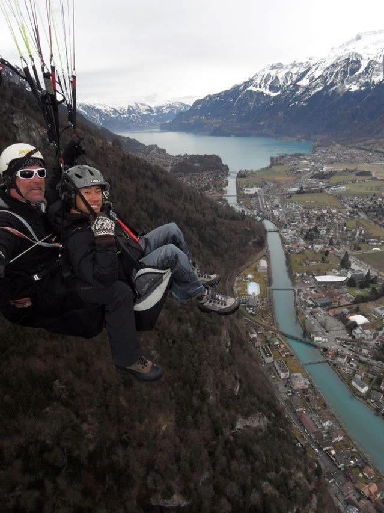
**이미지 캡션:** 두 명의 성인이 패러글라이딩을 즐기고 있으며, 한 명은 조종사로 보이고 다른 한 명은 승객으로 보인다. 조종사는 흰색 헬멧과 선글라스를 착용하고 있으며, 50대 이상의 성인 남성으로 추정된다. 그는 검은색 재킷과 검은색 하의를 입고 있다. 승객은 회색 헬멧을 착용하고 있으며, 20대 또는 30대의 아시아계 성인 남성으로 보인다. 그는 검은색 재킷, 회색 바지, 갈색 신발을 신고 있으며, 손에는 흰색과 회색 패턴의 장갑을 끼고 있다. 두 사람 모두 패러글라이딩 장비에 안전하게 앉아 있으며, 표정은 편안하고 즐거워 보인다. 배경으로는 눈 덮인 산봉우리와 푸른 호수가 펼쳐져 있고, 호수 옆으로는 작은 마을이 자리 잡고 있다. 마을에는 강이 흐르고 있으며, 다리와 건물들이 보인다. 전반적으로 맑고 시원한 날씨 속에서 아름다운 자연 경관을 배경으로 패러글라이딩을 즐기는 평화롭고 짜릿한 순간을 담고 있다.
 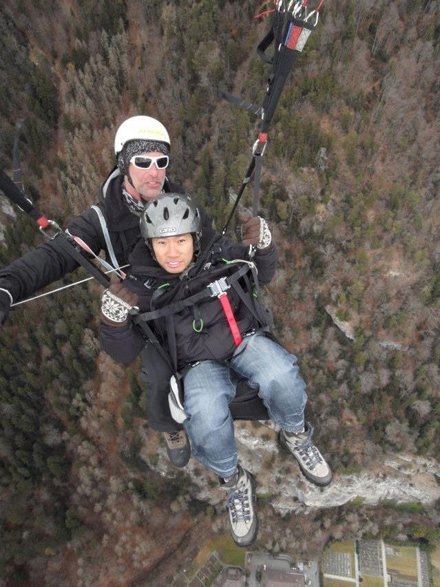
**이미지 캡션:** 두 명의 사람이 패러글라이딩을 즐기고 있으며, 한 명은 조종사로 보이는 성인 남성이고 다른 한 명은 승객으로 보이는 성인 남성입니다. 성인 남성 조종사는 흰색 헬멧, 선글라스, 검은색 재킷, 회색 목도리를 착용하고 있으며, 성인 남성 승객은 회색 헬멧, 검은색 재킷, 청바지, 등산화를 착용하고 있습니다. 두 사람 모두 헬멧과 따뜻한 옷을 입고 있으며, 승객은 약간 긴장한 듯하지만 즐거워 보이는 표정으로 카메라를 바라보고 있습니다. 배경에는 울창한 숲과 산악 지형이 펼쳐져 있으며, 멀리 건물들이 보입니다. 전반적으로 활동적이고 모험적인 분위기를 풍기는 사진입니다.
 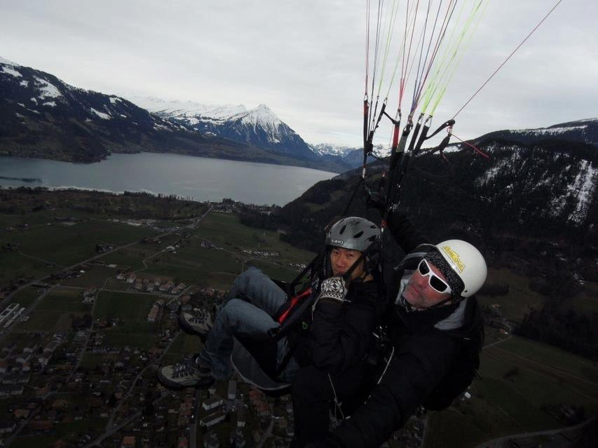
**이미지 캡션:** 두 명의 성인이 패러글라이딩을 즐기고 있으며, 한 명은 앞쪽에, 다른 한 명은 뒤쪽에 앉아 있습니다. 앞쪽에 앉은 성인 여성으로 보이는 사람은 회색 헬멧을 쓰고 검은색 재킷과 청바지를 입고 있으며, 손에는 장갑을 끼고 있습니다. 그녀는 카메라를 향해 미소를 짓고 있습니다. 뒤쪽에 앉은 성인 남성으로 보이는 사람은 흰색 헬멧과 선글라스를 착용하고 검은색 재킷을 입고 있습니다. 두 사람 모두 패러글라이딩 장비를 착용하고 있으며, 뒤쪽 남성은 카메라를 향해 고개를 돌리고 있습니다. 배경에는 눈 덮인 산과 호수가 보이며, 아래로는 작은 마을과 녹색 들판이 펼쳐져 있습니다. 하늘은 흐린 편이며, 전체적으로 차분하고 평화로운 분위기입니다. 헬멧에 "GIRO"라는 글자가 보입니다.
 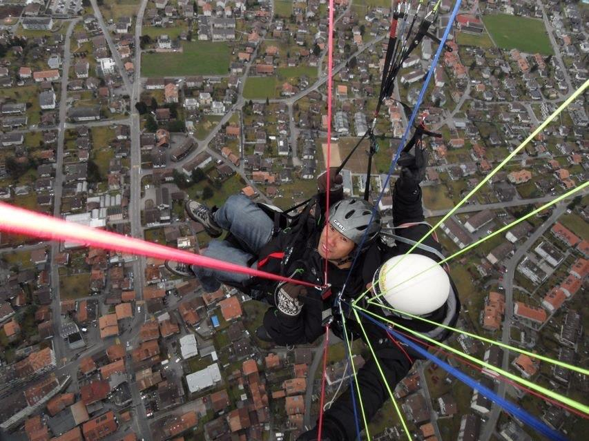
**이미지 캡션:** 이 사진은 패러글라이딩을 하는 두 사람을 위에서 내려다보는 시점으로 촬영되었으며, 배경에는 주택가와 도로가 펼쳐져 있습니다. 사진 중앙에는 성인 남성이 회색 헬멧을 쓰고 검은색 재킷과 청바지를 입고 있으며, 그의 얼굴에는 약간의 긴장감과 흥분이 섞인 표정이 나타납니다. 그는 패러글라이딩 장비를 착용하고 있으며, 그의 앞에는 또 다른 사람이 하얀색 헬멧을 쓰고 있습니다. 여러 색상의 패러글라이딩 줄들이 복잡하게 얽혀 있으며, 그중 빨간색 줄이 사진의 왼쪽 하단에서 오른쪽 상단으로 길게 뻗어 있습니다. 전반적으로 역동적이고 모험적인 분위기를 자아냅니다.
 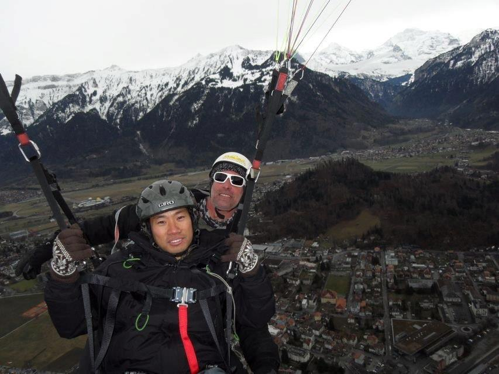
**이미지 캡션:** 두 명의 남성이 패러글라이딩을 즐기고 있으며, 한 명은 앞에 앉아 있고 다른 한 명은 뒤에 서서 조종하고 있습니다. 앞에 앉은 남성은 아시아계로 추정되며 20대 후반에서 30대 초반으로 보입니다. 그는 회색 헬멧과 검은색 패러글라이딩 복장을 착용하고 있으며, 손에는 무늬가 있는 장갑을 끼고 있습니다. 그의 표정은 약간 긴장하면서도 즐거워 보입니다. 뒤에 서 있는 남성은 백인으로 추정되며 40대에서 50대로 보입니다. 그는 흰색 헬멧과 선글라스를 착용하고 있으며, 목에는 스카프를 두르고 있습니다. 그의 표정은 여유롭고 미소를 띠고 있습니다. 배경으로는 눈 덮인 산봉우리와 울창한 숲, 그리고 그 아래로 펼쳐진 작은 마을의 모습이 보입니다. 하늘은 흐린 편이며, 전체적으로 차가운 날씨임을 짐작할 수 있습니다. 패러글라이딩 장비의 일부와 낙하산 줄이 사진의 일부를 차지하고 있습니다. "GIRO"라는 글자가 앞에 앉은 남성의 헬멧에 보입니다. 이 사진은 스릴 넘치는 패러글라이딩 체험과 아름다운 알프스 산맥의 풍경을 담고 있습니다.
 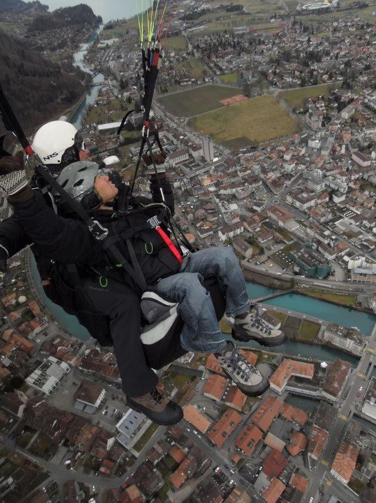
**이미지 캡션:** 패러글라이딩을 즐기는 두 사람이 하늘에서 도시를 내려다보고 있다. 앞쪽에는 성인 남성이 흰색 헬멧과 검은색 재킷, 검은색 바지를 입고 있으며, 뒤쪽에는 성인 여성이 회색 헬멧과 검은색 재킷, 청바지를 입고 있다. 두 사람 모두 패러글라이딩 장비를 착용하고 있으며, 편안하고 즐거운 표정으로 아래 풍경을 감상하고 있다. 배경에는 강이 흐르고 그 주변으로 붉은 지붕의 건물들이 빽빽하게 들어선 도시가 펼쳐져 있다. 멀리 산과 구름 낀 하늘도 보인다. 전반적으로 평화롭고 아름다운 풍경 속에서 특별한 경험을 만끽하는 모습이다.
 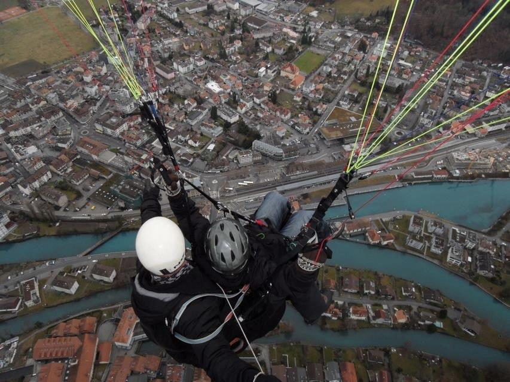
**이미지 캡션:** 패러글라이딩을 하는 두 사람이 도시 위를 날고 있으며, 한 사람은 흰색 헬멧을 쓰고 다른 한 사람은 회색 헬멧을 쓰고 있다. 두 사람 모두 검은색 재킷과 청바지를 입고 있으며, 패러글라이딩 장비를 착용하고 있다. 배경에는 맑은 푸른 강이 흐르고 있으며, 강 주변으로 빽빽하게 들어선 건물들이 보인다. 건물들은 대부분 붉은 지붕을 가지고 있으며, 도시의 모습은 꽤 오래된 듯한 느낌을 준다. 하늘은 흐릿하고 구름이 끼어 있지만, 전반적으로 평화롭고 여유로운 분위기이다.
 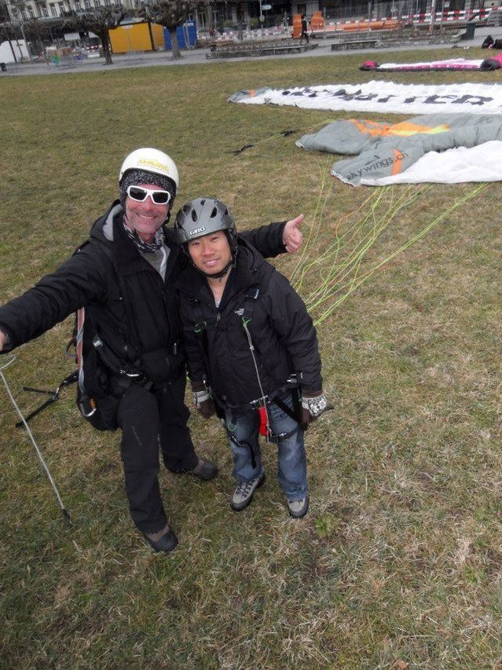
**이미지 캡션:** 두 명의 성인 남성이 잔디밭에 서서 파라글라이딩 장비를 착용하고 있다. 왼쪽 남성은 흰색 헬멧, 선글라스, 검은색 재킷, 검은색 바지를 입고 있으며, 오른쪽 남성은 회색 헬멧, 검은색 재킷, 청바지, 운동화를 신고 있다. 두 사람 모두 파라글라이딩 하네스를 착용하고 있으며, 오른쪽 남성은 엄지손가락을 치켜세우고 있다. 배경에는 잔디밭에 펼쳐진 파라글라이딩 낙하산 몇 개와 건물들이 보인다. 낙하산 중 하나에는 "skywings.ch"라는 글자가 쓰여 있다. 전반적으로 활동적인 분위기를 풍기며, 파라글라이딩을 준비하거나 마친 모습으로 보인다.

### 1월 25일 (수) 18:36 · 📷 앨범: Hot Spring in Alpine (3장)

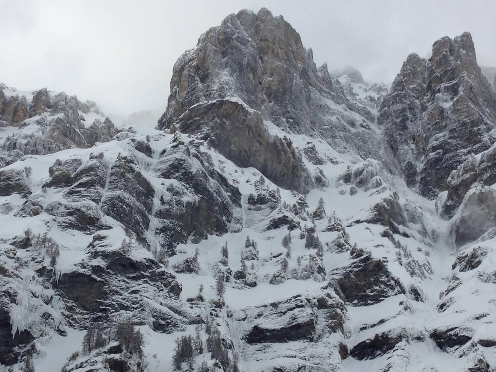
**이미지 캡션:** 이 사진은 눈 덮인 험준한 산악 지형을 보여줍니다. 사진에는 사람이 보이지 않습니다. 배경은 거대한 바위산으로, 대부분 눈으로 뒤덮여 있으며 일부는 얼음으로 뒤덮여 있습니다. 산비탈에는 몇 그루의 나무가 듬성듬성 서 있습니다. 하늘은 흐리고 회색빛이며, 전반적으로 차갑고 황량한 분위기를 자아냅니다. 눈이 내리고 있거나 방금 내린 듯한 느낌을 주며, 겨울철 산악 지역의 거친 자연 환경을 잘 보여줍니다.
 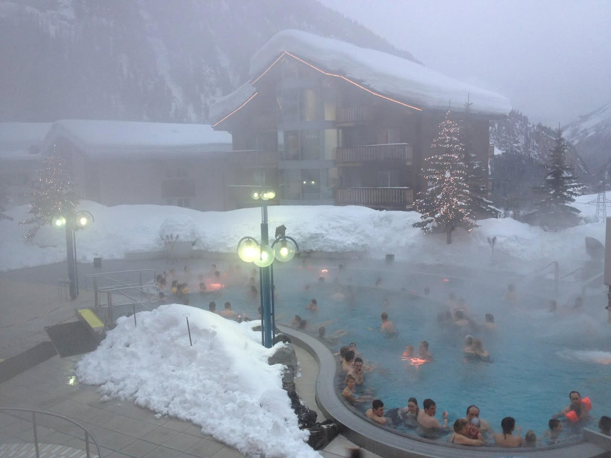
**이미지 캡션:** 눈 덮인 산악 리조트에서 야외 온수 수영장을 즐기는 사람들로 가득 찬 풍경입니다. 수영장에는 다양한 연령대의 남녀노소 많은 사람들이 몸을 담그고 있으며, 일부는 물에 떠 있는 부표를 잡고 있거나 서로 대화를 나누는 등 편안한 표정을 짓고 있습니다. 주변에는 눈이 두껍게 쌓여 있으며, 따뜻한 물에서 피어오르는 김과 눈 덮인 풍경이 어우러져 몽환적인 분위기를 자아냅니다. 배경에는 눈 지붕이 있는 목조 건물과 크리스마스 트리가 보이며, 건물에는 조명이 켜져 있어 겨울철 휴양지의 따뜻하고 아늑한 느낌을 더합니다. 전체적으로 추운 날씨에도 불구하고 온수 수영장에서 여유로운 시간을 보내는 사람들의 모습이 평화롭고 즐거운 분위기를 연출합니다.
 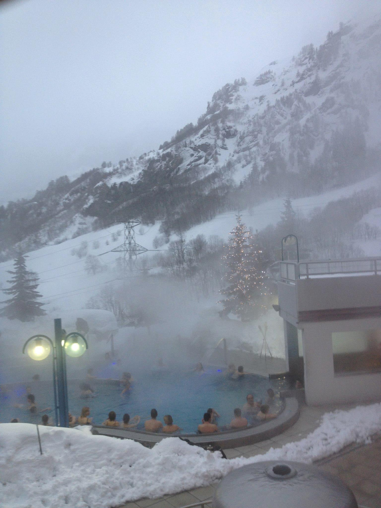
**이미지 캡션:** 눈 덮인 산을 배경으로 김이 모락모락 나는 야외 온수 수영장에서 여러 사람이 휴식을 취하고 있으며, 수영장 옆에는 조명이 켜진 크리스마스 트리가 서 있고, 흐린 날씨와 눈으로 인해 전체적으로 차분하고 평화로운 분위기를 자아낸다.

### 1월 25일 (수) 18:40 · 📷 앨범: Alpine Snowboarding (9장)

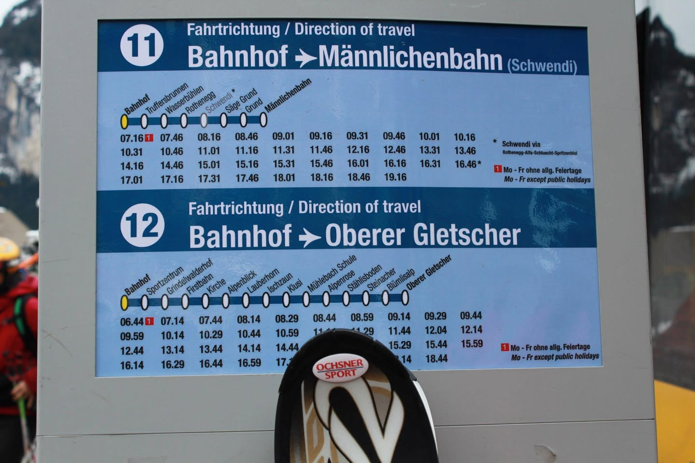
**이미지 캡션:** 이 사진은 스위스의 산악 지역에서 볼 수 있는 교통 안내 표지판을 보여줍니다. 표지판은 파란색 배경에 흰색 글씨로 되어 있으며, 두 개의 주요 노선에 대한 운행 시간표를 담고 있습니다. 상단에는 11번 노선으로 "Bahnhof → Männlichenbahn (Schwendi)"라고 표시되어 있으며, 이는 기차역에서 멘리헨반(슈벤디 방면)으로 가는 방향을 나타냅니다. 하단에는 12번 노선으로 "Bahnhof → Oberer Gletscher"라고 표시되어 있으며, 이는 기차역에서 오버러 글레처(상부 빙하)로 가는 방향을 나타냅니다. 각 노선별로 정차역 이름과 해당 시간표가 상세하게 기재되어 있습니다. 표지판 오른쪽 하단에는 "OCHSNER SPORT"라는 로고가 있는 신발의 일부가 걸쳐져 있어, 이 표지판이 스키장이나 등산로 근처에 설치되었음을 짐작하게 합니다. 배경으로는 눈 덮인 산과 흐릿하게 보이는 사람의 모습이 보입니다. 전반적으로 겨울철 산악 지역의 대중교통 정보를 제공하는 실용적인 안내판의 모습입니다.
 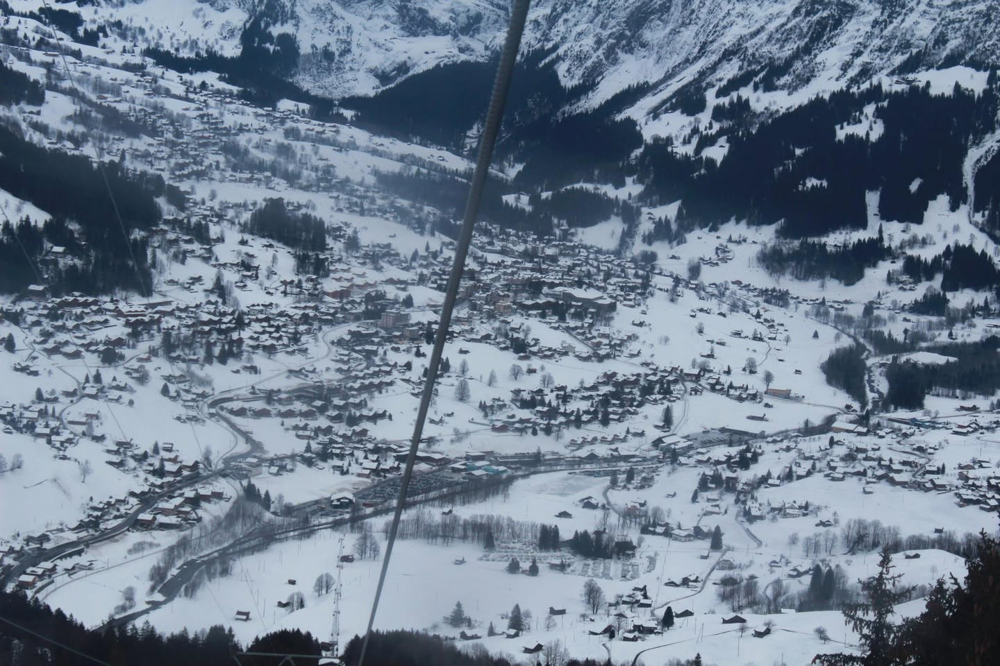
**이미지 캡션:** 이 사진은 눈 덮인 산악 마을의 광활한 풍경을 보여줍니다. 사진의 전경에는 굵은 케이블이 대각선으로 걸려 있어, 아마도 곤돌라나 케이블카의 일부일 것입니다. 배경에는 눈으로 뒤덮인 산들이 솟아 있으며, 그 경사면에는 짙은 녹색의 침엽수림이 듬성듬성 자리 잡고 있습니다. 산기슭에는 눈으로 덮인 지붕을 가진 수많은 작은 건물들이 옹기종기 모여 있는 마을이 펼쳐져 있습니다. 마을 사이로는 눈이 쌓인 도로와 길이 구불구불하게 나 있으며, 일부 지역에는 주차된 차량들이 보입니다. 사진 속에는 사람이 보이지 않으며, 전체적으로 고요하고 평화로운 겨울 풍경을 연출합니다. 하늘은 흐릿한 회색빛으로, 눈이 내리거나 곧 내릴 듯한 날씨를 암시합니다.
 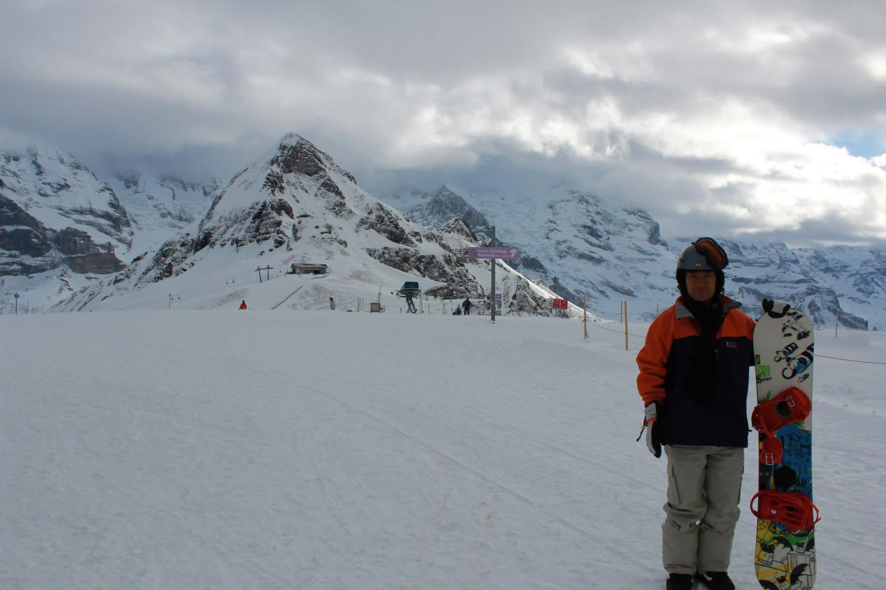
**이미지 캡션:** 눈 덮인 산을 배경으로 스노보드를 들고 서 있는 성인 남성이 보인다. 남성은 회색 헬멧과 고글을 착용하고 있으며, 주황색과 남색이 섞인 스키 재킷, 회색 바지, 검은색 장갑을 입고 있다. 그의 얼굴에는 미소가 번지고 있으며, 스노보드는 다채로운 그림으로 장식되어 있다. 주변에는 눈 덮인 광활한 슬로프와 험준한 산봉우리들이 펼쳐져 있으며, 흐린 하늘에는 구름이 짙게 드리워져 있다. 멀리 스키 리프트와 작은 건물들이 보이며, 눈밭에는 스키나 스노보드를 타는 사람들의 흔적이 희미하게 남아 있다. 전반적으로 겨울 스포츠를 즐기는 평화롭고 웅장한 풍경이다.
 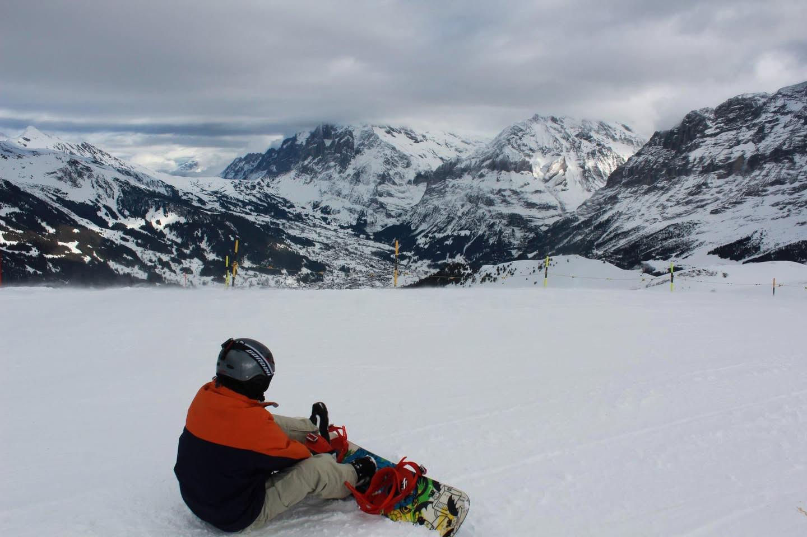
**이미지 캡션:** 눈 덮인 산봉우리와 흐린 하늘을 배경으로, 한 명의 성인 남성이 스노보드를 타기 위해 준비하고 있습니다. 그는 헬멧과 고글을 착용하고 있으며, 주황색과 남색이 섞인 스키 재킷과 베이지색 바지를 입고 있습니다. 스노보드는 그의 앞에 놓여 있으며, 빨간색 바인딩이 눈에 띕니다. 남성은 앉아서 휴식을 취하고 있는 듯 보이며, 그의 표정은 보이지 않습니다. 주변에는 눈으로 덮인 넓은 슬로프가 펼쳐져 있고, 멀리 눈 덮인 산맥과 작은 마을이 보입니다. 몇 개의 노란색 표지판이 슬로프를 따라 세워져 있어 스키 코스를 안내하는 듯합니다. 전반적으로 겨울 스포츠를 즐기기 좋은 날씨이지만, 구름이 많아 약간은 쌀쌀한 분위기입니다.
 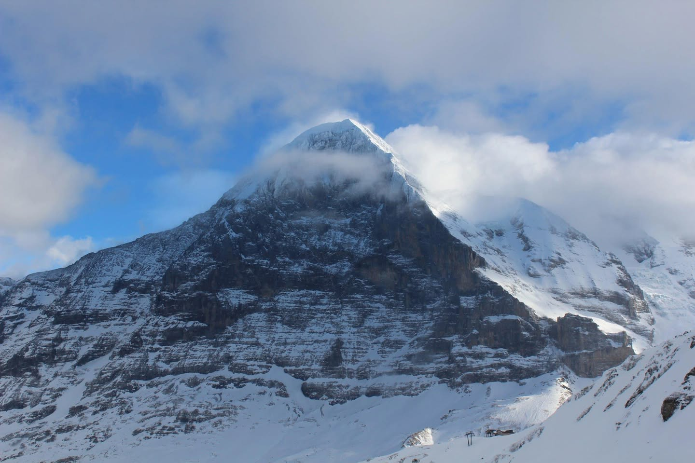
**이미지 캡션:** 구름이 낀 푸른 하늘 아래 눈 덮인 웅장한 산봉우리가 보입니다. 산의 경사면은 눈으로 뒤덮여 있으며, 일부 암석층이 드러나 있습니다. 산 정상 부분은 구름에 가려져 신비로운 분위기를 자아냅니다. 사진의 오른쪽 하단에는 눈 덮인 경사면에 작은 건물과 리프트 시설로 보이는 구조물이 희미하게 보입니다. 전반적으로 겨울 산의 광활하고 고요한 풍경을 담고 있습니다.
 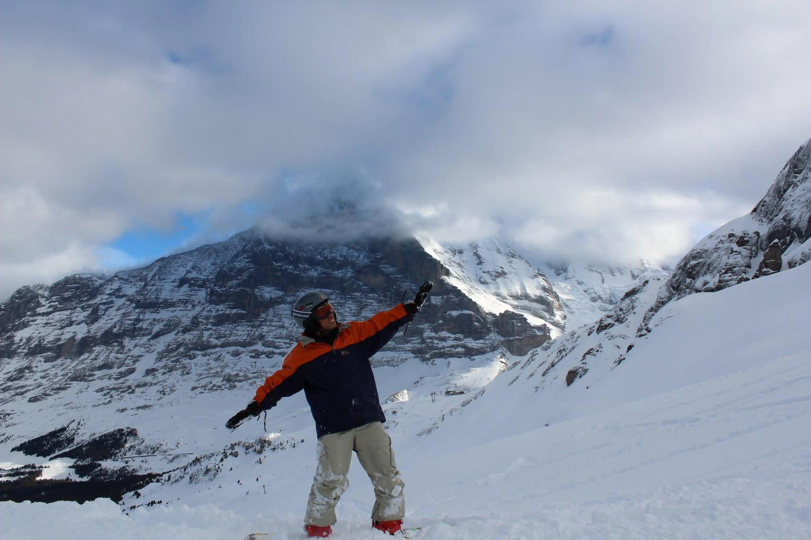
**이미지 캡션:** 눈 덮인 산악 지형에서 스노보드를 타고 있는 성인 남성이 카메라를 향해 팔을 벌리고 포즈를 취하고 있다. 남성은 헬멧과 고글을 착용하고 있으며, 네이비와 오렌지색이 배색된 스키 재킷과 베이지색 스키 바지를 입고 있다. 그의 표정은 즐거워 보이며, 배경에는 구름에 일부 가려진 거대한 설산이 펼쳐져 있고, 눈 덮인 경사면에는 스키 자국이 나 있다. 전반적으로 겨울 스포츠를 즐기는 활기찬 분위기를 나타낸다.
 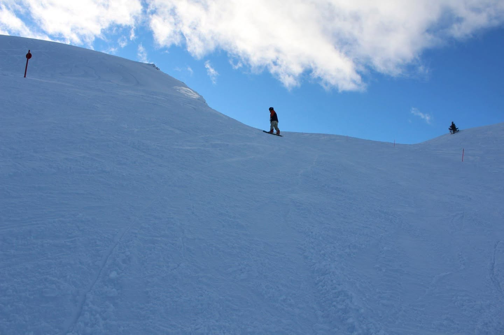
**이미지 캡션:** 광활한 설원 위에서 한 명의 성인 남성이 스노보드를 타고 경사면을 내려오고 있다. 남성은 검은색 하의와 주황색, 검은색이 섞인 상의를 입고 있으며, 헬멧을 착용하고 있다. 그의 표정은 보이지 않지만, 스노보드를 타는 자세로 보아 능숙하게 균형을 잡으며 내려오고 있는 것으로 보인다. 배경은 푸른 하늘과 흰 구름으로 이루어져 있으며, 눈 덮인 산의 완만한 경사면이 펼쳐져 있다. 경사면에는 스키나 스노보드 흔적이 남아 있으며, 곳곳에 빨간색 표지판이 세워져 있어 코스를 안내하는 듯하다. 멀리 작은 나무 한 그루가 보인다. 전체적으로 맑고 시원한 겨울날의 스키장 풍경을 담고 있으며, 활동적이고 평화로운 분위기를 자아낸다.
 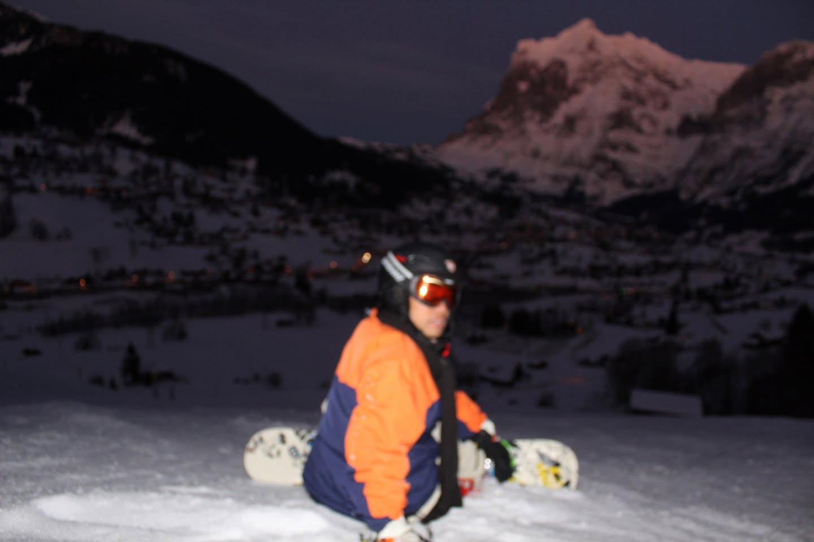
**이미지 캡션:** 어두운 밤, 눈 덮인 산비탈에 스노보드를 타는 성인 남성이 앉아 있다. 남성은 오렌지색과 남색이 섞인 스키 재킷을 입고 검은색 목도리를 하고 있으며, 머리에는 스키 헬멧과 고글을 착용하고 있다. 그의 표정은 약간 흐릿하지만, 고글 너머로 보이는 눈은 주변을 살피는 듯하다. 스노보드는 그의 앞에 놓여 있으며, 보드에는 알록달록한 그래픽이 그려져 있다. 배경에는 눈으로 뒤덮인 산봉우리와 어둠 속에 희미하게 빛나는 마을의 불빛들이 보인다. 전체적으로 겨울 스포츠를 즐기는 한적하고 고요한 분위기이다.
 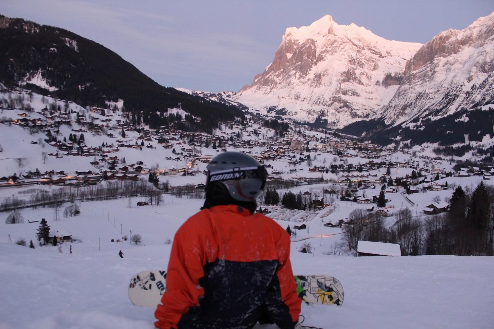
**이미지 캡션:** 한 명의 성인 남성이 스노보드를 타고 설원 위에서 경치를 감상하고 있다. 남성은 주황색과 남색이 섞인 스키 재킷을 입고 회색 헬멧과 고글을 착용하고 있으며, 그의 뒤로는 눈 덮인 산과 스키 마을이 펼쳐져 있다. 마을에는 불빛이 켜져 있어 따뜻한 분위기를 자아내며, 웅장한 산봉우리는 석양에 물들어 붉은빛을 띠고 있다. 전반적으로 평화롭고 아름다운 겨울 풍경을 담고 있다.

> The North Face
> In front of The North Face

### 1월 25일 (수) 19:25 · 📷 앨범: Profile pictures (1장)

**이미지 캡션:** 눈 덮인 산을 배경으로 패러글라이딩 장비를 착용한 성인 남성이 눈밭에 서서 카메라를 향해 웃고 있다. 남성은 회색 헬멧, 선글라스, 검은색 재킷, 청바지, 장갑, 패러글라이딩 하네스를 착용하고 있다. 그의 뒤로는 눈 덮인 산봉우리와 계곡 마을이 보인다. 주변에는 여러 개의 패러글라이딩 낙하산이 펼쳐져 있다. 남성은 오른손으로 브이(V) 표시를 하고 있으며, 전체적으로 즐겁고 활동적인 분위기를 연출한다. 헬멧에는 "GIRO"라는 글자가 보인다.
