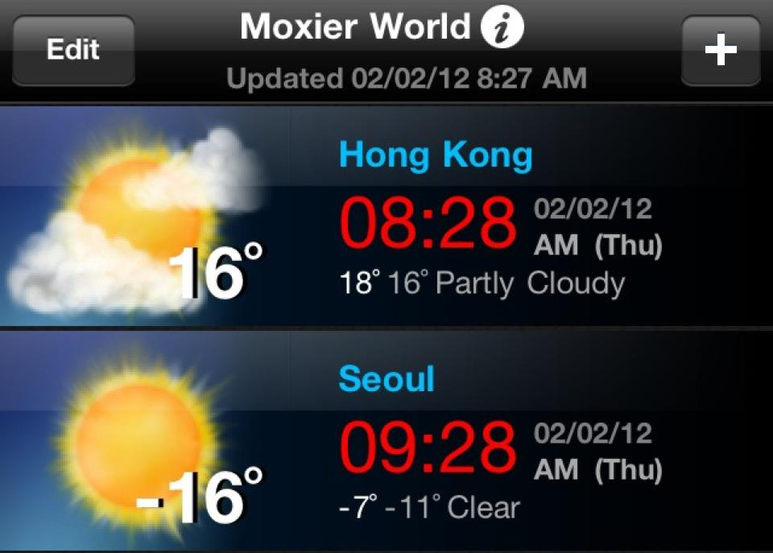
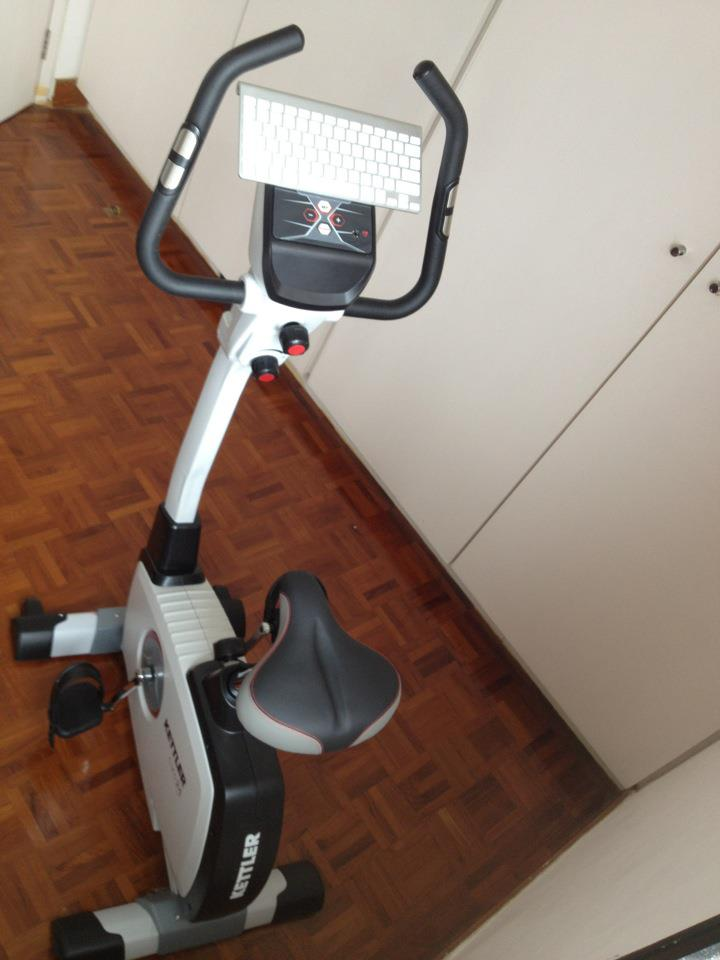
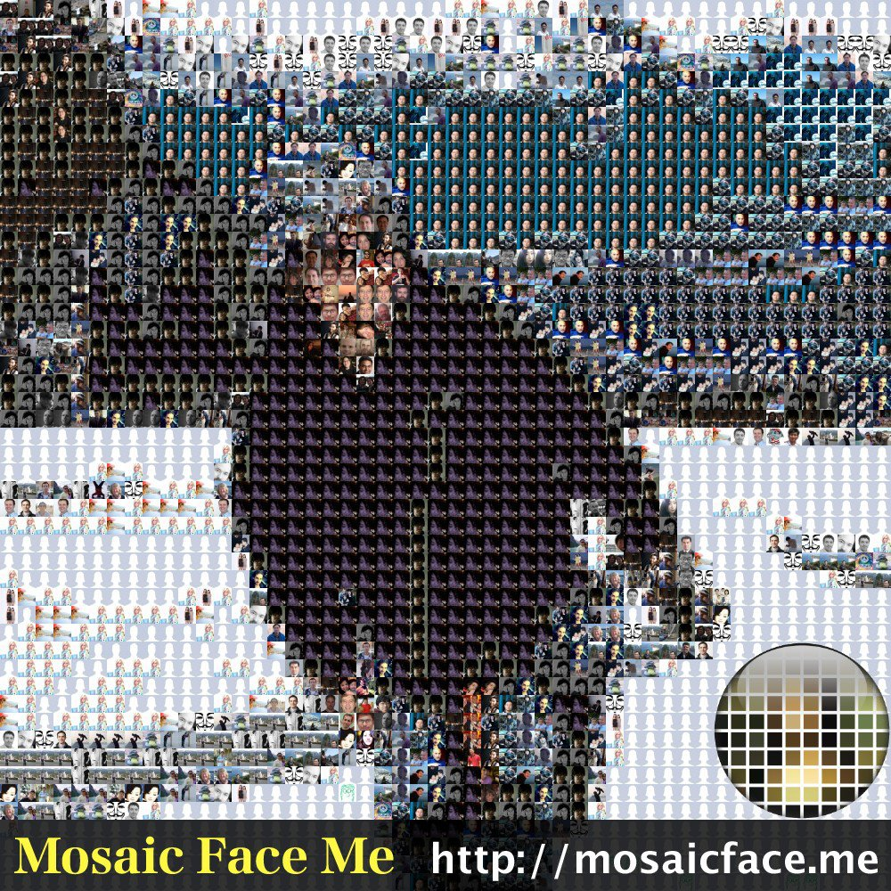
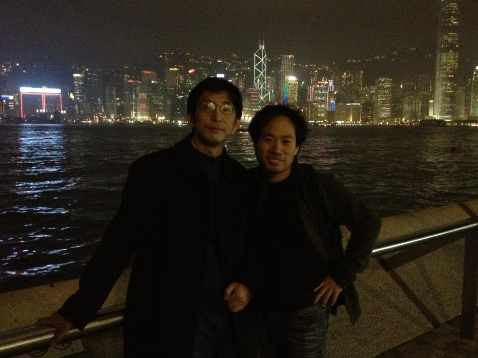
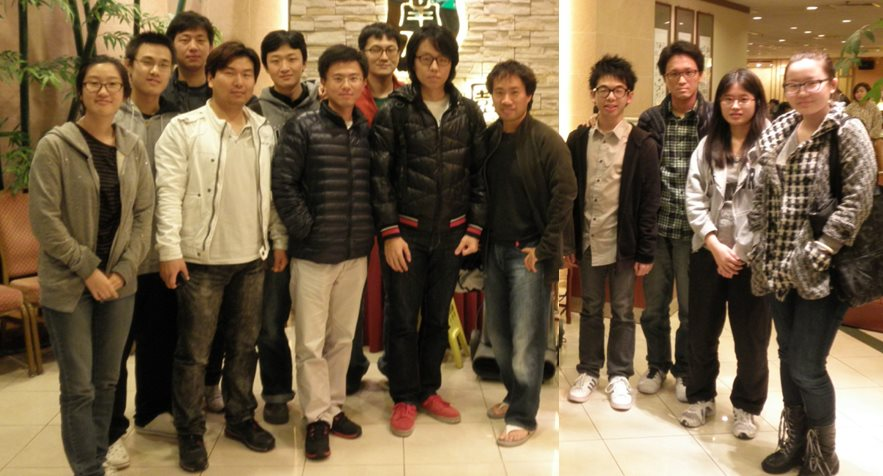
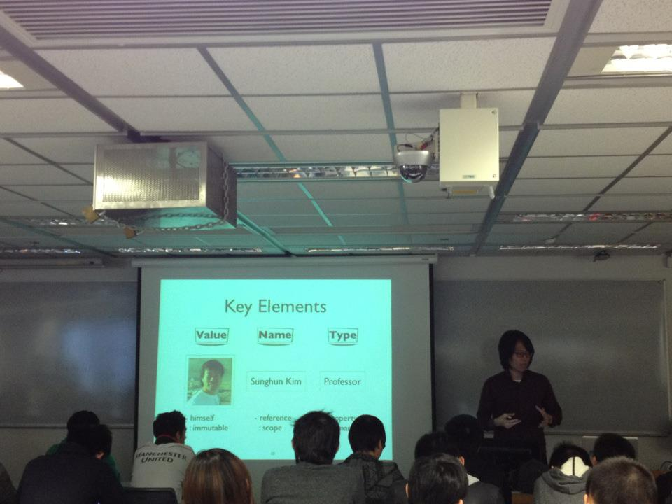
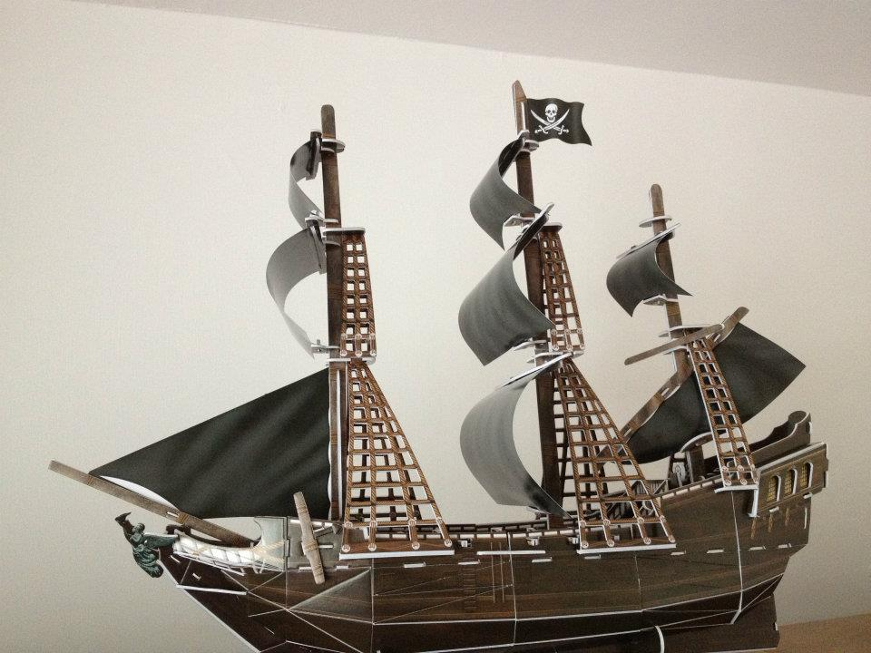
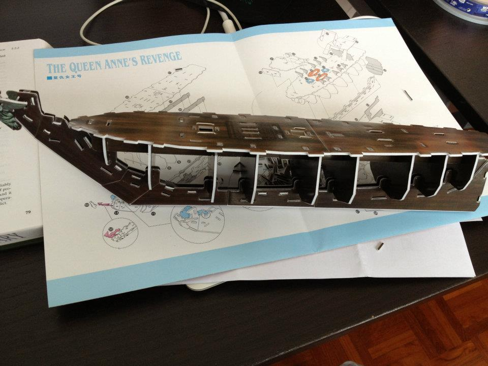
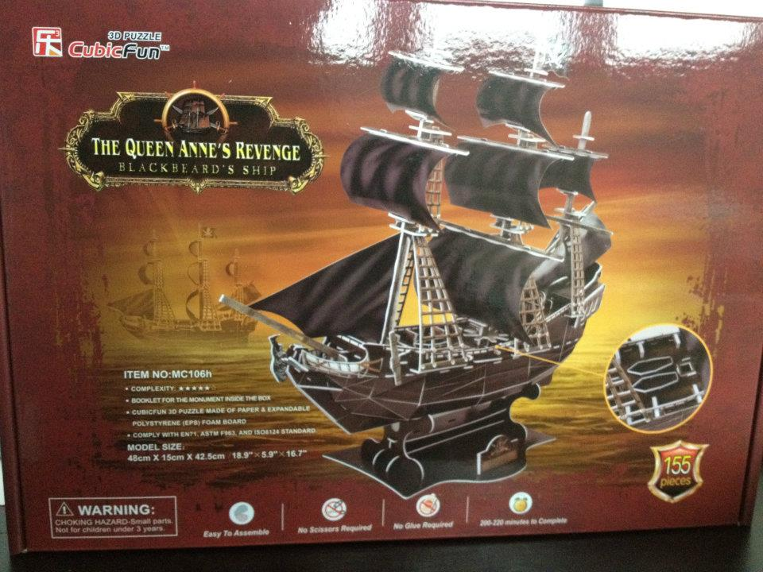
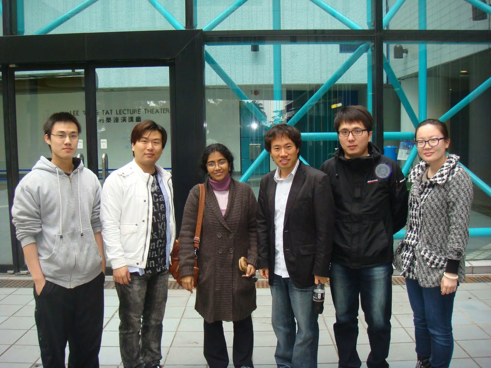

# 2012년 2월

[← 2012년](README.md)

### 2월 2일 (목) 09:29 · -16 and +16.

-16 and +16.

**이미지 캡션:** 이것은 스마트폰 화면의 날씨 앱으로, 상단에는 "Moxier World"라는 제목과 함께 "Edit" 버튼과 더하기(+) 버튼이 보이며, "Updated 02/02/12 8:27 AM"이라는 업데이트 시간이 표시되어 있습니다. 화면은 두 개의 섹션으로 나뉘어 있으며, 각 섹션은 도시의 날씨 정보를 보여줍니다. 상단 섹션은 홍콩의 날씨를 나타내며, 맑은 날씨에 구름이 약간 낀 태양 그림과 함께 16도의 온도를 보여줍니다. 그 아래에는 08:28이라는 시간이 빨간색으로 표시되어 있고, 02/02/12 AM (Thu)라는 날짜와 요일, 그리고 18도와 16도의 기온, "Partly Cloudy"라는 날씨 상태가 텍스트로 나타나 있습니다. 하단 섹션은 서울의 날씨를 나타내며, 맑고 강렬한 태양 그림과 함께 -16도의 온도를 보여줍니다. 그 아래에는 09:28이라는 시간이 빨간색으로 표시되어 있고, 02/02/12 AM (Thu)라는 날짜와 요일, 그리고 -7도와 -11도의 기온, "Clear"라는 날씨 상태가 텍스트로 나타나 있습니다. 전반적으로 어두운 배경에 밝은 색상의 텍스트와 아이콘이 사용되어 정보를 명확하게 전달하고 있으며, 차분하고 정보 전달에 집중된 분위기입니다.u)라는 날짜와 요일, 그리고 18도와 16도의 기온, "Partly Cloudy"라는 날씨 상태가 텍스트로 나타나 있습니다. 하단 섹션은 서울의 날씨를 나타내며, 맑고 강렬한 태양 그림과 함께 -16도의 온도를 보여줍니다. 그 아래에는 09:28이라는 시간이 빨간색으로 표시되어 있고, 02/02/12 AM (Thu)라는 날짜와 요일, 그리고 -7도와 -11도의 기온, "Clear"라는 날씨 상태가 텍스트로 나타나 있습니다. 전반적으로 어두운 배경에 밝은 색상의 텍스트와 아이콘이 사용되어 정보를 명확하게 전달하고 있으며, 차분하고 정보 전달에 집중된 분위기입니다.

### 2월 3일 (금) 14:51 · got his first (indoor) bicycle. He can e…

got his first (indoor) bicycle. He can even do coding on his bicycle.

**이미지 캡션:** 실내 자전거의 핸들바에 흰색 키보드가 놓여 있고, 자전거 본체에는 KETTLER라는 로고가 새겨져 있으며, 자전거는 나무 바닥 위에 놓여 있고, 배경에는 흰색 벽과 문이 보인다.

### 2월 8일 (수) 21:51 · I have made a mosaic art using "Mosaic F…

I have made a mosaic art using "Mosaic Face Me"!
If you look closely, this mosaic art is made using my friends' photos. It's really easy to make, so do try and make your own! http://mosaicface.me

**이미지 캡션:** 이 이미지는 수많은 작은 얼굴 사진들로 이루어진 모자이크 아트입니다. 중앙에는 보라색 재킷을 입은 성인 남성이 어두운 표정으로 정면을 응시하고 있으며, 그의 얼굴은 수많은 작은 사진들로 구성되어 있습니다. 사진들은 대부분 성인 남녀의 얼굴이며, 다양한 인종과 연령대의 사람들이 포함되어 있습니다. 일부 사진은 흐릿하거나 잘 보이지 않지만, 대부분은 개인의 프로필 사진처럼 보입니다. 배경은 명확하게 구분되지 않지만, 일부 사진에서는 푸른색 배경이나 실내 풍경이 보입니다. 이미지 하단에는 노란색 바탕에 "Mosaic Face Me"라는 문구와 함께 웹사이트 주소 "http://mosaicface.me"가 흰색 글씨로 적혀 있습니다. 오른쪽 하단에는 돋보기 모양의 원형 아이콘이 있으며, 그 안에는 다양한 색상의 작은 사각형들이 격자 형태로 배열되어 있습니다. 전체적으로 개인의 얼굴 사진을 활용하여 거대한 이미지를 만드는 독특하고 흥미로운 분위기를 자아냅니다.c Face Me"라는 문구와 함께 웹사이트 주소 "http://mosaicface.me"가 흰색 글씨로 적혀 있습니다. 오른쪽 하단에는 돋보기 모양의 원형 아이콘이 있으며, 그 안에는 다양한 색상의 작은 사각형들이 격자 형태로 배열되어 있습니다. 전체적으로 개인의 얼굴 사진을 활용하여 거대한 이미지를 만드는 독특하고 흥미로운 분위기를 자아냅니다.

### 2월 13일 (월) 22:04 · Welcome to Hong Kong, Hongyu!

Welcome to Hong Kong, Hongyu!

**이미지 캡션:** 밤에 홍콩의 스카이라인을 배경으로 두 명의 성인 남성이 서 있습니다. 왼쪽 남성은 40대 후반에서 50대 초반으로 보이며, 검은색 코트와 회색 셔츠를 입고 둥근 안경을 쓰고 있습니다. 그는 약간 미소를 짓고 있으며, 난간에 손을 얹고 있습니다. 오른쪽 남성은 30대 후반에서 40대 초반으로 보이며, 검은색 상의와 청바지를 입고 있습니다. 그는 카메라를 향해 미소를 짓고 있으며, 한 손은 허리에 얹고 다른 한 손은 주머니에 넣고 있습니다. 배경에는 불빛이 반짝이는 고층 빌딩들이 보이며, 물결이 잔잔하게 일렁이는 바다가 펼쳐져 있습니다. 전체적으로 도시의 야경을 즐기는 듯한 편안하고 즐거운 분위기입니다. 바다가 펼쳐져 있습니다. 전체적으로 도시의 야경을 즐기는 듯한 편안하고 즐거운 분위기입니다.

### 2월 16일 (목) 23:57 · enjoyed farewell dinner for two visiting…

enjoyed farewell dinner for two visiting students, Guangtai (Peking U) and Kihong (Seoul National U). We were so happy to have you. Let's keep in touch.

**이미지 캡션:** 이 사진은 실내에서 촬영되었으며, 여러 명의 젊은 성인들이 함께 서서 포즈를 취하고 있습니다. 왼쪽부터 한 명의 성인 여성이 회색 후드티와 검은색 줄무늬 티셔츠를 입고 안경을 쓰고 있으며, 그녀 옆에는 안경을 쓴 성인 남성이 회색 후드티를 입고 있습니다. 그 뒤로 여러 명의 성인 남성들이 각기 다른 캐주얼 복장을 하고 서 있으며, 대부분 어두운 색상의 점퍼나 재킷을 입고 있습니다. 중앙에 있는 성인 남성은 검은색 패딩 점퍼에 빨간색 줄무늬가 있고, 그의 옆에는 검은색 후드티를 입은 성인 남성이 청바지를 입고 있습니다. 오른쪽으로 갈수록 성인 남성들이 더 많이 보이며, 마지막에는 체크무늬 재킷을 입은 성인 여성이 검은색 부츠를 신고 있습니다. 배경에는 대나무 장식이 있는 벽과 조명이 보이며, 전체적으로 편안하고 캐주얼한 분위기입니다. 사진에는 "7"이라는 숫자가 희미하게 보입니다.있습니다. 오른쪽으로 갈수록 성인 남성들이 더 많이 보이며, 마지막에는 체크무늬 재킷을 입은 성인 여성이 검은색 부츠를 신고 있습니다. 배경에는 대나무 장식이 있는 벽과 조명이 보이며, 전체적으로 편안하고 캐주얼한 분위기입니다. 사진에는 "7"이라는 숫자가 희미하게 보입니다.

### 2월 17일 (금) 18:09 · is happy to have Kihong as a guest lectu…

is happy to have Kihong as a guest lecturer for his software engineering class. Kihong even used my picture in his slides to teach OCaml.

**이미지 캡션:** 이 사진은 강의실에서 열린 발표 또는 강의 장면을 담고 있으며, 화면에는 "Key Elements"라는 제목과 함께 "Value", "Name", "Type"이라는 항목이 표시되어 있습니다. 화면 왼쪽에는 한 남성의 사진과 함께 "himself", "immutable"이라는 단어가, 오른쪽에는 "Sunghun Kim", "Professor", "- reference", ": scope", "property", "nar" 등의 텍스트가 보입니다. 발표자는 화면 오른쪽에 서서 청중을 향해 이야기하고 있으며, 그는 검은색 셔츠를 입고 안경을 착용하고 있습니다. 그의 표정은 진지하며, 손짓으로 무언가를 설명하는 듯한 모습입니다. 강의실에는 여러 명의 청중이 앉아 있으며, 대부분 젊은 성인 남성으로 보입니다. 천장에는 형광등과 함께 환풍기, 프로젝터, 그리고 감시 카메라로 보이는 장치가 설치되어 있습니다. 전반적으로 학술적인 분위기를 풍기는 장면입니다. 검은색 셔츠를 입고 안경을 착용하고 있습니다. 그의 표정은 진지하며, 손짓으로 무언가를 설명하는 듯한 모습입니다. 강의실에는 여러 명의 청중이 앉아 있으며, 대부분 젊은 성인 남성으로 보입니다. 천장에는 형광등과 함께 환풍기, 프로젝터, 그리고 감시 카메라로 보이는 장치가 설치되어 있습니다. 전반적으로 학술적인 분위기를 풍기는 장면입니다.

### 2월 23일 (목) 19:32 · was very happy to have Prof. Jae W. Lee …

was very happy to have Prof. Jae W. Lee at HKUST. Sung will miss him again.

**이미지 캡션:** 발표자가 강연을 하고 있는 모습으로, 성인 남성으로 보이는 발표자는 검은색 재킷과 파란색 셔츠를 입고 있으며, 두 손을 들어 올린 채 열정적으로 설명하고 있다. 배경에는 "Software Solutions to Hardware Problems in the Billion Transistor Era"라는 제목과 함께 발표자의 이름, 이메일 주소, 소속 대학인 SungKyunKwan University가 흰색 글씨로 적혀 있다. 또한, 녹색의 추상적인 로고와 숫자 "1398"이 보이며, 하단에는 "ruary 20th 2012"와 "HKUST, Hong Kong"이라는 날짜와 장소 정보가 있다. 발표자 옆에는 노트북이 놓여 있으며, 앞쪽에는 발표용 스탠드가 보인다. 전체적으로 학술 발표 또는 강연의 분위기를 띤다.h 2012"와 "HKUST, Hong Kong"이라는 날짜와 장소 정보가 있다. 발표자 옆에는 노트북이 놓여 있으며, 앞쪽에는 발표용 스탠드가 보인다. 전체적으로 학술 발표 또는 강연의 분위기를 띤다.

### 2월 25일 (토) 17:50 · 📷 앨범: The Queen Anne's Revenge (3장)

**이미지 캡션:** 이 사진은 흰색 배경을 뒤로하고 정면에서 약간 오른쪽으로 기울어진 모습으로 보이는 3D 퍼즐로 만들어진 해적선 모형을 보여줍니다. 배는 짙은 갈색이며, 돛은 검은색 천으로 만들어져 있습니다. 돛대에는 격자 모양의 구조물이 있고, 가장 높은 돛대에는 해골과 뼈다귀가 그려진 검은색 해적기가 펄럭이고 있습니다. 배의 앞부분에는 푸른색의 장식물이 달려 있습니다. 사진에는 사람이 보이지 않으며, 장소는 실내로 추정됩니다. 전체적으로 정교하게 만들어진 해적선 모형을 보여주는 사진입니다.
 
**이미지 캡션:** 이 사진은 조립 중인 나무 재질의 배 모형과 설명서가 놓여 있는 책상 위를 보여줍니다. 배 모형은 갈색으로 나무 질감이 살아 있으며, 내부가 비어 있어 조립 과정을 엿볼 수 있습니다. 배 모형 위에는 "THE QUEEN ANNE'S REVENGE"라는 제목과 함께 중국어로 "복수 여왕호"라고 적힌 설명서가 펼쳐져 있습니다. 설명서에는 배의 조립 과정을 보여주는 복잡한 도면이 그려져 있으며, 일부 부품들이 표시되어 있습니다. 책상 표면은 어두운 갈색이며, 나무 바닥이 일부 보입니다. 사진에는 사람이 보이지 않으며, 전반적으로 조립이나 취미 활동에 집중하는 차분하고 집중된 분위기를 느낄 수 있습니다.며, 전반적으로 조립이나 취미 활동에 집중하는 차분하고 집중된 분위기를 느낄 수 있습니다.
 
**이미지 캡션:** 이 사진은 큐빅펀 3D 퍼즐 상자를 보여주며, 상자에는 "더 퀸 앤 레벤지"라는 이름의 검은색 범선 모델이 그려져 있습니다. 이 범선은 블랙비어드의 배로 묘사되며, 돛은 검은색이고 돛대는 은색입니다. 상자에는 퍼즐의 품번, 복잡성, 재질, 모델 크기, 조립에 필요한 시간, 그리고 작은 부품으로 인한 질식 위험 경고 문구가 한국어로 적혀 있습니다. 또한, 퍼즐 조각이 155개임을 나타내는 숫자와 함께 "조립 용이", "가위 불필요", "접착제 불필요"와 같은 문구도 보입니다. 배경은 붉은색과 주황색이 섞인 노을이 지는 바다를 연상시키며, 멀리 다른 범선 두 척이 희미하게 보입니다. 상자 오른쪽 하단에는 퍼즐 조각의 일부를 확대한 이미지가 삽입되어 있습니다.이 지는 바다를 연상시키며, 멀리 다른 범선 두 척이 희미하게 보입니다. 상자 오른쪽 하단에는 퍼즐 조각의 일부를 확대한 이미지가 삽입되어 있습니다.

### 2월 28일 (화) 10:47 · enjoyed farewell lunch with Ananya Kanji…

enjoyed farewell lunch with Ananya Kanjilal, a postdoc visitor from India. It was really good to have her and we will miss her a lot. Wish her all the very best!

**이미지 캡션:** 여섯 명의 사람이 건물 앞에 서서 사진을 찍고 있다. 왼쪽에서부터 첫 번째는 젊은 성인 남성으로, 회색 후드티와 검은색 바지를 입고 있으며, 안경을 쓰고 있다. 두 번째는 젊은 성인 남성으로, 흰색 재킷과 청바지를 입고 있으며, 검은색 티셔츠를 안에 입고 있다. 세 번째는 성인 여성으로, 갈색 코트와 보라색 터틀넥을 입고 있으며, 안경을 쓰고 있다. 네 번째는 젊은 성인 남성으로, 검은색 재킷과 청바지를 입고 있으며, 흰색 셔츠를 안에 입고 있다. 다섯 번째는 젊은 성인 남성으로, 검은색 패딩 점퍼와 청바지를 입고 있으며, 안경을 쓰고 있다. 여섯 번째는 젊은 성인 여성으로, 회색과 검은색 체크무늬 코트와 청바지를 입고 있으며, 안경을 쓰고 있다. 배경에는 파란색 구조물이 있는 현대적인 건물 입구가 보인다. 건물 유리문에는 "LEE W. TAT LECTURE THEATER"와 중국어 문구가 적혀 있다. 사람들은 모두 카메라를 향해 서 있으며, 일부는 미소를 짓고 있다. 전반적으로 캐주얼한 분위기이며, 학술적인 장소에서 촬영된 것으로 보인다. 입고 있으며, 안경을 쓰고 있다. 여섯 번째는 젊은 성인 여성으로, 회색과 검은색 체크무늬 코트와 청바지를 입고 있으며, 안경을 쓰고 있다. 배경에는 파란색 구조물이 있는 현대적인 건물 입구가 보인다. 건물 유리문에는 "LEE W. TAT LECTURE THEATER"와 중국어 문구가 적혀 있다. 사람들은 모두 카메라를 향해 서 있으며, 일부는 미소를 짓고 있다. 전반적으로 캐주얼한 분위기이며, 학술적인 장소에서 촬영된 것으로 보인다.
