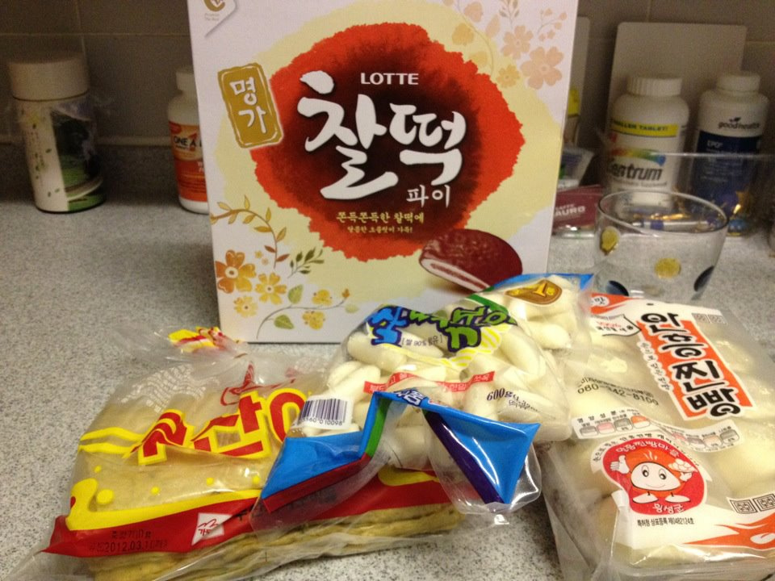
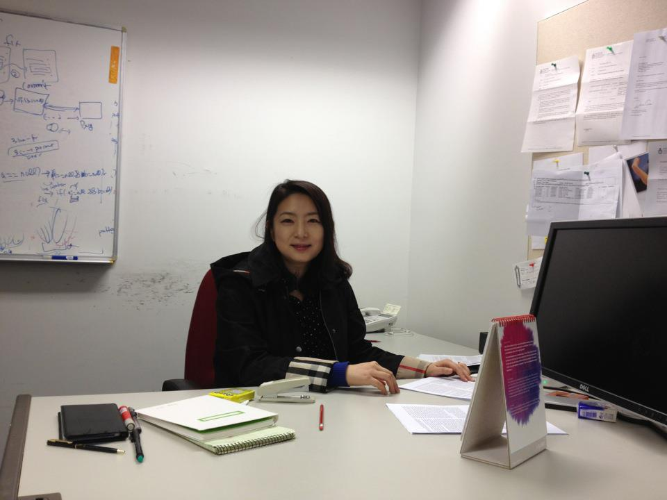
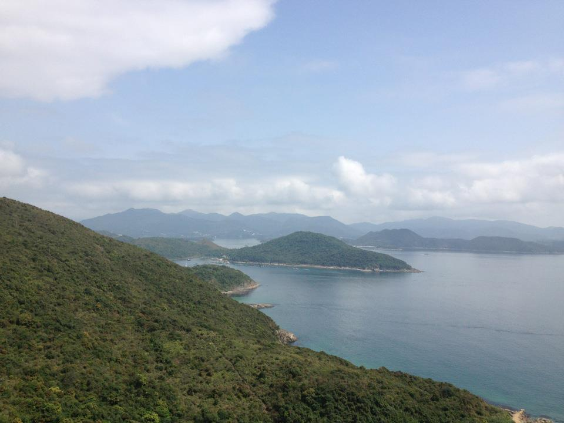
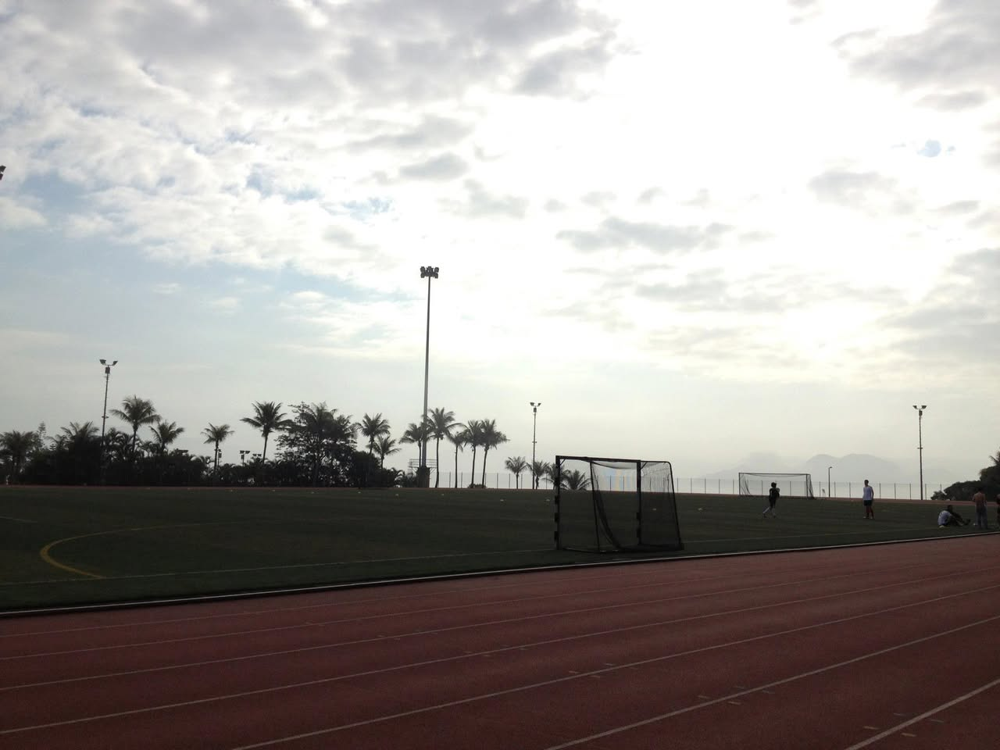
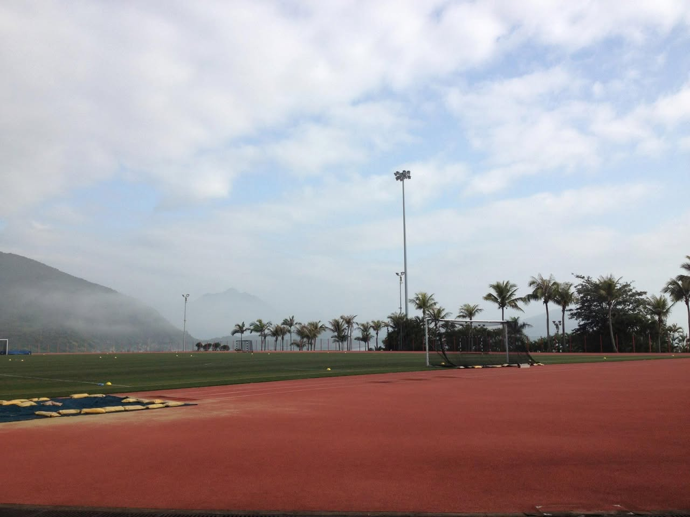
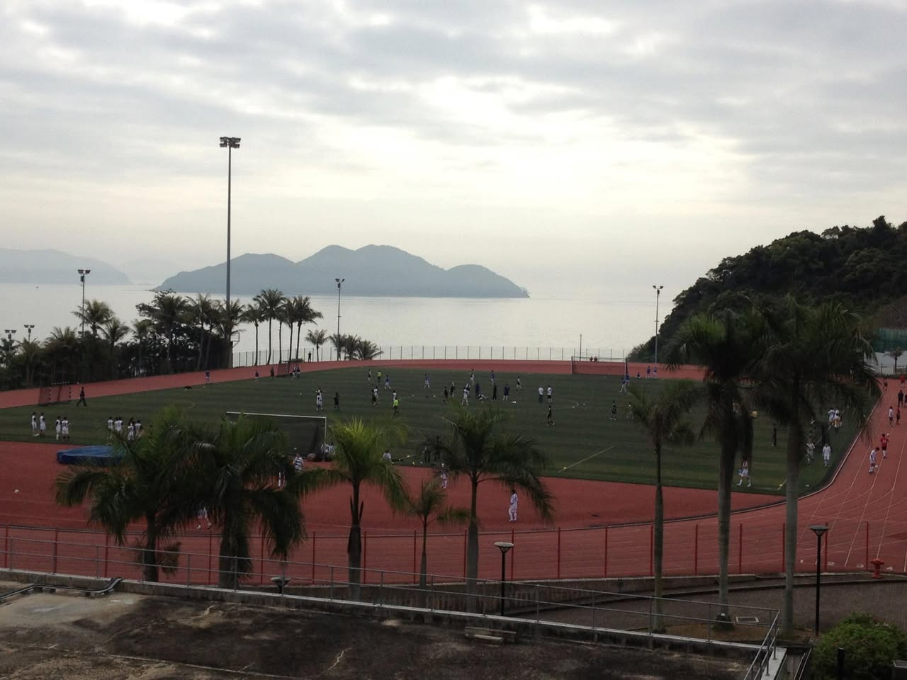
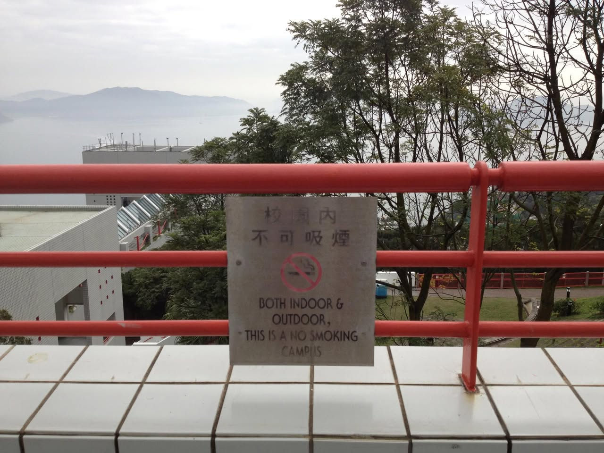

# 2012년 3월

[← 2012년](README.md)

### 3월 6일 (화) 22:31 · 📷 사진 (1장)

**이미지 캡션:** 주방 조리대 위에 롯데 찰떡파이 상자와 여러 봉지의 떡이 놓여 있다. 롯데 찰떡파이 상자는 노란색 바탕에 붉은색 붓글씨로 "찰떡파이"라고 쓰여 있으며, 붉은색 팥앙금이 들어간 찰떡파이 이미지가 그려져 있다. 그 앞에는 투명한 비닐봉지에 담긴 하얀색 떡들이 여러 개 보이며, 그중 하나에는 "안흥찐빵"이라는 글자가 쓰여 있다. 다른 봉지에는 노란색과 빨간색으로 된 떡이 담겨 있으며, 유통기한으로 보이는 "2012.03.10"이라는 글자가 보인다. 배경에는 약병과 유리잔이 놓여 있어 전반적으로 음식 준비 또는 보관 중인 상황으로 보인다.

> 떡복이재료량 간식 준비완료!

### 3월 12일 (월) 18:07 · is happy to have Dr. Yungsook Lucy Jung …

is happy to have Dr. Yungsook Lucy Jung in my office (in my chair) at HKUST. Welcome to Hong kong!

**이미지 캡션:** 사무실 책상에 앉아 있는 성인 여성으로, 40대 초반으로 보이며 검은색 머리카락에 부드러운 미소를 띠고 있습니다. 그녀는 검은색 재킷 안에 흰색 점이 찍힌 검은색 상의를 입고 있으며, 소매에는 줄무늬가 있습니다. 그녀는 책상에 앉아 서류를 바라보고 있으며, 책상 위에는 노트북, 펜, 스테이플러, 전화기, 컴퓨터 모니터, 그리고 접이식 달력이 놓여 있습니다. 배경에는 흰색 벽과 화이트보드가 있으며, 화이트보드에는 다이어그램과 글씨가 그려져 있습니다. 벽에는 서류가 붙어 있는 게시판도 보입니다. 전체적으로 차분하고 업무적인 분위기입니다.

### 3월 17일 (토) 12:11 · is embracing beautiful Spring in Hong Ko…

is embracing beautiful Spring in Hong Kong.

**이미지 캡션:** 이 사진은 푸른 바다와 섬들, 그리고 구름 낀 하늘이 어우러진 아름다운 자연 풍경을 담고 있습니다. 사진의 전경에는 울창한 녹색 식물로 뒤덮인 가파른 언덕이 자리 잡고 있으며, 이 언덕은 사진의 왼쪽 하단에서 오른쪽 상단으로 이어집니다. 언덕 너머로는 잔잔한 바다가 펼쳐져 있고, 바다 위에는 여러 개의 섬들이 점점이 떠 있습니다. 섬들은 대부분 푸른 식물로 덮여 있으며, 일부 섬에는 작은 마을이나 건물이 보이는 듯도 합니다. 멀리 보이는 산들은 옅은 푸른색으로 희미하게 보이며, 이는 대기 원근감을 나타냅니다. 하늘은 맑은 푸른색을 띠고 있지만, 뭉게구름들이 떠 있어 부드럽고 몽환적인 분위기를 더합니다. 사진에는 사람이 보이지 않으며, 텍스트도 없습니다. 전반적으로 평화롭고 고요한 자연의 아름다움을 느낄 수 있는 풍경 사진입니다.

### 3월 18일 (일) 11:41 · 📷 앨범: Sung's favorite place at HKUST (3장)

**이미지 캡션:** 운동장 트랙과 잔디밭이 보이는 풍경으로, 잔디밭에는 축구 골대 두 개가 놓여 있고 여러 명의 사람들이 운동을 하고 있다. 왼쪽에는 야자수와 키 큰 조명 기둥들이 늘어서 있으며, 멀리 산과 바다가 보인다. 하늘은 구름이 낀 흐린 날씨이며, 전체적으로 차분하고 활동적인 분위기이다.
 
**이미지 캡션:** 이 사진은 붉은색 트랙과 녹색 잔디 축구장이 있는 야외 스포츠 시설을 보여줍니다. 사진의 전경에는 붉은색 트랙이 넓게 펼쳐져 있고, 그 뒤로는 잘 관리된 녹색 잔디 축구장이 보입니다. 축구장에는 골대가 설치되어 있으며, 몇 개의 노란색 콘이 잔디밭 곳곳에 놓여 있어 훈련 중임을 암시합니다. 배경에는 야자수와 다른 나무들이 줄지어 서 있고, 멀리 안개가 낀 산이 보입니다. 하늘은 구름이 많지만 부분적으로 파란 하늘도 보입니다. 사진에는 사람이 보이지 않으며, 텍스트도 없습니다. 전반적으로 맑고 쾌적한 날씨에 스포츠 활동을 하기에 좋은 환경임을 보여주는 평화로운 분위기입니다.
 
**이미지 캡션:** 흐린 날씨에 바다를 배경으로 운동장에서 축구 연습을 하고 있는 여러 명의 젊은 남성들이 보인다. 운동장에는 녹색 잔디가 깔려 있고, 주변에는 붉은색 트랙이 둘러져 있다. 운동장 중앙에는 축구 골대가 설치되어 있으며, 여러 명의 선수들이 공을 주고받으며 훈련에 임하고 있다. 선수들은 대부분 흰색 또는 어두운 색상의 운동복을 착용하고 있으며, 젊고 활기찬 모습이다. 운동장 주변에는 야자수와 같은 열대 식물들이 심어져 있어 이국적인 분위기를 더한다. 멀리 보이는 바다와 산은 평화롭고 고요한 느낌을 주며, 전체적으로 활동적인 운동 경기의 모습과 자연의 아름다움이 조화를 이루고 있다.

> IMG_0567
> IMG_0569
> IMG_0572

### 3월 18일 (일) 11:54 · This is Sung's favorite sign at HKUST. B…

This is Sung's favorite sign at HKUST. Both indoor & outdoor, NO Smoking!

**이미지 캡션:** 붉은색 난간 너머로 흐릿한 산과 바다가 보이는 풍경이 펼쳐져 있으며, 현대적인 건물과 울창한 나무들이 배경을 이루고 있습니다. 난간에는 "학교 내 금연"이라는 문구가 중국어와 영어로 적힌 표지판이 부착되어 있습니다. 표지판에는 금연을 상징하는 아이콘도 함께 표시되어 있습니다. 사진은 맑지 않은 날씨를 반영하듯 전체적으로 차분하고 조용한 분위기를 자아냅니다.

### 3월 24일 (토) 11:37 · totally supports the strike. It's a sham…

totally supports the strike. It's a shame!

🔗 <http://www.youtube.com/watch?v=qXyamH4A34Q>

### 3월 27일 (화) 13:56 · is almost finalizing his summer plan. Ma…

is almost finalizing his summer plan. May: Seoul Korea, June:  Zurich (ICSE12), July: Cagliari Italy, Aug: Hong Kong (working on ICSE13 submissions), Sep: Denmark/Sweden (PROMISE12). See you there!
