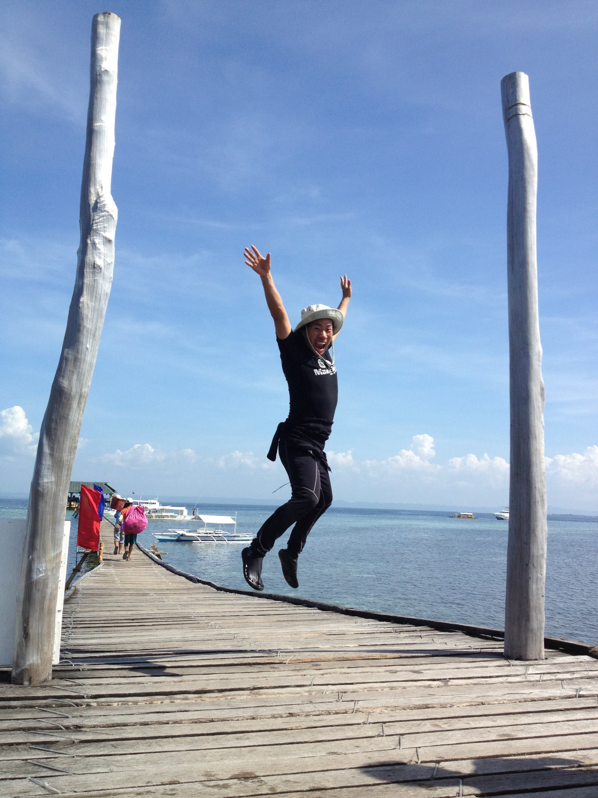
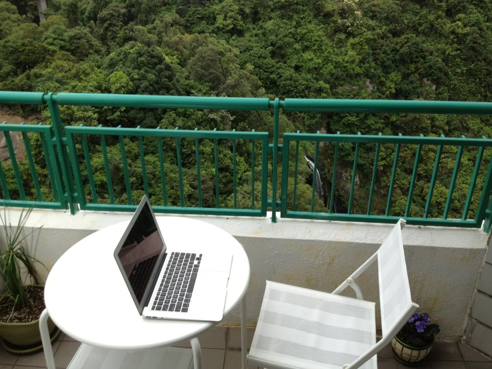
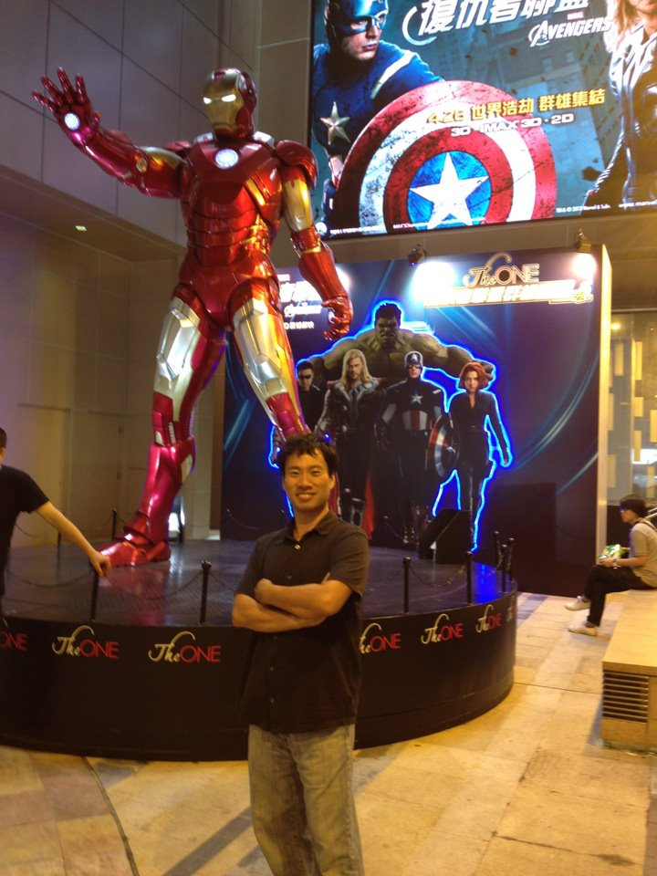

# 2012년 4월

[← 2012년](README.md)

### 4월 8일 (일) 09:00 · jumped!

📍 Cebu City

jumped!

**이미지 캡션:** 푸른 하늘 아래, 나무로 된 부두 위에서 한 성인 남성이 점프를 하고 있다. 그는 흰색 벙거지 모자를 쓰고 검은색 반팔 티셔츠와 검은색 바지를 입고 있으며, 발에는 검은색 신발을 신고 있다. 티셔츠에는 하얀색 글씨로 무언가 쓰여 있지만 명확하게 보이지는 않는다. 남성은 두 팔을 하늘 높이 들어 올리고 환하게 웃으며 점프의 즐거움을 만끽하고 있다. 그의 뒤로는 잔잔한 바다가 펼쳐져 있고, 수평선에는 여러 척의 배들이 보인다. 부두 양쪽에는 굵은 나무 기둥이 세워져 있고, 왼쪽에는 붉은색과 파란색 깃발이 걸려 있다. 멀리 보이는 다른 사람들은 짐을 들고 부두를 따라 걷고 있다. 전체적으로 밝고 활기찬 분위기이며, 휴양지에서의 즐거운 순간을 포착한 사진이다.

### 4월 25일 (수) 11:39 · feels more productive to have his first …

feels more productive to have his first outdoor workdesk in his balcony. (Could you point a waterfall there?)

**이미지 캡션:** 이 사진은 울창한 녹색 숲이 내려다보이는 발코니의 풍경을 담고 있으며, 발코니에는 흰색 원형 테이블과 접이식 의자가 놓여 있습니다. 테이블 위에는 열려 있는 노트북이 있어 누군가 이곳에서 작업을 하거나 휴식을 취하고 있었음을 암시합니다. 배경에는 짙은 녹색의 나무들이 빽빽하게 들어차 있으며, 그 사이로 희미하게 폭포가 보이는 듯한 모습도 관찰됩니다. 발코니 난간은 녹색으로 칠해져 있으며, 난간 너머로 펼쳐진 자연의 모습은 평화롭고 고요한 분위기를 자아냅니다. 테이블 옆에는 화분에 심어진 식물이 있고, 의자 옆에는 작은 화분에 보라색 꽃이 피어 있어 공간에 생기를 더합니다. 사진에는 사람이 등장하지 않으며, 전체적으로 자연 속에서 휴식을 취하거나 업무를 볼 수 있는 아늑한 공간의 느낌을 줍니다.

### 4월 30일 (월) 22:29 · will see him tonight!

will see him tonight!

**이미지 캡션:** 이 사진은 영화 '어벤져스' 홍보 행사로 보이는 장소에서 촬영되었으며, 거대한 아이언맨 피규어가 중앙에 서 있고 그 뒤로는 캡틴 아메리카, 헐크, 토르, 블랙 위도우 등 어벤져스 멤버들의 대형 포스터가 보인다. 사진의 전경에는 중년의 동양인 남성이 검은색 셔츠와 청바지를 입고 팔짱을 낀 채 카메라를 향해 미소를 짓고 서 있다. 그의 뒤로는 'The ONE'이라고 적힌 원형 무대와 함께 아이언맨 피규어가 전시되어 있다. 배경에는 '어벤져스'라는 글자와 함께 중국어로 된 홍보 문구가 적힌 대형 스크린이 보인다. 전체적으로 영화 홍보 행사장의 활기찬 분위기를 느낄 수 있다.
