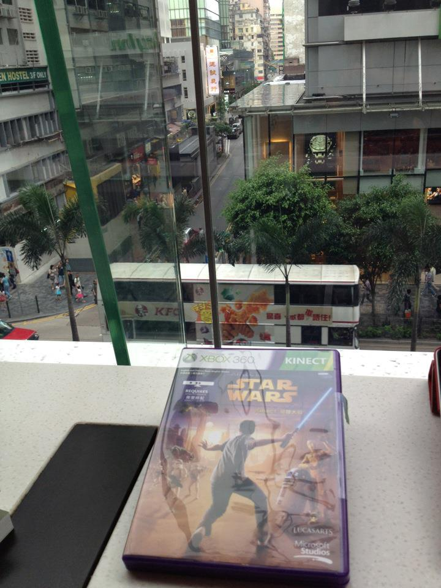
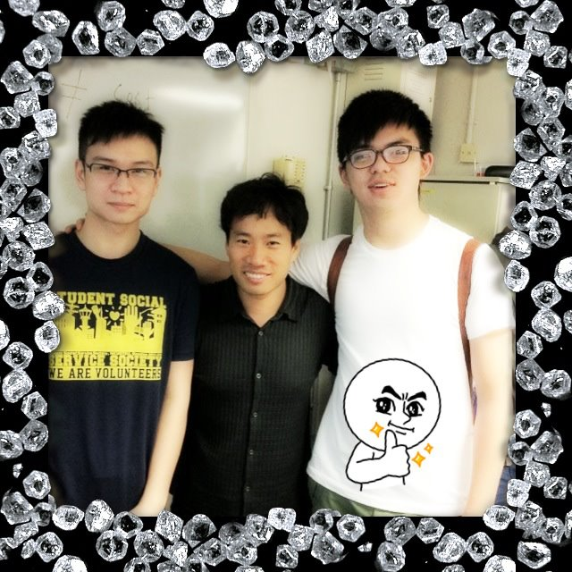
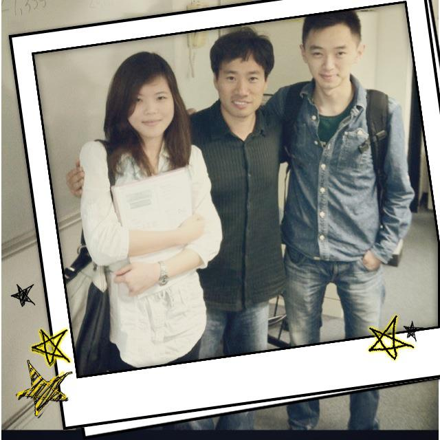
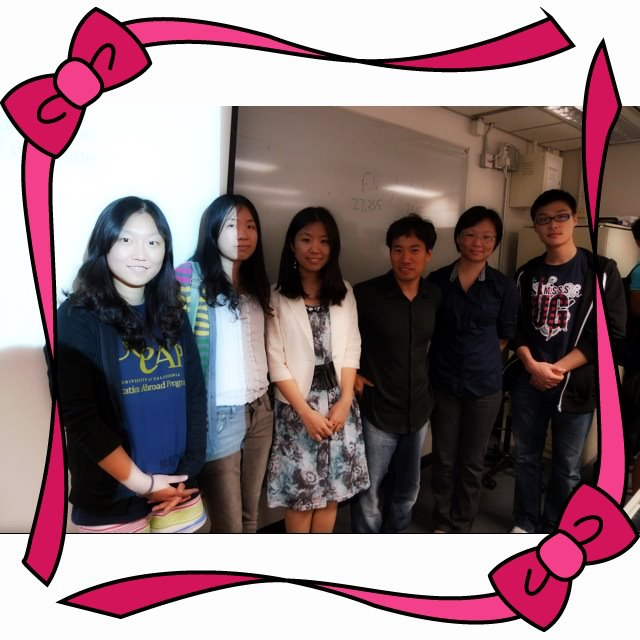
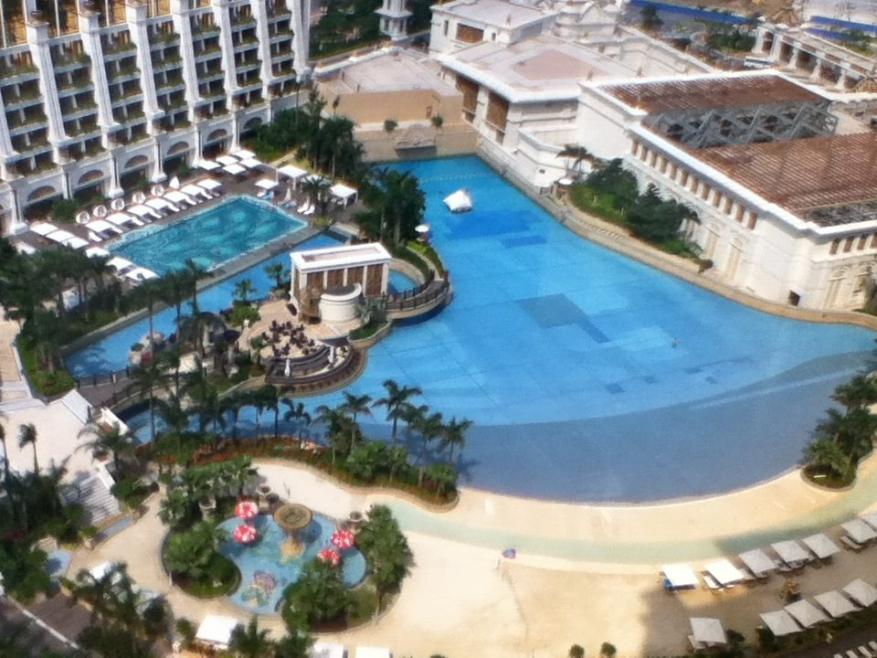
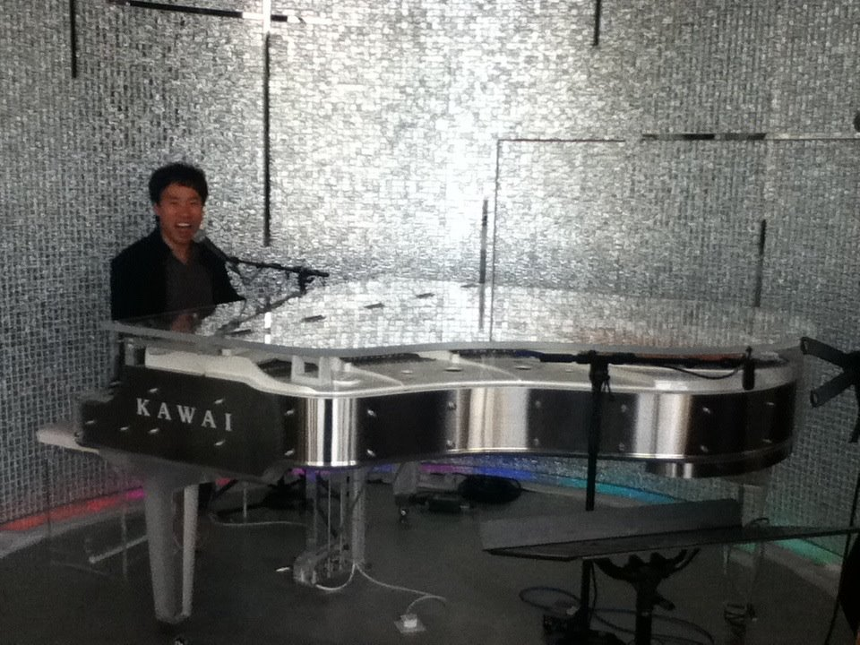
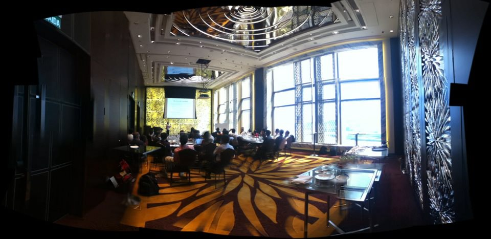
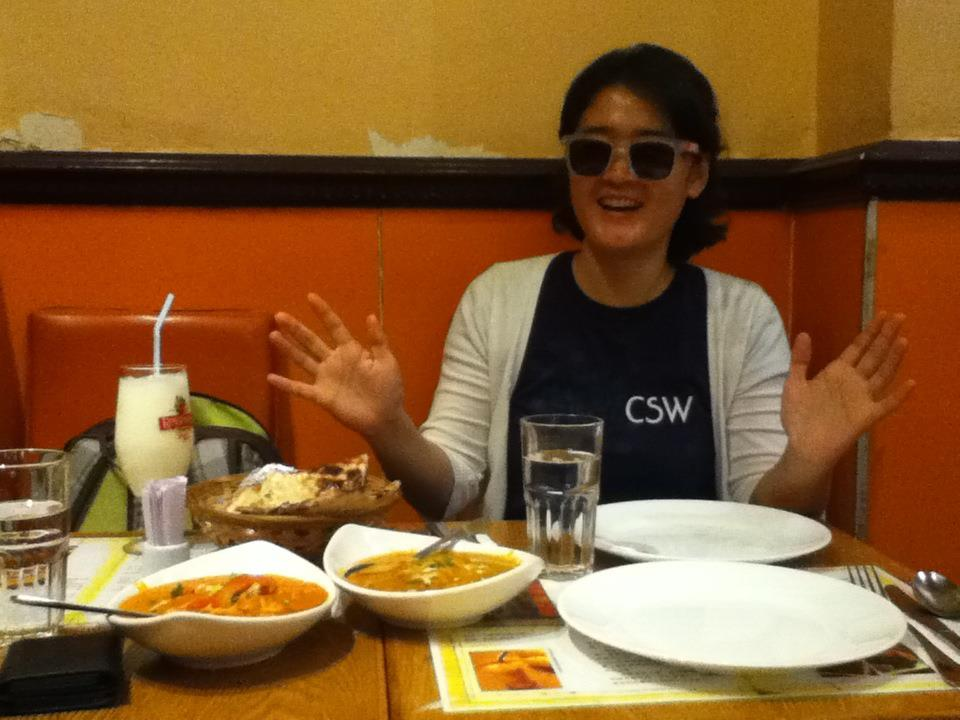

# 2012년 5월

[← 2012년](README.md)

### 5월 2일 (수) 18:11 · will be a Jedi tonight!

will be a Jedi tonight!

**이미지 캡션:** 탁자 위에 놓인 XBOX 360용 스타워즈 게임 케이스가 보인다. 게임 케이스 표지에는 광선검을 든 남성과 스타워즈 캐릭터들이 그려져 있다. 배경으로는 창밖으로 보이는 도시 풍경이 펼쳐져 있으며, 높은 건물들과 도로, 그리고 사람들이 보인다. 건물에는 "EN HOSTEL 3F ONLY"라는 간판이 보이고, KFC 간판도 보인다. 전반적으로 도시의 낮 풍경을 담고 있으며, 게임 케이스가 전면에 배치되어 있어 게임에 대한 관심이 느껴진다.

### 5월 12일 (토) 16:22 · 📷 앨범: COMP3111/H (3장)

**이미지 캡션:** 세 명의 성인 남성이 어깨를 나란히 하고 서 있으며, 모두 밝은 표정을 짓고 있다. 왼쪽 남성은 검은색 안경을 쓰고 파란색 티셔츠를 입고 있으며, 티셔츠에는 "STUDENT SOCIAL SERVICE SOCIETY WE ARE VOLUNTEERS"라는 글자가 흰색으로 인쇄되어 있다. 가운데 남성은 검은색 줄무늬 셔츠를 입고 있으며, 오른쪽 남성은 흰색 티셔츠를 입고 있으며 티셔츠 앞면에는 귀여운 캐릭터 그림이 그려져 있다. 이들은 실내 공간에 있으며, 배경에는 흰색 벽과 벽에 걸린 칠판, 그리고 약간의 장비가 보인다. 사진은 반짝이는 보석 모양의 테두리로 둘러싸여 있어 특별한 순간을 기념하는 듯한 분위기를 자아낸다.
 
**이미지 캡션:** 사진에는 세 명의 젊은 아시아인이 실내에서 포즈를 취하고 있다. 왼쪽에는 젊은 여성으로 추정되는 사람이 흰색 블라우스를 입고 책을 들고 있으며, 팔짱을 끼고 카메라를 바라보고 있다. 그녀는 20대 초중반으로 보이며, 긴 갈색 머리를 하고 있다. 그녀의 왼쪽에는 성인 남성이 검은색 줄무늬 셔츠를 입고 있으며, 다른 남성의 어깨에 팔을 두르고 있다. 그는 30대 초중반으로 보이며, 짧은 검은 머리를 하고 있다. 오른쪽에는 또 다른 성인 남성이 데님 셔츠와 청바지를 입고 있으며, 백팩을 메고 있다. 그는 20대 후반으로 보이며, 짧은 검은 머리를 하고 있다. 세 사람 모두 카메라를 향해 미소를 짓고 있으며, 편안하고 친근한 분위기이다. 배경은 흰색 벽으로, 약간의 장식과 함께 칠판으로 보이는 것이 있다. 사진은 흰색 테두리로 둘러싸여 있으며, 왼쪽과 오른쪽 하단에 노란색 별 모양의 장식이 그려져 있다. 전체적으로 캐주얼하고 즐거운 분위기의 사진이다.
 
**이미지 캡션:** 이 사진은 핑크색 리본 장식 프레임 안에 담겨 있으며, 다섯 명의 젊은 아시아인들이 강의실로 보이는 배경 앞에서 포즈를 취하고 있다. 왼쪽부터 첫 번째 여성은 20대 초반으로 보이며, 검은색 후드티 안에 파란색 티셔츠를 입고 있으며, 티셔츠에는 "CAP"과 "cation Abroad Progr"이라는 글자가 희미하게 보인다. 그녀는 밝게 웃으며 카메라를 응시하고 있다. 두 번째 여성은 20대 초반으로 보이며, 밝은 색상의 줄무늬 카디건 안에 흰색 상의를 입고 청바지를 착용했다. 세 번째 여성은 20대 초반으로 보이며, 흰색 재킷 안에 꽃무늬 원피스를 입고 있다. 네 번째 인물은 20대 후반에서 30대 초반으로 보이는 남성으로, 검은색 셔츠를 입고 청바지를 착용했다. 다섯 번째 인물은 20대 중반으로 보이는 여성으로, 어두운 색상의 셔츠를 입고 청바지를 착용했다. 마지막으로 여섯 번째 인물은 20대 중반으로 보이는 남성으로, 검은색 후드티 안에 "UG"라고 적힌 티셔츠를 입고 청바지를 착용했다. 배경에는 흰색 칠판이 보이며, 칠판에는 "Fu"와 숫자 "27,355"가 적혀 있다. 전체적으로 밝고 긍정적인 분위기이며, 학생들이 함께 모여 기념 사진을 찍는 듯한 모습이다.

### 5월 15일 (화) 15:53 · wish he could play beach volleyball down…

📍 Galaxy Macau Hotel

wish he could play beach volleyball down there. (There is a net actually.)

**이미지 캡션:** 이 사진은 고급스러운 리조트의 야외 수영장과 주변 풍경을 높은 곳에서 내려다본 모습입니다. 사진 중앙에는 넓고 푸른색의 대형 수영장이 있으며, 수영장 안에는 몇 개의 사각형 모양의 구역이 표시되어 있습니다. 수영장 가장자리에는 옅은 베이지색의 테두리가 둘러져 있고, 그 너머로 야자수와 녹음이 우거진 조경이 보입니다. 수영장 옆으로는 하얀색의 파라솔과 선베드가 놓여 있어 휴식을 취하기 좋은 공간임을 알 수 있습니다. 왼쪽에는 여러 층으로 이루어진 하얀색의 웅장한 건물이 보이며, 이 건물은 호텔이나 고급 아파트일 가능성이 높습니다. 건물 앞쪽으로도 수영장과 비슷한 형태의 또 다른 수영장이 있으며, 이곳에도 파라솔과 선베드가 배치되어 있습니다. 건물과 수영장 사이에는 계단과 산책로가 마련되어 있습니다. 오른쪽에는 붉은색 지붕을 가진 여러 채의 건물들이 보이며, 이 건물들은 리조트의 부대시설이나 객실일 것으로 추정됩니다. 건물들 사이로도 나무들이 심어져 있어 자연 친화적인 분위기를 더합니다. 수영장 주변에는 야자수와 다양한 종류의 나무들이 심어져 있어 이국적인 휴양지의 느낌을 물씬 풍깁니다. 사진 속에는 사람의 모습이 거의 보이지 않지만, 수영장이나 주변 시설에서 휴식을 취하거나 이동하는 몇몇 사람들의 희미한 실루엣을 찾아볼 수 있습니다. 전반적으로 맑고 화창한 날씨에 여유롭고 평화로운 분위기를 자아내는 풍경입니다.

### 5월 15일 (화) 15:59 · sung!

sung!

**이미지 캡션:** 한 명의 성인 남성이 검은색 재킷과 회색 셔츠를 입고 있으며, 머리카락은 짧고 검은색이며, 입을 크게 벌리고 웃고 있는 듯한 표정으로 카메라를 바라보고 있습니다. 그는 투명한 그랜드 피아노 앞에 서 있으며, 피아노에는 "KAWAI"라는 글자가 새겨져 있습니다. 피아노 위에는 마이크가 두 개 설치되어 있습니다. 배경은 은색의 반짝이는 타일로 덮여 있으며, 조명은 은은하게 빛나고 있습니다. 전체적으로 현대적이고 세련된 분위기이며, 공연이나 행사의 일부인 것으로 보입니다.

### 5월 15일 (화) 16:11 · is attending his department retreat.

📍 Galaxy Macau Hotel

is attending his department retreat.

**이미지 캡션:** 넓은 회의실에서 성인 남성 발표자가 스크린을 가리키며 프레젠테이션을 하고 있으며, 약 30명 정도의 참석자들이 테이블에 둘러앉아 발표를 경청하고 있다. 참석자들은 대부분 성인 남성이며, 캐주얼한 복장을 하고 있다. 회의실은 현대적인 디자인으로, 천장에는 독특한 조명과 거울이 설치되어 있고, 벽면에는 식물 무늬의 장식이 되어 있다. 큰 창문을 통해 바깥 풍경이 보이며, 테이블 위에는 노트북과 서류 등이 놓여 있다. 전반적으로 진지하고 집중된 분위기이다.

### 5월 15일 (화) 20:29 · Yeon is very excited about Indian food f…

Yeon is very excited about Indian food for tonight.

**이미지 캡션:** 한 명의 성인 여성이 식당 테이블에 앉아 있으며, 그녀는 흰색 가디건 안에 네이비색 티셔츠를 입고 있으며 티셔츠에는 "CSW"라는 글자가 쓰여 있습니다. 그녀는 선글라스를 끼고 있으며, 활짝 웃으며 양손을 펼쳐 인사하는 듯한 포즈를 취하고 있습니다. 테이블 위에는 음료수 잔, 물잔, 두 개의 흰색 접시, 그리고 여러 개의 음식 그릇이 놓여 있습니다. 음식 그릇 중 하나에는 카레 같은 국물 요리가 담겨 있고, 다른 하나에는 빵과 함께 붉은색 채소가 들어간 요리가 담겨 있습니다. 배경은 주황색 벽과 노란색 천장으로 되어 있으며, 식당 내부임을 알 수 있습니다. 전반적으로 즐겁고 편안한 식사 분위기입니다.

### 5월 28일 (월) 19:22 · is very happy that Yeon and Sung will be…

is very happy that Yeon and Sung will be in Europe this summer. Yeon will mostly stay in Germany and Sung in Italy, and they will meet somewhere in Europe on weekends.
