# 2012년 6월

[← 2012년](README.md)

### 6월 3일 (일) 18:13 · is happy to have Prof. Gall as a keynote…

is happy to have Prof. Gall as a keynote speaker at the TOPI 2012 workshop.

**이미지 캡션:** A man in his late 30s to early 40s, with dark hair and a light complexion, stands on the left side of the frame, facing a projection screen. He is wearing a black polo shirt with a lanyard around his neck, from which hangs a white name tag. He also wears blue jeans and a watch on his left wrist. His left hand is raised slightly, as if in mid-gesture, and his right hand is on his hip. His expression is neutral, with a slight smile. The background is a dimly lit room with a white wall and a ceiling with visible panels. To the right of the man is a large projection screen displaying a presentation. The screen has a light green background with text and graphics. At the top, it reads "TOPI 2012" with "June 3, 2012 Zurich Switzerland" below it, accompanied by red brick graphics. The main title of the presentation is "Pluggable Software Analysis Services," followed by a blue banner with the subtitle "How to leverage evolution data." Below this, the name "Harald Gall" is displayed. At the bottom of the screen, the logo of the "University of Zurich" is visible, along with the date "June 3, 2012" and another logo that appears to be "S.e.a." The overall atmosphere is that of a conference or academic presentation.

### 6월 3일 (일) 20:09 · enjoyed ICSE workshop lunch today.

enjoyed ICSE workshop lunch today.

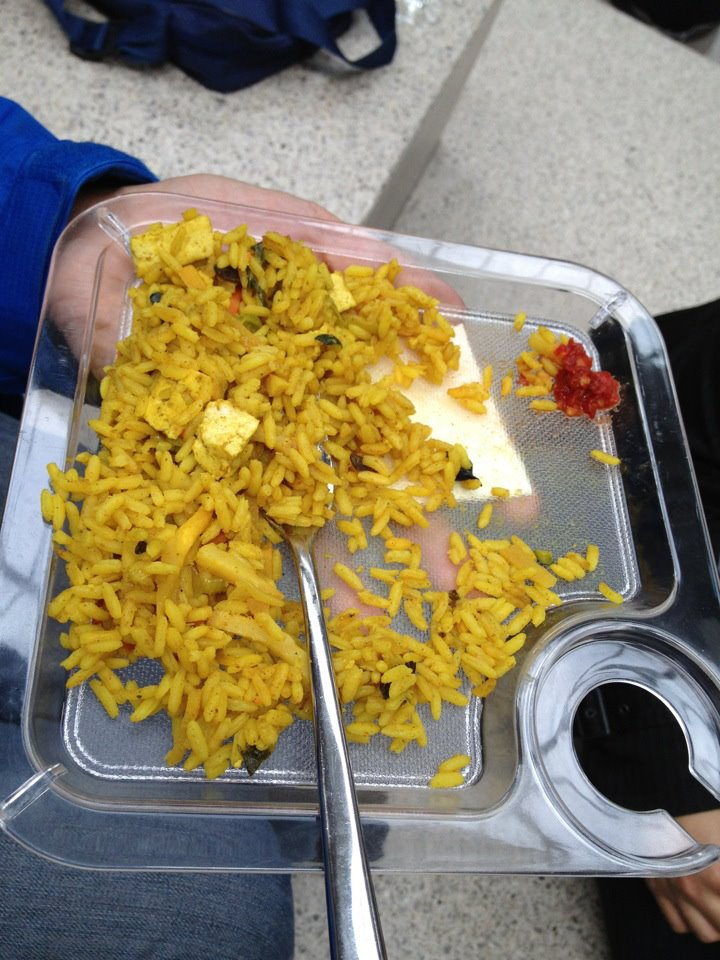
**이미지 캡션:** 한 성인 남성이 투명 플라스틱 식판에 담긴 노란색 밥과 두부 조각, 그리고 빨간색 소스를 들고 있다. 밥에는 채소 조각들이 섞여 있으며, 식판의 한쪽에는 음료 컵을 끼울 수 있는 홈이 있다. 식판 아래로는 청바지가 보이고, 식판 위로는 파란색 가방과 회색 테이블이 보인다. 밥은 이미 상당 부분 먹은 상태이며, 포크가 밥 위에 놓여 있다. 전체적으로 캐주얼한 식사 환경으로 보이며, 특별한 표정이나 행동은 보이지 않는다.

### 6월 3일 (일) 21:59 · is totally thrilled to be appointed as a…

is totally thrilled to be appointed as a program co-chair of MSR (Working Conference on Mining Software Repositories) 2013-2014, and a part of this wonderful team, since he has met so many inspiring researchers at MSR, and most of his research ideas are from MSR. 

We really look forward to your contributions to MSR 2013. Roughly, the submission deadline will be January/February 2013. Happy Mining! 

More information will be at http://msrconf.org soon.

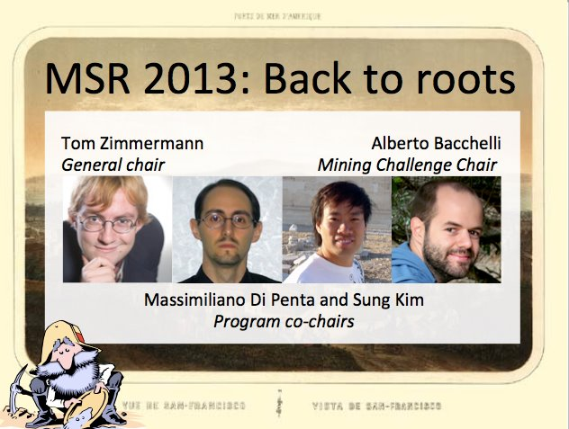
**이미지 캡션:** 이 사진은 "MSR 2013: Back to roots"라는 제목의 프레젠테이션 슬라이드이다. 슬라이드 상단에는 "PURTE DE MER ZAMERIQUE"라는 텍스트가 희미하게 보이며, 하단에는 "VISTA DE SAN-FRANCISCO"라는 텍스트와 함께 샌프란시스코의 풍경을 그린 듯한 삽화가 있다. 중앙에는 네 명의 남성 사진과 그들의 이름 및 직책이 적혀 있다. 왼쪽 상단에는 Tom Zimmermann이라는 이름과 "General chair"라는 직책이 있으며, 그의 사진에는 금발 머리에 안경을 쓴 30대 초반으로 보이는 성인 남성이 미소를 짓고 있다. 그 옆에는 Alberto Bacchelli라는 이름과 "Mining Challenge Chair"라는 직책이 있으며, 그의 사진에는 짧은 머리에 안경을 쓴 30대 후반으로 보이는 성인 남성이 정면을 응시하고 있다. 하단에는 Massimiliano Di Penta와 Sung Kim이라는 이름과 "Program co-chairs"라는 직책이 함께 적혀 있으며, 이들의 사진은 각각 왼쪽 하단과 오른쪽 하단에 배치되어 있다. Massimiliano Di Penta는 짧은 검은 머리에 안경을 쓴 20대 후반에서 30대 초반으로 보이는 성인 남성이며, Sung Kim은 짧은 검은 머리에 안경을 쓴 30대 초반으로 보이는 성인 남성이다. 전체적으로 학술 행사나 컨퍼런스의 발표 슬라이드로 보이며, 차분하고 전문적인 분위기이다.

### 6월 4일 (월) 15:07 · had a wonderful workshop (TOPI 2012) tha…

had a wonderful workshop (TOPI 2012) thanks to Diego Garbervetsky, all speakers, and attendees. Especially, Diego Garbervetsky is a super excellent  PC co-chair to work with.

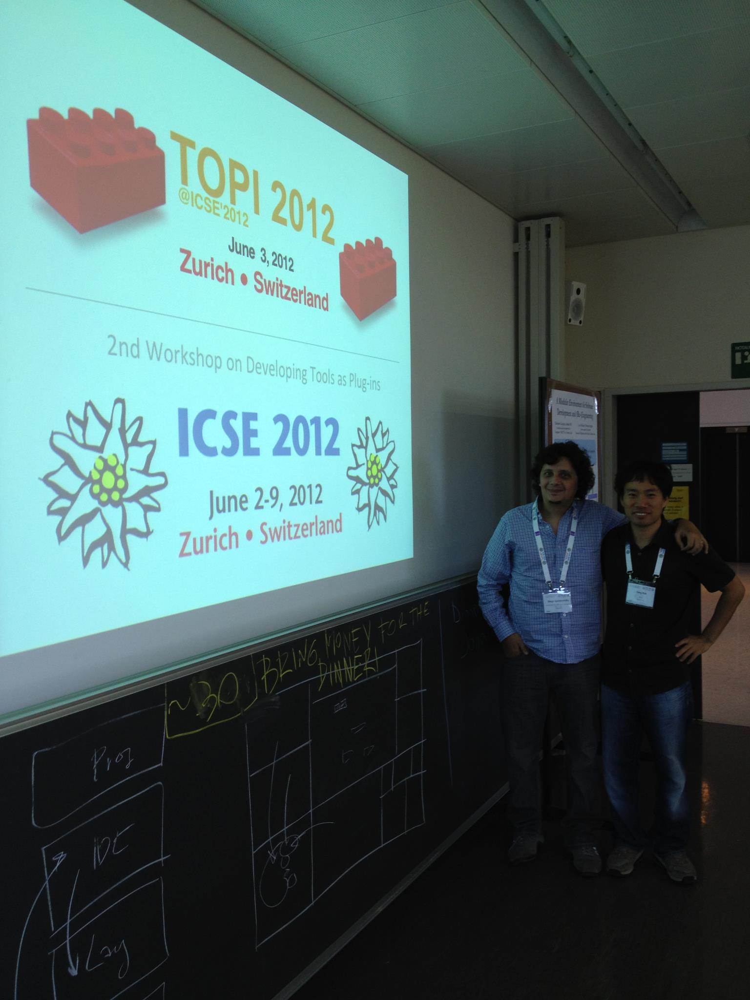
**이미지 캡션:** 두 명의 성인 남성이 칠판 앞에 서서 사진을 찍고 있으며, 왼쪽 남성은 파란색 체크무늬 셔츠와 회색 바지를 입고 있고, 오른쪽 남성은 검은색 셔츠와 청바지를 입고 있습니다. 두 사람 모두 목에 ID 카드를 걸고 있으며, 왼쪽 남성은 미소를 짓고 있고 오른쪽 남성은 카메라를 응시하고 있습니다. 배경에는 "TOPI 2012"와 "ICSE 2012"라는 글자가 적힌 큰 스크린이 있고, 스크린에는 레고 블록 이미지와 에델바이스 꽃 이미지가 있습니다. 칠판에는 "BRING MONEY FOR THE DINNER!"이라는 문구와 함께 여러 개의 상자와 선이 그려져 있으며, 왼쪽에는 "Prog", "IDE", "Lay"와 같은 단어가 쓰여 있습니다. 전체적으로 학술 행사나 워크숍의 일부로 보이는 분위기이며, 긍정적이고 캐주얼한 느낌을 줍니다.

### 6월 4일 (월) 16:46 · found it is very useful!

📍 Zürich, Switzerland

found it is very useful!

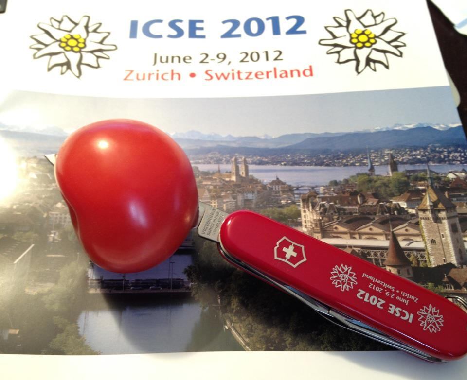
**이미지 캡션:** 이 사진은 2012년 6월 2일부터 9일까지 스위스 취리히에서 열린 ICSE 2012 컨퍼런스를 홍보하는 인쇄물 위에 놓인 빨간색 토마토와 빨간색 빅토리녹스 스위스 아미 나이프를 보여줍니다. 인쇄물에는 에델바이스 꽃 문양과 함께 "ICSE 2012"라는 글자가 파란색으로 쓰여 있고, 그 아래에는 "June 2-9, 2012 Zurich Switzerland"라는 날짜와 장소가 적혀 있습니다. 배경에는 취리히의 도시 풍경과 호수, 산이 그려져 있습니다. 토마토는 둥글고 매끄러운 표면을 가지고 있으며, 스위스 아미 나이프는 빨간색 손잡이에 하얀색 에델바이스 문양과 함께 "ICSE 2012 Zurich Switzerland June 2-9, 2012"라는 글자가 새겨져 있습니다. 사진은 밝고 선명하며, 컨퍼런스에 대한 정보를 전달하는 동시에 독특한 시각적 구성을 보여줍니다. 사진에는 사람이 등장하지 않습니다.

### 6월 5일 (화) 15:52 · likes free bike rentals

📍 Zürich, Switzerland

likes free bike rentals

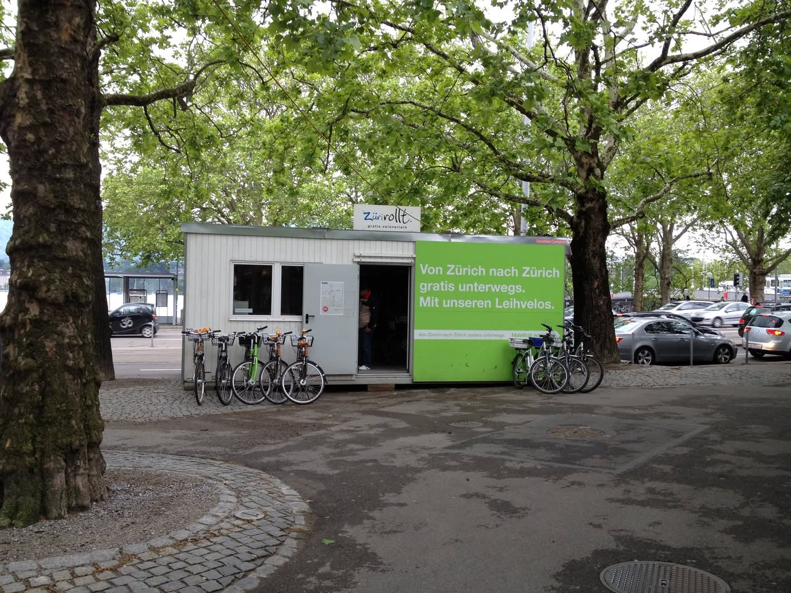
**이미지 캡션:** 이 사진은 녹색 컨테이너 건물 앞에 여러 대의 자전거가 주차되어 있는 야외 장면을 보여줍니다. 건물은 흰색이며, 녹색 부분에는 "Von Zürich nach Zürich gratis unterwegs. Mit unseren Leihvelos."라는 독일어 문구가 크게 쓰여 있습니다. 이는 "취리히에서 취리히까지 무료로 이동하세요. 저희 대여 자전거와 함께."라는 뜻으로, 자전거 대여 서비스임을 알 수 있습니다. 건물 안쪽으로 보이는 성인 남성은 문 앞에 서서 안쪽을 바라보고 있습니다. 건물 앞에는 총 7대의 자전거가 주차되어 있으며, 대부분 바구니가 달려 있습니다. 자전거들은 다양한 색상과 디자인을 가지고 있으며, 일부는 녹색 컨테이너 벽에 기대어 있습니다. 배경에는 울창한 녹색 나무들이 늘어서 있고, 그 너머로 도로와 여러 대의 차량, 그리고 건물들이 보입니다. 도로에는 검은색 승용차와 은색 세단 등이 주행 중이거나 주차되어 있습니다. 전반적으로 맑은 날씨에 도시의 자전거 대여소 주변 풍경을 담고 있으며, 평화롭고 활동적인 분위기를 자아냅니다.

### 6월 5일 (화) 18:15 · 📷 앨범: Bike in Zurich (12장)

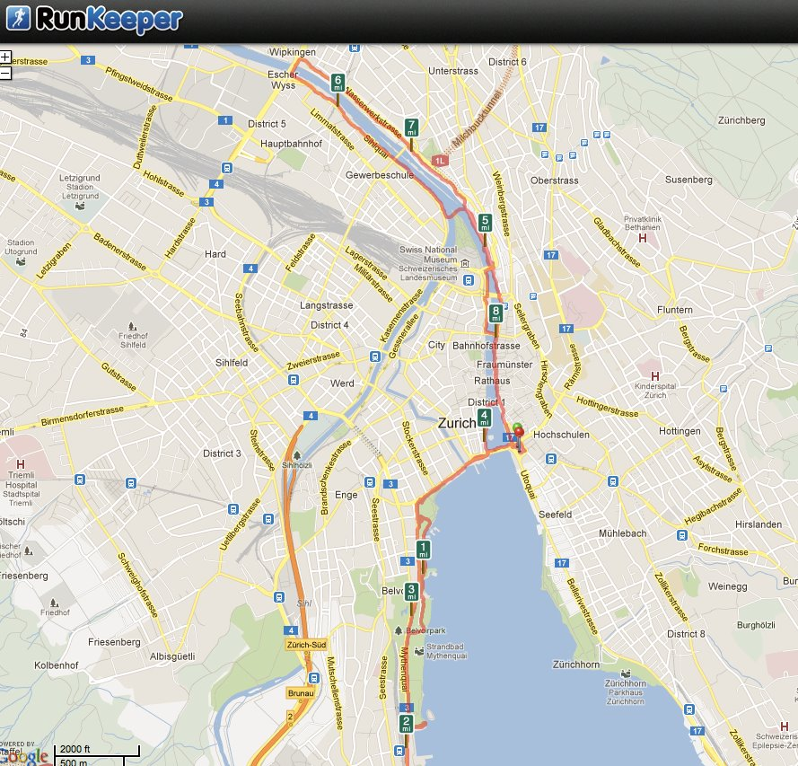
**이미지 캡션:** 이 이미지는 RunKeeper 앱을 사용하여 기록된 조깅 경로를 보여주는 지도입니다. 지도에는 스위스 취리히의 도로, 건물, 공원, 수역이 표시되어 있으며, 조깅 경로는 주황색 선으로 강조 표시되어 있습니다. 경로는 취리히 시내 중심부에서 시작하여 리마트 강을 따라 북쪽으로 이동한 후, 취리히 호수 주변을 돌아 다시 시내로 돌아오는 복잡한 경로를 따릅니다. 지도에는 "RunKeeper", "Wipkingen", "District 5", "Hauptbahnhof", "Gewerbeschule", "Swiss National Museum", "District 4", "City Bahnhofstrasse", "District 1", "Zurich", "Enge", "Zürich-Süd", "Belvoirpark", "Strandbad Mythenquai", "Seefeld", "Hochschulen", "Hottingen", "Zürichberg", "Fluntern", "District 6", "District 8", "Weinegg", "Burghölzli"와 같은 다양한 장소 이름과 "3 mi", "4 mi", "5 mi", "6 mi", "7 mi", "8 mi", "1 mi", "2 mi"와 같은 거리 표시가 포함되어 있습니다. 또한 지도에는 도로 번호(예: 1, 3, 4, 17)와 건물 아이콘(예: 병원, 박물관, 학교)도 표시되어 있습니다. 전반적으로 이 지도는 취리히에서 조깅을 하거나 길을 찾으려는 사람에게 유용한 정보를 제공합니다.
 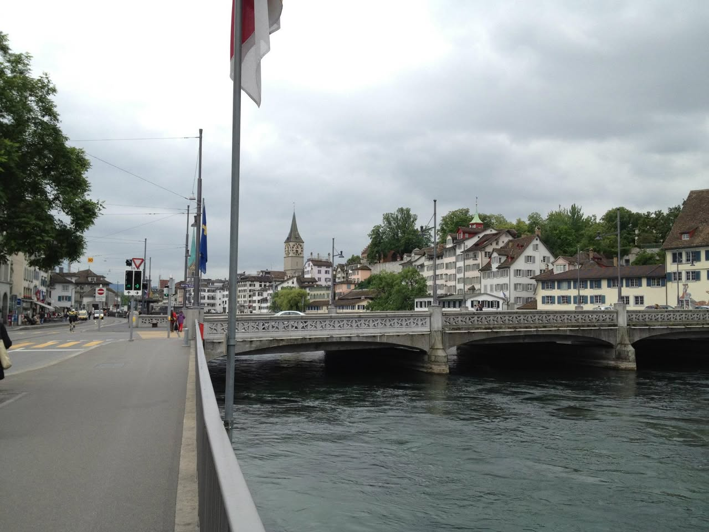
**이미지 캡션:** 흐린 날씨에 강변 도시 풍경이 펼쳐져 있으며, 사진 왼쪽에는 보행자 도로와 자전거 도로가 보이고, 그 너머에는 건물들이 늘어서 있습니다. 도로에는 신호등과 표지판이 보이며, 몇몇 사람들이 걸어가고 있습니다. 사진 중앙에는 강을 가로지르는 다리가 있고, 다리 위로는 자동차들이 지나다니고 있습니다. 다리 너머에는 여러 층의 건물들이 빽빽하게 들어서 있으며, 그중에는 첨탑이 있는 오래된 건물도 보입니다. 강물은 잔잔하게 흐르고 있으며, 하늘은 구름으로 뒤덮여 있습니다. 전반적으로 차분하고 도시적인 분위기를 풍기는 풍경입니다.
 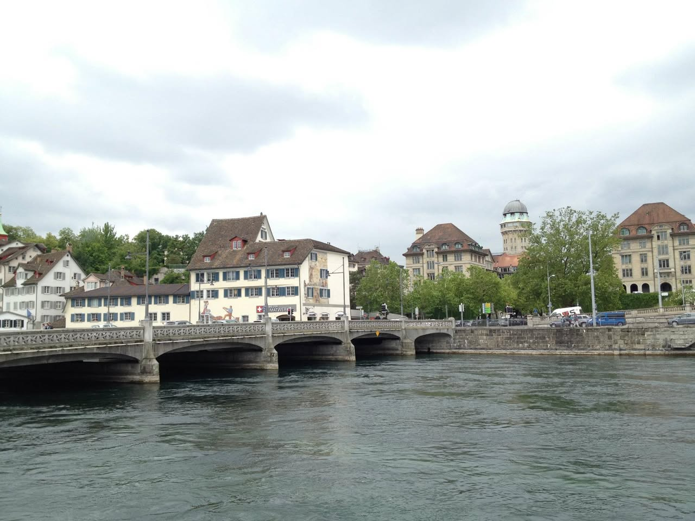
**이미지 캡션:** 흐린 날씨에 강 위로 보이는 다리와 그 뒤편의 건물들, 그리고 나무들이 있는 풍경이다. 다리 위에는 여러 대의 차량이 지나가고 있으며, 건물들은 유럽식 건축 양식을 보여준다. 강물은 잔잔하게 흐르고 있으며, 하늘은 구름으로 뒤덮여 있다. 건물 중 하나에는 스위스 국기가 걸려 있고, 다른 건물에는 "THE"라는 글자가 희미하게 보인다. 전반적으로 차분하고 평화로운 분위기이다.
 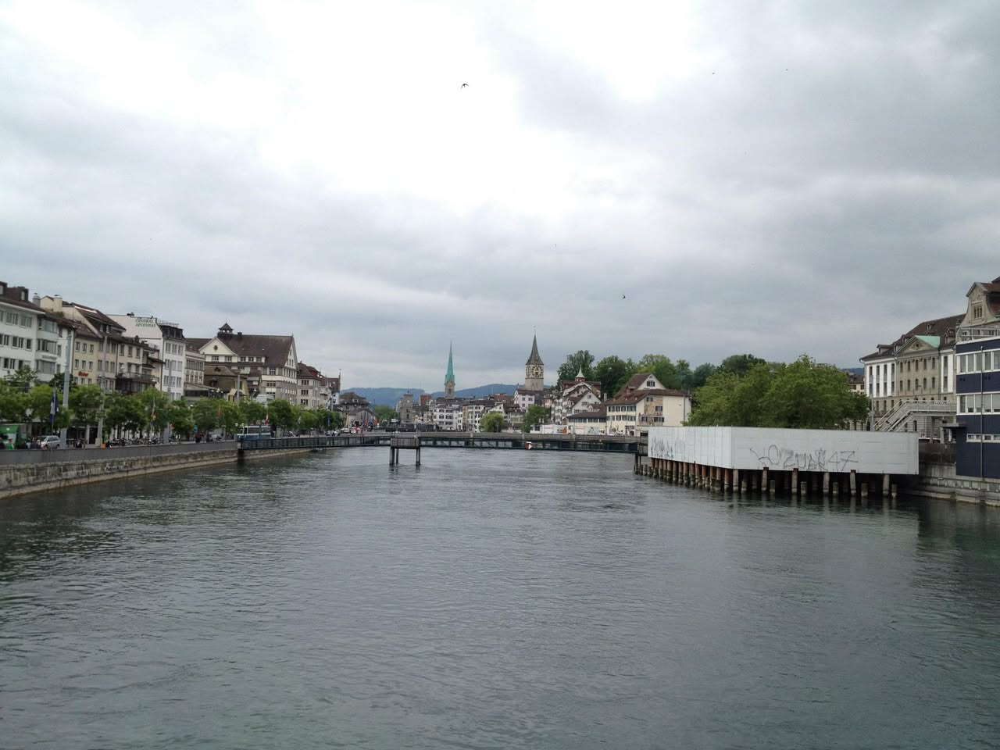
**이미지 캡션:** 흐린 날씨에 강을 가로질러 도시 풍경을 담은 사진으로, 강물은 잔잔하며 회색빛을 띠고 있습니다. 강변에는 여러 층의 건물들이 늘어서 있으며, 일부 건물에는 녹색 지붕과 흰색 외벽이 보입니다. 건물들 사이로 나무들이 보이고, 멀리 첨탑이 있는 교회 건물도 눈에 띕니다. 강 위에는 다리가 놓여 있으며, 오른쪽 강변에는 하얀색의 긴 구조물이 기둥 위에 세워져 있고, 그 위에 검은색 스프레이로 쓰인 듯한 글씨가 보입니다. 하늘은 구름으로 뒤덮여 있으며, 몇 마리의 새가 날아다니는 모습도 보입니다. 전반적으로 차분하고 도시적인 분위기를 자아냅니다.
 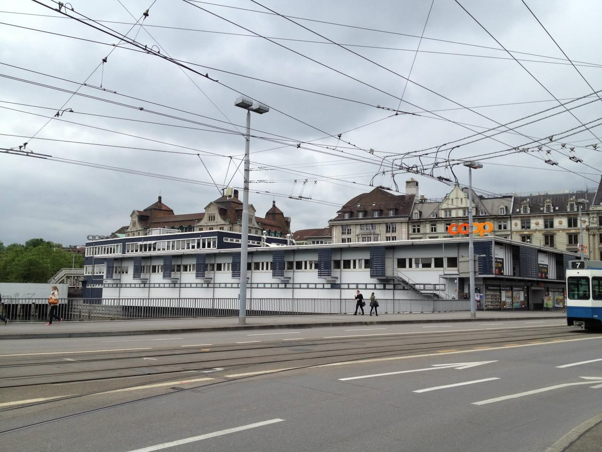
**이미지 캡션:** 흐린 날씨에 도시 풍경이 펼쳐져 있으며, 여러 개의 전차 선로가 복잡하게 얽혀 있고 그 위로 전봇대와 전선들이 하늘을 가득 채우고 있습니다. 사진 중앙에는 현대적인 디자인의 흰색과 파란색 건물이 있으며, 이 건물 위쪽으로는 붉은 지붕을 가진 오래된 유럽식 건물들이 보입니다. 흰색 건물에는 'coop'이라는 주황색 로고가 크게 박혀 있습니다. 건물 앞쪽 보도에는 두 명의 성인 여성이 걸어가고 있는데, 한 명은 주황색 상의와 검은색 하의를 입고 있으며, 다른 한 명은 검은색 옷을 입고 있습니다. 그 뒤로 또 다른 성인 남성과 여성이 걸어가고 있습니다. 건물 옆으로는 상점들이 보이며, 일부 진열된 상품들도 희미하게 보입니다. 도로에는 전차 선로가 있으며, 오른쪽에는 파란색과 흰색의 전차가 지나가고 있습니다. 전차에는 '7'이라는 숫자가 보입니다. 전체적으로 도시의 일상적인 풍경을 담고 있으며, 약간은 칙칙한 날씨로 인해 차분하고 조용한 분위기를 자아냅니다.
 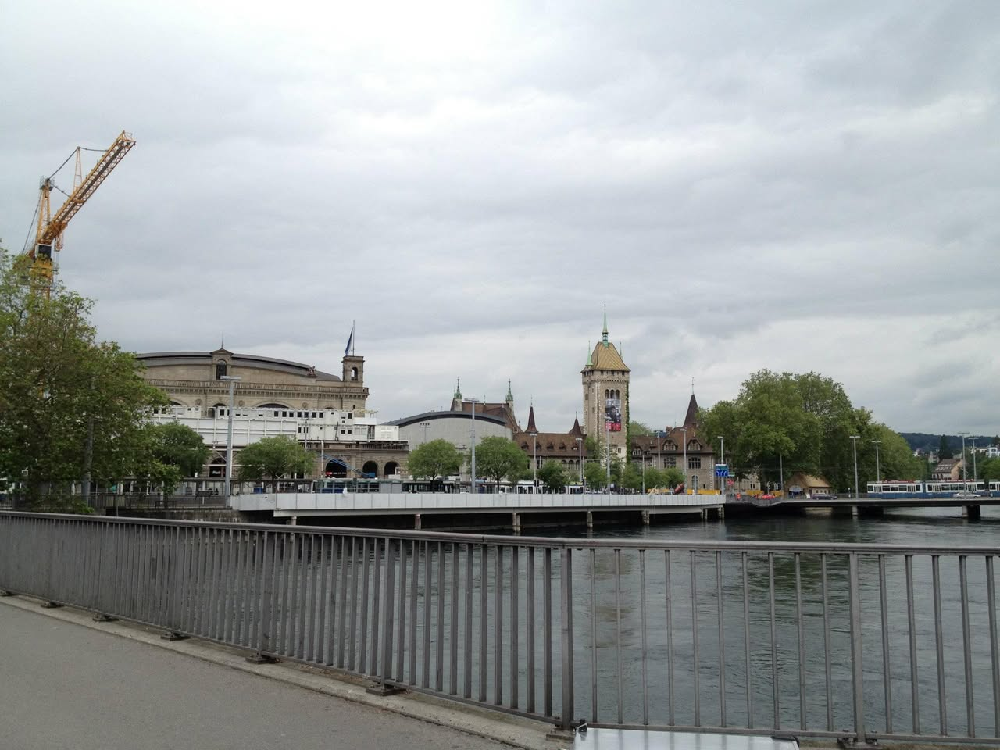
**이미지 캡션:** 흐린 날씨에 강변을 따라 펼쳐진 도시 풍경으로, 회색 금속 난간이 있는 보행로가 사진의 전경을 차지하고 있으며, 그 뒤로 강물이 잔잔하게 흐르고 있습니다. 강 건너편에는 여러 건물들이 늘어서 있는데, 가장 눈에 띄는 것은 웅장한 기차역 건물과 그 옆에 있는 독특한 첨탑이 있는 건물입니다. 기차역 건물은 둥근 지붕과 여러 개의 창문을 가지고 있으며, 그 앞에는 하얀색 구조물이 보입니다. 첨탑이 있는 건물은 갈색 지붕과 여러 개의 창문, 그리고 깃발이 달려 있습니다. 건물들 사이로는 푸른 나무들이 우거져 있고, 멀리에는 또 다른 건물들과 산이 보입니다. 사진 왼쪽에는 노란색 대형 타워크레인이 서 있으며, 하늘은 구름으로 뒤덮여 있습니다. 전반적으로 차분하고 도시적인 분위기를 자아내는 풍경입니다.
 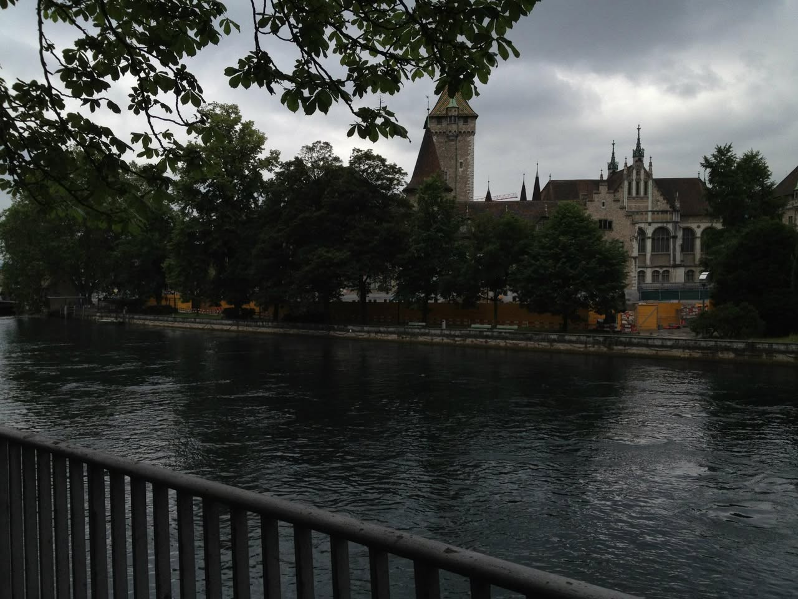
**이미지 캡션:** 흐린 날씨에 강변의 풍경을 담은 사진으로, 사진의 전경에는 금속 난간이 보이고 그 뒤로 어두운 색의 강물이 잔잔하게 흐르고 있습니다. 강 건너편에는 울창한 나무들이 늘어서 있고, 그 뒤로는 웅장한 석조 건물이 자리하고 있습니다. 건물은 여러 개의 첨탑과 창문이 특징이며, 한쪽에는 높은 탑이 솟아 있습니다. 건물 주변에는 공사 중인 듯한 노란색 가림막과 건설 장비들이 보입니다. 사진의 상단에는 나뭇가지와 잎사귀가 드리워져 있어 자연적인 프레임을 형성하고 있습니다. 전반적으로 차분하고 약간은 멜랑콜리한 분위기를 자아냅니다. 사진 속에는 사람이 보이지 않습니다.
 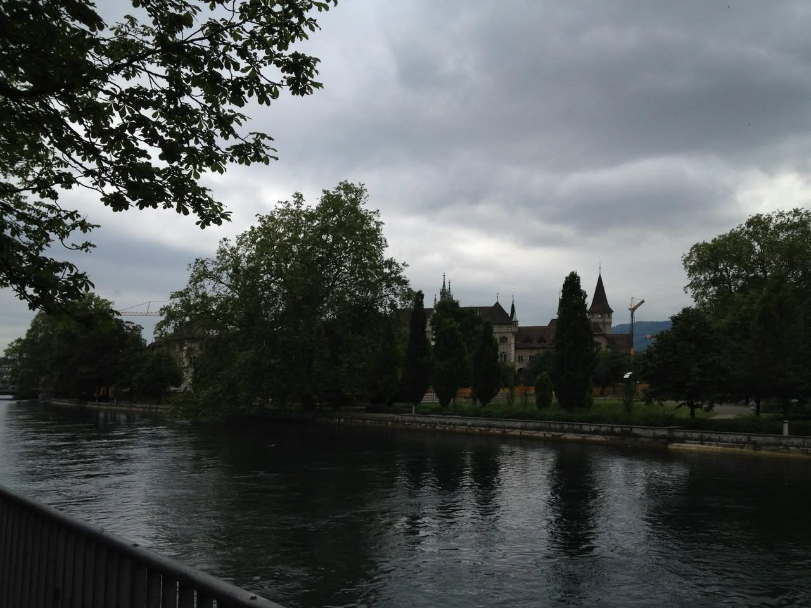
**이미지 캡션:** 흐린 날씨에 강변 풍경이 펼쳐져 있으며, 사진의 왼쪽에는 짙은 녹색 나뭇가지와 잎사귀가 프레임의 일부를 차지하고 있고, 오른쪽에는 웅장한 건축물과 울창한 나무들이 늘어서 있습니다. 강물은 어둡고 잔잔하며, 하늘의 흐린 구름을 반영하고 있습니다. 건축물은 여러 개의 첨탑과 지붕을 가진 고풍스러운 모습이며, 그 뒤로는 건설 중인 듯한 크레인이 보입니다. 주변에는 다양한 크기의 나무들이 조화롭게 배치되어 있으며, 강변을 따라 산책로가 있는 것으로 보입니다. 사진에는 사람이 보이지 않으며, 텍스트도 없습니다. 전반적으로 차분하고 약간은 쓸쓸한 분위기를 자아냅니다.
 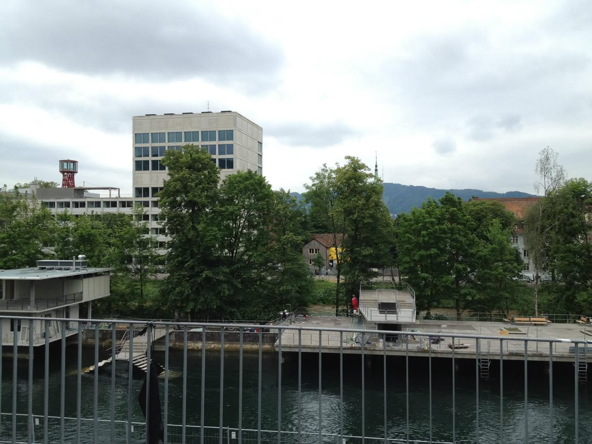
**이미지 캡션:** 흐린 날씨에 강가에 위치한 도시 풍경을 담은 사진으로, 여러 건물과 녹음이 우거진 나무들이 보인다. 사진 왼쪽에는 현대적인 디자인의 흰색 건물이 있으며, 그 뒤로는 붉은색 철탑이 있는 또 다른 건물이 보인다. 중앙에는 키가 큰 나무들이 빽빽하게 서 있고, 그 너머로 주황색 지붕을 가진 건물과 흰색 건물이 보인다. 멀리 산이 보이고 하늘은 구름으로 뒤덮여 있다. 사진 하단에는 강이 흐르고 있으며, 강 위로는 금속 난간이 설치된 산책로가 보인다. 산책로 위에는 흰색 구조물과 벤치가 놓여 있고, 한 명의 성인 남성이 빨간색 상의를 입고 서 있다. 전반적으로 차분하고 도시적인 분위기를 풍긴다.
 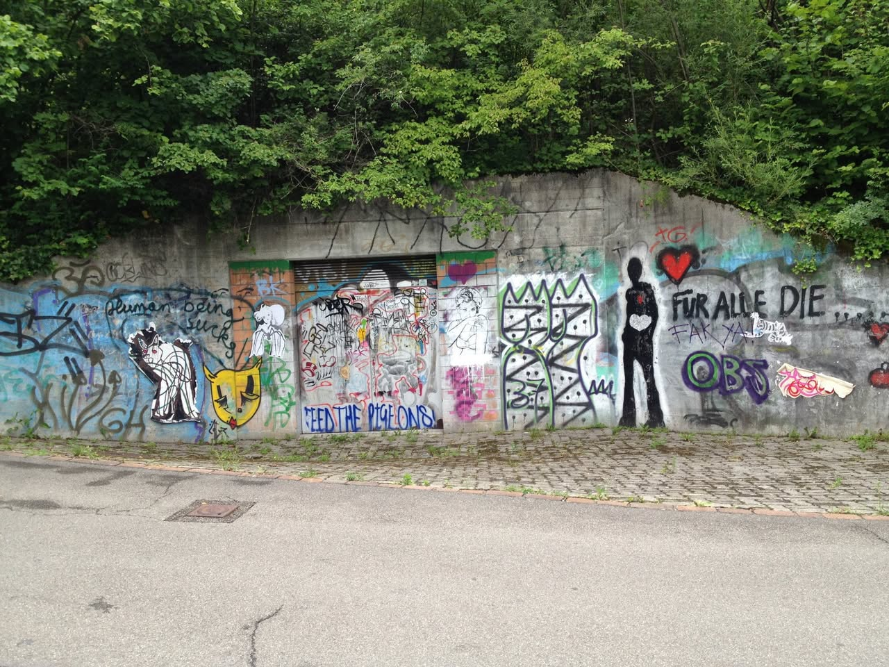
**이미지 캡션:** 이 사진은 울창한 녹색 나무가 배경으로 펼쳐진 콘크리트 벽에 그려진 다채로운 그래피티를 보여줍니다. 벽에는 다양한 스타일의 그림과 글자가 가득하며, 일부는 낡고 벗겨져 있습니다. 왼쪽에는 "human being sucks"라는 문구와 함께 검은색과 흰색으로 그려진 인물 그림이 있고, 그 옆에는 노란색 얼굴의 그림이 있습니다. 중앙에는 녹색과 흰색으로 된 기하학적인 패턴과 함께 "FEED THE PIGEONS"라는 문구가 파란색으로 쓰여 있습니다. 오른쪽에는 검은색 실루엣으로 그려진 인물과 빨간색 하트 그림이 있고, 그 위에는 독일어로 "FÜR ALLE DIE" (모든 사람들을 위해)라는 문구가 검은색으로 쓰여 있으며, 그 아래에는 "FAK YA"라는 문구와 보라색으로 "OB"라고 쓰여 있습니다. 전반적으로 도시의 거친 느낌과 예술적인 표현이 혼합된 분위기를 자아냅니다.
 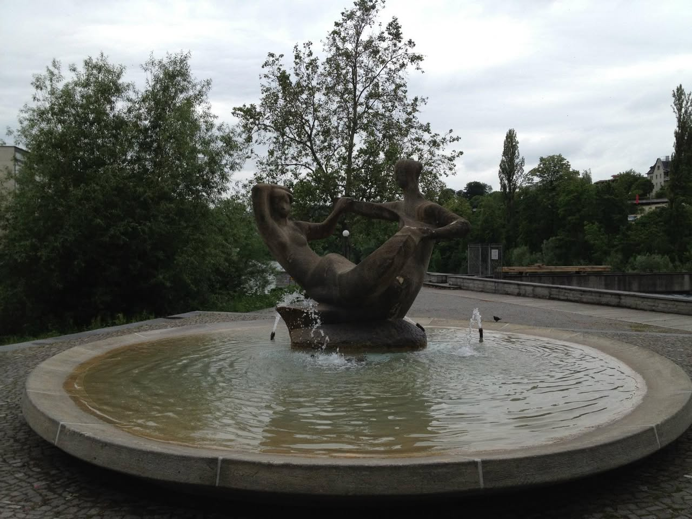
**이미지 캡션:** 이 사진은 둥근 모양의 분수대를 중심으로 한 야외 풍경을 담고 있습니다. 분수대 중앙에는 두 명의 인물이 서로 마주보며 팔을 뻗어 잡고 있는 조각상이 있습니다. 이 조각상은 성인 남성과 성인 여성으로 보이며, 물 위에서 유영하거나 춤추는 듯한 역동적인 자세를 취하고 있습니다. 조각상 주변으로는 물줄기가 뿜어져 나와 시원한 느낌을 더하고 있으며, 분수대 안의 물은 맑고 잔잔합니다. 분수대 주변은 돌로 포장되어 있으며, 그 뒤로는 울창한 나무들과 건물들이 보입니다. 하늘은 구름이 낀 흐린 날씨로, 전체적으로 차분하고 평화로운 분위기를 자아냅니다.
 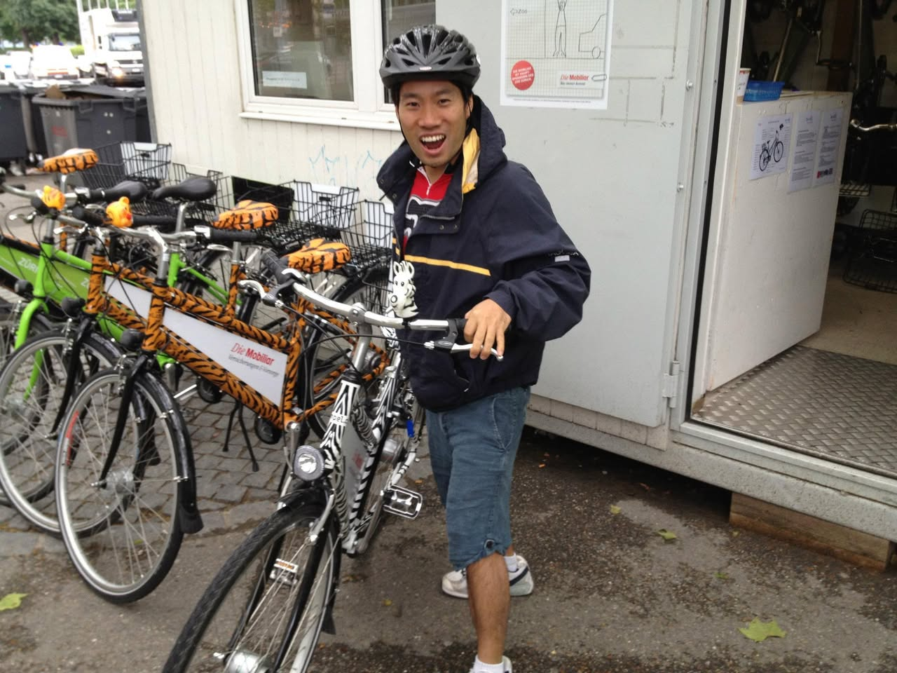
**이미지 캡션:** 한 명의 성인 남성이 자전거 대여소 앞에 서서 카메라를 향해 환하게 웃고 있다. 남성은 검은색 헬멧을 쓰고 있으며, 네이비색 재킷에 노란색 줄무늬가 있고, 청바지 반바지와 흰색 운동화를 신고 있다. 그는 자전거 핸들을 잡고 있으며, 그의 뒤로는 여러 대의 자전거가 주차되어 있다. 자전거들은 주황색 호랑이 무늬와 검은색 얼룩무늬로 디자인되어 있으며, 일부 자전거에는 귀여운 동물 모양 장식이 달려 있다. 배경에는 흰색 건물과 문이 보이며, 건물 벽에는 자전거 관련 포스터가 붙어 있다. 전반적으로 밝고 활기찬 분위기이며, 남성은 즐겁고 활동적인 모습이다.

### 6월 5일 (화) 18:57 · 📷 앨범: Cover photos (1장)

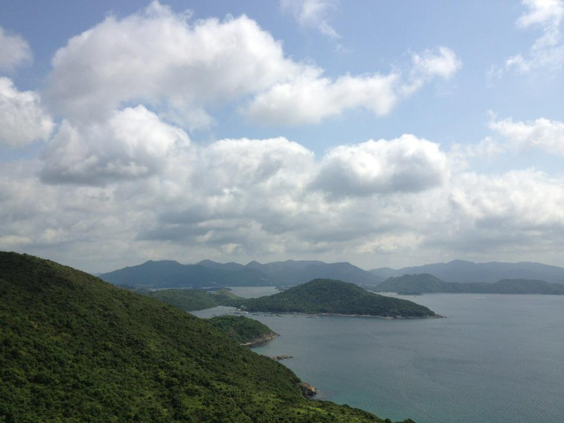
**이미지 캡션:** 푸른 하늘에 흰 구름이 흩뿌려져 있고, 그 아래로 울창한 녹색 산과 잔잔한 바다가 펼쳐져 있습니다. 산비탈은 빽빽한 나무들로 뒤덮여 있으며, 바다에는 여러 개의 섬들이 점점이 떠 있습니다. 일부 섬들에는 작은 마을이나 부두가 있는 것으로 보이며, 몇 척의 배들도 보입니다. 전반적으로 평화롭고 아름다운 자연 풍경을 담고 있으며, 맑은 날씨 속에서 시원한 바닷바람을 느낄 수 있을 것 같은 분위기입니다.

### 6월 7일 (목) 17:10 · is very happy that Tom got an award @ICS…

is very happy that Tom got an award @ICSE 2012!!

**이미지 캡션:** 이 사진에는 두 명의 남성이 전면에 서 있고, 그 뒤로는 여러 사람이 모여 있는 컨퍼런스 또는 행사장의 모습이 담겨 있습니다. 왼쪽에 있는 성인 남성은 30대 후반에서 40대 초반으로 보이며, 안경을 쓰고 주황색 폴로 셔츠를 입고 있습니다. 그는 밝게 웃으며 카메라를 응시하고 있으며, 목에는 흰색 목걸이와 함께 "Software"라고 적힌 상장 또는 인증서를 들고 있습니다. 오른쪽에 있는 성인 남성은 20대 후반에서 30대 초반으로 보이며, 검은색 카디건 안에 회색 셔츠를 입고 있습니다. 그는 입을 벌리고 놀란 듯한 표정으로 카메라를 향해 손가락질하고 있으며, 목에는 역시 흰색 목걸이가 걸려 있습니다. 배경에는 흰색 테이블보가 덮인 여러 개의 테이블이 보이고, 뒤쪽으로는 계단과 창문, 그리고 다른 참석자들이 서 있는 모습이 희미하게 보입니다. 전반적으로 활기차고 즐거운 분위기이며, 행사의 성공적인 마무리를 축하하는 듯한 느낌을 줍니다.

### 6월 7일 (목) 17:54 · Sung Kim shared a link.

🔗 <http://360.io/s5SyND>

### 6월 8일 (금) 12:54 · is an alps-elf today!

is an alps-elf today!

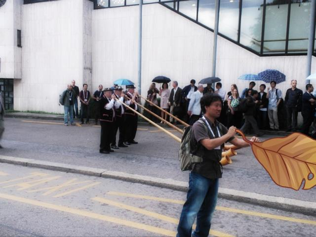
**이미지 캡션:** 앞쪽에는 회색 셔츠와 청바지를 입은 성인 남성이 배낭을 메고 노란색 나뭇잎 모양의 깃발을 들고 서 있으며, 그의 뒤로는 여러 명의 사람들이 우산을 쓰고 줄지어 서 있고, 그중 몇몇은 전통 복장을 한 채 긴 목관 악기를 연주하고 있습니다. 배경에는 현대적인 건물과 도로가 보이며, 도로에는 노란색 택시 표시가 그려져 있습니다. 전반적으로 행사의 일부인 듯한 축제 분위기가 느껴집니다.

### 6월 8일 (금) 13:13 · got an ICSE 2013 t-shirt. Of course, he …

got an ICSE 2013 t-shirt. Of course, he is working on his ICSE 2013 submissions to go to San Francisco. The deadline is August 17, 2012!

**이미지 캡션:** 사진은 실내에서 촬영된 셀카로, 젊은 성인 남성이 정면을 응시하고 있다. 그는 짧고 검은 머리카락을 가지고 있으며, 옅은 갈색 피부와 짙은 눈썹을 가지고 있다. 표정은 무표정하며, 입은 살짝 다물고 있다. 그는 보라색 맨투맨 티셔츠를 입고 있으며, 티셔츠에는 흰색과 보라색의 독특한 무늬가 그려져 있다. 목에는 두 개의 흰색 끈이 걸려 있는데, 하나는 ICSE 2012 로고가 있고 다른 하나는 ICSE 2013 San Francisco 로고와 평화 상징이 그려져 있다. 남성은 셔츠 위에 청바지색 셔츠 칼라를 입고 있다. 배경에는 창문과 커튼이 보이며, 오른쪽에는 노란색과 검은색 가방이 놓여 있다. 전체적으로 편안하고 비공식적인 분위기이며, 컨퍼런스나 행사 참석 중 찍은 사진으로 보인다.

### 6월 11일 (월) 22:39 · 📷 앨범: Gelato, Gelato, Gelato in Italy! (5장)

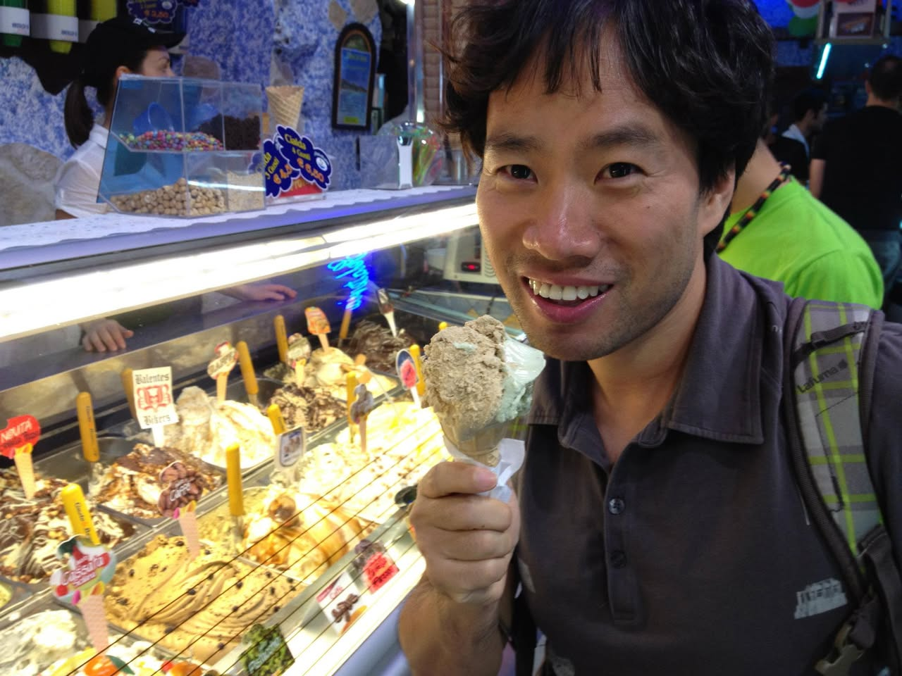
**이미지 캡션:** 한 성인 남성이 아이스크림 가게에서 아이스크림 콘을 들고 카메라를 향해 환하게 웃고 있다. 남성은 짧은 검은 머리에 옅은 갈색 피부를 가지고 있으며, 30대 후반에서 40대 초반으로 보인다. 그는 짙은 회색 폴로 셔츠를 입고 있으며, 어깨에는 체크무늬 백팩을 메고 있다. 그의 뒤로는 다양한 맛의 젤라또가 진열된 아이스크림 쇼케이스가 보인다. 쇼케이스 안에는 여러 가지 색깔과 토핑의 아이스크림이 담겨 있으며, 각 아이스크림 위에는 맛을 나타내는 팻말이 꽂혀 있다. 가게의 배경은 파란색과 흰색 타일로 장식되어 있으며, 형형색색의 사탕과 초콜릿이 담긴 투명한 용기도 보인다. 전반적으로 활기차고 즐거운 분위기이다.
 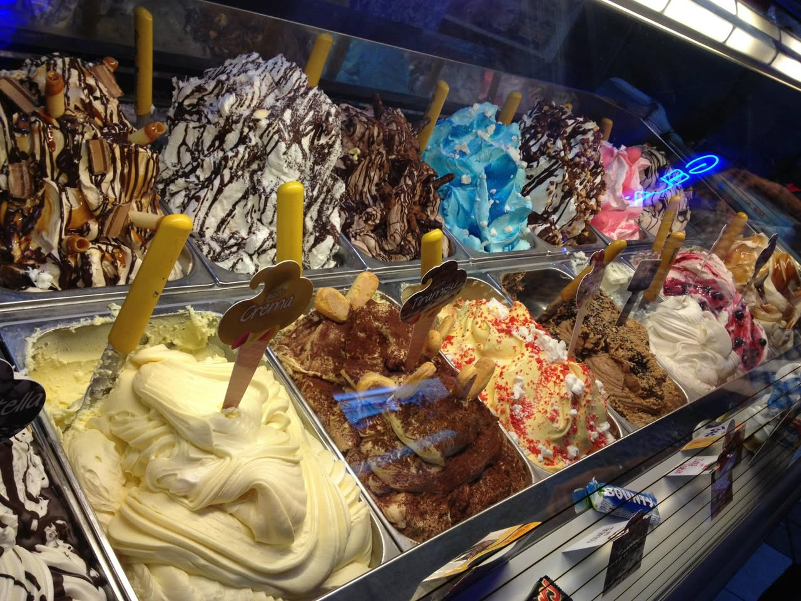
**이미지 캡션:** 다양한 종류의 젤라또 아이스크림이 진열된 쇼케이스를 보여주는 사진입니다. 아이스크림은 여러 개의 금속 용기에 담겨 있으며, 각 용기에는 젤라또의 맛을 나타내는 듯한 다양한 색상과 토핑이 특징입니다. 가장 왼쪽에는 초콜릿 시럽과 막대 과자가 얹어진 아이스크림이 보이고, 그 옆에는 하얀색 크림 위에 초콜릿 시럽이 뿌려진 아이스크림이 있습니다. 중앙에는 밝은 파란색 아이스크림이 눈에 띄며, 그 옆에는 분홍색과 흰색이 섞인 아이스크림이 있습니다. 아래쪽에는 노란색 아이스크림 위에 빨간색 토핑이 뿌려진 것과, 초콜릿 맛 아이스크림, 그리고 하얀색 크림 위에 베리류가 얹어진 아이스크림 등이 보입니다. 각 아이스크림 용기에는 노란색 또는 나무 재질의 아이스크림 스쿱이 꽂혀 있으며, 일부에는 맛을 나타내는 듯한 작은 팻말이 달려 있습니다. "Crema"라고 쓰인 팻말이 눈에 띕니다. 쇼케이스의 유리 표면에는 조명과 주변 환경이 반사되어 보이며, 일부에는 네온 불빛으로 보이는 푸른색 글자가 희미하게 보입니다. 전반적으로 다양한 맛과 화려한 색상의 아이스크림이 가득한 디저트 가게의 풍경을 담고 있습니다.
 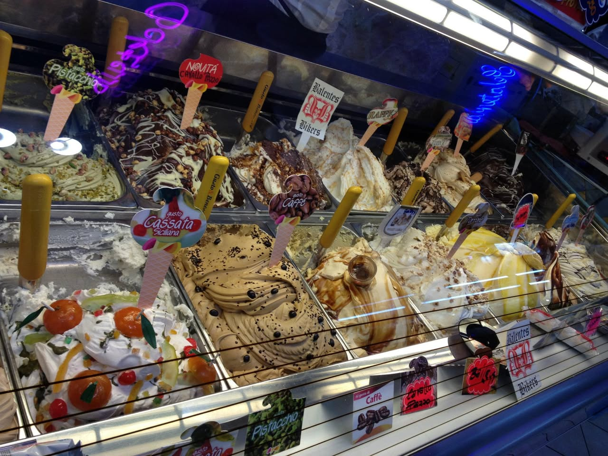
**이미지 캡션:** 아이스크림 가게의 쇼케이스로, 다양한 맛의 젤라토가 진열되어 있으며, 각 맛을 알리는 팻말들이 꽂혀 있다. 젤라토는 주로 크림색, 갈색, 녹색 등이며, 일부는 초콜릿 조각, 견과류, 과일 조각 등으로 장식되어 있다. 쇼케이스 위쪽에는 "Gelato"라고 쓰인 네온사인이 푸른색으로 빛나고 있으며, 조명은 밝고 화려하다. 젤라토 위에는 노란색 손잡이가 달린 아이스크림 스쿱들이 꽂혀 있어 고객들이 직접 떠갈 수 있도록 준비된 것으로 보인다. 일부 팻말에는 이탈리아어로 맛 이름이 적혀 있으며, "Pistacchio", "Cassata Siciliana", "Caffè" 등이 보인다. 전체적으로 달콤하고 시원한 아이스크림의 이미지를 강조하며, 활기차고 즐거운 분위기를 자아낸다.
 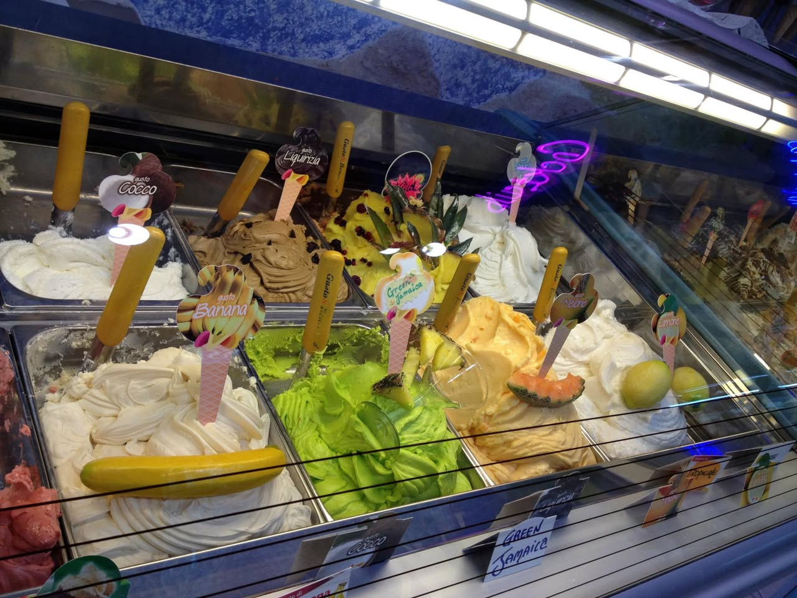
**이미지 캡션:** 이 사진은 다양한 맛의 젤라또가 진열된 아이스크림 가게의 쇼케이스를 보여줍니다. 쇼케이스 안에는 여러 칸에 걸쳐 다양한 색깔과 질감의 젤라또가 가득 담겨 있으며, 각 칸에는 젤라또 맛을 나타내는 팻말이 꽂혀 있습니다. 팻말에는 "Cocco"(코코넛), "Liquirizia"(감초), "Banana"(바나나), "Melone"(멜론), "Limone"(레몬), "Green Jamaica"(그린 자메이카) 등의 이탈리아어 맛 이름이 적혀 있습니다. 젤라또는 흰색, 연한 노란색, 갈색, 밝은 녹색 등 다채로운 색을 띠고 있으며, 일부 칸에는 과일 조각이나 장식이 곁들여져 있습니다. 젤라또를 뜨기 위한 노란색 손잡이의 아이스크림 스쿱들이 여러 개 보입니다. 쇼케이스 위쪽에는 조명이 켜져 있어 젤라또를 밝게 비추고 있으며, 배경에는 푸른색과 흰색의 타일 장식이 보입니다. 쇼케이스 앞쪽에는 "GREEN Jamaica"라고 쓰인 팻말이 보입니다. 전체적으로 시원하고 달콤한 젤라또의 매력을 잘 보여주는 밝고 활기찬 분위기입니다.
 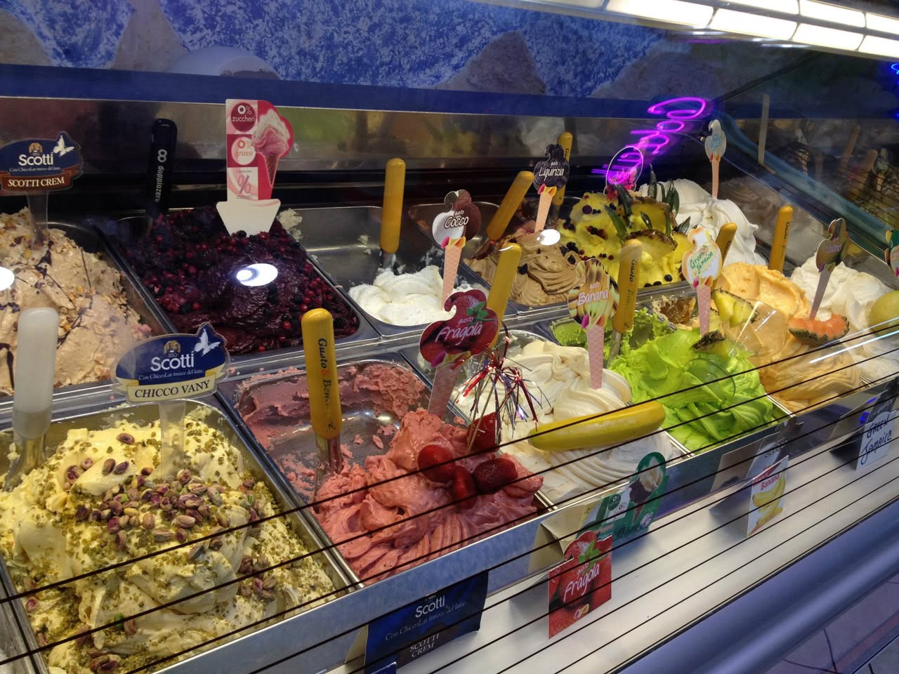
**이미지 캡션:** 이 사진은 다양한 맛의 젤라또가 진열된 아이스크림 가게의 쇼케이스를 보여줍니다. 쇼케이스 안에는 여러 개의 금속 용기에 다양한 색깔과 질감의 젤라또가 담겨 있으며, 각 용기에는 젤라또 맛을 나타내는 작은 팻말이 꽂혀 있습니다. 젤라또는 크림색, 연한 노란색, 진한 베리색, 분홍색, 밝은 녹색, 주황색 등 다채로운 색상을 띠고 있습니다. 일부 젤라또 위에는 피스타치오 조각이나 딸기 조각 같은 토핑이 뿌려져 있습니다. 젤라또를 뜨는 스쿱들이 용기 안에 꽂혀 있으며, 일부 스쿱 손잡이에는 귀여운 캐릭터나 그림이 그려져 있습니다. 쇼케이스 위쪽에는 파란색과 흰색의 추상적인 패턴이 있는 배경이 보이며, 형광 분홍색 네온 불빛이 희미하게 빛나고 있습니다. 젤라또 용기 앞쪽에는 얇은 가로 줄무늬가 있어 진열대를 구분하는 역할을 합니다. 전반적으로 달콤하고 시원한 디저트가 가득한 즐거운 분위기를 자아냅니다.

### 6월 15일 (금) 22:18 · is happy, since his wife Yeon Gyoung Gwa…

is happy, since his wife Yeon Gyoung Gwack is coming to Europe tomorrow. (Sung is already in Europe.) Have a nice trip Honey!

### 6월 17일 (일) 01:42 · 📷 앨범: Profile pictures (1장)

**이미지 캡션:** 이 사진은 성인 남성이 카메라를 향해 셀카를 찍고 있는 모습을 담고 있습니다. 남성은 30대 초중반으로 보이며, 짧고 짙은 색의 머리카락을 가지고 있습니다. 얼굴은 갸름한 편이며, 눈은 검고 동그랗습니다. 입술은 얇고 닫혀 있으며, 표정은 무표정에 가깝습니다. 남성은 보라색 상의 위에 회색 셔츠를 입고 있으며, 목에는 흰색과 보라색이 섞인 목걸이 형태의 출입증을 걸고 있습니다. 배경에는 흐릿하게 커튼과 라디에이터가 보이며, 이는 실내 공간임을 암시합니다. 사진의 전체적인 분위기는 일상적이거나 행사 참여 중인 듯한 느낌을 줍니다.

### 6월 18일 (월) 06:23 · Sung Kim shared a link.

🔗 <http://www.distat.unimol.it/wcre2012/>

### 6월 19일 (화) 01:40 · got 400 FB friends now thanks to you!

got 400 FB friends now thanks to you!

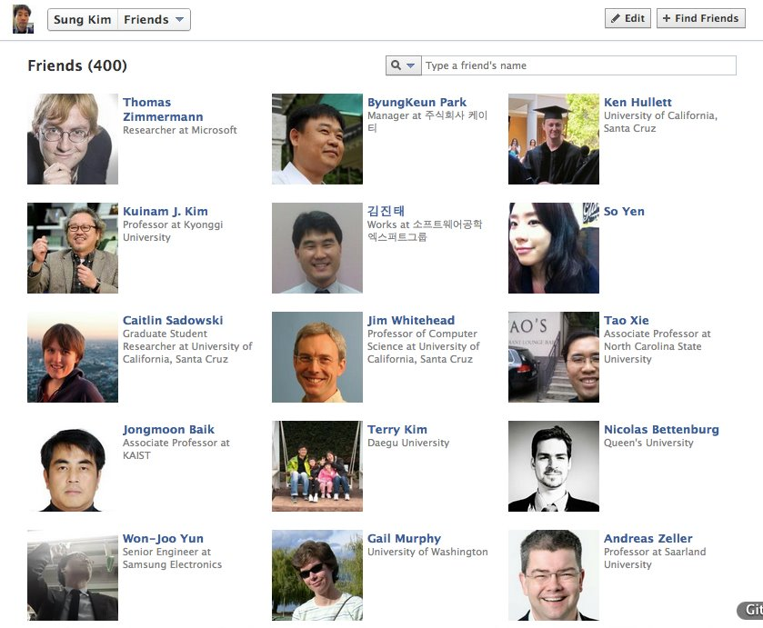
**이미지 캡션:** 이 사진은 페이스북 친구 목록 페이지로, 상단에는 "Sung Kim"이라는 이름과 "Friends" 메뉴가 보이고, "Edit" 및 "Find Friends" 버튼도 있다. 페이지 중앙에는 "Friends (400)"이라는 제목과 함께 친구들의 프로필 사진, 이름, 소속 및 직책 정보가 격자 형태로 나열되어 있다. 왼쪽 상단부터 Thomas Zimmermann (Microsoft 연구원), Kuinam J. Kim (Kyonggi 대학교수), Caitlin Sadowski (UC Santa Cruz 대학원생 연구원), Jongmoon Baik (KAIST 부교수), Won-Joo Yun (삼성전자 선임 엔지니어)의 프로필이 보인다. 그 옆 열에는 ByungKeun Park (주식회사 케이티 매니저), 김진태 (소프트웨어공학 엑스퍼트그룹 근무), Jim Whitehead (UC Santa Cruz 컴퓨터 과학 교수), Terry Kim (대구대학교)의 프로필이 있다. 오른쪽 열에는 Ken Hullett (UC Santa Cruz), So Yen, Tao Xie (North Carolina State 대학교 부교수), Nicolas Bettenburg (Queen's 대학교), Gail Murphy (University of Washington), Andreas Zeller (Saarland 대학교수)의 프로필이 보인다. 각 프로필 사진은 해당 인물의 얼굴이나 일상적인 모습을 담고 있으며, 일부는 웃고 있거나 진지한 표정을 짓고 있다. 배경은 대부분 흰색 또는 회색으로, 친구 목록 자체에 집중할 수 있도록 단순하게 처리되어 있다. 전반적으로 학계 및 IT 업계 종사자들의 프로필이 많이 보이는 것으로 보이며, 다양한 국적과 연령대의 사람들이 포함되어 있다.

### 6월 20일 (수) 06:08 · 📷 앨범: Sung's (informal) birthday dinner in Italy (10장)

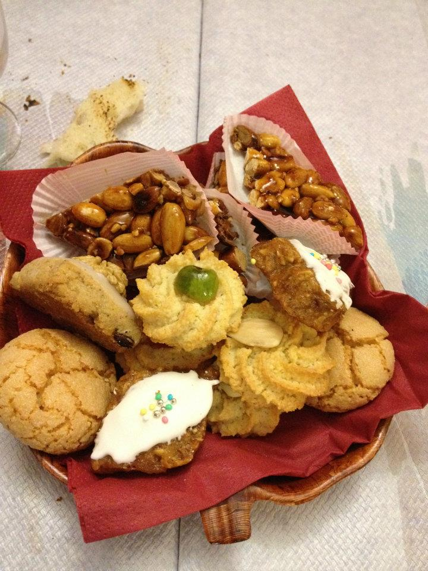
**이미지 캡션:** 이 사진은 다양한 종류의 쿠키와 견과류 바가 담긴 갈색 나무 바구니를 클로즈업한 모습으로, 붉은색 냅킨 위에 놓여 있습니다. 쿠키는 둥근 모양, 꽃 모양, 길쭉한 모양 등 다양하며, 일부는 흰색 아이싱과 색색의 스프링클로 장식되어 있습니다. 견과류 바는 호두, 아몬드, 땅콩 등 다양한 견과류와 꿀 또는 캐러멜로 만들어진 것으로 보입니다. 배경에는 흰색 테이블보가 깔려 있으며, 왼쪽에는 와인잔의 일부가 보입니다. 전체적으로 달콤하고 풍성한 디저트 테이블의 분위기를 연출합니다.
 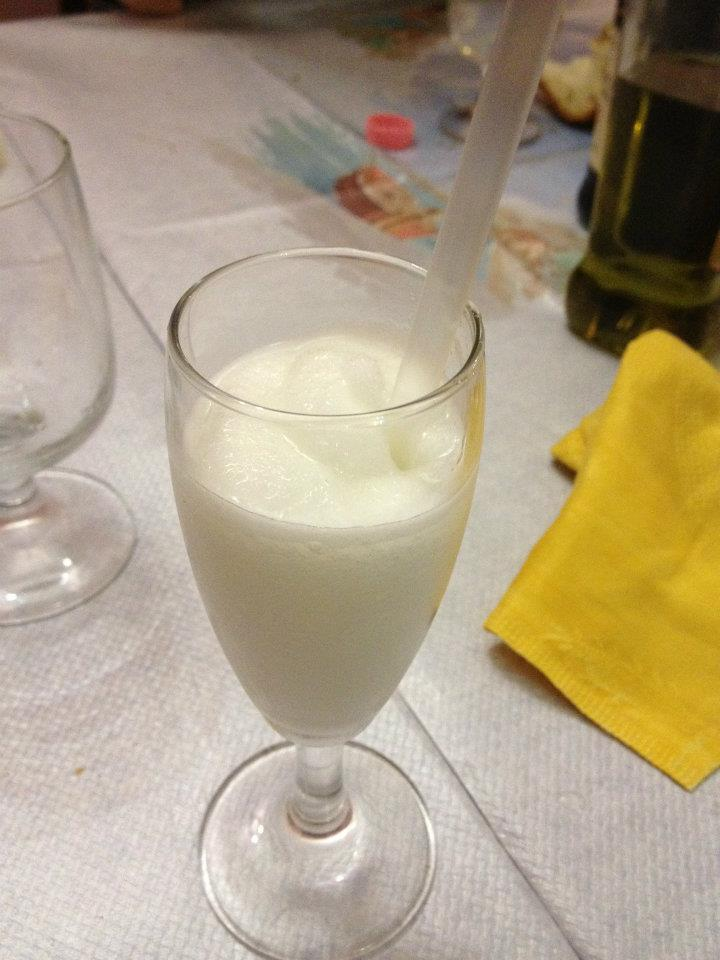
**이미지 캡션:** 이 사진은 테이블 위에 놓인 하얀색 음료가 담긴 샴페인 잔을 클로즈업한 모습입니다. 잔 안에는 거품이 풍성한 음료가 거의 가득 차 있으며, 흰색 빨대가 음료 속에 꽂혀 있습니다. 잔 옆에는 노란색 천이 접혀 놓여 있고, 그 뒤로는 녹색 병이 보입니다. 배경에는 또 다른 빈 샴페인 잔과 테이블보가 보이며, 테이블보 위에는 그림이 그려진 종이 매트가 깔려 있습니다. 전체적으로 밝고 부드러운 조명 아래에서 촬영되었으며, 편안하고 여유로운 식사 분위기를 연출합니다. 사람의 모습은 보이지 않으며, 음식이나 음료에 초점이 맞춰져 있습니다.
 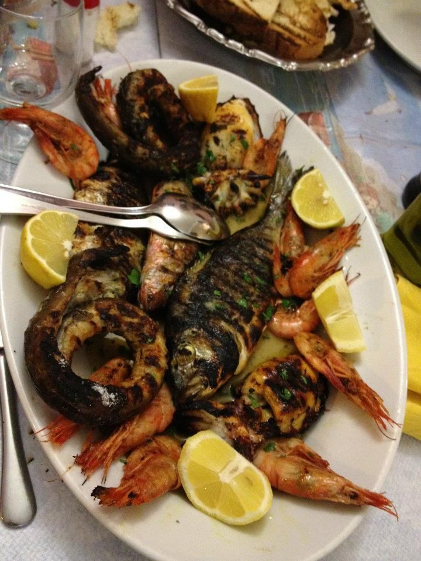
**이미지 캡션:** 이 사진은 흰색 타원형 접시에 담긴 푸짐한 해산물 요리를 클로즈업한 것으로, 숯불에 구운 생선 여러 마리와 새우, 레몬 조각이 먹음직스럽게 담겨 있습니다. 접시 중앙에는 숯불 자국이 선명한 통으로 구워진 생선 한 마리가 놓여 있고, 그 주변으로 링 모양으로 구워진 생선 조각, 껍질째 구워진 새우들이 붉은색을 띠며 흩뿌려져 있습니다. 생선과 새우 사이사이에는 얇게 썬 레몬 조각들이 상큼함을 더하고 있으며, 일부 생선 위에는 다진 녹색 허브가 뿌려져 있어 신선함을 강조합니다. 접시 왼쪽에는 은색 숟가락과 포크가 놓여 있어 식사를 준비하는 듯한 분위기를 연출합니다. 배경에는 빵이 담긴 은색 접시와 유리잔, 그리고 테이블보가 희미하게 보이며, 전체적으로 따뜻하고 풍성한 식사 분위기를 자아냅니다.
 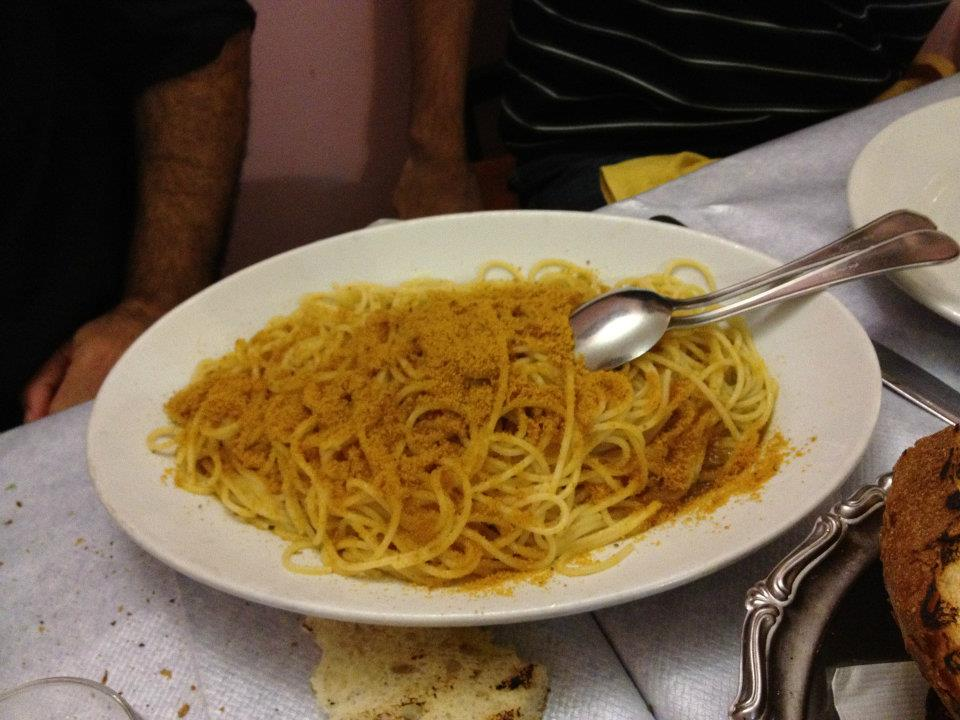
**이미지 캡션:** 이 사진은 식탁 위에 놓인 스파게티 한 접시를 클로즈업한 모습으로, 성인 남성 두 명이 식사 중인 것으로 보인다. 왼쪽에는 검은색 상의를 입은 남성의 팔이 보이고, 오른쪽에는 줄무늬 상의를 입은 남성의 상반신이 보인다. 두 사람 모두 특별한 표정이나 행동은 보이지 않으며, 식사에 집중하고 있는 듯하다. 접시에는 노란색 가루가 뿌려진 스파게티가 가득 담겨 있으며, 스파게티 위에는 은색 숟가락 두 개가 놓여 있다. 식탁보는 흰색 천으로 되어 있으며, 접시 옆에는 빵 조각과 함께 장식적인 은색 식기가 보인다. 전반적으로 편안하고 캐주얼한 식사 분위기를 연출하고 있다.
 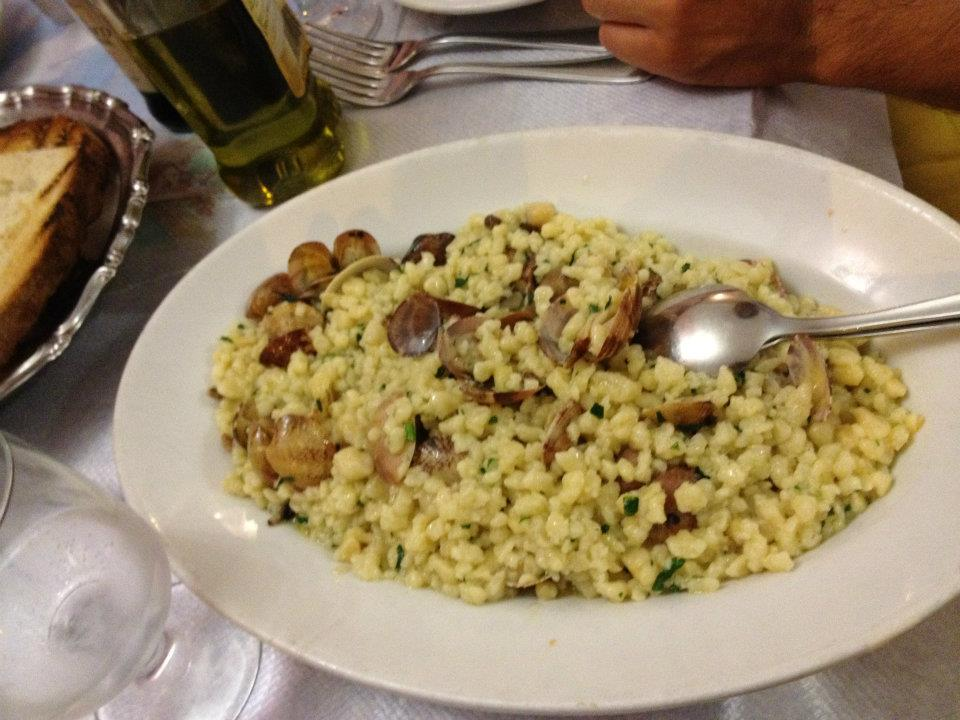
**이미지 캡션:** 한 성인 남성의 팔이 사진 상단 오른쪽에 보이며, 그는 노란색 상의를 입고 있다. 그의 앞에는 흰색 접시에 담긴 파스타 요리가 놓여 있으며, 파스타는 작은 구슬 모양이고 조개와 버섯 조각이 섞여 있다. 요리 위에는 은색 숟가락이 놓여 있다. 접시 왼쪽에는 빵이 담긴 은색 트레이와 올리브 오일 병이 보인다. 사진 왼쪽 하단에는 와인잔이 놓여 있다. 배경은 식당 테이블로 보이며, 테이블보와 포크가 보인다. 전체적으로 식사를 즐기는 편안하고 따뜻한 분위기이다.
 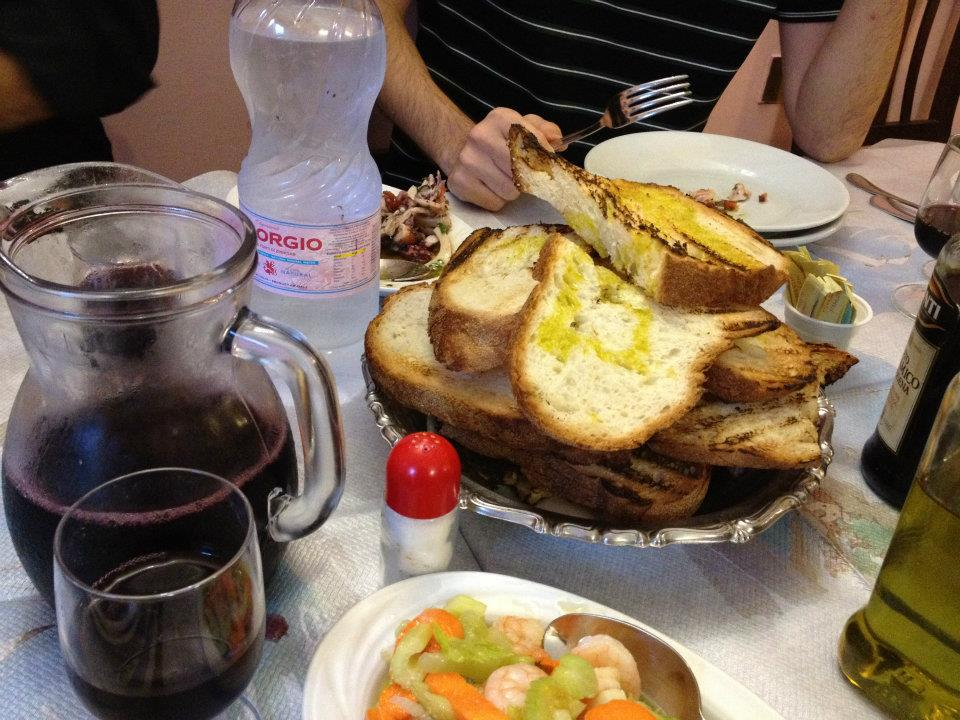
**이미지 캡션:** 테이블 위에 놓인 음식과 음료를 클로즈업한 사진으로, 여러 사람이 식사를 즐기고 있는 것으로 보인다. 사진 중앙에는 빵이 접시에 수북이 쌓여 있고, 빵 위에는 올리브 오일이 뿌려져 있다. 빵 옆에는 물병과 와인 잔, 그리고 붉은색 뚜껑의 소금통이 보인다. 또한, 접시에는 새우와 당근, 샐러리가 담겨 있다. 사진 왼쪽에는 와인 주전자가 놓여 있고, 오른쪽에는 검은색 줄무늬 티셔츠를 입은 성인 남성이 포크를 들고 빵을 집으려는 듯한 모습이 보인다. 배경에는 식당 내부의 테이블과 의자가 희미하게 보인다. 전반적으로 편안하고 즐거운 식사 분위기를 연출하고 있다.
 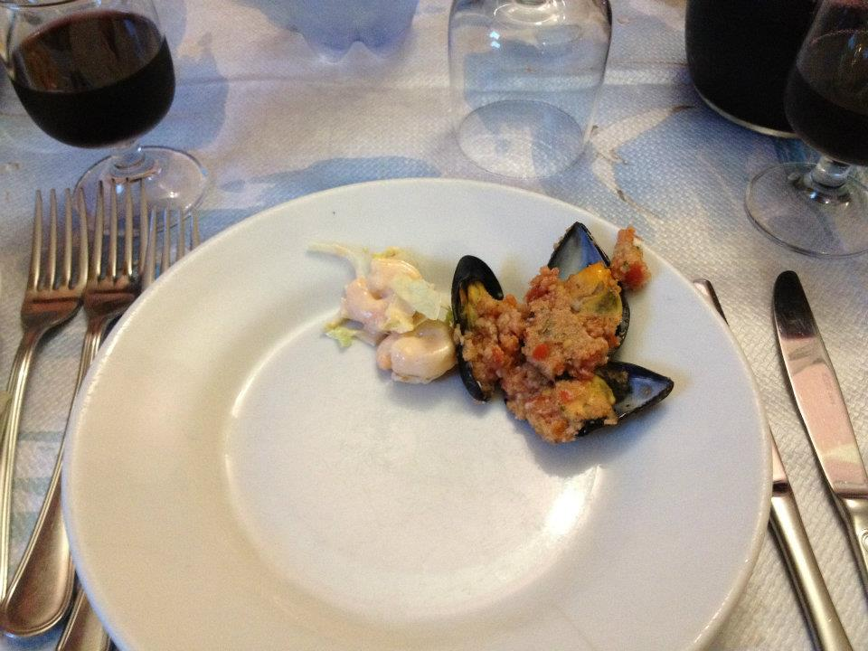
**이미지 캡션:** 이 사진은 식탁 위에 놓인 흰색 접시를 중심으로, 접시 위에는 홍합 요리와 샐러드 일부가 담겨 있고, 접시 왼쪽에는 포크 두 개, 오른쪽에는 나이프 두 개가 놓여 있습니다. 접시 왼쪽 위에는 붉은 와인이 담긴 와인잔이 보이며, 배경에는 흰색 테이블보와 흐릿한 유리잔, 그리고 검은색 물체가 보입니다. 사진에는 사람이 보이지 않으며, 식사 중인 상황으로 보입니다.
 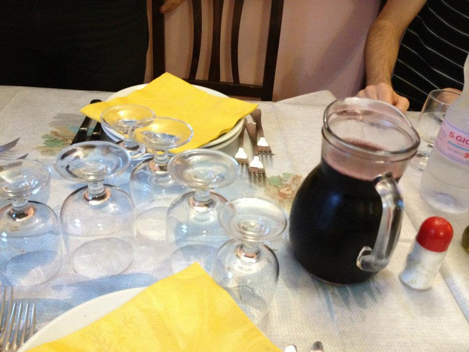
**이미지 캡션:** 테이블 위에 놓인 여러 개의 투명한 와인잔들이 뒤집혀 있고, 그 옆에는 검은색 주전자에 붉은색 음료가 담겨 있으며, 주전자 손잡이 부분에는 투명한 유리로 된 손잡이가 달려 있습니다. 테이블보 위에는 노란색 냅킨이 놓여 있고, 일부 잔들 아래에는 작은 접시가 보입니다. 배경에는 식당 의자로 보이는 나무 의자와 사람들이 앉아 있는 모습이 희미하게 보입니다. 한 성인 남성의 팔이 보이며, 그는 검은색 줄무늬 셔츠를 입고 있습니다. 다른 사람들은 옅은 분홍색 옷을 입고 있습니다. 테이블 위에는 물병과 빨간색 뚜껑이 달린 소금통으로 보이는 작은 물체가 있습니다. 전반적으로 식사를 준비하는 식당의 분위기를 나타냅니다.
 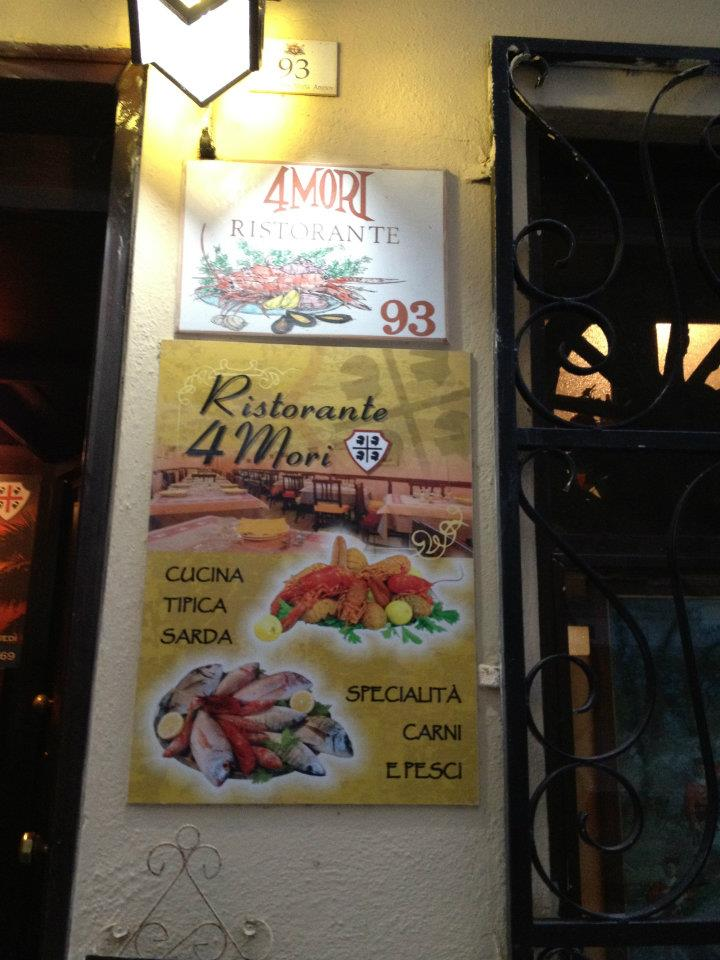
**이미지 캡션:** 이 사진은 이탈리아 사르데냐 지역의 레스토랑 외관을 보여줍니다. 벽에는 두 개의 간판이 걸려 있으며, 위쪽 간판에는 "4MORI RISTORANTE"라고 쓰여 있고 붉은색 가재 그림이 있습니다. 아래쪽 간판은 더 크고 노란색 배경에 "Ristorante 4 Mori"라고 쓰여 있으며, 사르데냐 전통 요리(CUCINA TIPICA SARDA)와 특별 메뉴(SPECIALITÀ CARNI E PESCI)를 홍보하는 그림이 있습니다. 가재와 신선한 생선 요리 사진이 포함되어 있으며, 레스토랑의 위치를 나타내는 듯한 숫자 "93"이 간판 곳곳에 보입니다. 사진 왼쪽에는 어두운 입구가 보이고, 오른쪽에는 철제 격자문이 있어 레스토랑 내부의 희미한 불빛이 새어 나옵니다. 전체적으로 저녁 시간의 레스토랑 앞 풍경으로, 따뜻한 조명과 음식 사진이 어우러져 아늑하고 식욕을 돋우는 분위기를 자아냅니다.
 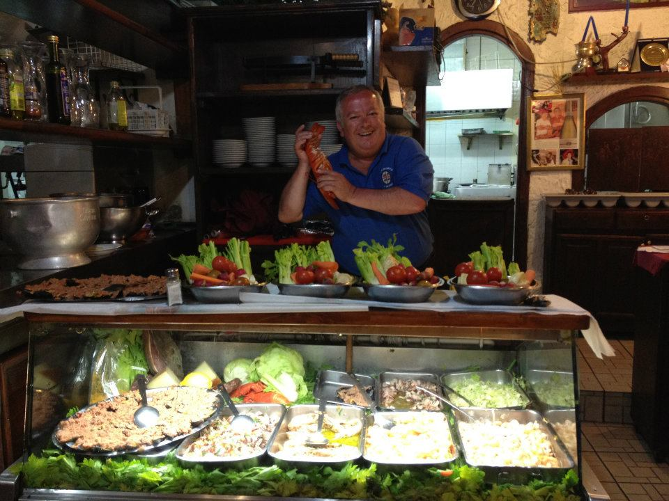
**이미지 캡션:** 한 명의 성인 남성이 주방에서 랍스터를 들고 환하게 웃고 있으며, 그의 앞에는 신선한 채소와 다양한 샐러드가 담긴 진열대가 놓여 있다. 남성은 파란색 티셔츠를 입고 있으며, 그의 뒤로는 주방의 모습과 선반에 놓인 접시들이 보인다. 진열대에는 토마토, 당근, 셀러리 등 다양한 채소가 담긴 그릇과 여러 종류의 샐러드가 먹음직스럽게 담겨 있어 활기차고 풍성한 분위기를 자아낸다.

### 6월 21일 (목) 03:23 · had wonderful lunch with his Italian lab…

📍 Cagliari, Italy

had wonderful lunch with his Italian labmates.

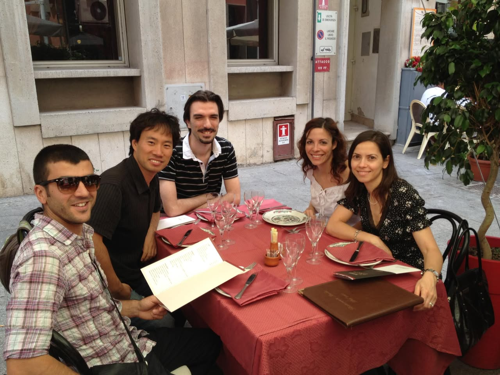
**이미지 캡션:** 이 사진은 야외 레스토랑에서 식사 중인 다섯 명의 사람들을 보여줍니다. 테이블에는 붉은색 식탁보가 깔려 있고, 여러 개의 접시, 와인잔, 냅킨, 메뉴판이 놓여 있습니다. 왼쪽에는 선글라스를 낀 젊은 성인 남성이 체크무늬 셔츠를 입고 메뉴판을 들고 카메라를 향해 미소 짓고 있습니다. 그 옆에는 검은색 셔츠를 입은 아시아계 성인 남성이 앉아 있으며, 그의 옆에는 줄무늬 셔츠를 입은 성인 남성이 미소를 짓고 있습니다. 테이블 반대편에는 두 명의 성인 여성이 앉아 있으며, 한 명은 흰색 블라우스, 다른 한 명은 검은색 꽃무늬 드레스를 입고 있습니다. 배경에는 건물과 나무가 보이며, 건물 벽에는 이탈리아어로 된 표지판이 붙어 있습니다. 전반적으로 즐겁고 편안한 식사 분위기입니다.

### 6월 21일 (목) 21:57 · 📷 앨범: Way to Cagliari University (14장)

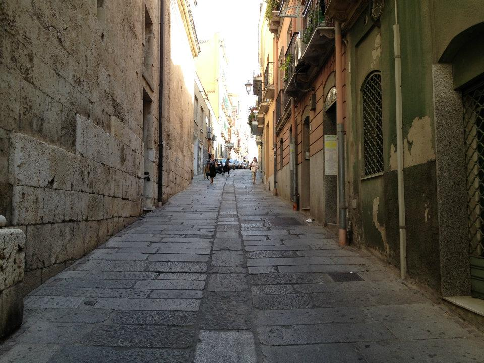
**이미지 캡션:** 좁고 오래된 석조 건물들 사이에 있는 좁은 골목길로, 햇빛이 비스듬히 비추고 있습니다. 골목길은 돌로 포장되어 있으며, 양쪽에는 낡고 오래된 건물들이 늘어서 있습니다. 왼쪽 건물은 거대한 석조 블록으로 만들어져 있으며, 오른쪽 건물들은 다양한 색상과 질감을 가지고 있습니다. 몇몇 건물에는 창문, 발코니, 에어컨 장치 등이 보입니다. 골목길 중간쯤에는 두 명의 사람이 걸어가고 있는데, 한 명은 검은색 옷을 입은 성인 여성으로 보이며, 다른 한 명은 더 멀리 있어서 자세히 보이지 않습니다. 골목길 끝에는 더 많은 사람들이 보이며, 차량으로 추정되는 것도 있습니다. 전반적으로 오래된 유럽 도시의 한적한 골목길 풍경을 보여주며, 약간은 고즈넉하고 쇠락한 분위기를 풍깁니다.
 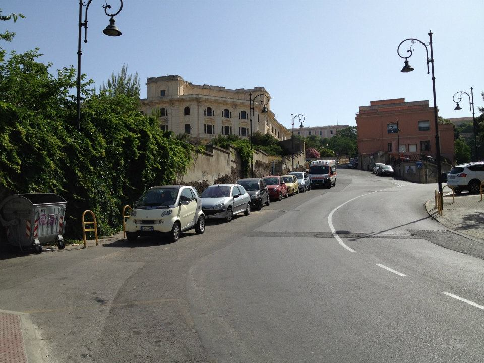
**이미지 캡션:** 맑은 날씨의 도시 거리 풍경으로, 왼쪽에는 녹색 덩굴로 뒤덮인 언덕과 그 앞에 커다란 쓰레기통이 놓여 있고, 그 옆에는 흰색 스마트 자동차와 은색 자동차가 주차되어 있습니다. 도로에는 여러 대의 차량이 줄지어 서 있으며, 그중에는 구급차로 보이는 흰색과 빨간색 차량도 있습니다. 도로 오른쪽에는 붉은색 건물이 보이고, 멀리에는 웅장한 흰색 건물이 자리 잡고 있습니다. 거리에는 고풍스러운 디자인의 가로등이 여러 개 설치되어 있으며, 전반적으로 평화롭고 조용한 분위기를 자아냅니다.
 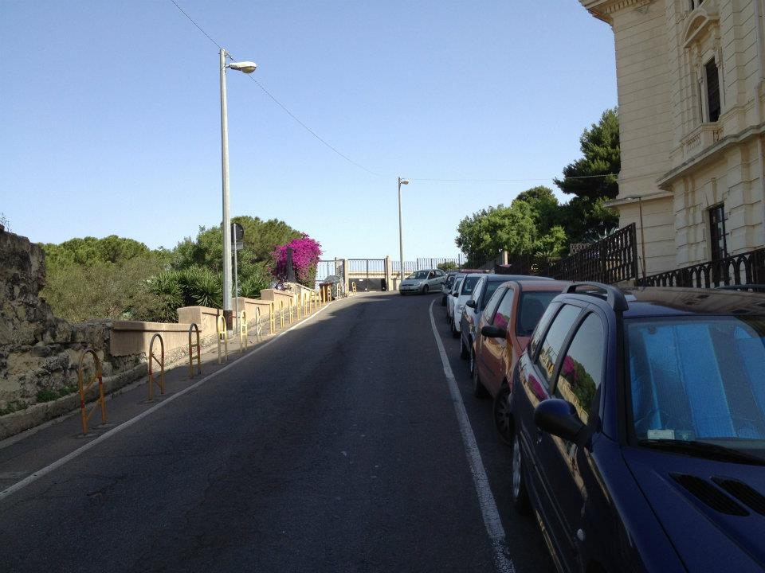
**이미지 캡션:** 맑고 푸른 하늘 아래, 좁은 아스팔트 도로가 언덕을 따라 구불구불 이어져 있고, 도로 우측에는 여러 대의 차량이 주차되어 있으며, 그 뒤로는 웅장한 흰색 건물이 자리하고 있습니다. 도로 좌측에는 돌담과 함께 노란색 난간이 설치되어 있고, 그 너머로는 울창한 녹색 나무와 보라색 꽃이 만발한 모습이 보입니다. 멀리 보이는 철문은 이 지역의 경계를 나타내는 듯합니다. 햇살이 비추는 평화로운 오후의 풍경으로, 인적은 보이지 않습니다.
 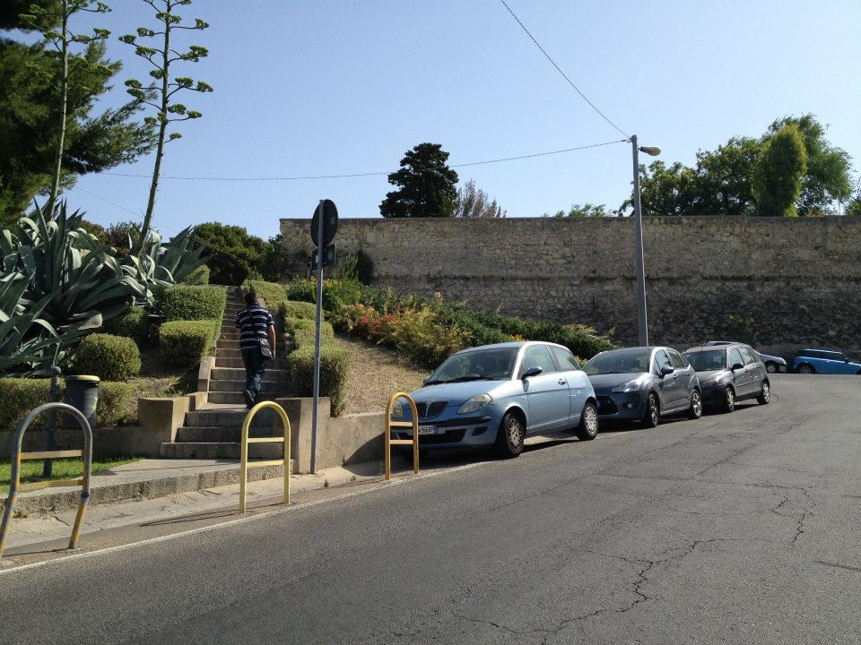
**이미지 캡션:** 한 명의 성인 남성이 줄무늬 티셔츠와 청바지를 입고 계단을 올라가고 있으며, 그의 뒤로는 푸른 하늘과 돌담이 보입니다. 계단 옆에는 잘 다듬어진 녹색 관목과 키 큰 용설란이 심어져 있고, 길가에는 노란색 보호대가 설치되어 있습니다. 도로에는 여러 대의 자동차가 주차되어 있으며, 그중에는 파란색 차량도 있습니다. 전반적으로 맑고 화창한 날씨를 배경으로 한 야외 풍경입니다.
 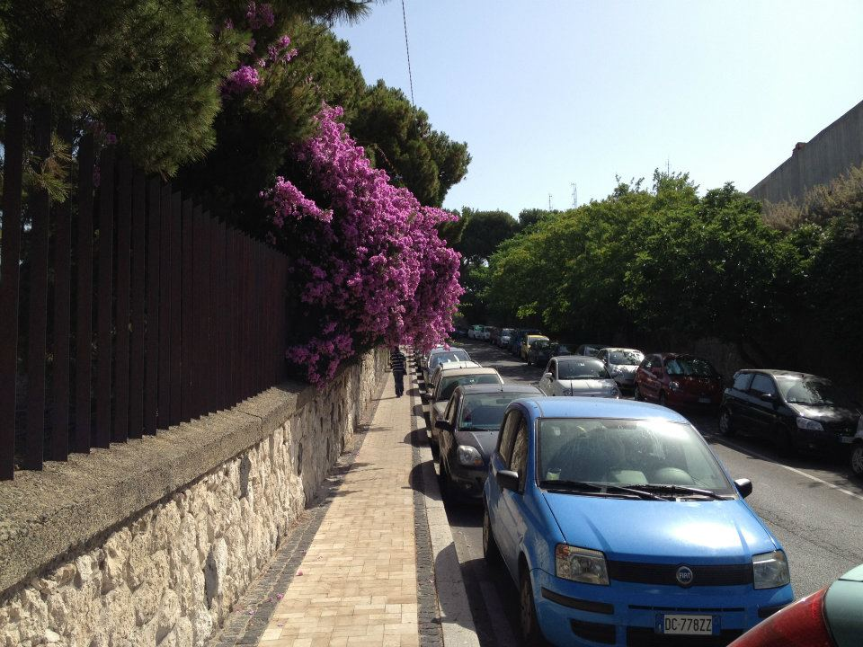
**이미지 캡션:** 햇살이 비치는 맑은 날, 보라색 꽃이 만발한 담쟁이덩굴이 짙은 갈색 울타리를 따라 늘어서 있고, 그 옆에는 돌담이 쌓여 있다. 담쟁이덩굴 아래에는 옅은 베이지색 타일로 포장된 보도가 있으며, 보도에는 몇 개의 분홍색 꽃잎이 떨어져 있다. 보도 끝에는 검은색과 흰색 줄무늬 옷을 입은 성인 남성이 멀리 걸어가고 있다. 도로에는 여러 대의 차량이 주차되어 있으며, 가장 가까운 곳에는 파란색 피아트 차량이 보이고, 그 뒤로 검은색, 빨간색, 은색 등 다양한 색상의 차량들이 줄지어 있다. 도로 건너편에는 울창한 녹색 나무들이 우거져 있고, 멀리 회색 벽으로 된 건물이 보인다. 전반적으로 평화롭고 한적한 거리 풍경을 담고 있다.
 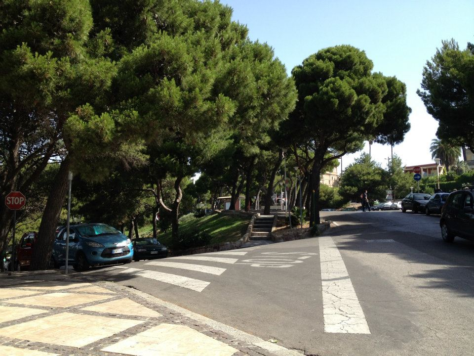
**이미지 캡션:** 푸른 하늘 아래 짙은 녹음의 소나무들이 우거진 길가에 파란색 승용차 한 대가 주차되어 있고, 그 옆으로 횡단보도가 보인다. 길 건너편에는 여러 대의 차량이 주차되어 있으며, 숲이 우거진 언덕과 건물들이 보인다. 길가에는 빨간색 정지 표지판이 세워져 있다. 햇살이 비추는 맑은 날씨로, 전반적으로 평화롭고 한적한 분위기이다.
 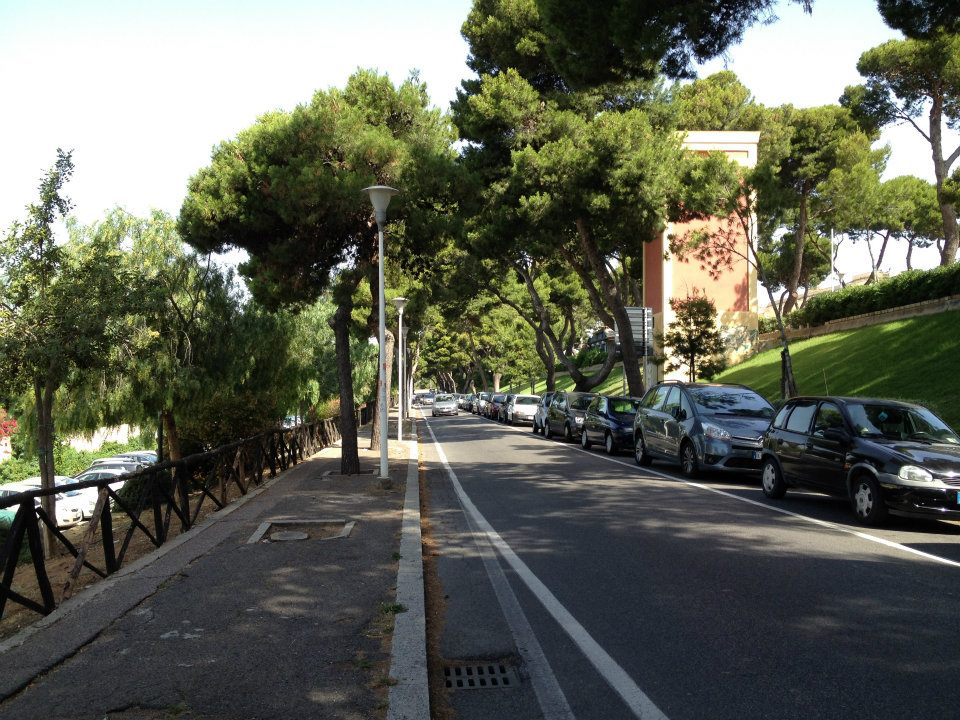
**이미지 캡션:** 이 사진은 맑은 날씨에 나무가 늘어선 도로변을 보여줍니다. 도로에는 여러 대의 차량이 주차되어 있으며, 그중에는 검은색 소형차, 회색 미니밴, 파란색 소형차 등이 보입니다. 도로 옆에는 보행자 도로가 있으며, 나무 울타리가 보행자 도로와 그 너머의 주차된 차량들을 구분하고 있습니다. 보행자 도로에는 몇 개의 맨홀 덮개와 빗물 배수구가 보입니다. 도로와 보행자 도로 양쪽에는 울창한 녹색 나무들이 늘어서 있어 시원한 그늘을 제공합니다. 멀리 보이는 건물은 붉은색과 베이지색으로 칠해져 있으며, 건물 위쪽으로는 푸른 잔디밭이 펼쳐져 있습니다. 사진의 분위기는 평화롭고 한적하며, 일상적인 도시 풍경을 담고 있습니다.
 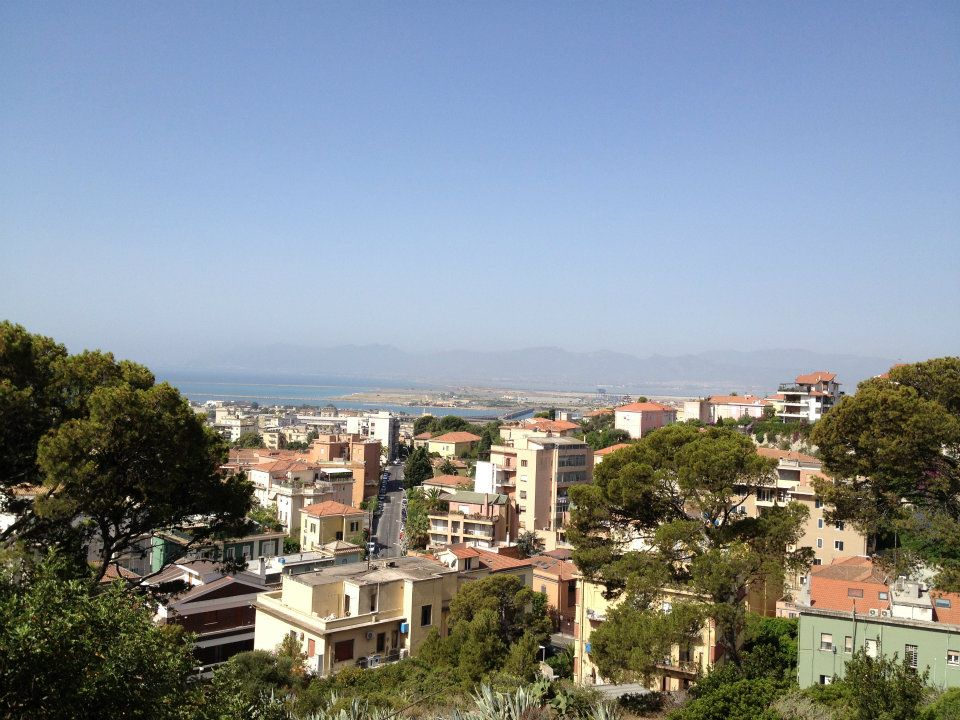
**이미지 캡션:** 이 사진은 맑고 푸른 하늘 아래 펼쳐진 해안 도시의 풍경을 담고 있으며, 여러 채의 건물들이 옹기종기 모여 있고 그 사이로 도로가 나 있으며, 멀리 푸른 바다와 산 능선이 희미하게 보인다. 건물들은 대부분 3층에서 10층 높이로, 주황색 지붕과 다양한 색상의 외벽을 가지고 있으며, 일부 건물에는 발코니가 보인다. 건물들 사이사이에는 울창한 녹색 나무들이 자라고 있어 도시에 생기를 더하고 있다. 사진의 전경에는 짙은 녹색의 나무들이 화면 하단과 좌측을 가득 채우고 있으며, 중경에는 다양한 높이와 색상의 건물들이 밀집해 있고, 원경에는 잔잔한 바다와 그 너머로 희미하게 보이는 산맥이 펼쳐져 있다. 사진 속에는 사람이 보이지 않으며, 텍스트도 확인할 수 없다. 전반적으로 평화롭고 따뜻한 햇살이 내리쬐는 여름날의 도시 풍경을 연상시킨다.
 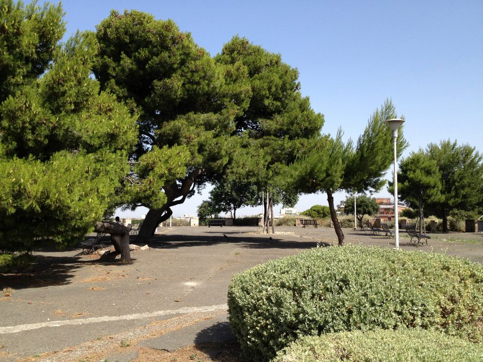
**이미지 캡션:** 푸른 하늘 아래 넓은 공원에서 여러 그루의 소나무가 시원한 그늘을 드리우고 있으며, 공원에는 벤치와 가로등이 설치되어 있습니다. 사진 왼쪽에는 커다란 소나무가 마치 거대한 우산처럼 펼쳐져 있고, 그 아래 벤치에 앉아 있는 사람의 모습이 희미하게 보입니다. 이 사람은 성인 남성으로 추정되며, 검은색 옷을 입고 무언가를 바라보고 있습니다. 공원 바닥은 아스팔트와 자갈이 섞여 있으며, 곳곳에 마른 낙엽이 떨어져 있습니다. 사진 중앙에는 길쭉한 모양의 소나무들이 줄지어 서 있고, 그 뒤로 건물과 울타리가 보입니다. 오른쪽에는 또 다른 소나무들과 벤치, 그리고 하얀색 가로등이 서 있습니다. 전반적으로 평화롭고 한적한 오후의 공원 풍경을 담고 있습니다.
 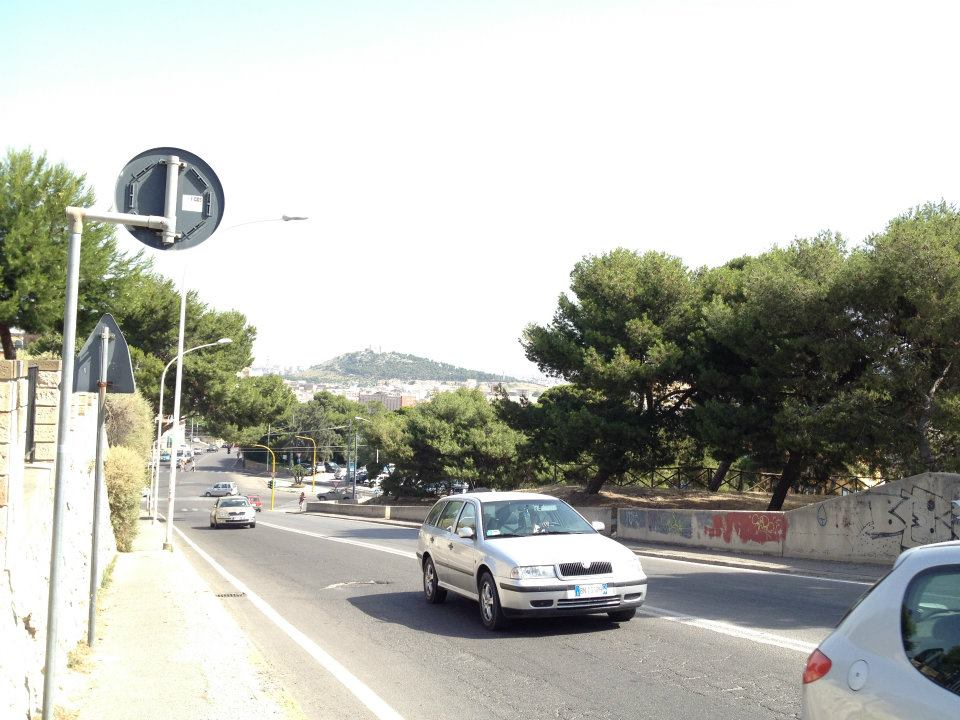
**이미지 캡션:** 이 사진은 맑은 날씨에 도시 외곽의 도로 풍경을 담고 있으며, 여러 대의 차량이 도로를 주행하고 있습니다. 사진 왼쪽에는 회색 벽돌 담벼락과 함께 교통 표지판이 설치된 가로등 기둥이 서 있습니다. 도로에는 흰색 승용차 한 대가 주행 중이며, 그 뒤로 다른 차량들이 보입니다. 도로 오른쪽으로는 울타리와 함께 콘크리트 벽이 있고, 벽에는 낙서가 그려져 있습니다. 배경에는 울창한 녹색 나무들이 우거져 있으며, 멀리 언덕 위에는 도시 건물들이 보입니다. 하늘은 맑고 밝은 흰색입니다. 사진 속에는 사람이 명확하게 보이지 않습니다. 전반적으로 평화롭고 일상적인 도시의 한 장면을 보여줍니다.
 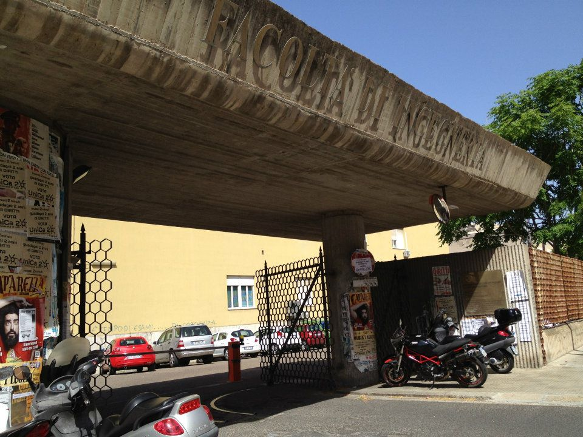
**이미지 캡션:** 이 사진은 콘크리트 구조물 아래에 있는 건물 입구를 보여주는데, 구조물 상단에는 "FACOLTA DI INGEGNERIA"라는 글자가 새겨져 있어 공과대학임을 알 수 있다. 건물은 밝은 노란색이며, 입구에는 검은색 격자무늬 철문과 함께 여러 장의 포스터가 붙어 있다. 포스터 중에는 이탈리아어로 된 텍스트와 함께 사람들의 사진이 포함되어 있으며, "VOTA", "Unica 2.0", "DIRITTI"와 같은 단어들이 보인다. 입구 앞에는 여러 대의 차량과 오토바이가 주차되어 있으며, 특히 회색 스쿠터와 빨간색 스포츠 오토바이가 눈에 띈다. 배경에는 푸른 하늘과 녹색 나무가 보이며, 전체적으로 햇볕이 잘 드는 낮 시간대의 풍경이다. 사진에는 사람이 직접적으로 보이지는 않지만, 포스터와 차량, 오토바이 등으로 인해 사람들이 활동하는 장소임을 짐작할 수 있다. 분위기는 다소 오래된 대학가의 활기찬 모습과 함께 약간의 낡은 느낌이 공존한다.
 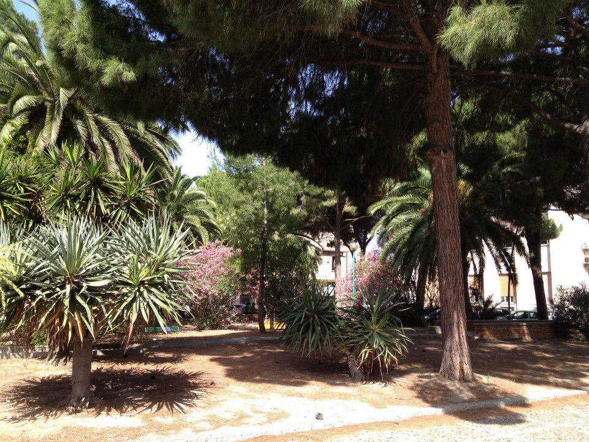
**이미지 캡션:** 이 사진은 햇살이 비치는 야외 공원이나 정원의 풍경을 담고 있으며, 다양한 종류의 식물들이 조화롭게 어우러져 있습니다. 전경에는 뾰족한 잎을 가진 여러 개의 용설란과 비슷한 식물들이 자리 잡고 있으며, 그 뒤로는 분홍색 꽃이 피어 있는 덤불과 야자수들이 보입니다. 사진 중앙에는 굵고 갈라진 껍질을 가진 큰 나무가 서 있고, 그 주변으로 소나무와 같은 침엽수들이 울창한 녹음을 드리우고 있습니다. 배경에는 흰색 건물이 보이며, 건물 앞에는 주차된 차량 몇 대가 희미하게 보입니다. 땅은 마른 흙과 낙엽으로 덮여 있고, 나무 그늘이 드리워져 있습니다. 전반적으로 평화롭고 자연 친화적인 분위기를 자아내며, 맑고 푸른 하늘이 부분적으로 보입니다. 사진 속에는 사람이 보이지 않아 조용하고 한적한 느낌을 줍니다.
 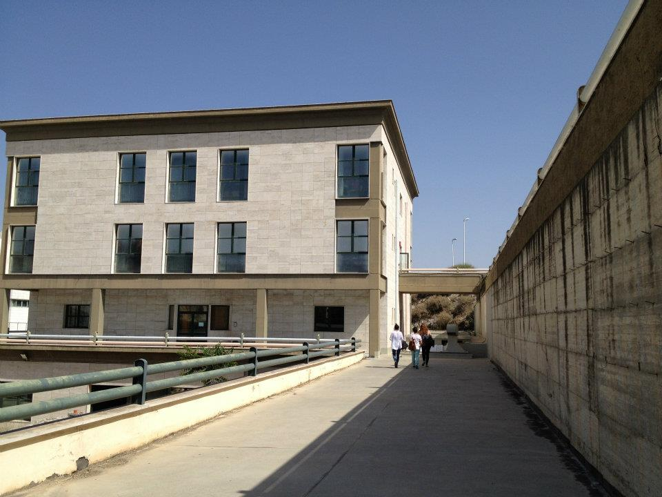
**이미지 캡션:** 맑고 푸른 하늘 아래, 현대적인 건축 양식의 건물이 보이며, 건물 외벽은 베이지색 석재 타일로 마감되어 있고 여러 개의 창문이 규칙적으로 배치되어 있습니다. 건물 앞쪽으로는 콘크리트 벽과 함께 녹색 난간이 설치된 경사진 보행로가 이어져 있으며, 이 보행로를 따라 세 명의 사람이 걸어가고 있습니다. 가장 앞쪽의 사람은 흰색 상의와 어두운 색 하의를 입은 성인 남성으로 보이며, 뒤따르는 두 사람은 여성으로 추정됩니다. 이들은 모두 평범한 복장을 하고 있으며, 특별한 표정이나 행동은 보이지 않습니다. 배경에는 흙과 식물이 있는 언덕과 다리로 연결된 또 다른 건물이 희미하게 보입니다. 전체적으로 건조하고 햇볕이 강한 날씨의 야외 풍경이며, 병원이나 연구소와 같은 공공기관의 외부 공간으로 추정됩니다.
 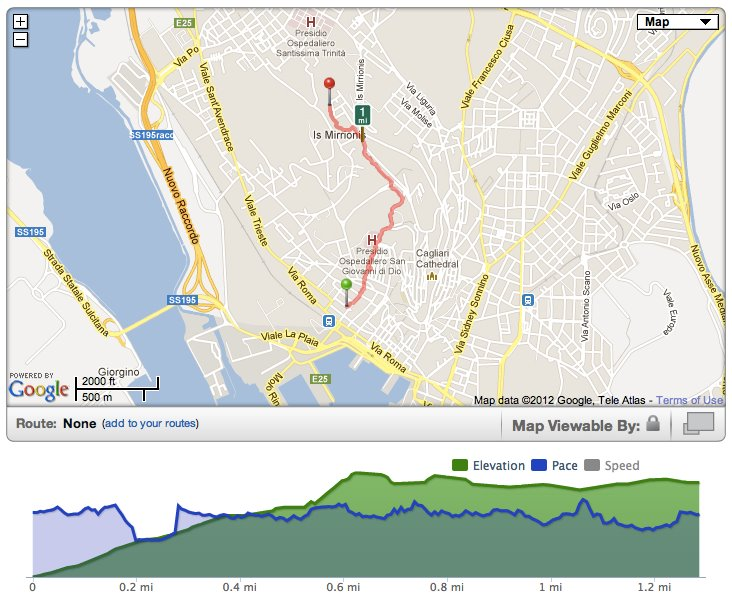
**이미지 캡션:** 이 이미지는 구글 지도와 고도, 속도, 페이스 그래프를 보여주는 스크린샷입니다. 지도 상에는 이탈리아 사르데냐 칼리아리의 일부 지역이 표시되어 있으며, "Is Mirrionis"라는 지점과 "Presidio Ospedaliero Santissima Trinità", "Presidio Ospedallero San Giovanni di Dio", "Cagliari Cathedral"과 같은 건물들이 나타납니다. 빨간색 핀은 출발점을, 녹색 핀은 도착점을 나타내는 것으로 보이며, 붉은색 선은 두 지점 사이의 경로를 표시합니다. 지도 하단에는 "POWERED BY GOOGLE"이라는 문구와 함께 축척이 표시되어 있으며, "Route: None (add to your routes)"라는 텍스트가 있습니다. 지도 아래에는 고도(녹색), 페이스(파란색), 속도(회색)를 나타내는 그래프가 있으며, 가로축은 거리를 마일 단위로 표시합니다. 전반적으로 이 이미지는 특정 경로의 지리적 정보와 운동 데이터를 시각화한 것입니다.

> uphill!
> uphill again!
> uphill stars
> beautiful uphill.
> almost
> now it's flat.
> Nice view on the top
> I wanted to stop here.
> finally a bit downhill.
> main entrance
> nice campus
> finally @CS building.
> elevation!

### 6월 24일 (일) 04:49 · 📷 앨범: German Autobahn (3장)

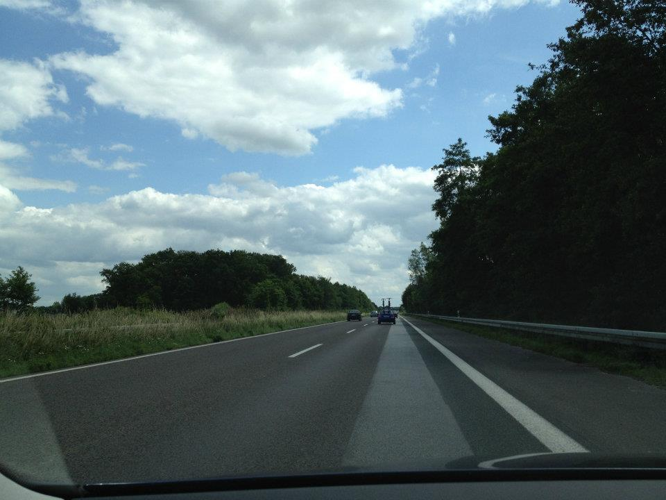
**이미지 캡션:** 이 사진은 맑은 날 고속도로를 달리는 차량에서 촬영된 것으로 보인다. 푸른 하늘에는 뭉게구름이 두둥실 떠 있고, 도로 양옆으로는 울창한 나무들이 늘어서 있다. 도로에는 흰색 차선이 선명하게 그어져 있고, 몇 대의 차량이 앞서가고 있다. 사진의 전반적인 분위기는 평화롭고 시원한 느낌을 준다.
 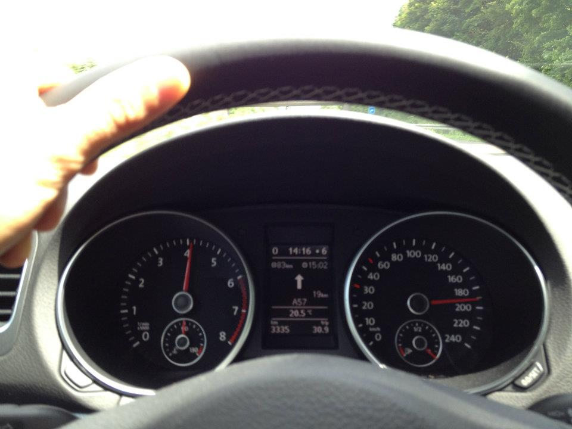
**이미지 캡션:** 운전자의 손이 운전대를 잡고 있으며, 차량 내부의 계기판이 보인다. 계기판에는 속도계, 엔진 회전수계, 그리고 디지털 디스플레이가 포함되어 있다. 속도계는 약 190km/h를 가리키고 있으며, 엔진 회전수는 약 4,000rpm이다. 디지털 디스플레이에는 현재 시간 14:16, 날짜 6, 주행 거리 83km, 평균 속도 15.02km/h, 그리고 외부 온도 20.5°C 등의 정보가 표시되어 있다. 또한, 내비게이션으로 보이는 화살표와 함께 19km, 3335km, 30.9 등의 숫자가 보인다. 계기판 주변의 배경으로는 창밖의 푸른 나무들이 흐릿하게 보인다. 전반적으로 차량이 도로를 주행 중인 상황으로 보이며, 운전자는 운전대를 잡고 전방을 주시하고 있는 것으로 추정된다.
 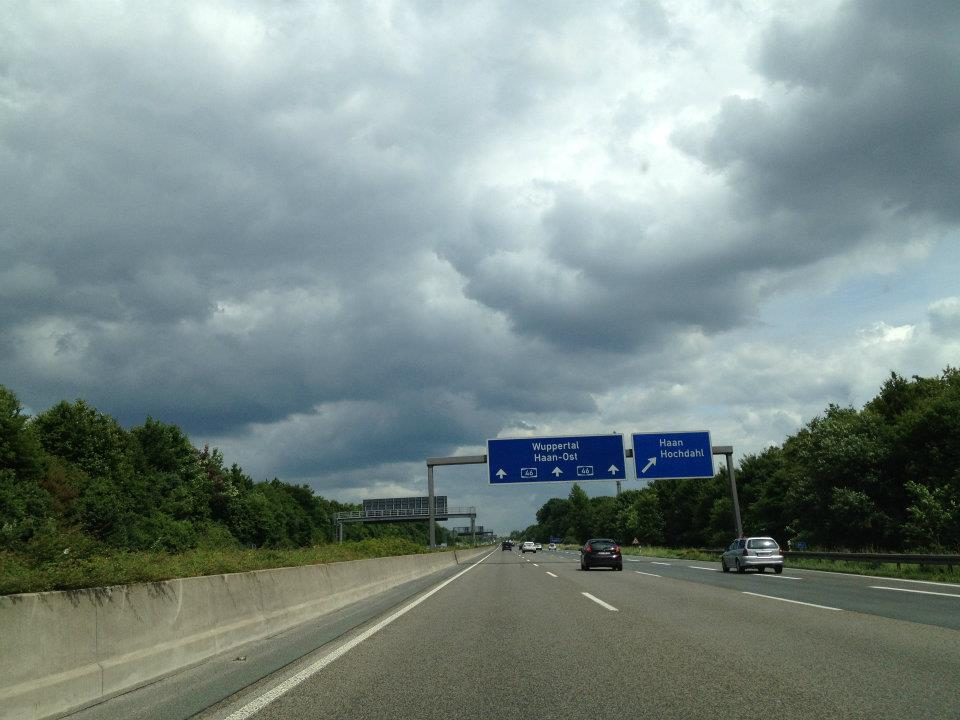
**이미지 캡션:** 흐린 날씨의 고속도로 풍경으로, 사진은 운전자의 시점에서 촬영되었습니다. 도로 위에는 여러 대의 차량이 보이며, 그중 검은색 승용차와 은색 승용차가 눈에 띕니다. 도로 양옆으로는 울창한 녹색 나무들이 늘어서 있고, 콘크리트 방호벽이 도로를 따라 이어져 있습니다. 하늘은 짙은 먹구름으로 뒤덮여 있어 다소 어둡고 흐린 분위기를 자아냅니다. 도로 위에는 파란색 바탕에 흰색 글씨로 된 두 개의 이정표가 설치되어 있습니다. 왼쪽 이정표에는 "Wuppertal Haan-Ost"라고 적혀 있고, 오른쪽 이정표에는 "Haan Hochdahl"이라고 적혀 있으며, 각 방향을 가리키는 화살표와 숫자 46이 함께 표시되어 있습니다. 이정표와 주변 풍경으로 보아 독일의 고속도로로 추정됩니다. 사람의 모습은 보이지 않으며, 전체적으로 차분하고 이동 중인 상황을 나타냅니다.

### 6월 25일 (월) 15:34 · found (very open and transparent) toilet…

found (very open and transparent) toilets in Germany. It will become ground glass when you lock the door from inside. However, I'm not sure it is really reliable. What happens if it turns to transparent again (due to a bug) during ... :-)

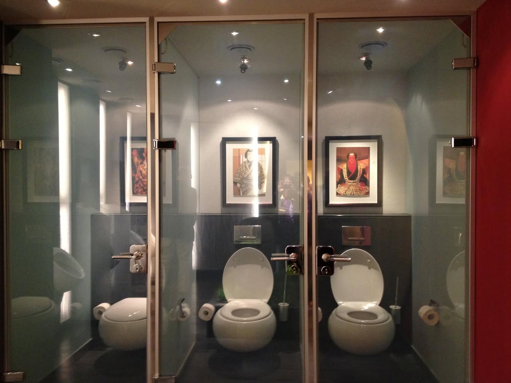
**이미지 캡션:** 이 사진은 유리 칸막이로 분리된 세 개의 화장실 공간을 보여줍니다. 각 칸막이 안에는 하얀색 변기가 하나씩 놓여 있으며, 변기 옆에는 휴지걸이와 휴지가 보입니다. 벽에는 액자에 담긴 그림이 걸려 있는데, 그림 속 인물들은 전통 의상을 입고 있는 것으로 보입니다. 왼쪽 칸막이에는 소변기가 보이며, 오른쪽 칸막이 벽은 붉은색으로 되어 있습니다. 전체적으로 현대적이고 깔끔한 분위기이며, 각 칸막이는 독립적인 공간으로 디자인되어 있습니다. 사람들은 보이지 않으며, 장소는 공공 화장실 또는 상업 시설의 화장실로 추정됩니다.

### 6월 25일 (월) 15:46 · 📷 앨범: Kölner Domes (8장)

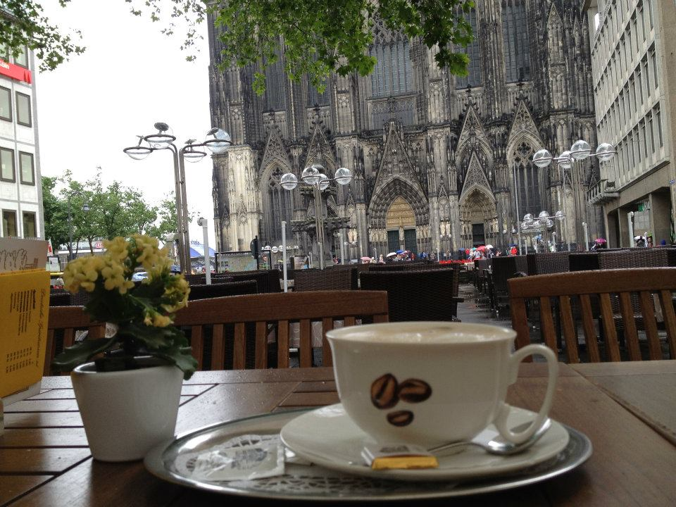
**이미지 캡션:** 이 사진은 독일 쾰른 대성당을 배경으로 한 야외 카페의 풍경을 담고 있습니다. 전경에는 나무 테이블 위에 놓인 커피잔과 작은 화분이 보입니다. 커피잔은 흰색이며 커피콩 모양의 그림이 그려져 있고, 옆에는 작은 초콜릿 조각과 숟가락이 놓여 있습니다. 커피잔 옆에는 은색 쟁반이 있고, 쟁반 위에는 설탕 봉지가 놓여 있습니다. 화분에는 노란색 꽃이 피어 있습니다. 배경에는 웅장한 쾰른 대성당의 모습이 보이며, 대성당 앞에는 여러 개의 가로등이 서 있습니다. 또한, 여러 개의 야외 테이블과 의자들이 놓여 있으며, 몇몇 사람들은 우산을 쓰고 거리를 걷고 있습니다. 전체적으로 차분하고 여유로운 분위기를 자아냅니다.
 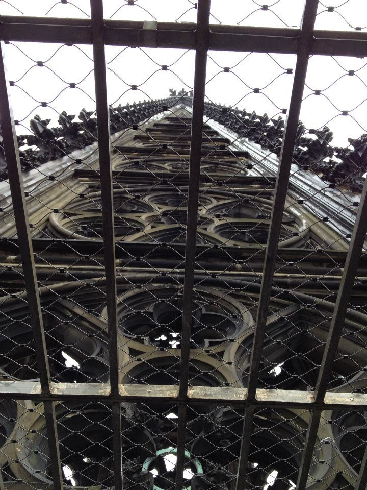
**이미지 캡션:** 이 사진은 웅장한 고딕 양식의 건축물 상층부를 아래에서 위로 올려다보는 시점으로 촬영되었습니다. 사진 전면에는 굵은 금속 봉과 촘촘한 철망이 격자 형태로 배치되어 있어, 마치 창살이나 울타리를 통해 바라보는 듯한 느낌을 줍니다. 건축물은 돌로 만들어졌으며, 복잡하고 정교한 조각과 아치형 창문, 뾰족한 장식들이 특징입니다. 특히 지붕 가장자리를 따라 늘어선 장식적인 요소들과 창문의 기하학적인 문양이 눈길을 끕니다. 하늘은 밝은 흰색으로 보이며, 이는 흐린 날씨나 역광임을 시사합니다. 건축물의 어두운 색감과 대비되어 웅장함과 신비로운 분위기를 자아냅니다. 사진에는 사람이 보이지 않으며, 특정 사물이나 텍스트도 명확하게 인식되지 않습니다. 전체적으로 건축물의 위엄과 섬세함을 강조하며, 약간은 답답하면서도 경외감을 느끼게 하는 분위기를 연출합니다.
 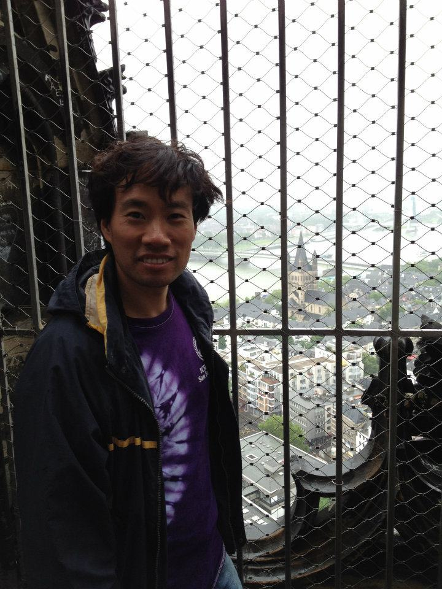
**이미지 캡션:** 한 성인 남성이 카메라를 향해 미소를 지으며 서 있으며, 그의 뒤로는 촘촘한 금속 그물망이 있고 그 너머로 도시 풍경이 펼쳐져 있습니다. 남성은 30대 후반에서 40대 초반으로 보이며, 짧고 헝클어진 검은 머리를 하고 있습니다. 그는 짙은 남색 후드 재킷을 입고 있으며, 재킷 안에는 보라색 타이 다이 무늬 티셔츠를 착용하고 있습니다. 티셔츠에는 희미하게 로고와 글자가 보이지만 명확하게 읽을 수는 없습니다. 그의 표정은 편안하고 즐거워 보입니다. 배경에는 붉은 지붕을 가진 건물들이 밀집해 있으며, 멀리 강과 첨탑이 있는 교회가 보입니다. 하늘은 흐린 날씨를 나타내듯 하얗게 보입니다. 전체적으로 사진은 도시의 높은 곳에서 풍경을 감상하는 듯한 분위기를 자아냅니다.
 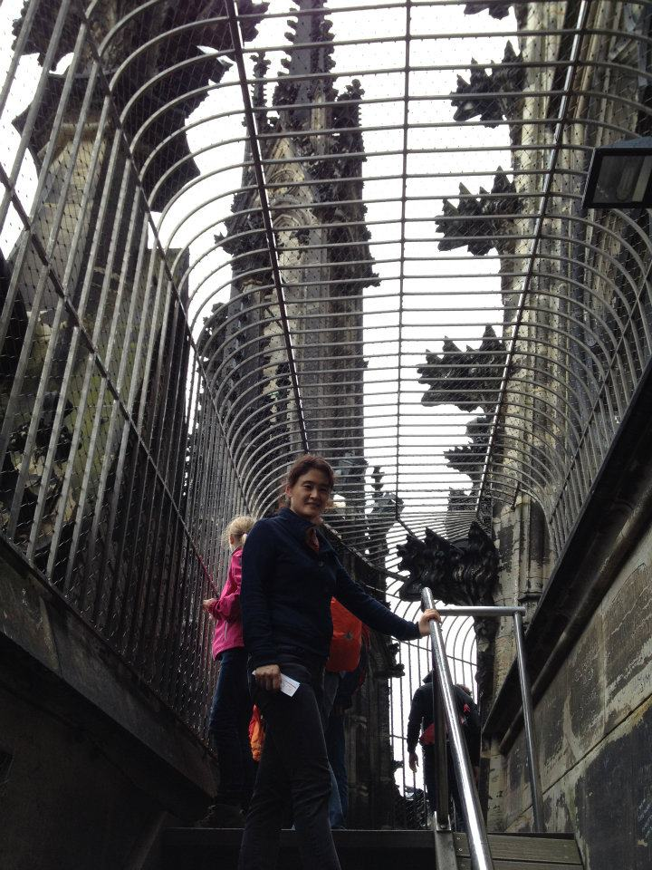
**이미지 캡션:** 한 성인 여성이 계단을 오르며 난간을 잡고 카메라를 향해 미소 짓고 있으며, 그녀 뒤에는 어린 여자아이와 다른 사람들이 보인다. 이들은 웅장한 고딕 양식의 건축물 내부 계단을 오르고 있으며, 철제 난간과 뾰족한 첨탑 장식이 배경을 이루고 있다. 전체적으로 흐린 날씨 속에서 관광객들이 역사적인 건축물을 탐방하는 듯한 분위기이다.
 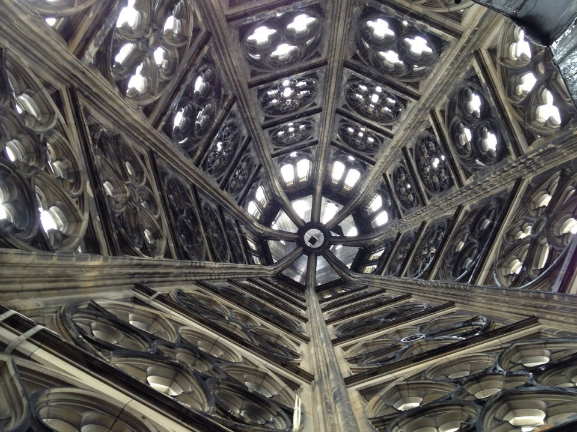
**이미지 캡션:** 이 사진은 고딕 양식의 건축물 내부 천장을 아래에서 위로 올려다본 모습으로, 복잡하고 정교한 석조 장식이 시선을 사로잡는다. 뾰족한 아치와 덩굴 모양의 장식이 반복적으로 나타나며, 창문 역할을 하는 부분으로는 밝은 빛이 새어 들어와 어두운 석조 구조물과 대비를 이룬다. 중앙에는 둥근 형태의 천장 구조물이 보이며, 이를 중심으로 여러 개의 기둥과 아치들이 방사형으로 뻗어 나가 웅장하고 신비로운 분위기를 자아낸다. 사진에는 사람이 보이지 않으며, 장소는 오래된 성당이나 대성당 내부로 추정된다. 텍스트는 보이지 않으며, 전체적으로 경건하고 압도적인 느낌을 주는 건축미를 강조하는 사진이다.
 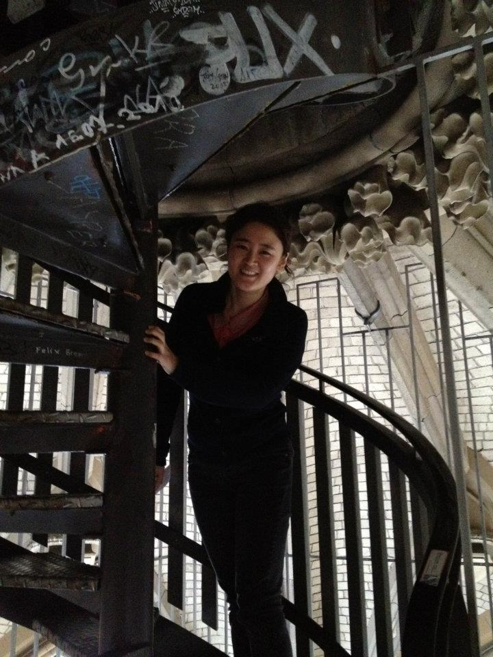
**이미지 캡션:** 한 명의 젊은 아시아 여성으로 보이는 사람이 어두운 색의 나선형 계단에 서서 카메라를 향해 환하게 웃고 있다. 여성은 검은색 재킷과 바지를 입고 있으며, 재킷 안에는 붉은색 상의가 보인다. 그녀의 머리카락은 짧고 검은색이며, 얼굴에는 즐거운 표정이 역력하다. 여성의 오른손은 계단의 난간을 잡고 있고, 왼손은 몸 옆에 자연스럽게 내려져 있다. 배경에는 낡은 금속으로 된 나선형 계단과 벽돌로 된 벽, 그리고 독특한 모양의 장식물들이 보인다. 계단의 금속 부분에는 스프레이 페인트로 된 낙서들이 많이 그려져 있어 다소 거칠고 오래된 느낌을 준다. 계단 위쪽 천장 부분에도 낙서가 보인다. 전체적으로 낡고 투박한 느낌의 실내 공간이지만, 여성의 밝은 미소 덕분에 활기찬 분위기가 느껴진다. 계단 난간에는 "Felix Brew"라는 글자가 희미하게 보인다.
 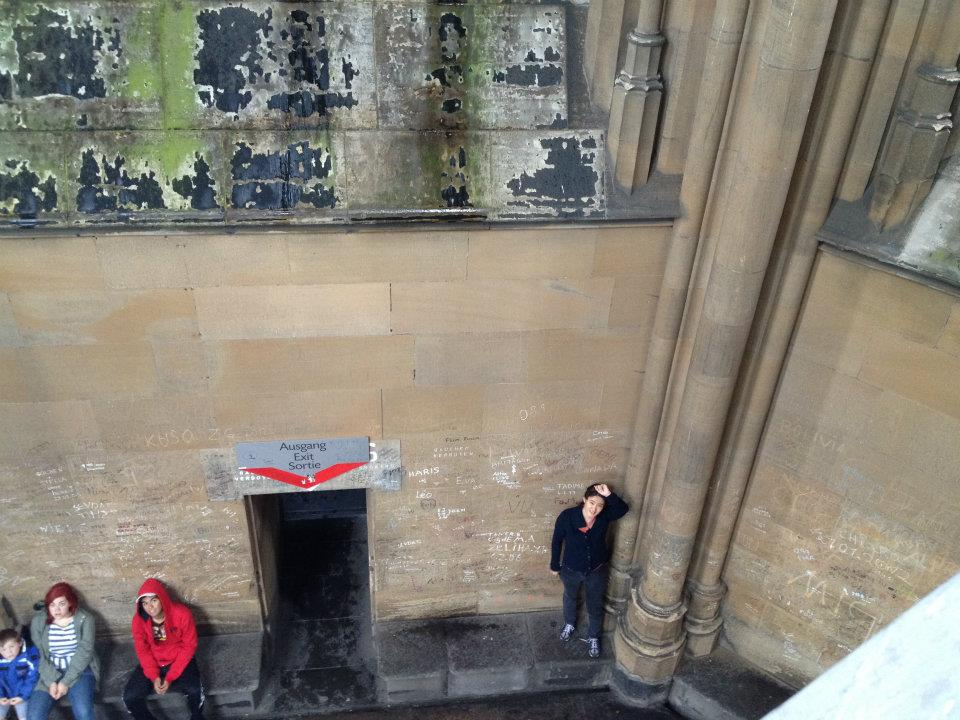
**이미지 캡션:** 이 사진은 오래된 석조 건물 내부의 풍경을 보여주며, 벽에는 낙서가 가득합니다. 왼쪽에는 세 명의 사람이 앉아 있습니다. 가장 왼쪽에는 파란색 재킷을 입은 어린 남자아이로 보이며, 그 옆에는 회색 줄무늬 티셔츠와 청바지를 입은 젊은 여성으로 추정되는 사람이 앉아 있습니다. 그 옆에는 빨간색 후드티를 입은 젊은 남성이 앉아 있습니다. 이 세 사람은 모두 정면을 바라보고 있으며, 표정은 명확하게 보이지 않습니다. 중앙에는 "Ausgang Exit Sortie"라고 쓰인 표지판이 걸린 출구가 보이며, 출구 안은 어둡습니다. 오른쪽에는 검은색 재킷과 회색 바지를 입은 젊은 여성이 서 있습니다. 그녀는 한 손으로 이마를 짚고 있으며, 약간 찡그린 듯한 표정을 짓고 있습니다. 배경의 석조 벽은 오래되어 일부는 녹색과 검은색 얼룩이 묻어 있으며, 수많은 낙서로 뒤덮여 있습니다. 건물 기둥은 웅장하고 고풍스러운 느낌을 줍니다. 전반적으로 다소 낡고 거친 분위기이며, 사람들이 휴식을 취하거나 출구를 기다리는 듯한 상황으로 보입니다.
 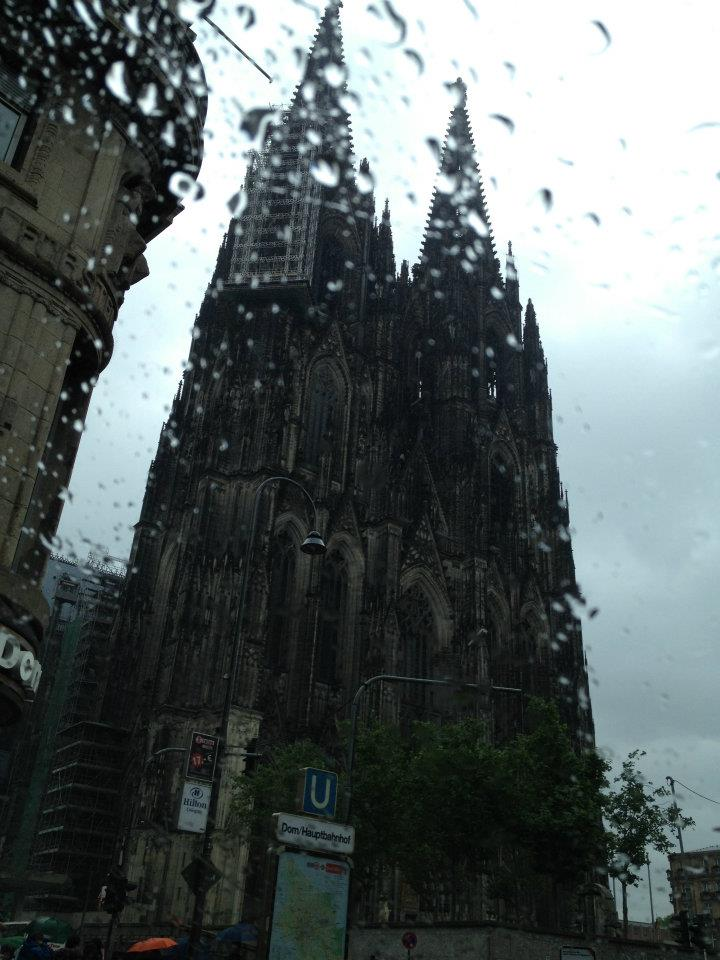
**이미지 캡션:** 이 사진은 비 오는 날, 쾰른 대성당을 배경으로 찍은 것으로 보인다. 사진은 창문을 통해 촬영되었으며, 창문에 맺힌 빗방울들이 시야를 흐릿하게 만들고 있다. 거대한 쾰른 대성당은 어두운 색조의 석조 건물로, 첨탑이 하늘을 향해 솟아 있으며 고딕 양식의 복잡한 건축 양식을 보여준다. 대성당 왼쪽에는 다른 건물들이 보이며, 일부는 공사 중인 듯 비계가 설치되어 있다. 사진 하단에는 "Dom/Hauptbahnhof"라고 적힌 표지판이 보이며, 이는 쾰른 대성당과 중앙역 근처임을 나타낸다. 몇몇 사람들은 우산을 쓰고 거리를 걷고 있으며, 이는 비가 내리고 있음을 다시 한번 보여준다. 전반적으로 흐린 날씨와 빗방울로 인해 차분하고 약간은 우울한 분위기를 자아낸다.

### 6월 26일 (화) 15:45 · 📷 앨범: Wuppertal Zoo (39장)

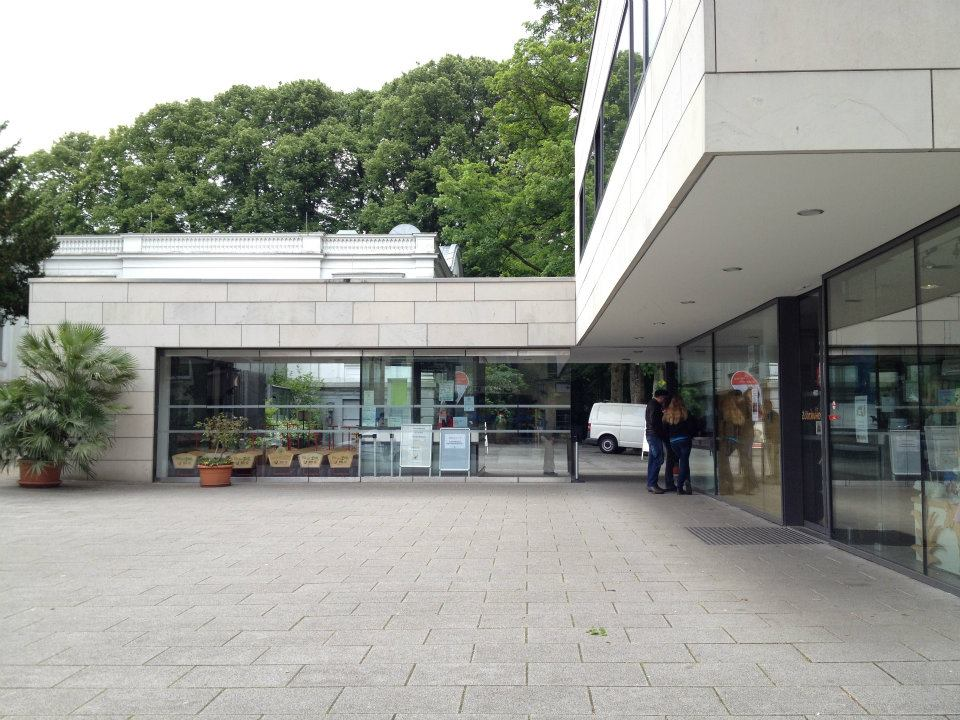
**이미지 캡션:** 넓은 회색 타일로 포장된 보도에 현대적인 건물이 서 있고, 건물 앞쪽에는 큰 유리창이 있어 내부가 보이며, 창가에는 여러 개의 화분이 놓여 있습니다. 건물 왼쪽에는 야자수 화분이 있고, 건물 뒤로는 울창한 나무들이 보입니다. 건물 오른쪽에는 두 명의 성인이 서 있는데, 한 명은 검은색 재킷과 청바지를 입은 성인 남성이고 다른 한 명은 파란색 재킷과 검은색 바지를 입은 성인 여성으로 보이며, 두 사람은 서로 마주보고 서서 대화하는 듯한 모습입니다. 건물 앞쪽에는 흰색 밴이 주차되어 있습니다. 전반적으로 차분하고 현대적인 분위기의 야외 공간입니다.
 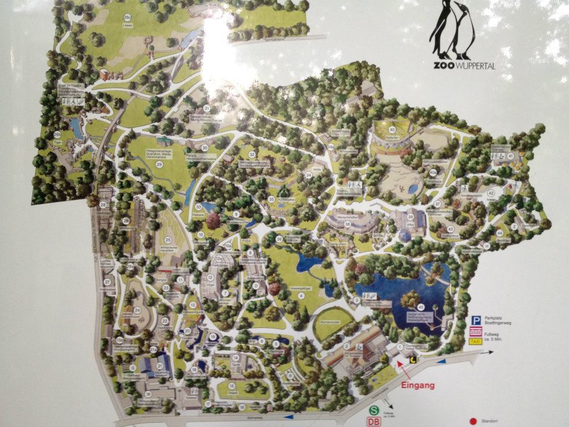
**이미지 캡션:** 이것은 부퍼탈 동물원의 지도이며, 다양한 동물 서식지와 시설을 보여주는 상세한 그림입니다. 지도는 녹색의 나무가 우거진 풍경과 푸른 물웅덩이, 그리고 구불구불한 산책로를 특징으로 합니다. 지도에는 1번부터 45번까지 번호가 매겨진 다양한 구역이 표시되어 있으며, 각 구역은 특정 동물이나 시설을 나타냅니다. 예를 들어, 28c 구역은 사자를, 29번 구역은 파타고니아 해양 동물원을, 40번 구역은 맹금류를 나타냅니다. 지도 상단에는 두 마리의 펭귄 실루엣과 함께 "ZOO WUPPERTAL"이라는 로고가 있습니다. 또한, 지도 오른쪽 하단에는 주차장, 택시 승강장, 그리고 "Eingang"(입구)이라는 표지판이 표시되어 있습니다. 전반적으로 지도는 방문객에게 동물원의 레이아웃과 편의 시설에 대한 명확한 개요를 제공합니다.
 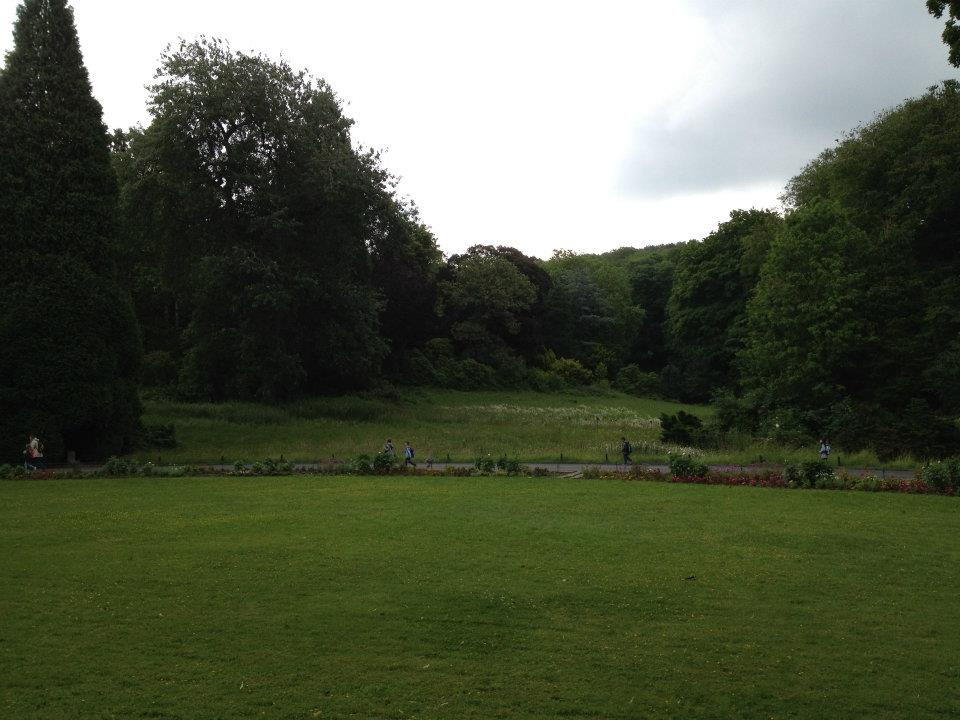
**이미지 캡션:** 넓은 잔디밭이 펼쳐진 공원에서 한 명의 성인 여성이 연한 색상의 옷을 입고 산책로를 따라 걷고 있으며, 그 뒤로 두 명의 성인 남성이 나란히 걷고 있고, 또 다른 성인 남성이 혼자 산책로를 따라 걷고 있다. 배경에는 울창한 나무들과 숲이 우거져 있으며, 하늘은 구름이 낀 흐린 날씨를 보이고 있다. 산책로 주변에는 붉은색과 분홍색 꽃들이 심어져 있어 공원에 생기를 더하고 있다. 전반적으로 평화롭고 자연 친화적인 분위기를 자아낸다.
 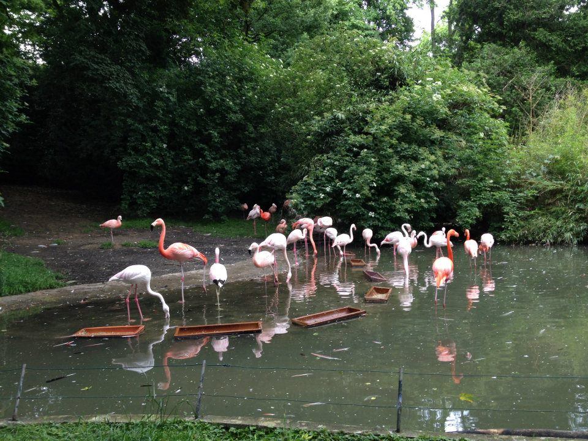
**이미지 캡션:** 이 사진은 여러 마리의 홍학이 연못에서 먹이를 찾거나 휴식을 취하고 있는 모습을 담고 있습니다. 연못에는 얕은 물이 흐르고 있으며, 물 위에는 몇 개의 갈색 먹이통이 떠 있습니다. 홍학들은 주로 분홍색과 흰색 깃털을 가지고 있으며, 긴 목과 다리가 특징입니다. 일부 홍학은 물속에 서서 머리를 숙여 먹이를 찾고 있고, 다른 홍학들은 서 있거나 물 위를 걷고 있습니다. 배경에는 울창한 녹색 나무와 덤불이 우거져 있어 자연스러운 서식지를 연상시킵니다. 연못 가장자리에는 잔디와 흙이 보이며, 멀리 보이는 나무들은 숲을 이루고 있습니다. 사진은 전반적으로 평화롭고 자연적인 분위기를 자아냅니다.
 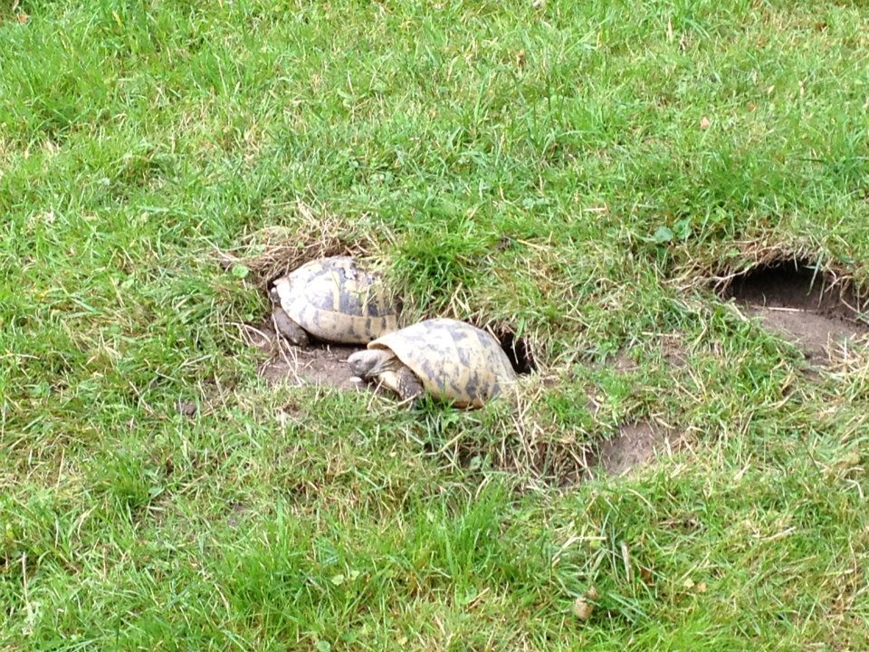
**이미지 캡션:** 푸른 잔디밭에 두 마리의 거북이가 보인다. 왼쪽 거북이는 흙으로 파인 굴 입구에 몸을 반쯤 넣고 있으며, 등껍질은 갈색과 베이지색이 섞인 무늬를 띠고 있다. 오른쪽 거북이는 굴에서 나와 잔디밭을 향하고 있으며, 마찬가지로 갈색과 베이지색의 등껍질을 가지고 있다. 거북이들은 특별한 표정이나 행동을 보이지 않고 자연스러운 모습이다. 배경은 햇볕이 비추는 듯한 밝은 잔디밭이며, 거북이들이 숨거나 나올 수 있는 여러 개의 작은 굴들이 보인다. 전체적으로 평화롭고 자연스러운 야외 풍경을 담고 있다.
 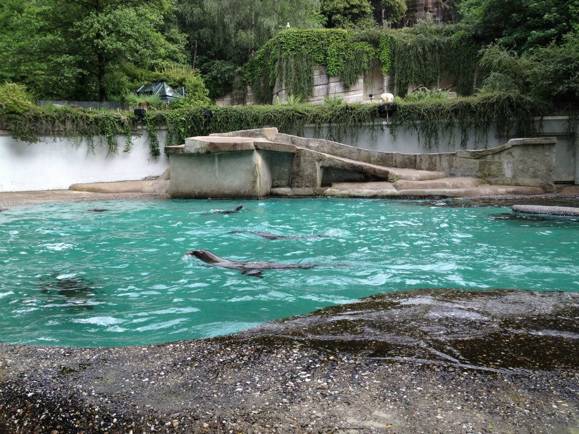
**이미지 캡션:** 이 사진은 동물원의 물개 서식지를 보여줍니다. 맑고 푸른 물이 가득 찬 수영장에는 여러 마리의 물개가 헤엄치고 있습니다. 한 마리의 물개는 카메라를 향해 헤엄쳐 오고 있으며, 다른 물개들은 물속에서 유영하거나 수면 위로 머리만 내밀고 있습니다. 수영장 주변으로는 콘크리트 구조물과 계단식 경사면이 보이며, 이는 물개가 물 밖으로 나와 휴식을 취하거나 이동할 수 있는 공간을 제공합니다. 배경에는 울창한 녹색 식물들이 우거져 있으며, 이는 자연스러운 환경을 연출합니다. 수영장 가장자리에는 젖은 자갈과 흙이 깔려 있어 사실적인 느낌을 더합니다. 전반적으로 평화롭고 자연스러운 분위기를 자아내는 사진입니다.
 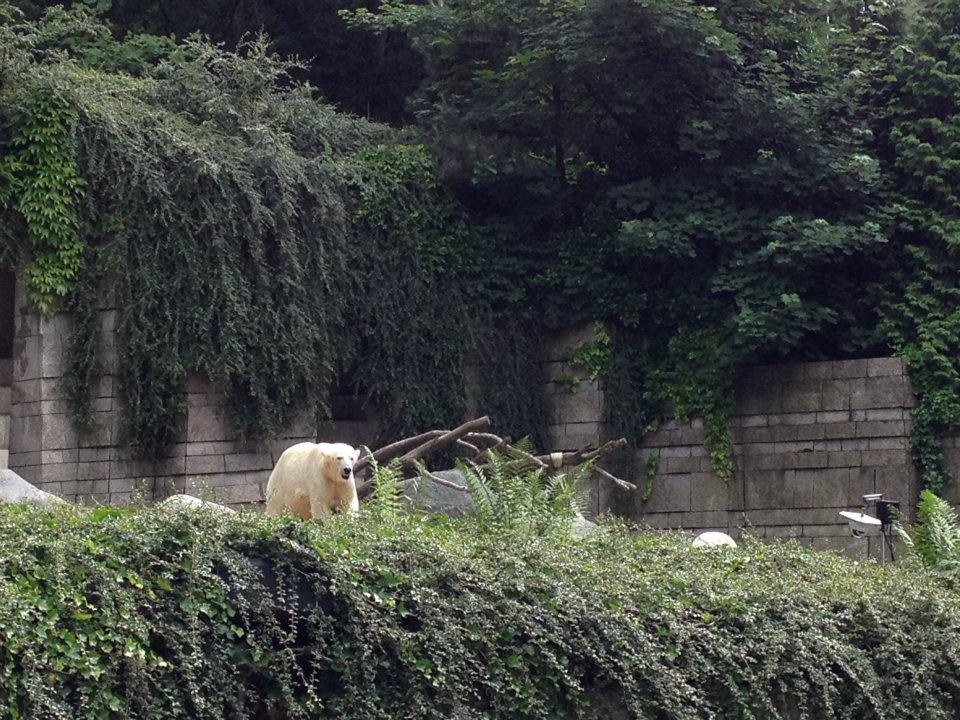
**이미지 캡션:** 이 사진은 울창한 녹색 식물로 뒤덮인 돌담을 배경으로 서 있는 북극곰 한 마리를 보여줍니다. 북극곰은 중간 크기의 성체로, 하얀 털을 가지고 있으며, 약간 앞으로 기울어진 자세로 카메라를 응시하고 있습니다. 표정은 무표정하거나 약간 경계하는 듯 보입니다. 북극곰 주변에는 덤불과 나뭇가지들이 흩어져 있어 자연스러운 서식지를 연상시킵니다. 배경의 돌담은 오래된 건축물처럼 보이며, 담쟁이덩굴과 다른 식물들이 벽을 타고 자라나고 있습니다. 사진의 전체적인 분위기는 평화롭고 자연적이며, 동물원의 전시 공간이나 자연 서식지의 일부를 담고 있는 것으로 보입니다.
 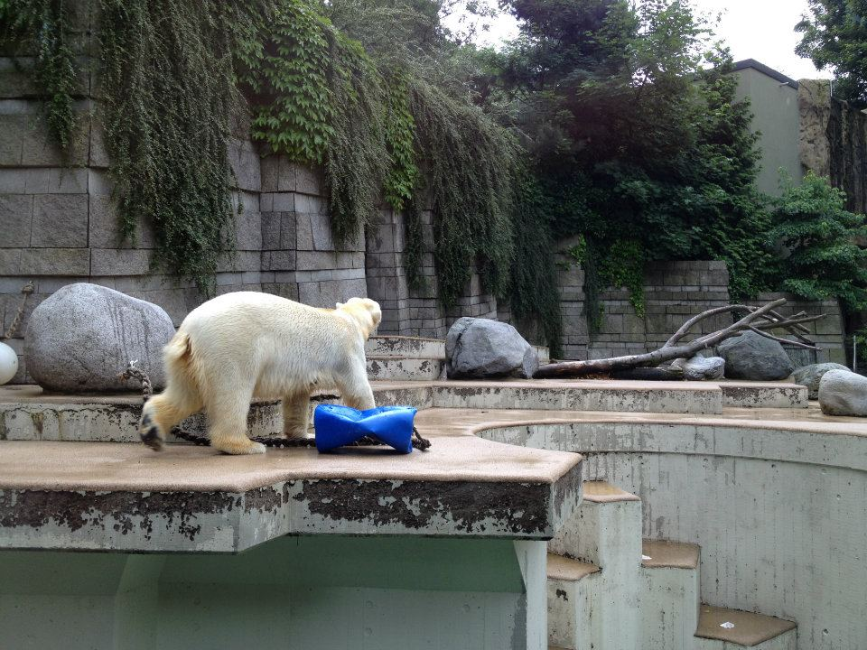
**이미지 캡션:** 이 사진은 야외 동물원 우리 안에서 북극곰 한 마리가 파란색 장난감을 끌고 가는 모습을 담고 있습니다. 북극곰은 성인으로 보이며, 흰색 털을 가지고 있고, 네 발로 걷고 있습니다. 곰은 장난감을 향해 몸을 돌리고 있으며, 표정은 명확하게 보이지 않습니다. 배경에는 돌담과 무성한 녹색 식물이 있으며, 이는 자연스러운 환경을 연출하려는 의도로 보입니다. 또한, 여러 개의 큰 바위와 쓰러진 나뭇가지가 놓여 있어 곰의 서식지를 재현한 듯한 느낌을 줍니다. 콘크리트 구조물과 계단도 보이며, 이는 우리 시설의 일부임을 나타냅니다. 전반적으로 차분하고 자연스러운 분위기이며, 곰이 장난감을 가지고 놀며 시간을 보내는 듯한 모습입니다.
 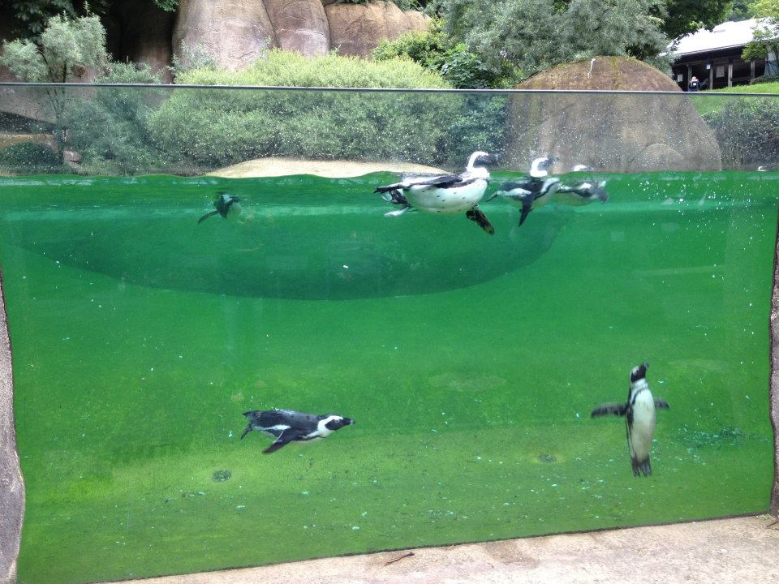
**이미지 캡션:** 이 사진은 동물원의 펭귄 수족관을 보여줍니다. 수족관은 투명한 유리로 되어 있으며, 안에는 맑고 푸른 물이 가득 차 있습니다. 물속에는 여러 마리의 펭귄들이 헤엄치고 있습니다. 한 마리는 수면 가까이에서 헤엄치고 있고, 다른 한 마리는 물속 깊은 곳에서 유유히 떠다니고 있습니다. 또 다른 펭귄은 수면 위에서 물갈퀴를 펼치고 있는 듯한 모습입니다. 수족관 밖으로는 울창한 나무와 바위가 보이며, 멀리 건물도 희미하게 보입니다. 전체적으로 평화롭고 자연적인 분위기를 자아냅니다.
 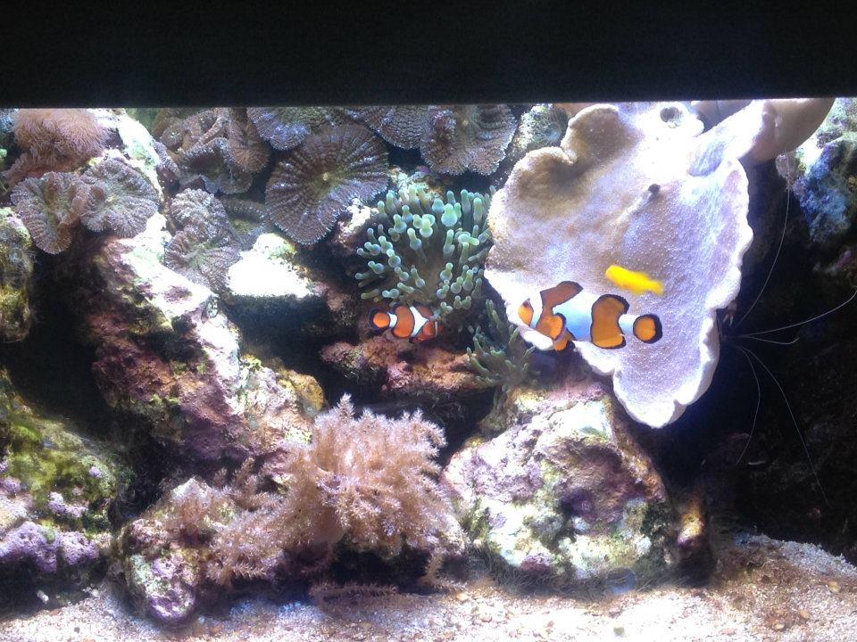
**이미지 캡션:** 수족관 안에서 두 마리의 흰동가리 물고기가 산호초와 말미잘 사이를 헤엄치고 있으며, 한 마리는 주황색, 흰색, 검은색 줄무늬를 띠고 다른 한 마리는 노란색입니다. 수족관 바닥에는 모래가 깔려 있고, 다양한 종류의 산호와 말미잘이 풍성하게 자라고 있습니다. 수족관의 조명은 밝고 푸른빛을 띠며, 전체적으로 생기 넘치고 평화로운 분위기를 자아냅니다.
 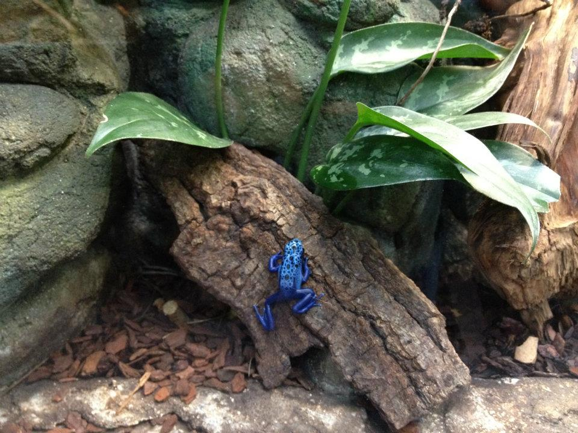
**이미지 캡션:** 이 사진은 열대 우림의 한 장면을 담고 있으며, 밝은 파란색과 검은색 점무늬를 가진 작은 독화살개구리 한 마리가 썩은 나무 조각 위에 앉아 있습니다. 개구리는 네 발을 모두 땅에 딛고 있으며, 몸은 약간 앞으로 기울어져 있습니다. 배경에는 크고 거친 질감의 바위와 짙은 갈색의 썩은 나무, 그리고 잎이 무성한 식물들이 보입니다. 바위는 녹색 이끼로 덮여 있고, 나무 조각은 거칠고 울퉁불퉁한 표면을 가지고 있습니다. 식물의 잎은 짙은 녹색이며, 흰색 또는 연한 녹색의 반점이 있습니다. 바닥에는 붉은색의 나무 껍질 조각들이 깔려 있습니다. 전체적으로 습하고 자연적인 환경의 분위기를 연출하며, 개구리의 선명한 색상이 어두운 배경과 대비를 이룹니다.
 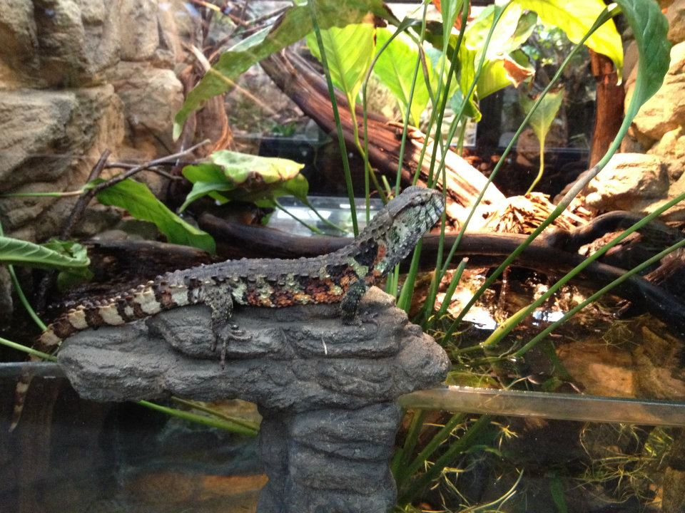
**이미지 캡션:** 이 사진은 열대 우림 환경을 재현한 수족관이나 테라리움 안에서 바위 위에 앉아 있는 도마뱀을 보여줍니다. 도마뱀은 회색, 갈색, 녹색, 주황색이 섞인 복잡한 패턴의 비늘을 가지고 있으며, 꼬리에는 뚜렷한 흰색과 갈색 줄무늬가 있습니다. 도마뱀은 몸을 약간 구부리고 있으며, 네 발 모두 바위 위에 단단히 고정되어 있습니다. 주변 배경에는 굵은 나뭇가지, 잎이 무성한 식물, 그리고 물이 담긴 작은 연못이 보입니다. 돌은 거칠고 자연스러운 질감을 가지고 있으며, 식물들은 생기 넘치고 푸릅니다. 전체적인 분위기는 평화롭고 자연스러우며, 도마뱀이 자신의 서식지에서 편안하게 휴식을 취하고 있는 듯한 느낌을 줍니다.
 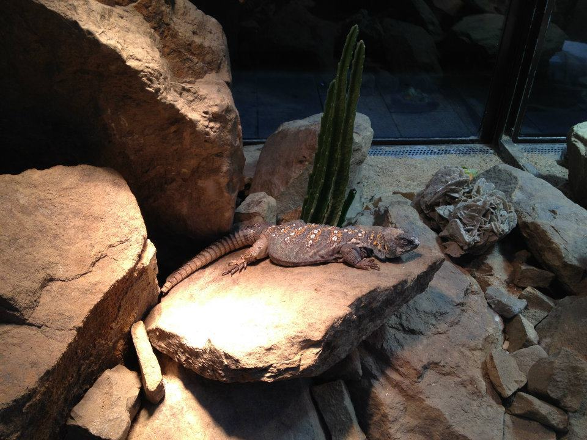
**이미지 캡션:** 이 사진은 사막 환경을 재현한 전시 공간에 있는 도마뱀을 보여줍니다. 사진 중앙에는 회색빛 피부에 주황색 점이 박힌 도마뱀이 바위 위에 앉아 있습니다. 도마뱀은 몸을 길게 뻗고 있으며, 꼬리는 굵고 줄무늬가 있습니다. 도마뱀의 표정은 알 수 없지만, 편안해 보입니다. 도마뱀 주변에는 크고 작은 바위들이 놓여 있으며, 바위 위에는 사막에서 볼 수 있는 선인장과 사막 장미 모양의 광물 결정이 보입니다. 배경에는 어두운 유리창이 있고, 창밖으로는 희미하게 다른 전시 공간이나 시설이 보이는 듯합니다. 전체적으로 따뜻한 조명이 비추고 있어 아늑하고 건조한 사막의 분위기를 연출하고 있습니다.
 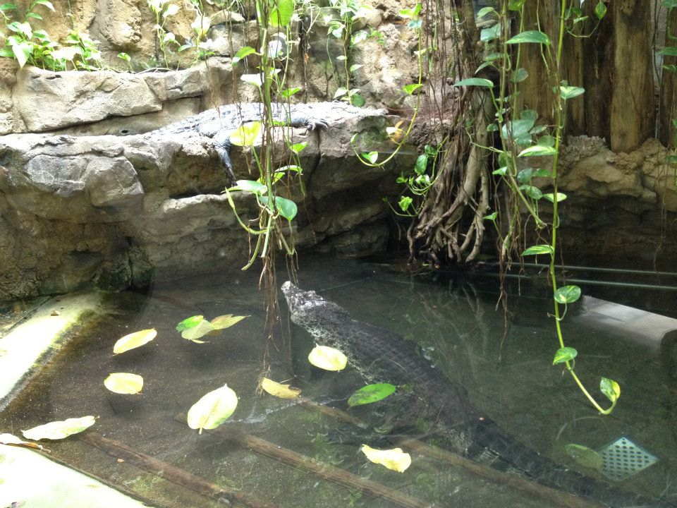
**이미지 캡션:** 이 사진은 자연스러운 환경을 재현한 동물원이나 수족관의 악어 서식지를 보여줍니다. 서식지에는 바위와 흙으로 이루어진 벽, 그리고 물이 담긴 연못이 있습니다. 연못 위로는 덩굴 식물이 드리워져 있어 울창한 느낌을 줍니다. 연못 안에는 두 마리의 악어가 보입니다. 한 마리는 바위 위에 올라가 휴식을 취하고 있고, 다른 한 마리는 물속에서 헤엄치고 있습니다. 물 위에는 몇 개의 나뭇잎이 떠 있습니다. 전체적으로 평화롭고 자연적인 분위기를 연출하고 있습니다.
 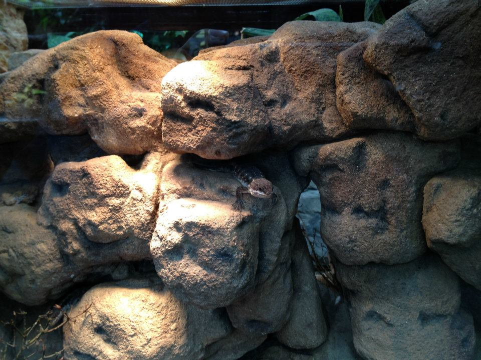
**이미지 캡션:** 이 사진은 인공적으로 조성된 바위 동굴 안에서 휴식을 취하고 있는 도마뱀 한 마리를 보여줍니다. 도마뱀은 회갈색 피부에 검은색 반점이 있으며, 머리를 살짝 들고 카메라를 응시하고 있습니다. 도마뱀은 바위 틈새에 몸을 숨기고 있으며, 주변은 흙과 작은 나뭇가지들로 이루어져 있습니다. 바위는 다양한 크기와 모양으로 쌓여 있으며, 일부 바위에는 조명이 비춰져 질감이 강조되고 있습니다. 전체적으로 자연스러운 환경을 연출한 듯한 분위기이며, 도마뱀의 모습이 돋보입니다.
 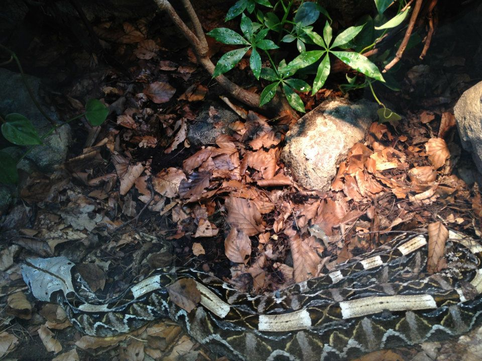
**이미지 캡션:** 이 사진은 숲 바닥에 엎드려 있는 거대한 독사 한 마리를 보여줍니다. 뱀은 짙은 갈색, 검은색, 흰색의 복잡한 패턴을 가지고 있으며, 잎사귀와 흙으로 덮인 숲 바닥에 거의 완벽하게 위장되어 있습니다. 뱀의 머리는 잎사귀에 가려져 있지만, 몸통의 두꺼운 부분과 독특한 비늘 패턴이 뚜렷하게 보입니다. 배경에는 젖은 잎사귀, 나뭇가지, 바위가 흩어져 있으며, 일부 식물은 잎에 물방울이 맺혀 있습니다. 조명은 어둡고 자연스러워 숲의 깊은 곳에 있는 듯한 분위기를 자아냅니다. 뱀은 움직이지 않고 조용히 엎드려 있어 위협적이면서도 신비로운 느낌을 줍니다.
 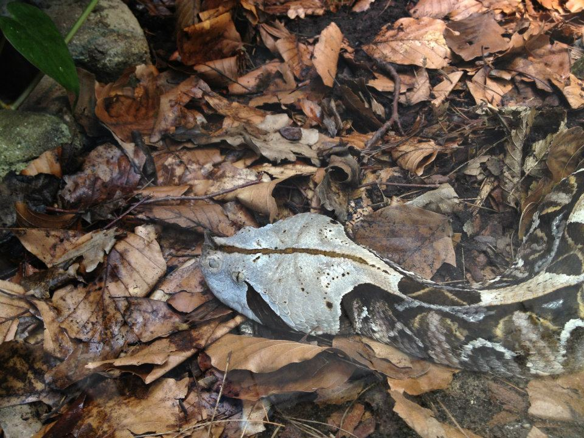
**이미지 캡션:** 이 사진은 숲 바닥에 엎드려 있는 독사 한 마리를 클로즈업하여 보여줍니다. 뱀의 머리는 은회색이고, 눈은 보이지 않으며, 혀는 튀어나와 있지 않습니다. 몸통은 갈색, 검은색, 흰색의 복잡한 패턴으로 덮여 있으며, 잎사귀와 흙으로 이루어진 배경에 거의 완벽하게 위장되어 있습니다. 뱀은 움직이지 않고 있으며, 주변 환경과 조화를 이루고 있어 위협적인 분위기를 자아냅니다. 사진은 자연스러운 조명 아래 촬영되었으며, 뱀의 질감과 주변 환경의 디테일을 생생하게 담고 있습니다.
 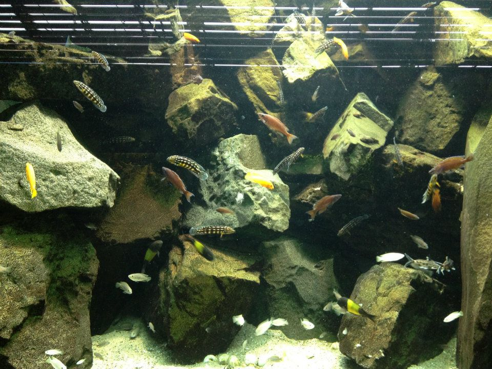
**이미지 캡션:** 이 사진은 수족관 안에서 여러 마리의 물고기들이 헤엄치고 있는 모습을 담고 있습니다. 수족관 안에는 다양한 크기와 색깔의 물고기들이 있으며, 일부는 노란색, 주황색, 검은색, 흰색 등 밝은 색을 띠고 있습니다. 물고기들은 주로 수족관 중앙과 하단 부분에 모여 있으며, 일부는 바위 틈새나 수초 사이를 유영하고 있습니다. 수족관 배경에는 크고 작은 바위들이 쌓여 있으며, 바위 표면에는 이끼가 끼어 있어 자연스러운 환경을 연출하고 있습니다. 수족관 상단에는 조명이 설치되어 있어 물고기들의 모습을 밝게 비추고 있습니다. 전반적으로 평화롭고 생동감 넘치는 수족관의 모습을 보여줍니다.
 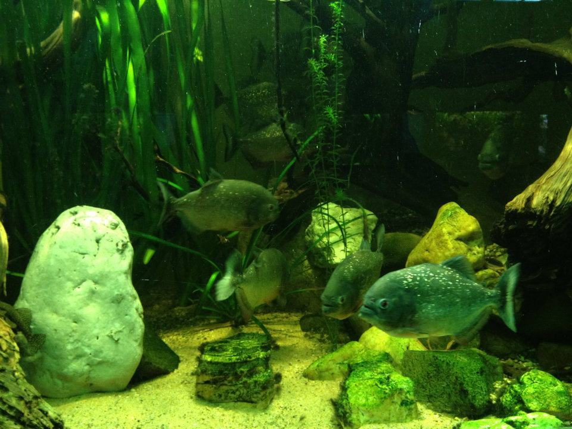
**이미지 캡션:** 이 사진은 수족관 안의 모습으로, 여러 마리의 물고기들이 헤엄치고 있으며, 수초와 돌들이 배경을 이루고 있습니다. 사진 중앙에는 은회색 빛을 띠는 물고기 한 마리가 가장 선명하게 보이며, 몸통에는 흰색 점들이 박혀 있고 지느러미는 옅은 회색입니다. 이 물고기는 입을 살짝 벌리고 있으며, 눈은 검은색입니다. 그 뒤쪽으로도 비슷한 종류의 물고기들이 여러 마리 보이며, 일부는 흐릿하게 찍혔습니다. 수족관의 왼쪽에는 크고 하얀 돌이 놓여 있고, 그 주변으로도 녹색 수초들이 무성하게 자라 있습니다. 바닥은 모래로 덮여 있으며, 곳곳에 녹색 이끼가 낀 돌들이 흩어져 있습니다. 수족관의 오른쪽에는 나무 조각으로 보이는 큰 물체가 있어 자연스러운 분위기를 더합니다. 전체적으로 어두운 녹색 톤의 조명 아래에서 물고기들이 유영하는 모습이 신비롭고 평화로운 분위기를 자아냅니다.
 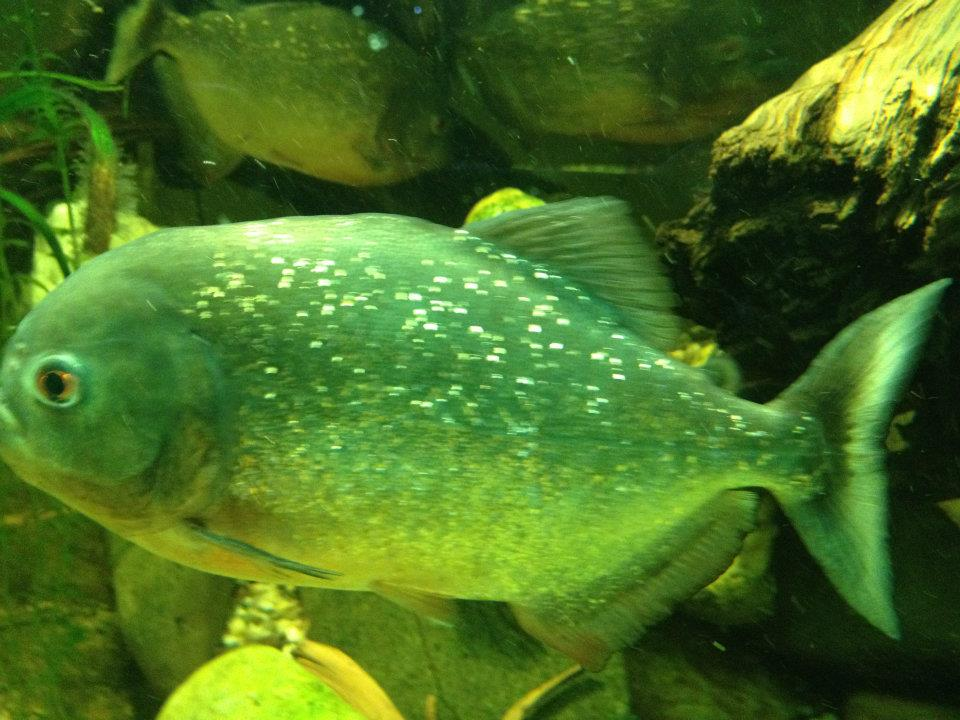
**이미지 캡션:** 이 사진은 수족관 안에서 촬영된 것으로 보이며, 초록색을 띤 물고기 한 마리가 화면 중앙을 차지하고 있습니다. 이 물고기는 몸통에 흰색 점들이 흩뿌려져 있으며, 눈은 붉은색을 띠고 있습니다. 물고기는 왼쪽을 향해 헤엄치고 있는 듯하며, 지느러미는 옅은 녹색을 띠고 있습니다. 배경에는 다른 물고기들이 흐릿하게 보이고, 수초와 나무 조각으로 보이는 사물들이 어우러져 있습니다. 전체적으로 어두운 수족관 환경 속에서 물고기의 모습이 부각되어 보이며, 약간 흐릿한 초점과 물속의 빛 반사로 인해 몽환적인 분위기를 자아냅니다.
 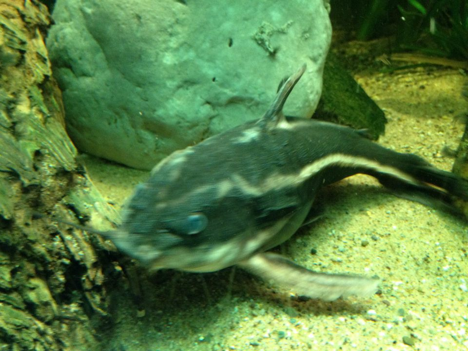
**이미지 캡션:** 수족관 바닥에 있는 물고기 한 마리가 모래와 돌로 된 배경에 있습니다. 물고기는 어두운 회색 몸통에 흰색 줄무늬가 있고, 눈은 파란색입니다. 물고기는 몸을 구부리고 있으며, 지느러미는 펼쳐져 있습니다. 배경에는 큰 돌과 녹색 식물이 보입니다. 전체적으로 수중 환경의 자연스러운 모습을 담고 있습니다.
 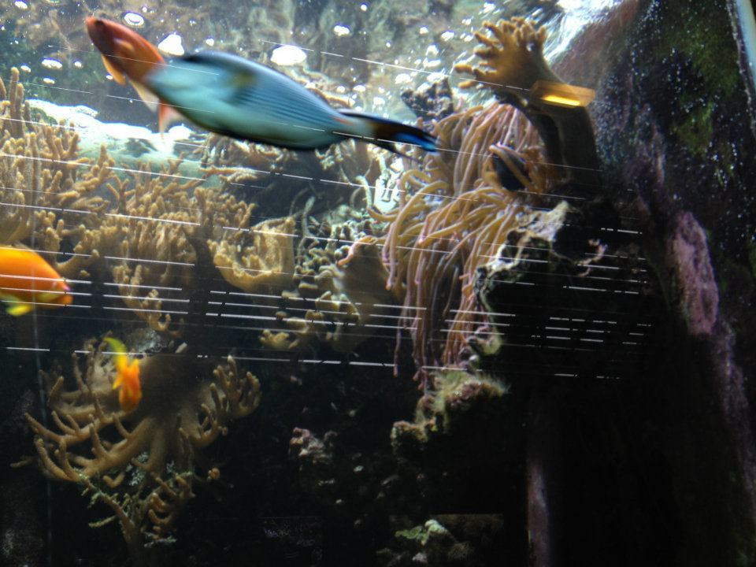
**이미지 캡션:** 수족관 안에서 여러 마리의 물고기들이 헤엄치고 있으며, 그중 한 마리는 푸른색과 주황색이 섞인 몸통에 붉은 머리를 가지고 있고, 다른 한 마리는 선명한 주황색을 띠고 있습니다. 수족관 안에는 다양한 산호와 해초들이 자라고 있으며, 물속에는 기포들이 떠다니고 있습니다. 수족관 유리창에는 가로로 흰색 줄무늬가 여러 개 보입니다. 전반적으로 생동감 넘치는 수중 환경을 보여주는 모습입니다.
 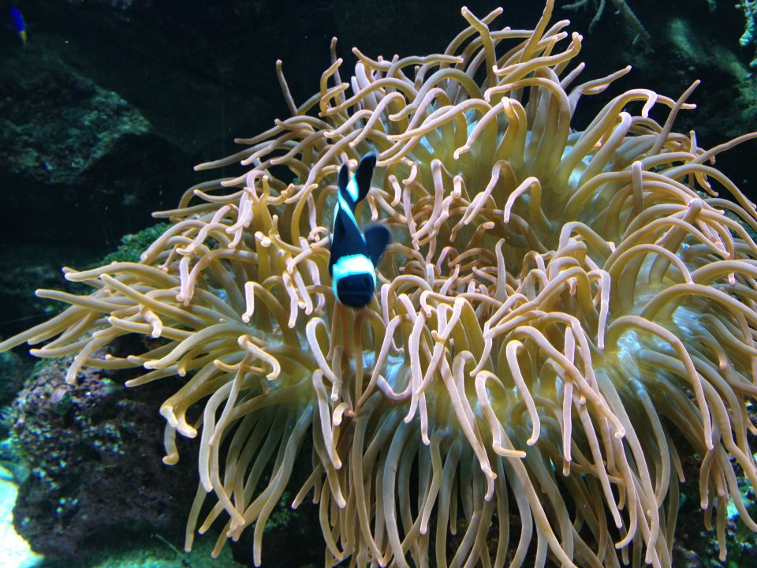
**이미지 캡션:** 이 사진은 수족관에서 찍은 것으로 보이며, 중앙에는 크고 풍성한 말미잘이 자리 잡고 있습니다. 말미잘은 연한 베이지색 촉수를 수없이 뻗고 있으며, 촉수 끝부분은 약간 더 밝은 색을 띠고 있습니다. 말미잘의 중심부에는 푸른빛이 은은하게 비칩니다. 말미잘의 촉수 사이에는 검은색과 흰색 줄무늬가 선명한 작은 물고기 한 마리가 보입니다. 이 물고기는 말미잘과 공생 관계를 맺고 있는 것으로 추정되며, 말미잘의 촉수 사이에 안전하게 숨어 있는 듯한 모습입니다. 배경은 어둡고 흐릿하며, 왼쪽에는 녹색 해초와 바위가 희미하게 보입니다. 전체적으로 물속의 신비롭고 평화로운 분위기를 자아냅니다.
 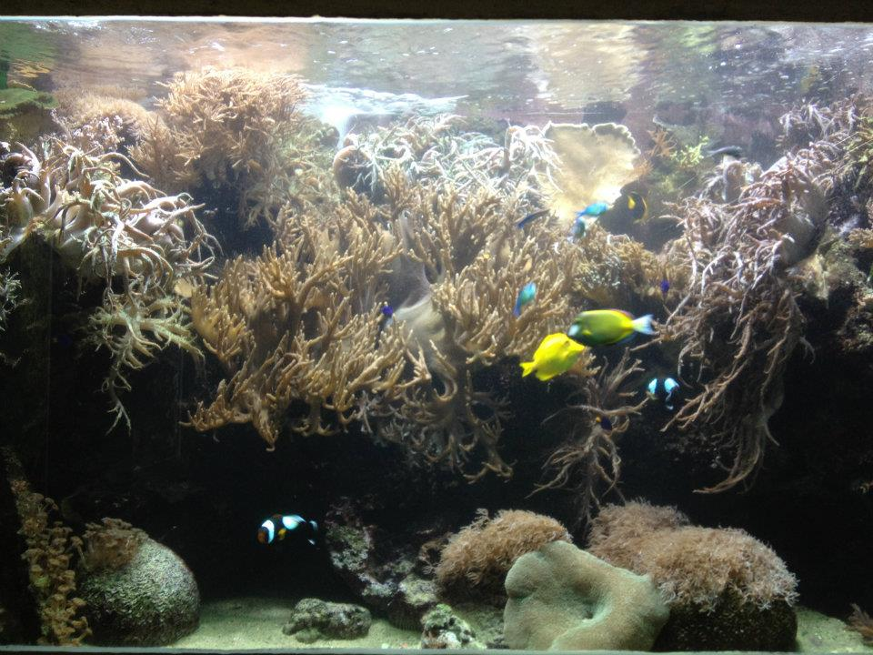
**이미지 캡션:** 이 사진은 수족관 내부를 보여주며, 다양한 산호와 열대어들이 서식하고 있다. 수족관의 배경은 어둡고 복잡한 산호 구조물로 이루어져 있으며, 일부 산호는 갈색과 베이지색을 띠고 있다. 수족관 안에는 여러 마리의 물고기가 헤엄치고 있는데, 노란색 물고기 두 마리가 중앙에서 눈에 띄며, 흰색, 검은색, 주황색 줄무늬가 있는 흰동가리 한 마리가 왼쪽 아래에서 보인다. 또한, 파란색과 녹색을 띤 작은 물고기들도 여러 마리 관찰된다. 수족관 바닥에는 모래와 작은 바위들이 깔려 있으며, 몇 개의 큰 산호 조각들도 보인다. 전체적으로 평화롭고 생기 넘치는 수중 생태계의 모습을 담고 있다.
 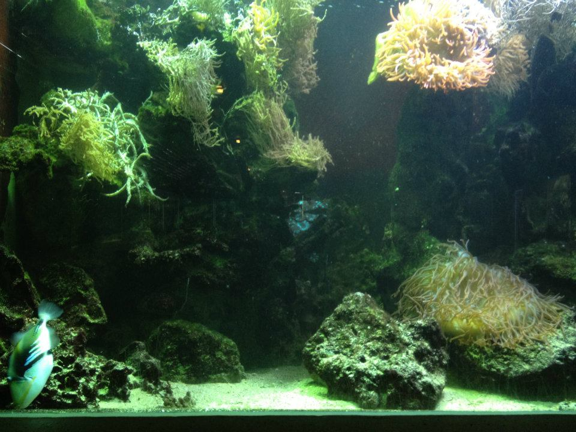
**이미지 캡션:** 수족관 안에는 다양한 산호와 해초, 그리고 한 마리의 열대어가 보인다. 수족관의 바닥은 모래로 덮여 있으며, 곳곳에 바위와 산호들이 자리 잡고 있다. 수족관의 왼쪽 하단에는 흰색과 검은색 줄무늬가 있는 열대어 한 마리가 헤엄치고 있으며, 오른쪽 상단에는 노란색의 풍성한 산호가 보인다. 수족관 전체적으로 푸른빛과 녹색빛이 감돌며, 마치 바닷속 풍경을 그대로 옮겨 놓은 듯한 신비로운 분위기를 자아낸다.
 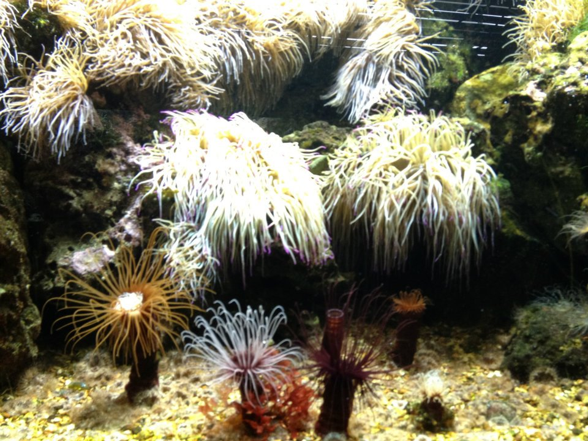
**이미지 캡션:** 이 사진은 수족관의 바닥을 보여주며, 다양한 종류의 말미잘들이 바위와 모래 위에 자리 잡고 있다. 사진 중앙에는 크고 하얀 말미잘들이 빽빽하게 솟아 있으며, 그 끝부분에는 보라색이 살짝 보인다. 왼쪽 아래에는 주황색의 별 모양 말미잘이 뚜렷하게 보이고, 그 옆으로는 하얀색의 말미잘이 갓 피어난 꽃처럼 펼쳐져 있다. 오른쪽에는 짙은 자주색의 말미잘이 뾰족한 촉수를 뻗고 있으며, 그 뒤로도 여러 개의 말미잘들이 보인다. 배경에는 어두운 색의 바위와 녹색의 해초들이 어우러져 있으며, 수족관 바닥에는 작은 조약돌과 모래가 깔려 있다. 전체적으로 차분하고 신비로운 분위기를 자아내며, 해양 생물의 다채로운 모습을 담고 있다.
 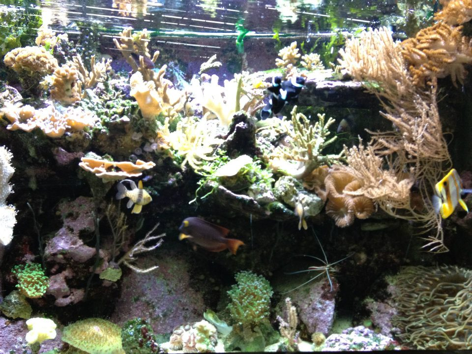
**이미지 캡션:** 이 사진은 다양한 산호와 해양 생물로 가득 찬 수중 수족관의 모습을 담고 있습니다. 수족관 안에는 여러 종류의 산호가 서식하고 있으며, 갈색, 흰색, 노란색 등 다양한 색상과 모양을 띠고 있습니다. 특히, 굵고 가지가 많은 산호와 얇고 섬세한 산호들이 조화를 이루고 있습니다. 수족관 바닥에는 다양한 크기와 색깔의 돌들이 놓여 있으며, 일부 돌에는 초록색 해초가 붙어 있습니다. 여러 마리의 물고기들이 수족관을 헤엄치고 있는데, 검은색과 흰색 줄무늬가 있는 물고기, 노란색과 흰색 줄무늬가 있는 물고기, 그리고 짙은 색의 물고기 등이 보입니다. 또한, 투명한 몸에 긴 다리를 가진 새우 한 마리가 바위 위에 앉아 있는 모습도 관찰됩니다. 수족관의 물은 맑고 투명하며, 위쪽에는 조명이 비추고 있어 전체적으로 밝고 생기 넘치는 분위기를 연출합니다.
 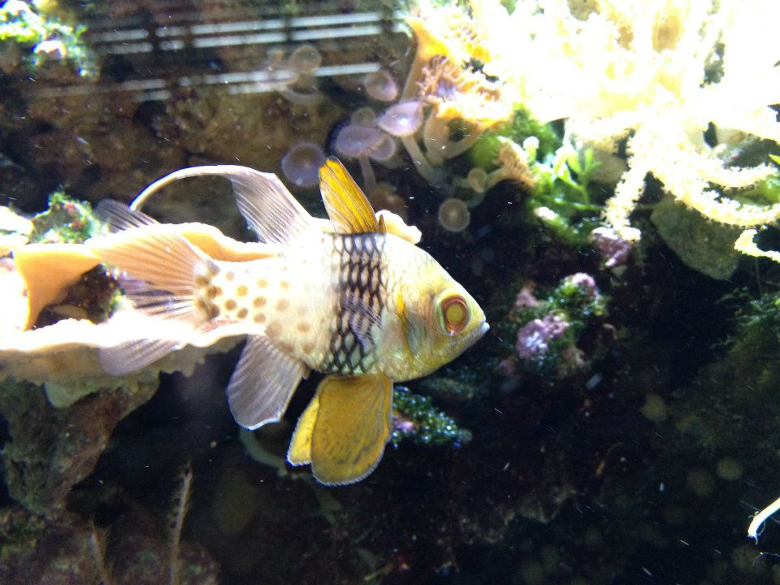
**이미지 캡션:** 수족관 안에서 노란색과 흰색이 섞인 작은 물고기가 헤엄치고 있으며, 물고기의 몸에는 갈색 점이 있고 등에는 검은색 격자무늬가 있습니다. 물고기는 노란색 지느러미를 가지고 있으며, 눈은 크고 붉은색입니다. 물고기 주변에는 산호초, 해초, 작은 조개들이 보이며, 배경은 어둡고 흐릿합니다. 전반적으로 평화롭고 자연적인 분위기입니다.
 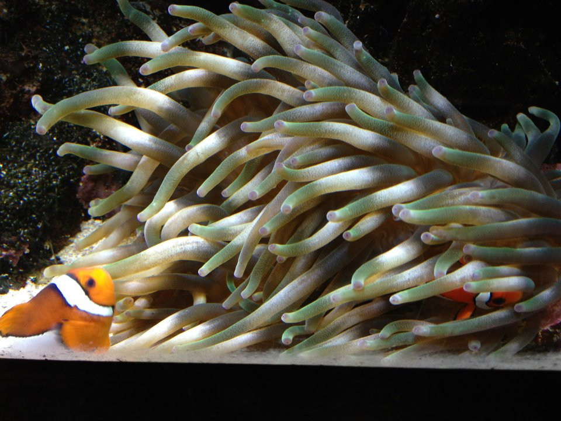
**이미지 캡션:** 수족관 안에서 말미잘의 촉수 사이에 두 마리의 흰동가리 물고기가 보인다. 흰동가리 물고기들은 주황색 몸에 흰색 줄무늬가 있으며, 한 마리는 왼쪽 하단에 전체 모습이 보이고 다른 한 마리는 말미잘 촉수 사이에 숨어 머리 부분만 보인다. 말미잘은 연한 녹색과 흰색이 섞인 촉수들이 빽빽하게 뻗어 있으며, 촉수 끝은 보라색을 띤다. 배경은 어둡고 거친 질감의 암석으로 이루어져 있다. 수족관 바닥은 하얀 모래로 덮여 있다. 전체적으로 평화롭고 자연스러운 수중 환경의 분위기를 자아낸다.
 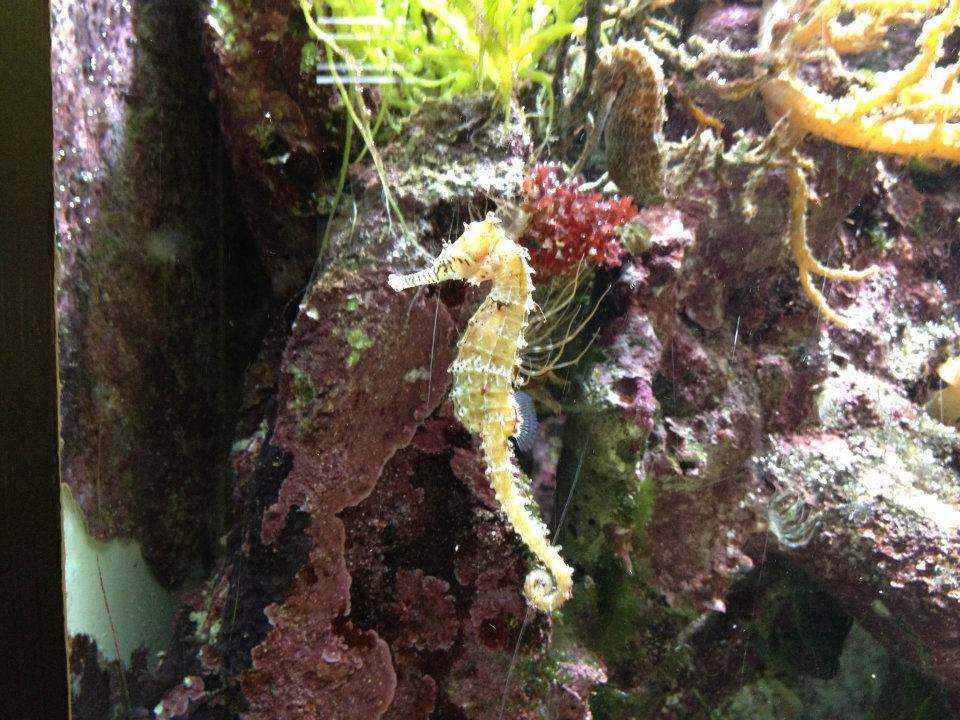
**이미지 캡션:** 수족관 안에서 노란색 해마 한 마리가 수직으로 서서 헤엄치고 있으며, 주변에는 붉은색 산호와 노란색 해초, 그리고 다양한 색깔의 암석과 해조류가 어우러져 있습니다. 해마는 옅은 노란색 몸에 검은색 점들이 박혀 있고, 머리를 위로 향한 채 꼬리를 아래로 늘어뜨리고 있습니다. 배경에는 짙은 갈색과 보라색을 띤 암석들이 복잡하게 얽혀 있으며, 그 위로 푸른색과 녹색의 해조류가 자라고 있습니다. 수족관 유리면에는 물방울이 맺혀 있고, 전체적으로 자연스러운 수중 환경을 연출하고 있습니다.
 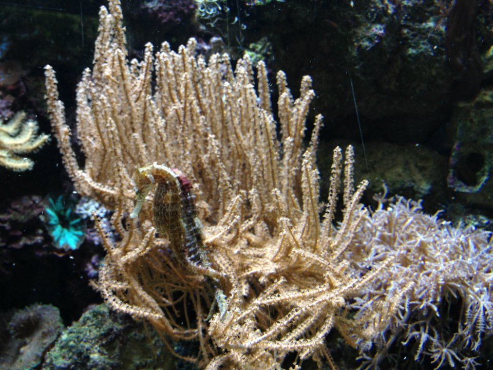
**이미지 캡션:** 수족관 안에서 해마 한 마리가 갈색 산호초에 몸을 감고 있다. 해마는 갈색과 흰색 줄무늬가 있으며, 머리 부분에는 붉은색 줄무늬가 있다. 해마는 꼬리를 산호초에 감고 있으며, 머리는 위쪽을 향하고 있다. 배경에는 다른 종류의 산호초와 암석이 보인다. 전체적으로 어두운 수족관 환경이며, 해마와 산호초에 초점이 맞춰져 있다.
 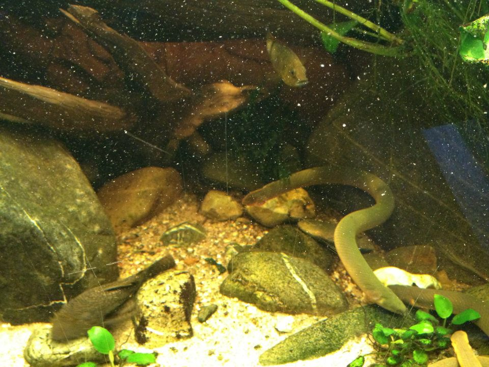
**이미지 캡션:** 수족관 안에서 옅은 갈색의 뱀장어처럼 생긴 물고기 한 마리가 S자 모양으로 구부러져 헤엄치고 있으며, 그 옆에는 짙은 갈색의 또 다른 물고기가 바위 위에 앉아 있다. 수족관 바닥에는 모래와 자갈이 깔려 있고, 여러 개의 돌과 나무 조각이 놓여 있으며, 수초가 일부 보인다. 물속에는 작은 부유물들이 떠다니고 있어 전체적으로 탁한 느낌을 준다.
 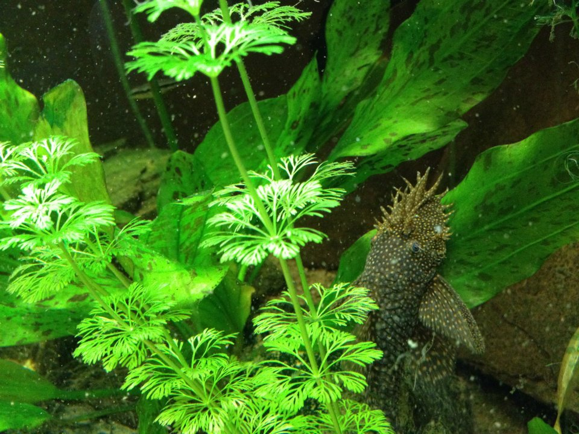
**이미지 캡션:** 수족관 안에서 밝은 녹색의 잎이 무성한 수초들이 화면 중앙을 가득 채우고 있으며, 그 뒤로 짙은 녹색의 넓은 잎을 가진 수초들이 배경을 이루고 있습니다. 수초들 사이에는 짙은 갈색 바탕에 흰색 점무늬가 있는 열대어 한 마리가 보입니다. 이 물고기는 머리 부분에 뾰족한 돌기들이 솟아 있고, 눈은 작고 검은색입니다. 물고기는 수초에 붙어 있거나 그 주변을 유영하는 듯한 모습이며, 전체적으로 수족관의 자연스러운 모습을 담고 있습니다.
 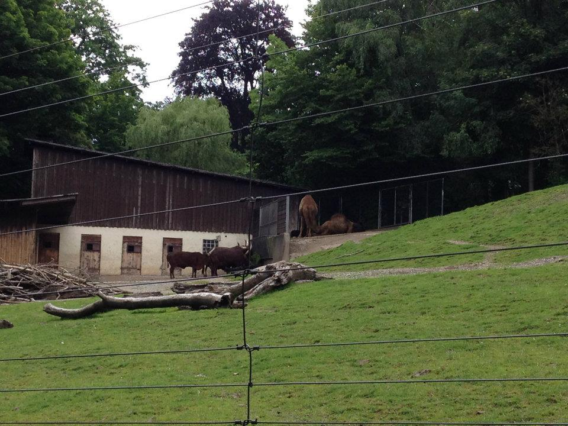
**이미지 캡션:** 이 사진은 동물원의 야외 우리를 보여주며, 짙은 갈색의 털을 가진 두 마리의 소와 낙타 두 마리가 보인다. 왼쪽에는 짙은 갈색의 나무 건물과 그 앞에 쌓인 나뭇가지들이 있으며, 건물에는 여러 개의 문과 창문이 있다. 건물 앞에는 두 마리의 소가 서 있는데, 한 마리는 더 작고 다른 한 마리는 더 크며 뿔이 있다. 오른쪽에는 잔디 언덕이 있고, 언덕 위에는 철망으로 둘러싸인 공간에 낙타 두 마리가 있다. 한 마리는 서 있고 다른 한 마리는 누워 있다. 배경에는 울창한 나무들이 보이며, 하늘은 흐릿하다. 사진 앞쪽에는 잔디밭과 쓰러진 나무가 놓여 있고, 여러 개의 철선이 가로질러 있어 우리임을 암시한다. 전반적으로 평화롭고 자연스러운 분위기를 연출한다.
 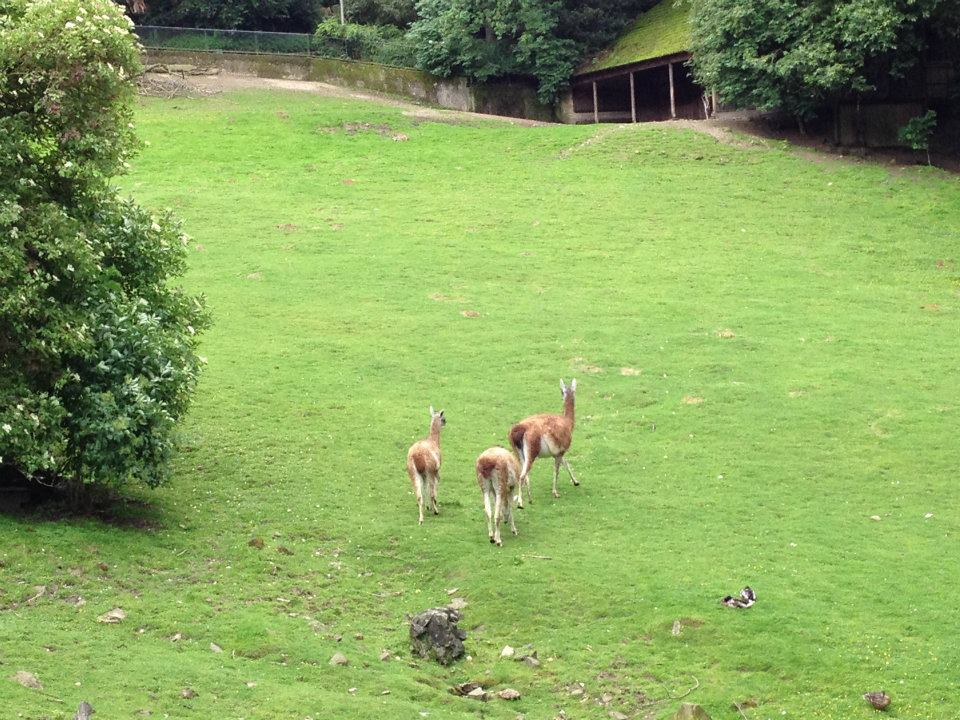
**이미지 캡션:** 넓은 잔디밭에 세 마리의 라마와 두 마리의 오리가 한가롭게 풀을 뜯고 있다. 라마들은 갈색과 흰색 털을 가지고 있으며, 긴 목과 귀를 쫑긋 세우고 있다. 한 마리는 앞을 향해 걸어가고 있고, 다른 두 마리는 서로를 바라보거나 풀을 뜯고 있다. 오리들은 잔디밭 가장자리에서 물을 마시거나 휴식을 취하고 있다. 배경에는 울창한 나무와 숲이 보이며, 언덕 위에는 지붕이 덮인 작은 건물이 있다. 전체적으로 평화롭고 자연적인 분위기를 자아낸다.
 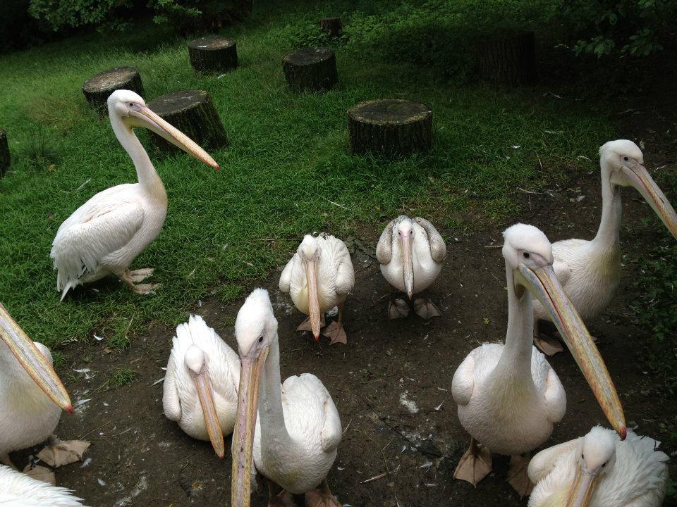
**이미지 캡션:** 이 사진은 여러 마리의 흰색 펠리컨이 잔디밭과 흙이 섞인 땅에 모여 있는 모습을 보여줍니다. 펠리컨들은 대부분 흰색 깃털을 가지고 있으며, 길고 노란색 부리를 가지고 있습니다. 일부 펠리컨은 고개를 숙이고 있거나 주변을 둘러보고 있으며, 특별한 표정이나 행동은 보이지 않습니다. 배경에는 울창한 녹색 식물과 여러 개의 나무 그루터기가 보이며, 햇빛이 나뭇잎 사이로 비쳐 부분적으로 그림자가 드리워져 있습니다. 전체적으로 평화롭고 자연스러운 분위기를 연출하고 있습니다.
 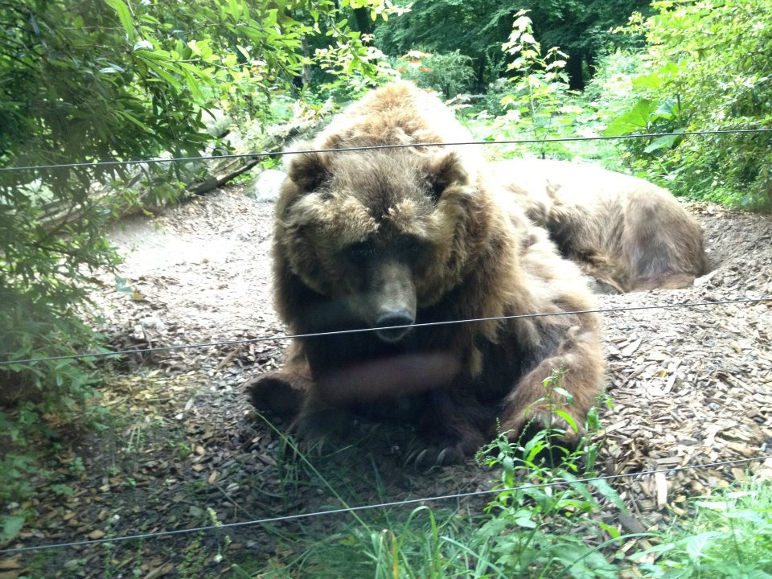
**이미지 캡션:** 이 사진은 울타리 너머로 보이는 곰을 담고 있으며, 곰은 흙과 나무 조각으로 덮인 땅에 앉아 휴식을 취하고 있습니다. 곰은 갈색 털을 가지고 있으며, 얼굴은 약간 앞으로 숙여져 있어 표정을 정확히 파악하기 어렵지만, 편안해 보입니다. 곰의 몸은 굵고 튼튼해 보이며, 앞발은 땅에 닿아 있습니다. 배경에는 울창한 녹색 식물들이 보이며, 숲이나 공원의 일부처럼 보입니다. 사진에는 여러 개의 얇은 철선이 가로로 놓여 있어 곰과 관찰자 사이의 울타리를 나타냅니다. 곰은 웅크리고 앉아 있는 듯한 자세를 취하고 있으며, 다른 곰 한 마리가 뒤쪽에 누워 있는 모습도 희미하게 보입니다. 전반적으로 자연스러운 환경 속에서 휴식을 취하는 곰의 모습을 보여주는 평화로운 장면입니다.
 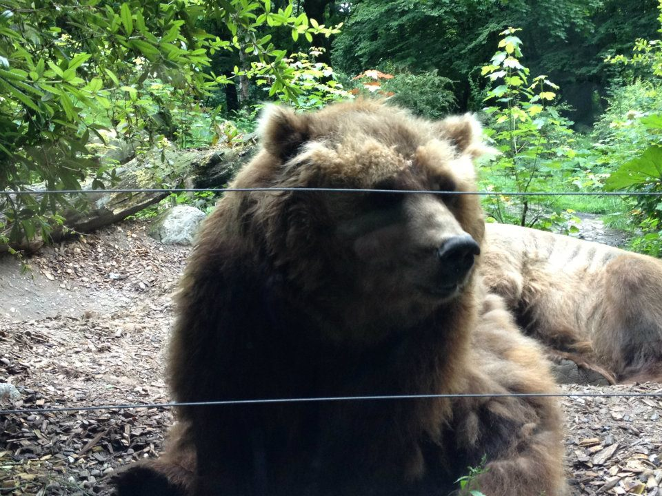
**이미지 캡션:** 이 사진은 울타리 너머로 보이는 두 마리의 갈색 곰을 담고 있으며, 한 마리는 앞쪽에 앉아 있고 다른 한 마리는 뒤쪽에 누워 있습니다. 앞쪽 곰은 짙은 갈색 털을 가지고 있으며, 얼굴은 약간 옆으로 향하고 있고 눈은 감겨 있거나 흐릿하게 보입니다. 곰은 편안하고 느긋해 보이며, 마치 휴식을 취하고 있는 듯합니다. 뒤쪽 곰은 더 밝은 색의 털을 가지고 있으며, 몸통이 뚜렷하게 보입니다. 두 곰 모두 야생 동물원이나 보호 구역과 같은 울타리가 있는 환경에 있는 것으로 보입니다. 배경은 울창한 녹색 식물과 나무로 둘러싸여 있으며, 숲이나 자연 서식지를 연상시킵니다. 땅은 나뭇잎과 흙으로 덮여 있고, 몇 개의 돌도 보입니다. 사진은 자연광 아래에서 촬영되었으며, 전반적으로 평화롭고 고요한 분위기를 자아냅니다.
 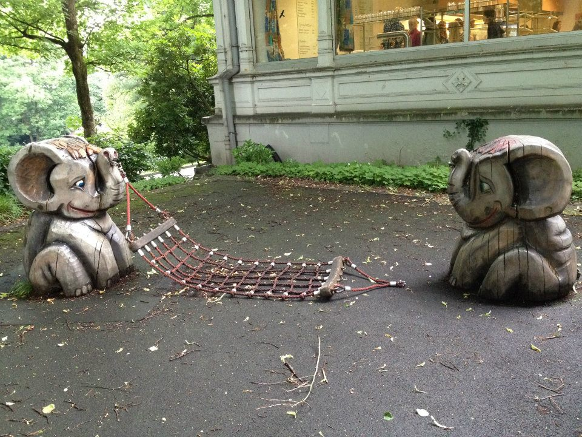
**이미지 캡션:** 공원 놀이터에 나무로 조각된 두 마리의 코끼리 조형물이 마주보고 있으며, 코끼리들은 밧줄로 연결된 그물 침대를 잡고 있다. 왼쪽 코끼리는 파란 눈을 가지고 있고, 오른쪽 코끼리는 녹색 눈을 가지고 있다. 두 코끼리 모두 둥근 귀와 짧은 상아를 가지고 있으며, 앉아 있는 자세로 조각되어 있다. 코끼리 조형물 뒤로는 숲이 우거져 있고, 건물 외벽에는 창문이 있어 안쪽에 사람들이 보이는 것으로 보아 카페나 식당으로 추정된다. 바닥에는 낙엽과 나뭇가지가 흩어져 있어 야외 공간임을 알 수 있다. 전체적으로 평화롭고 아기자기한 분위기를 자아낸다.

### 6월 28일 (목) 15:57 · 📷 앨범: Warm welcome (2장)

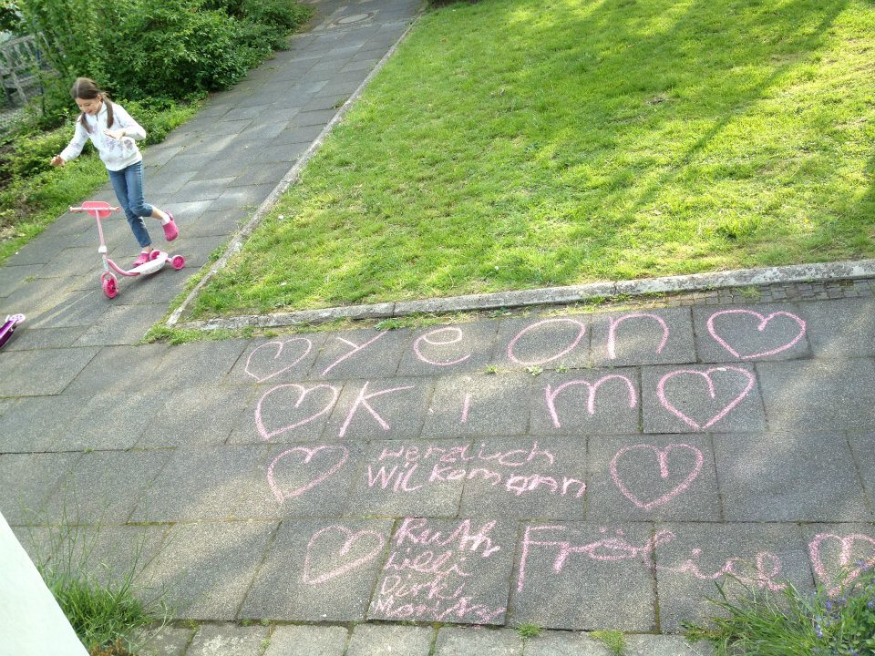
**이미지 캡션:** 한 소녀가 분홍색 스쿠터를 타고 보도블록 위를 달리고 있다. 소녀는 10대 초반으로 보이며, 흰색 후드티와 청바지, 분홍색 신발을 신고 있다. 그녀는 스쿠터에 올라타 앞으로 나아가려는 듯한 자세를 취하고 있으며, 표정은 즐거워 보인다. 배경에는 푸른 잔디밭과 나무가 보이며, 햇살이 비추고 있어 화창한 날씨임을 알 수 있다. 보도블록에는 분홍색 분필로 하트와 함께 "ore on", "OK", "Herzlich Willkomm", "Ruth Lilli Dirk's Fröliche" 등의 글씨가 쓰여 있다. 이는 누군가가 아이들의 놀이터나 산책로에 그림을 그린 것으로 보인다. 전반적으로 밝고 활기찬 분위기의 사진이다.
 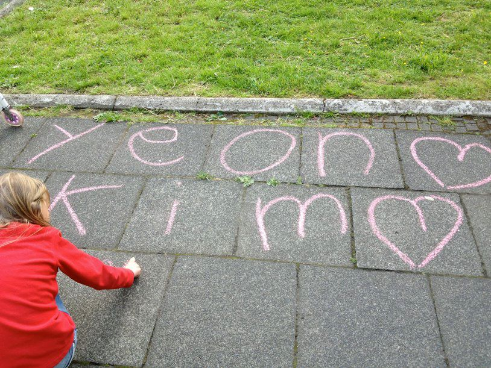
**이미지 캡션:** 한 어린 소녀가 회색 포장 도로에 분홍색 분필로 "yeon"과 "kim"이라는 글자를 쓰고 하트 두 개를 그리고 있다. 소녀는 빨간색 긴팔 상의와 청바지를 입고 있으며, 금발 머리를 뒤로 묶고 있다. 그녀는 무릎을 꿇고 앉아 있으며, 오른손으로 분필을 쥐고 글자를 쓰고 있다. 배경에는 잔디밭과 포장 도로 가장자리가 보인다. 사진은 밝고 화창한 날에 찍힌 것으로 보이며, 평화롭고 즐거운 분위기를 자아낸다.

### 6월 29일 (금) 06:49 · 📷 앨범: La Sagrada Familia (Church of the Sacred Family) (10장)

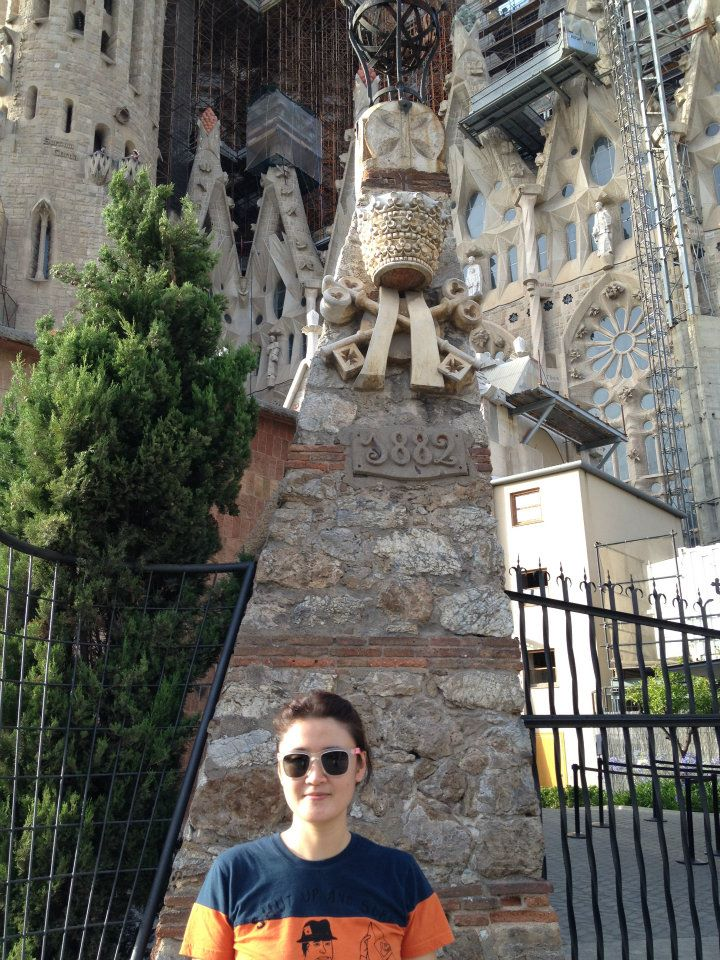
**이미지 캡션:** 한 명의 성인 여성이 밝은 햇살 아래 야외에서 사진을 찍고 있으며, 그녀는 짙은 남색과 주황색 줄무늬가 있는 티셔츠와 선글라스를 착용하고 있습니다. 그녀는 카메라를 향해 미소를 짓고 있으며, 그녀의 뒤에는 사그라다 파밀리아 성당의 일부와 그 앞에 있는 돌기둥이 보입니다. 돌기둥에는 1882년이라는 숫자가 새겨져 있으며, 기둥 위에는 왕관과 열쇠 모양의 장식이 있습니다. 배경에는 푸른 나무와 검은색 철제 울타리가 보이며, 성당 건물은 공사 중인 듯 비계와 천으로 덮여 있습니다. 전체적으로 관광객이 유명 건축물을 배경으로 기념 사진을 찍는 듯한 평화로운 분위기입니다.
 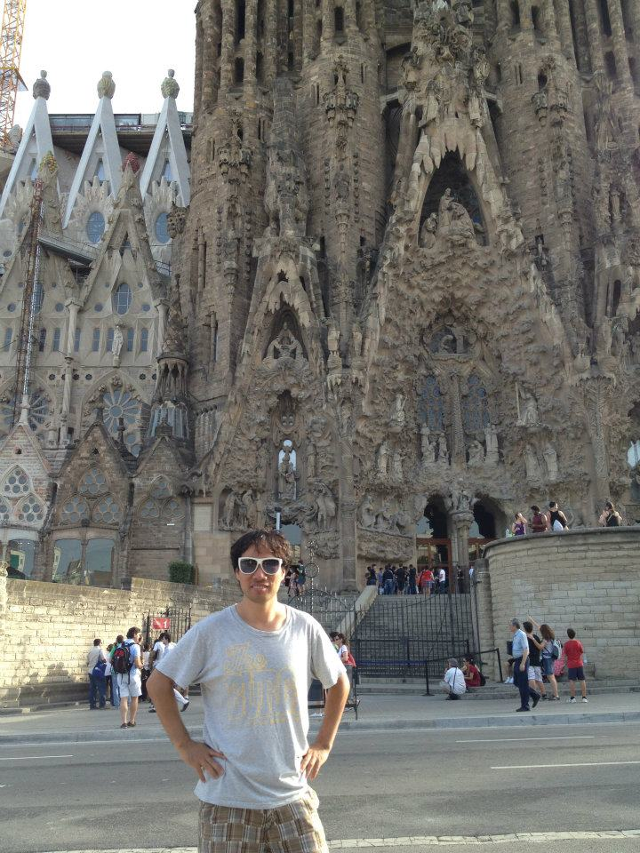
**이미지 캡션:** 한 명의 성인 남성이 밝은 회색 반팔 티셔츠와 체크무늬 반바지를 입고 카메라를 향해 서 있으며, 그의 손은 허리에 얹혀 있고 흰색 선글라스를 착용하고 있다. 그는 바르셀로나의 사그라다 파밀리아 성당 앞에서 사진을 찍고 있으며, 성당은 복잡한 조각과 첨탑으로 장식된 거대한 석조 건물이다. 배경에는 많은 관광객들이 성당 입구 계단을 오르내리고 있으며, 일부는 난간에 기대어 서 있다. 날씨는 맑고 햇볕이 비치고 있어 전반적으로 밝고 활기찬 분위기이다.
 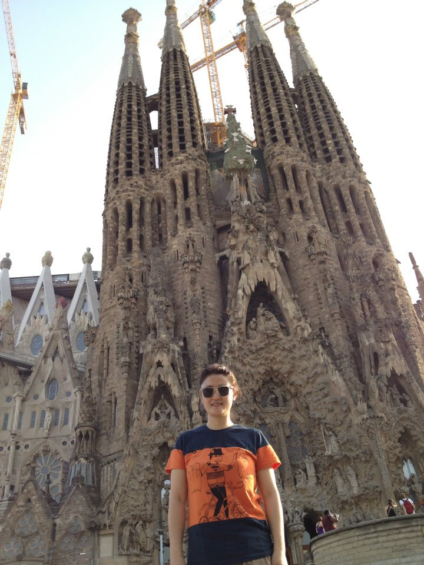
**이미지 캡션:** 한 명의 성인 여성이 사그라다 파밀리아 성당 앞에서 사진을 찍고 있다. 여성은 20대 후반에서 30대 초반으로 보이며, 검은색 선글라스를 끼고 있다. 그녀는 주황색과 남색이 섞인 티셔츠를 입고 있으며, 티셔츠에는 자전거를 타는 사람 그림이 그려져 있다. 여성은 카메라를 향해 미소를 짓고 있으며, 밝고 긍정적인 표정이다. 배경에는 사그라다 파밀리아 성당의 웅장한 모습이 보인다. 성당은 아직 건설 중인 것으로 보이며, 여러 개의 타워와 복잡한 조각들이 눈에 띈다. 또한, 성당 주변에는 건설용 크레인이 여러 대 서 있어 공사가 진행 중임을 알 수 있다. 하늘은 맑고 푸르며, 햇살이 비추고 있어 화창한 날씨임을 짐작할 수 있다. 전반적으로 관광객이 유명 건축물을 배경으로 기념 사진을 찍는 평화롭고 즐거운 분위기이다.
 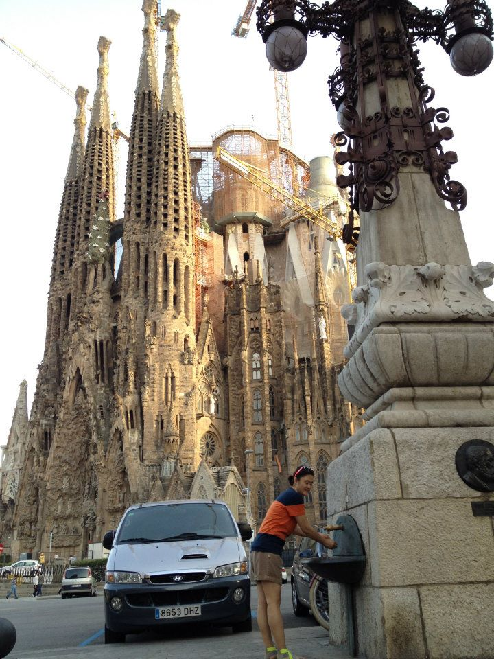
**이미지 캡션:** 사진에는 스페인 바르셀로나의 사그라다 파밀리아 성당이 배경으로 보이며, 성당은 아직 공사 중인 모습으로 여러 개의 타워크레인이 설치되어 있다. 성당 앞에는 한 젊은 여성이 수도꼭지에서 손을 씻고 있으며, 그녀는 주황색과 남색이 섞인 상의와 갈색 반바지, 그리고 형광색 신발을 신고 있다. 그녀의 머리에는 빨간색 머리띠를 하고 있다. 사진 왼쪽에는 은색 승합차가 주차되어 있으며, 번호판에는 "8653 DHZ"라고 쓰여 있다. 오른쪽에는 장식적인 디자인의 가로등이 보인다. 전체적으로 맑은 날씨에 관광객이 많은 활기찬 분위기이다.
 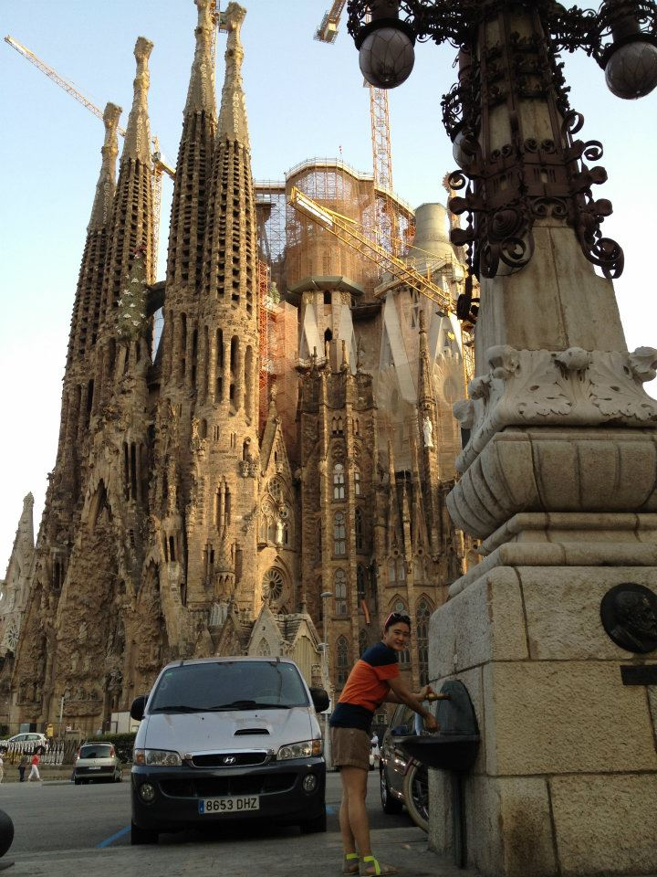
**이미지 캡션:** 성인 여성으로 보이는 한 사람이 사그라다 파밀리아 성당 앞에서 수도꼭지를 틀어 손을 씻고 있다. 이 여성은 20대 초중반으로 보이며, 주황색과 남색이 섞인 티셔츠에 갈색 반바지를 입고 있으며, 노란색 스트랩 샌들을 신고 있다. 그녀는 카메라를 향해 미소를 짓고 있으며, 머리에는 선글라스를 끼고 있다. 배경에는 아직 공사가 진행 중인 사그라다 파밀리아 성당의 웅장한 모습이 보이며, 여러 개의 타워크레인이 설치되어 있다. 성당 앞에는 은색 승합차와 검은색 차량이 주차되어 있으며, 하늘은 맑고 푸르다. 전체적으로 관광객이 많이 찾는 유명 관광지의 활기찬 분위기를 느낄 수 있다.
 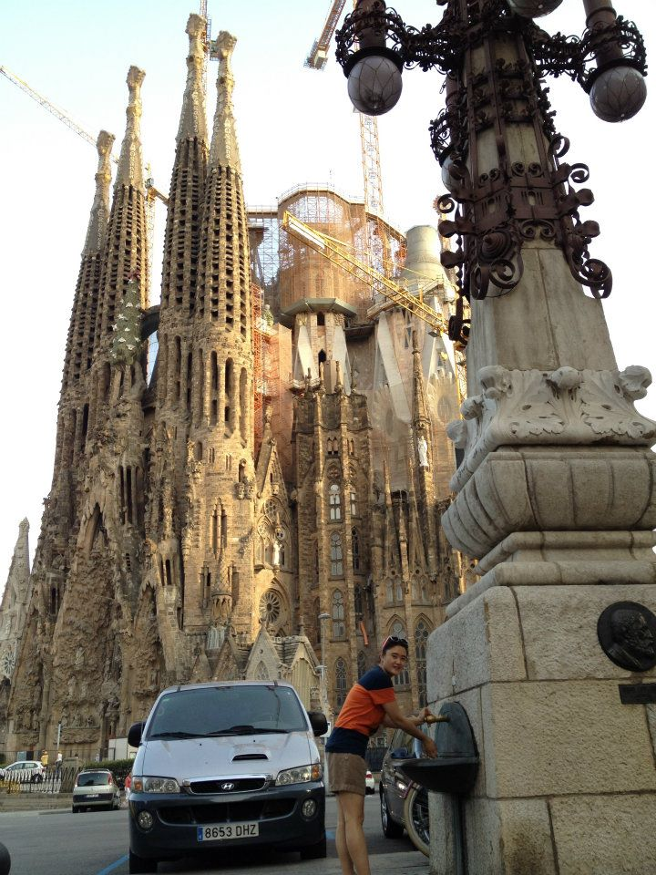
**이미지 캡션:** 사진에는 스페인 바르셀로나에 있는 사그라다 파밀리아 성당의 일부가 보이며, 성당은 여전히 건설 중인 것으로 보입니다. 성당은 복잡하고 정교한 조각으로 장식된 높은 첨탑과 파사드를 특징으로 합니다. 여러 대의 건설용 크레인이 성당 주변에 서 있어 계속 진행 중인 공사를 나타냅니다. 사진의 오른쪽에는 웅장한 석조 기둥과 장식적인 가로등이 있습니다. 이 기둥에는 둥근 메달이 새겨져 있으며, 그 안에는 인물의 흉상이 있습니다. 한 젊은 여성이 이 기둥에 있는 분수대에서 손을 씻고 있습니다. 그녀는 주황색과 파란색이 섞인 줄무늬 티셔츠와 갈색 스커트를 입고 있으며, 머리에는 빨간색 머리띠를 하고 있습니다. 그녀의 표정은 편안하고 자연스러워 보입니다. 그녀 옆에는 은색 현대적인 밴이 주차되어 있으며, 번호판에는 "8653 DHZ"라고 쓰여 있습니다. 배경에는 다른 차량과 건물들도 희미하게 보입니다. 전체적으로 사진은 유명한 건축물을 배경으로 한 일상적인 순간을 포착하고 있으며, 관광객이 분수대에서 물을 마시거나 손을 씻는 모습을 보여줍니다.
 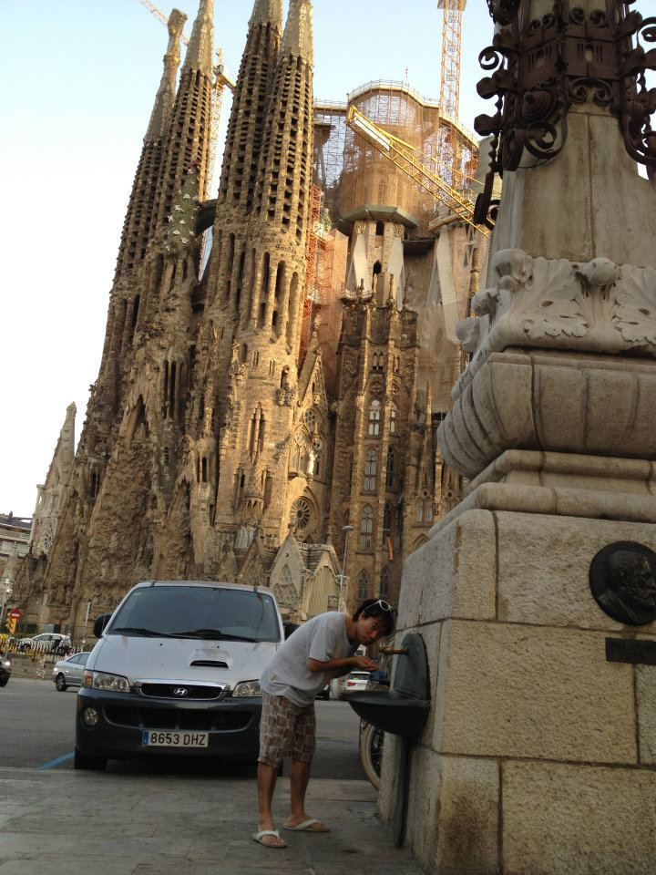
**이미지 캡션:** 성인 남성이 20대 후반에서 30대 초반으로 보이며, 회색 반팔 티셔츠와 체크무늬 반바지, 흰색 슬리퍼를 신고 있다. 그는 선글라스를 머리에 얹고 있으며, 수도꼭지에서 나오는 물을 마시기 위해 허리를 숙이고 있다. 그의 표정은 편안해 보이며, 물을 마시는 행동에 집중하고 있다. 배경에는 스페인 바르셀로나의 사그라다 파밀리아 성당이 보이며, 아직 공사가 진행 중인 모습이다. 성당은 웅장하고 복잡한 건축 양식을 자랑하며, 여러 개의 첨탑과 조각들로 장식되어 있다. 성당 앞 도로에는 은색 현대자동차 스타렉스 차량과 다른 차량들이 주차되어 있고, 길가에는 돌로 만들어진 분수대가 있다. 하늘은 맑고 푸르며, 햇살이 비추고 있어 따뜻한 날씨임을 짐작할 수 있다. 전체적으로 관광객이 사그라다 파밀리아 성당을 방문하여 잠시 휴식을 취하는 평화로운 분위기이다.
 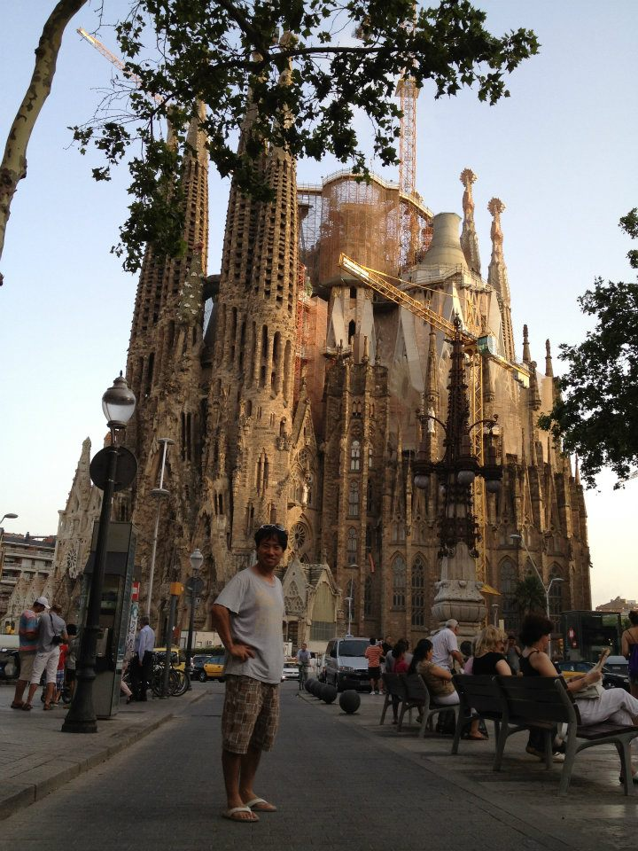
**이미지 캡션:** 한 명의 성인 남성이 회색 반팔 티셔츠와 체크무늬 반바지, 흰색 샌들을 신고 카메라를 향해 서 있으며, 그의 오른손은 허리에 얹혀 있고 왼손은 자연스럽게 늘어져 있습니다. 그는 옅은 미소를 띠고 있으며, 그의 머리 위에는 선글라스가 놓여 있습니다. 이 남성은 바르셀로나의 사그라다 파밀리아 성당 앞에서 사진을 찍고 있으며, 성당은 건설 중인 것으로 보이며 여러 개의 크레인이 보입니다. 배경에는 여러 명의 사람들이 벤치에 앉아 있거나 거리를 걷고 있으며, 차량과 가로등도 보입니다. 전체적으로 따뜻한 오후의 햇살 아래 관광객들이 유명한 건축물을 배경으로 여유로운 시간을 보내는 모습입니다.
 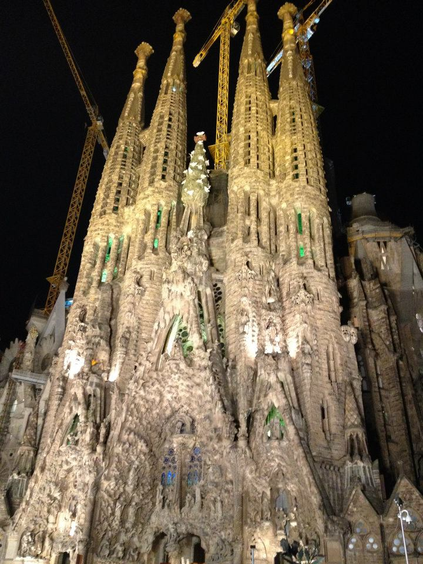
**이미지 캡션:** 밤에 조명이 켜진 사그라다 파밀리아 성당의 웅장한 외관을 보여주는 사진으로, 여러 개의 첨탑과 복잡한 조각 장식이 특징입니다. 성당 주변에는 건설 중임을 나타내는 노란색 타워크레인이 여러 대 보이며, 어두운 밤하늘을 배경으로 성당의 웅장함과 함께 건설 현장의 역동적인 분위기를 동시에 느낄 수 있습니다. 성당의 첨탑에는 녹색 조명이 비추고 있으며, 정면의 복잡한 조각과 스테인드글라스 창문도 눈에 띕니다. 사진에는 사람이 보이지 않으며, 텍스트도 확인할 수 없습니다. 전반적으로 역사적인 건축물과 현대적인 건설이 공존하는 독특한 분위기를 자아냅니다.
 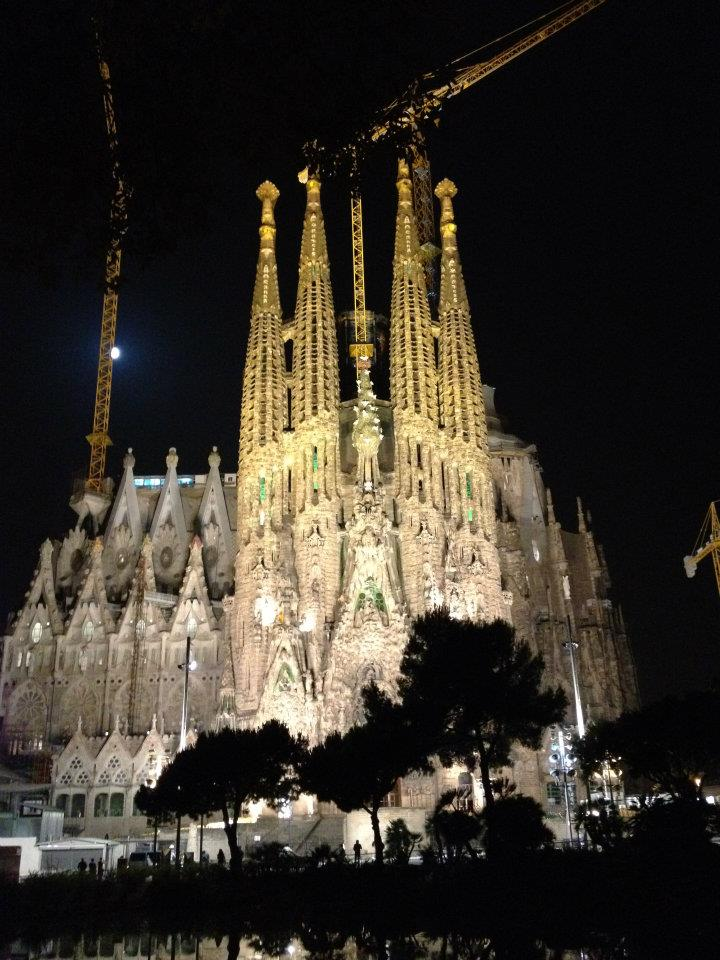
**이미지 캡션:** 밤에 조명이 켜진 사그라다 파밀리아 성당의 웅장한 모습이 보이며, 여러 개의 높은 첨탑들이 하늘을 찌를 듯 솟아 있고, 성당 앞쪽에는 공사 중임을 나타내는 대형 크레인이 여러 대 설치되어 있습니다. 성당의 복잡하고 정교한 조각과 건축 양식이 조명 아래 더욱 돋보이며, 일부 창문에서는 녹색 빛이 새어 나오고 있습니다. 어두운 밤하늘에는 희미하게 달이 떠 있고, 성당 앞쪽으로는 검은 실루엣으로 보이는 나무들과 잔디밭이 있으며, 멀리 보이는 사람들은 실루엣으로만 파악 가능합니다. 물에 비친 성당의 모습도 일부 보이며, 전체적으로 웅장하면서도 건설 중인 역동적인 분위기를 자아냅니다.
