# 2012년 9월

[← 2012년](README.md)

### 9월 4일 (화) 07:25 · is on his way to ASE. See you there!

is on his way to ASE. See you there!

http://ase2012.paluno.uni-due.de/

### 9월 5일 (수) 18:23 · really enjoyed Mark Harman's keynote at …

really enjoyed Mark Harman's keynote at ASE. It seems we will see more GP generated software.

### 9월 6일 (목) 21:01 · found that ASE is powerful enough to put…

found that ASE is powerful enough to put its direction into the subway station map.

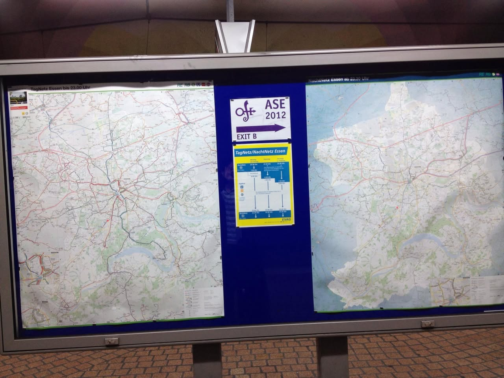
**이미지 캡션:** 이 사진은 두 개의 큰 지도와 작은 안내문이 부착된 파란색 게시판을 보여줍니다. 게시판은 금속 프레임 안에 있으며, 하단에는 벽돌 패턴의 바닥이 보입니다. 왼쪽 지도는 도시의 도로망과 철도 노선을 보여주며, "TagNetz Essen bis 23.00 Uhr"라는 텍스트가 상단에 있습니다. 오른쪽 지도는 더 넓은 지역의 지형과 도로망을 보여주며, "NachtNetz Essen ab 23.30 Uhr"라는 텍스트가 상단에 있습니다. 중앙에는 보라색 배경에 흰색 글씨로 "ASE 2012"라고 쓰여 있고, 그 아래에 "EXIT B"라는 텍스트와 함께 보라색 화살표가 있습니다. 또한, 노란색 안내문에는 "TagNetz/NachtNetz Essen"이라는 제목과 함께 요일별 운행 시간표가 그림과 함께 표시되어 있으며, 하단에는 "EVAG"라는 로고가 보입니다. 사진에는 사람이 보이지 않으며, 전반적으로 정보 전달을 위한 게시판이 설치된 실내 또는 외부 공간의 모습입니다.에 "EXIT B"라는 텍스트와 함께 보라색 화살표가 있습니다. 또한, 노란색 안내문에는 "TagNetz/NachtNetz Essen"이라는 제목과 함께 요일별 운행 시간표가 그림과 함께 표시되어 있으며, 하단에는 "EVAG"라는 로고가 보입니다. 사진에는 사람이 보이지 않으며, 전반적으로 정보 전달을 위한 게시판이 설치된 실내 또는 외부 공간의 모습입니다.

### 9월 7일 (금) 06:05 · 📷 앨범: Award! (2장)

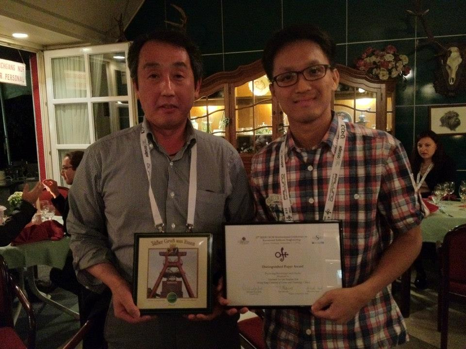
**이미지 캡션:** 두 명의 성인 남성이 실내에서 사진을 찍고 있다. 왼쪽 남성은 50대 후반에서 60대 초반으로 보이며, 회색 체크무늬 셔츠를 입고 목에 흰색 목걸이를 걸고 있다. 그는 약간 미소를 띠고 있으며, 그의 손에는 "Saffer Grußw Essen"이라고 적힌 액자가 들려 있다. 오른쪽 남성은 20대 후반에서 30대 초반으로 보이며, 빨간색, 파란색, 흰색 체크무늬 셔츠를 입고 목에 여러 개의 흰색 목걸이를 걸고 있다. 그는 안경을 쓰고 환하게 웃고 있으며, 그의 손에는 "Distinguished Paper Award"라고 적힌 상장이 들려 있다. 배경에는 나무 캐비닛, 사슴 머리 박제, 액자, 그리고 테이블에 앉아 있는 다른 사람들이 보인다. 전체적으로 행사에 참여한 수상자들의 모습으로 보이며, 축하하는 듯한 분위기이다.rd"라고 적힌 상장이 들려 있다. 배경에는 나무 캐비닛, 사슴 머리 박제, 액자, 그리고 테이블에 앉아 있는 다른 사람들이 보인다. 전체적으로 행사에 참여한 수상자들의 모습으로 보이며, 축하하는 듯한 분위기이다.
 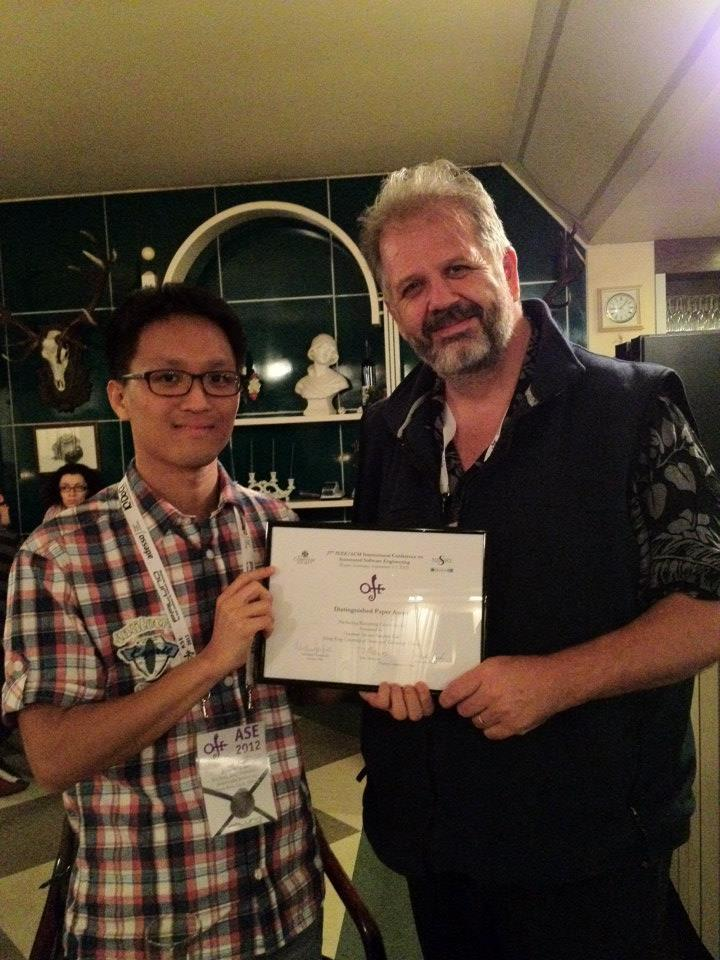
**이미지 캡션:** 한 명의 성인 남성이 안경을 쓰고 체크무늬 셔츠를 입고 있으며, 다른 한 명의 성인 남성은 수염을 기르고 검은색 조끼를 입고 있다. 두 사람은 함께 상장으로 보이는 것을 들고 있으며, 배경에는 녹색 타일 벽과 사슴 머리 장식이 보인다. 또한, 흰색 흉상과 시계도 보인다. 전반적으로 시상식이나 학회와 같은 행사에서 찍은 사진으로 보이며, 두 사람 모두 만족스러운 표정을 짓고 있다.

### 9월 7일 (금) 06:20 · is extremely happy today to see his PHD …

is extremely happy today to see his PHD student Hyunmin Seo got the ACM SIGSOFT Distinguished Paper Award (@ASE2012)!

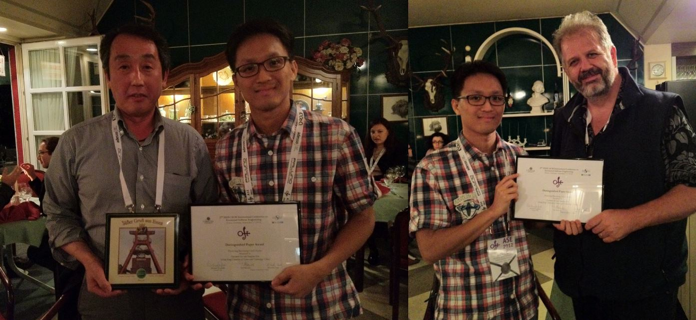
**이미지 캡션:** 네 명의 남성이 사진에 담겨 있으며, 이들은 모두 상을 받은 것으로 보입니다. 왼쪽에서부터 첫 번째 남성은 50대 후반에서 60대 초반으로 보이는 아시아계 남성으로, 회색 체크무늬 셔츠를 입고 있으며 목에는 흰색 줄이 달린 명찰을 걸고 있습니다. 그는 액자에 담긴 그림을 들고 있으며, 그림에는 광산의 갱도 모습이 그려져 있고 독일어로 "Stifter Gruß vom Eisenerz"라고 쓰여 있습니다. 두 번째 남성은 30대 초반에서 40대 초반으로 보이는 아시아계 남성으로, 빨간색, 파란색, 흰색 체크무늬 셔츠를 입고 있으며 목에는 여러 개의 명찰을 걸고 있습니다. 그는 "Distinguished Paper Award"라고 쓰인 상장을 들고 있습니다. 세 번째 남성은 두 번째 남성과 비슷한 외모와 복장을 하고 있으며, 역시 "Distinguished Paper Award"라고 쓰인 상장을 들고 있습니다. 네 번째 남성은 50대 중반에서 60대 초반으로 보이는 백인 남성으로, 검은색 조끼를 입고 있으며 셔츠에는 검은색 꽃무늬가 있습니다. 그는 상장으로 보이는 것을 들고 있으며, 상장에는 "Distinguished Paper Award"라고 쓰여 있습니다. 배경에는 녹색 타일 벽과 뿔 달린 동물의 박제, 그리고 오래된 가구들이 보이며, 이는 고급스러운 레스토랑이나 연회장의 분위기를 연출합니다. 전반적으로 학술 대회나 시상식의 일부로 보이는 행사에서 수상자들이 기념 사진을 찍는 모습입니다.셔츠를 입고 있으며 목에는 여러 개의 명찰을 걸고 있습니다. 그는 "Distinguished Paper Award"라고 쓰인 상장을 들고 있습니다. 세 번째 남성은 두 번째 남성과 비슷한 외모와 복장을 하고 있으며, 역시 "Distinguished Paper Award"라고 쓰인 상장을 들고 있습니다. 네 번째 남성은 50대 중반에서 60대 초반으로 보이는 백인 남성으로, 검은색 조끼를 입고 있으며 셔츠에는 검은색 꽃무늬가 있습니다. 그는 상장으로 보이는 것을 들고 있으며, 상장에는 "Distinguished Paper Award"라고 쓰여 있습니다. 배경에는 녹색 타일 벽과 뿔 달린 동물의 박제, 그리고 오래된 가구들이 보이며, 이는 고급스러운 레스토랑이나 연회장의 분위기를 연출합니다. 전반적으로 학술 대회나 시상식의 일부로 보이는 행사에서 수상자들이 기념 사진을 찍는 모습입니다.

### 9월 7일 (금) 14:36 · Sung Kim shared a link.

🔗 <http://www.phdcomics.com/comics.php?n=1523>

### 9월 7일 (금) 22:56 · got the official award photo from the AS…

got the official award photo from the ASE 2012 team (for Hyunmin's paper, "Predicting Recurring Crash Stacks", http://www.slideshare.net/hunkim/predicting-recurring-crash-stacks-ase-2012). He is still very happy. :-)

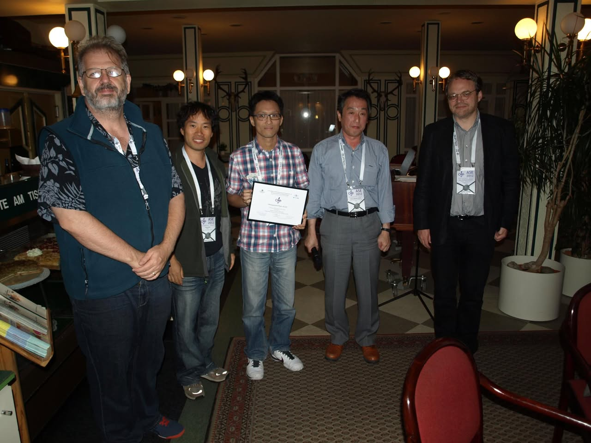
**이미지 캡션:** 네 명의 성인 남성이 실내에서 포즈를 취하고 있다. 왼쪽에서 첫 번째 남성은 50대 후반으로 보이며, 회색 머리카락과 턱수염, 안경을 쓰고 있다. 그는 꽃무늬 셔츠 위에 파란색 조끼를 입고 청바지를 입고 있다. 그의 표정은 부드럽고, 손은 배 앞에 모으고 있다. 두 번째 남성은 30대 초반으로 보이며, 검은색 머리카락에 웃는 표정을 짓고 있다. 그는 검은색 티셔츠 위에 회색 후드티를 입고 청바지를 입고 있다. 세 번째 남성은 40대 후반으로 보이며, 검은색 머리카락에 안경을 쓰고 있다. 그는 체크무늬 셔츠에 청바지를 입고 있으며, 한 손에는 인증서를 들고 있다. 네 번째 남성은 40대 후반으로 보이며, 금발 머리에 안경을 쓰고 있다. 그는 회색 셔츠 위에 검은색 재킷을 입고 검은색 바지를 입고 있다. 배경에는 테이블, 의자, 식물, 조명이 보이며, 전체적으로 행사장이나 컨퍼런스 장소로 보인다.청바지를 입고 있으며, 한 손에는 인증서를 들고 있다. 네 번째 남성은 40대 후반으로 보이며, 금발 머리에 안경을 쓰고 있다. 그는 회색 셔츠 위에 검은색 재킷을 입고 검은색 바지를 입고 있다. 배경에는 테이블, 의자, 식물, 조명이 보이며, 전체적으로 행사장이나 컨퍼런스 장소로 보인다.

### 9월 9일 (일) 03:33 · is on his way to Andreas Zeller's lab, o…

📍 Frankfurt, Germany, Frankfurt, Germany

is on his way to Andreas Zeller's lab, one of the best SE labs in the world, also where Thomas Zimmermann graduated from. He really looks forward to the visit.

### 9월 11일 (화) 02:42 · 📷 앨범: Saarland University (Visiting Andreas Zeller's group) (34장)

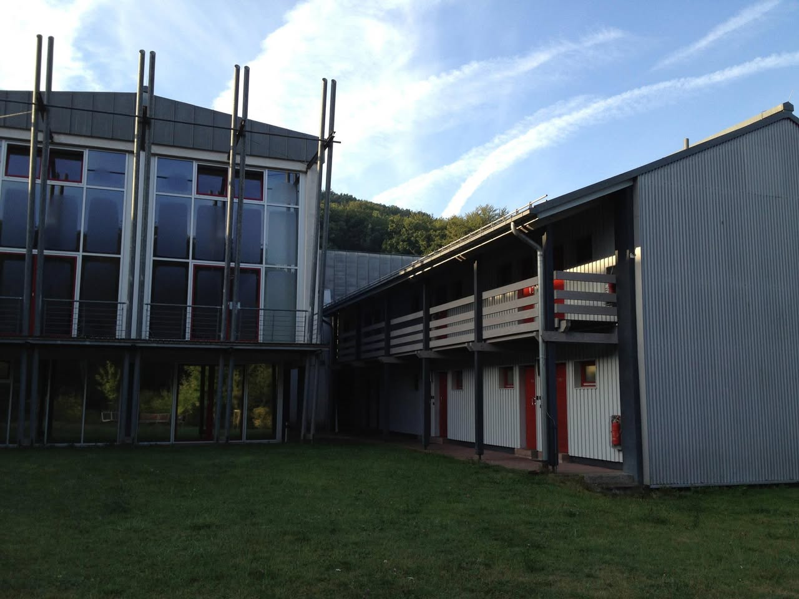
**이미지 캡션:** 이 사진은 현대적인 디자인의 건물과 푸른 잔디밭, 그리고 맑은 하늘을 담고 있습니다. 건물은 두 개의 주요 부분으로 나뉘는데, 왼쪽에는 넓은 유리창과 금속 기둥이 특징인 3층 건물이고, 오른쪽에는 복도와 발코니가 있는 2층 건물입니다. 두 건물 모두 회색과 흰색을 주조색으로 사용했으며, 빨간색 문과 난간이 포인트로 사용되었습니다. 건물 앞에는 잘 관리된 잔디밭이 펼쳐져 있으며, 배경에는 울창한 숲이 보입니다. 하늘에는 구름과 비행운이 옅게 퍼져 있어 평화롭고 고요한 분위기를 자아냅니다. 건물에는 소화기가 눈에 띄며, 이는 안전 시설이 갖춰져 있음을 시사합니다. 전체적으로 깔끔하고 정돈된 느낌을 주는 장소로, 휴양 시설이나 교육 기관 등일 가능성이 있습니다. 띄며, 이는 안전 시설이 갖춰져 있음을 시사합니다. 전체적으로 깔끔하고 정돈된 느낌을 주는 장소로, 휴양 시설이나 교육 기관 등일 가능성이 있습니다.
 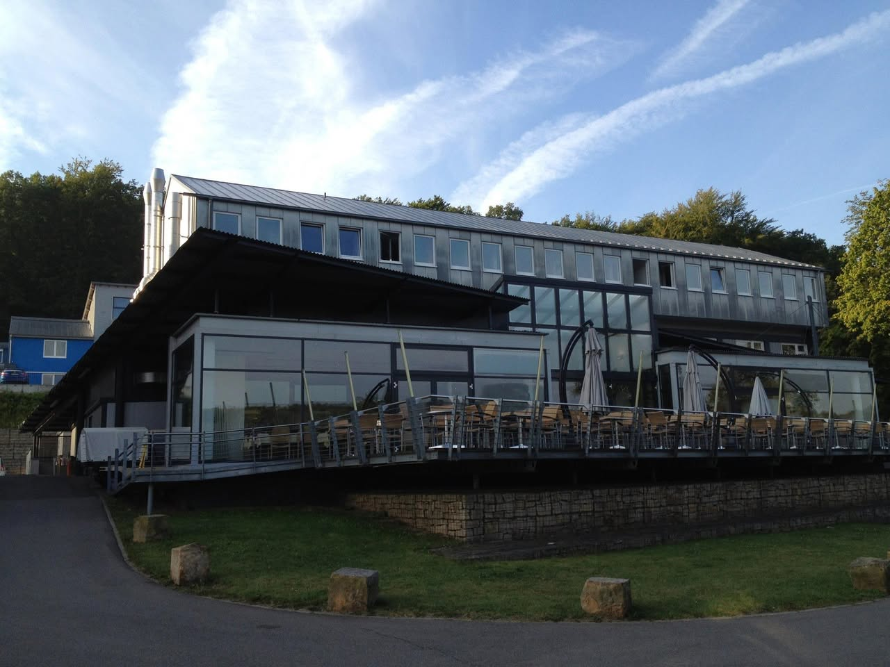
**이미지 캡션:** 푸른 하늘에 흰 구름이 흩뿌려진 맑은 날, 언덕 위에 자리한 현대적인 건물 단지가 보인다. 건물은 금속 패널과 유리로 이루어져 있으며, 여러 층으로 구성되어 있다. 건물 상층부는 은회색 금속 패널로 덮여 있고, 규칙적으로 배열된 창문들이 보인다. 하층부는 통유리로 되어 있어 내부가 훤히 들여다보이며, 넓은 테라스에는 수많은 테이블과 의자들이 놓여 있어 야외 식사 공간으로 활용되는 것으로 보인다. 테라스에는 여러 개의 파라솔이 펼쳐져 있어 햇볕을 가려주고 있다. 건물 옆으로는 푸른 숲이 우거져 있으며, 건물 앞쪽으로는 아스팔트 도로와 잔디밭이 펼쳐져 있다. 도로에는 몇 개의 돌이 놓여 있고, 멀리 파란색 건물이 보인다. 전반적으로 깔끔하고 현대적인 분위기를 풍기며, 자연과 조화를 이루는 모습이다.쪽으로는 아스팔트 도로와 잔디밭이 펼쳐져 있다. 도로에는 몇 개의 돌이 놓여 있고, 멀리 파란색 건물이 보인다. 전반적으로 깔끔하고 현대적인 분위기를 풍기며, 자연과 조화를 이루는 모습이다.
 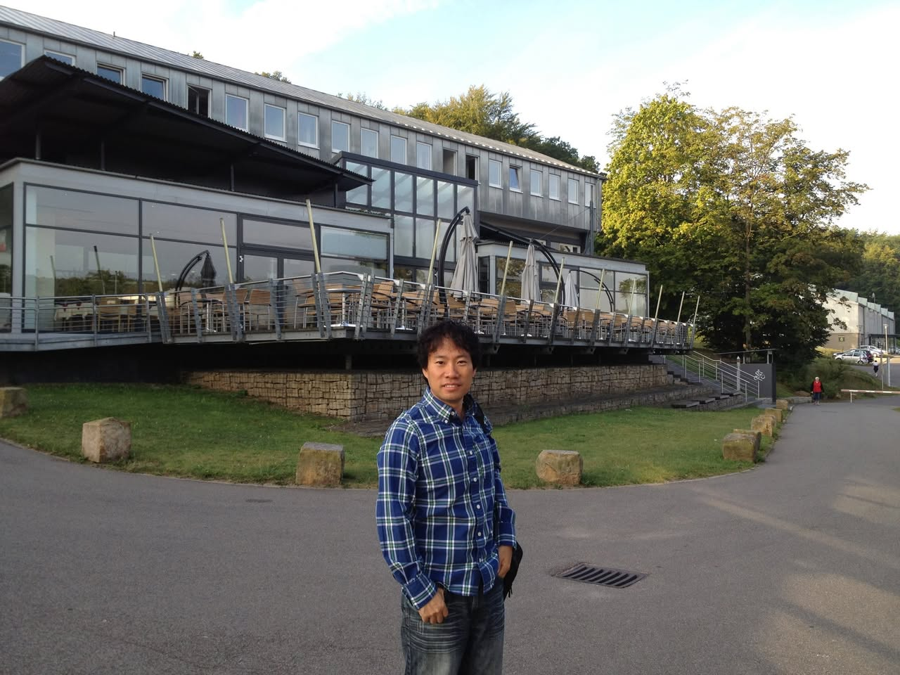
**이미지 캡션:** 한 명의 성인 남성이 푸른색과 흰색 체크무늬 셔츠와 청바지를 입고 카메라를 향해 서 있으며, 그의 왼쪽 어깨에는 검은색 배낭이 메여 있습니다. 그는 약간의 미소를 띠고 있으며, 그의 손은 주머니에 넣고 있습니다. 남성은 현대적인 건물 앞에 서 있는데, 이 건물은 유리창이 많고 금속 외관을 가지고 있으며 야외 좌석 공간이 있습니다. 건물 뒤로는 울창한 나무들이 보이고, 하늘은 맑고 푸릅니다. 건물 앞 잔디밭에는 몇 개의 돌이 놓여 있고, 건물 옆으로는 계단과 도로가 보입니다. 도로에는 몇 대의 차량이 주차되어 있고, 멀리 빨간색 옷을 입은 사람이 걸어가고 있습니다. 전체적으로 평화롭고 여유로운 분위기입니다.있고, 멀리 빨간색 옷을 입은 사람이 걸어가고 있습니다. 전체적으로 평화롭고 여유로운 분위기입니다.
 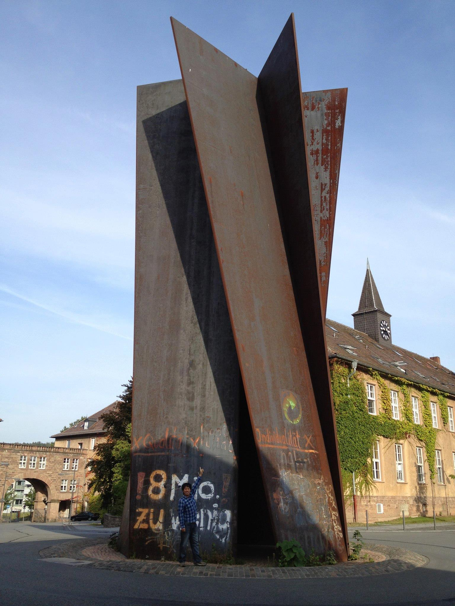
**이미지 캡션:** 한 명의 성인 남성이 거대한 금속 조형물 앞에 서 있다. 남성은 20대 초반으로 보이며, 파란색 체크무늬 셔츠와 청바지를 입고 있다. 그는 조형물을 향해 손가락으로 가리키고 있으며, 표정은 밝고 활기차 보인다. 배경에는 붉은 벽돌 건물과 아치형 구조물이 보이며, 건물 외벽에는 담쟁이덩굴이 무성하게 자라 있다. 하늘은 맑고 푸르며, 햇살이 조형물과 건물에 비추고 있어 전체적으로 따뜻하고 평화로운 분위기를 자아낸다. 조형물에는 여러 낙서가 있는데, "18 Mio.", "zu", "Individualität" 등의 글자가 보인다. 글자가 보인다.
 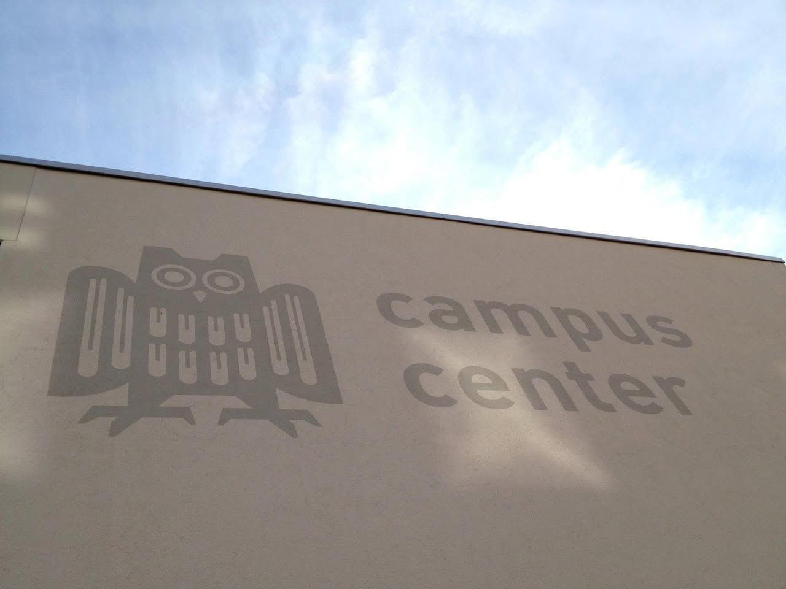
**이미지 캡션:** 이 사진은 건물 외벽에 새겨진 올빼미 문양과 "campus center"라는 글자를 보여줍니다. 올빼미 문양은 회색으로 그려져 있으며, 두 개의 큰 원형 눈과 몸통에는 여러 개의 작은 사각형이 세로로 배열되어 있습니다. 날개는 위로 펼쳐진 형태로 표현되었습니다. 문양 옆에는 "campus center"라는 영문이 회색으로 쓰여 있으며, "campus"는 위쪽에, "center"는 아래쪽에 위치합니다. 건물 외벽은 베이지색 계열이며, 하늘에는 구름이 약간 낀 푸른 하늘이 보입니다. 햇빛이 비스듬히 비추면서 건물 표면에 그림자가 드리워져 있습니다. 사진은 건물 외벽의 일부와 하늘을 담고 있으며, 특별한 인물이나 사물은 보이지 않습니다. 전체적으로 차분하고 현대적인 분위기를 자아냅니다. 표면에 그림자가 드리워져 있습니다. 사진은 건물 외벽의 일부와 하늘을 담고 있으며, 특별한 인물이나 사물은 보이지 않습니다. 전체적으로 차분하고 현대적인 분위기를 자아냅니다.
 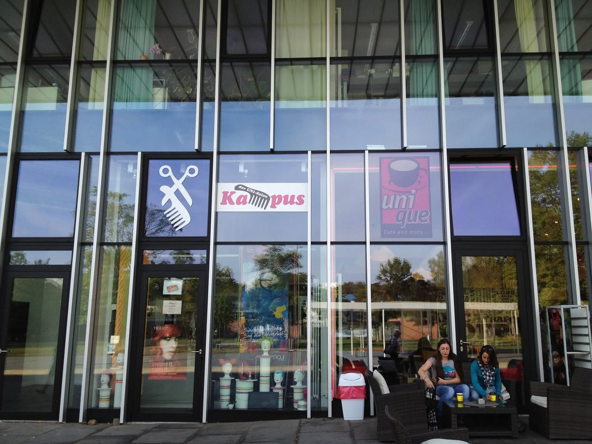
**이미지 캡션:** 건물 외관에 여러 개의 창문이 있으며, 각 창문에는 다양한 간판과 광고가 붙어 있습니다. 왼쪽에서부터 첫 번째 창문에는 "TIGI invent it. transform it."이라는 문구와 함께 빨간 머리의 여성 사진이 보입니다. 두 번째 창문에는 가위와 빗 모양의 로고와 함께 "der UNI-Salen Kampus"라는 글자가 분홍색 배경에 쓰여 있습니다. 세 번째 창문에는 "unique Cafe and more..."라는 문구와 함께 커피잔 그림이 있습니다. 건물 앞에는 야외 좌석 공간이 마련되어 있으며, 두 명의 젊은 여성이 테이블에 앉아 이야기를 나누고 있습니다. 한 여성은 회색 상의와 청바지를 입고 있으며, 다른 여성은 파란색 재킷과 체크무늬 스카프를 착용하고 있습니다. 테이블 위에는 컵과 음료가 놓여 있습니다. 건물 내부에는 여러 개의 마네킹과 상품 진열대가 보입니다. 전체적으로 현대적인 건물 외관과 편안한 야외 좌석 공간이 어우러져 카페나 상점의 모습을 보여주고 있습니다. 두 명의 젊은 여성이 테이블에 앉아 이야기를 나누고 있습니다. 한 여성은 회색 상의와 청바지를 입고 있으며, 다른 여성은 파란색 재킷과 체크무늬 스카프를 착용하고 있습니다. 테이블 위에는 컵과 음료가 놓여 있습니다. 건물 내부에는 여러 개의 마네킹과 상품 진열대가 보입니다. 전체적으로 현대적인 건물 외관과 편안한 야외 좌석 공간이 어우러져 카페나 상점의 모습을 보여주고 있습니다.
 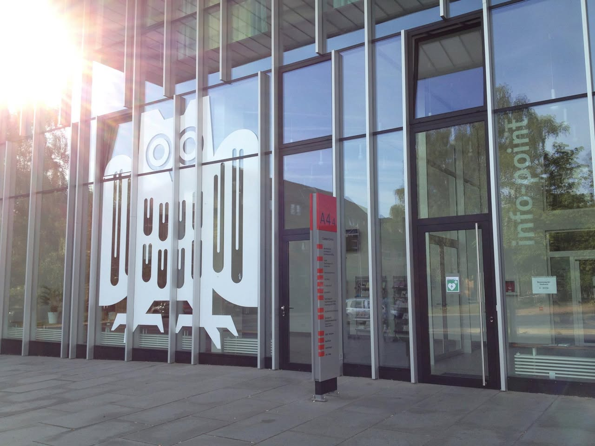
**이미지 캡션:** 햇살이 강하게 내리쬐는 현대적인 건물 외관으로, 건물은 유리와 금속으로 이루어져 있으며 커다란 흰색 올빼미 모양의 장식이 창문에 부착되어 있습니다. 올빼미는 두 개의 큰 원형 눈과 여러 개의 세로 줄무늬 날개를 가지고 있습니다. 건물 입구에는 "info-point"라고 세로로 쓰여진 간판이 보이며, 그 옆에는 "A44"이라고 쓰인 붉은색 안내판이 있습니다. 건물 내부가 유리창을 통해 일부 보이며, 나무와 하늘이 반사되어 보입니다. 건물 앞에는 회색 타일로 포장된 보행로가 있고, 건물 측면에는 벤치가 놓여 있습니다. 전체적으로 밝고 현대적인 분위기이며, 건물은 정보 센터나 사무실 건물로 보입니다.니다. 전체적으로 밝고 현대적인 분위기이며, 건물은 정보 센터나 사무실 건물로 보입니다.
 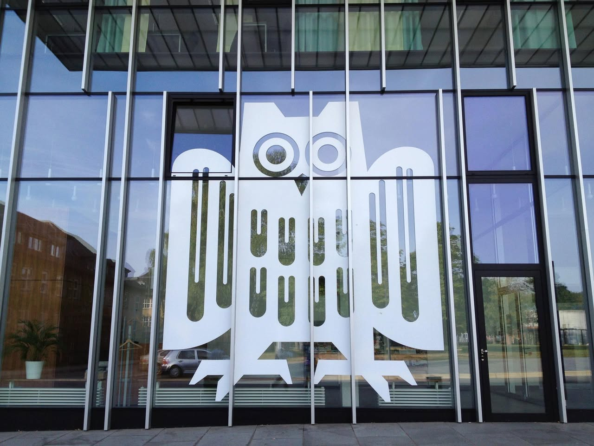
**이미지 캡션:** 현대적인 건물 외관의 넓은 유리창에 흰색 올빼미 모양의 스티커가 부착되어 있습니다. 올빼미는 추상적이고 기하학적인 형태로 표현되었으며, 큰 원형 눈과 세로로 길게 늘어진 깃털 모양의 디자인이 특징입니다. 유리창에는 건물 내부의 모습과 외부 풍경이 반사되어 보입니다. 왼쪽 유리창에는 갈색 건물과 녹색 식물이 심어진 화분이 보이고, 그 뒤로 은색 자동차 한 대가 주차되어 있습니다. 오른쪽에는 검은색 프레임의 유리문이 있고, 문 안쪽으로도 녹색 식물과 건물이 희미하게 보입니다. 건물은 금속 프레임과 유리 패널로 구성되어 있으며, 현대적이고 깔끔한 인상을 줍니다. 전체적으로 맑은 날씨에 촬영된 것으로 보이며, 차분하고 정적인 분위기를 자아냅니다.성되어 있으며, 현대적이고 깔끔한 인상을 줍니다. 전체적으로 맑은 날씨에 촬영된 것으로 보이며, 차분하고 정적인 분위기를 자아냅니다.
 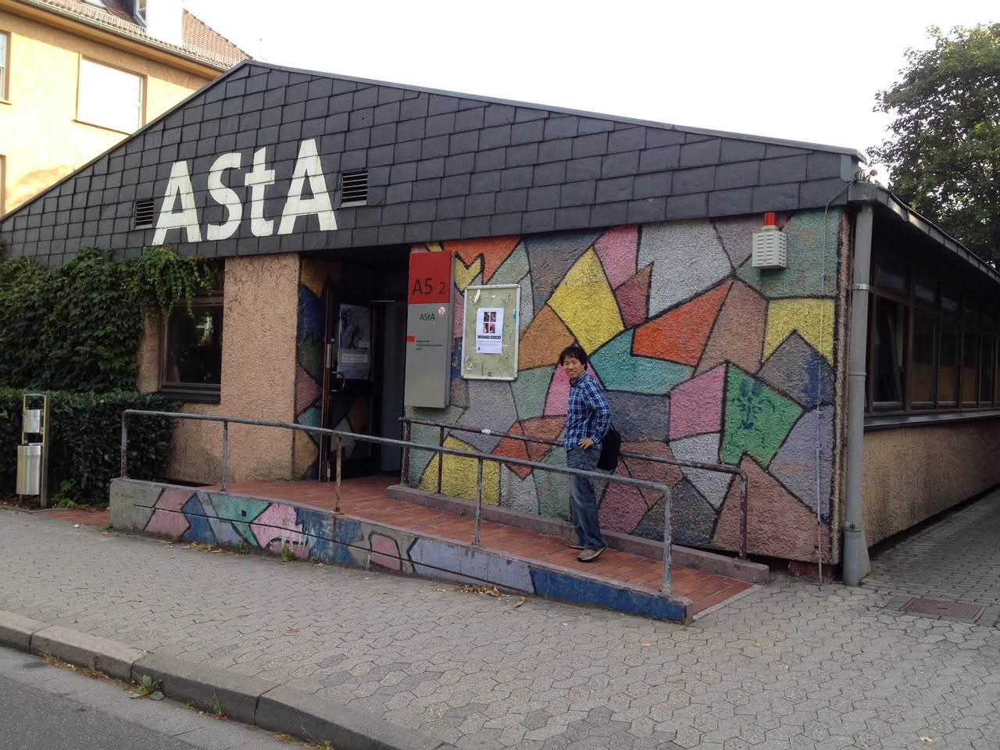
**이미지 캡션:** 한 명의 성인 남성이 건물 앞에 서 있다. 그는 20대 후반에서 30대 초반으로 보이며, 검은색 머리에 캐주얼한 복장을 하고 있다. 남성은 파란색과 흰색 체크무늬 셔츠에 청바지를 입고 있으며, 검은색 백팩을 메고 있다. 그는 건물 입구 쪽을 바라보며 약간 미소를 짓고 있는 듯한 표정이다. 건물은 독특한 디자인으로, 지붕에는 회색 슬레이트가 덮여 있고 벽면에는 다양한 색상의 기하학적 패턴이 그려져 있다. 건물 앞에는 경사로와 난간이 설치되어 있으며, 경사로에는 알록달록한 색상의 그림이 그려져 있다. 건물 입구 위에는 "ASTA"라는 흰색 글자가 크게 쓰여 있고, 그 옆에는 "A5 2"라고 적힌 표지판이 보인다. 건물 주변에는 녹색 식물들이 우거져 있고, 건물 옆으로는 보도와 도로가 이어진다. 전반적으로 활기차고 예술적인 분위기를 풍기는 건물과 그 앞에 서 있는 한 사람의 모습이 담긴 사진이다.위에는 "ASTA"라는 흰색 글자가 크게 쓰여 있고, 그 옆에는 "A5 2"라고 적힌 표지판이 보인다. 건물 주변에는 녹색 식물들이 우거져 있고, 건물 옆으로는 보도와 도로가 이어진다. 전반적으로 활기차고 예술적인 분위기를 풍기는 건물과 그 앞에 서 있는 한 사람의 모습이 담긴 사진이다.
 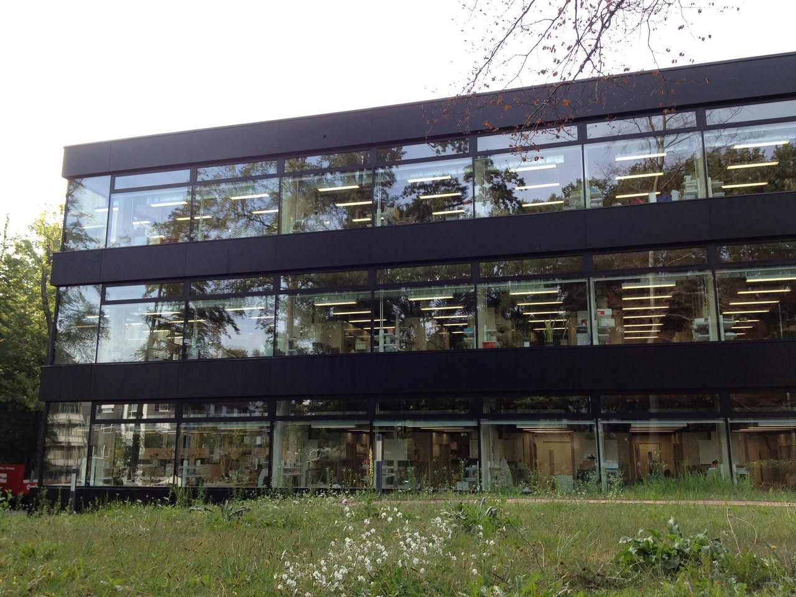
**이미지 캡션:** 이 사진은 현대적인 검은색 외관의 다층 건물로, 넓은 통유리창을 통해 내부가 들여다보입니다. 건물 상층부의 창문 안으로는 형광등이 켜져 있고, 책상과 컴퓨터, 서류 등이 보여 사무실이나 연구실 공간임을 짐작할 수 있습니다. 창문에 비친 나무와 하늘의 모습은 건물 주변이 녹지로 둘러싸여 있음을 보여줍니다. 건물 하층부의 창문은 더 낮게 설치되어 있으며, 내부에는 다양한 작업 공간과 설비들이 보입니다. 건물 앞쪽으로는 잔디와 야생화가 자라고 있어 자연 친화적인 환경을 연출합니다. 사진에는 사람이 명확하게 보이지는 않지만, 창문 안의 모습으로 미루어 볼 때 건물 내부에 사람들이 활동하고 있을 가능성이 높습니다. 전체적으로 차분하고 지적인 분위기를 풍기는 건물 외부의 모습입니다. 않지만, 창문 안의 모습으로 미루어 볼 때 건물 내부에 사람들이 활동하고 있을 가능성이 높습니다. 전체적으로 차분하고 지적인 분위기를 풍기는 건물 외부의 모습입니다.
 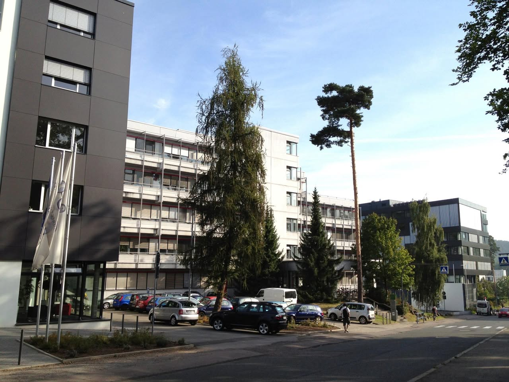
**이미지 캡션:** 이 사진은 현대적인 사무실 건물 단지를 보여주며, 왼쪽에는 검은색 외관의 5층 건물과 그 옆에 흰색 외관의 5층 건물이 나란히 서 있습니다. 검은색 건물 앞에는 여러 개의 깃발이 꽂혀 있고, 흰색 건물에는 창문이 규칙적으로 배열되어 있습니다. 건물 앞 주차장에는 다양한 색상의 승용차들이 주차되어 있으며, 그중에는 흰색 소형 SUV와 검은색 세단이 눈에 띕니다. 주차장 뒤편에는 키가 크고 앙상한 나무와 울창한 상록수가 서 있어 자연과 건물이 조화를 이루고 있습니다. 오른쪽에는 검은색과 유리로 된 현대적인 디자인의 건물이 보이며, 그 앞 도로에는 횡단보도와 신호등이 설치되어 있습니다. 도로에는 두 명의 성인 남성이 걸어가고 있으며, 한 명은 흰색 상의와 검은색 하의를 입고 있고 다른 한 명은 어두운 색상의 옷을 입고 있습니다. 전반적으로 맑은 날씨에 햇살이 비추는 평화롭고 일상적인 풍경을 담고 있습니다.의 건물이 보이며, 그 앞 도로에는 횡단보도와 신호등이 설치되어 있습니다. 도로에는 두 명의 성인 남성이 걸어가고 있으며, 한 명은 흰색 상의와 검은색 하의를 입고 있고 다른 한 명은 어두운 색상의 옷을 입고 있습니다. 전반적으로 맑은 날씨에 햇살이 비추는 평화롭고 일상적인 풍경을 담고 있습니다.
 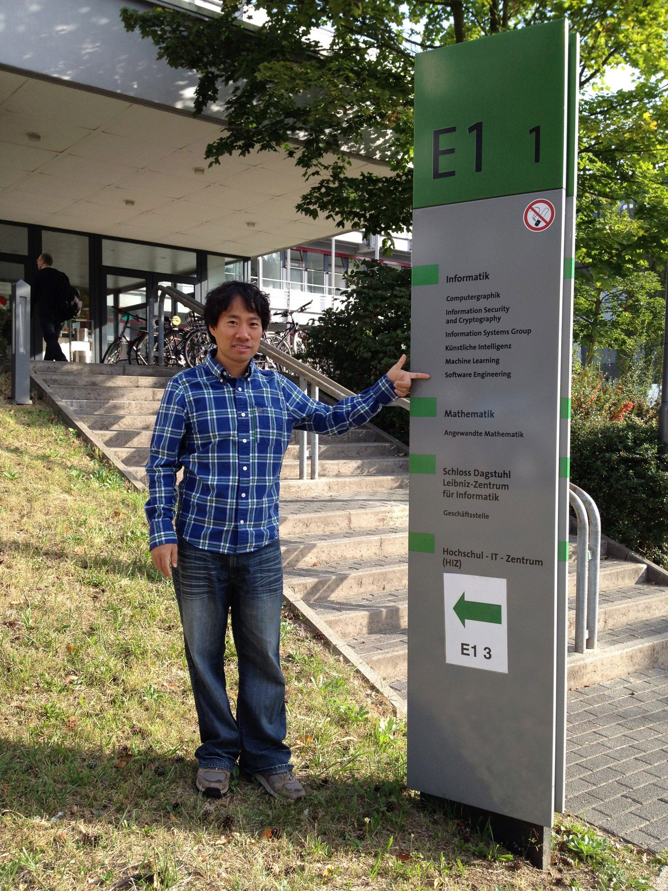
**이미지 캡션:** 한 명의 성인 남성이 푸른색과 흰색 체크무늬 셔츠와 청바지를 입고 잔디밭에 서서 오른손으로 건물 안내 표지판을 가리키고 있다. 남성은 30대 후반에서 40대 초반으로 보이며, 짧은 검은색 머리에 미소를 띠고 있다. 배경에는 계단과 현대적인 건물, 그리고 나무들이 보인다. 안내 표지판에는 "E1 1"이라는 글자와 함께 "Informatik" (정보학) 및 "Mathematik" (수학)과 관련된 여러 학과 이름들이 독일어로 적혀 있으며, "Schloss Dagstuhl Leibniz-Zentrum für Informatik" (슐로스 다그슈툴 라이프니츠 정보학 센터)와 "Hochschul-IT-Zentrum (HIZ)" (고등교육 IT 센터)라는 문구도 보인다. 표지판에는 금연 표시와 함께 "E1 3"이라는 방 번호와 화살표가 있다. 전체적으로 화창한 날씨에 대학 캠퍼스나 연구 단지의 한 장면으로, 학술적인 분위기를 풍긴다.ormatik" (슐로스 다그슈툴 라이프니츠 정보학 센터)와 "Hochschul-IT-Zentrum (HIZ)" (고등교육 IT 센터)라는 문구도 보인다. 표지판에는 금연 표시와 함께 "E1 3"이라는 방 번호와 화살표가 있다. 전체적으로 화창한 날씨에 대학 캠퍼스나 연구 단지의 한 장면으로, 학술적인 분위기를 풍긴다.
 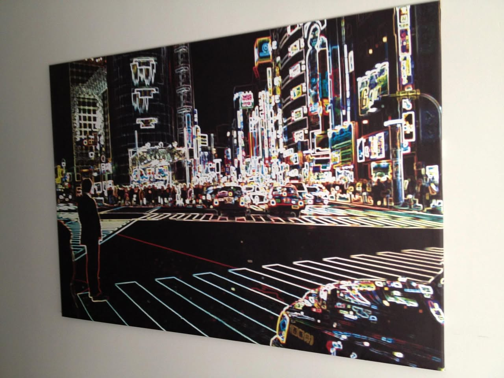
**이미지 캡션:** 이 그림은 밤에 네온 불빛으로 가득한 도시의 교차로를 보여줍니다. 그림 왼쪽에는 검은색 정장을 입은 성인 남성이 서 있으며, 그의 모습은 실루엣으로 처리되어 있습니다. 그는 교차로를 건너기 위해 기다리는 듯한 모습입니다. 배경에는 높은 건물들이 늘어서 있고, 건물 외벽에는 다양한 색상의 네온사인 간판들이 빛나고 있습니다. 거리에는 여러 대의 자동차가 지나가고 있으며, 사람들도 많이 보입니다. 도로에는 흰색과 파란색으로 강조된 횡단보도 선이 그려져 있습니다. 그림 전체적으로는 도시의 활기찬 밤 풍경을 표현하고 있으며, 네온 불빛의 강렬한 색감과 대비가 인상적입니다.있으며, 네온 불빛의 강렬한 색감과 대비가 인상적입니다.
 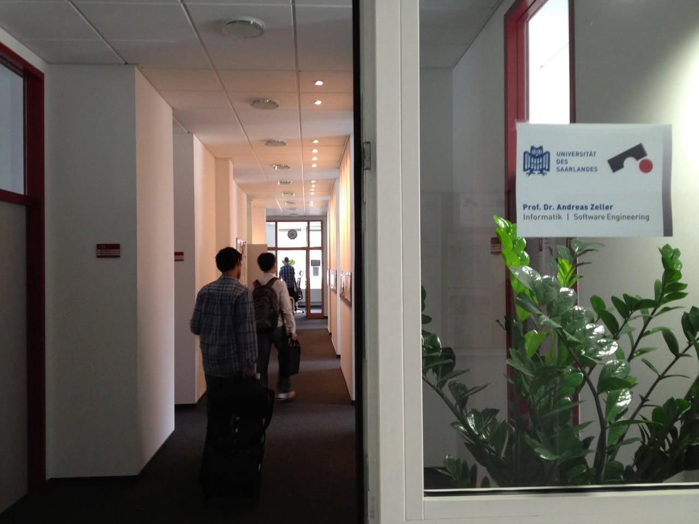
**이미지 캡션:** 복도에서 두 명의 젊은 성인 남성이 걸어가고 있으며, 한 명은 검은색 여행 가방을 끌고 있고 다른 한 명은 배낭을 메고 있다. 복도는 밝고 깨끗하며, 천장에는 조명이 설치되어 있고 벽에는 여러 개의 문이 보인다. 복도 끝에는 유리문이 있고, 그 너머로 또 다른 복도가 보인다. 유리문에는 "UNIVERSITÄT DES SAARLANDES"라고 적힌 표지판이 붙어 있으며, 그 아래에는 "Prof. Dr. Andreas Zeller Informatik | Software Engineering"이라고 쓰여 있다. 표지판 옆에는 녹색 식물이 놓여 있어 산뜻한 분위기를 더한다. 전반적으로 학술적인 분위기를 풍기는 현대적인 건물 내부의 모습이다.지판 옆에는 녹색 식물이 놓여 있어 산뜻한 분위기를 더한다. 전반적으로 학술적인 분위기를 풍기는 현대적인 건물 내부의 모습이다.
 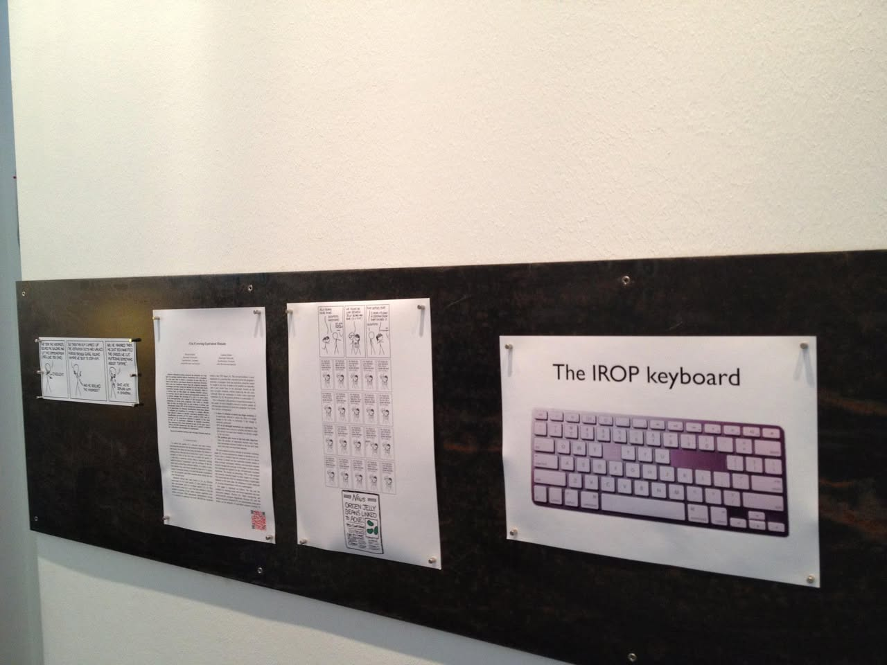
**이미지 캡션:** 흰색 벽에 걸린 검은색 판넬에는 네 개의 인쇄물이 부착되어 있으며, 왼쪽부터 만화 스트립, 두 개의 긴 텍스트 문서, 그리고 키보드 이미지와 제목이 있는 인쇄물 순서로 배치되어 있습니다. 가장 왼쪽의 만화 스트립은 두 개의 작은 패널로 구성되어 있으며, 각 패널에는 단순한 그림체로 그려진 두 명의 인물이 대화하는 모습이 담겨 있습니다. 오른쪽에서 두 번째 인쇄물은 여러 단락으로 구성된 긴 텍스트로, 일부는 영어로 작성된 것으로 보이며, 오른쪽 하단에는 QR 코드가 있습니다. 세 번째 인쇄물은 세로로 길게 늘어선 여러 개의 작은 그림으로 이루어진 만화 스트립이며, 각 그림에는 단순한 인물들이 그려져 있습니다. 가장 오른쪽 인쇄물에는 "The IROP keyboard"라는 제목과 함께 보라색으로 강조된 키가 있는 키보드 이미지가 인쇄되어 있습니다. 전체적으로 전시회나 발표회에서 사용될 법한 자료들이 벽에 게시된 모습이며, 차분하고 정보 전달에 초점을 맞춘 분위기입니다.선 여러 개의 작은 그림으로 이루어진 만화 스트립이며, 각 그림에는 단순한 인물들이 그려져 있습니다. 가장 오른쪽 인쇄물에는 "The IROP keyboard"라는 제목과 함께 보라색으로 강조된 키가 있는 키보드 이미지가 인쇄되어 있습니다. 전체적으로 전시회나 발표회에서 사용될 법한 자료들이 벽에 게시된 모습이며, 차분하고 정보 전달에 초점을 맞춘 분위기입니다.
 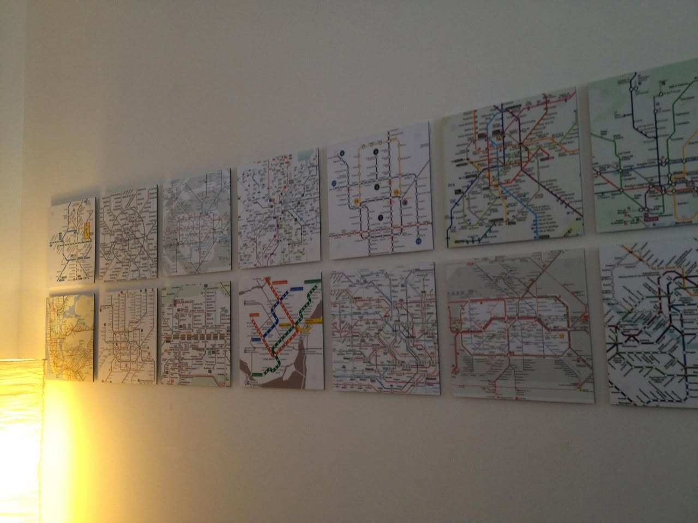
**이미지 캡션:** 벽에 여러 개의 지하철 노선도가 액자에 담겨 걸려 있다. 왼쪽에는 노란색 조명이 비추고 있어 따뜻하고 아늑한 분위기를 연출한다. 노선도들은 다양한 도시의 대중교통망을 보여주는 것으로 보이며, 복잡하게 얽힌 선들과 역 이름들이 빼곡하게 적혀 있다. 일부 노선도는 색깔별로 구분되어 있어 이해를 돕는다. 전체적으로 깔끔하고 정돈된 느낌을 주며, 여행이나 도시 탐험에 대한 관심을 불러일으킨다.
 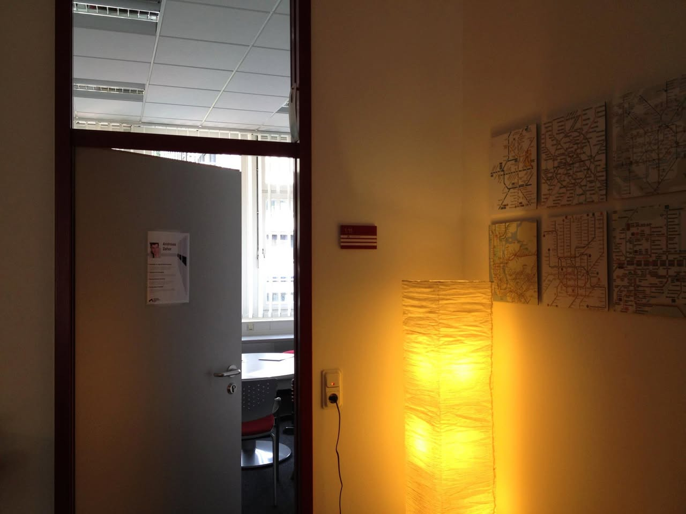
**이미지 캡션:** 문이 열린 사무실 복도에는 벽에 여러 개의 지하철 노선도가 걸려 있고, 바닥에는 종이 재질의 긴 직사각형 스탠드 조명이 놓여 있어 따뜻하고 아늑한 분위기를 연출합니다. 문에는 "Andreas Bauer"라고 적힌 명함이 붙어 있으며, 명함에는 작은 사진과 함께 이름, 직책, 연락처 정보가 포함되어 있습니다. 문 너머로 보이는 사무실 안에는 회의용 테이블과 의자가 보이며, 창문에는 블라인드가 쳐져 있습니다. 천장에는 형광등이 설치되어 있으며, 벽에는 빨간색 소화기 표시가 붙어 있습니다. 전반적으로 이 공간은 사무실의 일부로 보이며, 개인적인 터치와 실용적인 요소가 결합되어 있습니다.무실의 일부로 보이며, 개인적인 터치와 실용적인 요소가 결합되어 있습니다.
 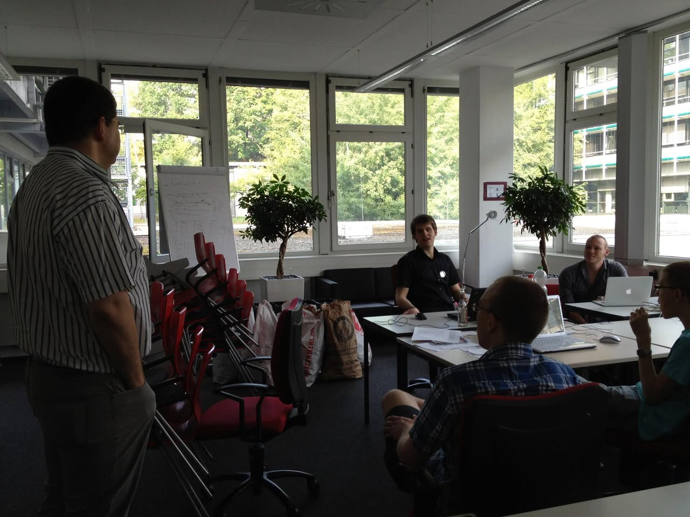
**이미지 캡션:** 사무실 공간에서 여러 사람이 회의를 하고 있으며, 창밖으로는 나무가 우거진 풍경이 보입니다. 사진 왼쪽에는 줄무늬 셔츠를 입고 회색 바지를 입은 성인 남성이 서서 창밖을 바라보고 있으며, 그의 손은 바지 주머니에 있습니다. 그의 앞에는 빨간색 의자들이 쌓여 있고, 그 옆에는 화이트보드가 있습니다. 중앙에는 검은색 셔츠를 입은 젊은 성인 남성이 테이블에 앉아 있으며, 그의 앞에는 노트북과 물병이 놓여 있습니다. 그의 옆에는 회색 셔츠를 입은 성인 남성이 노트북을 바라보고 있습니다. 테이블 위에는 서류와 노트북이 여러 개 놓여 있으며, 바닥에는 갈색 봉투들이 보입니다. 전반적으로 차분하고 업무적인 분위기입니다. 여러 개 놓여 있으며, 바닥에는 갈색 봉투들이 보입니다. 전반적으로 차분하고 업무적인 분위기입니다.
 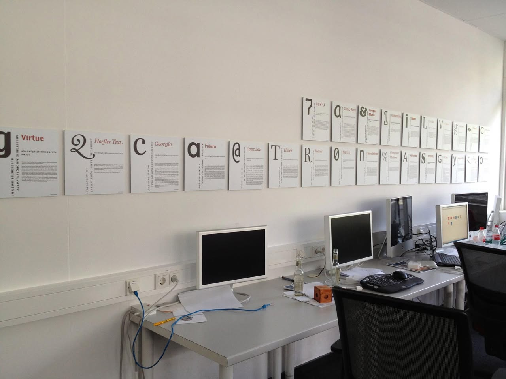
**이미지 캡션:** 이 사진은 현대적인 사무실 또는 강의실의 한쪽 벽면을 보여준다. 벽에는 다양한 글꼴의 이름과 함께 각 글꼴의 특징을 보여주는 인쇄물이 줄지어 걸려 있다. 'Virtue', 'Hoefler Text', 'Georgia', 'Futura', 'Courier', 'Times' 등 유명한 글꼴들이 보이며, 각 인쇄물에는 글꼴의 알파벳, 숫자, 특수문자 예시와 함께 작은 텍스트가 포함되어 있다. 벽 아래로는 여러 대의 컴퓨터와 책상이 놓여 있으며, 책상 위에는 모니터, 키보드, 마우스, 병, 서류 등이 흩어져 있다. 전반적으로 깔끔하고 정돈된 분위기이며, 디자인이나 타이포그래피 관련 학습 또는 업무 공간으로 보인다. 사람들은 보이지 않는다.전반적으로 깔끔하고 정돈된 분위기이며, 디자인이나 타이포그래피 관련 학습 또는 업무 공간으로 보인다. 사람들은 보이지 않는다.
 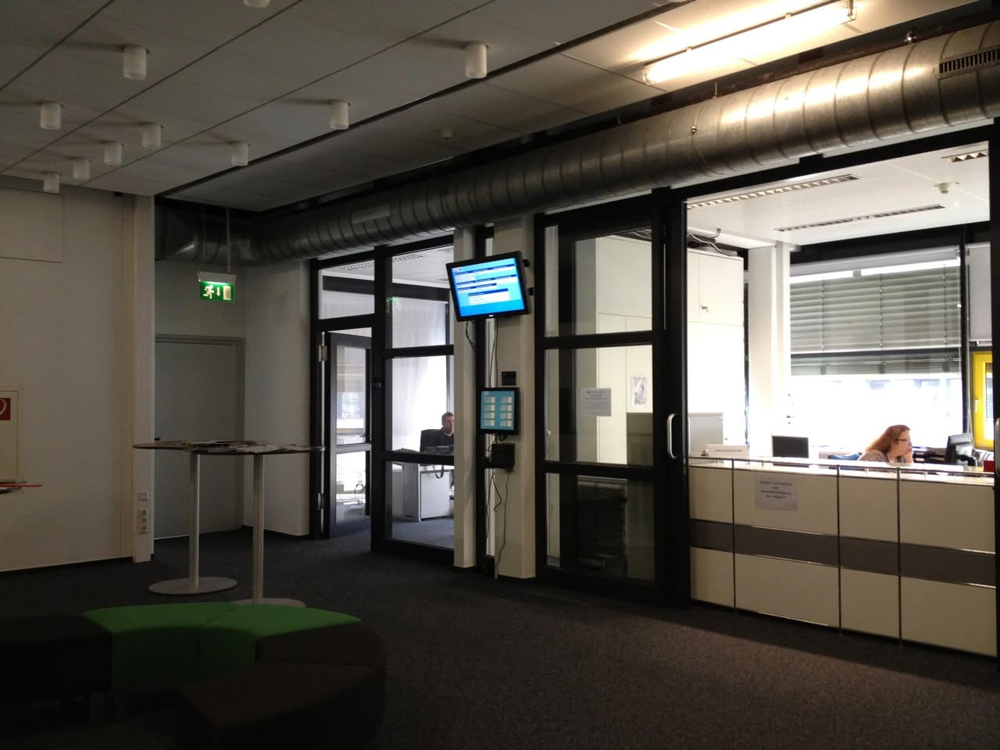
**이미지 캡션:** 이 사진은 현대적인 사무실 로비 또는 공용 공간을 보여줍니다. 중앙에는 유리문과 검은색 프레임으로 된 출입구가 있으며, 그 안으로 사무실 내부가 보입니다. 출입구 옆에는 두 개의 모니터가 벽에 걸려 있고, 한 모니터에는 파란색 배경에 흰색 글자가 표시되어 있습니다. 바닥은 짙은 회색 카펫으로 덮여 있으며, 왼쪽에는 녹색과 검은색으로 된 독특한 모양의 소파가 놓여 있습니다. 공간 중앙에는 두 개의 다리가 있는 둥근 테이블이 있으며, 테이블 위에는 여러 장의 종이가 놓여 있습니다. 천장에는 흰색 조명과 함께 크고 은색의 환풍관이 지나가고 있습니다. 오른쪽에는 안내 데스크가 있으며, 데스크 뒤에는 한 명의 성인 여성이 앉아 컴퓨터를 보고 있습니다. 그녀는 갈색 머리를 하고 있으며, 안경을 쓰고 있습니다. 안내 데스크 앞쪽에는 독일어로 된 안내문이 붙어 있습니다. 전체적으로 깔끔하고 정돈된 분위기이며, 업무 공간의 일부로 보입니다. 은색의 환풍관이 지나가고 있습니다. 오른쪽에는 안내 데스크가 있으며, 데스크 뒤에는 한 명의 성인 여성이 앉아 컴퓨터를 보고 있습니다. 그녀는 갈색 머리를 하고 있으며, 안경을 쓰고 있습니다. 안내 데스크 앞쪽에는 독일어로 된 안내문이 붙어 있습니다. 전체적으로 깔끔하고 정돈된 분위기이며, 업무 공간의 일부로 보입니다.
 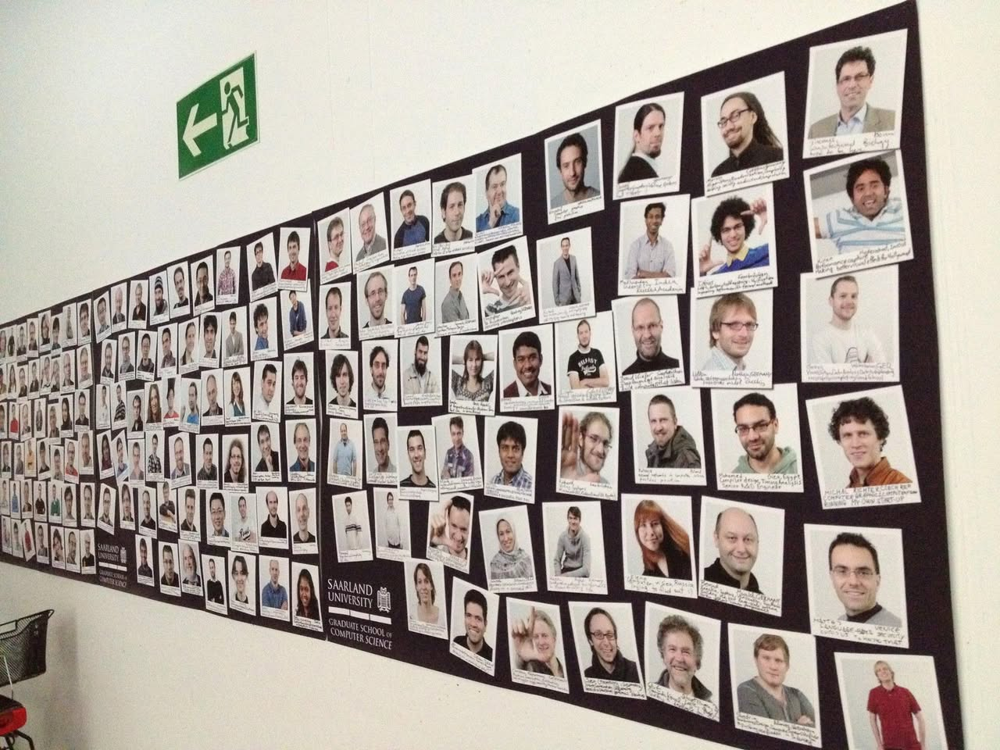
**이미지 캡션:** 이 사진은 흰색 벽에 걸린 검은색 게시판에 부착된 수많은 사람들의 증명사진을 보여줍니다. 사진들은 여러 줄로 배열되어 있으며, 각 사진에는 사람의 얼굴이 담겨 있습니다. 대부분의 사람들은 성인 남성이며, 일부는 성인 여성입니다. 나이대는 20대 초반부터 50대까지 다양해 보입니다. 사람들은 다양한 표정과 복장을 하고 있으며, 일부는 미소를 짓고 있고 일부는 무표정합니다. 몇몇 사진에는 이름이나 직책으로 보이는 텍스트가 적혀 있습니다. 게시판 왼쪽 상단에는 녹색 바탕에 흰색 화살표가 그려진 비상구 표지판이 보입니다. 게시판 하단에는 "SAARLAND UNIVERSITY GRADUATE SCHOOL OF COMPUTER SCIENCE"라는 문구가 흰색 글씨로 적혀 있습니다. 전체적으로 학술 기관의 구성원들을 소개하는 게시판으로 보이며, 차분하고 전문적인 분위기를 풍깁니다.니다. 게시판 하단에는 "SAARLAND UNIVERSITY GRADUATE SCHOOL OF COMPUTER SCIENCE"라는 문구가 흰색 글씨로 적혀 있습니다. 전체적으로 학술 기관의 구성원들을 소개하는 게시판으로 보이며, 차분하고 전문적인 분위기를 풍깁니다.
 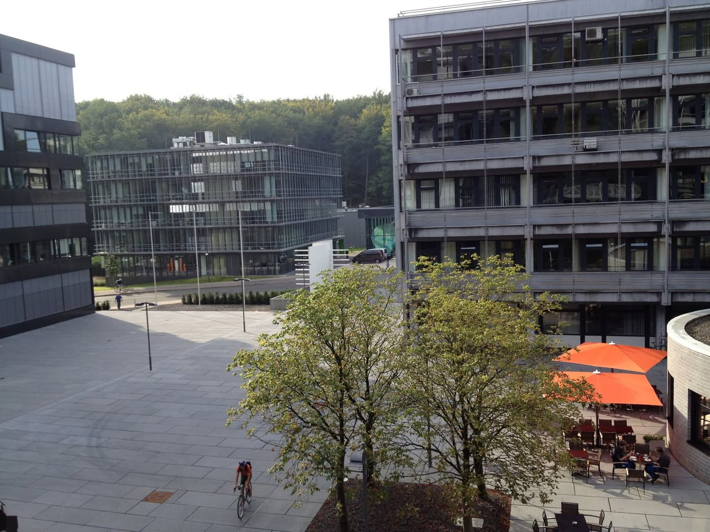
**이미지 캡션:** 넓은 회색 타일로 포장된 광장에는 두 그루의 나무가 서 있고, 그 뒤로는 현대적인 사무실 건물이 보인다. 오른쪽에 있는 건물은 회색 외벽과 많은 창문을 가지고 있으며, 건물 앞에는 주황색 파라솔 아래 테이블과 의자가 놓여 있다. 광장에는 두 명의 사람이 자전거를 타고 있고, 한 명은 멀리 걸어가고 있다. 배경에는 숲이 우거진 언덕이 있고, 하늘은 맑고 푸르다. 전반적으로 평화롭고 현대적인 분위기이다.
 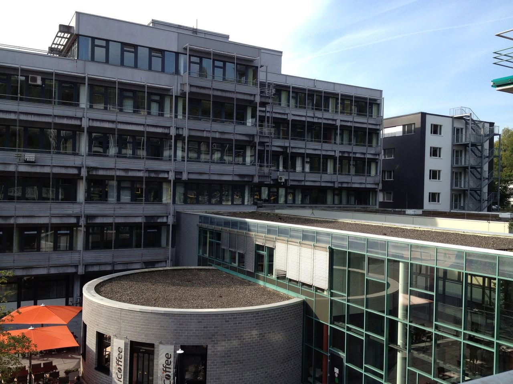
**이미지 캡션:** 이 사진은 현대적인 사무실 건물 단지를 보여줍니다. 중앙에는 회색의 다층 건물로, 수많은 창문과 외부 계단이 특징입니다. 이 건물 옆에는 검은색과 흰색의 더 작은 건물이 있으며, 역시 외부 계단이 있습니다. 두 건물 앞에는 유리로 된 복도가 연결되어 있으며, 그 너머로 둥근 모양의 회색 벽돌 건물과 오렌지색 파라솔이 펼쳐진 야외 공간이 보입니다. 둥근 건물에는 "iCoffee"라고 쓰인 두 개의 배너가 걸려 있습니다. 전반적으로 맑은 날씨에 현대적인 도시 풍경을 연출하고 있습니다.
 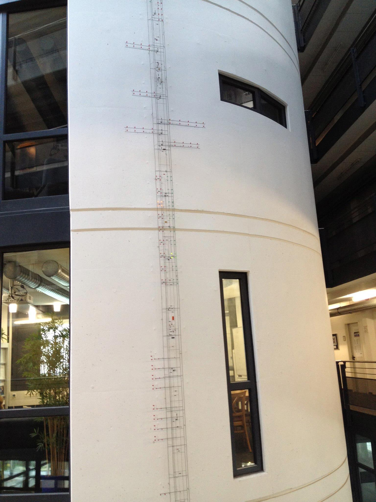
**이미지 캡션:** 이 사진은 현대적인 건물 내부의 원통형 벽면을 보여줍니다. 벽면에는 복잡한 격자 구조와 함께 수많은 작은 빨간색 점들이 일렬로 배열되어 있어 어떤 종류의 시스템이나 장치임을 암시합니다. 벽면에는 두 개의 창문이 있는데, 하나는 아치형이고 다른 하나는 길고 좁은 직사각형 모양입니다. 왼쪽에는 또 다른 건물의 내부가 비쳐 보이는데, 이곳에는 대나무와 같은 식물들이 보이고 환기 덕트와 조명 시설도 있습니다. 전체적으로 차분하고 기능적인 분위기를 자아내며, 아마도 사무실이나 공공 공간의 일부일 것으로 추정됩니다. 사람이나 텍스트는 명확하게 보이지 않습니다.람이나 텍스트는 명확하게 보이지 않습니다.
 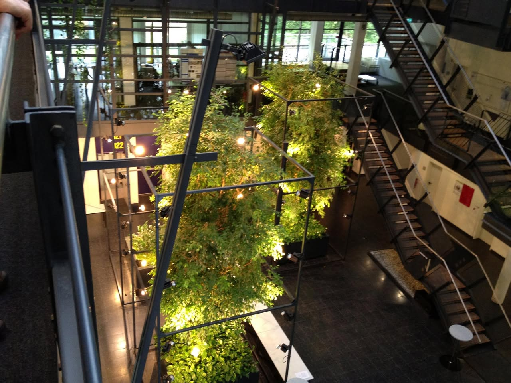
**이미지 캡션:** 건물 내부의 복층 구조를 보여주는 사진으로, 중앙에는 여러 층에 걸쳐 인공 나무들이 배치되어 있으며 따뜻한 조명으로 빛나고 있습니다. 왼쪽에는 금속 난간과 계단이 보이며, 오른쪽에는 여러 층으로 이어지는 계단과 복도가 보입니다. 계단 옆 벽에는 흰색 문과 빨간색 사각형 표지판이 있습니다. 바닥은 어두운 색상의 타일로 마감되어 있으며, 곳곳에 조명이 설치되어 있습니다. 사진 상단에는 창문이 있어 외부의 빛이 들어오고 있으며, 창문 너머로 녹색 식물들이 보입니다. 전체적으로 현대적이고 세련된 분위기를 자아내며, 실내 정원과 같은 느낌을 줍니다. 사람들은 보이지 않으며, 텍스트로는 "122"라는 숫자가 적힌 표지판이 희미하게 보입니다.실내 정원과 같은 느낌을 줍니다. 사람들은 보이지 않으며, 텍스트로는 "122"라는 숫자가 적힌 표지판이 희미하게 보입니다.
 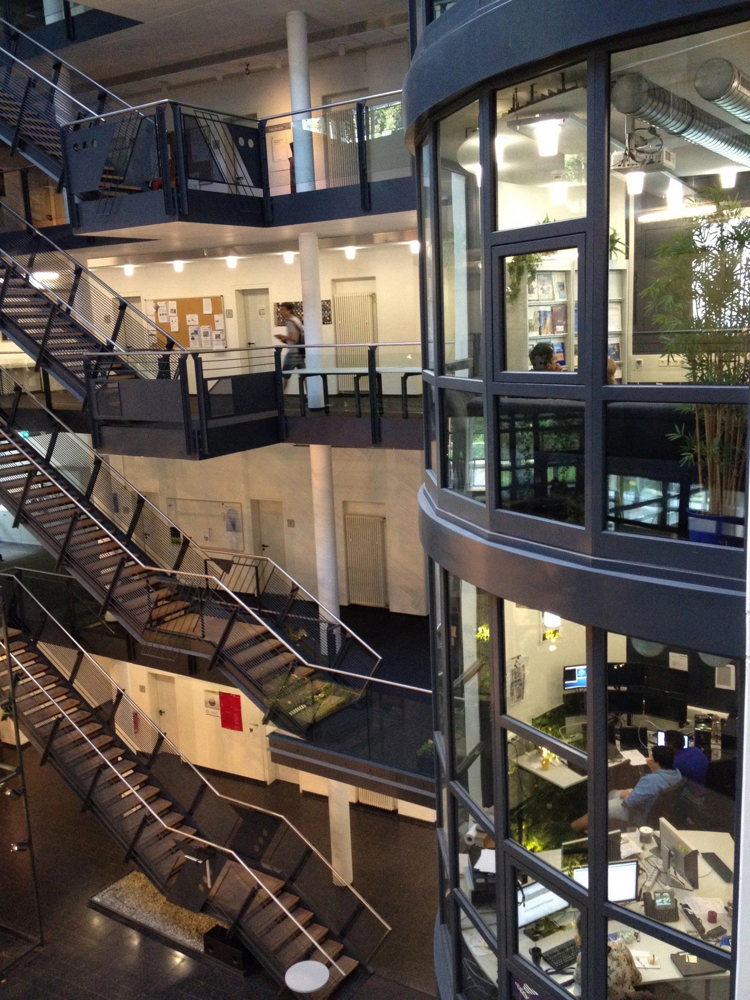
**이미지 캡션:** 이 사진은 여러 층으로 이루어진 현대적인 사무실 건물의 내부를 보여줍니다. 중앙에는 넓은 아트리움 공간이 있으며, 계단과 복도가 여러 층을 연결하고 있습니다. 왼쪽에는 금속 난간이 있는 여러 개의 계단이 보이며, 각 계단은 짙은 갈색 나무 발판으로 되어 있습니다. 계단 옆에는 흰색 벽과 문이 있는 복도가 있고, 벽에는 게시판과 포스터가 붙어 있습니다. 오른쪽에는 유리로 된 곡선형 건물이 있으며, 내부 사무실 공간이 보입니다. 사무실 안에는 여러 명의 사람들이 컴퓨터 앞에서 일하고 있으며, 책상 위에는 모니터, 키보드, 전화기 등이 놓여 있습니다. 식물도 곳곳에 배치되어 있어 실내 공간에 생기를 더하고 있습니다. 전체적으로 밝고 현대적인 분위기이며, 업무와 소통이 이루어지는 역동적인 공간임을 알 수 있습니다. 키보드, 전화기 등이 놓여 있습니다. 식물도 곳곳에 배치되어 있어 실내 공간에 생기를 더하고 있습니다. 전체적으로 밝고 현대적인 분위기이며, 업무와 소통이 이루어지는 역동적인 공간임을 알 수 있습니다.
 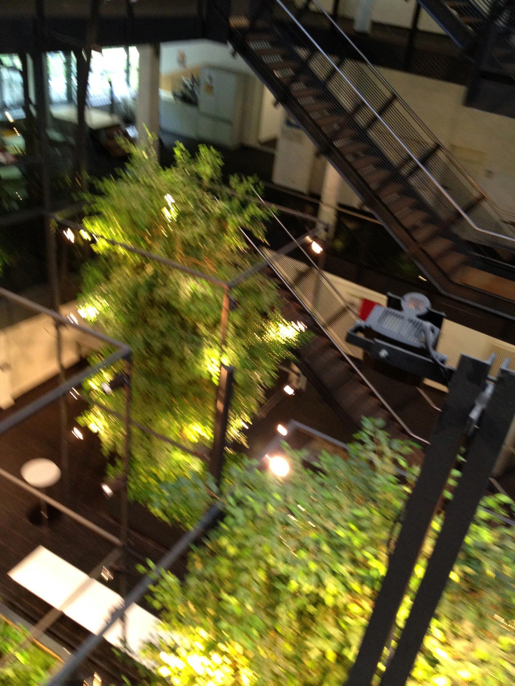
**이미지 캡션:** 이 사진은 실내 공간의 높은 곳에서 아래를 내려다본 모습으로, 여러 층으로 이루어진 복합적인 구조를 보여준다. 중앙에는 푸른 식물들이 풍성하게 자라고 있으며, 따뜻한 조명이 식물들을 비추고 있어 생기 넘치는 분위기를 연출한다. 식물들은 여러 층에 걸쳐 배치되어 있어 마치 실내 정원처럼 보인다. 오른편에는 철제 계단이 위로 뻗어 있으며, 계단 옆에는 에스컬레이터로 보이는 구조물도 있다. 계단과 에스컬레이터는 현대적인 디자인으로 공간의 기능성을 더한다. 배경에는 사무실이나 상업 공간으로 보이는 곳들이 희미하게 보이며, 창문을 통해 외부의 빛이 들어오는 듯하다. 전반적으로 현대적이고 세련된 인테리어에 자연적인 요소를 조화롭게 배치하여 편안하고 쾌적한 느낌을 주는 공간이다. 사진은 약간의 흔들림이 있어 역동적인 느낌을 주기도 한다.이며, 창문을 통해 외부의 빛이 들어오는 듯하다. 전반적으로 현대적이고 세련된 인테리어에 자연적인 요소를 조화롭게 배치하여 편안하고 쾌적한 느낌을 주는 공간이다. 사진은 약간의 흔들림이 있어 역동적인 느낌을 주기도 한다.
 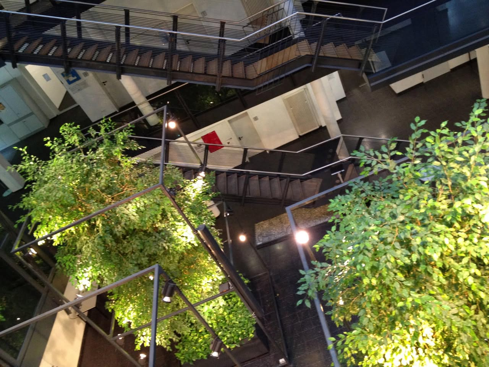
**이미지 캡션:** 이 사진은 현대적인 건물 내부의 복층 구조를 보여주며, 중앙에는 여러 층에 걸쳐 인공 나무가 배치되어 있습니다. 사진은 위에서 아래를 내려다보는 각도로 촬영되었으며, 금속 난간과 계단이 복잡하게 얽혀 있는 모습을 볼 수 있습니다. 녹색 잎이 무성한 인공 나무는 금속 프레임 구조물 안에 자리 잡고 있으며, 조명에 의해 밝게 빛나고 있습니다. 계단은 어두운 색상의 금속으로 만들어졌고, 촘촘한 간격의 발판이 특징입니다. 배경에는 흰색 벽과 문, 그리고 어두운 바닥이 보이며, 일부 벽에는 파란색과 빨간색의 표지판이나 장식이 부착되어 있습니다. 사진 속에는 사람이 보이지 않으며, 전체적으로 차분하고 현대적인 분위기를 자아냅니다. 장식이 부착되어 있습니다. 사진 속에는 사람이 보이지 않으며, 전체적으로 차분하고 현대적인 분위기를 자아냅니다.
 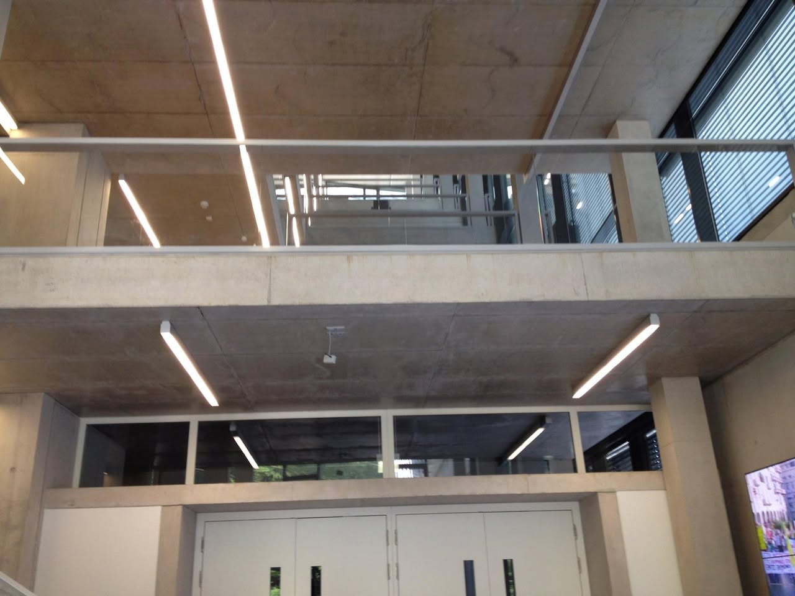
**이미지 캡션:** 이 사진은 현대적인 건축 양식의 실내 공간을 보여줍니다. 콘크리트 천장과 벽이 노출되어 있으며, 곳곳에 긴 직선 형태의 형광등이 설치되어 있어 밝고 깔끔한 분위기를 연출합니다. 2층으로 올라가는 계단이 보이며, 2층 난간은 투명한 유리와 금속 재질로 되어 있어 개방감을 더합니다. 2층 창문에는 블라인드가 설치되어 있어 외부의 빛을 조절하고 있습니다. 1층에는 흰색 문 두 개가 나란히 있으며, 문 위쪽으로는 넓은 창문이 있어 내부를 엿볼 수 있습니다. 사진 오른쪽에는 대형 스크린이 설치되어 있으며, 스크린에는 도시 풍경이 담긴 이미지가 표시되어 있습니다. 전체적으로 차갑고 미니멀한 느낌을 주지만, 조명과 창문을 통해 들어오는 빛이 공간을 따뜻하게 만들어 줍니다. 사람이나 특정 사물은 보이지 않으며, 건축물의 구조와 디자인에 초점을 맞춘 사진입니다.도시 풍경이 담긴 이미지가 표시되어 있습니다. 전체적으로 차갑고 미니멀한 느낌을 주지만, 조명과 창문을 통해 들어오는 빛이 공간을 따뜻하게 만들어 줍니다. 사람이나 특정 사물은 보이지 않으며, 건축물의 구조와 디자인에 초점을 맞춘 사진입니다.
 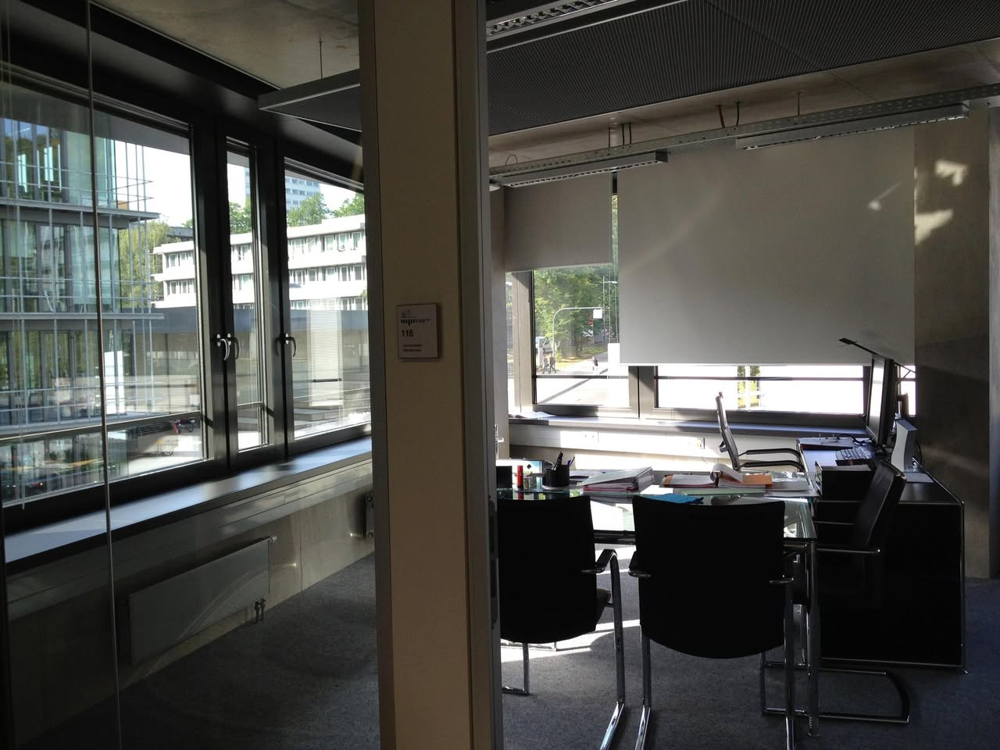
**이미지 캡션:** 이 사진은 현대적인 사무실 내부를 보여주며, 넓은 창문을 통해 바깥 풍경이 보인다. 창문 밖으로는 현대적인 디자인의 건물과 나무가 보이며, 햇빛이 강하게 들어와 밝고 시원한 느낌을 준다. 사무실 안에는 유리 책상과 검은색 의자 두 개가 놓여 있으며, 책상 위에는 서류와 컴퓨터, 펜 등이 정리되어 있다. 책상 뒤쪽으로는 또 다른 창문이 있고, 그 창문에는 롤스크린이 내려져 있어 빛을 조절하고 있다. 사무실 벽에는 "116"이라고 적힌 표지판이 붙어 있다. 전체적으로 깔끔하고 정돈된 분위기의 사무실이며, 업무에 집중하기 좋은 환경으로 보인다.집중하기 좋은 환경으로 보인다.
 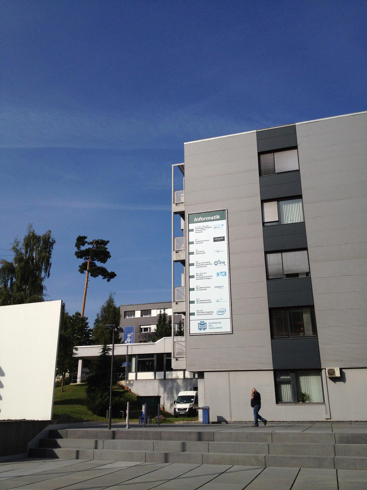
**이미지 캡션:** 푸른 하늘 아래 현대적인 회색 건물 앞에 한 성인 남성이 걷고 있다. 남성은 검은색 상의와 청바지를 입고 있으며, 평범한 걸음걸이로 건물 앞을 지나가고 있다. 건물 외벽에는 "Informatik"이라는 글자와 함께 여러 기관의 로고와 이름이 적힌 대형 현수막이 걸려 있다. 현수막에는 "Intel" 로고와 "UNIVERSITÄT des SAARLANDES"라는 글자도 보인다. 건물 앞에는 계단식의 넓은 광장이 있으며, 주변에는 푸른 잔디와 나무들이 보인다. 건물 뒤편에는 또 다른 건물이 보이고, 흰색 승합차와 파란색 쓰레기통도 눈에 띈다. 전체적으로 맑고 쾌청한 날씨 속에서 학술적인 분위기를 풍기는 현대적인 캠퍼스 풍경이다.파란색 쓰레기통도 눈에 띈다. 전체적으로 맑고 쾌청한 날씨 속에서 학술적인 분위기를 풍기는 현대적인 캠퍼스 풍경이다.
 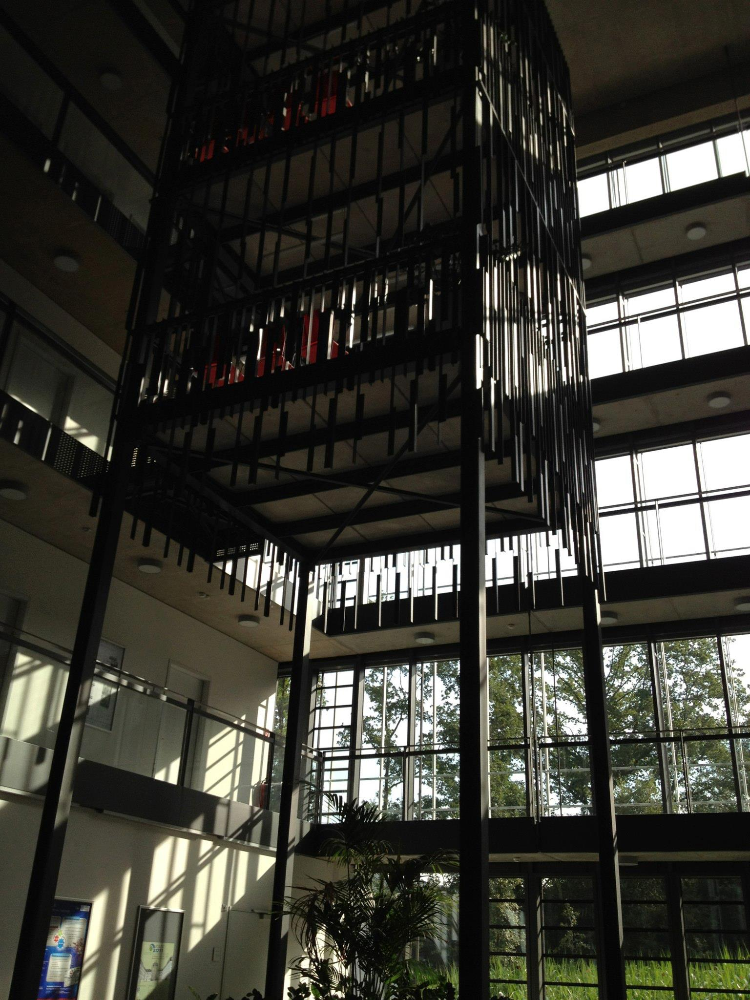
**이미지 캡션:** 이 사진은 현대적인 건물 내부의 아트리움을 보여줍니다. 중앙에는 철골 구조의 다층 구조물이 있으며, 각 층은 난간으로 둘러싸여 있습니다. 이 구조물 안쪽에는 붉은색 의자들이 보입니다. 건물 내부에는 여러 층의 복도가 있으며, 복도에는 창문과 문이 있습니다. 복도 벽에는 포스터가 붙어 있습니다. 건물 외부로는 큰 창문을 통해 나무와 풀이 우거진 풍경이 보입니다. 햇빛이 창문을 통해 들어와 건물 내부에 그림자를 드리우고 있으며, 이는 공간에 깊이감과 드라마틱한 분위기를 더합니다. 사진에는 사람이 보이지 않으며, 전반적으로 조용하고 차분한 분위기입니다.전반적으로 조용하고 차분한 분위기입니다.
 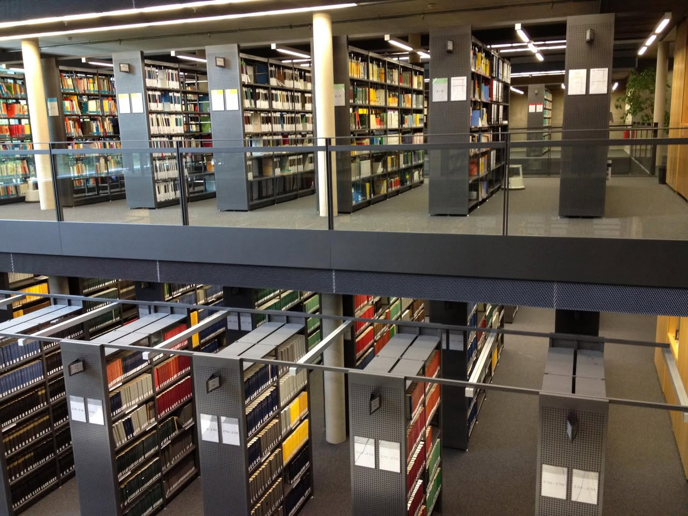
**이미지 캡션:** 이 사진은 현대적인 도서관의 내부를 보여주며, 여러 층으로 이루어진 서가와 복도가 특징입니다. 사진의 상단 부분에는 짙은 회색의 금속 서가들이 빽빽하게 들어차 있으며, 각 서가에는 다양한 색상의 책들이 질서정연하게 꽂혀 있습니다. 서가 사이에는 유리 난간이 설치된 복도가 있어 도서관의 구조를 파악할 수 있습니다. 천장에는 조명등이 일렬로 배치되어 밝고 깔끔한 분위기를 연출합니다. 사진의 하단 부분에서는 더 많은 서가들이 보이며, 이 역시 다양한 색상의 책들로 가득 차 있습니다. 서가 기둥에는 흰색 종이가 부착되어 있어 도서 분류 정보 등을 담고 있을 것으로 추정됩니다. 전반적으로 조용하고 학구적인 분위기가 느껴지며, 많은 책들이 보관되어 있어 연구나 학습에 적합한 장소임을 알 수 있습니다. 사람의 모습은 보이지 않으며, 오직 책과 서가, 그리고 건축 구조물만이 사진에 담겨 있습니다.되어 있어 도서 분류 정보 등을 담고 있을 것으로 추정됩니다. 전반적으로 조용하고 학구적인 분위기가 느껴지며, 많은 책들이 보관되어 있어 연구나 학습에 적합한 장소임을 알 수 있습니다. 사람의 모습은 보이지 않으며, 오직 책과 서가, 그리고 건축 구조물만이 사진에 담겨 있습니다.
 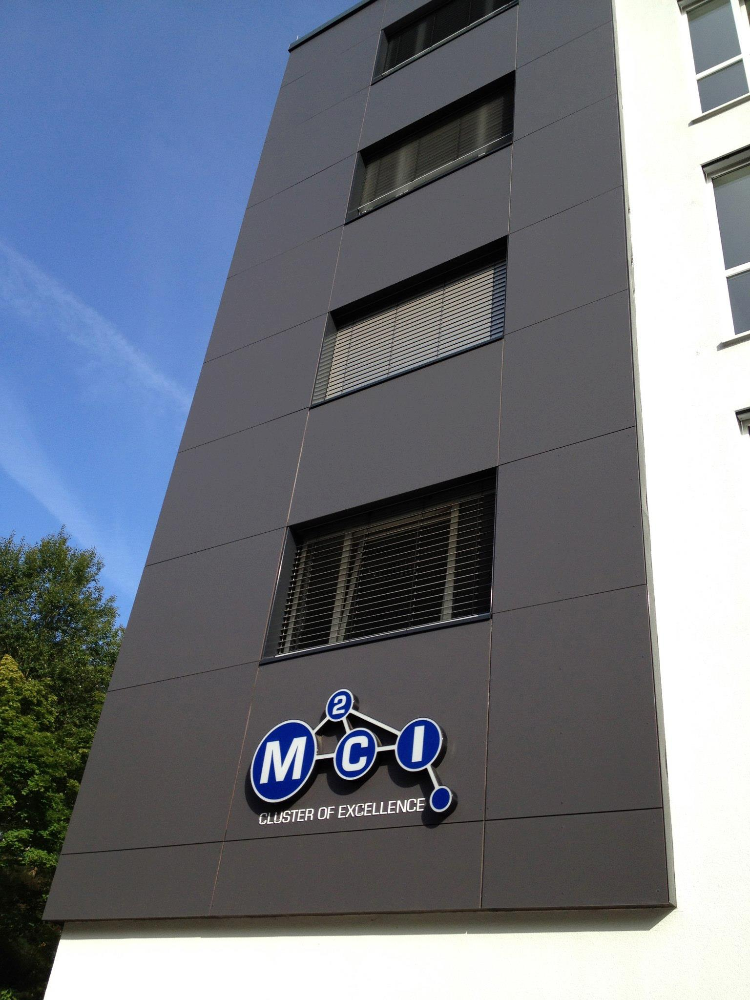
**이미지 캡션:** 푸른 하늘을 배경으로 현대적인 회색 건물 외벽에 MCI 로고와 "CLUSTER OF EXCELLENCE"라는 문구가 새겨져 있습니다. 건물은 여러 층으로 이루어져 있으며, 각 층마다 창문이 나 있습니다. 창문에는 블라인드가 쳐져 있어 내부가 보이지 않습니다. 건물 왼쪽에는 푸른 나무들이 보이며, 맑고 화창한 날씨임을 알 수 있습니다. MCI 로고는 파란색 원 안에 흰색 글자로 "M", "C", "I"가 적혀 있고, 숫자 "2"와 연결된 구조로 디자인되어 있습니다. 전체적으로 깔끔하고 전문적인 분위기를 풍깁니다..

> IMG_3780
> IMG_3781
> IMG_3783
> IMG_3787
> IMG_3789
> IMG_3791
> IMG_3792
> IMG_3793
> IMG_3794
> IMG_3797
> IMG_3798
> IMG_3803
> IMG_3804
> IMG_3806
> IMG_3807
> IMG_3808
> IMG_3809
> IMG_3812
> IMG_3813
> IMG_3814
> IMG_3815
> IMG_3816
> IMG_3817
> IMG_3819
> IMG_3820
> IMG_3821
> IMG_3822
> IMG_3823
> IMG_3824
> IMG_3825
> IMG_3826
> IMG_3827
> IMG_3828
> IMG_3829

### 9월 11일 (화) 03:07 · could not leave Frankfurt without withou…

could not leave Frankfurt without without Frankfurt sausages. :-)

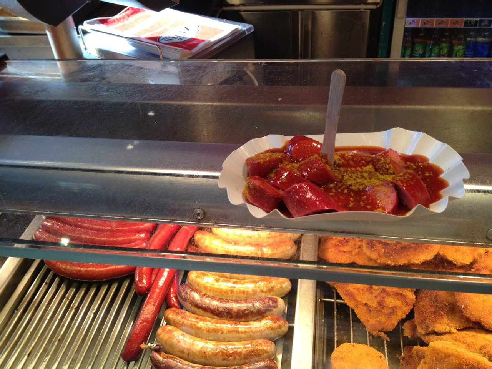
**이미지 캡션:** 이 사진은 음식점의 진열대를 보여주며, 다양한 종류의 소시지와 커리부어스트가 눈에 띈다. 중앙에는 하얀 종이 접시에 담긴 커리부어스트가 놓여 있는데, 붉은색 소시지가 먹기 좋게 잘려 있고 그 위에 걸쭉한 소스와 노란색 카레 가루가 뿌려져 있다. 소시지에는 나무 막대가 꽂혀 있어 집어 먹기 편리해 보인다. 커리부어스트 접시 아래로는 여러 개의 소시지가 진열되어 있는데, 굵고 붉은 소시지부터 얇고 갈색빛을 띠는 소시지까지 다양하다. 또한, 소시지 옆으로는 튀김옷을 입혀 튀긴 것으로 보이는 돈까스 같은 음식들이 진열되어 있어 풍성한 먹거리를 제공하는 곳임을 짐작게 한다. 배경에는 금속 재질의 진열대와 함께 음료수 병들이 보이며, 전체적으로 분주하고 활기찬 음식점의 분위기를 느낄 수 있다.열되어 있어 풍성한 먹거리를 제공하는 곳임을 짐작게 한다. 배경에는 금속 재질의 진열대와 함께 음료수 병들이 보이며, 전체적으로 분주하고 활기찬 음식점의 분위기를 느낄 수 있다.

### 9월 11일 (화) 03:42 · Sung Kim shared a link.

🔗 <http://sailhome.cs.queensu.ca/mud/home/>

### 9월 11일 (화) 22:02 · had a totally wonderful time visiting An…

had a totally wonderful time visiting Andreas Zeller's lab thanks to Zeller's warm welcome and the nice tour of campus and his lab. Sung also thanks Zeller for picking us up at the Saarbrucken station and sending off this morning. It was completely excellent!

### 9월 11일 (화) 22:52 · sounds fun!

sounds fun!

### 9월 15일 (토) 13:34 · GANGNAM STYLE at NBC TODAY LIVE SHOW! En…

GANGNAM STYLE at NBC TODAY LIVE SHOW! Enjoy!!

🔗 <http://www.youtube.com/watch?v=7dlhhfpFBTk>

### 9월 20일 (목) 19:22 · My lunch today!

My lunch today!

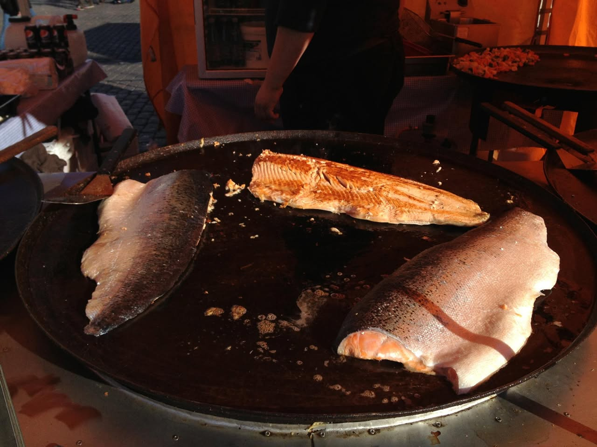
**이미지 캡션:** 이 사진은 야외 시장이나 푸드 트럭에서 생선을 요리하는 모습을 보여줍니다. 중앙에는 커다란 검은색 프라이팬이 있고, 그 위에는 세 조각의 생선이 놓여 있습니다. 왼쪽에는 은색 비늘이 보이는 생선 한 토막이 있고, 오른쪽에는 핑크색 살이 보이는 커다란 생선 토막이 있습니다. 생선 위에는 기름이 튀어 있고, 프라이팬 가장자리에는 기름이 끓고 있습니다. 프라이팬 위쪽에는 이미 조리된 듯한 연어 필레 한 조각이 놓여 있습니다. 배경에는 주황색 천막과 함께 몇 개의 테이블이 보이며, 테이블 위에는 음료수 병과 다른 음식 재료들이 놓여 있습니다. 사진 오른쪽 상단에는 성인 남성으로 보이는 사람이 검은색 옷을 입고 서서 무언가를 하고 있는 모습이 희미하게 보입니다. 전반적으로 활기찬 시장 분위기 속에서 신선한 해산물을 즉석에서 조리하는 모습을 담고 있습니다.식 재료들이 놓여 있습니다. 사진 오른쪽 상단에는 성인 남성으로 보이는 사람이 검은색 옷을 입고 서서 무언가를 하고 있는 모습이 희미하게 보입니다. 전반적으로 활기찬 시장 분위기 속에서 신선한 해산물을 즉석에서 조리하는 모습을 담고 있습니다.

### 9월 22일 (토) 00:39 · is so ready for a walk in Sweden in Sept…

📍 Grand Hotel i Lund

is so ready for a walk in Sweden in September. :-)

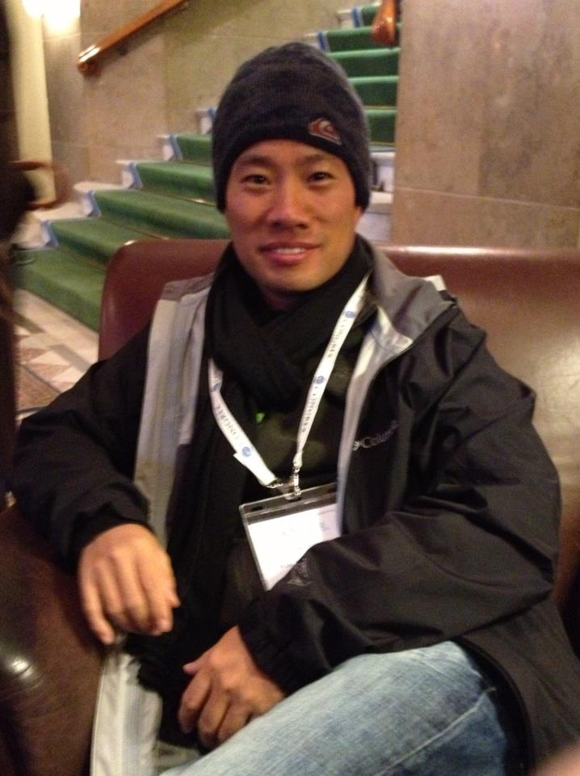
**이미지 캡션:** 한 명의 성인 남성이 갈색 가죽 의자에 앉아 카메라를 바라보고 있으며, 그의 얼굴에는 미소가 번져 있다. 그는 검은색 비니 모자를 쓰고 있으며, 목에는 검은색 스카프를 두르고 있다. 겉옷으로는 회색과 검은색이 섞인 방수 재킷을 입고 있으며, 재킷에는 "Columbia"라는 로고가 보인다. 재킷 안쪽으로는 흰색 목걸이 형태의 출입증이 걸려 있는데, 출입증에는 "LONG"이라는 글자가 희미하게 보인다. 남성은 밝은 색 청바지를 입고 있으며, 그의 손은 편안하게 의자 팔걸이에 놓여 있다. 배경에는 녹색 카펫이 깔린 계단이 보이며, 계단 옆으로는 나무 난간과 석조 벽이 있다. 전체적으로 편안하고 캐주얼한 분위기이며, 남성은 어떤 행사나 모임에 참석한 것으로 보인다. 계단이 보이며, 계단 옆으로는 나무 난간과 석조 벽이 있다. 전체적으로 편안하고 캐주얼한 분위기이며, 남성은 어떤 행사나 모임에 참석한 것으로 보인다.
