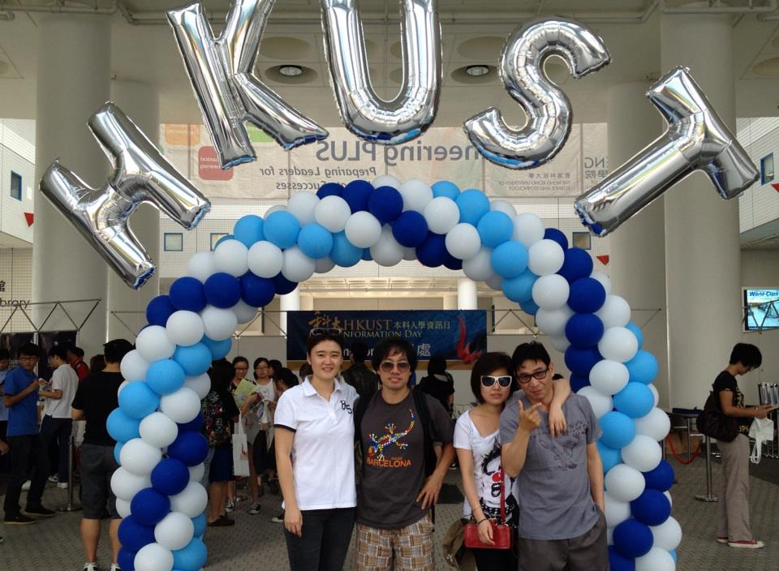
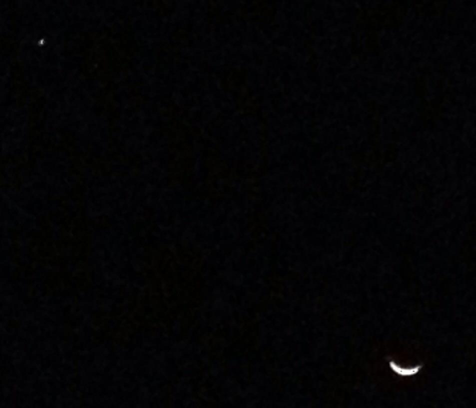
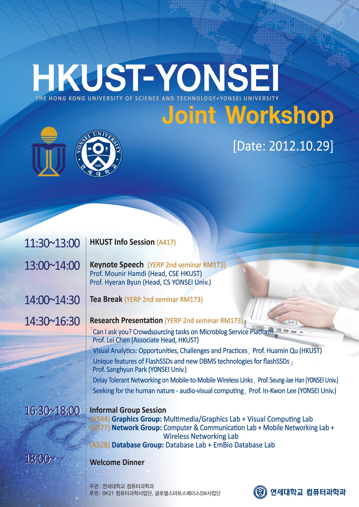

# 2012년 10월

[← 2012년](README.md)

### 10월 5일 (금) 23:27 · PSY's Gangnam Style live with 80,000 fan…

PSY's Gangnam Style live with 80,000 fans in Seoul. It's amazing!!

🔗 <http://www.youtube.com/watch?v=Ixsn81SqU6E>

### 10월 13일 (토) 10:29 · Welcome to HKUST -- HKUST info day.

Welcome to HKUST -- HKUST info day.

**이미지 캡션:** 네 명의 젊은 성인들이 파란색, 흰색, 하늘색 풍선 아치 아래에서 포즈를 취하고 있으며, 배경에는 "HKUST INFORMATION DAY"라고 적힌 현수막이 걸려 있습니다. 왼쪽에서부터 첫 번째 여성은 흰색 폴로 셔츠와 검은색 바지를 입고 있으며, 두 번째 인물은 회색 티셔츠와 체크무늬 반바지를 입고 선글라스를 끼고 있습니다. 세 번째 인물은 흰색 티셔츠와 검은색 바지를 입고 선글라스를 끼고 있으며, 네 번째 인물은 회색 티셔츠와 회색 바지를 입고 있습니다. 네 명 모두 밝은 표정으로 카메라를 응시하고 있습니다. 아치 위에는 은색 풍선으로 "HKUST"라는 글자가 만들어져 있습니다. 배경에는 다른 사람들이 서 있고, 건물 내부의 복도가 보입니다. 전체적으로 축제 분위기이며, 정보의 날 행사의 일환으로 보입니다.

### 10월 13일 (토) 10:35 · Can you see Venus and Moon? You may turn…

Can you see Venus and Moon? You may turn off the light to see them. :-) -- at HKUST.

**이미지 캡션:** 어두운 밤하늘에 초승달과 작은 별 하나가 보인다. 초승달은 오른쪽 아래에 희미하게 빛나고 있으며, 작은 별은 왼쪽 위에 점처럼 보인다. 배경은 완전히 검은색으로, 별빛 외에는 아무것도 보이지 않는다. 이 사진은 밤하늘의 천체를 담고 있으며, 고요하고 신비로운 분위기를 자아낸다.

### 10월 22일 (월) 14:53 · Faculty Positions at HKUST!

Faculty Positions at HKUST!

http://www.cse.ust.hk/admin/recruitment/faculty/

### 10월 24일 (수) 19:47 · We invite you all to the HKUST-YONSEI CS…

We invite you all to the HKUST-YONSEI CS joint workshop on Oct 29 (at 연세대학교 공학원 제2세미나실, RM 173 RM). Feel free to stop by if you are around.

**이미지 캡션:** 이 포스터는 홍콩 과학기술대학교(HKUST)와 연세대학교가 공동으로 개최하는 "Joint Workshop"의 행사 안내문입니다. 포스터 상단에는 두 대학의 로고와 함께 "HKUST-YONSEI Joint Workshop"이라는 제목이 크게 쓰여 있으며, 행사 날짜는 "2012.10.29"입니다. 포스터 중앙에는 노트북을 사용하는 사람의 손이 클로즈업되어 있으며, 이는 학술 행사임을 암시합니다. 포스터 하단에는 시간대별 행사 내용이 상세하게 기재되어 있습니다. 오전 11시 30분부터 오후 6시까지 HKUST 정보 세션, 기조 연설, 티 브레이크, 연구 발표, 비공식 그룹 세션이 진행되며, 오후 6시부터는 환영 만찬이 예정되어 있습니다. 연구 발표 세션에서는 마이크로블로그 서비스 플랫폼에서의 크라우드소싱, 플래시 SSD 및 새로운 DBMS 기술, 모바일 무선 링크에서의 지연 허용 네트워킹, 오디오-비주얼 컴퓨팅 등 다양한 주제가 다뤄질 예정이며, 각 발표자의 소속과 직책도 명시되어 있습니다. 비공식 그룹 세션은 그래픽스, 네트워크, 데이터베이스 그룹으로 나뉘어 진행됩니다. 포스터 하단에는 행사를 주관하는 연세대학교 컴퓨터과학과와 후원하는 BK21 컴퓨터과학사업단, 글로벌스마트스페이스SW사업단의 정보가 한국어로 기재되어 있습니다. 전반적으로 학술적이고 전문적인 분위기를 풍기는 행사 포스터입니다.
