# 2012년 11월

[← 2012년](README.md)

### 11월 5일 (월) 23:27 · finally finished my ICSE 2013 reviews. G…

finally finished my ICSE 2013 reviews. Good luck to all ICSE authors!

### 11월 8일 (목) 11:19 · is thankful to Prof. Woosung Jung for hi…

is thankful to Prof. Woosung Jung for his invitation and friendship. I had a wonderful time there!

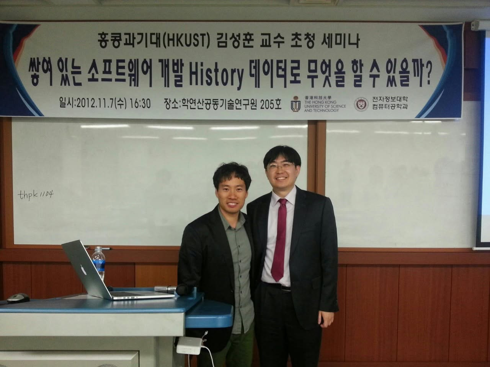
**이미지 캡션:** 이 사진은 홍콩과기대(HKUST) 김성훈 교수를 초청하여 열린 세미나의 한 장면을 담고 있으며, 두 명의 성인 남성이 함께 서서 포즈를 취하고 있다. 왼쪽의 남성은 30대 후반에서 40대 초반으로 보이는 아시아계 남성으로, 회색 셔츠 위에 검은색 재킷을 걸치고 있으며, 밝고 자연스러운 미소를 짓고 있다. 오른쪽의 남성은 40대 초반에서 50대 초반으로 보이는 아시아계 남성으로, 검은색 정장에 붉은색 넥타이를 매고 있으며, 안경을 착용하고 환하게 웃고 있다. 두 사람 모두 세미나 발표자 또는 참석자로 보이며, 배경에는 "쌓여 있는 소프트웨어 개발 History 데이터로 무엇을 할 수 있을까?"라는 제목의 세미나 현수막이 걸려 있고, 그 아래에는 "일시: 2012.11.7(수) 16:30 장소: 학연산공동기술연구원 205호"라는 정보와 함께 홍콩과기대 및 전자정보대학 컴퓨터공학과 로고가 보인다. 또한, 흰색 칠판에는 "thpk1104"라는 글씨가 쓰여 있으며, 앞쪽에는 노트북, 물병, 마이크 등이 놓인 연단이 보인다. 전체적으로 학술적인 분위기 속에서 기념 촬영을 하는 듯한 모습이다.

### 11월 8일 (목) 17:11 · is on his way to Santa Cruz, CA to visit…

📍 인천공항 Incheon Airport, 인천공항 Incheon Airport

is on his way to Santa Cruz, CA to visit UCSC and meet Prof. Jim Whitehead, his advisor. He is so excited! He plans to do surfing there as well.

### 11월 9일 (금) 10:16 · checked in

📍 Santa Cruz, California, Santa Cruz, California

checked in

### 11월 11일 (일) 06:22 · 📷 앨범: Running on W. Cliff Dr in Santa Cruz (5장)

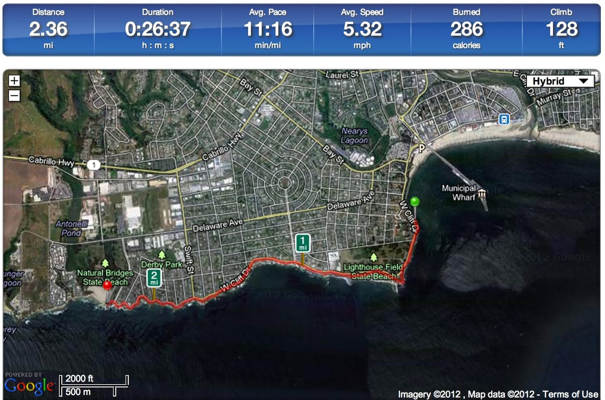
**이미지 캡션:** 이 이미지는 운동 기록을 보여주는 화면 캡처로, 상단에는 운동 거리 2.36마일, 지속 시간 0시간 26분 37초, 평균 페이스 11분 16초/마일, 평균 속도 5.32mph, 소모 칼로리 286kcal, 상승 고도 128피트가 표시됩니다. 하단에는 캘리포니아 산타크루즈 지역의 위성 지도와 함께 운동 경로가 빨간색 선으로 표시되어 있으며, 경로 시작점은 Natural Bridges State Beach 근처의 빨간색 핀으로, 끝점은 Municipal Wharf 근처의 녹색 핀으로 표시됩니다. 지도에는 Cabrillo Hwy, Delaware Ave, W Cliff Dr 등의 도로명과 Antonelli Pond, Derby Park, Nearys Lagoon, Municipal Wharf, Natural Bridges State Beach, Lighthouse Field State Beach 등의 지명이 보입니다. 지도 우측 상단에는 "Hybrid"라는 글자와 함께 지도 유형을 선택하는 드롭다운 메뉴가 있습니다. 지도 하단에는 Google 로고와 함께 축척 표시가 있습니다. 전반적으로 야외 활동 기록을 보여주는 정보성 이미지입니다.
 
**이미지 캡션:** 푸른 하늘 아래, 한 성인 남성이 바다를 배경으로 서 있다. 남성은 30대 초중반으로 보이며, 검은색 짧은 머리에 무표정한 얼굴을 하고 있다. 그는 검은색 경량 패딩 점퍼를 입고 있으며, 점퍼 안에는 보라색 티셔츠를 받쳐 입었다. 점퍼 지퍼 부분에는 빨간색과 흰색 줄무늬가 포인트로 들어가 있다. 남성은 오른손으로 나무 울타리를 짚고 있으며, 왼손에는 흰색 이어폰을 들고 있다. 배경으로는 넓게 펼쳐진 바다와 파도가 치는 해변, 그리고 해변가 절벽 위에 자리한 하얀색 건물들이 보인다. 절벽에는 동굴처럼 보이는 구멍이 뚫려 있고, 그 위에는 여러 마리의 새들이 앉아 있다. 남성이 서 있는 앞쪽으로는 촘촘한 철망으로 된 울타리가 있고, 울타리 너머로는 푸른색의 식물들이 빽빽하게 자라 있다. 전체적으로 맑고 화창한 날씨 속에서 자연 경관을 즐기는 여유로운 분위기이다.
 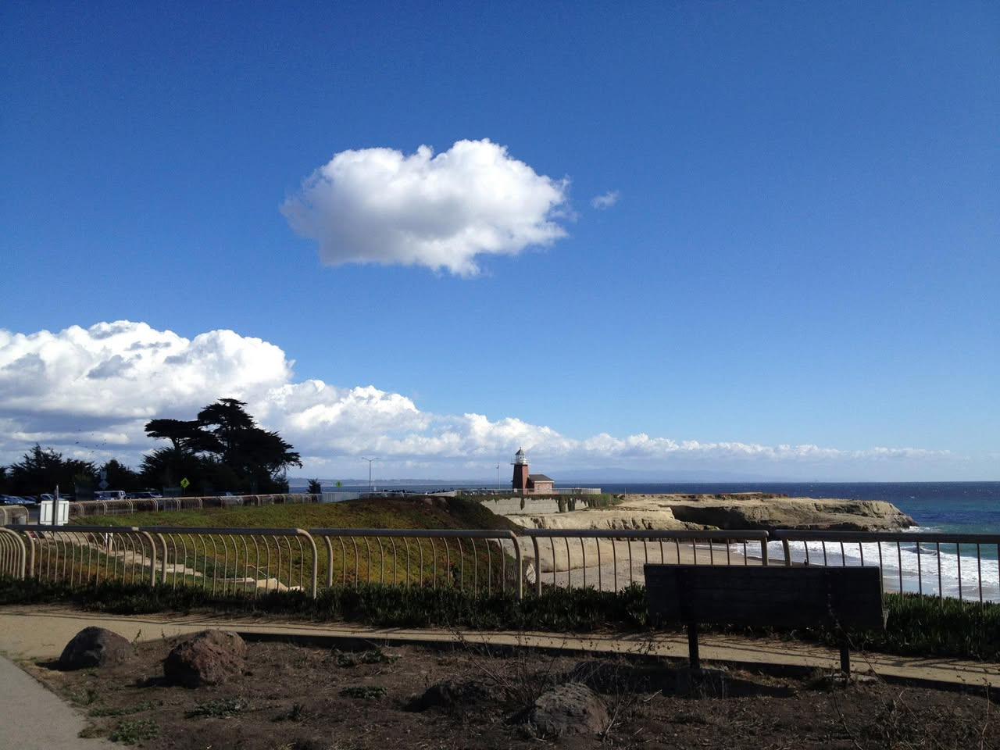
**이미지 캡션:** 푸른 하늘에 흰 구름이 떠 있고, 바다와 해안 절벽이 보이는 풍경 사진입니다. 사진 중앙에는 붉은 벽돌로 된 등대와 그 주변의 건물들이 보입니다. 등대 앞쪽으로는 해변이 펼쳐져 있고, 파도가 치고 있습니다. 사진 왼쪽에는 울타리와 나무들이 보이며, 멀리 차들이 주차되어 있는 모습도 희미하게 보입니다. 사진 오른쪽에는 바다와 수평선이 보입니다. 전반적으로 맑고 화창한 날씨이며, 평화롭고 고요한 분위기입니다. 사람들은 보이지 않으며, 벤치가 하나 놓여 있습니다.
 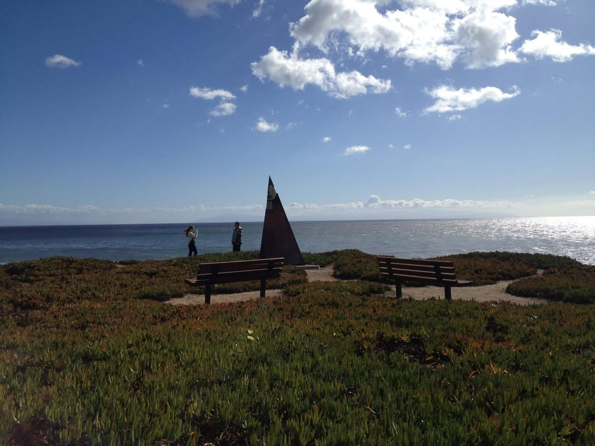
**이미지 캡션:** 푸른 하늘 아래 해안가 공원에서 두 명의 성인 남녀가 조각상과 바다를 배경으로 서 있다. 여성은 흰색 상의와 어두운 색 하의를 입고 있으며, 남성은 체크무늬 셔츠와 어두운 색 하의를 입고 있다. 두 사람 모두 편안한 표정으로 주변 풍경을 감상하는 듯하다. 공원에는 두 개의 나무 벤치가 놓여 있고, 바닥에는 흙길이 나 있다. 전경에는 푸른색과 붉은색이 섞인 식물들이 무성하게 자라 있고, 배경에는 잔잔한 바다가 펼쳐져 있으며, 수평선 너머로 희미하게 육지가 보인다. 하늘에는 흰 구름이 떠 있고, 햇빛이 바다에 반사되어 반짝인다. 전체적으로 평화롭고 여유로운 분위기를 자아낸다.
 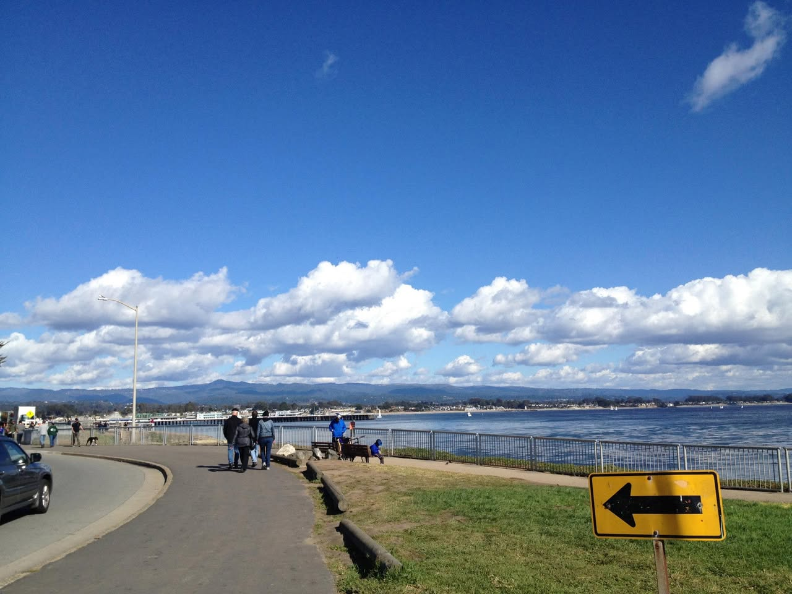
**이미지 캡션:** 푸른 하늘에 흰 구름이 흩뿌려진 맑은 날, 해안 도로를 따라 산책하는 사람들이 보인다. 도로 왼쪽에는 검은색 SUV가 주행 중이고, 오른쪽에는 잔디밭과 함께 바다가 펼쳐져 있다. 바다 건너편에는 산맥이 보이고, 해안선을 따라 건물들이 늘어서 있다. 도로에는 여러 명의 사람들이 걷고 있는데, 대부분 성인 남녀로 보이며 캐주얼한 복장을 하고 있다. 몇몇 사람들은 서로 대화를 나누거나 반려견과 함께 산책하고 있다. 잔디밭에는 벤치가 놓여 있고, 노란색 화살표 표지판이 왼쪽을 가리키고 있다. 전반적으로 평화롭고 여유로운 분위기이다.

### 11월 11일 (일) 15:08 · 📷 앨범: Santa Cruz Downtown (19장)

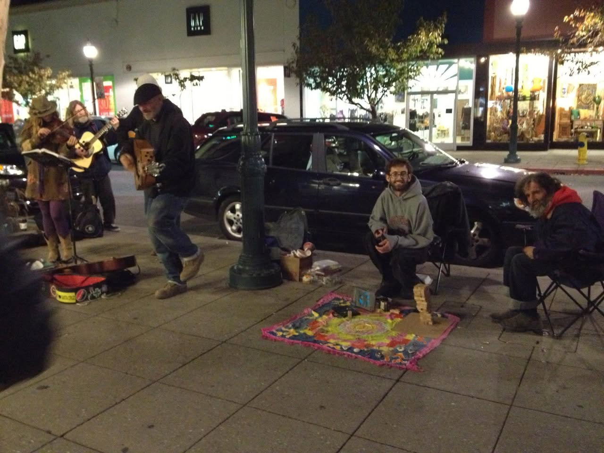
**이미지 캡션:** 밤에 도시 거리에서 여러 사람이 공연을 하고 있다. 왼쪽에는 중년 여성으로 보이는 사람이 챙이 넓은 모자를 쓰고 갈색 코트와 보라색 스타킹을 입고 바이올린을 연주하고 있으며, 그 옆에는 중년 남성이 검은색 재킷과 청바지를 입고 아코디언을 연주하며 춤을 추고 있다. 그들 앞에는 악기 가방과 기타가 놓여 있다. 가운데에는 검은색 SUV가 주차되어 있고, 그 옆에는 회색 후드티를 입은 젊은 남성이 접이식 의자에 앉아 무언가를 들고 있다. 오른쪽에는 덥수룩한 머리와 수염을 가진 중년 남성이 빨간색 후드티 위에 검은색 재킷을 입고 접이식 의자에 앉아 있다. 그들 앞에는 화려한 색상의 천이 깔려 있고, 그 위에 나무 블록으로 만든 구조물이 놓여 있다. 배경에는 상점들이 보이며, 간판에는 "GAP KIDS"라고 쓰여 있다. 전체적으로 거리 공연의 활기찬 분위기와 함께 약간은 쓸쓸한 느낌도 든다.
 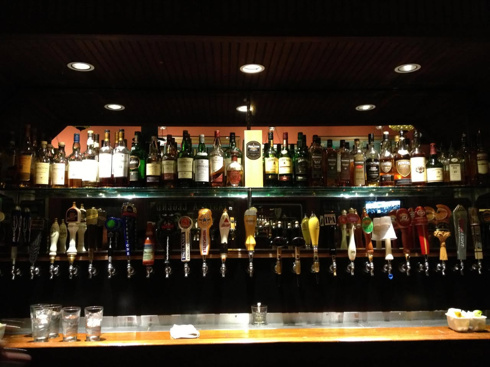
**이미지 캡션:** 이 사진은 어두운 조명 아래 바의 모습을 담고 있으며, 상단 선반에는 다양한 종류의 술병들이 진열되어 있고, 하단에는 맥주 따르는 기구들이 줄지어 있습니다. 상단 선반에는 여러 브랜드의 위스키, 브랜디, 리큐어 병들이 투명하고 갈색 유리병에 담겨 있으며, 일부 병에는 라벨이 보입니다. 하단에는 여러 개의 맥주 탭이 설치되어 있으며, 각 탭에는 다양한 색상과 디자인의 손잡이가 달려 있어 맥주 종류를 나타내는 것으로 보입니다. 바 카운터 위에는 몇 개의 빈 유리잔과 냅킨, 그리고 작은 접시에 담긴 과일 조각이 놓여 있습니다. 전체적으로 고급스러운 바의 분위기를 연출하며, 술을 즐기거나 대화를 나누기에 적합한 공간으로 보입니다.
 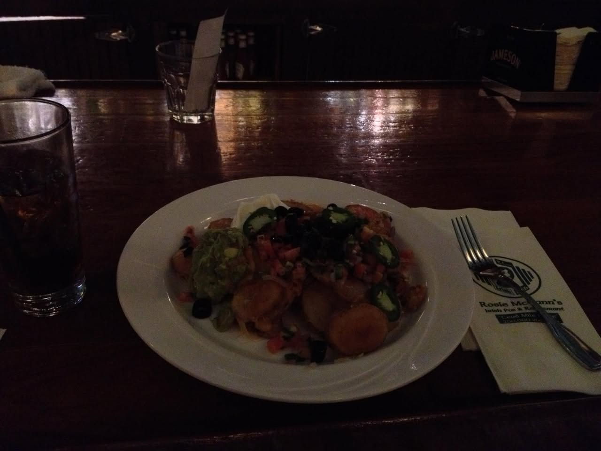
**이미지 캡션:** 어두운 조명 아래 나무 바에 놓인 나초 한 접시와 음료가 보인다. 나초는 흰색 접시에 담겨 있으며, 과카몰리, 살사, 할라피뇨, 올리브, 치즈 등이 올라가 있다. 접시 옆에는 콜라가 담긴 유리잔과 포크가 놓여 있다. 배경에는 바 카운터와 함께 "JAMESON"이라고 적힌 검은색 상자가 보인다. 나초 접시 위에는 "Rosie McCann's Irish Pub & Restaurant"이라고 적힌 냅킨이 깔려 있다. 전체적으로 편안하고 캐주얼한 분위기이며, 저녁 식사나 간식을 즐기는 상황으로 보인다.
 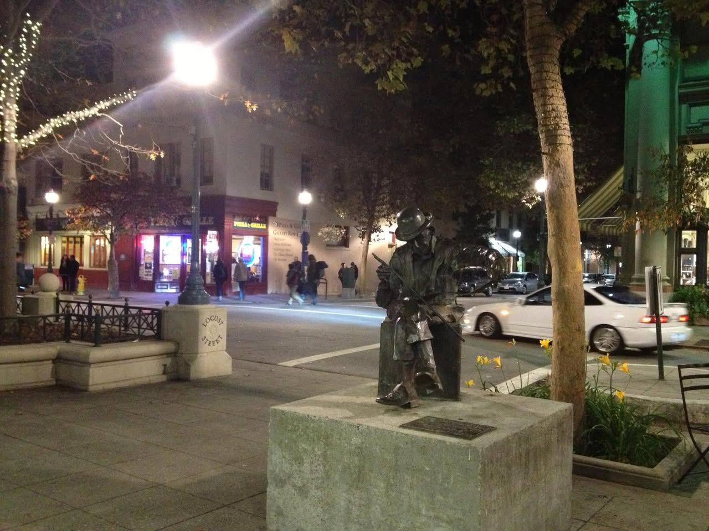
**이미지 캡션:** 밤에 조명이 켜진 거리 풍경으로, 보도에는 조각상과 나무가 서 있고 도로에는 차들이 지나다니고 있습니다. 조각상은 챙이 넓은 모자를 쓰고 낡은 옷을 입은 성인 남성의 모습으로, 무언가를 들고 앉아 있는 듯한 자세를 취하고 있습니다. 조각상 앞에는 'LOCUST STREET'라고 새겨진 비석이 있습니다. 배경에는 상점들이 보이며, 일부 상점은 밝은 네온 불빛으로 빛나고 있습니다. 거리에는 가로등과 나무에 달린 전구들이 어둠을 밝히고 있으며, 전체적으로 차분하고 약간은 쓸쓸한 분위기를 자아냅니다.
 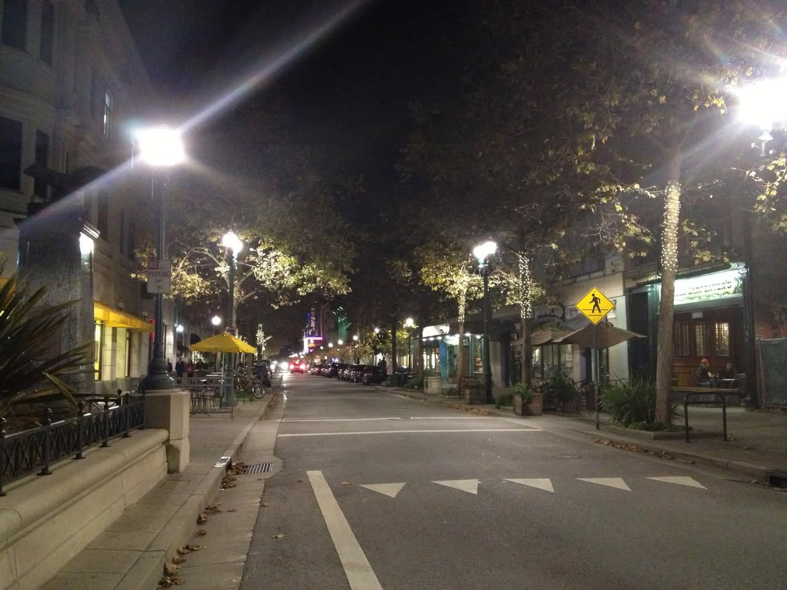
**이미지 캡션:** 어두운 밤, 가로등 불빛과 상점 간판 불빛이 거리를 밝히는 도시의 풍경이다. 도로에는 차선이 그려져 있고, 보행자 신호등과 함께 노란색 보행자 주의 표지판이 보인다. 길가에는 나무들이 늘어서 있고, 일부 나무에는 조명이 달려 있어 아늑한 분위기를 더한다. 상점들은 문을 열고 영업 중인 듯하며, 몇몇 상점 앞에는 테이블과 의자가 놓여 있어 사람들이 앉아 휴식을 취하거나 대화를 나누는 모습을 볼 수 있다. 도로 건너편에는 주차된 차량들이 줄지어 서 있고, 멀리 건물들의 불빛이 희미하게 보인다. 전반적으로 밤의 도시 거리를 걷는 듯한 고요하고 평화로운 분위기이다.
 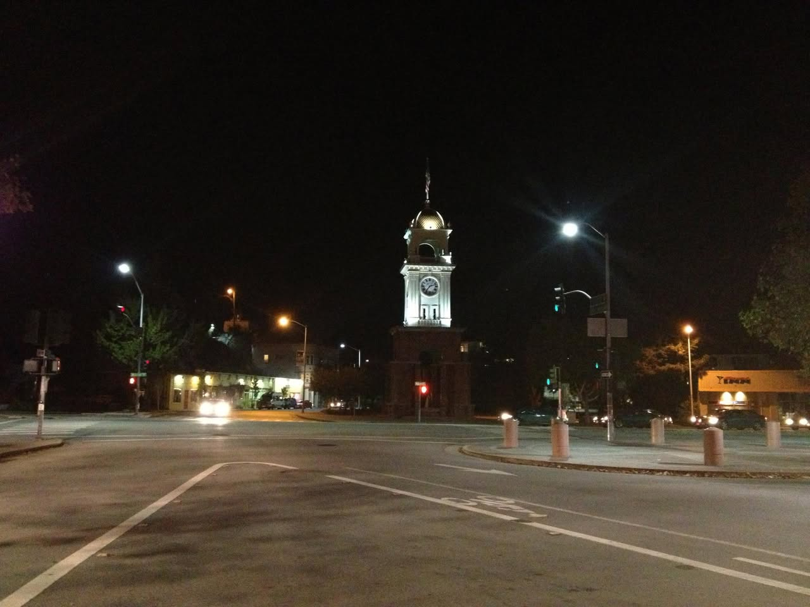
**이미지 캡션:** 밤에 불빛이 켜진 시계탑이 있는 교차로의 모습으로, 시계탑은 흰색과 갈색으로 되어 있으며 돔 모양의 지붕과 깃발이 달려 있고 시계가 보입니다. 시계탑 주변에는 건물과 가로등이 있으며, 도로에는 차선이 그려져 있고 몇 대의 차량이 지나가고 있습니다. 전반적으로 도시의 밤 풍경을 보여주는 사진입니다.
 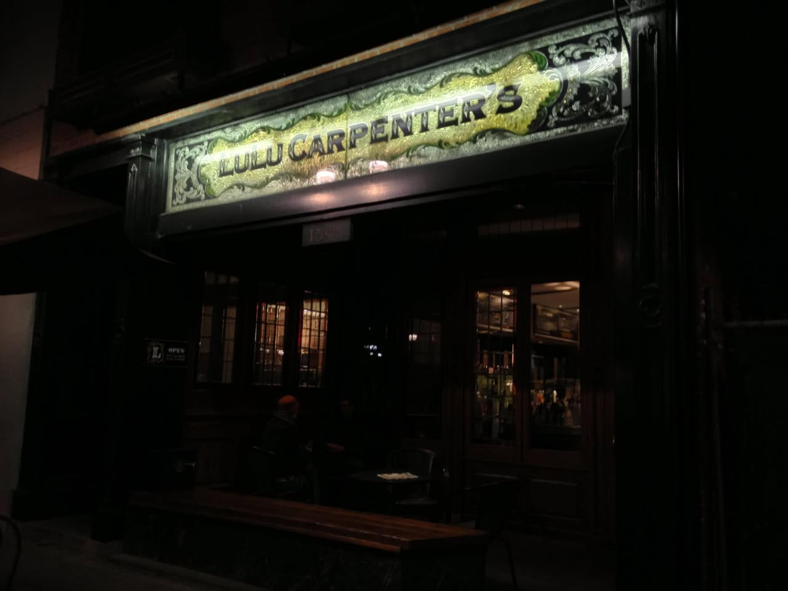
**이미지 캡션:** 어두운 밤, 건물 입구에 걸린 "LULU CARPENTER'S"라는 간판이 조명에 빛나고 있다. 간판은 녹색과 노란색의 화려한 장식으로 둘러싸여 있으며, 글씨는 금색으로 쓰여 있다. 간판 아래로는 어두운 색의 건물 입구가 보이며, 유리창 너머로 가게 내부의 불빛이 새어 나온다. 입구 왼쪽에는 "L OPEN"이라고 쓰인 작은 표지판이 보인다. 가게 앞에는 나무로 된 긴 벤치가 놓여 있고, 벤치에는 두 명의 사람이 앉아 있다. 한 명은 주황색 모자를 쓰고 있으며, 다른 한 명은 어두운 옷을 입고 있다. 두 사람 모두 가게 안을 바라보고 있거나 무언가에 집중하고 있는 듯한 모습이다. 전반적으로 차분하고 약간은 신비로운 분위기를 자아낸다.
 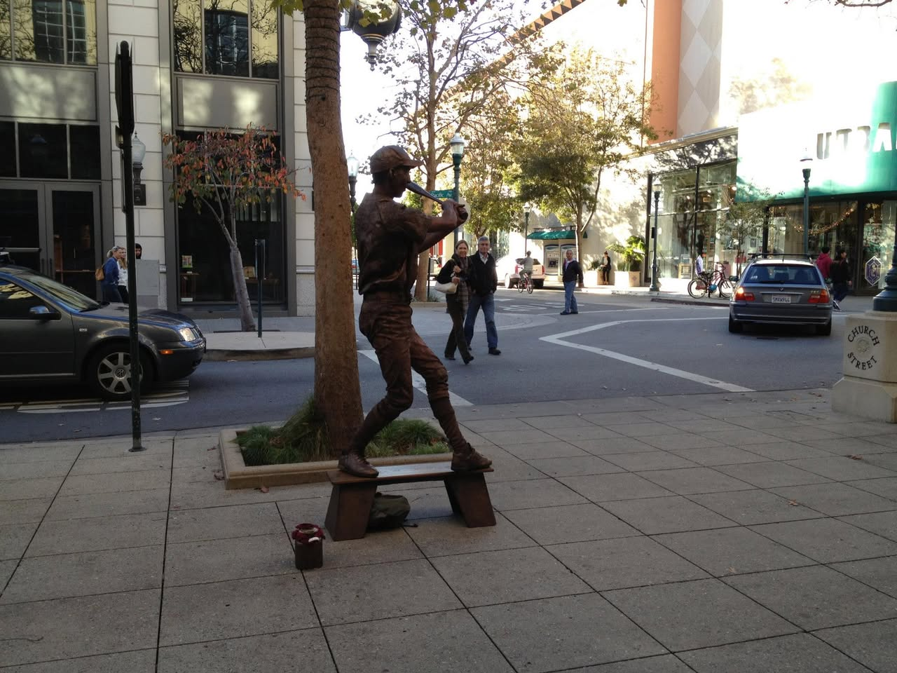
**이미지 캡션:** 이 사진은 도시 거리의 풍경을 담고 있으며, 한 조각상이 야구 타자의 자세를 취하고 있다. 조각상은 갈색으로, 야구 유니폼과 모자를 착용하고 있으며, 야구 방망이를 들고 스윙하려는 듯한 모습이다. 조각상은 벤치 위에 서 있으며, 벤치 아래에는 작은 화분과 가방이 놓여 있다. 배경에는 건물들이 보이며, 건물 앞에는 나무와 가로등이 서 있다. 거리에는 차들이 다니고 있으며, 몇몇 사람들이 걷고 있다. 사진의 오른쪽 하단에는 "CHURCH STREET"라고 쓰여진 표지석이 보인다. 전체적으로 햇살이 비추는 오후의 도시 거리 풍경으로, 조각상이 마치 살아있는 사람처럼 느껴지도록 연출되어 있다.
 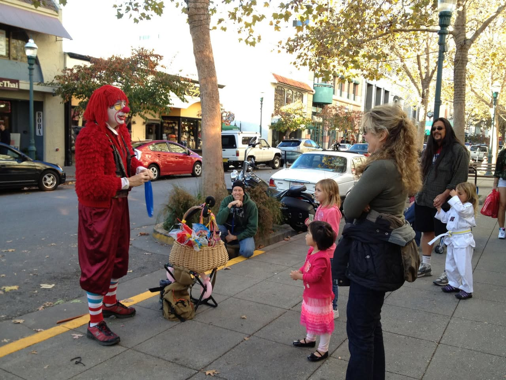
**이미지 캡션:** 한 명의 성인 남성이 빨간색 가발, 흰색 분장, 빨간색 털 재킷, 빨간색 바지, 줄무늬 양말, 빨간색 운동화를 신고 서 있으며, 파란색 풍선을 들고 있습니다. 그의 옆에는 바구니가 놓여 있으며, 바구니 안에는 여러 가지 장난감이 들어 있습니다. 바구니 옆에는 배낭과 접이식 의자가 있습니다. 이 남성은 길가에 서서 행인들과 상호 작용하고 있는 것으로 보입니다. 주변에는 여러 명의 사람들이 있습니다. 한 명의 성인 남성이 녹색 후드티를 입고 앉아 있고, 한 명의 성인 여성이 긴 금발 머리를 땋고 검은색 재킷을 입고 서 있으며, 두 명의 어린 여자아이들이 서 있습니다. 한 아이는 분홍색 드레스를 입고 있고, 다른 아이는 흰색 태권도 도복을 입고 있습니다. 배경에는 건물, 나무, 자동차, 가로등이 보입니다. 전체적으로 활기찬 거리 풍경이며, 날씨는 맑고 햇볕이 비치는 것으로 보입니다.
 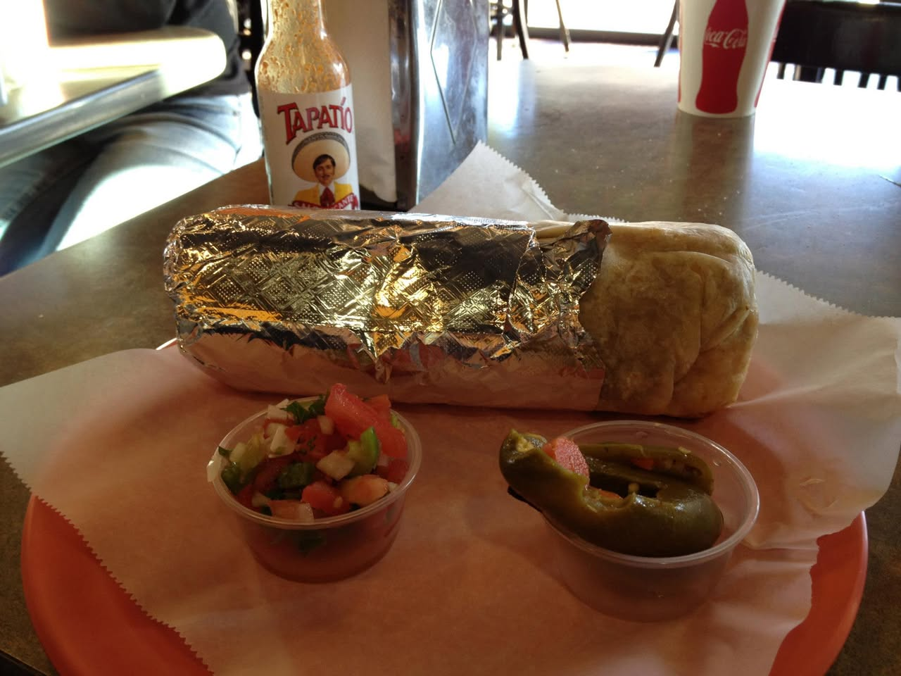
**이미지 캡션:** 테이블 위에 금박으로 포장된 부리토와 함께 피코 데 가요와 할라피뇨가 담긴 작은 플라스틱 용기가 놓여 있습니다. 부리토는 큼직하고 속이 꽉 찬 것으로 보이며, 금박은 일부만 벗겨져 속살이 드러나 있습니다. 피코 데 가요는 잘게 썬 토마토, 양파, 고추, 고수풀로 구성되어 신선해 보입니다. 할라피뇨는 얇게 썰려 매콤한 맛을 더할 것으로 예상됩니다. 배경에는 타파티오 소스 병과 코카콜라 컵이 보이며, 이는 멕시코 음식점이나 캐주얼한 식당임을 시사합니다. 테이블은 짙은 갈색이며, 조명은 밝고 자연광이 비추는 듯합니다. 전체적으로 식욕을 돋우는 캐주얼한 식사 분위기를 연출합니다.
 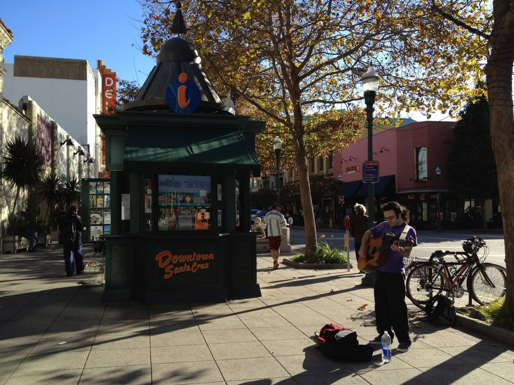
**이미지 캡션:** 햇살 좋은 날, 다운타운 산타크루즈 거리에서 한 젊은 남성이 기타를 치며 버스킹 공연을 하고 있다. 그는 보라색 티셔츠와 검은색 바지를 입고 있으며, 안경을 쓰고 있다. 그의 앞에는 기타 케이스와 물병이 놓여 있다. 배경에는 녹색의 키오스크가 보이며, 키오스크에는 "Downtown Santa Cruz"라고 쓰여 있다. 키오스크 옆에는 자전거 두 대가 주차되어 있다. 거리에는 가을 단풍이 든 나무들이 늘어서 있고, 건물들은 다양한 색깔로 칠해져 있다. 전반적으로 활기차고 평화로운 분위기이다.
 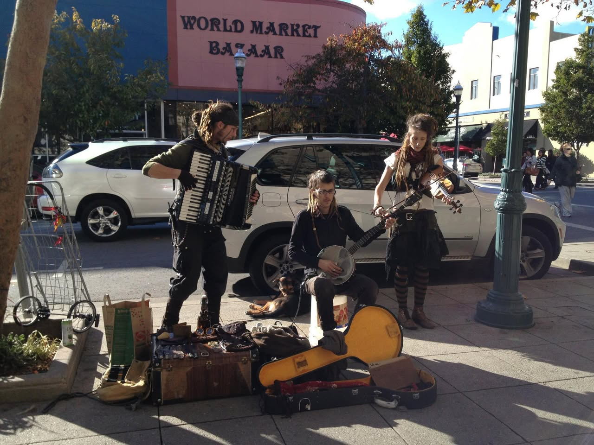
**이미지 캡션:** 세 명의 거리 공연자가 길가에서 연주하고 있으며, 한 남성은 아코디언을 연주하고, 한 여성은 바이올린을 연주하며, 다른 한 남성은 밴조를 연주하고 있습니다. 남성 아코디언 연주자는 20대 후반에서 30대 초반으로 보이며, 드레드록 머리를 하고 검은색 의상을 입고 있습니다. 여성 바이올린 연주자는 20대 초반에서 중반으로 보이며, 땋은 머리를 하고 스커트와 줄무늬 스타킹을 입고 있습니다. 밴조를 연주하는 남성은 30대 초반에서 중반으로 보이며, 안경을 쓰고 있습니다. 그들 앞에는 악기 케이스, 쇼핑백, 그리고 짐수레가 놓여 있습니다. 배경에는 "WORLD MARKET BAZAAR"라고 쓰인 분홍색 건물이 보이고, 흰색 SUV 차량 두 대가 주차되어 있습니다. 햇볕이 비추는 맑은 날씨이며, 사람들은 공연을 즐기거나 지나가는 듯한 분위기입니다.
 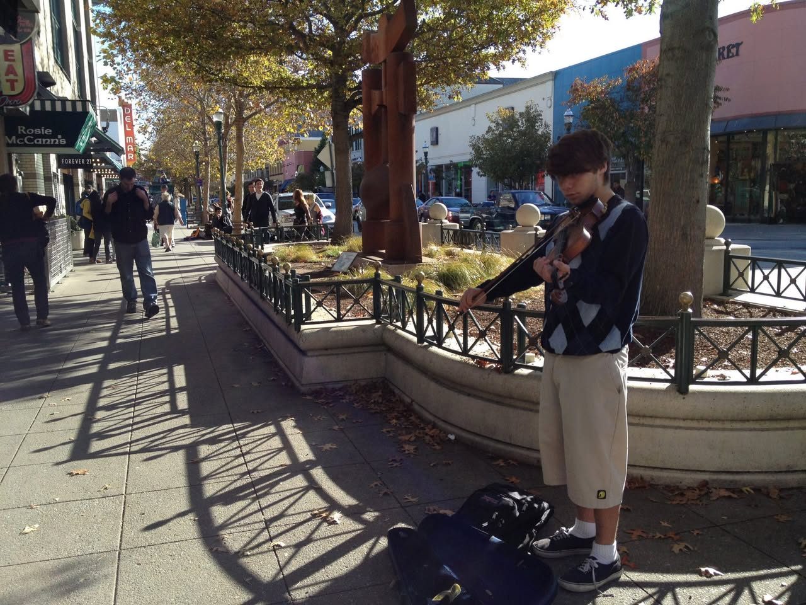
**이미지 캡션:** A young adult male with dark, shaggy hair is playing the violin on a sunny sidewalk. He is wearing a dark blue argyle sweater vest over a lighter blue shirt, and light beige shorts with white socks and dark sneakers. His expression is focused as he plays, with his head slightly tilted. He stands next to a dark violin case on the ground. The background shows a street with shops and trees, some of which have autumn leaves. The sidewalk is paved with concrete tiles, and shadows from a decorative fence and trees are cast across it. Other pedestrians are visible in the distance, walking along the sidewalk and street. The overall atmosphere is that of a pleasant, sunny day in a commercial area, with a street musician adding to the ambiance. Visible text includes "EAT", "Rosie McCann's", "FOREVER 21", and "DEL MAR" on signs, and "MARKET" on a building in the background.
 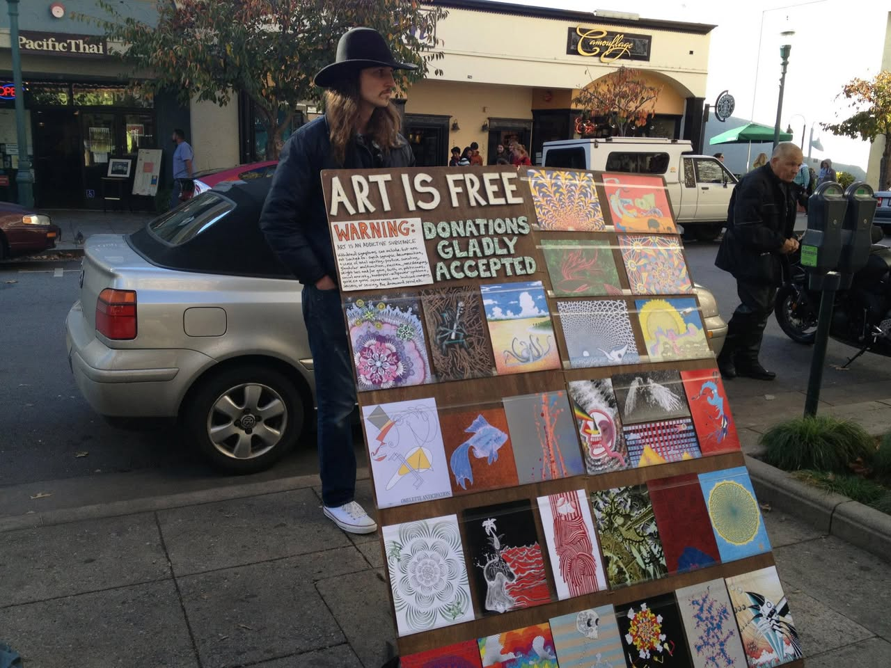
**이미지 캡션:** 한 성인 남성이 검은색 페도라와 검은색 재킷, 청바지를 입고 서 있으며, 그의 긴 갈색 머리카락이 어깨까지 내려와 있습니다. 그는 예술 작품을 전시하는 나무 진열대 앞에 서 있으며, 진열대에는 다양한 색상과 디자인의 그림들이 꽂혀 있습니다. 진열대 상단에는 "ART IS FREE WARNING: DONATIONS GLADLY ACCEPTED"라고 쓰인 표지판이 보입니다. 배경에는 은색 컨버터블 자동차, 흰색 트럭, 그리고 여러 상점들이 보이며, 거리에는 보행자들과 오토바이도 있습니다. 전체적으로 햇볕이 비치는 낮 시간대의 거리 풍경이며, 예술 작품을 판매하거나 홍보하는 듯한 분위기입니다.
 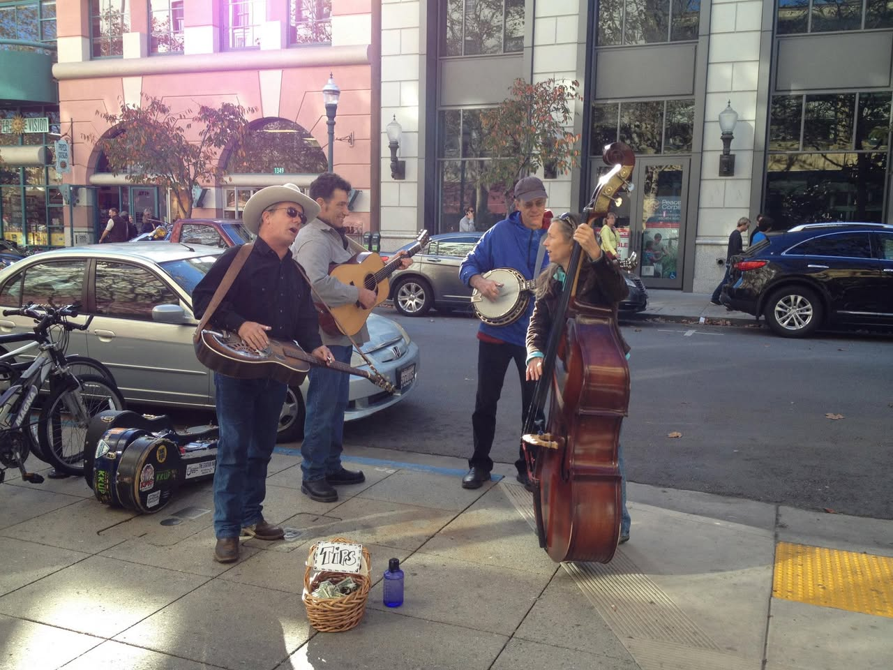
**이미지 캡션:** 네 명의 거리 음악가가 거리에서 연주하고 있습니다. 앞줄에는 카우보이 모자를 쓴 성인 남성이 검은색 셔츠와 청바지를 입고 기타를 연주하고 있으며, 그의 옆에는 회색 셔츠와 청바지를 입은 다른 성인 남성이 기타를 연주하고 있습니다. 뒷줄에는 파란색 재킷과 모자를 쓴 성인 남성이 밴조를 연주하고 있으며, 그의 옆에는 갈색 재킷을 입은 성인 여성이 더블 베이스를 연주하고 있습니다. 그들 앞에는 "TIPS"라고 적힌 바구니와 파란색 병이 놓여 있습니다. 배경에는 건물과 주차된 차량들이 보입니다. 전반적으로 활기찬 거리 공연 분위기입니다.
 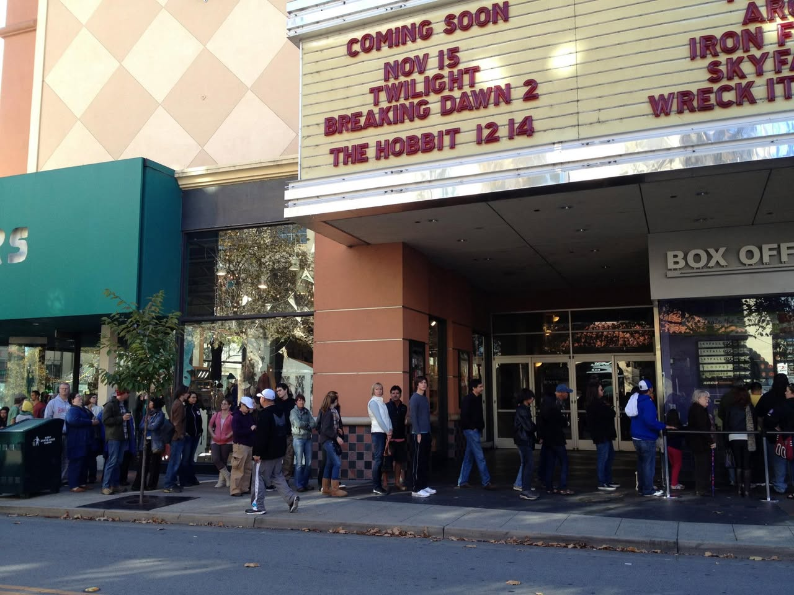
**이미지 캡션:** 이 사진은 영화관 앞에서 줄을 서 있는 여러 사람들을 보여줍니다. 대부분의 사람들은 성인이며, 남성과 여성 모두 보입니다. 그들은 캐주얼한 복장을 하고 있으며, 일부는 추운 날씨에 대비해 재킷이나 스웨터를 입고 있습니다. 사람들의 표정은 다양하지만, 대부분은 차분하거나 약간의 기대감을 가지고 있는 것으로 보입니다. 일부는 친구나 가족과 함께 온 듯 대화를 나누고 있고, 다른 사람들은 스마트폰을 보거나 앞을 응시하고 있습니다. 배경에는 영화관 건물이 보이며, "COMING SOON"이라는 문구와 함께 "TWILIGHT BREAKING DAWN 2"와 "THE HOBBIT 12 14"와 같은 영화 제목이 적힌 간판이 걸려 있습니다. 또한 "BOX OFFICE"라고 쓰인 표지판도 보입니다. 거리에는 낙엽이 떨어져 있고, 날씨는 맑고 햇살이 비추고 있어 가을이나 초겨울의 오후로 추정됩니다. 전반적으로 영화 개봉을 기다리는 사람들의 모습을 담은 일상적인 장면입니다.
 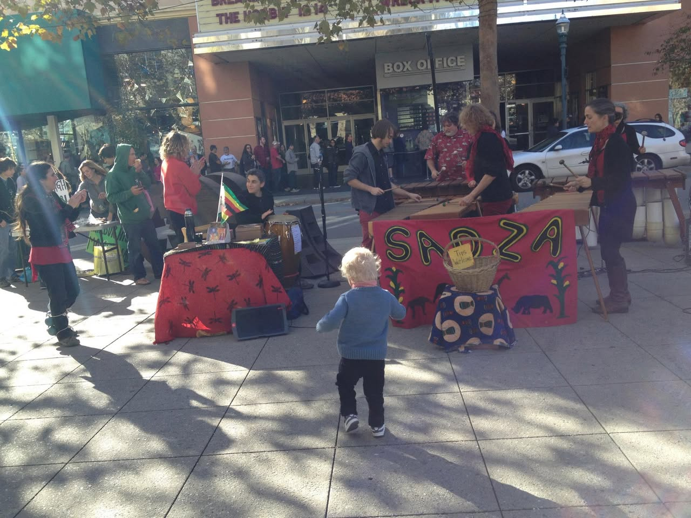
**이미지 캡션:** A group of people are gathered on a sunny sidewalk in front of a building with a "BOX OFFICE" sign. In the foreground, a young child with blonde hair, wearing a blue sweater and black pants, is facing away from the camera and appears to be dancing or moving towards a musical performance. To the right of the child, a woman with dark hair, wearing a black top and red scarf, is playing a marimba with mallets. In front of the marimba players is a large red banner with the word "SAOZA" written in yellow letters, along with images of animals and corn stalks. A wicker basket labeled "Tips Welcome" sits on a small table covered with a patterned cloth. Behind the banner, several adults are playing marimbas. To the left, a woman in a red jacket and another in a green hoodie are interacting with a crowd. The overall atmosphere is lively and festive, suggesting an outdoor performance or street fair.
 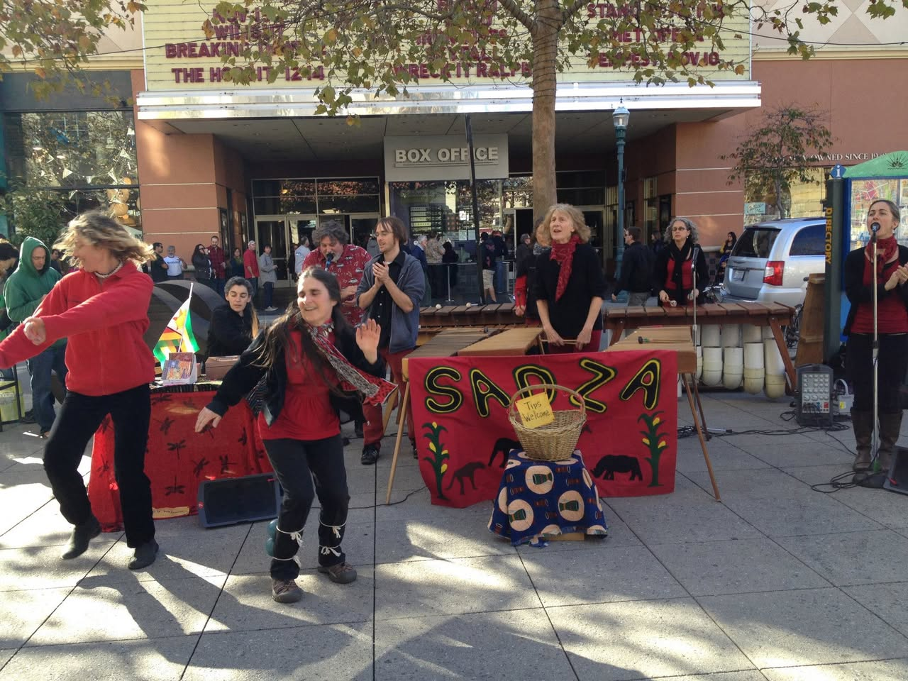
**이미지 캡션:** A group of people are gathered outside a building with a marquee that reads "BREAKING THE HOBBIT 12/14" and "BOX OFFICE". In the foreground, two women are dancing. The woman on the left, appearing to be in her 50s or 60s, has blonde hair and is wearing a red fleece jacket and black pants, with her arms outstretched as if dancing. The woman on the right, who appears to be in her 20s or 30s, has dark hair and is wearing a red top, black jacket, and black pants with white wraps around her lower legs; she is also dancing with her arms raised. Behind them, a woman in her 50s or 60s with grey hair is playing a xylophone, wearing a red scarf and black top. To her right, a woman in her 20s or 30s with dark hair is singing into a microphone, wearing a red top and black pants. A man in his 30s or 40s with dark hair and glasses is standing behind the xylophone player, wearing a grey jacket and clapping. Another man in his 40s or 50s with grey hair and a beard is standing to the left of the xylophone player, wearing a red patterned shirt and holding a microphone. A red banner with the word "SADZA" and images of animals and corn is displayed, with a basket labeled "Tips Welcome" on top of a patterned cloth. The overall atmosphere is lively and festive, suggesting an outdoor performance or street event.
 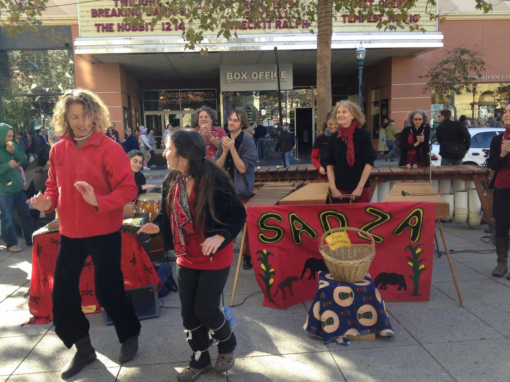
**이미지 캡션:** A group of people are gathered on a sidewalk in front of a building with a marquee that reads "TWILIGHT BREAKING DAWN THE HOBBIT 12 14". In the foreground, two women are dancing. The woman on the left is an adult female with curly blonde hair, wearing a red fleece jacket, black pants, and black boots. She has a beaded necklace and a happy, energetic expression, with her arms outstretched as if dancing. The woman on the right is an adult female with long dark hair, wearing a red top, a black jacket, and black pants with white ties around her ankles. She is also dancing with a joyful expression. Behind them, a marimba-like instrument is set up with a red banner that says "SAOZA" and has drawings of elephants and corn stalks. A wicker basket labeled "Tips Welcome" sits on a small table covered with a blue and orange patterned cloth. Several other people, including an adult male with a beard and glasses, are visible in the background, some appearing to be watching the performance. The overall atmosphere is lively and festive, suggesting an outdoor street performance or event.

### 11월 14일 (수) 22:09 · 📷 앨범: Lake Johnson Park (3장)

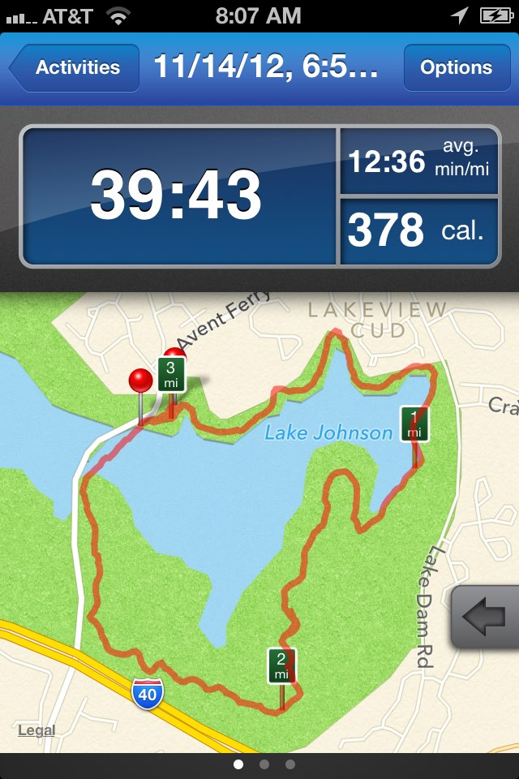
**이미지 캡션:** 이 사진은 스마트폰 화면을 캡처한 것으로, 운동 기록 앱의 화면을 보여줍니다. 화면 상단에는 시간과 날짜, 그리고 "Activities", "Options" 버튼이 있습니다. 중앙에는 운동 기록이 표시되는데, 총 운동 시간은 39분 43초이며, 평균 페이스는 마일당 12분 36초, 소모 칼로리는 378 칼로리로 나타납니다. 화면 하단에는 지도 이미지가 표시되어 있으며, 파란색으로 표시된 호수는 "Lake Johnson"으로 보이고, 그 주변을 둘러싸는 붉은색 선은 운동 경로를 나타냅니다. 경로 상에는 1마일, 2마일, 3마일 지점을 나타내는 표지판이 보입니다. 지도에는 "Avent Ferry", "Lakeview CUD", "Lake Dam Rd", "Legal" 등의 지명과 "40"번 고속도로 표지판도 보입니다. 전체적으로 야외에서 조깅이나 달리기를 한 후 운동 기록을 확인하는 상황으로 보이며, 날씨는 맑은 날로 추정됩니다. 사진 속에는 사람이 직접적으로 보이지는 않지만, 운동 기록이 표시된 것으로 보아 운동을 한 사람의 활동을 기록한 것으로 판단됩니다.
 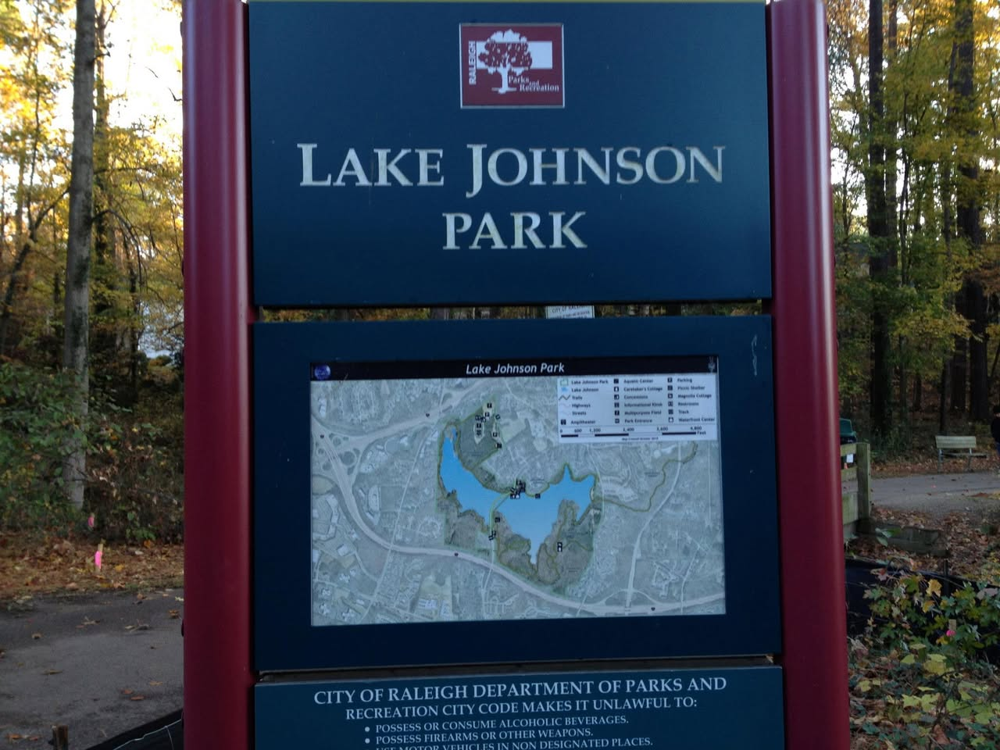
**이미지 캡션:** 이 사진은 늦가을의 숲 속에 세워진 "레이크 존슨 공원" 안내 표지판을 보여줍니다. 표지판은 짙은 파란색과 붉은색 기둥으로 이루어져 있으며, 상단에는 "RALEIGH Parks and Recreation" 로고와 함께 "LAKE JOHNSON PARK"라는 글자가 흰색으로 크게 새겨져 있습니다. 그 아래에는 공원의 지도가 포함된 화면이 있는데, 지도에는 호수와 도로, 공원 내 시설들이 표시되어 있습니다. 지도 화면 하단에는 "CITY OF RALEIGH DEPARTMENT OF PARKS AND RECREATION CITY CODE MAKES IT UNLAWFUL TO: POSSESS OR CONSUME ALCOHOLIC BEVERAGES. POSSESS FIREARMS OR OTHER WEAPONS. NON DESIGNATED PLACES."라는 문구가 적혀 있어 공원 이용 규칙을 안내하고 있습니다. 표지판 주변으로는 낙엽이 떨어진 나무들과 숲이 보이며, 가을의 정취를 느낄 수 있습니다. 오른쪽 배경에는 벤치가 놓여 있는 산책로도 희미하게 보입니다. 사진에는 사람이 보이지 않습니다. 전반적으로 차분하고 자연 친화적인 분위기입니다.
 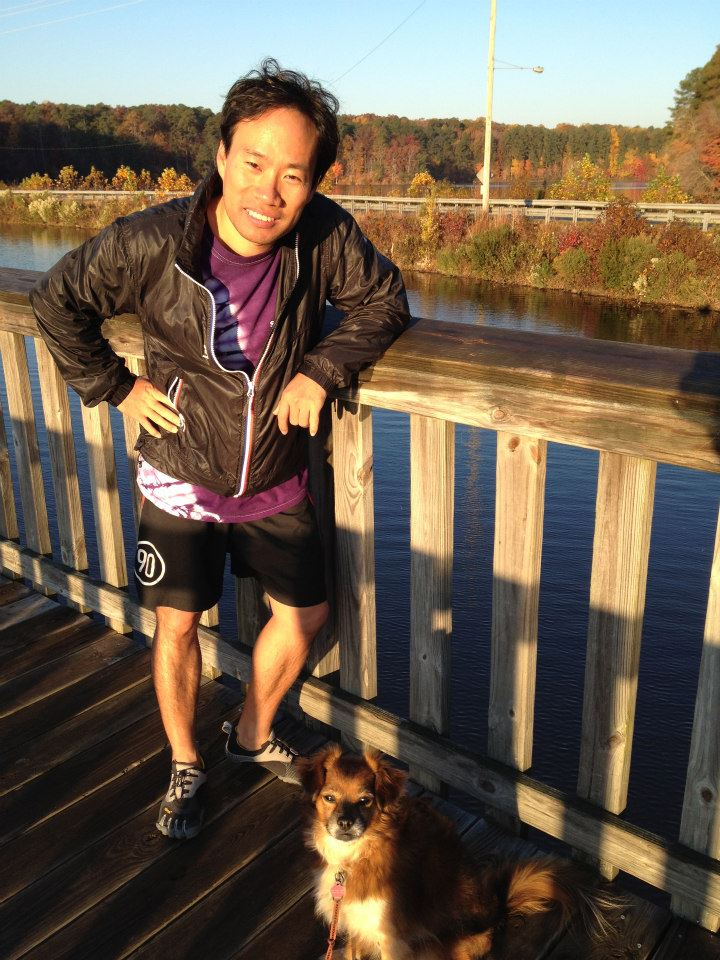
**이미지 캡션:** 한 명의 성인 남성이 검은색 바람막이 재킷 안에 보라색 타이 다이 티셔츠를 입고 검은색 반바지를 입고 서 있습니다. 그의 반바지에는 흰색 원 안에 숫자 "90"이 새겨져 있습니다. 그는 오른손을 허리에 얹고 왼손으로 나무 난간을 잡고 있으며, 얼굴에는 미소를 띠고 있습니다. 그의 옆에는 갈색 털을 가진 작은 개가 앉아 있으며, 분홍색 목줄을 하고 있습니다. 그들은 나무 데크 위에 서 있으며, 데크는 물 위로 뻗어 있습니다. 배경에는 가을 단풍이 아름다운 숲과 잔잔한 물이 보입니다. 햇빛이 비스듬히 비추어 데크에 긴 그림자를 드리우고 있으며, 전체적으로 따뜻하고 평화로운 분위기를 자아냅니다.

### 11월 15일 (목) 04:34 · is happy to have a MS Surface

is happy to have a MS Surface

**이미지 캡션:** 두 명의 성인 남성이 테이블에 앉아 있다. 왼쪽 남성은 30대 후반에서 40대 초반으로 보이며, 안경을 쓰고 검은색 티셔츠 위에 파란색과 검은색이 섞인 후드 집업을 입고 있다. 그는 카메라를 향해 미소를 짓고 있으며, 손은 테이블 위에 놓여 있다. 오른쪽 남성은 30대 후반에서 40대 초반으로 보이며, 파란색 체크무늬 셔츠를 입고 있다. 그는 카메라를 향해 미소를 짓고 있으며, 한 손은 노트북 키보드 위에 올려져 있다. 테이블 위에는 노트북, 물 주전자, 두 개의 유리잔, 그리고 검은색 컵이 놓여 있다. 배경에는 베이지색 벽과 문이 보이며, 벽에는 액자가 걸려 있다. 전반적으로 편안하고 캐주얼한 분위기이다.

### 11월 15일 (목) 13:31 · is so proud of his PHD student, Yida Tao…

is so proud of his PHD student, Yida Tao for her wonderful talk at FSE 2012 (with Yingnong Dang, Tao Xie, and  Dongmei Zhang). 

See the slides at http://www.slideshare.net/hunkim/how-do-software-engineers-understand-code-changes-fse-2012

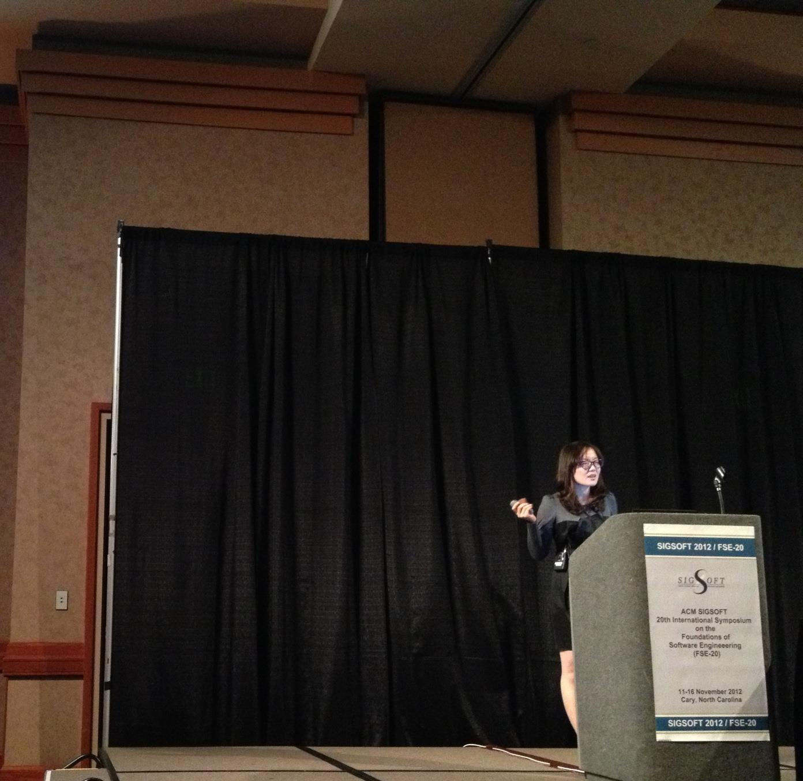
**이미지 캡션:** 한 명의 성인 여성이 연단 뒤에서 발표하고 있으며, 그녀는 안경을 쓰고 회색 상의와 검은색 치마를 입고 있습니다. 그녀는 오른손을 들어 무언가를 가리키고 있으며, 표정은 발표에 집중하고 있는 듯 보입니다. 배경에는 검은색 커튼이 드리워져 있고, 연단에는 "SIGSOFT 2012 / FSE-20"이라는 글자와 함께 학회 로고와 정보가 적힌 현수막이 부착되어 있습니다. 연단에는 마이크도 보입니다. 장소는 컨퍼런스 홀이나 강연장으로 보이며, 전반적으로 학술 발표 상황을 나타내는 분위기입니다.

### 11월 16일 (금) 08:29 · Congratulations to Christian Bird and Th…

Congratulations to Christian Bird and Thomas Zimmermann for their ACM SIGSOFT Distinguished paper award @ FSE 2012. You guys rock!

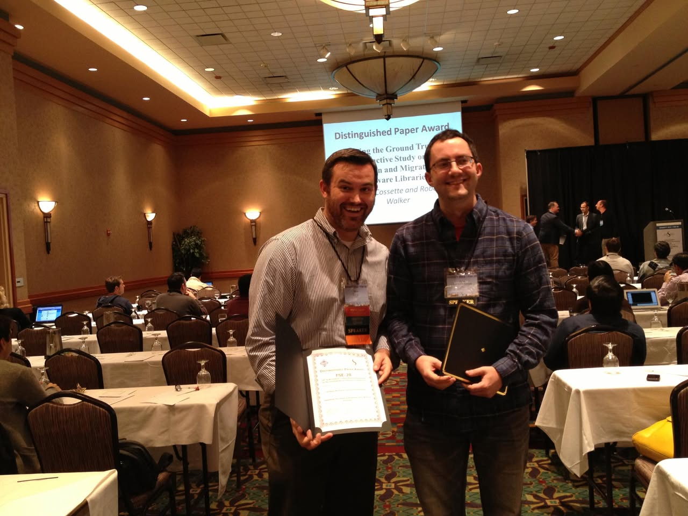
**이미지 캡션:** 두 명의 성인 남성이 회의실에서 상을 들고 포즈를 취하고 있습니다. 왼쪽 남성은 30대 후반에서 40대 초반으로 보이며, 줄무늬 셔츠를 입고 있으며, 밝게 웃고 있습니다. 그는 상장과 검은색 서류철을 들고 있습니다. 오른쪽 남성은 30대 후반에서 40대 초반으로 보이며, 체크무늬 셔츠를 입고 안경을 쓰고 있으며, 미소를 짓고 있습니다. 그는 검은색 서류철을 들고 있습니다. 두 사람 모두 목에 "SPEAKER"라고 적힌 명찰을 달고 있습니다. 배경에는 스크린에 "Distinguished Paper Award"라는 제목이 보이고, 그 아래에는 논문 제목의 일부가 보입니다. 회의실에는 테이블과 의자가 놓여 있고, 다른 참석자들이 앉아 있습니다. 전체적으로 축하와 성취의 분위기입니다.

### 11월 18일 (일) 04:09 · 📷 앨범: ICSE 2013 PC (2장)

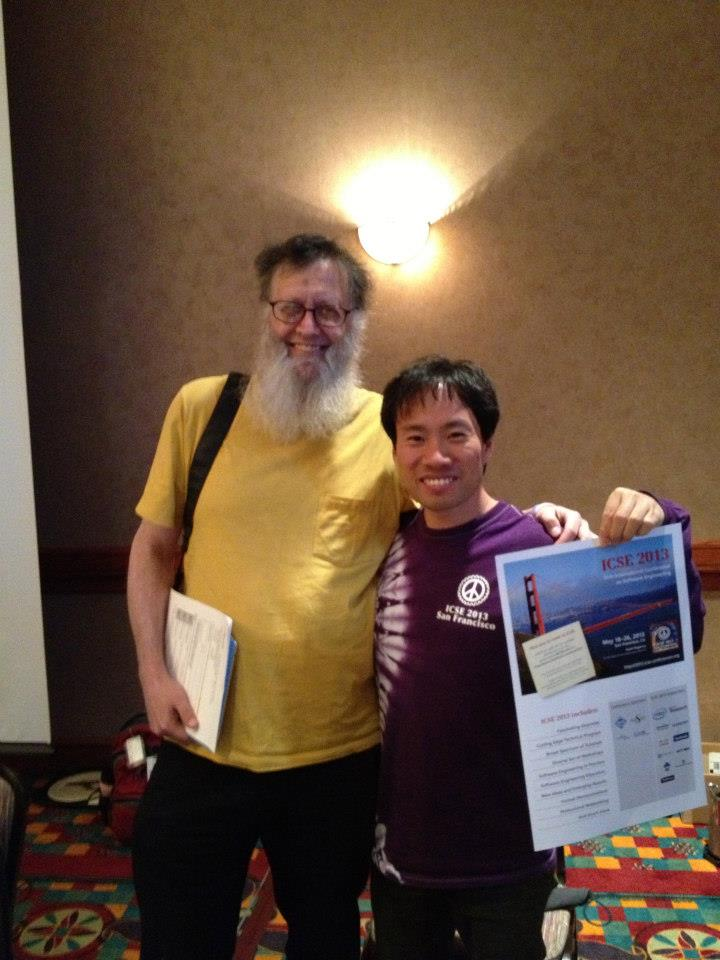
**이미지 캡션:** 두 명의 남성이 실내에서 함께 서서 사진을 찍고 있다. 왼쪽 남성은 흰색 수염과 안경을 착용하고 노란색 티셔츠와 검은색 바지를 입고 있으며, 서류를 들고 있다. 오른쪽 남성은 보라색 티셔츠를 입고 있으며, ICSE 2013 샌프란시스코 행사 포스터를 들고 있다. 두 사람 모두 미소를 짓고 있으며, 배경에는 벽과 조명이 보인다. 바닥에는 다채로운 패턴의 카펫이 깔려 있다.
 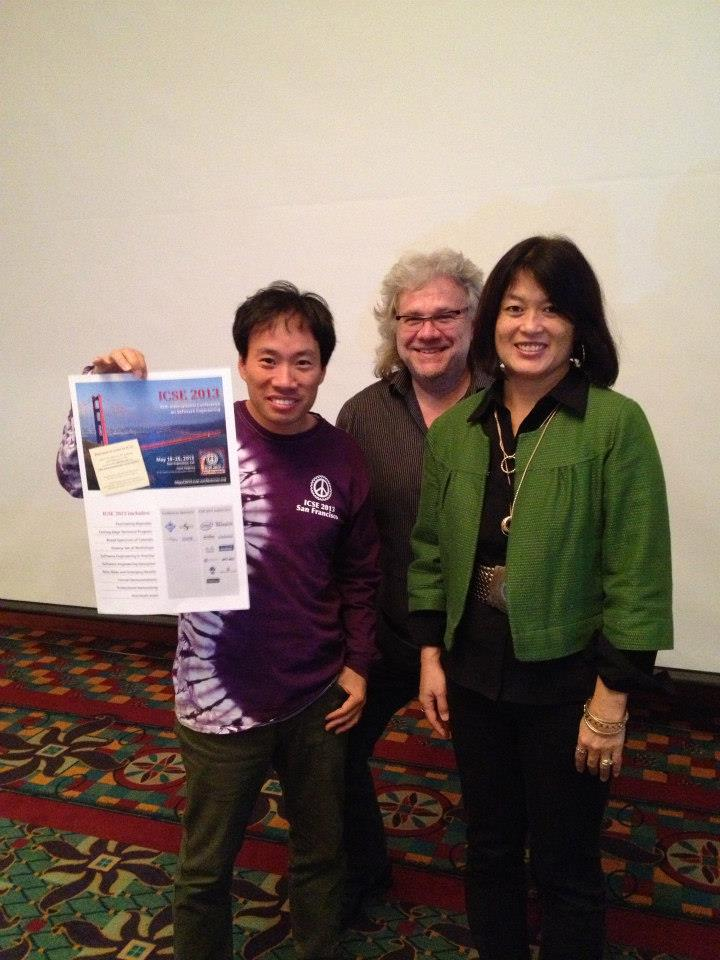
**이미지 캡션:** 세 명의 성인이 흰색 배경 앞에서 포즈를 취하고 있으며, 모두 밝은 표정을 짓고 있다. 왼쪽에는 보라색 타이 다이 티셔츠를 입고 ICSE 2013이라는 글자가 적힌 포스터를 들고 있는 젊은 성인 남성이 있다. 가운데에는 안경을 쓰고 줄무늬 셔츠를 입은 중년의 성인 남성이 서 있다. 오른쪽에는 녹색 재킷과 검은색 상의를 입고 목걸이와 팔찌를 착용한 성인 여성이 서 있다. 세 사람 모두 카메라를 향해 미소를 짓고 있으며, 배경은 옅은 베이지색 벽이고 바닥에는 화려한 패턴의 카펫이 깔려 있다.

> with ICSE 2013 General Chair!
> with ICSE 2013 PC Chairs!

### 11월 18일 (일) 20:02 · finally on his way to home, Hong Kong

📍 Raleigh-Durham International Airport (RDU), Raleigh-Durham International Airport (RDU)

finally on his way to home, Hong Kong

### 11월 19일 (월) 03:34 · is thrilled to get an Invitation to the …

is thrilled to get an Invitation to the EMSE editorial board thanks to Lionel Briand and Victor R. Basili. Please submit your papers to EMSE, http://www.springer.com/computer/programming/journal/10664

🔗 <http://www.springer.com/computer/swe/journal/10664>

### 11월 19일 (월) 03:36 · is waiting a flight to Hong Kong

📍 San Francisco International Airport (SFO), San Francisco International Airport (SFO)

is waiting a flight to Hong Kong

### 11월 20일 (화) 08:12 · loves this door stop for our kitchen doo…

loves this door stop for our kitchen door.

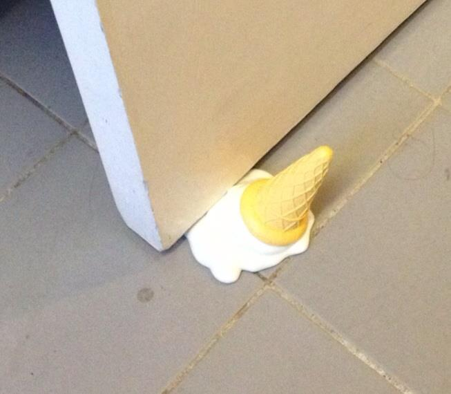
**이미지 캡션:** 이 사진에는 사람이 보이지 않으며, 문이 닫히는 것을 막기 위해 사용되는 아이스크림 콘 모양의 문 스토퍼가 바닥에 놓여 있습니다. 문 스토퍼는 노란색 콘과 녹아내리는 듯한 하얀색 아이스크림 모양으로 디자인되었습니다. 배경은 회색 타일 바닥과 베이지색 문으로 이루어져 있습니다. 문 스토퍼는 마치 아이스크림이 바닥에 떨어져 녹아내리는 듯한 모습을 연출하여 재미있고 독특한 분위기를 자아냅니다. 텍스트는 보이지 않습니다.

### 11월 20일 (화) 08:29 · This is Yeon's favorite. It's really cut…

This is Yeon's favorite. It's really cute!

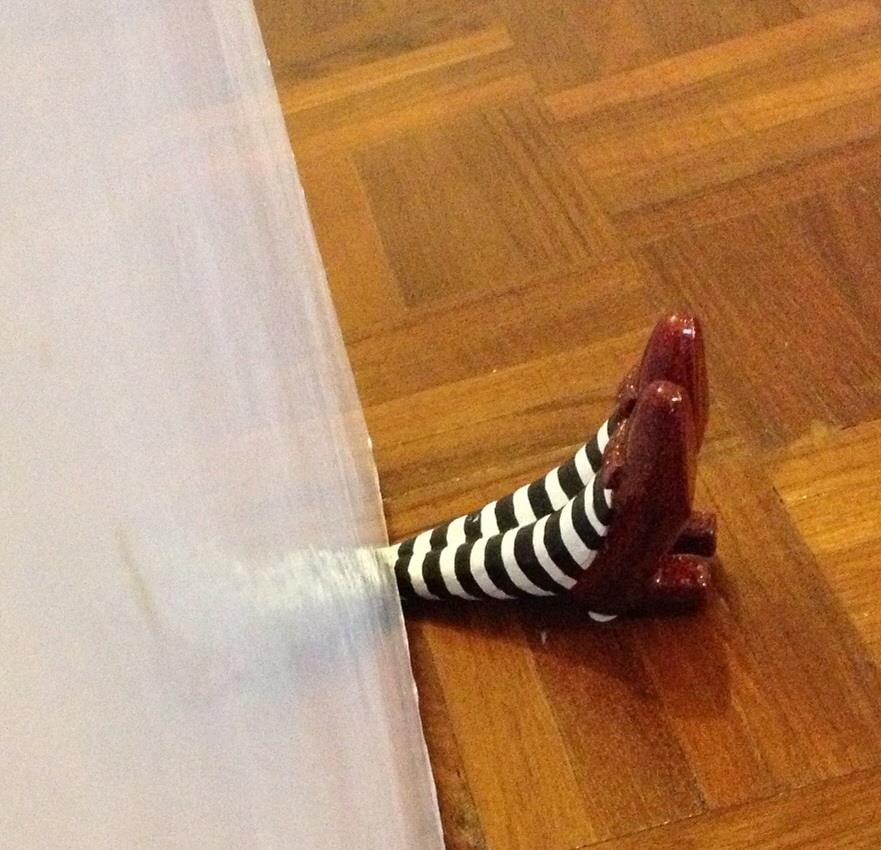
**이미지 캡션:** 이 사진은 나무 바닥 위에 놓인 마녀의 발을 클로즈업한 모습입니다. 붉은색의 반짝이는 구두를 신고 있으며, 검은색과 흰색 줄무늬가 있는 스타킹을 신고 있습니다. 마녀의 발은 흰색 천 조각 아래로 뻗어 있으며, 이는 아마도 마녀가 천 아래에 깔린 것처럼 보이게 하려는 의도일 것입니다. 배경은 광택이 나는 나무 바닥으로, 옅은 갈색과 짙은 갈색의 나무 판자가 격자무늬로 배열되어 있습니다. 전체적으로 사진은 장난스럽고 유머러스한 분위기를 자아내며, 할로윈 장식이나 코스튬의 일부로 보입니다. 사람의 모습은 발 부분만 보이며, 성별이나 나이를 특정하기는 어렵지만, 마녀라는 설정으로 인해 여성으로 추정될 수 있습니다. 표정이나 행동은 보이지 않으며, 보이는 텍스트도 없습니다.

### 11월 21일 (수) 04:14 · is very happy for his postdoc/PHD studen…

is very happy for his postdoc/PHD student,  Dongsun Kim and Jaechang Nam for their ICSE 2013 “Clear Accept” papers. However, both were rejected previously. Congrats if yours gets in this time. Otherwise, you may have "Clear Accepts" next time with a review something like this. Cheers!

(I really appreciate this super encouraging and touching review.)

---
It may be worth noting that this paper was submitted to ICSE 2012. It was
rejected […]. I wood note that, in the 2012 version of the work, 36 bugs were considered (in the 2013 version it is 119). The authors report that their approach fixes 27 of the 119
(previously it was 21 of 36). The previous study involved 11 human subjects.
This 2013 version uses 89 students and 164 developers.

The evidence base for this paper is thus considerably extended form the
previous ICSE submission. […]

The referees also raised a question about […], which has been addressed in this version of the paper. […]

>>> Evaluation <<<

+ fixes real bugs
+ bug classification is useful in it self
+ fixes real bugs faster and more reliably than the state of the art
+ human acceptance results are promising
+ clear and well written
+ thorough evaluation
+ compelling results
+ important and demanding topic

... what more could one want from an ICSE paper?

### 11월 22일 (목) 13:32 · What a beautiful day in Hong Kong in Nov…

📍 The Hong Kong University of Science and Technology - HKUST

What a beautiful day in Hong Kong in Nov with 28C/82F!

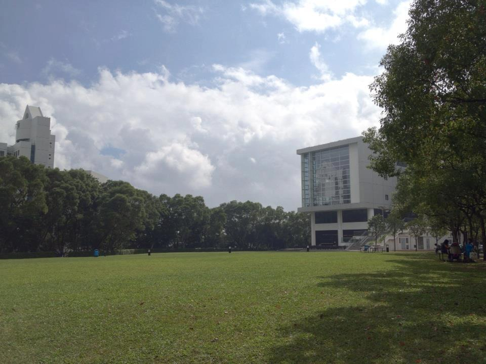
**이미지 캡션:** 넓은 잔디밭이 펼쳐져 있고, 잔디밭 뒤로는 울창한 나무들이 늘어서 있으며, 그 너머로 현대적인 디자인의 흰색 건물이 보인다. 건물은 여러 층으로 이루어져 있으며, 큰 유리창이 특징이다. 잔디밭 오른쪽에는 나무 그늘 아래 몇몇 사람들이 앉아 휴식을 취하고 있다. 하늘에는 구름이 흩뿌려져 있으며, 전체적으로 맑고 화창한 날씨를 나타낸다. 잔디밭에는 몇 개의 검은색 기둥과 파란색 쓰레기통이 보인다. 사람들은 성인 남녀로 보이며, 편안한 복장을 하고 있다. 전반적으로 평화롭고 여유로운 분위기를 자아낸다.

### 11월 22일 (목) 13:39 · good to have a bunch of flowers on his d…

good to have a bunch of flowers on his desk thanks to Yeon Gyoung Gwack. It makes me happy when I work.

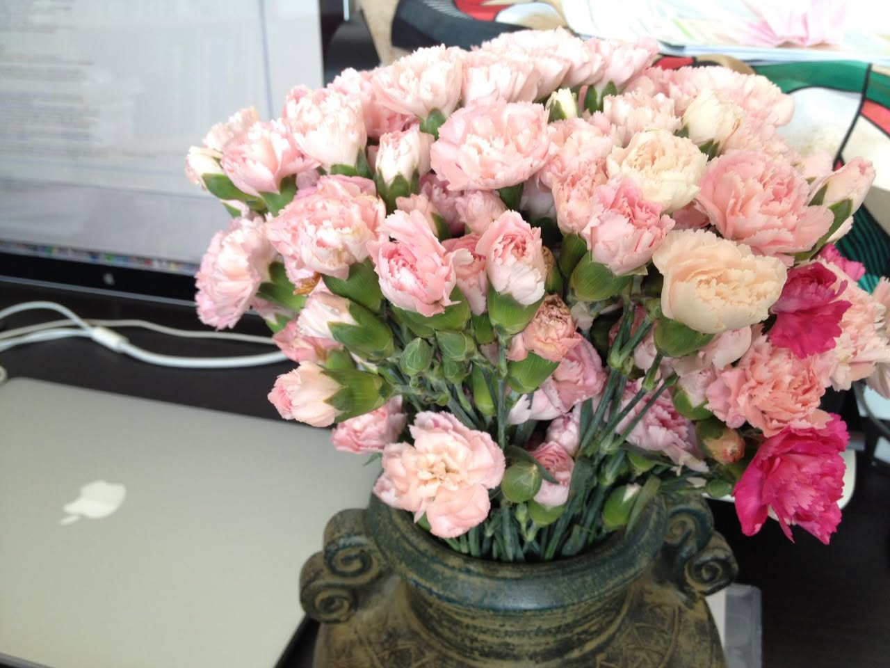
**이미지 캡션:** 책상 위에 놓인 화병에 담긴 분홍색 카네이션 꽃다발이 보인다. 꽃들은 연한 분홍색부터 진한 분홍색까지 다양한 색조를 띠고 있으며, 싱그러운 녹색 잎사귀와 함께 풍성하게 피어 있다. 화병은 짙은 녹색과 갈색이 섞인 고풍스러운 디자인으로, 꽃다발을 더욱 돋보이게 한다. 배경에는 컴퓨터 모니터와 노트북이 보이며, 흰색 케이블이 연결되어 있다. 모니터 화면에는 텍스트가 흐릿하게 보이지만, 자세히 읽기는 어렵다. 전반적으로 차분하고 정돈된 분위기이며, 꽃이 주는 화사함과 생기가 느껴진다.

### 11월 22일 (목) 18:55 · It's a beautiful evening on his way home

📍 The Hong Kong University of Science and Technology - HKUST

It's a beautiful evening on his way home

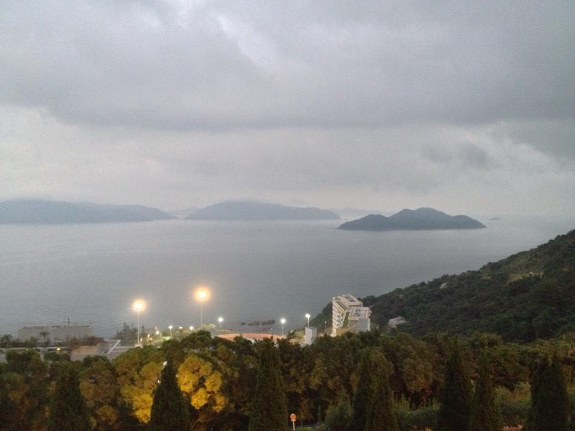
**이미지 캡션:** 흐린 날씨의 해 질 녘, 멀리 보이는 산들과 바다가 잔잔하게 펼쳐져 있고, 바다 위에는 여러 개의 섬들이 희미하게 보입니다. 사진의 오른쪽에는 울창한 숲이 우거진 산비탈이 보이며, 그 위로는 현대적인 건물들이 자리 잡고 있습니다. 산비탈 아래쪽에는 가로등 불빛이 몇 개 켜져 있어 어둠 속에서 길을 밝히고 있으며, 건물들 사이로 보이는 나무들은 짙은 녹색을 띠고 있습니다. 전체적으로 차분하고 약간은 쓸쓸한 분위기를 자아냅니다.

### 11월 23일 (금) 05:46 · A touching PSY's talk (not dancing) at O…

A touching PSY's talk (not dancing) at Oxford Union in English.

🔗 <http://www.youtube.com/watch?v=2f99cTgT5mg>

### 11월 24일 (토) 21:11 · Now 강남스타일 (GANGNAM STYLE) is the most vi…

Now 강남스타일 (GANGNAM STYLE) is the most viewed video in Youtube! Amazing!! 

http://www.youtube.com/watch?v=9bZkp7q19f0

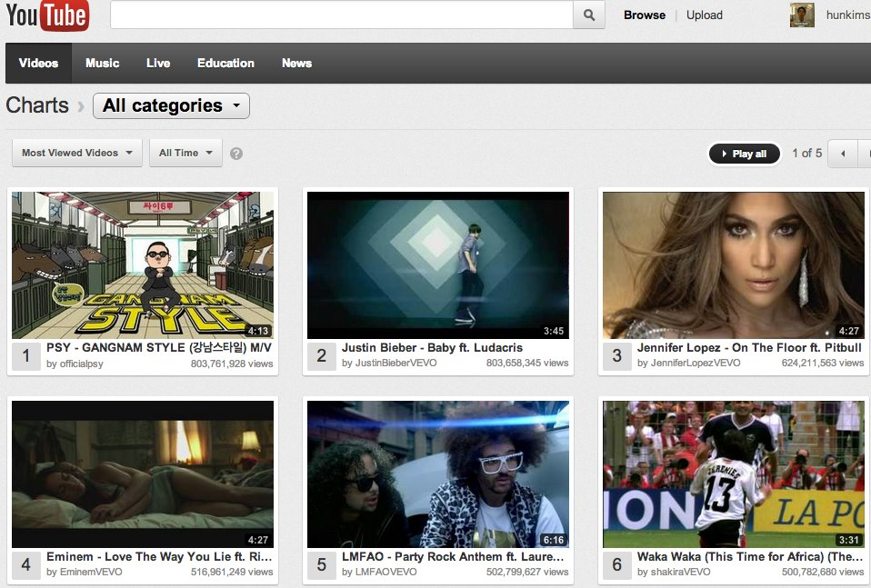
**이미지 캡션:** 이 이미지는 유튜브 웹사이트의 인기 동영상 차트 페이지를 보여줍니다. 상단에는 유튜브 로고, 검색창, 브라우즈 및 업로드 버튼, 사용자 프로필 사진이 있습니다. 그 아래에는 'Videos', 'Music', 'Live', 'Education', 'News' 탭이 있으며, 현재 'Charts'와 'All categories'가 선택되어 있습니다. 차트 목록은 'Most Viewed Videos'와 'All Time'으로 정렬되어 있으며, 총 5개의 페이지 중 첫 번째 페이지임을 나타냅니다. 화면에는 6개의 동영상 썸네일이 격자 형태로 배열되어 있습니다. 첫 번째 동영상은 싸이의 '강남스타일' 뮤직비디오로, 애니메이션 스타일의 썸네일에 싸이가 등장하며 '강남스타일'이라는 제목과 함께 8억 3백만 뷰 이상을 기록하고 있습니다. 두 번째 동영상은 저스틴 비버의 'Baby' 뮤직비디오로, 3억 4천 5백만 뷰를 기록하고 있습니다. 세 번째 동영상은 제니퍼 로페즈의 'On The Floor' 뮤직비디오로, 제니퍼 로페즈의 클로즈업 사진이 썸네일이며 6억 2천만 뷰 이상을 기록하고 있습니다. 네 번째 동영상은 에미넴의 'Love The Way You Lie' 뮤직비디오로, 침대에 누워있는 두 사람의 모습이 썸네일이며 5억 1천만 뷰 이상을 기록하고 있습니다. 다섯 번째 동영상은 LMFAO의 'Party Rock Anthem' 뮤직비디오로, 두 명의 남성이 등장하며 5억 2천만 뷰 이상을 기록하고 있습니다. 여섯 번째 동영상은 샤키라의 'Waka Waka (This Time for Africa)' 뮤직비디오로, 축구 경기장에서 사람들이 환호하는 모습이 썸네일이며 5억 뷰 이상을 기록하고 있습니다. 전반적으로 활기차고 대중적인 분위기를 띠고 있으며, 전 세계적으로 인기 있는 음악 동영상들을 보여주고 있습니다.

### 11월 24일 (토) 21:34 · 📷 앨범: Paper PSY (3장)

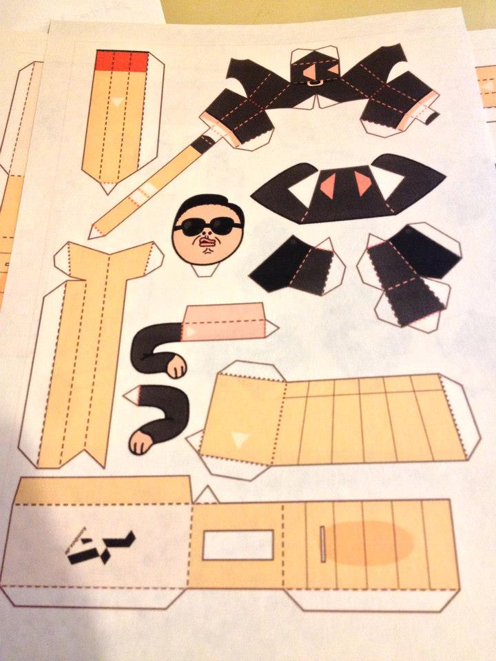
**이미지 캡션:** 이 사진은 종이로 된 입체 모형을 만들기 위한 도안으로, 여러 조각으로 나뉘어 인쇄되어 있습니다. 중앙에는 선글라스를 낀 성인 남성의 얼굴이 그려져 있으며, 그의 표정은 약간 찡그린 듯 익살스럽습니다. 얼굴 위쪽으로는 검은색 재킷과 셔츠를 입은 듯한 상반신 모형 조각들이 배치되어 있으며, 재킷의 소매 부분에는 핑크색으로 손이 표현되어 있습니다. 얼굴 왼쪽에는 연필 모양의 모형 조각이 있고, 그 아래에는 노란색 상의와 바지로 보이는 모형 조각들이 있습니다. 가장 아래쪽에는 흰색과 노란색이 섞인 긴 직사각형 모형 조각이 있는데, 흰색 부분에는 검은색으로 'S'라고 쓰여 있는 듯한 글자가 보입니다. 전반적으로 귀엽고 단순한 그림체로, 조립하면 캐릭터 모형이 완성될 것으로 보입니다. 배경은 흰색 종이이며, 특별한 장소나 사물은 보이지 않고 오직 모형 도안만 인쇄되어 있습니다.
 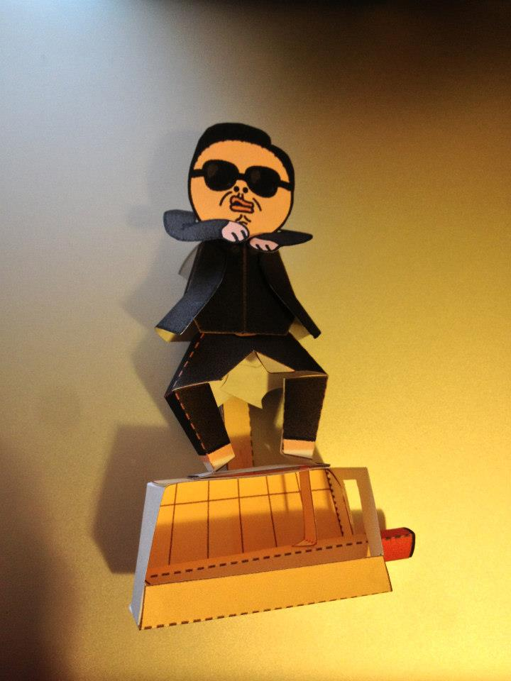
**이미지 캡션:** 이 사진은 종이로 만들어진 캐릭터 인형과 그 아래에 놓인 종이 상자를 보여줍니다. 캐릭터는 성인 남성으로 추정되며, 검은색 선글라스와 콧수염을 하고 있습니다. 그는 검은색 재킷과 바지를 입고 있으며, 팔을 앞으로 뻗고 있는 역동적인 자세를 취하고 있습니다. 표정은 다소 익살스럽고 자신감 넘치는 듯 보입니다. 캐릭터는 노란색과 주황색이 혼합된 그라데이션 배경 앞에 서 있으며, 왼쪽에는 은색으로 보이는 벽이 있습니다. 캐릭터 아래에는 노란색 격자무늬가 그려진 종이 상자가 놓여 있으며, 상자 오른쪽에는 빨간색 부분이 보입니다. 전체적으로 밝고 경쾌한 분위기를 연출하고 있습니다.
 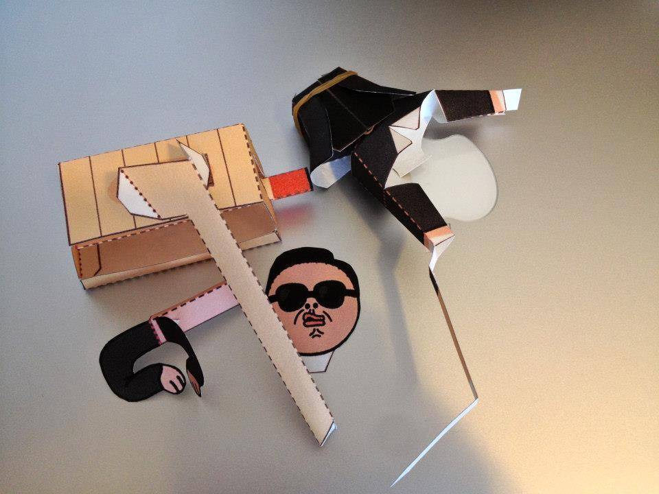
**이미지 캡션:** 종이로 만들어진 인물 모형들이 회색 배경 위에 놓여 있습니다. 왼쪽에는 갈색과 베이지색의 상자 모양 물체가 있고, 그 옆으로 검은색 소매와 분홍색 팔 부분이 꺾여 있는 모습이 보입니다. 상자 위에는 길고 얇은 종이 막대가 비스듬히 놓여 있으며, 이 막대는 상자에서 튀어나온 것처럼 보입니다. 상자 오른쪽에는 콧수염과 선글라스를 낀 얼굴 모양의 종이 모형이 있습니다. 이 얼굴 모형은 만화처럼 단순하게 그려져 있으며, 찡그린 듯한 표정을 짓고 있습니다. 오른쪽에는 검은색 재킷과 흰색 셔츠, 그리고 검은색 바지를 입은 듯한 종이 인물 모형이 서 있습니다. 이 인물 모형은 팔을 앞으로 뻗고 있으며, 마치 춤을 추거나 무언가를 가리키는 듯한 역동적인 자세를 취하고 있습니다. 인물 모형들의 옷에는 갈색 실선으로 바느질한 듯한 디테일이 표현되어 있습니다. 전체적으로 밝고 깨끗한 조명 아래에서 촬영되었으며, 종이 모형들의 입체감이 잘 드러납니다.

### 11월 27일 (화) 07:08 · 📷 앨범: Tom Ball's visit (3장)

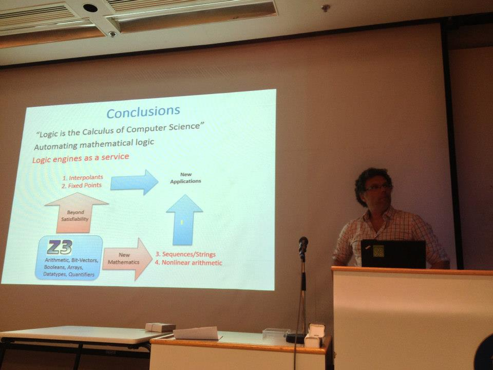
**이미지 캡션:** 발표자가 강단 뒤에 서서 노트북을 바라보고 있으며, 그의 앞에는 마이크가 놓여 있습니다. 발표자는 40대에서 50대로 보이는 성인 남성이며, 곱슬머리에 안경을 쓰고 체크무늬 셔츠를 입고 있습니다. 그의 표정은 차분하고 집중하고 있는 듯 보입니다. 배경에는 "Conclusions"라는 제목과 함께 "Logic is the Calculus of Computer Science", "Automating mathematical logic", "Logic engines as a service"라는 문구가 적힌 프레젠테이션 슬라이드가 보입니다. 슬라이드에는 화살표와 함께 "Interpolants", "Fixed Points", "Beyond Satisfiability", "New Applications", "New Mathematics", "Sequences/Strings", "Nonlinear arithmetic" 등의 내용이 포함되어 있으며, "Z3"라는 이름과 함께 "Arithmetic, Bit-Vectors, Booleans, Arrays, Datatypes, Quantifiers"라는 설명도 있습니다. 전체적으로 학술 발표 또는 기술 세미나의 분위기를 띠고 있습니다.
 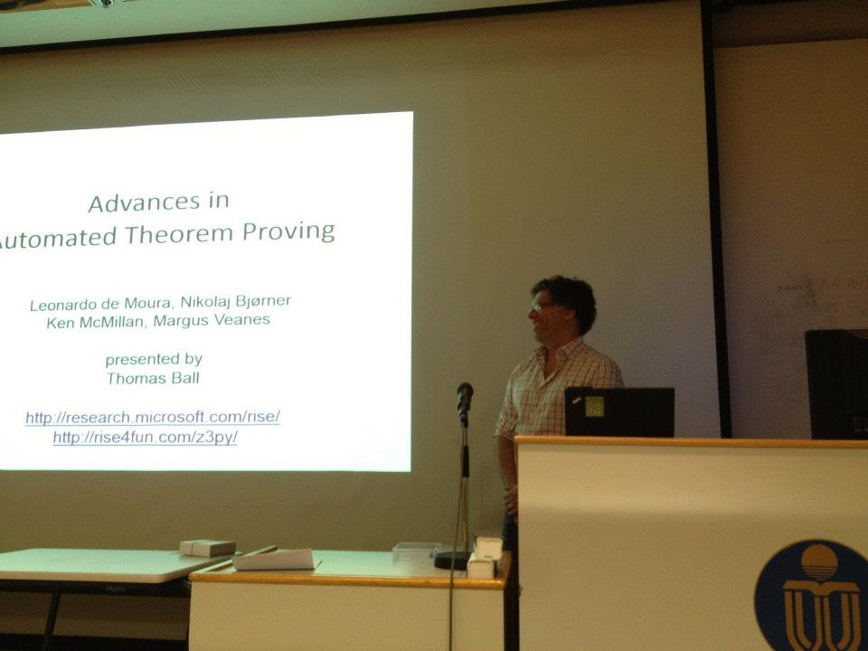
**이미지 캡션:** 한 명의 성인 남성이 발표를 하고 있으며, 그는 40대 후반에서 50대 초반으로 보이며 곱슬거리는 검은색 머리카락과 안경을 착용하고 있습니다. 그는 체크무늬 셔츠와 청바지를 입고 있으며, 발표 자료가 보이는 스크린을 향해 서서 미소를 짓고 있습니다. 배경에는 스크린과 연단이 보이며, 연단 위에는 노트북과 마이크가 놓여 있습니다. 스크린에는 "Advances in Automated Theorem Proving"이라는 제목과 발표자들의 이름, 그리고 관련 웹사이트 주소가 표시되어 있습니다. 전체적으로 학술 발표회 또는 강연회와 같은 분위기입니다.
 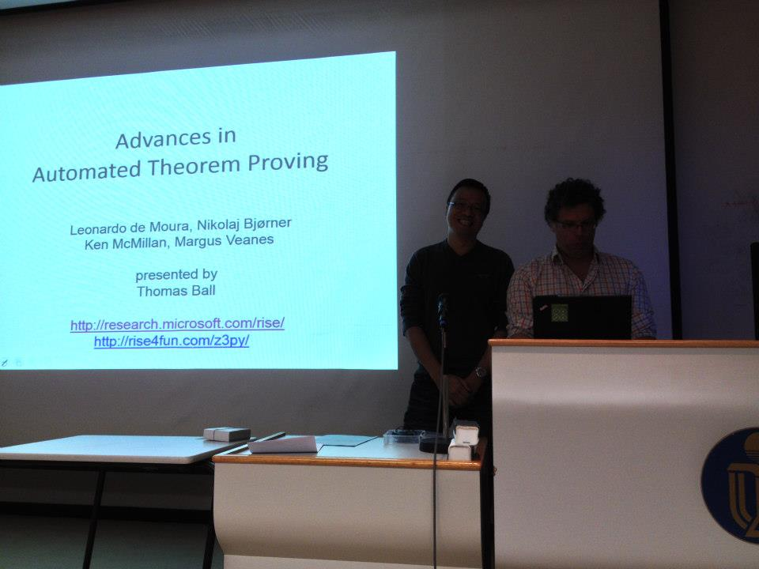
**이미지 캡션:** 화면에는 "Advances in Automated Theorem Proving"이라는 제목과 함께 Leonardo de Moura, Nikolaj Bjørner, Ken McMillan, Margus Veanes의 이름, 그리고 Thomas Ball이 발표자임을 알리는 문구가 파란색 배경에 흰색 글씨로 표시되어 있습니다. 그 아래에는 두 개의 웹사이트 주소가 있습니다. 무대에는 두 명의 성인 남성이 서 있습니다. 왼쪽의 남성은 검은색 상의를 입고 안경을 썼으며, 미소를 짓고 있습니다. 오른쪽의 남성은 체크무늬 셔츠를 입고 안경을 썼으며, 노트북을 보고 있습니다. 무대 앞에는 테이블과 연단이 있으며, 연단에는 로고가 새겨져 있습니다. 전체적으로 학술 발표회 또는 강연의 한 장면으로 보이며, 진지하면서도 약간은 편안한 분위기입니다.

> Wonderful conclusions
> Thomas Ball is smiling when he is introduced.
> Charles Zhang is so happy too!
