# 2012년 12월

[← 2012년](README.md)

### 12월 4일 (화) 12:38 · is busy handing out these flyers at APSE…

📍 Sheraton Hong Kong Hotel & Towers

is busy handing out these flyers at APSEC 2012 in Hong Kong. Looking forward to seeing you if you are attending the conference.

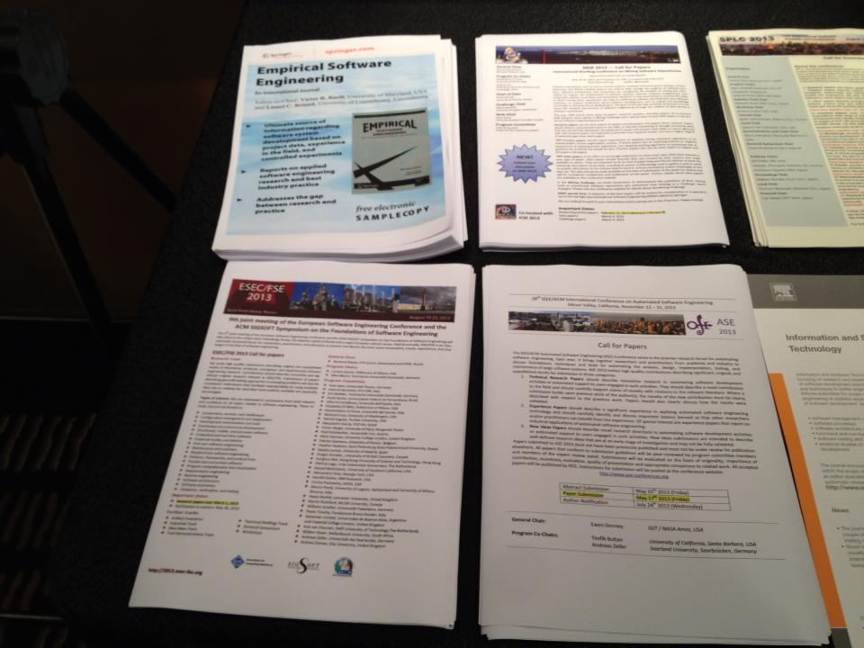
**이미지 캡션:** 테이블 위에 여러 개의 학술 논문과 컨퍼런스 콜 포 페이퍼가 놓여 있으며, 일부는 쌓여 있고 일부는 펼쳐져 있습니다. 왼쪽 상단에는 "Empirical Software Engineering"이라는 제목의 논문이 보이며, 그 옆에는 "EMPIRICAL"이라는 책 표지가 있습니다. 그 아래에는 "ESEC/FSE 2013"이라는 제목의 콜 포 페이퍼가 펼쳐져 있으며, "9th joint meeting of the European Software Engineering Conference and the ACM SIGSOFT Symposium on the Foundations of Software Engineering"이라고 적혀 있습니다. 오른쪽에는 "ASE 2013"이라는 제목의 콜 포 페이퍼가 보이며, "28th IEEE/ACM International Conference on Automated Software Engineering"이라고 명시되어 있습니다. 가장 오른쪽에는 "Information and Software Technology"라는 제목의 문서가 부분적으로 보입니다. 전반적으로 학술 행사나 연구 발표와 관련된 자료들이 모여 있는 모습입니다.OFT Symposium on the Foundations of Software Engineering"이라고 적혀 있습니다. 오른쪽에는 "ASE 2013"이라는 제목의 콜 포 페이퍼가 보이며, "28th IEEE/ACM International Conference on Automated Software Engineering"이라고 명시되어 있습니다. 가장 오른쪽에는 "Information and Software Technology"라는 제목의 문서가 부분적으로 보입니다. 전반적으로 학술 행사나 연구 발표와 관련된 자료들이 모여 있는 모습입니다.

### 12월 5일 (수) 10:29 · voted!!

voted!!

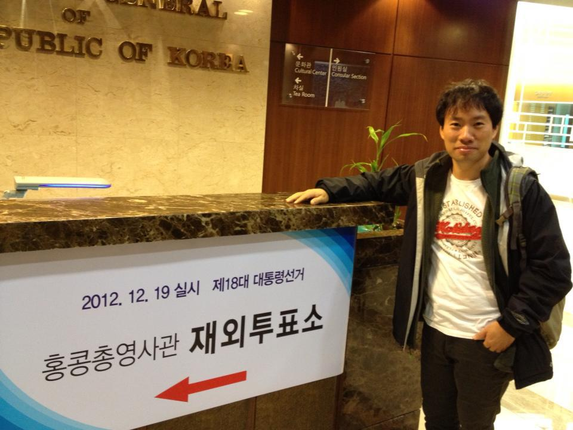
**이미지 캡션:** 한 성인 남성이 대리석 카운터에 기대어 서 있다. 그는 검은색 재킷 안에 흰색 티셔츠를 입고 있으며, 티셔츠에는 "ESTABLISHED"라는 문구와 함께 붉은색 디자인이 있다. 남성은 캐주얼한 복장을 하고 있으며, 등에는 배낭을 메고 있다. 그의 표정은 약간의 미소를 띠고 있으며, 편안해 보인다. 배경에는 "PUBLIC OF KOREA"라고 쓰인 금색 글자와 함께 한국어로 된 안내 표지판이 보인다. 표지판에는 "문화관", "민원실", "차실" 등의 단어가 적혀 있으며, 영어로도 번역되어 있다. 카운터 위에는 흰색 바탕에 파란색과 주황색 디자인이 있는 현수막이 놓여 있으며, "2012. 12. 19 실시 제18대 대통령선거 홍콩총영사관 재외투표소"라는 문구가 적혀 있고, 왼쪽을 가리키는 빨간색 화살표가 있다. 전반적으로 실내의 공식적인 장소로 보이며, 투표소임을 알리는 현수막이 있어 선거 관련 행사나 장소임을 짐작할 수 있다.흰색 바탕에 파란색과 주황색 디자인이 있는 현수막이 놓여 있으며, "2012. 12. 19 실시 제18대 대통령선거 홍콩총영사관 재외투표소"라는 문구가 적혀 있고, 왼쪽을 가리키는 빨간색 화살표가 있다. 전반적으로 실내의 공식적인 장소로 보이며, 투표소임을 알리는 현수막이 있어 선거 관련 행사나 장소임을 짐작할 수 있다.

### 12월 5일 (수) 23:31 · had wonderful dinner with the APSEC 2012…

had wonderful dinner with the APSEC 2012 Team and keynote speakers, David Rosenblum, Jeff Kramer and Barbara G. Ryder.

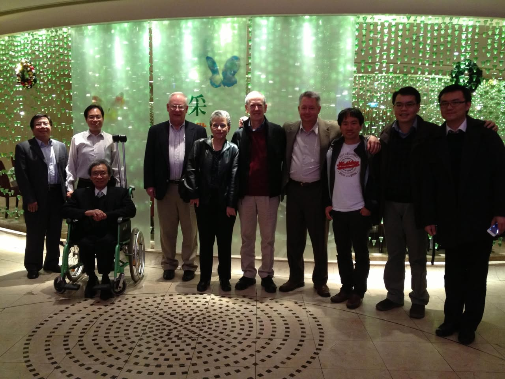
**이미지 캡션:** 이 사진은 실내에서 촬영되었으며, 총 10명의 사람들이 단체 사진을 찍고 있다. 왼쪽부터 검은색 정장을 입은 성인 남성, 흰색 셔츠에 검은색 바지를 입은 성인 남성, 휠체어에 앉아 검은색 정장을 입은 성인 남성, 흰색 셔츠에 갈색 재킷을 입은 성인 남성, 검은색 재킷에 흰색 셔츠를 입은 성인 남성, 검은색 재킷에 흰색 셔츠를 입은 성인 남성, 검은색 재킷에 흰색 셔츠를 입은 성인 남성, 검은색 재킷에 흰색 셔츠를 입은 성인 남성, 검은색 재킷에 흰색 셔츠를 입은 성인 남성, 검은색 재킷에 흰색 셔츠를 입은 성인 남성이다. 배경에는 녹색 유리로 된 벽이 있으며, 벽에는 나비 모양의 장식이 있다. 바닥에는 원형 패턴의 타일이 깔려 있다. 전체적으로 밝고 긍정적인 분위기이며, 사람들은 모두 밝은 표정으로 카메라를 바라보고 있다.인 남성이다. 배경에는 녹색 유리로 된 벽이 있으며, 벽에는 나비 모양의 장식이 있다. 바닥에는 원형 패턴의 타일이 깔려 있다. 전체적으로 밝고 긍정적인 분위기이며, 사람들은 모두 밝은 표정으로 카메라를 바라보고 있다.

### 12월 6일 (목) 09:47 · Now it is back to Hong Kong weather! No …

Now it is back to Hong Kong weather! No rain!!

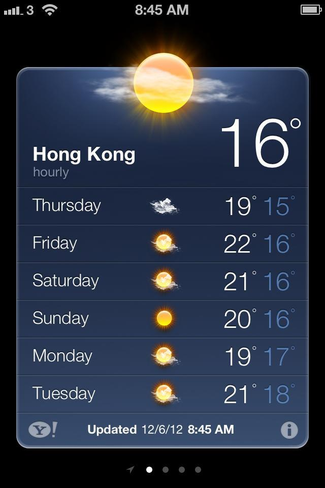
**이미지 캡션:** 이것은 아이폰 날씨 앱 화면으로, 홍콩의 시간별 날씨 예보를 보여줍니다. 화면 상단에는 8시 45분이라는 시간이 표시되어 있으며, 배터리 잔량 아이콘과 통신사 신호 강도 아이콘도 보입니다. 중앙에는 밝은 태양과 구름이 그려진 배경 위에 "Hong Kong hourly"라는 글자가 흰색으로 표시되어 있습니다. 그 아래로는 목요일부터 화요일까지 요일별 날씨 예보가 나열되어 있습니다. 각 요일 옆에는 해당 날씨를 나타내는 아이콘(구름, 태양, 태양과 구름)과 함께 최고 기온과 최저 기온이 섭씨로 표시되어 있습니다. 예를 들어, 목요일은 19도에서 15도, 금요일은 22도에서 16도입니다. 화면 하단에는 "Y!" 로고와 함께 "Updated 12/6/12 8:45 AM"이라는 업데이트 날짜 및 시간이 표시되어 있으며, 정보 아이콘도 함께 보입니다. 화면 하단에는 페이지를 넘기는 듯한 점들이 표시되어 있습니다. 전반적으로 맑고 시원한 날씨를 나타내는 푸른색과 노란색 계열의 색상이 사용되어 깔끔하고 정보 전달에 집중된 분위기입니다. 예를 들어, 목요일은 19도에서 15도, 금요일은 22도에서 16도입니다. 화면 하단에는 "Y!" 로고와 함께 "Updated 12/6/12 8:45 AM"이라는 업데이트 날짜 및 시간이 표시되어 있으며, 정보 아이콘도 함께 보입니다. 화면 하단에는 페이지를 넘기는 듯한 점들이 표시되어 있습니다. 전반적으로 맑고 시원한 날씨를 나타내는 푸른색과 노란색 계열의 색상이 사용되어 깔끔하고 정보 전달에 집중된 분위기입니다.

### 12월 6일 (목) 19:22 · This is how I flied today due to snow in…

This is how I flied today due to snow in Korea.

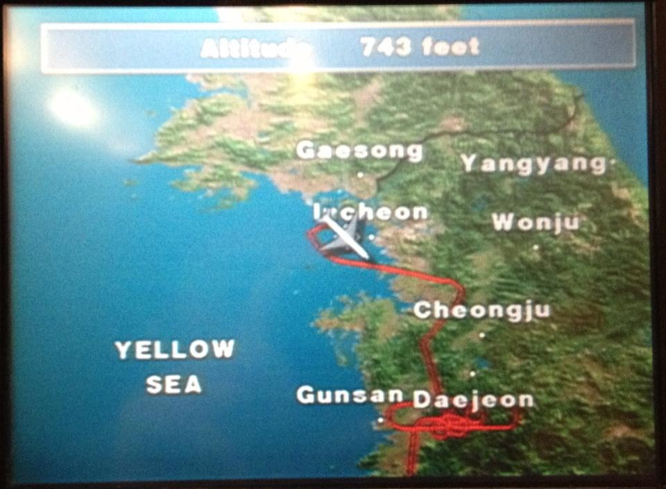
**이미지 캡션:** 이 사진은 한국 지도를 보여주는 화면으로, 노란색 선으로 표시된 비행 경로와 함께 여러 도시 이름이 표시되어 있습니다. 화면 상단에는 "Altitude 743 feet"라는 텍스트가 나타나 현재 고도를 보여줍니다. 지도에는 서해와 한국의 내륙 지역이 녹색으로 표현되어 있으며, "Gaesong", "Yangyang", "Icheon", "Wonju", "Cheongju", "Gunsan Daejeon"과 같은 도시 이름들이 보입니다. 비행 경로는 Icheon 근처에서 시작하여 남쪽으로 내려가며 복잡한 패턴을 그리다가 Gunsan Daejeon 근처에서 마무리됩니다. 비행기 모양의 아이콘이 Icheon 근처에서 경로를 따라 이동하는 것을 나타냅니다. 전반적으로 이 화면은 항공편의 실시간 경로와 고도를 보여주는 항공 관제 또는 비행 시뮬레이션 화면으로 보입니다.리다가 Gunsan Daejeon 근처에서 마무리됩니다. 비행기 모양의 아이콘이 Icheon 근처에서 경로를 따라 이동하는 것을 나타냅니다. 전반적으로 이 화면은 항공편의 실시간 경로와 고도를 보여주는 항공 관제 또는 비행 시뮬레이션 화면으로 보입니다.

### 12월 8일 (토) 17:04 · We saw Ahn Cheol Soo (안철수)!

We saw Ahn Cheol Soo (안철수)!

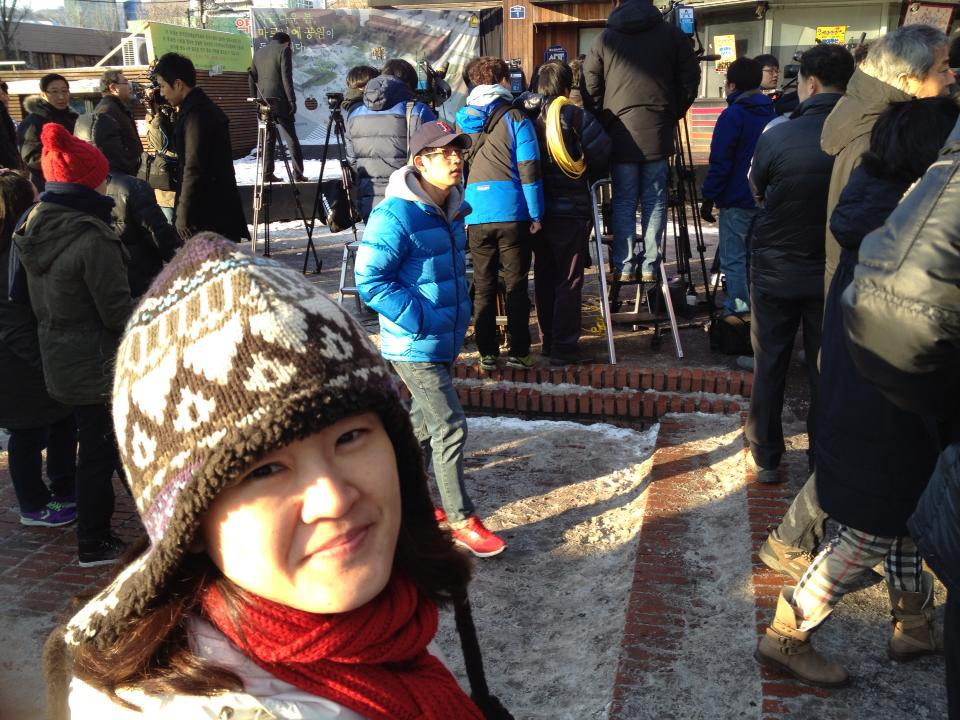
**이미지 캡션:** 사진은 야외에서 열린 행사 현장을 담고 있으며, 여러 명의 사람들이 모여 있다. 전경에는 성인 여성이 얼굴을 클로즈업하여 카메라를 응시하고 있으며, 그녀는 귀가 달린 패턴이 있는 모자와 빨간색 목도리를 착용하고 있다. 그녀의 표정은 부드럽게 미소 짓고 있으며, 햇빛이 그녀의 얼굴을 비추고 있다. 배경에는 여러 명의 성인 남성과 여성이 서 있으며, 일부는 카메라 장비를 들고 있거나 행사 진행을 돕는 듯한 모습이다. 특히 파란색 패딩 점퍼를 입은 성인 남성이 눈에 띄며, 그는 카메라를 향해 서 있다. 또한, 검은색 코트를 입은 성인 남성이 사다리 위에 올라가 촬영을 하고 있으며, 노란색 원형 물체가 그의 옆에 놓여 있다. 장소는 야외이며, 바닥에는 눈이 녹은 듯한 흔적과 벽돌이 보인다. 전반적으로 행사가 진행 중이거나 취재가 이루어지고 있는 듯한 분주하고 활기찬 분위기이다. 배경의 현수막에는 한국어로 "에공원이"라는 글자가 일부 보인다.색 코트를 입은 성인 남성이 사다리 위에 올라가 촬영을 하고 있으며, 노란색 원형 물체가 그의 옆에 놓여 있다. 장소는 야외이며, 바닥에는 눈이 녹은 듯한 흔적과 벽돌이 보인다. 전반적으로 행사가 진행 중이거나 취재가 이루어지고 있는 듯한 분주하고 활기찬 분위기이다. 배경의 현수막에는 한국어로 "에공원이"라는 글자가 일부 보인다.
 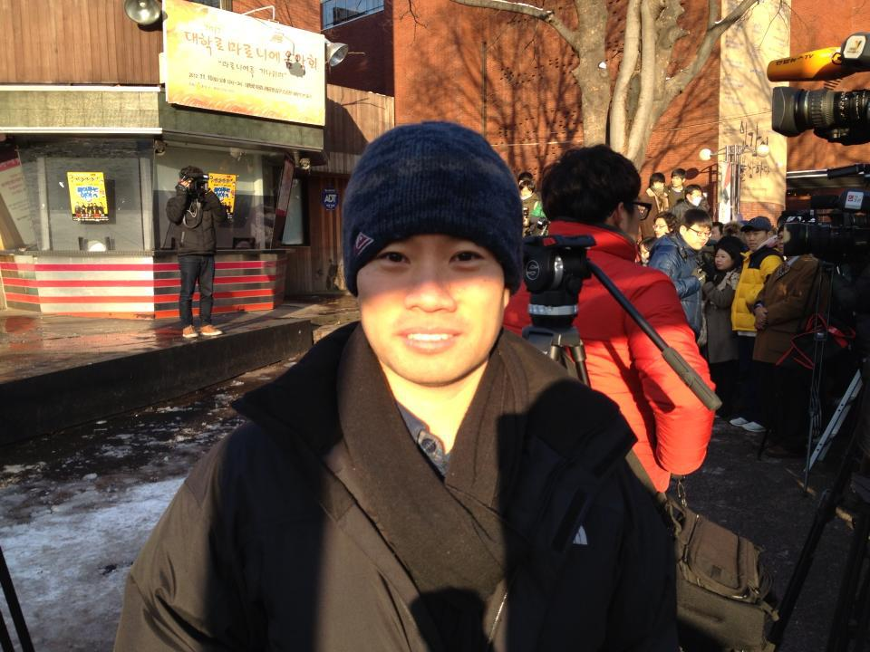
**이미지 캡션:** 한 명의 성인 남성이 카메라를 들고 서 있으며, 그는 회색 비니와 검은색 패딩 점퍼를 입고 있다. 그의 얼굴은 카메라를 향하고 있으며, 약간의 미소를 띠고 있다. 배경에는 여러 명의 사람들이 모여 있으며, 일부는 카메라 장비를 들고 있다. 건물 외벽은 붉은 벽돌로 되어 있고, 나무가 보인다. 땅에는 눈이 녹은 흔적이 있고, 햇빛이 비치고 있어 추운 날씨임을 짐작하게 한다. 건물에는 한국어로 된 간판이 걸려 있으며, "대학로 마로니에 in 영화제"라고 적혀 있다. 전반적으로 취재 현장이나 행사장의 분위기를 띤다..
 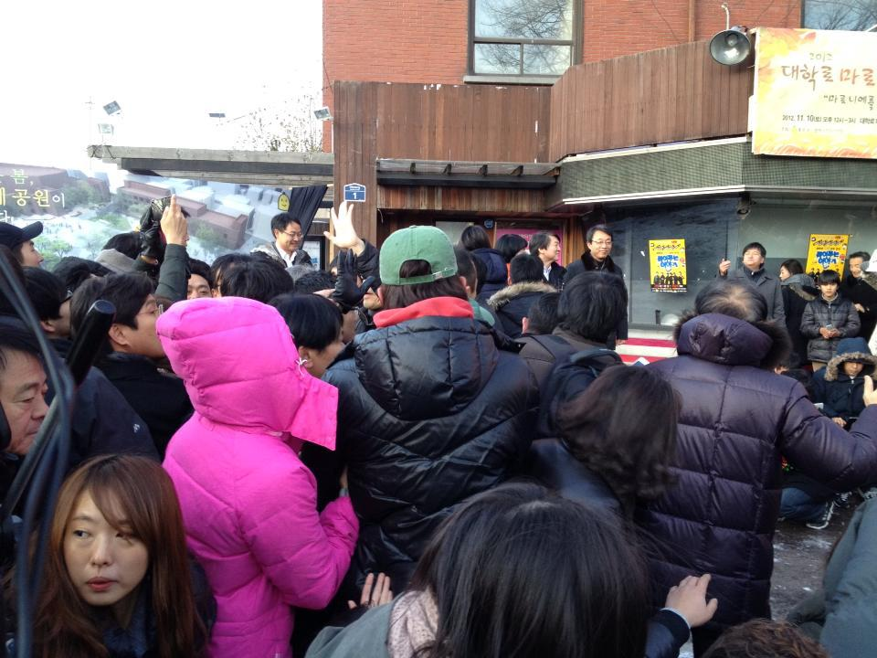
**이미지 캡션:** 이 사진은 많은 사람들이 모여 있는 야외 행사 장면을 담고 있으며, 2012년 11월 10일 대학로 마로니에 공원에서 열린 행사로 보인다. 중앙에는 짙은 남색 패딩을 입은 성인 남성이 서 있고, 그의 뒤로는 붉은 벽돌 건물과 나무로 된 외벽이 보인다. 건물에는 "2012 대학로 마로니에"라고 적힌 노란색 현수막이 걸려 있으며, 행사 날짜와 시간도 명시되어 있다. 주변에는 다양한 연령대의 사람들이 두꺼운 겨울옷을 입고 모여 있으며, 일부는 휴대폰이나 카메라로 촬영하고 있다. 특히 핑크색 패딩을 입은 사람과 녹색 모자를 쓴 사람이 눈에 띈다. 전반적으로 활기차고 북적이는 분위기이며, 행사에 참여하거나 관람하기 위해 모인 사람들로 보인다. 모자를 쓴 사람이 눈에 띈다. 전반적으로 활기차고 북적이는 분위기이며, 행사에 참여하거나 관람하기 위해 모인 사람들로 보인다.
 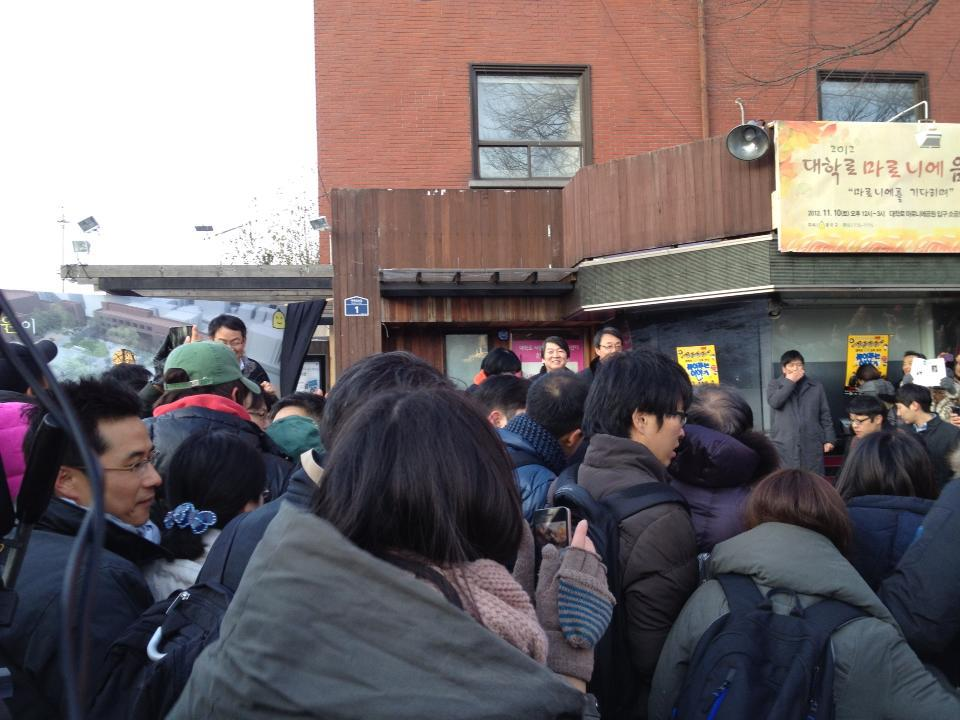
**이미지 캡션:** A crowd of people, mostly young adults and adults, are gathered in front of a brick building with wooden accents. The building has two windows on the upper floor and a sign that reads "2012 대학로 마로니에 음 '마로니에를 기다히며' 2012. 11.10 오후 12시~3시 대구". Some people are wearing winter clothing such as jackets and scarves, and many have backpacks. The atmosphere appears to be that of an outdoor event or gathering, possibly a performance or a festival, given the presence of a sign and the crowd's anticipation. The lighting suggests it is daytime, but the sky is overcast.s jackets and scarves, and many have backpacks. The atmosphere appears to be that of an outdoor event or gathering, possibly a performance or a festival, given the presence of a sign and the crowd's anticipation. The lighting suggests it is daytime, but the sky is overcast.
 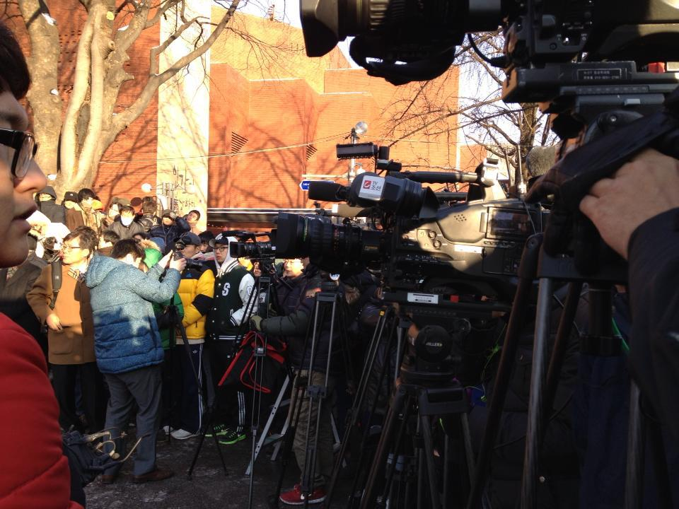
**이미지 캡션:** 이 사진은 여러 대의 방송 카메라가 삼각대에 설치되어 있고, 그 주변으로 많은 사람들이 모여 있는 야외 현장을 담고 있다. 사진의 전경에는 한 성인 남성이 빨간색 옷을 입고 있으며, 그의 얼굴 일부와 안경이 보인다. 그 뒤로는 다양한 연령대의 사람들이 서 있는데, 대부분은 성인 남성으로 보이며 두꺼운 외투를 입고 있다. 몇몇 사람들은 카메라를 들고 있거나, 다른 사람들을 촬영하는 듯한 모습이다. 특히 중앙에는 파란색 패딩 점퍼를 입은 한 성인 남성이 카메라를 들고 있으며, 그의 옆에는 노란색 점퍼를 입은 성인 남성이 서 있다. 또한, 초록색과 흰색이 섞인 야구 점퍼를 입은 성인 남성이 눈에 띈다. 배경에는 붉은 벽돌 건물과 앙상한 나뭇가지들이 보인다. 여러 대의 방송 카메라 중 일부에는 "TV 조선"이라는 글자가 새겨져 있다. 전반적으로 취재 현장이나 시위 현장과 같이 언론의 관심이 집중된 상황으로 보이며, 다소 분주하고 긴장된 분위기가 느껴진다. 남성이 서 있다. 또한, 초록색과 흰색이 섞인 야구 점퍼를 입은 성인 남성이 눈에 띈다. 배경에는 붉은 벽돌 건물과 앙상한 나뭇가지들이 보인다. 여러 대의 방송 카메라 중 일부에는 "TV 조선"이라는 글자가 새겨져 있다. 전반적으로 취재 현장이나 시위 현장과 같이 언론의 관심이 집중된 상황으로 보이며, 다소 분주하고 긴장된 분위기가 느껴진다.
 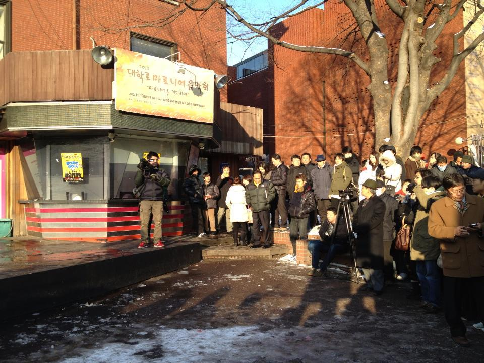
**이미지 캡션:** 한 성인 남성이 카메라를 들고 서 있고, 그 뒤로 많은 사람들이 모여 있습니다. 이들은 건물 앞에 있는 것으로 보이며, 건물에는 "2012 대학로 마로니에 음악회"라고 쓰인 현수막이 걸려 있습니다. 현수막에는 "마로니에를 기다리며"라는 문구와 함께 날짜가 적혀 있습니다. 주변에는 눈이 쌓여 있고, 나무가 서 있어 겨울임을 알 수 있습니다. 사람들은 두꺼운 외투를 입고 있으며, 일부는 휴대폰을 보고 있거나 서로 대화하는 모습입니다. 전반적으로 행사를 기다리거나 취재하는 듯한 분위기입니다.
 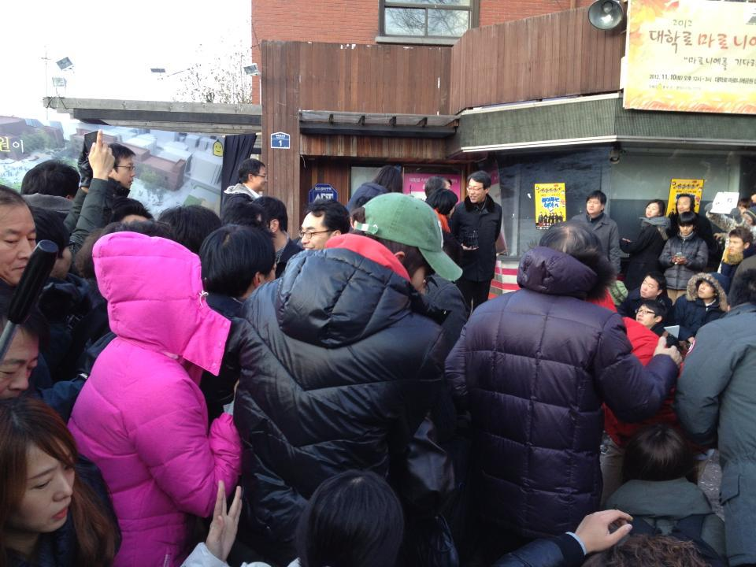
**이미지 캡션:** 이 사진은 많은 사람들이 모여 있는 야외 행사 장면을 담고 있으며, 2012년 11월 10일 대학로 마로니에 공원에서 열린 "마로니에를 기다리며"라는 행사의 일부로 보인다. 사진 중앙에는 짙은 남색 패딩을 입은 성인 남성이 서 있고, 그의 앞에는 분홍색 패딩을 입은 젊은 여성이 보인다. 주변에는 다양한 연령대의 남녀가 두꺼운 겨울옷을 입고 서 있거나 앉아 있으며, 일부는 휴대폰으로 사진을 찍고 있다. 배경에는 붉은 벽돌 건물과 나무로 된 외벽, 그리고 행사 관련 현수막과 포스터가 보인다. 현수막에는 "2012 대학로 마로니에"라는 글자와 함께 행사 날짜와 시간이 적혀 있다. 전반적으로 추운 날씨에 열린 문화 행사나 모임에 참여하기 위해 모인 사람들로 북적이는 활기찬 분위기이다. 대학로 마로니에"라는 글자와 함께 행사 날짜와 시간이 적혀 있다. 전반적으로 추운 날씨에 열린 문화 행사나 모임에 참여하기 위해 모인 사람들로 북적이는 활기찬 분위기이다.
 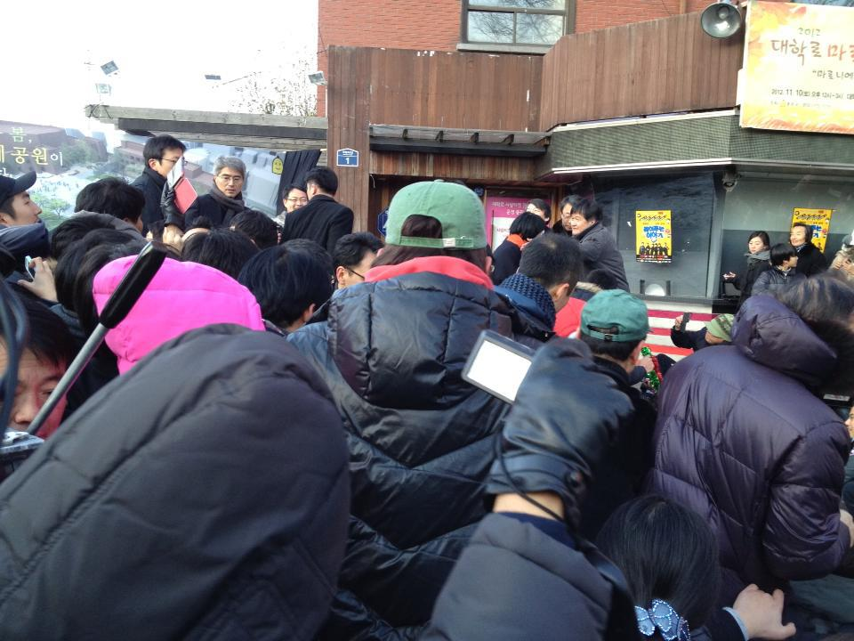
**이미지 캡션:** 이 사진은 많은 사람들이 모여 있는 야외 행사 장면을 담고 있으며, 대부분의 사람들은 두꺼운 겨울 외투를 입고 있습니다. 중앙에는 회색 머리의 중년 남성이 검은색 코트를 입고 있으며, 그의 주변으로 많은 사람들이 둘러싸고 있습니다. 몇몇 사람들은 스마트폰으로 사진을 찍거나 영상을 촬영하고 있으며, 한 사람은 분홍색 물체를 들고 있습니다. 배경에는 붉은 벽돌 건물과 나무로 된 구조물이 보이며, 건물에는 한국어로 된 현수막과 포스터가 걸려 있습니다. 현수막에는 "2012 대학로 마로니에"라는 문구가 보이고, 다른 포스터에는 "봄, 공원"이라는 글자와 함께 사람들이 그려져 있습니다. 전체적으로 행사에 참여하거나 무언가를 보기 위해 모인 군중의 모습이며, 약간은 혼잡하고 활기찬 분위기입니다. 포스터에는 "봄, 공원"이라는 글자와 함께 사람들이 그려져 있습니다. 전체적으로 행사에 참여하거나 무언가를 보기 위해 모인 군중의 모습이며, 약간은 혼잡하고 활기찬 분위기입니다.
 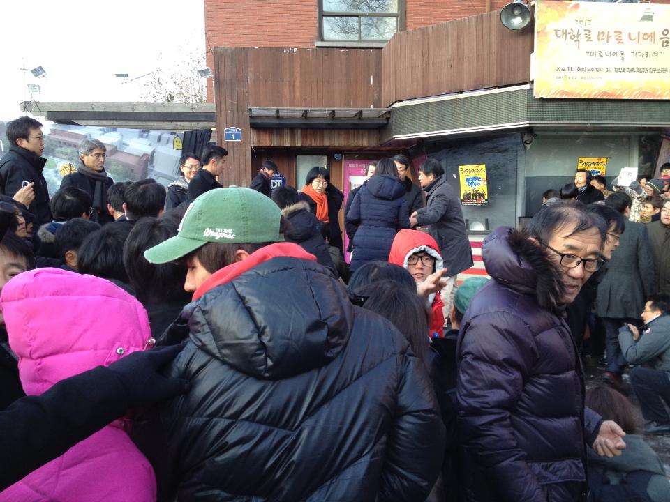
**이미지 캡션:** A crowd of people, mostly adults, are gathered outdoors in front of a building with a brick facade and wooden accents. The atmosphere appears to be that of an event or gathering, possibly a performance or festival, given the posters visible on the building. In the foreground, a young adult male wearing a green baseball cap and a black puffer jacket is prominent, looking towards the right. To his left, a person in a bright pink puffer jacket is partially visible. To the right of the young man, an older adult male with glasses and a dark purple puffer jacket is looking towards the camera with a neutral expression. Other individuals in the crowd are dressed in winter clothing, including puffer jackets and scarves, suggesting a cool weather. The background shows a building with a sign that reads "2012 대학로 마로니에음" and "마로니에를 기다리며" along with event details in Korean. The overall mood is one of anticipation and community engagement.young man, an older adult male with glasses and a dark purple puffer jacket is looking towards the camera with a neutral expression. Other individuals in the crowd are dressed in winter clothing, including puffer jackets and scarves, suggesting a cool weather. The background shows a building with a sign that reads "2012 대학로 마로니에음" and "마로니에를 기다리며" along with event details in Korean. The overall mood is one of anticipation and community engagement.ult male wearing a green baseball cap and a black puffer jacket is prominent, looking towards the right. To his left, a person in a bright pink puffer jacket is partially visible. To the right of the young man, an older adult male with glasses and a dark purple puffer jacket is looking towards the camera with a neutral expression. Other individuals in the crowd are dressed in winter clothing, including puffer jackets and scarves, suggesting a cool weather. The background shows a building with a sign that reads "2012 대학로 마로니에음" and "마로니에를 기다리며" along with event details in Korean. The overall mood is one of anticipation and community engagement.
 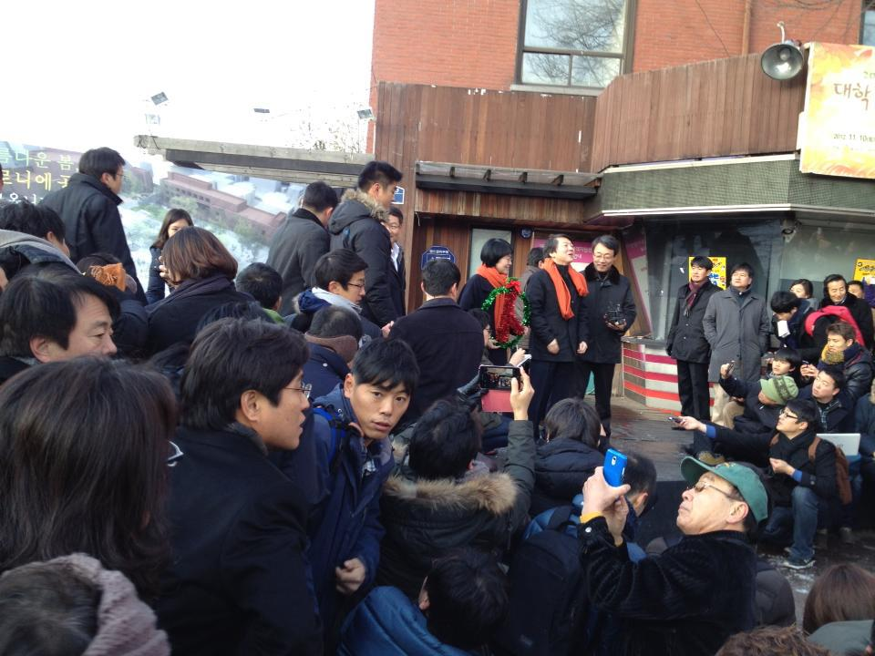
**이미지 캡션:** 이 사진은 야외에서 열리는 행사 또는 모임의 모습을 담고 있으며, 많은 사람들이 모여 있는 가운데 몇몇 사람들이 무대 위에서 행사를 진행하고 있습니다. 무대 위에는 검은색 옷을 입고 주황색 스카프를 두른 남성 두 명과 검은색 옷을 입은 여성 한 명이 서 있으며, 이들은 대략 40대에서 50대로 보입니다. 한 남성은 마이크를 들고 있고, 다른 남성은 무언가를 들고 있습니다. 여성은 화려한 장식이 달린 리본을 들고 있습니다. 이들 옆에는 검은색 코트를 입은 남성 두 명이 서 있습니다. 무대 앞에는 다양한 연령대의 사람들이 모여 있으며, 대부분 남성이고 20대에서 50대로 추정됩니다. 많은 사람들이 스마트폰으로 사진을 찍거나 동영상을 촬영하고 있으며, 일부는 무대 위 사람들을 바라보며 집중하고 있습니다. 배경에는 붉은 벽돌 건물과 나무로 된 구조물이 보이며, 건물에는 "대학"이라는 글자가 쓰인 현수막이 걸려 있습니다. 전체적으로 행사에 참여한 사람들의 열띤 분위기와 함께, 무대 위에서 진행되는 행사에 대한 관심이 느껴집니다. 사람들이 모여 있으며, 대부분 남성이고 20대에서 50대로 추정됩니다. 많은 사람들이 스마트폰으로 사진을 찍거나 동영상을 촬영하고 있으며, 일부는 무대 위 사람들을 바라보며 집중하고 있습니다. 배경에는 붉은 벽돌 건물과 나무로 된 구조물이 보이며, 건물에는 "대학"이라는 글자가 쓰인 현수막이 걸려 있습니다. 전체적으로 행사에 참여한 사람들의 열띤 분위기와 함께, 무대 위에서 진행되는 행사에 대한 관심이 느껴집니다.
 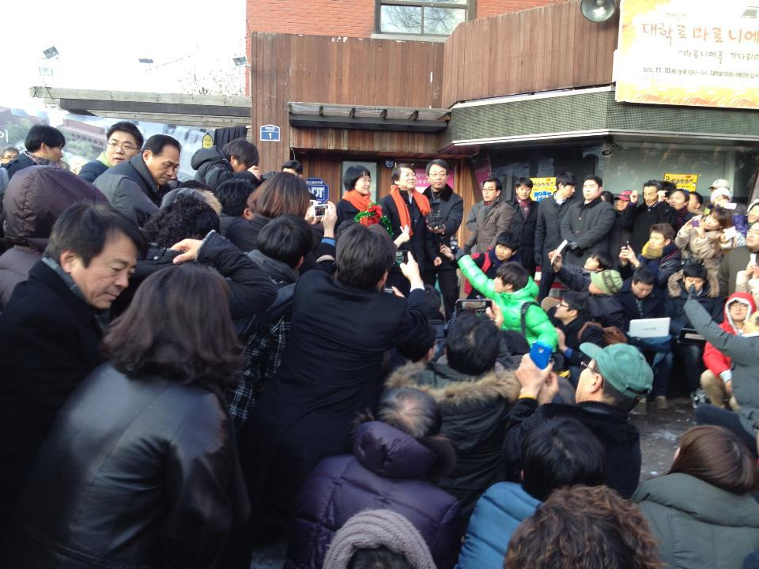
**이미지 캡션:** 이 사진은 야외에서 열린 행사 또는 모임의 모습을 담고 있으며, 많은 사람들이 모여 있습니다. 중앙에는 여러 명의 성인 남성과 성인 여성이 서 있으며, 이들은 행사의 주요 인물로 보입니다. 한 성인 여성은 주황색 스카프를 목에 두르고 있으며, 다른 성인 여성은 검은색 옷에 주황색 스카프를 착용하고 있습니다. 이들 주변에는 많은 사람들이 둘러싸고 있으며, 대부분 성인 남성과 성인 여성으로 보입니다. 사람들은 다양한 복장을 하고 있으며, 두꺼운 외투를 입은 것으로 보아 날씨가 쌀쌀한 것으로 추정됩니다. 많은 사람들이 스마트폰이나 카메라를 들고 사진을 찍거나 동영상을 촬영하고 있으며, 일부는 환호하거나 집중하는 표정을 짓고 있습니다. 배경에는 갈색 목재로 된 건물과 간판이 보이며, 간판에는 한국어로 "2015 대학로 마로니에"라는 문구가 쓰여 있습니다. 또한, "마로니에를 가다하여"라는 문구와 날짜로 보이는 "2012.11.10"도 희미하게 보입니다. 전반적으로 활기차고 주목받는 행사가 진행되고 있는 분위기입니다.들이 스마트폰이나 카메라를 들고 사진을 찍거나 동영상을 촬영하고 있으며, 일부는 환호하거나 집중하는 표정을 짓고 있습니다. 배경에는 갈색 목재로 된 건물과 간판이 보이며, 간판에는 한국어로 "2015 대학로 마로니에"라는 문구가 쓰여 있습니다. 또한, "마로니에를 가다하여"라는 문구와 날짜로 보이는 "2012.11.10"도 희미하게 보입니다. 전반적으로 활기차고 주목받는 행사가 진행되고 있는 분위기입니다.
 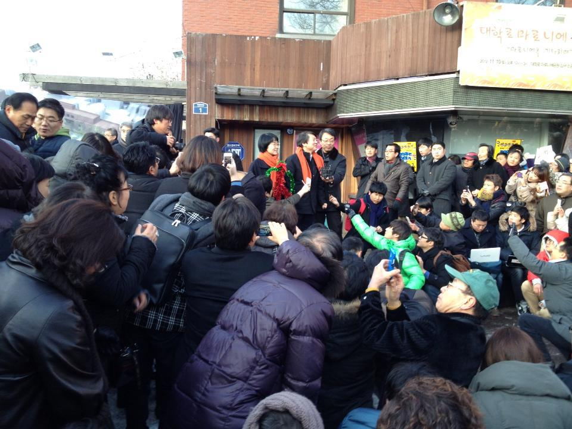
**이미지 캡션:** 추운 날씨에 많은 사람들이 야외에 모여 행사를 관람하고 있다. 행사 진행자로 보이는 남성 두 명은 마이크를 들고 이야기하고 있으며, 한 명은 주황색 목도리를 하고 있다. 주변에는 다양한 연령대의 사람들이 빼곡히 서서 이들을 바라보고 있으며, 휴대폰으로 사진을 찍는 사람들도 보인다. 배경에는 나무로 된 건물과 함께 '대학로 마로니에'라고 쓰인 현수막이 걸려 있어 이곳이 대학로 마로니에 공원임을 알 수 있다. 전반적으로 활기차고 흥겨운 분위기 속에서 행사가 진행되고 있다. Many people are holding up their phones to take pictures or record videos, suggesting a moment of interest or excitement. The crowd is densely packed, with individuals of varying ages and genders, all dressed in winter clothing, including coats and jackets, indicating a cool or cold weather. Some individuals in the front are wearing scarves, one in bright orange. The background shows a building with a sign that has Korean text, and a smaller sign with the number "1" on it. The overall mood seems to be engaged and participatory, with people actively documenting the event.
 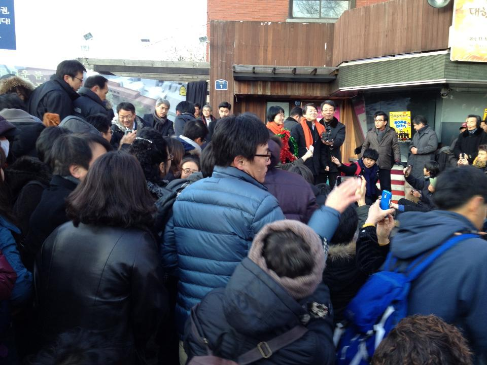
**이미지 캡션:** 이 사진은 많은 사람들이 모여 있는 야외 행사 장면을 담고 있으며, 여러 명의 성인 남성과 성인 여성, 그리고 한 명의 어린 남성이 보입니다. 행사에 참여한 사람들은 대부분 두꺼운 겨울 외투를 입고 있으며, 일부는 목도리를 착용하고 있습니다. 사람들의 표정은 다양하지만, 대체로 행사나 주변 상황에 집중하거나 흥미를 느끼는 듯한 모습입니다. 몇몇 사람들은 스마트폰을 들고 사진을 찍거나 동영상을 촬영하고 있으며, 이는 행사가 진행 중이거나 중요한 순간임을 시사합니다. 배경에는 나무로 된 건물 외벽과 간판, 그리고 건물 입구가 보입니다. 간판에는 한국어로 된 글자가 쓰여 있으며, "대금"이라는 단어가 일부 보입니다. 또한, 건물 입구에는 파란색과 흰색 줄무늬가 있는 기둥이 세워져 있습니다. 전반적으로 활기차고 북적이는 분위기이며, 사람들이 무언가를 보기 위해 모여 있는 것으로 보입니다. 건물 입구가 보입니다. 간판에는 한국어로 된 글자가 쓰여 있으며, "대금"이라는 단어가 일부 보입니다. 또한, 건물 입구에는 파란색과 흰색 줄무늬가 있는 기둥이 세워져 있습니다. 전반적으로 활기차고 북적이는 분위기이며, 사람들이 무언가를 보기 위해 모여 있는 것으로 보입니다.
 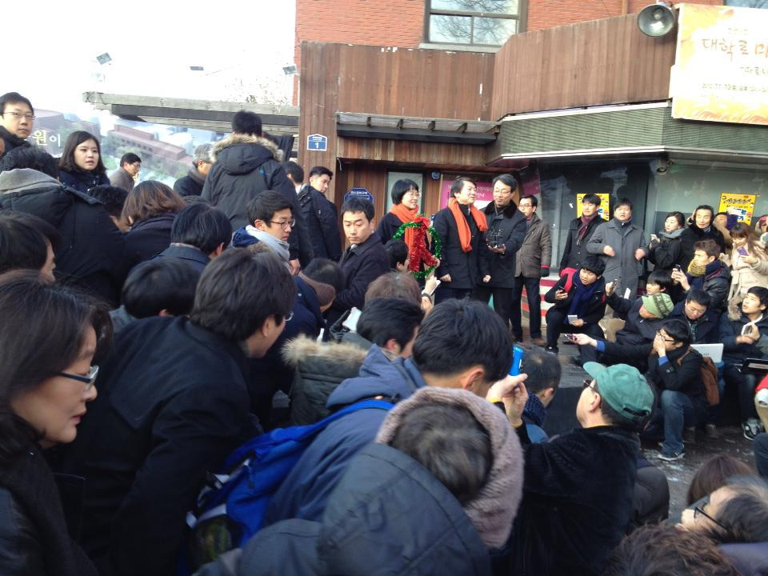
**이미지 캡션:** 이 사진은 야외에서 열린 행사나 모임의 모습을 담고 있으며, 많은 사람들이 모여 있는 가운데 몇몇 사람들이 무대처럼 보이는 곳에서 행사를 진행하고 있습니다. 사진 왼쪽에는 "원이"라는 한글이 쓰여진 간판이 보이고, 오른쪽 상단에는 노란색 바탕에 "대학로 미"라는 글자가 쓰여진 현수막이 걸려 있습니다. 행사에 참여한 사람들은 대부분 성인 남성과 여성으로, 다양한 연령대의 사람들이 보입니다. 복장은 겨울철임을 감안하여 두꺼운 외투를 입고 있는 사람들이 많으며, 목도리나 모자 등으로 보온에 신경 쓴 모습입니다. 몇몇 사람들은 스마트폰을 들고 사진을 찍거나 동영상을 촬영하고 있으며, 이는 행사에 대한 관심과 참여를 보여줍니다. 무대 위에는 붉은색과 녹색 장식이 달린 리본이 걸려 있고, 몇몇 남성들은 정장 차림에 오렌지색 목도리를 하고 있어 행사 관계자나 연설자로 보입니다. 전반적으로 활기차고 다소 북적이는 분위기이며, 사람들이 무대를 향해 집중하고 있는 모습에서 행사가 진행 중임을 알 수 있습니다. 배경에는 붉은 벽돌 건물과 나무로 된 구조물이 보이며, 겨울철의 흐린 날씨인 것으로 추정됩니다.몇 사람들은 스마트폰을 들고 사진을 찍거나 동영상을 촬영하고 있으며, 이는 행사에 대한 관심과 참여를 보여줍니다. 무대 위에는 붉은색과 녹색 장식이 달린 리본이 걸려 있고, 몇몇 남성들은 정장 차림에 오렌지색 목도리를 하고 있어 행사 관계자나 연설자로 보입니다. 전반적으로 활기차고 다소 북적이는 분위기이며, 사람들이 무대를 향해 집중하고 있는 모습에서 행사가 진행 중임을 알 수 있습니다. 배경에는 붉은 벽돌 건물과 나무로 된 구조물이 보이며, 겨울철의 흐린 날씨인 것으로 추정됩니다.

### 12월 9일 (일) 21:33 · wonderful garden!

wonderful garden!

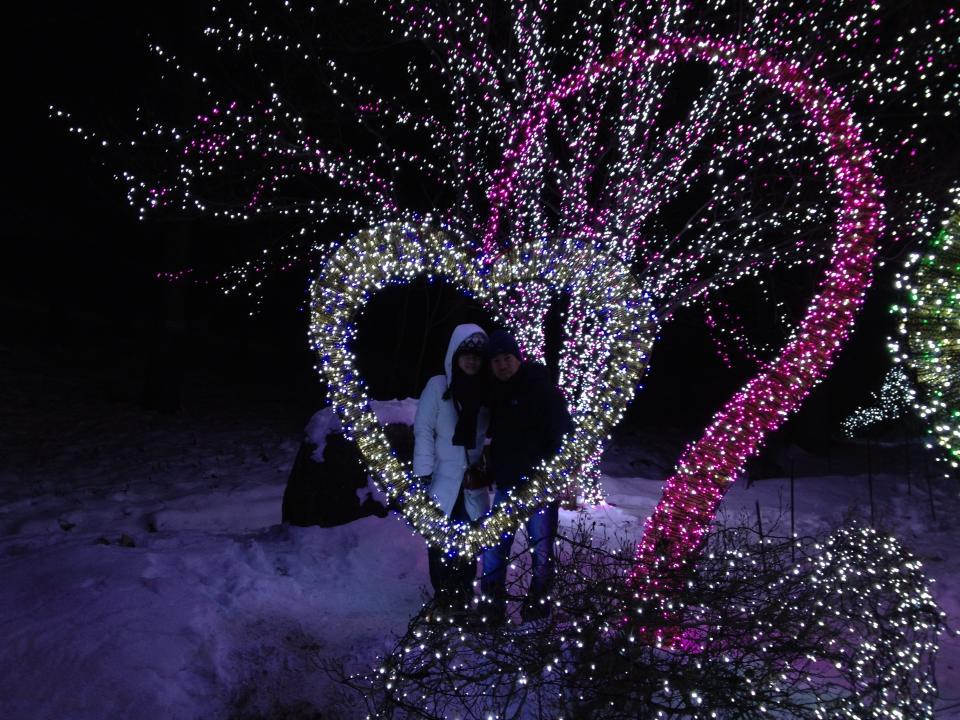
**이미지 캡션:** 어두운 밤, 눈이 쌓인 야외에서 두 사람이 하트 모양의 조명 장식 앞에서 포즈를 취하고 있다. 왼쪽에는 성인 남성이 검은색 패딩 점퍼와 파란색 청바지를 입고 파란색 모자를 쓰고 있으며, 오른쪽에는 성인 여성이 흰색 패딩 점퍼와 검은색 머플러를 하고 흰색 모자를 쓰고 있다. 두 사람 모두 카메라를 향해 미소를 짓고 있으며, 특히 여성은 눈을 동그랗게 뜨고 환하게 웃고 있다. 주변의 나무들은 수많은 흰색, 분홍색, 보라색 조명으로 뒤덮여 있어 마치 동화 속 풍경처럼 신비롭고 로맨틱한 분위기를 자아낸다. 하트 모양의 조명은 흰색과 파란색 조명으로 이루어져 있으며, 그 안으로 두 사람이 들어가 사진을 찍고 있다. 배경에는 어둠과 함께 희미하게 조명으로 장식된 다른 나무들이 보인다. 전반적으로 겨울밤의 로맨틱한 축제나 데이트 장면을 연상시키는 따뜻하고 행복한 분위기이다.의 조명은 흰색과 파란색 조명으로 이루어져 있으며, 그 안으로 두 사람이 들어가 사진을 찍고 있다. 배경에는 어둠과 함께 희미하게 조명으로 장식된 다른 나무들이 보인다. 전반적으로 겨울밤의 로맨틱한 축제나 데이트 장면을 연상시키는 따뜻하고 행복한 분위기이다.

### 12월 10일 (월) 09:11 · wonderful garden with lights in Korea!

wonderful garden with lights in Korea!

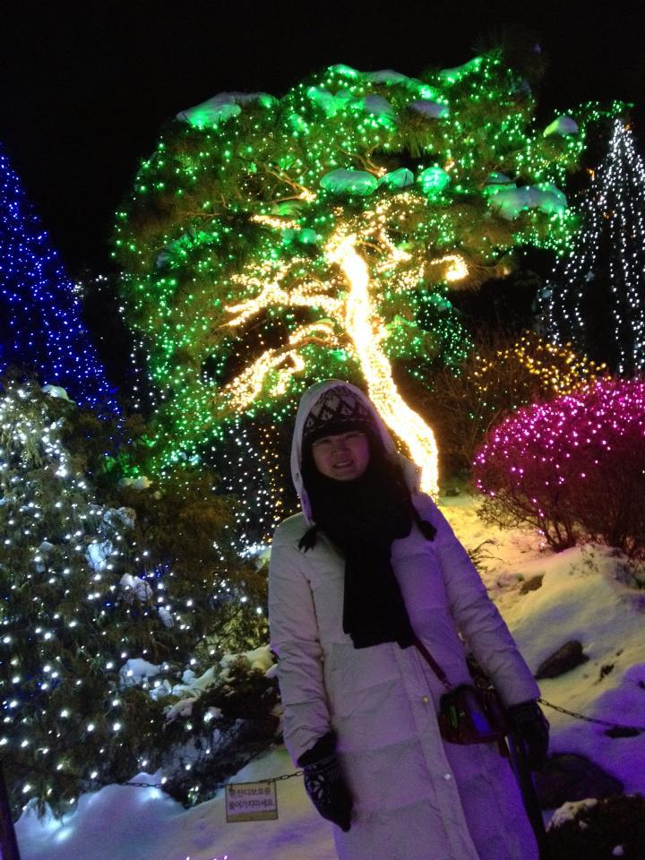
**이미지 캡션:** 한 성인 여성이 밤에 화려한 조명으로 장식된 야외 공간에서 사진을 찍고 있다. 여성은 흰색 패딩 코트, 검은색 목도리, 패턴이 있는 모자, 장갑을 착용하고 있으며, 얼굴에는 미소를 띠고 있다. 배경에는 다양한 색상의 조명으로 장식된 나무와 덤불이 보이며, 특히 중앙의 큰 나무는 녹색과 노란색 조명으로 화려하게 빛나고 있다. 주변에는 눈이 쌓여 있어 겨울임을 알 수 있다. 여성의 왼쪽 하단에는 "안전보호"라고 쓰인 한국어 표지판이 보인다. 전체적으로 축제 분위기나 연말연시의 따뜻하고 즐거운 느낌을 주는 사진이다..
 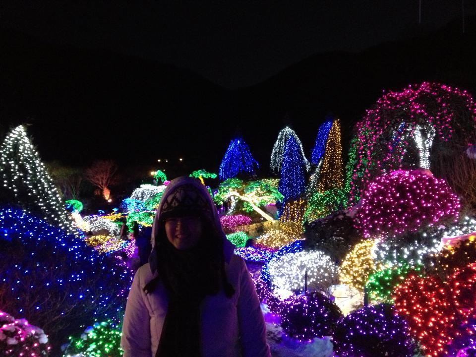
**이미지 캡션:** 어두운 밤, 형형색색의 조명으로 화려하게 장식된 정원에서 한 성인 여성이 카메라를 향해 미소 짓고 있다. 여성은 흰색 패딩 점퍼에 패턴이 있는 모자를 쓰고 검은색 목도리를 둘러 추운 날씨에 대비한 복장을 하고 있으며, 얼굴에는 따뜻하고 행복한 표정이 역력하다. 그녀의 뒤로는 다양한 크기와 모양의 나무들이 파란색, 흰색, 노란색, 분홍색, 빨간색 등 다채로운 색상의 조명으로 뒤덮여 마치 동화 속 풍경을 연상시킨다. 조명들은 마치 별처럼 반짝이며 밤하늘을 수놓고 있으며, 일부 나무에는 눈이 쌓여 있어 겨울밤의 낭만적인 분위기를 더한다. 배경에는 어두운 산 능선이 희미하게 보이며, 전체적으로 환상적이고 축제 같은 분위기를 자아낸다.만적인 분위기를 더한다. 배경에는 어두운 산 능선이 희미하게 보이며, 전체적으로 환상적이고 축제 같은 분위기를 자아낸다.
 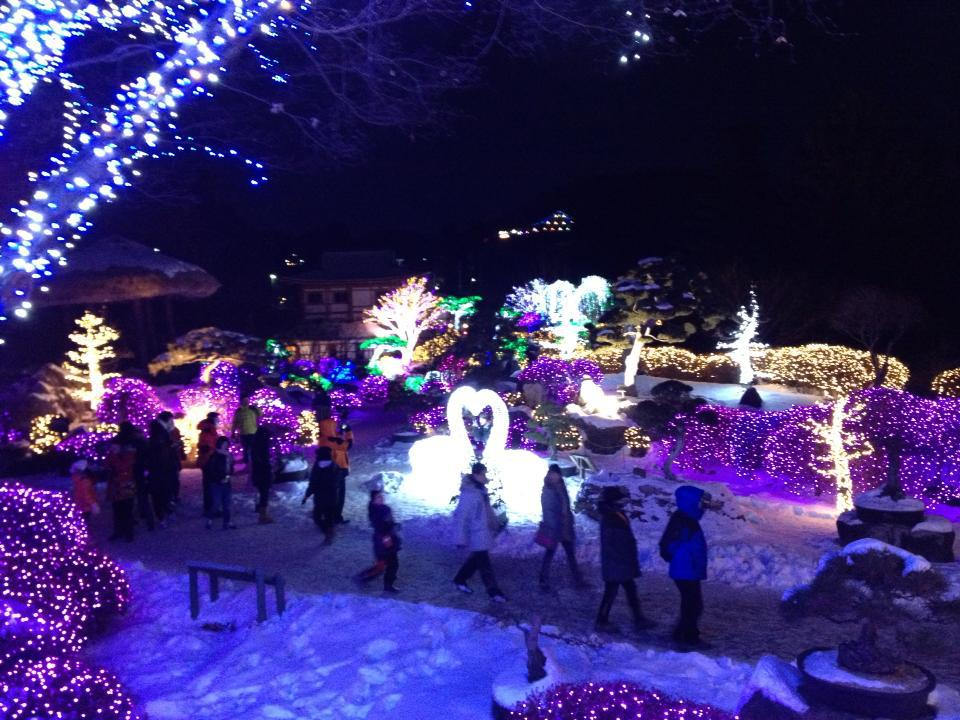
**이미지 캡션:** 밤에 눈 덮인 정원에서 사람들이 화려한 조명으로 장식된 풍경을 감상하고 있다. 사진 왼쪽 상단에는 파란색 조명이 나무에 촘촘하게 달려 있어 마치 별이 쏟아지는 듯한 느낌을 준다. 중앙에는 흰색 백조 모양의 조형물이 빛나고 있으며, 주변의 나무와 덤불은 보라색과 노란색 조명으로 뒤덮여 환상적인 분위기를 연출한다. 여러 명의 사람들이 각자 두꺼운 겨울옷을 입고 조명으로 꾸며진 정원을 거닐며 사진을 찍거나 감상하는 모습이 보인다. 일부 아이들은 눈 위에서 뛰어놀고 있으며, 전반적으로 따뜻하고 즐거운 축제 분위기를 느낄 수 있다. 배경에는 전통적인 한국식 건물이 희미하게 보이며, 어두운 밤하늘과 대비되어 조명들이 더욱 돋보인다.느낄 수 있다. 배경에는 전통적인 한국식 건물이 희미하게 보이며, 어두운 밤하늘과 대비되어 조명들이 더욱 돋보인다.
 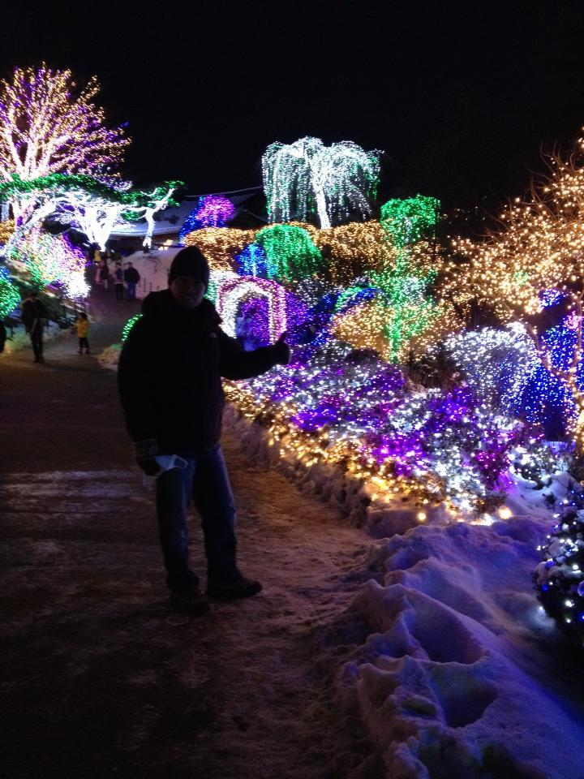
**이미지 캡션:** 어두운 밤, 화려한 조명으로 장식된 야외 정원에서 한 성인 남성이 카메라를 향해 엄지손가락을 치켜들고 있다. 남성은 검은색 비니와 어두운 색상의 두꺼운 외투를 입고 있으며, 청바지와 어두운 색상의 신발을 신고 있다. 그의 표정은 사진상으로는 명확하게 보이지 않지만, 전반적으로 즐거운 분위기이다. 배경에는 다양한 색상의 조명으로 뒤덮인 나무와 덤불들이 펼쳐져 있으며, 특히 보라색, 흰색, 녹색, 주황색 조명이 눈에 띈다. 조명은 마치 동화 속 풍경처럼 환상적인 분위기를 자아낸다. 땅에는 눈이 쌓여 있으며, 일부는 얼어붙은 듯한 모습도 보인다. 정원에는 다른 사람들도 보이지만, 대부분 실루엣으로만 인식된다. 전체적으로 겨울 밤의 아름다운 조명 축제를 즐기는 듯한 따뜻하고 신비로운 분위기이다.는 얼어붙은 듯한 모습도 보인다. 정원에는 다른 사람들도 보이지만, 대부분 실루엣으로만 인식된다. 전체적으로 겨울 밤의 아름다운 조명 축제를 즐기는 듯한 따뜻하고 신비로운 분위기이다.
 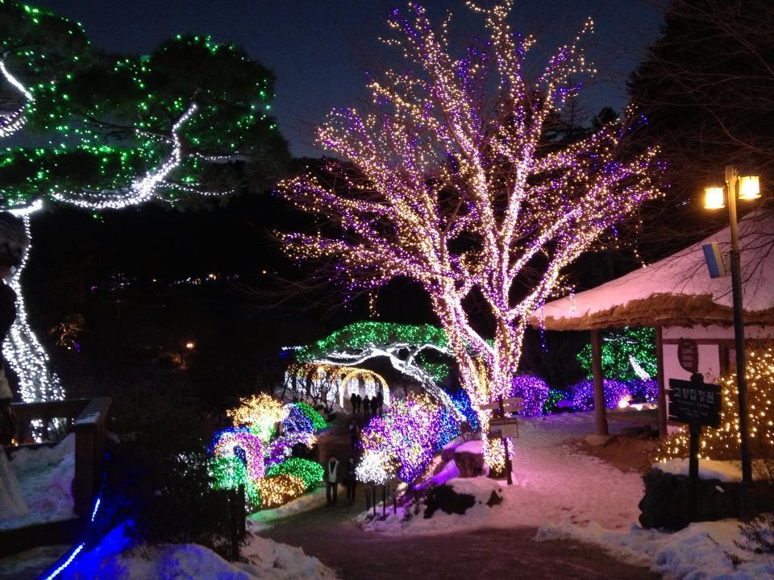
**이미지 캡션:** 어두운 밤, 눈이 쌓인 야외 공원에서 형형색색의 조명으로 장식된 나무들과 건물이 보인다. 왼쪽에는 하얀색과 초록색 조명이 나무를 감싸고 있고, 중앙에는 보라색과 노란색 조명이 나무를 화려하게 장식하고 있다. 오른쪽에는 초가 지붕을 얹은 작은 건물이 보이며, 건물 주변에도 조명이 설치되어 있다. 건물 앞에는 한국어로 된 간판이 서 있다. 몇몇 사람들이 조명으로 꾸며진 길을 따라 걷고 있으며, 전체적으로 따뜻하고 축제 분위기를 자아낸다.
 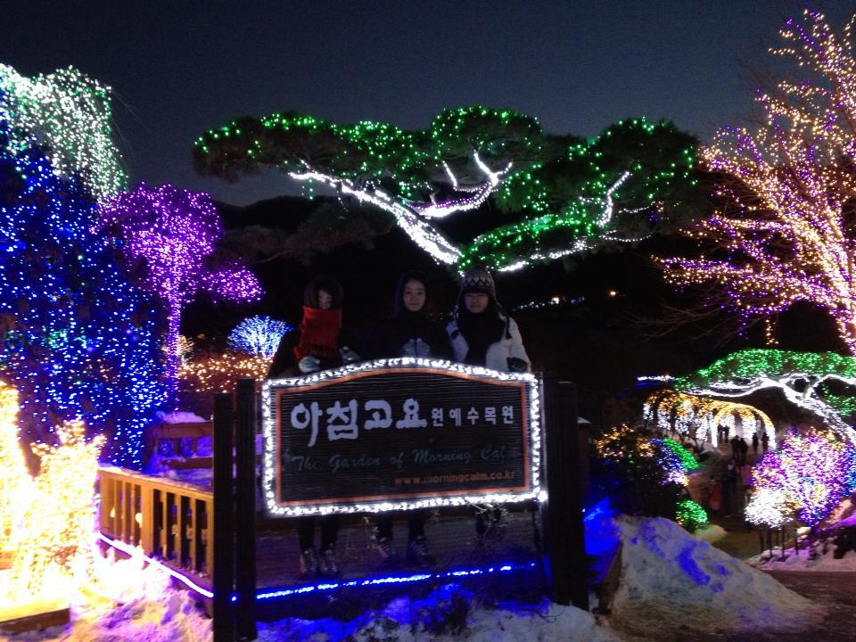
**이미지 캡션:** 밤에 조명으로 장식된 아침고요 수목원에서 세 명의 젊은 여성들이 사진을 찍고 있다. 왼쪽에서부터 첫 번째 여성은 빨간색 목도리를 하고 있으며, 가운데 여성은 검은색 옷을 입고 있고, 오른쪽 여성은 흰색 외투와 모자를 쓰고 있다. 세 명 모두 젊은 여성으로 보이며, 카메라를 향해 미소를 짓고 있다. 배경에는 나무들이 형형색색의 조명으로 뒤덮여 있으며, 특히 보라색, 녹색, 흰색 조명이 눈에 띈다. 땅에는 눈이 쌓여 있으며, 조명으로 인해 푸른빛이 감돈다. 사진 앞쪽에는 "아침고요 원예 수목원 The Garden of Morning Calm www.morningcalm.co.kr"이라고 적힌 간판이 보인다. 전반적으로 화려하고 따뜻한 분위기의 겨울 야경을 담고 있다. of Morning Calm www.morningcalm.co.kr"이라고 적힌 간판이 보인다. 전반적으로 화려하고 따뜻한 분위기의 겨울 야경을 담고 있다.
 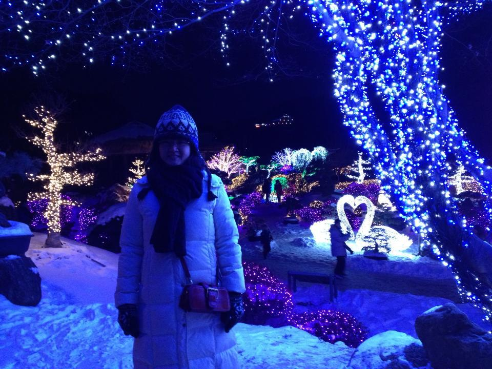
**이미지 캡션:** 한 젊은 여성이 밤에 야외 조명 축제에서 포즈를 취하고 있다. 그녀는 흰색 패딩 코트, 파란색과 흰색 패턴의 비니 모자, 검은색 스카프, 장갑을 착용하고 있으며, 빨간색 크로스백을 메고 있다. 그녀는 약간 미소를 짓고 있으며, 배경에는 푸른색과 흰색 조명으로 장식된 나무와 눈 덮인 풍경이 펼쳐져 있다. 멀리 하트 모양을 이루고 있는 백조 조명도 보인다. 전반적으로 겨울밤의 로맨틱하고 환상적인 분위기를 자아낸다.
 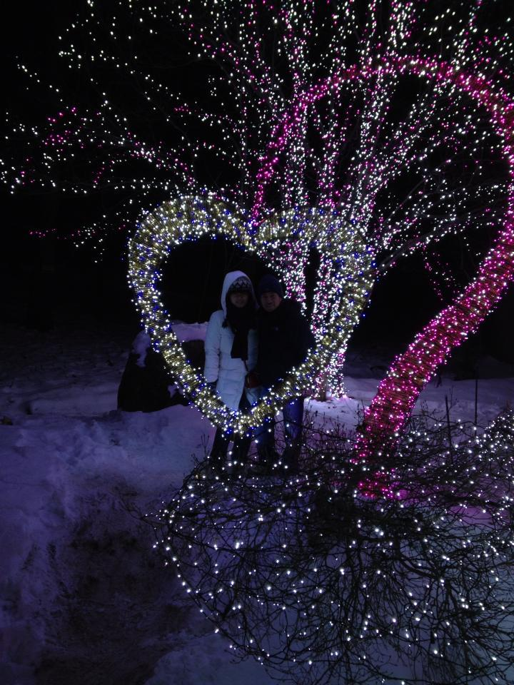
**이미지 캡션:** 어두운 밤, 눈 쌓인 야외에서 두 사람이 하트 모양의 조명 장식 앞에서 사진을 찍고 있다. 왼쪽의 여성은 흰색 패딩 점퍼와 후드, 모자를 착용하고 있으며, 오른쪽의 남성은 어두운 색상의 외투와 모자를 쓰고 있다. 두 사람 모두 추운 날씨에 대비한 따뜻한 복장을 하고 있으며, 얼굴에는 미소를 띠고 있어 즐거운 분위기를 나타낸다. 배경에는 나무 가지에 수많은 흰색, 분홍색, 보라색 조명이 반짝이며 마치 별이 쏟아지는 듯한 환상적인 풍경을 연출하고 있다. 특히 나무 줄기와 하트 모양 장식에 둘러싸인 모습이 로맨틱한 분위기를 더한다. 땅에는 눈이 쌓여 있고, 조명 빛이 눈에 반사되어 보라색 빛을 띠고 있어 겨울 축제나 특별한 이벤트 장소임을 짐작하게 한다. 분위기를 더한다. 땅에는 눈이 쌓여 있고, 조명 빛이 눈에 반사되어 보라색 빛을 띠고 있어 겨울 축제나 특별한 이벤트 장소임을 짐작하게 한다.

### 12월 10일 (월) 12:58 · Hot spring - Termeden. Feel so good!

Hot spring - Termeden. Feel so good!

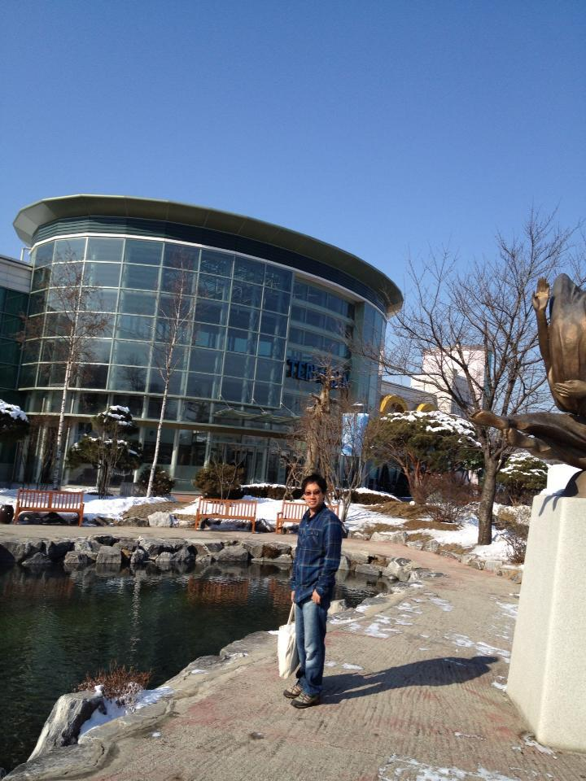
**이미지 캡션:** 한 명의 성인 남성이 푸른색 체크무늬 셔츠와 청바지를 입고 서 있으며, 그의 오른쪽에는 하얀색 토트백이 들려 있고, 그는 카메라를 향해 미소를 짓고 있습니다. 남성은 현대적인 유리 건물 앞에 서 있으며, 건물 앞에는 연못과 몇 개의 벤치가 있습니다. 주변에는 눈이 쌓여 있고, 나무들은 앙상한 가지를 드러내고 있어 겨울 풍경을 연출합니다. 건물에는 "TERRA"라는 글자가 희미하게 보입니다. 전체적으로 맑고 푸른 하늘 아래 겨울 햇살이 비추는 평화로운 야외 풍경입니다.
 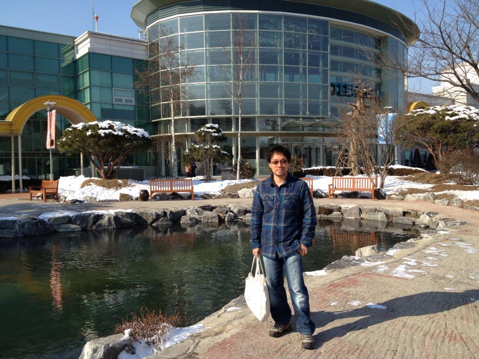
**이미지 캡션:** 한 성인 남성이 파란색 체크무늬 셔츠와 청바지를 입고 하얀색 천 가방을 들고 연못 옆에 서 있다. 남성은 30대 초중반으로 보이며, 안경을 쓰고 있으며, 약간 미소를 짓고 있다. 배경에는 눈이 쌓인 나무와 벤치가 있는 현대적인 유리 건물과 연못이 보인다. 건물에는 "TELLUS"라는 글자가 쓰여 있다. 전체적으로 겨울날의 차분하고 평화로운 분위기이다.
 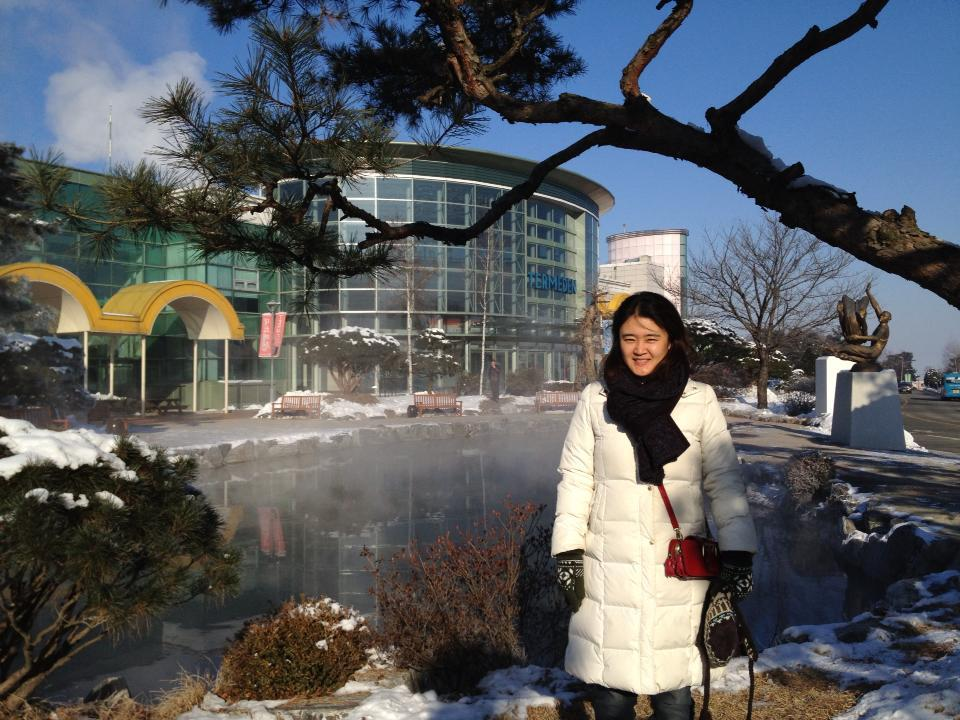
**이미지 캡션:** 한 명의 성인 여성이 하얀색 패딩 코트와 검은색 목도리를 착용하고 카메라를 향해 미소 짓고 있다. 그녀는 검은색 바지와 무늬가 있는 장갑을 끼고 있으며, 빨간색 크로스백을 메고 있다. 배경에는 눈이 쌓인 연못과 함께 현대적인 건물, 조각상, 그리고 나무들이 보인다. 건물에는 "FERMEDIC"이라는 글자가 희미하게 보이며, 건물 앞에는 노란색 지붕의 아치형 입구가 있다. 연못에서는 김이 피어오르고 있으며, 주변에는 눈이 덮인 벤치와 나무들이 보인다. 하늘은 맑고 푸르며, 나뭇가지가 사진의 상단을 가로지르고 있다. 전반적으로 겨울날의 야외 풍경이며, 따뜻한 옷차림과 밝은 표정으로 보아 즐거운 분위기이다.다. 전반적으로 겨울날의 야외 풍경이며, 따뜻한 옷차림과 밝은 표정으로 보아 즐거운 분위기이다.
 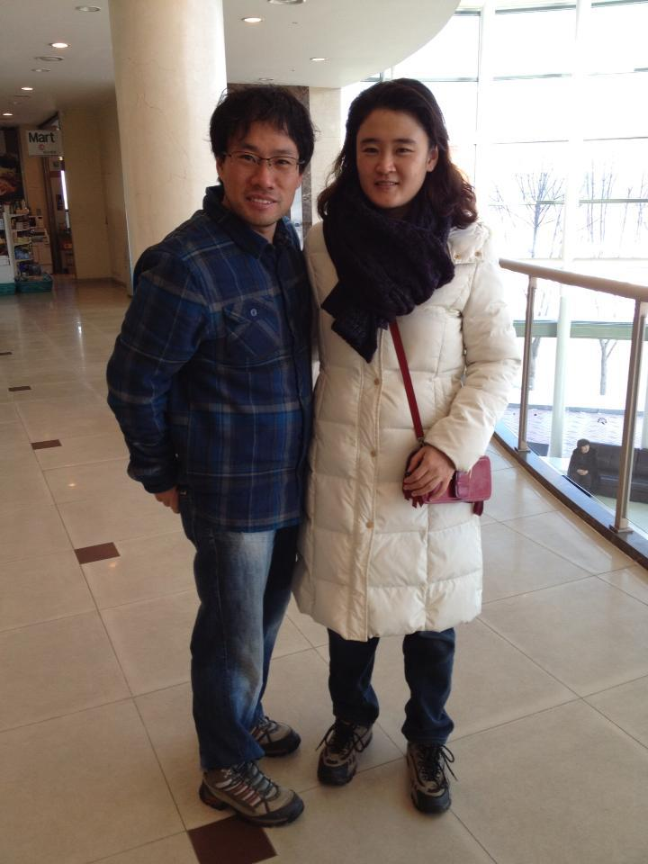
**이미지 캡션:** 사진에는 성인 남성과 성인 여성이 나란히 서서 카메라를 바라보고 있다. 남성은 30대 후반에서 40대 초반으로 추정되며, 검은색 안경을 쓰고 있으며 푸른색과 검은색 체크무늬 셔츠에 청바지를 입고 있다. 여성은 20대 후반에서 30대 초반으로 추정되며, 검은색 목도리를 하고 하얀색 패딩 코트에 청바지를 입고 있다. 여성은 붉은색 크로스백을 메고 있다. 두 사람 모두 편안한 운동화를 신고 있다. 배경에는 밝은 조명이 비추는 실내 공간이 보인다. 왼쪽에는 "Mart"라고 쓰인 간판이 있는 상점의 일부가 보이고, 오른쪽에는 큰 창문이 있어 바깥 풍경이 희미하게 보인다. 바닥은 베이지색 타일로 되어 있으며, 일부 타일에는 짙은 갈색 사각형 무늬가 있다. 전체적으로 따뜻하고 편안한 분위기이며, 두 사람이 함께 시간을 보내고 있는 듯한 모습이다.른쪽에는 큰 창문이 있어 바깥 풍경이 희미하게 보인다. 바닥은 베이지색 타일로 되어 있으며, 일부 타일에는 짙은 갈색 사각형 무늬가 있다. 전체적으로 따뜻하고 편안한 분위기이며, 두 사람이 함께 시간을 보내고 있는 듯한 모습이다.
 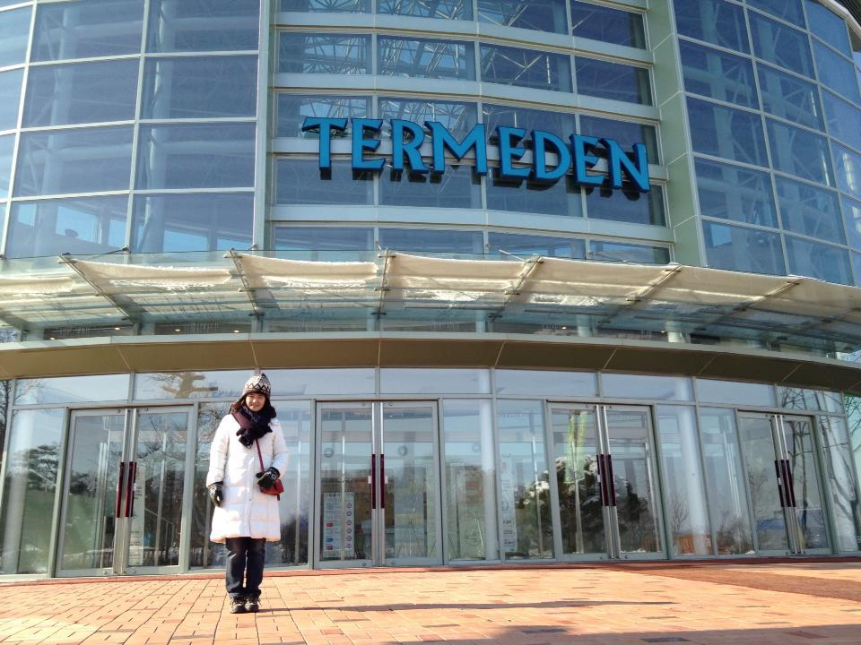
**이미지 캡션:** 한 명의 성인 여성이 흰색 패딩 코트, 검은색 바지, 갈색 니트 모자, 검은색 목도리, 검은색 장갑을 착용하고 서 있습니다. 그녀는 오른손에 빨간색 크로스백을 들고 있으며, 얼굴에는 희미한 미소를 띠고 있습니다. 그녀는 현대적인 유리 건물 앞에 서 있는데, 건물 외벽에는 파란색 글자로 "TERMEDEN"이라고 쓰여 있습니다. 건물은 여러 층으로 이루어져 있으며, 유리창이 많아 내부가 비쳐 보입니다. 건물 앞에는 투명한 지붕이 설치되어 있고, 바닥은 붉은색 벽돌로 포장되어 있습니다. 주변에는 나무들이 보이지만 잎이 없는 것으로 보아 겨울이나 이른 봄으로 추정됩니다. 전체적으로 맑은 날씨에 야외에서 촬영된 사진으로, 밝고 깨끗한 분위기입니다.잎이 없는 것으로 보아 겨울이나 이른 봄으로 추정됩니다. 전체적으로 맑은 날씨에 야외에서 촬영된 사진으로, 밝고 깨끗한 분위기입니다.
 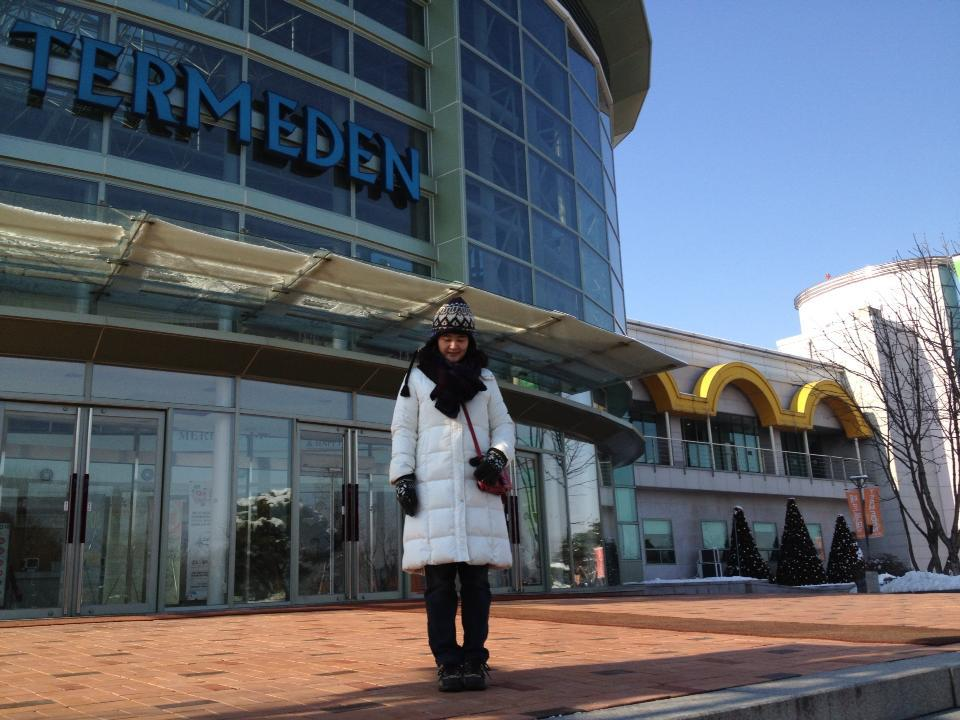
**이미지 캡션:** 푸른 하늘 아래, 한 성인 여성이 흰색 패딩 코트와 검은색 바지, 검은색 목도리, 그리고 패턴이 있는 모자를 착용하고 서 있습니다. 그녀는 검은색 장갑을 끼고 있으며, 어깨에는 빨간색 크로스백을 메고 있습니다. 그녀의 표정은 약간 미소를 띠고 있으며, 카메라를 응시하고 있습니다. 배경에는 'TERMEDEN'이라는 파란색 글자가 쓰여진 현대적인 유리 건물과 그 옆으로 노란색 아치형 장식이 있는 건물, 그리고 겨울 풍경을 보여주는 나무와 눈이 쌓인 장식용 트리들이 보입니다. 건물 앞에는 붉은색 벽돌로 포장된 넓은 광장이 펼쳐져 있으며, 햇살이 비추고 있어 맑고 추운 겨울날임을 짐작할 수 있습니다. 광장이 펼쳐져 있으며, 햇살이 비추고 있어 맑고 추운 겨울날임을 짐작할 수 있습니다.
 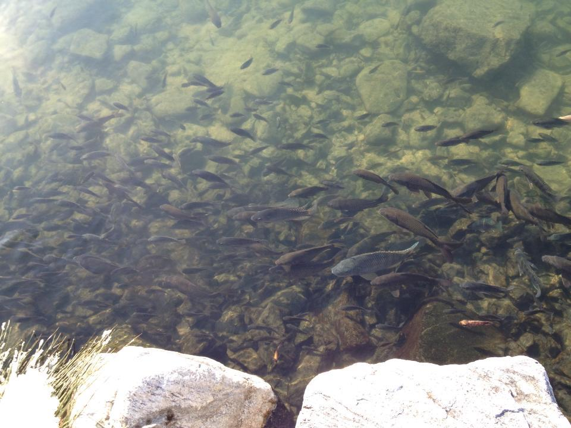
**이미지 캡션:** 맑고 투명한 물속에 수많은 물고기들이 무리지어 헤엄치고 있는 모습이 보인다. 물고기들은 다양한 크기와 종류로 보이며, 대부분 어두운 색을 띠고 있다. 물속 바닥은 돌과 자갈로 이루어져 있으며, 햇빛이 비쳐 물속이 밝게 빛나고 있다. 사진의 왼쪽 하단에는 흰색 바위와 마른 풀이 보인다. 전체적으로 평화롭고 자연적인 분위기를 자아낸다.

### 12월 18일 (화) 19:34 · Check out the Youtube logo: It's PSY sty…

Check out the Youtube logo: It's PSY style!!

**이미지 캡션:** 이 이미지는 유튜브 로고와 함께 춤추는 듯한 작은 캐릭터가 그려져 있습니다. 로고는 "You Tube"라는 글자로 구성되어 있으며, "You"는 검은색으로, "Tube"는 파란색과 녹색이 섞인 배경에 흰색으로 쓰여 있습니다. "Tube" 부분은 둥근 모서리를 가진 직사각형 형태로 표현되었습니다. 로고 오른편에는 선글라스를 끼고 턱시도를 입은 듯한 작은 남성 캐릭터가 한쪽 팔을 위로 들고 춤을 추는 듯한 역동적인 포즈를 취하고 있습니다. 배경은 연한 회색으로, 특별한 장소나 사물은 보이지 않습니다. 전체적으로 밝고 경쾌한 분위기를 나타냅니다.밝고 경쾌한 분위기를 나타냅니다.

### 12월 22일 (토) 10:50 · on his way to Istanbul with Yeon Gyoung …

on his way to Istanbul with Yeon Gyoung Gwack

### 12월 24일 (월) 01:06 · enjoyed Istanbul Fish (mackerel) Sandwic…

enjoyed Istanbul Fish (mackerel) Sandwiche!

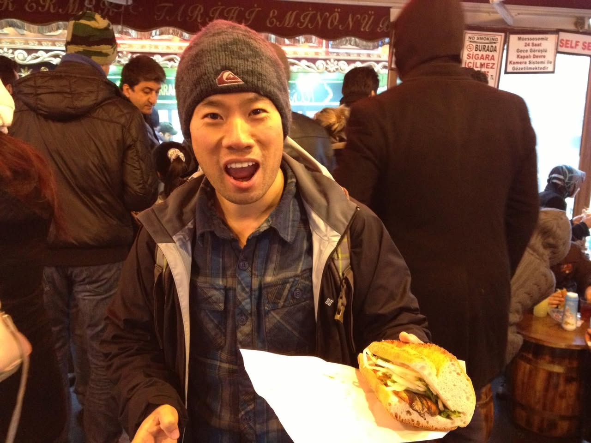
**이미지 캡션:** 한 아시아계 성인 남성이 회색 비니를 쓰고 파란색 체크무늬 셔츠와 검은색 재킷을 입고 있으며, 입을 벌리고 카메라를 향해 샌드위치를 들고 있다. 그의 뒤에는 여러 사람이 있으며, 일부는 두꺼운 겨울옷을 입고 있다. 배경에는 터키어로 된 간판들이 보이며, "NO SMOKING"이라는 문구도 있다. 장소는 실내이며, 아마도 음식점이나 시장의 일부로 보이며, 나무통 모양의 테이블과 사람들이 앉아 있는 모습이 보인다. 전반적으로 활기차고 캐주얼한 분위기이다.

### 12월 24일 (월) 01:14 · Can you guess what's on the big (flower-…

Can you guess what's on the big (flower-looking) plate?

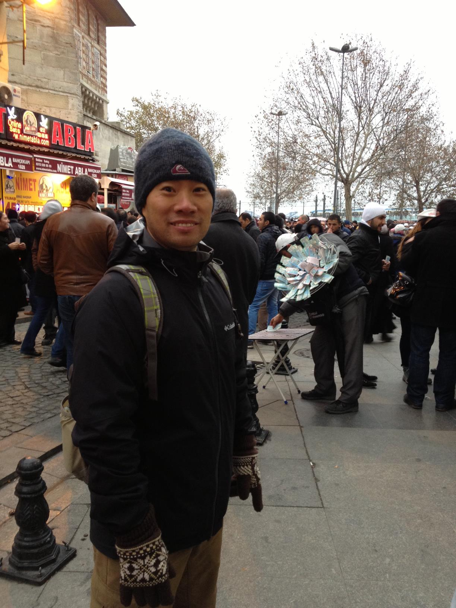
**이미지 캡션:** 한 명의 성인 남성이 카메라를 향해 미소를 지으며 서 있고, 그는 검은색 재킷, 회색 비니, 그리고 눈꽃 무늬가 있는 갈색 장갑을 끼고 있습니다. 그의 뒤로는 사람들이 붐비는 거리 풍경이 펼쳐져 있으며, 건물에는 터키어로 된 간판들이 보입니다. 한쪽에는 여러 장의 지폐를 부채처럼 펼쳐 들고 있는 사람도 보입니다. 전반적으로 쌀쌀한 날씨에 야외에서 사람들이 모여 있는 모습으로, 약간은 분주하고 활기찬 분위기입니다.

### 12월 25일 (화) 00:51 · misses Korean food!

misses Korean food!

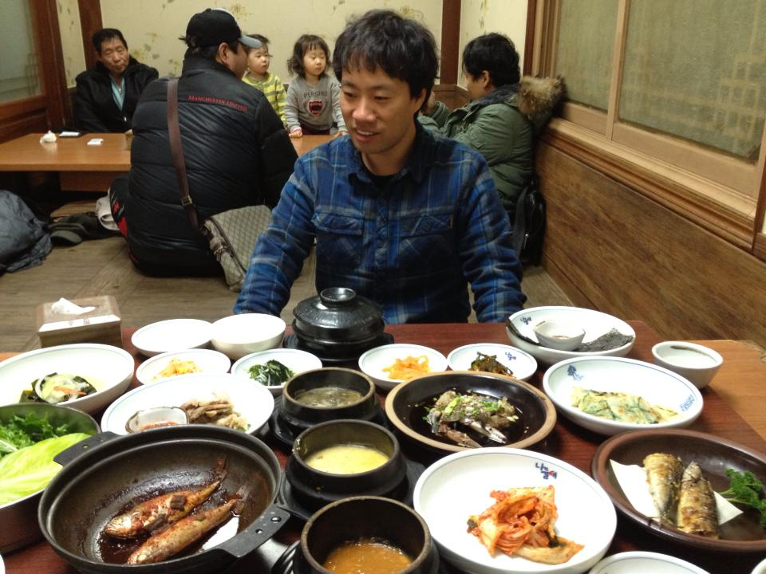
**이미지 캡션:** 이 사진은 한국의 한 식당에서 식사하는 사람들의 모습을 담고 있습니다. 사진 중앙에는 푸른색 체크무늬 셔츠를 입은 젊은 남성이 앉아 있으며, 그의 앞에는 다양한 한국 음식이 놓여 있습니다. 남성은 카메라를 바라보며 미소를 짓고 있습니다. 그의 뒤쪽으로는 검은색 패딩 점퍼를 입은 남성과 두 명의 어린 아이들이 보입니다. 아이들은 노란색과 분홍색 옷을 입고 있으며, 앞쪽의 아이는 카메라를 바라보고 있습니다. 식탁 위에는 밥그릇, 국그릇, 김치, 생선 요리, 전 등 여러 가지 반찬이 정갈하게 차려져 있습니다. 식당 내부는 나무로 된 벽과 창문으로 꾸며져 있으며, 따뜻하고 정겨운 분위기를 자아냅니다.ow wooden table, which is covered with various dishes. To his left, a large black pot contains two grilled fish, and other bowls hold kimchi, soup, and other side dishes. Behind him, a man in a black puffer jacket with a baseball cap on backwards is seated, facing away from the camera. Further back, two young children, a boy and a girl, are also seated at the table, looking towards the front. Another adult male is visible in the background, seated at a separate table. The restaurant has wooden walls and floors, and a window with a frosted glass pane is visible in the background. The atmosphere is casual and convivial, suggesting a family or friends gathering for a meal.

### 12월 25일 (화) 16:13 · Our amazing hotel

📍 Kapadokya

Our amazing hotel

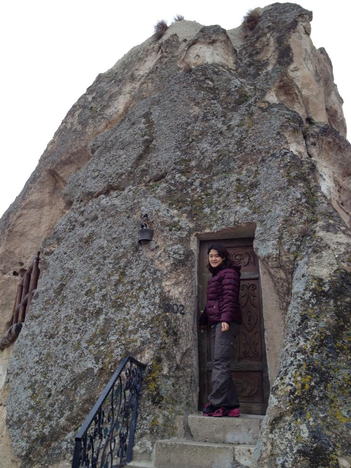
**이미지 캡션:** 한 명의 성인 여성이 바위 절벽에 뚫린 문 앞에 서 있다. 여성은 20대 후반에서 30대 초반으로 보이며, 짙은 보라색 패딩 점퍼와 회색 카고 바지, 분홍색 운동화를 신고 있다. 그녀는 문을 살짝 열고 카메라를 향해 미소를 짓고 있다. 배경은 거대한 바위 절벽으로, 표면에는 이끼와 식물이 자라 있다. 절벽에는 낡은 나무 문과 함께 '02'라는 숫자가 새겨져 있고, 문 옆에는 철제 난간이 있는 계단이 보인다. 전체적으로 독특하고 이국적인 풍경을 담고 있으며, 여행 중인 듯한 분위기를 풍긴다.

### 12월 25일 (화) 23:54 · Greetings from Love Valley, Cappadocia, …

Greetings from Love Valley, Cappadocia, Turkey! Merry Christmas and Happy New Year to all Facebook Friends!!

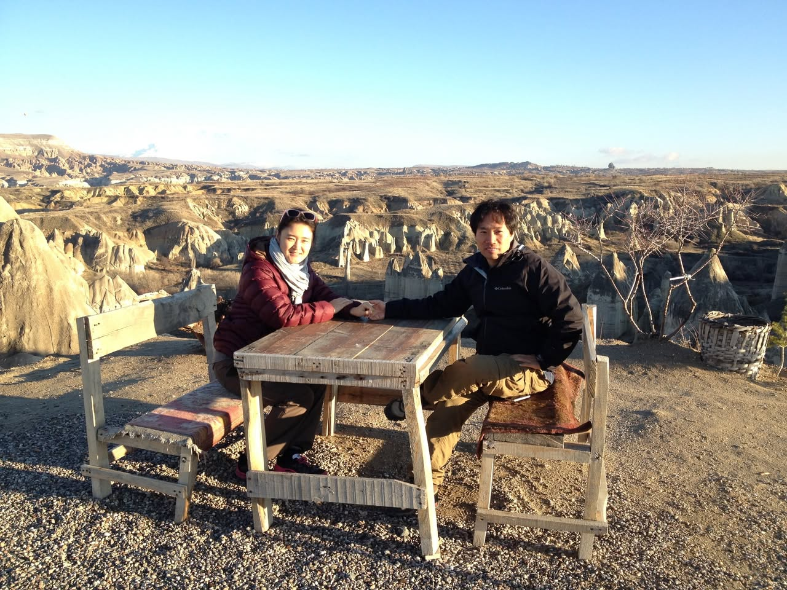
**이미지 캡션:** 화창한 날씨에 푸른 하늘 아래, 한 쌍의 성인 남녀가 독특한 지형으로 유명한 카파도키아의 절벽 위에서 테이블에 앉아 있다. 여성은 30대 초중반으로 보이며, 붉은색 패딩 점퍼에 회색 목도리를 하고 있으며, 선글라스를 머리에 얹고 환하게 웃고 있다. 남성은 30대 초중반으로 보이며, 검은색 바람막이 점퍼에 카키색 바지를 입고 있으며, 테이블에 팔을 걸치고 카메라를 응시하고 있다. 두 사람은 손을 잡고 있으며, 마치 연인처럼 다정한 분위기를 자아낸다. 테이블은 나무로 만들어졌으며, 의자는 낡은 나무로 만들어져 독특한 분위기를 더한다. 배경에는 기암괴석으로 이루어진 카파도키아의 독특한 지형이 펼쳐져 있으며, 멀리 보이는 산과 하늘이 조화를 이루어 아름다운 풍경을 연출한다. 전반적으로 따뜻하고 평화로운 분위기의 사진이다.특한 분위기를 더한다. 배경에는 기암괴석으로 이루어진 카파도키아의 독특한 지형이 펼쳐져 있으며, 멀리 보이는 산과 하늘이 조화를 이루어 아름다운 풍경을 연출한다. 전반적으로 따뜻하고 평화로운 분위기의 사진이다.

### 12월 26일 (수) 23:06 · 📷 앨범: Cappadocia Balloon Flights (10장)

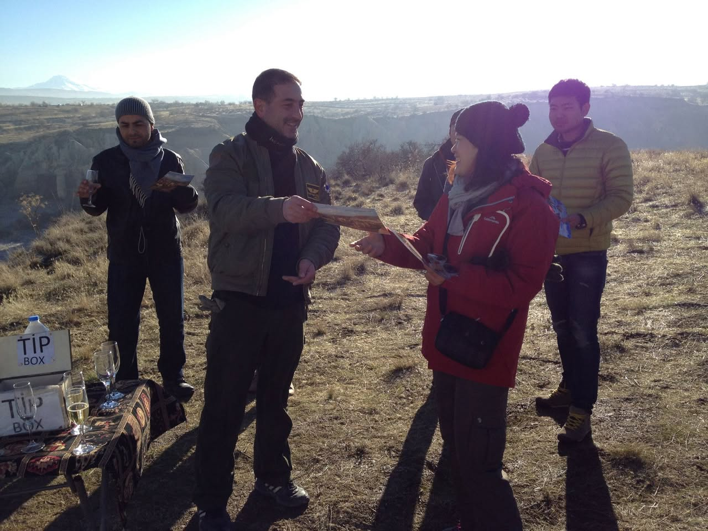
**이미지 캡션:** 네 명의 사람이 야외에서 서 있는 모습으로, 한 명의 성인 남성이 와인잔을 들고 있고 다른 성인 남성이 무언가를 건네주고 있습니다. 그 뒤로 한 명의 성인 여성과 또 다른 성인 남성이 서 있습니다. 배경에는 험준한 지형과 멀리 눈 덮인 산이 보입니다. 테이블 위에는 'TIP BOX'라고 적힌 상자 두 개와 샴페인잔 세 개가 놓여 있습니다. 전체적으로 햇볕이 잘 드는 맑은 날씨이며, 사람들이 무언가를 주고받는 듯한 모습에서 약간의 긴장감과 기대감이 느껴집니다.
 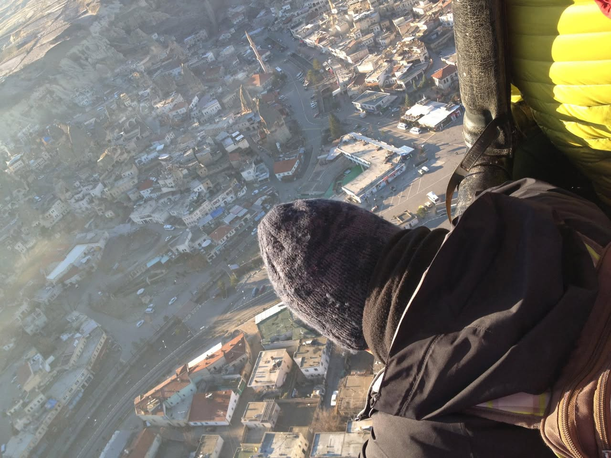
**이미지 캡션:** 이 사진은 열기구 바구니 안에서 촬영된 것으로, 성인 남성 한 명이 회색 니트 모자와 검은색 점퍼를 입고 앉아 있는 모습이 보인다. 남성은 바구니의 가장자리에 걸터앉아 아래를 내려다보고 있으며, 그의 얼굴 표정은 보이지 않는다. 배경으로는 터키 카파도키아의 독특한 지형과 마을 풍경이 펼쳐져 있다. 뾰족한 바위 봉우리와 낮은 건물들이 빽빽하게 들어서 있으며, 일부 건물들은 동굴 주택처럼 보인다. 도로에는 몇 대의 차량이 보이고, 멀리 희미하게 모스크의 첨탑도 보인다. 햇살이 비추고 있지만, 약간의 안개가 낀 듯한 뿌연 느낌도 있어 몽환적인 분위기를 자아낸다. 열기구의 노란색 풍선 일부와 검은색 바구니의 밧줄, 그리고 남성의 옷가지가 사진의 일부를 차지하고 있다. 전반적으로 평화롭고 이국적인 풍경을 담고 있으며, 높은 곳에서 세상을 내려다보는 듯한 시원함과 경이로움을 느끼게 한다.한 뿌연 느낌도 있어 몽환적인 분위기를 자아낸다. 열기구의 노란색 풍선 일부와 검은색 바구니의 밧줄, 그리고 남성의 옷가지가 사진의 일부를 차지하고 있다. 전반적으로 평화롭고 이국적인 풍경을 담고 있으며, 높은 곳에서 세상을 내려다보는 듯한 시원함과 경이로움을 느끼게 한다.
 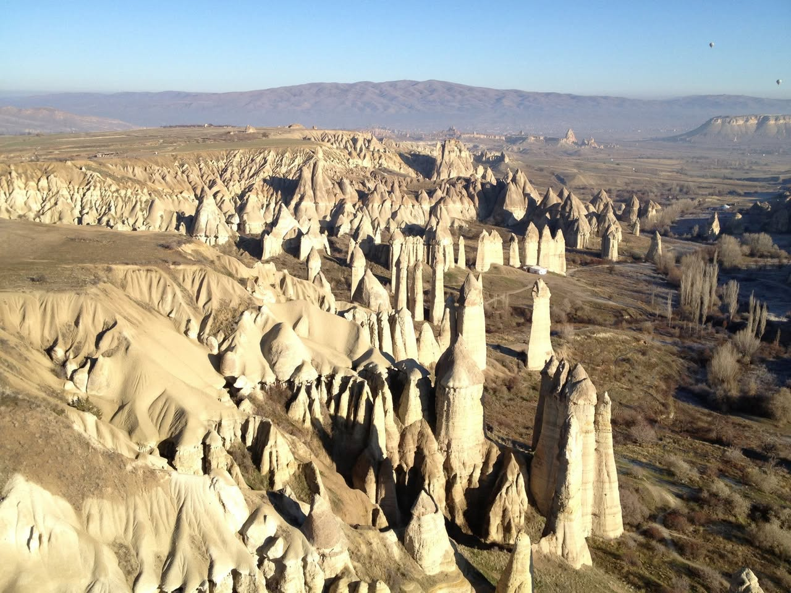
**이미지 캡션:** 이 사진은 터키 카파도키아의 독특한 지형을 보여주는 광활한 풍경 사진으로, 수많은 기암괴석들이 마치 버섯이나 거대한 돌기둥처럼 솟아 있습니다. 사진 속에는 사람이 보이지 않으며, 장소는 햇볕이 비추는 낮 시간대의 카파도키아의 황량하고 광활한 계곡입니다. 배경에는 산들이 멀리 보이고, 하늘에는 두 개의 열기구가 떠 있어 이 지역의 유명한 관광 활동을 암시합니다. 지형은 주로 황갈색의 부드러운 암석으로 이루어져 있으며, 곳곳에 마른 풀과 나무들이 드문드문 보입니다. 텍스트는 보이지 않으며, 전체적인 분위기는 고요하고 신비로우며 웅장한 자연의 경이로움을 느끼게 합니다.하고 신비로우며 웅장한 자연의 경이로움을 느끼게 합니다.
 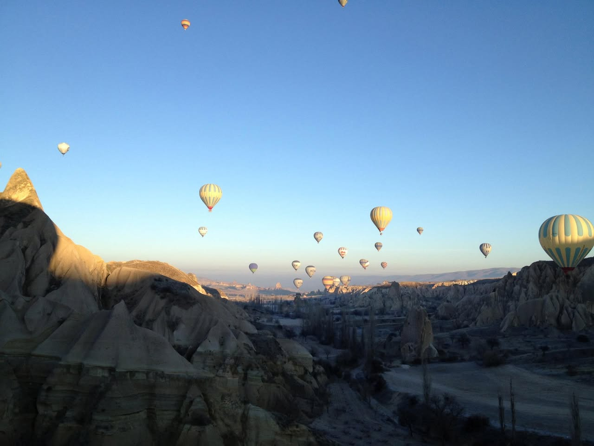
**이미지 캡션:** 맑고 푸른 하늘 아래, 수십 개의 열기구가 떠 있는 풍경으로, 웅장한 바위 지형이 펼쳐져 있습니다. 열기구들은 다양한 크기와 색상으로, 일부는 줄무늬 패턴을 가지고 있으며, 햇빛을 받아 밝게 빛나고 있습니다. 지상에는 독특한 모양의 바위 봉우리들과 계곡, 그리고 드문드문 나무들이 보이며, 마치 동화 속 풍경 같습니다. 사진은 아침이나 저녁의 부드러운 햇살 아래 촬영된 것으로 보이며, 전체적으로 평화롭고 몽환적인 분위기를 자아냅니다. 사람들은 열기구 안에 탑승해 있거나, 지상에서 열기구를 바라보고 있을 것으로 추정되지만, 사진에는 명확하게 보이지 않습니다. 보이는 텍스트는 없습니다.추정되지만, 사진에는 명확하게 보이지 않습니다. 보이는 텍스트는 없습니다.
 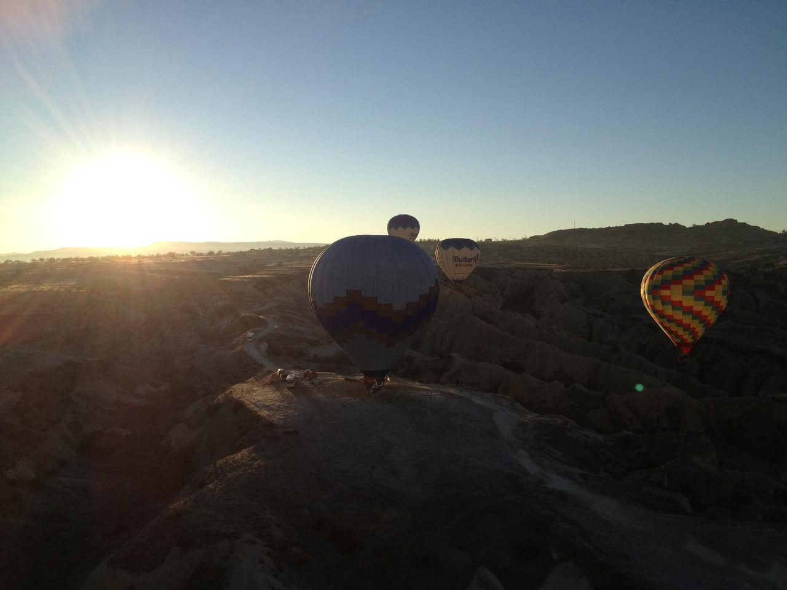
**이미지 캡션:** 이 사진은 일출 시간에 터키 카파도키아의 독특한 지형 위를 떠다니는 여러 개의 열기구를 보여줍니다. 사진의 전경에는 거대한 파란색과 회색 줄무늬가 있는 열기구가 있으며, 그 뒤로는 "Butterfly Balloons"라고 적힌 또 다른 열기구가 보입니다. 오른쪽에는 빨간색, 노란색, 파란색 격자무늬가 있는 열기구가 떠 있습니다. 배경에는 험준한 산과 계곡이 펼쳐져 있으며, 멀리 지평선에는 희미하게 나무들이 보입니다. 태양은 왼쪽 하늘에서 밝게 빛나며 긴 광선을 내뿜고 있으며, 이는 새벽의 고요하고 평화로운 분위기를 더합니다. 지상에는 좁은 도로와 몇 대의 차량이 보이며, 열기구 투어를 준비하는 모습으로 추정됩니다. 사진 속에는 사람이 명확하게 보이지 않지만, 열기구 바구니 안에는 탑승객들이 있을 것으로 예상됩니다. 전반적으로 이 사진은 카파도키아의 장엄한 풍경과 열기구 비행의 경이로움을 담고 있습니다.위기를 더합니다. 지상에는 좁은 도로와 몇 대의 차량이 보이며, 열기구 투어를 준비하는 모습으로 추정됩니다. 사진 속에는 사람이 명확하게 보이지 않지만, 열기구 바구니 안에는 탑승객들이 있을 것으로 예상됩니다. 전반적으로 이 사진은 카파도키아의 장엄한 풍경과 열기구 비행의 경이로움을 담고 있습니다.
 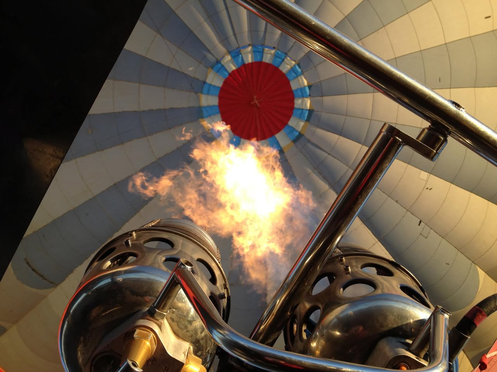
**이미지 캡션:** 열기구 내부에서 촬영된 사진으로, 뜨거운 불꽃이 위로 솟구치며 열기구를 팽창시키는 모습이 보인다. 열기구의 천은 흰색과 파란색 줄무늬 패턴이며, 중앙에는 빨간색과 파란색 원형 디자인이 있다. 사진의 전면에는 금속 재질의 버너와 지지대가 보이며, 이는 열기구 조종에 사용되는 장치로 추정된다. 불꽃은 밝고 강렬하며, 열기구 천의 일부를 비추고 있다. 사진에는 사람이 보이지 않으며, 배경은 열기구 내부의 천과 장치들로 이루어져 있다. 전체적으로 역동적이고 흥미로운 분위기를 자아낸다.
 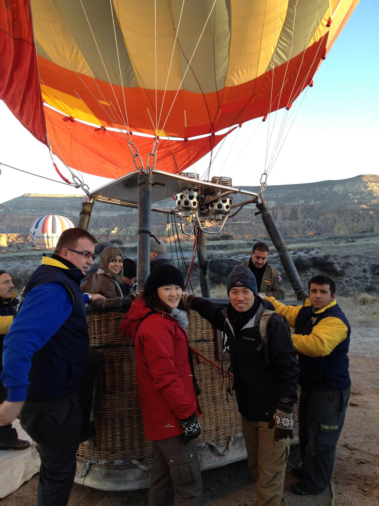
**이미지 캡션:** 이 사진은 여러 사람이 열기구 바구니 앞에 서 있는 모습을 담고 있으며, 배경에는 또 다른 열기구와 황량한 풍경이 펼쳐져 있습니다. 사진 왼쪽에는 파란색 조끼와 노란색 소매가 달린 옷을 입은 성인 남성이 서 있고, 그의 옆에는 갈색 히잡을 쓴 여성과 검은색 비니를 쓴 성인 여성이 미소를 짓고 있습니다. 이들 뒤에는 검은색 재킷을 입은 성인 남성이 서 있고, 그의 옆에는 회색 비니를 쓴 성인 남성이 검은색 재킷과 배낭을 메고 카메라를 향해 웃고 있습니다. 사진 오른쪽에는 노란색과 파란색이 섞인 재킷을 입은 성인 남성이 서 있고, 그의 바지에는 "ISTANBUL BALLOONS"라는 글자가 보입니다. 열기구는 주황색과 노란색으로 이루어져 있으며, 바구니는 짚으로 만들어져 있습니다. 전체적으로 맑은 날씨에 야외에서 열기구 탑승을 준비하는 즐거운 분위기입니다. 남성이 서 있고, 그의 바지에는 "ISTANBUL BALLOONS"라는 글자가 보입니다. 열기구는 주황색과 노란색으로 이루어져 있으며, 바구니는 짚으로 만들어져 있습니다. 전체적으로 맑은 날씨에 야외에서 열기구 탑승을 준비하는 즐거운 분위기입니다.
 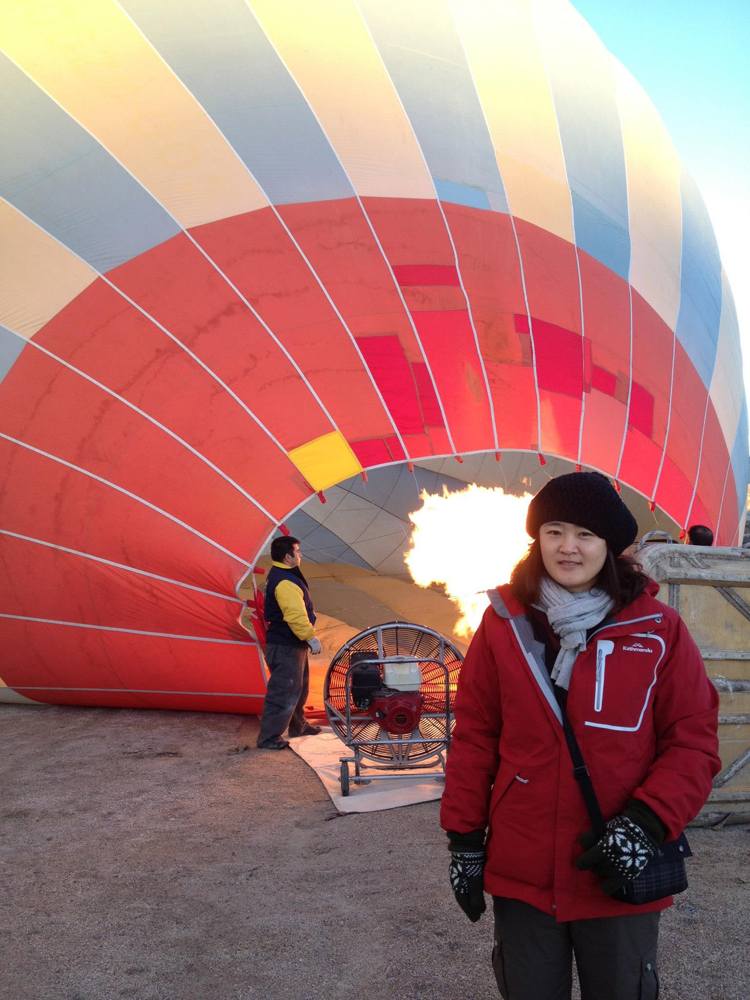
**이미지 캡션:** 한 성인 여성이 빨간색 패딩 점퍼와 검은색 베레모, 회색 목도리를 착용하고 카메라를 향해 미소를 짓고 있으며, 그녀의 오른쪽에는 열기구가 거대한 크기로 펼쳐져 있고, 열기구 안에서는 불꽃이 치솟고 있습니다. 열기구 옆에는 성인 남성이 노란색 조끼와 파란색 상의를 입고 서 있으며, 그의 뒤에는 대형 팬이 놓여 있습니다. 배경은 흙먼지가 날리는 평평한 지형이며, 맑고 푸른 하늘이 보입니다. 열기구는 빨간색, 흰색, 파란색, 노란색 등 다양한 색상의 줄무늬로 이루어져 있습니다. 여성의 패딩 점퍼에는 "Kathmandu"라는 로고가 보입니다. 전반적으로 열기구 탑승 준비를 하는 활기찬 분위기입니다.du"라는 로고가 보입니다. 전반적으로 열기구 탑승 준비를 하는 활기찬 분위기입니다.
 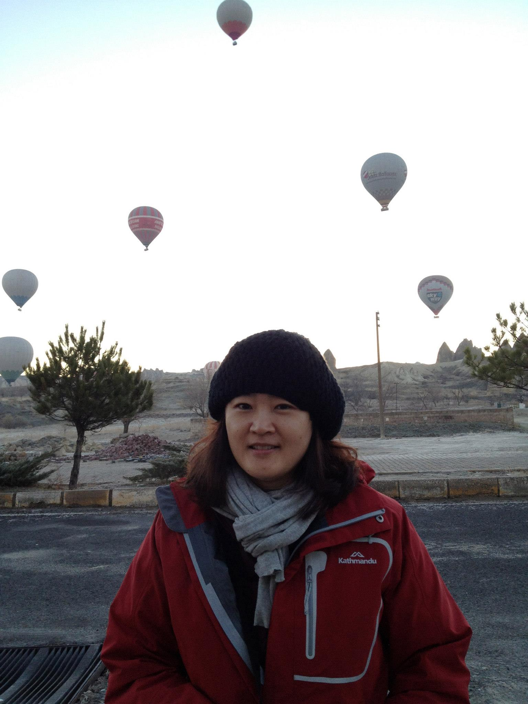
**이미지 캡션:** 이 사진은 여러 개의 열기구가 떠 있는 하늘 아래, 한 성인 여성이 서 있는 모습을 담고 있습니다. 여성은 30대 정도로 보이며, 검은색 니트 모자와 회색 목도리를 착용하고 빨간색 방수 재킷을 입고 있습니다. 재킷에는 "Kathmandu"라는 로고가 보입니다. 여성은 카메라를 향해 부드러운 미소를 짓고 있으며, 편안하고 즐거운 표정입니다. 배경에는 독특한 모양의 바위 지형과 몇 그루의 나무가 보이며, 이는 터키의 카파도키아와 같은 열기구 투어로 유명한 지역임을 시사합니다. 하늘에는 다양한 색깔과 크기의 열기구들이 떠 있으며, 일부 열기구에는 "Sky Way"와 같은 글자가 보입니다. 전체적으로 평화롭고 아름다운 풍경 속에서 여행을 즐기는 듯한 분위기입니다.들이 떠 있으며, 일부 열기구에는 "Sky Way"와 같은 글자가 보입니다. 전체적으로 평화롭고 아름다운 풍경 속에서 여행을 즐기는 듯한 분위기입니다.
 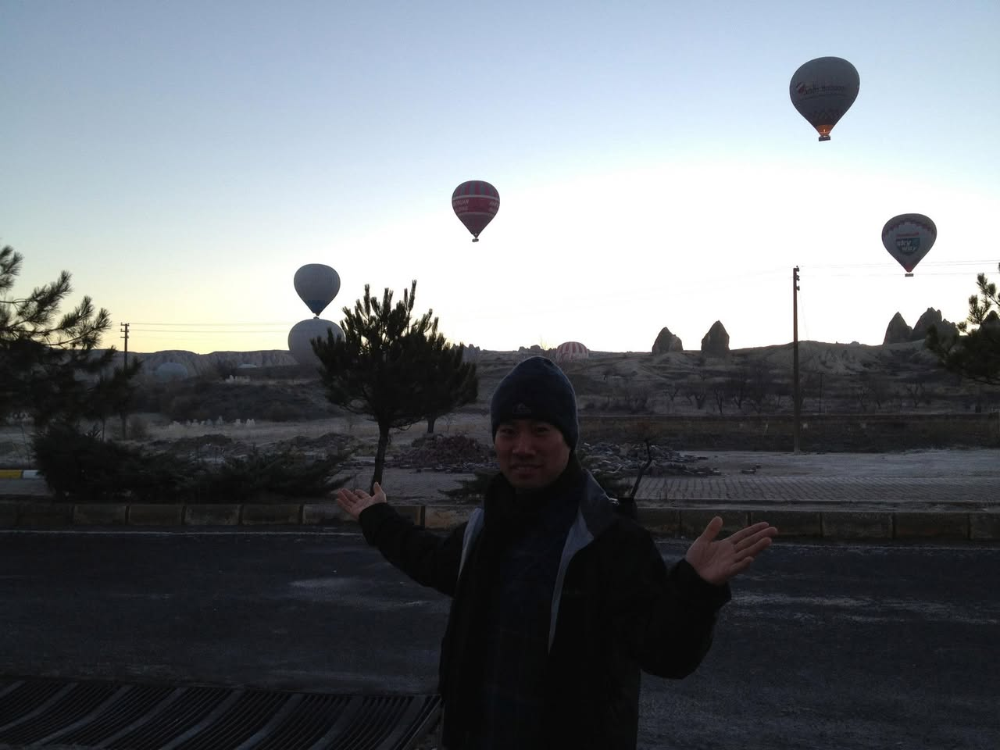
**이미지 캡션:** 이 사진은 여러 개의 열기구가 떠 있는 풍경을 배경으로 한 명의 성인 남성이 포즈를 취하고 있는 모습을 담고 있습니다. 남성은 30대 초중반으로 보이며, 검은색 비니와 검은색 패딩 점퍼, 회색 목도리를 착용하고 있습니다. 그의 표정은 약간 미소를 띠고 있으며, 오른손을 활짝 펴서 마치 무언가를 가리키거나 소개하는 듯한 제스처를 취하고 있습니다. 배경에는 여러 개의 열기구가 하늘에 떠 있으며, 그중 일부는 붉은색과 흰색, 회색 등 다양한 색상을 띠고 있습니다. 열기구에는 "Sky Balloon"과 같은 영어 문구가 희미하게 보입니다. 지상에는 독특한 모양의 바위 지형과 나무들이 보이며, 이른 아침이나 늦은 오후의 옅은 햇살이 비추고 있어 차분하고 신비로운 분위기를 자아냅니다. 도로와 인도, 그리고 길가에 늘어선 나무들이 사진의 공간감을 더해주며, 전체적으로 여행지의 아름다운 풍경 속에서 즐거움을 만끽하는 듯한 상황을 보여줍니다.구가 희미하게 보입니다. 지상에는 독특한 모양의 바위 지형과 나무들이 보이며, 이른 아침이나 늦은 오후의 옅은 햇살이 비추고 있어 차분하고 신비로운 분위기를 자아냅니다. 도로와 인도, 그리고 길가에 늘어선 나무들이 사진의 공간감을 더해주며, 전체적으로 여행지의 아름다운 풍경 속에서 즐거움을 만끽하는 듯한 상황을 보여줍니다.

> Yeon is certified!
> Sung is heading down to see...
> to see this.
> More hot air!
> We are ready to fly!

### 12월 29일 (토) 04:49 · is reading Ephesians (에베소서)

📍 Ephesus, Turkey, Ephesus, Turkey

is reading Ephesians (에베소서)
