# 2013년 1월

[← 2013년](README.md)

### 1월 9일 (수) 14:06 · The deadline is March 1, my anniversary.…

The deadline is March 1, my anniversary. :-)

🔗 <http://esec-fse.inf.ethz.ch/>

### 1월 14일 (월) 09:41 · is visiting KAIST with other HKUST facul…

is visiting KAIST with other HKUST faculty, S.C. Cheung and Charles Zhang. It's very good to be here.

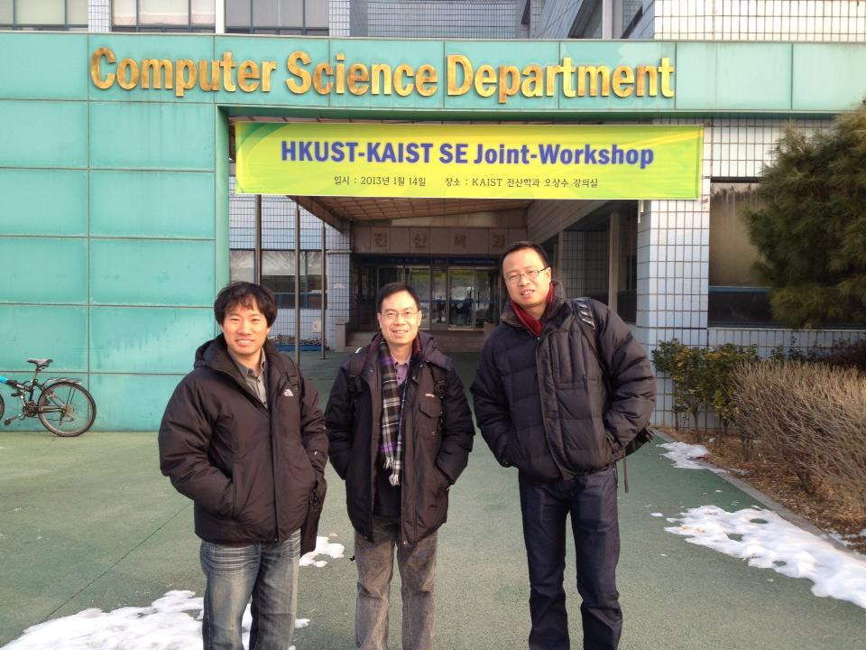
**이미지 캡션:** 두 명의 성인 남성이 건물 앞에서 사진을 찍고 있다. 왼쪽 남성은 30대 초반으로 보이며, 검은색 패딩 점퍼와 청바지를 입고 있다. 그는 카메라를 보며 미소를 짓고 있으며, 오른손은 주머니에 넣고 있다. 오른쪽 남성은 40대 후반으로 보이며, 검은색 패딩 점퍼와 회색 바지를 입고 있다. 그는 목에 스카프를 두르고 있으며, 안경을 착용하고 있다. 그의 표정은 약간 경직되어 보이며, 양손은 패딩 점퍼 주머니에 넣고 있다. 배경에는 "Computer Science Department"라고 적힌 건물이 보이며, 그 아래에는 "HKUST-KAIST SE Joint-Workshop"이라는 현수막이 걸려 있다. 현수막에는 행사 일시와 장소에 대한 정보가 한국어로 적혀 있다. 건물 앞에는 눈이 녹다 만 흔적이 보이며, 오른쪽에는 나무와 덤불이 있다. 왼쪽에는 자전거 한 대가 세워져 있다. 전반적으로 겨울철에 야외에서 진행된 학술 행사와 관련된 사진으로 보인다.

### 1월 14일 (월) 15:05 · 📷 앨범: Profile pictures (2장)

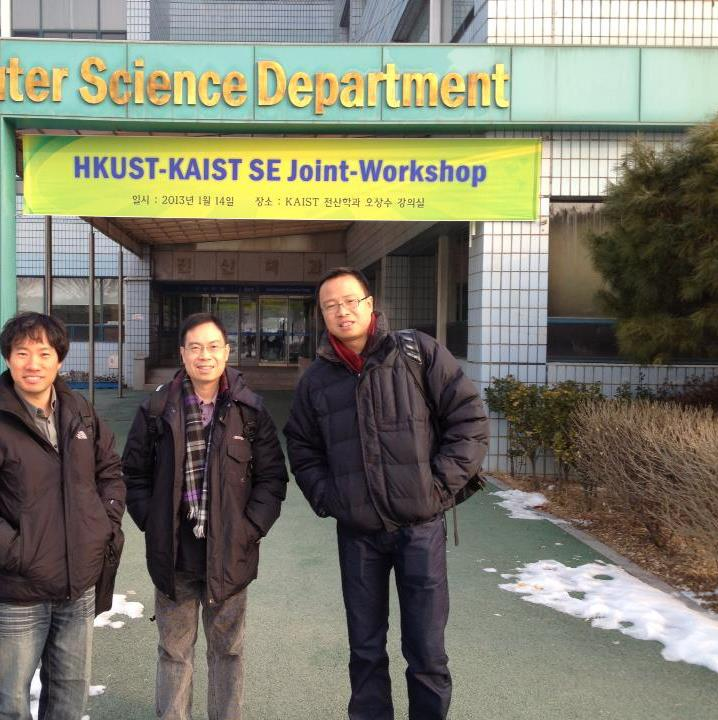
**이미지 캡션:** 세 명의 성인 남성이 건물 앞에 서서 사진을 찍고 있다. 왼쪽 남성은 40대 초반으로 보이며, 검은색 패딩 점퍼와 청바지를 입고 있다. 가운데 남성은 40대 중반으로 보이며, 검은색 패딩 점퍼와 체크무늬 목도리, 회색 바지를 입고 있다. 오른쪽 남성은 40대 후반으로 보이며, 검은색 패딩 점퍼와 빨간색 목도리, 청바지를 입고 있다. 세 사람 모두 카메라를 보며 미소를 짓고 있다. 배경에는 "Computer Science Department"라고 쓰인 간판과 "HKUST-KAIST SE Joint-Workshop"이라고 쓰인 노란색 현수막이 걸려 있다. 현수막에는 "일시: 2013년 1월 14일 장소: KAIST 전산학과 오상수 강의실"이라고 적혀 있다. 건물 입구에는 한국어로 "전산학과"라고 쓰여 있다. 주변에는 눈이 쌓여 있고, 나무와 덤불이 보인다. 전체적으로 추운 날씨에 학술 행사 참석을 기념하는 듯한 분위기이다.
 
**이미지 캡션:** 이 사진은 30대 후반에서 40대 초반으로 보이는 성인 남성이 정면을 바라보며 미소를 짓고 있는 모습을 담고 있습니다. 남성은 검은색 곱슬머리에 짙은 눈썹, 또렷한 눈매를 가지고 있으며, 부드러운 미소를 띠고 있습니다. 흰색 티셔츠 위에 검은색 재킷을 걸치고 있으며, 깔끔하고 단정한 인상을 줍니다. 배경에는 회색 좌석들이 여러 개 보이며, 좌석 뒤편으로는 흐릿하게 사람이 서 있는 모습도 보입니다. 전체적으로 실내 공간으로 추정되며, 편안하고 캐주얼한 분위기입니다.

### 1월 15일 (화) 08:58 · 📷 앨범: Gapcheon Run @KAIST (4장)

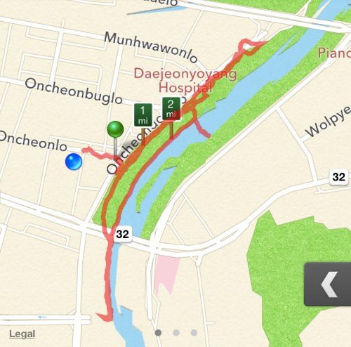
**이미지 캡션:** 이것은 지도 앱의 스크린샷으로, 강을 따라 붉은색으로 표시된 경로가 보입니다. 경로에는 녹색 핀과 파란색 점이 표시되어 있으며, 1마일과 2마일을 나타내는 작은 사각형 표시도 있습니다. 지도에는 "Munhwawonlo", "Oncheonbuglo", "Oncheonlo", "Daejeonyoyang Hospital", "Wolpye"와 같은 도로 이름과 "Pianc"라는 텍스트가 표시되어 있습니다. 또한 "32"라는 숫자가 두 번 표시되어 있으며, 오른쪽 하단에는 검은색 화살표 버튼이 있습니다. 전반적으로 이 이미지는 특정 경로를 추적하거나 탐색하는 데 사용되는 지도 앱의 일부를 보여줍니다.
 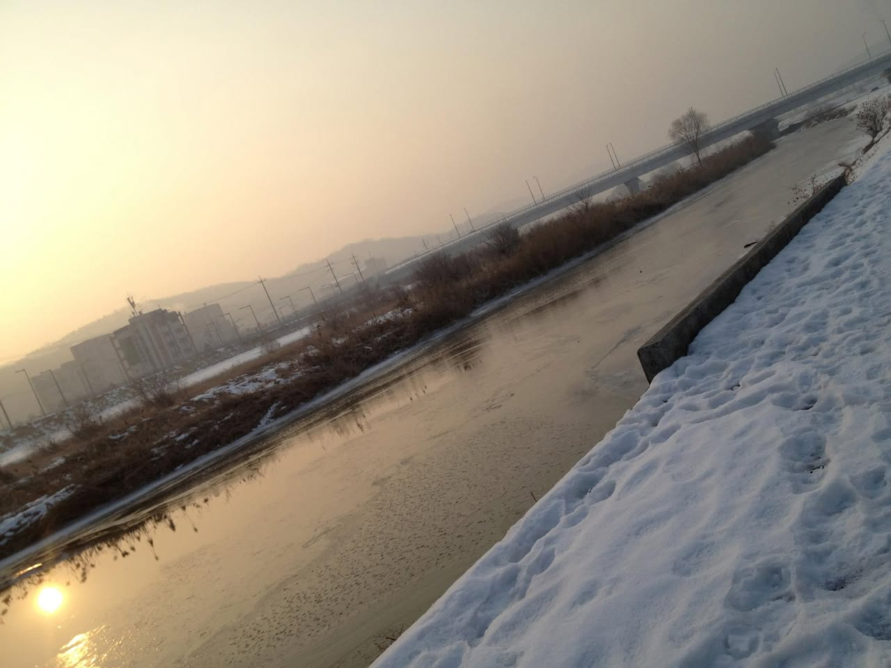
**이미지 캡션:** 사진은 겨울철 흐린 날 오후에 강변의 풍경을 담고 있으며, 화면은 오른쪽으로 기울어져 있습니다. 강물은 얼음이 얼어 있고 표면에는 잔잔한 물결이 일고 있으며, 햇빛이 비쳐 황금빛으로 반짝입니다. 강둑에는 눈이 쌓여 있으며, 발자국이 선명하게 보입니다. 강 건너편에는 낮은 산과 함께 몇 개의 건물이 보이고, 그 위로는 전봇대와 가로등이 늘어서 있습니다. 멀리 다리가 보이며, 다리 위로는 차량이 지나가는 모습은 보이지 않습니다. 전반적으로 차분하고 고요한 겨울 풍경을 보여주고 있습니다.
 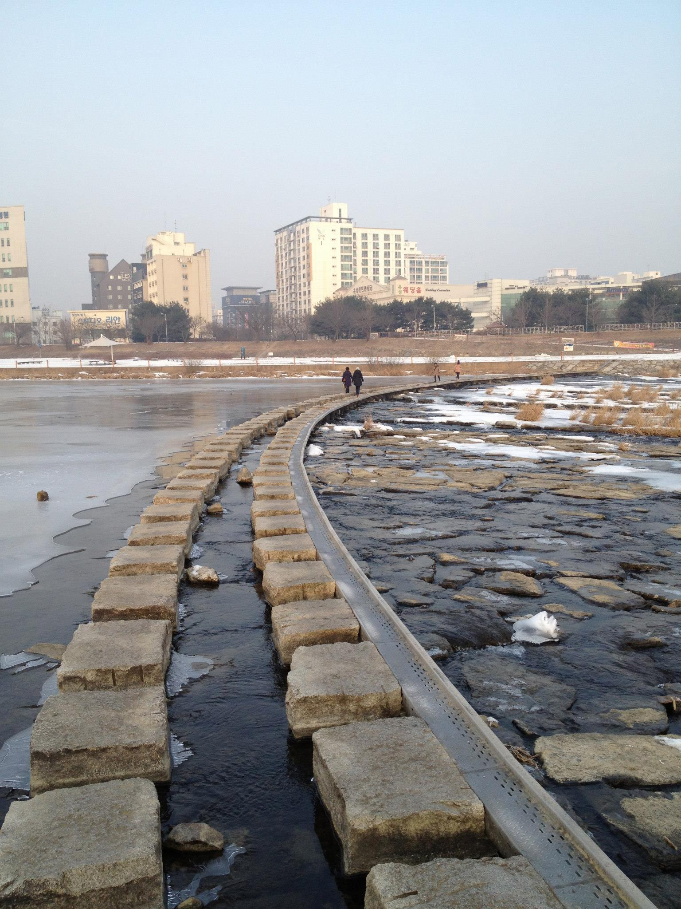
**이미지 캡션:** 얼어붙은 강 위로 놓인 돌 디딤돌을 따라 두 명의 성인 여성이 나란히 걷고 있으며, 한 명은 어두운 색 옷을, 다른 한 명은 밝은 색 옷을 입고 있다. 그 뒤로도 몇몇 사람들이 강을 건너고 있다. 강변에는 눈이 쌓여 있고, 멀리 도시의 건물들이 보인다. 건물 중에는 하얀색의 높은 건물과 여러 층으로 된 건물들이 있으며, 일부 건물에는 한국어로 된 간판이 보인다. 하늘은 맑고 흐릿한 회색빛이며, 전체적으로 겨울의 차가운 분위기를 느낄 수 있다. 디딤돌은 불규칙하게 놓여 있으며, 일부는 물에 잠겨 있고 일부는 얼음으로 덮여 있다. 강물은 맑고 차가워 보이며, 주변에는 마른 풀들이 보인다.
 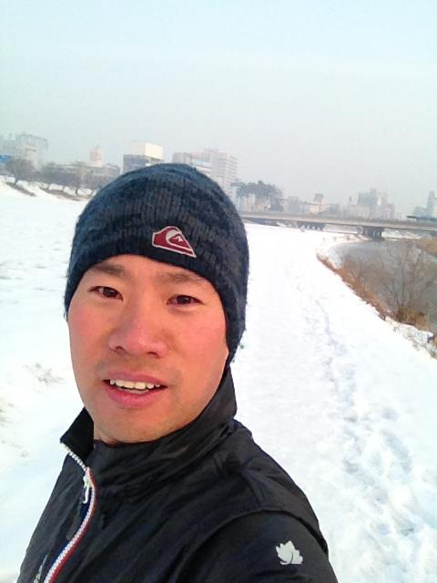
**이미지 캡션:** 눈 덮인 길 위에서 셀카를 찍고 있는 성인 남성이 보인다. 그는 짙은 남색 비니를 쓰고 있으며, 비니 앞쪽에는 붉은색과 흰색 테두리의 로고가 있다. 얼굴은 붉게 상기되어 있으며, 입을 살짝 벌리고 카메라를 응시하고 있다. 검은색 패딩 점퍼를 입고 있으며, 점퍼의 지퍼는 흰색과 빨간색으로 되어 있다. 점퍼 왼쪽 소매에는 하얀색 잎 모양의 로고가 보인다. 배경으로는 눈이 쌓인 강변 또는 공원길이 펼쳐져 있고, 멀리 도시의 건물들과 다리가 보인다. 하늘은 흐릿하고 뿌연 날씨를 나타낸다. 전반적으로 추운 겨울날 야외 활동 중 찍은 것으로 보이는 활기찬 분위기이다.

### 1월 21일 (월) 17:56 · Got Rosemary in my office. It smells rea…

Got Rosemary in my office. It smells really good.

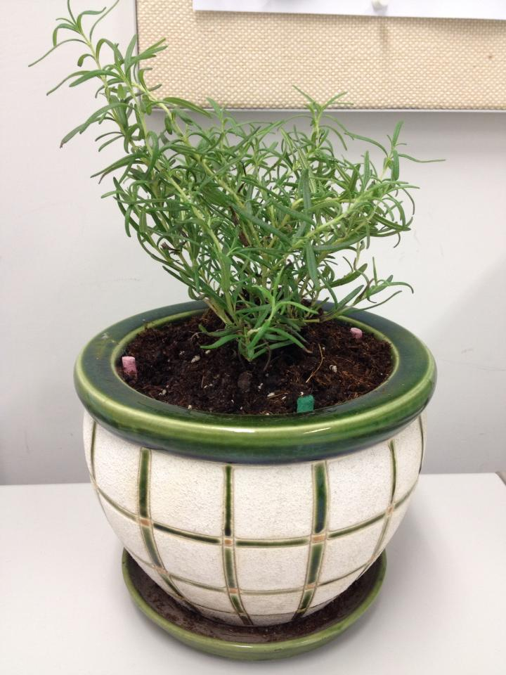
**이미지 캡션:** 화분 안에 심어진 로즈마리 식물이 클로즈업되어 보인다. 로즈마리는 짙은 녹색의 잎을 가지고 있으며, 줄기는 얇고 길게 뻗어 있다. 화분은 흰색 바탕에 녹색 격자무늬가 그려져 있으며, 가장자리에는 짙은 녹색 테두리가 둘러져 있다. 화분 안에는 흙이 채워져 있고, 흙 위에는 분홍색과 초록색의 작은 막대기들이 꽂혀 있다. 화분 아래에는 같은 색상의 받침대가 놓여 있다. 배경은 흰색 벽과 베이지색 천으로 덮인 게시판으로 이루어져 있다. 게시판에는 흰색 종이가 붙어 있으며, 그 위에는 옅은 색의 글씨가 희미하게 보인다. 전체적으로 밝고 깨끗한 분위기이며, 식물이 건강하게 자라고 있는 모습이다.

### 1월 22일 (화) 11:41 · What a beautiful day in Hong Kong (HKUST…

What a beautiful day in Hong Kong (HKUST)!

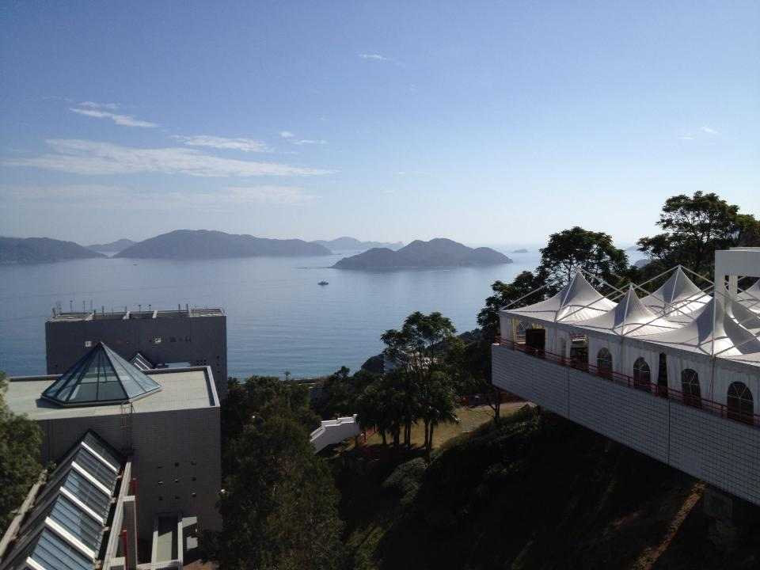
**이미지 캡션:** 푸른 하늘 아래, 잔잔한 바다와 여러 섬들이 그림처럼 펼쳐져 있으며, 해안가에는 현대적인 건물들이 자리하고 있습니다. 사진 왼쪽에는 회색빛의 각진 건물이 보이며, 그 위에는 유리로 된 피라미드 형태의 지붕이 인상적입니다. 이 건물 옆으로는 경사진 유리 지붕을 가진 또 다른 건물이 보입니다. 오른쪽에는 하얀색 천막으로 덮인 긴 건물이 절벽 위에 지어져 있으며, 천막은 여러 개의 뾰족한 봉우리 모양으로 디자인되어 있습니다. 건물 주변으로는 울창한 나무들이 우거져 있으며, 멀리 보이는 섬들은 옅은 푸른색으로 희미하게 보입니다. 전반적으로 맑고 화창한 날씨 속에서 자연과 현대 건축물이 조화를 이루는 풍경을 담고 있습니다.
 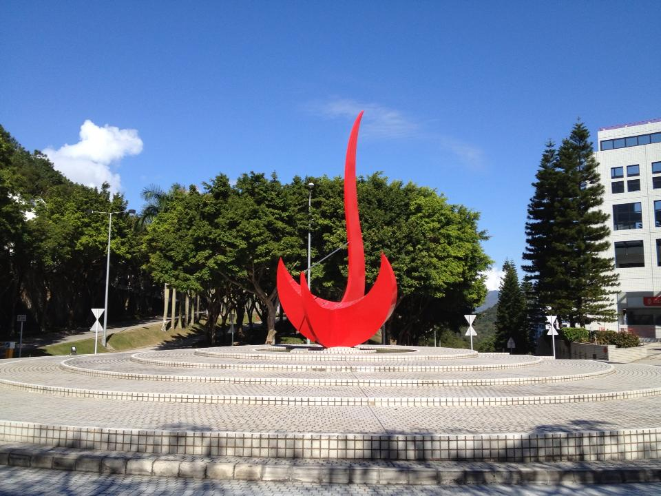
**이미지 캡션:** 푸른 하늘 아래, 둥근 계단식 광장 중앙에 붉은색의 추상 조형물이 우뚝 서 있다. 조형물은 마치 불꽃이나 깃발이 솟아오르는 듯한 역동적인 형태로, 맑고 화창한 날씨와 대비되어 더욱 강렬한 인상을 준다. 광장 주변으로는 울창한 녹색 나무들이 빽빽하게 들어서 있으며, 그 뒤로는 현대적인 흰색 건물이 보인다. 건물에는 여러 개의 창문이 규칙적으로 배치되어 있으며, 건물 일부에는 붉은색 간판이 보인다. 광장에는 둥근 모양의 계단이 여러 층으로 나뉘어 있으며, 바닥은 작은 타일로 덮여 있다. 길가에는 가로등과 교통 표지판이 보이며, 전반적으로 깔끔하고 정돈된 공공장소의 분위기를 풍긴다. 인물은 보이지 않으며, 텍스트는 건물에 있는 붉은색 간판 외에는 명확하게 보이지 않는다. 날씨는 매우 맑고 화창하며, 햇살이 조형물과 광장에 그림자를 드리우고 있다.
 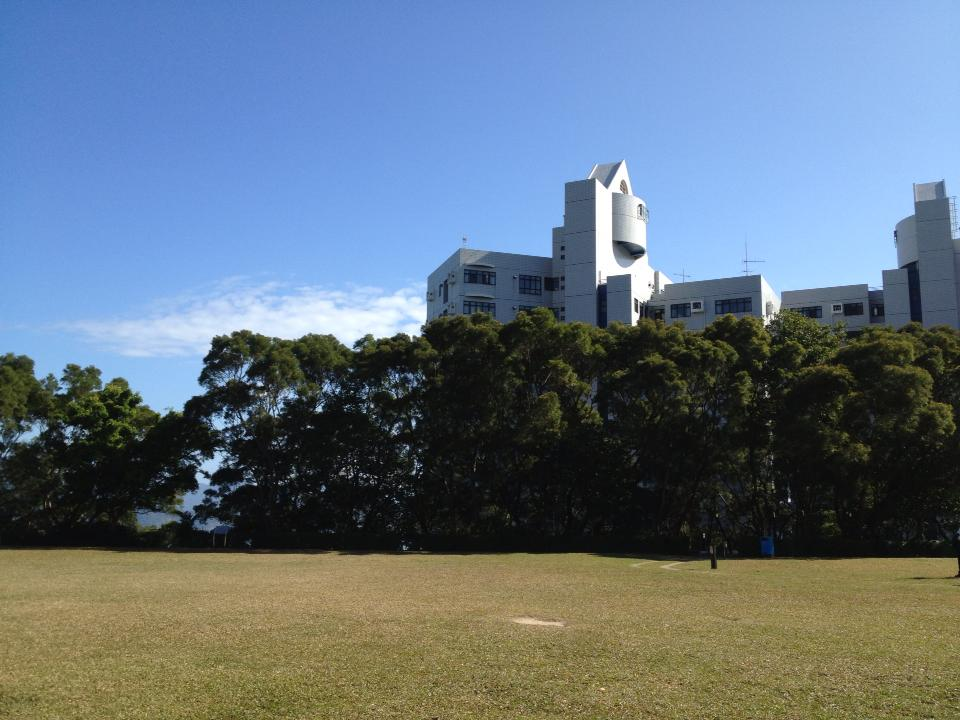
**이미지 캡션:** 푸른 하늘 아래, 잔디밭이 펼쳐진 넓은 공원에서 여러 동의 현대적인 흰색 건물이 울창한 녹색 나무들 뒤로 보입니다. 건물들은 다양한 높이와 형태로 구성되어 있으며, 창문들이 규칙적으로 배치되어 있습니다. 나무들은 건물 앞을 가로막고 있어 건물 전체를 다 볼 수는 없지만, 그 뒤로 보이는 건물들의 모습은 웅장함을 더합니다. 공원에는 잔디가 잘 관리되어 있으며, 멀리 바다가 보이는 듯한 풍경도 어렴풋이 보입니다. 전체적으로 맑고 화창한 날씨 속에서 평화롭고 여유로운 분위기를 자아냅니다.

### 1월 25일 (금) 17:45 · a long line at Apple Store in Hong Kong.

a long line at Apple Store in Hong Kong.

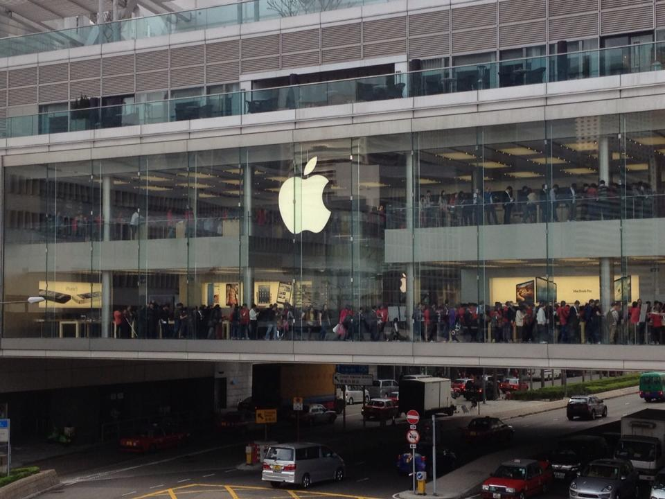
**이미지 캡션:** 현대적인 유리 건물 외관에 거대한 애플 로고가 선명하게 보이는 모습으로, 건물 내부에는 많은 사람들이 상품을 구경하거나 구매하기 위해 줄을 서 있는 것으로 보인다. 1층에는 아이폰과 맥북 프로 광고가 걸려 있으며, 2층에는 사람들이 삼삼오오 모여 대화를 나누거나 제품을 살펴보고 있다. 건물 외부 도로에는 다양한 차량들이 지나다니고 있으며, 전반적으로 활기찬 도시의 풍경을 담고 있다.

### 1월 25일 (금) 17:54 · is happy to have the President, Oh Moon …

is happy to have the President, Oh Moon Kwon from MIU (Mongolia International University).

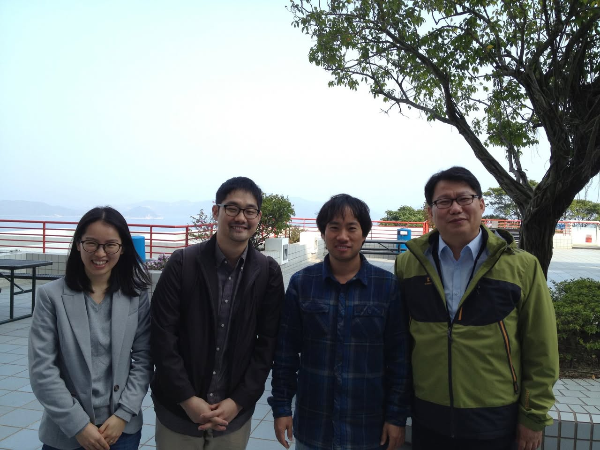
**이미지 캡션:** 네 명의 사람이 야외에서 사진을 찍고 있습니다. 왼쪽부터 젊은 여성, 성인 남성, 젊은 남성, 성인 남성입니다. 여성은 회색 재킷과 회색 스웨터를 입고 있으며, 안경을 쓰고 밝게 웃고 있습니다. 그녀 옆의 성인 남성은 갈색 재킷과 체크무늬 셔츠를 입고 있으며, 안경을 쓰고 미소를 짓고 있습니다. 그 옆의 젊은 남성은 파란색 체크무늬 셔츠를 입고 있으며, 안경을 쓰고 있습니다. 가장 오른쪽의 성인 남성은 연두색과 검은색이 배색된 재킷과 하늘색 셔츠를 입고 있으며, 안경을 쓰고 있습니다. 배경에는 바다와 산이 보이며, 큰 나무와 건물 일부도 보입니다. 전체적으로 밝고 화창한 날씨이며, 사람들은 편안하고 긍정적인 분위기입니다.

### 1월 27일 (일) 12:19 · Cinderella house!

Cinderella house!

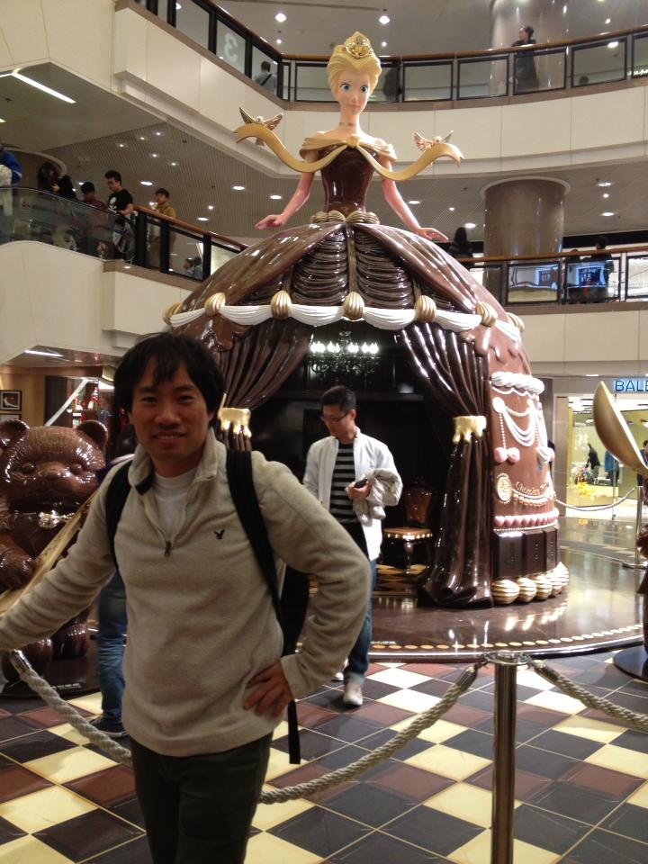
**이미지 캡션:** 이 사진은 실내 쇼핑몰로 보이는 장소에서 촬영되었으며, 중앙에는 거대한 초콜릿 테마의 조형물이 설치되어 있습니다. 조형물은 금발 머리에 화려한 드레스를 입은 여성 캐릭터를 형상화하고 있으며, 마치 동화 속 공주님을 연상시킵니다. 조형물 주변에는 곰 인형 조형물도 보입니다. 사진의 전경에는 한 명의 성인 남성이 서 있으며, 그는 회색 반집업 스웨터와 어두운 색 바지를 입고 검은색 백팩을 메고 있습니다. 남성은 카메라를 향해 미소를 짓고 있으며, 오른손은 허리에 얹고 있습니다. 그의 뒤로는 다른 사람들이 에스컬레이터를 이용하거나 쇼핑몰 내부를 둘러보고 있는 모습이 보입니다. 바닥은 갈색, 베이지색, 검은색 타일이 격자무늬로 깔려 있습니다. 전반적으로 축제 분위기나 특별한 이벤트가 진행 중인 듯한 활기찬 느낌을 줍니다.

### 1월 29일 (화) 22:06 · This is totally amazing.

This is totally amazing.

### 1월 31일 (목) 13:46 · got a plant-light for my rosemary. She s…

got a plant-light for my rosemary. She seems happy!

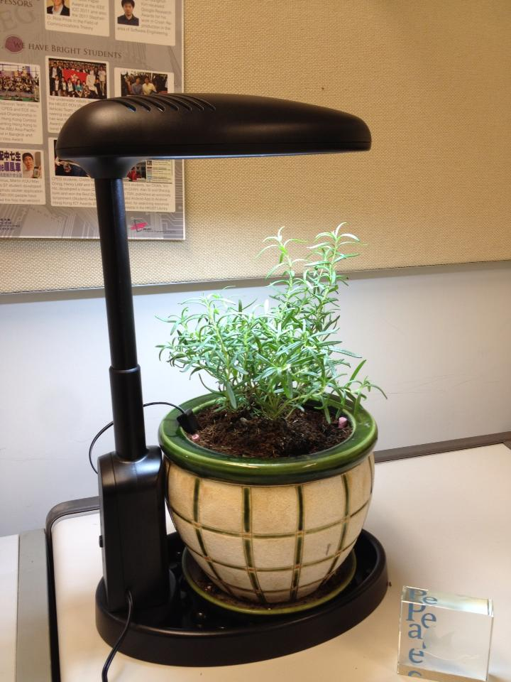
**이미지 캡션:** 이 사진은 사무실 책상 위에서 촬영된 것으로 보이며, 검은색 조명 스탠드가 설치된 화분에 심어진 로즈마리 식물이 중앙에 자리 잡고 있습니다. 조명 스탠드는 식물 위쪽으로 길게 뻗어 있으며, 식물에는 물을 주기 위한 것으로 보이는 검은색 호스가 연결되어 있습니다. 화분은 녹색 테두리와 격자무늬 디자인이 특징이며, 받침대 위에 놓여 있습니다. 배경에는 "WE HAVE BRIGHT STUDENTS"라는 문구가 적힌 게시물이 걸려 있고, 그 아래에는 여러 장의 사진과 텍스트가 포함된 또 다른 게시물이 보입니다. 사진 왼쪽 하단에는 "peace"라는 단어가 새겨진 투명한 유리 조각이 놓여 있습니다. 전반적으로 차분하고 정돈된 분위기를 연출하며, 실내에서 식물을 키우는 모습을 보여줍니다.
