# 2013년 2월

[← 2013년](README.md)

### 2월 2일 (토) 10:07 · It's really beautiful here

📍 seafront, HKUST

It's really beautiful here

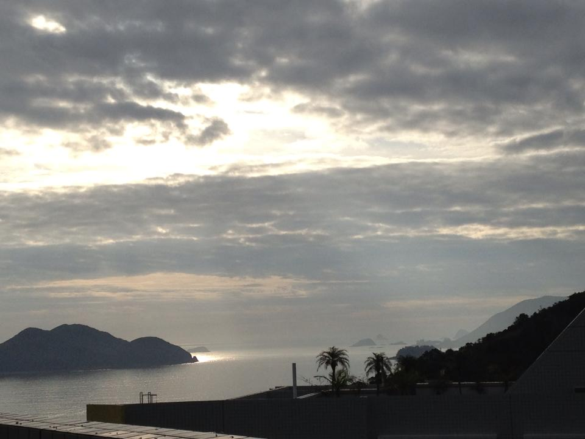

### 2월 3일 (일) 12:24 · Very interesting church decoration for C…

📍 Island ECC

Very interesting church decoration for Chinese New Year

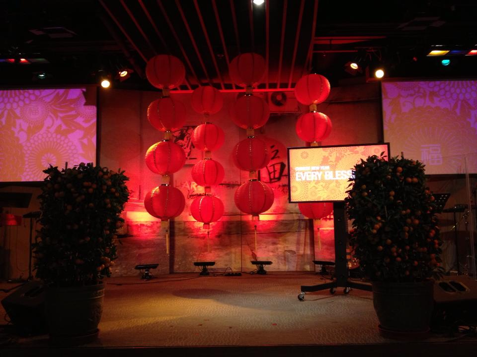

### 2월 5일 (화) 08:39 · good to have gifted students from Tsingh…

📍 HKUST

good to have gifted students from Tsinghua University. They are having a wonderful time

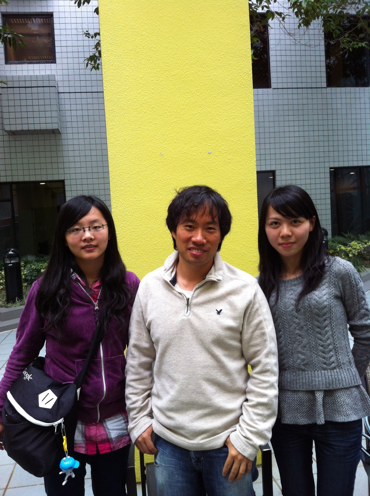 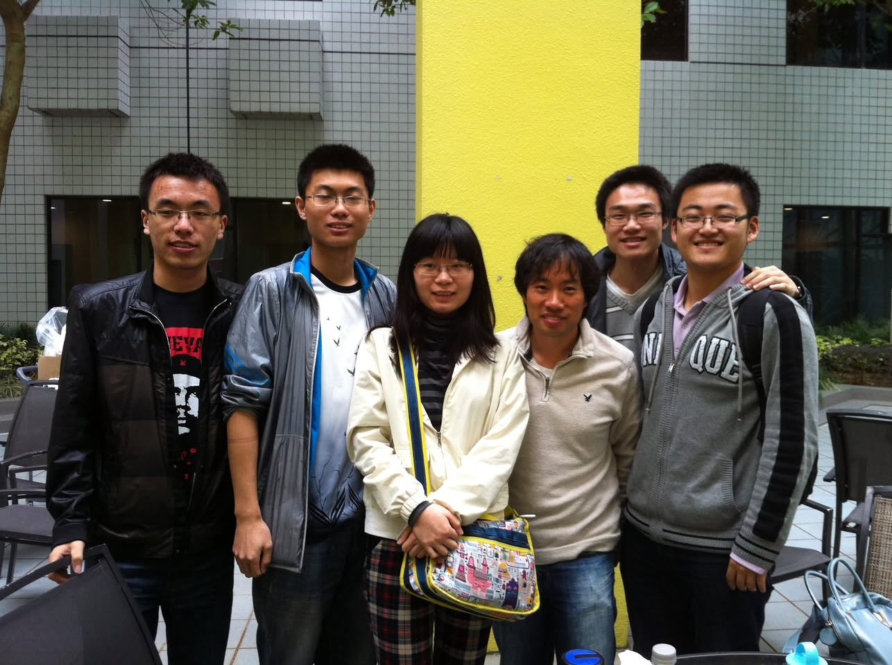

### 2월 5일 (화) 16:57 · good to have so many wonderful and beaut…

good to have so many wonderful and beautiful Software Engineering class students this semester again.

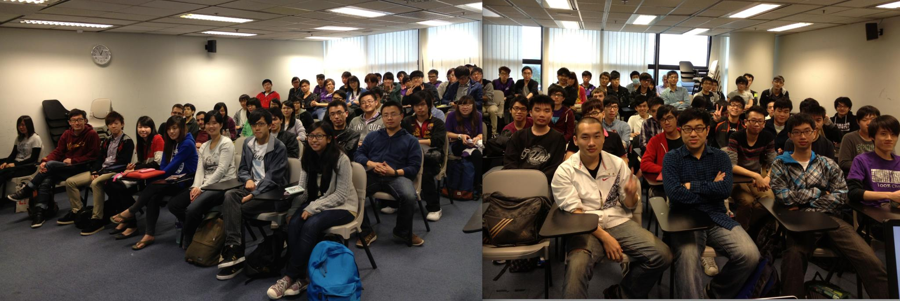

### 2월 6일 (수) 08:21 · EMSE - New Journal Leaflet! Please check…

EMSE - New Journal Leaflet! Please check it out and send your papers!

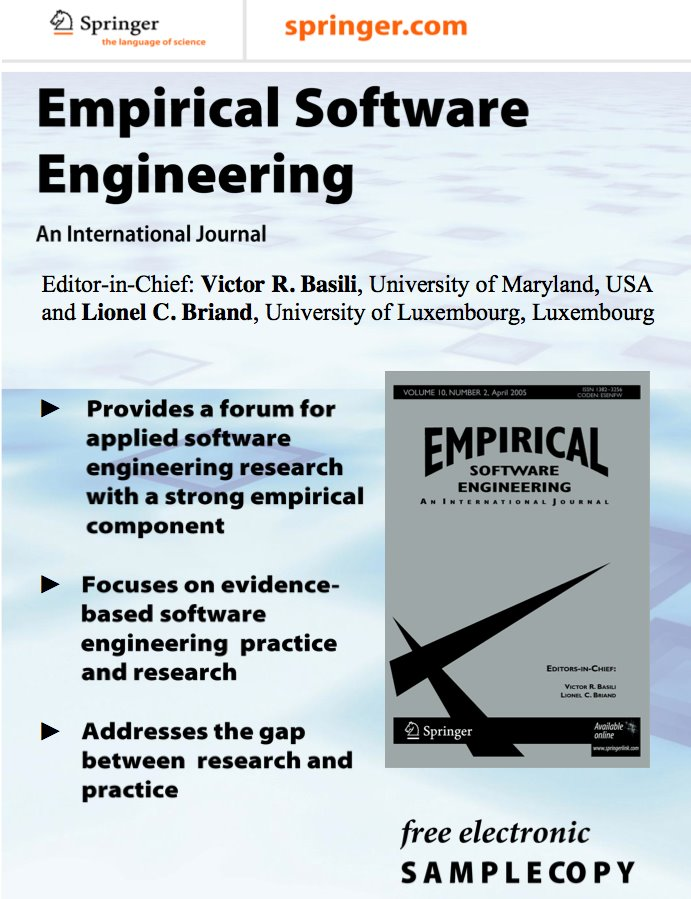 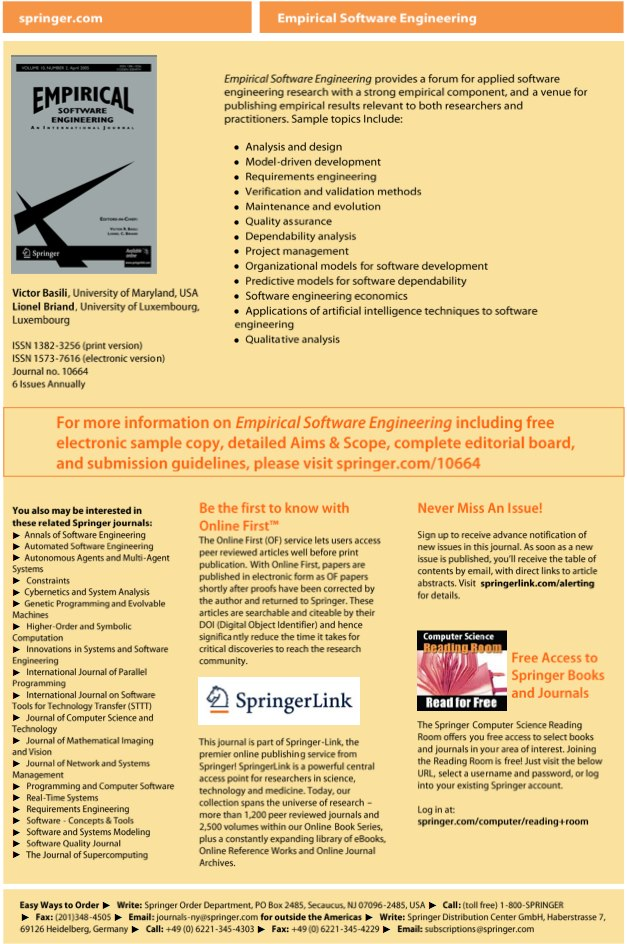

### 2월 6일 (수) 09:42 · seven gifted Tsinghua students visited m…

seven gifted Tsinghua students visited my class. (From left to right : Xiao Bo, Xiao He, Feng Letong, Cao Yue, Chen Kai, Zhu Han, Sung kim, Zhuang Chenfan.)

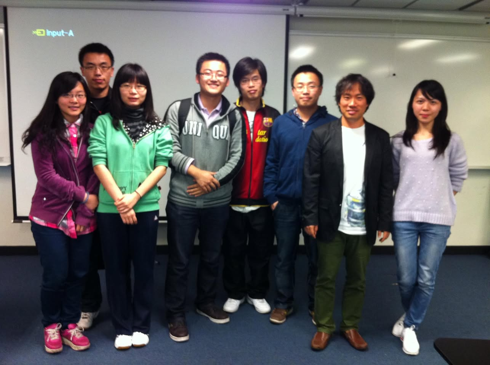

### 2월 7일 (목) 18:58 · It's exciting to see very active student…

📍 The Hong Kong University of Science and Technology - HKUST

It's exciting to see very active students

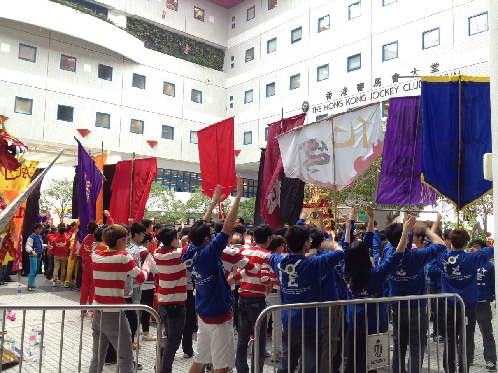 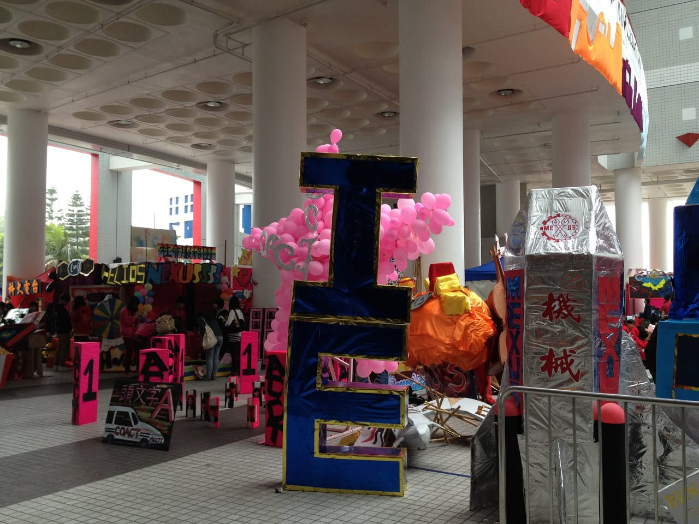

### 2월 10일 (일) 22:01 · Happy Lunar New Year to all my FB friend…

Happy Lunar New Year to all my FB friends!

### 2월 13일 (수) 20:12 · got  Valentines chocolate from a beautif…

got  Valentines chocolate from a beautiful lady!

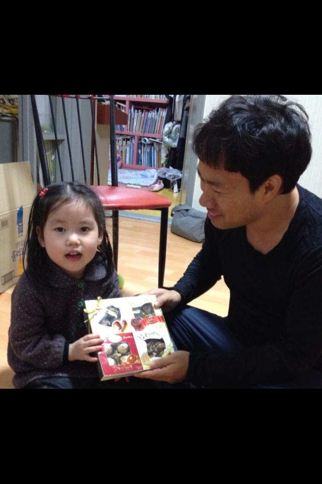

### 2월 21일 (목) 11:47 · Sung Kim shared a link.

🔗 <http://news.cs.washington.edu/2013/02/20/uw-cses-david-notkin-wins-acm-sigsoft-outstanding-research-award/>
