# 2013년 3월

[← 2013년](README.md)

### 3월 4일 (월) 00:32 · Just amazing!

Just amazing!

### 3월 5일 (화) 12:22 · Top dancers in our research group! (Powe…

Top dancers in our research group! (Powered by Dance Central 3.)

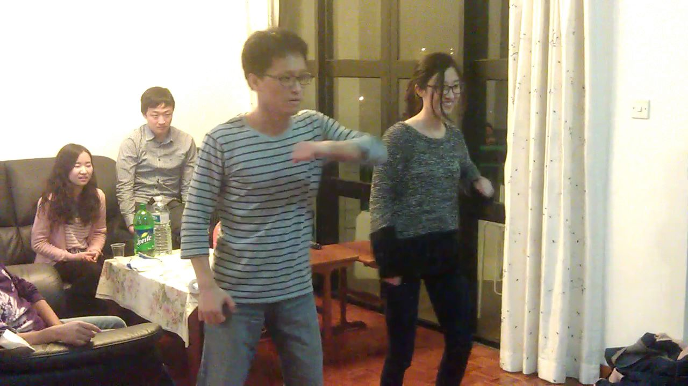 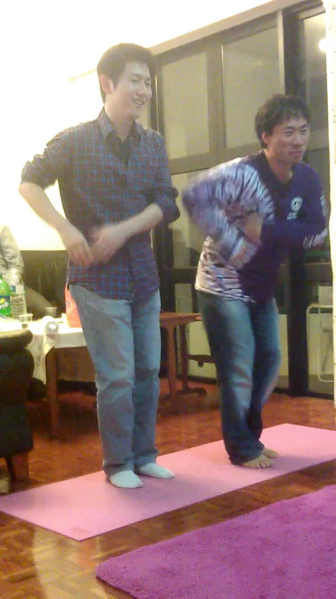

### 3월 5일 (화) 17:09 · It's really beautiful here

📍 seafront, HKUST

It's really beautiful here

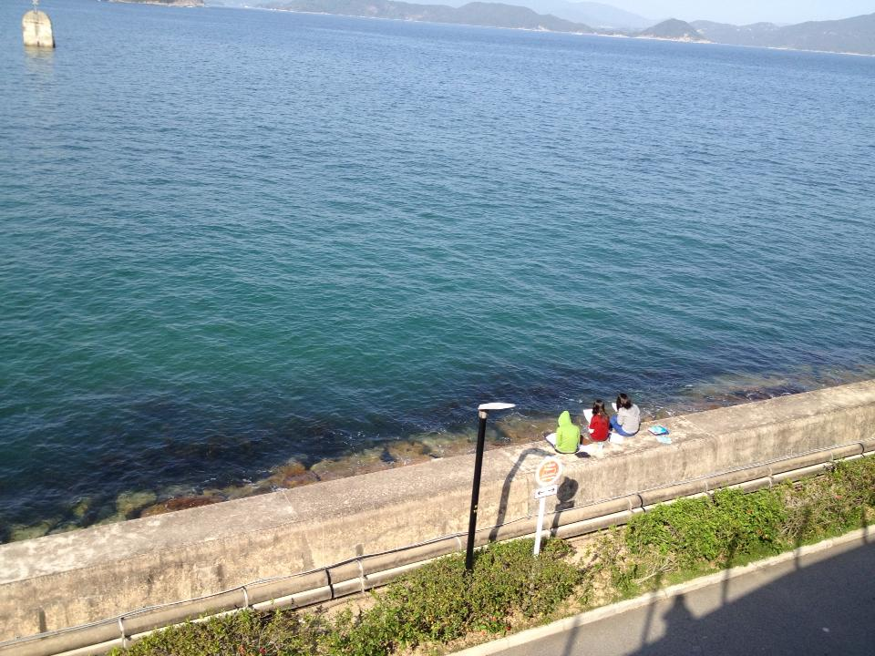

### 3월 9일 (토) 08:04 · Good morning!

📍 香港科技大學

Good morning!

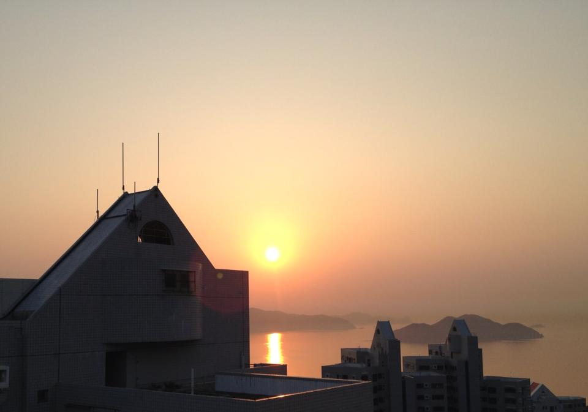

### 3월 9일 (토) 14:48 · Bicycling day for our research group.

📍 大圍

Bicycling day for our research group.

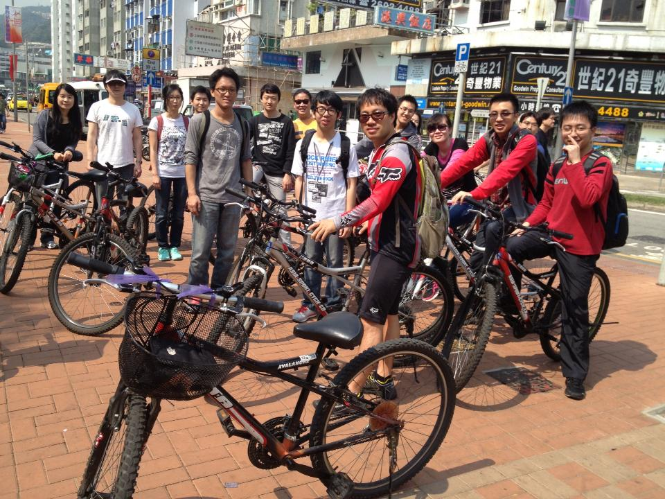 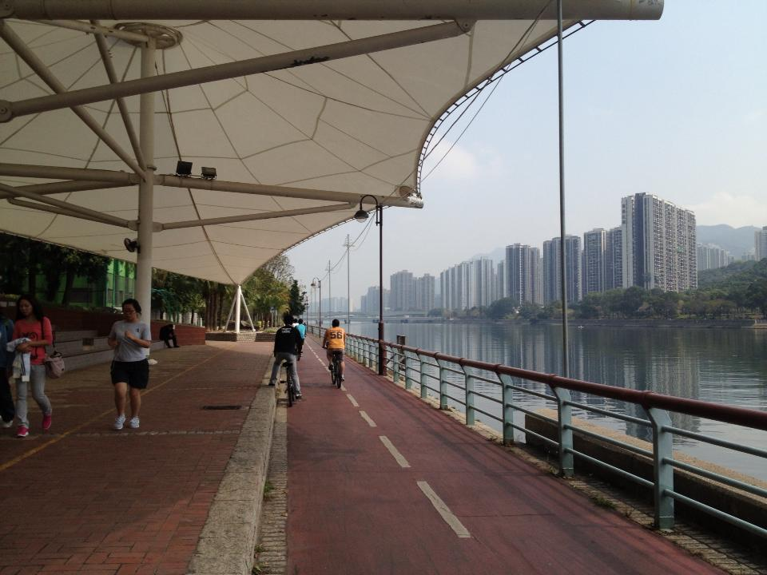

### 3월 17일 (일) 09:18 · Good to have Dr. Pyo at HKUST. His talk …

Good to have Dr. Pyo at HKUST. His talk about JUSTICE was totally inspiring and encouraging!

"Dr. PYO Chang-won, a former professor at the Korean National Police University who resigned to demand an investigation into election interference by
National Intelligence Service employees, is consoling citizens with free hugs and seminars. He is known to be one of the best Criminal Psychologists in Korea."

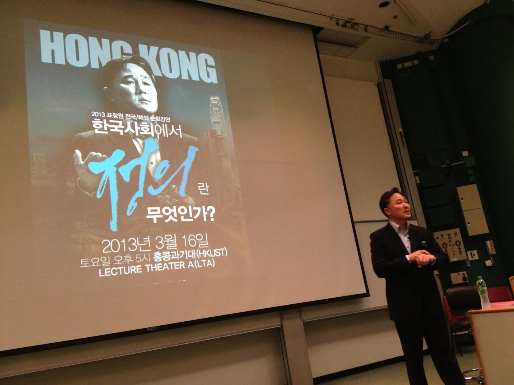 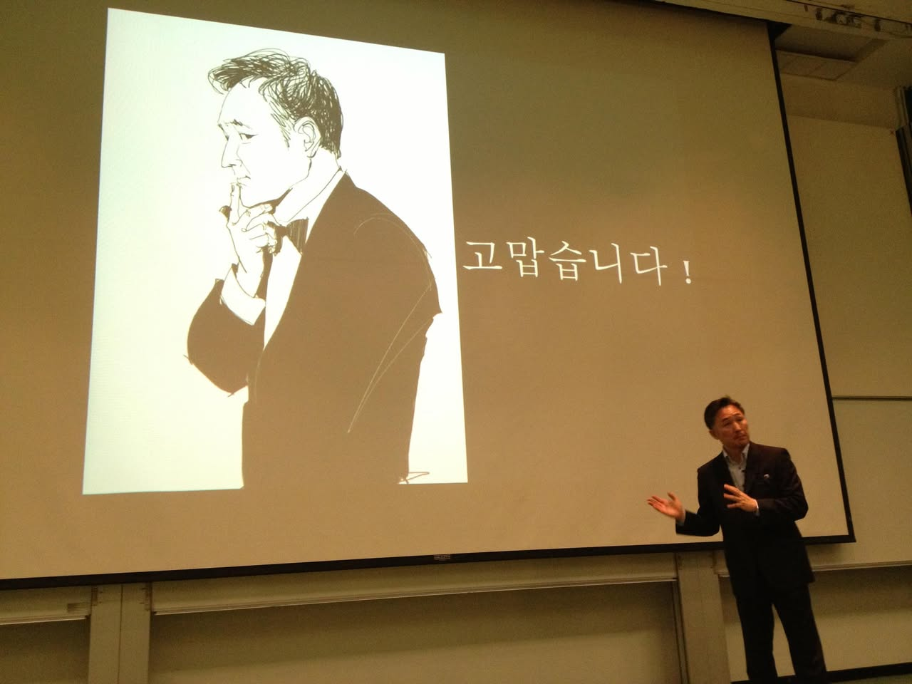

### 3월 18일 (월) 11:07 · Welcome Spring!

Welcome Spring!

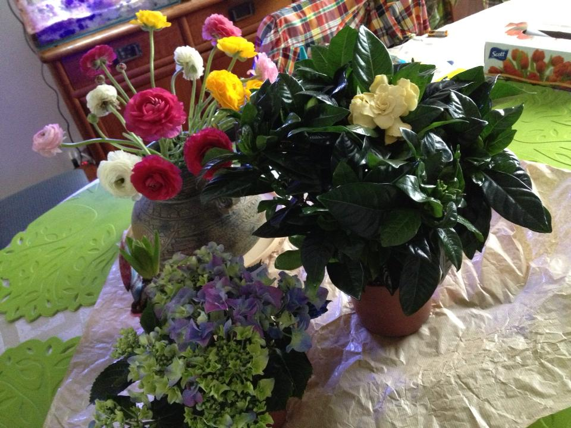

### 3월 18일 (월) 23:03 · Favorite clock! It reminds me of somethi…

Favorite clock! It reminds me of something: we don't have enough time to hold hands and love people.

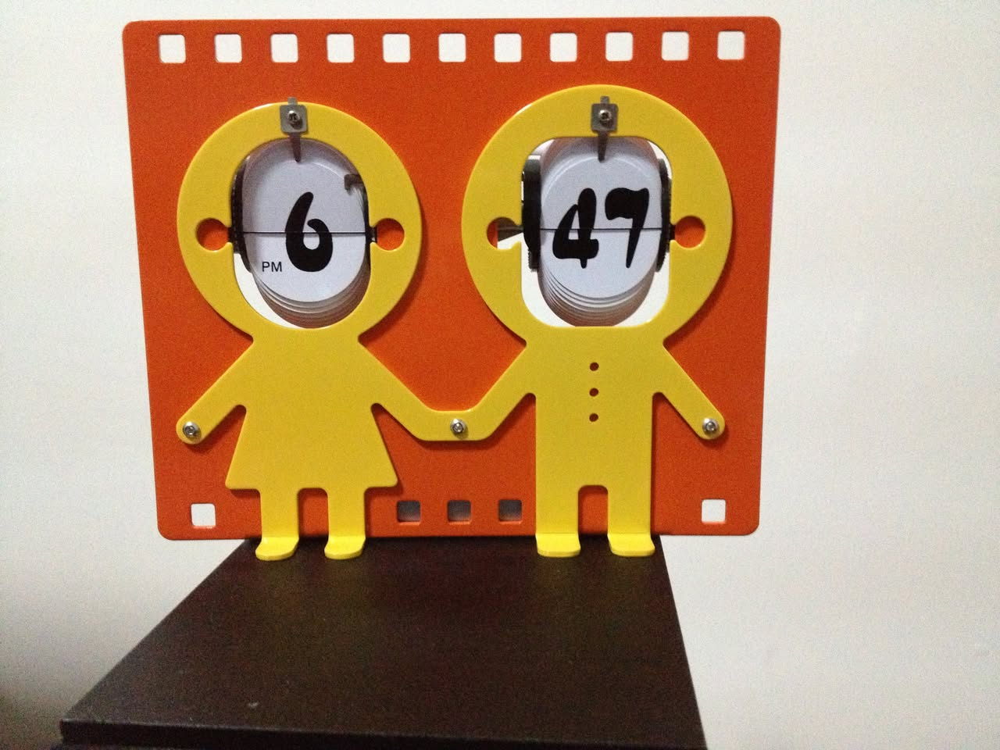

### 3월 23일 (토) 14:47 · Yeon Gyoung Gwack and Sung are ready to …

Yeon Gyoung Gwack and Sung are ready to roll!

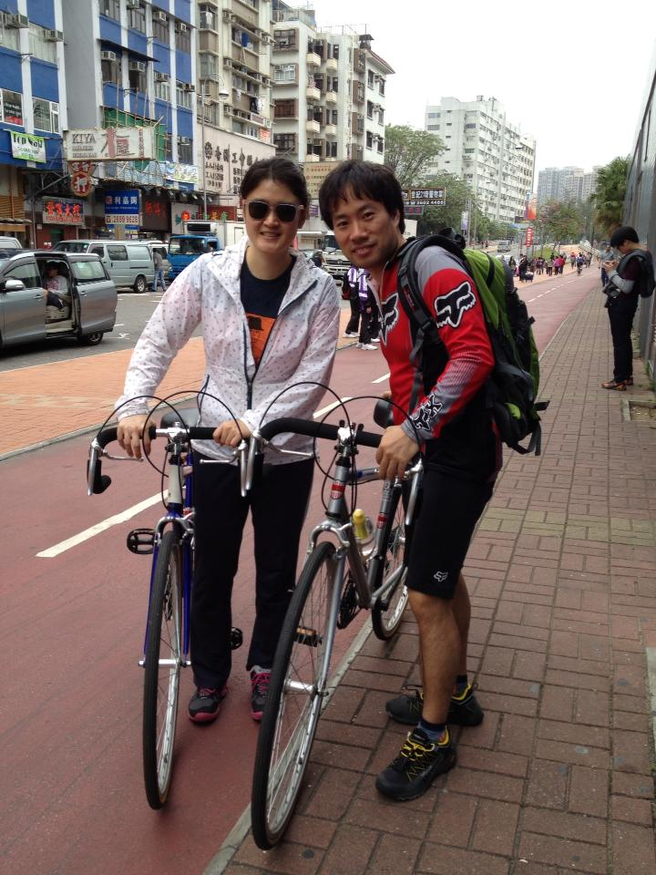

### 3월 29일 (금) 16:29 · Yeon is on the way to Bali, Indonesia!

Yeon is on the way to Bali, Indonesia!

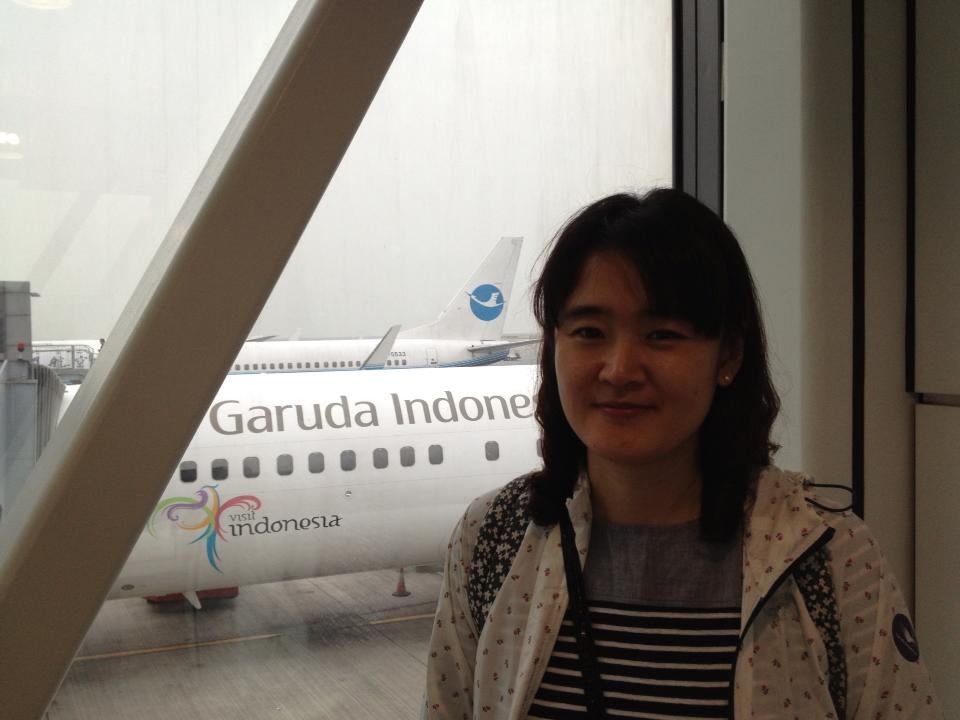
