# 2013년 4월

[← 2013년](README.md)

### 4월 1일 (월) 07:22 · Good morning from Bali, Indonesia.

Good morning from Bali, Indonesia.

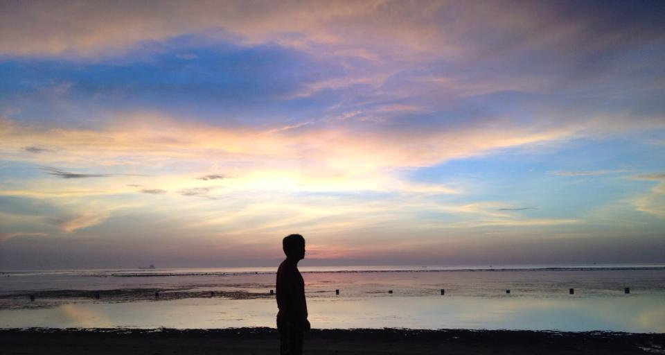
**이미지 캡션:** 해변가에서 석양을 바라보는 성인 남성의 실루엣 사진으로, 남성은 20대 후반에서 30대 초반으로 보이며, 붉은색 상의와 어두운 색 하의를 착용하고 있습니다. 그의 표정은 보이지 않지만, 고개를 살짝 들어 수평선을 응시하는 모습에서 사색에 잠긴 듯한 분위기를 느낄 수 있습니다. 배경은 넓은 바다와 하늘로 이루어져 있으며, 하늘에는 분홍색, 주황색, 파란색이 어우러진 아름다운 노을 구름이 펼쳐져 있습니다. 바다는 잔잔하며, 수평선에는 희미하게 건물이 보이거나, 물 위에 떠 있는 작은 구조물들이 점점이 보입니다. 해변은 어둡게 처리되어 있어 인물과 하늘, 바다에 시선이 집중됩니다. 전체적으로 평화롭고 몽환적인 분위기를 자아내는 풍경 사진입니다.
 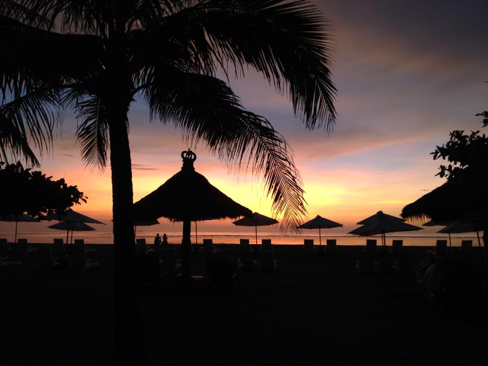
**이미지 캡션:** 해변에서 석양이 지는 아름다운 풍경으로, 실루엣으로 처리된 야자수와 짚으로 만든 파라솔들이 줄지어 서 있습니다. 하늘은 주황색, 분홍색, 보라색이 어우러져 황홀한 색감을 띠고 있으며, 잔잔한 바다가 그 아래 펼쳐져 있습니다. 해변에는 여러 개의 선베드와 파라솔이 놓여 있어 휴식을 취하기 좋은 분위기를 자아냅니다. 멀리 몇몇 사람들이 실루엣으로 보이며, 그들의 모습은 평화로운 해변의 정경과 어우러져 있습니다. 전체적으로 고요하고 낭만적인 분위기를 연출하며, 휴양지의 여유로움을 느낄 수 있습니다.
 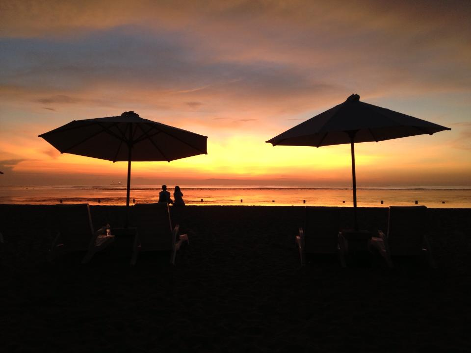
**이미지 캡션:** 해변에서 두 개의 파라솔이 펼쳐져 있고, 그 뒤로 바다와 석양이 보인다. 석양은 주황색, 노란색, 보라색이 어우러져 아름다운 색감을 띠고 있다. 바다 위에는 잔잔한 물결이 일렁이고, 수평선 너머로 희미한 윤곽이 보인다. 해변에는 두 개의 선베드가 놓여 있고, 그 뒤로 두 명의 사람이 실루엣으로 보인다. 한 명은 성인 남성으로 보이며, 다른 한 명은 성인 여성으로 추정된다. 두 사람은 나란히 앉아 석양을 감상하고 있는 듯하다. 전체적으로 평화롭고 낭만적인 분위기를 자아낸다.

### 4월 2일 (화) 15:02 · Look forward to many interesting present…

Look forward to many interesting presentations this year.

🔗 <http://www.slideshare.net/tom.zimmermann/msr-preview-v2>

### 4월 2일 (화) 16:30 · got his first tatoo!

got his first tatoo!

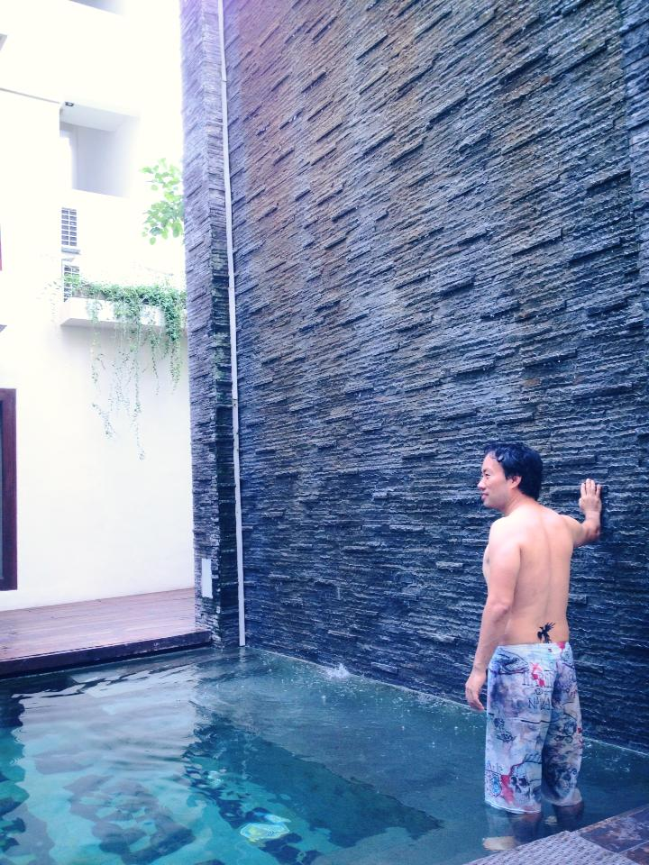
**이미지 캡션:** 한 명의 성인 남성이 수영장 물에 서서 검은색 돌로 된 벽에 등을 기대고 있습니다. 남성은 짧은 검은색 머리카락을 가지고 있으며, 등에는 검은색 문신이 있습니다. 그는 화려한 패턴이 있는 수영복 하의를 입고 있습니다. 남성은 벽을 바라보며 미소를 짓고 있으며, 그의 표정은 편안하고 즐거워 보입니다. 배경에는 하얀색 건물과 녹색 식물이 보이며, 돌 벽에서는 물이 흘러내리고 있습니다. 전체적으로 평화롭고 휴양지 같은 분위기입니다.

### 4월 4일 (목) 22:37 · Feeding fish

📍 Lembongan Island

Feeding fish

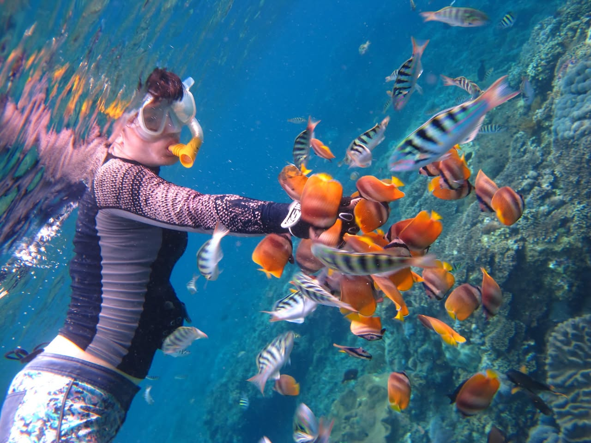
**이미지 캡션:** 수중에서 스노클링을 즐기는 성인 여성으로, 얼굴에는 스노클링 마스크를 착용하고 있으며 노란색 스노클을 입에 물고 있다. 여성은 긴 소매의 래시가드와 무늬가 있는 수영복 하의를 입고 있으며, 오른손을 뻗어 수많은 열대어들에게 먹이를 주고 있다. 주변에는 다양한 종류의 열대어들이 모여 있으며, 특히 주황색과 흰색 줄무늬가 있는 물고기들이 많다. 배경에는 푸른 바닷물과 산호초가 보인다. 여성은 물고기들과 교감하며 즐거워하는 표정으로 보인다. 전체적으로 활기차고 평화로운 수중 생태계의 모습을 담고 있다.
 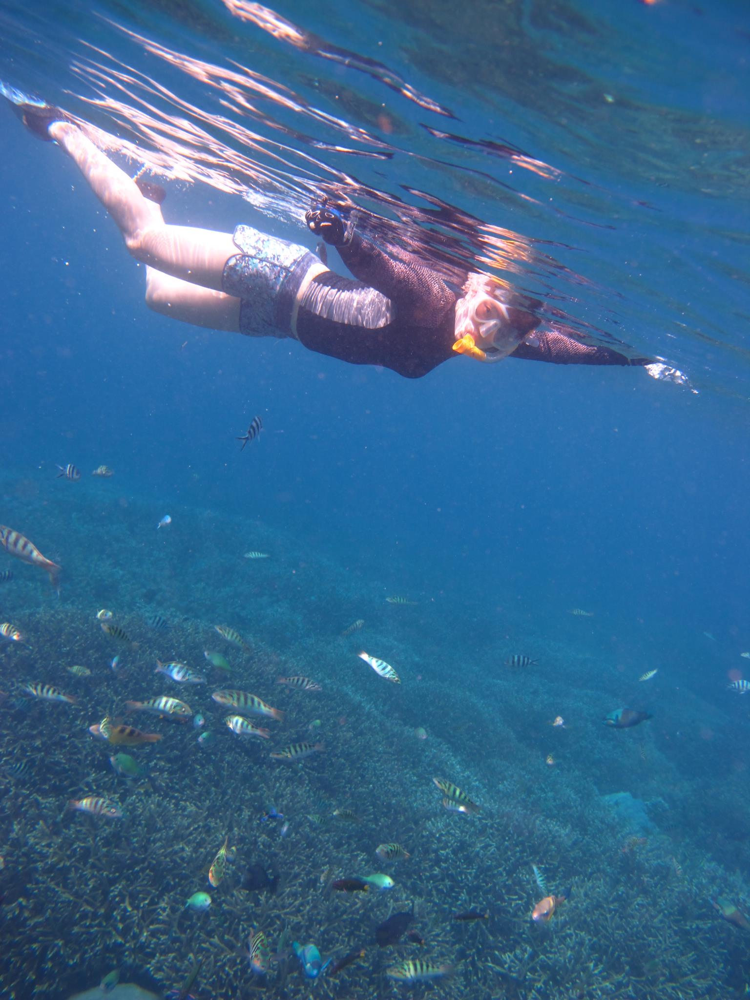
**이미지 캡션:** 수면 아래에서 한 성인 여성이 스노클링을 하고 있으며, 그녀는 얼굴에 스노클링 마스크를 쓰고 입에 오렌지색 스노클을 물고 있다. 그녀는 긴 소매의 짙은 색 상의와 무늬가 있는 반바지를 입고 있으며, 발에는 파란색 지느러미를 착용하고 있다. 그녀는 물속을 헤엄치며 앞으로 나아가고 있으며, 표정은 편안해 보인다. 배경에는 푸른 바닷물과 산호초 군락이 펼쳐져 있으며, 다양한 종류의 작은 물고기들이 산호초 주변을 헤엄치고 있다. 물 표면에는 햇빛이 반사되어 잔잔한 물결이 보인다. 전반적으로 평화롭고 즐거운 해양 활동의 분위기를 나타낸다.
 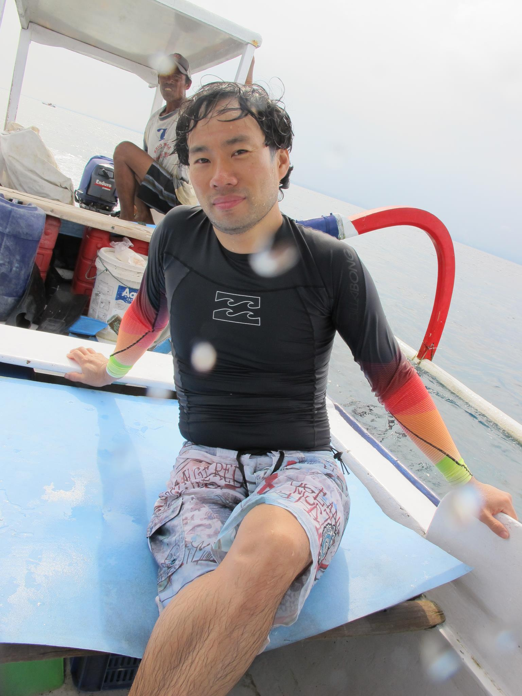
**이미지 캡션:** 한 명의 성인 남성이 보트 앞쪽에 앉아 카메라를 바라보고 있으며, 그의 뒤쪽에는 다른 성인 남성이 앉아 있다. 앞쪽 남성은 30대 후반에서 40대 초반으로 보이며, 검은색 긴팔 래시가드를 입고 있으며 소매 부분에는 빨강, 주황, 노랑, 초록색의 그라데이션이 들어간 디자인이 특징이다. 하의로는 화려한 패턴의 반바지를 입고 있다. 그의 머리카락은 젖어 있고, 표정은 편안하고 약간의 미소를 띠고 있다. 그는 보트의 파란색 좌석에 앉아 있으며, 손은 보트 가장자리에 얹고 있다. 뒤쪽의 남성은 모자를 쓰고 흰색 상의와 줄무늬 반바지를 입고 있으며, 보트의 일부인 엔진이 보인다. 배경은 바다이며, 하늘은 흐린 날씨를 나타낸다. 보트에는 파란색 통과 흰색 양동이 등 몇 가지 물건이 보인다. 전반적으로 야외 활동 중인 편안하고 즐거운 분위기이다.

### 4월 5일 (금) 18:50 · We still could stand up after 14 years o…

We still could stand up after 14 years of our first surfing lesson in Santa Cruz, CA

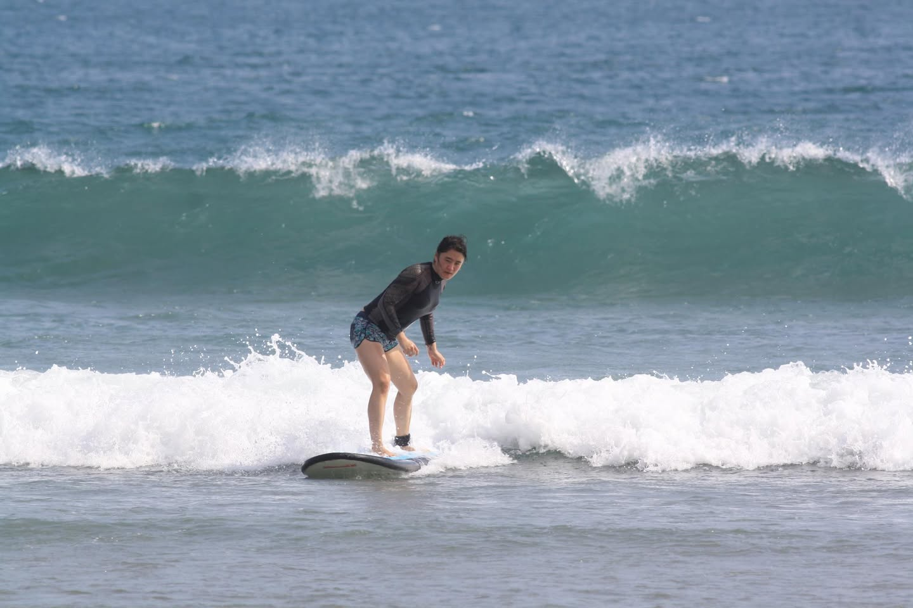
**이미지 캡션:** 푸른 바다 위에서 서핑을 즐기는 젊은 성인 남성이 보인다. 그는 검은색 긴팔 래시가드와 파란색 패턴의 수영복 하의를 입고 있으며, 발목에는 서핑 보드와 연결된 리쉬를 착용하고 있다. 남성은 서핑 보드 위에 균형을 잡고 있으며, 파도를 타는 듯한 자세를 취하고 있다. 그의 얼굴에는 약간의 긴장감과 함께 즐거움이 엿보이며, 시선은 카메라를 향하고 있다. 배경에는 푸른색과 녹색이 섞인 잔잔한 바다와 하얀 포말을 일으키는 파도가 보인다. 전체적으로 맑고 화창한 날씨 속에서 서핑을 즐기는 역동적이고 활기찬 분위기를 느낄 수 있다.
 
**이미지 캡션:** 푸른 바다 위에서 서핑을 즐기는 성인 남성이 보인다. 그는 30대 후반에서 40대 초반으로 보이며, 검은색 긴팔 래시가드 상의와 화려한 패턴의 서핑 반바지를 입고 있다. 래시가드 소매 부분에는 빨강, 주황, 노랑, 초록색의 그라데이션이 들어가 있으며, 팔목에는 녹색 밴드를 착용하고 있다. 반바지에는 파란색과 흰색이 어우러진 추상적인 문양과 함께 일부 글자가 희미하게 보인다. 남성은 서핑보드 위에 서서 카메라를 향해 활짝 웃고 있으며, 얼굴에는 즐거움과 자신감이 넘친다. 그의 머리카락은 젖어 있고, 발목에는 서핑보드와 연결된 리쉬가 보인다. 배경으로는 잔잔하게 파도가 치는 푸른 바다가 펼쳐져 있고, 멀리 해안선과 산이 희미하게 보인다. 하늘은 맑고 구름이 몇 점 떠 있어 화창한 날씨임을 알 수 있다. 전체적으로 활동적이고 즐거운 분위기의 해변 서핑 장면이다.
 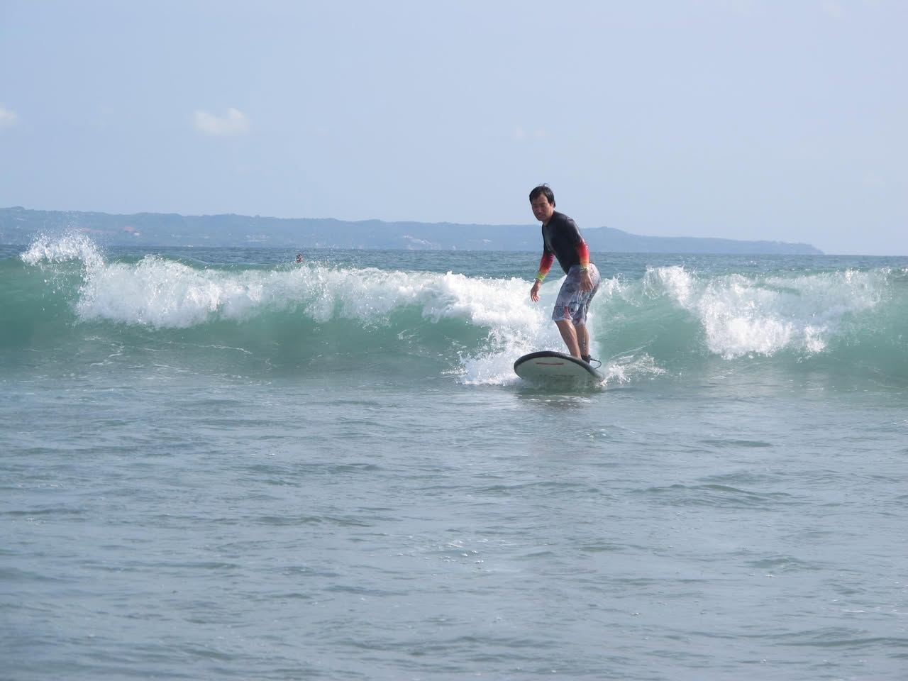
**이미지 캡션:** 푸른 바다 위에서 서핑을 즐기는 성인 남성이 보인다. 그는 30대 후반에서 40대 초반으로 추정되며, 검은색 긴팔 래시가드와 무늬가 있는 반바지를 입고 있다. 얼굴에는 약간의 미소가 번지고 있으며, 균형을 잡으며 파도를 타고 있다. 그의 발밑에는 검은색과 흰색이 섞인 서핑보드가 놓여 있다. 배경에는 부서지는 하얀 파도와 멀리 보이는 해안선, 그리고 옅은 푸른 하늘이 펼쳐져 있다. 전반적으로 맑고 화창한 날씨 속에서 서핑을 즐기는 역동적이고 즐거운 분위기이다.
 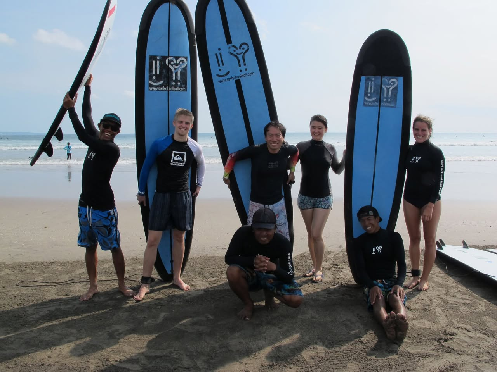
**이미지 캡션:** 해변에서 서핑 강습을 받는 것으로 보이는 일곱 명의 사람들이 서핑보드와 함께 포즈를 취하고 있다. 왼쪽에서부터 성인 남성 한 명이 검은색 래시가드와 파란색 패턴의 서핑 반바지를 입고 선글라스를 낀 채 서핑보드를 머리 위로 들고 있다. 그 옆에는 흰색과 파란색이 섞인 래시가드와 줄무늬 서핑 반바지를 입은 젊은 성인 남성이 서 있다. 그 뒤로는 검은색 래시가드와 짧은 바지를 입은 성인 남성이 서 있고, 그 옆에는 검은색 래시가드와 패턴이 있는 짧은 바지를 입은 젊은 성인 여성이 서 있다. 가장 오른쪽에는 검은색 수영복을 입은 젊은 성인 여성이 서 있다. 사진 중앙에는 검은색 래시가드와 파란색 패턴의 서핑 반바지를 입은 성인 남성이 앉아 있고, 그 앞에는 검은색 래시가드와 파란색 패턴의 서핑 반바지를 입은 성인 남성이 쪼그려 앉아 있다. 모든 서핑보드는 파란색이며, 일부에는 "www.surfschoolbali.com"이라는 웹사이트 주소와 함께 로고가 새겨져 있다. 배경에는 잔잔한 바다와 맑은 하늘이 보이며, 해변은 모래로 덮여 있다. 전체적으로 즐겁고 활동적인 분위기이다.

### 4월 9일 (화) 18:56 · is ready to have more seminars in his ro…

is ready to have more seminars in his room. :-)

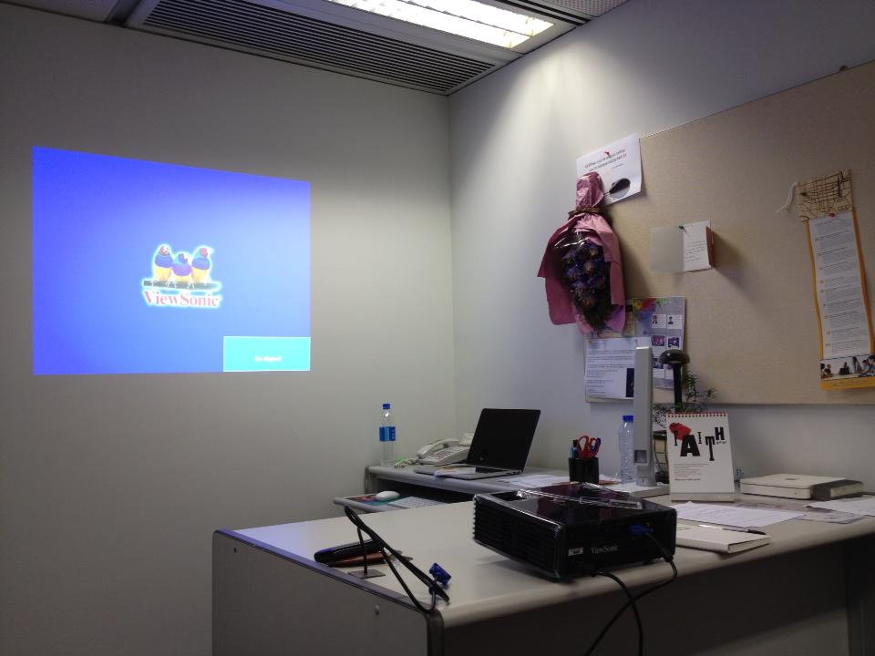
**이미지 캡션:** 이 사진은 사무실의 한 코너를 보여주며, 벽에 프로젝터 화면이 비춰지고 있습니다. 화면에는 파란색 배경에 ViewSonic 로고와 함께 세 마리의 귀여운 새 그림이 있고, "View Some"이라는 글자가 보입니다. 화면 오른쪽 하단에는 "Go Skipped"라는 버튼이 있습니다. 벽에는 코르크 보드가 걸려 있고, 그 위에는 꽃다발, 포스터, 메모 등이 붙어 있습니다. 책상 위에는 노트북, 전화기, 필기구, 물병, 그리고 검은색 프로젝터가 놓여 있습니다. 프로젝터 화면은 밝고 선명하며, 전체적으로 차분하고 업무적인 분위기를 풍깁니다.

### 4월 16일 (화) 16:01 · Sung Kim shared a Page.

🔗 <facebook.com>

### 4월 23일 (화) 09:33 · 📷 앨범: Profile pictures (1장)

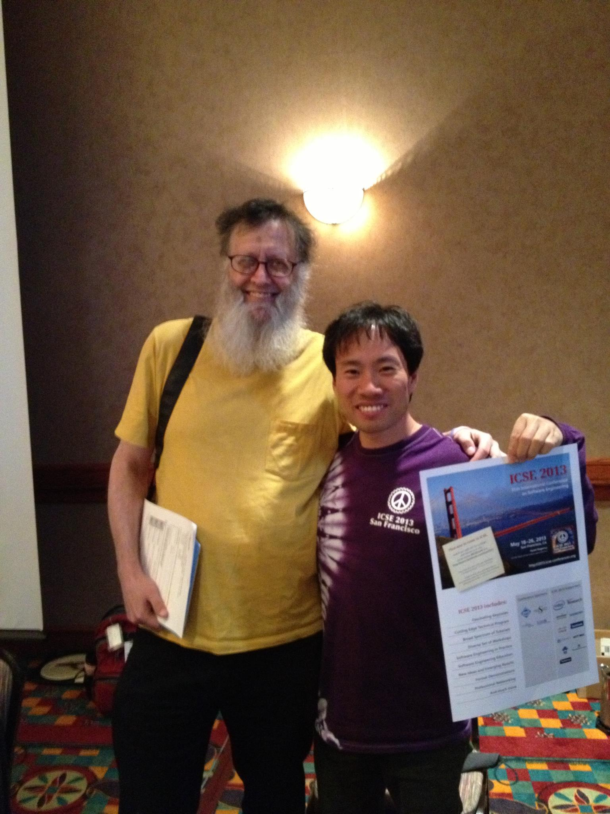
**이미지 캡션:** 두 명의 남성이 실내에서 함께 서서 사진을 찍고 있다. 왼쪽 남성은 50대 이상으로 보이는 백인 남성으로, 덥수룩한 흰색 수염과 안경을 착용하고 노란색 티셔츠와 검은색 바지를 입고 있다. 그는 서류를 들고 있으며, 어깨에는 검은색 가방을 메고 있다. 오른쪽 남성은 20대 후반에서 30대 초반으로 보이는 동양인 남성으로, 보라색 티셔츠와 어두운 색 바지를 입고 있다. 그는 "ICSE 2013 San Francisco"라고 적힌 포스터를 들고 있으며, 두 사람 모두 밝게 웃고 있다. 배경에는 갈색 벽과 천장에 달린 조명이 보인다. 바닥에는 다채로운 패턴의 카펫이 깔려 있으며, 테이블 위에는 상자들이 놓여 있다. 전반적으로 학회나 컨퍼런스에서 찍은 듯한 분위기이다.

> We will miss you a lot. RIP, David Notkin.

### 4월 24일 (수) 09:59 · 📷 앨범: Profile pictures (1장)

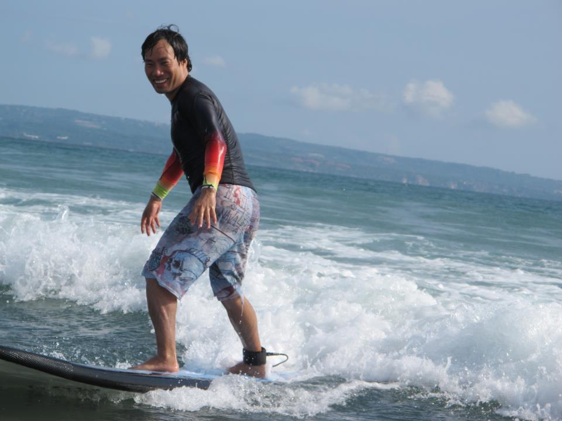
**이미지 캡션:** 한 명의 성인 남성이 서핑보드를 타고 파도를 타고 있다. 남성은 30대 후반에서 40대 초반으로 보이며, 검은색 긴팔 래시가드와 화려한 무늬의 서핑 반바지를 입고 있다. 래시가드의 소매 부분에는 빨강, 주황, 노랑색의 그라데이션이 들어가 있다. 남성은 환하게 웃으며 카메라를 바라보고 있으며, 서핑보드 위에 균형을 잡고 서 있는 모습이다. 발목에는 서핑 리쉬가 채워져 있다. 배경에는 푸른 바다와 잔잔한 파도가 보이며, 멀리 해안선과 산이 희미하게 보인다. 하늘에는 구름이 몇 점 떠 있다. 전반적으로 맑고 화창한 날씨 속에서 서핑을 즐기는 즐겁고 역동적인 분위기이다.
