# 2013년 5월

[← 2013년](README.md)

### 5월 3일 (금) 08:41 · Good morning from mountain-view hammock!…

Good morning from mountain-view hammock! :-)

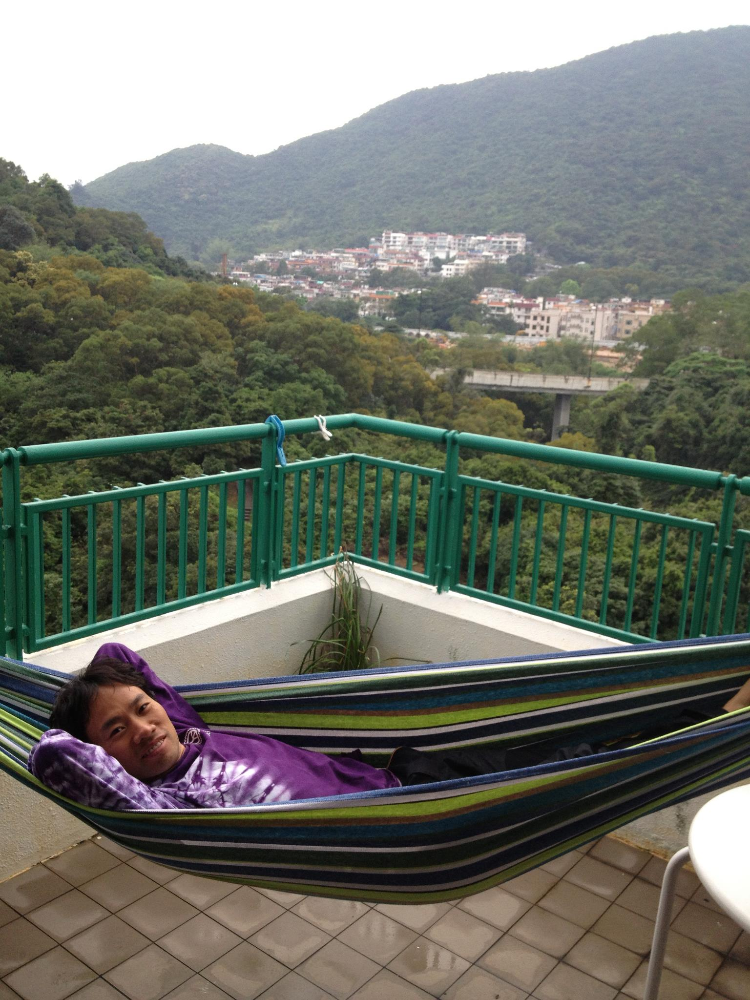
**이미지 캡션:** 한 명의 성인 남성이 줄무늬 해먹에 누워 휴식을 취하고 있으며, 그의 머리는 해먹의 한쪽 끝에 놓여 있고 팔은 머리 뒤로 꼬고 있다. 그는 보라색 후드티를 입고 있으며, 그의 얼굴에는 편안하고 약간의 미소가 엿보인다. 배경에는 울창한 녹색 숲과 언덕에 자리 잡은 주택 단지가 보이며, 흐린 하늘 아래 산이 웅장하게 펼쳐져 있다. 해먹은 녹색 난간이 있는 발코니에 걸려 있으며, 발코니 바닥은 타일로 되어 있다. 전반적으로 평화롭고 여유로운 분위기를 자아낸다.

### 5월 4일 (토) 23:42 · Music makes me stronger in the  water. :…

Music makes me stronger in the  water. :-)

**이미지 캡션:** 이 사진은 수영장이나 샤워실로 보이는 장소에서 촬영된 것으로, 성인 남성이 수영 고글과 귀마개를 착용한 채 카메라를 응시하고 있다. 남성은 20대 후반에서 30대 초반으로 추정되며, 짧은 검은색 머리카락은 물에 젖어 있고 얼굴과 목, 어깨에는 물방울이 맺혀 있다. 남성은 무표정하며, 약간 위쪽을 바라보고 있다. 배경에는 회색 타일 벽과 환풍구, 그리고 눈 그림이 그려진 작은 표지판이 보인다. 표지판에는 중국어로 "請勿嬉戲打鬧"라고 쓰여 있으며, 이는 "뛰거나 장난치지 마시오"라는 뜻으로 해석된다. 전체적으로 습하고 물기가 많은 환경임을 알 수 있으며, 남성은 수영을 마친 직후이거나 샤워를 하기 전의 모습으로 보인다.

### 5월 5일 (일) 10:19 · enjoyed the Lantau hiking trail (1381 cl…

enjoyed the Lantau hiking trail (1381 climb). It's so beautiful!!

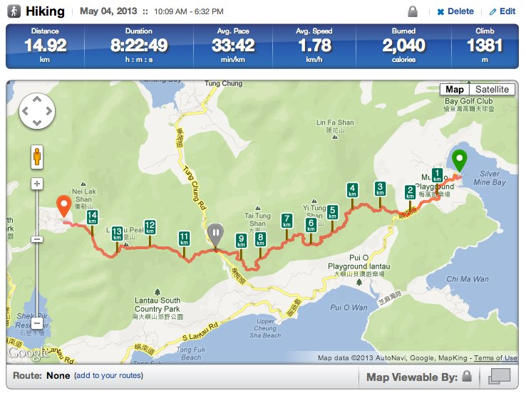
**이미지 캡션:** 이 이미지는 2013년 5월 4일 오전 10시 9분부터 오후 6시 32분까지 진행된 하이킹 활동을 기록한 화면을 보여줍니다. 화면 상단에는 총 거리 14.92km, 소요 시간 8시간 22분 49초, 평균 페이스 33분 42초/km, 평균 속도 1.78km/h, 소모 칼로리 2,040kcal, 총 등반 고도 1,381m와 같은 하이킹 통계가 표시됩니다. 화면 중앙에는 홍콩 란타우 섬의 지도가 표시되어 있으며, 빨간색 선으로 하이킹 경로가 표시되어 있습니다. 경로에는 1km부터 14km까지 구간별 거리가 표시된 녹색 마커들이 있습니다. 지도에는 Tung Chung, Silver Mine Bay, Lantau South Country Park, Pui O Wan 등 지명과 함께 Bay Golf Club, Playground, Tong Fuk Beach와 같은 장소들이 표시되어 있습니다. 지도 왼쪽에는 확대/축소 및 현재 위치로 이동하는 컨트롤 버튼들이 있습니다. 하단에는 "Route: None (add to your routes)"라는 텍스트와 함께 "Map Viewable By:"라는 문구가 보입니다. 전반적으로 활동적인 야외 활동 기록 화면으로, 정보 전달에 초점을 맞춘 인터페이스입니다.
 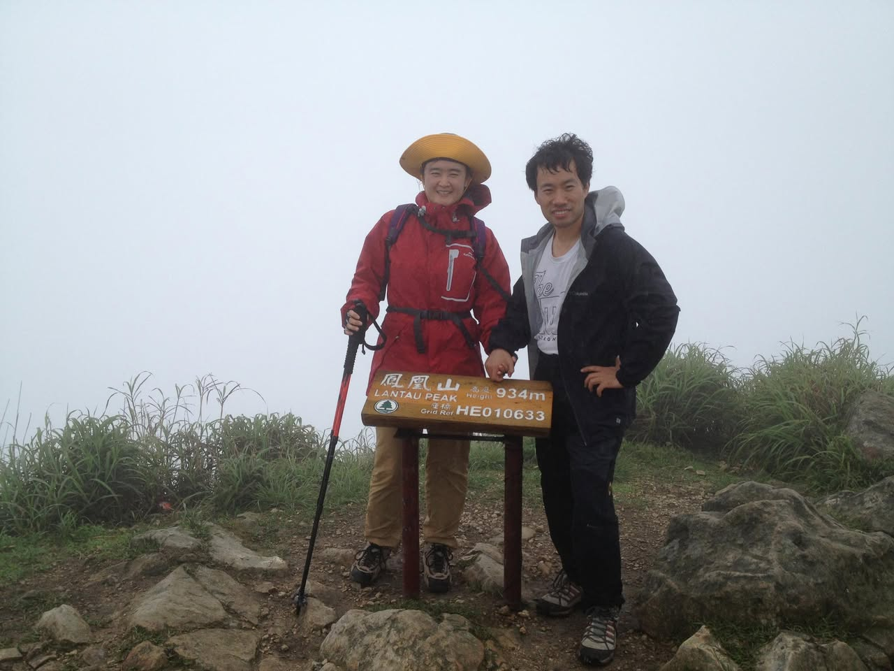
**이미지 캡션:** 안개가 자욱한 산 정상에서 두 명의 등산객이 기념 사진을 찍고 있다. 왼쪽에는 노란색 모자를 쓰고 빨간색 방수 재킷과 갈색 바지를 입은 성인 여성이 등산 스틱을 짚고 서 있다. 그녀는 약간 미소를 짓고 있다. 오른쪽에는 검은색 방수 재킷과 검은색 바지를 입은 성인 남성이 서 있으며, 흰색 티셔츠를 입고 있다. 그는 한 손을 허리에 얹고 카메라를 보며 미소를 짓고 있다. 두 사람 뒤에는 "鳳凰山 LANTAU PEAK Height 934m Grid Ref HE010633"이라고 적힌 표지판이 있다. 배경에는 짙은 안개와 함께 풀과 바위가 보인다. 전반적으로 등반의 성취감과 자연의 신비로움을 느끼게 하는 분위기이다.
 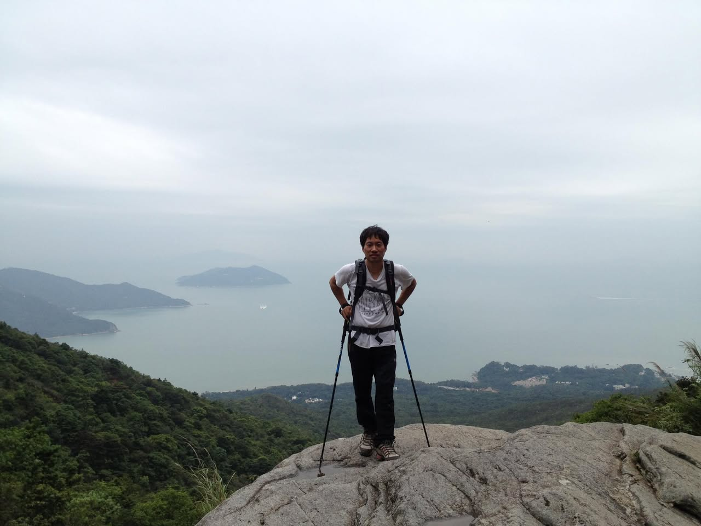
**이미지 캡션:** 흐린 날씨에 산 정상 바위 위에 서 있는 젊은 성인 남성이 보인다. 그는 검은색 등산 바지와 흰색 반팔 티셔츠를 입고 있으며, 티셔츠에는 영어 문구가 적혀 있다. 등에는 검은색 배낭을 메고 있으며, 양손에는 파란색과 검은색 등산 스틱을 쥐고 있다. 남성은 카메라를 정면으로 바라보며 약간의 미소를 띠고 있으며, 그의 표정은 편안하고 자신감 있어 보인다. 배경으로는 푸른 바다와 여러 개의 섬, 그리고 울창한 녹색 숲이 펼쳐져 있다. 바다 위에는 작은 배 한 척이 보인다. 전체적으로 평화롭고 웅장한 자연 풍경 속에서 등산을 즐기는 사람의 모습을 담은 사진이다.
 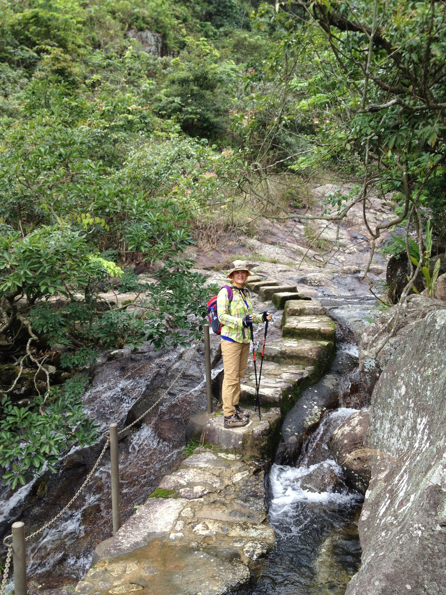
**이미지 캡션:** 한 명의 성인 여성이 등산로를 따라 걷고 있으며, 그녀는 챙이 넓은 모자를 쓰고 밝은 색상의 긴팔 셔츠와 베이지색 바지를 입고 있으며, 등에는 빨간색과 파란색 배낭을 메고 있습니다. 그녀는 양손에 등산 스틱을 쥐고 있으며, 표정은 편안하고 자연스러워 보입니다. 그녀는 돌로 만들어진 계단식 등산로 위에 서 있는데, 이 등산로는 옆으로 흐르는 작은 폭포와 계곡을 따라 이어집니다. 주변은 울창한 녹색 식물과 나무로 둘러싸여 있으며, 바위와 흙으로 이루어진 자연적인 지형이 특징입니다. 등산로 옆에는 쇠사슬로 된 난간이 설치되어 있어 안전을 돕고 있습니다. 전체적으로 평화롭고 자연 친화적인 분위기이며, 등산을 즐기는 한 사람의 모습을 담고 있습니다.

### 5월 11일 (토) 06:47 · Good morning! Fog, cloud, mountains, oce…

Good morning! Fog, cloud, mountains, ocean, sky, they are all beautiful!!

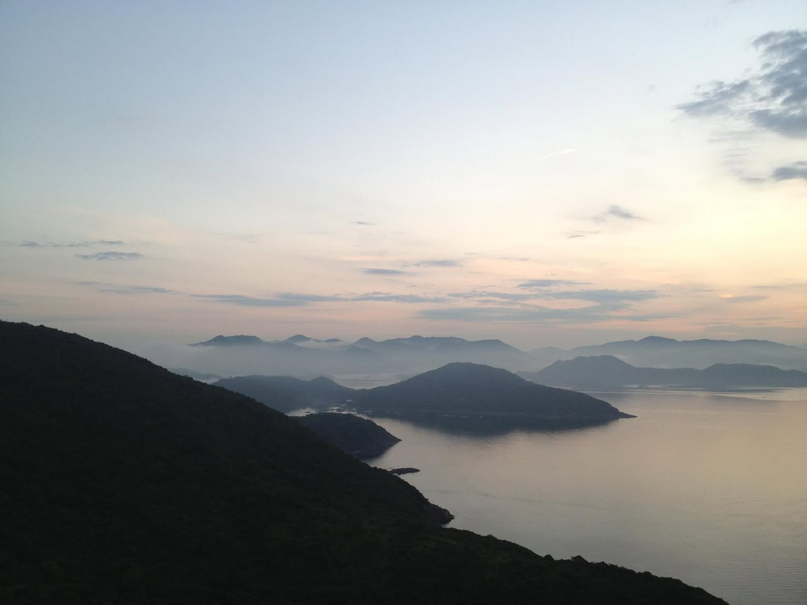
**이미지 캡션:** 이 사진은 해가 뜨기 전이나 지기 전의 고요한 풍경을 담고 있습니다. 전경에는 어두운 색의 산이 비스듬하게 펼쳐져 있으며, 그 너머로는 잔잔한 바다가 보입니다. 바다 위에는 여러 개의 섬들이 안개에 싸여 몽환적인 분위기를 자아내고 있으며, 멀리 보이는 산등성이들은 옅은 푸른색과 보라색으로 물들어 있습니다. 하늘은 옅은 파란색에서 시작하여 분홍색과 주황색이 섞인 부드러운 색조로 변해가고 있으며, 구름은 옅게 퍼져 있습니다. 사진에는 사람이 보이지 않으며, 텍스트도 없습니다. 전체적으로 평화롭고 신비로운 자연의 아름다움을 느낄 수 있는 풍경 사진입니다.

### 5월 20일 (월) 15:05 · It is wonderfully done! MSR 2013 closing…

It is wonderfully done! MSR 2013 closing session with Thomas Zimmermann and Max.

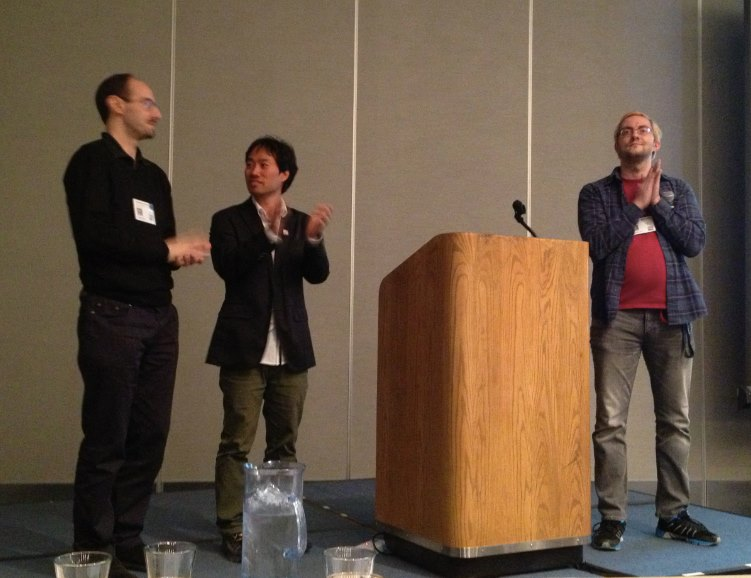
**이미지 캡션:** 세 명의 성인 남성이 무대 위에서 박수를 치고 있으며, 한 명은 연단 뒤에 서 있고 다른 두 명은 연단 앞에 서 있다. 왼쪽 남성은 검은색 긴팔 셔츠와 어두운 색 바지를 입고 있으며, 가슴에는 흰색 명찰을 달고 있다. 그는 안경을 쓰고 있으며, 얼굴은 약간 옆을 향하고 있다. 가운데 남성은 검은색 재킷과 흰색 셔츠, 카키색 바지를 입고 있으며, 얼굴은 왼쪽을 향하고 있다. 오른쪽 남성은 파란색과 빨간색 체크무늬 셔츠 위에 빨간색 티셔츠를 입고 있으며, 회색 바지와 운동화를 신고 있다. 그는 안경을 쓰고 있으며, 얼굴은 위를 향하고 있다. 배경에는 회색 벽과 나무 재질의 연단이 보인다. 연단 앞에는 물이 담긴 투명한 물병과 몇 개의 컵이 놓여 있다. 전체적으로 행사의 일부로 보이는 상황이며, 긍정적이고 축하하는 분위기이다.

### 5월 21일 (화) 10:23 · enjoyed fun and beautiful cycling

enjoyed fun and beautiful cycling

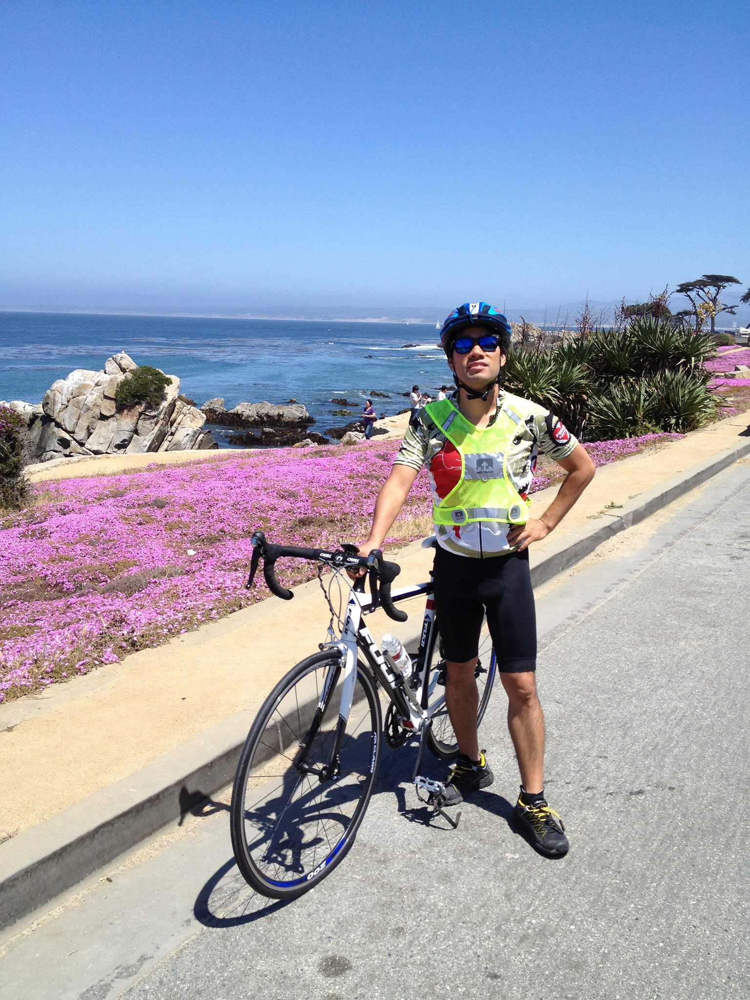
**이미지 캡션:** 푸른 하늘 아래, 한 성인 남성이 자전거 옆에 서서 카메라를 바라보고 있다. 남성은 30대 초중반으로 보이며, 짧은 검은 머리에 선글라스를 착용하고 있다. 그는 밝은 형광 노란색 조끼와 흰색 바탕에 여러 색상이 섞인 사이클링 저지를 입고 있으며, 검은색 반바지와 노란색 포인트가 있는 검은색 운동화를 신고 있다. 그의 표정은 편안하고 자신감 있어 보이며, 한 손은 허리에 얹고 다른 한 손은 자전거 핸들을 잡고 있다. 배경에는 푸른 바다가 펼쳐져 있고, 해안가를 따라 분홍색 꽃들이 만발해 있다. 바위와 나무들도 보이며, 멀리 희미하게 산이 보인다. 남성이 타고 있는 자전거는 흰색과 검은색이 조화된 로드 바이크이며, 물통이 장착되어 있다. 전반적으로 맑고 화창한 날씨 속에서 즐거운 사이클링을 즐기는 듯한 분위기이다.
 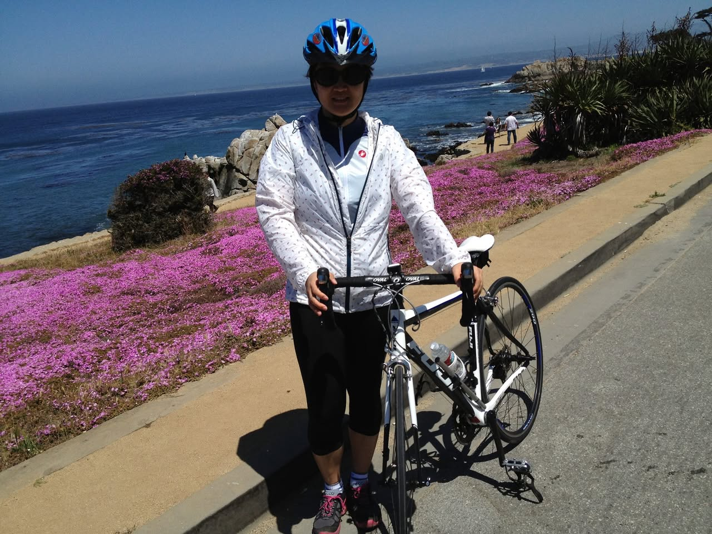
**이미지 캡션:** 푸른 바다와 해안 절벽, 그리고 보라색 꽃으로 뒤덮인 언덕을 배경으로 한 명의 성인 여성이 흰색 자전거를 잡고 서 있습니다. 여성은 파란색 헬멧과 선글라스를 착용하고 있으며, 흰색 바람막이 재킷과 검은색 하의, 그리고 운동화를 신고 있습니다. 그녀는 자전거 핸들을 잡고 있으며, 표정은 사진에 명확하게 드러나지 않지만 편안하고 즐거워 보입니다. 여성 뒤로는 푸른 바다가 펼쳐져 있고, 해안선에는 바위와 무성한 식물들이 보입니다. 언덕에는 보라색 꽃이 만발하여 아름다운 풍경을 연출하고 있습니다. 멀리 해안 도로에는 몇몇 사람들이 자전거를 타거나 걷고 있는 모습도 보입니다. 전반적으로 화창한 날씨 속에서 자전거를 타며 자연을 만끽하는 여유로운 분위기를 느낄 수 있습니다.
 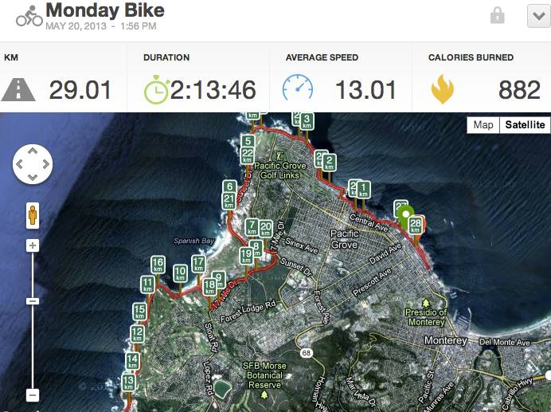
**이미지 캡션:** 이 사진은 자전거 타기 기록을 보여주는 화면으로, 상단에는 "Monday Bike"라는 제목과 함께 2013년 5월 20일 오후 1시 56분이라는 날짜와 시간이 표시되어 있습니다. 그 아래에는 총 거리 29.01km, 소요 시간 2시간 13분 46초, 평균 속도 13.01km, 소모 칼로리 882kcal가 표시되어 있습니다. 화면 하단에는 캘리포니아주 몬터레이 지역의 위성 지도가 표시되어 있으며, 자전거 경로가 빨간색 선으로 표시되어 있고 각 지점마다 거리 표시가 되어 있습니다. 특히 퍼시픽 그로브 골프 링크, 스페니시 베이, 몬터레이 해안가를 따라 자전거를 탄 경로를 확인할 수 있습니다. 지도에는 "Pacific Grove Golf Links", "Spanish Bay", "Presidio of Monterey", "SFB Morse Botanical Reserve" 등의 지명이 보입니다. 화면 왼쪽에는 지도 확대/축소 및 이동을 위한 컨트롤러가 있습니다. 전반적으로 활동적인 야외 활동 기록을 보여주는 화면입니다.

### 5월 25일 (토) 14:33 · SF Giants game after ICSE!

📍 Oracle Park

SF Giants game after ICSE!

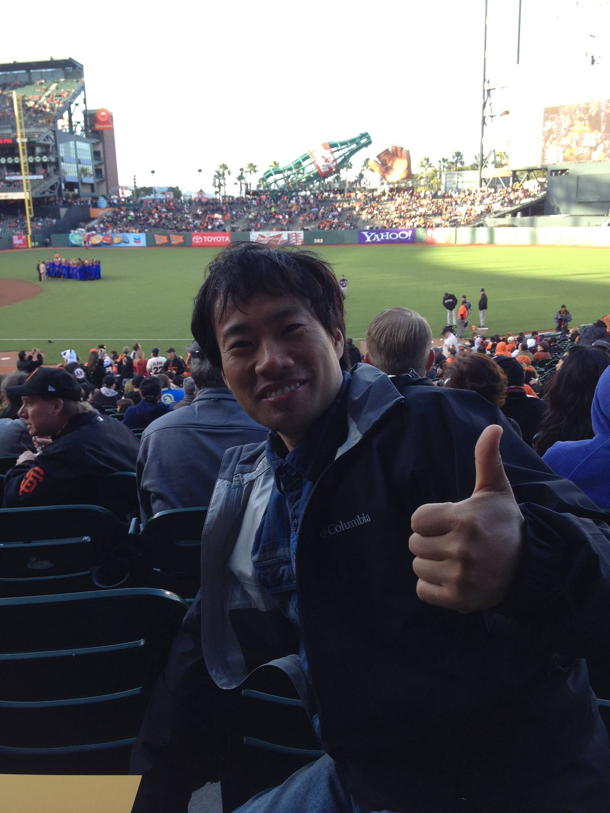
**이미지 캡션:** 이 사진은 야구 경기장에서 촬영된 것으로 보이며, 전경에는 한 명의 성인 남성이 카메라를 향해 엄지손가락을 치켜세우며 환하게 웃고 있다. 그는 검은색 바람막이 재킷을 입고 있으며, 재킷에는 'Columbia'라는 로고가 보인다. 재킷 안에는 청바지 셔츠를 입고 있다. 남성은 30대 후반에서 40대 초반으로 추정되며, 검은색 머리카락을 가지고 있다. 배경에는 야구 경기장이 펼쳐져 있고, 관중석에는 많은 사람들이 앉아 경기를 관람하고 있다. 경기장에는 'TOYOTA'와 'YAHOO!'라는 광고판이 보이며, 녹색의 거대한 병 모양 구조물이 특이하게 설치되어 있다. 하늘은 맑고 밝으며, 전반적으로 즐겁고 활기찬 분위기이다.

### 5월 26일 (일) 01:22 · Congratulations (again) to All Winners o…

Congratulations (again) to All Winners of the ACM SIGSOFT Distinguished Paper Award at ICSE 2013! (picture by the ICSE 2013 team)

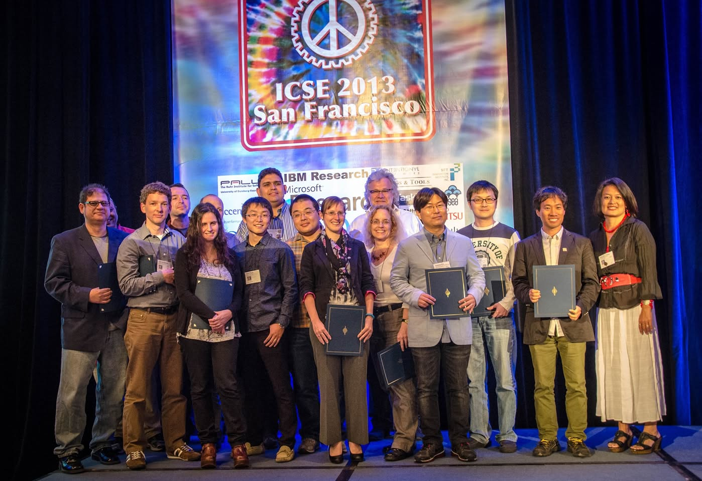
**이미지 캡션:** 무대 위에서 여러 명의 사람들이 단체 사진을 찍고 있으며, 배경에는 "ICSE 2013 San Francisco"라고 적힌 큰 현수막이 걸려 있습니다. 현수막에는 평화 상징이 그려져 있고, 그 아래에는 IBM Research, Microsoft, PALL, MIT 등 여러 후원사의 로고가 보입니다. 사진에는 다양한 연령대의 성인 남성과 여성들이 서 있으며, 대부분은 밝은 표정으로 카메라를 응시하고 있습니다. 일부 사람들은 상장이나 인증서를 들고 있으며, 이는 시상식이나 수료식의 일부임을 시사합니다. 사람들은 비즈니스 캐주얼 복장을 하고 있으며, 전반적으로 축하와 성취의 분위기를 나타냅니다.

### 5월 27일 (월) 02:40 · Random Evolution VS Intelligent Design i…

Random Evolution VS Intelligent Design in automatic program repair: Slides for "Automatic Patch Generation Learned from Human-written Patches" (@ICSE 2013)

http://www.slideshare.net/hunkim/automatic-patch-generation-learned-from-human-written-patches

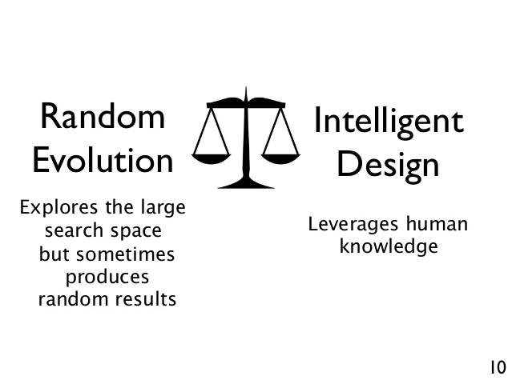
**이미지 캡션:** 이 이미지는 흰색 배경에 두 개의 텍스트 블록과 중앙에 저울 아이콘이 있는 슬라이드입니다. 왼쪽에는 "Random Evolution"이라는 제목과 "Explores the large search space but sometimes produces random results"라는 설명이 있습니다. 오른쪽에는 "Intelligent Design"이라는 제목과 "Leverages human knowledge"라는 설명이 있습니다. 중앙의 저울 아이콘은 두 개념의 균형 또는 대조를 시각적으로 나타냅니다. 이미지의 오른쪽 하단에는 숫자 "10"이 표시되어 있습니다. 이 이미지는 무작위 진화와 지능형 설계를 비교하는 개념을 설명하는 프레젠테이션 슬라이드로 보입니다.

### 5월 27일 (월) 03:31 · It's almost done. I hope. :-)

It's almost done. I hope. :-)

**이미지 캡션:** 이 사진은 회의실이나 로비에 설치된 디지털 디스플레이 화면을 보여주며, 화면에는 "HYATT" 로고와 함께 "35TH INTERNATIONAL CONFERENCE ON SOFTWARE ENGINEERING"이라는 큰 제목이 표시되어 있습니다. 그 아래에는 "ESEC/FSE '13 PROGRAM COMMITTEE MEETING"이라는 부제가 있으며, 회의 시작 시간과 종료 시간을 나타내는 "08:30 AM"과 "06:00 PM"이 명확하게 보입니다. 화면 오른쪽 상단에는 현재 시간으로 보이는 "11:25 AM"이 표시되어 있습니다. 배경은 어두운 파란색 계열의 추상적인 패턴으로 되어 있어 전문적이고 차분한 분위기를 연출합니다. 사진에는 사람이 등장하지 않으며, 텍스트 정보 외에는 특별한 사물도 보이지 않습니다. 전반적으로 전문적인 행사 정보를 전달하는 디지털 안내판의 모습입니다.

### 5월 27일 (월) 15:52 · Wandering around the SF Bay Area by bicy…

Wandering around the SF Bay Area by bicycle today: almost 100km + 1900m climb. It was challenging, but very fun.

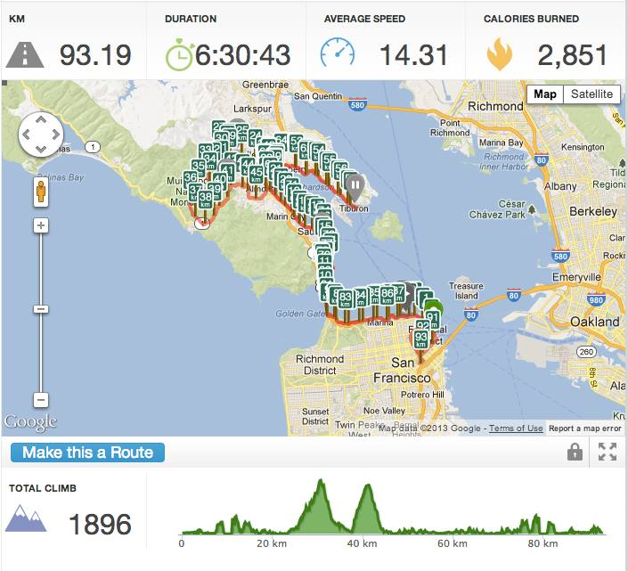
**이미지 캡션:** 이 이미지는 자전거 또는 도보 활동의 요약을 보여주는 화면 캡처입니다. 상단에는 총 거리 93.19km, 총 소요 시간 6시간 30분 43초, 평균 속도 14.31km/h, 소모 칼로리 2,851kcal가 표시됩니다. 중앙에는 샌프란시스코 베이 지역의 지도가 있으며, 녹색 선으로 표시된 활동 경로가 마린 카운티에서 샌프란시스코를 거쳐 오클랜드까지 이어집니다. 경로를 따라 1km 간격으로 숫자가 표시되어 있으며, 일부 구간에는 멈춤 아이콘이 보입니다. 지도 왼쪽에는 확대/축소 컨트롤과 사용자 아이콘이 있습니다. 하단에는 총 상승 고도 1896m를 나타내는 산 모양 아이콘과 함께 고도 그래프가 표시되어 있으며, 그래프는 활동 경로의 고도 변화를 보여줍니다. 전반적으로 활동적인 라이프스타일을 보여주는 데이터 시각화 화면입니다.
 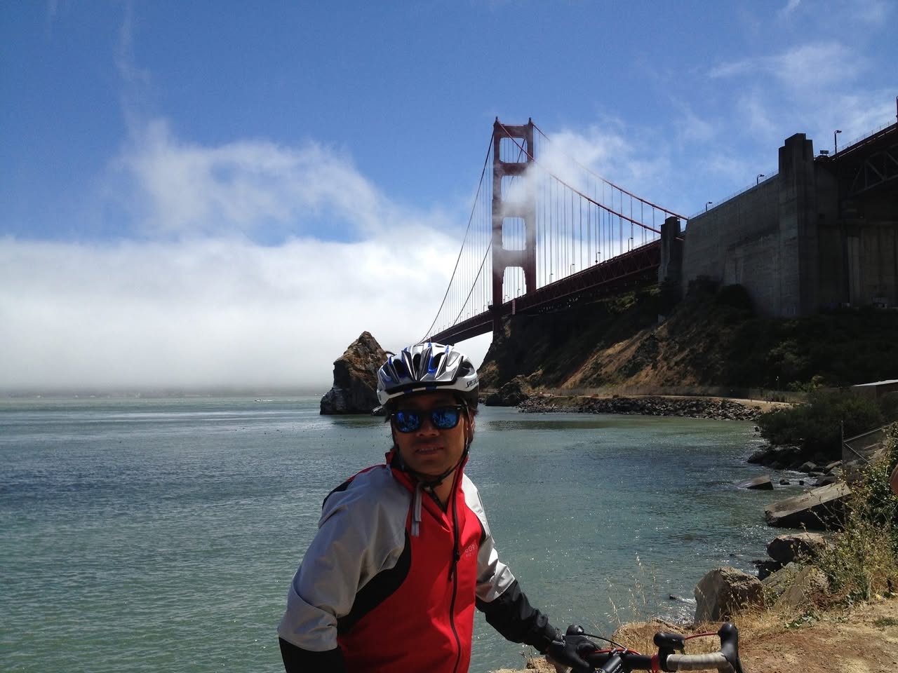
**이미지 캡션:** 사진에는 금문교를 배경으로 자전거를 타는 성인 남성이 담겨 있습니다. 남성은 30대에서 40대로 보이며, 헬멧과 선글라스를 착용하고 있으며, 빨간색과 회색이 섞인 자전거 재킷을 입고 있습니다. 그의 표정은 약간 미소를 띠고 있으며, 카메라를 향해 서 있습니다. 배경에는 웅장한 금문교가 보이고, 다리 주변으로는 안개가 옅게 깔려 신비로운 분위기를 자아냅니다. 다리 아래로는 푸른 바다가 펼쳐져 있고, 해안가에는 바위와 풀이 자라고 있습니다. 전체적으로 맑은 날씨에 자전거를 타며 경치를 즐기는 여유로운 모습이 느껴집니다.
 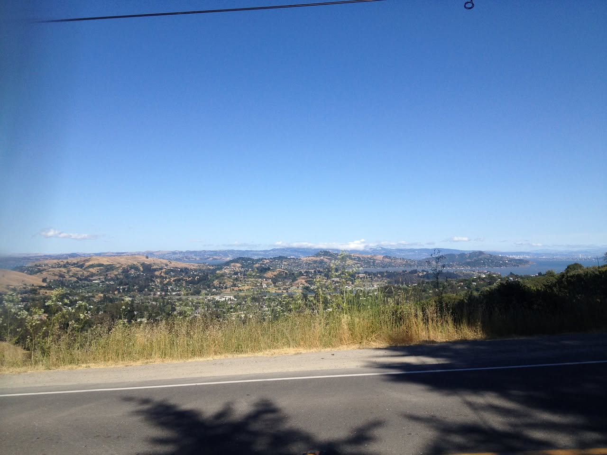
**이미지 캡션:** 맑고 푸른 하늘 아래, 구불구불한 언덕과 녹음이 우거진 숲이 펼쳐진 풍경이 보입니다. 언덕에는 주택들이 듬성듬성 자리 잡고 있으며, 멀리 바다가 보입니다. 사진의 전경에는 흙빛의 도로가 있고, 도로 옆으로는 마른 풀들이 바람에 흔들리고 있습니다. 도로 위에는 나뭇가지 그림자가 드리워져 있습니다. 전체적으로 평화롭고 고요한 분위기를 자아내는 풍경 사진입니다.

### 5월 28일 (화) 01:59 · Leaving San Francisco. I'll miss here

📍 Hyatt Regency San Francisco

Leaving San Francisco. I'll miss here

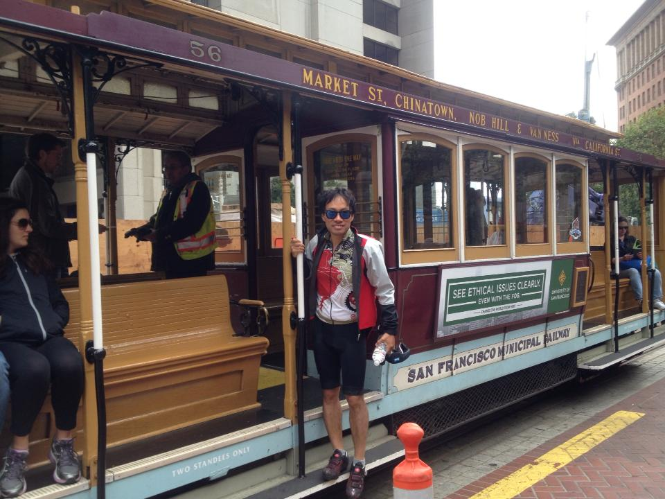
**이미지 캡션:** 샌프란시스코의 명물인 케이블카 앞에서 한 성인 남성이 포즈를 취하고 있다. 그는 40대 정도로 보이며, 선글라스를 끼고 화려한 무늬의 셔츠 위에 빨간색 조끼를 걸치고 검은색 반바지를 입고 있다. 그의 손에는 흰색과 검은색 운동화가 들려 있다. 케이블카에는 'MARKET ST, CHINATOWN, NOB HILL & VAN NESS VIA CALIFORNIA ST'라는 노선 정보와 'SAN FRANCISCO MUNICIPAL RAILWAY'라는 문구가 적혀 있다. 케이블카 안에는 승객으로 보이는 사람들이 앉아 있으며, 운전석에는 안전 조끼를 입은 직원이 서 있다. 배경에는 현대적인 건물들이 보이며, 전체적으로 도시의 활기찬 분위기를 느낄 수 있다.
