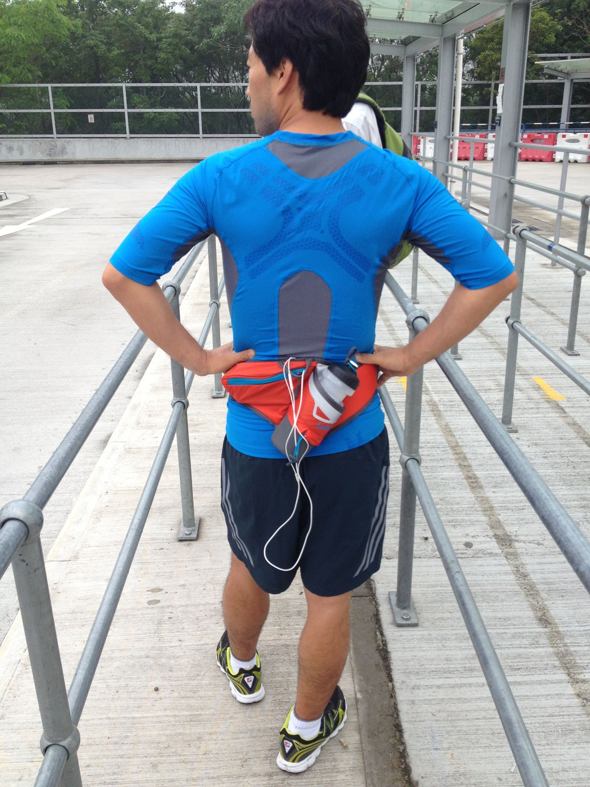
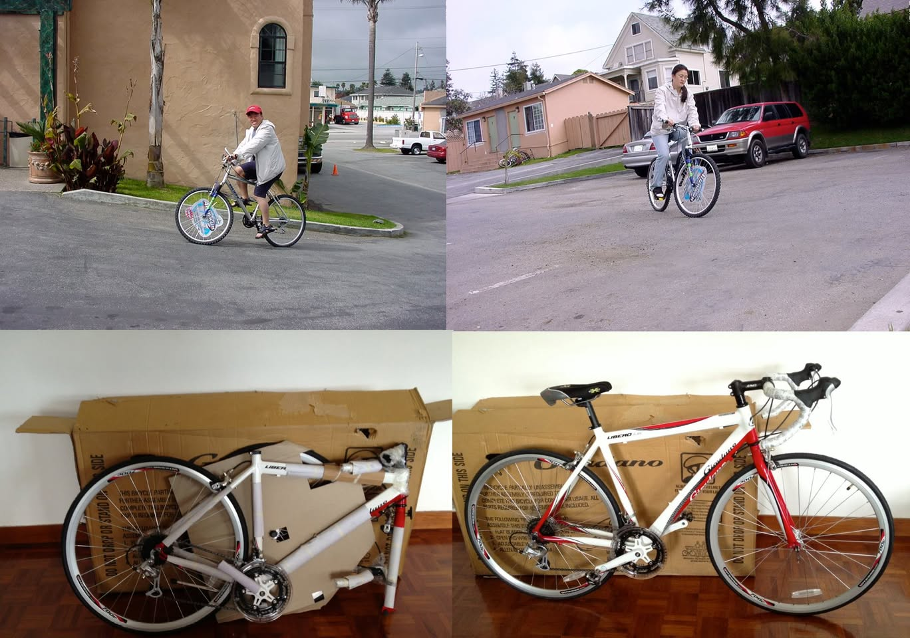
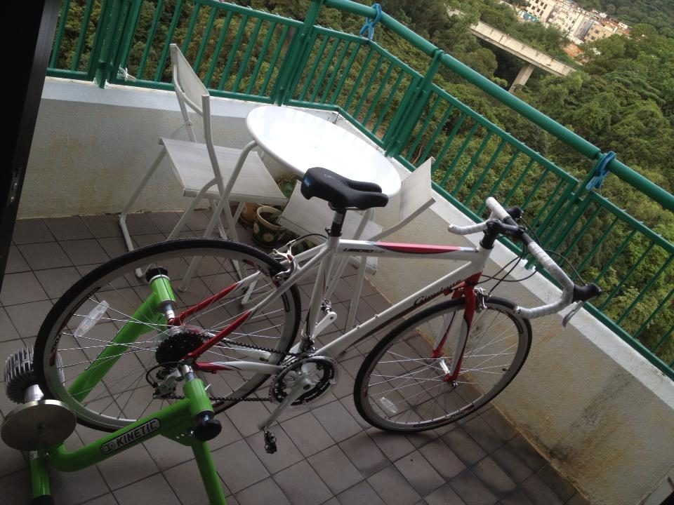
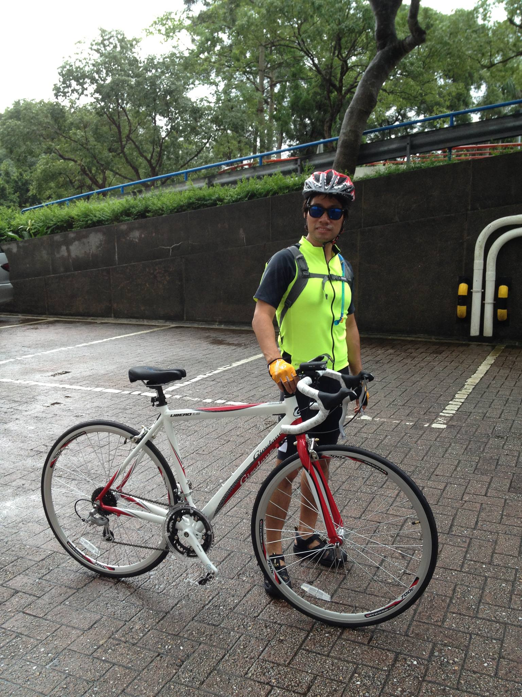
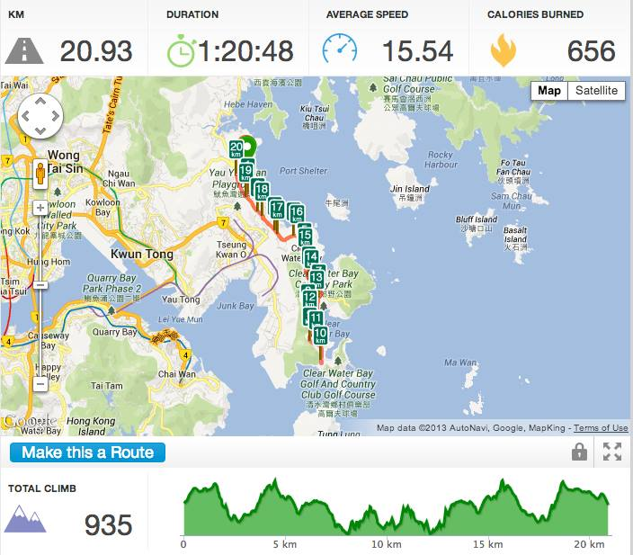

# 2013년 6월

[← 2013년](README.md)

### 6월 4일 (화) 06:17 · ready ro run for a while. :-)

ready ro run for a while. :-)

### 6월 4일 (화) 16:56 · our first bike in US (top) and our first…

our first bike in US (top) and our first bike in HK (bottom).

### 6월 8일 (토) 11:33 · feels cycling on the mountains. :-) Sung…

feels cycling on the mountains. :-) Sung is actually preparing two cycling trips: 660km in Korea and 400km Swiss.

### 6월 9일 (일) 19:05 · enjoyed a quick but fun bike ride with 9…

enjoyed a quick but fun bike ride with 935m climb and spectacular ocean view!

  

> before the ride
> Clear water bay road
> After the ride!

### 6월 9일 (일) 19:12 · Finally we saw the Duck! It's so cute an…

Finally we saw the Duck! It's so cute and popular. 

http://www.rappler.com/world/30943-duck-tops-the-bill-in-farewell-hong-kong-appearance

 

### 6월 20일 (목) 23:26 · Cool! I need to practice this. :-)

Cool! I need to practice this. :-)
