# 2013년 7월

[← 2013년](README.md)

### 7월 8일 (월) 11:22 · finished Korean Cross-country Cycling Ro…

finished Korean Cross-country Cycling Road Tour (635km with 9181m climb). It was really long, but totally awesome! I'll do it again

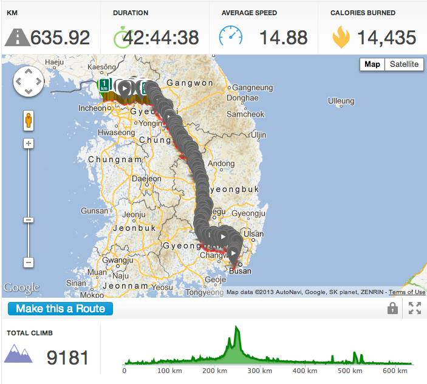
**이미지 캡션:** 이 화면은 자전거 또는 유사한 활동의 경로와 통계를 보여주는 컴퓨터 또는 모바일 기기의 인터페이스입니다. 화면 상단에는 총 이동 거리 635.92km, 총 소요 시간 42시간 44분 38초, 평균 속도 14.88km/h, 소모 칼로리 14,435kcal가 표시됩니다. 중앙에는 대한민국 지도가 표시되어 있으며, 짙은 회색 선으로 표시된 경로가 북쪽에서 시작하여 남쪽으로 이어져 부산 근처에서 끝나는 것을 볼 수 있습니다. 경로 상에는 여러 개의 작은 아이콘이 표시되어 있으며, 이는 특정 지점이나 이벤트(예: 멈춤, 시작, 구간 기록 등)를 나타낼 수 있습니다. 지도에는 서울, 대전, 대구, 부산 등 주요 도시와 강원도, 경상북도, 전라남도 등의 지역명이 표시되어 있습니다. 지도 왼쪽에는 확대/축소 버튼과 함께 사람 모양의 아이콘이 있어 현재 위치나 경로를 표시하는 기능이 있음을 시사합니다. 지도 하단에는 "Make this a Route"라는 버튼이 있으며, 그 아래에는 "TOTAL CLIMB"라는 제목과 함께 9181이라는 숫자가 표시되어 총 상승 고도를 나타냅니다. 가장 아래에는 이동 거리에 따른 고도 변화를 보여주는 그래프가 그려져 있으며, 여러 개의 봉우리가 나타나 오르막 구간이 많았음을 보여줍니다. 전체적으로 활동적인 여정을 기록하고 분석하는 데 사용되는 화면으로 보입니다.
 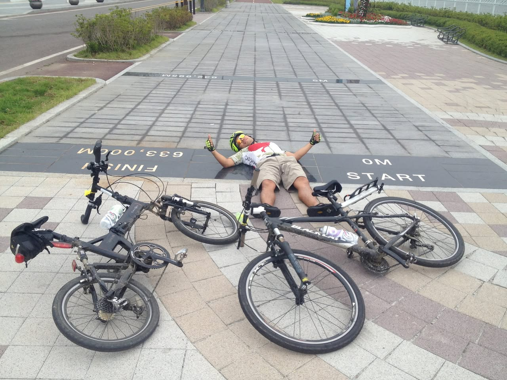
**이미지 캡션:** 한 성인 남성이 자전거 두 대와 함께 바닥에 누워 있다. 남성은 헬멧을 쓰고 있으며, 빨간색과 흰색이 섞인 상의와 베이지색 반바지를 입고 있다. 그는 오른손 엄지를 치켜들고 있으며, 얼굴에는 만족스러운 표정이 엿보인다. 남성 옆에는 두 대의 자전거가 놓여 있는데, 한 대는 접이식 자전거로 보이며 다른 한 대는 일반 산악자전거이다. 자전거에는 물통과 가방이 달려 있다. 배경에는 넓은 보도와 도로가 보이며, 보도에는 "START"와 "FINISH"라고 쓰인 표지판이 있다. 또한 "633.000M"이라는 글자도 보인다. 전반적으로 즐겁고 여유로운 분위기이며, 자전거 여행을 마친 후 휴식을 취하는 모습으로 보인다.
 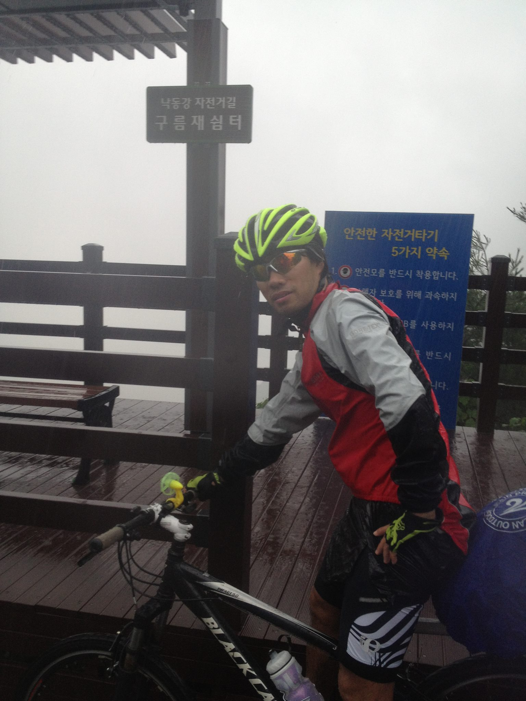
**이미지 캡션:** 한 성인 남성이 헬멧과 고글을 착용하고 자전거 앞에 서 있다. 그는 빨간색과 회색이 섞인 자전거 재킷과 검은색 반바지를 입고 있으며, 손에는 장갑을 끼고 있다. 남성은 카메라를 향해 약간 고개를 돌리고 있으며, 그의 표정은 무표정하다. 배경에는 '낙동강 자전거길 구름재 쉼터'라고 적힌 표지판과 '안전한 자전거 타기 5가지 약속'이라는 글자가 적힌 파란색 안내판이 보인다. 또한, 나무로 된 벤치와 덱이 있으며, 바닥은 비에 젖어 있다. 전체적으로 흐린 날씨에 자전거를 타는 상황으로 보인다.

### 7월 10일 (수) 10:55 · "BICYCLE TYPOGRAM Ride...ride...ride."

"BICYCLE TYPOGRAM Ride...ride...ride."

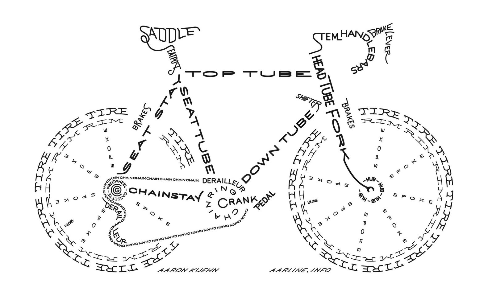
**이미지 캡션:** 이 그림은 자전거의 각 부품 이름을 활용하여 자전거의 형태를 그린 아트워크입니다. 사람이나 배경은 보이지 않으며, 오직 흰색 배경에 검은색 글씨로만 이루어진 자전거 그림입니다. 자전거의 안장 부분은 'SADDLE'이라는 글자로, 탑 튜브는 'TOP TUBE'라는 글자로, 헤드 튜브와 포크는 'HEAD TUBE FORK'라는 글자로, 다운 튜브는 'DOWN TUBE'라는 글자로, 시트 튜브는 'SEAT TUBE'라는 글자로, 체인 스테이는 'CHAINSTAY'라는 글자로 표현되었습니다. 앞바퀴와 뒷바퀴는 'TIRE', 'RIM', 'SPOKE', 'HUB', 'VALVE' 등의 단어들이 원형으로 배치되어 바퀴의 형태를 이루고 있으며, 특히 뒷바퀴 쪽에는 'CHAIN', 'FREEWHEEL', 'CASSETTE', 'DERAILLEUR', 'CRANK', 'PEDAL' 등의 구동계 부품 이름들이 복잡하게 얽혀 있습니다. 핸들바는 'STEM', 'HANDLEBARS', 'BRAKE LEVER' 등의 단어로, 브레이크는 'BRAKES'라는 단어로 표현되었습니다. 그림 하단에는 작가의 이름으로 추정되는 'AARON KUEHN'과 웹사이트 주소로 보이는 'AARLINE.INFO'가 기재되어 있습니다. 전체적으로 흑백의 모노톤으로 구성되어 있으며, 글자만으로 자전거의 구조를 섬세하게 표현한 독특하고 창의적인 분위기를 자아냅니다.

### 7월 17일 (수) 13:43 · Good morning from Lugano, Swiss! It's a …

Good morning from Lugano, Swiss! It's a really beautiful place. Love to run more here.

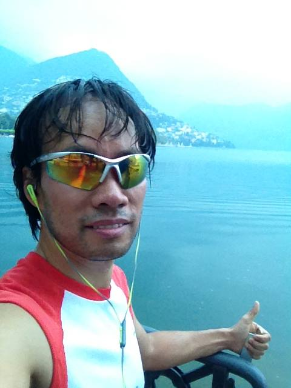
**이미지 캡션:** 이 사진은 푸른 호수와 산을 배경으로 셀카를 찍고 있는 성인 남성을 보여줍니다. 남성은 30대 후반에서 40대 초반으로 보이며, 검은색 머리카락에 스포츠 선글라스를 착용하고 있습니다. 선글라스 렌즈에는 주변 풍경이 반사되어 보입니다. 귀에는 노란색 이어폰을 끼고 있으며, 빨간색과 흰색이 배색된 민소매 상의를 입고 있습니다. 그의 표정은 미소를 띠고 있으며, 오른손으로는 엄지손가락을 치켜세우고 있습니다. 배경에는 넓고 푸른 호수가 펼쳐져 있고, 그 너머로는 산과 함께 작은 마을이 희미하게 보입니다. 전체적으로 야외 활동 중 긍정적이고 활기찬 분위기를 나타냅니다.
 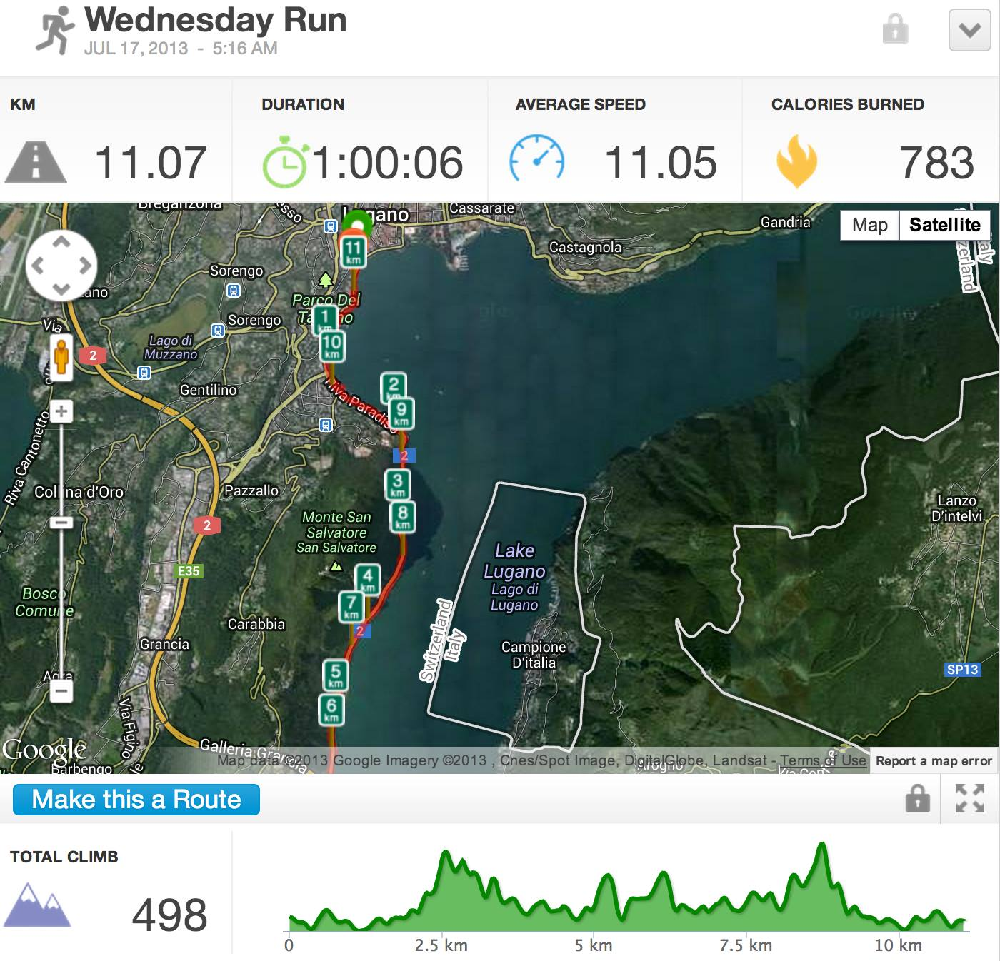
**이미지 캡션:** 이 사진은 "Wednesday Run"이라는 제목의 운동 기록 화면을 보여줍니다. 화면 상단에는 운동 날짜와 시간이 "JUL 17, 2013 - 5:16 AM"으로 표시되어 있습니다. 운동의 주요 정보가 네 개의 섹션으로 나뉘어 표시되는데, 왼쪽부터 "KM" 11.07, "DURATION" 1:00:06, "AVERAGE SPEED" 11.05, "CALORIES BURNED" 783입니다. 이 정보들은 각각 아이콘과 함께 표시되어 있습니다. 화면 중앙에는 운동 경로를 보여주는 지도가 펼쳐져 있습니다. 이 지도는 위성 사진과 도로 정보가 결합된 형태로, 이탈리아와 스위스 국경에 걸쳐 있는 루가노 호수(Lake Lugano) 주변 지역을 보여줍니다. 지도 위에는 빨간색 선으로 운동 경로가 표시되어 있으며, 경로 상에는 1km부터 11km까지 구간별 거리가 표시된 마커들이 있습니다. "Parco Del"이라는 표지판과 "Monte San Salvatore", "San Salvatore"와 같은 지명들이 보입니다. 또한 "Switzerland Italy"라는 글씨와 함께 국경선이 표시되어 있습니다. 지도 하단에는 "Map data ©2013 Google Imagery ©2013, Cnes/Spot Image, DigitalGlobe, Landsat - Terms of Use Report a map error"라는 저작권 정보가 있습니다. 지도 아래에는 "Make this a Route"라는 파란색 버튼이 있습니다. 화면 하단에는 "TOTAL CLIMB"이라는 제목과 함께 498이라는 수치가 표시되어 있으며, 그 옆에는 운동 중 고도 변화를 나타내는 녹색 그래프가 그려져 있습니다. 그래프는 0km부터 10km까지의 거리에 따른 고도 변화를 보여주며, 여러 번의 오르막과 내리막이 반복되는 형태입니다. 사진에는 사람이 직접적으로 등장하지는 않지만, 운동 기록을 보여주는 화면 자체를 통해 누군가가 이 운동을 수행했음을 알 수 있습니다. 전반적으로 운동 기록을 확인하고 분석하는 데 사용되는 인터페이스 화면으로, 활동적인 분위기를 나타냅니다.
 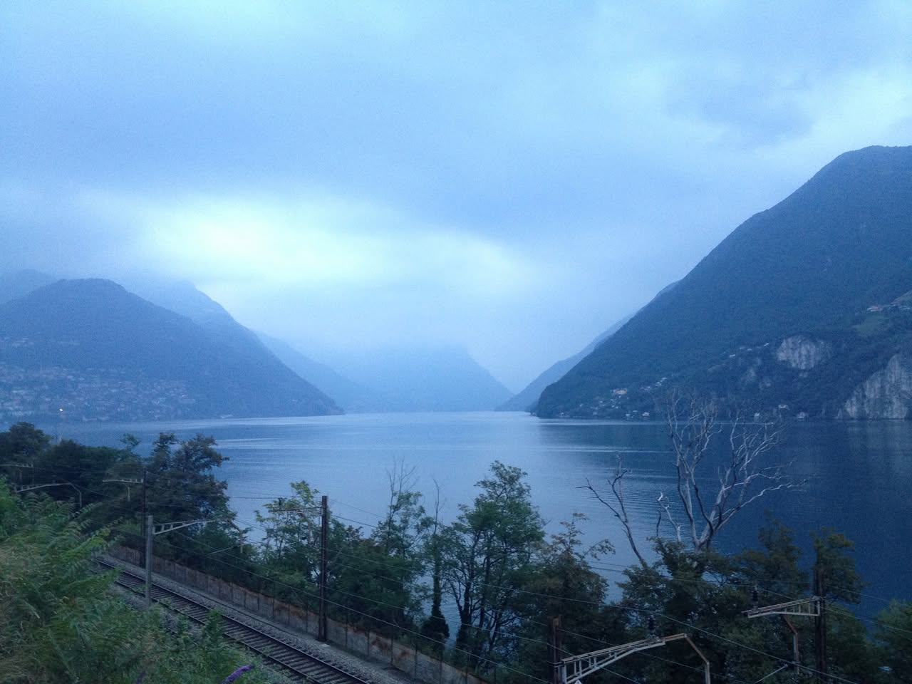
**이미지 캡션:** 흐린 날씨 속에서 산과 호수가 어우러진 풍경을 담은 사진으로, 사진에는 사람이 보이지 않으며, 배경에는 짙은 푸른색의 호수가 넓게 펼쳐져 있고 그 너머로 여러 겹의 산들이 안개에 희미하게 가려져 있습니다. 호수 가장자리에는 작은 마을로 보이는 건물들이 빽빽하게 들어서 있으며, 사진의 전경에는 기찻길이 놓여 있고 그 주변으로 울창한 나무와 덤불이 우거져 있습니다. 하늘은 구름으로 뒤덮여 있어 전체적으로 차분하고 약간은 쓸쓸한 분위기를 자아냅니다.

### 7월 19일 (금) 23:07 · A fun ride in Lugano, but I went to Ital…

A fun ride in Lugano, but I went to Italy by accident. BTW, do you know why there is Italy in the middle of Swiss? :-)

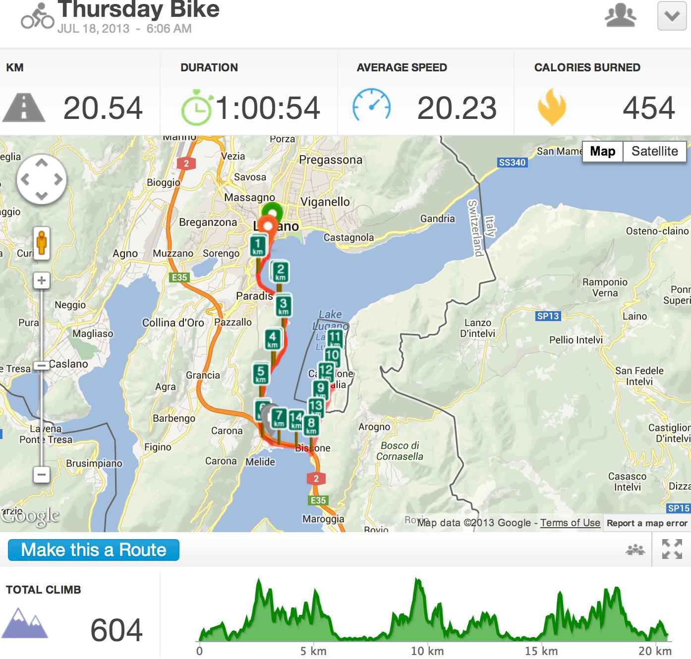
**이미지 캡션:** 이 사진은 자전거 타기 활동 기록을 보여주는 화면 캡처로, 상단에는 "Thursday Bike"라는 제목과 함께 2013년 7월 18일 오전 6시 6분이라는 날짜와 시간이 표시되어 있습니다. 화면 중앙에는 이탈리아와 스위스 국경 지역으로 보이는 호수와 산악 지형의 지도가 나타나며, 자전거 경로가 주황색 선으로 표시되어 있습니다. 경로에는 1번부터 14번까지의 지점이 표시되어 있으며, 각 지점 사이의 거리가 킬로미터 단위로 표기되어 있습니다. 지도 상단에는 총 이동 거리 20.54km, 총 소요 시간 1시간 0분 54초, 평균 속도 20.23km/h, 소모 칼로리 454kcal가 표시되어 있습니다. 지도 오른쪽 상단에는 "San Mamete", "Map", "Satellite" 버튼이 보입니다. 화면 하단에는 "TOTAL CLIMB"라는 제목과 함께 604라는 수치가 표시되어 있고, 그 옆에는 자전거 타기 동안의 고도 변화를 나타내는 그래프가 그려져 있습니다. 전반적으로 활동적인 야외 활동 기록을 보여주는 디지털 인터페이스 화면입니다.

### 7월 20일 (토) 17:22 · One of the most beautiful running trails…

📍 Lake Lugano, Switzerland

One of the most beautiful running trails ever! I want to run here again!

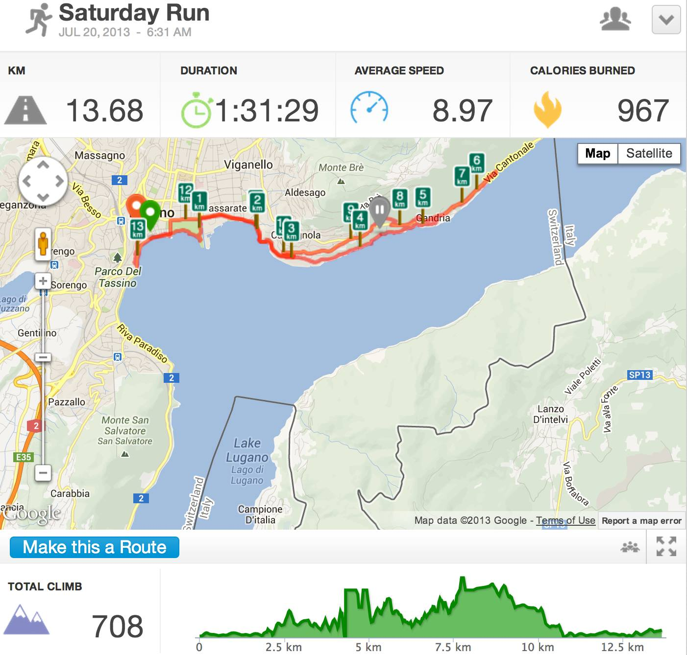
**이미지 캡션:** 이 사진은 "Saturday Run"이라는 제목의 운동 기록 화면으로, 2013년 7월 20일 오전 6시 31분에 시작된 달리기 기록을 보여준다. 화면 상단에는 달리기 거리 13.68km, 소요 시간 1시간 31분 29초, 평균 속도 8.97km/h, 소모 칼로리 967kcal가 표시되어 있다. 중앙에는 이탈리아와 스위스 국경 지역인 루가노 호수 주변의 지도가 표시되어 있으며, 빨간색 선으로 달리기 경로가 표시되어 있다. 경로 상에는 Massagno, Viganello, Aldesago, Gandria 등의 지명이 보이고, 각 지점별로 달린 거리가 표시되어 있다. 지도 하단에는 "Make this a Route"라는 버튼이 있고, 그 아래에는 총 상승 고도 708m와 함께 고도 변화 그래프가 표시되어 있다. 화면 오른쪽 상단에는 사람 모양의 아이콘 두 개가 있어 운동에 참여한 사람이 두 명임을 암시한다. 전반적으로 운동 기록을 시각적으로 보여주는 깔끔하고 정보가 풍부한 화면이다.
 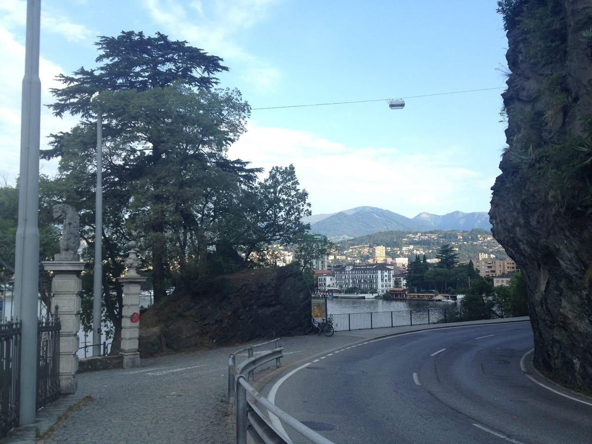
**이미지 캡션:** 이 사진은 푸른 하늘과 구름이 있는 맑은 날에 촬영된 풍경 사진으로, 웅장한 산과 도시, 호수가 어우러진 아름다운 경치를 담고 있습니다. 사진의 왼쪽에는 웅장한 나무와 함께 돌로 만들어진 사자 조각상이 있는 석조 기둥이 보이며, 그 뒤로는 철제 울타리가 있습니다. 오른쪽에는 거대한 바위 절벽이 솟아 있고, 절벽 아래로는 구불구불한 도로가 이어집니다. 도로 옆에는 금속 난간이 설치되어 있습니다. 멀리 보이는 호수에는 배가 떠 있고, 호수 건너편에는 여러 건물들이 밀집한 도시가 펼쳐져 있으며, 도시 뒤로는 산들이 병풍처럼 둘러싸고 있습니다. 하늘에는 케이블카가 지나가는 모습도 보입니다. 사진에는 사람이 보이지 않으며, 전반적으로 평화롭고 고즈넉한 분위기를 자아냅니다.
 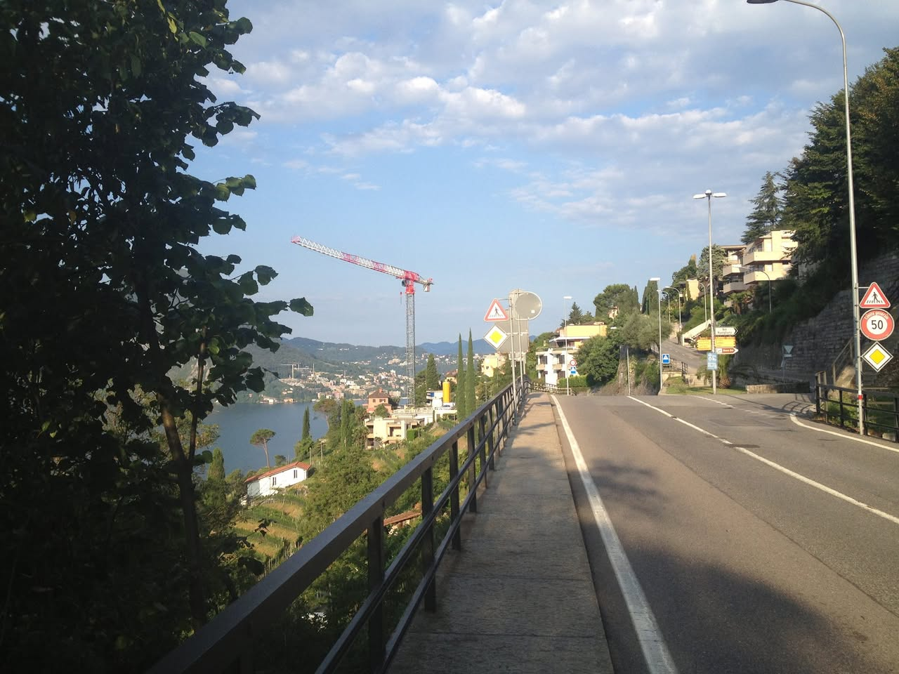
**이미지 캡션:** 이 사진은 푸른 하늘과 구름이 드리워진 맑은 날, 호수와 언덕에 자리 잡은 마을의 풍경을 담고 있습니다. 사진의 왼쪽에는 울창한 녹색 나뭇잎이 드리워져 있어 자연적인 프레임을 형성하고 있으며, 그 너머로 넓은 호수가 펼쳐져 있습니다. 호수 건너편 언덕에는 여러 채의 건물들이 층층이 자리 잡고 있으며, 그 위로는 건설 현장에서 사용되는 것으로 보이는 붉은색과 흰색의 대형 타워크레인이 높이 솟아 있습니다. 도로변에는 금속 난간이 설치된 보행자 도로가 이어져 있고, 그 옆으로는 차량이 다니는 도로가 구불구불하게 나 있습니다. 도로변에는 여러 개의 교통 표지판이 세워져 있는데, 그중 하나에는 숫자 '50'이 표시되어 있어 속도 제한 구역임을 알 수 있습니다. 또한, 사람 모양의 그림이 있는 표지판도 보입니다. 전반적으로 평화롭고 여유로운 분위기이며, 자연과 도시, 그리고 건설이 공존하는 풍경을 보여줍니다.
 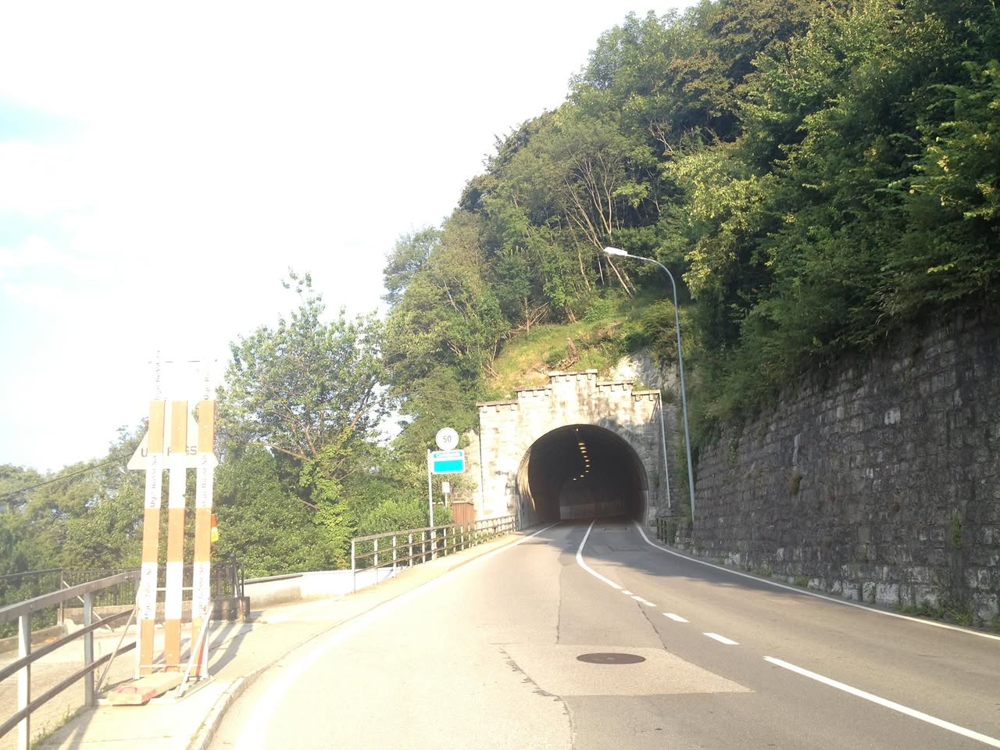
**이미지 캡션:** 이 사진은 터널 입구로 이어지는 도로를 보여줍니다. 도로에는 흰색 차선이 그려져 있고, 오른쪽에는 돌담으로 쌓인 산비탈이 있습니다. 산비탈에는 울창한 나무들이 자라고 있으며, 터널 위쪽으로는 숲이 우거져 있습니다. 터널 입구는 아치형으로 되어 있으며, 돌로 장식되어 있습니다. 터널 안쪽으로는 조명이 켜져 있고, 어둠 속으로 이어집니다. 도로 왼쪽에는 난간이 설치되어 있고, 그 너머로 나무와 건물이 보입니다. 도로에는 교통 표지판과 가로등도 보입니다. 전반적으로 자연과 인공 구조물이 조화를 이루는 풍경이며, 평화롭고 고요한 분위기를 자아냅니다.
 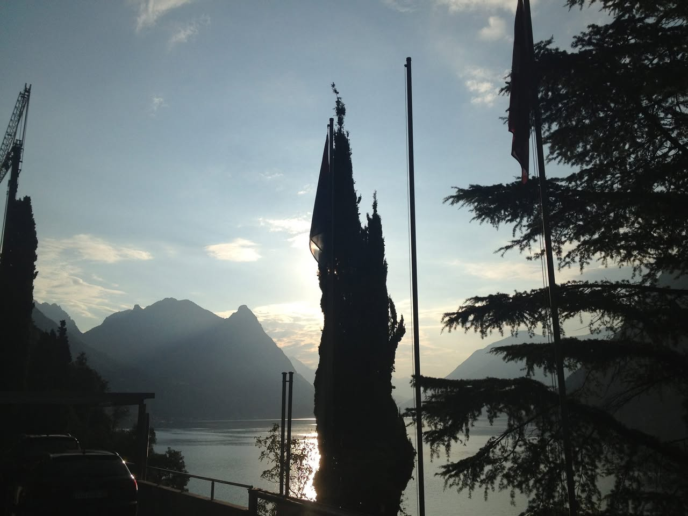
**이미지 캡션:** 이 사진은 석양 무렵의 아름다운 산과 호수 풍경을 담고 있습니다. 실루엣으로 처리된 뾰족한 산봉우리들이 푸른 하늘을 배경으로 웅장하게 펼쳐져 있으며, 산 아래로는 잔잔한 호수가 햇빛을 반사하며 은빛으로 빛나고 있습니다. 사진 왼쪽에는 건설 현장에서 볼 수 있는 크레인이 실루엣으로 보이고, 중앙에는 깃발이 꽂힌 긴 기둥과 함께 뾰족한 모양의 나무가 서 있습니다. 오른쪽에는 울창한 침엽수 가지들이 프레임의 일부를 차지하고 있으며, 그 너머로도 산과 호수가 이어집니다. 사진 하단에는 차들이 주차된 도로와 난간이 보이며, 전체적으로 평화롭고 고요한 분위기를 자아냅니다. 인물은 보이지 않으며, 텍스트도 명확하게 보이지 않습니다.
 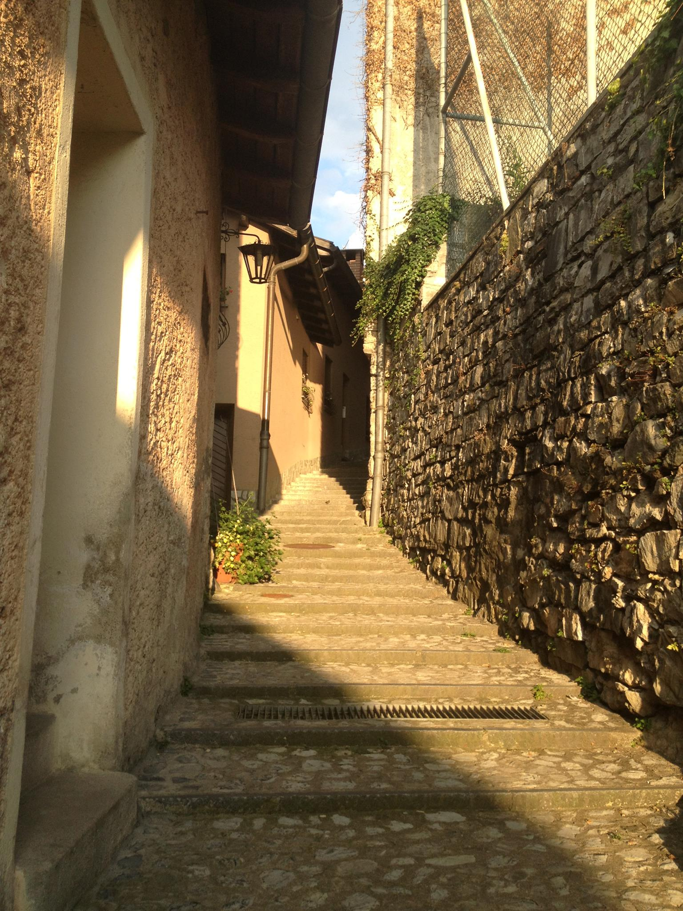
**이미지 캡션:** 이 사진은 햇살이 비치는 좁은 골목길의 계단을 보여줍니다. 왼쪽에는 거친 질감의 베이지색 건물 벽이 있고, 그 위로는 지붕과 낡은 가로등이 보입니다. 오른쪽에는 돌로 쌓아 올린 높은 벽이 있으며, 벽 위로는 철망 울타리가 쳐져 있고 담쟁이덩굴이 자라고 있습니다. 계단은 돌로 만들어졌으며, 햇빛과 그림자가 교차하며 깊이감을 더합니다. 계단 중간쯤에는 화분에 담긴 작은 식물이 놓여 있습니다. 계단에는 물 빠짐을 위한 격자형 배수구가 설치되어 있습니다. 사진에는 사람이 보이지 않으며, 전체적으로 고즈넉하고 평화로운 분위기를 자아냅니다.
 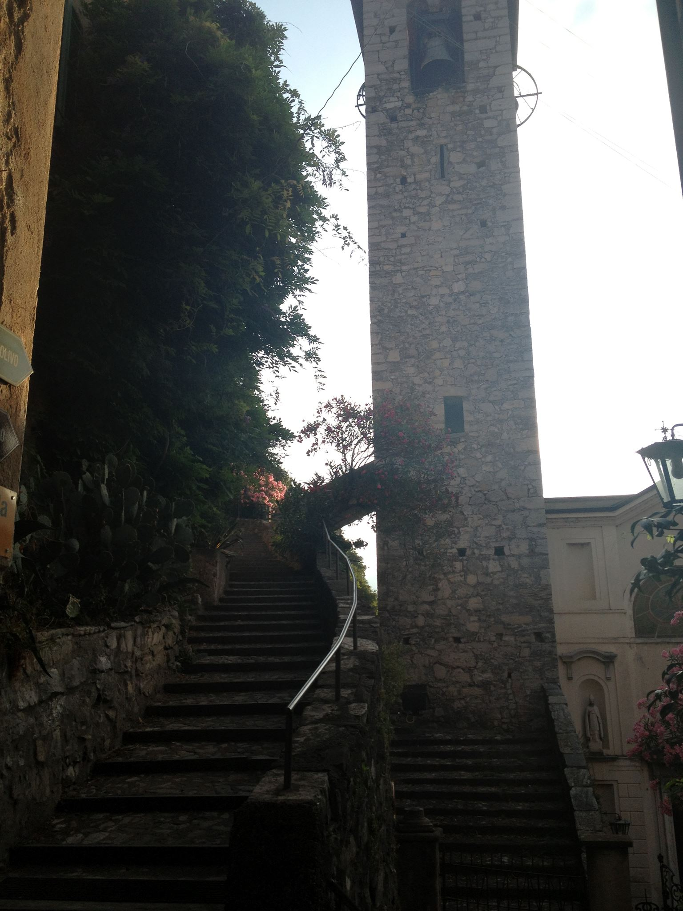
**이미지 캡션:** 이 사진은 이탈리아의 한 마을로 보이는 곳의 계단과 종탑을 담고 있습니다. 사진의 왼쪽에는 짙은 녹색의 무성한 식물들이 벽을 뒤덮고 있으며, 그 옆으로 돌로 만들어진 좁은 계단이 위로 이어집니다. 계단에는 은색 난간이 설치되어 있어 올라가기 편리하게 되어 있습니다. 계단 위쪽으로는 아치형 구조물이 보이며, 그 위로 분홍색 꽃이 피어 있는 식물이 늘어져 있습니다. 사진의 오른쪽에는 돌로 지어진 높은 종탑이 서 있습니다. 종탑 위쪽에는 종이 매달려 있고, 주변에는 금속 구조물이 보입니다. 종탑 옆으로는 흰색 건물과 함께 또 다른 계단이 보이며, 건물 벽에는 작은 조각상과 창문이 있습니다. 전체적으로 햇살이 비추는 밝은 날씨이며, 오래된 유럽 마을의 고즈넉하고 평화로운 분위기를 자아냅니다. 사진에는 사람이 보이지 않습니다.
 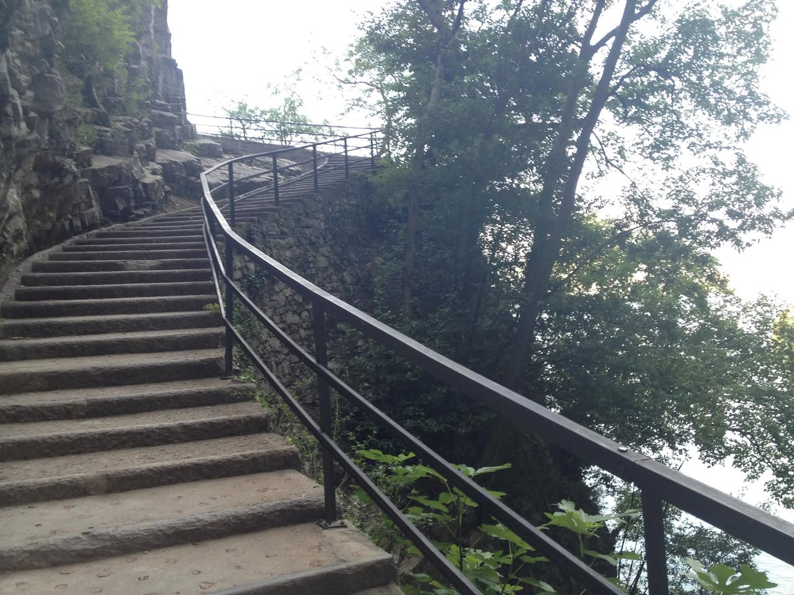
**이미지 캡션:** 이 사진은 울창한 녹음과 바위 절벽으로 둘러싸인 가파른 돌계단을 보여줍니다. 계단은 짙은 회색 돌로 만들어졌으며, 튼튼한 검은색 금속 난간이 양쪽에 설치되어 있습니다. 계단은 완만하게 구불구불 이어지며, 위쪽으로 갈수록 더 많은 계단이 보입니다. 계단 옆으로는 거대한 바위 절벽이 솟아 있고, 그 위로는 무성한 녹색 나뭇잎이 드리워져 있습니다. 나무들은 짙은 녹색을 띠고 있으며, 일부 나뭇가지 사이로 밝은 하늘이 보입니다. 사진에는 사람이 보이지 않으며, 전체적으로 자연의 웅장함과 평화로운 분위기를 자아냅니다.
 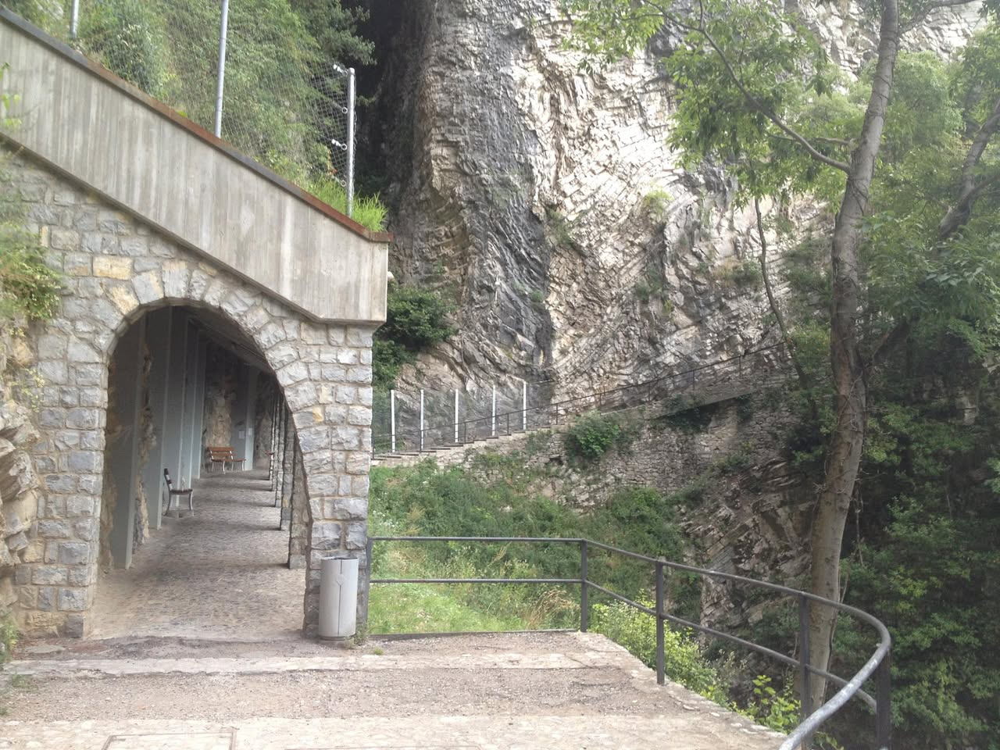
**이미지 캡션:** 사진에는 웅장한 바위 절벽을 배경으로 한 야외 통로가 보인다. 통로는 돌로 만들어진 아치형 구조물 아래에 있으며, 왼쪽에는 벤치와 의자가 놓여 있다. 통로 바닥은 자갈과 포장된 도로가 섞여 있으며, 오른쪽에는 철제 난간이 설치되어 있다. 절벽에는 계단과 작은 길이 나 있으며, 울창한 녹색 식물들이 절벽을 뒤덮고 있다. 통로 옆에는 쓰레기통이 놓여 있다. 전체적으로 자연과 인공 구조물이 조화롭게 어우러진 풍경으로, 산책이나 휴식을 취하기에 좋은 장소로 보인다.
 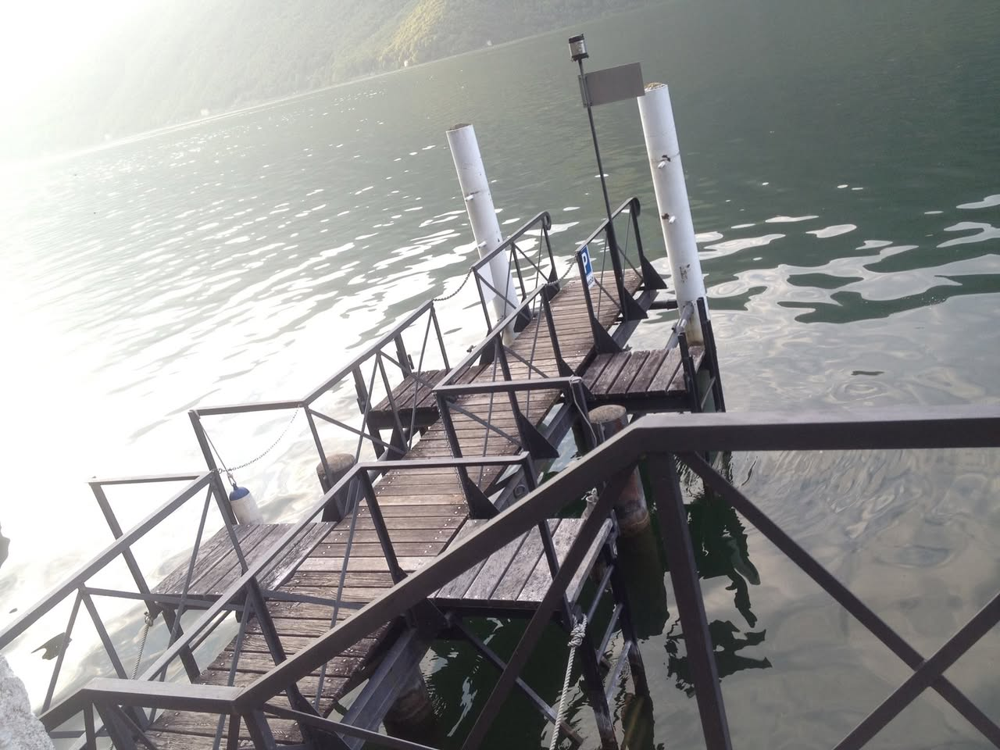
**이미지 캡션:** 이 사진은 잔잔한 호수 위에 놓인 나무와 금속으로 만들어진 부두를 보여줍니다. 부두는 여러 개의 계단과 난간으로 이루어져 있으며, 물 위로 뻗어 있습니다. 부두에는 흰색 기둥 두 개가 서 있고, 그 중 하나에는 파란색 주차 표지판이 달려 있습니다. 부두 주변의 물은 맑고 투명하며, 햇빛이 반사되어 반짝입니다. 배경에는 푸른 산이 보이고, 하늘은 옅은 안개로 덮여 있습니다. 사진은 평화롭고 고요한 분위기를 자아내며, 마치 휴양지에 온 듯한 느낌을 줍니다. 부두에는 사람이 보이지 않아 더욱 한적하고 평화로운 느낌을 더합니다.
 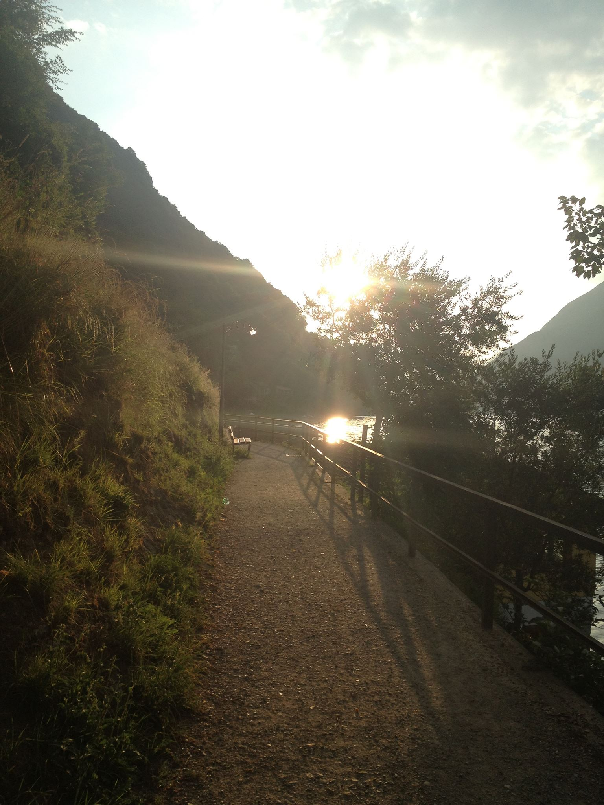
**이미지 캡션:** 햇살이 강렬하게 내리쬐는 오후, 흙길 산책로가 구불구불 이어져 있고, 길가에는 풀과 나무가 우거져 있습니다. 길 오른쪽으로는 강이나 호수가 보이고, 강가에는 난간이 설치되어 있습니다. 멀리 언덕과 산이 보이며, 하늘에는 구름이 옅게 떠 있습니다. 길가에는 벤치가 하나 놓여 있어 잠시 쉬어가기 좋아 보입니다. 전체적으로 평화롭고 고요한 분위기입니다.
 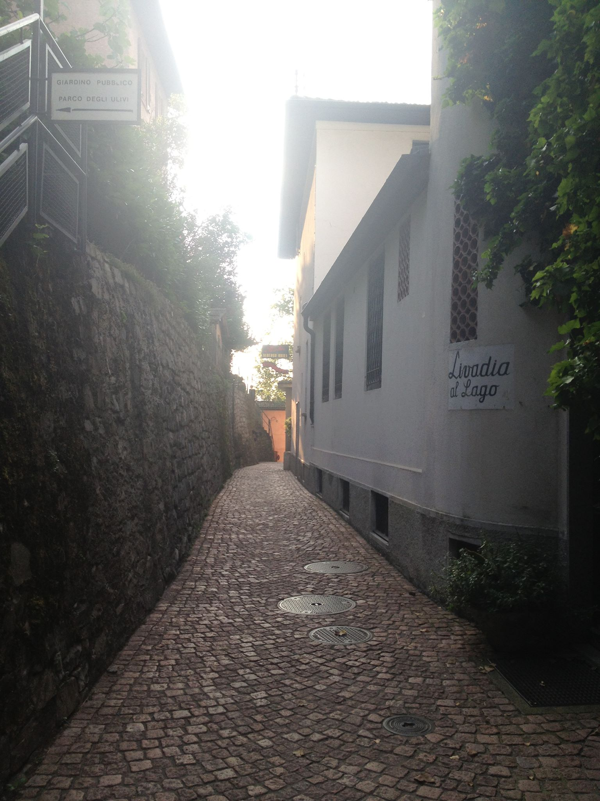
**이미지 캡션:** 이 사진은 돌로 포장된 좁은 골목길을 보여주며, 왼쪽에는 돌담이 있고 오른쪽에는 흰색 건물이 있습니다. 골목길은 위쪽으로 구불구불 이어지며, 햇빛이 강하게 비치고 있습니다. 왼쪽 돌담 위에는 "GIARDINO PUBBLICO PARCO DEGLI ULIVI"라고 쓰인 표지판이 보입니다. 오른쪽 흰색 건물에는 "Livadia al Lago"라고 쓰인 간판이 걸려 있습니다. 골목길 바닥에는 여러 개의 맨홀 뚜껑이 보입니다. 전반적으로 고즈넉하고 평화로운 분위기를 자아냅니다.
 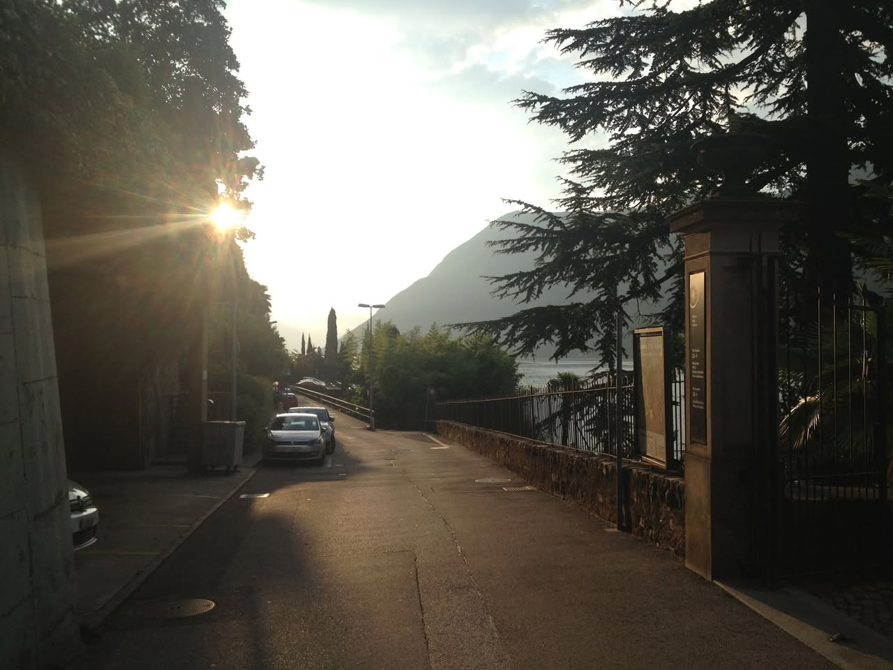
**이미지 캡션:** 해 질 녘의 햇살이 비스듬히 비추는 한적한 도로 풍경으로, 도로 좌측에는 나무가 우거져 있고 우측에는 돌담과 철문이 보인다. 도로에는 몇 대의 차량이 주차되어 있으며, 멀리 산과 호수가 보인다. 햇살이 강렬하게 비추어 일부 지역은 역광으로 인해 어둡게 처리되어 있다. 도로 옆에는 쓰레기통과 가로등이 보이며, 돌담 위에는 안내판이 설치되어 있다. 전체적으로 평화롭고 고요한 분위기를 자아낸다.
 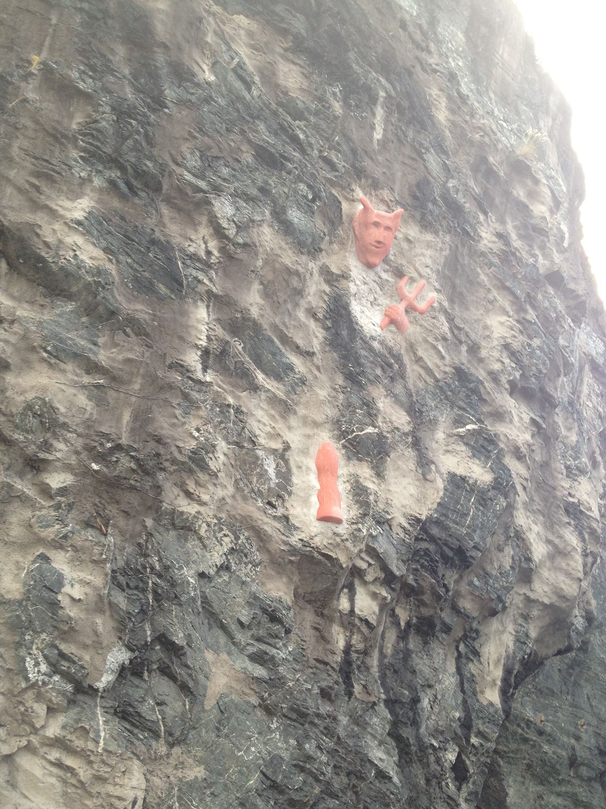
**이미지 캡션:** 거대한 바위 절벽에 붉은색으로 된 악마 얼굴 모양의 조형물과 삼지창 모양의 조형물, 그리고 길쭉한 모양의 조형물이 부착되어 있습니다. 악마 얼굴 조형물은 뿔이 달려 있고, 표정은 무표정합니다. 삼지창 조형물은 악마 얼굴 조형물 아래쪽에 위치해 있습니다. 길쭉한 조형물은 악마 얼굴 조형물보다 더 아래쪽에 있습니다. 배경은 거칠고 층이 많은 바위 절벽이며, 흐릿한 하늘이 보입니다. 전체적으로 기괴하고 독특한 분위기를 자아냅니다.
 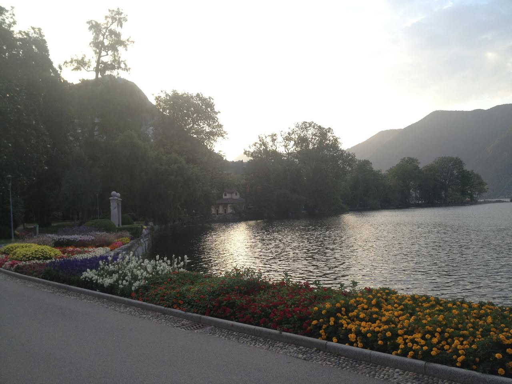
**이미지 캡션:** 이 사진은 잔잔한 호수와 그 주변의 아름다운 풍경을 담고 있습니다. 호수 오른쪽으로는 산들이 겹겹이 펼쳐져 있고, 하늘은 옅은 구름과 함께 밝게 빛나고 있습니다. 호수 왼쪽으로는 잘 가꾸어진 정원이 보입니다. 정원에는 다양한 색깔의 꽃들이 화려하게 피어 있으며, 붉은색, 노란색, 보라색, 흰색 꽃들이 조화롭게 어우러져 있습니다. 꽃밭 뒤로는 울창한 나무들이 우거져 있고, 그 너머 언덕 위에는 작은 집 한 채가 보입니다. 언덕 위에는 독특한 모양의 나무 한 그루가 서 있습니다. 호숫가에는 돌로 된 낮은 담장이 있고, 그 위로 나무들이 늘어서 있습니다. 사진의 전반적인 분위기는 평화롭고 고요하며, 자연의 아름다움을 만끽할 수 있는 여유로운 느낌을 줍니다. 특별히 사람이나 텍스트는 보이지 않습니다.
 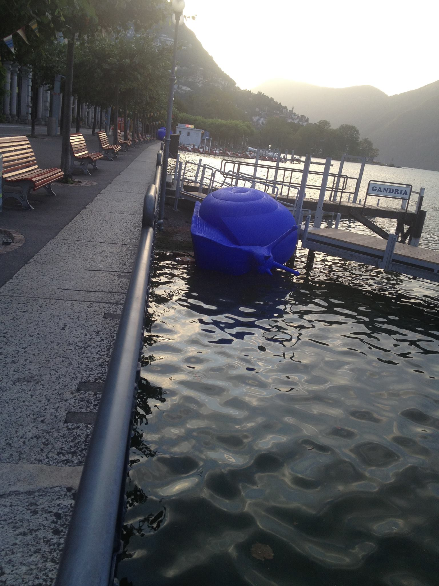
**이미지 캡션:** 호수 옆 산책로에 벤치가 놓여 있고, 물 위에는 파란색 달팽이 모양의 조형물이 떠 있으며, 배경에는 산과 건물들이 보인다.
 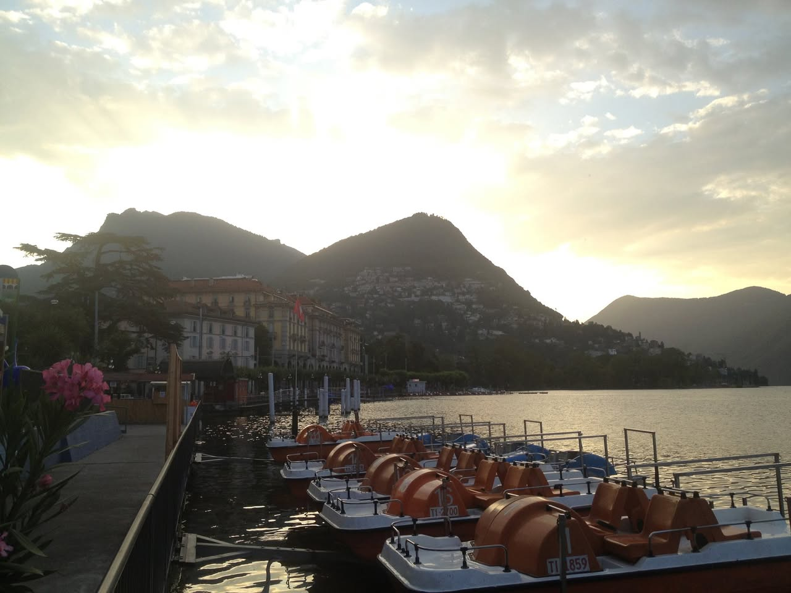
**이미지 캡션:** 해 질 녘 호숫가에 정박해 있는 여러 대의 페달 보트가 보이며, 배경에는 산과 건물들이 늘어서 있습니다. 사진 왼쪽에는 분홍색 꽃이 피어 있는 식물이 보이고, 그 뒤로는 콘크리트 산책로와 난간이 있습니다. 산책로 옆에는 여러 층으로 된 건물이 보이며, 그 위로는 스위스 국기가 펄럭이고 있습니다. 호수에는 여러 대의 주황색과 흰색 페달 보트가 정박해 있으며, 일부 보트에는 "TI-2700" 및 "TI-859"와 같은 번호가 보입니다. 하늘은 구름이 낀 채 노을 빛으로 물들어 있으며, 산들은 어스름하게 보입니다. 전체적으로 평화롭고 고요한 분위기입니다.
 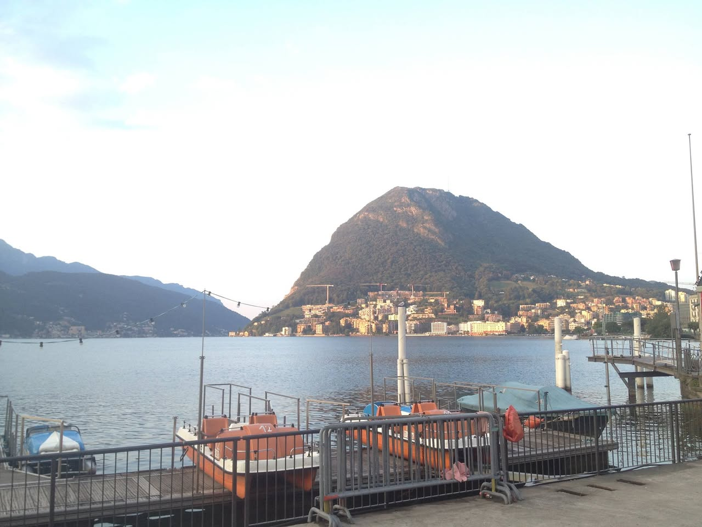
**이미지 캡션:** 고요한 호수 풍경으로, 푸른 물결이 잔잔하게 펼쳐져 있고 멀리 산과 도시가 보인다. 호수 앞에는 나무로 된 부두가 있고, 그 위에 여러 대의 오렌지색 페달 보트와 파란색 보트가 정박해 있다. 부두에는 금속 난간이 설치되어 있으며, 난간 너머로 도시의 건물들과 푸른 산이 보인다. 산 중턱에는 건물들이 빽빽하게 들어서 있고, 일부 지역에는 건설 중인 듯한 크레인이 보인다. 하늘은 맑고 푸르며, 해가 지고 있는 듯한 부드러운 빛이 풍경을 감싸고 있다. 전반적으로 평화롭고 아름다운 휴양지의 분위기를 자아낸다.
 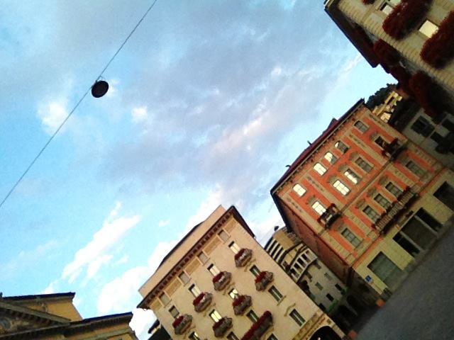
**이미지 캡션:** 이 사진은 하늘을 향해 기울어진 각도로 촬영되었으며, 푸른 하늘과 구름이 보이고 그 아래로 여러 채의 건물들이 늘어서 있습니다. 건물들은 다양한 색상과 디자인을 가지고 있으며, 창문과 발코니가 특징입니다. 특히 주황색과 베이지색 건물이 눈에 띄며, 창문에는 조명이 켜져 있어 내부가 보입니다. 건물 외벽에는 붉은색 꽃 장식이 달려 있는 곳도 있습니다. 사진 왼쪽 상단에는 전깃줄과 함께 검은색의 동그란 물체가 매달려 있습니다. 전반적으로 도시의 풍경을 담고 있으며, 약간은 오래된 유럽 도시의 분위기를 느낄 수 있습니다. 인물은 보이지 않으며, 텍스트도 명확하게 보이지 않습니다.

### 7월 21일 (일) 13:53 · Yeon Gyoung Gwack and Sung are ready for…

Yeon Gyoung Gwack and Sung are ready for cycling in Switzerland!

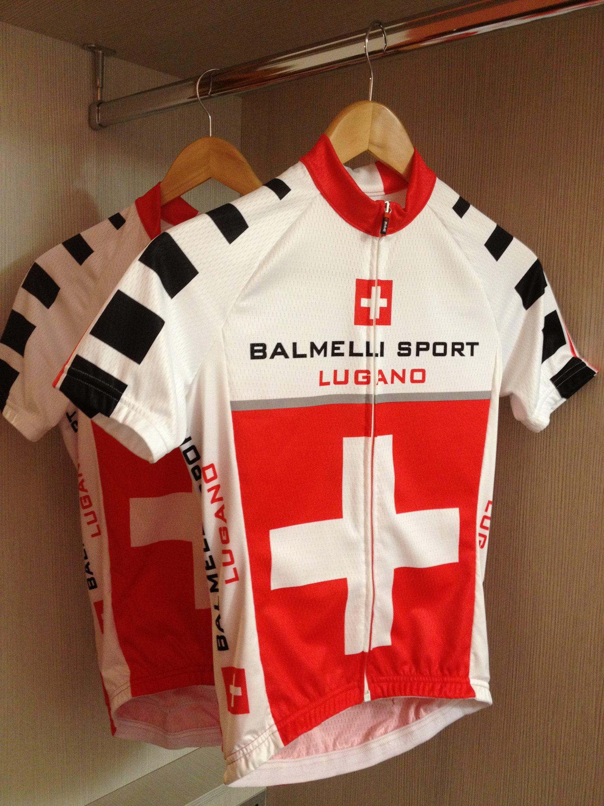
**이미지 캡션:** 두 개의 흰색과 빨간색 사이클링 저지가 옷걸이에 걸려 있다. 앞쪽 저지는 흰색 바탕에 빨간색 스위스 국기 문양과 "BALMELLI SPORT LUGANO"라는 글자가 새겨져 있다. 소매 부분에는 검은색 사각형 패턴이 있다. 뒤쪽 저지는 앞쪽 저지와 동일한 디자인으로, 약간 가려져 있다. 저지들은 옷장 안의 옷걸이에 걸려 있으며, 배경은 연한 갈색의 벽지이다.

### 7월 22일 (월) 04:43 · Best lake Swimming ever!

📍 Rorschach, St. Gallen

Best lake Swimming ever!

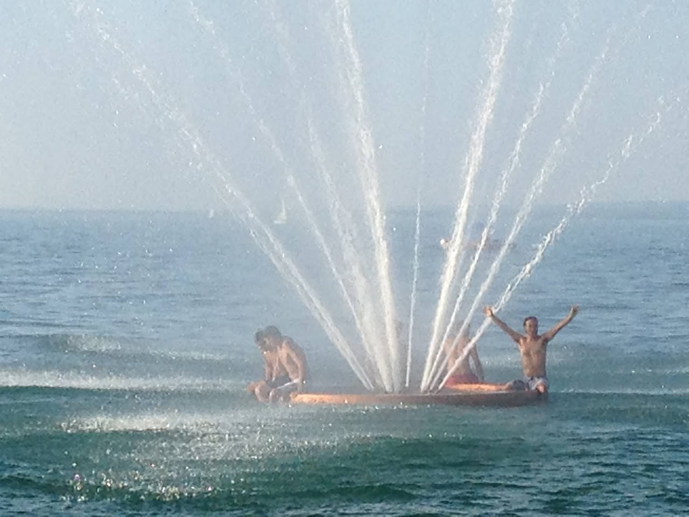
**이미지 캡션:** 푸른 바다 위에서 여러 명의 성인 남성들이 물줄기가 솟아나는 장치 위에 앉아 즐거운 시간을 보내고 있다. 중앙에 있는 남성은 팔을 활짝 벌리고 환하게 웃고 있으며, 그의 뒤쪽으로 두 명의 남성이 더 보인다. 이들은 모두 수영복 차림이며, 물보라 속에서 시원함을 만끽하는 듯하다. 배경에는 잔잔한 바다와 맑은 하늘이 펼쳐져 있으며, 멀리 희미하게 보이는 작은 배 한 척이 평화로운 분위기를 더한다. 전체적으로 여름날 바다에서 즐기는 레저 활동의 활기차고 유쾌한 순간을 담고 있다.
 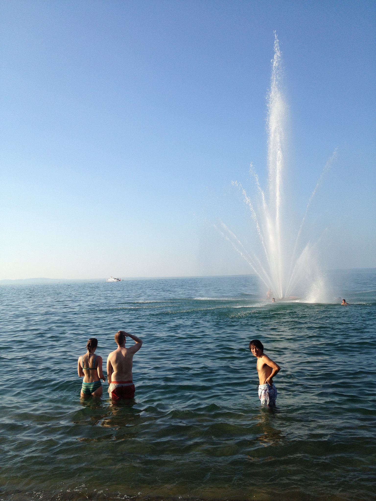
**이미지 캡션:** 맑고 푸른 하늘 아래 잔잔한 바다에서 세 명의 젊은 사람들이 물놀이를 즐기고 있다. 왼쪽에는 줄무늬 비키니를 입은 젊은 여성이 서 있고, 그 옆에는 빨간색 수영복을 입은 젊은 남성이 서서 머리를 긁적이며 먼 곳을 바라보고 있다. 오른쪽에는 무늬가 있는 반바지를 입은 젊은 남성이 카메라를 향해 웃으며 서 있다. 멀리 바다 위에는 거대한 분수가 솟아오르고 있으며, 그 주변에는 몇몇 사람들이 물놀이를 하고 있다. 수평선에는 작은 보트 한 척이 보인다. 전체적으로 화창하고 즐거운 여름날의 풍경이다.
 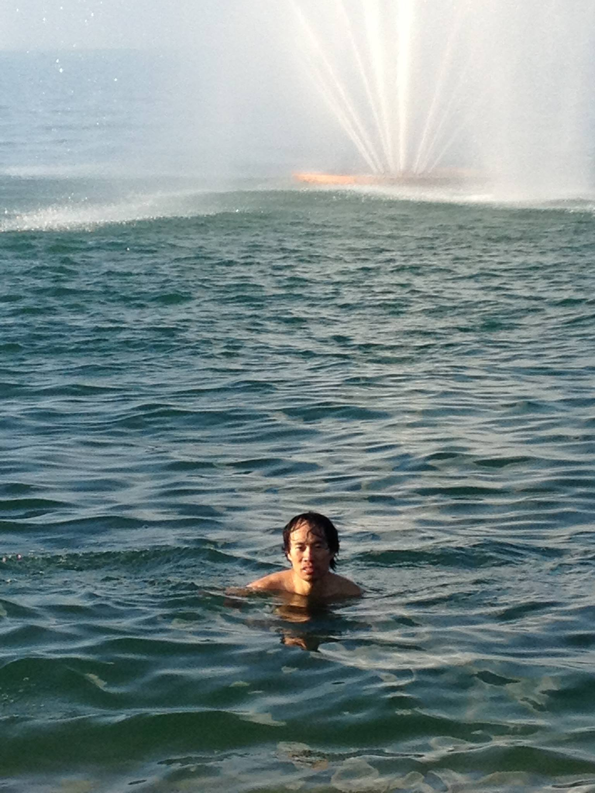
**이미지 캡션:** 바다에서 수영 중인 젊은 성인 남성이 카메라를 응시하고 있으며, 그의 상반신이 물 위로 드러나 있다. 남성은 검은색 짧은 머리에 옅은 갈색 피부를 가지고 있으며, 약간 놀란 듯한 표정이다. 그는 아무것도 입고 있지 않다. 배경에는 거대한 분수대가 물줄기를 뿜어내고 있으며, 분수대 주변에는 오렌지색 구조물이 보인다. 물은 잔잔하며, 햇빛이 비쳐 반짝인다. 전반적으로 시원하고 활동적인 여름날의 분위기를 느낄 수 있다.

### 7월 24일 (수) 04:57 · Swiss Cycling (Alpine Panorama Route) Da…

Swiss Cycling (Alpine Panorama Route) Day 1: It was up and down, but so beautiful.

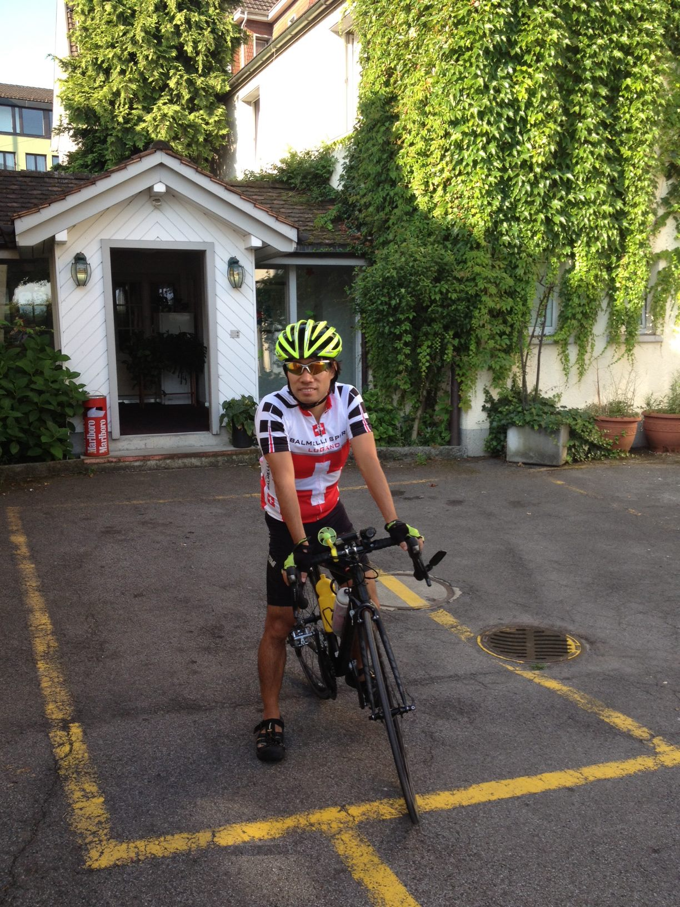
**이미지 캡션:** 한 성인 남성이 자전거를 타고 주차장에 서 있다. 그는 헬멧, 선글라스, 사이클링 복장, 장갑, 샌들을 착용하고 있다. 그의 자전거에는 물통이 달려 있다. 배경에는 하얀색 건물과 무성한 녹색 덩굴이 보인다. 건물 앞에는 작은 현관이 있고, 그 옆에는 말보로 담배 광고판이 놓여 있다. 주차장 바닥에는 노란색 주차선이 그려져 있고, 맨홀 뚜껑도 보인다. 전체적으로 맑은 날씨에 야외 활동을 즐기는 듯한 분위기이다.
 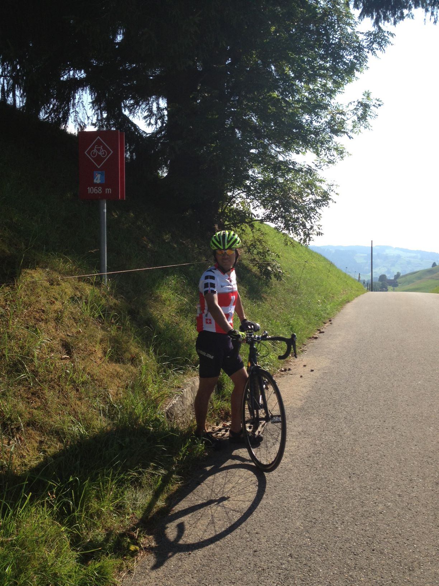
**이미지 캡션:** 한 명의 성인 여성이 헬멧을 쓰고 자전거를 탄 채 도로 옆 풀밭에 서 있다. 여성은 녹색 헬멧과 선글라스를 착용하고 있으며, 빨간색과 흰색이 섞인 사이클링 저지와 검은색 반바지를 입고 있다. 그녀는 자전거 핸들을 잡고 있으며, 자전거는 도로에 세워져 있다. 배경에는 푸른 나무와 언덕이 보이며, 하늘은 맑고 푸르다. 도로 옆에는 빨간색 표지판이 세워져 있는데, 표지판에는 자전거 그림과 함께 '1068 m'이라는 글자가 쓰여 있다. 전체적으로 맑은 날씨에 야외에서 자전거를 타는 평화로운 분위기이다.
 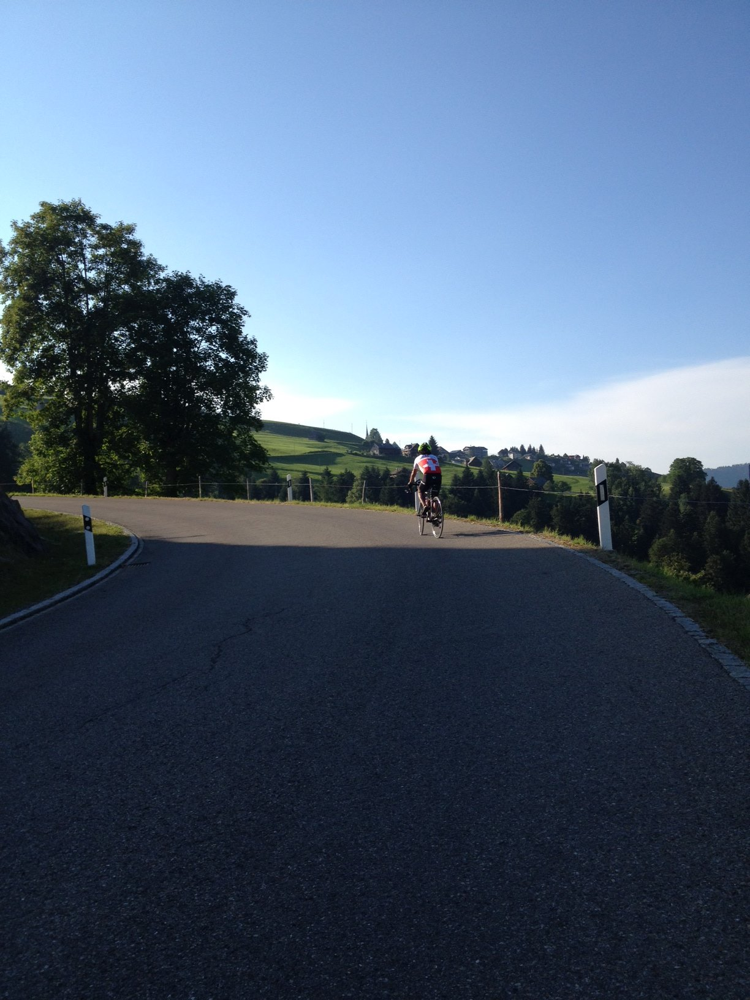
**이미지 캡션:** 푸른 하늘 아래, 한 명의 성인 남성이 자전거를 타고 구불구불한 아스팔트 도로를 오르고 있다. 남성은 빨간색과 흰색이 섞인 사이클링 복장을 착용하고 있으며, 헬멧을 쓰고 있다. 그의 얼굴 표정은 보이지 않지만, 페달을 밟는 모습에서 운동에 집중하고 있음을 짐작할 수 있다. 배경에는 푸른 잔디로 덮인 언덕과 숲, 그리고 멀리 보이는 작은 마을의 건물들이 그림처럼 펼쳐져 있다. 도로 옆에는 키 큰 나무와 울타리가 보이며, 흰색 표지판이 길을 안내하고 있다. 전체적으로 맑고 화창한 날씨 속에서 평화롭고 활동적인 분위기를 자아낸다.

### 7월 24일 (수) 05:09 · Swiss Cycling (Alpine Panorama Route) Da…

Swiss Cycling (Alpine Panorama Route) Day 2: met Klausenpass (1948m)! Just 25Km with 1700m climb. Long long uphills, but breathtaking views+long downhills! I'll do it again. :-)

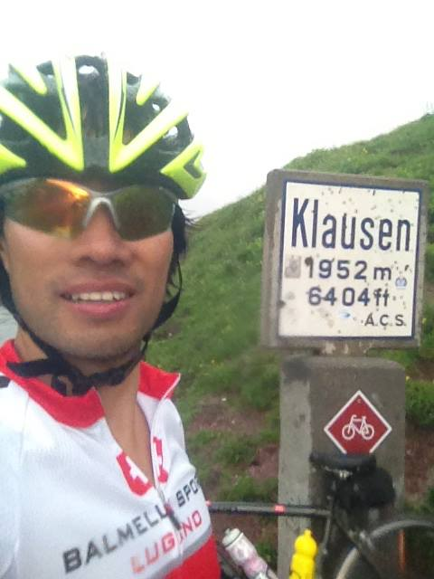
**이미지 캡션:** 한 명의 성인 남성이 헬멧과 선글라스를 착용하고 자전거 의류를 입고 있으며, 그의 얼굴은 카메라를 향하고 있고 그는 웃고 있다. 그는 헬멧을 쓰고 있고, 헬멧은 밝은 노란색과 녹색으로 되어 있다. 그는 또한 스포츠 선글라스를 쓰고 있고, 선글라스 렌즈는 주황색으로 반사된다. 그는 흰색과 빨간색의 자전거 저지를 입고 있으며, 저지에는 "BALMELLI SPORT LUGANO"라고 쓰여 있다. 그의 뒤에는 "Klausen 1952m 6404ft A.C.S."라고 쓰여 있는 표지판이 있고, 표지판 아래에는 빨간색 다이아몬드 모양의 표지판에 자전거 아이콘이 있다. 배경에는 푸른 잔디와 흐린 하늘이 보인다. 전반적으로 사진은 야외에서 자전거를 타는 활동적인 분위기를 나타낸다.
 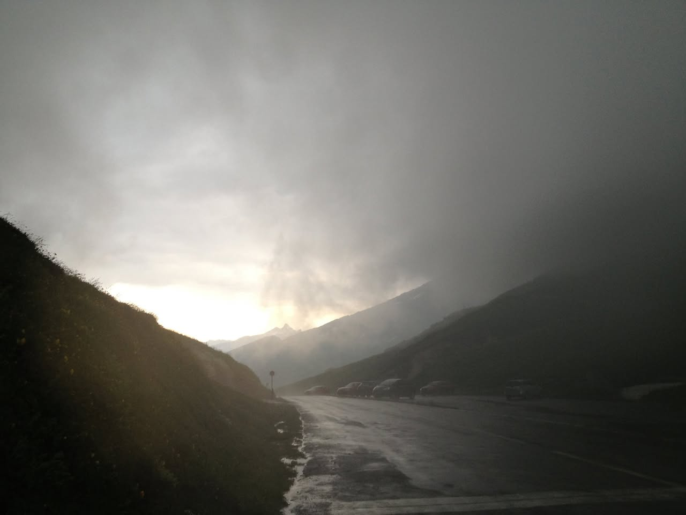
**이미지 캡션:** 흐린 날씨의 산악 도로 풍경으로, 왼쪽에는 풀과 작은 노란 꽃이 듬성듬성 피어 있는 가파른 경사면이 보이고, 오른쪽에는 안개가 자욱한 산봉우리와 함께 젖은 아스팔트 도로가 펼쳐져 있습니다. 도로에는 여러 대의 차량이 주차되어 있거나 서행하고 있으며, 희미하게 보이는 표지판 하나가 도로변에 서 있습니다. 하늘은 두꺼운 구름으로 뒤덮여 있고, 산봉우리 사이로 희미한 햇빛이 비치며 몽환적인 분위기를 자아냅니다. 전체적으로 어둡고 습한 날씨 속에서 산악 도로의 고요함과 신비로움을 느낄 수 있는 장면입니다.
 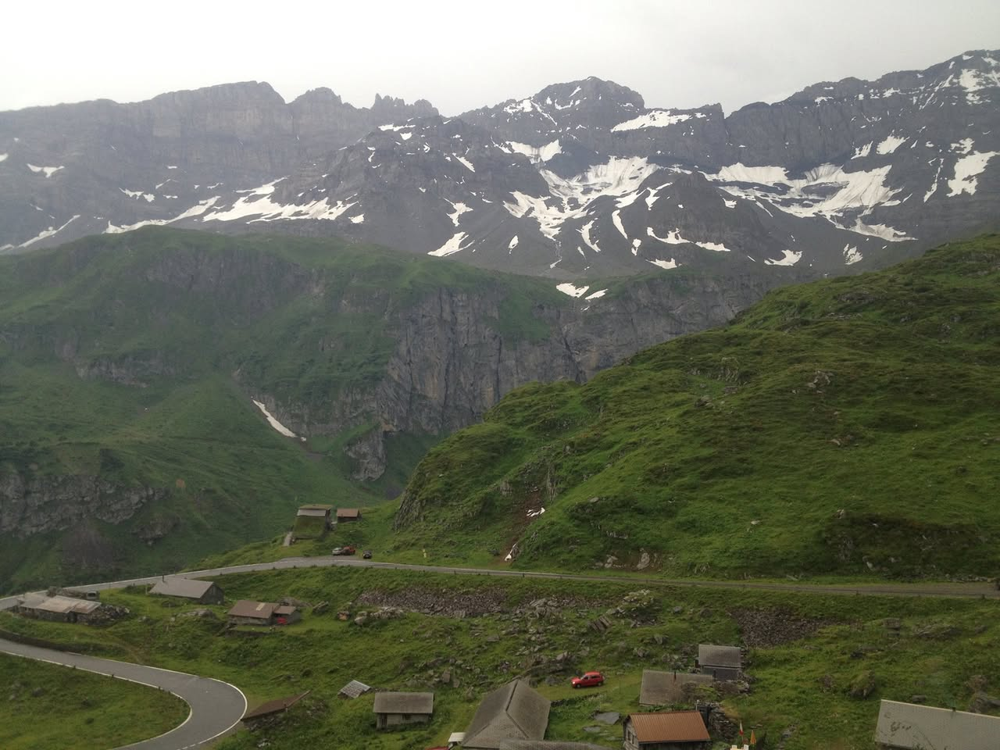
**이미지 캡션:** 이 사진은 스위스의 알프스 산맥을 배경으로 한 풍경으로, 험준한 산봉우리와 푸른 초원이 어우러져 있습니다. 사진 중앙에는 구불구불한 도로가 나 있으며, 도로 주변에는 여러 채의 작은 산장들이 자리 잡고 있습니다. 산장들은 대부분 돌과 나무로 지어졌으며, 붉은색 지붕을 가진 산장도 보입니다. 도로 위에는 붉은색 승용차 한 대가 지나가고 있으며, 다른 차량들도 몇 대 보입니다. 하늘은 흐린 날씨를 나타내며, 산봉우리에는 아직 눈이 남아 있어 겨울의 흔적을 보여줍니다. 전반적으로 평화롭고 고즈넉한 산악 마을의 풍경을 담고 있습니다.
 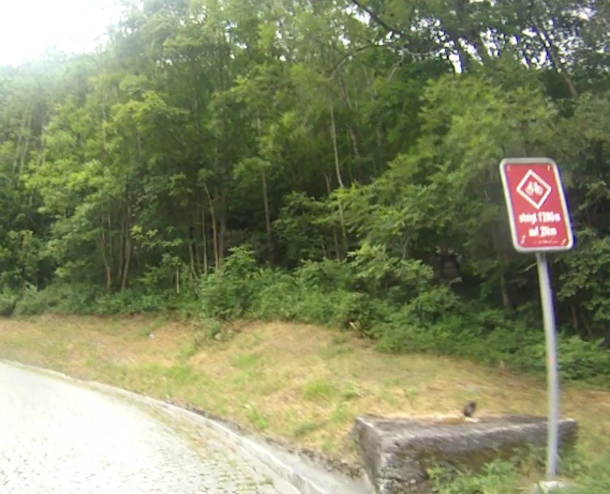
**이미지 캡션:** 이 사진은 울창한 숲을 배경으로 한 야외 풍경을 담고 있습니다. 사진의 오른쪽에는 빨간색 다이아몬드 모양의 표지판이 세워져 있으며, 표지판 안에는 자전거 그림과 함께 "steg 1250m af Din"이라는 글자가 흰색으로 쓰여 있습니다. 표지판은 금속 기둥에 고정되어 있으며, 기둥 아래에는 콘크리트 구조물이 보입니다. 콘크리트 구조물 위에는 작은 새 한 마리가 앉아 있습니다. 사진의 왼쪽에는 포장된 도로가 구불구불하게 이어져 있고, 도로 옆으로는 잔디와 덤불이 우거져 있습니다. 전반적으로 자연 속에서 자전거를 타거나 산책을 즐기기에 좋은 장소로 보이며, 맑은 날씨 속에서 상쾌한 분위기를 느낄 수 있습니다.
 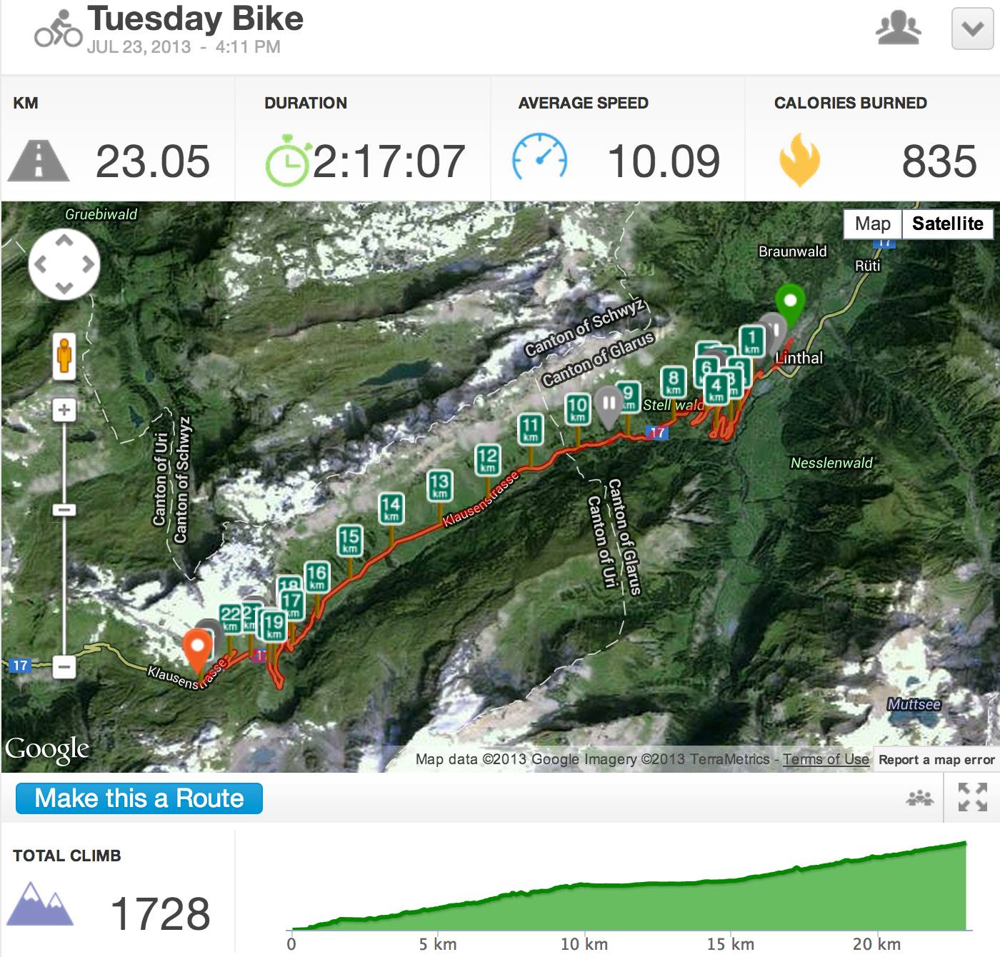
**이미지 캡션:** 이것은 "Tuesday Bike"라는 제목의 사이클링 활동 기록으로, 2013년 7월 23일 오후 4시 11분에 완료되었습니다. 총 거리는 23.05km이며, 소요 시간은 2시간 17분 7초, 평균 속도는 10.09km/h, 소모 칼로리는 835kcal입니다. 화면에는 스위스의 산악 지형을 보여주는 위성 지도가 표시되어 있으며, 경로 상에 1km 간격으로 표시된 지점들이 보입니다. 특히 1번부터 22번까지의 지점 표시와 함께 "Gruebiwald", "Braunwald", "Linthal", "Nesslenwald", "Muttsee" 등의 지명이 보입니다. 또한 "Canton of Uri", "Canton of Schwyz", "Canton of Glarus"와 같은 칸톤(주) 정보와 "Klausenstrasse"라는 도로명이 표시되어 있습니다. 화면 하단에는 총 상승 고도가 1728m임을 나타내는 그래프가 있습니다. 이 기록은 사이클링 경로를 저장하고 공유하는 앱의 일부로 보이며, "Make this a Route"라는 버튼이 있어 이 경로를 저장할 수 있음을 시사합니다. 전반적으로 활동적인 야외 활동을 기록하고 공유하는 분위기입니다.
 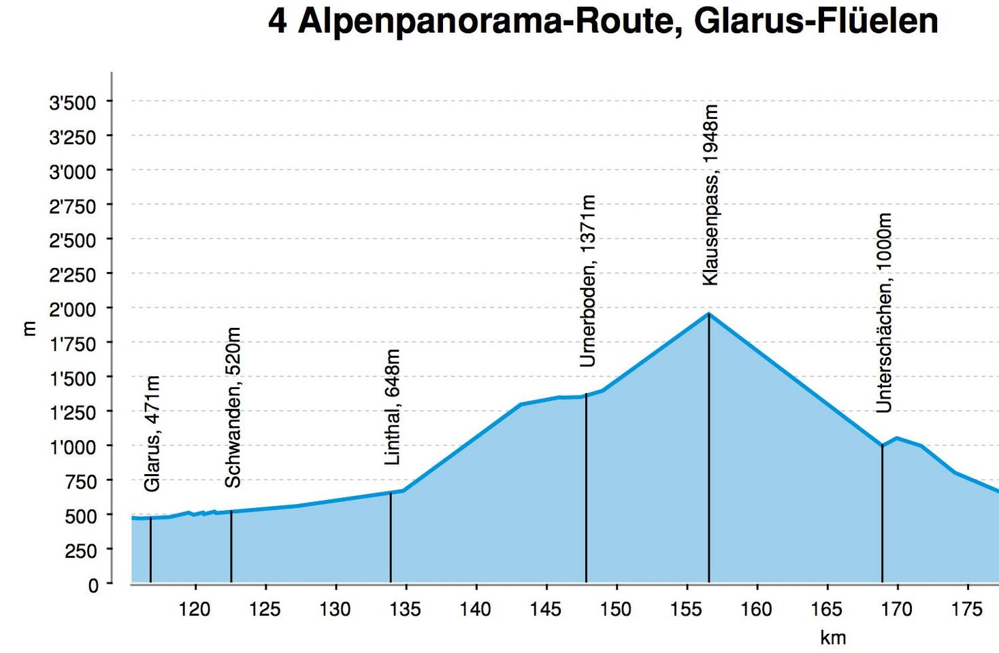
**이미지 캡션:** 이것은 "4 Alpenpanorama-Route, Glarus-Flüelen"이라는 제목의 고도 프로필 그래프로, 스위스의 알펜파노라마 루트 중 글라루스에서 플뤼엘렌까지의 구간을 보여줍니다. 그래프의 세로축은 미터(m) 단위의 고도를 나타내며 0부터 3,500m까지 표시되어 있고, 가로축은 킬로미터(km) 단위의 거리를 나타내며 120km부터 175km까지 표시되어 있습니다. 파란색 선은 루트의 고도 변화를 나타내며, 여러 지점의 이름과 고도가 라벨로 표시되어 있습니다. 예를 들어, "Glarus, 471m"은 120km 지점 근처에서 시작하는 고도 471m를 나타내고, "Schwanden, 520m"은 125km 지점 근처에서 고도 520m, "Linthal, 648m"은 135km 지점 근처에서 고도 648m, "Urnerboden, 1371m"은 145km 지점 근처에서 고도 1371m, "Klausenpass, 1948m"은 155km 지점 근처에서 최고점인 고도 1948m, 그리고 "Unterschächen, 1000m"은 170km 지점 근처에서 고도 1000m를 나타냅니다. 그래프는 전반적으로 산악 지형의 오르막과 내리막을 시각적으로 보여주며, 최고점은 클라우젠패스(Klausenpass)로 약 1948m입니다. 이 그래프는 등산, 자전거 또는 자동차 여행 계획에 유용한 정보를 제공합니다. 사람, 특정 장소의 구체적인 외관, 사물, 텍스트 외의 보이는 요소, 분위기나 상황은 이 그래프에서 파악할 수 없습니다.

### 7월 26일 (금) 00:29 · Swiss Cycling (Alpine Panorama Route) Da…

Swiss Cycling (Alpine Panorama Route) Day 3: mountains and lakes!

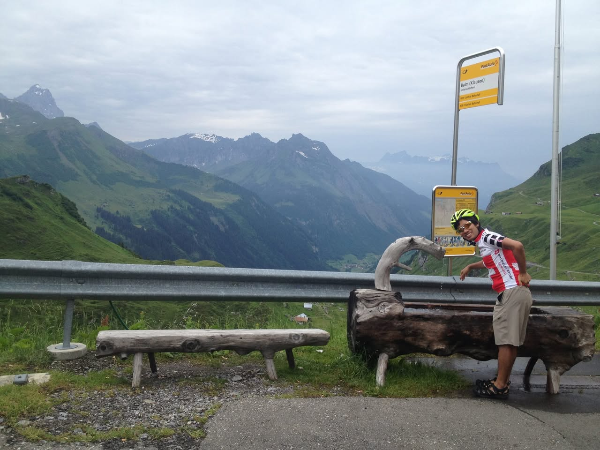
**이미지 캡션:** 한 명의 성인 남성이 헬멧을 쓰고 자전거 복장을 한 채 서 있으며, 그의 뒤로는 웅장한 산맥이 펼쳐져 있습니다. 남성은 옅은 미소를 띠고 있으며, 한 손은 허리에 얹고 다른 한 손은 나무로 된 수도꼭지처럼 보이는 조형물에 기대고 있습니다. 그는 밝은 색상의 자전거 저지와 베이지색 반바지, 샌들을 착용하고 있습니다. 배경에는 푸른 잔디로 덮인 가파른 산비탈과 구름 낀 하늘이 보이며, 멀리 산봉우리에는 눈이 쌓여 있습니다. 사진 오른쪽에는 노란색 바탕에 검은색 글씨로 "PostAuto"라고 적힌 버스 정류장 표지판이 서 있습니다. 표지판 아래에는 노선도처럼 보이는 지도가 부착되어 있습니다. 남성 앞에는 통나무를 깎아 만든 독특한 형태의 물통이 놓여 있으며, 그 옆으로는 나무로 만든 벤치가 보입니다. 전체적으로 시원하고 탁 트인 산악 지대의 풍경과 함께 자전거 여행 중 잠시 휴식을 취하는 듯한 분위기를 자아냅니다.
 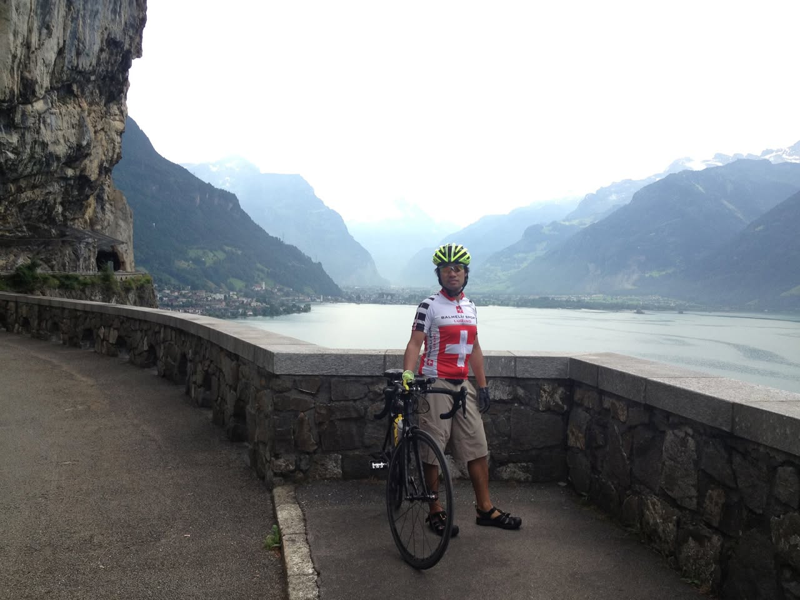
**이미지 캡션:** 한 명의 성인 남성이 자전거와 함께 서 있으며, 그는 헬멧을 쓰고 있으며, 빨간색과 흰색이 섞인 사이클링 저지와 베이지색 반바지를 입고 있습니다. 그의 표정은 무표정하며, 오른손은 자전거 핸들바에 올려져 있습니다. 배경에는 웅장한 산맥과 호수가 펼쳐져 있으며, 호수 주변에는 작은 마을이 보입니다. 산비탈에는 동굴로 이어지는 듯한 구조물이 보이고, 길을 따라 돌담이 쌓여 있습니다. 전체적으로 맑은 날씨 속에서 자연의 아름다움을 만끽하는 듯한 평화로운 분위기입니다.
 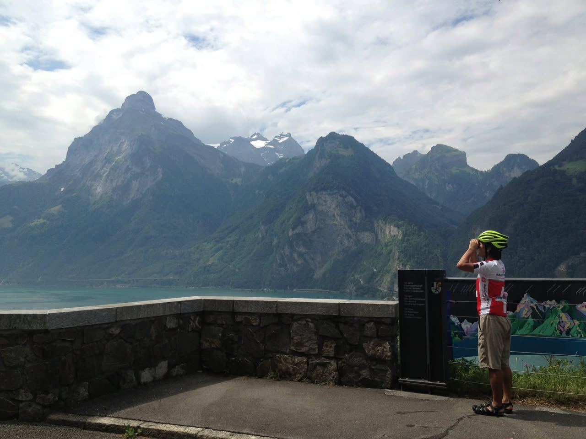
**이미지 캡션:** 한 명의 성인 남성이 헬멧을 쓰고 망원경으로 먼 산을 바라보고 있다. 남성은 흰색과 빨간색이 섞인 사이클링 복장을 입고 있으며, 베이지색 반바지와 샌들을 신고 있다. 그의 표정은 보이지 않지만, 망원경을 통해 풍경을 감상하는 모습에서 호기심과 경외감을 느낄 수 있다. 배경에는 푸른 호수와 울창한 숲으로 뒤덮인 웅장한 산들이 펼쳐져 있으며, 하늘에는 구름이 흩뿌려져 있다. 남성 앞에는 돌담과 함께 풍경을 설명하는 듯한 안내판이 서 있다. 전체적으로 평화롭고 아름다운 자연 풍경 속에서 여행을 즐기는 듯한 분위기이다.

### 7월 26일 (금) 00:40 · Swiss Cycling (Alpine Panorama Route) Da…

Swiss Cycling (Alpine Panorama Route) Day 4: another uphill! Constant 1120m climb in just 12km. Very steep, but memorable and fun!!

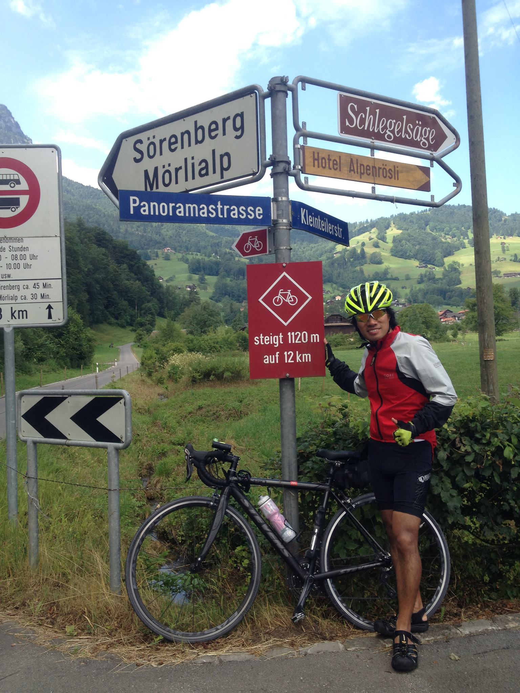
**이미지 캡션:** 한 명의 성인 남성이 헬멧과 사이클링 복장을 하고 자전거 옆에 서 있다. 남성은 노란색과 녹색이 섞인 헬멧을 쓰고 있으며, 빨간색과 회색이 섞인 재킷과 검은색 반바지를 입고 있다. 그는 밝은 녹색 장갑을 끼고 있으며, 얼굴에는 미소를 띠고 있다. 그의 옆에는 검은색 로드 자전거가 세워져 있으며, 자전거 물통이 달려 있다. 배경에는 여러 개의 표지판이 세워져 있는데, 'Sörenberg Mörlialp', 'Panoramastrasse', 'Schlegelsäge', 'Hotel Alpenrösli', 'Kleinteilerstr.' 등의 글자가 보인다. 또한, 자전거 아이콘이 그려진 빨간색 표지판에는 'steigt 1120 m auf 12 km'라는 문구가 적혀 있다. 왼쪽에는 버스 통행 금지를 나타내는 표지판과 함께 '3 km'라는 글자와 화살표가 있다. 장소는 스위스의 산악 지역으로 보이며, 푸른 언덕과 나무, 그리고 멀리 보이는 산이 풍경을 이루고 있다. 하늘은 맑고 구름이 약간 낀 날씨이다. 전반적으로 자전거 여행 중 잠시 휴식을 취하며 풍경을 즐기는 듯한 분위기이다.
 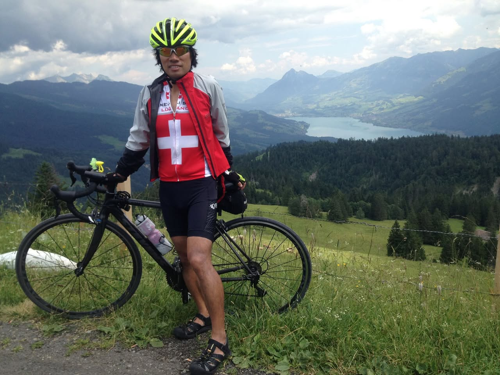
**이미지 캡션:** 한 명의 성인 남성이 헬멧과 선글라스를 착용하고 스위스 국기가 그려진 사이클링 의류를 입고 검은색 로드 자전거 옆에 서 있습니다. 남성은 30대 후반에서 40대 초반으로 보이며, 짧은 검은색 머리에 약간의 미소를 띠고 있습니다. 그는 검은색 반바지와 검은색 샌들을 신고 있습니다. 자전거에는 물통이 달려 있고 핸들바에는 작은 노란색 장난감이 매달려 있습니다. 배경에는 울창한 숲과 푸른 호수가 내려다보이는 산악 풍경이 펼쳐져 있으며, 하늘에는 구름이 낀 모습입니다. 전체적으로 야외 활동과 여행의 분위기를 나타냅니다.
 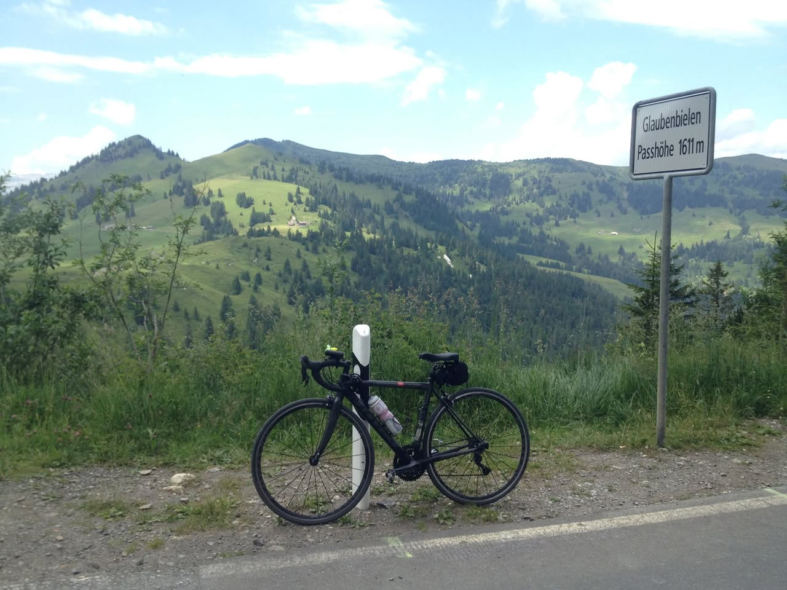
**이미지 캡션:** 푸른 하늘 아래 구름이 흩뿌려진 날, 험준한 산악 지형을 배경으로 검은색 로드 자전거 한 대가 도로 옆에 세워져 있습니다. 자전거는 튼튼한 타이어와 날렵한 프레임을 갖추고 있으며, 안장 뒤에는 작은 가방이 달려 있습니다. 자전거 옆에는 흰색 표지판이 서 있는데, "Glaubenbielen Passhöhe 1611 m"이라고 적혀 있어 이곳이 해발 1611미터의 글라우벤비엘렌 고개임을 알 수 있습니다. 표지판 뒤로는 울창한 숲과 푸른 초원이 펼쳐진 산들이 겹겹이 이어져 있으며, 산비탈에는 작은 집들이 점점이 박혀 있어 평화로운 전원 풍경을 자아냅니다. 도로는 갓길과 차선이 명확하게 구분되어 있으며, 갓길에는 자갈과 풀이 섞여 있습니다. 전반적으로 시원하고 상쾌한 느낌을 주는 풍경으로, 자전거 여행객이 잠시 휴식을 취하며 경치를 감상하는 듯한 분위기입니다.
 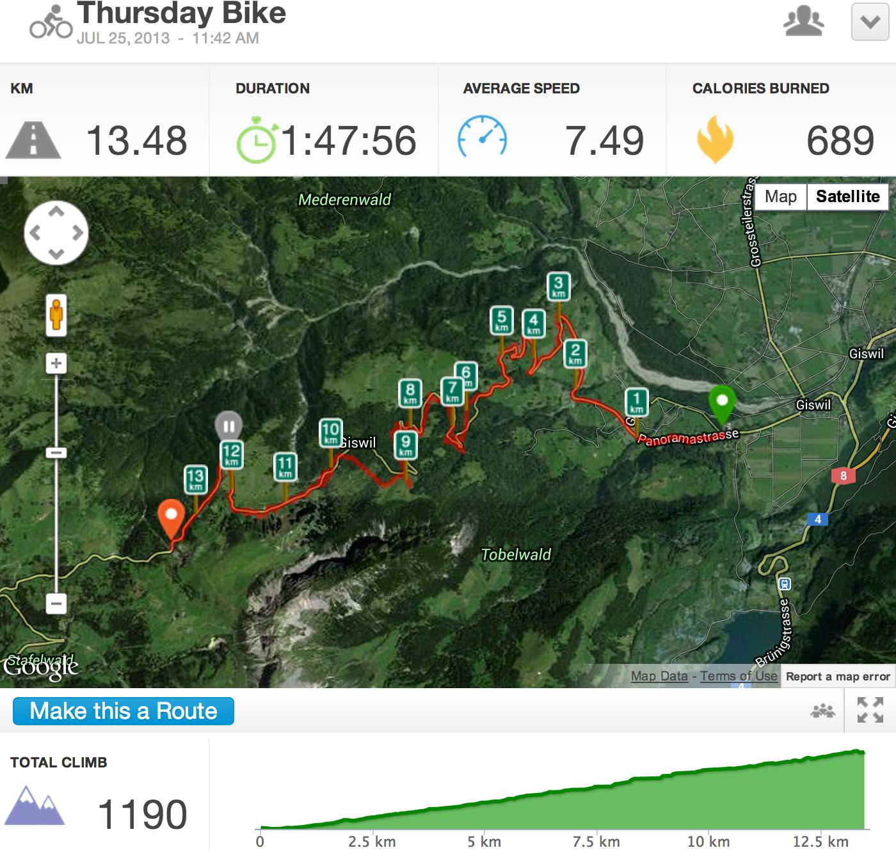
**이미지 캡션:** 이 화면은 자전거 타기 기록을 보여주는 앱 또는 웹사이트의 스크린샷으로, "Thursday Bike"라는 제목 아래 2013년 7월 25일 오전 11시 42분에 기록된 활동임을 나타냅니다. 화면 상단에는 총 거리 13.48km, 총 소요 시간 1시간 47분 56초, 평균 속도 7.49km/h, 소모 칼로리 689kcal가 표시됩니다. 중앙에는 위성 지도 위에 자전거 경로가 빨간색 선으로 표시되어 있으며, 경로상의 주요 지점들이 1번부터 13번까지 번호와 함께 표시되어 있습니다. 지도에는 "Mederenwald", "Tobelwald", "Giswil", "Panoramastrasse" 등의 지명이 보입니다. 지도 왼쪽에는 확대/축소 및 이동을 위한 컨트롤 버튼이 있습니다. 화면 하단에는 총 상승 고도가 1190m임을 나타내는 그래프와 함께 "Make this a Route"라는 버튼이 있습니다. 전반적으로 활동적인 야외 활동의 기록을 시각적으로 보여주는 정보성 화면입니다.

> Warning: 1120m climb in 12km.
> very tired after 12km uphill.
> Finally...
> Only 689 calories?

### 7월 27일 (토) 06:32 · Swiss Cycling (Alpine Panorama Route) Da…

Swiss Cycling (Alpine Panorama Route) Day 5 (Last day). Morning: cycling from Sörenberg to Thun, Noon: swimming at the Thun Lake, and finally Afternoon: hiking from First to Grindelwald. I guess It's the best way to finish this trip. I'll miss here!!

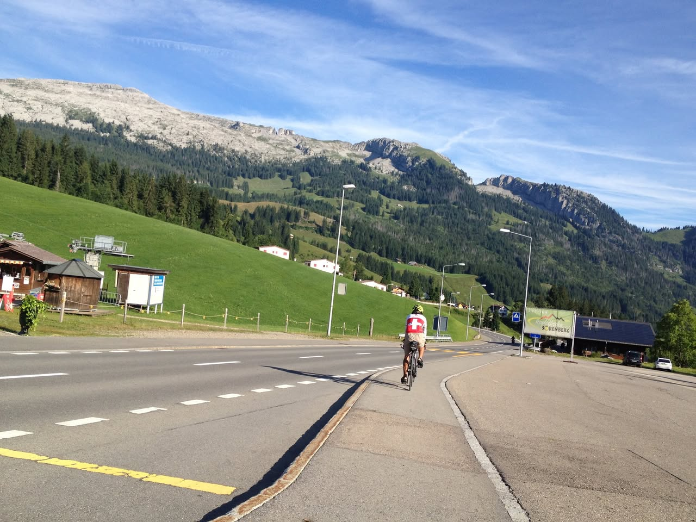
**이미지 캡션:** 푸른 하늘 아래, 한 명의 성인 남성이 자전거를 타고 도로를 달리고 있다. 그는 흰색과 빨간색이 섞인 저지를 입고 있으며, 헬멧을 착용하고 있다. 남성은 도로의 오른쪽 차선을 따라 주행 중이며, 그의 뒤로는 넓은 아스팔트 도로가 펼쳐져 있다. 도로 주변으로는 푸른 잔디가 깔린 완만한 언덕이 이어지고, 언덕 위에는 울창한 침엽수림이 빽빽하게 들어서 있다. 멀리 보이는 산봉우리는 거친 암석 지형을 드러내고 있으며, 맑고 푸른 하늘에는 옅은 구름이 드리워져 있다. 언덕 아래에는 몇 채의 작은 건물들이 보이며, 그중 하나에는 "SORENBERG"라는 글자가 쓰인 간판이 걸려 있다. 전반적으로 맑고 화창한 날씨 속에서 자연 경관을 즐기며 자전거를 타는 평화롭고 활동적인 분위기를 느낄 수 있다.
 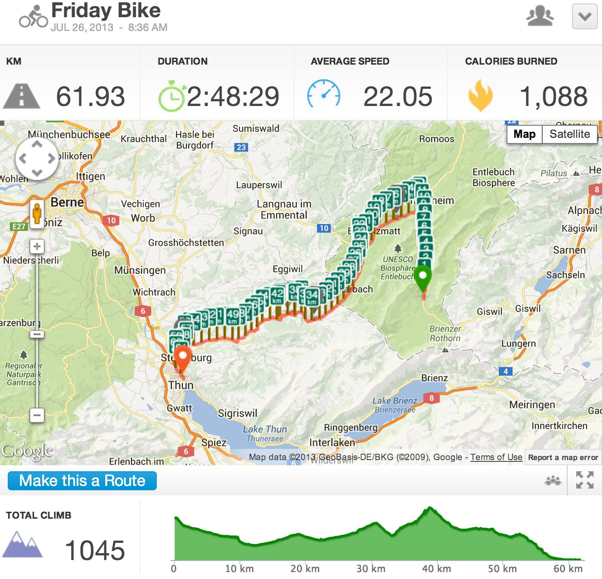
**이미지 캡션:** 이 사진은 자전거 타기 활동 기록을 보여주는 화면으로, 상단에는 "Friday Bike"라는 제목과 함께 2013년 7월 26일 오전 8시 36분이라는 날짜와 시간이 표시되어 있습니다. 화면 중앙에는 지도와 함께 다양한 통계 정보가 나타나는데, 총 이동 거리는 61.93km, 총 소요 시간은 2시간 48분 29초, 평균 속도는 22.05km/h, 소모 칼로리는 1,088kcal로 표시됩니다. 지도에는 스위스의 베른(Berne)과 툰(Thun) 지역을 중심으로 자전거 경로가 표시되어 있으며, 경로를 따라 여러 지점의 이동 속도 정보가 숫자로 나타나 있습니다. 또한, 화면 하단에는 총 상승 고도가 1045m임을 보여주는 그래프가 함께 표시되어 있습니다. 지도에는 "Map"과 "Satellite" 옵션이 있으며, "Make this a Route"라는 버튼도 보입니다. 전반적으로 활동적인 야외 활동 기록을 보여주는 화면으로, 날씨는 맑고 활동하기 좋은 날로 추정됩니다.
 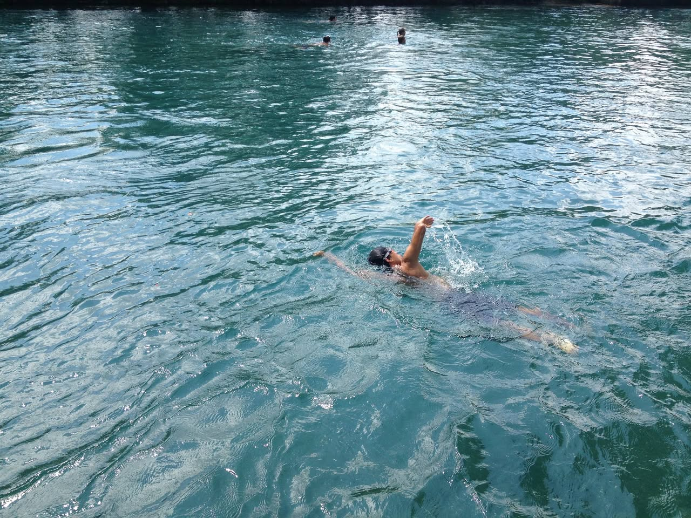
**이미지 캡션:** 푸른 물결이 일렁이는 넓은 호수나 바다에서 한 명의 성인 남성이 자유형으로 수영하고 있다. 남성은 검은색 수영모와 짙은 색의 수영복을 착용하고 있으며, 얼굴에는 선글라스를 끼고 있다. 오른팔을 앞으로 뻗어 물을 가르며 힘차게 나아가고 있고, 물보라가 시원하게 흩날린다. 그의 표정은 집중한 듯 보이며, 건강하고 활기찬 모습이다. 배경에는 수면 위로 희미하게 보이는 다른 몇 명의 사람들이 수영을 즐기고 있으며, 멀리 수면 아래로 보이는 어두운 색의 물체는 호수나 바다의 깊이를 암시하는 듯하다. 수면은 햇빛을 받아 반짝이며 청량한 느낌을 준다. 전체적으로 시원하고 활동적인 여름날의 풍경을 담고 있다.
 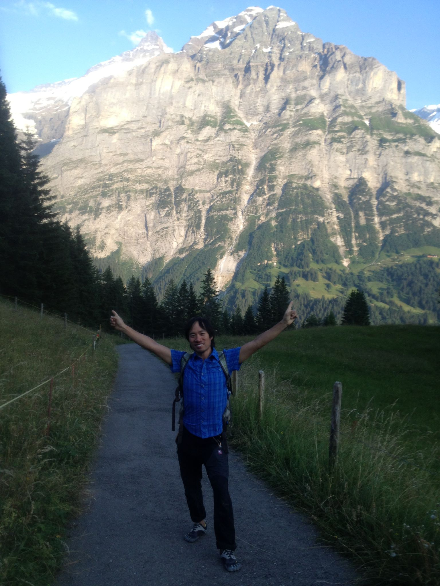
**이미지 캡션:** 한 명의 성인 남성이 푸른색 체크무늬 셔츠와 검은색 바지를 입고 배낭을 메고 있으며, 두 팔을 활짝 벌리고 엄지손가락을 치켜세우고 있다. 그는 맑고 푸른 하늘 아래 웅장한 산을 배경으로 숲이 우거진 산비탈을 가로지르는 포장된 길 위에 서 있다. 남자는 30대 후반에서 40대 초반으로 보이며, 그의 얼굴에는 행복하고 활기찬 표정이 역력하다. 길 옆으로는 잔디밭과 숲이 펼쳐져 있고, 멀리 보이는 산봉우리는 눈으로 덮여 있다. 전체적으로 평화롭고 아름다운 자연 속에서 즐거움을 만끽하는 듯한 분위기이다.
 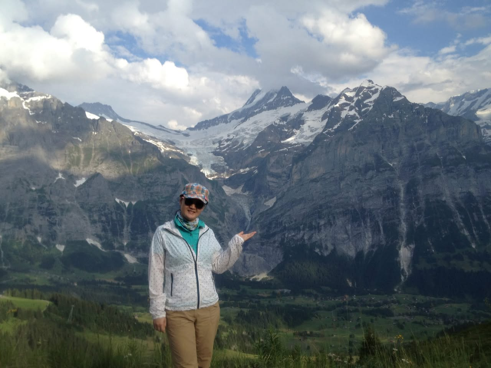
**이미지 캡션:** 한 성인 여성이 푸른색과 흰색이 섞인 점무늬가 있는 얇은 바람막이 재킷을 입고 갈색 바지를 입고 있다. 그녀는 체크무늬 모자와 선글라스를 쓰고 있으며, 목에는 파란색 스카프를 두르고 있다. 그녀는 카메라를 향해 미소를 지으며 오른손을 뻗어 배경을 가리키고 있다. 배경에는 눈 덮인 봉우리와 험준한 산들이 펼쳐져 있으며, 산 중턱에는 울창한 숲과 푸른 초원이 보인다. 하늘에는 구름이 흩뿌려져 있으며, 전체적으로 맑고 시원한 날씨임을 알 수 있다. 이 사진은 스위스의 알프스 산맥으로 추정되는 아름다운 자연 풍경 속에서 여행을 즐기는 사람의 모습을 담고 있다.

### 7월 29일 (월) 21:46 · Yeon is blocked by cow crossing!

Yeon is blocked by cow crossing!
