# 2013년 9월

[← 2013년](README.md)

### 9월 8일 (일) 17:09 · I really like this picture to introduce …

I really like this picture to introduce speakers from worldwide from http://msrsummit2013.se-naist.jp/. Very nice!

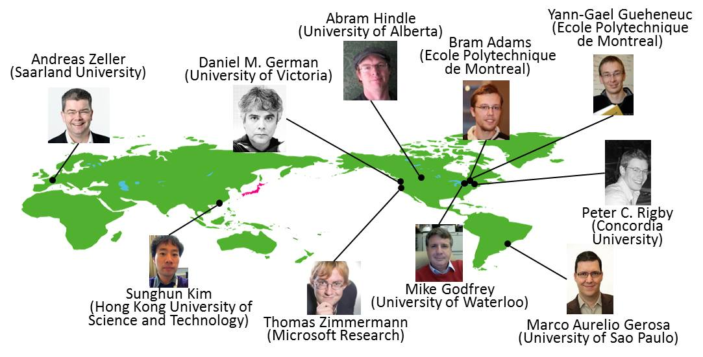
**이미지 캡션:** 이 이미지는 전 세계 지도 위에 여러 사람들의 사진과 이름, 소속 대학이 표시된 다이어그램으로, 각 사람의 위치가 지도상의 특정 지점과 선으로 연결되어 있습니다. 지도 상단에는 Andreas Zeller (Saarland University)라는 이름과 함께 중년 남성의 사진이 있고, 그 옆에는 Daniel M. German (University of Victoria)라는 이름과 함께 백발의 중년 남성 사진이 있습니다. 지도 중앙 상단에는 Abram Hindle (University of Alberta)라는 이름과 함께 안경을 쓴 젊은 남성 사진이 있고, 그 옆에는 Bram Adams (Ecole Polytechnique de Montreal)라는 이름과 함께 안경을 쓴 젊은 남성 사진이 있습니다. 지도 우측 상단에는 Yann-Gael Guheneuc (Ecole Polytechnique de Montreal)라는 이름과 함께 안경을 쓴 젊은 남성 사진이 있고, 그 아래에는 Peter C. Rigby (Concordia University)라는 이름과 함께 안경을 쓴 젊은 남성 사진이 있습니다. 지도 하단 좌측에는 Sunghun Kim (Hong Kong University of Science and Technology)라는 이름과 함께 젊은 아시아 남성 사진이 있고, 그 옆에는 Thomas Zimmermann (Microsoft Research)라는 이름과 함께 안경을 쓴 금발의 중년 남성 사진이 있습니다. 지도 하단 우측에는 Mike Godfrey (University of Waterloo)라는 이름과 함께 중년 남성 사진이 있고, 그 아래에는 Marco Aurelio Gerosa (University of Sao Paulo)라는 이름과 함께 안경을 쓴 중년 남성 사진이 있습니다. 각 사진에는 검은색 선이 지도상의 특정 지점으로 연결되어 있어, 이들이 전 세계적으로 분포되어 있음을 보여줍니다. 전반적으로 학술적 또는 연구 협력 네트워크를 시각적으로 표현한 것으로 보이며, 밝고 정보 전달에 초점을 맞춘 분위기입니다.

### 9월 10일 (화) 01:39 · Before and After (thanks to this tutoria…

Before and After (thanks to this tutorial video http://vimeo.com/8613681).

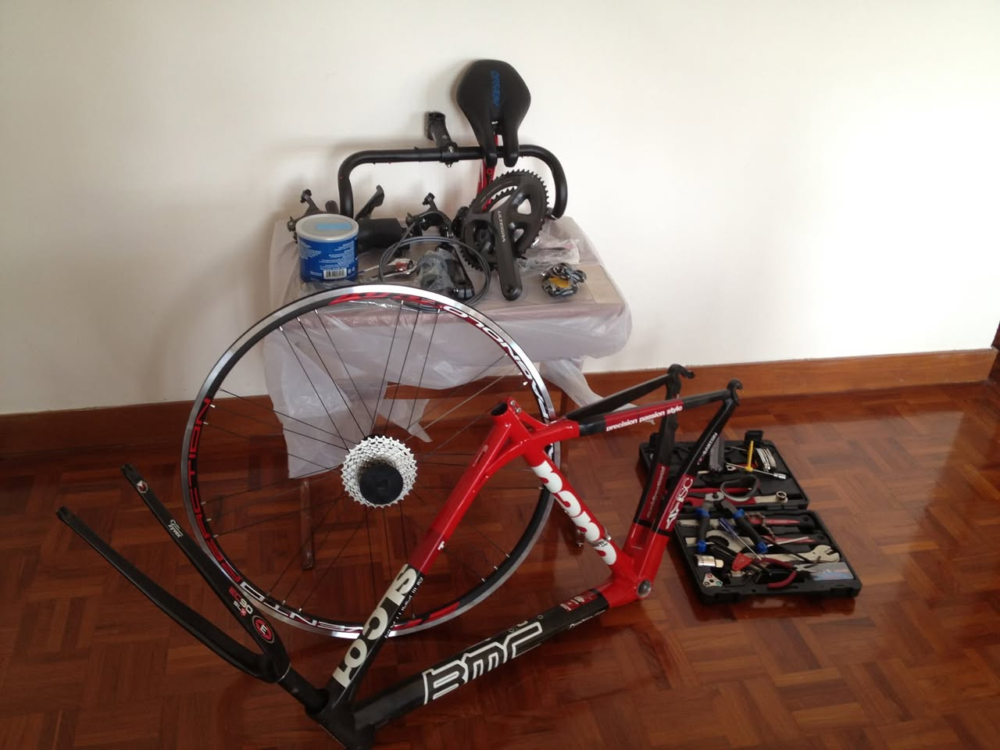
**이미지 캡션:** 이 사진은 자전거 부품들이 바닥에 놓여 있는 모습을 보여줍니다. 중앙에는 빨간색 프레임의 로드 자전거가 분해된 상태로 놓여 있으며, 앞바퀴는 옆에 세워져 있습니다. 프레임에는 "BMC"라는 로고와 함께 "precision passion style"이라는 문구가 흰색으로 새겨져 있습니다. 자전거 프레임 앞쪽에는 공구함이 열려 있고 다양한 종류의 자전거 수리 공구들이 가지런히 놓여 있습니다. 배경에는 흰색 벽과 갈색 나무 바닥이 보이며, 벽에는 자전거의 핸들바와 안장, 크랭크셋 등이 놓인 테이블이 있습니다. 테이블 위에는 파란색 뚜껑의 통과 다른 자전거 부품들이 보입니다. 전체적으로 자전거 정비 또는 조립을 준비하는 듯한 분위기입니다.
 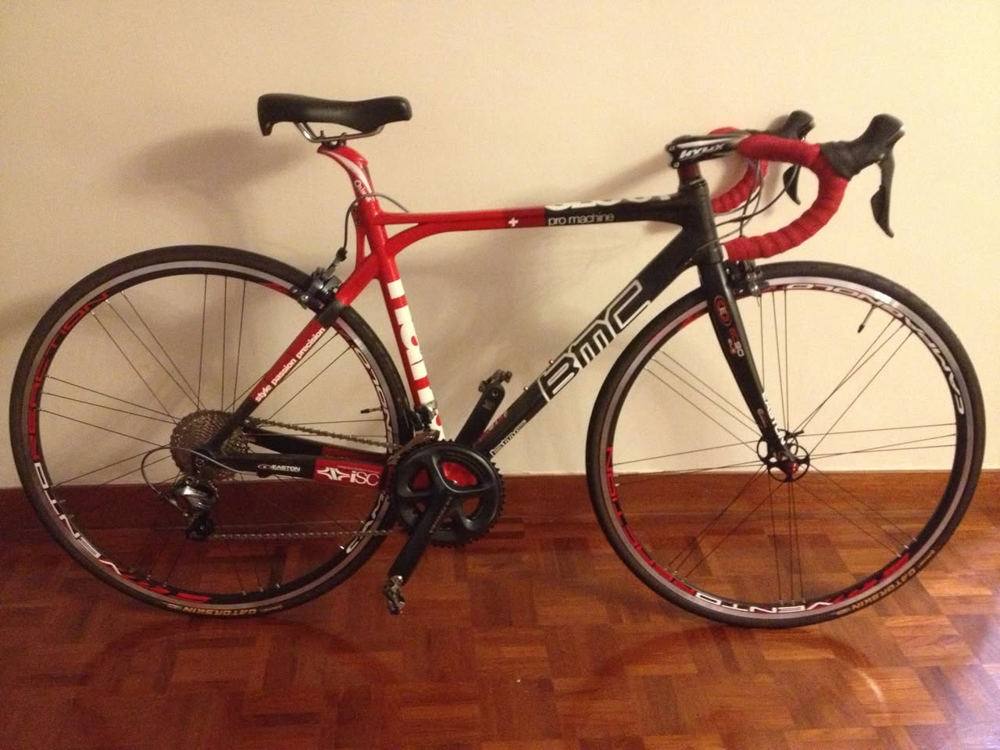
**이미지 캡션:** 이 사진은 실내에 놓인 빨간색과 검은색의 로드 자전거를 보여줍니다. 자전거는 나무 바닥 위에 세워져 있으며, 배경에는 연한 베이지색 벽이 있습니다. 자전거의 프레임에는 "BMC"와 "pro machine"이라는 글자가 새겨져 있습니다. 핸들바는 빨간색 바테이프로 감겨 있으며, 앞바퀴와 뒷바퀴 모두 검은색 림과 스포크를 가지고 있습니다. 뒷바퀴 림에는 "GATORSKIN"이라는 글자가 보입니다. 자전거의 안장과 핸들바는 검은색이며, 페달은 금속 재질입니다. 자전거는 정면에서 약간 왼쪽으로 기울어진 상태로 놓여 있으며, 전체적으로 깔끔하고 잘 관리된 상태로 보입니다. 사진에는 사람이 등장하지 않습니다.

> After!

### 9월 13일 (금) 11:02 · It's the best way to start the day of IC…

It's the best way to start the day of ICSE 2014 deadline. Good luck to ALL!

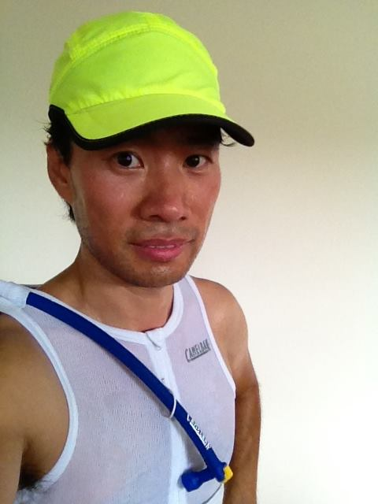
**이미지 캡션:** 이 사진은 형광 연두색 모자를 쓰고 흰색 민소매 셔츠를 입은 성인 남성을 클로즈업하여 보여줍니다. 남성은 땀을 흘리고 있으며, 얼굴에는 약간의 미소를 띠고 있습니다. 셔츠에는 "CAMELBAK"이라는 로고가 보이며, 파란색 물 호스가 셔츠 앞쪽으로 내려와 있습니다. 배경은 옅은 베이지색 벽으로, 특별한 사물이나 장소는 보이지 않습니다. 전체적으로 운동 후 또는 운동 중에 찍은 것으로 보이는 상황이며, 건강하고 활동적인 분위기를 풍깁니다.

### 9월 19일 (목) 11:12 · ran in Rome -- the world's most historic…

ran in Rome -- the world's most historically and culturally rich 10K route including Colosseum, Trevi Fountain, Pantheon, Piazza Navona, and Bocca della Verità.

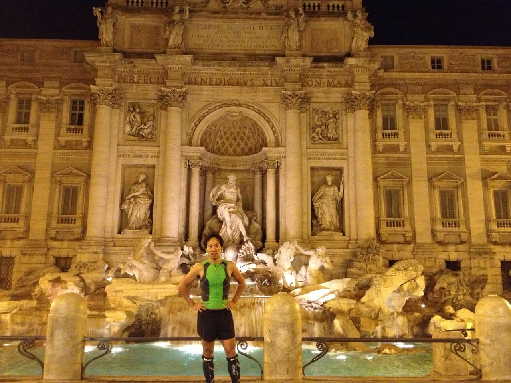
**이미지 캡션:** 밤에 조명이 켜진 트레비 분수 앞에서 한 성인 남성이 포즈를 취하고 있다. 남성은 30대 후반에서 40대 초반으로 보이며, 짧은 검은 머리에 옅은 미소를 띠고 있다. 그는 녹색과 검은색이 조합된 민소매 상의와 검은색 반바지, 그리고 종아리까지 올라오는 검은색 스포츠 양말을 착용하고 있다. 두 손을 허리에 얹고 자신감 있는 표정으로 카메라를 응시하고 있다. 배경에는 웅장한 바로크 양식의 트레비 분수가 있으며, 분수 조각상들과 건물 외벽이 황금빛 조명으로 빛나고 있다. 분수 앞에는 맑은 물이 흐르고 있으며, 물 위로는 난간이 설치되어 있다. 전반적으로 관광객이 많이 찾는 유명 명소에서 기념 사진을 찍는 듯한 분위기이다.
 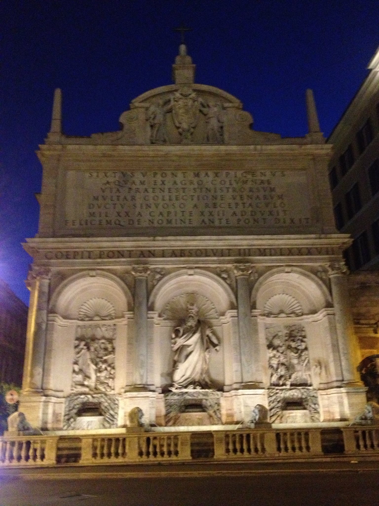
**이미지 캡션:** 어두운 밤하늘을 배경으로 조명이 켜진 웅장한 분수 조각상이 보인다. 분수는 여러 층으로 이루어져 있으며, 중앙에는 왕관을 쓰고 긴 수염을 가진 성인 남성 조각상이 서 있고, 그 양옆으로는 다른 조각상들이 자리하고 있다. 분수 상단에는 라틴어로 된 비문이 새겨져 있으며, 그 위로 십자가 모양의 장식이 얹혀 있다. 분수 앞에는 난간이 설치되어 있고, 분수 조각상들은 정교하게 조각되어 있으며, 전체적으로 고풍스럽고 예술적인 분위기를 자아낸다.
 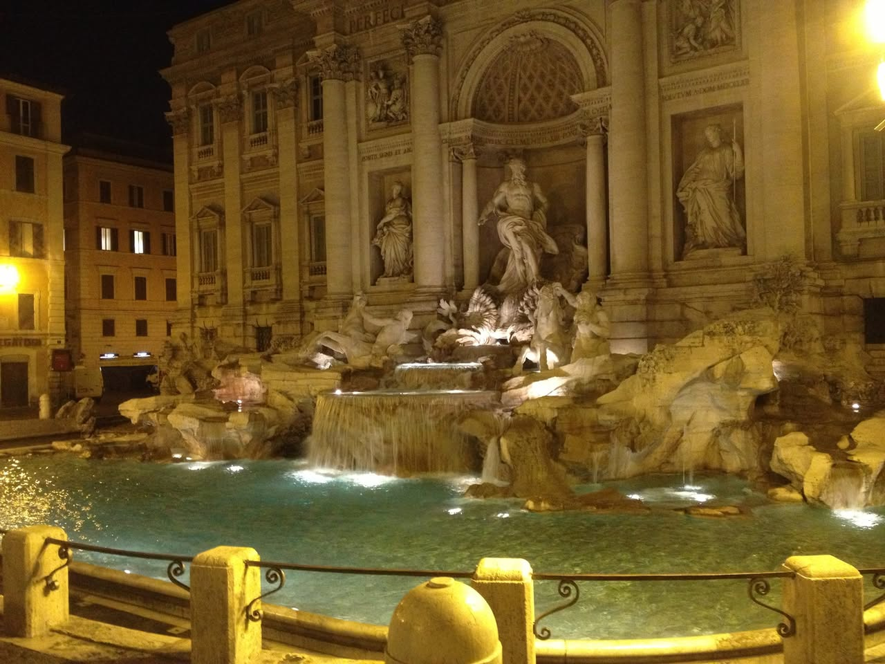
**이미지 캡션:** 밤에 조명이 켜진 트레비 분수와 주변 건물들의 모습이다. 분수에는 여러 조각상들이 배치되어 있으며, 물이 폭포처럼 쏟아져 내리고 있다. 분수 앞쪽에는 얕은 연못이 있고, 연못 가장자리에는 난간이 설치되어 있다. 분수 뒤편에는 웅장한 바로크 양식의 건물이 있으며, 건물에는 여러 개의 창문과 조각상들이 보인다. 건물 외벽에는 "PERFECT"라는 글자가 희미하게 보인다. 분수와 건물 모두 황금빛 조명으로 인해 따뜻하고 신비로운 분위기를 자아낸다. 주변에는 다른 건물들도 보이며, 밤이라 어두운 하늘이 배경을 이룬다. 특별히 사람이나 사물은 눈에 띄지 않으며, 분수의 아름다움과 웅장함에 초점이 맞춰져 있다.
 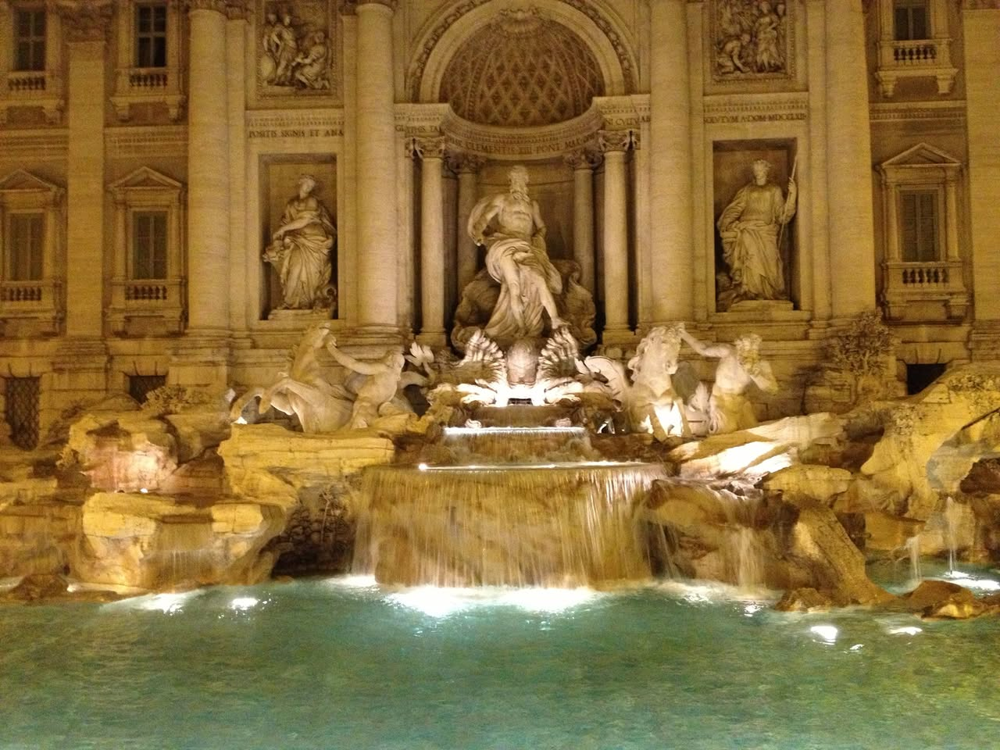
**이미지 캡션:** 이 사진은 밤에 조명으로 밝혀진 트레비 분수의 웅장한 모습을 담고 있습니다. 중앙에는 거대한 조각상들이 배치되어 있으며, 가장 높은 곳에는 물의 신으로 보이는 남성 조각상이 역동적인 자세로 서 있고, 그 아래로는 여러 인물 조각상들이 바위와 폭포를 배경으로 조화를 이루고 있습니다. 조각상들은 흰색 대리석으로 만들어졌으며, 일부는 물에 젖어 더욱 생생한 느낌을 줍니다. 분수 앞쪽으로는 푸른색 물이 잔잔하게 펼쳐져 있으며, 물결 위로 조명의 빛이 반사되어 몽환적인 분위기를 자아냅니다. 분수 뒤편의 건물은 바로크 양식의 건축물로, 창문과 기둥, 그리고 다양한 장식들이 정교하게 조각되어 있습니다. 건물에는 "POSITIS SKINA ET ANA"라는 라틴어 문구가 희미하게 보입니다. 전체적으로 사진은 고전적이면서도 신비로운 분위기를 연출하며, 밤의 정취와 예술적인 아름다움이 어우러져 감탄을 자아냅니다.
 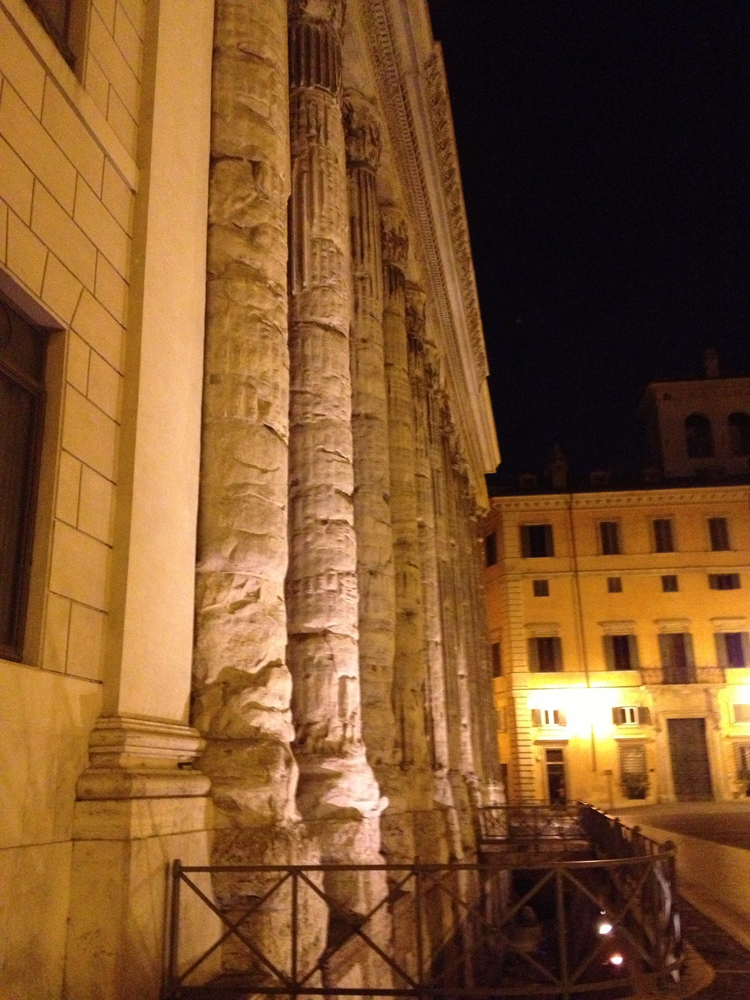
**이미지 캡션:** 밤에 조명이 켜진 고대 로마 건축물의 웅장한 기둥들이 늘어서 있고, 그 뒤로는 노란색 건물이 보입니다. 기둥들은 거칠고 오래된 질감을 가지고 있으며, 조명에 의해 그림자가 드리워져 입체감이 돋보입니다. 기둥 앞에는 금속 난간이 설치되어 있어 접근을 제한하고 있습니다. 노란색 건물은 여러 개의 창문과 발코니를 가지고 있으며, 일부 창문에서는 불빛이 새어 나와 따뜻한 분위기를 자아냅니다. 건물 앞에는 도로가 보이며, 밤하늘은 어둡습니다. 전체적으로 역사적인 장소의 고요하고 신비로운 밤 풍경을 담고 있습니다.
 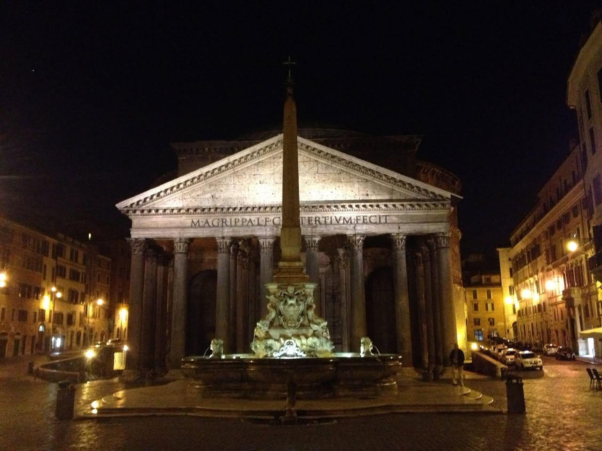
**이미지 캡션:** 밤에 조명이 켜진 로마 판테온 앞 광장의 모습으로, 광장 중앙에는 분수와 오벨리스크가 서 있고, 판테온 건물 앞에는 "MAGRIPPA LFC TERTIVM FECIT"라는 글자가 새겨져 있다. 건물 양옆으로는 오래된 건물들이 늘어서 있고, 거리에는 자동차들이 주차되어 있으며, 몇몇 사람들은 광장을 거닐고 있다. 전체적으로 고풍스럽고 로맨틱한 분위기를 자아낸다.
 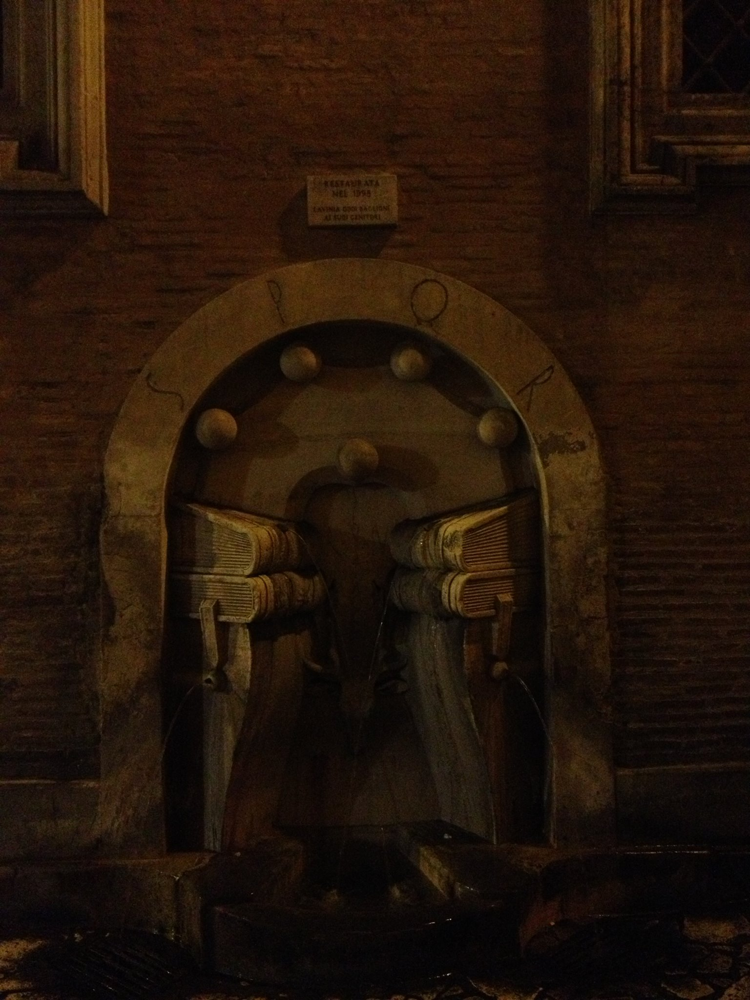
**이미지 캡션:** 이 사진은 밤에 촬영된 것으로 보이며, 오래된 벽돌 건물 외벽에 설치된 독특한 분수를 보여줍니다. 분수는 아치형 구조물 안에 자리 잡고 있으며, 마치 책이 쌓여 있는 듯한 조각이 두 개 있습니다. 각 책 조각에서는 물이 흘러나와 아래쪽으로 떨어집니다. 분수 위쪽 아치형 테두리에는 둥근 구슬 모양의 장식이 여러 개 박혀 있고, 그 위에는 "RESTAURATA NEL 1998 CAVINA"라고 쓰인 작은 명판이 붙어 있습니다. 이 명판은 분수가 1998년에 복원되었음을 나타냅니다. 분수 주변의 벽은 거친 질감의 벽돌로 되어 있으며, 왼쪽과 오른쪽에는 창문처럼 보이는 구조물이 있습니다. 전체적으로 어두운 조명과 오래된 건축 양식이 어우러져 신비롭고 고풍스러운 분위기를 자아냅니다. 분수 아래쪽에는 물이 고여 있는 듯한 어두운 부분이 보입니다. 이 사진에는 사람이 등장하지 않습니다.
 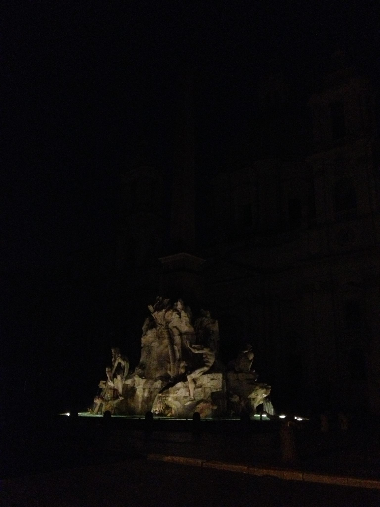
**이미지 캡션:** 어두운 밤, 조명으로 밝혀진 거대한 석조 분수가 시선을 사로잡는다. 분수는 여러 인물 조각상과 바위들로 이루어져 있으며, 마치 살아 움직이는 듯한 역동적인 모습을 하고 있다. 분수 주변으로는 어둠이 짙게 깔려 있고, 멀리 건물 실루엣이 희미하게 보인다. 분수 앞에는 물이 잔잔하게 흐르고 있으며, 조명 빛이 물에 반사되어 은은한 광채를 낸다. 전체적으로 신비롭고 웅장한 분위기를 자아낸다.
 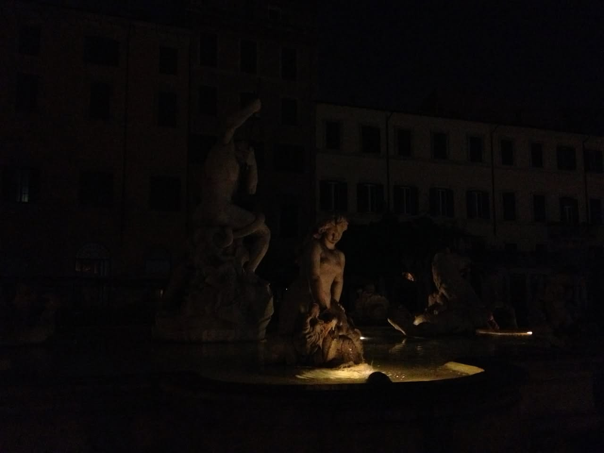
**이미지 캡션:** 어두운 밤, 조명이 켜진 분수대에는 여러 개의 조각상이 배치되어 있으며, 배경에는 건물이 보인다. 가장 왼쪽에는 팔을 위로 뻗고 있는 남성 조각상이 있고, 그 옆에는 무릎을 꿇고 앉아 있는 듯한 또 다른 남성 조각상이 있다. 이 조각상들은 물이 흐르는 분수대 안에 있으며, 조각상 주변의 물은 은은한 조명으로 인해 빛나고 있다. 건물의 창문들은 어둠 속에 잠겨 있고, 전체적으로 신비롭고 고요한 분위기를 자아낸다.
 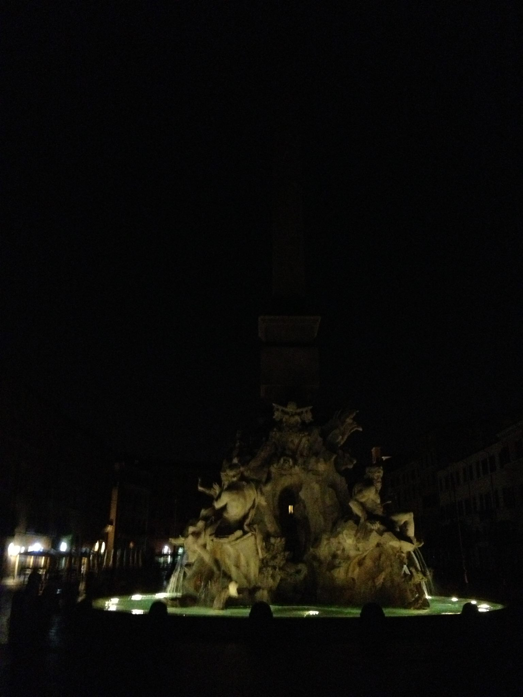
**이미지 캡션:** 어두운 밤, 조명이 켜진 거대한 분수 조각상이 시선을 사로잡는다. 분수는 여러 인물 조각상과 동물 조각상으로 이루어져 있으며, 물이 흘러내리며 신비로운 분위기를 자아낸다. 분수 주변에는 몇몇 사람들이 실루엣으로 보이며, 그들은 분수를 감상하거나 사진을 찍는 듯하다. 분수 뒤편으로는 건물이 보이고, 거리에는 가로등 불빛이 희미하게 빛나고 있다. 전체적으로 고풍스럽고 웅장한 분위기를 연출하며, 밤의 정취를 느끼게 한다.
 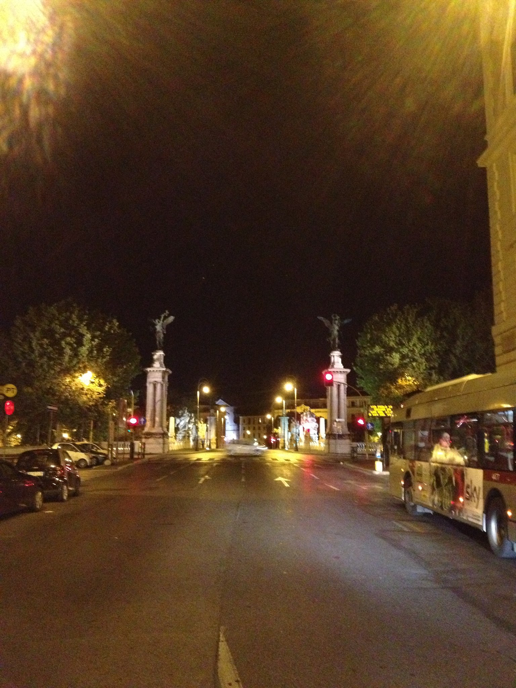
**이미지 캡션:** 밤에 도시 거리의 풍경으로, 도로에는 차량들이 통행하고 있으며, 양쪽에는 가로등과 건물들이 불빛을 밝히고 있습니다. 도로 중앙에는 흰색 차선이 그려져 있고, 좌측에는 여러 대의 승용차가 주차되어 있으며, 우측에는 버스가 지나가고 있습니다. 버스 측면에는 "SKY"라는 로고와 함께 광고 이미지가 보이며, 운전석에는 한 명의 성인 남성이 앉아 있습니다. 도로 양쪽에는 두 개의 거대한 기둥 조각상이 서 있고, 그 뒤로 건물들이 보입니다. 전반적으로 도시의 밤 풍경을 보여주는 사진으로, 조명이 밝고 활기찬 분위기입니다.
 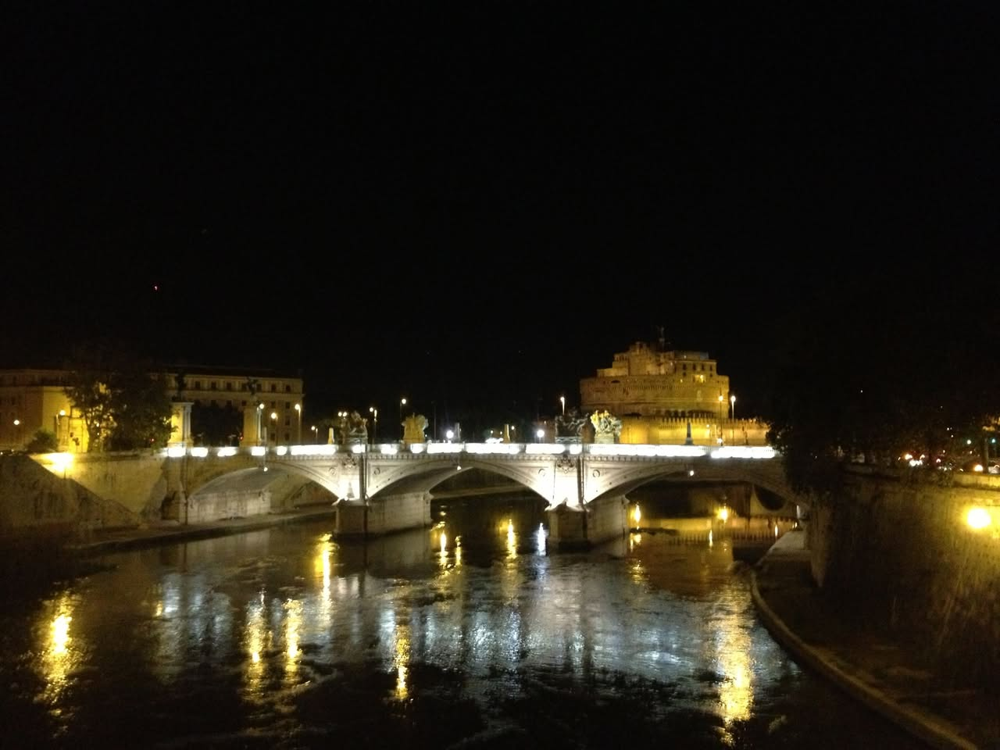
**이미지 캡션:** 이 사진은 밤에 강과 다리, 그리고 멀리 보이는 성채의 모습을 담고 있습니다. 사진 중앙에는 여러 개의 아치로 이루어진 다리가 보이며, 다리 위에는 조명이 켜져 있어 밝게 빛나고 있습니다. 다리 위에는 조각상들이 보이며, 이는 역사적인 건축물임을 암시합니다. 다리 아래로는 강물이 흐르고 있으며, 강물 위에는 다리와 주변 건물들의 불빛이 반사되어 아름다운 풍경을 연출합니다. 강 건너편에는 오래된 건물들이 보이며, 이 역시 조명으로 인해 따뜻한 노란빛을 띠고 있습니다. 멀리 보이는 성채는 독특한 건축 양식을 가지고 있으며, 밤하늘을 배경으로 웅장한 모습을 드러냅니다. 전체적으로 사진은 어두운 밤이지만, 조명 덕분에 따뜻하고 낭만적인 분위기를 자아냅니다. 사람이나 구체적인 사물은 보이지 않으며, 오직 건축물과 자연이 어우러진 야경을 보여줍니다.
 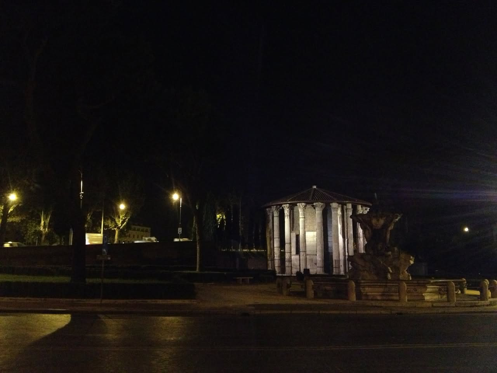
**이미지 캡션:** 어두운 밤, 조명이 켜진 고대 로마의 사원과 분수가 있는 광장이 보인다. 사원은 둥근 모양에 기둥이 둘러져 있으며, 분수에는 조각상이 있다. 주변에는 나무와 벤치가 있고, 멀리 건물과 가로등 불빛이 보인다. 도로에는 차량 불빛이 반사되어 있다. 전체적으로 고요하고 신비로운 분위기이다.
 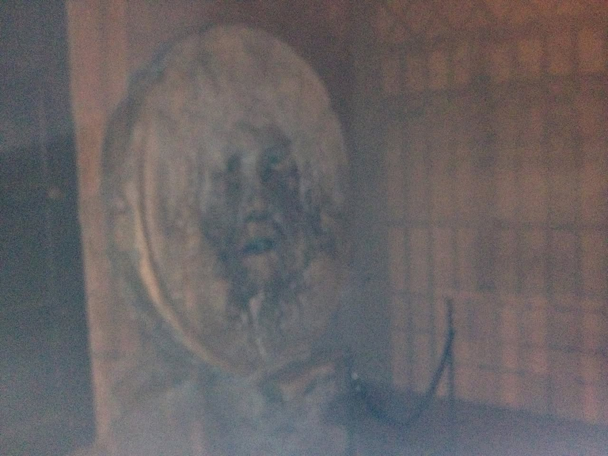
**이미지 캡션:** 흐릿한 사진 속에서 거울에 비친 한 성인 남성의 얼굴이 보인다. 남성은 40대에서 50대로 추정되며, 머리카락은 희끗희끗하고 얼굴에는 주름이 있다. 그의 표정은 어둡고 무거워 보이며, 눈은 초점이 흐릿하다. 남성은 어두운 색상의 옷을 입고 있으며, 거울을 응시하고 있다. 배경은 어둡고 흐릿하여 정확한 장소를 파악하기 어렵지만, 벽으로 보이는 격자무늬가 희미하게 보인다. 전체적으로 어둡고 음산한 분위기를 자아내며, 마치 오래된 필름 사진이나 꿈속의 장면처럼 몽환적인 느낌을 준다.
 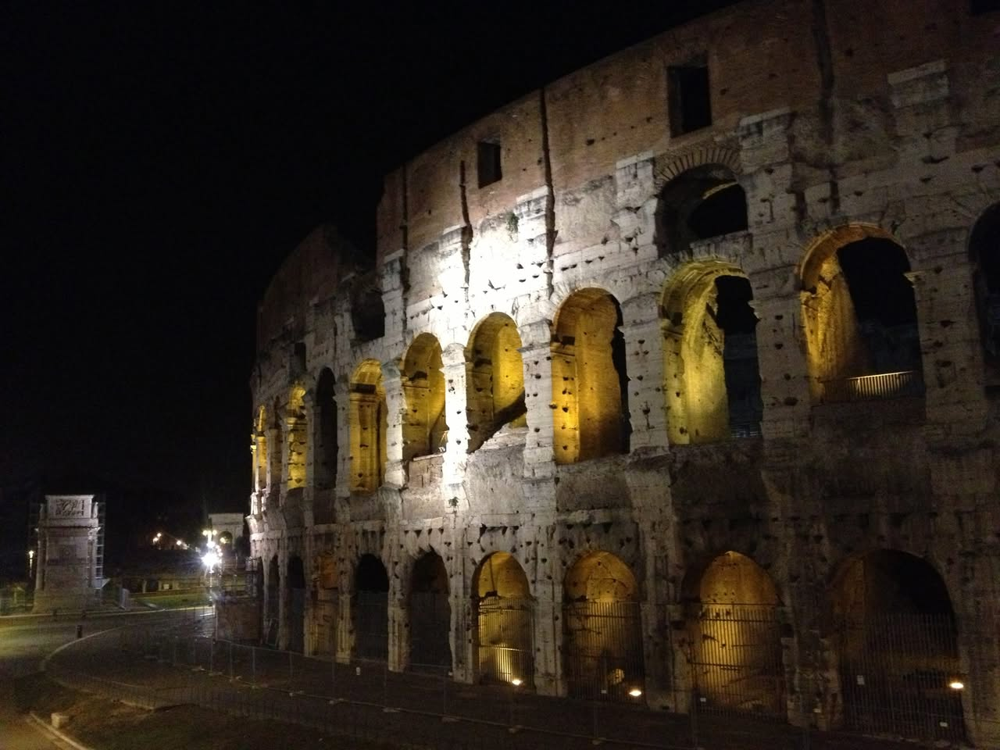
**이미지 캡션:** 밤에 조명으로 밝혀진 콜로세움의 모습으로, 웅장한 고대 로마 건축물의 외벽이 드러나 있으며, 아치형 통로들이 여러 층에 걸쳐 나 있다. 콜로세움의 돌벽은 오랜 세월의 흔적을 보여주며, 일부는 파손되어 있지만 여전히 견고한 모습을 유지하고 있다. 아치 내부에는 따뜻한 노란색 조명이 비추고 있어 신비롭고 고풍스러운 분위기를 자아낸다. 콜로세움 앞쪽으로는 철제 울타리가 설치되어 있으며, 그 너머에는 잔디밭과 도로가 보인다. 멀리 왼쪽에는 개선문으로 보이는 석조 구조물이 희미하게 보이고, 주변에는 가로등 불빛이 점점이 빛나고 있다. 전체적으로 어두운 밤하늘과 대비되는 콜로세움의 모습이 인상적이며, 역사적인 장소의 웅장함과 고요함을 느낄 수 있다. 이 사진에는 사람이 보이지 않는다.
 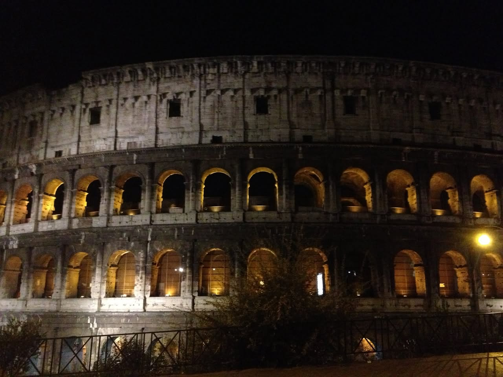
**이미지 캡션:** 밤에 조명으로 빛나는 콜로세움의 모습으로, 웅장한 고대 로마 건축물의 외관이 드러나 있습니다. 콜로세움은 여러 층으로 이루어져 있으며, 각 층에는 아치형 통로와 창문들이 줄지어 있습니다. 조명은 주로 아치 내부와 창문 안쪽에 설치되어 있어 따뜻하고 황금빛의 빛을 발산하며, 어두운 밤하늘과 대비를 이룹니다. 건물 앞쪽으로는 어두운 배경에 짙은 녹색의 나무와 덤불이 보이며, 금속 재질의 낮은 울타리가 콜로세움과 관람객 사이를 구분하고 있습니다. 오른쪽에는 노란색 불빛을 내는 가로등이 희미하게 보입니다. 사진에는 사람이 보이지 않으며, 텍스트도 없습니다. 전반적으로 역사적인 장소의 밤 풍경을 담은 고요하고 신비로운 분위기를 자아냅니다.
 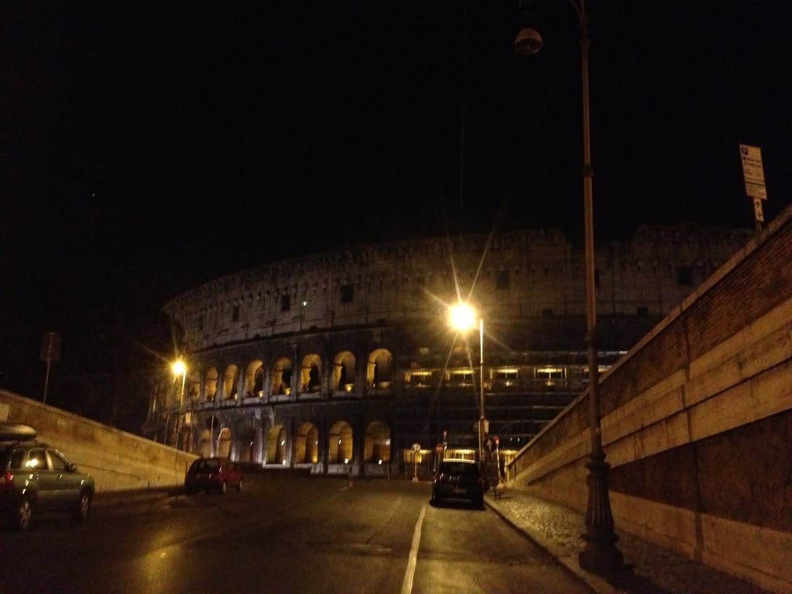
**이미지 캡션:** 어두운 밤, 로마 콜로세움이 조명에 빛나고 있으며, 주변에는 차량과 가로등이 보인다. 콜로세움은 웅장한 모습으로 밤하늘을 배경으로 서 있고, 아치형 통로에는 불빛이 새어 나와 신비로운 분위기를 자아낸다. 도로에는 몇 대의 차량이 주행 중이거나 주차되어 있으며, 가로등 불빛이 도로를 밝히고 있다. 사진의 오른쪽에는 벽돌로 쌓은 높은 담장이 보이고, 그 위에는 주차 금지 표지판이 설치되어 있다. 전반적으로 고대 유적의 웅장함과 도시의 밤 풍경이 어우러져 인상적인 장면을 연출한다.
 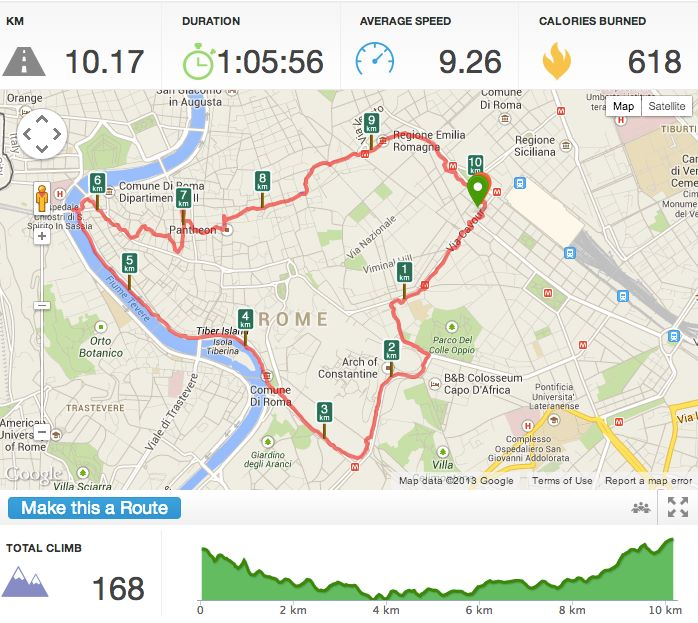
**이미지 캡션:** 이 이미지는 로마 시내를 자전거로 이동한 경로를 보여주는 화면 캡처입니다. 상단에는 총 이동 거리 10.17km, 소요 시간 1시간 5분 56초, 평균 속도 9.26km/h, 소모 칼로리 618kcal가 표시됩니다. 지도에는 핑크색 선으로 자전거 경로가 표시되어 있으며, 경로 상에는 1km부터 10km까지 구간별 거리가 표시되어 있습니다. 주요 지점으로는 테베레 강, 티베르 섬, 판테온, 콜로세움, 콘스탄티누스 개선문 등이 보입니다. 지도 하단에는 총 상승 고도가 168m임을 나타내는 그래프가 있습니다. 이 화면은 운동 기록 앱이나 웹사이트의 일부로 보이며, 사용자가 자신의 운동 기록을 확인하고 공유할 수 있도록 합니다.

### 9월 27일 (금) 09:09 · His hair style has been changed after 20…

His hair style has been changed after 20K run. :-) However, he is getting ready for a half-marathon on Nov 3 in Hong Kong.

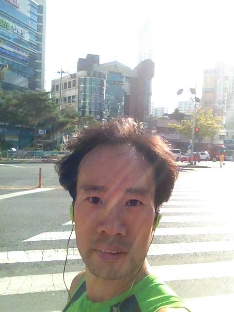
**이미지 캡션:** 이 사진은 밝은 햇살 아래 도시 거리에서 셀카를 찍고 있는 성인 남성을 보여줍니다. 남성은 40대 후반에서 50대 초반으로 보이며, 짧은 머리에 약간의 주름이 있습니다. 그는 녹색 스포츠 상의를 입고 있으며, 귀에는 녹색 이어폰을 끼고 있습니다. 그의 표정은 약간 미소를 띠고 있으며, 카메라를 응시하고 있습니다. 배경에는 여러 층으로 된 현대적인 건물들과 신호등, 그리고 횡단보도가 보입니다. 건물 중 하나에는 십자가 모양의 지붕이 있어 종교 시설일 가능성을 시사합니다. 거리는 깨끗하고 잘 정돈되어 있으며, 몇몇 차량과 사람들이 멀리 보입니다. 전체적으로 활기찬 도시의 낮 풍경 속에서 운동이나 산책을 즐기는 듯한 분위기입니다.
 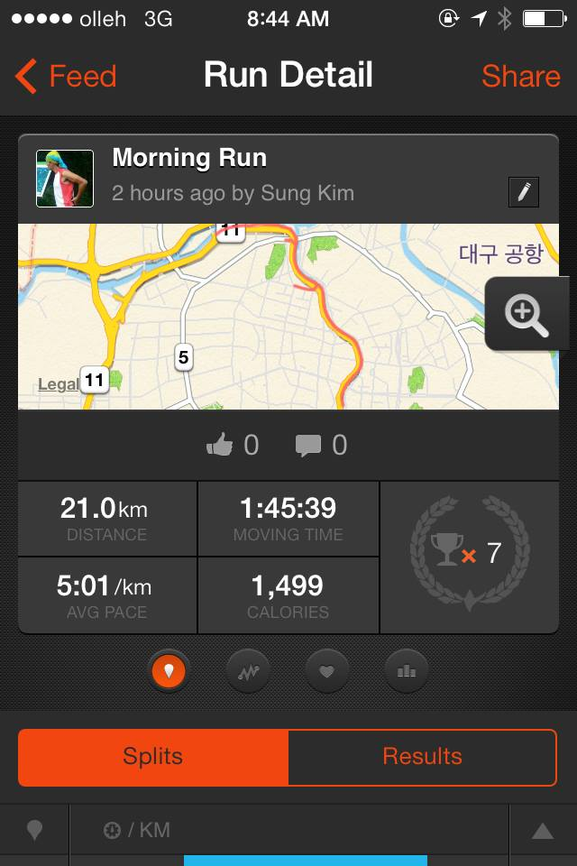
**이미지 캡션:** 이 화면은 스마트폰 앱의 달리기 기록 상세 화면으로, 상단에는 시간과 통신 상태, 그리고 "Feed", "Run Detail", "Share" 버튼이 보입니다. 중앙에는 "Morning Run"이라는 제목과 함께 달리기 기록을 올린 사람의 프로필 사진, "2 hours ago by Sung Kim"이라는 문구가 표시되어 있습니다. 프로필 사진 속 인물은 젊은 성인 여성으로 보이며, 머리에는 파란색 두건을 쓰고 밝은 색상의 운동복을 입고 있습니다. 그녀는 카메라를 향해 살짝 미소를 짓고 있으며, 팔을 들어 올리는 듯한 동작을 하고 있습니다. 그 아래에는 달린 경로가 표시된 지도 이미지가 있고, 지도에는 "대구 공항"이라는 텍스트와 함께 확대/축소 버튼이 있습니다. 지도 위에는 "Legal 11"이라는 텍스트와 숫자 "5", "11"이 표시된 표지판이 보입니다. 지도 아래에는 좋아요와 댓글 아이콘과 함께 각각 0개의 숫자가 표시되어 있습니다. 그 아래에는 달리기 기록을 요약한 정보가 네 개의 칸으로 나뉘어 표시되어 있는데, 왼쪽 위에는 "21.0km DISTANCE", 왼쪽 아래에는 "5:01/km AVG PACE"가, 오른쪽 위에는 "1:45:39 MOVING TIME", 오른쪽 아래에는 "1,499 CALORIES"가 표시되어 있습니다. 가장 오른쪽에는 트로피와 함께 "x 7"이라는 문구가 있어 7번의 달리기 관련 성과를 달성했음을 나타냅니다. 화면 하단에는 "Splits"와 "Results"라는 두 개의 버튼이 있으며, "Splits" 버튼은 주황색으로 강조되어 있습니다. 전반적으로 활동적인 분위기를 나타내는 디자인과 정보를 담고 있습니다.

### 9월 27일 (금) 09:13 · 📷 앨범: Profile pictures (2장)

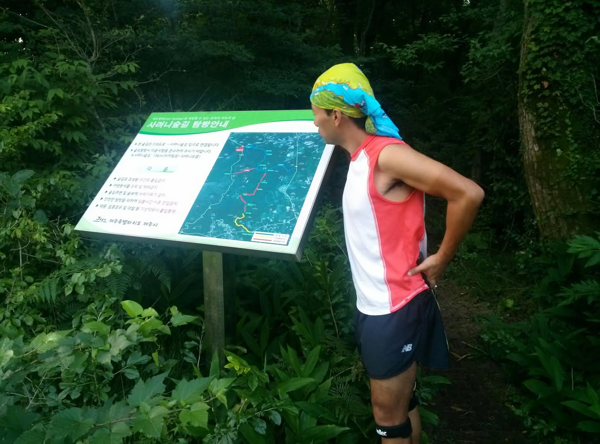
**이미지 캡션:** 한 성인 남성이 숲길에 설치된 탐방 안내판을 보고 있다. 남성은 30대 후반에서 40대 초반으로 보이며, 노란색과 파란색이 섞인 두건을 쓰고 있다. 흰색과 붉은색이 배색된 민소매 상의와 검은색 반바지를 착용했으며, 무릎에는 검은색 보호대를 하고 있다. 안내판에는 사려니숲길의 지도와 함께 탐방 시 유의사항이 한국어로 적혀 있다. 주변은 울창한 숲으로 둘러싸여 있으며, 햇빛이 나뭇잎 사이로 비쳐 들어와 자연적인 분위기를 자아낸다. 남성은 안내판을 꼼꼼히 살펴보며 길을 확인하는 듯한 모습이다.
 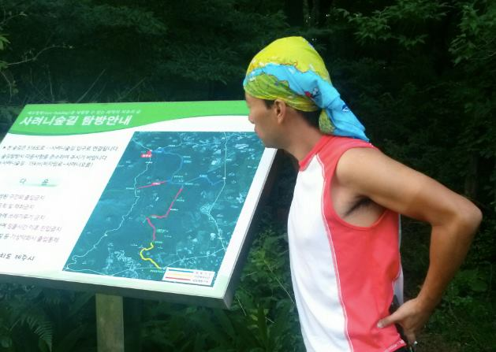
**이미지 캡션:** 한 성인 남성이 밝은 색상의 머리 스카프를 쓰고 빨간색과 흰색이 섞인 민소매 상의를 입고 있으며, 숲길 안내판을 자세히 들여다보고 있다. 안내판에는 한국어로 "사려니숲길 탐방안내"라고 쓰여 있고, 지도와 함께 숲길에 대한 정보가 담겨 있다. 남성은 한 손을 허리에 얹고 다른 손으로는 안내판을 가리키는 듯한 자세를 취하고 있으며, 그의 표정은 집중하고 있는 듯 보인다. 배경은 울창한 숲으로, 녹색 나뭇잎들이 우거져 있다. 전체적으로 야외 활동 중 길을 확인하는 상황으로 보인다.
