# 2013년 10월

[← 2013년](README.md)

### 10월 2일 (수) 00:36 · Yeon Gyoung Gwack and I requested for Fi…

Yeon Gyoung Gwack and I requested for First 3 Korean Game tickets for the 2014 FIFA World Cup Brazil. It's the random selection draw period. Wish us luck!

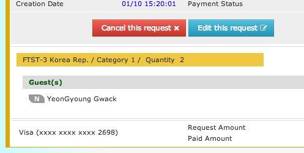
**이미지 캡션:** 이것은 온라인 요청 또는 주문의 세부 정보를 보여주는 스크린샷입니다. 상단에는 "Creation Date"와 "01/10 15:20:01"이라는 텍스트가 표시되며, 이는 요청이 생성된 날짜와 시간을 나타냅니다. 그 옆에는 "Payment Status"라는 텍스트가 있습니다. 두 개의 버튼이 보이며, 하나는 빨간색으로 "Cancel this request"라고 쓰여 있고, 다른 하나는 파란색으로 "Edit this request"라고 쓰여 있으며 연필 아이콘이 있습니다. 그 아래에는 노란색 배경에 "FTST-3 Korea Rep. / Category 1 / Quantity 2"라는 텍스트가 있어 품목, 카테고리 및 수량을 나타냅니다. "Guest(s)"라는 제목 아래에는 "N YeonGyoung Gwack"이라는 이름이 표시되어 있으며, 이는 요청에 관련된 사람의 이름으로 보입니다. 가장 아래에는 "Visa (xxxx xxxx xxxx 2698)"라는 텍스트가 있어 결제 수단이 비자 카드이며 마지막 네 자리가 2698임을 나타냅니다. 그 옆에는 "Request Amount"와 "Paid Amount"라는 텍스트가 있어 요청 금액과 지불 금액을 나타내는 것으로 보입니다. 전반적으로 이 화면은 사용자가 자신의 요청을 관리하고 결제 정보를 확인할 수 있는 인터페이스의 일부입니다.

### 10월 8일 (화) 11:50 · is ready to run even before sunrise and …

is ready to run even before sunrise and after sunset safely with this flash jacket thanks to Yeon Gyoung Gwack.

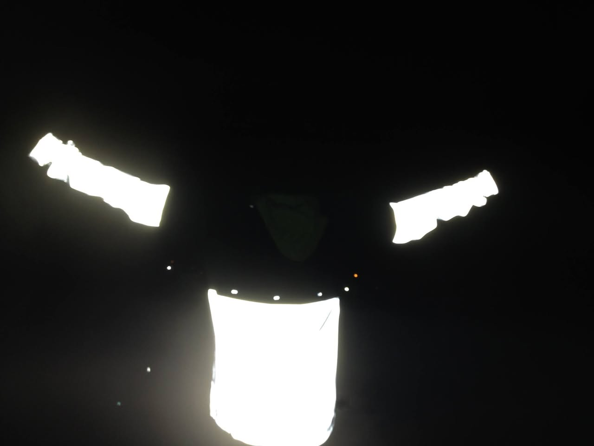
**이미지 캡션:** 어두운 배경에 반사되는 재질의 옷을 입은 사람의 모습이 보인다. 옷은 밝은 빛을 반사하여 형광색처럼 빛나고 있으며, 팔 부분과 가슴 부분에 넓게 반사되는 부분이 있다. 옷의 색깔은 어두운 색으로 추정되며, 목 부분에는 녹색의 무언가가 보인다. 사람의 얼굴이나 표정은 어둠과 반사광 때문에 명확하게 보이지 않지만, 전체적으로 활동적인 상황이나 야간 활동 중인 것으로 보인다. 배경은 검은색으로 처리되어 있어 장소나 구체적인 사물은 파악하기 어렵다.
 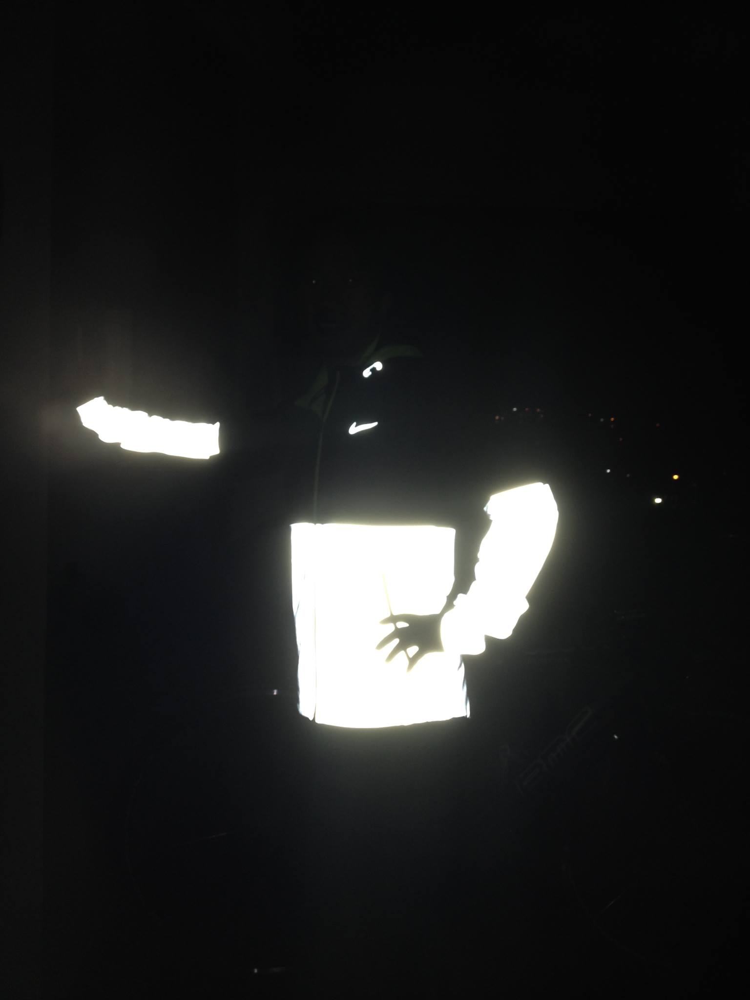
**이미지 캡션:** 어두운 밤, 반사 소재가 사용된 옷을 입은 성인 남성이 팔을 벌리고 서 있다. 남성은 검은색 후드티를 입고 있으며, 후드티에는 나이키 로고로 추정되는 흰색 로고가 보인다. 옷의 소매와 앞면에는 넓은 반사 패치가 부착되어 있어 빛을 강하게 반사하며 밝게 빛나고 있다. 남성의 오른손은 앞면의 반사 패치 위에 놓여 있으며, 손가락의 그림자가 패치에 비친다. 배경은 매우 어둡지만, 멀리 희미한 불빛들이 점점이 보여 도시의 야경이나 건물들이 있는 곳으로 추정된다. 전체적으로 어두운 밤에 강한 빛을 반사하는 옷으로 인해 신비롭고 미래적인 분위기를 자아낸다.

### 10월 8일 (화) 11:54 · 2nd practice run for his half marathon o…

2nd practice run for his half marathon on Nov 3. Need to work hard to meet the goal: sub 2.

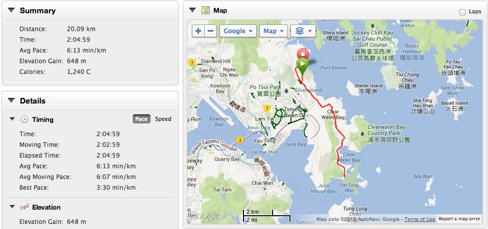
**이미지 캡션:** 이 이미지는 운동 기록을 보여주는 화면 캡처로, 좌측에는 운동 요약 및 상세 정보가, 우측에는 운동 경로가 표시된 지도가 나타납니다. 요약 정보에는 총 거리 20.09km, 총 시간 2시간 4분 59초, 평균 페이스 6분 13초/km, 고도 상승 648m, 소모 칼로리 1,240C가 기록되어 있습니다. 상세 정보의 타이밍 섹션에서는 총 시간, 이동 시간, 경과 시간, 평균 페이스, 평균 이동 페이스, 최고 페이스 등의 세부 기록을 확인할 수 있으며, 고도 섹션에서는 총 고도 상승량 648m를 보여줍니다. 지도에는 홍콩 지역의 해안선과 산악 지형이 표시되어 있으며, 붉은색 선으로 운동 경로가 그려져 있습니다. 경로 상에는 시작점(초록색 플레이 버튼)과 종료점(빨간색 사각형)이 표시되어 있으며, 다이아몬드 힐, 구룡만, 칭콴오, 클리어 워터 베이, 타이탐 등 지명과 함께 2km, 2mi 스케일 바가 보입니다. 지도 하단에는 2013년 AutoNavi, Google의 지도 데이터임을 나타내는 저작권 정보가 있습니다. 전반적으로 운동 기록을 추적하고 시각화하는 인터페이스를 보여주는 화면입니다.

### 10월 9일 (수) 23:48 · Just amazing!

Just amazing!

### 10월 13일 (일) 08:45 · met the Spider-Man!

met the Spider-Man!

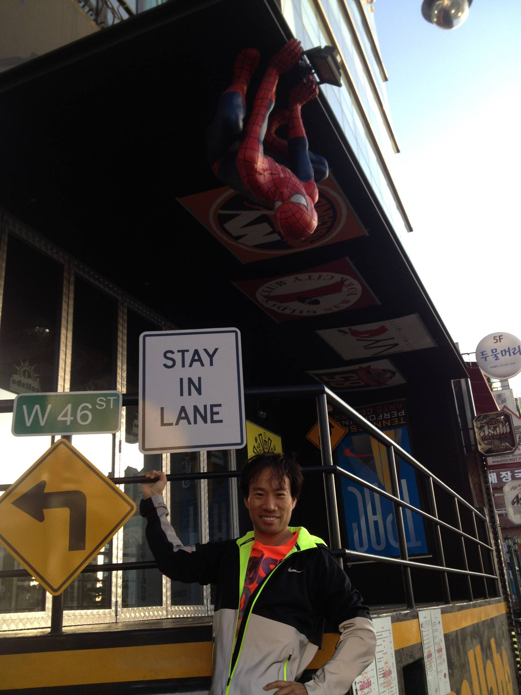
**이미지 캡션:** 한 명의 성인 남성이 밝게 웃으며 카메라를 바라보고 있으며, 그의 뒤로는 건물 외벽에 거꾸로 매달린 스파이더맨 조형물이 보인다. 남성은 옅은 회색과 검은색이 섞인 바람막이 재킷을 입고 있으며, 그 안에는 주황색 티셔츠가 보인다. 그의 오른쪽 팔은 바람막이 재킷 위로 올라가 있으며, 왼쪽 손은 허리에 얹고 있다. 남성 뒤편에는 "STAY IN LANE"이라고 적힌 흰색 표지판과 "W 46 ST"라고 적힌 녹색 표지판, 그리고 노란색의 좌회전 화살표 표지판이 보인다. 건물 외벽에는 다양한 광고판과 함께 "ASAHI"라고 적힌 맥주 광고도 보인다. 전체적으로 밝고 활기찬 분위기이며, 도시의 거리 풍경을 배경으로 하고 있다.

### 10월 15일 (화) 08:06 · My first marathon registration has been …

My first marathon registration has been accepted! My goal is sub-4.

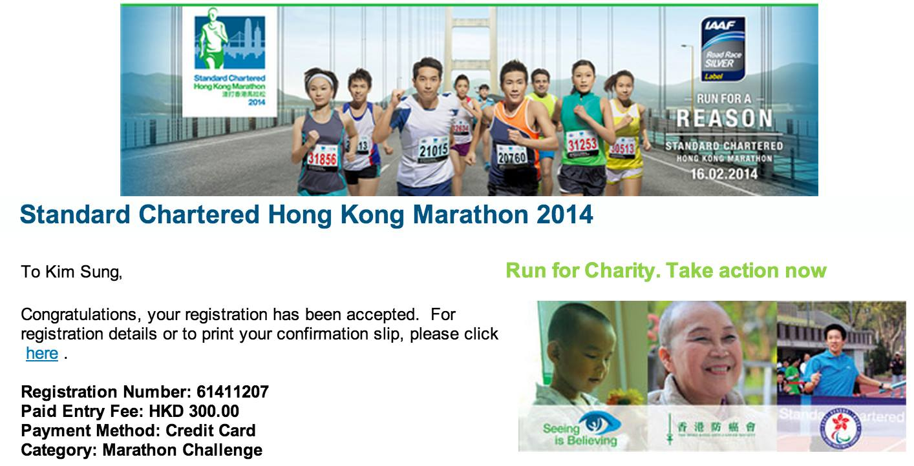
**이미지 캡션:** The image is a confirmation email for the Standard Chartered Hong Kong Marathon 2014. At the top, a banner shows a group of diverse runners, including adult males and females in their 20s and 30s, wearing athletic attire and race bibs, running on a bridge with a cityscape in the background. The banner also features logos for IAAF, Road Race Silver Label, and the event title "Standard Chartered Hong Kong Marathon 2014" with the date "16.02.2014". Below the banner, the title "Standard Chartered Hong Kong Marathon 2014" is prominently displayed in blue text. The email is addressed to "Kim Sung" and congratulates them on their registration acceptance, providing a link to view registration details or print a confirmation slip. It also lists the registration number, paid entry fee of HKD 300.00, payment method as Credit Card, and category as Marathon Challenge. To the right of the email text, a green slogan reads "Run for Charity. Take action now." Below this, a collage of three images depicts individuals involved in charity: a young boy with the text "Seeing is Believing" and an eye logo, an elderly woman with a shaved head smiling, and an adult male in a blue shirt holding a ribbon at what appears to be a finish line, with the Standard Chartered logo and a Paralympic symbol visible. The overall atmosphere is celebratory and encouraging, promoting both athletic participation and charitable giving.

### 10월 15일 (화) 15:22 · 📷 사진 (1장)

**이미지 캡션:** 이 이미지는 웹사이트의 뉴스 섹션으로, 파란색 글씨로 "LATEST NEWS"라는 제목이 크게 표시되어 있고, 그 아래에 회색 배경에 두 개의 뉴스 항목이 나열되어 있습니다. 첫 번째 뉴스 항목은 "15 October, 2013 - Registration for the Marathon race (42.195km) starts!"이며, 두 번째 뉴스 항목은 "15 October 2013 - Online quotas for Marathon race (42.195km) are full!"입니다. 오른쪽 상단에는 "more"라는 단어와 함께 오른쪽 화살표가 있어 더 많은 뉴스를 볼 수 있음을 나타냅니다. 이 이미지에는 사람이 등장하지 않으며, 배경은 흰색과 회색으로 구성된 웹사이트의 일부입니다. 텍스트는 마라톤 대회 등록 시작과 온라인 참가 신청 마감에 대한 정보를 제공하고 있습니다. 전반적으로 정보 전달을 목적으로 하는 깔끔하고 간결한 디자인입니다.

### 10월 20일 (일) 06:55 · Jump! Jump!!

Jump! Jump!!

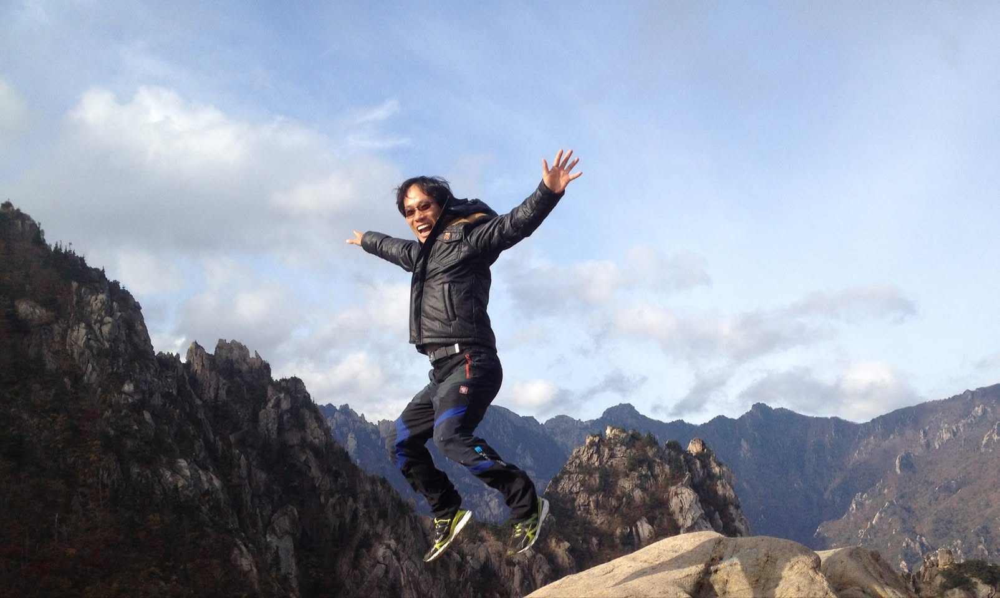
**이미지 캡션:** 한 명의 성인 남성이 검은색 패딩 점퍼와 등산 바지를 입고 산 정상에서 점프하고 있다. 남성은 선글라스를 착용하고 있으며, 입을 벌리고 환하게 웃는 표정으로 매우 즐거워 보인다. 그의 팔은 활짝 벌려져 있고, 다리는 점프하는 역동적인 자세를 취하고 있다. 배경에는 험준한 산봉우리들이 펼쳐져 있고, 맑고 푸른 하늘에는 구름이 흩어져 있다. 사진은 등반의 성취감과 자연의 아름다움을 만끽하는 순간을 포착하고 있다.
 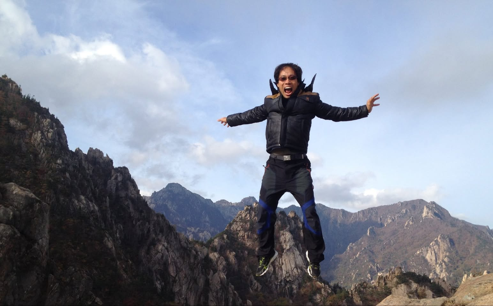
**이미지 캡션:** 하늘을 배경으로 한 성인 남성이 점프하고 있으며, 그의 팔은 양옆으로 활짝 펼쳐져 있고 입은 크게 벌려 환호하는 듯한 표정이다. 그는 검은색 패딩 점퍼와 검은색 바지, 그리고 녹색과 검은색이 섞인 운동화를 신고 있다. 점퍼의 칼라 부분에는 갈색 털 장식이 달려 있고, 바지에는 파란색과 검은색이 배색되어 있다. 남성의 머리카락은 짧고 검은색이며, 얼굴에는 선글라스를 착용하고 있다. 배경으로는 웅장하고 험준한 산맥이 펼쳐져 있으며, 산봉우리들은 날카로운 암석들로 이루어져 있고 일부에는 나무들이 드문드문 보인다. 하늘은 구름이 낀 맑은 날씨를 나타내고 있으며, 전체적으로 역동적이고 활기찬 분위기를 연출한다.

### 10월 21일 (월) 07:36 · Beautiful place!

📍 Shonan Village

Beautiful place!

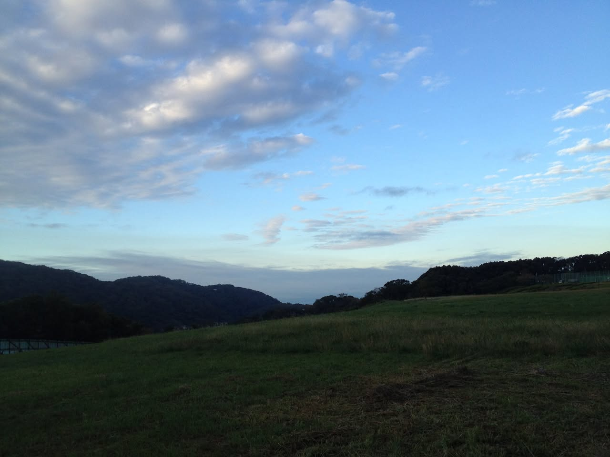
**이미지 캡션:** 이 사진은 푸른 하늘과 구름이 펼쳐진 풍경을 담고 있으며, 전경에는 넓은 잔디밭이 펼쳐져 있고, 중경에는 울창한 숲으로 뒤덮인 산들이 보입니다. 하늘은 맑고 푸르지만, 흰색과 회색 구름이 흩뿌려져 있어 역동적인 느낌을 줍니다. 산들은 어두운 녹색으로 표현되어 있으며, 숲의 윤곽이 뚜렷하게 보입니다. 잔디밭은 짙은 녹색으로, 일부는 약간 누렇게 변색된 부분도 있어 계절감을 나타냅니다. 사진의 왼쪽 하단에는 녹색 울타리의 일부가 보이며, 멀리 보이는 산등성이 위에는 희미하게 건물들이 점점이 박혀 있습니다. 전반적으로 평화롭고 자연적인 분위기를 자아내며, 야외 활동이나 휴식을 취하기에 좋은 장소로 보입니다. 사진에는 사람이 등장하지 않으며, 보이는 텍스트도 없습니다.
 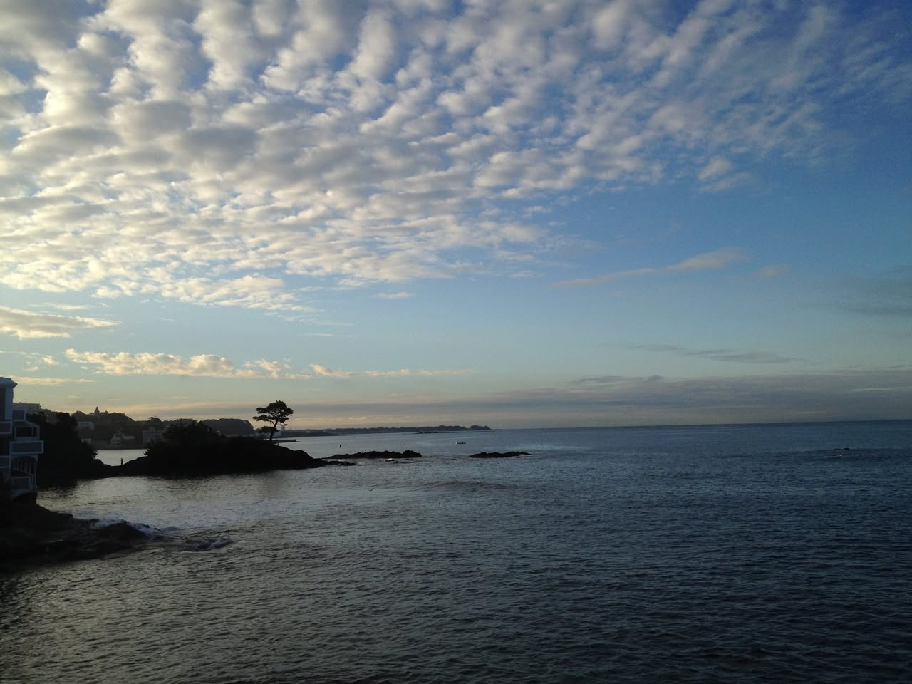
**이미지 캡션:** 이 사진은 잔잔한 바다와 하늘을 담고 있으며, 왼쪽에는 해안가 건물과 작은 섬이 보인다. 섬 위에는 나무 한 그루가 서 있고, 멀리 수평선에는 희미하게 육지가 보인다. 하늘에는 뭉게구름이 흩뿌려져 있고, 푸른색과 흰색이 어우러져 맑고 평화로운 분위기를 자아낸다. 바다는 잔잔하게 물결치고 있으며, 해안가에는 파도가 부서지는 모습도 보인다. 전체적으로 고요하고 평화로운 풍경으로, 휴식이나 사색에 잠기기 좋은 장소로 보인다.
 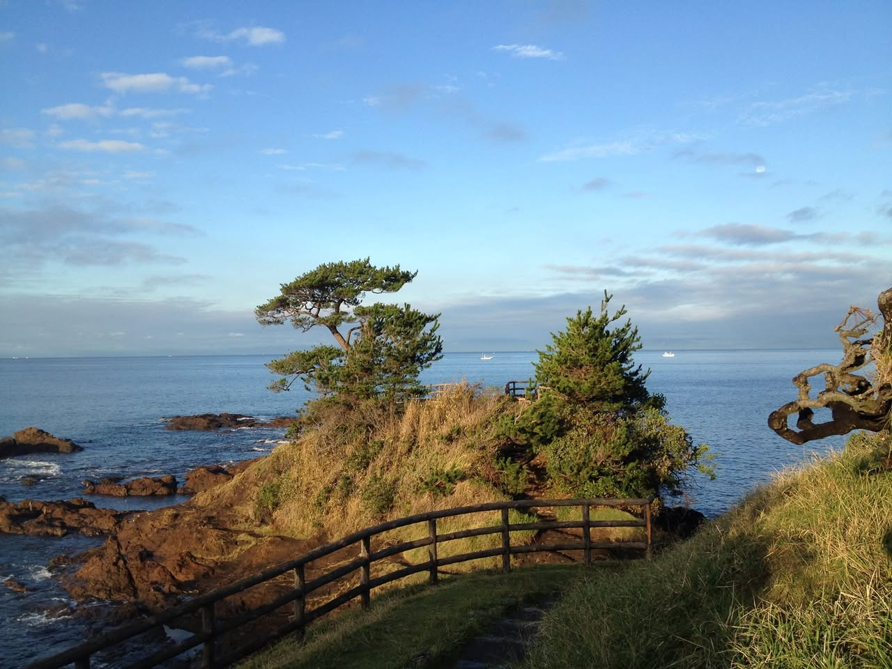
**이미지 캡션:** 이 사진은 푸른 바다와 맑은 하늘이 어우러진 해안 풍경을 담고 있습니다. 사진 중앙에는 바위로 이루어진 작은 섬이 있고, 그 위에는 두 그루의 소나무가 서 있습니다. 섬 주변으로는 파도가 부서지는 바위들이 보이며, 멀리 수평선에는 몇 척의 배가 떠 있습니다. 섬으로 이어지는 듯한 낮은 나무 울타리가 사진의 전경을 가로지르고 있으며, 그 뒤로는 잔디와 풀이 무성한 언덕이 펼쳐져 있습니다. 하늘에는 구름이 흩뿌려져 있고, 희미하게 달이 떠 있는 모습도 보입니다. 전체적으로 평화롭고 고요한 분위기를 자아냅니다.
 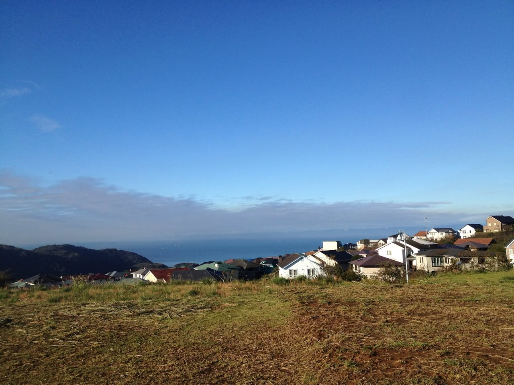
**이미지 캡션:** 이 사진은 맑고 푸른 하늘 아래, 언덕에 자리 잡은 주택 단지의 풍경을 담고 있습니다. 전경에는 황갈색으로 마른 풀이 무성한 넓은 언덕이 펼쳐져 있으며, 그 너머로 다양한 색깔의 지붕을 가진 여러 채의 주택들이 옹기종기 모여 있습니다. 주택들은 대부분 2층 규모이며, 흰색, 베이지색, 회색 등 밝은 색상의 외벽을 가지고 있어 산뜻한 느낌을 줍니다. 일부 주택에서는 창문 너머로 불빛이 새어 나오는 듯한 모습도 보입니다. 주택 단지 뒤로는 푸른 바다가 펼쳐져 있고, 멀리 희미하게 산들이 보입니다. 하늘에는 옅은 구름이 몇 조각 떠 있어 평화로운 분위기를 더합니다. 사진에는 사람이 등장하지 않으며, 텍스트도 보이지 않습니다. 전체적으로 조용하고 평화로운 전원 풍경을 연출하고 있습니다.

### 10월 26일 (토) 08:49 · Kyoto 21k run: last long distance runnin…

📍 Kyoto, Japan

Kyoto 21k run: last long distance running practice for his first half-marathon on Nov 3. It was perfect weather and the tail is very beautiful along with Kamo-gawa (鴨川).

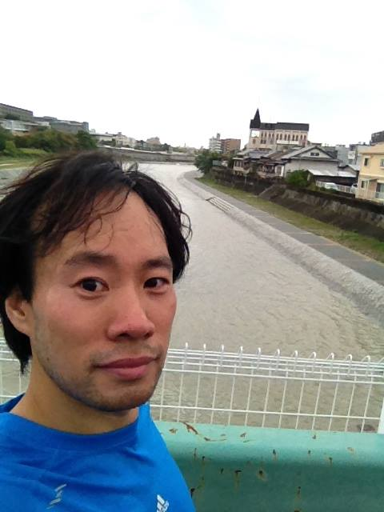
**이미지 캡션:** 이 사진은 강가에서 셀카를 찍은 성인 남성의 모습이다. 남성은 30대 후반에서 40대 초반으로 보이며, 짧은 검은 머리에 약간의 수염이 있다. 그는 파란색 스포츠 티셔츠를 입고 있으며, 티셔츠에는 흰색 로고가 희미하게 보인다. 남성은 카메라를 응시하며 약간의 미소를 짓고 있다. 배경에는 강이 흐르고 있으며, 강둑을 따라 건물들이 늘어서 있다. 강 건너편에는 붉은 지붕을 가진 오래된 건물과 현대적인 건물들이 함께 보인다. 하늘은 흐린 날씨를 나타내듯 하얗게 보인다. 남성은 흰색 철제 난간에 기대어 서 있으며, 난간 아래에는 녹색의 페인트가 칠해진 구조물이 보인다. 전체적으로 평범한 도시의 풍경 속에서 운동이나 산책을 즐기는 듯한 분위기이다.
 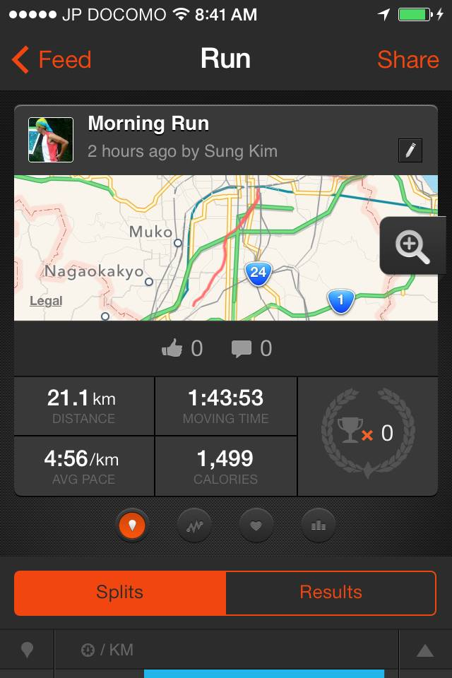
**이미지 캡션:** 이 화면은 스마트폰 앱의 러닝 기록을 보여주는 것으로, 상단에는 시간과 배터리 잔량이 표시되고, 왼쪽에는 뒤로 가기 버튼과 'Feed'라는 글자가, 중앙에는 'Run'이라는 글자가, 오른쪽에는 'Share' 버튼이 있습니다. 그 아래에는 'Morning Run'이라는 제목과 함께 러닝한 사람의 작은 사진, 그리고 '2 hours ago by Sung Kim'이라는 기록 정보가 있습니다. 사진 속 인물은 성인 남성으로 보이며, 머리에 노란색과 파란색이 섞인 헤어밴드를 하고 분홍색 상의와 파란색 하의를 입고 있습니다. 표정은 보이지 않으며, 팔을 들어 올린 듯한 모습으로 러닝 중이거나 러닝 직후의 모습으로 추정됩니다. 그 아래에는 러닝 경로를 나타내는 지도가 표시되어 있으며, 'Muko', 'Nagaokakyo', 'Legal' 등의 지명이 보입니다. 지도에는 24번 도로와 1번 도로가 표시되어 있고, 확대/축소 버튼이 있습니다. 지도 아래에는 좋아요와 댓글 아이콘과 함께 각각 0개의 숫자가 표시되어 있습니다. 이어서 러닝 기록 상세 정보가 나타나는데, 총 거리 21.1km, 이동 시간 1시간 43분 53초, 평균 페이스 4분 56초/km, 소모 칼로리 1,499kcal가 표시되어 있습니다. 또한, 트로피 모양의 아이콘과 함께 'x 0'이라고 표시되어 있어 획득한 훈장이나 성과가 없음을 나타냅니다. 화면 하단에는 'Splits'와 'Results'라는 두 개의 버튼이 있으며, 'Splits' 버튼이 주황색으로 강조되어 있습니다. 전반적으로 활동적인 러닝 기록을 공유하는 앱 화면으로, 정보 전달에 초점을 맞춘 깔끔하고 기능적인 디자인입니다.
 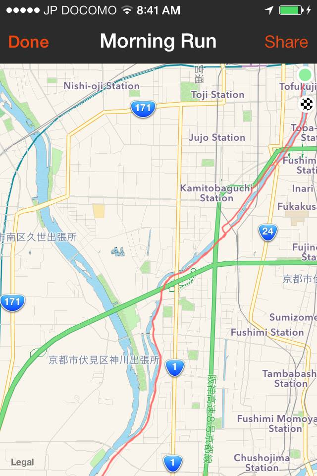
**이미지 캡션:** 이것은 스마트폰 화면의 스크린샷으로, "Morning Run"이라는 제목의 지도 애플리케이션을 보여줍니다. 화면 상단에는 "Done"과 "Share" 버튼이 있으며, 시간은 8시 41분입니다. 지도에는 여러 역 이름과 도로 번호가 표시되어 있으며, 특히 171번, 24번, 1번 도로가 눈에 띕니다. 일본어로 된 역 이름으로는 니시 오지 역, 토지 역, 쥬조 역, 카미토바구치 역, 후시미 역, 타바바시 역, 후시미 모모야마 역, 추쇼지마 역 등이 보입니다. 또한 "京都市伏見区神川出張所" (교토시 후시미구 카미카와 출장소)와 같은 지명도 있습니다. 지도에는 강과 녹지 공간도 표시되어 있어 도시의 지형을 보여줍니다. 전반적으로 이 화면은 사용자가 아침 달리기를 기록하거나 계획하는 데 사용되는 지도 앱의 일부로 보입니다.

### 10월 29일 (화) 09:50 · Last day in Kyoto, but a perfect day for…

📍 Kyoto, Japan

Last day in Kyoto, but a perfect day for Morning Ride. I'll miss here a lot. Good bye, Kyoto!

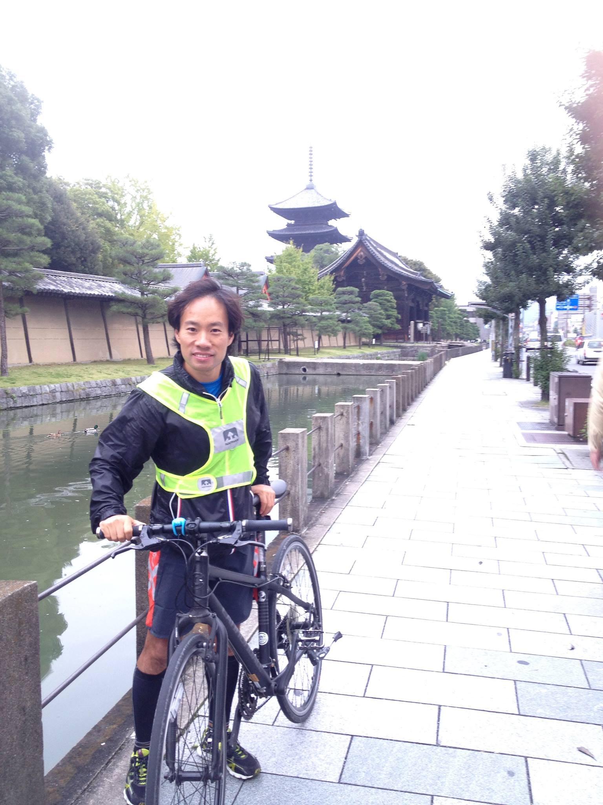
**이미지 캡션:** 한 명의 성인 남성이 자전거를 옆에 세워두고 서 있다. 그는 30대 후반에서 40대 초반으로 보이며, 짧은 검은색 머리에 옅은 미소를 띠고 있다. 밝은 형광 노란색 조끼를 검은색 방수 재킷 위에 입고 있으며, 재킷 안에는 파란색 티셔츠가 보인다. 하의는 짧은 검은색 반바지와 종아리까지 오는 검은색 스포츠 양말, 그리고 형광색 포인트가 있는 검은색 운동화를 착용하고 있다. 남성은 자전거 핸들을 잡고 있으며, 자전거는 검은색으로 앞바퀴가 화면 가까이 보인다. 배경에는 맑은 날씨에 흐린 하늘이 보이고, 왼쪽에는 물이 흐르는 수로가 있으며, 수로 건너편에는 전통적인 일본식 건물과 함께 높은 오층탑이 보인다. 건물 앞에는 잘 가꾸어진 소나무들이 늘어서 있고, 건물 뒤로는 나무들이 보인다. 오른쪽에는 하얀색 타일로 포장된 넓은 보행로가 이어져 있으며, 보행로 옆에는 옅은 갈색의 울타리가 있다. 전반적으로 평화롭고 고즈넉한 분위기이다.
 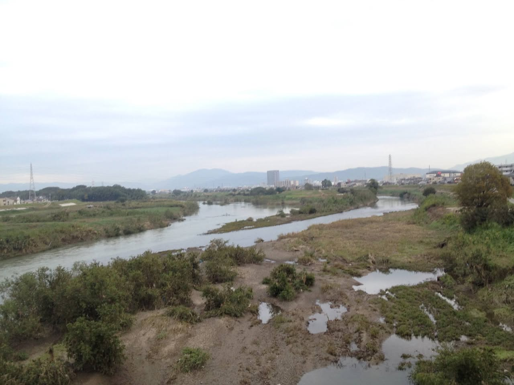
**이미지 캡션:** 흐린 날씨에 강과 주변 풍경이 보이는 사진으로, 사진에는 사람이 보이지 않으며, 강은 넓고 완만하게 굽이쳐 흐르고 있으며, 강둑에는 풀과 덤불이 무성하게 자라 있고, 멀리에는 산과 도시의 건물들이 희미하게 보인다. 강가에는 몇 개의 작은 웅덩이가 있으며, 일부 지역은 진흙으로 덮여 있다. 사진의 오른쪽에는 큰 나무 한 그루가 서 있고, 멀리에는 전신주와 건물들이 보인다. 전반적으로 평화롭고 조용한 분위기이며, 자연과 도시가 어우러진 풍경을 담고 있다.
 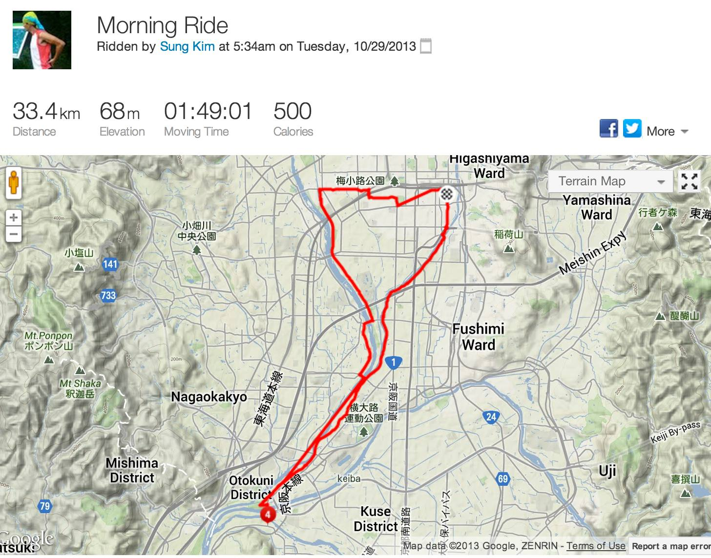
**이미지 캡션:** 이 사진은 자전거 라이딩 기록을 보여주는 화면으로, 상단에는 "Morning Ride"라는 제목과 함께 Sung Kim이라는 사람이 2013년 10월 29일 화요일 오전 5시 34분에 라이딩을 했다는 정보가 표시되어 있습니다. 그 아래에는 거리 33.4km, 고도 68m, 이동 시간 01:49:01, 소모 칼로리 500이라는 구체적인 라이딩 데이터가 나타나 있습니다. 화면 중앙에는 일본 교토 지역의 지도가 표시되어 있으며, 빨간색 선으로 라이딩 경로가 그려져 있습니다. 지도에는 Higashiyama Ward, Yamashina Ward, Fushimi Ward, Mishima District, Nagaokakyo, Otokuni District, Kuse District 등 여러 지역 이름과 함께 산, 공원, 도로, 철도 등이 표시되어 있습니다. 또한, 지도 상단에는 "Terrain Map"이라는 문구가 보이며, 오른쪽 상단에는 페이스북과 트위터 아이콘, 그리고 "More" 버튼이 있습니다. 화면 왼쪽 상단에는 라이딩한 사람으로 추정되는 성인 남성의 사진이 작게 포함되어 있으며, 이 남성은 운동복 차림으로 팔짱을 끼고 카메라를 바라보고 있습니다. 전반적으로 활동적인 아침 라이딩의 기록과 경로를 보여주는 정보성 화면입니다.

### 10월 30일 (수) 09:23 · Both Yeon Gyoung Gwack and Sung successf…

Both Yeon Gyoung Gwack and Sung successfully registered for their run (Standard Chartered Hong Kong Marathon 2014)! We will have fun!!

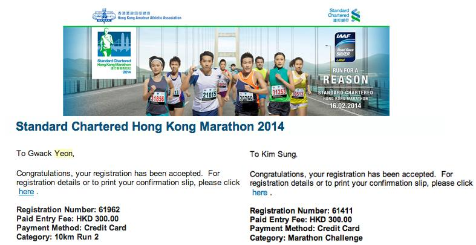
**이미지 캡션:** 사진 상단에는 홍콩 아마추어 육상 협회와 스탠다드 차타드 은행 로고가 있으며, 그 아래에는 2014년 스탠다드 차타드 홍콩 마라톤을 홍보하는 이미지와 문구가 있다. 이미지에는 다양한 인종과 성별의 성인 남녀 러너들이 마라톤 코스를 달리는 모습이 담겨 있으며, 배경에는 홍콩의 상징적인 건축물인 칭마대교와 산이 보인다. 러너들은 각기 다른 운동복과 배번을 착용하고 있으며, 일부는 환호하거나 집중하는 표정을 짓고 있다. 이미지 오른쪽에는 "RUN FOR A REASON"이라는 문구와 함께 마라톤 행사 정보가 기재되어 있다. 사진 하단에는 두 명의 수신자, 곽연과 김성에게 보내는 마라톤 참가 등록이 승인되었음을 알리는 이메일 내용이 있다. 각 수신자에게는 등록 번호, 참가비, 결제 방법, 참가 부문 등의 정보가 제공된다. 전체적으로 마라톤 행사의 성공적인 개최와 참가자들의 참여를 축하하는 긍정적이고 활기찬 분위기를 전달하고 있다.

### 10월 30일 (수) 18:26 · is happy for this award and a CHECK!

is happy for this award and a CHECK!

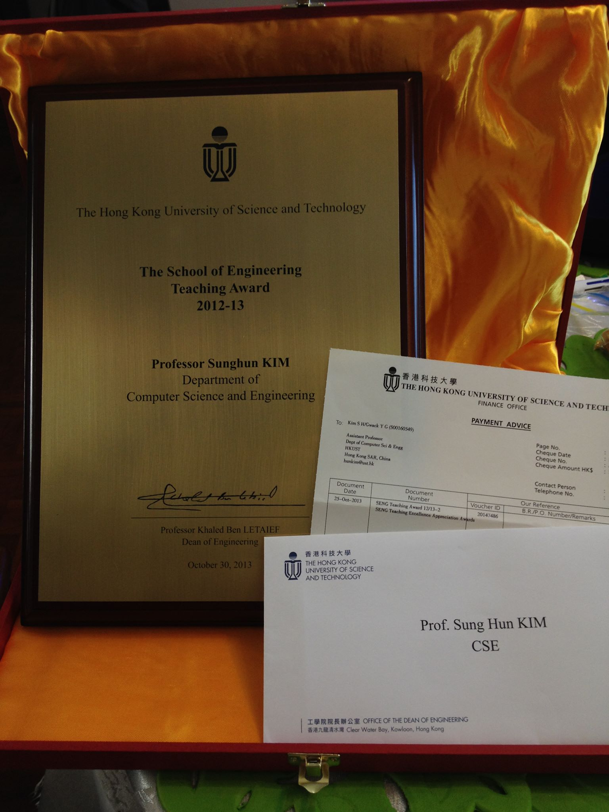
**이미지 캡션:** 이 사진은 홍콩 과학기술대학교 공과대학에서 수여한 교육상 상패와 관련 서류들을 담고 있습니다. 상패는 금색 바탕에 검은색 글씨로 "The Hong Kong University of Science and Technology", "The School of Engineering Teaching Award 2012-13", 그리고 수상자인 "Professor Sunghun KIM", 소속 학과인 "Department of Computer Science and Engineering"이 새겨져 있습니다. 상패 하단에는 공과대학 학장인 "Professor Khaled Ben LETAIEF"의 서명과 "October 30, 2013" 날짜가 기재되어 있습니다. 상패 옆에는 홍콩 과학기술대학교의 로고와 함께 "PAYMENT ADVICE"라고 적힌 서류가 놓여 있으며, 이 서류에는 수신자 정보, 문서 번호, 바우처 ID 등이 포함되어 있습니다. 또한, "Prof. Sung Hun KIM CSE"라고 적힌 또 다른 서류도 보입니다. 배경에는 붉은색 상자 안에 노란색 천이 깔려 있어 고급스러운 분위기를 연출합니다. 전체적으로 학술적인 성과를 기념하는 엄숙하고 영예로운 분위기입니다.
 
**이미지 캡션:** 한 명의 성인 남성이 검은색 정장을 입고 노란색 넥타이를 맨 채 다른 성인 남성에게 상장으로 보이는 것을 건네고 있다. 상장을 받는 남성은 검은색 재킷과 밝은 색 셔츠를 입고 있으며, 그의 얼굴에는 미소가 번지고 있다. 두 사람 모두 밝은 조명 아래 서 있으며, 배경에는 대형 스크린이 설치되어 있다. 스크린에는 "School of Engineering 2012-13 Awardees"라는 제목과 함께 수상자들의 이름이 적혀 있다. 이 행사는 강당이나 강의실에서 열리는 시상식으로 보이며, 진지하면서도 축하하는 분위기이다.
