# 2013년 11월

[← 2013년](README.md)

### 11월 3일 (일) 14:28 · Goal achieved! He finished his first hal…

Goal achieved! He finished his first half marathon in sub 2!! What's the next? Full marathon on Feb 16, 2014.

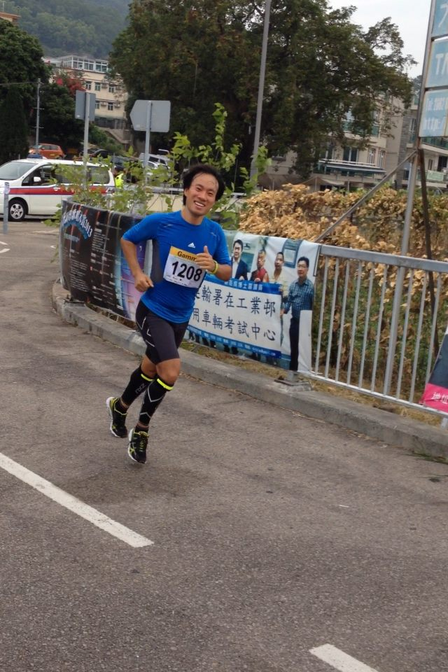
**이미지 캡션:** 한 명의 성인 남성이 마라톤에 참가하여 달리고 있으며, 그는 파란색 반팔 운동복 상의와 검은색 반바지, 그리고 종아리까지 올라오는 검은색 압박 스타킹과 형광 노란색 포인트가 있는 운동화를 착용하고 있다. 그의 가슴에는 "Gammr 1208"이라고 적힌 번호표가 부착되어 있으며, 오른손 엄지손가락을 치켜들고 환하게 웃고 있어 즐겁고 활기찬 표정이다. 배경에는 나무가 우거진 언덕과 건물들이 보이며, 도로 옆에는 금속 난간과 함께 여러 개의 배너가 걸려 있다. 배너에는 중국어 문자와 함께 사람들의 사진이 인쇄되어 있으며, "【輸署在工業邨 用車輛考試中心"이라는 문구가 보인다. 또한, 흰색 승합차와 경찰차로 보이는 차량도 배경에 일부 보인다. 전반적으로 야외에서 진행되는 스포츠 행사 또는 마라톤의 한 장면으로 보인다.
 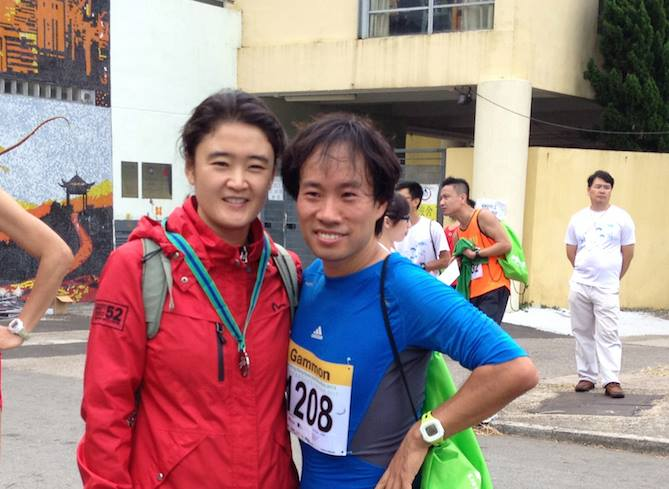
**이미지 캡션:** 이 사진은 야외 행사에서 두 명의 성인 남녀가 함께 찍은 사진으로, 여성은 30대 초중반으로 보이며 짙은 빨간색 방수 재킷에 회색 배낭을 메고 있으며, 목에는 파란색과 녹색 줄무늬가 있는 목걸이를 걸고 있다. 그녀는 밝게 웃고 있으며, 그녀의 왼쪽에는 30대 중반으로 보이는 성인 남성이 파란색 스포츠 티셔츠를 입고 있으며, 가슴에는 "Gammon 1208"이라고 적힌 노란색 번호표를 달고 있다. 그는 녹색 가방을 들고 있으며, 손목에는 하얀색 시계를 차고 있다. 두 사람 모두 밝게 웃고 있으며, 배경에는 건물이 보이고 다른 참가자들이 보인다. 이 사진은 달리기 대회나 스포츠 행사와 같은 야외 활동 중에 찍힌 것으로 보인다.
 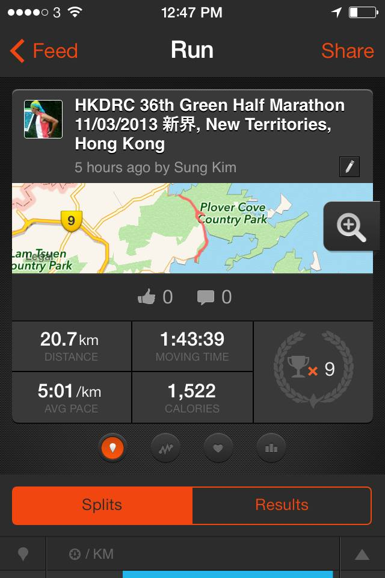
**이미지 캡션:** 이 화면은 달리기 기록을 보여주는 앱의 일부로, "HKDRC 36th Green Half Marathon"이라는 행사에 대한 정보를 담고 있습니다. 화면 상단에는 시간(12:47 PM)과 배터리 상태, 그리고 "Feed"와 "Run", "Share" 버튼이 보입니다. 중앙에는 달리기 행사 정보와 함께 작은 지도 이미지가 표시되어 있으며, 지도에는 "Plover Cove Country Park"와 "Lam Tsuen Country Park"가 표시되어 있습니다. 그 아래에는 "5 hours ago by Sung Kim"이라는 문구와 함께 연필 모양 아이콘이 있습니다. 달리기 기록은 20.7km의 거리, 1시간 43분 39초의 이동 시간, 5분 01초/km의 평균 페이스, 그리고 1,522 칼로리 소모로 나타나 있습니다. 또한, 트로피와 숫자 9가 함께 있는 아이콘이 있어 9번의 완주 또는 기록 달성을 의미하는 것으로 보입니다. 화면 하단에는 "Splits"와 "Results" 버튼이 있으며, "Splits" 버튼이 선택되어 주황색으로 강조되어 있습니다. 전반적으로 활동적인 스포츠 기록을 공유하고 확인하는 앱의 인터페이스로 보이며, 긍정적이고 성취감을 나타내는 분위기입니다.
 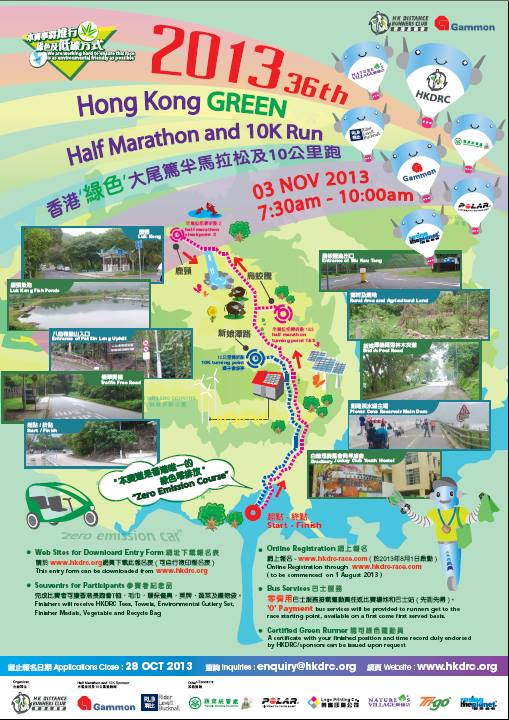
**이미지 캡션:** 이 포스터는 2013년 11월 3일 홍콩에서 열리는 제36회 홍콩 그린 하프 마라톤 및 10km 달리기 대회를 홍보합니다. 포스터 중앙에는 녹색과 파란색으로 표시된 코스가 그려져 있으며, 출발점과 도착점은 빨간색으로 표시되어 있습니다. 코스 주변에는 여러 개의 작은 사진들이 배치되어 있으며, 각 사진은 코스의 특정 지점이나 관련 장소를 보여줍니다. 예를 들어, 루크 켕 피쉬 연못, 신량탄로, 푸트 코브 저수지 메인 댐 등이 보입니다. 포스터 상단에는 "2013 36th Hong Kong GREEN Half Marathon and 10K Run"이라는 제목과 함께 대회의 영문 및 중문 이름이 적혀 있습니다. 또한, 여러 개의 귀여운 돌고래 모양 캐릭터들이 풍선처럼 떠 있는 모습이 그려져 있으며, 각 캐릭터에는 스폰서 로고가 새겨져 있습니다. 포스터 하단에는 대회 참가 신청 마감일, 문의처, 웹사이트 주소 등 대회 관련 정보가 기재되어 있습니다. 전반적으로 밝고 활기찬 분위기이며, 친환경적인 이미지를 강조하고 있습니다.

> After 20K run. Just 1K more. Run, Run!
> Finished with the medal!
> It's about 1:44 in my GPS, but the official record is not released yet.

### 11월 9일 (토) 16:49 · dreadlocks!

dreadlocks!

**이미지 캡션:** 이 사진은 성인 남성이 파란색 비니를 쓰고 있으며, 비니에는 로스앤젤레스 램스 팀 로고가 새겨져 있고, 비니에서 길고 두꺼운 흰색과 파란색 줄무늬가 늘어져 있습니다. 남성은 30대 후반에서 40대 초반으로 보이며, 짧은 머리에 옅은 미소를 띠고 있습니다. 그는 회색 반팔 티셔츠를 입고 있으며, 배경에는 나무 문이 달린 큰 수납장이 보입니다. 수납장 문에는 동양적인 그림이 그려져 있으며, 그림에는 나무와 새가 표현되어 있습니다. 수납장 오른쪽에는 여러 개의 병과 물건들이 놓여 있는 선반이 보입니다. 사진의 전체적인 분위기는 캐주얼하고 유쾌하며, 남성이 재미있는 모자를 쓰고 포즈를 취하고 있는 모습입니다.

### 11월 10일 (일) 15:20 · Cheonwangbong Peak of Jirisan National P…

Cheonwangbong Peak of Jirisan National Park (지리산 천왕봉), 1915m!!

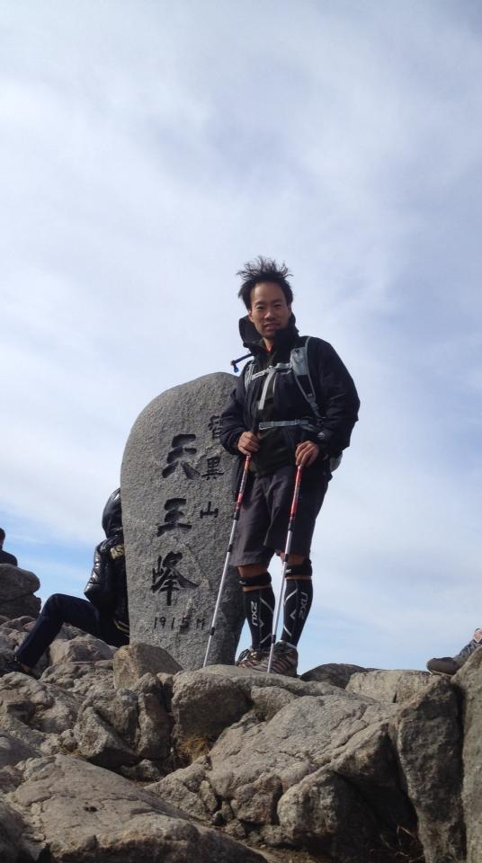
**이미지 캡션:** 한 명의 성인 남성이 등산복을 입고 등산 스틱 두 개를 짚은 채 바위 위에 서서 카메라를 바라보고 있다. 남성은 검은색 재킷과 회색 반바지, 그리고 무릎까지 올라오는 검은색 압박 스타킹을 착용하고 있으며, 머리카락은 바람에 날리고 있다. 그의 표정은 밝고 활기차 보인다. 남성 뒤에는 '天王峰'이라고 쓰인 큰 비석이 있고, 비석에는 '1915 M'이라는 숫자가 새겨져 있다. 주변은 거친 바위들로 이루어져 있으며, 멀리 흐린 하늘이 보인다. 다른 사람들도 바위에 앉거나 서 있는 모습이 희미하게 보인다. 전반적으로 등반 성공 후 기념 사진을 찍는 듯한 분위기이다.

### 11월 11일 (월) 23:34 · will be in Brazil next year with Yeon Gy…

will be in Brazil next year with Yeon Gyoung Gwack! We will watch the first 3 Korean Games there!!

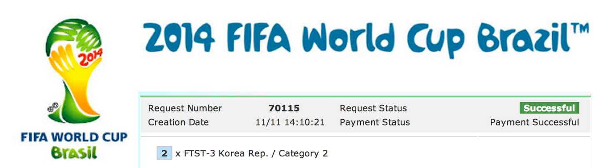
**이미지 캡션:** 이 이미지는 2014년 FIFA 월드컵 브라질 대회 로고와 관련 정보를 보여줍니다. 로고는 녹색과 노란색으로 이루어진 손 모양으로 2014라는 숫자가 새겨져 있으며, 하단에는 "FIFA WORLD CUP Brasil"이라는 문구가 있습니다. 그 아래에는 "Request Number 70115", "Creation Date 11/11 14:10:21", "Request Status Successful", "Payment Status Payment Successful"이라는 텍스트가 표시되어 있으며, 마지막 줄에는 "2 x FTST-3 Korea Rep. / Category 2"라는 정보가 있습니다. 전체적으로 흰색 배경에 파란색 글씨로 2014 FIFA World Cup Brazil™이라는 문구가 상단에 크게 쓰여 있습니다. 이미지에는 사람이 등장하지 않으며, 전반적으로 공식적인 행사 정보가 담긴 화면의 일부로 보입니다.

### 11월 12일 (화) 07:53 · SNU Morning Run without Lei Chen!

SNU Morning Run without Lei Chen!

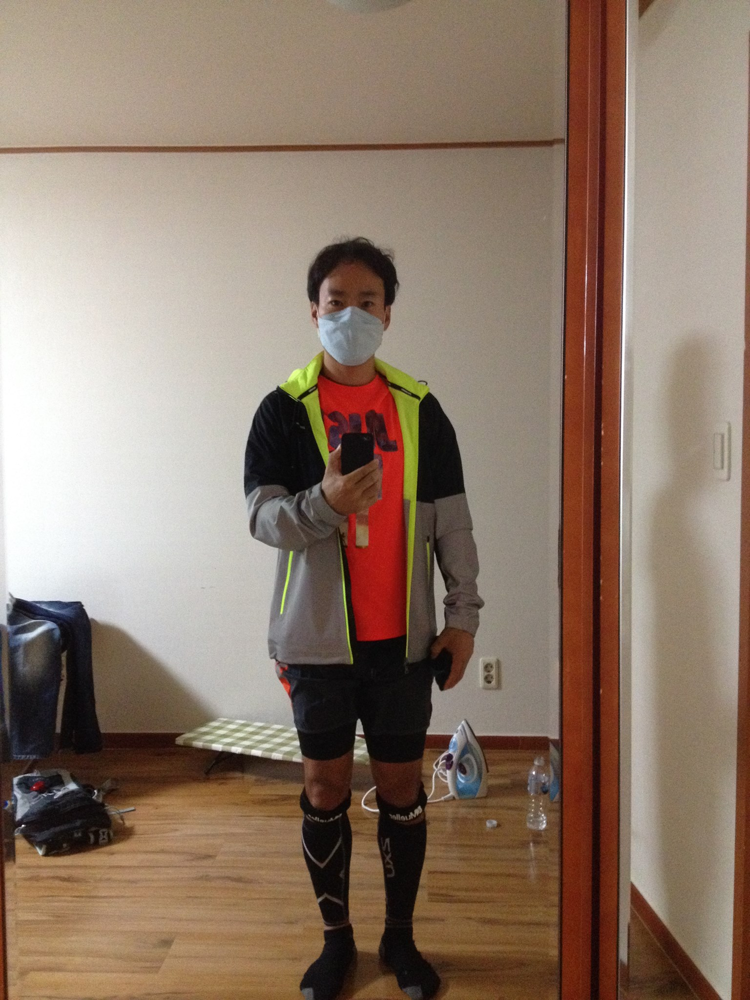
**이미지 캡션:** 한 명의 성인 남성이 거울을 보며 셀카를 찍고 있다. 남성은 옅은 파란색 마스크를 착용하고 있으며, 형광 연두색 라인이 들어간 회색 바람막이 재킷 안에 주황색 반팔 티셔츠를 입고 있다. 하의는 검은색 반바지와 검은색 압박 스타킹을 착용하고 있으며, 발에는 검은색 양말을 신고 있다. 남성은 오른손으로 스마트폰을 들고 있으며, 표정은 마스크 때문에 잘 보이지 않지만 눈빛은 정면을 향하고 있다. 배경은 방 안으로 보이며, 왼쪽 벽에는 청바지가 걸려 있고 그 옆에는 운동 가방으로 보이는 물건이 놓여 있다. 바닥에는 체크무늬 매트와 다리미, 물병 등이 보인다. 전체적으로 운동을 준비하는 듯한 모습이며, 실내에서 촬영된 것으로 보인다.
 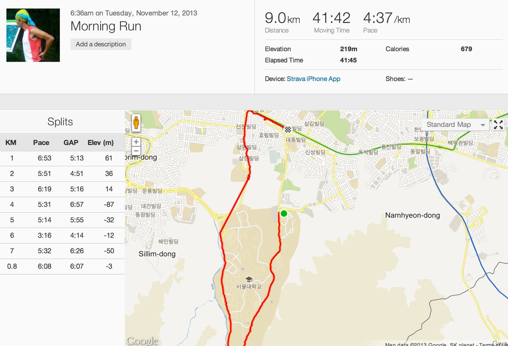
**이미지 캡션:** 화면 왼쪽 상단에는 2013년 11월 12일 화요일 오전 6시 36분에 기록된 "Morning Run"이라는 제목의 운동 기록이 보이며, 그 아래에는 "Add a description" 버튼이 있다. 운동 기록의 요약 정보에는 총 거리 9.0km, 총 운동 시간 41분 42초, 평균 페이스 4분 37초/km, 총 고도 상승 219m, 총 경과 시간 41분 45초, 소모 칼로리 679가 표시되어 있으며, 운동 기기는 "Strava iPhone App"으로 기록되어 있다. 화면 중앙에는 운동 경로를 보여주는 지도가 펼쳐져 있으며, 빨간색 선으로 표시된 운동 경로는 서울대학교를 중심으로 남현동 일대를 지나가는 것으로 보인다. 지도에는 "prim-dong", "Sillim-dong", "Namhyeon-dong" 등의 지명이 한글로 표기되어 있으며, 여러 빌딩 이름들도 함께 표시되어 있다. 화면 왼쪽에는 운동 기록의 구간별 상세 정보인 "Splits" 표가 있는데, 각 구간의 거리(KM), 페이스(Pace), 이전 구간과의 시간 차이(GAP), 고도(Elev (m))가 기록되어 있다. 예를 들어 1km 구간의 페이스는 6:53이고 고도는 61m이며, 6km 구간에서는 페이스가 3:16으로 매우 빨랐던 것을 알 수 있다. 전반적으로 운동 기록과 함께 운동 경로를 시각적으로 보여주는 화면이다.
 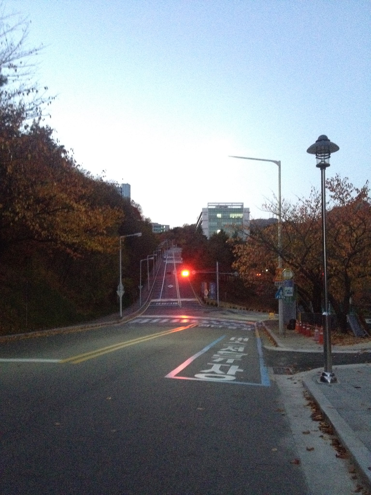
**이미지 캡션:** 이 사진은 가을 저녁, 대학 캠퍼스 내의 오르막길을 보여준다. 도로에는 횡단보도와 함께 "보행자 주의"라는 흰색 글씨가 파란색 테두리 안에 새겨져 있으며, 붉은색 신호등이 켜져 있어 차량 통행을 제어하고 있다. 길가에는 낙엽이 쌓여 있고, 가로등과 신호등이 설치되어 있으며, 멀리 보이는 건물들은 대학 캠퍼스의 일부임을 짐작게 한다. 하늘은 옅은 푸른색으로 물들어 있으며, 전체적으로 차분하고 조용한 분위기를 자아낸다.

### 11월 19일 (화) 09:34 · 📷 사진 (1장)

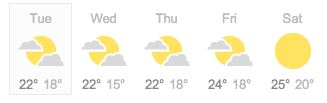
**이미지 캡션:** 이 이미지는 일주일간의 날씨 예보를 보여주는 스크린샷으로, 화요일부터 토요일까지의 날씨 아이콘과 기온이 표시되어 있습니다. 각 날짜별로 요일 이름(Tue, Wed, Thu, Fri, Sat)이 상단에 표기되어 있으며, 그 아래에는 해당 날짜의 날씨를 나타내는 아이콘이 있습니다. 화요일, 수요일, 목요일, 금요일에는 구름 사이로 보이는 노란색 달 모양 아이콘이 있어 흐린 날씨를 나타내며, 토요일에는 맑은 날씨를 나타내는 노란색 태양 아이콘이 있습니다. 각 날짜 아래에는 두 개의 숫자가 섭씨 온도를 나타내며, 첫 번째 숫자는 최고 기온, 두 번째 숫자는 최저 기온입니다. 예를 들어, 화요일은 최고 22도, 최저 18도이며, 수요일은 최고 22도, 최저 15도입니다. 전체적으로 깔끔하고 정보 전달에 초점을 맞춘 디자인이며, 특별한 인물이나 사물, 텍스트는 보이지 않습니다. 분위기는 정보를 제공하는 객관적인 날씨 예보 화면입니다.

### 11월 19일 (화) 09:37 · First 30K Long Slow Distance (LSD) Runni…

First 30K Long Slow Distance (LSD) Running inspired by Jiyoung Lee. It was not easy, and I really admire marathon runners!

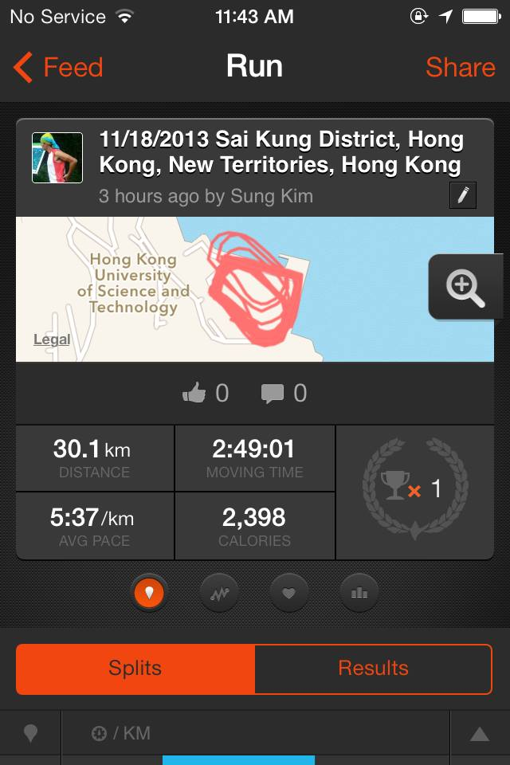
**이미지 캡션:** 이 화면은 운동 기록 앱의 일부로, 성인 남성으로 추정되는 인물이 2013년 11월 18일 홍콩 신계 지역에서 30.1km를 2시간 49분 1초 동안 달린 기록을 보여준다. 평균 페이스는 5분 37초/km이며, 2,398 칼로리를 소모했다. 지도에는 홍콩 과학기술대학교 주변의 경로가 빨간색으로 표시되어 있으며, 줌인 기능과 함께 1개의 트로피 아이콘이 보인다. 화면 상단에는 "Feed", "Run", "Share" 메뉴가 있고, "No Service"와 "11:43 AM"이라는 정보가 표시된다. 하단에는 "Splits"와 "Results" 버튼이 있다. 전반적으로 운동 기록을 확인하고 공유하는 기능이 있는 앱 화면으로 보인다.

### 11월 24일 (일) 10:34 · Yeon Gyoung Gwack's first 10k run in HK.…

Yeon Gyoung Gwack's first 10k run in HK. It was wonderful!!

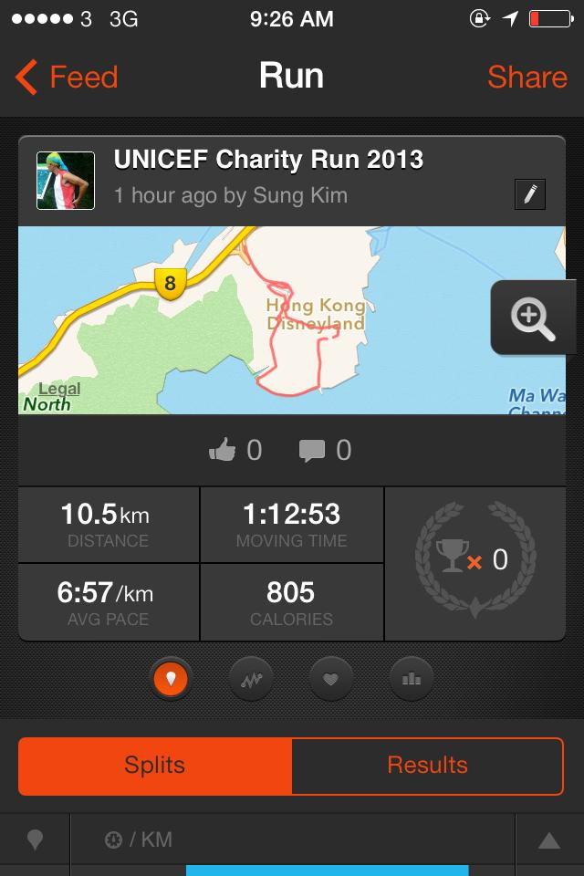
**이미지 캡션:** 이 화면은 스마트폰 애플리케이션의 실행 기록을 보여주는 것으로, 상단에는 시간과 배터리 상태, 그리고 "Feed"와 "Run", "Share" 버튼이 있습니다. 중앙에는 "UNICEF Charity Run 2013"이라는 제목과 함께 1시간 전 Sung Kim이라는 사용자가 기록한 내용임을 알 수 있습니다. 작은 사진에는 운동복을 입고 머리에 두건을 쓴 성인 남성이 보입니다. 그 아래에는 홍콩 디즈니랜드 인근을 나타내는 지도가 표시되어 있으며, 확대/축소 버튼도 보입니다. 지도 아래에는 좋아요와 댓글 아이콘과 함께 각각 0개의 숫자가 표시되어 있습니다. 그 아래에는 실행 기록 요약으로, 총 거리 10.5km, 이동 시간 1시간 12분 53초, 평균 페이스 6분 57초/km, 소모 칼로리 805가 표시되어 있습니다. 오른쪽에는 트로피 모양의 아이콘과 함께 0이라는 숫자가 있어 획득한 성과가 없음을 나타냅니다. 화면 하단에는 "Splits"와 "Results" 버튼이 있으며, 현재 "Splits"가 선택되어 있습니다. 전반적으로 활동적인 분위기를 나타내며, 사용자의 운동 기록을 공유하고 확인하는 데 사용되는 화면입니다.
 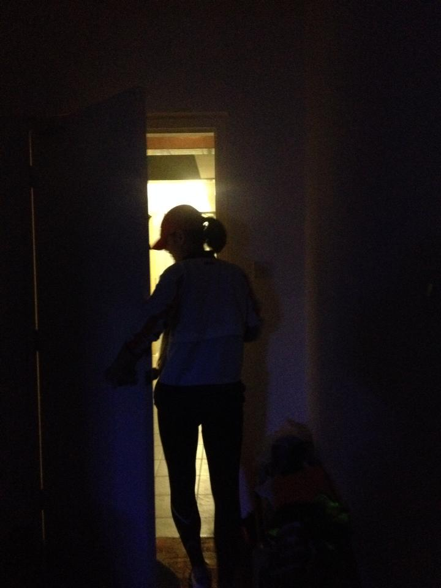
**이미지 캡션:** 어두운 실내에서 문이 열려 있고, 그 문틈으로 보이는 밝은 빛을 향해 한 명의 성인 여성이 서 있습니다. 여성은 20대 후반에서 30대 초반으로 보이며, 머리를 뒤로 묶고 빨간색 모자를 쓰고 있습니다. 밝은 색상의 상의와 검은색 하의를 입고 있으며, 다리가 길고 날씬한 체형입니다. 여성은 문을 통해 안쪽을 바라보고 있으며, 표정은 어두워서 잘 보이지 않지만 호기심이나 기대감을 가지고 있는 듯합니다. 배경에는 어두운 벽과 바닥이 보이며, 문 옆에는 물건들이 쌓여 있는 것으로 보입니다. 전체적으로 어둡고 신비로운 분위기를 자아내며, 마치 비밀스러운 장소로 들어가는 듯한 느낌을 줍니다.
 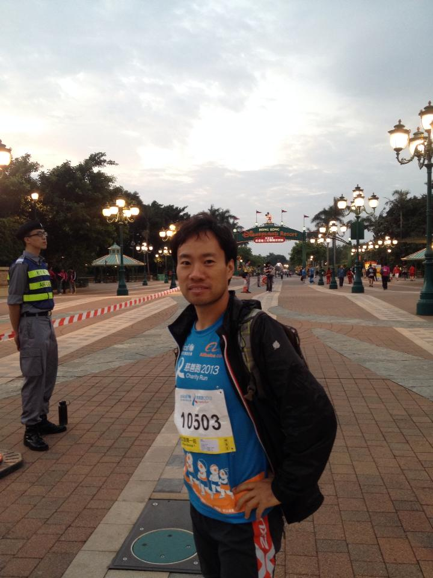
**이미지 캡션:** 한 성인 남성이 밝은 파란색 티셔츠에 검은색 재킷을 걸치고 있으며, 티셔츠에는 "자선 달리기 2013"이라는 문구와 함께 10503이라는 번호가 적혀 있습니다. 그는 허리에 손을 얹고 카메라를 응시하고 있으며, 그의 표정은 약간 미소를 띠고 있습니다. 배경에는 홍콩 디즈니랜드 리조트의 입구로 보이는 아치형 구조물이 있으며, 아치에는 "HONG KONG"이라는 글자가 보입니다. 주변에는 가로등과 나무들이 늘어서 있고, 많은 사람들이 행진하는 듯한 모습이 보입니다. 전체적으로 저녁 무렵의 차분하고 활기찬 분위기입니다.
 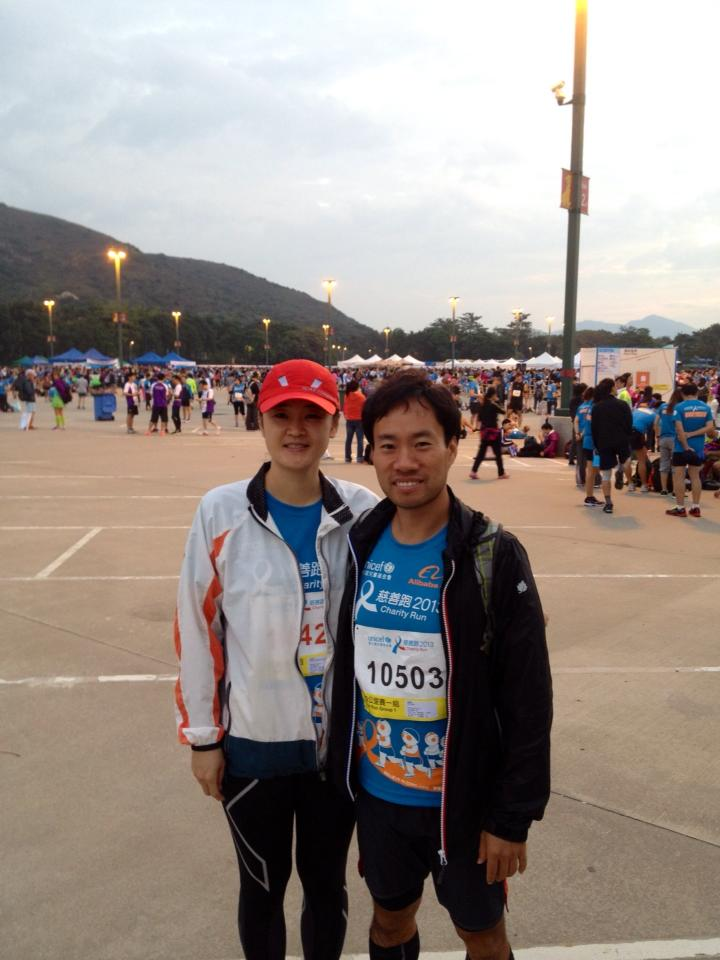
**이미지 캡션:** 한 명의 성인 여성은 빨간색 야구 모자를 쓰고 흰색과 주황색 재킷을 입고 있으며, 다른 한 명의 성인 남성은 검은색 재킷을 입고 파란색 티셔츠를 입고 있다. 두 사람 모두 달리기 대회에 참가한 것으로 보이며, 여성은 42번, 남성은 10503번의 번호표를 달고 있다. 그들은 야외에서 열린 자선 달리기 대회에 참가한 것으로 보이며, 배경에는 산과 여러 개의 텐트, 그리고 많은 사람들이 보인다. 하늘은 흐리고 구름이 껴 있으며, 가로등이 몇 개 보인다. 전반적으로 활기찬 분위기 속에서 스포츠 행사가 진행되고 있음을 알 수 있다.
 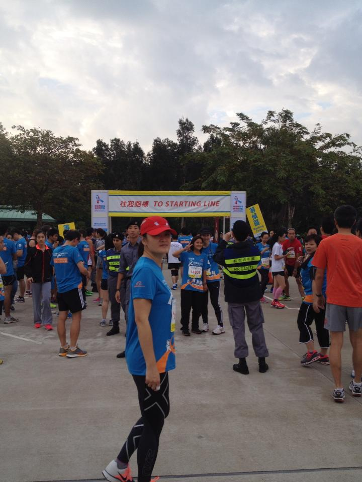
**이미지 캡션:** 이 사진은 야외에서 열리는 마라톤 대회 시작선 근처의 풍경을 담고 있으며, 여러 명의 참가자들이 모여 있는 모습입니다. 중앙에는 파란색 티셔츠와 검은색 레깅스를 입고 빨간색 모자를 쓴 성인 여성이 카메라를 향해 걸어오고 있으며, 그녀의 표정은 약간 미소를 띠고 있습니다. 그녀의 뒤로는 노란색 배경에 "往起跑線 TO STARTING LINE"이라고 쓰인 대형 현수막이 걸려 있고, 그 아래에는 파란색, 주황색, 흰색 등 다양한 색상의 운동복을 입은 참가자들이 서 있습니다. 참가자들은 대부분 20대에서 40대로 보이는 성인 남녀이며, 일부는 레이스 번표를 달고 있습니다. 배경에는 울창한 나무들이 보이고, 하늘은 구름이 낀 흐린 날씨입니다. 전반적으로 대회 시작을 기다리는 참가자들의 활기찬 분위기와 함께 약간의 긴장감이 느껴집니다.
