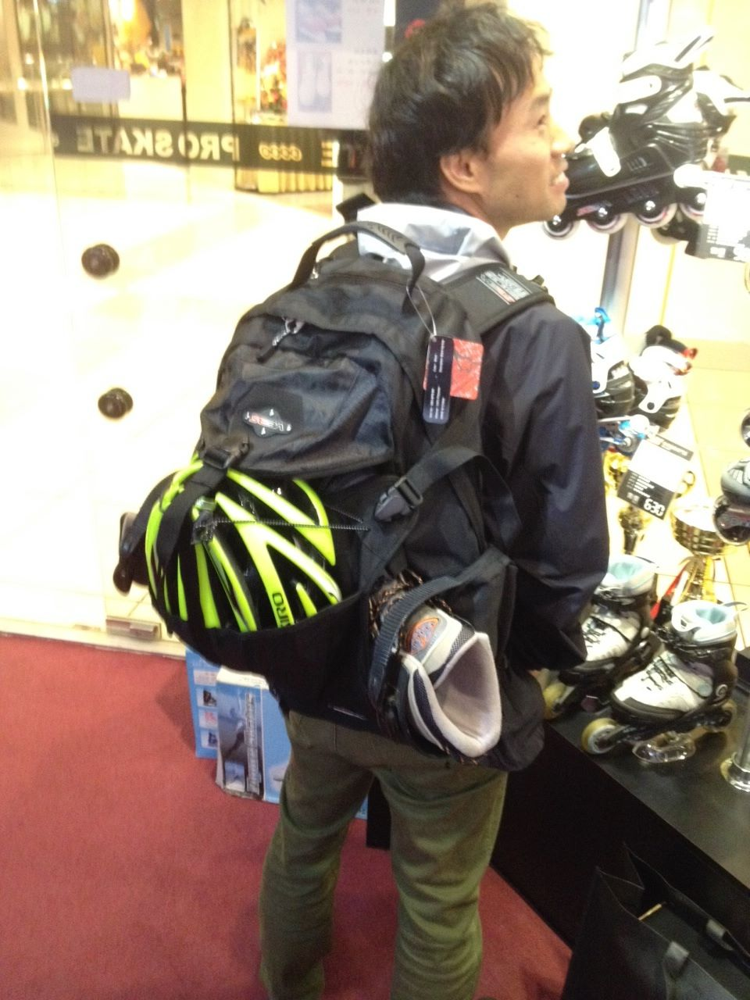
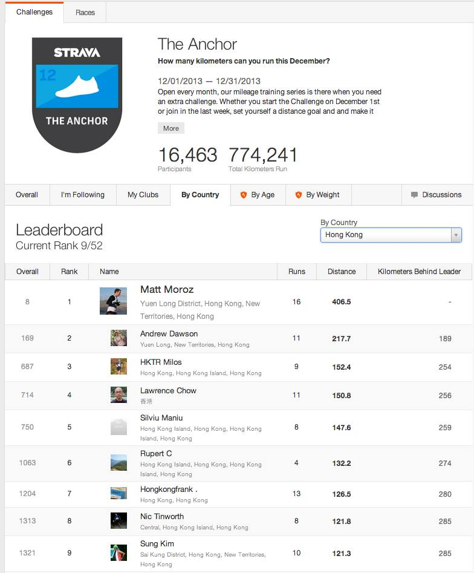
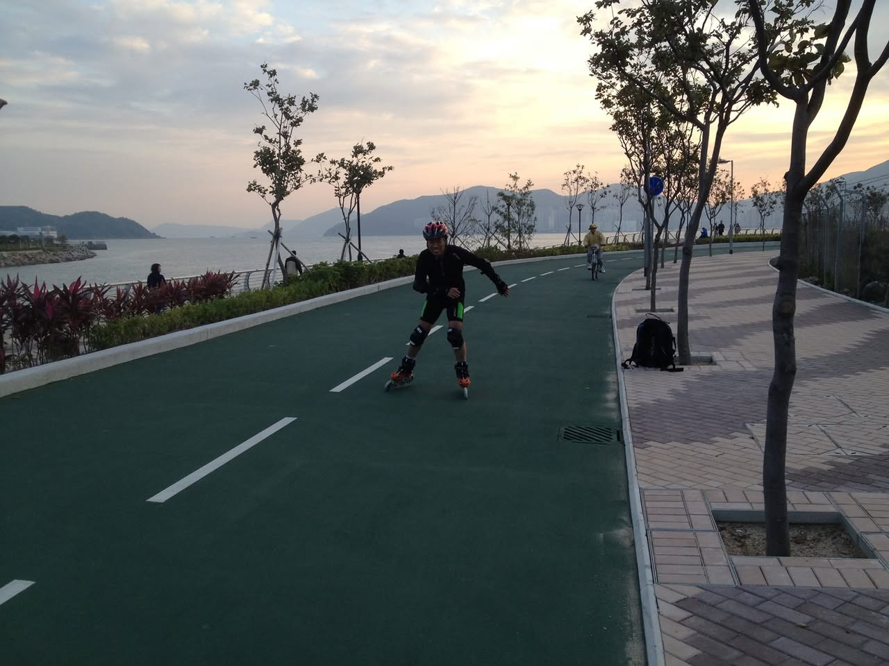
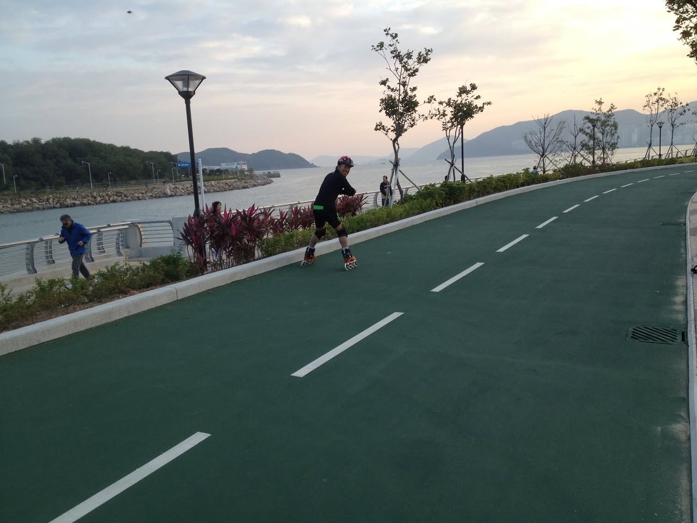
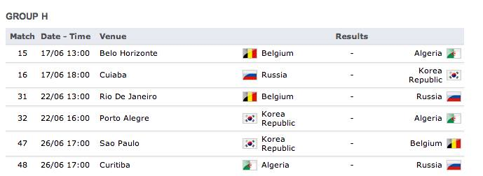
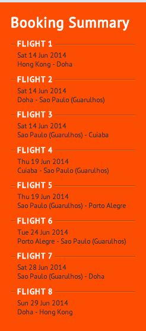
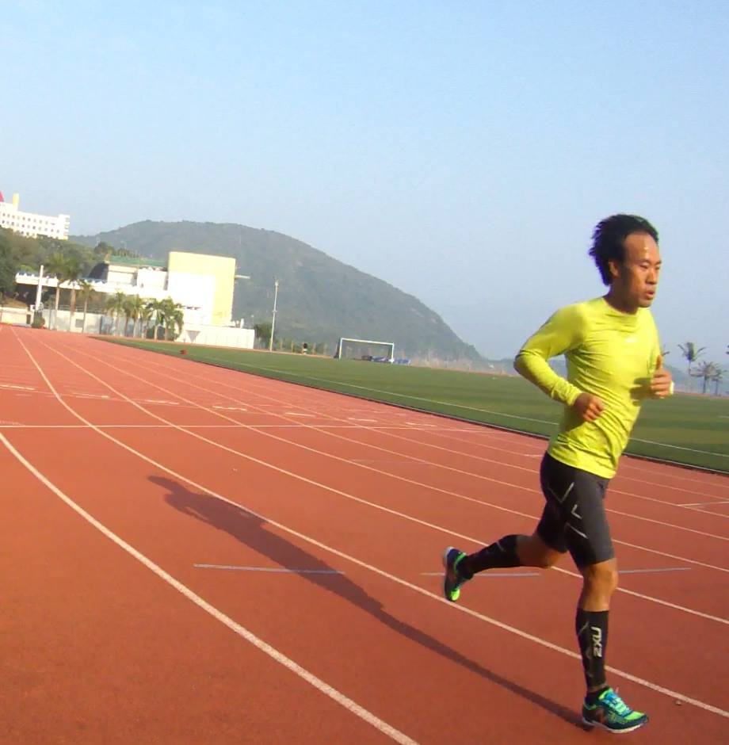
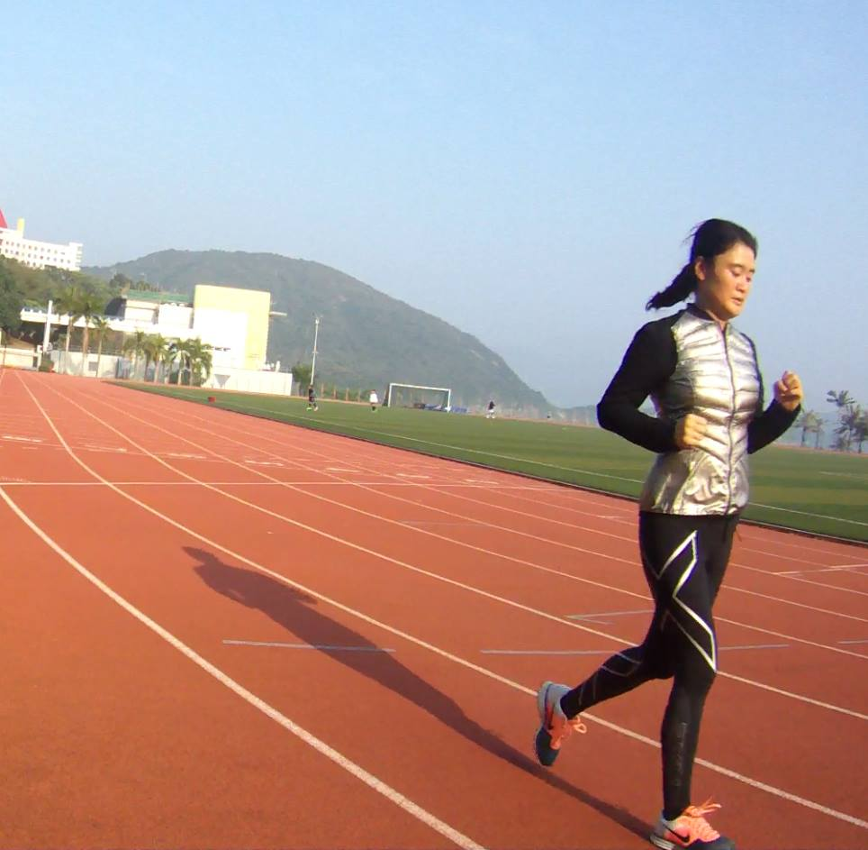
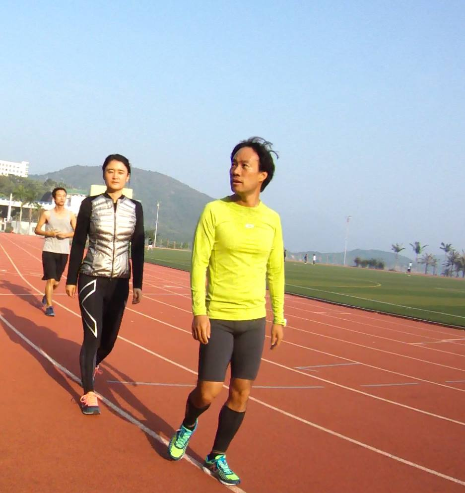

# 2013년 12월

[← 2013년](README.md)

### 12월 4일 (수) 13:15 · Just DO it!

Just DO it!

### 12월 10일 (화) 09:04 · Ready to roll!

Ready to roll!

**이미지 캡션:** 한 명의 성인 남성이 검은색 재킷과 녹색 바지를 입고 검은색 백팩을 메고 있다. 백팩 옆에는 형광 녹색 헬멧과 롤러 스케이트 한 짝이 달려 있다. 남성은 가게 안에서 롤러 스케이트를 바라보고 있으며, 배경에는 롤러 스케이트가 진열되어 있고 유리문에 "PRO SKATE"라는 글자가 거꾸로 보인다. 전체적으로 쇼핑몰이나 스포츠 용품점의 분위기이다.

### 12월 18일 (수) 22:27 · is ranked 9th in STRAVA Anchor December …

is ranked 9th in STRAVA Anchor December Challenge in Hong Kong! I'll run more!!

**이미지 캡션:** 이 이미지는 'The Anchor'라는 이름의 스트라바 챌린지에 대한 리더보드를 보여줍니다. 챌린지는 2013년 12월 1일부터 12월 31일까지 진행되었으며, 참가자들이 12월 한 달 동안 얼마나 많은 킬로미터를 달렸는지 측정하는 마일리지 훈련 시리즈입니다. 화면 상단에는 챌린지의 이름, 설명, 진행 기간, 총 참가자 수(16,463명) 및 총 달린 킬로미터 수(774,241km)가 표시되어 있습니다. 그 아래에는 '리더보드' 섹션이 있으며, 현재 순위는 9/52입니다. 리더보드는 '전체', '팔로잉 중', '클럽', '국가별', '나이별', '체중별'로 정렬할 수 있으며, 현재는 '국가별'로 홍콩이 선택되어 있습니다. 리더보드에는 순위, 이름, 달린 횟수, 거리, 선두와의 킬로미터 차이가 표시됩니다. 상위권 참가자로는 1위 Matt Moroz(홍콩 신계 지역), 2위 Andrew Dawson(홍콩 신계 지역), 3위 HKTR Milos(홍콩 섬), 4위 Lawrence Chow(홍콩), 5위 Silviu Maniu(홍콩 섬), 6위 Rupert C(홍콩 섬), 7위 Hongkongfrank.(홍콩), 8위 Nic Tinworth(홍콩 섬), 9위 Sung Kim(홍콩 신계 지역) 등이 있습니다. 각 참가자 옆에는 프로필 사진 또는 아바타가 있으며, 챌린지 참여를 독려하는 긍정적이고 경쟁적인 분위기를 느낄 수 있습니다.241 kilometers. Below this, a leaderboard is shown, filtered by "By Country" to display results for Hong Kong. The current rank of the viewer is 9 out of 52. The leaderboard lists participants with their overall rank, name, profile picture, location, number of runs, distance covered, and kilometers behind the leader. The top participant is Matt Moroz, ranked 1st with 406.5 kilometers. Other participants listed include Andrew Dawson, HKTR Milos, Lawrence Chow, Silviu Maniu, Rupert C, Hongkongfrank, Nic Tinworth, and Sung Kim, with their respective distances and kilometers behind the leader. The overall atmosphere is competitive and motivational, focused on running achievements.

### 12월 20일 (금) 00:45 · Go! Go!!

Go! Go!!

**이미지 캡션:** 해 질 녘, 푸른색 롤러 스케이트를 타고 있는 한 어린 소년이 녹색 자전거 도로를 따라 이동하고 있으며, 그는 헬멧과 보호 장비를 착용하고 있습니다. 그의 뒤로는 바다와 산이 펼쳐져 있고, 길가에는 나무들이 늘어서 있습니다. 길 건너편에는 자전거를 타는 사람과 몇몇 사람들이 보입니다. 전반적으로 평화롭고 활동적인 분위기입니다.
 
**이미지 캡션:** 해 질 녘, 푸른색 롤러 스케이트를 타고 녹색 도로를 달리는 젊은 성인 남성이 있다. 그는 헬멧과 보호 장비를 착용하고 있으며, 그의 표정은 집중하고 있다. 도로 옆에는 바다와 산이 보이며, 몇 그루의 나무와 가로등이 늘어서 있다. 멀리에는 건물들이 보이고, 하늘은 구름으로 덮여 있다. 도로에는 흰색 차선이 그려져 있고, 옆에는 보행자 도로가 있다. 보행자 도로에는 파란색 재킷을 입은 중년 남성이 걷고 있으며, 그의 뒤에는 몇 명의 사람들이 서 있다. 전반적으로 평화롭고 활동적인 분위기이다.

### 12월 22일 (일) 21:43 · Booked 8 flight tickets for the 2014 FIF…

Booked 8 flight tickets for the 2014 FIFA World Cup Brazil (Korean games)!

**이미지 캡션:** 이 이미지는 축구 경기 일정표로, "GROUP H"라는 제목 아래 각 경기의 번호, 날짜 및 시간, 장소, 그리고 결과가 표시되어 있습니다. 각 경기는 두 팀의 국기와 이름으로 구성되어 있으며, 결과 부분에는 아직 경기가 진행되지 않았음을 나타내는 하이픈(-)이 표시되어 있습니다. 구체적으로는 벨기에와 알제리, 러시아와 대한민국, 벨기에와 러시아, 대한민국과 알제리, 대한민국과 벨기에, 알제리와 러시아의 경기가 예정되어 있음을 알 수 있습니다. 각 팀의 국기 이미지가 함께 표시되어 있어 시각적으로 정보를 파악하기 용이합니다. 전체적으로 깔끔하고 정보 전달에 초점을 맞춘 디자인입니다.하기 용이합니다. 전체적으로 깔끔하고 정보 전달에 초점을 맞춘 디자인입니다.
 
**이미지 캡션:** 이 이미지는 주황색 배경에 흰색 글씨로 "Booking Summary"라는 제목과 함께 8개의 항공편 예약 정보를 보여주는 화면 캡처입니다. 각 항공편은 "FLIGHT" 번호와 함께 출발 날짜, 출발지와 도착지가 명시되어 있습니다. 구체적으로 FLIGHT 1은 2014년 6월 14일 홍콩에서 도하로 가는 항공편이며, FLIGHT 2는 같은 날 도하에서 상파울루(과룰류스)로 가는 항공편입니다. FLIGHT 3은 2014년 6월 14일 상파울루(과룰류스)에서 쿠이아바로 가는 항공편이며, FLIGHT 4는 2014년 6월 19일 쿠이아바에서 상파울루(과룰류스)로 가는 항공편입니다. FLIGHT 5는 2014년 6월 19일 상파울루(과룰류스)에서 포르투 알레그레로 가는 항공편이며, FLIGHT 6은 2014년 6월 24일 포르투 알레그레에서 상파울루(과룰류스)로 가는 항공편입니다. FLIGHT 7은 2014년 6월 28일 상파울루(과룰류스)에서 도하로 가는 항공편이며, FLIGHT 8은 2014년 6월 29일 도하에서 홍콩으로 가는 항공편입니다. 이미지에는 사람이 등장하지 않으며, 배경은 단색의 주황색입니다. 텍스트 외에 다른 사물은 보이지 않습니다. 전체적으로 예약 정보를 담고 있는 간결하고 정보 전달에 집중된 화면의 분위기입니다.년 6월 19일 쿠이아바에서 상파울루(과룰류스)로 가는 항공편입니다. FLIGHT 5는 2014년 6월 19일 상파울루(과룰류스)에서 포르투 알레그레로 가는 항공편이며, FLIGHT 6은 2014년 6월 24일 포르투 알레그레에서 상파울루(과룰류스)로 가는 항공편입니다. FLIGHT 7은 2014년 6월 28일 상파울루(과룰류스)에서 도하로 가는 항공편이며, FLIGHT 8은 2014년 6월 29일 도하에서 홍콩으로 가는 항공편입니다. 이미지에는 사람이 등장하지 않으며, 배경은 단색의 주황색입니다. 텍스트 외에 다른 사물은 보이지 않습니다. 전체적으로 예약 정보를 담고 있는 간결하고 정보 전달에 집중된 화면의 분위기입니다.

### 12월 22일 (일) 21:45 · Fun run with Yeon!

Fun run with Yeon!

**이미지 캡션:** 한 명의 성인 남성이 트랙 위를 달리고 있으며, 그는 밝은 형광 연두색 긴팔 상의와 검은색 반바지, 그리고 2XU라고 적힌 검은색 압박 스타킹과 형광 녹색 및 파란색 운동화를 착용하고 있습니다. 남성은 30대 후반에서 40대 초반으로 보이며, 짧은 검은색 머리카락을 가지고 있고, 훈련에 집중하는 듯한 진지한 표정을 짓고 있습니다. 그의 몸은 앞으로 기울어져 있고, 팔은 자연스럽게 움직이며 달리는 동작을 하고 있습니다. 배경에는 붉은색 육상 트랙과 녹색 잔디밭이 펼쳐져 있으며, 멀리 언덕과 건물, 그리고 야자수가 보입니다. 하늘은 맑고 푸르며, 햇살이 비추고 있어 야외 훈련하기 좋은 날씨임을 알 수 있습니다. 트랙에는 그의 긴 그림자가 드리워져 있습니다.가 보입니다. 하늘은 맑고 푸르며, 햇살이 비추고 있어 야외 훈련하기 좋은 날씨임을 알 수 있습니다. 트랙에는 그의 긴 그림자가 드리워져 있습니다.
 
**이미지 캡션:** 한 명의 성인 여성이 트랙 위에서 조깅을 하고 있다. 그녀는 30대 후반에서 40대 초반으로 보이며, 검은색 머리를 포니테일로 묶고 있다. 은색과 검은색이 섞인 패딩 조끼와 검은색 레깅스를 입고 있으며, 발에는 주황색과 흰색이 섞인 운동화를 신고 있다. 그녀는 약간 앞으로 숙인 자세로 뛰고 있으며, 표정은 집중한 듯 보인다. 배경에는 붉은색 트랙과 녹색 잔디밭이 펼쳐져 있고, 멀리 산과 건물들이 보인다. 하늘은 맑고 푸르며, 햇살이 비추고 있어 활동하기 좋은 날씨임을 알 수 있다. 트랙 위에는 여러 개의 레인이 표시되어 있고, 잔디밭에는 축구 골대가 보인다. 몇몇 다른 사람들이 멀리서 운동하고 있는 모습도 희미하게 보인다. 전체적으로 건강하고 활동적인 분위기를 나타내는 장면이다.이 표시되어 있고, 잔디밭에는 축구 골대가 보인다. 몇몇 다른 사람들이 멀리서 운동하고 있는 모습도 희미하게 보인다. 전체적으로 건강하고 활동적인 분위기를 나타내는 장면이다.
 
**이미지 캡션:** 세 명의 성인 남녀가 육상 트랙에서 달리고 있다. 가장 앞에 있는 성인 남성은 30대 후반에서 40대 초반으로 보이며, 밝은 연두색 긴팔 상의와 회색 반바지, 검은색 압박 스타킹, 형광색과 파란색이 섞인 운동화를 신고 있다. 그는 약간 옆을 바라보며 무표정하게 걷고 있다. 그 뒤로 보이는 성인 여성은 20대 후반에서 30대 초반으로 추정되며, 은색과 검은색이 섞인 조끼와 검은색 레깅스, 분홍색 운동화를 신고 있다. 그녀는 정면을 바라보며 걷고 있으며, 표정은 보이지 않는다. 가장 뒤에 있는 성인 남성은 20대 초반으로 보이며, 회색 민소매 상의와 검은색 반바지, 파란색 운동화를 신고 있다. 그는 앞을 바라보며 달리고 있다. 배경에는 푸른 하늘과 산, 야자수 나무, 그리고 건물들이 보인다. 트랙은 붉은색으로 되어 있으며, 흰색 선들이 그어져 있다. 전체적으로 훈련이나 운동을 하는 듯한 분위기이며, 맑은 날씨에 야외에서 촬영된 것으로 보인다. 초반으로 보이며, 회색 민소매 상의와 검은색 반바지, 파란색 운동화를 신고 있다. 그는 앞을 바라보며 달리고 있다. 배경에는 푸른 하늘과 산, 야자수 나무, 그리고 건물들이 보인다. 트랙은 붉은색으로 되어 있으며, 흰색 선들이 그어져 있다. 전체적으로 훈련이나 운동을 하는 듯한 분위기이며, 맑은 날씨에 야외에서 촬영된 것으로 보인다.
