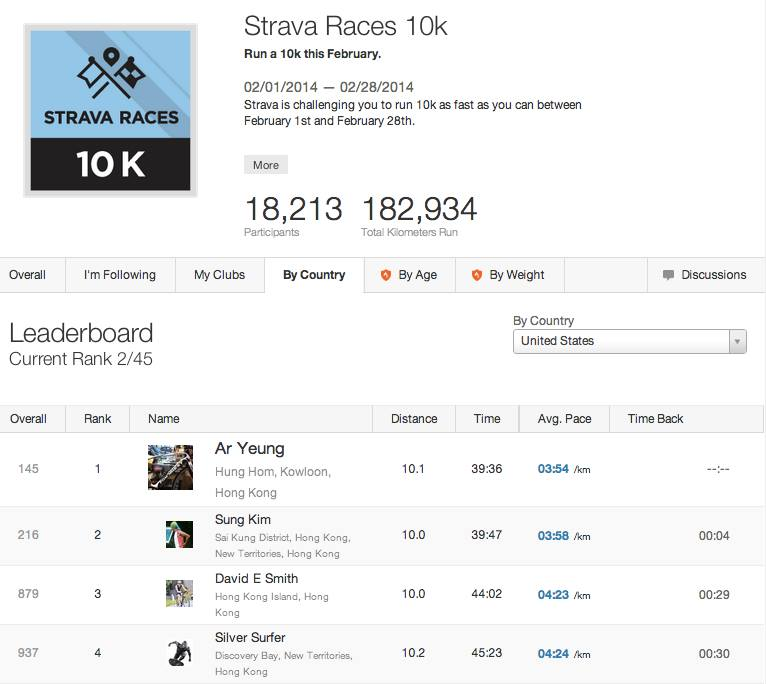
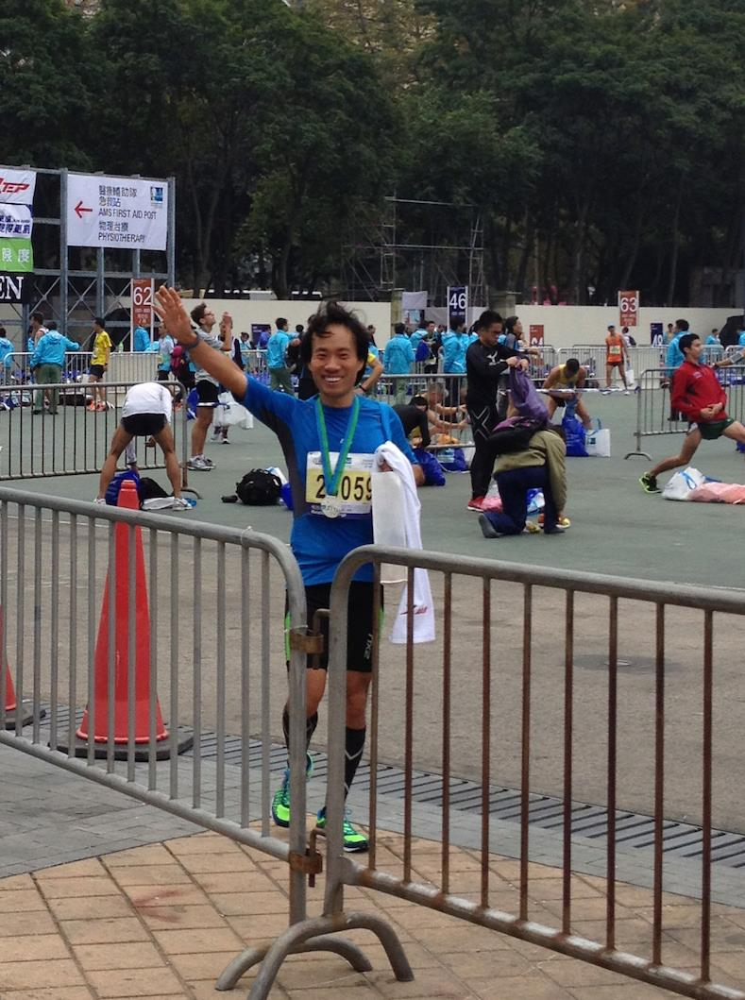
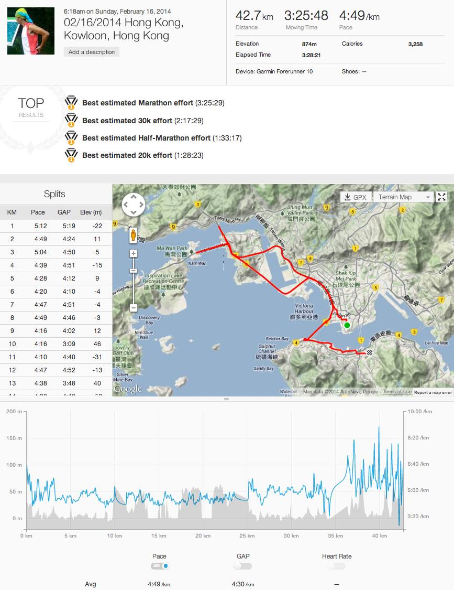

# 2014년 2월

[← 2014년](README.md)

### 2월 10일 (월) 21:29 · is ranked 2nd in Strava Races 10K (in Ho…

is ranked 2nd in Strava Races 10K (in Hong Kong) so far. :-) Overall Rank is 219 out of 10948.

**이미지 캡션:** 이 이미지는 스트라바 레이스 10k 챌린지의 리더보드를 보여주는 웹페이지 스크린샷입니다. 상단에는 "Strava Races 10k"라는 제목과 함께 2014년 2월 1일부터 2월 28일까지 진행되는 10km 달리기 챌린지에 대한 설명이 있습니다. 챌린지에는 총 18,213명의 참가자가 참여했으며, 총 182,934km가 달렸습니다. 리더보드는 참가자들의 순위, 이름, 거주지, 달린 거리, 시간, 평균 페이스, 시간 차이 등의 정보를 보여줍니다. 현재 순위는 2/45이며, 상위 4명의 참가자 정보가 표시되어 있습니다. 첫 번째 참가자는 Ar Yeung으로 홍콩 헝홈에 거주하며 10.1km를 39분 36초에 달렸고, 평균 페이스는 3분 54초/km입니다. 두 번째 참가자는 Sung Kim으로 홍콩 신계에 거주하며 10km를 39분 47초에 달렸고, 평균 페이스는 3분 58초/km입니다. 세 번째 참가자는 David E Smith로 홍콩 섬에 거주하며 10km를 44분 2초에 달렸고, 평균 페이스는 4분 23초/km입니다. 네 번째 참가자는 Silver Surfer로 홍콩 신계에 거주하며 10.2km를 45분 23초에 달렸고, 평균 페이스는 4분 24초/km입니다. 리더보드는 국가별, 나이별, 체중별로 필터링할 수 있으며, 현재는 "United States"가 선택되어 있습니다. 전반적으로 스포츠 이벤트의 결과와 순위를 보여주는 정보성 콘텐츠입니다.

### 2월 16일 (일) 14:53 · successfully finished his first marathon…

successfully finished his first marathon (Standard Chartered HK Marathon) in 3:30! Running hilly Hong Kong roads was really challenging, but fun. I'll do it again. The next goal is 3:15!!

**이미지 캡션:** 한 명의 성인 남성이 밝은 파란색 반팔 티셔츠와 검은색 반바지를 입고 있으며, 티셔츠에는 번호 2059가 적힌 흰색 배지가 달려 있고 목에는 메달을 걸고 있다. 그는 오른손을 흔들며 카메라를 향해 활짝 웃고 있으며, 왼손에는 흰색 봉투를 들고 있다. 남성은 운동화와 종아리까지 올라오는 검은색 양말을 신고 있다. 배경에는 여러 명의 다른 참가자들이 보이며, 일부는 스트레칭을 하거나 앉아 쉬고 있다. 울타리와 주황색 콘이 앞에 보이며, 뒤쪽에는 나무와 건물, 그리고 "AMS FIRST AID POST"라고 적힌 표지판이 보인다. 전반적으로 마라톤이나 달리기 대회 후의 활기찬 분위기를 나타낸다.
 
**이미지 캡션:** 이 사진은 2014년 2월 16일 홍콩 구룡에서 열린 마라톤 기록을 보여주는 화면 캡처로, 상단에는 마라톤 날짜, 장소, 총 거리 42.7km, 총 소요 시간 3시간 25분 48초, 평균 페이스 4분 49초/km, 총 고도 상승 874m, 칼로리 소모 3,258kcal 등의 정보가 표시되어 있으며, Garmin Forerunner 10 기기로 기록되었음을 알 수 있다. 그 아래에는 마라톤, 30km, 하프 마라톤, 20km 기록 중 최고 기록들이 나열되어 있다. 화면 중앙에는 마라톤 경로를 보여주는 지도와 함께 각 구간별 상세 기록(KM, 페이스, GAP, 고도)이 표로 정리되어 있으며, 지도에는 빅토리아 하버, 마완 파크, 칭이 섬 등이 표시되어 있다. 하단에는 마라톤 동안의 페이스, GAP, 심박수 변화를 나타내는 그래프가 그려져 있으며, 페이스는 평균 4분 49초/km, GAP는 4분 30초/km임을 보여준다. 전반적으로 운동 기록을 상세하게 보여주는 화면으로, 운동선수나 운동 애호가에게 유용한 정보를 제공한다.
