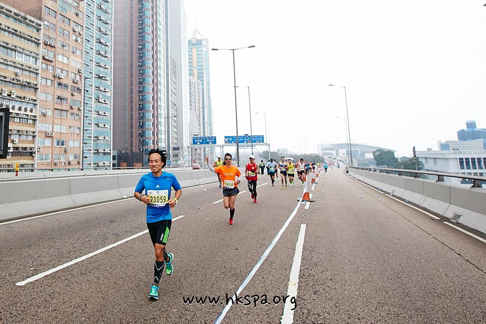
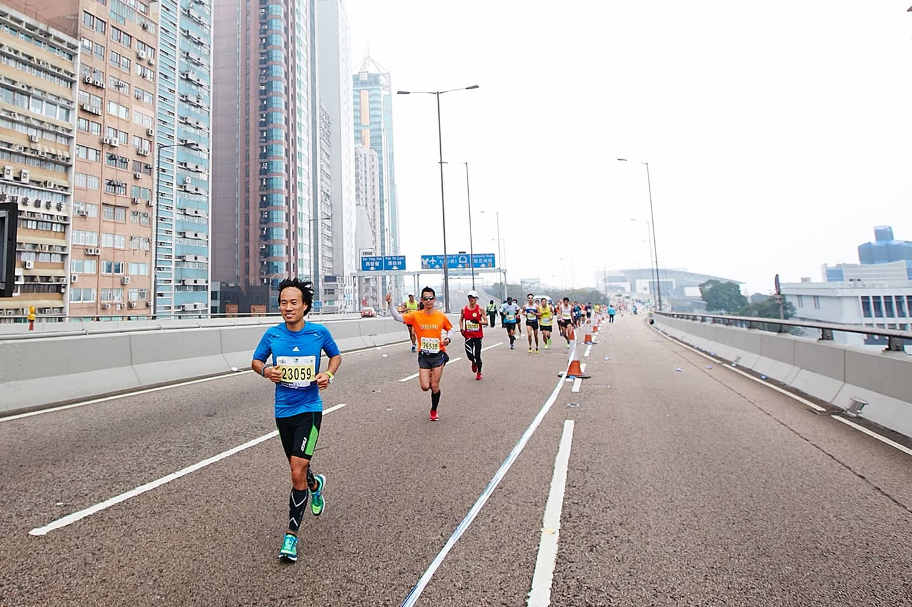

# 2014년 3월

[← 2014년](README.md)

### 3월 3일 (월) 13:48 · 📷 앨범: Cover photos (1장)

**이미지 캡션:** 이 사진은 도시의 고가 도로에서 열리는 마라톤 경주를 보여줍니다. 전경에는 파란색 상의와 검은색 반바지를 입은 성인 남성이 달리고 있으며, 그의 가슴에는 23059라는 번호가 적힌 배번이 부착되어 있습니다. 그는 밝은 표정으로 카메라를 향해 웃고 있으며, 다리에는 압박 스타킹을 신고 있습니다. 그의 뒤로는 여러 명의 다른 참가자들이 달리고 있으며, 일부는 오렌지색, 노란색, 빨간색 등 다양한 색상의 운동복을 입고 있습니다. 배경에는 높고 현대적인 건물들이 늘어서 있으며, 흐릿한 하늘과 함께 도시적인 분위기를 자아냅니다. 도로에는 흰색 차선과 주황색 콘이 보이며, 이는 경주 구간을 표시하고 있습니다. 사진 하단에는 "www.hkspa.org"라는 웹사이트 주소가 보입니다. 전반적으로 활기차고 역동적인 마라톤 경주의 순간을 포착한 사진입니다.자아냅니다. 도로에는 흰색 차선과 주황색 콘이 보이며, 이는 경주 구간을 표시하고 있습니다. 사진 하단에는 "www.hkspa.org"라는 웹사이트 주소가 보입니다. 전반적으로 활기차고 역동적인 마라톤 경주의 순간을 포착한 사진입니다.

### 3월 24일 (월) 14:58 · 📷 앨범: Cover photos (1장)

**이미지 캡션:** 마라톤 경주에 참가한 여러 명의 선수들이 도로를 달리고 있습니다. 가장 앞에 있는 남성 선수는 파란색 반팔 티셔츠와 검은색 반바지, 그리고 종아리까지 올라오는 검은색 압박 스타킹을 착용하고 있으며, 밝은 표정으로 힘차게 달리고 있습니다. 그의 배번은 23059입니다. 뒤이어 주황색 티셔츠를 입은 다른 선수도 엄지손가락을 치켜세우며 달리고 있고, 그 뒤로도 여러 명의 선수들이 각자의 속도로 경주를 이어가고 있습니다. 배경에는 높고 현대적인 건물들이 늘어서 있으며, 도로 위에는 가드레일과 가로등이 보입니다. 도로에는 흰색 차선이 그려져 있고, 주황색 콘과 파란색 물병 뚜껑으로 보이는 작은 물체들이 흩어져 있습니다. 전체적으로 도시의 고속도로에서 열리는 마라톤 경주의 역동적인 분위기를 느낄 수 있습니다.h the number 23059 clearly visible on his bib, black running shorts with green accents, and compression socks. He has a determined yet slightly smiling expression and is in mid-stride, looking towards the camera. Behind him, other runners are also in motion, some wearing brightly colored shirts like orange and red. The road is marked with white lines, and orange traffic cones are placed along the side, indicating a race course. In the distance, more runners are visible, and the sky is overcast, suggesting a cool, possibly humid day. The overall atmosphere is one of a competitive sporting event taking place in an urban environment.
