# 2014년 5월

[← 2014년](README.md)

### 5월 5일 (월) 23:17 · The best swimming pool experience ever!

📍 Harbour Grand Kowloon 九龍海逸君綽酒店

The best swimming pool experience ever!

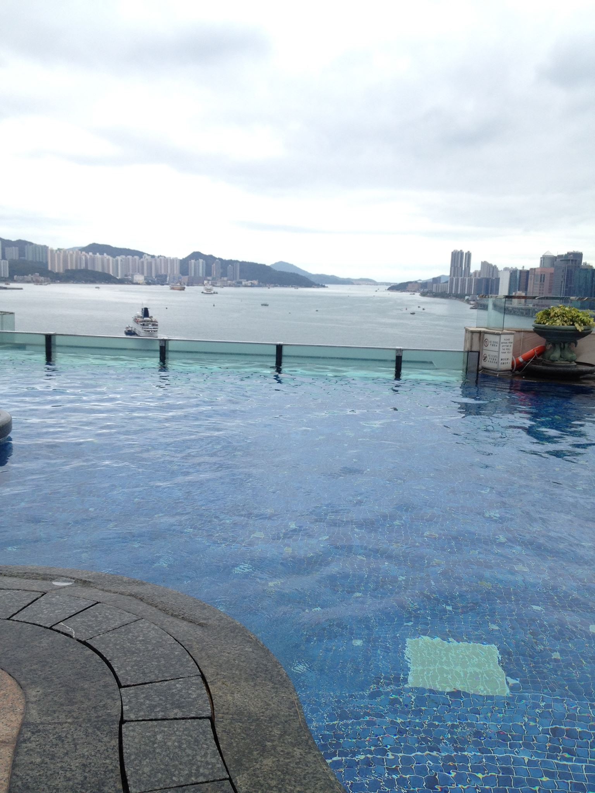
**이미지 캡션:** 이 사진은 맑은 날씨에 탁 트인 수영장에서 바라본 도시 풍경을 담고 있습니다. 사진의 전경에는 파란색 타일로 마감된 수영장이 넓게 펼쳐져 있으며, 수영장 가장자리에는 어두운 색의 돌로 마감된 곡선 형태의 테두리가 보입니다. 수영장 물 위로는 잔잔한 물결이 일렁이고 있으며, 물속 타일의 패턴이 은은하게 비칩니다. 수영장 너머로는 맑은 바다가 보이고, 바다 위에는 여러 척의 배들이 떠 있습니다. 멀리 보이는 해안선에는 산과 함께 고층 빌딩들이 빽빽하게 들어서 있어 도시의 스카이라인을 형성하고 있습니다. 하늘은 구름 한 점 없이 맑고 푸르며, 전체적으로 평화롭고 여유로운 분위기를 자아냅니다. 수영장 난간에는 몇 개의 표지판과 함께 화분 하나가 놓여 있으며, 화분에는 푸른 식물이 심어져 있습니다. 사진에는 사람이 보이지 않아 더욱 고요하고 한적한 느낌을 줍니다.름 한 점 없이 맑고 푸르며, 전체적으로 평화롭고 여유로운 분위기를 자아냅니다. 수영장 난간에는 몇 개의 표지판과 함께 화분 하나가 놓여 있으며, 화분에는 푸른 식물이 심어져 있습니다. 사진에는 사람이 보이지 않아 더욱 고요하고 한적한 느낌을 줍니다.
 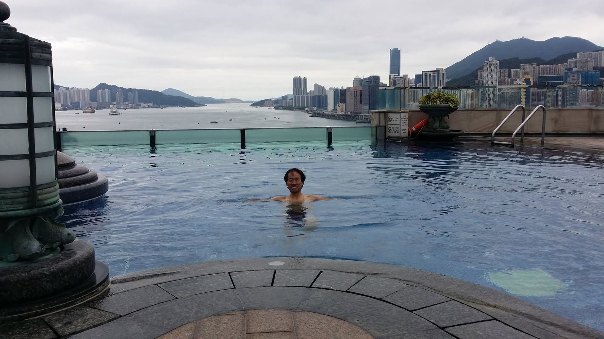
**이미지 캡션:** 흐린 날씨에 수영장 물속에 서 있는 성인 남성이 보인다. 그는 30대 후반에서 40대 초반으로 보이며, 짧은 검은 머리에 웃는 표정을 짓고 있다. 상의는 입지 않았고, 하의는 어두운 색의 수영복을 입고 있다. 그의 팔은 양옆으로 벌려 물에 떠 있거나 균형을 잡고 있는 듯하다. 배경으로는 홍콩의 스카이라인이 펼쳐져 있으며, 높은 건물들과 산이 보인다. 수영장은 인피니티 풀로, 끝이 보이지 않는 것처럼 바다와 연결된 듯한 느낌을 준다. 수영장 가장자리에는 돌과 타일로 마감되어 있으며, 한쪽에는 조명 기둥과 화분, 그리고 구명환이 보인다. 수영장 물은 맑고 푸른색이며, 잔잔한 물결이 일고 있다. 전반적으로 휴양지에서 여유를 즐기는 듯한 분위기이다. 그리고 구명환이 보인다. 수영장 물은 맑고 푸른색이며, 잔잔한 물결이 일고 있다. 전반적으로 휴양지에서 여유를 즐기는 듯한 분위기이다.
 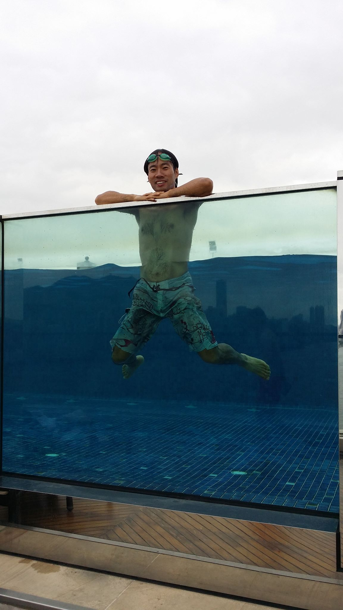
**이미지 캡션:** 흐린 하늘 아래, 수영장 가장자리에 팔을 걸치고 있는 성인 남성이 물속에서 점프하는 듯한 포즈를 취하고 있다. 그는 녹색 수경을 쓰고 있으며, 얼굴에는 즐거운 표정이 역력하다. 남성은 무늬가 있는 수영복 하의를 입고 있으며, 상반신은 물에 잠겨 있어 복근이 드러나 보인다. 수영장은 투명한 유리 벽으로 되어 있어 물속의 타일 바닥과 그 너머로 보이는 도시 풍경이 희미하게 보인다. 수영장 주변으로는 나무 데크가 깔려 있어 고급스러운 분위기를 자아낸다. 전체적으로 활동적이고 유쾌한 분위기의 사진이다.

### 5월 15일 (목) 19:11 · 📷 앨범: Profile pictures (4장)

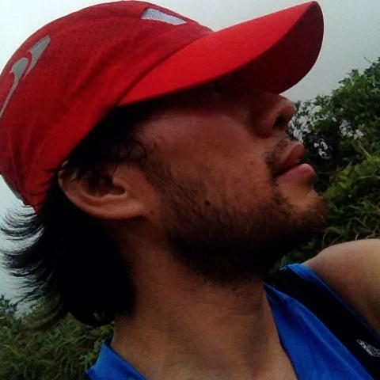
**이미지 캡션:** 이 사진은 붉은색 야구 모자를 쓰고 파란색 민소매 상의를 입은 성인 남성의 측면 얼굴 클로즈업 사진입니다. 남성은 30대에서 40대로 보이며, 짧은 검은색 머리카락이 모자 아래로 흘러나와 있고, 턱에는 수염이 약간 나 있습니다. 그의 표정은 편안해 보이며, 눈은 카메라를 향하고 있지 않습니다. 배경에는 푸른색 잎사귀가 무성한 나무들이 보이며, 흐린 하늘이 희미하게 보입니다. 사진은 야외에서 찍힌 것으로 보이며, 남성은 등산이나 야외 활동 중인 것으로 추정됩니다. 전반적으로 자연스럽고 편안한 분위기를 풍깁니다.
 
**이미지 캡션:** 이 사진은 붉은색 야구 모자와 파란색 스포츠 의류를 착용한 성인 남성의 측면 얼굴 클로즈업 사진으로, 대략 20대 후반에서 30대 초반으로 보이며 짧은 턱수염이 있고 머리카락은 어깨까지 내려온다. 남성은 고개를 약간 들고 하늘을 바라보고 있으며, 표정은 명확하게 보이지 않지만 편안해 보인다. 배경에는 흐릿한 녹색 식물과 흐린 하늘이 보이며, 야외 활동 중인 것으로 추정된다. 모자에는 은색 로고가 있으며, 남성은 어깨에 파란색 스포츠 가방을 메고 있다. 전체적으로 자연스럽고 편안한 분위기를 연출한다.
 
**이미지 캡션:** 이 사진은 붉은색 야구 모자를 쓰고 파란색 민소매 상의를 입은 성인 남성의 옆모습을 담고 있습니다. 남성은 20대 후반에서 30대 초반으로 보이며, 짧은 검은색 머리카락과 턱수염이 있습니다. 그의 표정은 약간 위를 향하고 있으며, 눈은 모자에 가려 보이지 않습니다. 배경에는 푸른색 잎사귀가 무성한 식물들이 보이며, 흐릿한 하늘이 뒤를 받치고 있습니다. 남성은 야외 활동 중인 것으로 보이며, 전체적으로 활동적이고 건강한 분위기를 풍깁니다. 모자에는 흰색 로고가 새겨져 있습니다.
 
**이미지 캡션:** 이 사진은 붉은색 야구 모자를 쓰고 파란색 민소매 상의를 입은 성인 남성의 옆모습을 담고 있습니다. 남성은 20대 후반에서 30대 초반으로 보이며, 짧은 검은색 머리카락이 모자 밖으로 약간 보이고 턱에는 수염이 있습니다. 그의 표정은 약간 위를 향하고 있어 무언가를 바라보고 있거나 생각에 잠긴 듯한 느낌을 줍니다. 배경에는 흐릿하게 보이는 녹색 식물과 하늘이 있어 야외 활동 중임을 짐작하게 합니다. 모자에는 은색 로고가 새겨져 있으며, 남성은 어깨에 검은색 가방을 메고 있는 것으로 보입니다. 전체적으로 활동적이고 자연스러운 분위기를 풍깁니다.이고 자연스러운 분위기를 풍깁니다.

### 5월 15일 (목) 23:16 · Hong Kong trail on a hot day!

📍 Dragon's Back Hong Kong Trail

Hong Kong trail on a hot day!

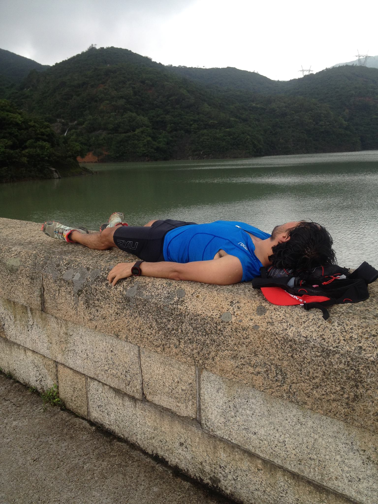
**이미지 캡션:** 흐린 날씨에 한 성인 남성이 저수지 둑에 누워 휴식을 취하고 있다. 그는 20대 후반에서 30대 초반으로 보이며, 검은색 곱슬머리에 덥수룩한 수염을 가지고 있다. 파란색 반팔 운동복 상의와 검은색 반바지를 입고 있으며, 발에는 회색과 주황색이 섞인 운동화를 신고 있다. 그의 얼굴은 보이지 않지만, 편안하게 잠든 듯한 표정이다. 손목에는 검은색 스포츠 시계를 차고 있으며, 머리맡에는 빨간색과 검은색이 섞인 배낭이 놓여 있다. 배경으로는 울창한 녹색 산과 잔잔한 물결의 저수지가 펼쳐져 있으며, 하늘은 구름으로 뒤덮여 있다. 둑은 거친 질감의 돌로 쌓여 있으며, 그 위에는 듬성듬성 풀이 자라 있다. 전반적으로 야외 활동 후 지친 모습으로 휴식을 취하는 평화로운 분위기이다.덮여 있다. 둑은 거친 질감의 돌로 쌓여 있으며, 그 위에는 듬성듬성 풀이 자라 있다. 전반적으로 야외 활동 후 지친 모습으로 휴식을 취하는 평화로운 분위기이다.
 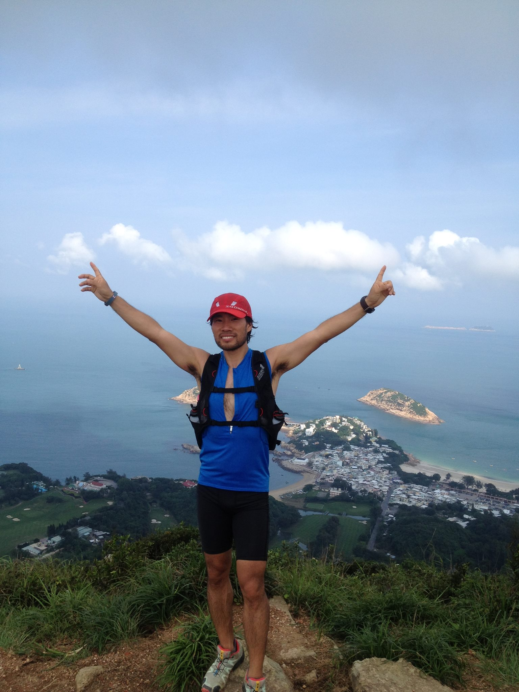
**이미지 캡션:** 푸른 하늘과 구름 아래, 한 성인 남성이 산 정상에서 두 팔을 활짝 벌리고 서 있다. 그는 30대 후반에서 40대 초반으로 보이며, 붉은색 모자를 쓰고 파란색 민소매 상의와 검은색 반바지를 착용하고 있다. 상의 위에는 검은색 조끼 형태의 배낭을 메고 있으며, 발에는 운동화를 신고 있다. 남성은 환하게 웃으며 즐거운 표정을 짓고 있고, 그의 오른손은 하늘을 향해 손가락질하고 있다. 배경으로는 푸른 바다와 그 위에 떠 있는 작은 섬, 그리고 섬에 자리 잡은 하얀 건물들이 보인다. 산 아래로는 녹색 잔디가 깔린 골프장과 숲이 펼쳐져 있으며, 멀리 수평선에는 희미하게 다른 섬들이 보인다. 전체적으로 등반이나 트레킹을 성공적으로 마친 듯한 성취감과 기쁨이 느껴지는 밝고 활기찬 분위기이다.프장과 숲이 펼쳐져 있으며, 멀리 수평선에는 희미하게 다른 섬들이 보인다. 전체적으로 등반이나 트레킹을 성공적으로 마친 듯한 성취감과 기쁨이 느껴지는 밝고 활기찬 분위기이다.
 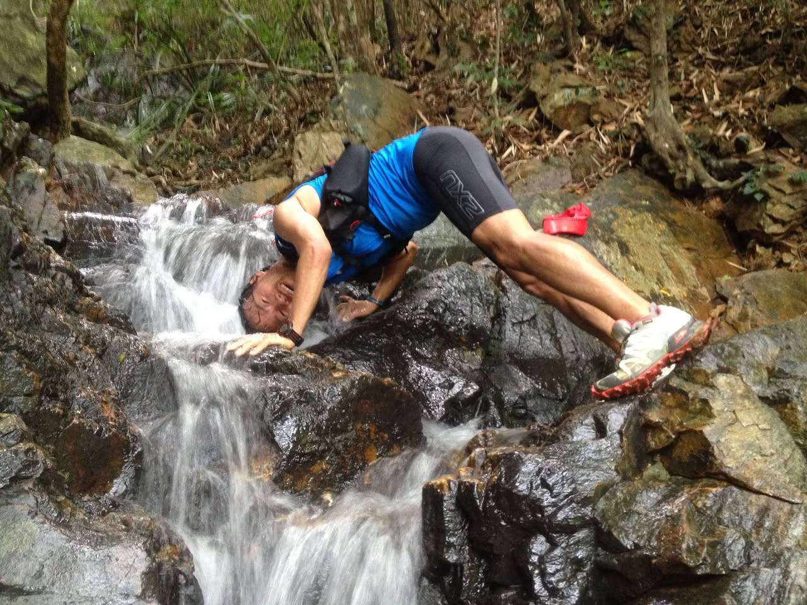
**이미지 캡션:** 한 성인 남성이 푸른색 상의와 검은색 반바지를 입고 숲속 계곡에서 물구나무서기 자세를 취하고 있다. 그는 바위 위에 서서 머리를 계곡물에 담그고 있으며, 얼굴에는 즐거운 표정이 역력하다. 그의 복장에는 "ZXU"라는 글자가 새겨져 있으며, 발에는 운동화와 함께 붉은색 물통이 보인다. 배경에는 울창한 숲과 바위들이 펼쳐져 있어 자연 속에서 활동하는 역동적인 분위기를 자아낸다.
 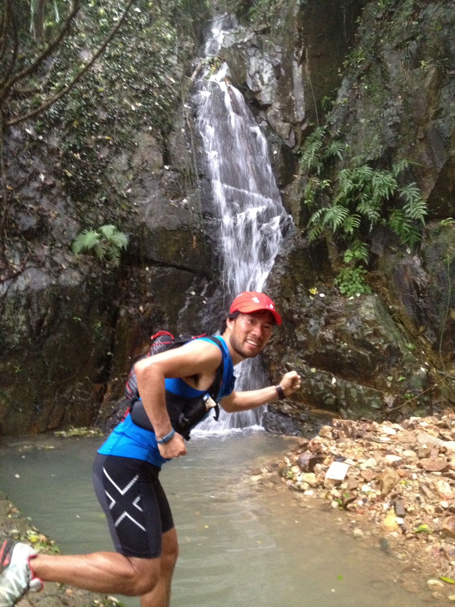
**이미지 캡션:** 한 성인 남성이 붉은색 모자를 쓰고 파란색 민소매 상의와 검은색 반바지를 입고 있으며, 등에는 검은색과 빨간색이 섞인 배낭을 메고 있다. 남성은 폭포 앞에서 달리는 듯한 자세를 취하고 있으며, 얼굴에는 미소를 띠고 있다. 배경에는 숲과 바위, 그리고 작은 폭포가 보인다. 남성의 반바지에는 흰색 X자 모양의 로고가 새겨져 있다. 전체적으로 활동적이고 건강한 분위기를 나타내는 사진이다.
 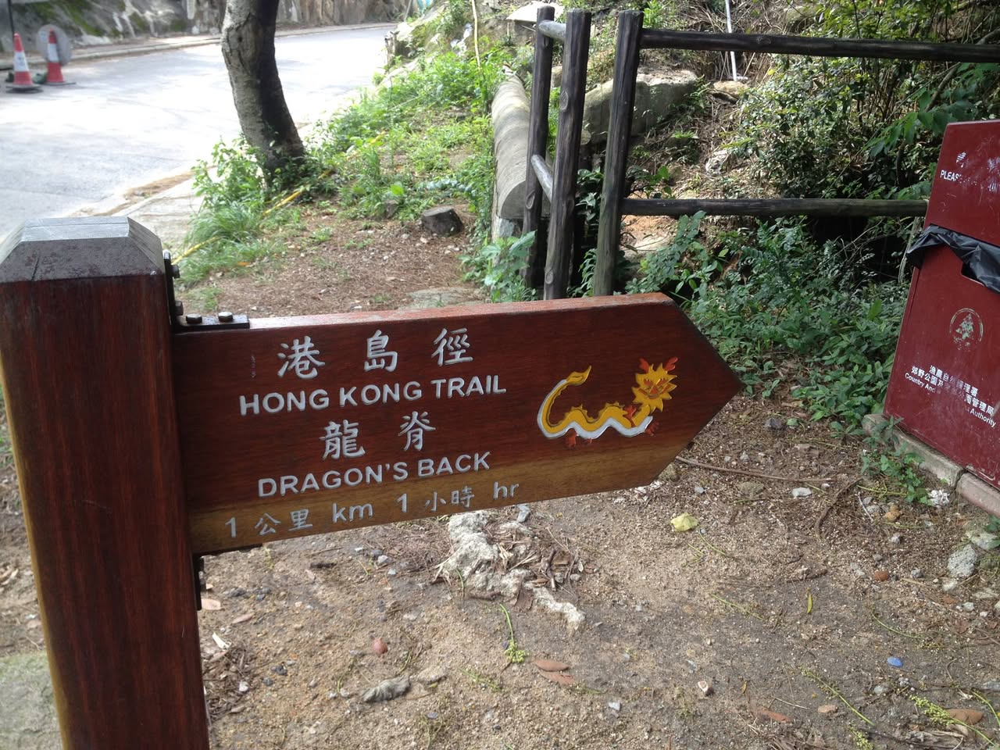
**이미지 캡션:** 이 사진은 홍콩의 드래곤스 백 트레일을 안내하는 나무 표지판을 보여줍니다. 표지판은 짙은 갈색이며, 왼쪽에는 굵은 나무 기둥이 있고 오른쪽에는 붉은색 쓰레기통이 보입니다. 표지판에는 중국어와 영어로 "홍콩 트레일"과 "드래곤스 백"이라고 쓰여 있으며, 오른쪽 화살표 모양에는 노란색 용 그림이 그려져 있습니다. 또한 "1公里 km 1小時 hr"이라고 표시되어 있어 목적지까지의 거리와 예상 소요 시간을 알려줍니다. 배경에는 울창한 녹색 식물과 흙길, 그리고 나무 울타리가 보이며, 멀리 도로와 주황색 콘이 희미하게 보입니다. 전반적으로 야외 트레킹 코스의 시작점이나 갈림길임을 알리는 안내 표지판의 모습으로, 자연 속에서 길을 찾는 상황을 묘사하고 있습니다. 보입니다. 전반적으로 야외 트레킹 코스의 시작점이나 갈림길임을 알리는 안내 표지판의 모습으로, 자연 속에서 길을 찾는 상황을 묘사하고 있습니다.

### 5월 27일 (화) 12:35 · before (78kg, 172 lbs in 2002) and after…

before (78kg, 172 lbs in 2002) and after (56kg, 123 lbs in 2014) running/marathon.  I don't want to go back. :-)

**이미지 캡션:** 사진은 두 개의 장면으로 나뉘어 있으며, 왼쪽 장면에는 성인 남성이 해변에 서 있고 오른쪽 장면에는 다른 성인 남성이 산 정상에 서 있습니다. 왼쪽의 남성은 30대 후반에서 40대 초반으로 보이며, 회색 긴팔 티셔츠에 "POLO JEANS"라고 쓰여 있고, 베이지색 바지와 흰색 운동화를 신고 있습니다. 그는 손을 허리에 얹고 카메라를 응시하며 약간 미소를 짓고 있습니다. 배경에는 모래 해변, 파도 치는 바다, 언덕이 보입니다. 오른쪽 장면의 남성은 20대 후반에서 30대 초반으로 보이며, 파란색 체크무늬 반팔 셔츠, 회색 반바지, 빨간색 모자, 선글라스, 파란색과 노란색 운동화를 신고 있습니다. 그는 팔을 활짝 벌리고 카메라를 향해 서 있으며, 그의 표정은 즐거워 보입니다. 배경에는 바위가 많은 산, 푸른 나무, 그리고 멀리 레이돔이 있는 통신탑이 보입니다. 두 장면 모두 맑은 날씨를 나타냅니다. 셔츠, 회색 반바지, 빨간색 모자, 선글라스, 파란색과 노란색 운동화를 신고 있습니다. 그는 팔을 활짝 벌리고 카메라를 향해 서 있으며, 그의 표정은 즐거워 보입니다. 배경에는 바위가 많은 산, 푸른 나무, 그리고 멀리 레이돔이 있는 통신탑이 보입니다. 두 장면 모두 맑은 날씨를 나타냅니다.

### 5월 31일 (토) 13:47 · Good morning Hyderabad! Fun 10K run arou…

Good morning Hyderabad! Fun 10K run around Sri Kotla Vijaybhaskar Reddy Botanical Garden!! It's the best way to start a day.

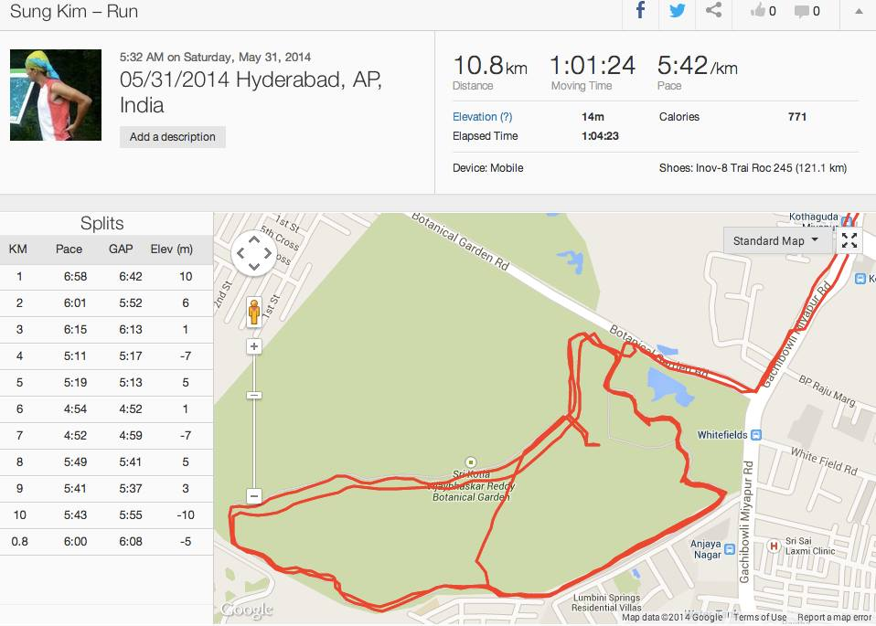
**이미지 캡션:** 이 사진은 한 성인 남성의 달리기 기록을 보여줍니다. 남성은 노란색과 빨간색이 섞인 운동복을 입고 있으며, 머리에는 노란색 두건을 쓰고 있습니다. 표정은 보이지 않지만, 달리기 중인 것으로 보입니다. 장소는 인도 하이데라바드의 보태니컬 가든 근처로 추정되며, 지도에는 달리기 경로가 빨간색 선으로 표시되어 있습니다. 지도에는 "Botanical Garden Rd", "Gachibowli Miyapur Rd", "White Field Rd" 등의 도로 이름과 "Whitefields", "Anjaya Nagar", "Sri Sai Laxmi Clinic" 등의 장소 이름이 보입니다. 사진 상단에는 달리기 거리 10.8km, 이동 시간 1시간 1분 24초, 평균 페이스 5분 42초/km, 소모 칼로리 771 등의 기록이 표시되어 있습니다. 또한, 각 킬로미터별 페이스, GAP, 고도 변화를 보여주는 표도 있습니다. 전반적으로 활동적인 운동 기록을 보여주는 정보성 사진입니다. "Sri Sai Laxmi Clinic" 등의 장소 이름이 보입니다. 사진 상단에는 달리기 거리 10.8km, 이동 시간 1시간 1분 24초, 평균 페이스 5분 42초/km, 소모 칼로리 771 등의 기록이 표시되어 있습니다. 또한, 각 킬로미터별 페이스, GAP, 고도 변화를 보여주는 표도 있습니다. 전반적으로 활동적인 운동 기록을 보여주는 정보성 사진입니다.
 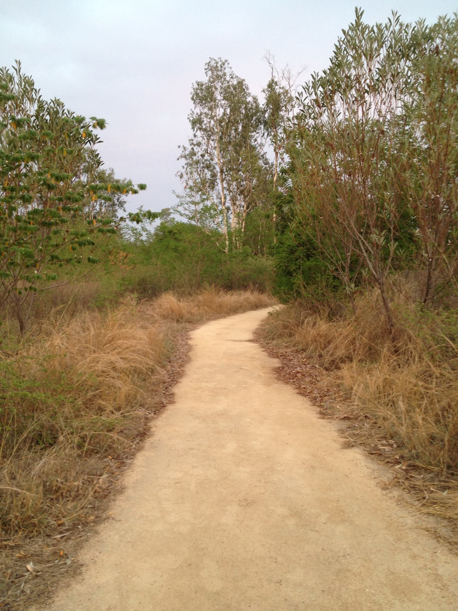
**이미지 캡션:** 이 사진은 흙길이 구불구불하게 이어지는 자연 풍경을 담고 있습니다. 길은 옅은 황토색을 띠고 있으며, 양옆으로는 마른 풀과 키 작은 나무들이 무성하게 자라 있습니다. 멀리 보이는 나무들은 잎이 무성한 녹색과 갈색이 섞여 있으며, 하늘은 옅은 회색으로 흐린 날씨를 나타냅니다. 사진에는 사람이 보이지 않으며, 텍스트도 없습니다. 전체적으로 조용하고 평화로운 분위기를 자아내며, 산책이나 하이킹을 하기에 적합한 장소로 보입니다.
 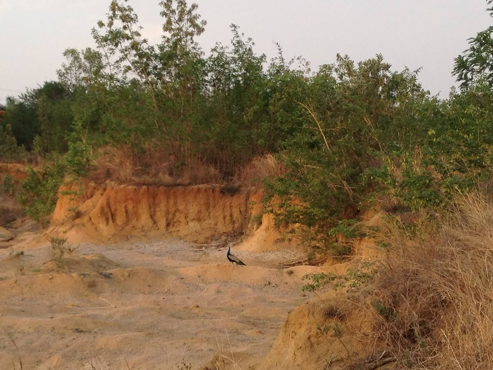
**이미지 캡션:** 한 마리의 공작이 황갈색 흙으로 이루어진 언덕 위에 서 있다. 공작은 푸른색과 녹색 깃털을 가지고 있으며, 꼬리는 닫혀 있다. 공작의 뒤로는 붉은색 흙 절벽이 보이고, 그 위로는 울창한 녹색 나무들이 빽빽하게 자라 있다. 하늘은 옅은 회색으로 흐릿하며, 전체적으로 건조하고 황량한 분위기를 자아낸다. 사진은 낮에 촬영된 것으로 보이며, 특별한 텍스트는 보이지 않는다.
