# 2014년 6월

[← 2014년](README.md)

### 6월 4일 (수) 14:03 · is having fun with PlayGround (Apple Swi…

is having fun with PlayGround (Apple Swift)!

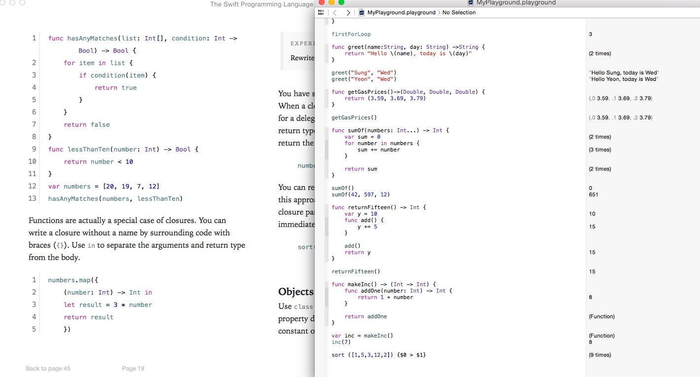

### 6월 12일 (목) 19:41 · 📷 사진 (2장)

 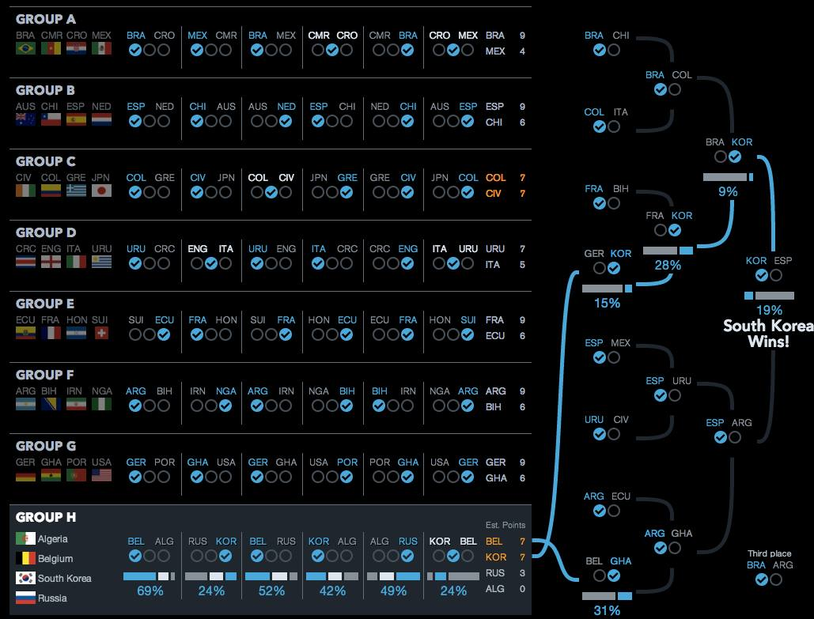

### 6월 16일 (월) 03:45 · is ready to cheer Korean Team after 35+ …

📍 Cuiabá, Brazil

is ready to cheer Korean Team after 35+ hour flight. Hong Kong -> New York -> São Paulo -> Cuiaba!

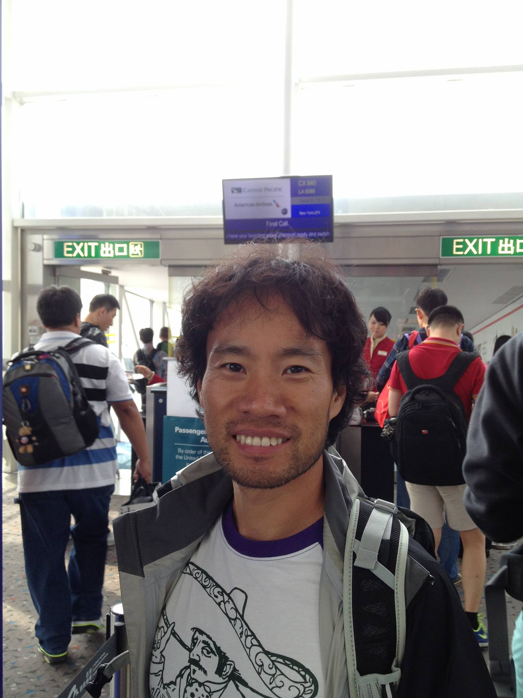 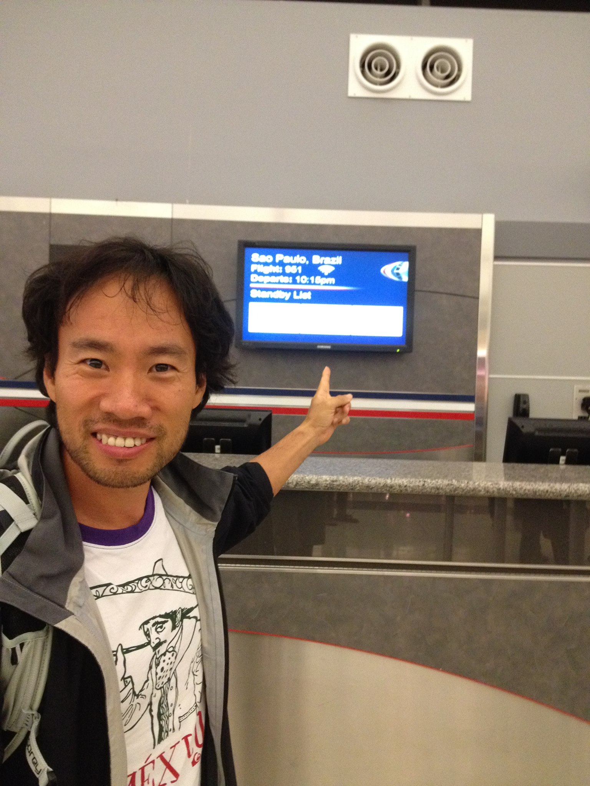 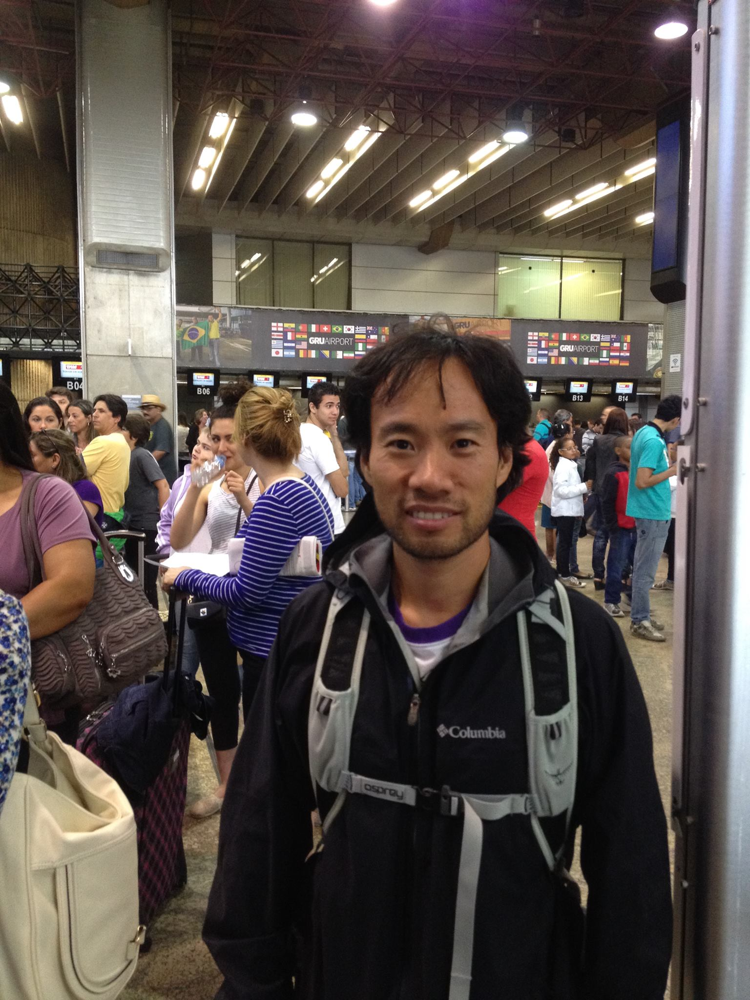 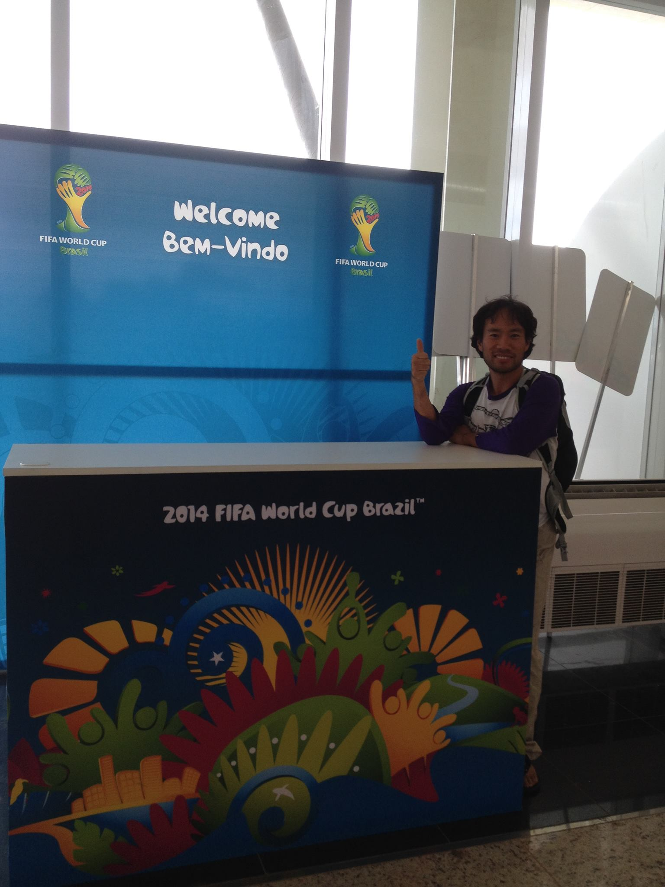

### 6월 18일 (수) 10:32 · gooooooooooooooooal! (1-0) and goal (1-1…

📍 Cuiabá, Brazil

gooooooooooooooooal! (1-0) and goal (1-1). After all, we are all friends!!

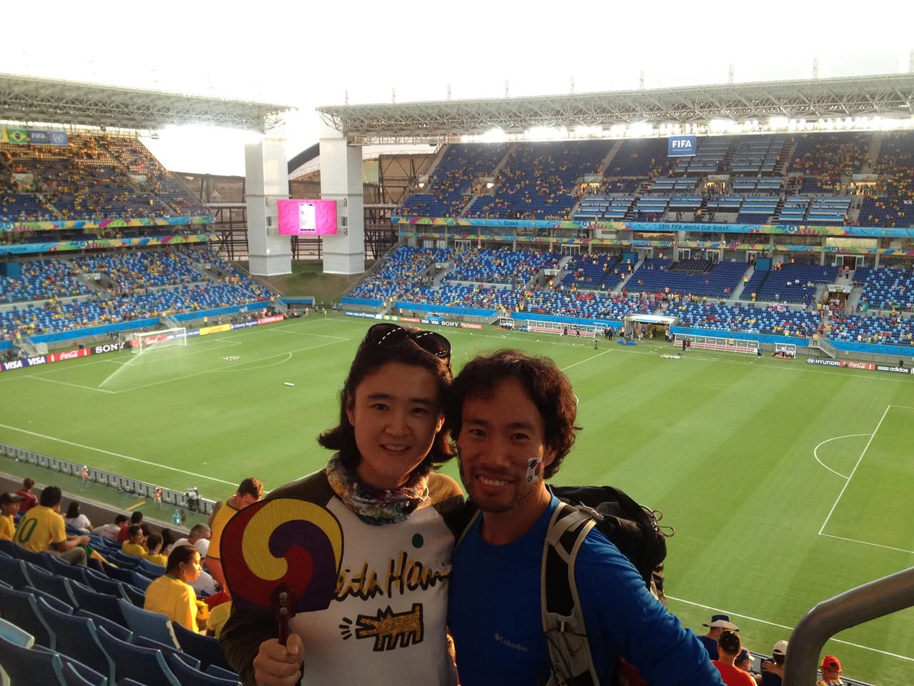 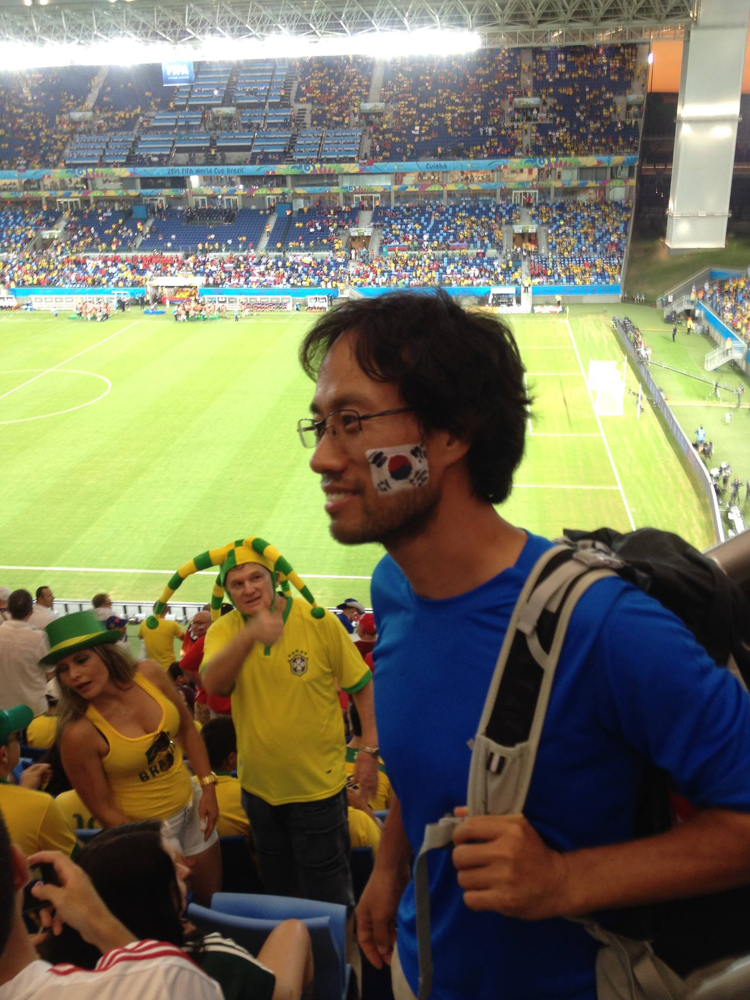 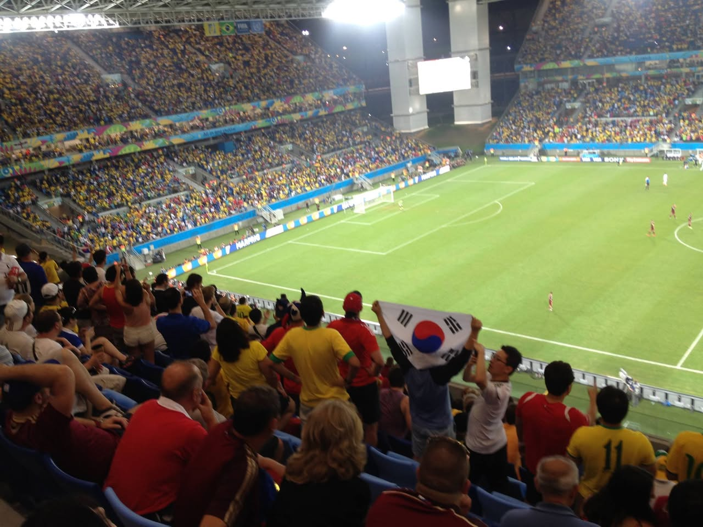 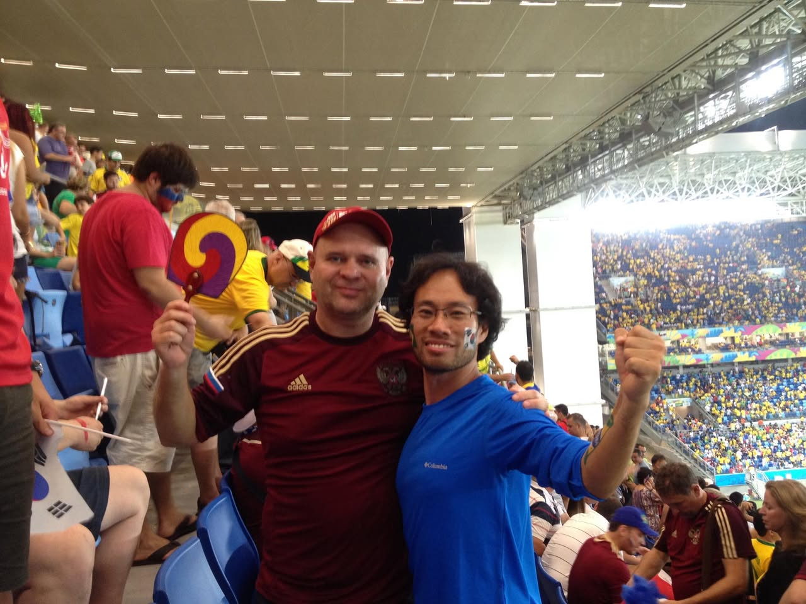

### 6월 20일 (금) 23:16 · Brazilian style Sung?

Brazilian style Sung?

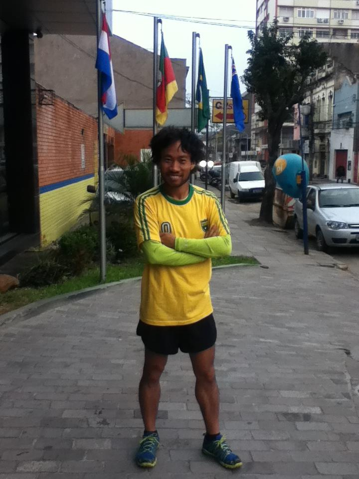 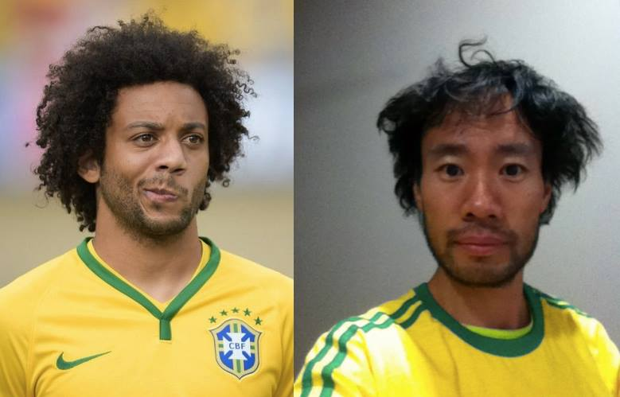

### 6월 23일 (월) 22:56 · Wonderful Morning with Kim Je-dong (my f…

📍 Porto Alegre - Brasil

Wonderful Morning with Kim Je-dong (my favorite South Korean comedian)! We stayed in the same hotel. :-)

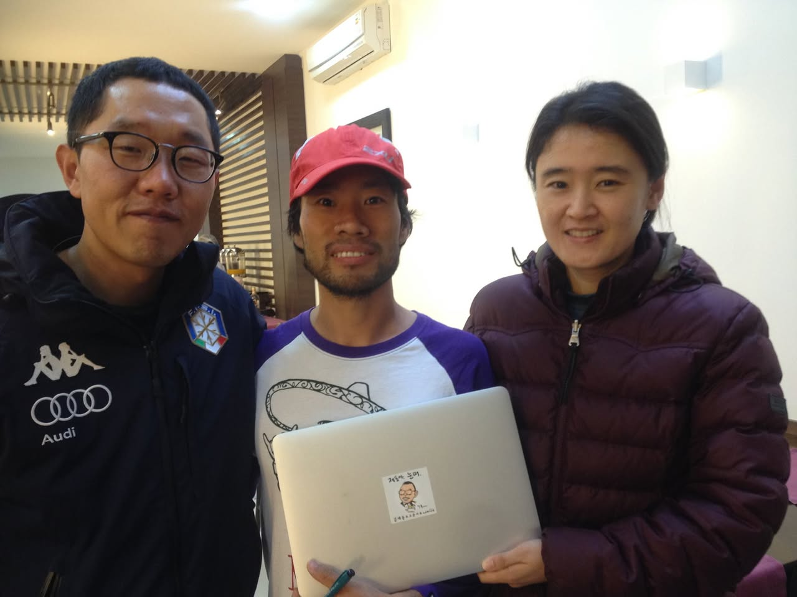
