# 2014년 8월

[← 2014년](README.md)

### 8월 2일 (토) 09:49 · Some pictures from The SF Marathon. I wa…

Some pictures from The SF Marathon. I want to run again!

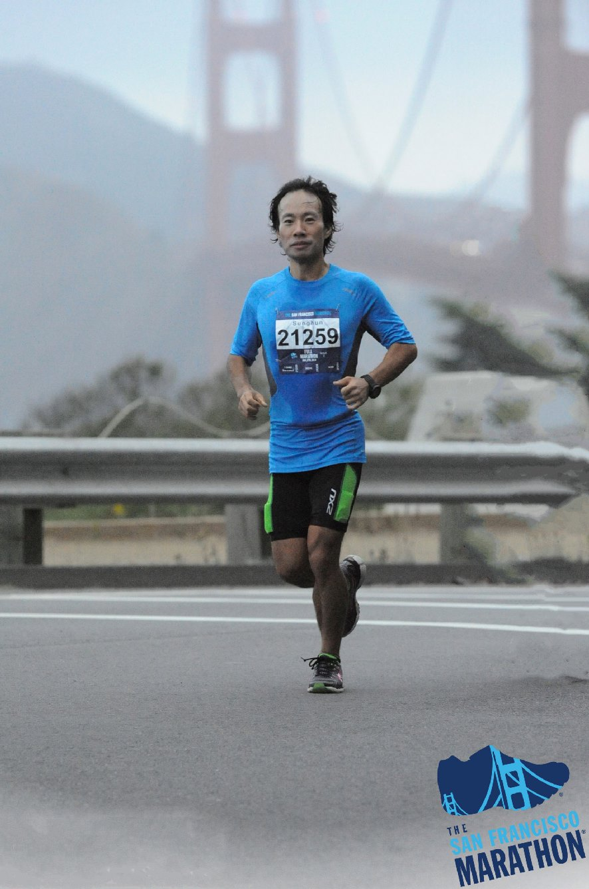
**이미지 캡션:** 안개가 낀 날씨에 금문교를 배경으로 한 성인 남성이 마라톤에 참가하여 달리고 있다. 그는 파란색 반팔 티셔츠와 검은색 반바지를 입고 있으며, 티셔츠에는 21259라는 번호가 적힌 배번표가 부착되어 있다. 그의 표정은 진지하며, 오른손은 허리에 얹고 왼손은 자연스럽게 움직이며 달리고 있다. 배경에는 금문교의 일부와 도로, 그리고 가드레일이 보인다. 오른쪽 하단에는 'THE SAN FRANCISCO MARATHON'이라는 로고가 파란색으로 새겨져 있다. 전반적으로 마라톤 경기의 역동적이고 도전적인 분위기를 느낄 수 있다.수 있다.
 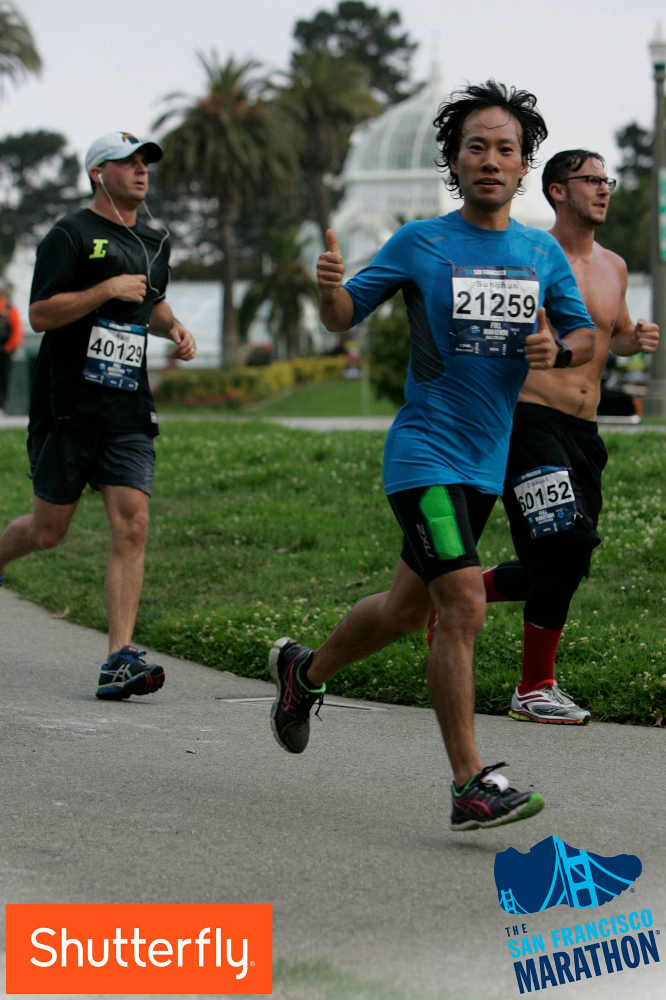
**이미지 캡션:** 세 명의 남성 마라토너가 달리고 있으며, 그중 두 명은 전면을 향해 달리고 있고 한 명은 약간 측면을 향해 달리고 있습니다. 가장 앞에 있는 남성은 아시아계로 20대 후반에서 30대 초반으로 보이며, 짧은 검은색 머리에 푸른색 반팔 운동복과 녹색 패드가 달린 검은색 반바지를 입고 있습니다. 그는 엄지손가락을 치켜세우며 긍정적인 표정을 짓고 있으며, 그의 가슴에는 "21259"라는 번호가 적힌 레이스 빕이 달려 있습니다. 그의 뒤에는 안경을 쓴 백인 남성이 상의를 탈의한 채 검은색 반바지와 빨간색 스타킹을 신고 달리고 있으며, 그의 레이스 빕에는 "60152"라는 번호가 보입니다. 왼쪽에는 야구 모자를 쓰고 검은색 반팔 티셔츠와 회색 반바지를 입은 백인 남성이 이어폰을 끼고 달리고 있으며, 그의 레이스 빕에는 "40129"라는 번호가 있습니다. 배경에는 야자수와 유리 온실이 보이는 공원이 있으며, 잔디밭과 포장된 도로가 있습니다. 전반적으로 활기찬 마라톤 경기의 분위기를 나타냅니다. 달리고 있으며, 그의 레이스 빕에는 "60152"라는 번호가 보입니다. 왼쪽에는 야구 모자를 쓰고 검은색 반팔 티셔츠와 회색 반바지를 입은 백인 남성이 이어폰을 끼고 달리고 있으며, 그의 레이스 빕에는 "40129"라는 번호가 있습니다. 배경에는 야자수와 유리 온실이 보이는 공원이 있으며, 잔디밭과 포장된 도로가 있습니다. 전반적으로 활기찬 마라톤 경기의 분위기를 나타냅니다.
 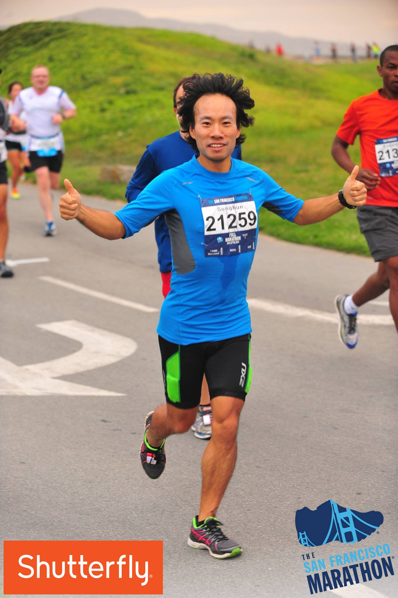
**이미지 캡션:** 푸른색 반팔 티셔츠와 검은색 반바지를 입은 동양인 남성이 마라톤 대회에 참가하여 엄지손가락을 치켜들고 환하게 웃으며 달리고 있습니다. 그의 티셔츠에는 'Sunghun 21259'라고 적힌 번호표가 붙어 있으며, 배경에는 다른 참가자들이 달리고 있고 푸른 언덕과 흐릿한 하늘이 보입니다. 전체적으로 활기차고 긍정적인 분위기를 자아냅니다.shoes. A race bib with the number 21259 and the name "Sunghun" is attached to his shirt. He appears to be sweating, indicating exertion. The background shows a paved road with other runners in the distance, a grassy hill, and a cloudy sky. The overall atmosphere is energetic and positive, capturing the spirit of a marathon event. The bottom left corner features the Shutterfly logo, and the bottom right corner displays the logo for "The San Francisco Marathon.
 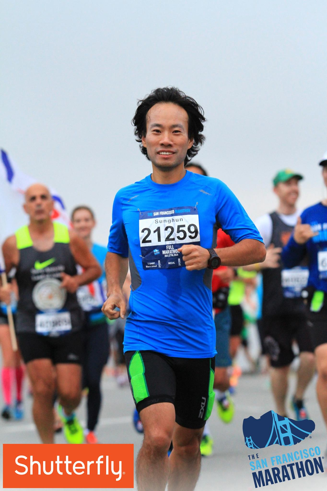
**이미지 캡션:** 이 사진은 샌프란시스코 마라톤 대회에 참가한 한 아시아계 성인 남성을 클로즈업하여 보여준다. 그는 30대 초중반으로 보이며, 짧은 검은색 곱슬머리에 약간 넓은 이마를 가지고 있다. 얼굴에는 땀방울이 맺혀 있고, 입가에는 미소를 띠고 있으며, 눈빛은 활기차고 자신감 넘친다. 그는 파란색 반팔 기능성 티셔츠와 검은색 반바지를 입고 있으며, 반바지 옆면에는 형광 녹색 패드가 부착되어 있다. 티셔츠 가슴 부분에는 "THE SAN FRANCISCO MARATHON"이라고 적힌 배번이 부착되어 있으며, 배번에는 "Sunghun"이라는 이름과 "21259"라는 번호가 보인다. 또한 "FULL MARATHON JULY 27TH, 2014"라는 문구도 확인할 수 있다. 손목에는 검은색 스포츠 시계를 착용하고 있다. 그는 달리는 동작을 하고 있으며, 오른손은 앞으로 뻗어 있고 왼손은 자연스럽게 내려져 있다. 배경에는 다른 참가자들이 흐릿하게 보이며, 일부는 마라톤 복장을 하고 있다. 하늘은 흐린 날씨를 나타내는 회색빛으로 보인다. 사진 오른쪽 하단에는 샌프란시스코 마라톤 로고와 함께 "THE SAN FRANCISCO MARATHON"이라는 문구가 파란색으로 쓰여 있고, 왼쪽 하단에는 주황색 배경에 흰색 글씨로 "Shutterfly"라는 워터마크가 있다. 전반적으로 활기차고 역동적인 마라톤 대회의 분위기를 느낄 수 있다.ghun"이라는 이름과 "21259"라는 번호가 보인다. 또한 "FULL MARATHON JULY 27TH, 2014"라는 문구도 확인할 수 있다. 손목에는 검은색 스포츠 시계를 착용하고 있다. 그는 달리는 동작을 하고 있으며, 오른손은 앞으로 뻗어 있고 왼손은 자연스럽게 내려져 있다. 배경에는 다른 참가자들이 흐릿하게 보이며, 일부는 마라톤 복장을 하고 있다. 하늘은 흐린 날씨를 나타내는 회색빛으로 보인다. 사진 오른쪽 하단에는 샌프란시스코 마라톤 로고와 함께 "THE SAN FRANCISCO MARATHON"이라는 문구가 파란색으로 쓰여 있고, 왼쪽 하단에는 주황색 배경에 흰색 글씨로 "Shutterfly"라는 워터마크가 있다. 전반적으로 활기차고 역동적인 마라톤 대회의 분위기를 느낄 수 있다.
 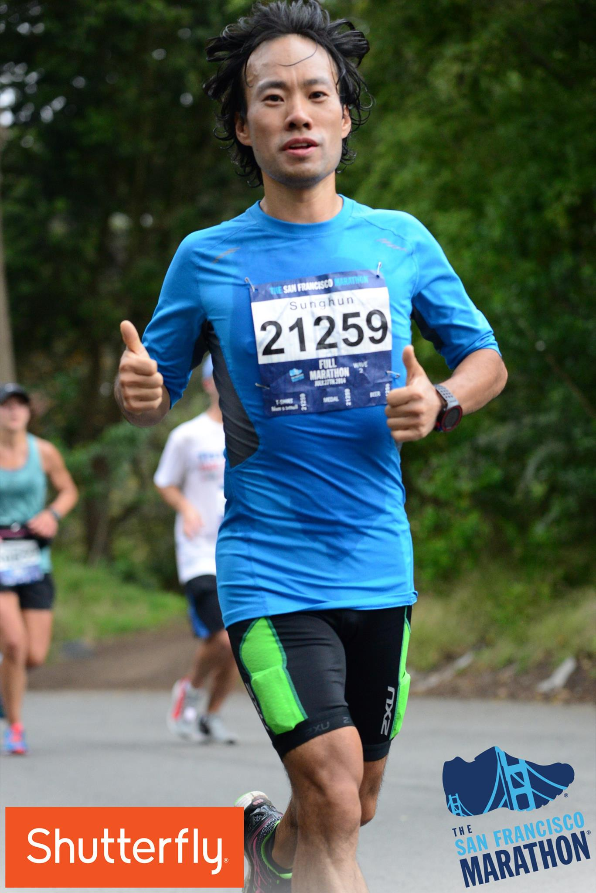
**이미지 캡션:** 푸른색 반팔 운동복을 입은 동양인 남성이 마라톤 대회에 참가하여 엄지손가락을 치켜세우며 달리고 있다. 그는 20대 후반에서 30대 초반으로 보이며, 머리카락은 땀에 젖어 흐트러져 있고 표정은 약간 힘들어 보이지만 긍정적인 기운을 내뿜고 있다. 가슴에는 'Sunghun 21259 FULL MARATHON'이라고 적힌 번호표를 달고 있으며, 검은색 반바지에는 초록색 부분이 포인트로 들어가 있다. 배경에는 나무들이 우거진 숲길이 보이며, 다른 참가자들도 뒤에서 달리고 있다. 전체적으로 활기차고 역동적인 마라톤 대회의 분위기를 느낄 수 있다.black with bright green panels on the thighs, and the brand "2XU" is visible on the right leg. He has a determined yet slightly strained expression and is giving a double thumbs-up gesture, suggesting encouragement or a positive feeling during the race. The background is blurred, indicating motion, and consists of green trees and foliage, suggesting an outdoor course, possibly in a park or along a tree-lined street. Other runners are visible in the background, also participating in the marathon. The overall atmosphere is energetic and competitive, typical of a large-scale running event. The image also features logos for "Shutterfly" and "The San Francisco Marathon.

### 8월 4일 (월) 09:42 · saw a beautiful rainbow this morning. It…

📍 The Hong Kong University of Science and Technology - HKUST

saw a beautiful rainbow this morning. It should be a good day. Have a wonderful day!

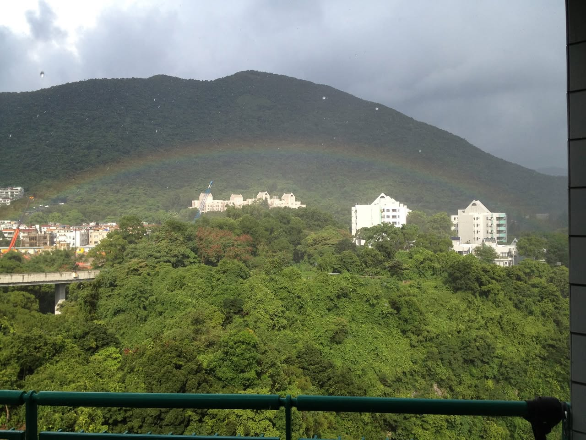
**이미지 캡션:** 흐린 하늘 아래 산비탈에 자리 잡은 녹음이 우거진 풍경으로, 짙은 녹색의 나무들이 언덕을 뒤덮고 있으며, 그 위로는 희미한 무지개가 걸려 있습니다. 산 중턱에는 하얀색의 현대식 건물들이 숲 사이로 솟아 있으며, 그중 일부는 독특한 지붕 모양을 하고 있습니다. 왼쪽에는 건설 중인 듯한 건물들과 다리가 보이며, 크레인이 하늘을 향해 뻗어 있습니다. 사진의 전경에는 녹색 난간이 있어 발코니에서 바라보는 시점임을 암시합니다. 하늘에는 빗방울이 떨어지는 듯한 모습이 보이며, 전반적으로 비가 온 후의 촉촉하고 평화로운 분위기를 자아냅니다.분위기를 자아냅니다.

### 8월 5일 (화) 23:03 · first meetup with HK trail runners! It's…

first meetup with HK trail runners! It's really good to run with them. http://www.meetup.com/HKTrailRunners/events/198520222/

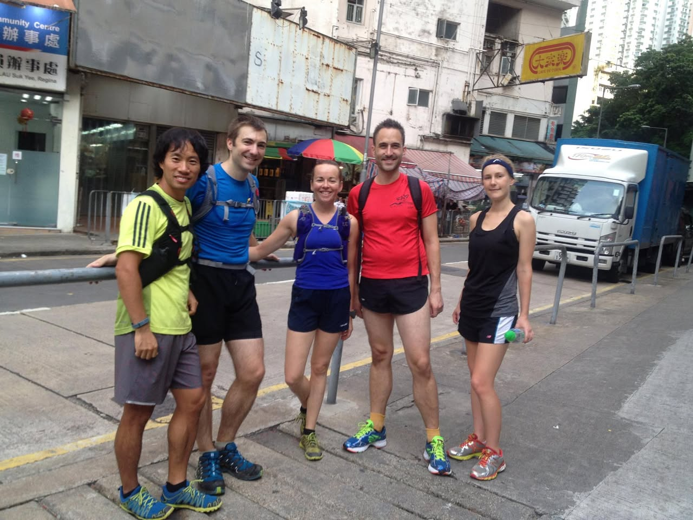
**이미지 캡션:** 네 명의 성인 남녀가 도시 거리에서 함께 서 있다. 왼쪽부터 첫 번째 남성은 아시아계로 20대 후반에서 30대 초반으로 보이며, 밝은 형광 연두색 반팔 티셔츠와 회색 반바지를 입고 검은색 조끼를 착용하고 있다. 그는 파란색 운동화를 신고 있으며, 손목에는 파란색 밴드를 차고 있다. 두 번째 남성은 백인으로 30대 초반으로 보이며, 파란색 반팔 티셔츠와 검은색 반바지를 입고 파란색 배낭을 메고 있다. 그는 파란색과 검은색 운동화를 신고 있다. 세 번째 인물은 여성으로 백인으로 30대 초반으로 보이며, 파란색 민소매 상의와 파란색 반바지를 입고 파란색 배낭을 메고 있다. 그녀는 녹색과 노란색 운동화를 신고 있다. 네 번째 인물은 여성으로 백인으로 30대 초반으로 보이며, 검은색 민소매 상의와 회색과 흰색이 섞인 반바지를 입고 있다. 그녀는 은색과 빨간색 운동화를 신고 있으며, 손에는 투명한 물병을 들고 있다. 네 사람 모두 운동복 차림이며, 가벼운 운동이나 달리기를 마친 듯한 표정이다. 배경에는 도시의 상점가와 건물들이 보이며, 건물에는 중국어 간판이 걸려 있다. "COMMUNITY CENTRE"라고 쓰인 간판도 보인다. 도로에는 회색 트럭이 주차되어 있고, 거리에는 보도블록과 도로가 보인다. 전체적으로 밝은 날씨에 야외에서 활동적인 모습을 담은 사진이다.소매 상의와 파란색 반바지를 입고 파란색 배낭을 메고 있다. 그녀는 녹색과 노란색 운동화를 신고 있다. 네 번째 인물은 여성으로 백인으로 30대 초반으로 보이며, 검은색 민소매 상의와 회색과 흰색이 섞인 반바지를 입고 있다. 그녀는 은색과 빨간색 운동화를 신고 있으며, 손에는 투명한 물병을 들고 있다. 네 사람 모두 운동복 차림이며, 가벼운 운동이나 달리기를 마친 듯한 표정이다. 배경에는 도시의 상점가와 건물들이 보이며, 건물에는 중국어 간판이 걸려 있다. "COMMUNITY CENTRE"라고 쓰인 간판도 보인다. 도로에는 회색 트럭이 주차되어 있고, 거리에는 보도블록과 도로가 보인다. 전체적으로 밝은 날씨에 야외에서 활동적인 모습을 담은 사진이다.
 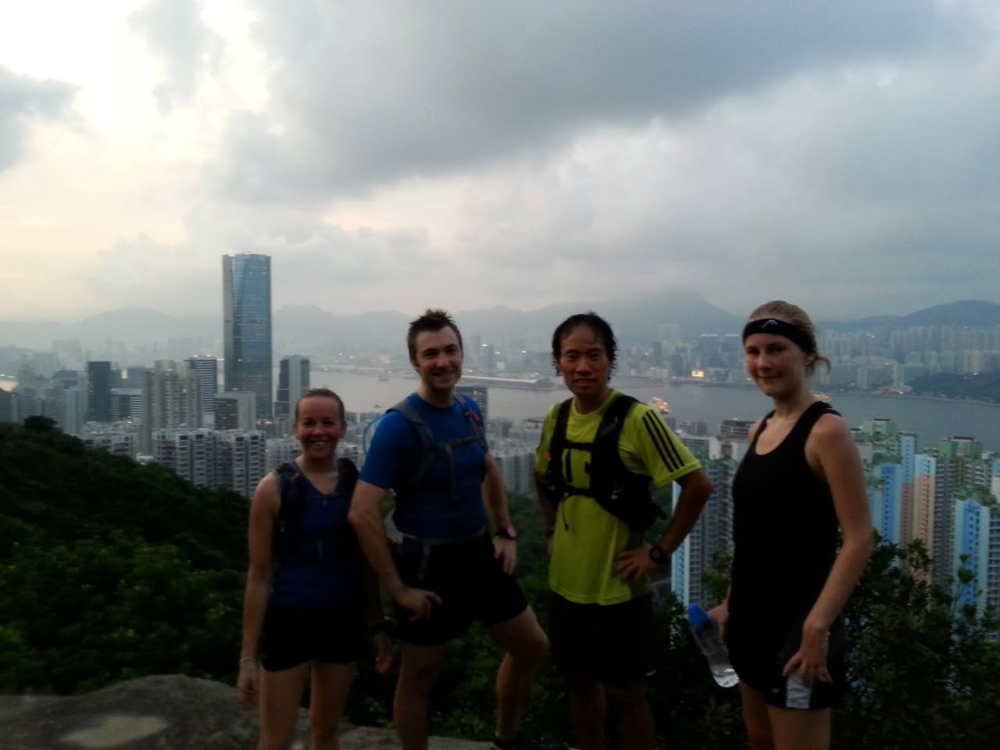
**이미지 캡션:** 네 명의 성인 남녀가 도시 풍경을 배경으로 서 있습니다. 왼쪽부터 두 번째 여성은 20대 후반에서 30대 초반으로 보이며, 파란색 민소매 상의와 검은색 반바지를 입고 있습니다. 그녀는 미소를 짓고 있으며, 등에는 작은 배낭을 메고 있습니다. 그 옆의 성인 남성은 30대 후반에서 40대 초반으로 보이며, 형광 연두색 반팔 티셔츠와 검은색 반바지를 입고 있습니다. 그는 검은색 조끼를 착용하고 있으며, 팔짱을 끼고 카메라를 응시하고 있습니다. 세 번째 성인 남성은 30대 후반에서 40대 초반으로 보이며, 파란색 민소매 상의와 검은색 반바지를 입고 있습니다. 그는 등에는 파란색 배낭을 메고 있으며, 웃는 표정으로 카메라를 보고 있습니다. 가장 오른쪽에 있는 여성은 20대 후반에서 30대 초반으로 보이며, 검은색 민소매 상의와 검은색 반바지를 입고 있습니다. 그녀는 머리에 검은색 헤어밴드를 하고 있으며, 손에는 물병을 들고 있습니다. 그녀는 부드러운 미소를 짓고 있습니다. 배경에는 빽빽한 고층 빌딩들이 늘어서 있고, 멀리 산과 흐린 하늘이 보입니다. 도시의 불빛이 희미하게 빛나고 있으며, 전체적으로 흐린 날씨 속에서 촬영된 것으로 보입니다. 이들은 모두 운동복 차림으로 보아 하이킹이나 달리기를 마친 후 기념 사진을 찍는 것으로 추정됩니다.소매 상의와 검은색 반바지를 입고 있습니다. 그는 등에는 파란색 배낭을 메고 있으며, 웃는 표정으로 카메라를 보고 있습니다. 가장 오른쪽에 있는 여성은 20대 후반에서 30대 초반으로 보이며, 검은색 민소매 상의와 검은색 반바지를 입고 있습니다. 그녀는 머리에 검은색 헤어밴드를 하고 있으며, 손에는 물병을 들고 있습니다. 그녀는 부드러운 미소를 짓고 있습니다. 배경에는 빽빽한 고층 빌딩들이 늘어서 있고, 멀리 산과 흐린 하늘이 보입니다. 도시의 불빛이 희미하게 빛나고 있으며, 전체적으로 흐린 날씨 속에서 촬영된 것으로 보입니다. 이들은 모두 운동복 차림으로 보아 하이킹이나 달리기를 마친 후 기념 사진을 찍는 것으로 추정됩니다.
 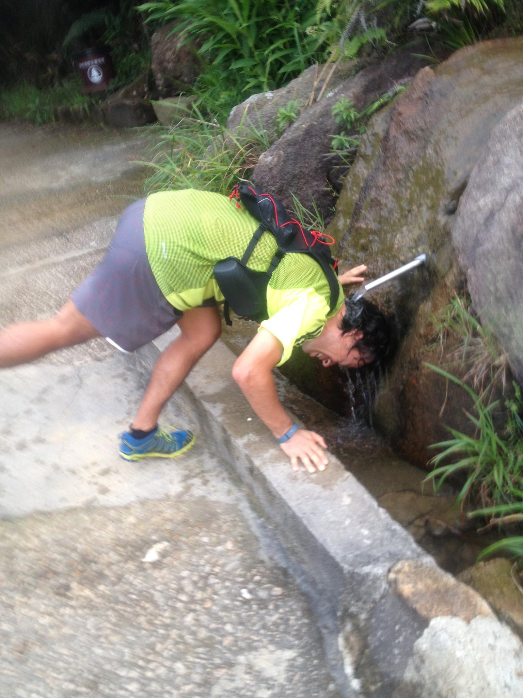
**이미지 캡션:** 한 성인 남성이 밝은 형광 연두색 상의와 회색 반바지를 입고 배낭을 메고 있다. 그는 웅크린 자세로 바위틈에서 흘러나오는 물을 마시고 있으며, 입에는 하얀색 빨대가 물려 있다. 남성은 20대 후반에서 30대 초반으로 보이며, 운동화는 파란색과 노란색이 조합된 디자인이다. 그의 손목에는 파란색 밴드가 착용되어 있다. 배경은 숲으로 보이는 울창한 녹색 식물과 바위들로 이루어져 있으며, 콘크리트 구조물과 돌길이 보인다. 한쪽에는 "주의"라고 쓰인 것으로 보이는 표지판이 있다. 전체적으로 야외 활동 중 갈증을 해소하는 듯한 상황이며, 자연 속에서 휴식을 취하는 모습으로 보인다.는 듯한 상황이며, 자연 속에서 휴식을 취하는 모습으로 보인다.
 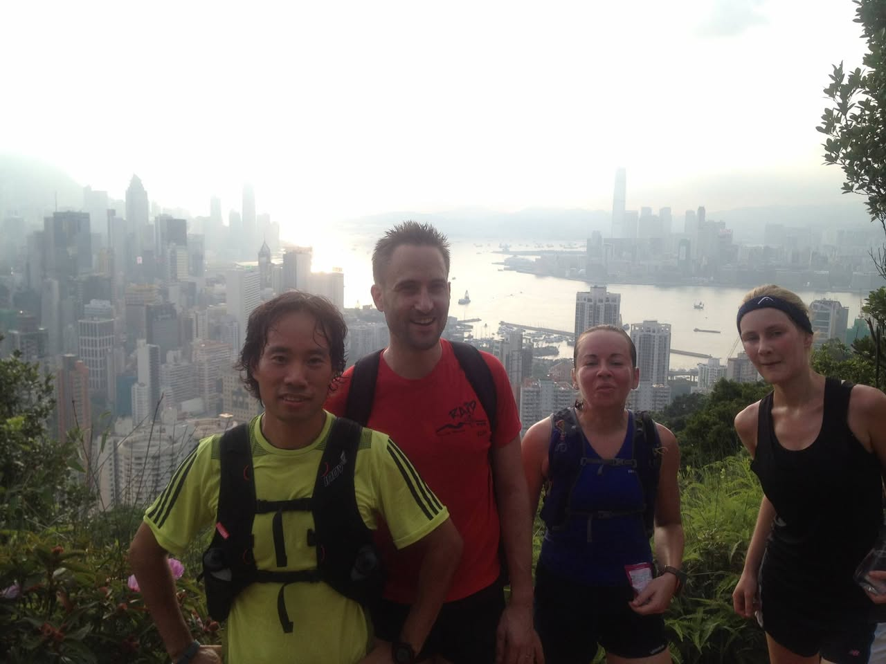
**이미지 캡션:** 네 명의 성인이 홍콩의 도시 풍경을 배경으로 산 정상에서 사진을 찍고 있습니다. 왼쪽부터 아시아인 성인 남성은 30대 후반으로 보이며, 밝은 노란색 반팔 티셔츠와 검은색 조끼를 입고 있습니다. 그의 머리카락은 짧고 검은색이며, 표정은 약간 미소를 띠고 있습니다. 그 옆에는 백인 성인 남성이 40대 초반으로 보이며, 빨간색 반팔 티셔츠와 검은색 조끼를 입고 있습니다. 그는 짧은 갈색 머리카락을 가지고 있으며, 활짝 웃고 있습니다. 세 번째 인물은 백인 성인 여성으로 30대 초반으로 보이며, 파란색 민소매 상의와 검은색 반바지를 입고 있습니다. 그녀는 짧은 금발 머리를 가지고 있으며, 약간 땀에 젖은 듯한 표정입니다. 마지막으로 백인 성인 여성은 30대 초반으로 보이며, 검은색 민소매 상의와 검은색 반바지를 입고 있습니다. 그녀는 금발 머리에 머리띠를 하고 있으며, 표정은 약간 무표정합니다. 네 사람 모두 운동복 차림이며, 등에는 배낭을 메고 있어 등산이나 트레일 러닝을 하고 있는 것으로 보입니다. 배경에는 안개가 낀 홍콩의 고층 빌딩들이 빼곡하게 들어서 있으며, 멀리 바다가 보입니다. 전체적으로 활동적이고 건강한 분위기를 풍기는 사진입니다. 검은색 반바지를 입고 있습니다. 그녀는 짧은 금발 머리를 가지고 있으며, 약간 땀에 젖은 듯한 표정입니다. 마지막으로 백인 성인 여성은 30대 초반으로 보이며, 검은색 민소매 상의와 검은색 반바지를 입고 있습니다. 그녀는 금발 머리에 머리띠를 하고 있으며, 표정은 약간 무표정합니다. 네 사람 모두 운동복 차림이며, 등에는 배낭을 메고 있어 등산이나 트레일 러닝을 하고 있는 것으로 보입니다. 배경에는 안개가 낀 홍콩의 고층 빌딩들이 빼곡하게 들어서 있으며, 멀리 바다가 보입니다. 전체적으로 활동적이고 건강한 분위기를 풍기는 사진입니다.

### 8월 11일 (월) 06:42 · was heading to Seoul, but my flight land…

was heading to Seoul, but my flight landed in Jeju after several laps around Jeju (due to heavy rain in Seoul). I wish I could spend time in Kitty Jeju Homestay.

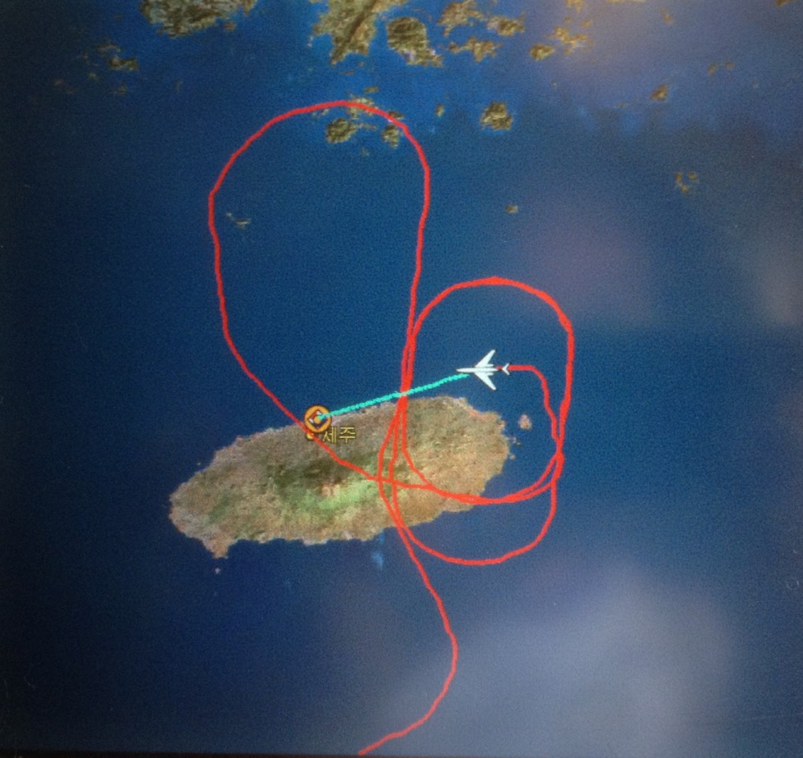
**이미지 캡션:** 이 사진은 컴퓨터 화면에 표시된 항공기 항적을 보여주는 지도 화면을 촬영한 것입니다. 화면 중앙에는 섬이 보이며, 섬 위에는 "세주"라는 글자가 표시되어 있습니다. 섬 주변의 바다는 파란색으로 표현되어 있으며, 섬의 일부와 주변의 작은 섬들은 녹색과 갈색으로 표현되어 있습니다. 섬에서 출발하여 바다 위를 비행하는 작은 흰색 항공기 모양의 아이콘이 보이며, 이 항공기는 하늘색 선으로 표시된 경로를 따라 이동하고 있습니다. 또한, 항공기 주변으로 붉은색 선으로 그려진 복잡한 원형의 항적이 여러 개 보이며, 이는 항공기가 특정 지역 상공에서 선회 비행을 했음을 나타냅니다. 화면 상단에는 섬들이 점점이 떠 있는 모습도 보입니다. 전체적으로 지도상의 항공기 운항 경로를 시각적으로 보여주는 화면이며, 특별한 인물이나 사물은 보이지 않고, 텍스트로는 "세주"만 확인됩니다.항공기가 특정 지역 상공에서 선회 비행을 했음을 나타냅니다. 화면 상단에는 섬들이 점점이 떠 있는 모습도 보입니다. 전체적으로 지도상의 항공기 운항 경로를 시각적으로 보여주는 화면이며, 특별한 인물이나 사물은 보이지 않고, 텍스트로는 "세주"만 확인됩니다.
 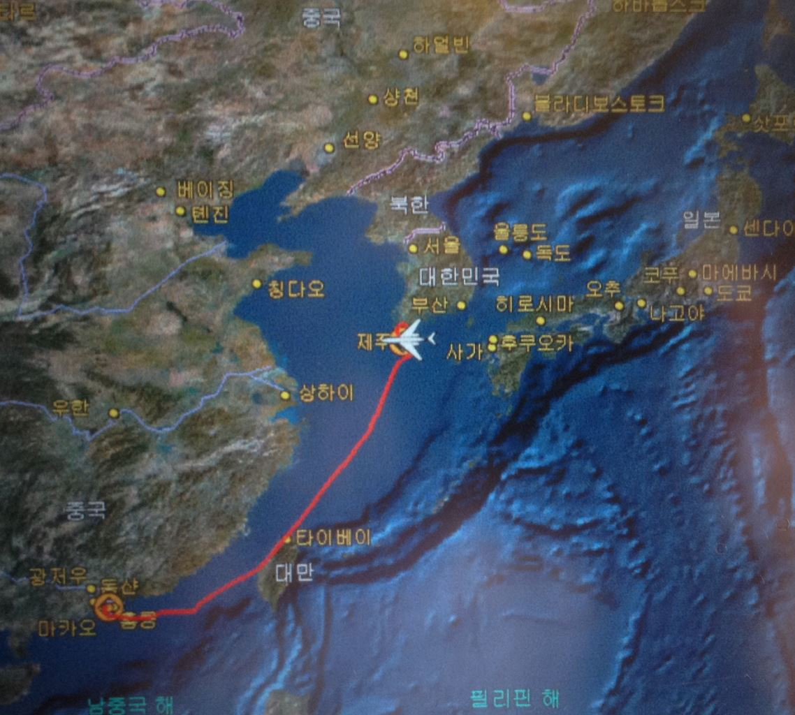
**이미지 캡션:** 이 사진은 동아시아 지역의 항공 항로를 보여주는 지도 화면으로, 붉은색 선으로 표시된 비행 경로가 제주도에서 시작하여 대만, 마카오를 거쳐 중국 본토의 광저우 근처로 이어지는 것을 나타냅니다. 지도에는 한국, 중국, 일본, 북한의 주요 도시들이 점으로 표시되어 있으며, 각 도시의 이름은 한국어와 일부 일본어, 중국어로 표기되어 있습니다. 예를 들어, 한국에는 서울, 부산, 제주, 독도 등이 보이고, 중국에는 베이징, 톈진, 칭다오, 상하이, 우한, 광저우, 마카오 등이, 일본에는 후쿠오카, 히로시마, 나고야, 도쿄 등이 표시되어 있습니다. 지도 화면은 전반적으로 푸른색과 녹색 계열의 색상을 사용하여 지형과 해역을 표현하고 있으며, 비행 경로를 나타내는 붉은색 선이 화면 중앙을 가로질러 시선을 끕니다. 특별히 사람이나 사물은 보이지 않으며, 지도 화면 자체의 정보 전달에 초점을 맞춘 이미지입니다. 도쿄 등이 표시되어 있습니다. 지도 화면은 전반적으로 푸른색과 녹색 계열의 색상을 사용하여 지형과 해역을 표현하고 있으며, 비행 경로를 나타내는 붉은색 선이 화면 중앙을 가로질러 시선을 끕니다. 특별히 사람이나 사물은 보이지 않으며, 지도 화면 자체의 정보 전달에 초점을 맞춘 이미지입니다.

### 8월 13일 (수) 18:53 · ran to Yeungnam University from home (Ch…

ran to Yeungnam University from home (Chimsan dong). It was a great 19K-1:45min urban run. BTW, it would take 1:02min by public transportation.

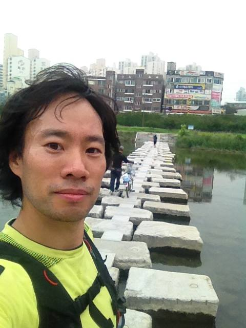
**이미지 캡션:** 사진은 강 위에 놓인 돌다리를 건너는 한 성인 남성의 셀카로, 남성은 30대 후반에서 40대 초반으로 보이며 검은색 머리카락에 옅은 미소를 띠고 있다. 그는 밝은 노란색 티셔츠와 검은색 조끼를 착용하고 있으며, 조끼에는 빨간색 스트랩이 달려 있다. 배경에는 여러 층으로 된 건물들이 늘어서 있고, 강물 위에는 징검다리처럼 놓인 큰 돌들이 보인다. 몇몇 다른 사람들도 징검다리 위를 걷거나 자전거를 타고 있으며, 한 사람은 자전거를 끌고 있다. 전체적으로 흐린 날씨 속에서 야외 활동을 즐기는 평화로운 분위기를 자아낸다.낸다.
 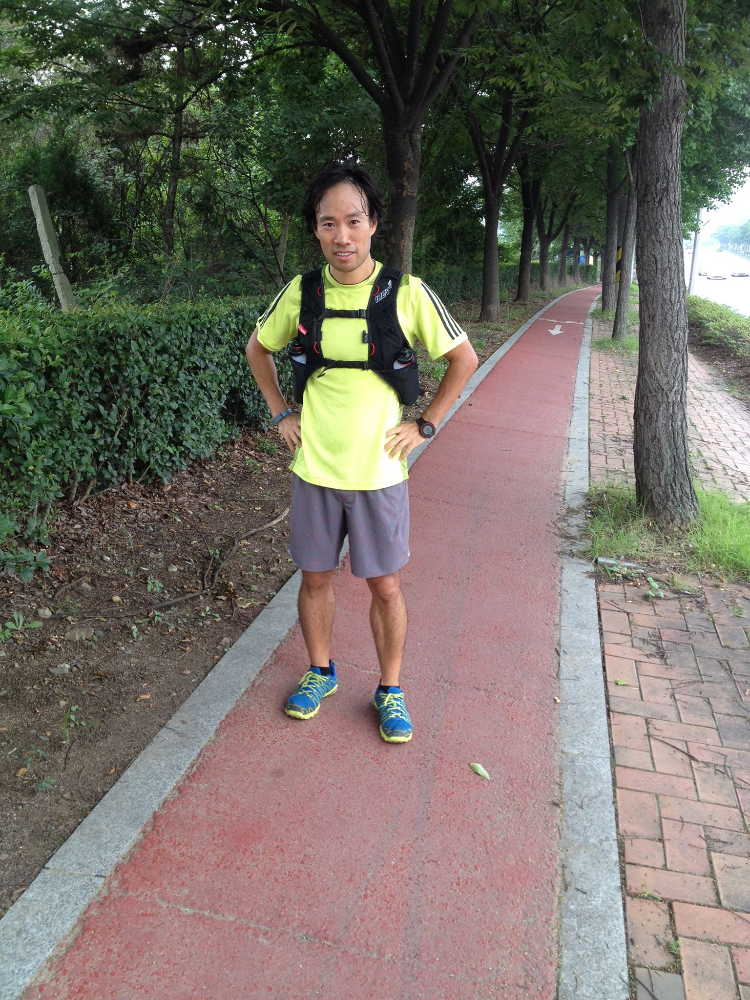
**이미지 캡션:** 한 명의 성인 남성이 밝은 노란색 반팔 티셔츠와 회색 반바지, 파란색 운동화를 신고 붉은색 트랙 위에서 포즈를 취하고 있다. 남성은 검은색 조끼를 착용하고 있으며, 조끼에는 물통 두 개가 달려 있다. 그의 머리카락은 짧고 검은색이며, 얼굴에는 땀이 약간 맺혀 있다. 그는 양손을 허리에 얹고 카메라를 향해 약간 미소를 짓고 있다. 배경에는 울창한 나무들이 줄지어 서 있고, 붉은색 트랙 옆으로는 벽돌로 포장된 보행로가 보인다. 전체적으로 야외에서 운동을 하거나 훈련을 마친 듯한 분위기이다.
 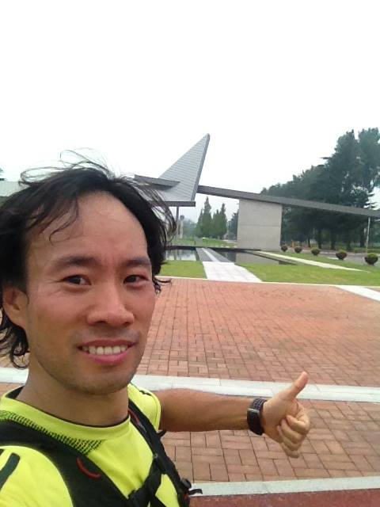
**이미지 캡션:** 한 명의 성인 남성이 밝은 노란색 스포츠 상의와 검은색 조끼를 입고 엄지손가락을 치켜세우며 셀카를 찍고 있다. 남성은 30대 후반에서 40대 초반으로 보이며, 짧고 헝클어진 검은색 머리카락과 약간의 수염이 있다. 그는 활짝 웃으며 카메라를 응시하고 있고, 그의 오른쪽 손목에는 검은색 시계가 착용되어 있다. 배경에는 현대적인 건축물이 보이며, 이는 뾰족한 지붕과 긴 수평 구조물로 이루어져 있다. 건물 주변으로는 잘 가꾸어진 잔디밭과 연못이 있고, 붉은 벽돌로 포장된 넓은 공간이 사진의 전경을 차지하고 있다. 하늘은 흐릿한 날씨를 나타내며, 전반적으로 활동적인 야외 활동 중인 듯한 긍정적이고 활기찬 분위기를 풍긴다.늘은 흐릿한 날씨를 나타내며, 전반적으로 활동적인 야외 활동 중인 듯한 긍정적이고 활기찬 분위기를 풍긴다.
 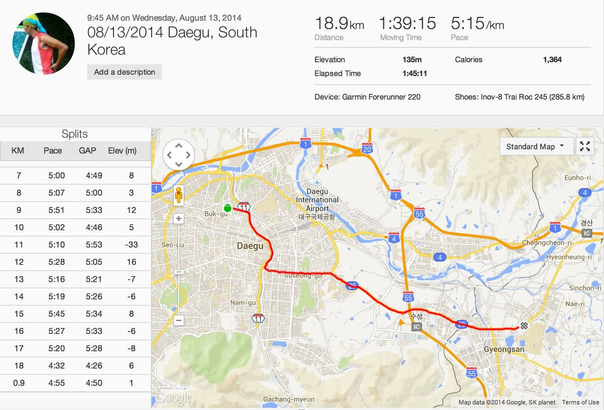
**이미지 캡션:** 화면 상단에는 달리기 기록 요약이 표시되며, 좌측 상단에는 운동 중인 성인 여성의 프로필 사진이 있다. 이 여성은 머리에 밝은 색의 두건을 쓰고 있으며, 빨간색과 흰색이 섞인 운동복을 입고 있다. 그녀는 팔짱을 끼고 있으며, 표정은 보이지 않는다. 그 옆에는 "9:45 AM on Wednesday, August 13, 2014 08/13/2014 Daegu, South Korea"라는 날짜와 장소 정보가 있다. 그 아래에는 "Add a description" 버튼이 있다. 화면 중앙 상단에는 "18.9km 1:39:15 5:15/km"와 같이 총 거리, 이동 시간, 페이스 정보가 표시된다. 그 아래에는 고도(135m), 총 경과 시간(1:45:11), 칼로리(1,364) 정보가 있으며, 사용된 기기는 "Garmin Forerunner 220"이고 신발은 "Inov-8 Trai Roc 245 (285.8 km)"임이 명시되어 있다. 화면 하단에는 대구 시내를 가로지르는 빨간색 경로가 표시된 지도와 함께, 각 킬로미터별 페이스, GAP, 고도 변화를 보여주는 표가 있다. 지도에는 대구 국제공항, 수성구, 경산 등의 지명이 한국어로 표시되어 있으며, 고속도로와 도로망이 상세하게 나타나 있다. 전반적으로 이 화면은 대구에서 진행된 18.9km 달리기 기록을 보여주는 스포츠 트래킹 앱의 인터페이스로 보인다.:39:15 5:15/km"와 같이 총 거리, 이동 시간, 페이스 정보가 표시된다. 그 아래에는 고도(135m), 총 경과 시간(1:45:11), 칼로리(1,364) 정보가 있으며, 사용된 기기는 "Garmin Forerunner 220"이고 신발은 "Inov-8 Trai Roc 245 (285.8 km)"임이 명시되어 있다. 화면 하단에는 대구 시내를 가로지르는 빨간색 경로가 표시된 지도와 함께, 각 킬로미터별 페이스, GAP, 고도 변화를 보여주는 표가 있다. 지도에는 대구 국제공항, 수성구, 경산 등의 지명이 한국어로 표시되어 있으며, 고속도로와 도로망이 상세하게 나타나 있다. 전반적으로 이 화면은 대구에서 진행된 18.9km 달리기 기록을 보여주는 스포츠 트래킹 앱의 인터페이스로 보인다.

### 8월 28일 (목) 22:58 · 📷 앨범: WWW-KR 5th Workshop in Daegu in 1997 (104장)

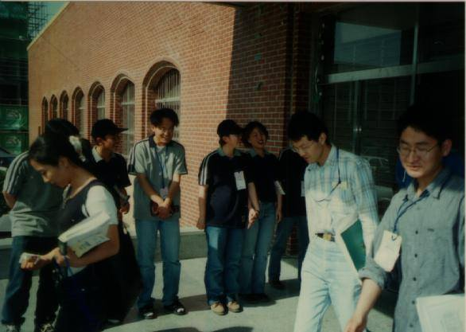
**이미지 캡션:** 이 사진은 여러 명의 젊은 성인 남녀가 벽돌 건물 앞에 서 있는 모습을 담고 있습니다. 왼쪽부터 검은색 상의와 청바지를 입은 성인 남성이 책을 들고 있고, 그 옆에는 흰색과 파란색 체크무늬 셔츠와 흰색 바지를 입은 성인 남성이 녹색 서류철을 들고 걸어가고 있습니다. 그 뒤로는 회색 셔츠와 청바지를 입은 성인 남성이 서 있고, 그의 옆에는 검은색 상의와 청바지를 입은 성인 여성이 서 있습니다. 가장 왼쪽에는 검은색 상의와 청바지를 입은 성인 남성이 모자를 쓰고 있습니다. 건물은 붉은 벽돌로 지어졌으며, 아치형 창문이 여러 개 보입니다. 전체적으로 야외에서 촬영된 것으로 보이며, 밝은 햇살이 비추고 있습니다. 사람들은 대부분 편안한 복장을 하고 있으며, 일부는 명찰을 달고 있어 어떤 행사나 모임에 참여한 것으로 추정됩니다.창문이 여러 개 보입니다. 전체적으로 야외에서 촬영된 것으로 보이며, 밝은 햇살이 비추고 있습니다. 사람들은 대부분 편안한 복장을 하고 있으며, 일부는 명찰을 달고 있어 어떤 행사나 모임에 참여한 것으로 추정됩니다.
 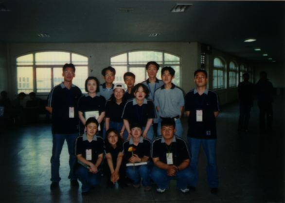
**이미지 캡션:** 이 사진은 10대 후반에서 20대 초반으로 보이는 성인 남녀 12명이 단체 사진을 찍고 있는 모습이다. 배경은 실내 복도로 보이며, 양쪽으로 창문이 있고 천장에는 조명이 설치되어 있다. 사람들은 대부분 어두운 색상의 상의와 청바지를 입고 있으며, 일부는 목걸이 형태의 출입증을 착용하고 있다. 앞줄에 앉아 있는 사람들은 무릎을 꿇고 있으며, 뒷줄에 서 있는 사람들은 어깨를 나란히 하고 있다. 대부분의 사람들은 카메라를 응시하며 밝고 긍정적인 표정을 짓고 있다. 사진의 전체적인 분위기는 화기애애하고 친근한 느낌을 준다. 준다.
 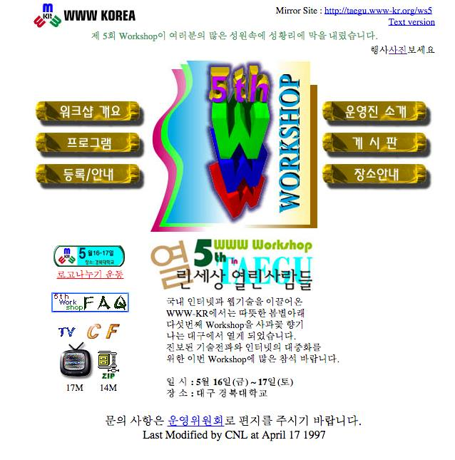
**이미지 캡션:** 이 이미지는 제5회 WWW Workshop의 행사 안내 페이지로 보이며, 중앙에는 "5th WWW Workshop"이라는 문구와 함께 "5th W WORKSHOP"이라는 큰 글씨가 디자인되어 있습니다. 왼쪽에는 "워크샵 개요", "프로그램", "등록/안내" 버튼이 노란색으로 표시되어 있고, 그 아래에는 "5월 16-17일", "장소: 경북대학교", "로고나누기 운동"이라는 문구와 함께 5th Workshop 로고가 있습니다. 또한 "5th Work shop FAQ"와 "TV CF"라는 문구와 함께 오래된 TV와 ZIP 파일 아이콘이 보입니다. 오른쪽에는 "운영진 소개", "게시판", "장소안내" 버튼이 역시 노란색으로 나열되어 있습니다. 페이지 상단에는 "WWW KOREA"라는 로고와 함께 "Mirror Site: http://taegu.www-kr.org/ws5"라는 웹사이트 주소와 "Text version" 링크가 있습니다. 중앙 하단에는 "큰세상 열린사람들"이라는 문구와 함께 "국내 인터넷과 웹기술을 이끌어온 WWW-KR에서는 따뜻한 봄볕아래 다섯번째 Workshop을 사과꽃 향기 나는 대구에서 열게 되었습니다. 진보된 기술전파와 인터넷의 대중화를 위한 이번 Workshop에 많은 참석 바랍니다."라는 행사 소개 글이 있습니다. 행사 일시는 "5월 16일(금)~17일(토)"이며, 장소는 "대구 경북대학교"로 명시되어 있습니다. 마지막으로 "문의 사항은 운영위원회로 편지를 주시기 바랍니다. Last Modified by CNL at April 17 1997"라는 문구로 마무리됩니다. 전체적으로 행사를 알리고 참여를 독려하는 홍보성 웹페이지의 분위기를 띠고 있습니다.와 ZIP 파일 아이콘이 보입니다. 오른쪽에는 "운영진 소개", "게시판", "장소안내" 버튼이 역시 노란색으로 나열되어 있습니다. 페이지 상단에는 "WWW KOREA"라는 로고와 함께 "Mirror Site: http://taegu.www-kr.org/ws5"라는 웹사이트 주소와 "Text version" 링크가 있습니다. 중앙 하단에는 "큰세상 열린사람들"이라는 문구와 함께 "국내 인터넷과 웹기술을 이끌어온 WWW-KR에서는 따뜻한 봄볕아래 다섯번째 Workshop을 사과꽃 향기 나는 대구에서 열게 되었습니다. 진보된 기술전파와 인터넷의 대중화를 위한 이번 Workshop에 많은 참석 바랍니다."라는 행사 소개 글이 있습니다. 행사 일시는 "5월 16일(금)~17일(토)"이며, 장소는 "대구 경북대학교"로 명시되어 있습니다. 마지막으로 "문의 사항은 운영위원회로 편지를 주시기 바랍니다. Last Modified by CNL at April 17 1997"라는 문구로 마무리됩니다. 전체적으로 행사를 알리고 참여를 독려하는 홍보성 웹페이지의 분위기를 띠고 있습니다.
 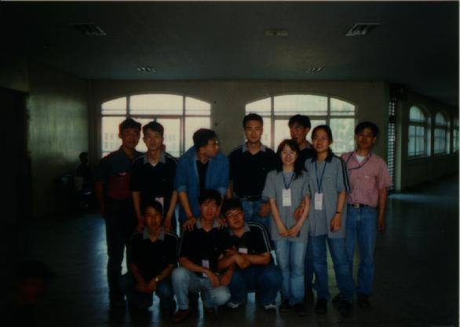
**이미지 캡션:** 이 사진은 10명의 젊은 성인 남녀 그룹이 실내 복도에서 포즈를 취하고 있는 모습을 담고 있으며, 대부분은 20대 초중반으로 보입니다. 왼쪽에서부터 네 번째 남성은 검은색 티셔츠와 청바지를 입고 있으며, 그 옆의 여성은 회색 티셔츠와 청바지를 입고 목에 ID 카드를 걸고 있습니다. 그 옆의 또 다른 여성도 비슷한 복장을 하고 있으며, 가장 오른쪽 남성은 분홍색 체크무늬 셔츠와 청바지를 입고 있습니다. 뒷줄에는 여러 명의 남성이 캐주얼한 복장을 하고 있으며, 일부는 검은색 티셔츠를 입고 있습니다. 모두 밝은 표정으로 카메라를 응시하고 있으며, 일부는 서로 어깨동무를 하고 있습니다. 배경에는 아치형 창문이 있는 복도가 보이며, 창밖으로는 흐릿한 풍경이 보입니다. 전체적으로 밝고 긍정적인 분위기이며, 아마도 학교 행사나 모임의 기념 사진으로 보입니다.정으로 카메라를 응시하고 있으며, 일부는 서로 어깨동무를 하고 있습니다. 배경에는 아치형 창문이 있는 복도가 보이며, 창밖으로는 흐릿한 풍경이 보입니다. 전체적으로 밝고 긍정적인 분위기이며, 아마도 학교 행사나 모임의 기념 사진으로 보입니다.
 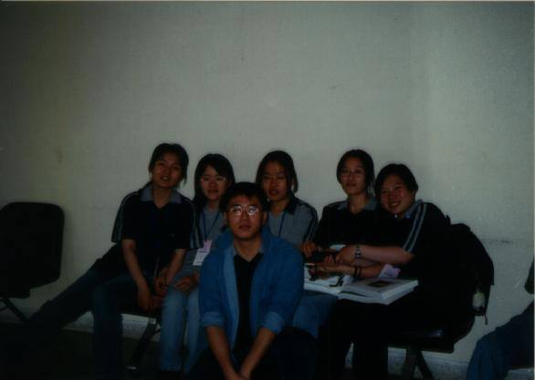
**이미지 캡션:** 사진에는 여섯 명의 젊은 성인들이 흰색 벽을 배경으로 의자에 앉아 있다. 왼쪽에서부터 첫 번째와 두 번째 여성은 검은색 상의를 입고 있으며, 두 번째 여성은 목에 ID 카드를 걸고 있다. 세 번째 여성은 검은색 상의를 입고 있으며, 네 번째 여성은 회색 상의를 입고 있다. 중앙에 있는 성인 남성은 파란색 재킷과 검은색 티셔츠를 입고 있으며, 안경을 쓰고 있다. 가장 오른쪽에 있는 여성은 검은색 상의를 입고 있으며, 그녀의 무릎 위에는 책이 놓여 있다. 전반적으로 사진은 편안하고 캐주얼한 분위기를 나타내며, 이들은 아마도 동료 학생이나 동료일 가능성이 높다.들은 아마도 동료 학생이나 동료일 가능성이 높다.
 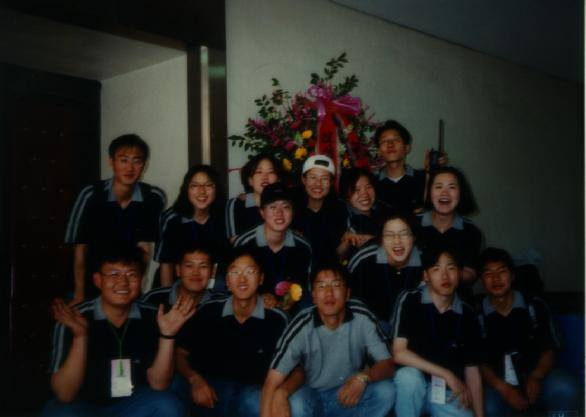
**이미지 캡션:** 이 사진은 10대 후반에서 20대 초반으로 보이는 한국인 청소년 14명이 단체 사진을 찍은 모습이다. 배경에는 꽃 장식이 놓여 있고, 전체적으로 밝고 활기찬 분위기이다. 사진 속 사람들은 대부분 교복으로 보이는 어두운 색상의 상의와 청바지를 입고 있으며, 몇몇은 흰색 티셔츠를 받쳐 입고 있다. 사람들은 다양한 표정을 짓고 있는데, 웃거나 환호하는 듯한 모습이 많아 즐거운 행사나 모임이었음을 짐작게 한다. 왼쪽 하단에 앉아 있는 한 남성은 목에 신분증으로 보이는 것을 걸고 있으며, 다른 사람들도 비슷한 목걸이를 하고 있는 것으로 보인다. 사진의 오른쪽 상단에는 흑백의 무전기처럼 보이는 물건을 들고 있는 남성이 있다. 전반적으로 학교 행사나 동아리 활동, 혹은 졸업 기념 사진으로 보인다. 하고 있는 것으로 보인다. 사진의 오른쪽 상단에는 흑백의 무전기처럼 보이는 물건을 들고 있는 남성이 있다. 전반적으로 학교 행사나 동아리 활동, 혹은 졸업 기념 사진으로 보인다.
 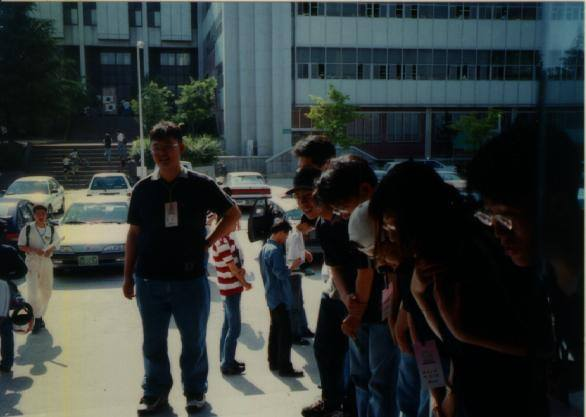
**이미지 캡션:** 사진에는 여러 명의 사람들이 야외에 모여 있는 모습이 담겨 있습니다. 전경에는 검은색 반팔 티셔츠와 청바지를 입은 성인 남성이 서 있으며, 그의 왼쪽에는 흰색 상의와 바지를 입은 젊은 남성이 서 있습니다. 그 뒤로는 빨간색과 흰색 줄무늬 티셔츠를 입은 어린 소년과 파란색 셔츠를 입은 어린 소년이 보입니다. 여러 명의 사람들이 줄지어 서서 고개를 숙이고 있는데, 이들은 대부분 어두운 색 옷을 입고 있으며 일부는 목에 명찰을 달고 있습니다. 배경에는 현대적인 건물과 여러 대의 자동차가 보이며, 건물 앞에는 계단과 나무가 있습니다. 전반적으로 화창한 날씨에 야외 활동이나 행사가 진행 중인 것으로 보이며, 사람들의 표정은 대체로 차분하거나 무언가에 집중하고 있는 듯합니다. 나무가 있습니다. 전반적으로 화창한 날씨에 야외 활동이나 행사가 진행 중인 것으로 보이며, 사람들의 표정은 대체로 차분하거나 무언가에 집중하고 있는 듯합니다.
 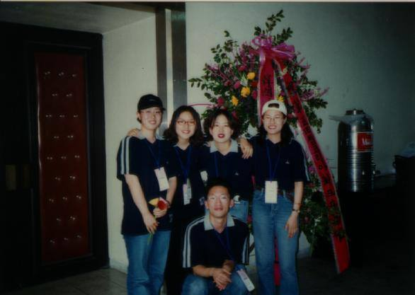
**이미지 캡션:** 다섯 명의 젊은 성인들이 단체 사진을 찍고 있으며, 네 명의 여성은 서 있고 한 명의 남성은 앞에 앉아 있다. 여성들은 모두 어두운 색상의 상의와 청바지를 입고 있으며, 목에는 신분증이 달린 파란색 목걸이를 하고 있다. 왼쪽에서 두 번째 여성은 안경을 쓰고 있으며, 가장 오른쪽에 있는 여성은 흰색 야구 모자를 쓰고 있다. 네 명의 여성은 모두 밝게 웃고 있으며, 왼쪽에서 두 번째 여성은 꽃다발을 들고 있다. 앞에 앉아 있는 남성은 어두운 색상의 상의와 청바지를 입고 있으며, 무표정하게 카메라를 응시하고 있다. 배경에는 큰 꽃 장식이 있고, 오른쪽에는 금속 통이 보인다. 장소는 실내로 보이며, 어두운 색상의 문이 왼쪽에 있다. 전반적으로 즐겁고 기념적인 분위기이다. 배경에는 큰 꽃 장식이 있고, 오른쪽에는 금속 통이 보인다. 장소는 실내로 보이며, 어두운 색상의 문이 왼쪽에 있다. 전반적으로 즐겁고 기념적인 분위기이다.
 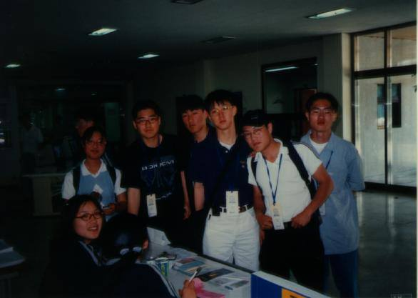
**이미지 캡션:** 이 사진은 여러 명의 젊은 성인 남성과 한 명의 젊은 성인 여성이 실내 공간에 모여 있는 모습을 담고 있으며, 배경에는 사무실이나 학교 복도 같은 환경이 보인다. 중앙에는 안경을 쓴 성인 남성이 검은색 티셔츠를 입고 있으며, 그의 옆에는 파란색 상의를 입은 성인 남성이 서 있다. 그 뒤로는 흰색 셔츠와 파란색 조끼를 입은 젊은 여성과 또 다른 성인 남성들이 보인다. 일부 남성들은 목에 이름표나 출입증으로 보이는 것을 걸고 있으며, 캐주얼한 복장을 하고 있다. 전반적으로 밝고 캐주얼한 분위기이며, 행사나 모임에 참여한 듯한 모습이다. 사진의 오른쪽에는 큰 창문이 있어 외부의 빛이 들어오는 것을 볼 수 있으며, 실내 조명도 함께 켜져 있다. 테이블 위에는 책이나 서류, 펜 등이 놓여 있어 무언가를 준비하거나 진행하는 중일 가능성을 시사한다. 참여한 듯한 모습이다. 사진의 오른쪽에는 큰 창문이 있어 외부의 빛이 들어오는 것을 볼 수 있으며, 실내 조명도 함께 켜져 있다. 테이블 위에는 책이나 서류, 펜 등이 놓여 있어 무언가를 준비하거나 진행하는 중일 가능성을 시사한다.
 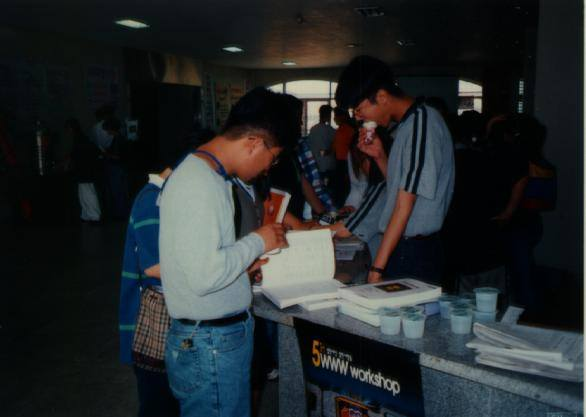
**이미지 캡션:** 사진에는 여러 명의 젊은 성인 남성들이 실내에서 무언가를 나누고 있는 모습이 담겨 있습니다. 중앙에 있는 한 남성은 밝은 회색 긴팔 셔츠와 청바지를 입고 있으며, 목에는 파란색 목걸이를 하고 있습니다. 그는 책을 펼쳐 들고 무언가를 적고 있는 듯한 모습입니다. 그의 옆에는 또 다른 젊은 남성이 회색 줄무늬 반팔 티셔츠를 입고 있으며, 손에 아이스크림 콘을 들고 먹고 있습니다. 그의 표정은 편안해 보입니다. 배경에는 다른 사람들이 희미하게 보이며, 벽에는 포스터나 안내문이 붙어 있는 것으로 추정됩니다. 테이블 위에는 책과 여러 개의 작은 컵들이 놓여 있으며, 테이블 앞쪽에는 "5WWW workshop"이라고 적힌 배너가 보입니다. 전체적으로 행사장이나 세미나 장소에서 사람들이 정보를 교환하거나 휴식을 취하는 듯한 분위기입니다.위에는 책과 여러 개의 작은 컵들이 놓여 있으며, 테이블 앞쪽에는 "5WWW workshop"이라고 적힌 배너가 보입니다. 전체적으로 행사장이나 세미나 장소에서 사람들이 정보를 교환하거나 휴식을 취하는 듯한 분위기입니다.
 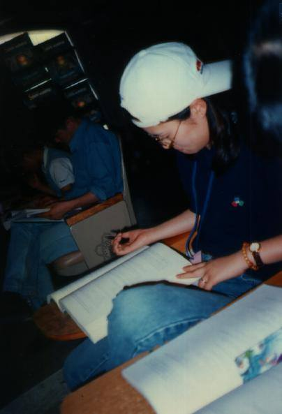
**이미지 캡션:** 어두운 실내에서 흰색 야구 모자를 쓰고 안경을 낀 젊은 여성으로 보이는 사람이 두꺼운 책을 펼쳐 읽고 있으며, 손가락으로 책의 내용을 가리키고 있다. 그녀는 파란색 후드티를 입고 있으며, 목에는 파란색 줄이 달린 무언가를 걸고 있다. 그녀의 오른쪽 손목에는 갈색 팔찌와 시계가 착용되어 있으며, 왼쪽 손가락에는 반지가 끼워져 있다. 그녀의 표정은 집중하고 있는 듯 보인다. 그녀 앞쪽과 왼쪽에는 다른 사람들이 앉아 책을 읽고 있는 모습이 희미하게 보인다. 배경에는 책들이 진열된 선반이 보이며, 전체적으로 차분하고 학구적인 분위기이다. 학구적인 분위기이다.
 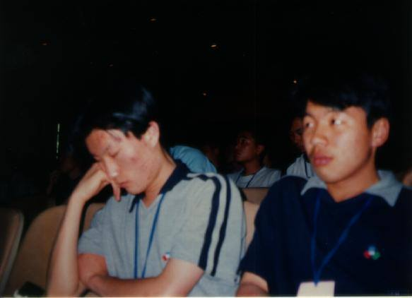
**이미지 캡션:** 어두운 실내에서 두 명의 젊은 성인 남성이 좌석에 앉아 있다. 왼쪽 남성은 회색 티셔츠를 입고 있으며, 얼굴을 손에 괴고 눈을 감고 졸고 있는 듯한 표정이다. 그의 얼굴에는 붉은 반점이 몇 개 보인다. 오른쪽 남성은 남색 티셔츠를 입고 있으며, 정면을 응시하고 있다. 두 사람 모두 목에 파란색 목걸이와 함께 흰색 명찰을 착용하고 있다. 배경에는 다른 사람들이 희미하게 보이며, 어두운 조명과 좌석으로 보아 강연장이나 회의실 같은 장소로 추정된다. 전반적으로 차분하고 다소 지루한 분위기이다.
 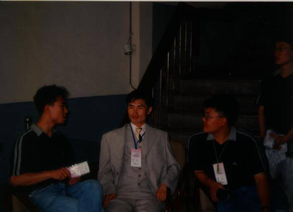
**이미지 캡션:** 사진에는 네 명의 성인 남성이 등장하며, 이들은 실내 계단 옆에 앉거나 서 있습니다. 왼쪽에서부터 첫 번째 남성은 20대 초중반으로 보이며, 검은색 줄무늬가 있는 검은색 폴로 셔츠와 청바지를 입고 있습니다. 그는 손에 흰색 종이 두 장을 들고 있으며, 무언가를 보고 있는 듯한 표정입니다. 두 번째 남성은 30대 초중반으로 추정되며, 회색 정장과 조끼, 흰색 셔츠, 파란색 넥타이를 착용하고 있습니다. 그의 목에는 분홍색과 흰색이 섞인 이름표가 걸려 있으며, 정면을 응시하고 있습니다. 세 번째 남성은 20대 후반으로 보이며, 검은색 폴로 셔츠를 입고 있으며 목에는 분홍색과 흰색이 섞인 이름표를 달고 있습니다. 그는 안경을 착용하고 있으며, 왼쪽을 바라보고 있습니다. 네 번째 남성은 20대 후반에서 30대 초반으로 보이며, 검은색 티셔츠를 입고 있습니다. 그는 오른쪽에 서서 왼쪽을 바라보고 있으며, 손에는 흰색 천 조각을 들고 있습니다. 배경에는 어두운 갈색 계단과 벽이 보이며, 조명은 다소 어둡습니다. 전체적으로 행사의 일부인 듯한 분위기이며, 사람들은 편안한 모습으로 대화를 나누거나 휴식을 취하고 있는 것으로 보입니다.으로 보이며, 검은색 폴로 셔츠를 입고 있으며 목에는 분홍색과 흰색이 섞인 이름표를 달고 있습니다. 그는 안경을 착용하고 있으며, 왼쪽을 바라보고 있습니다. 네 번째 남성은 20대 후반에서 30대 초반으로 보이며, 검은색 티셔츠를 입고 있습니다. 그는 오른쪽에 서서 왼쪽을 바라보고 있으며, 손에는 흰색 천 조각을 들고 있습니다. 배경에는 어두운 갈색 계단과 벽이 보이며, 조명은 다소 어둡습니다. 전체적으로 행사의 일부인 듯한 분위기이며, 사람들은 편안한 모습으로 대화를 나누거나 휴식을 취하고 있는 것으로 보입니다.
 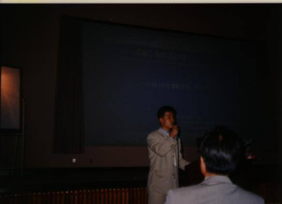
**이미지 캡션:** 어두운 실내 강연장에서 한 성인 남성이 마이크를 들고 연설하고 있으며, 그의 뒤로는 큰 스크린이 보이고 스크린에는 희미하게 텍스트가 표시되어 있다. 남성은 옅은 베이지색 정장을 입고 있으며, 그의 표정은 진지해 보인다. 그의 앞쪽에는 다른 한 명의 성인 남성이 뒷모습만 보이게 앉아 있으며, 이 남성 역시 정장을 입고 있다. 강연장 앞쪽에는 좌석으로 보이는 붉은색 의자들이 줄지어 배치되어 있으며, 전체적으로 차분하고 공식적인 분위기이다.
 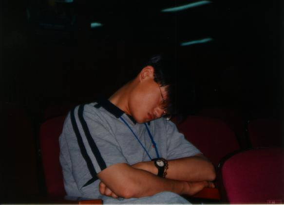
**이미지 캡션:** 어두운 실내에서 한 명의 성인 남성이 좌석에 앉아 팔짱을 끼고 잠들어 있다. 남성은 20대 초중반으로 보이며, 짧은 검은 머리에 안경을 쓰고 있다. 회색 반팔 티셔츠에는 목 부분과 소매 끝에 검은색 줄무늬가 있으며, 파란색 목걸이와 검은색 시계를 착용하고 있다. 얼굴은 오른쪽으로 기울어져 있고 눈을 감고 있어 편안한 표정이다. 배경에는 붉은색 좌석들이 보이며, 천장에는 형광등으로 보이는 조명이 희미하게 빛나고 있다. 전체적으로 차분하고 조용한 분위기이며, 마치 강연이나 영화 상영 중 졸고 있는 듯한 상황이다.
 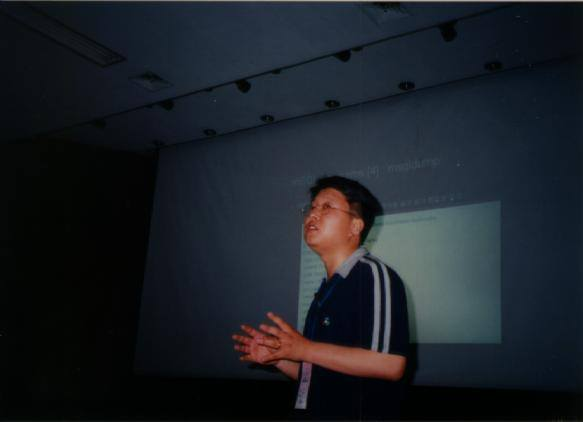
**이미지 캡션:** 사진에는 안경을 쓴 성인 남성이 강연을 하고 있는 모습이 담겨 있습니다. 남성은 40대 후반에서 50대 초반으로 보이며, 검은색 바탕에 흰색 줄무늬가 있는 남색 폴로 셔츠를 입고 있습니다. 셔츠에는 목걸이 형태의 ID 카드도 걸려 있습니다. 남성은 두 손을 앞으로 모으고 있으며, 입을 살짝 벌리고 무언가를 말하는 듯한 표정을 짓고 있습니다. 배경에는 회의실이나 강연장으로 보이는 넓은 공간이 있으며, 천장에는 조명 장치들이 설치되어 있습니다. 벽에는 회색 스크린이 걸려 있고, 스크린에는 텍스트와 그래픽이 표시되어 있습니다. 스크린에 보이는 텍스트는 일부만 알아볼 수 있으며, "mediadump"와 같은 단어가 보입니다. 전체적으로 어두운 조명 아래에서 진행되는 강연이나 발표회의 분위기를 나타냅니다.어 있습니다. 스크린에 보이는 텍스트는 일부만 알아볼 수 있으며, "mediadump"와 같은 단어가 보입니다. 전체적으로 어두운 조명 아래에서 진행되는 강연이나 발표회의 분위기를 나타냅니다.
 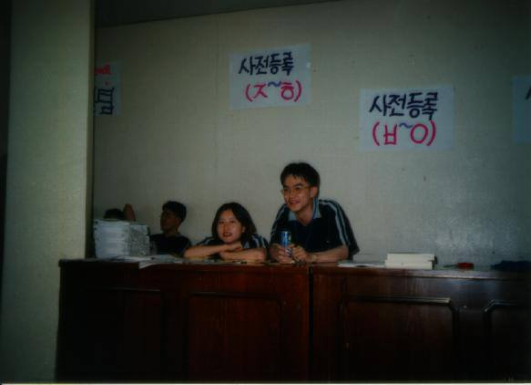
**이미지 캡션:** 이 사진은 실내에서 촬영되었으며, 옅은 회색 벽을 배경으로 나무로 된 카운터 앞에 사람들이 서 있다. 카운터 위에는 서류 더미와 책들이 놓여 있으며, 벽에는 두 개의 흰색 포스터가 붙어 있는데, 각각 "사전등록"이라는 글자와 함께 괄호 안에 귀여운 이모티콘이 그려져 있다. 왼쪽 포스터에는 "(ㅈ~ㅎ)"이라고 쓰여 있고, 오른쪽 포스터에는 "(ㅂ~ㅇ)"이라고 쓰여 있다. 카운터 왼쪽에는 젊은 성인 남성이 검은색 상의를 입고 앉아 있으며, 그의 뒤로는 또 다른 젊은 성인 남성이 희미하게 보인다. 중앙에는 젊은 성인 여성이 검은색과 흰색 줄무늬가 있는 상의를 입고 카운터에 팔을 괴고 앉아 카메라를 바라보며 미소 짓고 있다. 그녀의 옆에는 젊은 성인 남성이 파란색과 검은색 줄무늬가 있는 상의를 입고 안경을 쓴 채 밝게 웃으며 카메라를 보고 있다. 그는 손에 파란색 캔 음료를 들고 있다. 전반적으로 사진은 활기차고 긍정적인 분위기를 나타내며, 아마도 어떤 행사나 등록 절차가 진행 중인 것으로 보인다.인 여성이 검은색과 흰색 줄무늬가 있는 상의를 입고 카운터에 팔을 괴고 앉아 카메라를 바라보며 미소 짓고 있다. 그녀의 옆에는 젊은 성인 남성이 파란색과 검은색 줄무늬가 있는 상의를 입고 안경을 쓴 채 밝게 웃으며 카메라를 보고 있다. 그는 손에 파란색 캔 음료를 들고 있다. 전반적으로 사진은 활기차고 긍정적인 분위기를 나타내며, 아마도 어떤 행사나 등록 절차가 진행 중인 것으로 보인다.
 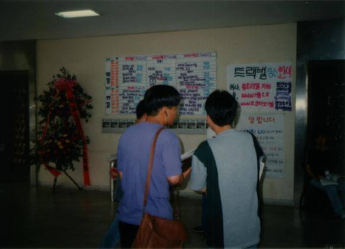
**이미지 캡션:** 실내 공간에서 세 명의 성인 남성이 벽에 붙은 게시판을 보고 있다. 왼쪽의 남성은 보라색 반팔 티셔츠와 갈색 가방을 메고 있으며, 가운데 남성은 주황색 티셔츠를 입고 있다. 오른쪽 남성은 회색과 검은색이 배색된 반팔 티셔츠를 입고 있다. 세 사람 모두 무언가를 읽거나 보고 있는 듯한 모습이며, 표정은 명확하게 보이지 않는다. 배경에는 여러 개의 게시판이 걸려 있는데, 하나에는 웹사이트 주소와 관련된 정보가 빼곡히 적혀 있고, 다른 하나에는 "트래블포스 안내"라는 제목과 함께 여러 내용이 한국어로 적혀 있다. 게시판 옆에는 빨간 리본이 달린 조화 화환이 놓여 있다. 전체적으로 차분하고 정보 전달에 초점을 맞춘 듯한 분위기이다.게시판 옆에는 빨간 리본이 달린 조화 화환이 놓여 있다. 전체적으로 차분하고 정보 전달에 초점을 맞춘 듯한 분위기이다.
 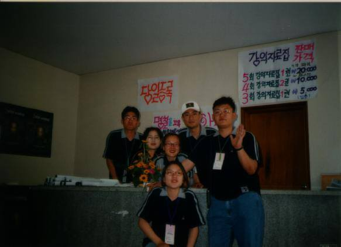
**이미지 캡션:** 사진에는 여섯 명의 사람이 서 있거나 앉아 있으며, 배경에는 한국어로 쓰인 여러 개의 포스터가 걸려 있습니다. 왼쪽부터 성인 남성 두 명, 성인 여성 한 명, 성인 남성 한 명, 성인 여성 한 명, 그리고 맨 앞에는 성인 여성 한 명이 앉아 있습니다. 모두 검은색 상의를 입고 있으며, 일부는 목에 명찰을 걸고 있습니다. 성인 남성 중 한 명은 흰색 모자를 쓰고 있고, 다른 한 명은 오른손을 들고 인사하는 듯한 포즈를 취하고 있습니다. 성인 여성 중 한 명은 꽃다발을 들고 있습니다. 배경의 포스터에는 "강의자료집 판매 가격"이라는 글자와 함께 강의 횟수에 따른 가격 정보가 적혀 있습니다. 또한 "다이렉트 ♡"와 "명품!"이라는 문구도 보입니다. 전체적으로 강의나 행사와 관련된 모임으로 보이며, 밝고 긍정적인 분위기입니다.집 판매 가격"이라는 글자와 함께 강의 횟수에 따른 가격 정보가 적혀 있습니다. 또한 "다이렉트 ♡"와 "명품!"이라는 문구도 보입니다. 전체적으로 강의나 행사와 관련된 모임으로 보이며, 밝고 긍정적인 분위기입니다.
 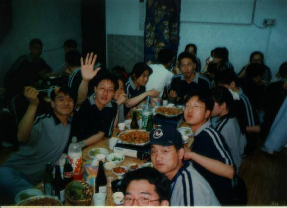
**이미지 캡션:** 이 사진은 여러 명의 성인 남녀가 실내에서 식사를 하며 즐거운 시간을 보내는 모습을 담고 있습니다. 사진 중앙에는 안경을 쓴 성인 남성이 손을 흔들며 카메라를 향해 밝게 웃고 있으며, 그의 옆에는 또 다른 성인 남성이 음식을 들고 있습니다. 주변에는 다양한 연령대의 사람들이 테이블에 둘러앉아 음식을 나누고 대화하는 모습이 보입니다. 테이블 위에는 여러 가지 음식과 음료가 놓여 있으며, 특히 볶음 요리와 반찬들이 눈에 띕니다. 배경에는 벽과 창문, 그리고 장식용 천이 보이며, 전반적으로 편안하고 활기찬 분위기를 느낄 수 있습니다. 느낄 수 있습니다.
 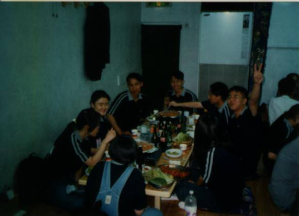
**이미지 캡션:** 이 사진은 여러 명의 젊은 성인들이 테이블에 둘러앉아 식사를 하고 있는 모습을 담고 있습니다. 대부분 검은색 상의에 줄무늬가 있는 복장을 하고 있으며, 캐주얼하고 편안한 분위기입니다. 테이블 위에는 다양한 음식과 음료가 놓여 있으며, 사람들은 즐겁게 대화하고 음식을 나누고 있습니다. 한 남성은 오른손으로 브이(V)자를 그리며 카메라를 향해 포즈를 취하고 있습니다. 배경에는 벽과 문, 그리고 에어컨으로 보이는 기기가 있습니다. 전반적으로 친목을 다지는 즐거운 모임의 순간을 포착한 사진입니다.
 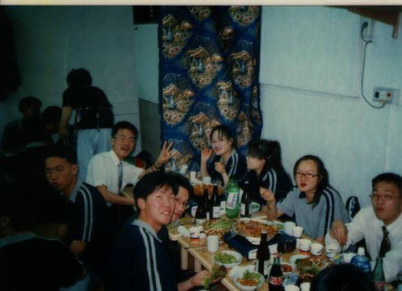
**이미지 캡션:** 이 사진은 여러 명의 젊은 성인 남녀가 테이블에 둘러앉아 식사를 하고 있는 실내 모임 장면을 담고 있습니다. 사진 왼쪽에는 흰색 셔츠에 넥타이를 맨 성인 남성이 웃으며 브이(V)자를 그리고 있고, 그의 옆에는 검은색 상의를 입은 성인 남성이 앉아 있습니다. 테이블 위에는 다양한 음식과 술병들이 놓여 있으며, 특히 녹색 병의 음료수가 눈에 띕니다. 테이블 중앙에는 여러 명의 젊은 여성들이 앉아 있는데, 모두 검은색 상의를 입고 있으며 일부는 음식을 먹거나 대화를 나누는 듯한 표정입니다. 사진 오른쪽에는 안경을 쓴 성인 남성과 여성, 그리고 또 다른 성인 남성이 앉아 있습니다. 배경에는 파란색 바탕에 흰색 무늬가 있는 커튼이 걸려 있고, 벽에는 전등 스위치와 콘센트가 보입니다. 전반적으로 편안하고 즐거운 분위기 속에서 식사를 즐기는 모습입니다.쓴 성인 남성과 여성, 그리고 또 다른 성인 남성이 앉아 있습니다. 배경에는 파란색 바탕에 흰색 무늬가 있는 커튼이 걸려 있고, 벽에는 전등 스위치와 콘센트가 보입니다. 전반적으로 편안하고 즐거운 분위기 속에서 식사를 즐기는 모습입니다.
 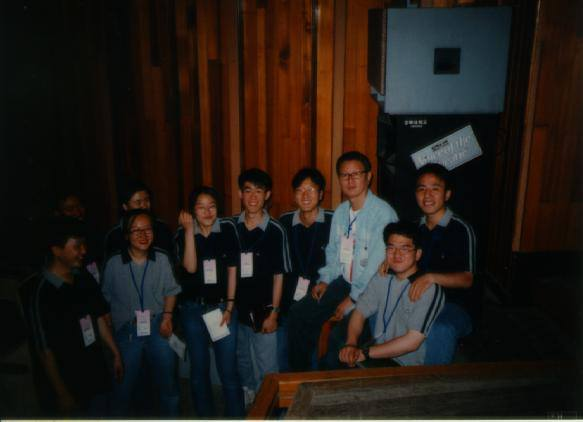
**이미지 캡션:** 이 사진은 10대 후반에서 20대 초반으로 보이는 젊은 남녀 여러 명이 함께 서서 포즈를 취하고 있는 모습을 담고 있습니다. 배경은 나무 패널로 마감된 실내이며, 오른쪽에는 검은색 장비와 함께 회색 상자가 놓여 있습니다. 사람들은 대부분 어두운 색상의 상의를 입고 있으며, 일부는 목에 이름표나 출입증으로 보이는 것을 걸고 있습니다. 모두 밝고 긍정적인 표정을 짓고 있으며, 일부는 서로 어깨에 손을 올리거나 가까이 서서 친밀감을 표현하고 있습니다. 전반적으로 행사나 모임에 참여한 참가자들이 기념 사진을 찍는 듯한 분위기입니다.한 분위기입니다.
 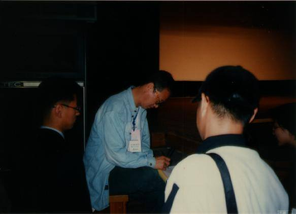
**이미지 캡션:** 사진에는 세 명의 성인 남성이 등장하며, 한 명은 앞에 서 있고 두 명은 뒤쪽에 있다. 앞에 서 있는 남성은 옅은 파란색 셔츠를 입고 있으며, 목에는 흰색 명찰을 달고 있다. 그는 안경을 쓰고 있으며, 허리를 숙여 무언가를 적고 있는 듯한 모습이다. 그의 표정은 집중하고 있는 것으로 보인다. 뒤쪽의 두 남성 중 한 명은 검은색 야구 모자를 쓰고 있으며, 흰색 상의에 검은색 줄이 있는 옷을 입고 있다. 다른 한 명은 검은색 정장을 입고 안경을 쓰고 있으며, 앞쪽 남성을 바라보고 있다. 배경은 어두운 실내이며, 벽에는 갈색 계열의 무늬가 있는 것으로 보인다. 전체적으로 회의나 세미나와 같은 공식적인 행사 중인 것으로 추정되며, 차분하고 진지한 분위기이다.벽에는 갈색 계열의 무늬가 있는 것으로 보인다. 전체적으로 회의나 세미나와 같은 공식적인 행사 중인 것으로 추정되며, 차분하고 진지한 분위기이다.
 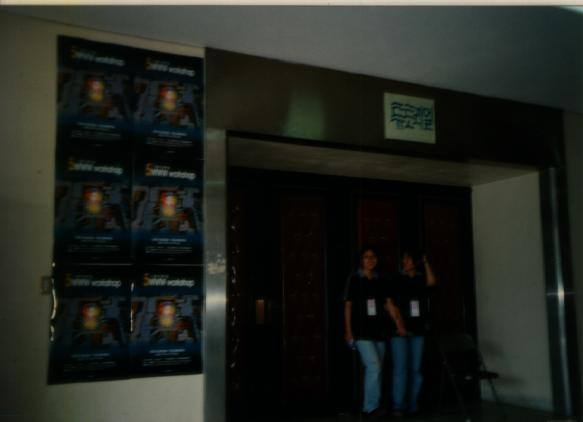
**이미지 캡션:** 사진에는 두 명의 성인 여성이 어두운 실내 공간에 서 있다. 왼쪽 여성은 검은색 상의와 청바지를 입고 있으며, 오른쪽 여성은 검은색 상의와 청바지를 입고 있다. 두 여성 모두 목에 흰색 명찰을 달고 있으며, 표정은 잘 보이지 않지만 편안해 보인다. 그들은 어두운 갈색 문 앞에 서 있으며, 문 위에는 한국어로 된 간판이 있다. 왼쪽 벽에는 "SOHO workshop"이라고 적힌 포스터가 여러 장 붙어 있다. 포스터에는 붉은색과 노란색이 섞인 원형 이미지와 함께 영어로 된 텍스트가 보인다. 전체적으로 행사장 입구 또는 회의실 앞인 것으로 추정되며, 차분하고 약간은 어두운 분위기이다. 또는 회의실 앞인 것으로 추정되며, 차분하고 약간은 어두운 분위기이다.
 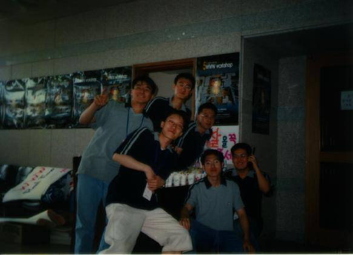
**이미지 캡션:** 이 사진은 6명의 젊은 성인 남성들이 함께 포즈를 취하고 있는 모습을 담고 있으며, 배경에는 여러 포스터와 출입문이 보인다. 왼쪽에서부터 첫 번째 남성은 회색 반팔 티셔츠와 청바지를 입고 있으며, 오른손으로 브이(V) 표시를 하고 있다. 두 번째 남성은 검은색 줄무늬가 있는 남색 상의와 흰색 바지를 입고 있으며, 안경을 쓰고 있다. 세 번째 남성은 검은색 상의를 입고 있으며, 네 번째 남성은 검은색 상의와 청바지를 입고 안경을 쓰고 있다. 다섯 번째 남성은 회색 반팔 티셔츠와 청바지를 입고 있으며, 여섯 번째 남성은 검은색 상의를 입고 휴대폰을 귀에 대고 있다. 이들은 모두 편안하고 즐거운 표정을 짓고 있으며, 일부는 서로에게 기대어 친밀감을 표현하고 있다. 배경에는 "SWWW workshop"이라는 문구가 적힌 포스터와 다른 여러 포스터들이 벽에 걸려 있고, 오른쪽에는 어두운 색의 출입문이 보인다. 전반적으로 편안하고 캐주얼한 분위기이며, 친구들이 함께 모여 즐거운 시간을 보내는 듯한 모습이다. 남성은 검은색 상의를 입고 휴대폰을 귀에 대고 있다. 이들은 모두 편안하고 즐거운 표정을 짓고 있으며, 일부는 서로에게 기대어 친밀감을 표현하고 있다. 배경에는 "SWWW workshop"이라는 문구가 적힌 포스터와 다른 여러 포스터들이 벽에 걸려 있고, 오른쪽에는 어두운 색의 출입문이 보인다. 전반적으로 편안하고 캐주얼한 분위기이며, 친구들이 함께 모여 즐거운 시간을 보내는 듯한 모습이다.
 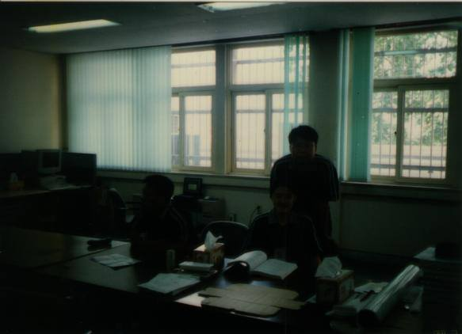
**이미지 캡션:** 어두운 실내에서 세 명의 성인 남성이 책상에 앉아 있거나 서 있다. 왼쪽에는 두 대의 컴퓨터 모니터가 놓여 있고, 창문에는 세로 블라인드가 쳐져 있다. 가운데 앉아 있는 남성은 검은색 상의를 입고 있으며, 그의 앞에는 책과 휴지통이 놓여 있다. 오른쪽에는 또 다른 남성이 서 있고, 그의 앞에는 책과 휴지통이 놓여 있다. 배경에는 창문이 보이며, 창밖으로는 나무가 보인다. 전반적으로 차분하고 업무적인 분위기이다.
 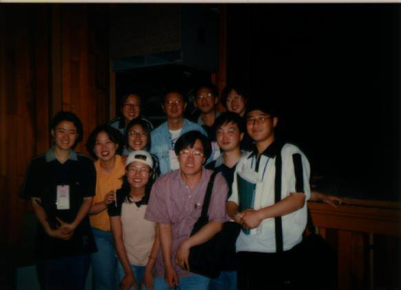
**이미지 캡션:** 이 사진은 10명의 젊은 성인 남녀가 함께 찍은 단체 사진으로, 실내에서 촬영된 것으로 보이며 나무 벽과 어두운 배경이 특징입니다. 왼쪽부터 첫 번째 여성은 검은색 상의에 파란색 하의를 입고 있으며, 목에는 분홍색 명찰을 달고 있습니다. 그녀는 미소를 짓고 있으며, 손을 모으고 있습니다. 그 옆에 있는 여성은 주황색 상의에 파란색 하의를 입고 있으며, 밝게 웃고 있습니다. 세 번째 여성은 흰색 모자를 쓰고 베이지색 상의에 검은색 하의를 입고 있으며, 안경을 쓰고 미소를 짓고 있습니다. 네 번째 여성은 보라색 상의에 청바지를 입고 있으며, 안경을 쓰고 카메라를 응시하고 있습니다. 그 뒤에 있는 여성들은 다양한 표정과 복장을 하고 있으며, 일부는 안경을 착용하고 있습니다. 사진의 오른쪽에는 두 명의 남성이 서 있는데, 한 명은 흰색과 검은색 줄무늬가 있는 상의를 입고 녹색 서류철을 들고 있으며, 다른 한 명은 검은색 상의를 입고 있습니다. 전반적으로 사진은 편안하고 즐거운 분위기를 나타내며, 이들은 아마도 동료, 친구 또는 동아리 회원일 것으로 추정됩니다. 배경의 나무 벽은 따뜻하고 자연스러운 느낌을 더하며, 어두운 배경은 인물들에게 초점을 맞추게 합니다.상의에 청바지를 입고 있으며, 안경을 쓰고 카메라를 응시하고 있습니다. 그 뒤에 있는 여성들은 다양한 표정과 복장을 하고 있으며, 일부는 안경을 착용하고 있습니다. 사진의 오른쪽에는 두 명의 남성이 서 있는데, 한 명은 흰색과 검은색 줄무늬가 있는 상의를 입고 녹색 서류철을 들고 있으며, 다른 한 명은 검은색 상의를 입고 있습니다. 전반적으로 사진은 편안하고 즐거운 분위기를 나타내며, 이들은 아마도 동료, 친구 또는 동아리 회원일 것으로 추정됩니다. 배경의 나무 벽은 따뜻하고 자연스러운 느낌을 더하며, 어두운 배경은 인물들에게 초점을 맞추게 합니다.
 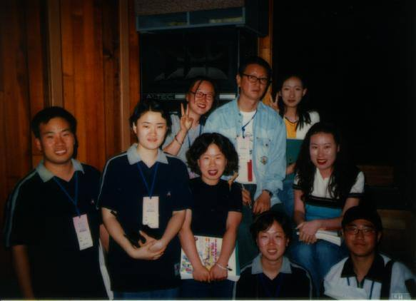
**이미지 캡션:** 이 사진은 8명의 젊은 성인 남녀가 함께 찍은 단체 사진으로, 배경은 나무 판자로 된 벽과 검은색 스피커가 있는 실내 공간으로 보입니다. 왼쪽부터 성인 남성 두 명이 나란히 서 있고, 그 뒤로 성인 여성 한 명이 웃으며 브이(V) 포즈를 취하고 있습니다. 그 옆에는 안경을 쓴 성인 남성이 파란색 셔츠를 입고 서 있고, 그 뒤로는 성인 여성 두 명이 서 있습니다. 맨 앞줄에는 성인 여성 두 명이 앉아 있으며, 오른쪽 끝에는 안경을 쓴 성인 남성이 앉아 있습니다. 대부분의 사람들은 밝은 표정을 짓고 있으며, 일부는 목에 이름표나 출입증으로 보이는 것을 걸고 있습니다. 전반적으로 편안하고 즐거운 분위기이며, 행사나 모임의 한 장면으로 보입니다.는 목에 이름표나 출입증으로 보이는 것을 걸고 있습니다. 전반적으로 편안하고 즐거운 분위기이며, 행사나 모임의 한 장면으로 보입니다.
 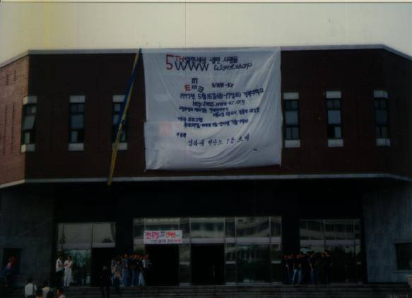
**이미지 캡션:** 건물 외벽에 걸린 대형 현수막에는 "5WWW Workshop"이라는 문구와 함께 "The 5th Korea WWW Conference"라는 글자가 영어와 한글로 적혀 있으며, 1997년 5월 15일부터 17일까지 개최된 행사임을 알 수 있습니다. 또한 행사 웹사이트 주소인 "http://kws.www.kr.org"와 함께 "정부/부산소 1층 로비"라는 장소가 명시되어 있습니다. 건물 앞 계단에는 여러 명의 사람들이 모여 있으며, 일부는 행사 참석자로 보이고 일부는 일반 방문객으로 보입니다. 건물 입구에는 "천연물 신약"이라는 문구가 적힌 작은 현수막이 걸려 있어, 이 행사가 천연물 신약과 관련된 학술 행사임을 짐작할 수 있습니다. 전체적으로 행사를 알리는 현수막이 걸린 건물 앞에서 사람들이 모여 있는 모습으로, 학술 행사나 컨퍼런스가 진행 중이거나 막 시작하려는 듯한 분위기입니다.연물 신약"이라는 문구가 적힌 작은 현수막이 걸려 있어, 이 행사가 천연물 신약과 관련된 학술 행사임을 짐작할 수 있습니다. 전체적으로 행사를 알리는 현수막이 걸린 건물 앞에서 사람들이 모여 있는 모습으로, 학술 행사나 컨퍼런스가 진행 중이거나 막 시작하려는 듯한 분위기입니다.
 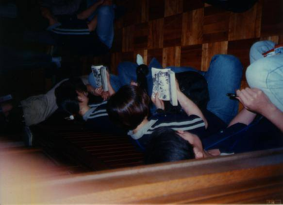
**이미지 캡션:** 여러 명의 젊은 성인 남녀가 좁은 공간에 엎드려 책을 읽고 있는 모습으로, 바닥은 나무 판자로 되어 있으며 벽도 나무 재질로 보인다. 중앙에 있는 두 명은 각각 책을 들고 집중하고 있으며, 한 명은 회색 상의에 검은색 줄무늬가 있는 옷을 입고 있고 다른 한 명은 파란색 상의에 검은색 줄무늬가 있는 옷을 입고 있다. 그 옆으로는 파란색 청바지를 입은 다른 사람들이 보인다. 가장 오른쪽에 있는 사람은 흰색 상의를 입고 있으며, 손에는 검은색 펜으로 보이는 물건을 들고 있다. 전반적으로 차분하고 조용한 분위기이며, 마치 독서 모임이나 스터디 그룹의 한 장면처럼 보인다. 마치 독서 모임이나 스터디 그룹의 한 장면처럼 보인다.
 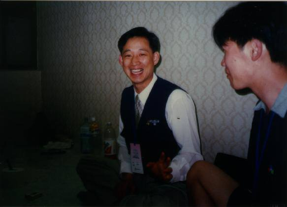
**이미지 캡션:** 사진에는 두 명의 성인 남성이 등장하며, 왼쪽 남성은 40대 후반에서 50대 초반으로 보이며 흰색 셔츠에 남색 조끼를 입고 넥타이를 착용하고 있다. 조끼에는 작은 로고와 함께 "PULSA"라는 글자가 희미하게 보인다. 그는 활짝 웃으며 오른손을 앞으로 내밀고 있으며, 그의 표정은 매우 즐거워 보인다. 오른쪽 남성은 20대 초반으로 추정되며, 파란색 계열의 옷을 입고 왼쪽 남성을 바라보고 있다. 두 사람 모두 실내에 앉아 있으며, 배경에는 흰색 바탕에 기하학적인 문양이 있는 벽지가 보인다. 바닥에는 물병 두 개와 몇 개의 물건들이 놓여 있고, 전체적으로 편안하고 캐주얼한 분위기를 연출한다.와 몇 개의 물건들이 놓여 있고, 전체적으로 편안하고 캐주얼한 분위기를 연출한다.
 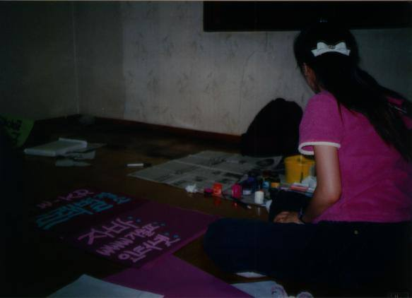
**이미지 캡션:** 한 명의 젊은 여성이 방바닥에 앉아 무언가를 만들고 있다. 그녀는 긴 검은 머리에 흰색 리본을 달고 있으며, 분홍색 티셔츠와 남색 바지를 입고 있다. 그녀의 얼굴은 보이지 않지만, 집중하는 듯한 모습이다. 그녀 앞에는 보라색과 분홍색의 큰 종이가 놓여 있고, 그 위에는 "자바"라는 글씨와 함께 다른 한국어 문구가 적혀 있다. 종이 옆에는 신문, 물감, 붓, 연필 등 다양한 미술 도구들이 흩어져 있어 그녀가 무언가를 만들고 있음을 짐작하게 한다. 배경에는 낡은 벽지와 나무 바닥이 보이며, 어두운 분위기를 자아낸다. 전반적으로 창의적인 활동이 이루어지고 있는 개인적인 공간의 모습이다.다. 전반적으로 창의적인 활동이 이루어지고 있는 개인적인 공간의 모습이다.
 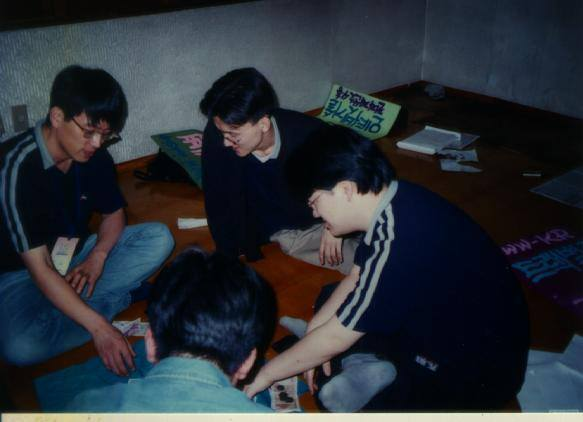
**이미지 캡션:** 네 명의 성인 남성이 방바닥에 앉아 무언가를 하고 있다. 왼쪽에서부터 첫 번째 남성은 검은색 반팔 카라티에 청바지를 입고 안경을 쓰고 있으며, 목에는 ID 카드를 걸고 있다. 그는 무언가를 집중해서 보고 있으며, 표정은 진지하다. 두 번째 남성은 검은색 긴팔 스웨터에 회색 바지를 입고 안경을 쓰고 있으며, 역시 무언가를 보고 있다. 세 번째 남성은 검은색 반팔 티셔츠에 검은색 바지를 입고 있으며, 그의 티셔츠에는 흰색 줄무늬가 있다. 그는 무언가를 만지고 있으며, 표정은 약간 미소를 띠고 있다. 네 번째 남성은 앞모습이 잘 보이지 않지만, 청바지 비슷한 옷을 입고 있다. 배경에는 녹색과 보라색의 천이 놓여 있으며, 녹색 천에는 "인터넷기술"이라는 글자가 쓰여 있고, 보라색 천에는 "WW-KR"이라는 글자가 쓰여 있다. 방은 다소 어둡고 평범한 실내 공간으로 보이며, 전체적으로 차분하고 집중하는 분위기이다.은 앞모습이 잘 보이지 않지만, 청바지 비슷한 옷을 입고 있다. 배경에는 녹색과 보라색의 천이 놓여 있으며, 녹색 천에는 "인터넷기술"이라는 글자가 쓰여 있고, 보라색 천에는 "WW-KR"이라는 글자가 쓰여 있다. 방은 다소 어둡고 평범한 실내 공간으로 보이며, 전체적으로 차분하고 집중하는 분위기이다.
 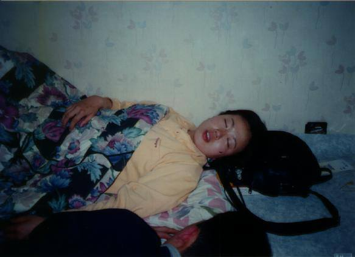
**이미지 캡션:** 사진에는 젊은 여성으로 보이는 사람이 침대에 누워 잠들어 있다. 그녀는 옅은 노란색 상의를 입고 있으며, 화려한 꽃무늬 이불에 덮여 있다. 얼굴은 약간 왼쪽으로 향해 있고, 눈은 감겨 있으며 입은 살짝 벌어져 있다. 얼굴에 약간의 화장 흔적이 보이며, 왼쪽 뺨에는 작은 점이 있다. 머리카락은 검은색이며 길게 늘어져 있다. 그녀의 옆에는 검은색 가방이 놓여 있고, 침대 머리맡 벽에는 연한 색상의 꽃무늬 벽지가 붙어 있다. 침대 아래쪽에는 다른 사람의 어깨와 팔이 일부 보인다. 전반적으로 편안하고 조용한 분위기이며, 잠시 휴식을 취하거나 잠든 상황으로 보인다.며, 잠시 휴식을 취하거나 잠든 상황으로 보인다.
 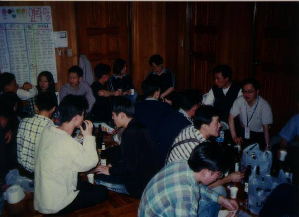
**이미지 캡션:** 이 사진은 실내에서 여러 명의 성인 남녀가 모여 술을 마시고 대화하는 모습을 담고 있습니다. 배경은 나무 벽으로 둘러싸인 공간이며, 한쪽 벽에는 한국어로 쓰인 것으로 보이는 게시판이 걸려 있습니다. 게시판에는 여러 칸으로 나뉘어 글씨와 숫자가 적혀 있으며, 상단에는 "야라망"이라는 단어가 보입니다. 사람들은 바닥에 앉거나 서서 서로 대화하고 있으며, 테이블 위에는 여러 병의 술과 잔이 놓여 있습니다. 사진 중앙에 있는 한 남성은 흰색 긴팔 셔츠를 입고 술잔을 들고 있으며, 그의 옆에 있는 남성은 검은색 상의를 입고 있습니다. 다른 남성들은 체크무늬 셔츠, 줄무늬 셔츠 등 다양한 복장을 하고 있습니다. 전반적으로 편안하고 즐거운 분위기 속에서 사람들이 모여 시간을 보내고 있는 것으로 보입니다. 입고 있습니다. 다른 남성들은 체크무늬 셔츠, 줄무늬 셔츠 등 다양한 복장을 하고 있습니다. 전반적으로 편안하고 즐거운 분위기 속에서 사람들이 모여 시간을 보내고 있는 것으로 보입니다.
 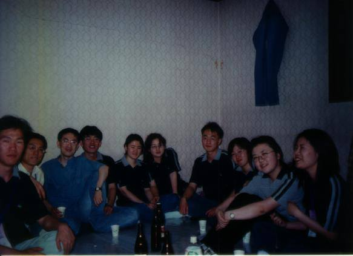
**이미지 캡션:** 사진에는 9명의 젊은 성인들이 실내에 모여 앉아 있는 모습이 담겨 있으며, 이들은 편안하고 캐주얼한 분위기 속에서 함께 시간을 보내고 있습니다. 왼쪽부터 성인 남성 한 명이 카메라를 향해 미소를 짓고 있으며, 그의 옆에는 또 다른 성인 남성이 앉아 있습니다. 그 옆으로 안경을 쓴 성인 남성 두 명이 나란히 앉아 있고, 이들 뒤로는 성인 여성 세 명이 앉아 있습니다. 가장 오른쪽에는 안경을 쓴 성인 여성 한 명이 카메라를 바라보고 있으며, 그녀 옆에는 또 다른 성인 여성이 앉아 있습니다. 대부분의 사람들은 어두운 색상의 상의와 청바지를 입고 있으며, 일부는 편안한 자세로 앉아 있거나 서로에게 기대어 있습니다. 배경에는 옅은 패턴의 벽지가 보이며, 벽에는 파란색 옷으로 보이는 물건이 걸려 있습니다. 바닥에는 여러 개의 맥주병과 종이컵이 놓여 있어, 이들이 술을 마시며 즐거운 시간을 보내고 있음을 짐작하게 합니다. 전반적으로 사진은 친근하고 즐거운 모임의 순간을 포착하고 있습니다.운 색상의 상의와 청바지를 입고 있으며, 일부는 편안한 자세로 앉아 있거나 서로에게 기대어 있습니다. 배경에는 옅은 패턴의 벽지가 보이며, 벽에는 파란색 옷으로 보이는 물건이 걸려 있습니다. 바닥에는 여러 개의 맥주병과 종이컵이 놓여 있어, 이들이 술을 마시며 즐거운 시간을 보내고 있음을 짐작하게 합니다. 전반적으로 사진은 친근하고 즐거운 모임의 순간을 포착하고 있습니다.
 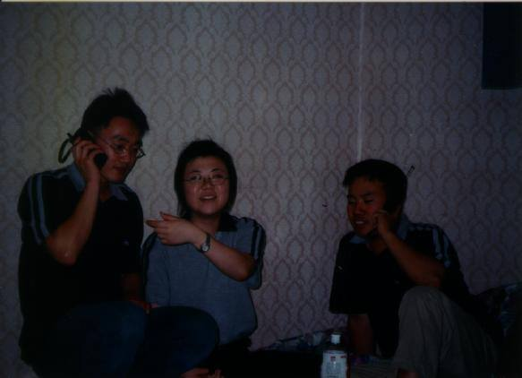
**이미지 캡션:** 사진에는 세 명의 젊은 성인이 실내에 앉아 있다. 왼쪽에는 안경을 쓴 성인 남성이 검은색 줄무늬가 있는 짙은 색 셔츠를 입고 휴대폰으로 통화하고 있다. 가운데에는 안경을 쓴 젊은 여성이 회색 셔츠를 입고 손가락으로 무언가를 가리키고 있으며, 손목에는 시계를 차고 있다. 오른쪽에는 성인 남성이 검은색 줄무늬가 있는 짙은 색 셔츠를 입고 휴대폰으로 통화하고 있다. 배경에는 옅은 색의 꽃무늬 벽지가 있고, 바닥에는 흰색과 빨간색이 섞인 물병이 보인다. 전반적으로 편안하고 캐주얼한 분위기이다.
 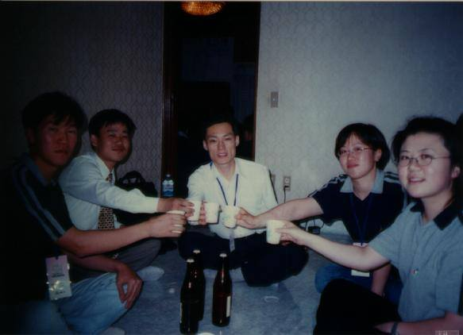
**이미지 캡션:** 다섯 명의 젊은 성인 남녀가 실내에서 술잔을 부딪치며 건배하고 있다. 왼쪽부터 검은색 줄무늬가 있는 회색 상의를 입은 성인 남성, 흰색 셔츠에 넥타이를 맨 성인 남성, 흰색 셔츠에 파란색 목걸이를 한 성인 남성, 남색 상의를 입은 안경 쓴 성인 여성, 회색 상의를 입은 안경 쓴 성인 여성이 보인다. 모두 바닥에 앉아 있으며, 테이블은 보이지 않는다. 앞쪽 바닥에는 갈색 병 두 개가 놓여 있다. 배경에는 벽지가 있고, 천장에는 조명이 보인다. 전체적으로 편안하고 즐거운 분위기이다.
 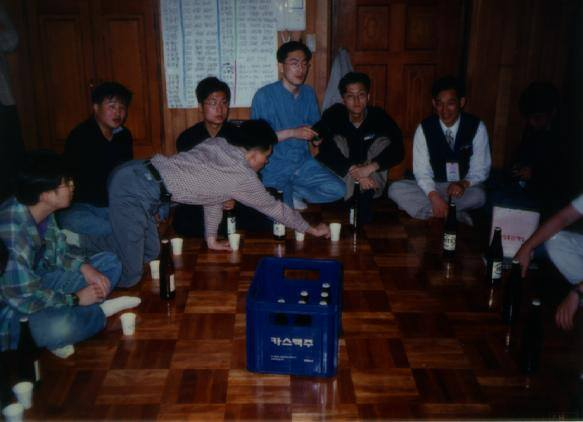
**이미지 캡션:** 이 사진은 실내에서 여러 명의 성인 남성들이 바닥에 앉아 술을 마시며 게임을 하고 있는 모습을 담고 있습니다. 중앙에 있는 한 남성은 몸을 숙여 바닥에 놓인 컵을 향해 무언가를 하고 있으며, 다른 남성들은 각자 앉아서 그 모습을 지켜보거나 술병을 들고 있습니다. 배경에는 나무 벽과 벽에 걸린 게시판이 보이며, 바닥은 나무 재질로 되어 있습니다. 테이블 대신 바닥에 술병과 컵들이 놓여 있고, 파란색 맥주 박스가 눈에 띕니다. 전체적으로 편안하고 즐거운 분위기 속에서 사람들이 함께 시간을 보내고 있는 것으로 보입니다.니다.
 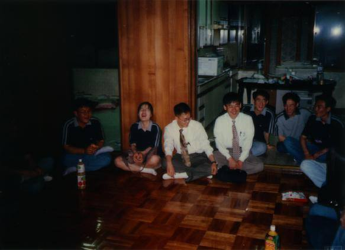
**이미지 캡션:** 어두운 실내에서 여러 명의 젊은 성인 남성과 한 명의 젊은 성인 여성이 바닥에 앉아 있다. 왼쪽에서부터 첫 번째 남성은 검은색 상의와 파란색 하의를 입고 있으며, 무릎을 꿇고 앉아 있다. 그 옆에는 젊은 여성으로 보이는 사람이 검은색 상의와 무늬가 있는 하의를 입고 활짝 웃으며 앉아 있다. 세 번째 사람은 흰색 셔츠에 넥타이를 매고 회색 바지를 입고 있으며, 안경을 쓰고 있다. 네 번째 사람은 흰색 셔츠에 체크무늬 넥타이를 매고 회색 바지를 입고 환하게 웃고 있다. 다섯 번째 사람은 검은색 상의에 파란색 하의를 입고 앉아 있고, 여섯 번째 사람은 회색 상의에 파란색 하의를 입고 있다. 마지막으로 가장 오른쪽에 있는 사람은 검은색 상의와 파란색 하의를 입고 있다. 배경에는 나무 문과 주방으로 보이는 공간이 있으며, 테이블 위에는 여러 물건들이 놓여 있다. 바닥은 나무 재질로 되어 있으며, 일부에는 음료수 병과 과자 봉지가 보인다. 전반적으로 편안하고 즐거운 분위기이다.를 입고 앉아 있고, 여섯 번째 사람은 회색 상의에 파란색 하의를 입고 있다. 마지막으로 가장 오른쪽에 있는 사람은 검은색 상의와 파란색 하의를 입고 있다. 배경에는 나무 문과 주방으로 보이는 공간이 있으며, 테이블 위에는 여러 물건들이 놓여 있다. 바닥은 나무 재질로 되어 있으며, 일부에는 음료수 병과 과자 봉지가 보인다. 전반적으로 편안하고 즐거운 분위기이다.
 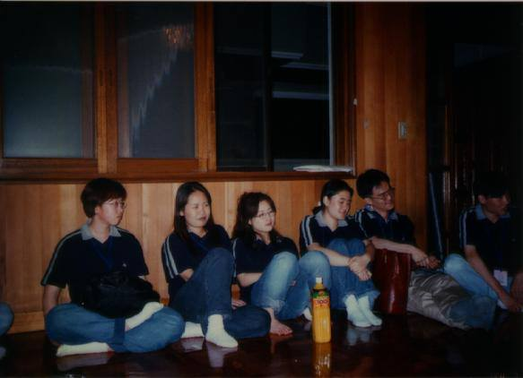
**이미지 캡션:** 다섯 명의 젊은 성인들이 나무 벽으로 둘러싸인 방에 앉아 있다. 왼쪽에서부터, 안경을 쓴 젊은 여성은 파란색 줄무늬가 있는 네이비색 폴로 셔츠와 청바지를 입고 있으며, 무릎 위에 검은색 가방을 올려놓고 있다. 그녀 옆에는 긴 검은 머리를 가진 젊은 여성이 같은 복장을 하고 있으며, 팔짱을 끼고 있다. 세 번째 젊은 여성은 안경을 쓰고 있으며, 파란색 줄무늬가 있는 네이비색 폴로 셔츠와 청바지를 입고 있다. 그녀 옆에는 파란색 줄무늬가 있는 네이비색 폴로 셔츠와 청바지를 입은 젊은 여성이 앉아 있으며, 그녀 앞에는 주황색 음료수 병이 놓여 있다. 마지막으로, 안경을 쓴 젊은 남성이 파란색 줄무늬가 있는 네이비색 폴로 셔츠와 청바지를 입고 있으며, 그의 옆에는 붉은색 가방이 놓여 있다. 그들 뒤에는 나무 벽과 창문이 보인다. 전반적으로 차분하고 편안한 분위기이다.에는 주황색 음료수 병이 놓여 있다. 마지막으로, 안경을 쓴 젊은 남성이 파란색 줄무늬가 있는 네이비색 폴로 셔츠와 청바지를 입고 있으며, 그의 옆에는 붉은색 가방이 놓여 있다. 그들 뒤에는 나무 벽과 창문이 보인다. 전반적으로 차분하고 편안한 분위기이다.
 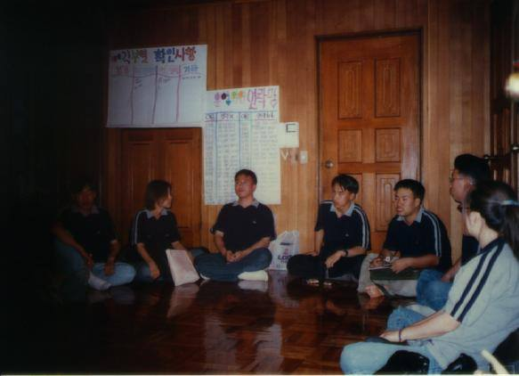
**이미지 캡션:** 이 사진은 나무 벽과 바닥으로 이루어진 실내에서 여러 명의 사람들이 모여 앉아 있는 모습을 담고 있습니다. 왼쪽부터 성인 남성 한 명은 검은색 상의와 청바지를 입고 앉아 있으며, 그 옆에는 성인 여성 한 명이 검은색 상의와 청바지를 입고 서류로 보이는 것을 들고 있습니다. 그 옆에는 성인 남성 두 명이 나란히 앉아 있으며, 모두 검은색 상의에 줄무늬가 있는 디자인의 옷을 입고 있습니다. 이들 중 한 명은 무릎 위에 책을 올려놓고 있으며, 다른 한 명은 정면을 응시하고 있습니다. 오른쪽에는 성인 남성 한 명이 안경을 쓰고 있으며, 그 옆에는 성인 여성 한 명이 회색 상의를 입고 머리를 묶은 채 앉아 있습니다. 배경에는 나무 문과 두 개의 게시판이 걸려 있는데, 하나에는 "각부 확인사항"이라는 글씨와 함께 표가 그려져 있고, 다른 하나에는 "연락망"이라는 글씨와 함께 표가 그려져 있습니다. 전체적으로 차분하고 진지한 분위기이며, 사람들이 무언가에 대해 논의하거나 교육을 받고 있는 듯한 상황으로 보입니다.안경을 쓰고 있으며, 그 옆에는 성인 여성 한 명이 회색 상의를 입고 머리를 묶은 채 앉아 있습니다. 배경에는 나무 문과 두 개의 게시판이 걸려 있는데, 하나에는 "각부 확인사항"이라는 글씨와 함께 표가 그려져 있고, 다른 하나에는 "연락망"이라는 글씨와 함께 표가 그려져 있습니다. 전체적으로 차분하고 진지한 분위기이며, 사람들이 무언가에 대해 논의하거나 교육을 받고 있는 듯한 상황으로 보입니다.
 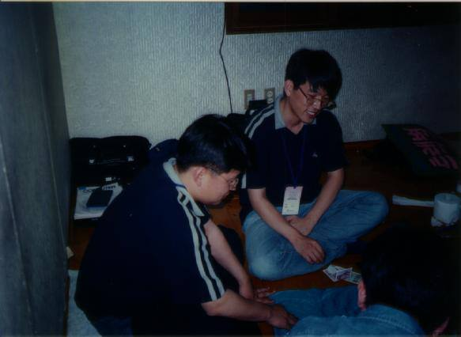
**이미지 캡션:** 사진에는 세 명의 성인 남성이 방바닥에 앉아 있는 모습이 담겨 있습니다. 왼쪽 남성은 40대 정도로 보이며, 검은색 상의에 흰색 줄무늬가 있고 안경을 착용하고 있습니다. 그는 무릎을 꿇고 앉아 무언가를 만지고 있으며, 표정은 집중하고 있는 듯 보입니다. 가운데 남성은 30대 후반에서 40대 초반으로 추정되며, 남색 카라 티셔츠에 파란색 청바지를 입고 있습니다. 목에는 흰색 이름표가 달린 보라색 목걸이를 하고 있으며, 안경을 쓰고 환하게 웃고 있습니다. 그는 다리를 꼬고 앉아 있으며, 손은 무릎 위에 올려져 있습니다. 오른쪽 남성은 얼굴이 흐릿하게 나와 정확한 나이와 외모를 파악하기 어렵지만, 파란색 하의를 입고 앉아 있는 것으로 보입니다. 배경에는 벽지가 보이며, 왼쪽에는 검은색 가방과 서류가 놓여 있고, 오른쪽에는 녹색 천에 흰색 글씨가 쓰인 물건과 흰색 컵이 보입니다. 전체적으로 편안하고 비공식적인 분위기이며, 세 남성이 무언가에 대해 이야기하거나 함께 시간을 보내고 있는 것으로 보입니다.습니다. 오른쪽 남성은 얼굴이 흐릿하게 나와 정확한 나이와 외모를 파악하기 어렵지만, 파란색 하의를 입고 앉아 있는 것으로 보입니다. 배경에는 벽지가 보이며, 왼쪽에는 검은색 가방과 서류가 놓여 있고, 오른쪽에는 녹색 천에 흰색 글씨가 쓰인 물건과 흰색 컵이 보입니다. 전체적으로 편안하고 비공식적인 분위기이며, 세 남성이 무언가에 대해 이야기하거나 함께 시간을 보내고 있는 것으로 보입니다.
 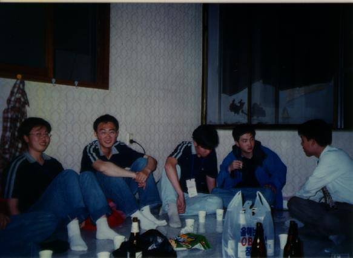
**이미지 캡션:** 다섯 명의 젊은 성인 남성이 방바닥에 앉아 술을 마시고 있다. 왼쪽에서부터 첫 번째 남성은 검은색 상의와 청바지를 입고 안경을 쓰고 있으며, 미소를 짓고 있다. 두 번째 남성은 남색 상의와 청바지를 입고 있으며, 밝게 웃고 있다. 세 번째와 네 번째 남성은 남색 상의와 청바지를 입고 있으며, 대화를 나누고 있다. 다섯 번째 남성은 흰색 셔츠와 넥타이를 착용하고 있으며, 다른 남성과 대화를 나누고 있다. 배경에는 벽지가 있고, 창문에는 커튼이 쳐져 있으며, 바닥에는 술병, 컵, 비닐봉투 등이 놓여 있다. 비닐봉투에는 "올해는 OB"라는 글자가 보인다. 전반적으로 편안하고 즐거운 분위기이다.투에는 "올해는 OB"라는 글자가 보인다. 전반적으로 편안하고 즐거운 분위기이다.
 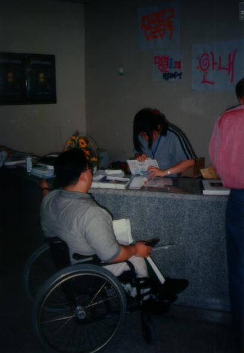
**이미지 캡션:** 실내에서 한 성인 남성이 휠체어에 앉아 서류를 들고 있으며, 그의 앞에는 회색 대리석으로 된 카운터가 있다. 카운터 뒤에는 한 젊은 여성이 서류를 정리하고 있으며, 그녀의 뒤 벽에는 한국어로 쓰인 여러 개의 포스터가 붙어 있다. 포스터 중 하나에는 "안내"라고 쓰여 있고, 다른 포스터에는 붉은색 글씨로 무언가 적혀 있다. 카운터 위에는 서류, 펜, 그리고 꽃이 담긴 화병이 놓여 있다. 사진의 오른쪽에는 분홍색 상의를 입은 다른 사람의 모습도 일부 보인다. 전반적으로 행사장이나 사무실의 안내 데스크 풍경으로 보이며, 다소 어두운 조명 아래에서 촬영되었다.이며, 다소 어두운 조명 아래에서 촬영되었다.
 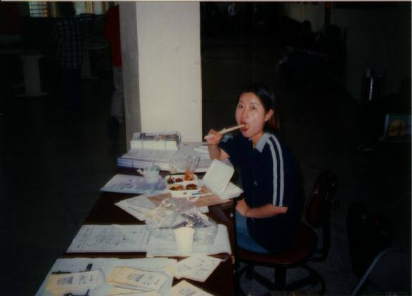
**이미지 캡션:** 한 명의 젊은 아시아 여성으로 보이는 사람이 테이블에 앉아 나무 젓가락으로 음식을 먹고 있습니다. 그녀는 어두운 색상의 상의를 입고 있으며, 상의에는 두 개의 흰색 줄무늬가 있습니다. 그녀의 표정은 약간 놀란 듯 보이며, 입에는 음식이 들어 있습니다. 테이블 위에는 서류, 음식 용기, 컵 등이 놓여 있습니다. 배경은 어둡고 흐릿하며, 사무실이나 작업 공간으로 추정됩니다. 테이블에는 여러 장의 서류가 펼쳐져 있고, 일부는 흩어져 있습니다. 음식 용기 안에는 여러 개의 음식이 담겨 있으며, 젓가락으로 집고 있는 음식은 작고 둥근 형태입니다. 전체적으로 편안하고 일상적인 분위기이며, 여성이 식사를 하며 잠시 휴식을 취하는 듯한 모습입니다.음식은 작고 둥근 형태입니다. 전체적으로 편안하고 일상적인 분위기이며, 여성이 식사를 하며 잠시 휴식을 취하는 듯한 모습입니다.
 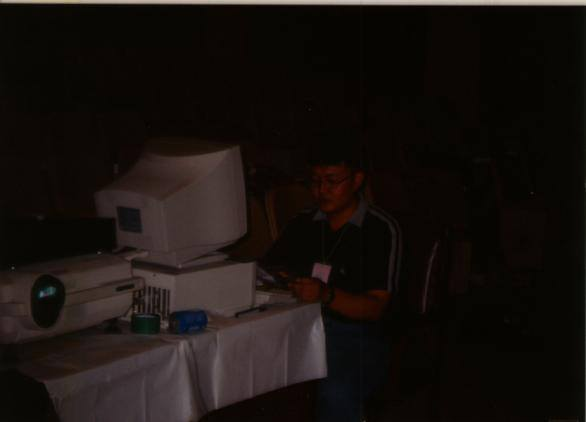
**이미지 캡션:** 어두운 실내에서 한 성인 남성이 테이블 앞에 서 있다. 남성은 30대에서 40대로 보이며, 검은색 상의에 줄무늬가 있고, 안경을 착용하고 있다. 그는 명찰을 달고 있으며, 손에는 무언가를 들고 있다. 테이블 위에는 구형 컴퓨터 모니터, 프로젝터, 그리고 몇 가지 작은 물건들이 놓여 있다. 테이블은 흰색 천으로 덮여 있으며, 전반적으로 어두운 조명과 함께 행사장이나 회의실의 분위기를 자아낸다.
 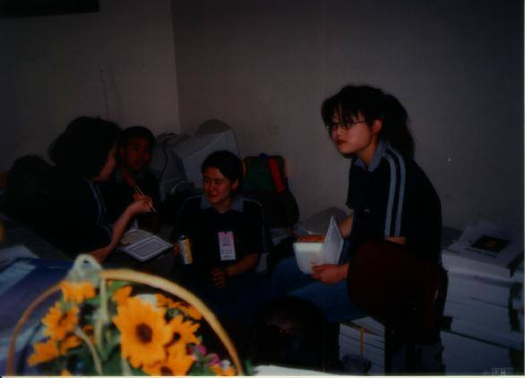
**이미지 캡션:** 어두운 실내에서 네 명의 젊은 성인들이 모여 앉아 있다. 왼쪽에는 검은색 상의를 입은 젊은 여성이 젓가락으로 음식을 집고 있고, 그 옆에는 검은색 상의를 입은 젊은 남성이 앉아 있다. 가운데에는 검은색 상의에 핑크색 명찰을 단 젊은 여성이 캔 음료를 들고 있고, 오른쪽에는 검은색 상의에 파란색 줄무늬가 있는 젊은 여성이 안경을 쓰고 흰색 용기를 들고 있다. 배경에는 컴퓨터 모니터, 가방, 쌓여 있는 책들과 서류들이 보인다. 전반적으로 편안하고 캐주얼한 분위기이며, 무언가를 함께 먹거나 이야기하는 듯한 모습이다..
 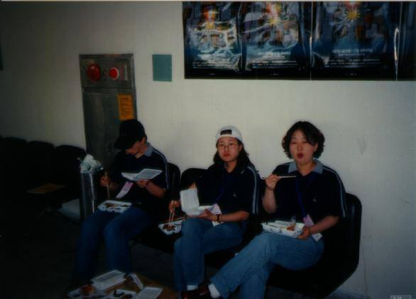
**이미지 캡션:** 세 명의 젊은 사람들이 검은색 의자에 앉아 간식을 먹고 있습니다. 왼쪽에는 검은색 야구 모자를 쓴 성인 남성이 파란색 셔츠와 청바지를 입고 책을 읽고 있습니다. 가운데에는 흰색 야구 모자와 안경을 쓴 젊은 여성이 파란색 셔츠와 청바지를 입고 있습니다. 오른쪽에는 짧은 머리의 젊은 여성이 파란색 셔츠와 청바지를 입고 젓가락으로 음식을 먹고 있습니다. 배경에는 영화 포스터 두 장이 걸려 있고, 벽에는 소화전과 파란색 사각형이 보입니다. 전체적으로 편안하고 캐주얼한 분위기입니다.
 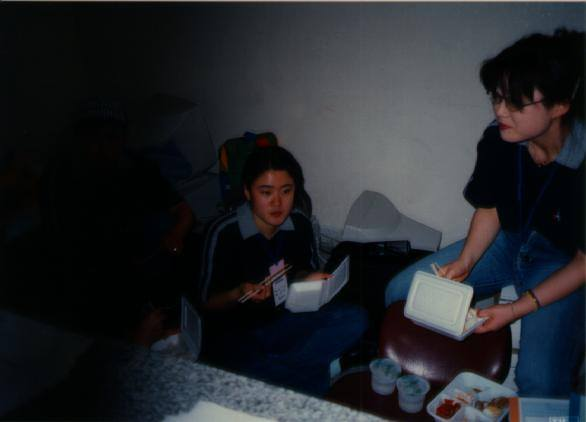
**이미지 캡션:** 어두운 실내에서 두 명의 젊은 여성이 앉아 식사를 하고 있다. 왼쪽의 여성은 20대 초반으로 보이며, 검은색 상의와 파란색 하의를 입고 있다. 그녀는 젓가락으로 도시락을 먹고 있으며, 표정은 무표정하다. 오른쪽의 여성은 20대 중반으로 보이며, 검은색 상의와 청바지를 입고 있다. 그녀는 흰색 도시락을 들고 있으며, 안경을 쓰고 있다. 배경에는 컴퓨터 모니터와 의자, 그리고 몇 개의 컵이 보인다. 전체적으로 어둡고 조용한 분위기이다.
 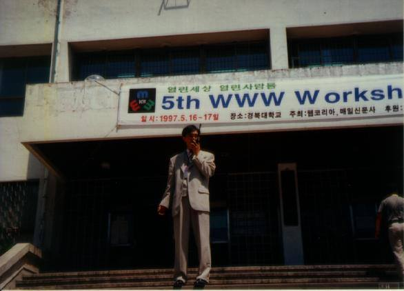
**이미지 캡션:** 한 성인 남성이 회색 정장을 입고 계단 위에 서서 휴대폰으로 통화하고 있으며, 그의 뒤로는 "열린세상 열린사람들 5th WWW Workshop"이라고 적힌 현수막이 걸려 있고, 현수막에는 행사 날짜(1997년 5월 16-17일), 장소(경북대학교), 주최(웹코리아, 매일신문사) 등의 정보가 기재되어 있어, 1997년에 경북대학교에서 열린 제5회 WWW 워크숍 행사임을 알 수 있다. 건물은 오래된 듯 보이며, 전체적으로 행사가 진행되는 듯한 분위기이다.
 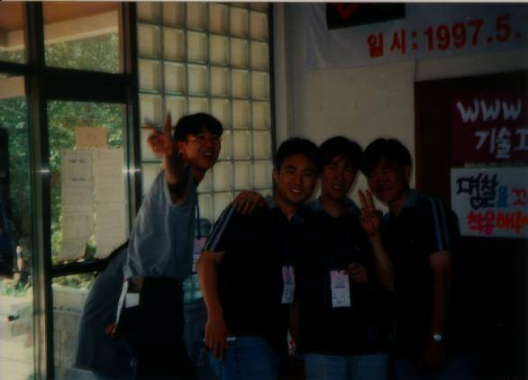
**이미지 캡션:** 사진에는 네 명의 젊은 성인 남성이 등장하며, 모두 밝고 활기찬 표정으로 카메라를 응시하고 있다. 왼쪽 첫 번째 남성은 회색 반팔 티셔츠를 입고 안경을 썼으며, 오른손 검지와 중지를 펴서 브이(V) 모양을 만들고 있다. 그의 얼굴에는 웃음기가 가득하다. 그 옆의 세 남성은 검은색 계열의 옷을 입고 있으며, 가운데 남성은 다른 남성의 어깨에 팔을 올리고 있다. 오른쪽 끝 남성도 브이(V) 모양을 하고 있다. 모두 목에 이름표나 출입증으로 보이는 것을 걸고 있다. 배경에는 격자무늬 유리창과 함께 "일시: 1997.5."라고 적힌 흰색 현수막이 걸려 있고, 그 옆에는 "WWW 기술"이라고 쓰인 붉은색 간판과 "명찰을 착용해주"라는 글씨가 보인다. 전체적으로 젊은이들의 모임이나 행사에서 찍은 듯한 즐겁고 캐주얼한 분위기이다..5."라고 적힌 흰색 현수막이 걸려 있고, 그 옆에는 "WWW 기술"이라고 쓰인 붉은색 간판과 "명찰을 착용해주"라는 글씨가 보인다. 전체적으로 젊은이들의 모임이나 행사에서 찍은 듯한 즐겁고 캐주얼한 분위기이다.
 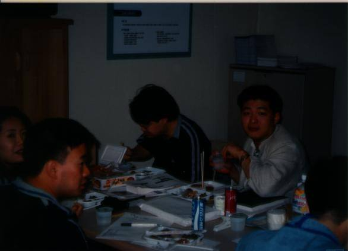
**이미지 캡션:** 이 사진은 사무실이나 회의실로 보이는 장소에서 여러 사람이 함께 식사하며 담소를 나누는 모습을 담고 있습니다. 사진 중앙에는 성인 남성 두 명이 앉아 있으며, 왼쪽에는 성인 여성 한 명이 보입니다. 식탁 위에는 도시락, 음료수 캔, 물컵, 서류 등이 놓여 있어 식사 중이거나 회의를 하고 있는 상황으로 추정됩니다. 벽에는 한국어로 된 게시물이 걸려 있으며, 전체적으로 어두운 조명 아래에서 사람들이 편안한 분위기 속에서 시간을 보내고 있습니다.
 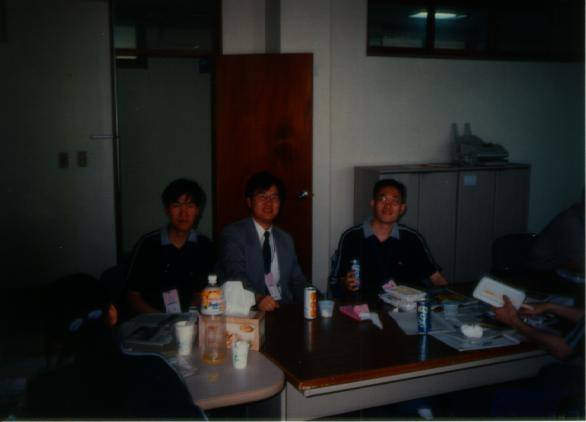
**이미지 캡션:** 세 명의 성인 남성이 테이블에 앉아 있다. 왼쪽 남성은 20대 후반에서 30대 초반으로 보이며 검은색 상의를 입고 있다. 가운데 남성은 40대 초반으로 보이며 회색 재킷과 넥타이를 착용하고 있다. 오른쪽 남성은 30대 후반에서 40대 초반으로 보이며 검은색 상의를 입고 있다. 세 사람 모두 카메라를 향해 미소를 짓고 있으며, 테이블 위에는 음료수 병, 컵, 간식 등이 놓여 있다. 배경에는 사무실 책상과 캐비닛이 보이며, 전체적으로 편안하고 캐주얼한 분위기이다.
 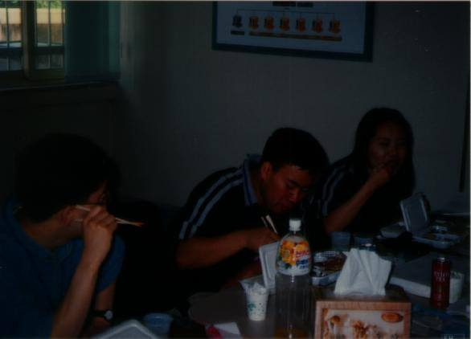
**이미지 캡션:** 어두운 실내에서 세 명의 성인이 테이블에 앉아 식사하고 있으며, 왼쪽에는 파란색 상의를 입은 성인 남성이 젓가락으로 음식을 집고 있고, 가운데에는 검은색 줄무늬 상의를 입은 성인 남성이 음식을 먹고 있으며, 오른쪽에는 검은색 상의를 입은 성인 여성이 젓가락으로 음식을 먹고 있습니다. 테이블 위에는 음식이 담긴 용기, 음료수 병, 휴지곽, 캔 음료 등이 놓여 있습니다. 배경에는 창문과 벽에 걸린 액자가 보이며, 전체적으로 편안하고 일상적인 분위기입니다.
 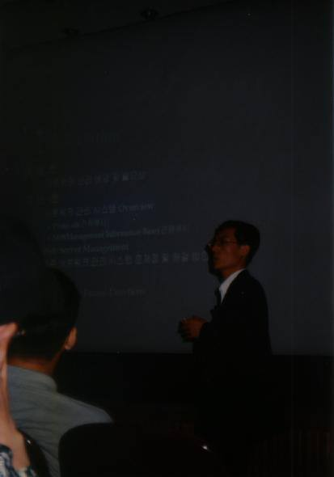
**이미지 캡션:** 어두운 배경의 강연장에서 안경을 쓴 중년 남성이 검은색 정장을 입고 서서 강연하고 있다. 그는 오른손을 앞으로 내밀고 왼손은 배 앞에 모은 채로, 청중을 바라보며 차분한 표정으로 이야기하고 있다. 배경에는 흰색 글씨로 된 텍스트가 일부 보이며, "Secret Management"라는 문구가 희미하게 읽힌다. 강연장으로 보이는 장소는 어둡고 차분한 분위기이며, 앞쪽에는 청중으로 보이는 사람들의 머리 일부가 보인다.
 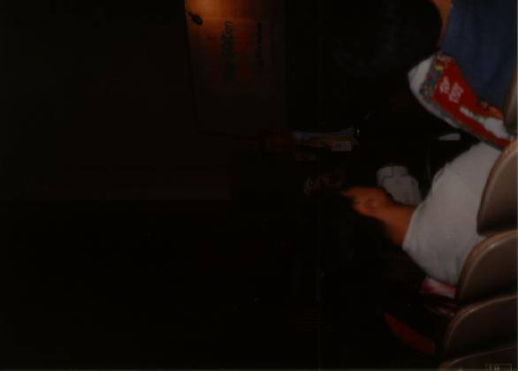
**이미지 캡션:** 어두운 실내에서 한 성인 남성이 흰색 상의를 입고 갈색 좌석에 앉아 있으며, 손가락으로 무언가를 가리키고 있다. 그의 옆에는 다른 사람이 파란색 상의와 빨간색, 흰색이 섞인 옷을 입고 있으며, 배경에는 희미하게 글자가 적힌 현수막이 걸려 있다. 전체적으로 어둡고 흐릿한 사진으로, 실내 행사나 모임의 일부 장면으로 추정된다.
 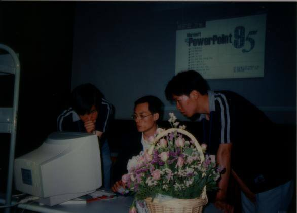
**이미지 캡션:** 어두운 실내에서 세 명의 성인 남성이 컴퓨터 모니터를 함께 바라보고 있다. 왼쪽의 남성은 검은색 상의에 줄무늬가 있고, 턱에 손을 댄 채 모니터를 집중해서 보고 있다. 가운데 남성은 흰색 셔츠에 검은색 재킷을 입고 안경을 쓴 모습으로, 모니터를 바라보며 무언가 설명하는 듯한 표정이다. 오른쪽 남성은 검은색 상의에 줄무늬가 있고, 모니터를 향해 몸을 기울이며 진지한 표정으로 화면을 보고 있다. 이들 앞에는 꽃바구니가 놓여 있으며, 배경에는 "Microsoft PowerPoint 95"라고 적힌 포스터가 걸려 있어 당시의 컴퓨터 관련 행사나 발표회 장면임을 짐작하게 한다. 전반적으로 진지하고 집중하는 분위기이다.어 당시의 컴퓨터 관련 행사나 발표회 장면임을 짐작하게 한다. 전반적으로 진지하고 집중하는 분위기이다.
 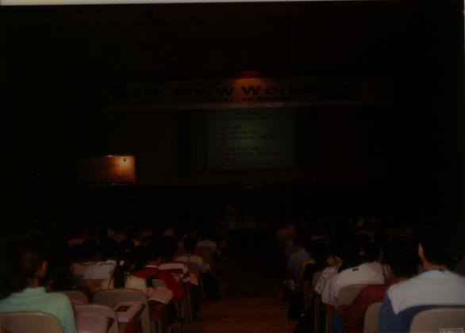
**이미지 캡션:** 어두운 강당에서 성인 남녀 여러 명이 앞쪽의 스크린을 바라보며 앉아 있다. 스크린에는 "9TH WWW WORKSHOP"이라는 글자와 함께 발표 내용으로 보이는 텍스트가 희미하게 보인다. 강당은 조명이 어두워 좌석에 앉은 사람들의 얼굴 표정이나 복장을 자세히 파악하기 어렵지만, 대부분 차분한 모습으로 발표를 경청하고 있는 것으로 보인다. 좌석은 여러 줄로 배치되어 있으며, 일부 좌석에는 겉옷이나 가방이 놓여 있다. 스크린 위쪽에는 "9TH WWW WORKSHOP"이라고 적힌 현수막이 걸려 있고, 그 위로 조명이 비추고 있다. 전체적으로 차분하고 진지한 분위기 속에서 강연이나 발표가 진행되고 있는 상황으로 추정된다. 비추고 있다. 전체적으로 차분하고 진지한 분위기 속에서 강연이나 발표가 진행되고 있는 상황으로 추정된다.
 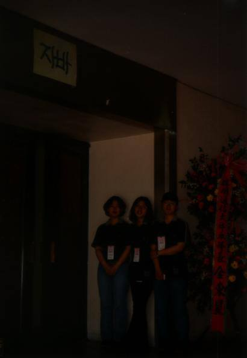
**이미지 캡션:** 어두운 실내에서 세 명의 젊은 성인들이 문 앞에 서 있다. 왼쪽부터 첫 번째와 두 번째 사람은 여성으로 보이며, 세 번째 사람은 남성으로 추정된다. 모두 검은색 상의와 청바지를 입고 있으며, 상의에는 흰색 명찰이 달려 있다. 세 사람 모두 정면을 바라보고 있으며, 표정은 약간 어둡지만 편안해 보인다. 배경에는 '자바'라고 쓰인 노란색 간판이 걸려 있고, 오른쪽에는 붉은색 리본이 달린 화환이 보인다. 전체적으로 행사가 진행 중이거나 끝난 직후의 분위기이며, 사진은 다소 어둡게 촬영되었다.
 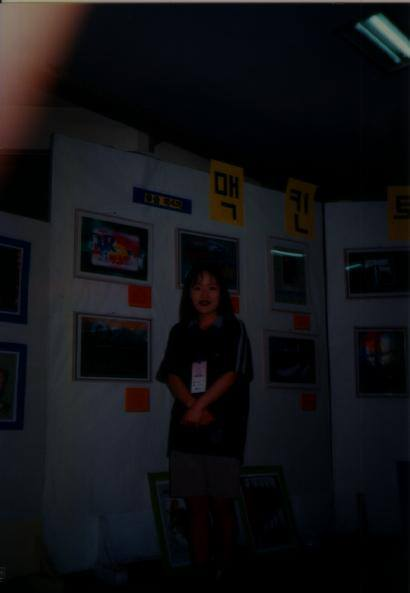
**이미지 캡션:** 한 젊은 여성이 그림 전시회로 보이는 장소에서 포즈를 취하고 있습니다. 그녀는 십대 후반에서 20대 초반으로 보이며, 검은색 줄무늬가 있는 어두운 색상의 셔츠와 회색 반바지를 입고 있습니다. 셔츠에는 분홍색과 흰색이 섞인 이름표가 달려 있습니다. 그녀는 팔짱을 끼고 카메라를 응시하고 있으며, 표정은 약간 수줍어 보입니다. 배경에는 여러 개의 액자에 담긴 그림들이 벽에 걸려 있으며, 일부 그림은 어두운 풍경이나 추상적인 이미지를 담고 있습니다. 벽에는 "매", "킨", "트"라고 쓰인 노란색 현수막과 파란색 바탕에 흰색 글씨로 된 표지판이 보입니다. 전체적으로 조명이 어두운 실내 전시 공간의 분위기입니다.탕에 흰색 글씨로 된 표지판이 보입니다. 전체적으로 조명이 어두운 실내 전시 공간의 분위기입니다.
 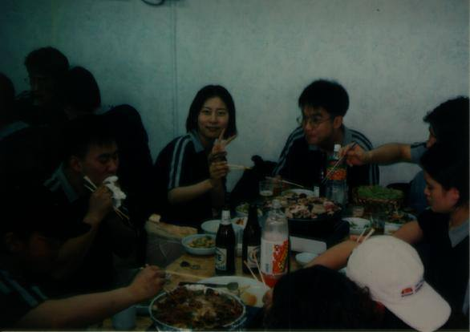
**이미지 캡션:** 이 사진은 여러 명의 사람들이 둘러앉아 식사를 하고 있는 실내 장면을 담고 있습니다. 사진 중앙에는 젊은 여성으로 보이는 사람이 밝게 웃으며 손가락으로 브이(V) 모양을 하고 있습니다. 그녀는 어두운 색상의 상의를 입고 있으며, 머리카락은 어깨까지 내려옵니다. 그녀의 오른쪽에는 안경을 쓴 성인 남성이 앉아 있으며, 역시 어두운 색상의 상의를 입고 있습니다. 그는 무언가를 바라보고 있으며, 표정은 약간 무표정해 보입니다. 사진 왼쪽에는 성인 남성이 젓가락으로 음식을 집어 먹고 있으며, 그의 얼굴은 약간 어두워 잘 보이지 않습니다. 그의 앞에는 음식이 담긴 접시와 냅킨이 놓여 있습니다. 테이블 위에는 여러 가지 음식 접시, 병음료, 술병 등이 놓여 있어 식사 중임을 알 수 있습니다. 배경은 실내의 벽으로 보이며, 조명이 어두워 전체적으로 차분하고 약간 어두운 분위기를 자아냅니다. 사진 하단에는 흰색 모자를 쓴 사람의 머리가 일부 보입니다. 전반적으로 편안하고 즐거운 식사 자리의 모습으로 보입니다.잘 보이지 않습니다. 그의 앞에는 음식이 담긴 접시와 냅킨이 놓여 있습니다. 테이블 위에는 여러 가지 음식 접시, 병음료, 술병 등이 놓여 있어 식사 중임을 알 수 있습니다. 배경은 실내의 벽으로 보이며, 조명이 어두워 전체적으로 차분하고 약간 어두운 분위기를 자아냅니다. 사진 하단에는 흰색 모자를 쓴 사람의 머리가 일부 보입니다. 전반적으로 편안하고 즐거운 식사 자리의 모습으로 보입니다.
 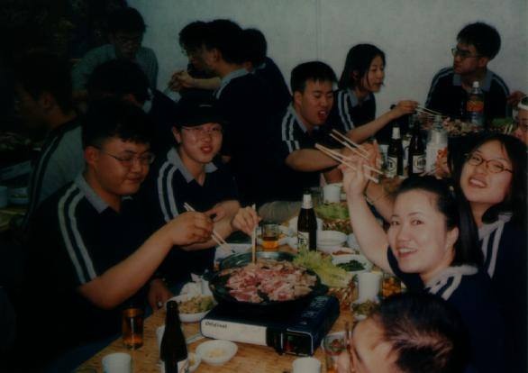
**이미지 캡션:** 이 사진은 여러 명의 사람들이 둘러앉아 식사를 하고 있는 실내 장면을 담고 있으며, 테이블 위에는 휴대용 가스레인지와 불판이 놓여 있고 그 위에는 고기가 구워지고 있으며, 다양한 반찬과 술병들이 보인다. 사진 중앙에는 안경을 쓴 성인 남성이 젓가락으로 고기를 집고 있고, 그의 옆에는 검은색 모자를 쓴 성인 여성이 젓가락을 들고 카메라를 바라보고 있다. 그 뒤로는 여러 명의 성인 남녀들이 식사를 하거나 대화를 나누는 모습이 보인다. 전반적으로 편안하고 즐거운 분위기 속에서 식사를 즐기는 모습이다.
 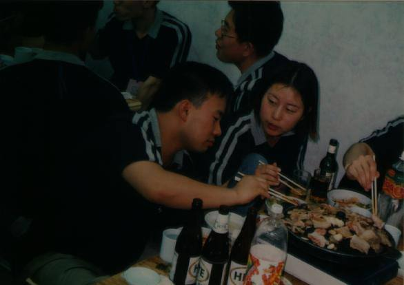
**이미지 캡션:** 이 사진은 실내에서 여러 명이 둘러앉아 식사하는 모습을 담고 있으며, 주로 성인 남성과 성인 여성으로 보이는 사람들이 보인다. 중앙에 있는 성인 남성은 30대 초중반으로 추정되며, 검은색 상의에 줄무늬가 있는 복장을 하고 있다. 그는 젓가락으로 음식을 집고 있으며, 표정은 음식에 집중하고 있는 듯하다. 그의 옆에는 성인 여성이 앉아 있으며, 역시 30대 초중반으로 보이고 비슷한 복장을 하고 있다. 그녀도 젓가락으로 음식을 집고 있으며, 대화를 나누는 듯한 표정이다. 배경에는 다른 사람들이 더 보이지만, 얼굴이 명확하게 보이지는 않는다. 테이블 위에는 고기가 구워지고 있는 불판과 여러 병의 술병, 컵 등이 놓여 있다. 술병에는 "HE"와 "HI"라는 글자가 희미하게 보인다. 전반적으로 편안하고 즐거운 분위기에서 식사를 하고 있는 것으로 보인다. 명확하게 보이지는 않는다. 테이블 위에는 고기가 구워지고 있는 불판과 여러 병의 술병, 컵 등이 놓여 있다. 술병에는 "HE"와 "HI"라는 글자가 희미하게 보인다. 전반적으로 편안하고 즐거운 분위기에서 식사를 하고 있는 것으로 보인다.
 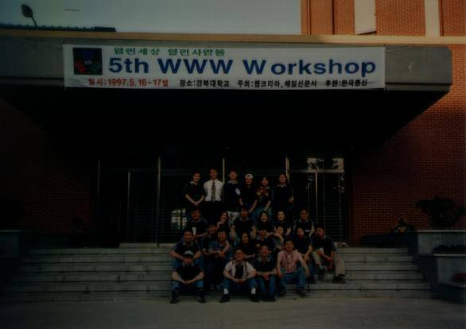
**이미지 캡션:** 건물 앞에 계단식으로 앉거나 서 있는 약 20여 명의 성인 남녀 그룹 사진으로, 대부분 20대에서 30대로 보이는 젊은 사람들이다. 상의는 티셔츠, 셔츠, 재킷 등 다양하게 입고 있으며, 하의는 청바지나 면바지를 입고 있다. 대부분 밝고 편안한 표정을 짓고 있으며, 일부는 카메라를 향해 미소를 짓고 있다. 건물 위에는 "열린세상 열린사람들 5th WWW Workshop"이라고 적힌 현수막이 걸려 있으며, 그 아래에는 행사 일시(1997년 5월 16-17일), 장소(경북대학교), 주최(캠코리아, 제일신문사), 후원(한국특산) 정보가 한국어로 기재되어 있다. 배경에는 붉은 벽돌 건물과 유리문이 보인다. 전체적으로 워크숍이나 행사 후 단체 기념사진을 찍은 듯한 화기애애한 분위기이다.후원(한국특산) 정보가 한국어로 기재되어 있다. 배경에는 붉은 벽돌 건물과 유리문이 보인다. 전체적으로 워크숍이나 행사 후 단체 기념사진을 찍은 듯한 화기애애한 분위기이다.
 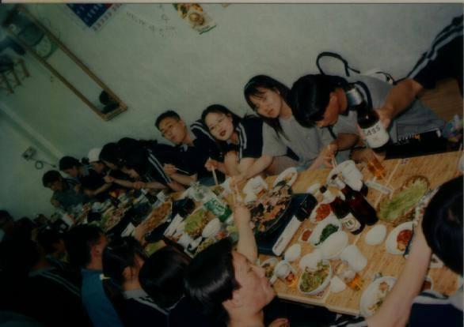
**이미지 캡션:** 이 사진은 여러 명의 젊은 성인 남녀가 둘러앉아 식사를 하고 있는 모습을 담고 있으며, 테이블 위에는 다양한 음식과 술병이 놓여 있습니다. 사진 중앙에는 안경을 쓴 성인 남성이 젓가락으로 음식을 집고 있고, 그의 옆에는 안경을 쓴 성인 여성이 젓가락을 들고 있습니다. 또 다른 성인 여성은 머리를 뒤로 넘기고 있으며, 한 성인 남성은 맥주병을 들고 있습니다. 배경에는 벽에 걸린 거울과 액자, 그리고 여러 장의 사진이나 포스터가 보입니다. 전반적으로 편안하고 즐거운 분위기 속에서 식사를 즐기는 모습입니다.
 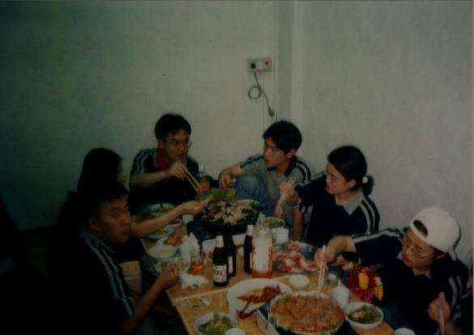
**이미지 캡션:** 여섯 명의 성인 남녀가 테이블에 둘러앉아 식사를 하고 있으며, 테이블 위에는 다양한 음식과 음료가 놓여 있습니다. 왼쪽에서부터 첫 번째 성인 남성은 검은색 줄무늬가 있는 상의를 입고 있으며, 젓가락으로 음식을 집어 먹고 있습니다. 그 옆에는 머리를 뒤로 묶은 성인 여성이 앉아 있으며, 그녀의 얼굴은 잘 보이지 않습니다. 그 뒤로는 안경을 쓴 성인 남성이 검은색 상의를 입고 젓가락으로 음식을 먹고 있습니다. 그의 옆에는 회색 상의를 입은 성인 남성이 앉아 있으며, 젓가락으로 음식을 집고 있습니다. 그 옆에는 머리를 묶은 성인 여성이 검은색 상의를 입고 젓가락으로 음식을 먹고 있습니다. 가장 오른쪽에는 흰색 모자를 쓴 성인 남성이 검은색 상의를 입고 젓가락으로 음식을 먹고 있으며, 그의 얼굴에는 안경을 쓰고 있습니다. 테이블 위에는 불판, 밥, 김치, 고기, 채소 등 다양한 음식이 담긴 접시들과 맥주병, 소주병, 물병 등이 놓여 있습니다. 배경은 흰색 벽으로 되어 있으며, 벽에는 콘센트와 전선이 보입니다. 전체적으로 편안하고 즐거운 식사 분위기입니다.리를 묶은 성인 여성이 검은색 상의를 입고 젓가락으로 음식을 먹고 있습니다. 가장 오른쪽에는 흰색 모자를 쓴 성인 남성이 검은색 상의를 입고 젓가락으로 음식을 먹고 있으며, 그의 얼굴에는 안경을 쓰고 있습니다. 테이블 위에는 불판, 밥, 김치, 고기, 채소 등 다양한 음식이 담긴 접시들과 맥주병, 소주병, 물병 등이 놓여 있습니다. 배경은 흰색 벽으로 되어 있으며, 벽에는 콘센트와 전선이 보입니다. 전체적으로 편안하고 즐거운 식사 분위기입니다.
 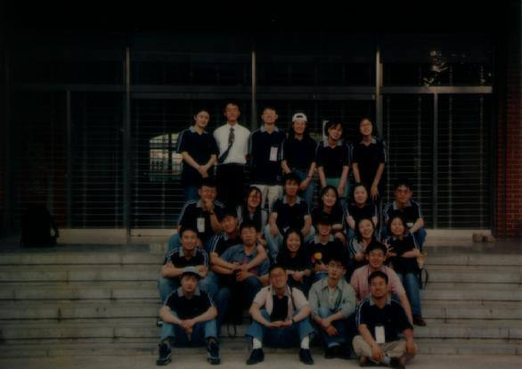
**이미지 캡션:** 이 사진은 30명 정도의 젊은 성인 남녀 그룹이 학교 건물 계단에 모여 찍은 단체 사진으로, 대부분 10대 후반에서 20대 초반으로 보이며, 일부는 30대 초반으로 추정되는 성인 남성도 포함되어 있습니다. 사람들은 캐주얼한 복장을 하고 있으며, 대부분 어두운 색상의 티셔츠나 셔츠를 입고 있으며, 일부는 교복처럼 보이는 검은색 상의에 파란색 줄무늬가 있는 옷을 입고 있습니다. 몇몇 여성들은 밝은 색상의 하의를 입고 있으며, 한 남성은 흰색 셔츠에 넥타이를 매고 있어 다른 사람들과 구분됩니다. 대부분의 사람들은 카메라를 향해 미소를 짓거나 무표정하게 서 있으며, 몇몇은 팔짱을 끼거나 서로에게 기대어 자연스러운 포즈를 취하고 있습니다. 배경에는 현대적인 학교 건물로 보이는 붉은 벽돌 건물과 넓은 유리창이 있는 출입구가 보이며, 계단은 콘크리트 재질로 되어 있습니다. 사진은 낮에 촬영된 것으로 보이며, 전체적으로 밝고 화창한 분위기입니다.카메라를 향해 미소를 짓거나 무표정하게 서 있으며, 몇몇은 팔짱을 끼거나 서로에게 기대어 자연스러운 포즈를 취하고 있습니다. 배경에는 현대적인 학교 건물로 보이는 붉은 벽돌 건물과 넓은 유리창이 있는 출입구가 보이며, 계단은 콘크리트 재질로 되어 있습니다. 사진은 낮에 촬영된 것으로 보이며, 전체적으로 밝고 화창한 분위기입니다.
 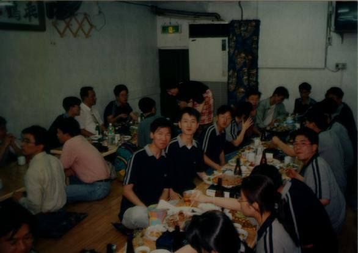
**이미지 캡션:** 이 사진은 여러 명의 성인 남성들이 테이블에 둘러앉아 식사를 하고 있는 실내 장면을 담고 있습니다. 대부분 20대에서 40대로 보이는 남성들은 캐주얼한 복장을 하고 있으며, 일부는 셔츠와 바지를, 다른 일부는 티셔츠를 입고 있습니다. 몇몇은 카메라를 향해 미소를 짓거나 자연스러운 표정을 짓고 있으며, 일부는 음식에 집중하거나 대화에 참여하고 있습니다. 테이블 위에는 다양한 음식과 술병, 음료수 등이 놓여 있어 회식이나 모임 중임을 짐작하게 합니다. 배경에는 흰색 벽과 나무로 된 바닥이 보이며, 벽에는 액자와 장식품, 그리고 에어컨 실외기 같은 기기들이 걸려 있습니다. 전반적으로 편안하고 즐거운 분위기 속에서 사람들이 함께 식사를 즐기는 모습입니다.장식품, 그리고 에어컨 실외기 같은 기기들이 걸려 있습니다. 전반적으로 편안하고 즐거운 분위기 속에서 사람들이 함께 식사를 즐기는 모습입니다.
 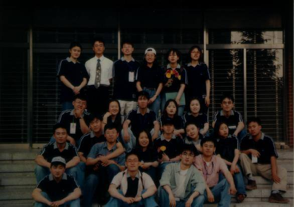
**이미지 캡션:** 이 사진은 20명 이상의 젊은 성인 남녀 그룹이 계단에 앉거나 서서 포즈를 취하고 있는 단체 사진으로, 배경에는 건물 입구가 보입니다. 대부분의 사람들은 20대 초중반으로 보이며, 캐주얼한 복장을 하고 있습니다. 남성들은 주로 어두운 색상의 티셔츠나 셔츠를 입고 있으며, 일부는 흰색 셔츠에 넥타이를 착용하고 있습니다. 여성들은 어두운 색상의 상의와 청바지 또는 바지를 입고 있으며, 일부는 밝은 색상의 옷을 입고 있습니다. 대부분의 사람들은 카메라를 응시하며 미소를 짓거나 차분한 표정을 짓고 있습니다. 사진은 약간 흐릿하고 색감이 바랜 듯한 느낌을 주며, 1990년대 후반 또는 2000년대 초반에 촬영된 것으로 추정됩니다. 전반적으로 밝고 긍정적인 분위기이며, 학교 행사나 동아리 활동의 기념 사진으로 보입니다.약간 흐릿하고 색감이 바랜 듯한 느낌을 주며, 1990년대 후반 또는 2000년대 초반에 촬영된 것으로 추정됩니다. 전반적으로 밝고 긍정적인 분위기이며, 학교 행사나 동아리 활동의 기념 사진으로 보입니다.
 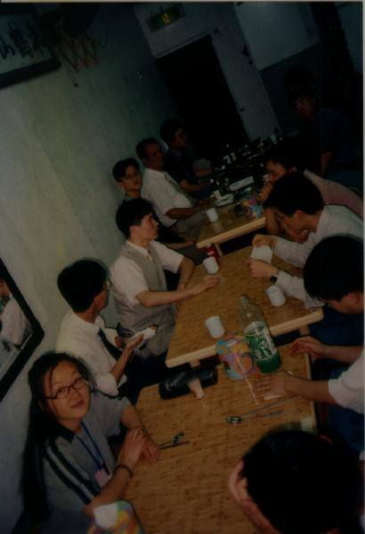
**이미지 캡션:** 이 사진은 여러 명의 사람들이 테이블에 둘러앉아 있는 실내 장면을 담고 있으며, 전반적으로 어두운 조명과 함께 다소 오래된 느낌을 준다. 사진 왼쪽 하단에는 안경을 쓴 젊은 여성(20대 초반 추정)이 카메라를 향해 미소를 짓고 있으며, 회색 줄무늬 티셔츠와 목걸이를 착용하고 있다. 그녀 옆에는 또 다른 젊은 남성(20대 초반 추정)이 흰색 셔츠와 회색 조끼를 입고 테이블에 손을 얹고 있다. 테이블 위에는 흰색 컵 여러 개, 녹색 병에 담긴 음료수, 그리고 몇 가지 물건들이 놓여 있다. 테이블 주변에는 여러 명의 성인 남성들이 앉아 있으며, 일부는 음료를 마시거나 대화를 나누는 듯한 모습이다. 배경에는 어두운 벽과 문, 그리고 벽에 걸린 액자가 보인다. 액자에는 한자로 된 글자가 희미하게 보이며, 액자 위쪽에는 'EXIT'라고 쓰인 녹색 표지판이 보인다. 전체적으로 편안하고 비공식적인 모임의 분위기를 엿볼 수 있다.의 성인 남성들이 앉아 있으며, 일부는 음료를 마시거나 대화를 나누는 듯한 모습이다. 배경에는 어두운 벽과 문, 그리고 벽에 걸린 액자가 보인다. 액자에는 한자로 된 글자가 희미하게 보이며, 액자 위쪽에는 'EXIT'라고 쓰인 녹색 표지판이 보인다. 전체적으로 편안하고 비공식적인 모임의 분위기를 엿볼 수 있다.
 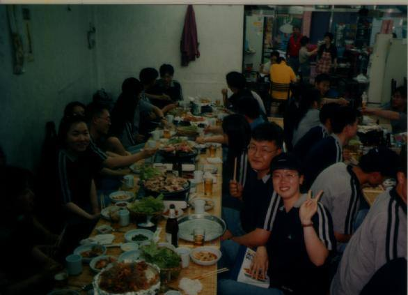
**이미지 캡션:** 이 사진은 여러 명의 사람들이 긴 테이블에 둘러앉아 식사를 하고 있는 모습을 담고 있으며, 전반적으로 편안하고 즐거운 분위기입니다. 테이블 위에는 다양한 종류의 음식이 놓여 있는데, 특히 불판에 구워 먹는 고기와 신선한 채소, 쌈장, 김치 등이 보입니다. 몇몇 사람들은 음식을 집거나 잔을 들고 있으며, 서로 대화를 나누는 듯한 모습입니다. 사진의 전경에는 두 명의 젊은 여성이 앉아 있는데, 한 명은 카메라를 향해 미소를 짓고 있고 다른 한 명은 브이 포즈를 취하고 있습니다. 이들은 검은색 상의를 입고 있으며, 편안한 복장입니다. 배경에는 다른 사람들이 식사를 하거나 대화를 나누고 있으며, 일부는 주방으로 보이는 공간에 서 있습니다. 벽에는 옷이 걸려 있고, 조명은 약간 어두운 편이지만 전체적으로 따뜻한 느낌을 줍니다. 사진은 실내에서 촬영되었으며, 식당이나 가정집의 넓은 공간으로 보입니다. 편안한 복장입니다. 배경에는 다른 사람들이 식사를 하거나 대화를 나누고 있으며, 일부는 주방으로 보이는 공간에 서 있습니다. 벽에는 옷이 걸려 있고, 조명은 약간 어두운 편이지만 전체적으로 따뜻한 느낌을 줍니다. 사진은 실내에서 촬영되었으며, 식당이나 가정집의 넓은 공간으로 보입니다.
 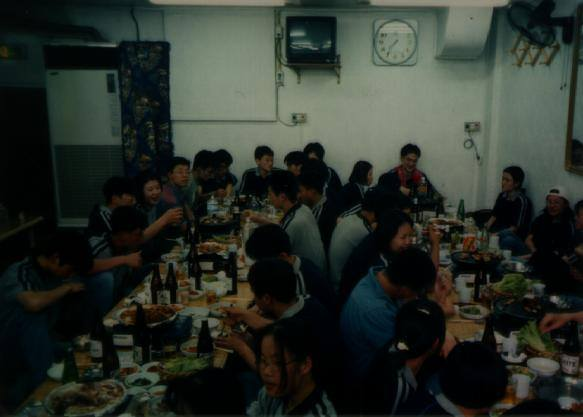
**이미지 캡션:** 이 사진은 여러 명의 사람들이 둘러앉아 식사를 하고 있는 실내 장면을 담고 있으며, 대부분 20대에서 40대로 보이는 성인 남녀로 구성되어 있습니다. 사람들은 테이블을 중심으로 옹기종기 모여 앉아 있으며, 일부는 음식을 집어 먹거나 술병을 들고 대화를 나누는 등 활기찬 분위기를 연출하고 있습니다. 복장은 캐주얼한 의상이 주를 이루며, 특별히 격식 있는 옷차림은 보이지 않습니다. 표정은 대체로 밝고 즐거워 보이며, 일부는 웃음을 터뜨리거나 환하게 웃고 있습니다. 장소는 식당이나 모임 장소로 추정되며, 벽에는 오래된 텔레비전과 시계가 걸려 있고, 에어컨으로 보이는 기기도 설치되어 있습니다. 테이블 위에는 다양한 음식과 술병, 접시 등이 놓여 있어 푸짐한 식사가 진행되고 있음을 알 수 있습니다. 전반적으로 편안하고 즐거운 분위기 속에서 사람들이 함께 어울려 식사를 즐기는 모습입니다.래된 텔레비전과 시계가 걸려 있고, 에어컨으로 보이는 기기도 설치되어 있습니다. 테이블 위에는 다양한 음식과 술병, 접시 등이 놓여 있어 푸짐한 식사가 진행되고 있음을 알 수 있습니다. 전반적으로 편안하고 즐거운 분위기 속에서 사람들이 함께 어울려 식사를 즐기는 모습입니다.
 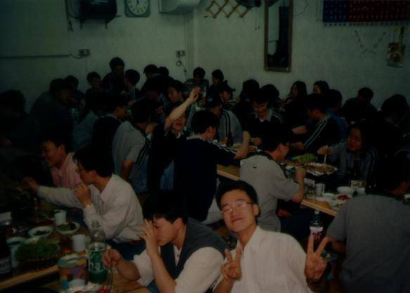
**이미지 캡션:** 이 사진은 실내에서 여러 명의 성인 남성들이 모여 식사를 하고 있는 모습을 담고 있습니다. 대부분 20대에서 30대로 보이는 이들은 편안한 복장을 하고 있으며, 일부는 웃거나 이야기하며 즐거운 분위기를 연출하고 있습니다. 테이블 위에는 다양한 음식과 술병, 컵 등이 놓여 있어 회식이나 모임 자리임을 짐작하게 합니다. 배경에는 벽에 걸린 시계와 액자, 그리고 조명이 보이며, 전반적으로 다소 어두운 조명 아래 활기찬 분위기가 느껴집니다. 특히 사진 앞쪽에 있는 두 명의 남성은 카메라를 향해 포즈를 취하고 있어 기념 사진을 찍는 순간임을 알 수 있습니다.념 사진을 찍는 순간임을 알 수 있습니다.
 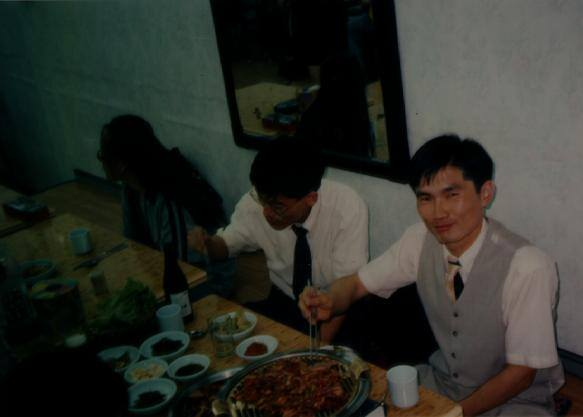
**이미지 캡션:** 이 사진은 실내에서 여러 사람이 둘러앉아 식사하는 모습을 담고 있으며, 테이블 위에는 다양한 음식과 술병이 놓여 있습니다. 사진의 오른쪽에는 30대 후반에서 40대 초반으로 보이는 성인 남성이 흰색 셔츠에 회색 조끼를 입고 앉아 있으며, 그의 얼굴에는 미소가 번져 있습니다. 그는 젓가락으로 테이블 중앙에 있는 불판 위의 고기를 집고 있습니다. 불판 위에는 먹음직스러운 고기 요리가 올려져 있습니다. 테이블에는 여러 개의 작은 접시들이 놓여 있는데, 그 안에는 김치, 쌈 채소, 소스 등 한국 식당에서 흔히 볼 수 있는 반찬들이 담겨 있습니다. 또한, 술병과 컵들도 보입니다. 사진의 왼쪽에는 두 명의 성인 남성이 앉아 있는데, 한 명은 안경을 쓰고 흰색 셔츠에 검은색 넥타이를 매고 있으며, 다른 한 명은 어두운 옷을 입고 있어 얼굴이 잘 보이지 않습니다. 배경에는 어두운 벽과 거울이 걸려 있으며, 전체적으로 편안하고 즐거운 식사 분위기를 느낄 수 있습니다. 있는 반찬들이 담겨 있습니다. 또한, 술병과 컵들도 보입니다. 사진의 왼쪽에는 두 명의 성인 남성이 앉아 있는데, 한 명은 안경을 쓰고 흰색 셔츠에 검은색 넥타이를 매고 있으며, 다른 한 명은 어두운 옷을 입고 있어 얼굴이 잘 보이지 않습니다. 배경에는 어두운 벽과 거울이 걸려 있으며, 전체적으로 편안하고 즐거운 식사 분위기를 느낄 수 있습니다.
 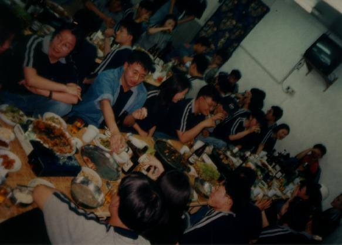
**이미지 캡션:** 이 사진은 여러 명의 성인 남성과 한 명의 성인 여성이 바닥에 앉아 긴 테이블에 놓인 음식을 나누며 술을 마시는 모습을 담고 있습니다. 테이블 위에는 다양한 종류의 음식과 술병이 놓여 있으며, 일부 음식은 이미 많이 먹은 듯 보입니다. 사람들은 캐주얼한 복장을 하고 있으며, 대부분 편안하고 즐거운 표정으로 대화하거나 음식을 먹고 있습니다. 배경은 실내이며, 벽에는 무늬가 있는 천이 걸려 있고, 한쪽에는 텔레비전이 놓여 있습니다. 전반적으로 활기차고 친근한 분위기이며, 친구나 동료들과 함께하는 회식이나 모임의 한 장면으로 보입니다.한 장면으로 보입니다.
 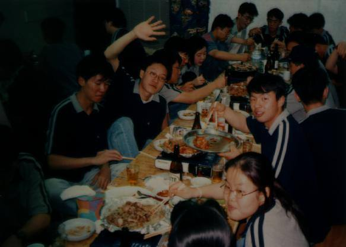
**이미지 캡션:** 이 사진은 여러 명의 성인 남성과 한 명의 성인 여성이 둘러앉아 식사를 하고 있는 모습을 담고 있습니다. 대부분 20대에서 30대로 보이는 이들은 캐주얼한 복장을 하고 있으며, 일부는 안경을 착용하고 있습니다. 중앙에 앉은 한 남성은 오른손을 들어 손가락으로 무언가를 가리키는 듯한 포즈를 취하고 있으며, 다른 남성들은 음식을 집거나 대화를 나누는 등 자연스러운 행동을 하고 있습니다. 여성은 안경을 쓰고 있으며, 음식을 바라보고 있습니다. 배경은 실내로 보이며, 테이블 위에는 다양한 음식과 술병, 접시 등이 놓여 있어 회식이나 모임 자리임을 짐작하게 합니다. 테이블 중앙에는 휴대용 가스레인지와 불판이 있어 고기를 구워 먹는 듯한 모습입니다. 전반적으로 편안하고 즐거운 분위기 속에서 식사를 즐기는 모습입니다.여 있어 회식이나 모임 자리임을 짐작하게 합니다. 테이블 중앙에는 휴대용 가스레인지와 불판이 있어 고기를 구워 먹는 듯한 모습입니다. 전반적으로 편안하고 즐거운 분위기 속에서 식사를 즐기는 모습입니다.
 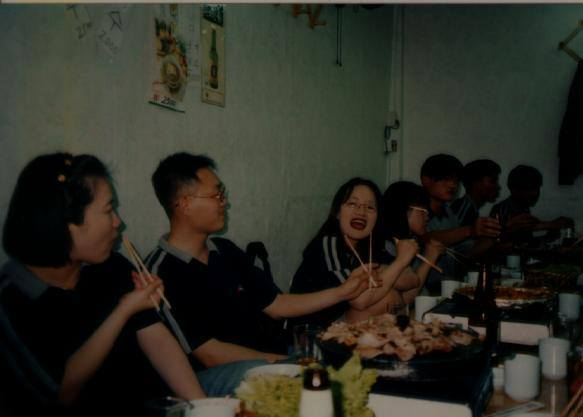
**이미지 캡션:** 사진에는 여러 명의 사람들이 식탁에 둘러앉아 식사하는 모습이 담겨 있습니다. 왼쪽부터 성인 여성 한 명은 검은색 상의를 입고 머리를 뒤로 묶었으며, 젓가락으로 음식을 집어 입으로 가져가고 있습니다. 그 옆에는 안경을 쓴 성인 남성이 검은색 상의를 입고 있으며, 역시 젓가락으로 음식을 먹고 있습니다. 이 남성의 표정은 약간 무표정해 보입니다. 그 옆에는 안경을 쓴 젊은 여성으로 보이는 사람이 밝게 웃으며 젓가락으로 음식을 집고 있습니다. 이 여성은 검은색 상의에 흰색 줄무늬가 있는 옷을 입고 있습니다. 그 뒤로는 세 명의 젊은 남성들이 앉아 있으며, 이들 역시 식사를 하고 있는 것으로 보입니다. 배경에는 벽에 여러 개의 그림과 포스터가 걸려 있고, 식탁 위에는 고기 요리, 채소, 밥그릇, 술병 등 다양한 음식이 놓여 있습니다. 전체적으로 편안하고 즐거운 식사 분위기를 느낄 수 있습니다.는 세 명의 젊은 남성들이 앉아 있으며, 이들 역시 식사를 하고 있는 것으로 보입니다. 배경에는 벽에 여러 개의 그림과 포스터가 걸려 있고, 식탁 위에는 고기 요리, 채소, 밥그릇, 술병 등 다양한 음식이 놓여 있습니다. 전체적으로 편안하고 즐거운 식사 분위기를 느낄 수 있습니다.
 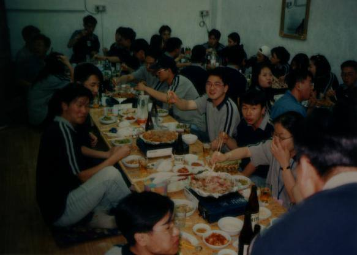
**이미지 캡션:** 이 사진은 여러 명의 성인 남녀가 테이블에 둘러앉아 식사를 하고 있는 모습을 담고 있습니다. 대부분 20대에서 30대로 보이는 이들은 편안한 복장을 하고 있으며, 일부는 웃거나 이야기하며 즐거운 시간을 보내고 있습니다. 테이블 위에는 다양한 음식과 술병, 컵 등이 놓여 있어 회식이나 모임 자리임을 짐작하게 합니다. 배경에는 벽과 거울이 보이며, 전반적으로 활기차고 친목을 다지는 분위기입니다.
 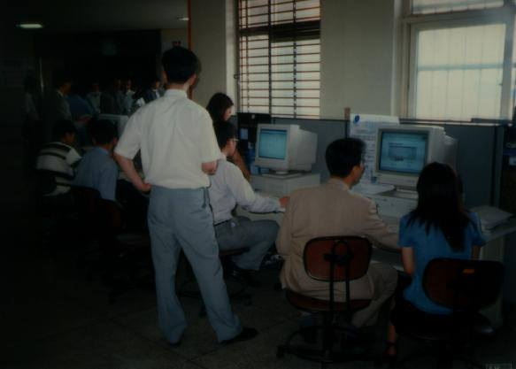
**이미지 캡션:** 이 사진은 여러 명의 사람들이 컴퓨터를 사용하고 있는 실내 공간을 보여줍니다. 전경에는 흰색 셔츠와 회색 바지를 입은 성인 남성이 서 있으며, 그의 등과 옆모습이 보입니다. 그는 팔짱을 끼고 있으며, 표정은 명확하게 보이지 않습니다. 그의 뒤쪽으로는 여러 명의 사람들이 컴퓨터 앞에 앉아 있습니다. 왼쪽에는 줄무늬 티셔츠를 입은 어린 남성으로 보이는 사람이 컴퓨터를 보고 있고, 그 옆에는 파란색 셔츠를 입은 성인 남성이 앉아 있습니다. 중앙에는 흰색 셔츠를 입은 성인 남성이 컴퓨터를 사용하고 있으며, 그의 앞에는 또 다른 성인 남성이 갈색 재킷을 입고 컴퓨터를 보고 있습니다. 이 남성의 옆에는 파란색 상의를 입은 여성으로 보이는 사람이 앉아 있습니다. 배경에는 창문이 보이며, 창문에는 블라인드가 쳐져 있습니다. 여러 대의 컴퓨터 모니터와 키보드, 그리고 책상들이 보입니다. 전반적으로 사무실이나 컴퓨터 교육실과 같은 분위기이며, 사람들이 각자의 컴퓨터 작업에 집중하고 있는 모습입니다.는 또 다른 성인 남성이 갈색 재킷을 입고 컴퓨터를 보고 있습니다. 이 남성의 옆에는 파란색 상의를 입은 여성으로 보이는 사람이 앉아 있습니다. 배경에는 창문이 보이며, 창문에는 블라인드가 쳐져 있습니다. 여러 대의 컴퓨터 모니터와 키보드, 그리고 책상들이 보입니다. 전반적으로 사무실이나 컴퓨터 교육실과 같은 분위기이며, 사람들이 각자의 컴퓨터 작업에 집중하고 있는 모습입니다.
 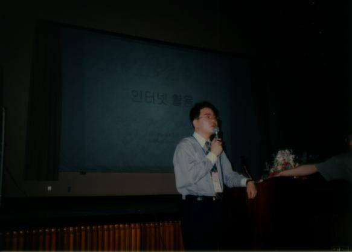
**이미지 캡션:** 한 성인 남성이 마이크를 잡고 강연을 하고 있으며, 그의 뒤에는 "인터넷 활용"이라는 글자가 쓰인 스크린이 보인다. 남성은 옅은 회색 줄무늬 셔츠에 검은색 바지를 입고 있으며, 안경을 착용하고 있다. 그의 표정은 진지하며, 청중을 향해 이야기하는 듯한 모습이다. 스크린에는 한국어로 된 텍스트가 희미하게 보이며, 이는 강연의 주제를 나타내는 것으로 추정된다. 장소는 강연장이나 회의실로 보이며, 앞쪽에는 연단이 있고 그 위에는 꽃다발이 놓여 있다. 전반적으로 차분하고 전문적인 분위기의 강연 상황을 담고 있다.
 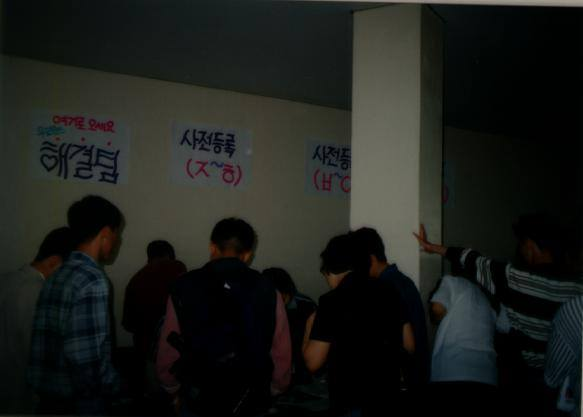
**이미지 캡션:** 어두운 실내 공간에서 여러 명의 성인 남성들이 벽에 붙은 안내문들을 바라보고 있다. 왼쪽 벽에는 파란색과 분홍색으로 "여기로 오세요"와 "해결팁"이라고 쓰여 있고, 그 옆에는 보라색 글씨로 "사전등록 (ㅈ~ㅎ)"이라고 적힌 안내문이 있다. 더 오른쪽에는 비슷한 크기의 안내문에 보라색 글씨로 "사전등록 (ㅂ~ㅇ)"이라고 쓰여 있다. 사람들은 대부분 뒷모습을 보이고 있으며, 캐주얼한 복장을 하고 있다. 일부는 서 있고 일부는 앉아 있는 것으로 보인다. 한 남성은 흰색 티셔츠를 입고 있으며, 다른 남성은 줄무늬 셔츠를 입고 손짓을 하고 있다. 전반적으로 행사가 진행 중이거나 사람들이 무언가를 기다리는 듯한 분위기이다.츠를 입고 손짓을 하고 있다. 전반적으로 행사가 진행 중이거나 사람들이 무언가를 기다리는 듯한 분위기이다.
 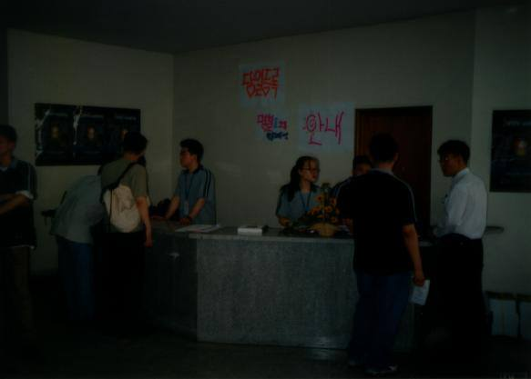
**이미지 캡션:** 이 사진은 실내에서 여러 명의 젊은 성인 남성과 한 명의 젊은 성인 여성이 안내 데스크 주변에 모여 있는 모습을 담고 있습니다. 사진 왼쪽에는 검은색 상의를 입은 젊은 성인 남성이 팔짱을 끼고 서 있고, 그 옆에는 회색 상의와 흰색 백팩을 멘 젊은 성인 남성이 허리를 숙이고 있습니다. 중앙에는 파란색 줄무늬가 있는 회색 상의를 입은 젊은 성인 남성이 안내 데스크 뒤에서 서서 무언가를 보고 있으며, 그 옆에는 파란색 상의를 입고 안경을 쓴 젊은 성인 여성이 꽃 장식 앞에 서서 미소를 짓고 있습니다. 여성의 뒤에는 다른 젊은 성인 남성이 서 있습니다. 사진 오른쪽에는 흰색 셔츠와 검은색 바지를 입은 젊은 성인 남성이 서서 다른 사람과 대화하고 있습니다. 벽에는 한국어로 쓰인 두 개의 포스터가 붙어 있는데, 하나는 빨간색 글씨로 "다이얼로그"라고 쓰여 있고, 다른 하나는 분홍색 글씨로 "멘토링 안내"라고 쓰여 있습니다. 배경에는 어두운 색의 문과 두 개의 포스터가 걸려 있습니다. 전체적으로 행사장이나 학교 행사 부스 같은 분위기이며, 사람들이 안내를 받거나 정보를 얻고 있는 것으로 보입니다.는 다른 젊은 성인 남성이 서 있습니다. 사진 오른쪽에는 흰색 셔츠와 검은색 바지를 입은 젊은 성인 남성이 서서 다른 사람과 대화하고 있습니다. 벽에는 한국어로 쓰인 두 개의 포스터가 붙어 있는데, 하나는 빨간색 글씨로 "다이얼로그"라고 쓰여 있고, 다른 하나는 분홍색 글씨로 "멘토링 안내"라고 쓰여 있습니다. 배경에는 어두운 색의 문과 두 개의 포스터가 걸려 있습니다. 전체적으로 행사장이나 학교 행사 부스 같은 분위기이며, 사람들이 안내를 받거나 정보를 얻고 있는 것으로 보입니다.
 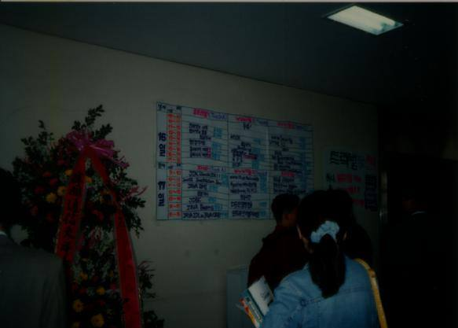
**이미지 캡션:** 실내의 벽에 걸린 큰 게시판에는 날짜별로 일정이 빼곡히 적혀 있으며, 게시판 왼쪽에는 붉은색 리본이 달린 화려한 조화가 놓여 있다. 게시판 앞에는 여러 명의 사람들이 서 있는데, 한 여성은 파란색 재킷을 입고 책을 들고 있으며, 다른 사람들은 어두운 옷을 입고 있다. 게시판에는 한국어와 영어로 된 글자들이 보이며, 일부는 날짜와 함께 행사나 약속을 나타내는 것으로 보인다. 전체적으로 행사가 있거나 중요한 정보가 공유되는 장소의 분위기이며, 조명은 천장의 형광등에서 나온다.
 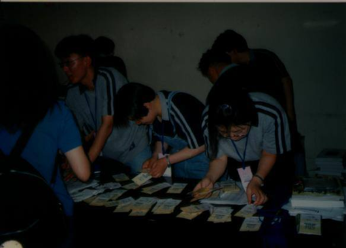
**이미지 캡션:** 어두운 실내에서 여러 명의 젊은 성인 남녀가 검은색 테이블에 놓인 수많은 종이 조각들을 살피고 있다. 테이블 위에는 마치 복권이나 쿠폰처럼 보이는 작은 종이들이 빼곡하게 놓여 있으며, 몇몇 사람들은 손으로 종이를 집어 들거나 만지작거리며 집중하는 모습이다. 대부분의 사람들은 회색 또는 남색 줄무늬가 있는 티셔츠나 상의를 입고 있으며, 일부는 목에 이름표나 출입증으로 보이는 것을 걸고 있다. 한 성인 남성은 안경을 쓰고 있으며, 다른 사람들은 고개를 숙이고 종이에 시선을 고정한 채 무언가를 확인하거나 고르고 있는 듯하다. 배경은 어둡고 벽으로 추정되며, 오른쪽에는 책들이 쌓여 있는 모습도 보인다. 전반적으로 무언가를 분배하거나 확인하는 행사 또는 활동 중인 것으로 보이며, 차분하고 집중된 분위기이다.는 듯하다. 배경은 어둡고 벽으로 추정되며, 오른쪽에는 책들이 쌓여 있는 모습도 보인다. 전반적으로 무언가를 분배하거나 확인하는 행사 또는 활동 중인 것으로 보이며, 차분하고 집중된 분위기이다.
 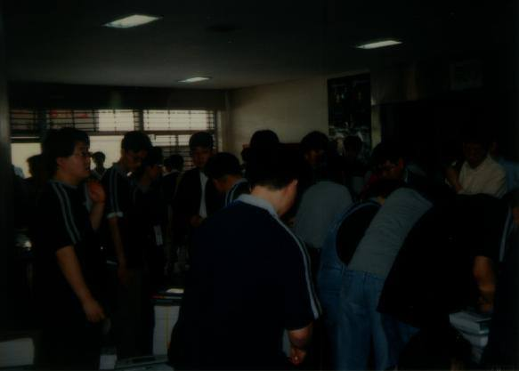
**이미지 캡션:** 사진에는 어두운 실내 공간에 여러 명의 젊은 성인 남성들이 모여 있는 모습이 담겨 있으며, 대부분 교복이나 캐주얼한 복장을 하고 있다. 일부는 서로 대화하거나 무언가를 살펴보는 듯한 행동을 하고 있으며, 표정은 대체로 어두운 조명 때문에 명확하게 보이지 않지만, 진지하거나 집중하는 모습으로 추정된다. 배경에는 창문과 형광등 조명이 보이며, 일부 벽에는 게시물이나 포스터가 붙어 있는 것으로 보인다. 테이블 위에는 서류나 책 같은 물건들이 놓여 있어, 회의나 발표, 혹은 동아리 활동 등이 이루어지고 있는 상황으로 짐작된다. 전반적으로 차분하고 약간은 어수선한 분위기이다. 짐작된다. 전반적으로 차분하고 약간은 어수선한 분위기이다.
 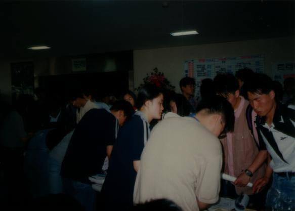
**이미지 캡션:** 어두운 실내에서 여러 명의 사람들이 모여 무언가를 하고 있으며, 전반적으로 어수선하고 활기찬 분위기입니다. 사진 중앙에는 젊은 성인 여성으로 보이는 사람이 옆모습으로 서 있고, 그녀의 왼쪽에는 어두운 색 상의를 입은 젊은 성인 남성이 고개를 숙이고 있습니다. 그 앞에는 베이지색 상의를 입은 성인 남성이 서서 무언가를 들고 있거나 만지고 있으며, 그의 오른쪽에는 검은색과 흰색이 섞인 스포츠 의류를 입은 젊은 성인 남성이 무언가를 건네받거나 확인하는 듯한 모습입니다. 배경에는 여러 장의 게시물이나 안내문이 붙어 있는 벽이 보이며, 일부 게시물에는 한국어로 보이는 글자들이 희미하게 보입니다. 조명은 실내등으로 보이며, 일부는 형광등처럼 길쭉한 형태입니다. 사람들의 표정은 대체로 무언가에 집중하고 있거나 약간의 긴장감이 느껴지며, 전체적으로 행사장이나 학교 행사, 혹은 동아리 모임 같은 장소로 추정됩니다.있는 벽이 보이며, 일부 게시물에는 한국어로 보이는 글자들이 희미하게 보입니다. 조명은 실내등으로 보이며, 일부는 형광등처럼 길쭉한 형태입니다. 사람들의 표정은 대체로 무언가에 집중하고 있거나 약간의 긴장감이 느껴지며, 전체적으로 행사장이나 학교 행사, 혹은 동아리 모임 같은 장소로 추정됩니다.
 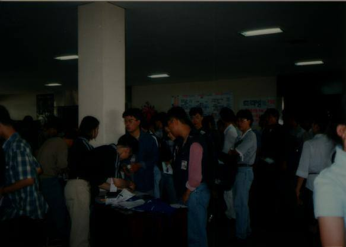
**이미지 캡션:** 실내에서 여러 명의 성인 남녀가 서 있거나 테이블에 모여 있는 모습으로, 대부분 20대에서 30대로 보이는 젊은층이다. 일부는 캐주얼한 복장(체크무늬 셔츠, 청바지)을 하고 있고, 다른 일부는 좀 더 단정한 복장(셔츠, 바지)을 하고 있다. 몇몇은 서류를 보거나 작성하고 있으며, 다른 사람들은 대화를 나누거나 주변을 둘러보고 있다. 배경에는 형광등 조명이 있고, 벽에는 한국어로 된 글자들이 적힌 게시판이 보인다. 전반적으로 행사장이나 회의실 같은 곳에서 사람들이 모여 무언가를 진행하고 있는 듯한 분위기이다.
 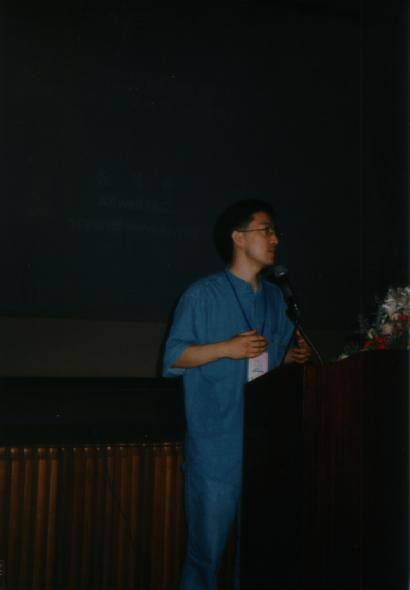
**이미지 캡션:** 어두운 배경 앞에 서 있는 성인 남성이 마이크가 달린 연단을 잡고 발표하고 있다. 남성은 30대 후반에서 40대 초반으로 보이며, 검은색 안경을 쓰고 짧은 검은색 머리를 하고 있다. 그는 밝은 파란색 셔츠와 바지를 입고 있으며, 목에 파란색 목걸이와 함께 흰색 명찰을 달고 있다. 그의 표정은 진지하고 집중하고 있으며, 한 손은 연단 위에 올려져 있고 다른 손은 마이크 근처에 있다. 배경에는 어두운 스크린이 있고, 그 위에 희미하게 글자가 보인다. 스크린 아래에는 갈색 커튼이 쳐져 있으며, 연단 옆에는 꽃이 놓여 있다. 전체적으로 차분하고 공식적인 분위기이다.여 있다. 전체적으로 차분하고 공식적인 분위기이다.
 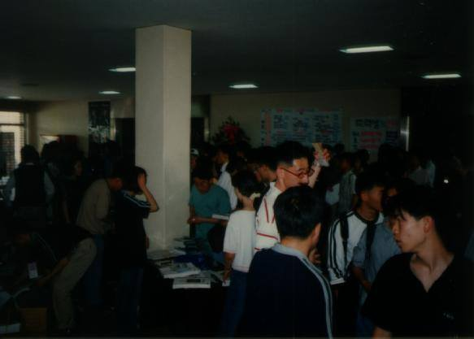
**이미지 캡션:** 이 사진은 실내에서 열린 행사나 모임으로 보이는 장면을 담고 있으며, 많은 사람들이 모여 있는 모습입니다. 중앙에는 흰색 기둥이 서 있고, 그 주변으로 다양한 연령대의 사람들, 주로 성인 남성들이 보입니다. 사람들은 캐주얼한 복장을 하고 있으며, 일부는 서 있거나 다른 사람들과 대화하고 있습니다. 몇몇 사람들은 책이나 서류를 들고 있거나 테이블 위에 놓인 물건들을 살펴보고 있습니다. 배경에는 창문과 벽에 걸린 게시물들이 보이며, 형광등 조명이 실내를 밝히고 있습니다. 전반적으로 활기차고 북적이는 분위기이며, 사람들이 무언가에 집중하거나 정보를 교환하는 듯한 모습입니다.사람들이 무언가에 집중하거나 정보를 교환하는 듯한 모습입니다.
 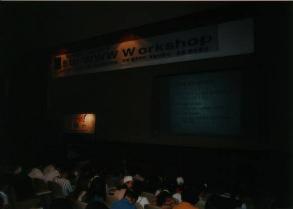
**이미지 캡션:** 어두운 강당에서 열린 워크숍 장면으로, 앞쪽 벽에는 "5th www Workshop"이라고 쓰인 현수막이 걸려 있고, 그 아래에는 작은 조명으로 비추어진 또 다른 게시물이 보인다. 오른쪽 벽에는 프로젝터로 텍스트가 적힌 화면이 비춰지고 있으며, 화면 내용은 흐릿하게 보인다. 강당 안에는 여러 명의 사람들이 좌석에 앉아 있으며, 대부분 성인 남녀로 보이며, 캐주얼한 복장을 하고 있다. 일부 사람들은 모자를 쓰고 있으며, 전반적으로 차분하고 집중하는 분위기이다.
 
**이미지 캡션:** 어두운 강당에 많은 사람들이 좌석에 앉아 있으며, 대부분은 젊은 성인 남성으로 보입니다. 그들은 다양한 복장을 하고 있으며, 일부는 흰색 티셔츠에 목걸이 형태의 명찰을 착용하고 있습니다. 여러 명의 사람들이 손뼉을 치고 있으며, 이는 발표나 공연에 대한 호응을 나타내는 것으로 보입니다. 배경에는 조명이 희미하게 켜져 있고, 좌석은 갈색 계열입니다. 전반적으로 강연이나 발표회와 같은 행사가 진행 중인 것으로 추정되며, 참석자들은 집중하거나 박수를 치며 참여하고 있습니다.
 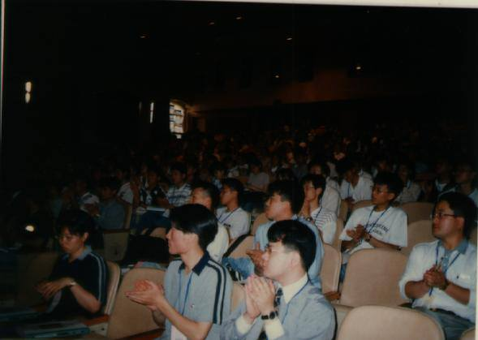
**이미지 캡션:** 어두운 강당에 많은 사람들이 앉아 있으며, 대부분은 젊은 성인 남성으로 보입니다. 그들은 다양한 복장을 하고 있으며, 일부는 흰색 티셔츠에 목걸이 형태의 출입증을 착용하고 있습니다. 몇몇 사람들은 손뼉을 치고 있으며, 이는 발표나 공연에 대한 호응을 나타내는 것으로 보입니다. 배경에는 어두운 벽과 천장이 보이며, 일부 조명이 켜져 있습니다. 전체적으로 행사에 참여하여 집중하거나 즐기고 있는 분위기입니다.
 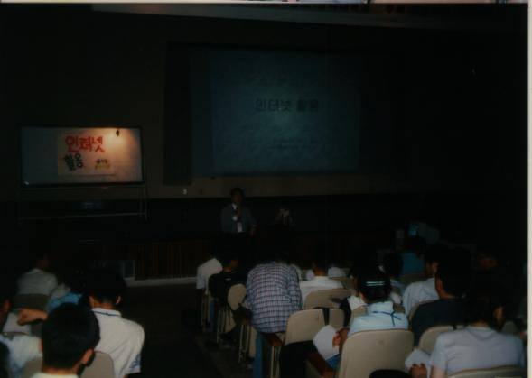
**이미지 캡션:** 어두운 강당에서 한 성인 남성이 연단에 서서 강의를 하고 있으며, 그의 뒤편에는 "인터넷 활용"이라는 제목이 적힌 스크린이 켜져 있습니다. 강당 앞쪽에는 여러 명의 사람들이 좌석에 앉아 강의를 듣고 있으며, 일부는 앞쪽의 스크린을 바라보고 있습니다. 왼쪽 벽에는 "인터넷 활용"이라고 적힌 흰색 보드가 걸려 있습니다. 전반적으로 강의 또는 세미나 상황으로 보이며, 차분하고 집중하는 분위기입니다.
 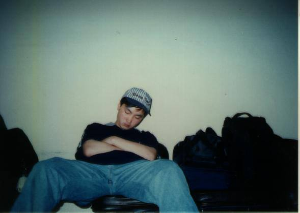
**이미지 캡션:** 사진 속에는 성인 남성이 흰색 벽을 배경으로 앉아 졸고 있다. 그는 20대 후반에서 30대 초반으로 보이며, 파란색 줄무늬가 있는 야구 모자를 쓰고 있다. 검은색 티셔츠와 청바지를 입고 있으며, 팔짱을 끼고 편안한 자세로 앉아 있다. 그의 표정은 평온하며 깊은 잠에 빠진 듯하다. 남성 옆에는 검은색 여행 가방 두 개가 놓여 있으며, 이는 그가 여행 중이거나 어딘가로 이동 중임을 암시한다. 장소는 실내로 보이며, 조명은 다소 어둡고 차분한 분위기를 자아낸다. 전반적으로 휴식이나 대기 중인 상황을 보여주는 사진이다.다.
 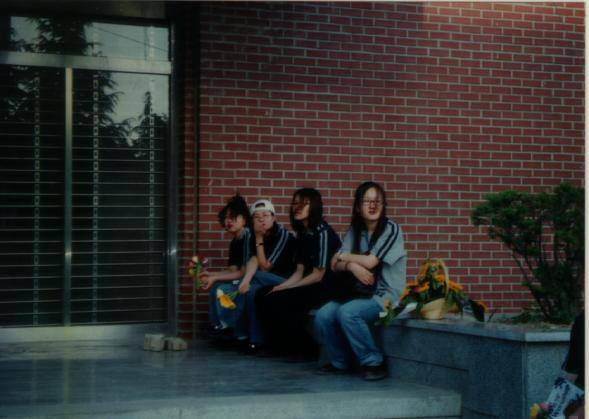
**이미지 캡션:** 네 명의 젊은 여성들이 건물 앞에 나란히 앉아 있다. 왼쪽에서 두 번째 여성은 흰색 야구 모자를 쓰고 있으며, 나머지 세 명은 검은색 또는 회색 줄무늬가 있는 어두운 색상의 상의를 입고 청바지를 입고 있다. 왼쪽에서 첫 번째 여성은 꽃다발을 들고 있고, 오른쪽에서 두 번째 여성은 꽃바구니를 들고 있다. 그들은 모두 편안해 보이며, 일부는 카메라를 향해 미소를 짓고 있다. 배경에는 붉은 벽돌 건물과 창문이 있으며, 오른쪽에는 작은 나무가 보인다. 전반적으로 차분하고 편안한 분위기이다.
 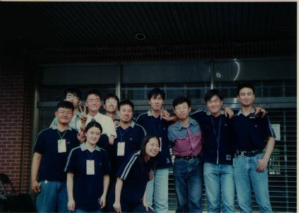
**이미지 캡션:** 이 사진은 10대 후반에서 20대 초반으로 보이는 성인 남성 9명과 성인 여성 2명으로 구성된 그룹이 건물 앞에서 포즈를 취하고 있는 모습을 담고 있습니다. 대부분의 남성들은 짧은 머리에 캐주얼한 복장을 하고 있으며, 일부는 목에 이름표가 달린 파란색 또는 검은색 상의를 입고 있습니다. 한 남성은 흰색 셔츠에 안경을 쓰고 있으며, 다른 남성은 짙은 파란색 재킷에 청바지를 입고 있습니다. 여성들은 각각 파란색 상의와 청바지, 그리고 검은색 상의와 청바지를 입고 있습니다. 그룹은 전반적으로 밝고 긍정적인 표정을 짓고 있으며, 일부는 서로 어깨동무를 하거나 손으로 브이 포즈를 취하는 등 친근한 분위기를 연출하고 있습니다. 배경에는 벽돌 건물과 창문이 보이며, 전체적으로 야외에서 촬영된 것으로 보입니다. 사진은 약간 흐릿하지만, 그룹의 젊음과 활기찬 분위기를 잘 보여주고 있습니다.짓고 있으며, 일부는 서로 어깨동무를 하거나 손으로 브이 포즈를 취하는 등 친근한 분위기를 연출하고 있습니다. 배경에는 벽돌 건물과 창문이 보이며, 전체적으로 야외에서 촬영된 것으로 보입니다. 사진은 약간 흐릿하지만, 그룹의 젊음과 활기찬 분위기를 잘 보여주고 있습니다.
 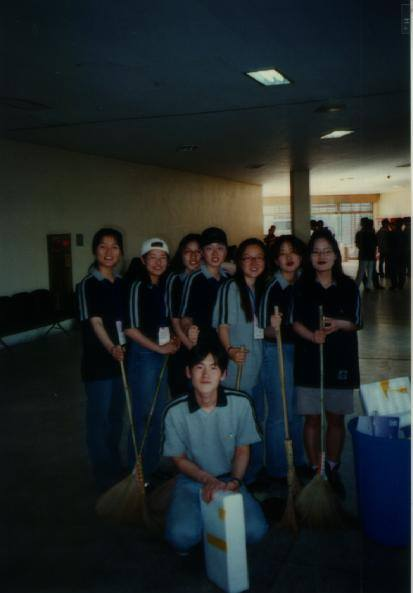
**이미지 캡션:** 이 사진은 10대 후반에서 20대 초반으로 보이는 한국인 학생들로 보이는 그룹이 실내 복도에서 빗자루를 들고 포즈를 취하고 있는 모습을 담고 있습니다. 앞줄에는 회색 셔츠와 파란색 청바지를 입은 한 명의 젊은 남성이 쪼그리고 앉아 있으며, 그의 옆에는 흰색과 노란색 줄무늬가 있는 상자가 있습니다. 뒷줄에는 8명의 젊은 여성들이 서 있는데, 대부분 어두운 색상의 셔츠와 파란색 청바지를 입고 있으며, 일부는 야구 모자를 쓰고 있습니다. 이들은 모두 빗자루를 들고 있으며, 일부는 미소를 짓고 있습니다. 배경에는 복도 벽과 천장에 조명이 보이며, 멀리 다른 사람들이 지나가는 모습도 희미하게 보입니다. 전체적으로 청소 활동이나 봉사 활동의 일부로 보이는 단체 사진으로, 밝고 활기찬 분위기입니다.도 벽과 천장에 조명이 보이며, 멀리 다른 사람들이 지나가는 모습도 희미하게 보입니다. 전체적으로 청소 활동이나 봉사 활동의 일부로 보이는 단체 사진으로, 밝고 활기찬 분위기입니다.
 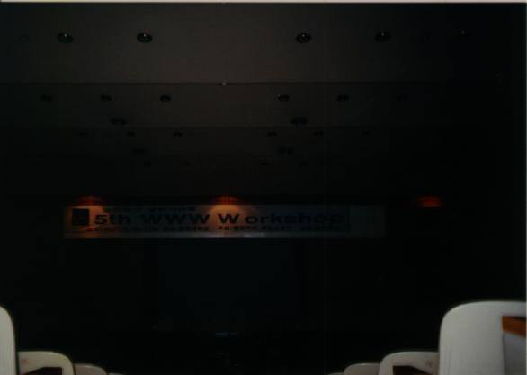
**이미지 캡션:** 어두운 실내 공간으로, 천장에는 여러 개의 조명이 설치되어 있고, 중앙에는 "5th WWW Workshop"이라고 적힌 현수막이 걸려 있다. 현수막 위쪽으로는 주황색 조명이 비추고 있으며, 현수막 아래쪽으로는 작은 글씨로 무언가 더 적혀 있지만 명확하게 보이지는 않는다. 사진의 하단에는 좌석으로 보이는 하얀색 물체들이 일부 보인다. 전반적으로 행사가 진행 중이거나 준비 중인 어두운 강당이나 회의실의 분위기를 띤다.
 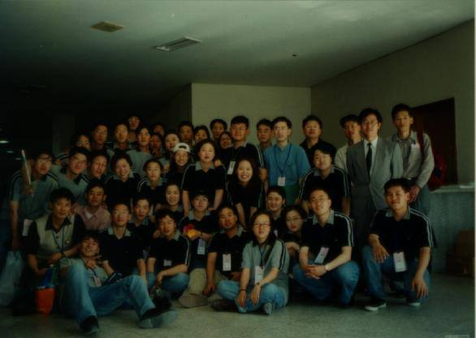
**이미지 캡션:** 이 사진은 실내에서 단체 사진을 찍은 것으로, 약 30명 정도의 다양한 연령대의 사람들이 모여 있습니다. 대부분 젊은 성인 남녀로 보이며, 일부는 학생으로 추정됩니다. 사람들은 밝고 긍정적인 표정을 짓고 있으며, 서로 어깨를 맞대거나 팔짱을 끼는 등 친밀한 모습을 보입니다. 복장은 캐주얼하며, 티셔츠, 셔츠, 바지 등이 주를 이룹니다. 일부 사람들은 목에 ID 카드나 명찰을 걸고 있어 행사나 모임에 참여한 것으로 보입니다. 배경은 실내 복도로 보이며, 벽과 천장이 보입니다. 조명은 약간 어둡지만, 사람들의 얼굴은 잘 보입니다. 전체적으로 화기애애하고 즐거운 분위기를 느낄 수 있습니다.굴은 잘 보입니다. 전체적으로 화기애애하고 즐거운 분위기를 느낄 수 있습니다.
 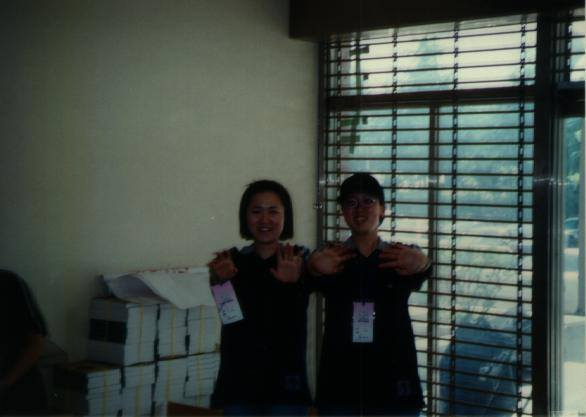
**이미지 캡션:** 사진에는 두 명의 젊은 여성으로 보이는 사람들이 실내에 서 있습니다. 왼쪽 여성은 짧은 검은색 머리에 검은색 상의를 입고 있으며, 얼굴에는 미소를 띠고 있습니다. 그녀는 손바닥을 앞으로 향하게 하고 있습니다. 오른쪽 여성은 검은색 상의와 안경을 착용하고 있으며, 역시 미소를 짓고 있습니다. 그녀도 양손을 앞으로 뻗고 있습니다. 두 여성 모두 목에 명찰을 달고 있습니다. 배경에는 창문이 있고, 창문에는 블라인드가 쳐져 있습니다. 창밖으로 희미하게 나무와 건물이 보입니다. 왼쪽에는 쌓여 있는 책 더미가 보입니다. 전체적으로 밝고 긍정적인 분위기의 사진입니다. 전체적으로 밝고 긍정적인 분위기의 사진입니다.
 
**이미지 캡션:** 이 사진에는 사람이 등장하지 않으며, 흰색 배경에 로고와 텍스트가 있다. 로고는 파란색, 빨간색, 녹색의 세 가지 색으로 이루어진 추상적인 형태로, 중앙에는 검은색으로 "KR"이라고 쓰여 있다. 로고 옆에는 검은색 굵은 글씨로 "WWW KOREA"라는 텍스트가 쓰여 있다. 전체적으로 깔끔하고 정보 전달에 초점을 맞춘 디자인이다.
 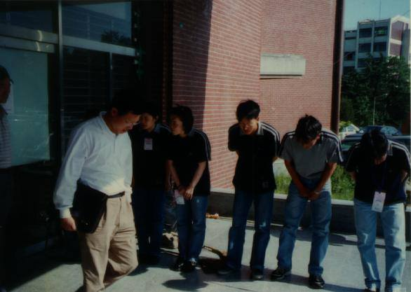
**이미지 캡션:** 한 명의 성인 남성이 흰색 긴팔 셔츠와 베이지색 바지를 입고 검은색 크로스백을 메고 있으며, 다른 성인 남성 4명과 성인 여성 1명이 그 뒤에 서서 고개를 숙이고 있다. 뒤에 서 있는 사람들은 대부분 검은색 상의와 청바지를 입고 있으며, 일부는 목에 명찰을 달고 있다. 이들은 모두 고개를 숙이고 있어 표정을 정확히 알 수는 없지만, 경건하거나 존경하는 태도를 보이고 있다. 배경에는 붉은 벽돌 건물과 유리창이 있는 건물이 보이며, 멀리 아파트 건물과 나무, 주차된 차량도 보인다. 전체적으로 야외에서 촬영된 사진으로, 햇빛이 비추고 있어 밝은 분위기이다.으로, 햇빛이 비추고 있어 밝은 분위기이다.

> I guess Douglas Guen was the PC-chair.

### 8월 29일 (금) 00:44 · WWW-KR 5th workshop TV (TBC) commercial …

WWW-KR 5th workshop TV (TBC) commercial in 1997. :-)

🎬 동영상 1개 (생략)

### 8월 29일 (금) 12:10 · is now 2nd overall on Clear Water Bay Rd…

is now 2nd overall on Clear Water Bay Rd to High Junk Peak (19:02) in the Strava Segment. The next goal is obvious. :-)

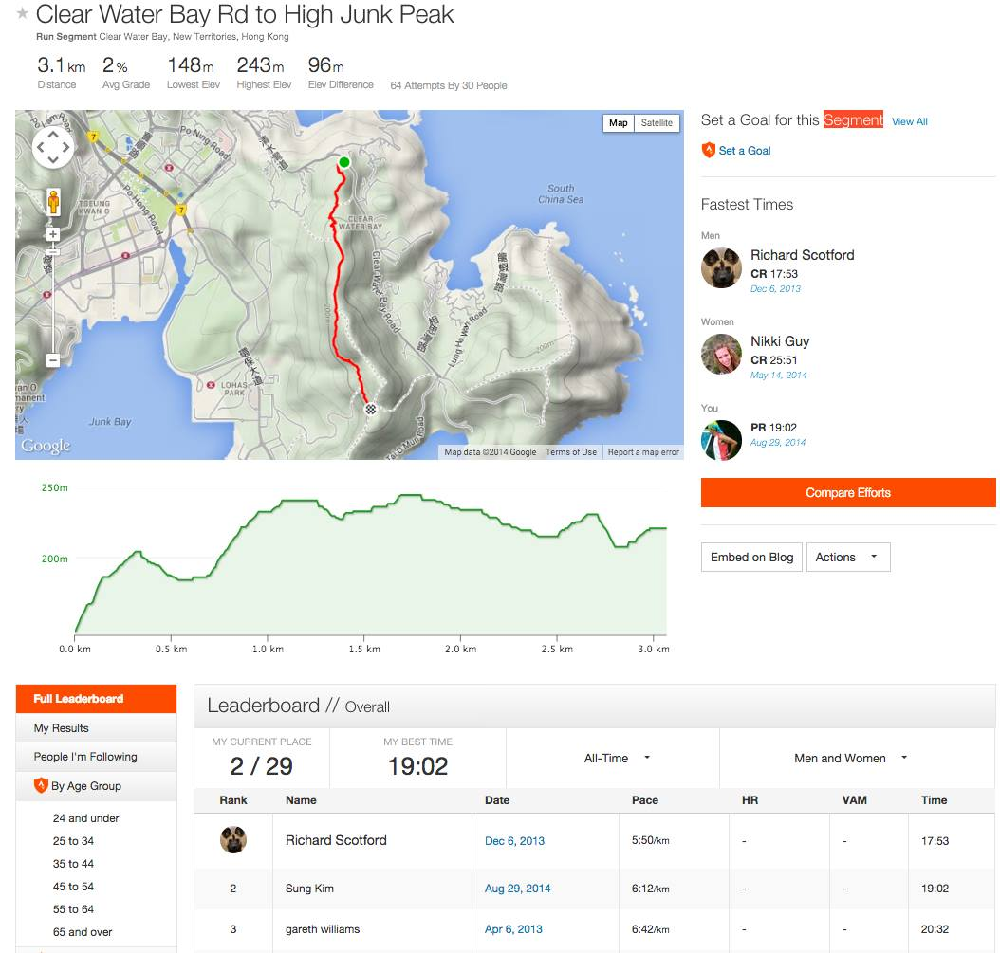
**이미지 캡션:** 이 화면은 홍콩의 클리어 워터 베이 로드에서 하이 정크 피크까지 이어지는 달리기 구간의 상세 정보를 보여줍니다. 지도에는 구간의 경로가 빨간색 선으로 표시되어 있으며, 고도 그래프는 구간의 고도 변화를 나타냅니다. 구간의 총 거리는 3.1km이며, 평균 경사도는 2%, 최저 고도는 148m, 최고 고도는 243m, 고도 차이는 96m입니다. 이 구간에 대한 64번의 시도가 있었으며, 30명의 참가자가 있습니다. 화면 오른쪽에는 이 구간에 대한 목표 설정 기능과 함께 가장 빠른 기록이 표시됩니다. 남자 부문에서는 Richard Scotford가 17분 53초로 1위이며, 여자 부문에서는 Nikki Guy가 25분 51초로 1위입니다. 사용자의 개인 최고 기록은 19분 02초이며, 2014년 8월 29일에 달성되었습니다. 하단에는 전체 리더보드가 표시되어 있으며, 사용자의 현재 순위는 29명 중 2위이고 개인 최고 기록은 19분 02초입니다. 리더보드에는 순위, 이름, 날짜, 페이스, 심박수, VAM, 시간 등의 정보가 포함되어 있으며, Richard Scotford, Sung Kim, gareth williams 등의 참가자 기록이 나열되어 있습니다. 전반적으로 이 화면은 특정 달리기 구간의 성과를 추적하고 비교하는 데 사용되는 스포츠 기록 웹사이트의 일부로 보입니다.는 Richard Scotford가 17분 53초로 1위이며, 여자 부문에서는 Nikki Guy가 25분 51초로 1위입니다. 사용자의 개인 최고 기록은 19분 02초이며, 2014년 8월 29일에 달성되었습니다. 하단에는 전체 리더보드가 표시되어 있으며, 사용자의 현재 순위는 29명 중 2위이고 개인 최고 기록은 19분 02초입니다. 리더보드에는 순위, 이름, 날짜, 페이스, 심박수, VAM, 시간 등의 정보가 포함되어 있으며, Richard Scotford, Sung Kim, gareth williams 등의 참가자 기록이 나열되어 있습니다. 전반적으로 이 화면은 특정 달리기 구간의 성과를 추적하고 비교하는 데 사용되는 스포츠 기록 웹사이트의 일부로 보입니다.
