# 2014년 9월

[← 2014년](README.md)

### 9월 1일 (월) 17:55 · was invited to enjoy this priority regis…

was invited to enjoy this priority registration for Hong Kong Standard Chartered HK Marathon 2015, "being one of the outstanding runners who met the time standard." :-) I don't have to worry about being in a long queue and being sold out.

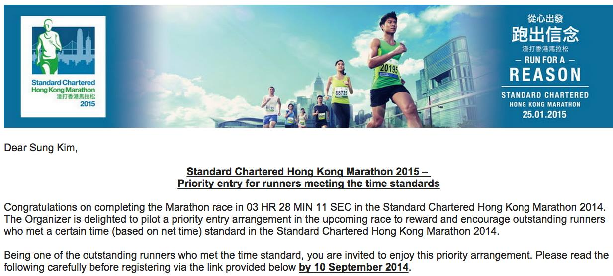
**이미지 캡션:** 사진 상단에는 스탠다드 차타드 홍콩 마라톤 2015년 행사 홍보 이미지와 함께 "Dear Sung Kim,"으로 시작하는 이메일 본문이 보인다. 홍보 이미지에는 여러 명의 마라토너들이 달리는 모습이 담겨 있으며, 그중 한 명의 성인 남성이 선두에서 힘차게 달리고 있다. 이 남성은 녹색 민소매 상의와 검은색 반바지를 착용하고 있으며, 가슴에는 '20195'라는 번호표를 달고 있다. 그의 표정은 결연하며, 앞으로 나아가려는 의지가 엿보인다. 뒤이어 여러 명의 다른 마라토너들도 각자의 번호표를 달고 달리고 있으며, 그중 한 여성 마라토너는 '88725'라는 번호표를 달고 있다. 배경에는 현대적인 고층 건물들이 늘어서 있어 홍콩의 도시 풍경을 연상시킨다. 하늘은 맑고 푸르며, 구름이 흩날려 역동적인 분위기를 더한다. 이미지 오른쪽 상단에는 "從心出發 跑出信念 渣打香港馬拉松 RUN FOR A REASON"이라는 문구와 함께 "STANDARD CHARTERED HONG KONG MARATHON 25.01.2015"라는 행사 정보가 중국어와 영어로 표기되어 있다. 이메일 본문은 스탠다드 차타드 홍콩 마라톤 2014년 대회에서 특정 시간 기준을 통과한 참가자에게 2015년 대회 우선 참가 자격을 부여한다는 내용을 담고 있으며, 수신자인 Sung Kim이 이에 해당함을 알리고 있다.

### 9월 1일 (월) 20:40 · 📷 앨범: Cover photos (1장)

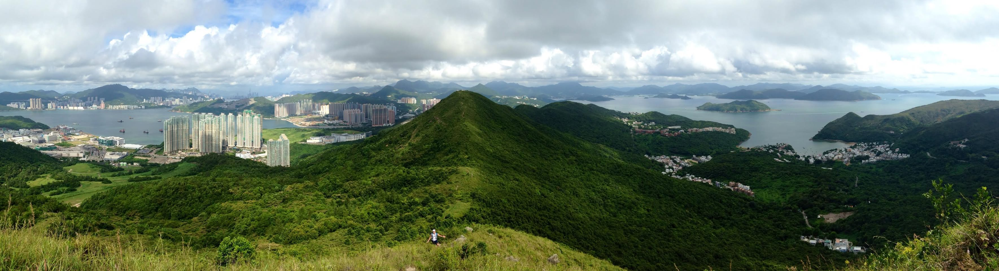
**이미지 캡션:** 이 파노라마 사진은 푸른 산봉우리와 바다가 어우러진 아름다운 풍경을 담고 있으며, 멀리 보이는 도시의 모습이 인상적입니다. 사진의 전경에는 잔디와 야생화가 자라는 언덕이 펼쳐져 있고, 그 위로 한 명의 성인 여성이 하얀색 상의와 검은색 하의를 입고 등산 중인 모습이 보입니다. 여성은 카메라를 향해 손을 흔들며 밝은 표정을 짓고 있습니다. 중경에는 울창한 녹색 숲으로 뒤덮인 산들이 겹겹이 이어져 있으며, 산 능선을 따라 좁은 길이 나 있습니다. 원경에는 푸른 바다가 펼쳐져 있고, 바다 위에는 여러 척의 배들이 떠 있습니다. 바다 건너편에는 고층 아파트 단지와 건물들이 밀집해 있는 도시의 모습이 보이며, 산과 바다, 도시가 조화롭게 어우러져 평화롭고 웅장한 분위기를 자아냅니다. 하늘에는 구름이 뭉게뭉게 피어 있어 자연의 아름다움을 더욱 돋보이게 합니다.

> High Junk Peak picture by Jay!

### 9월 14일 (일) 11:21 · 2014 Fall group hiking! It was really fu…

2014 Fall group hiking! It was really fun

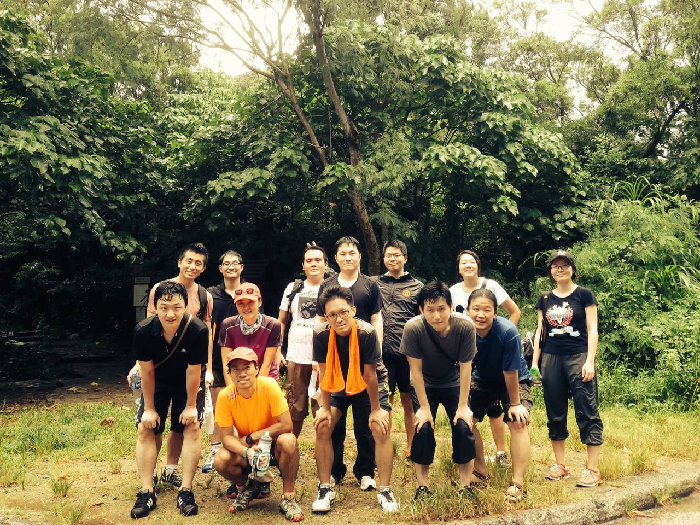
**이미지 캡션:** A group of eleven people, appearing to be in their late teens to early forties, are posing for a photo outdoors in a wooded area. The group consists of eight adult males and three adult females. Most of the individuals are dressed in casual, athletic attire suitable for hiking or outdoor activities, including t-shirts, shorts, and athletic pants. Several people are wearing backpacks or have towels draped around their necks, suggesting they are on a hike or have just completed one. The individuals are arranged in two rows, with some standing and others crouching or kneeling in the front. Their expressions are generally relaxed and happy, with many smiling at the camera. The background is dominated by lush green trees and foliage, with a dirt path or trail visible in the foreground. The lighting suggests it might be a slightly overcast day or late afternoon, with a soft, diffused light. The overall atmosphere is one of camaraderie and enjoyment of an outdoor activity. One person in the front row is wearing an orange t-shirt and holding a water bottle. Another person in the front row is wearing a dark t-shirt and has a black strap across their chest. A woman on the far right is wearing a black t-shirt with a graphic design and dark pants. The image appears to be taken with a smartphone or a similar device, with a slightly wide-angle lens.
 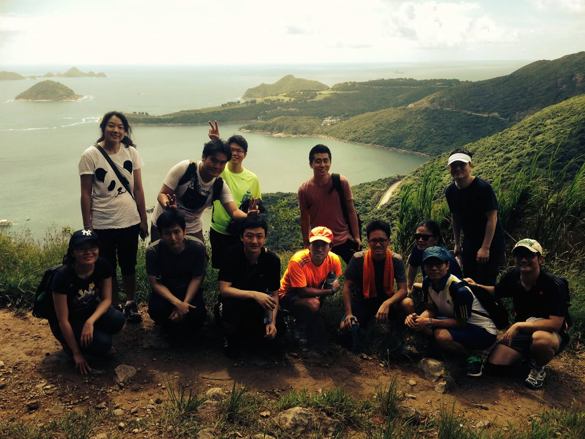
**이미지 캡션:** A group of eleven people, consisting of adults and young adults, are posing for a photo on a dirt path overlooking a scenic bay. The group is diverse in gender and attire, with most wearing casual, outdoor clothing suitable for hiking. In the front row, from left to right, a young woman wearing a black t-shirt with a New York Yankees logo and a black baseball cap is crouching. Next to her, a young man in a dark t-shirt is crouching, with his hands resting on his knees. To his right, another young man in a dark t-shirt is crouching, holding a water bottle. In the middle of the front row, a young man in an orange t-shirt and a yellow baseball cap is crouching. To his right, a young man in a grey t-shirt with an orange towel draped around his neck is crouching. Next to him, a young woman with sunglasses is crouching. In front of her, a young man wearing a blue and yellow striped shirt and a blue baseball cap is crouching. To the far right of the front row, a young man in a black t-shirt and a white baseball cap is crouching. In the back row, from left to right, a young woman wearing a white t-shirt with a panda design and black pants is standing. Next to her, a young man in a white t-shirt and black shorts is standing, making a peace sign. To his right, a young man in a bright yellow t-shirt is standing. To the far right of the back row, a young man in a black t-shirt and black shorts is standing, wearing a white visor. The background features a lush green, mountainous landscape with a winding road visible in the distance, leading down to a calm, blue bay dotted with small islands. The sky is overcast, suggesting a slightly hazy but pleasant day for outdoor activity. The overall atmosphere is one of camaraderie and enjoyment of nature.
 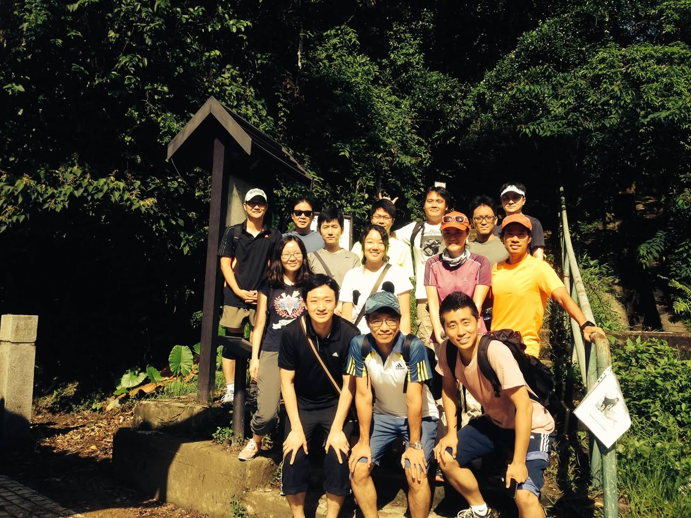
**이미지 캡션:** 이 사진은 숲길 계단 앞에서 포즈를 취하고 있는 13명의 사람들 그룹을 보여줍니다. 대부분의 사람들은 20대에서 30대로 보이며, 캐주얼한 복장을 하고 있습니다. 몇몇은 등산복을 입고 있으며, 일부는 모자나 선글라스를 착용하고 있습니다. 모두 밝고 긍정적인 표정을 짓고 있으며, 일부는 손을 흔들거나 포즈를 취하고 있습니다. 배경에는 울창한 녹색 숲과 나무 계단이 보이며, 햇빛이 나뭇잎 사이로 비쳐들어 밝고 화창한 분위기를 연출합니다. 사진 왼쪽에는 돌로 된 기둥과 표지판이 보이며, 오른쪽에는 금속 난간이 있습니다. 전반적으로 야외 활동이나 하이킹을 즐기는 사람들의 즐거운 모습을 담은 사진입니다.

### 9월 18일 (목) 19:34 · We are still happy to run even though ou…

📍 Sanya

We are still happy to run even though our ship was stuck in Hainan Island thanks to a typhoon

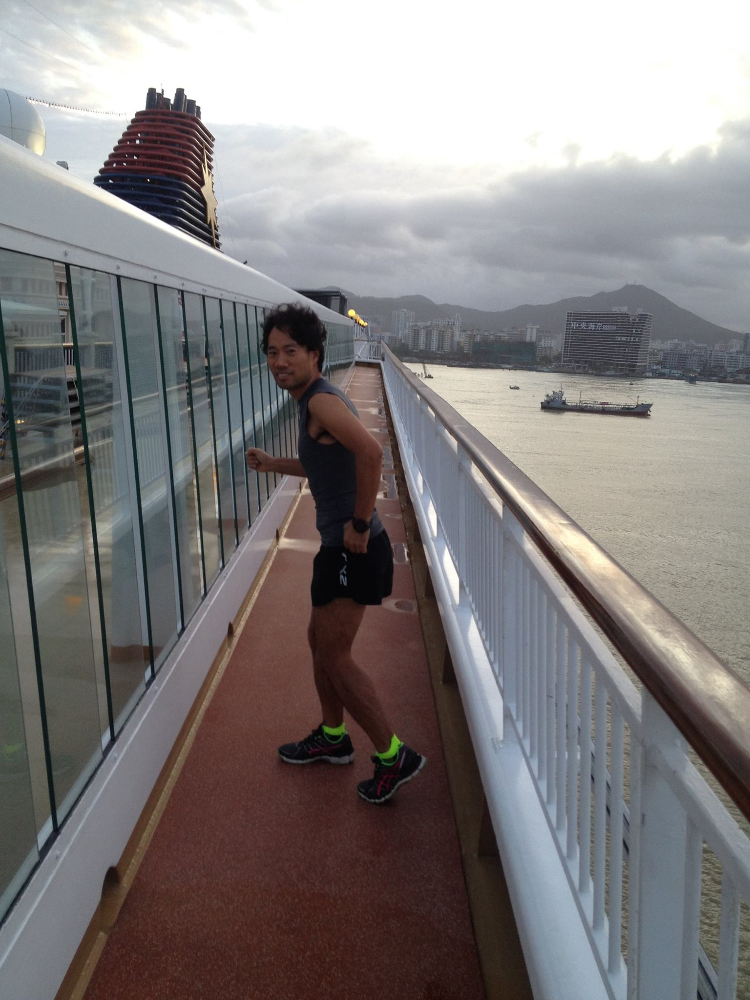
**이미지 캡션:** 한 명의 성인 남성이 크루즈선 갑판 위에서 달리기 운동을 하고 있다. 남성은 30대 후반에서 40대 초반으로 보이며, 곱슬거리는 검은색 머리카락을 가지고 있다. 그는 회색 민소매 상의와 검은색 반바지, 그리고 형광 녹색 양말과 검은색 운동화를 착용하고 있다. 그의 표정은 밝고 활기차 보이며, 달리면서 카메라를 향해 살짝 미소를 짓고 있다. 배경에는 흐린 하늘과 함께 바다, 그리고 멀리 보이는 도시 풍경이 펼쳐져 있다. 도시에는 높은 건물들이 보이며, 바다 위에는 작은 배 한 척이 떠 있다. 크루즈선의 하얀색 난간과 유리로 된 벽이 보이며, 갑판 바닥은 붉은색으로 되어 있다. 전체적으로 흐린 날씨 속에서 운동하는 활기찬 분위기를 느낄 수 있다.
 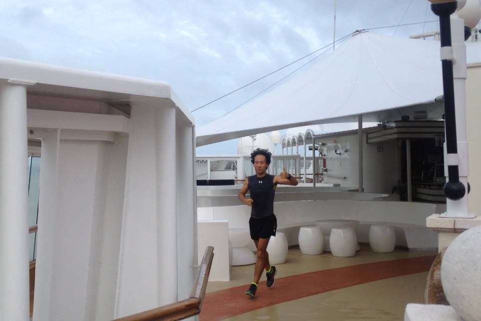
**이미지 캡션:** 한 명의 성인 남성이 크루즈선 갑판 위에서 조깅을 하고 있다. 그는 검은색 민소매 상의와 검은색 반바지를 입고 있으며, 발에는 형광색 포인트가 있는 운동화를 신고 있다. 남성은 왼쪽 팔을 앞으로 뻗고 오른쪽 팔은 뒤로 젖힌 채 달리는 중이며, 오른쪽 엄지손가락을 치켜들고 있어 긍정적인 표정을 짓고 있다. 배경에는 하얀색 천막이 넓게 펼쳐져 있고, 흰색 테이블과 의자들이 놓여 있다. 갑판 바닥은 붉은색과 베이지색으로 구분되어 있으며, 일부는 젖어 있는 것으로 보인다. 하늘은 구름이 끼어 흐린 날씨를 나타낸다. 전체적으로 활동적이고 건강한 분위기를 풍기는 장면이다.
 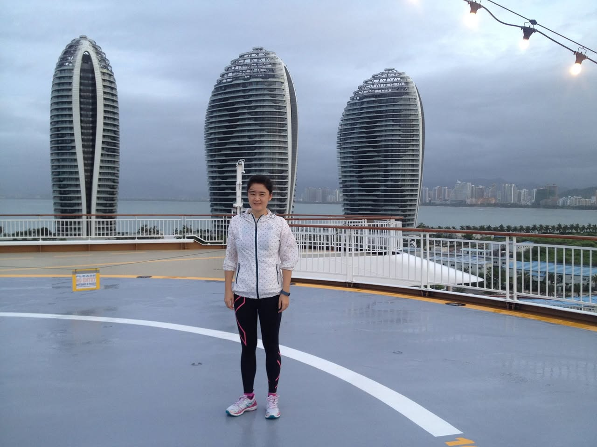
**이미지 캡션:** 한 명의 성인 여성이 회색 헬리패드 위에 서서 카메라를 바라보고 있으며, 그녀는 흰색 바탕에 파란색 점이 찍힌 바람막이 재킷과 검은색 레깅스, 그리고 분홍색과 흰색 운동화를 신고 있다. 그녀는 30대 초중반으로 보이며, 짧은 머리에 부드러운 미소를 띠고 있다. 그녀의 뒤로는 독특한 타원형 모양의 현대적인 고층 건물 세 채가 바다를 배경으로 서 있고, 흐린 하늘 아래 도시 풍경이 펼쳐져 있다. 헬리패드 바닥에는 흰색과 노란색 선이 그려져 있으며, 한쪽에는 "PLEASE NO ENTRY"라고 쓰인 노란색 표지판이 보인다. 전반적으로 차분하고 현대적인 분위기를 자아낸다.

### 9월 20일 (토) 11:44 · If you are a developer, please check out…

If you are a developer, please check out users' thoughts on software features and corresponding sentiment automatically mined from user comments.

http://www.cse.ust.hk/~xguaa/srminer/srminer.html

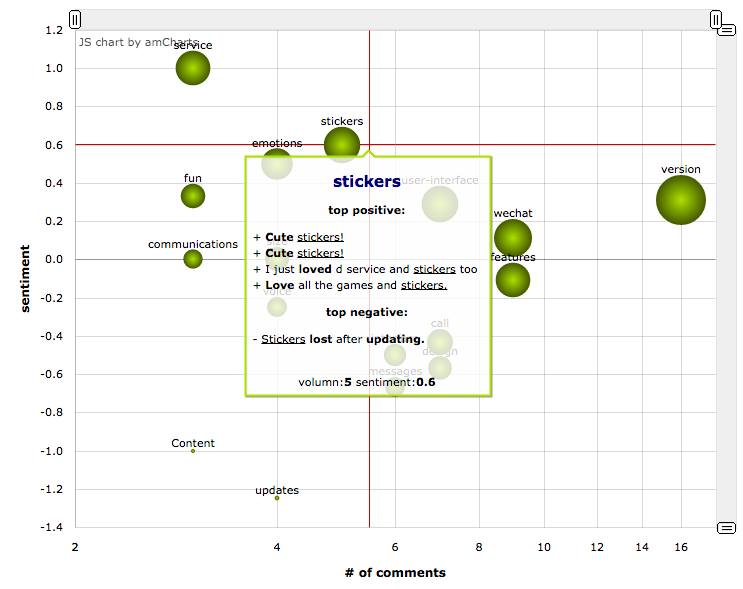
**이미지 캡션:** 이 이미지는 amCharts에서 만든 JS 차트로, 가로축은 댓글 수를, 세로축은 감성 점수를 나타내는 버블 차트입니다. 차트에는 "service", "emotions", "fun", "communications", "stickers", "user-interface", "wechat", "features", "version", "call", "design", "messages", "Content", "updates" 등 다양한 키워드가 버블로 표시되어 있습니다. 각 버블의 크기는 해당 키워드에 대한 댓글 수를 나타내며, 버블의 위치는 감성 점수를 나타냅니다. "stickers"라는 키워드에 대한 상세 정보가 포함된 팝업 창이 표시되어 있으며, 여기에는 "top positive"와 "top negative"로 분류된 댓글 예시와 함께 해당 키워드의 볼륨 및 감성 점수가 나타나 있습니다. "top positive"에는 "Cute stickers!", "I just loved d service and stickers too", "Love all the games and stickers."와 같은 긍정적인 댓글이, "top negative"에는 "Stickers lost after updating."와 같은 부정적인 댓글이 포함되어 있습니다. 전반적으로 이 차트는 특정 서비스나 제품에 대한 사용자들의 의견과 감성을 시각적으로 분석한 결과를 보여줍니다.
 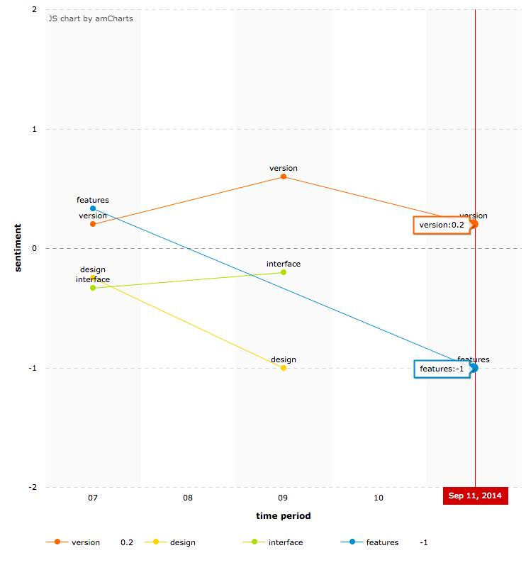
**이미지 캡션:** 이것은 amCharts로 만든 JS 차트로, 시간 경과에 따른 감정 변화를 보여주는 선 그래프입니다. x축은 시간 기간을 나타내며 07, 08, 09, 10으로 표시되어 있으며, 오른쪽 끝에는 2014년 9월 11일이라는 날짜가 빨간색 세로선으로 강조되어 있습니다. y축은 감정의 정도를 나타내며 -2부터 2까지의 범위로 표시되어 있습니다. 그래프에는 네 개의 선이 있으며, 각각 다른 색상과 레이블로 구분됩니다. 주황색 선은 'version'을 나타내며, 07 시점에서는 0.5 정도의 감정에서 시작하여 09 시점에서는 약 1.5로 상승했다가 10 시점에서는 다시 하락하는 추세를 보입니다. 이 선에는 'version:0.2'라는 텍스트 상자가 덧붙여져 있습니다. 파란색 선은 'features'를 나타내며, 07 시점에서는 약 0.2의 감정에서 시작하여 09 시점에서는 약 -0.5로 하락하고, 10 시점에서는 더 하락하여 약 -1.2 정도의 감정을 보입니다. 이 선의 끝에는 'features:-1'이라는 텍스트 상자가 있습니다. 노란색 선은 'design'을 나타내며, 07 시점에서는 약 -0.5의 감정에서 시작하여 09 시점에서는 약 -1의 감정으로 하락하는 추세를 보입니다. 녹색 선은 'interface'를 나타내며, 07 시점에서는 약 -0.5의 감정에서 시작하여 09 시점에서는 약 0.5로 상승하는 추세를 보입니다. 그래프 하단에는 각 선의 색상과 레이블을 설명하는 범례가 있습니다. 전반적으로 이 그래프는 시간 경과에 따른 'version', 'features', 'design', 'interface'에 대한 감정의 변화 추이를 시각적으로 보여주고 있습니다.

### 9월 21일 (일) 14:38 · is vey happy that a new (big) phone perf…

is vey happy that a new (big) phone perfectly fits in his favorite running vest.

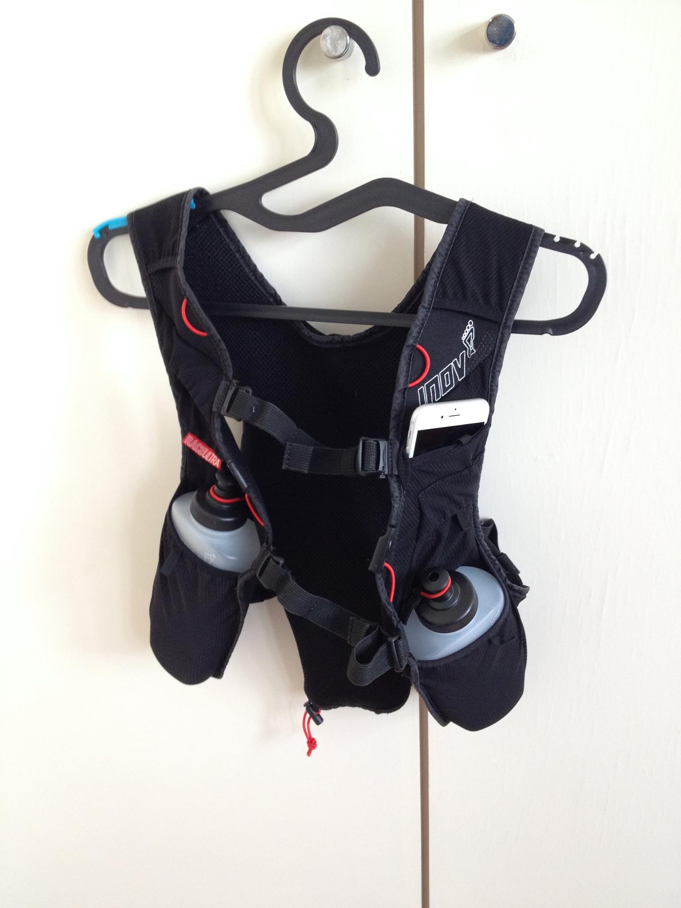
**이미지 캡션:** 이 사진은 흰색 벽에 걸린 검은색 러닝 조끼를 보여줍니다. 조끼는 검은색 플라스틱 옷걸이에 걸려 있으며, 옷걸이는 벽에 달린 은색 고리에 걸려 있습니다. 조끼는 통기성이 좋은 메쉬 소재로 만들어졌으며, 앞면에는 두 개의 물통이 수납될 수 있는 주머니가 있습니다. 각 물통은 회색 플라스틱으로 만들어졌으며 검은색 뚜껑이 달려 있습니다. 조끼의 왼쪽 어깨 부분에는 흰색 스마트폰이 수납된 주머니가 있습니다. 조끼의 앞면에는 "RACELETRA"라는 글자가 빨간색으로 쓰여 있고, 오른쪽 어깨 부분에는 "INOV"라는 로고가 흰색으로 새겨져 있습니다. 조끼의 전체적인 색상은 검은색이며, 빨간색과 흰색의 포인트가 있습니다. 사진의 분위기는 깔끔하고 정돈된 느낌을 줍니다.

### 9월 29일 (월) 19:26 · 📷 앨범: Profile pictures (1장)

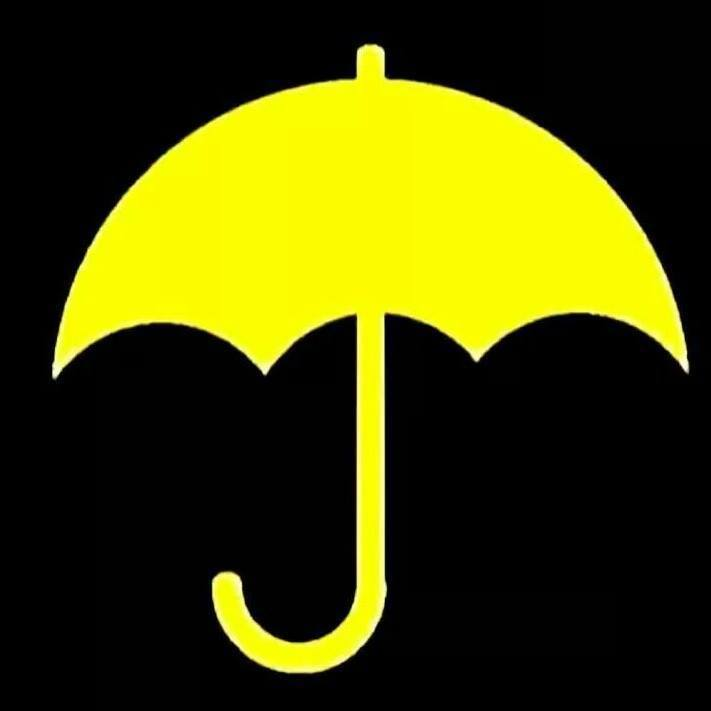
**이미지 캡션:** 검은색 배경에 노란색 우산 로고가 중앙에 배치되어 있습니다. 우산은 활짝 펼쳐져 있으며, 손잡이는 J자 모양으로 구부러져 있습니다. 이 로고는 홍콩 민주화 시위에서 사용된 상징으로, 평화적인 시위를 나타냅니다. 사진에는 사람이 등장하지 않으며, 장소나 사물에 대한 추가 정보도 없습니다. 텍스트는 보이지 않으며, 전반적으로 단순하고 상징적인 분위기를 풍깁니다.
