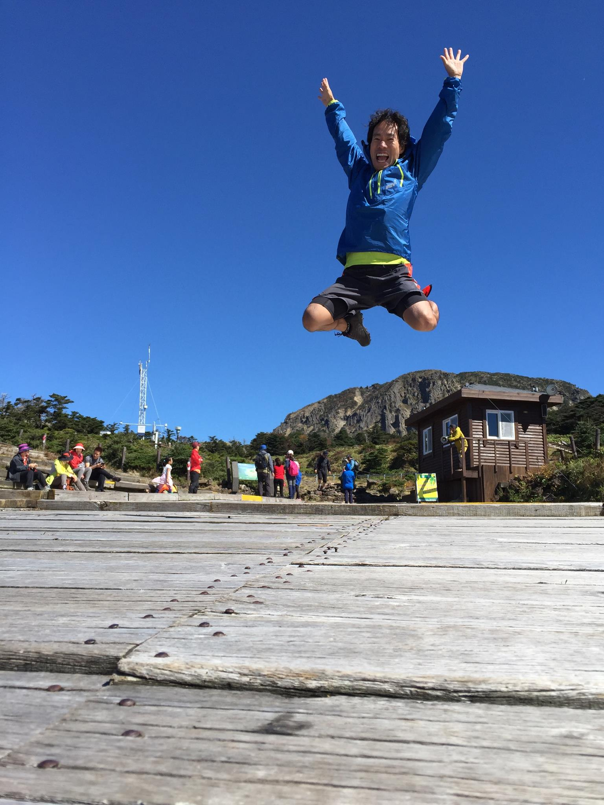

# 2014년 10월

[← 2014년](README.md)

### 10월 2일 (목) 19:53 · Turning around at the top of Halla mount…

📍 Hallasan, Jeju-do

Turning around at the top of Halla mountain in Jeju.

🎬 동영상 1개 (생략)

### 10월 4일 (토) 15:57 · Jumping jumping at Mt. Halla in Jeju!!

Jumping jumping at Mt. Halla in Jeju!!

**이미지 캡션:** 푸른 하늘 아래, 한 성인 남성이 점프하며 두 팔을 높이 들고 환하게 웃고 있다. 그는 파란색 바람막이 점퍼와 회색 반바지를 입고 있으며, 발에는 운동화를 신고 있다. 배경에는 나무 데크가 넓게 펼쳐져 있고, 그 너머로 산과 작은 건물, 그리고 여러 사람이 보인다. 일부 사람들은 앉아 휴식을 취하거나 서서 이야기를 나누고 있으며, 다른 사람들은 산책 중인 듯하다. 건물 옆에는 안내 표지판이 세워져 있고, 멀리 산봉우리가 보인다. 전체적으로 맑고 화창한 날씨 속에서 즐거운 야외 활동을 하는 듯한 분위기이다.
