# 2014년 11월

[← 2014년](README.md)

### 11월 15일 (토) 21:54 · MSR-NG Hiking: Wonderful people, wonderf…

MSR-NG Hiking: Wonderful people, wonderful trail, wonderful weather, wonderful everything!

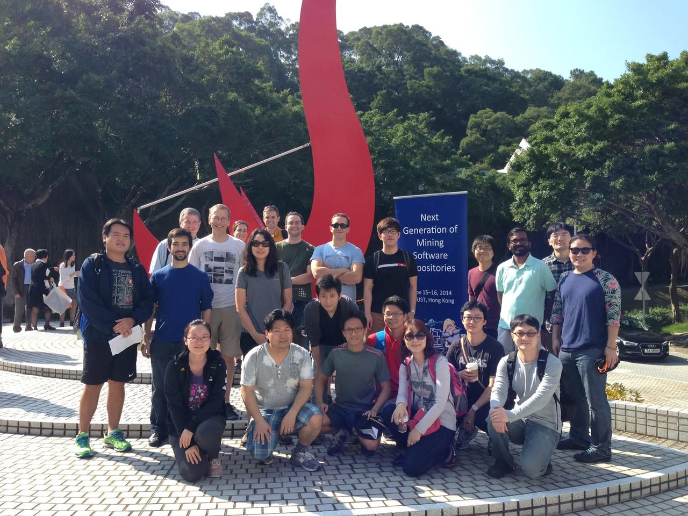
**이미지 캡션:** 화창한 날씨에 야외에서 찍은 단체 사진으로, 다양한 연령대의 남녀 20여 명이 밝은 표정으로 카메라를 응시하고 있습니다. 대부분 캐주얼한 복장을 하고 있으며, 일부는 웃거나 손을 흔드는 등 자연스러운 포즈를 취하고 있습니다. 배경에는 붉은색의 독특한 조형물과 울창한 나무, 그리고 언덕이 보이며, 오른쪽에는 'Next Generation of Mining Software repositories'라고 적힌 파란색 현수막이 걸려 있습니다. 현수막에는 'Nov 15-16, 2014 UST, Hong Kong'이라는 날짜와 장소 정보도 포함되어 있어, 학술 행사나 워크숍과 관련된 모임임을 짐작하게 합니다. 전체적으로 활기차고 긍정적인 분위기를 자아냅니다.o individuals who appear to be South Asian and Caucasian. They are dressed casually in t-shirts, shirts, shorts, and jeans, with some wearing backpacks. Most of the people are smiling or have neutral expressions, and they are arranged in multiple rows, with some standing and others kneeling in the front. The background features lush green trees and a hill, suggesting a campus or park setting. A blue banner with white text is visible behind some of the individuals, reading "Next Generation of Mining Software Repositories" and "Nov 15-16, 2014 UST, Hong Kong," indicating the event or affiliation of the group. The overall atmosphere is friendly and collegial, likely taken during a conference or academic gathering.
 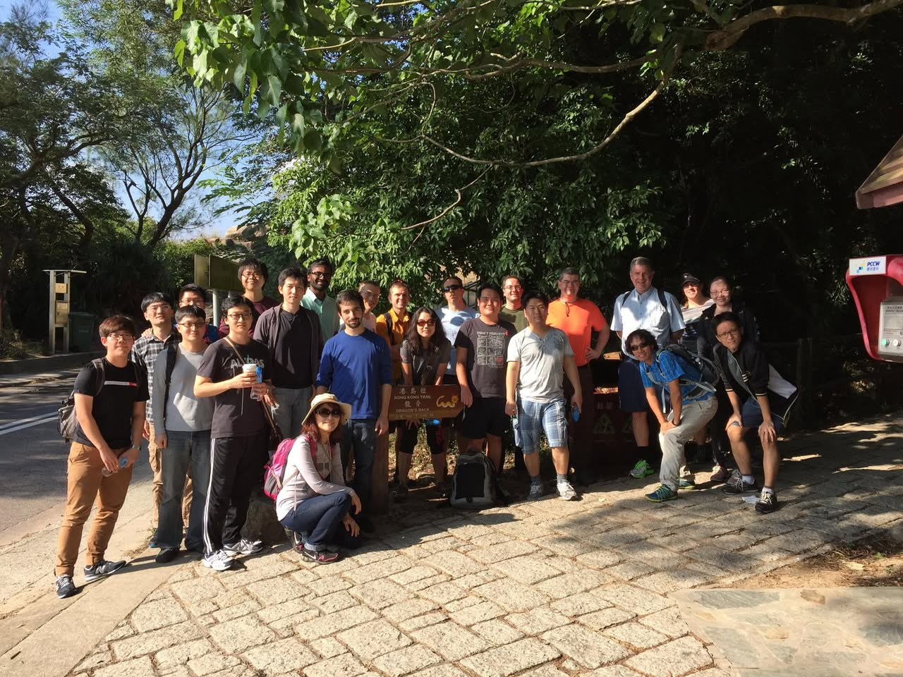
**이미지 캡션:** 화창한 날, 여러 명의 사람들이 야외에서 단체 사진을 찍고 있습니다. 사진에는 다양한 연령대의 남성과 여성들이 포함되어 있으며, 대부분 캐주얼한 복장을 하고 있습니다. 어떤 사람들은 웃고 있고, 어떤 사람들은 카메라를 응시하고 있으며, 일부는 편안하게 서 있거나 앉아 있습니다. 배경에는 울창한 나무와 숲이 우거진 언덕이 보이며, 햇빛이 나뭇잎 사이로 비쳐 따뜻하고 평화로운 분위기를 자아냅니다. 사진 오른쪽에는 빨간색 공중전화 부스가 보이고, 그 옆에는 "HONG KONG TRAIL DRAGON'S BACK"이라고 쓰인 표지판이 있습니다. 전반적으로 즐겁고 활동적인 야외 활동의 순간을 포착한 사진입니다.ees and foliage, suggesting a park or hiking trail. In the background, there is a red telephone booth and a sign with Chinese characters and English text that reads "HONG KONG TRAIL DRAGON'S BACK". The overall atmosphere is cheerful and relaxed, with many individuals smiling and looking at the camera.
 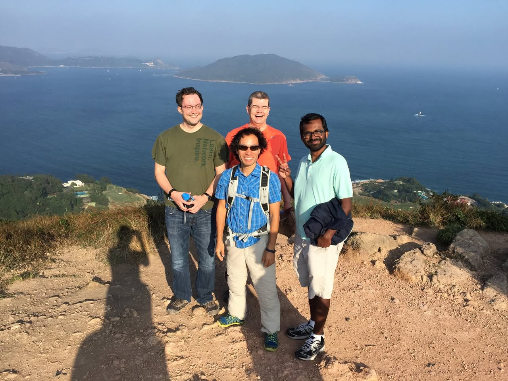
**이미지 캡션:** 네 명의 성인 남성이 산 정상에서 바다를 배경으로 사진을 찍고 있습니다. 왼쪽 첫 번째 남성은 녹색 티셔츠에 청바지를 입고 있으며, 손에는 파란색 물통을 들고 있습니다. 두 번째 남성은 주황색 티셔츠를 입고 환하게 웃고 있습니다. 세 번째 남성은 파란색 체크무늬 셔츠에 베이지색 바지를 입고 있으며, 배낭을 메고 선글라스를 착용하고 있습니다. 네 번째 남성은 하늘색 폴로 셔츠에 흰색 반바지를 입고 있으며, 손에는 어두운 색의 옷을 들고 있고, 브이 포즈를 취하고 있습니다. 배경으로는 푸른 바다와 섬, 그리고 멀리 보이는 산들이 펼쳐져 있습니다. 햇살이 비추는 맑은 날씨이며, 전체적으로 즐겁고 활기찬 분위기입니다.리 보이는 산들이 펼쳐져 있습니다. 햇살이 비추는 맑은 날씨이며, 전체적으로 즐겁고 활기찬 분위기입니다.
 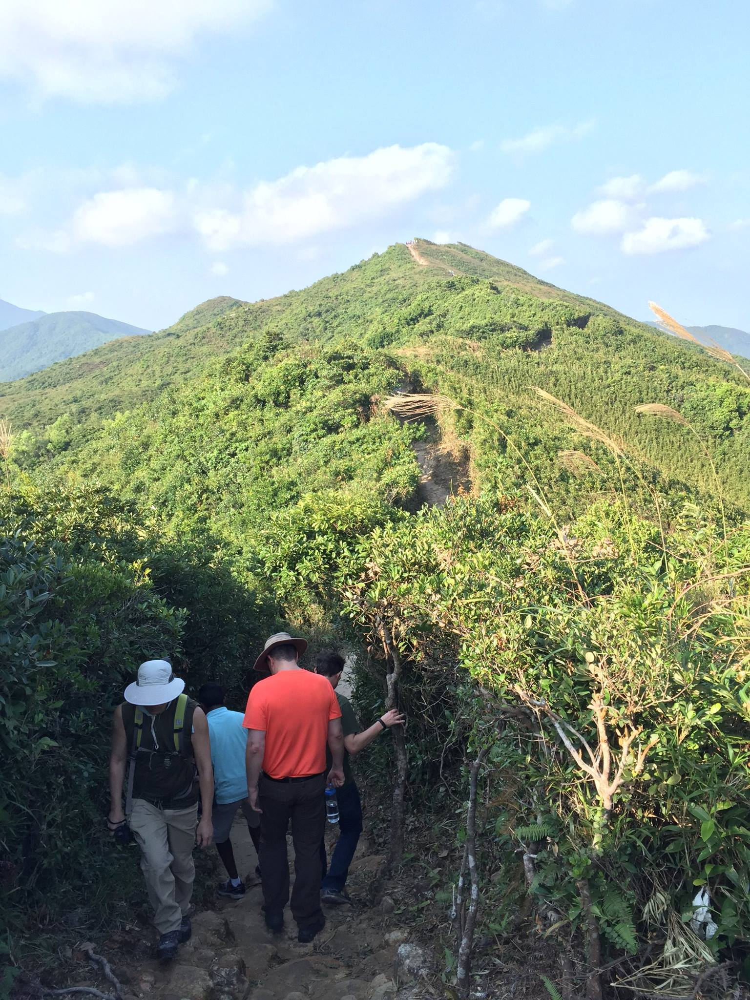
**이미지 캡션:** 네 명의 사람이 산길을 따라 하이킹하고 있으며, 그 뒤로는 푸른 산과 맑은 하늘이 펼쳐져 있습니다. 가장 앞에는 흰색 모자를 쓰고 녹색 조끼와 베이지색 바지를 입은 성인 남성이 배낭을 메고 걷고 있습니다. 그 뒤로는 하늘색 티셔츠를 입은 성인 남성이 보이고, 그 뒤를 이어 주황색 티셔츠와 갈색 바지를 입은 성인 남성이 물병을 들고 있습니다. 마지막으로 녹색 티셔츠를 입은 성인 남성이 손을 뻗어 나무를 잡고 있습니다. 사람들은 모두 편안한 복장을 하고 있으며, 표정은 보이지 않지만 전반적으로 여유로운 분위기입니다. 배경에는 울창한 녹음이 우거진 산들이 보이고, 정상에는 등산로가 이어져 있습니다. 햇살이 비추는 맑은 날씨로, 하이킹을 즐기기에 좋은 환경입니다.다. 배경에는 울창한 녹음이 우거진 산들이 보이고, 정상에는 등산로가 이어져 있습니다. 햇살이 비추는 맑은 날씨로, 하이킹을 즐기기에 좋은 환경입니다.

### 11월 18일 (화) 12:51 · Yida presented her FSE2014 paper very we…

Yida presented her FSE2014 paper very well. Good job!

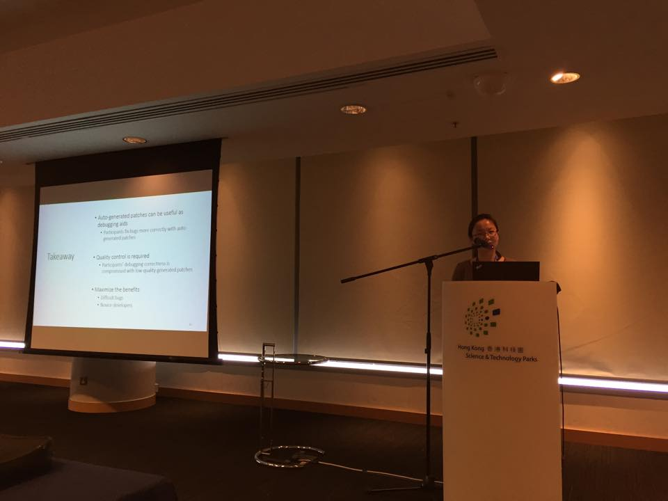
**이미지 캡션:** 한 명의 성인 여성이 강연대 뒤에서 마이크에 대고 말하고 있으며, 그녀 앞에는 노트북이 놓여 있다. 강연대에는 "Hong Kong Science & Technology Parks"라는 문구가 적혀 있다. 왼쪽에는 프로젝터 스크린이 내려져 있으며, 스크린에는 "Takeaway"라는 제목과 함께 "Auto-generated patches can be useful as debugging aids", "Quality control is required", "Maximize the benefits" 등의 내용이 영어로 적혀 있다. 배경은 어두운 조명으로 인해 차분하고 전문적인 분위기를 연출하고 있으며, 회의실 또는 강연장으로 보인다. 적혀 있다. 배경은 어두운 조명으로 인해 차분하고 전문적인 분위기를 연출하고 있으며, 회의실 또는 강연장으로 보인다.
 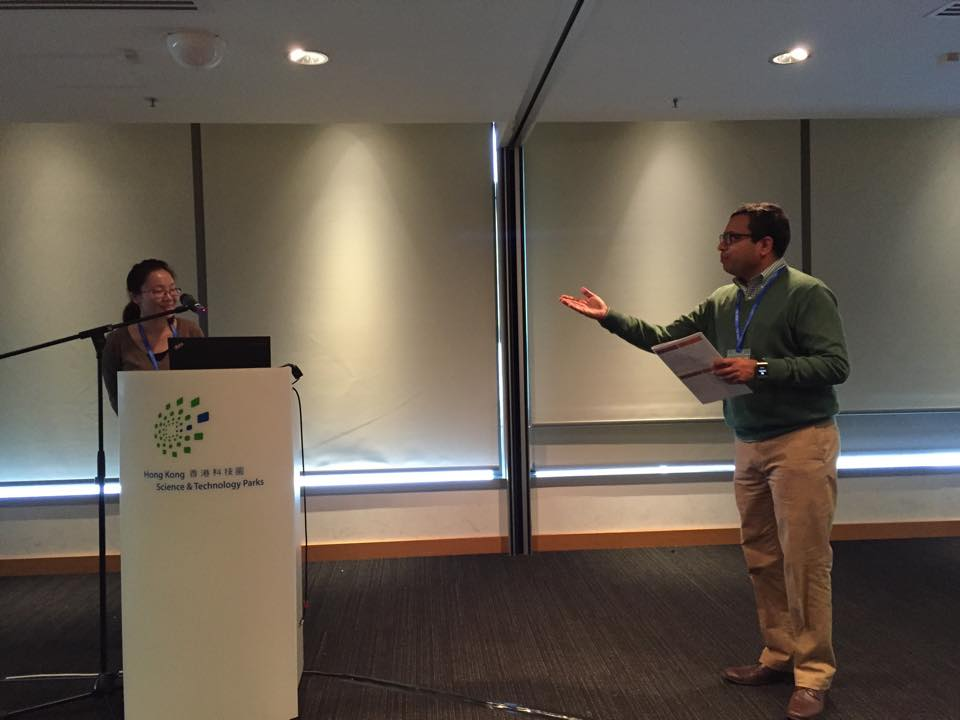
**이미지 캡션:** 한 명의 성인 여성이 연단 뒤에 서서 마이크에 대고 말하고 있으며, 그녀 앞에는 노트북이 놓여 있습니다. 그녀는 안경을 쓰고 있으며, 갈색 상의를 입고 있습니다. 연단에는 "Hong Kong 香港科技園 Science & Technology Parks"라고 적힌 로고가 있습니다. 다른 한 명의 성인 남성이 연단 앞에서 서서 종이를 들고 발표하고 있으며, 그는 안경을 쓰고 녹색 스웨터와 갈색 바지를 입고 있습니다. 그의 목에는 파란색 목걸이가 걸려 있습니다. 배경에는 조명이 켜진 흰색 커튼이 있고, 바닥은 어두운 색의 카펫입니다. 전체적으로 회의나 발표회와 같은 공식적인 행사 분위기입니다. 색의 카펫입니다. 전체적으로 회의나 발표회와 같은 공식적인 행사 분위기입니다.
 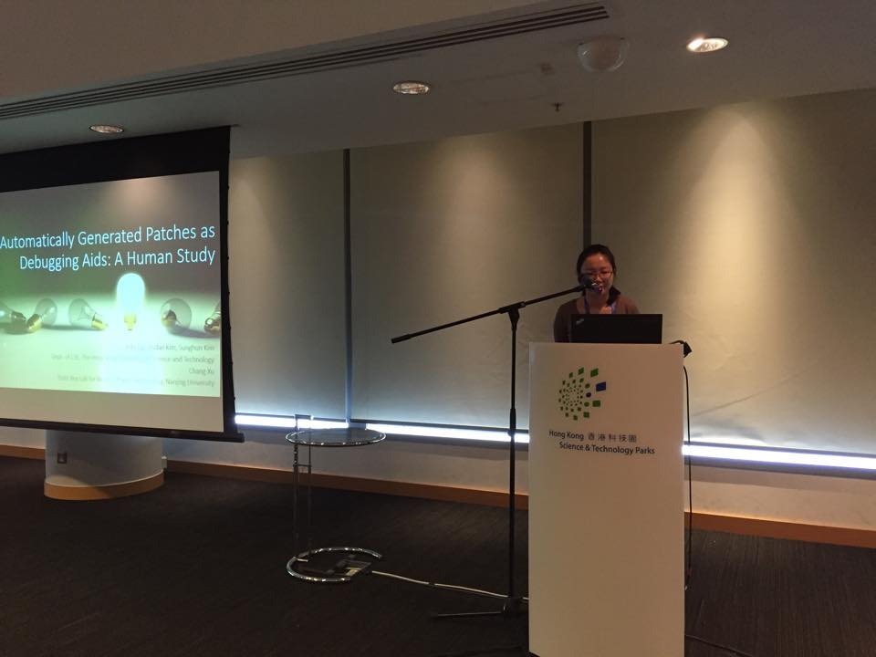
**이미지 캡션:** 이 사진은 발표자가 강연을 하고 있는 실내 강연장으로, 좌측에는 발표 내용이 적힌 스크린이 있고 우측에는 발표자가 서 있는 연단이 보인다. 스크린에는 "Automatically Generated Patches as Debugging Aids: A Human Study"라는 제목과 함께 여러 개의 전구가 이미지가 포함되어 있으며, 그 아래에는 연구진의 이름과 소속이 작게 적혀 있다. 발표자는 30대에서 40대로 보이는 아시아계 여성으로, 갈색 상의를 입고 있으며 안경을 쓰고 있다. 그녀는 마이크 앞에 서서 노트북을 보며 발표 중이며, 표정은 차분하고 집중하고 있는 듯하다. 연단에는 "Hong Kong 香港科技園 Science & Technology Parks"라는 로고와 함께 영문 및 한자 표기가 되어 있다. 배경은 조명이 켜진 벽으로, 전체적으로 차분하고 전문적인 분위기를 연출하고 있다.북을 보며 발표 중이며, 표정은 차분하고 집중하고 있는 듯하다. 연단에는 "Hong Kong 香港科技園 Science & Technology Parks"라는 로고와 함께 영문 및 한자 표기가 되어 있다. 배경은 조명이 켜진 벽으로, 전체적으로 차분하고 전문적인 분위기를 연출하고 있다.

### 11월 18일 (화) 13:24 · FSE 2014 has the MSR session (not the Wo…

FSE 2014 has the MSR session (not the Working Conference MSR). It got two stars!! :-) #fse204

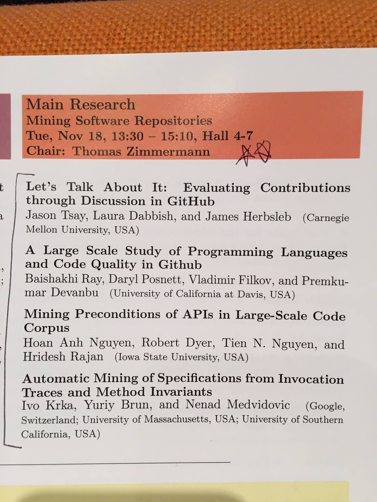
**이미지 캡션:** 이 사진은 학술 행사 프로그램의 일부를 보여주며, 주황색 배경의 상단에는 "Main Research"라는 제목과 함께 "Mining Software Repositories"라는 세션 정보가 기재되어 있습니다. 날짜는 11월 18일 화요일 오후 1시 30분부터 3시 10분까지이며, 장소는 Hall 4-7입니다. 세션의 의장은 Thomas Zimmermann이며, 그의 이름 옆에는 펜으로 그린 듯한 별 모양과 동그라미가 있습니다. 그 아래에는 여러 발표 제목과 발표자, 소속 대학이 나열되어 있습니다. 첫 번째 발표는 "Let's Talk About It: Evaluating Contributions through Discussion in GitHub"이며, Jason Tsay, Laura Dabbish, James Herbsleb이 카네기 멜론 대학교 소속으로 발표합니다. 두 번째 발표는 "A Large Scale Study of Programming Languages and Code Quality in Github"이며, Baishakhi Ray, Daryl Posnett, Vladimir Filkov, Premkumar Devanbu가 캘리포니아 대학교 데이비스 캠퍼스 소속으로 발표합니다. 세 번째 발표는 "Mining Preconditions of APIs in Large-Scale Code Corpus"이며, Hoan Anh Nguyen, Robert Dyer, Tien N. Nguyen, Hridesh Rajan이 아이오와 주립 대학교 소속으로 발표합니다. 마지막으로 네 번째 발표는 "Automatic Mining of Specifications from Invocation Traces and Method Invariants"이며, Ivo Krka, Yuriy Brun, Nenad Medvidovic이 Google, 스위스, 매사추세츠 대학교, 서던 캘리포니아 대학교 소속으로 발표합니다. 사진의 전체적인 분위기는 학술적인 행사 안내문의 일부로 보이며, 텍스트 정보가 주를 이루고 있습니다.표는 "Let's Talk About It: Evaluating Contributions through Discussion in GitHub"이며, Jason Tsay, Laura Dabbish, James Herbsleb이 카네기 멜론 대학교 소속으로 발표합니다. 두 번째 발표는 "A Large Scale Study of Programming Languages and Code Quality in Github"이며, Baishakhi Ray, Daryl Posnett, Vladimir Filkov, Premkumar Devanbu가 캘리포니아 대학교 데이비스 캠퍼스 소속으로 발표합니다. 세 번째 발표는 "Mining Preconditions of APIs in Large-Scale Code Corpus"이며, Hoan Anh Nguyen, Robert Dyer, Tien N. Nguyen, Hridesh Rajan이 아이오와 주립 대학교 소속으로 발표합니다. 마지막으로 네 번째 발표는 "Automatic Mining of Specifications from Invocation Traces and Method Invariants"이며, Ivo Krka, Yuriy Brun, Nenad Medvidovic이 Google, 스위스, 매사추세츠 대학교, 서던 캘리포니아 대학교 소속으로 발표합니다. 사진의 전체적인 분위기는 학술적인 행사 안내문의 일부로 보이며, 텍스트 정보가 주를 이루고 있습니다.

### 11월 19일 (수) 15:04 · Hyunmin's FSE 2014 presentation was real…

Hyunmin's FSE 2014 presentation was really wonderful. Good job! #fse2014

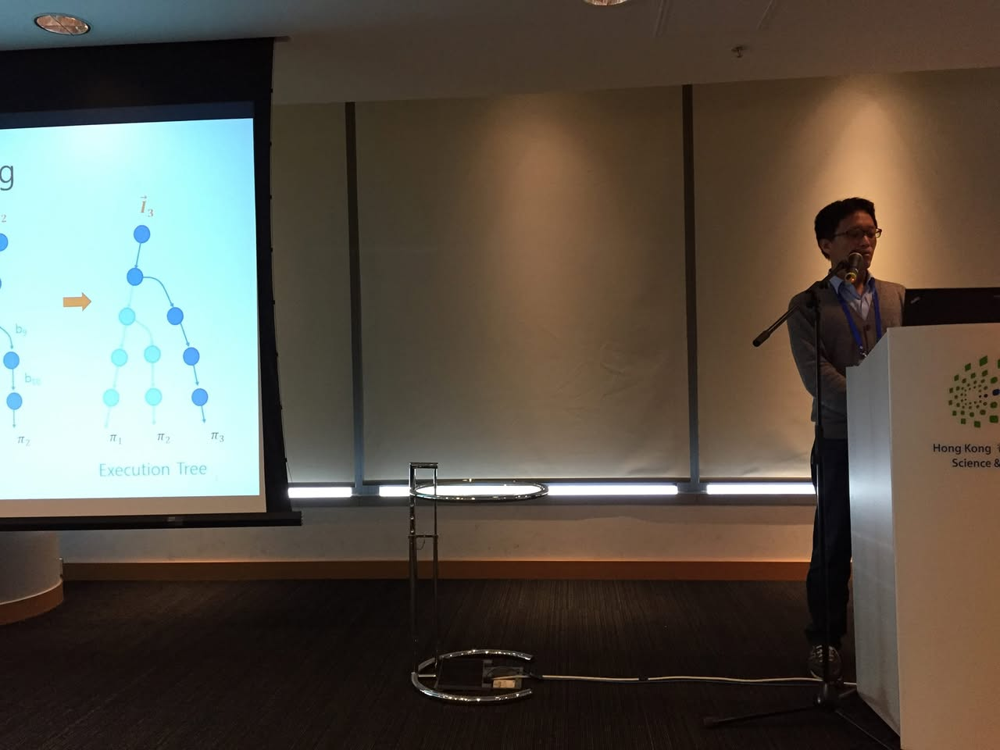
**이미지 캡션:** 발표자는 안경을 쓴 성인 남성으로, 회색 카디건 안에 파란색 셔츠를 입고 검은색 바지를 입고 있습니다. 그는 마이크가 달린 연단 뒤에 서서 발표를 하고 있으며, 연단에는 홍콩 과학기술대학교 로고와 함께 "Hong Kong University of Science & Technology"라는 글자가 보입니다. 배경에는 빔 프로젝터 화면이 있고, 화면에는 "Execution Tree"라는 제목과 함께 복잡한 트리 구조의 다이어그램이 표시되어 있습니다. 조명은 부드럽고 차분하며, 전체적으로 학술적인 발표회 분위기입니다.다.

### 11월 19일 (수) 15:04 · Hyunmin's FSE 2014 presentation was real…

Hyunmin's FSE 2014 presentation was really wonderful. Good job! #fse2014

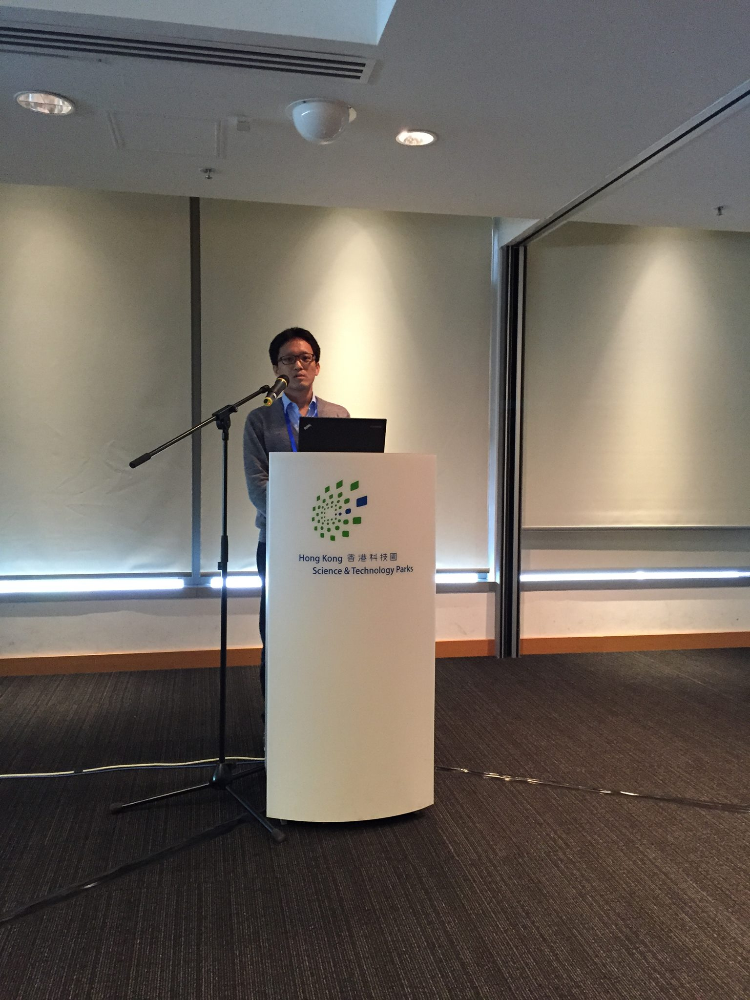
**이미지 캡션:** 한 명의 성인 남성이 연단 뒤에 서서 발표를 하고 있다. 남성은 30대 후반에서 40대 초반으로 보이며, 검은색 안경을 쓰고 있다. 그는 회색 카디건 안에 파란색 셔츠를 입고 있으며, 목에는 파란색 목걸이가 걸려 있다. 남성은 연단에 놓인 노트북을 바라보고 있으며, 그의 표정은 진지하다. 연단에는 "Hong Kong 香港 科技園 Science & Technology Parks"라고 적힌 로고가 있다. 배경에는 흰색 벽과 창문이 보이며, 바닥은 어두운 색의 카펫으로 덮여 있다. 전체적으로 차분하고 전문적인 분위기의 발표회장이다.기의 발표회장이다.

### 11월 20일 (목) 10:11 · Look forward to perspectives from indust…

Look forward to perspectives from industry this afternoon at FSE2014.

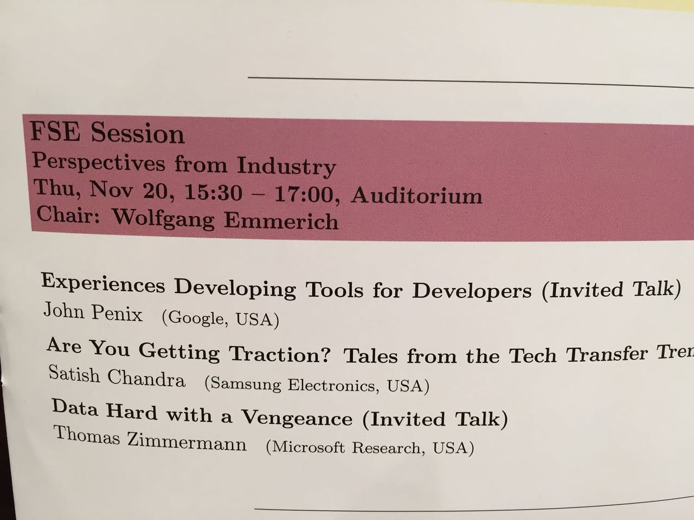
**이미지 캡션:** 이 사진은 학술 행사 또는 컨퍼런스의 일부를 보여주는 문서의 일부로, 옅은 노란색 배경에 검은색 글씨로 인쇄되어 있으며, 상단에는 분홍색 배경에 흰색 글씨로 제목이 강조되어 있습니다. 상단 분홍색 영역에는 "FSE Session"이라는 제목 아래 "Perspectives from Industry"라는 부제가 있으며, 행사 날짜와 시간은 "Thu, Nov 20, 15:30 – 17:00"이고 장소는 "Auditorium"입니다. 이 세션의 의장은 "Wolfgang Emmerich"로 명시되어 있습니다. 그 아래에는 여러 발표 세션의 목록이 이어집니다. 첫 번째 발표는 "Experiences Developing Tools for Developers (Invited Talk)"이며 발표자는 "John Penix"이고 소속은 "Google, USA"입니다. 두 번째 발표는 "Are You Getting Traction? Tales from the Tech Transfer Tren"이며 발표자는 "Satish Chandra"이고 소속은 "Samsung Electronics, USA"입니다. 세 번째 발표는 "Data Hard with a Vengeance (Invited Talk)"이며 발표자는 "Thomas Zimmermann"이고 소속은 "Microsoft Research, USA"입니다. 사진에는 사람이 직접적으로 보이지 않으며, 문서의 텍스트 정보만을 담고 있어 학술 행사 일정표의 일부로 보입니다. 전반적으로 차분하고 정보 전달에 초점을 맞춘 분위기입니다.에는 여러 발표 세션의 목록이 이어집니다. 첫 번째 발표는 "Experiences Developing Tools for Developers (Invited Talk)"이며 발표자는 "John Penix"이고 소속은 "Google, USA"입니다. 두 번째 발표는 "Are You Getting Traction? Tales from the Tech Transfer Tren"이며 발표자는 "Satish Chandra"이고 소속은 "Samsung Electronics, USA"입니다. 세 번째 발표는 "Data Hard with a Vengeance (Invited Talk)"이며 발표자는 "Thomas Zimmermann"이고 소속은 "Microsoft Research, USA"입니다. 사진에는 사람이 직접적으로 보이지 않으며, 문서의 텍스트 정보만을 담고 있어 학술 행사 일정표의 일부로 보입니다. 전반적으로 차분하고 정보 전달에 초점을 맞춘 분위기입니다.

### 11월 24일 (월) 18:41 · very good to have Dr. Soonmin Bae at Hon…

very good to have Dr. Soonmin Bae at Hong Kong University of Science and Technology (HKUST). Her talk about computer vision was very interesting.

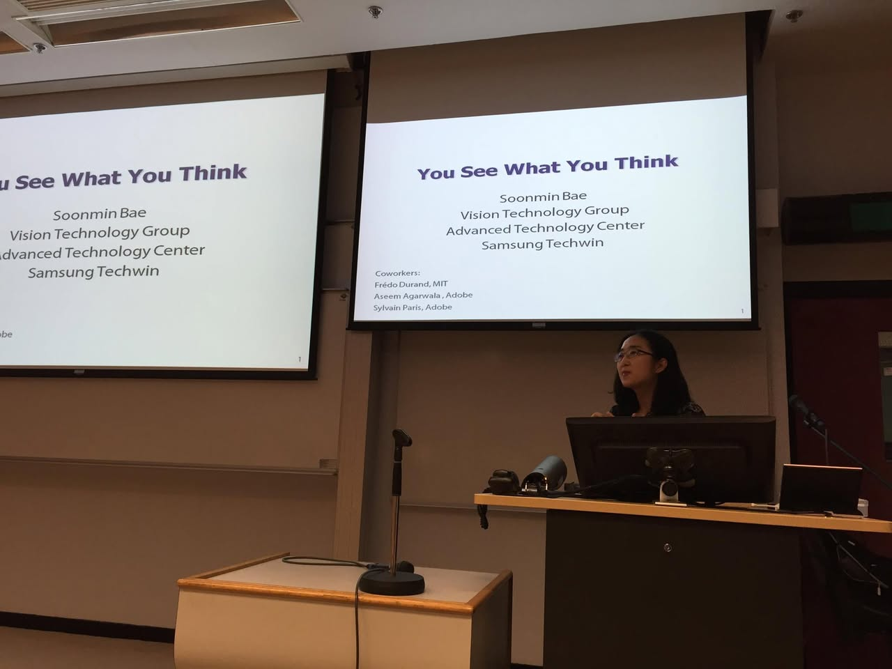
**이미지 캡션:** 발표자가 강연을 하고 있는 모습으로, 성인 여성으로 보이는 발표자는 안경을 쓰고 검은색 상의를 입고 있으며, 입을 살짝 벌리고 발표 중인 것으로 보인다. 발표자는 검은색 스탠드 위에 놓인 컴퓨터 모니터 뒤에 서서 강연을 진행하고 있으며, 모니터 옆에는 노트북과 마이크가 놓여 있다. 배경에는 두 개의 대형 스크린이 걸려 있는데, 왼쪽 스크린에는 "You See What You Think"라는 제목과 함께 발표자의 이름, 소속, 협력자들의 이름이 적혀 있고, 오른쪽 스크린에도 동일한 제목과 발표자 정보가 적혀 있다. 스크린 아래에는 마이크가 설치된 스탠드가 있고, 강연장으로 보이는 공간에는 조명이 설치되어 있으며, 전반적으로 학술 발표회나 세미나와 같은 분위기이다.다. 스크린 아래에는 마이크가 설치된 스탠드가 있고, 강연장으로 보이는 공간에는 조명이 설치되어 있으며, 전반적으로 학술 발표회나 세미나와 같은 분위기이다.
 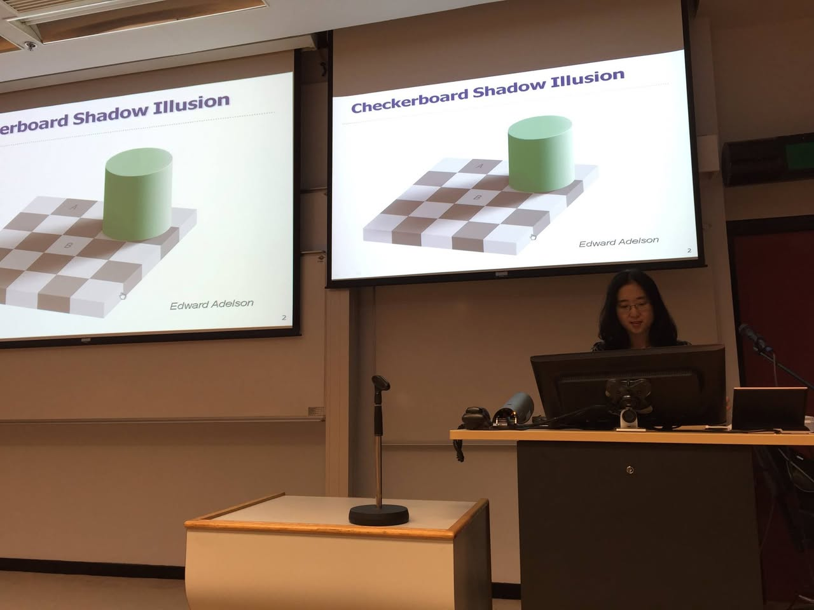
**이미지 캡션:** 이 사진은 강의실에서 진행되는 발표 장면을 담고 있으며, 두 개의 스크린에는 "Checkerboard Shadow Illusion"이라는 제목과 함께 체스판 위에 놓인 녹색 원기둥 그림이 표시되어 있습니다. 그림에는 A와 B라는 표시가 되어 있으며, 이는 유명한 착시 현상을 설명하기 위한 것으로 보입니다. 강단 뒤에는 안경을 쓴 젊은 여성 강사가 컴퓨터 모니터를 보며 발표를 진행하고 있으며, 그녀는 차분하고 집중하는 표정을 짓고 있습니다. 그녀 앞에는 마이크와 노트북이 놓여 있습니다. 배경에는 강의실의 벽과 조명이 보이며, 전체적으로 학술적인 분위기를 풍깁니다.조명이 보이며, 전체적으로 학술적인 분위기를 풍깁니다.
 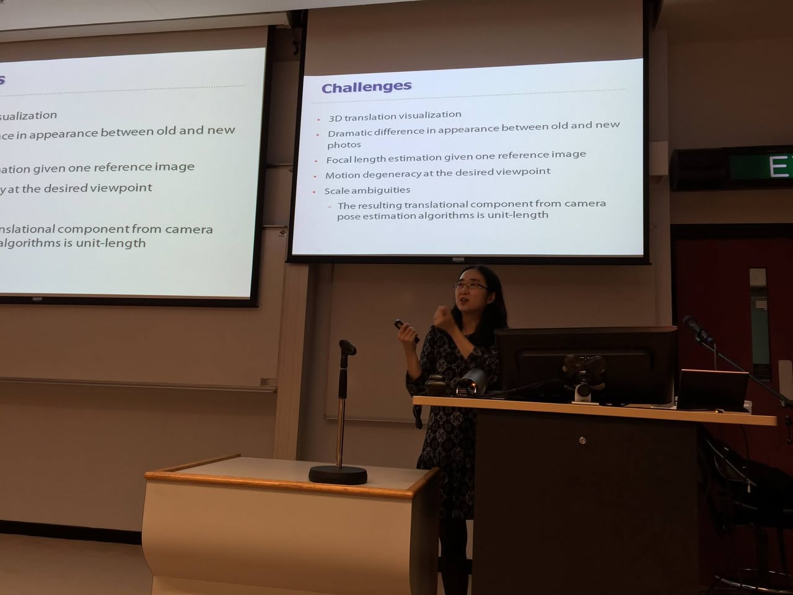
**이미지 캡션:** 한 명의 성인 여성이 강단 뒤에서 발표를 하고 있으며, 그녀는 검은색과 흰색 패턴의 드레스를 입고 안경을 쓰고 있다. 그녀는 오른손으로 발표 자료를 가리키고 있고, 왼손에는 검은색 리모컨을 쥐고 있다. 그녀의 표정은 진지하고 집중하고 있는 듯하다. 그녀 뒤에는 두 개의 스크린이 있고, 왼쪽 스크린에는 "s"로 시작하는 제목과 함께 글자들이 보이며, 오른쪽 스크린에는 "Challenges"라는 제목 아래 3D 번역 시각화, 사진 간의 외형적 차이, 초점 거리 추정, 모션 퇴화, 스케일 모호성 등 여러 항목이 나열되어 있다. 강단 위에는 컴퓨터 모니터, 마이크, 노트북 등이 놓여 있다. 배경에는 강의실의 벽과 문이 보이며, 벽에는 "E"라고 쓰인 표지판이 있다. 전체적으로 학술 발표 또는 강의 상황으로 보이며, 진지하고 집중된 분위기이다.열되어 있다. 강단 위에는 컴퓨터 모니터, 마이크, 노트북 등이 놓여 있다. 배경에는 강의실의 벽과 문이 보이며, 벽에는 "E"라고 쓰인 표지판이 있다. 전체적으로 학술 발표 또는 강의 상황으로 보이며, 진지하고 집중된 분위기이다.

### 11월 28일 (금) 17:26 · Last lecture this semester! I was so hap…

📍 香港科技大學學生會 HKUST Students' Union

Last lecture this semester! I was so happy with many bright students. Good luck to all.

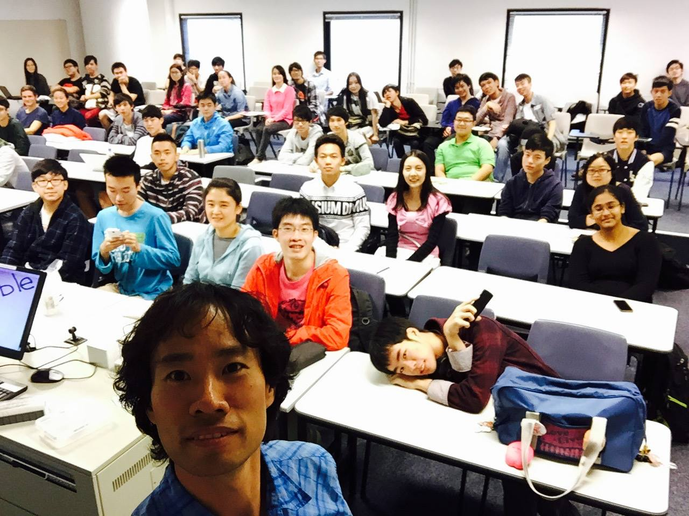
**이미지 캡션:** 사진은 강의실에서 수업을 듣고 있는 다양한 연령대의 학생들과 한 명의 성인 남성 강사로 보이는 인물이 함께 찍힌 단체 사진입니다. 사진 앞쪽에는 검은색 곱슬머리에 파란색 체크무늬 셔츠를 입은 성인 남성이 카메라를 향해 미소를 지으며 셀카를 찍고 있습니다. 그의 뒤로는 흰색 책상들이 줄지어 있고, 책상 위에는 노트북, 마우스, 계산기, 물병 등이 놓여 있습니다. 강의실에는 총 30명 이상의 학생들이 앉아 있으며, 대부분 10대 후반에서 20대 초반으로 보이는 아시아계 학생들입니다. 학생들은 다양한 복장을 하고 있으며, 일부는 휴대폰을 보거나 친구와 이야기하는 등 수업에 집중하지 않는 모습도 보입니다. 강의실 배경에는 흰색 벽과 창문이 보이며, 전반적으로 밝고 캐주얼한 분위기입니다. 일부 학생들의 옷에는 "SIUM DM"이라는 글자가 희미하게 보입니다.있으며, 일부는 휴대폰을 보거나 친구와 이야기하는 등 수업에 집중하지 않는 모습도 보입니다. 강의실 배경에는 흰색 벽과 창문이 보이며, 전반적으로 밝고 캐주얼한 분위기입니다. 일부 학생들의 옷에는 "SIUM DM"이라는 글자가 희미하게 보입니다.

### 11월 28일 (금) 17:26 · Last lecture this semester! I was so hap…

📍 香港科技大學學生會 HKUST Students' Union

Last lecture this semester! I was so happy with many bright students. Good luck to all.

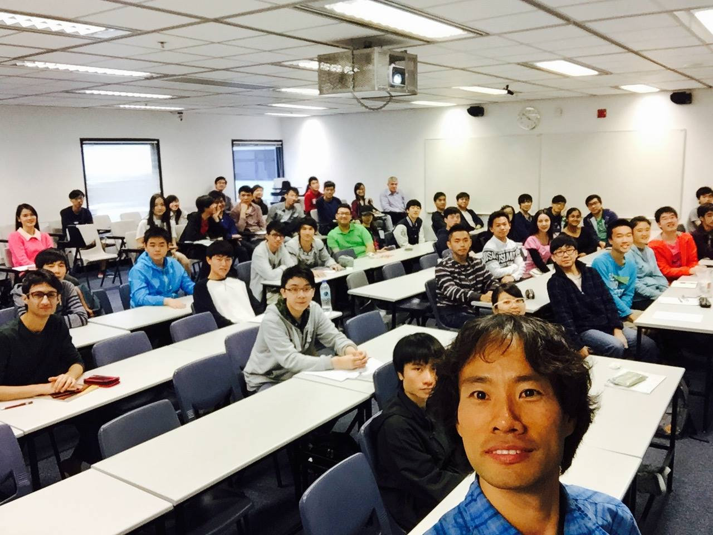
**이미지 캡션:** 이 사진은 강의실에서 수업을 듣고 있는 학생들의 모습을 담고 있으며, 사진 앞쪽에는 한 명의 성인 남성이 셀카를 찍고 있다. 이 남성은 짧은 검은색 머리에 푸른색 체크무늬 셔츠를 입고 있으며, 미소를 짓고 있다. 그의 뒤로는 여러 명의 학생들이 강의실에 앉아 있으며, 대부분 10대 후반에서 20대 초반으로 보이는 아시아계 남녀 학생들이다. 학생들은 다양한 복장을 하고 있으며, 일부는 노트북이나 필기구를 앞에 두고 수업에 집중하는 듯한 표정을 짓고 있다. 강의실은 흰색 벽과 형광등 조명으로 밝게 비춰져 있으며, 앞쪽에는 칠판과 프로젝터가 보인다. 전체적으로 학구적인 분위기이며, 학생들이 강의에 참여하고 있는 모습이다. 앞쪽에는 칠판과 프로젝터가 보인다. 전체적으로 학구적인 분위기이며, 학생들이 강의에 참여하고 있는 모습이다.
