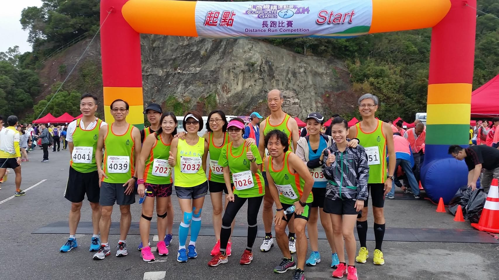
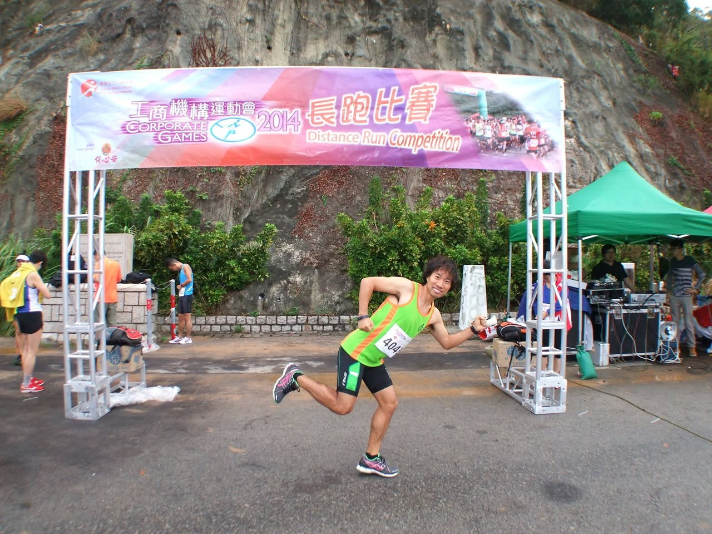
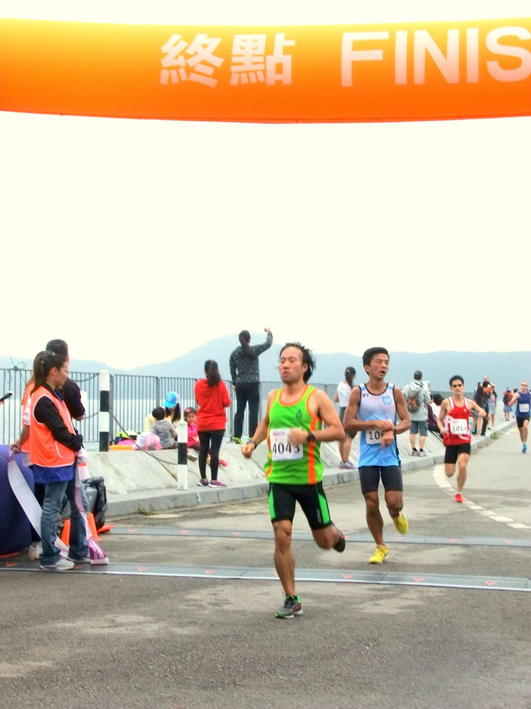
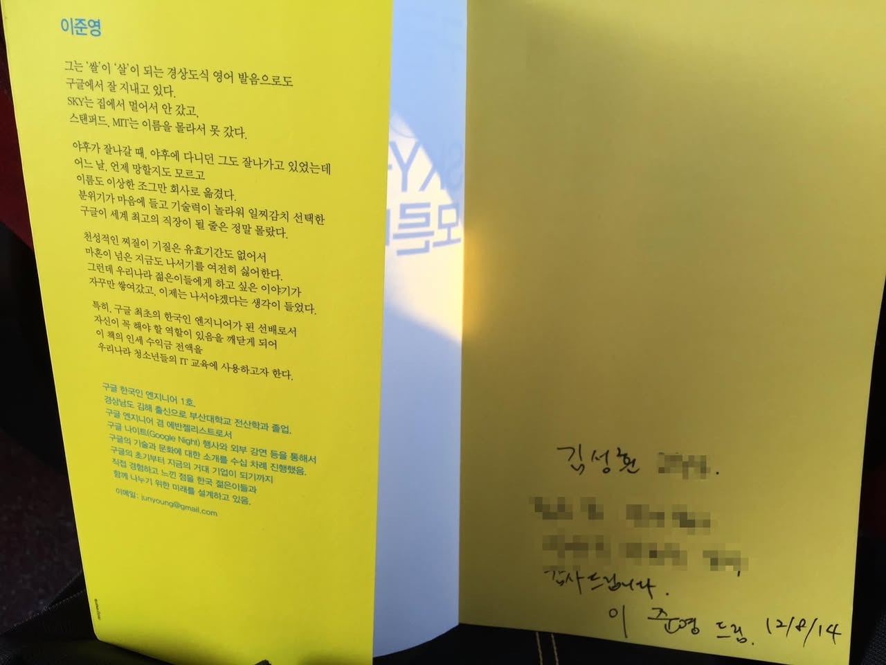
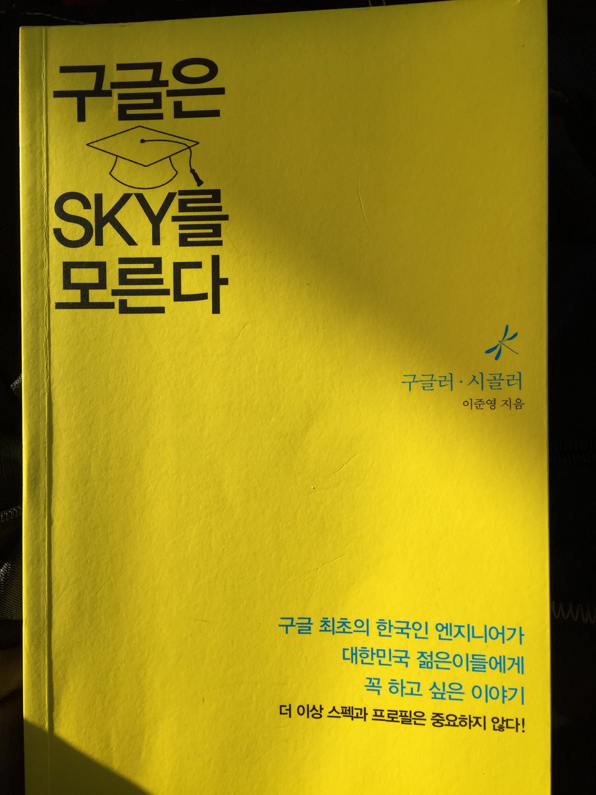
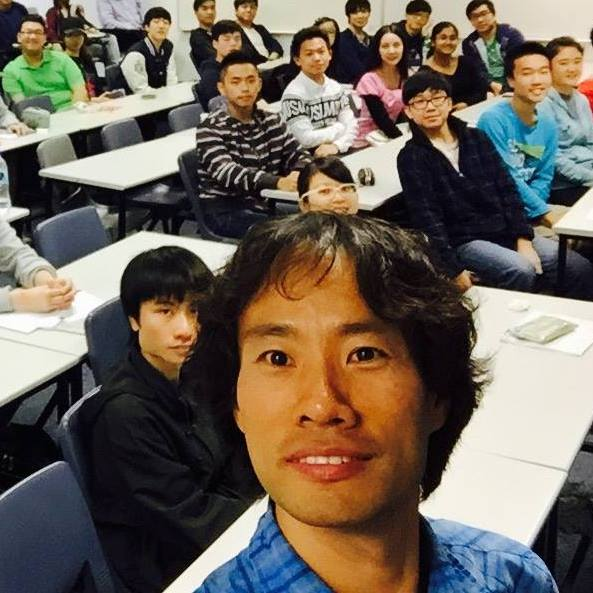
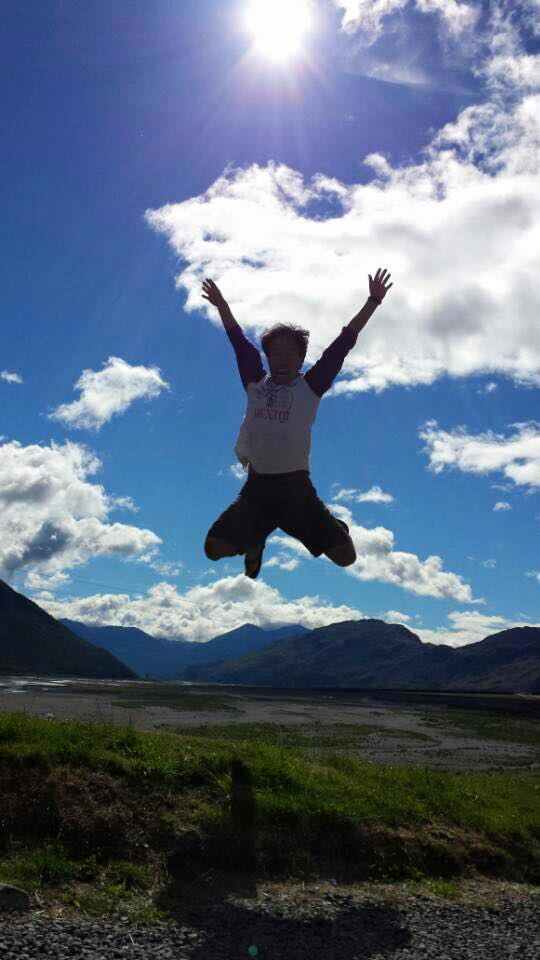
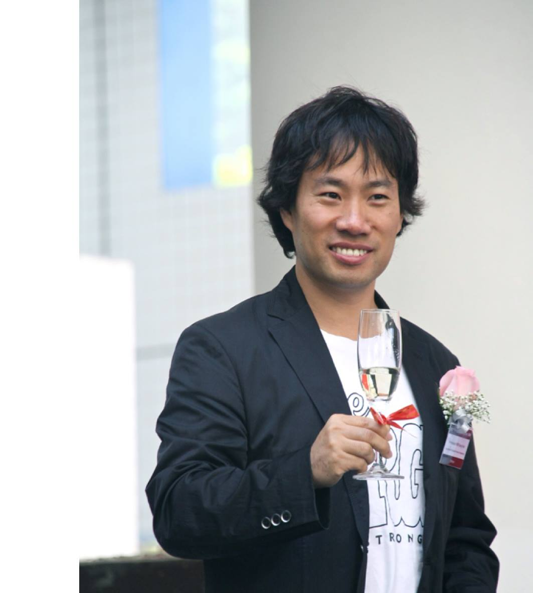

# 2014년 12월

[← 2014년](README.md)

### 12월 1일 (월) 13:13 · fun running for 2014 Corporate Games 201…

fun running for 2014 Corporate Games 2014 - Distance Run Competition. Sung was the fastest (27:59 for 7km) in the HKUST team, but not good enough to win the whole Game.

**이미지 캡션:** 사진은 2014년 기업 게임 장거리 달리기 대회의 시작점에서 찍은 것으로 보이며, 참가자들이 밝은 녹색 조끼와 운동복을 입고 활기찬 표정으로 포즈를 취하고 있습니다. 남성 참가자들은 대부분 중년이며, 여성 참가자들은 젊은 여성부터 중년 여성까지 다양합니다. 모두 운동화와 스포츠 의류를 착용하고 있으며, 일부는 번호표를 달고 있습니다. 배경에는 알록달록한 무지개색의 풍선 아치형 출발선이 있고, 그 뒤로 산과 나무가 보입니다. 또한, 참가자들이 모여 있는 모습과 행사 관련 천막, 쓰레기 봉투 등이 보입니다. 전체적으로 즐겁고 활기찬 분위기이며, 참가자들이 경주를 앞두고 기대감에 차 있는 듯한 모습입니다.the support pillars. The runners are mostly wearing matching bright green tank tops with orange trim and black shorts or leggings, and many have race bibs with numbers such as 4041, 4039, 7027, 7032, 702, 703, 7026, and 043. Some are smiling and giving thumbs-up gestures, indicating a positive and celebratory atmosphere. The background shows a rocky hillside with trees and some red tents, suggesting an outdoor event. The overall mood is energetic and enthusiastic, capturing the excitement of the start of a race.
 
**이미지 캡션:** 이 사진은 2014년 기업 게임 장거리 달리기 대회 결승선 근처에서 찍힌 것으로 보인다. 사진 중앙에는 녹색 민소매 상의와 검은색 반바지를 입은 젊은 남성이 역동적인 포즈를 취하고 있다. 그의 상의에는 '404'라는 번호가 적혀 있으며, 얼굴에는 즐거운 표정이 가득하다. 배경에는 'CORPORATE GAMES 2014 長跑比賽 Distance Run Competition'이라고 적힌 대형 현수막이 걸려 있고, 그 뒤로는 가파른 산비탈과 푸른 나무들이 보인다. 현수막 왼쪽에는 금속 구조물과 함께 몇몇 참가자들이 준비하는 모습이 보이며, 오른쪽에는 녹색 천막 아래에서 DJ 장비와 사람들이 행사를 준비하는 모습도 보인다. 전반적으로 활기차고 축제 같은 분위기이다. in orange, black running shorts, and athletic shoes. He is positioned in front of a large, colorful banner that reads "工商機構運動會 2014 長跑比賽 CORPORATE GAMES Distance Run Competition" in both Chinese and English, with an image of runners at the top. The banner is supported by a metal archway. To the right of the runner, a green tent is set up, with DJ equipment and several people standing around, suggesting a festive atmosphere. In the background, a steep, rocky hillside covered in sparse vegetation rises behind the event. Other participants and event staff are visible in the distance, including a woman with a yellow backpack and a man in a blue tank top. The overall scene depicts the energetic and celebratory conclusion of a corporate running competition.
 
**이미지 캡션:** 이 사진은 마라톤 결승선 통과 장면을 담고 있으며, 오렌지색 현수막에 한자로 '終點'과 영어로 'FINIS'라고 쓰여 있어 결승선임을 알 수 있습니다. 사진 중앙에는 녹색 민소매 상의와 검은색 반바지를 입은 성인 남성 러너가 결승선을 통과하고 있으며, 그의 가슴에는 4043이라는 번호가 부착되어 있습니다. 그의 표정은 결승선을 통과하는 순간의 긴장감과 노력을 보여줍니다. 그 뒤로는 파란색 민소매 상의와 검은색 반바지를 입은 또 다른 성인 남성 러너가 106번 번호를 달고 뒤따르고 있으며, 그 뒤로도 여러 명의 러너들이 결승선을 향해 달리고 있습니다. 배경에는 난간과 함께 여러 명의 관중들이 서서 경기를 지켜보고 있으며, 그중에는 주황색 조끼를 입은 여성과 파란색 모자를 쓴 어린 아이도 보입니다. 전반적으로 활기차고 경쟁적인 분위기이며, 야외에서 진행되는 스포츠 행사임을 알 수 있습니다. 러너들이 결승선을 향해 달리고 있습니다. 배경에는 난간과 함께 여러 명의 관중들이 서서 경기를 지켜보고 있으며, 그중에는 주황색 조끼를 입은 여성과 파란색 모자를 쓴 어린 아이도 보입니다. 전반적으로 활기차고 경쟁적인 분위기이며, 야외에서 진행되는 스포츠 행사임을 알 수 있습니다.

> 7KM Finished in 27:50

### 12월 8일 (월) 21:57 · Very good to meet the original author (J…

Very good to meet the original author (Junyoung Lee) of my favorite book and get his autography.

**이미지 캡션:** 노란색 종이에 검은색 잉크로 쓰인 글이 보인다. 왼쪽에는 이준영이라는 이름과 함께 그의 경험과 생각을 담은 긴 글이 적혀 있고, 오른쪽에는 김성환이라는 이름과 함께 감사 인사, 그리고 이준영이라는 이름과 날짜가 적혀 있다. 글의 내용은 이준영이라는 인물이 구글에 입사하게 된 과정과 그의 경험을 바탕으로 한국 청소년들에게 전하고 싶은 메시지를 담고 있다. 그는 자신의 경험을 통해 구글이 세계 최고의 직장이 될 것이라고는 예상하지 못했지만, 천성적으로 나서기를 싫어하는 성격에도 불구하고 한국 청소년들에게 도움이 되고자 이 책을 쓰게 되었다고 밝히고 있다. 책의 인세 수익금 전액은 한국 청소년들의 IT 교육에 사용될 것이라고 한다. 또한, 이준영은 경상남도 김해 출신으로 부산대학교 전산학과를 졸업했으며, 구글 엔지니어 겸 에반젤리스트로서 구글의 기술과 문화에 대한 소개를 여러 차례 진행했다고 한다. 오른쪽에는 김성환이라는 사람이 이준영에게 감사 인사를 전하며, 이준영이 쓴 책을 받은 날짜가 2014년 12월 8일임을 알 수 있다. 전반적으로 긍정적이고 희망적인 분위기를 풍기는 글이다.되고자 이 책을 쓰게 되었다고 밝히고 있다. 책의 인세 수익금 전액은 한국 청소년들의 IT 교육에 사용될 것이라고 한다. 또한, 이준영은 경상남도 김해 출신으로 부산대학교 전산학과를 졸업했으며, 구글 엔지니어 겸 에반젤리스트로서 구글의 기술과 문화에 대한 소개를 여러 차례 진행했다고 한다. 오른쪽에는 김성환이라는 사람이 이준영에게 감사 인사를 전하며, 이준영이 쓴 책을 받은 날짜가 2014년 12월 8일임을 알 수 있다. 전반적으로 긍정적이고 희망적인 분위기를 풍기는 글이다.
 
**이미지 캡션:** 이 사진은 밝은 노란색 표지의 책을 보여줍니다. 책의 상단에는 검은색 글씨로 "구글은"이라고 쓰여 있고, 그 아래에는 졸업 모자 그림이 있습니다. 졸업 모자 아래에는 "SKY를"이라는 글자가 있고, 그 아래에는 "모른다"라는 글자가 있습니다. 책의 오른쪽 중간에는 작은 파란색 물결 모양 그림과 함께 "구글러·시끌러"라는 글자가 있고, 그 아래에는 "이준영 지음"이라고 쓰여 있습니다. 책의 하단에는 "구글 최초의 한국인 엔지니어가 대한민국 젊은이들에게 꼭 하고 싶은 이야기 더 이상 스펙과 프로필은 중요하지 않다!"라는 문구가 검은색 글씨로 쓰여 있습니다. 책 표지에는 약간의 그림자와 주름이 보이며, 전체적으로 밝고 희망적인 분위기를 풍깁니다.!"라는 문구가 검은색 글씨로 쓰여 있습니다. 책 표지에는 약간의 그림자와 주름이 보이며, 전체적으로 밝고 희망적인 분위기를 풍깁니다.

### 12월 11일 (목) 22:22 · 📷 앨범: Profile pictures (1장)

**이미지 캡션:** 이 사진은 강의실에서 여러 명의 학생들이 수업을 듣고 있는 모습을 담고 있으며, 사진 앞쪽에는 한 명의 성인 남성이 셀카를 찍고 있다. 이 남성은 30대 후반에서 40대 초반으로 보이며, 곱슬거리는 검은색 머리카락과 옅은 미소를 띠고 있다. 그는 파란색 체크무늬 셔츠를 입고 있으며, 카메라를 향해 얼굴을 가까이 대고 있다. 그의 뒤로는 검은색 후드티를 입은 젊은 성인 남성이 앉아 있고, 그 뒤로는 다양한 인종과 성별의 학생들이 강의실에 앉아 수업에 참여하고 있다. 학생들은 20대 초반에서 30대 초반으로 보이며, 대부분 캐주얼한 복장을 하고 있다. 일부 학생들은 노트북이나 필기구를 사용하고 있으며, 다른 학생들은 강사를 바라보고 있다. 강의실은 흰색 책상과 파란색 의자로 구성되어 있으며, 벽에는 흰색 칠판이 보인다. 전반적으로 활기차고 학구적인 분위기를 느낄 수 있다.며, 대부분 캐주얼한 복장을 하고 있다. 일부 학생들은 노트북이나 필기구를 사용하고 있으며, 다른 학생들은 강사를 바라보고 있다. 강의실은 흰색 책상과 파란색 의자로 구성되어 있으며, 벽에는 흰색 칠판이 보인다. 전반적으로 활기차고 학구적인 분위기를 느낄 수 있다.

### 12월 23일 (화) 17:14 · It's been a great year! Thanks for being…

It's been a great year! Thanks for being a part of it.

### 12월 28일 (일) 06:20 · Good day to jump

📍 Arthur's Pass National Park

Good day to jump

**이미지 캡션:** 푸른 하늘 아래, 한 명의 성인 남성이 점프하며 두 팔을 활짝 벌리고 있다. 남성은 흰색 티셔츠에 어두운 색 반바지를 입고 있으며, 머리카락은 짧고 어두운 색이다. 그의 표정은 환하게 웃고 있어 매우 행복해 보인다. 배경으로는 구름이 낀 파란 하늘과 멀리 보이는 산맥, 그리고 강이 흐르는 평원이 펼쳐져 있다. 햇빛이 강하게 내리쬐고 있어 밝고 활기찬 분위기를 자아낸다.

### 12월 29일 (월) 19:28 · is now a tenured (associate) professor a…

is now a tenured (associate) professor at the Hong Kong University of Science and Technology (HKUST) thanks to my wife, brilliant students, collaborators, SE/MSR community, HKUST colleagues and friends. Thank you all!

**이미지 캡션:** 이 사진은 30대 후반에서 40대 초반으로 보이는 성인 남성이 샴페인 잔을 들고 환하게 웃고 있는 모습을 담고 있습니다. 남성은 검은색 재킷 안에 흰색 티셔츠를 입고 있으며, 티셔츠에는 "TRONG"이라는 글자가 흰색으로 쓰여 있습니다. 재킷 소매에는 세 개의 단추가 달려 있습니다. 남성의 왼쪽 가슴에는 분홍색 꽃과 리본, 그리고 작은 명찰이 달려 있어 어떤 행사나 모임에 참석했음을 짐작하게 합니다. 배경에는 흐릿하게 보이는 흰색 벽과 파란색, 노란색이 섞인 추상적인 그림이 있어 실내 행사나 발표회장 같은 장소로 보입니다. 남성은 자신감 있고 즐거운 표정으로 카메라를 응시하고 있으며, 샴페인 잔을 살짝 들어 올리는 듯한 행동을 하고 있습니다. 전반적으로 축하하거나 기념하는 분위기를 나타내는 사진입니다.소로 보입니다. 남성은 자신감 있고 즐거운 표정으로 카메라를 응시하고 있으며, 샴페인 잔을 살짝 들어 올리는 듯한 행동을 하고 있습니다. 전반적으로 축하하거나 기념하는 분위기를 나타내는 사진입니다.
