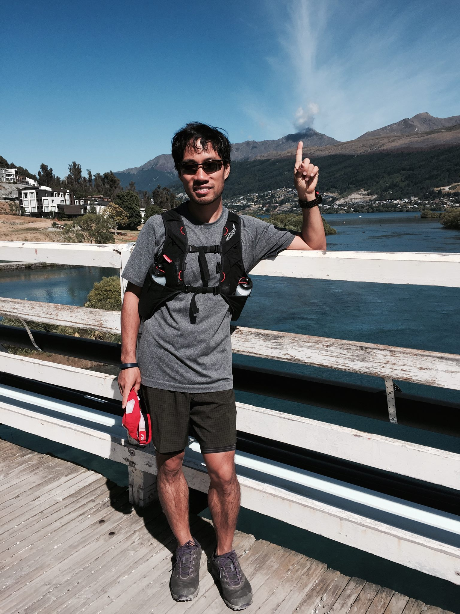
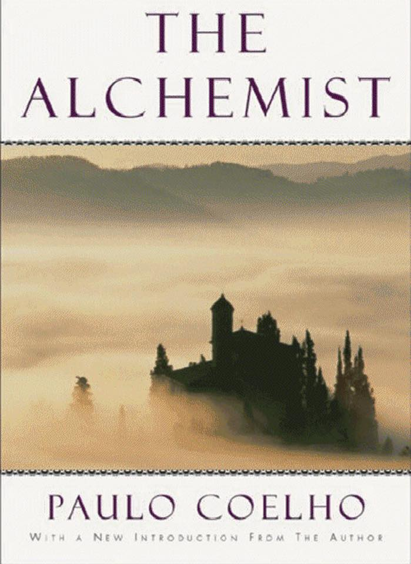
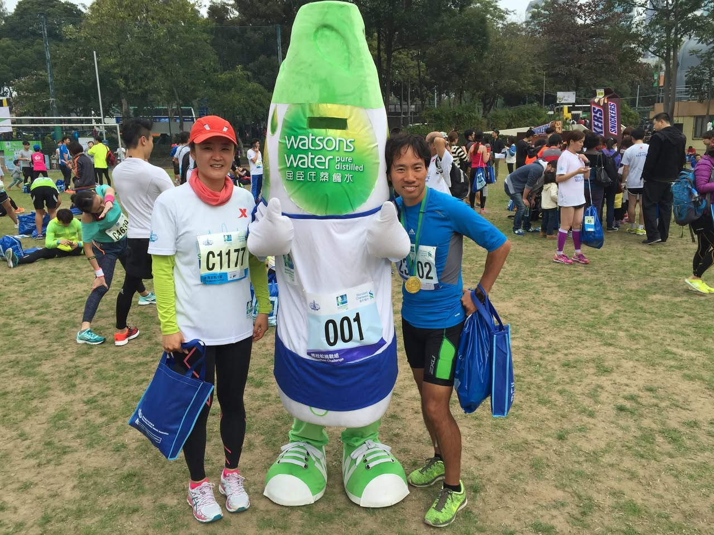
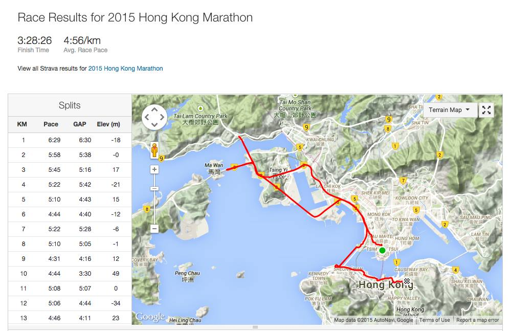

# 2015년 1월

[← 2015년](README.md)

### 1월 6일 (화) 09:08 · Volcano like clouds. Happy new year to a…

📍 New Zealand, Queenstown

Volcano like clouds. Happy new year to all!

### 1월 16일 (금) 12:54 · 4,023 kilometers!

4,023 kilometers!

### 1월 19일 (월) 12:54 · The best book I've read. Highly recommen…

The best book I've read. Highly recommend! "They worked hard just to have food and water, like the sheep." If you don't want to be like them, you can read this book. :-)

### 1월 26일 (월) 09:33 · Yeon Gyoung Gwack finished her first hal…

Yeon Gyoung Gwack finished her first half-marathon in 02:36:51, and I finished mine in 03:28:26 at  Standard Chartered HK Marathon2015! It was a really fun and no-pain run.

 
