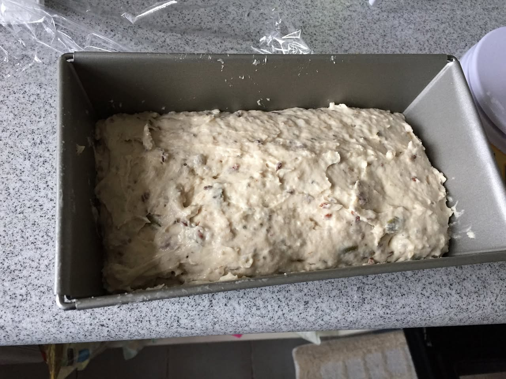
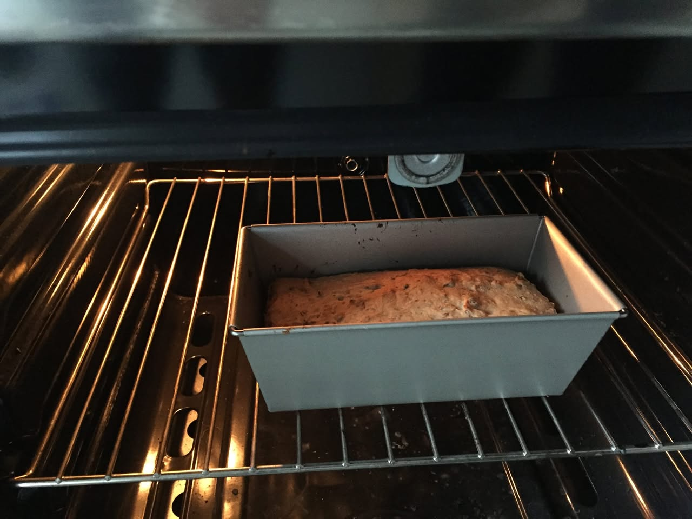
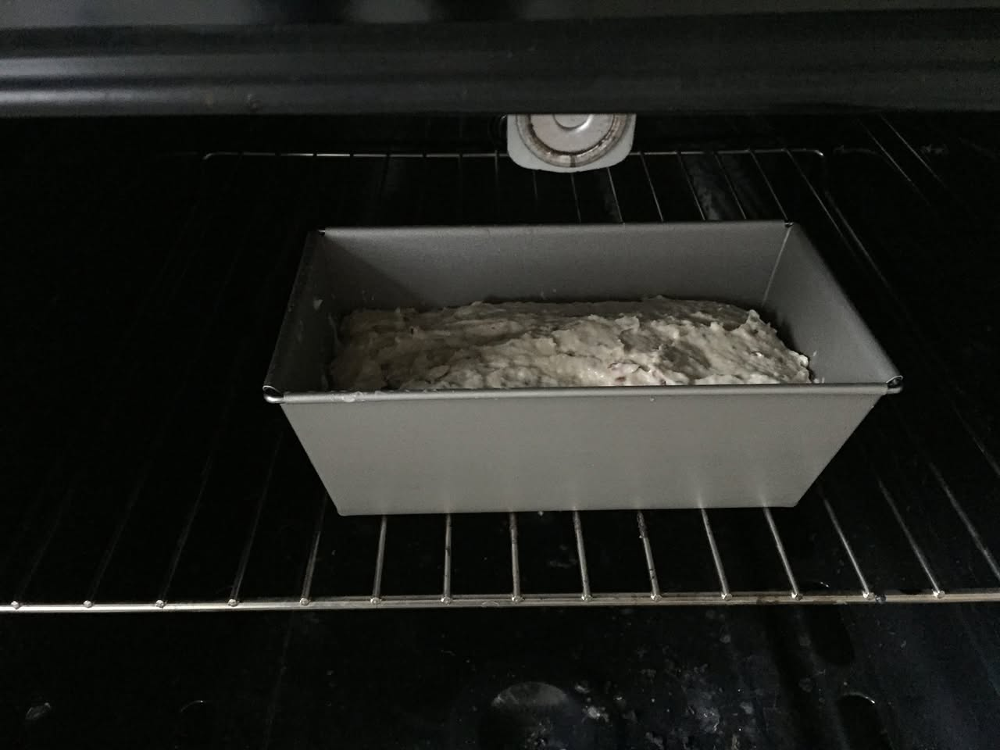
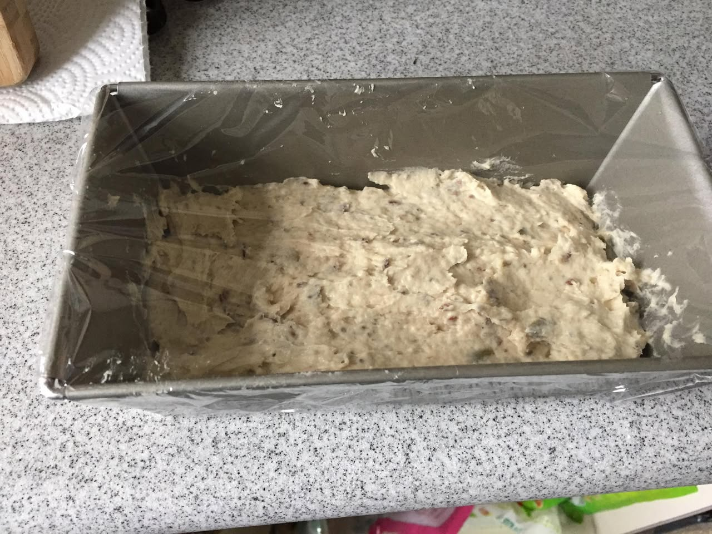
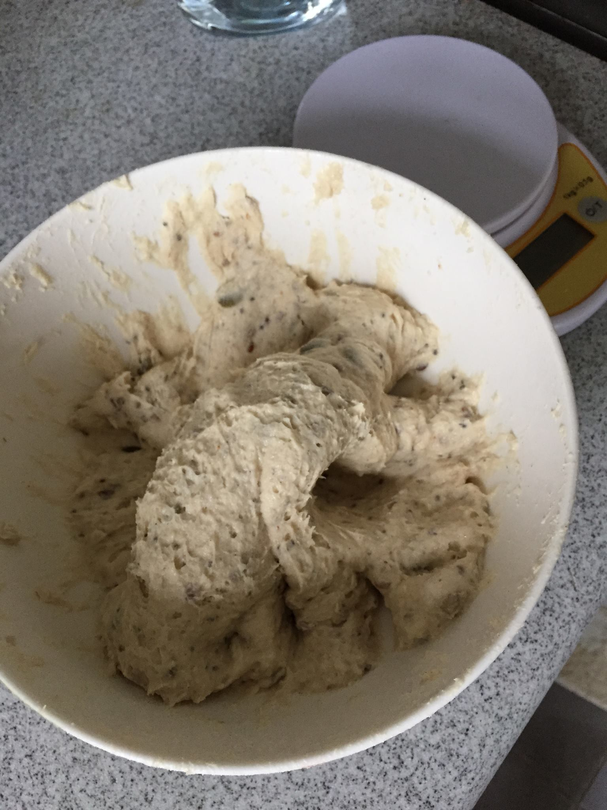
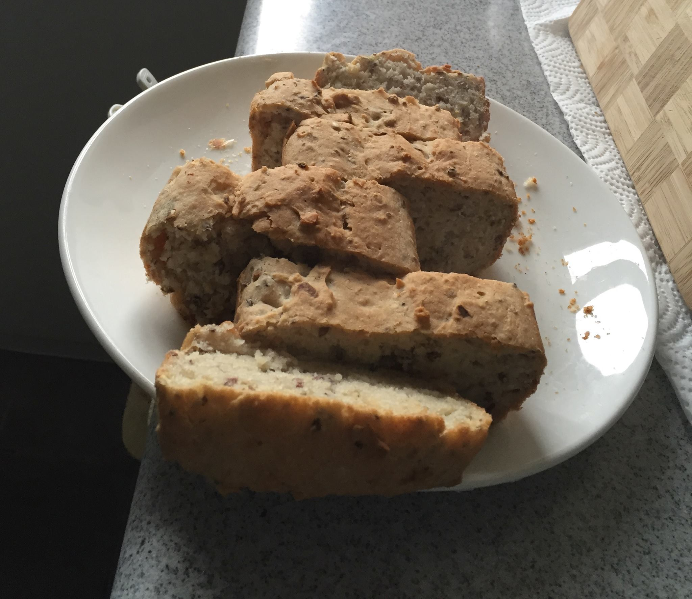
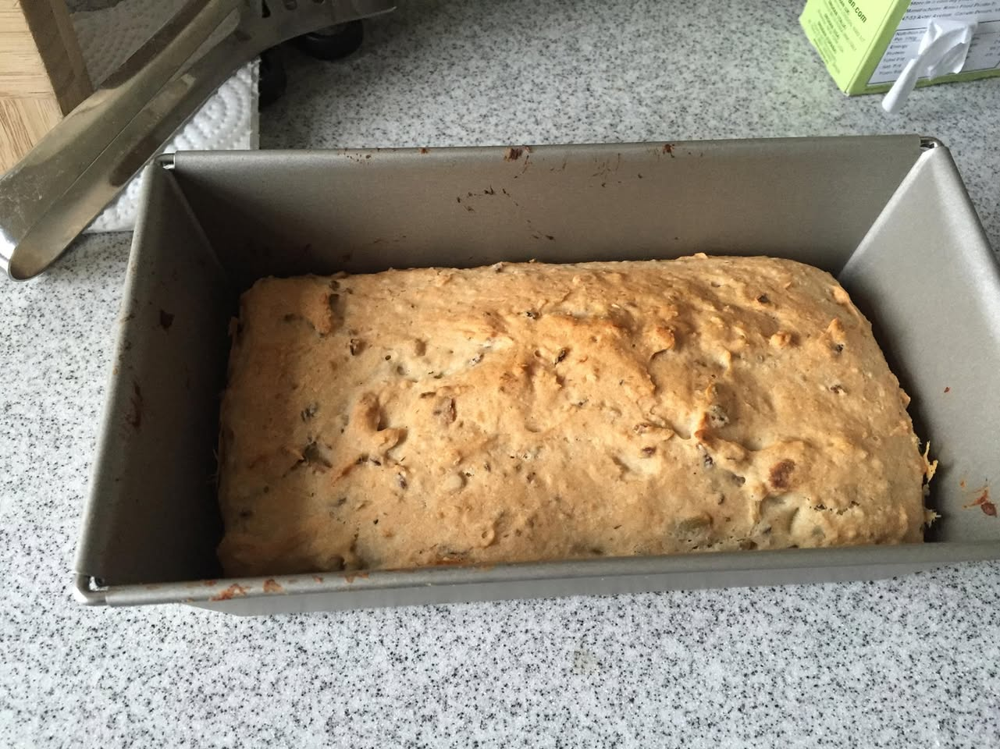
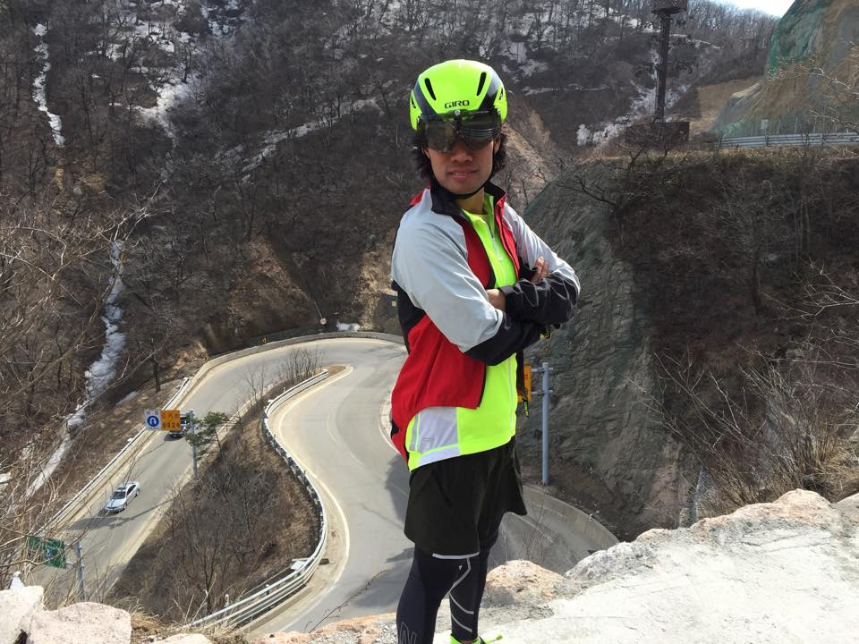
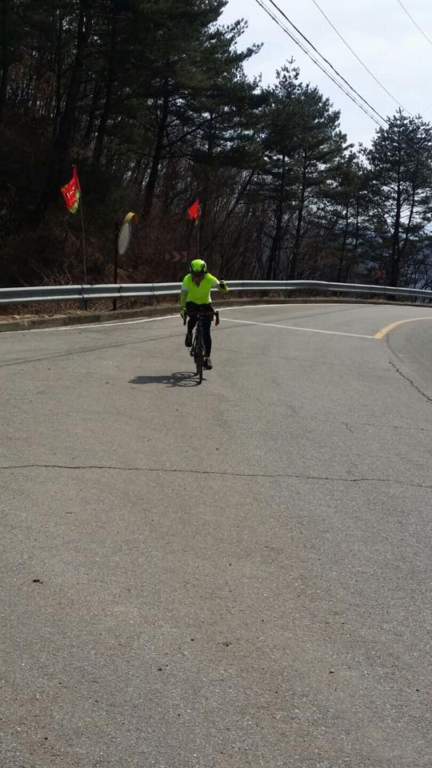
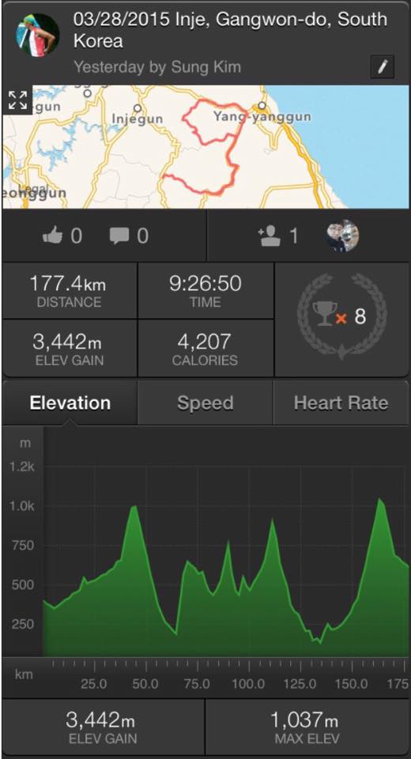

# 2015년 3월

[← 2015년](README.md)

### 3월 14일 (토) 14:05 · Best and first bread ever made by Sung!

Best and first bread ever made by Sung!

**이미지 캡션:** 이 사진은 회색 대리석 무늬의 조리대 위에 놓인 금속 식빵 틀에 담긴 빵 반죽을 클로즈업한 모습입니다. 반죽은 덩어리가 있고, 건포도나 견과류 같은 작은 조각들이 섞여 있습니다. 반죽은 틀의 약 3분의 2를 채우고 있으며, 아직 부풀어 오르지 않은 상태입니다. 사진의 왼쪽 상단에는 투명한 비닐 포장지가 보이고, 오른쪽에는 흰색 디지털 저울의 일부가 보입니다. 조리대 표면은 거칠고 점박이 무늬가 있으며, 전반적으로 가정에서 빵을 굽는 준비 과정의 한 장면을 보여주는 듯한 분위기입니다. 사람이나 텍스트는 보이지 않습니다.않습니다.

### 3월 14일 (토) 14:05 · Best and first bread ever made by Sung!

Best and first bread ever made by Sung!

**이미지 캡션:** 오븐 안에서 빵이 구워지고 있는 모습으로, 빵은 은색 직사각형 틀에 담겨 있으며, 틀 안의 빵은 갈색을 띠고 표면에는 견과류나 씨앗 같은 것이 박혀 있는 것으로 보인다. 오븐 내부의 열선에서 나오는 주황색 불빛이 빵과 오븐 선반을 비추고 있어 따뜻하고 아늑한 분위기를 자아낸다. 오븐 문은 열려 있는 상태이며, 빵이 익어가는 과정을 보여주는 듯하다.

### 3월 14일 (토) 14:05 · Best and first bread ever made by Sung!

Best and first bread ever made by Sung!

**이미지 캡션:** 오븐 안에 금속 틀에 담긴 빵 반죽이 놓여 있습니다. 반죽은 아직 익지 않은 상태이며, 표면에는 덩어리들이 보입니다. 오븐 선반은 금속 재질이며, 오븐 내부의 어두운 배경과 대비를 이룹니다. 오븐 상단에는 열선으로 보이는 장치가 있습니다. 이 사진은 빵을 굽기 시작하는 초기 단계를 보여주며, 가정에서 베이킹을 하는 상황을 묘사합니다.

### 3월 14일 (토) 14:05 · Best and first bread ever made by Sung!

Best and first bread ever made by Sung!

**이미지 캡션:** 이 사진은 회색 점박이 조리대 위에 놓인 금속 로프 팬에 담긴 빵 반죽을 클로즈업한 모습입니다. 반죽은 덩어리가 있고, 건포도나 견과류 같은 작은 조각들이 섞여 있습니다. 팬의 가장자리는 투명한 플라스틱 랩으로 덮여 있으며, 반죽이 팬의 가장자리까지 올라오지 않도록 하는 것으로 보입니다. 사진의 왼쪽 상단에는 흰색 종이 타월이 보이고, 그 뒤로는 나무 조각이 살짝 보입니다. 조리대 표면은 거칠고 점박이 무늬가 있습니다. 사진에는 사람이 보이지 않으며, 텍스트도 보이지 않습니다. 전반적인 분위기는 가정에서 빵을 굽는 준비 과정의 일부를 보여주는 것으로 보이며, 차분하고 일상적인 느낌을 줍니다. 굽는 준비 과정의 일부를 보여주는 것으로 보이며, 차분하고 일상적인 느낌을 줍니다.

### 3월 14일 (토) 14:05 · Best and first bread ever made by Sung!

Best and first bread ever made by Sung!

**이미지 캡션:** 주방 조리대 위에 놓인 흰색 그릇 안에 빵 반죽이 담겨 있으며, 반죽에는 씨앗이나 곡물 조각들이 섞여 있습니다. 그릇 옆에는 흰색 덮개가 있는 디지털 저울이 보이고, 저울에는 "9kg-0.1g"이라는 글자와 "O/T"라는 버튼이 보입니다. 배경에는 흐릿하게 유리잔과 조리대의 대리석 무늬가 보입니다. 이 사진은 빵을 만들거나 재료를 계량하는 과정의 일부로 보이며, 전반적으로 가정 주방의 평범하고 일상적인 분위기를 자아냅니다. 사람의 모습은 보이지 않습니다.

### 3월 14일 (토) 14:05 · Best and first bread ever made by Sung!

Best and first bread ever made by Sung!

**이미지 캡션:** 흰색 접시에 먹음직스럽게 잘린 빵 여러 조각이 놓여 있습니다. 빵은 겉은 노릇하게 구워졌고 속은 하얗고 부드러워 보이며, 빵 반죽 안에 씨앗이나 견과류 같은 것이 박혀 있는 듯합니다. 접시는 주방 조리대 위에 놓여 있으며, 조리대는 회색 바탕에 작은 점들이 박힌 무늬를 하고 있습니다. 접시 옆으로는 하얀색 키친타월과 나무 도마가 보입니다. 전체적으로 따뜻하고 가정적인 분위기를 자아냅니다. the closest slice in the foreground showing a clear cross-section of the bread's texture. The plate is placed on a speckled gray countertop. To the right of the plate, a white paper towel is visible, and partially on the paper towel is a wooden cutting board with a checkered pattern. The background on the left is dark and out of focus, suggesting an indoor setting, possibly a kitchen. There are no people visible in the image. The lighting suggests a natural light source coming from the right, casting soft shadows. The overall atmosphere is domestic and suggests a recently baked item ready to be served or eaten.

### 3월 14일 (토) 14:05 · Best and first bread ever made by Sung!

Best and first bread ever made by Sung!

**이미지 캡션:** 주방 조리대 위에 놓인 금속 로프 팬에 담긴 갓 구운 통곡물 빵이 보인다. 빵은 황금빛 갈색을 띠고 있으며, 표면에는 견과류나 씨앗 같은 재료들이 박혀 있어 거친 질감을 가지고 있다. 팬의 가장자리는 약간 그을린 흔적이 보이며, 빵은 팬의 크기에 맞춰 부풀어 올라 있다. 배경에는 회색 점박이 무늬의 조리대와 함께, 빵을 집을 때 사용하는 것으로 보이는 은색 집게와 흰색 키친타월이 보인다. 또한, 오른쪽 상단에는 녹색 상자가 희미하게 보이며, 상자에는 영어로 된 글자가 인쇄되어 있다. 전반적으로 따뜻하고 가정적인 분위기를 자아내며, 갓 구운 빵에서 풍기는 맛있는 냄새가 느껴지는 듯하다.인 분위기를 자아내며, 갓 구운 빵에서 풍기는 맛있는 냄새가 느껴지는 듯하다.

### 3월 17일 (화) 20:30 · Beautiful!

Beautiful!

### 3월 29일 (일) 12:23 · was completely exhausted after 10 hours …

was completely exhausted after 10 hours 177km with 3500m+ climb bike riding at Mt. Sorak. I don't want ride here again anytime soon.

**이미지 캡션:** 한 성인 남성이 산악 도로 위 절벽에 서서 팔짱을 끼고 카메라를 응시하고 있다. 그는 형광 연두색 상의 위에 빨간색 조끼를 입고 있으며, 회색 재킷을 걸치고 있다. 머리에는 노란색 헬멧을 쓰고 있으며, 선글라스를 착용하고 있다. 그의 하의는 검은색 반바지와 검은색 타이츠이며, 발에는 운동화를 신고 있다. 배경에는 구불구불한 산악 도로가 보이며, 도로 위에는 차량 두 대가 지나가고 있다. 도로 주변으로는 나무들이 앙상하게 서 있고, 산비탈에는 눈이 녹은 흔적이 보인다. 하늘은 맑고 햇볕이 비추고 있어 야외 활동하기 좋은 날씨임을 알 수 있다. 전반적으로 활동적이고 건강한 분위기를 풍긴다.하기 좋은 날씨임을 알 수 있다. 전반적으로 활동적이고 건강한 분위기를 풍긴다.
 
**이미지 캡션:** 한 명의 성인 남성이 헬멧과 형광색 상의를 착용하고 자전거를 타고 도로를 주행하고 있다. 남성은 30대에서 40대로 보이며, 밝은 형광색 헬멧과 상의를 입고 검은색 바지를 착용하고 있다. 그는 자전거 핸들을 잡고 있으며, 오른손을 살짝 들어 올린 모습으로, 표정은 명확하게 보이지 않지만 활동적인 모습이다. 배경은 산악 도로로, 아스팔트 도로와 굽은 커브길이 보인다. 도로 옆에는 금속 가드레일과 함께 숲이 우거진 산이 펼쳐져 있으며, 나무들은 대부분 침엽수로 보인다. 도로에는 두 개의 깃발이 꽂혀 있는데, 하나는 빨간색 바탕에 노란색 문양이 있고 다른 하나는 빨간색이다. 또한, 도로 표지판으로 보이는 것이 두 개 있으며, 하나는 원형 거울이고 다른 하나는 화살표 모양의 표지판이다. 하늘은 맑고 약간 흐린 날씨로, 전반적으로 야외 활동이나 스포츠를 즐기는 듯한 분위기이다.는 빨간색 바탕에 노란색 문양이 있고 다른 하나는 빨간색이다. 또한, 도로 표지판으로 보이는 것이 두 개 있으며, 하나는 원형 거울이고 다른 하나는 화살표 모양의 표지판이다. 하늘은 맑고 약간 흐린 날씨로, 전반적으로 야외 활동이나 스포츠를 즐기는 듯한 분위기이다.
 
**이미지 캡션:** 이 사진은 2015년 3월 28일 대한민국 강원도 인제에서 있었던 활동 기록을 보여주는 스크린샷입니다. 상단에는 활동 날짜와 장소, 그리고 "Sung Kim"이라는 이름으로 어제 기록되었음을 알리는 텍스트가 있습니다. 그 아래에는 인제 지역의 지도가 표시되어 있으며, 붉은색 선으로 활동 경로가 표시되어 있습니다. 지도 위에는 "gun", "Inje gun", "Injejun", "Yang-yanggun"과 같은 지명이 보입니다. 지도 아래에는 좋아요 0개, 댓글 0개, 그리고 팔로워 1명과 함께 두 명의 사람 얼굴이 있는 아이콘이 보입니다. 중앙에는 활동 거리 177.4km, 시간 9시간 26분 50초, 고도 상승 3,442m, 소모 칼로리 4,207, 그리고 8개의 트로피 아이콘이 표시되어 있습니다. 하단에는 고도 그래프가 있는데, 세로축은 미터(m) 단위로 0부터 1.2k까지 표시되어 있고, 가로축은 킬로미터(km) 단위로 0부터 175까지 표시되어 있습니다. 그래프는 녹색으로 표시되어 있으며, 여러 개의 봉우리와 계곡을 가진 산악 지형을 나타냅니다. 그래프 아래에는 총 고도 상승 3,442m와 최대 고도 1,037m가 표시되어 있습니다. 전반적으로 활동적인 야외 활동, 아마도 사이클링이나 등산의 기록을 보여주는 화면입니다. 얼굴이 있는 아이콘이 보입니다. 중앙에는 활동 거리 177.4km, 시간 9시간 26분 50초, 고도 상승 3,442m, 소모 칼로리 4,207, 그리고 8개의 트로피 아이콘이 표시되어 있습니다. 하단에는 고도 그래프가 있는데, 세로축은 미터(m) 단위로 0부터 1.2k까지 표시되어 있고, 가로축은 킬로미터(km) 단위로 0부터 175까지 표시되어 있습니다. 그래프는 녹색으로 표시되어 있으며, 여러 개의 봉우리와 계곡을 가진 산악 지형을 나타냅니다. 그래프 아래에는 총 고도 상승 3,442m와 최대 고도 1,037m가 표시되어 있습니다. 전반적으로 활동적인 야외 활동, 아마도 사이클링이나 등산의 기록을 보여주는 화면입니다.
