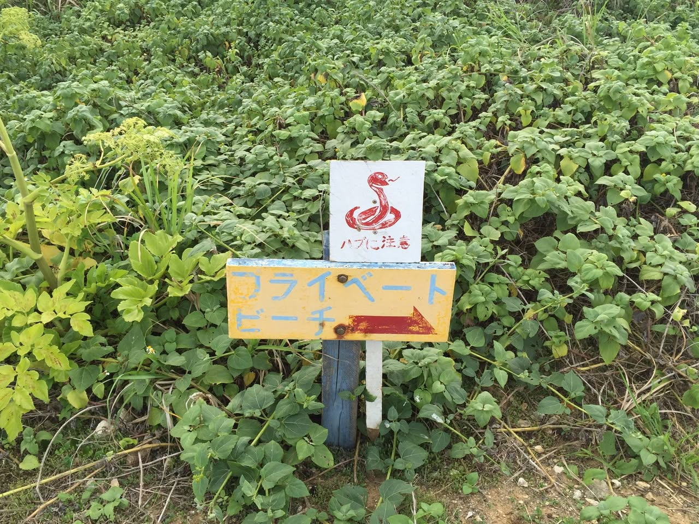

# 2015년 4월

[← 2015년](README.md)

### 4월 6일 (월) 16:26 · Not easy to get to beach. :-)

Not easy to get to beach. :-)

**이미지 캡션:** 이 사진은 울창한 녹색 식물로 뒤덮인 야외 장소를 보여줍니다. 중앙에는 두 개의 표지판이 파란색 기둥에 나란히 세워져 있습니다. 위쪽 표지판은 흰색이며 붉은색으로 그려진 뱀 그림과 함께 일본어로 "하부에 주의"라고 적혀 있습니다. 아래쪽 표지판은 노란색이며 파란색 글씨로 "프라이빗 비치"라고 쓰여 있고 오른쪽을 가리키는 붉은색 화살표가 있습니다. 사진에는 사람이 보이지 않으며, 배경은 자연 그대로의 모습으로 야생 식물들이 무성하게 자라고 있습니다. 전반적으로 표지판은 경고와 방향을 알리는 역할을 하며, 주변 환경은 다소 거칠고 자연적인 느낌을 줍니다.
