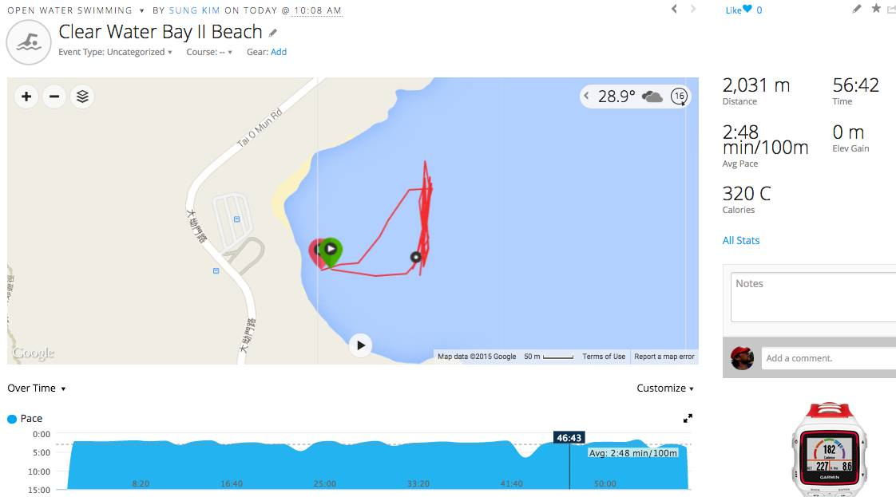
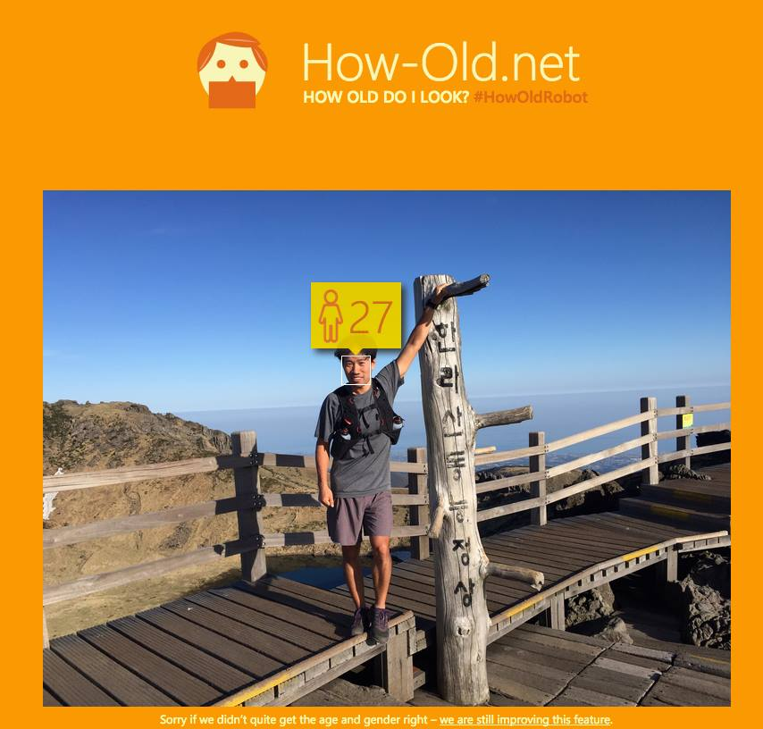
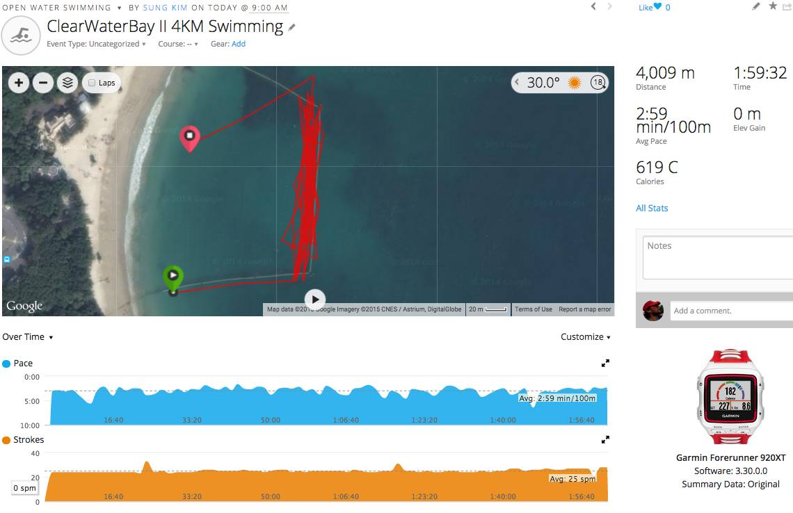
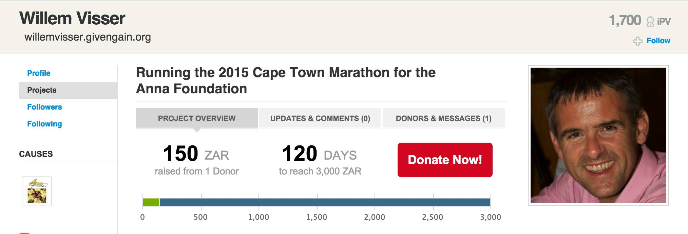
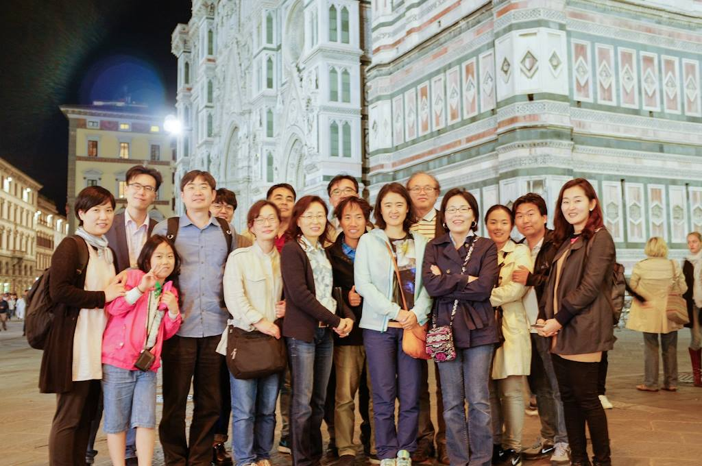
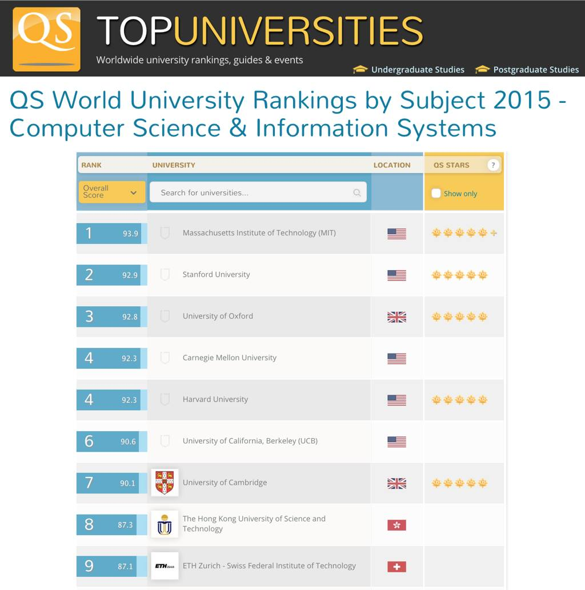
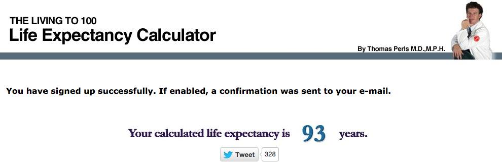

# 2015년 5월

[← 2015년](README.md)

### 5월 1일 (금) 15:42 · can finish 2KM ocean swimming in one hou…

can finish 2KM ocean swimming in one hour, and is getting ready for his first (half) Ironman race this summer (1.9KM swimming cut off time is 1 hour 10 min). Next? 4KM swimming within 2 hours!

### 5월 1일 (금) 16:13 · How they know my real age? Amazing techn…

How they know my real age? Amazing technology!! #HowOldRobot

### 5월 6일 (수) 08:21 · I'll be visiting Jeju University in Kore…

I'll be visiting Jeju University in Korea from June 10 for a few weeks. Please ping me if you plan to visit the beautiful Jeju Island this summer.

http://english.jeju.go.kr/?sso=ok

### 5월 8일 (금) 18:55 · Sung Kim shared a link.

🔗 <http://research.microsoft.com/en-us/events/chese2015/>

### 5월 11일 (월) 13:25 · Finally 4KM (2.49 miles) ocean swimming …

Finally 4KM (2.49 miles) ocean swimming within 2 hours! It's slow, but good enough for the full IRONMAN Swimming (3.9km within 2 hour 20min).

### 5월 20일 (수) 15:47 · Emerson Murphy-Hill and I did our best t…

Emerson Murphy-Hill and I did our best to have wonderful demos in ICSE 2015. Please stop by our demo sessions from 14:00-15:30 at PA-F1b today, tomorrow, and Friday. Also, you can check out amazing demo videos now at http://2015.icse-conferences.org/program/demo-video. See you all! #icse2015

### 5월 20일 (수) 17:12 · Yida wonderfully presented her first MSR…

Yida wonderfully presented her first MSR paper in Florence! #msr 2015 Mining Software Repositories

🔗 <http://www.slideshare.net/hunkim/msr15-slide-1>

### 5월 20일 (수) 18:20 · Emerson Murphy-Hill is tenured in 4 year…

Emerson Murphy-Hill is tenured in 4 years! Amazing!! Big Congratulations!!! 

(He already told us in April. Hint: see the tag in his picture.)

### 5월 21일 (목) 04:14 · Got it!

Got it!

🎬 동영상 1개 (생략)

### 5월 23일 (토) 14:13 · Willem Visser is running to support the …

Willem Visser is running to support the children in farming communities!

"I run a lot, but have never done it for anybody but myself, this is my attempt at running for the greater good for a change. I would also not just do it for any charity, but am very happy to raise funds for the Anna Foundation since supporting the children in farming communities is an extremely worthy cause."

Could you please support his charity running? You can find more information at http://www.givengain.com/activist/139189/projects/10501/.

### 5월 24일 (일) 17:25 · Good to see many Korean SE researchers a…

Good to see many Korean SE researchers at ICSE 2015, Florence!

### 5월 25일 (월) 03:55 · Our department (CS at HKUST) ranked top …

Our department (CS at HKUST) ranked top 8 in the world according to the QS World University Rankings by Subject 2015, http://www.topuniversities.com/university-rankings/university-subject-rankings/2015/computer-science-information-systems

### 5월 25일 (월) 15:55 · It was really fun!

It was really fun!

### 5월 27일 (수) 19:04 · See you all in Italy again!

See you all in Italy again!

### 5월 29일 (금) 08:29 · Sung's life expectancy is 93 years. Not …

Sung's life expectancy is 93 years. Not bad.

https://livingto100.com/calculator

