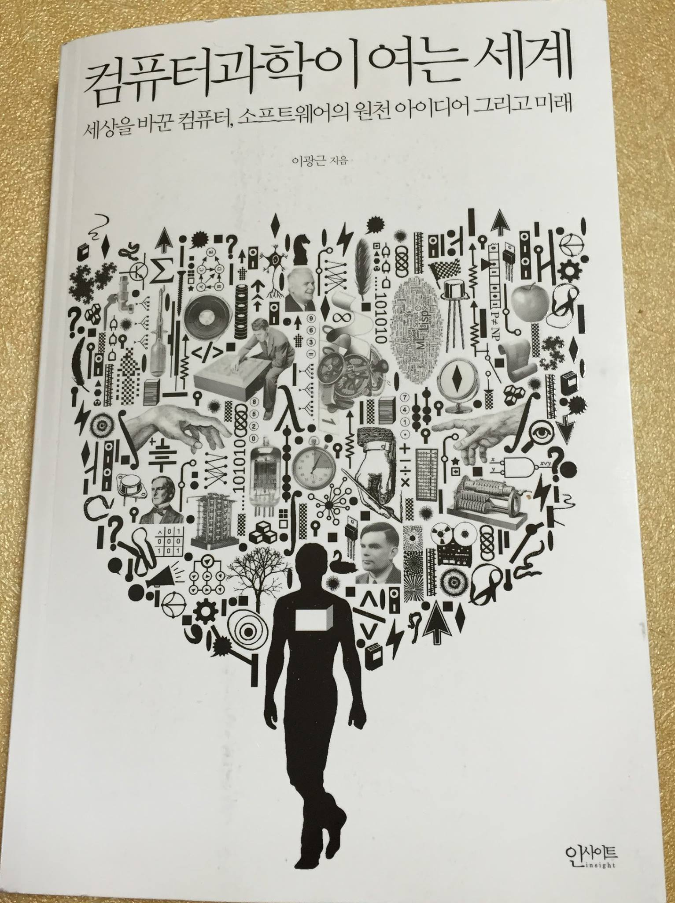
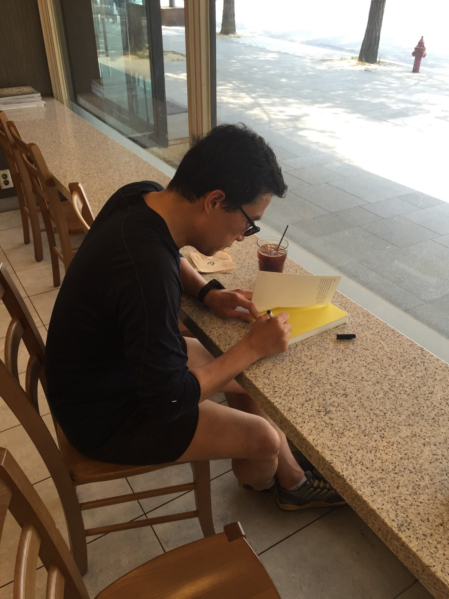
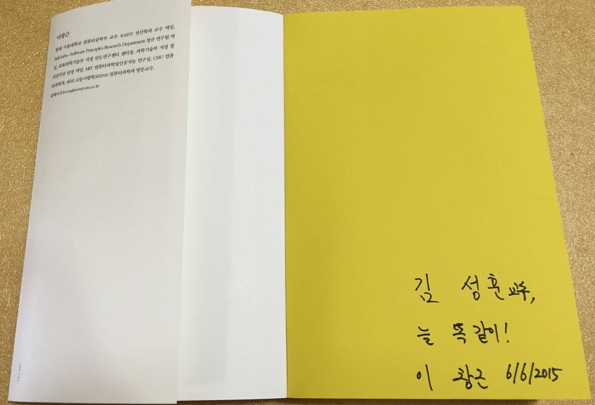
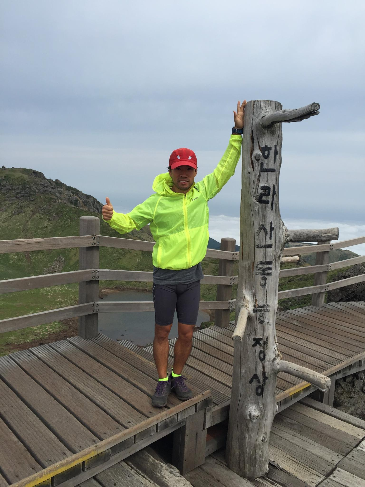
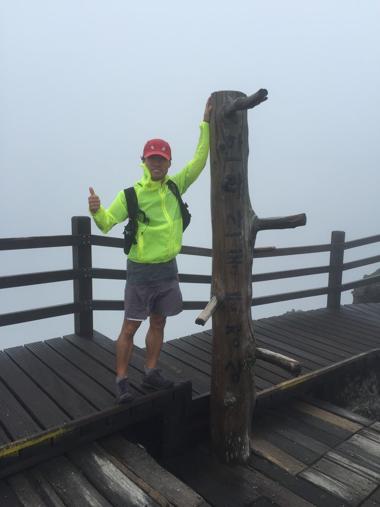
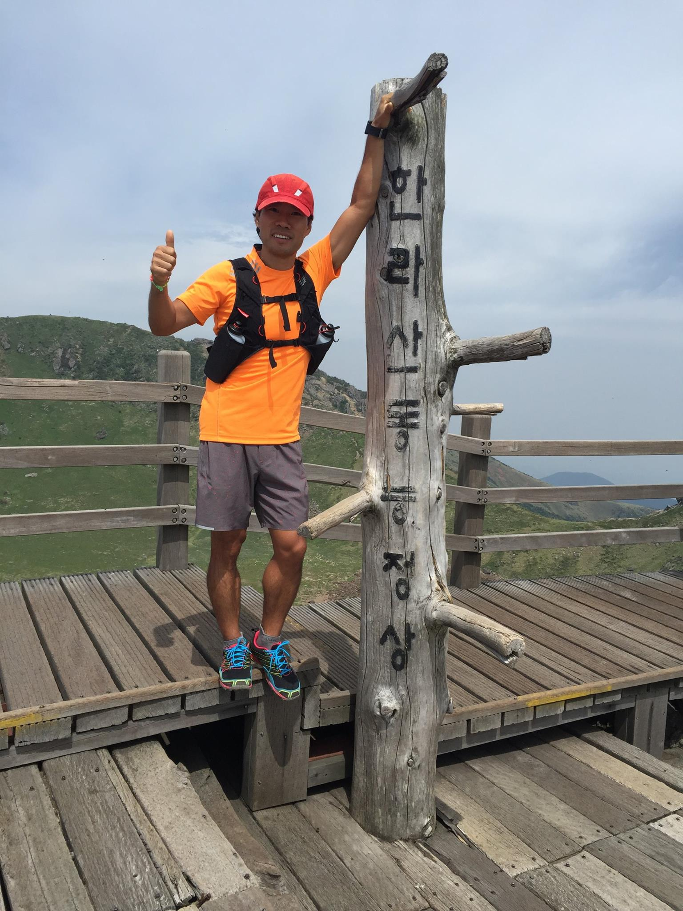
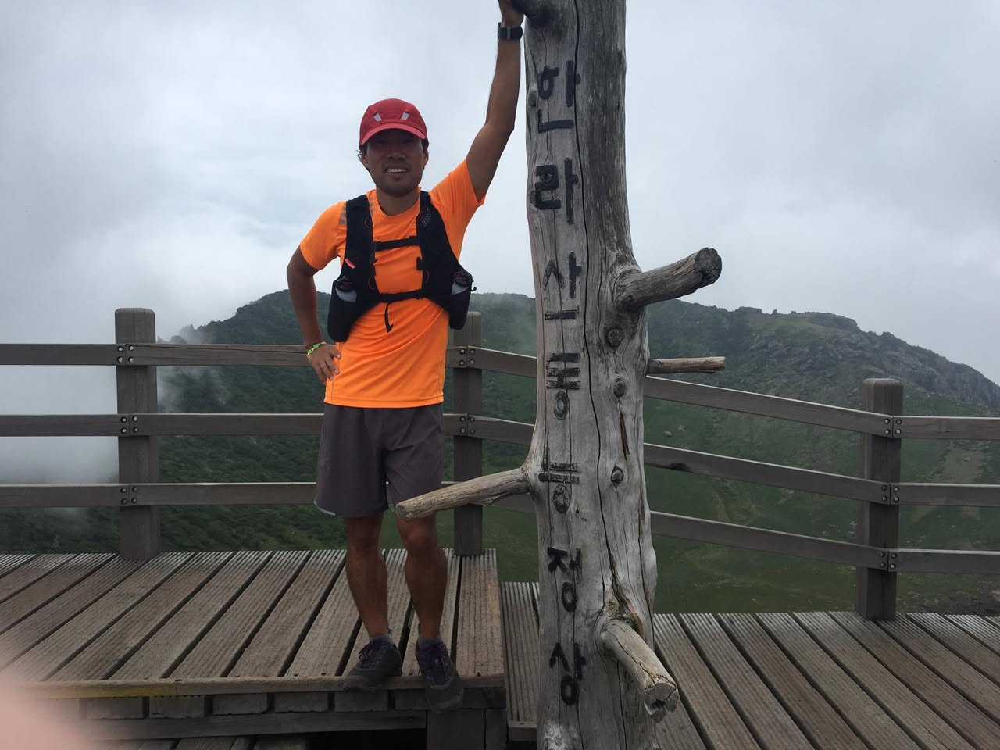
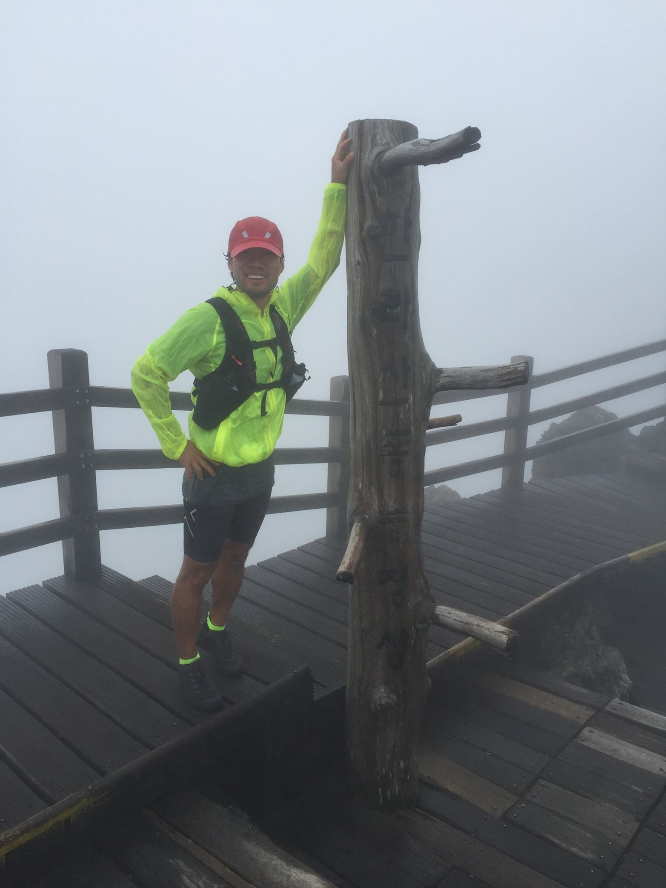
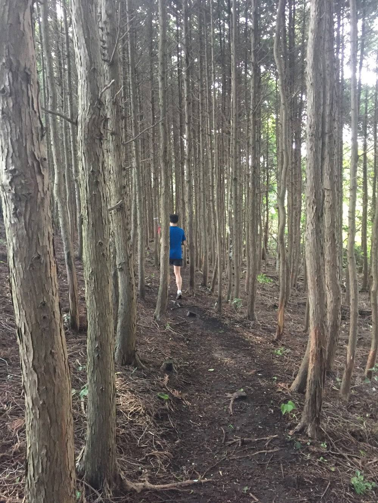

# 2015년 6월

[← 2015년](README.md)

### 6월 7일 (일) 19:35 · A Must-Read book written by Prof. Yi Kwa…

A Must-Read book written by Prof. Yi Kwangkeun! It's always good to get an author's autograph. 

http://www.insightbook.co.kr/post/9074

  

### 6월 17일 (수) 15:59 · Sung Kim shared a link.

🔗 <https://www.youtube.com/watch?v=h1TGJJ-F-fE>

### 6월 18일 (목) 16:43 · At Mt. Halla (1950m, the highest mountai…

At Mt. Halla (1950m, the highest mountain in South Korea) 5 times in 10 days in Jeju!

    

### 6월 22일 (월) 18:52 · Happy father's day!

Happy father's day!

### 6월 27일 (토) 11:27 · This is where I'm running, thinking, and…

📍 Jeju Island

This is where I'm running, thinking, and talking!

